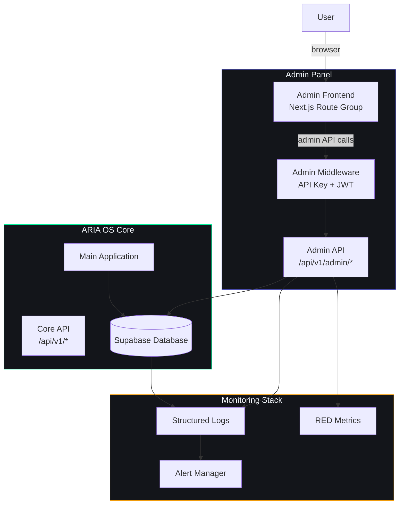
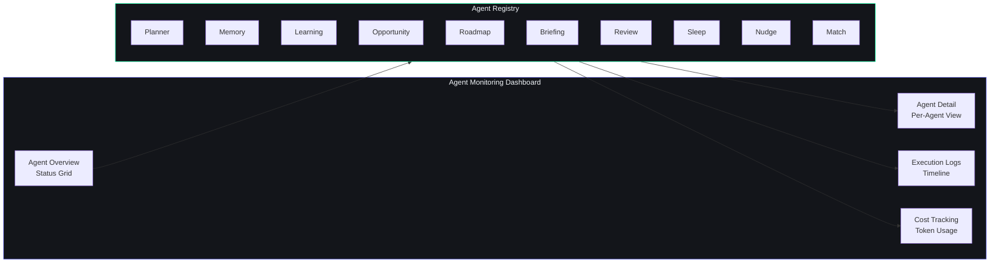

# ARIA OS Admin Panel

## Document Control

| Field | Value |
|---|---|
| Document ID | ADM-INDEX-001 |
| Version | 1.0.0 |
| Status | Active |
| Last Updated | 2026-07-14 |
| Classification | Internal - Operations |
| Target Audience | System Administrators, Developers |
| Review Cycle | Monthly |
| Related Docs | [Architecture](../engineering/12_Architecture.md), [Security](../security/24_Security.md), [Monitoring](../operations/39_Runbooks.md), [Feature Flags](../engineering/feature-flags.md) |

---

## Table of Contents

1. [Overview](#overview)
2. [Architecture](#architecture)
3. [Features](#features)
4. [API Endpoints](#api-endpoints)
5. [Security Considerations](#security-considerations)
6. [Deployment](#deployment)
7. [User Interface](#user-interface)
8. [Configuration Reference](#configuration-reference)
9. [Common Tasks](#common-tasks)
10. [Related Documents](#related-documents)

---

## Overview

The ARIA OS Admin Panel is a secure, restricted-access web interface for system administration and operational management of the Second Brain OS platform. It provides tools for user management, system configuration, AI agent monitoring, analytics, feature flag management, and audit log review. The admin panel is designed for the system operator (Developer) and does not expose end-user data beyond what is necessary for administration.

**Key design principles:**
- **Least privilege access**: Admin panel is separate from the main application and requires elevated authentication.
- **Read-only by default**: All mutation operations require explicit confirmation.
- **Audit trail**: Every admin action is logged with timestamp, actor, and before/after state.
- **Defense in depth**: Admin access requires both authentication and a separate admin API key.

## Architecture



### Connection to Main System

The admin panel operates as a separate route group within the same Next.js application (`app/(admin)/`), isolated from the main `app/(dashboard)/` route group. The admin API runs alongside the core API on FastAPI but requires an additional `X-Admin-Key` header for authentication.

**Separation boundaries:**
- Admin routes are not accessible from the main dashboard UI.
- Admin API requires both a valid JWT (admin user) and a server-side admin API key.
- Admin frontend components are in `components/admin/` and not imported by any non-admin module.
- Admin database queries use `service_role` key (server-side only) rather than the anon key.

## Features

### User Management

View, search, and manage all registered users.

| Capability | Description | Access Level |
|---|---|---|
| List users | Paginated list of all registered users | Read |
| View user details | Profile, preferences, usage stats | Read |
| Suspend user | Temporarily disable user access | Write (confirmed) |
| Delete user | GDPR-compliant full data deletion | Write (confirmed + backup) |
| Impersonate | Temporarily view the platform as a user (read-only) | Write (audited) |
| Export user data | Download a user's complete data archive | Read |

**User table columns displayed:**
- User ID, Email, Display Name, Created At, Last Active, Account Status, Auth Provider
- Total metrics: Task count, Habit streaks, Courses enrolled, Storage used

### System Configuration

Manage environment-level settings and system preferences.

| Setting | Type | Description |
|---|---|---|
| `ALLOW_REGISTRATION` | boolean | Toggle new user registration |
| `MAINTENANCE_MODE` | boolean | Enable maintenance mode (blocks non-admin access) |
| `DEFAULT_AI_PROVIDER` | string | Default AI provider (ollama, claude) |
| `RATE_LIMIT_MAX` | integer | Global rate limit per IP per window |
| `RATE_LIMIT_WINDOW` | integer | Rate limit window in seconds |
| `SESSION_TIMEOUT_MINUTES` | integer | Maximum session duration |
| `MAX_UPLOAD_SIZE_MB` | integer | Maximum file upload size |
| `LOG_RETENTION_DAYS` | integer | Log retention period |

### AI Agent Monitoring

Monitor the status and performance of all 17 AI agents.



**Monitoring metrics per agent:**
| Metric | Description |
|---|---|
| Status | Idle, Running, Error, Disabled |
| Last Run | Timestamp of last execution |
| Success Rate | Percentage of successful runs in last 24h |
| Avg Duration | Average execution time |
| Token Usage | Tokens consumed (input / output) |
| Error Count | Number of failures in current window |
| Circuit Breaker | State (Closed, Open, Half-Open) |

### Analytics

High-level platform analytics for operational insights.

| Dashboard | Metrics | Refresh |
|---|---|---|
| User Growth | New users/day, Active users (DAU/WAU/MAU) | Daily |
| Usage Analytics | API call volume, Top modules, Feature adoption | Real-time |
| Performance | API latency (p50/p95/p99), Error rate, Uptime | Real-time |
| AI Cost | Token consumption per agent, Provider breakdown, Estimated cost | Per request |

### Feature Flags

Manage feature flags to control feature rollout and A/B testing.

| Operation | Description |
|---|---|
| List flags | View all feature flags with current state |
| Toggle flag | Enable/disable a feature flag globally |
| Percentage rollout | Gradually enable for a percentage of users |
| User targeting | Enable for specific user IDs or segments |
| Flag audit | View change history for each flag |

### Audit Log Viewer

Browse and search the complete audit trail of system actions.

| Filter | Options |
|---|---|
| Action Type | create, update, delete, admin_action, auth_event |
| Time Range | Last hour, 24h, 7d, 30d, custom range |
| User | Search by user ID or email |
| Severity | info, warning, error, critical |
| Module | All 16 modules, admin, auth, system |

**Audit log entry schema:**
```json
{
  "id": "uuid",
  "timestamp": "2026-07-14T12:00:00Z",
  "actor_id": "user-uuid",
  "actor_type": "user | system | plugin",
  "action": "tasks.update",
  "resource_type": "task",
  "resource_id": "task-uuid",
  "before": { "status": "pending" },
  "after": { "status": "completed" },
  "metadata": { "ip": "192.168.1.1", "user_agent": "..." },
  "severity": "info"
}
```

## API Endpoints

All admin endpoints are under `/api/v1/admin/` and require both JWT authentication (admin user) and `X-Admin-Key` header.

### User Management

| Method | Endpoint | Description |
|---|---|---|
| GET | `/api/v1/admin/users` | List all users (paginated) |
| GET | `/api/v1/admin/users/{id}` | Get user details |
| GET | `/api/v1/admin/users/{id}/export` | Export user data (GDPR) |
| POST | `/api/v1/admin/users/{id}/suspend` | Suspend user |
| POST | `/api/v1/admin/users/{id}/unsuspend` | Unsuspend user |
| DELETE | `/api/v1/admin/users/{id}` | Delete user and all data |
| POST | `/api/v1/admin/users/{id}/impersonate` | Generate impersonation token |

### System Configuration

| Method | Endpoint | Description |
|---|---|---|
| GET | `/api/v1/admin/config` | Get all system configuration |
| PUT | `/api/v1/admin/config` | Update system configuration |
| GET | `/api/v1/admin/config/{key}` | Get single configuration value |
| PUT | `/api/v1/admin/config/{key}` | Update single configuration value |

### AI Agent Monitoring

| Method | Endpoint | Description |
|---|---|---|
| GET | `/api/v1/admin/agents` | List all agents with status |
| GET | `/api/v1/admin/agents/{id}` | Get agent detail and metrics |
| GET | `/api/v1/admin/agents/{id}/logs` | Get agent execution logs |
| POST | `/api/v1/admin/agents/{id}/reset` | Reset circuit breaker / error state |
| POST | `/api/v1/admin/agents/{id}/trigger` | Manually trigger agent execution |
| PUT | `/api/v1/admin/agents/{id}/config` | Update agent configuration |

### Analytics

| Method | Endpoint | Description |
|---|---|---|
| GET | `/api/v1/admin/analytics/overview` | Platform overview metrics |
| GET | `/api/v1/admin/analytics/users` | User growth and activity metrics |
| GET | `/api/v1/admin/analytics/performance` | API performance metrics |
| GET | `/api/v1/admin/analytics/ai-cost` | AI cost breakdown |

### Feature Flags

| Method | Endpoint | Description |
|---|---|---|
| GET | `/api/v1/admin/feature-flags` | List all feature flags |
| GET | `/api/v1/admin/feature-flags/{id}` | Get flag detail |
| POST | `/api/v1/admin/feature-flags` | Create new feature flag |
| PUT | `/api/v1/admin/feature-flags/{id}` | Update feature flag config |
| DELETE | `/api/v1/admin/feature-flags/{id}` | Delete feature flag |

### Audit Log

| Method | Endpoint | Description |
|---|---|---|
| GET | `/api/v1/admin/audit-log` | Query audit log entries |
| GET | `/api/v1/admin/audit-log/{id}` | Get single audit entry |
| GET | `/api/v1/admin/audit-log/stats` | Audit log statistics |
| POST | `/api/v1/admin/audit-log/export` | Export audit log range |

## Security Considerations

### Authentication

Admin access is protected by a two-factor authentication mechanism:

1. **User-level authentication**: The admin user must have a valid Supabase JWT session with the `admin` role claim.
2. **API-level authentication**: Every admin API request must include the `X-Admin-Key` header with a value matching the `ADMIN_API_KEY` environment variable.

```python
# Admin middleware authentication flow
async def verify_admin_access(
    request: Request,
    user: User = Depends(get_current_user)
):
    # 1. Verify user has admin role
    if user.role != 'admin':
        raise HTTPException(status_code=403, detail="Admin access required")
    
    # 2. Verify admin API key
    admin_key = request.headers.get('X-Admin-Key')
    if admin_key != settings.ADMIN_API_KEY:
        raise HTTPException(status_code=403, detail="Invalid admin key")
    
    # 3. Log access for audit
    await audit_logger.log_admin_access(
        user_id=user.id,
        action=request.method,
        path=request.url.path
    )
    
    return user
```

### Access Control

| Security Layer | Implementation |
|---|---|
| Role-based access | `users.role` must be `admin` |
| API key authentication | `X-Admin-Key` header with server-side secret |
| IP allowlisting | Optional: restrict admin access to specific IPs |
| Session timeout | Admin sessions expire after 15 minutes of inactivity |
| Concurrent session limit | Max 3 concurrent admin sessions |
| Audit logging | Every admin action logged with before/after state |

### Data Protection

| Concern | Implementation |
|---|---|
| Data in transit | TLS 1.3 for all admin API calls |
| Data at rest | AES-256 encryption (Supabase managed) |
| PII exposure | Admin UI never shows raw passwords or tokens |
| Export encryption | User data exports are encrypted with user's public key |
| Session data | Admin sessions stored in HttpOnly, Secure, SameSite cookies |

### Administrative Access Procedures

1. **Emergency access**: If admin access is required during an incident, use the emergency admin key stored in the password manager.
2. **Key rotation**: Admin API keys rotate every 90 days or immediately after a suspected compromise.
3. **Access revocation**: Admin access can be revoked by setting the user's `role` to `user` via database direct access.
4. **Session audit**: All admin sessions are logged and reviewed weekly.

## Deployment

### Admin Panel Deployment

The admin panel is deployed as part of the main ARIA OS application, enabled or disabled via the `ENABLE_ADMIN_PANEL` environment variable.

```bash
# Enable admin panel
ENABLE_ADMIN_PANEL=true
ADMIN_API_KEY=your-admin-api-key-here
```

### Environment Variables

| Variable | Required | Default | Description |
|---|---|---|---|
| `ENABLE_ADMIN_PANEL` | No | `false` | Enable the admin panel routes and UI |
| `ADMIN_API_KEY` | Yes (if enabled) | -- | API key for admin API authentication |
| `ADMIN_ALLOWED_IPS` | No | `*` | Comma-separated list of allowed IPs |
| `ADMIN_SESSION_TIMEOUT` | No | `15` | Admin session timeout in minutes |
| `ADMIN_LOG_RETENTION` | No | `90` | Audit log retention in days |

### Production Checklist

- [ ] `ENABLE_ADMIN_PANEL` set to `false` on production until needed
- [ ] `ADMIN_API_KEY` is a strong random string (min 32 chars)
- [ ] `ADMIN_ALLOWED_IPS` restricted to developer's VPN IP
- [ ] Admin panel is NOT exposed to the public internet without VPN
- [ ] Admin user account has a separate, strong password
- [ ] Monitoring alerts configured for admin access anomalies
- [ ] Audit log retention policy configured

## User Interface

The admin panel UI is located at `/admin` and contains the following sections:

| Route | Section | Description |
|---|---|---|
| `/admin` | Dashboard | System overview with key metrics |
| `/admin/users` | User Management | Search, view, and manage users |
| `/admin/users/{id}` | User Detail | Detailed user profile and activity |
| `/admin/config` | System Config | View and edit system settings |
| `/admin/agents` | AI Agents | Agent monitoring dashboard |
| `/admin/agents/{id}` | Agent Detail | Per-agent metrics and logs |
| `/admin/analytics` | Analytics | Platform analytics dashboards |
| `/admin/flags` | Feature Flags | Manage feature flags |
| `/admin/audit` | Audit Log | Browse and search audit log |
| `/admin/settings` | Admin Settings | Admin panel preferences |

## Configuration Reference

| Setting Key | Type | Default | Description |
|---|---|---|---|
| `ALLOW_REGISTRATION` | boolean | true | Allow new user self-registration |
| `MAINTENANCE_MODE` | boolean | false | Enable maintenance mode |
| `DEFAULT_AI_PROVIDER` | string | "ollama" | Default AI provider |
| `RATE_LIMIT_MAX` | integer | 100 | Max requests per window |
| `RATE_LIMIT_WINDOW` | integer | 60 | Rate limit window (seconds) |
| `SESSION_TIMEOUT_MINUTES` | integer | 60 | Session timeout |
| `MAX_UPLOAD_SIZE_MB` | integer | 10 | Max file upload size |
| `LOG_RETENTION_DAYS` | integer | 90 | Log retention period |
| `MAX_TASKS_PER_USER` | integer | 10000 | Max tasks per user |
| `MAX_HABITS_PER_USER` | integer | 50 | Max active habits per user |
| `ALLOW_AI_FALLBACK` | boolean | true | Allow Claude fallback when Ollama unavailable |

## Common Tasks

### View Recent System Errors

1. Navigate to **Admin > Audit Log**
2. Filter by severity: `error` or `critical`
3. Filter by time range: `Last 24 hours`
4. Review entries for patterns

### Suspend a User

1. Navigate to **Admin > Users**
2. Search for the user by email or ID
3. Click **View Details**
4. Click **Suspend User**
5. Confirm the action in the dialog
6. The user receives a notification about the suspension

### Trigger an Agent Manually

1. Navigate to **Admin > AI Agents**
2. Find the agent in the status grid
3. Click **Trigger Now**
4. Monitor execution in the agent detail view

### Enable Maintenance Mode

1. Navigate to **Admin > System Config**
2. Set `MAINTENANCE_MODE` to `true`
3. Add an optional maintenance message
4. The main application displays a maintenance page for non-admin users

## Related Documents

| Document | Description |
|---|---|
| [Architecture](../engineering/12_Architecture.md) | Overall system architecture |
| [Security](../security/24_Security.md) | Security architecture and policies |
| [Monitoring](../operations/39_Runbooks.md) | Operations runbooks |
| [Feature Flags](../engineering/feature-flags.md) | Feature flag system documentation |
| [Audit Trail](../engineering/audit-trail.md) | Audit logging architecture |
| [AGENTS.md Section 22](../../AGENTS.md) | Incident response procedures |
| [AGENTS.md Section 25](../../AGENTS.md) | Observability and monitoring |
| [Deployment Guide](../devops/26_Deployment.md) | Production deployment procedures |

---

## Revision History

| Version | Date | Author | Changes |
|---|---|---|---|
| 1.0.0 | 2026-07-14 | Developer | Initial admin panel documentation |
