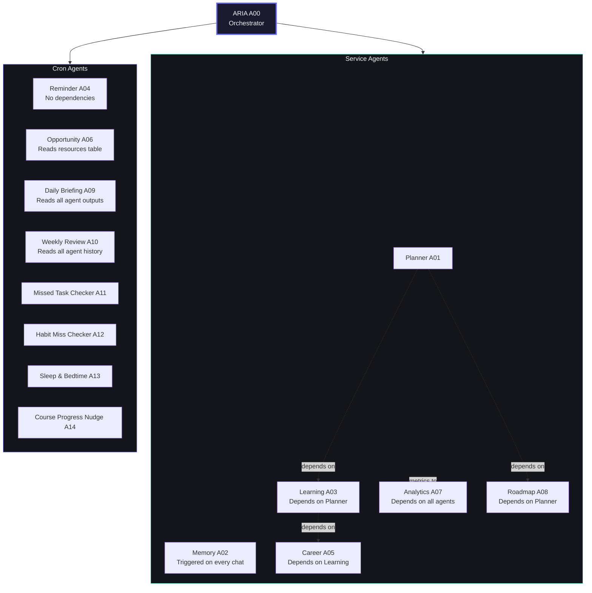
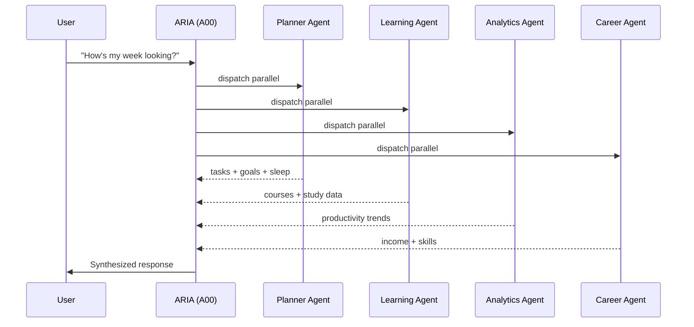
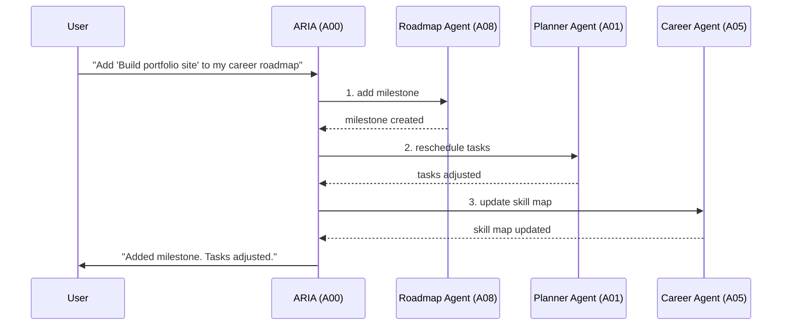
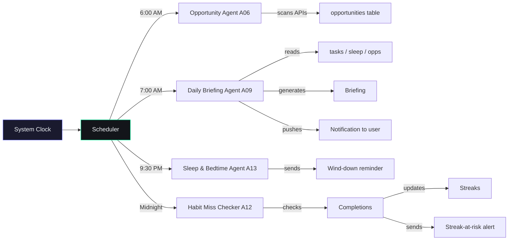
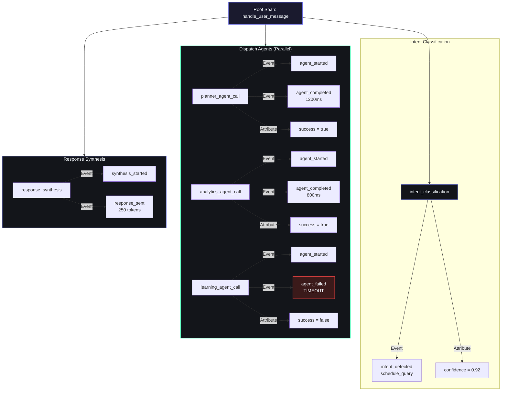
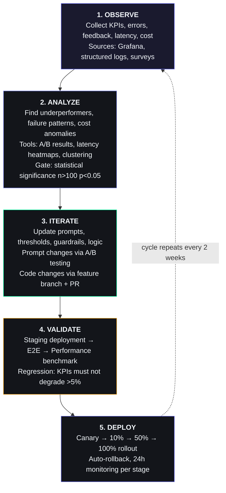
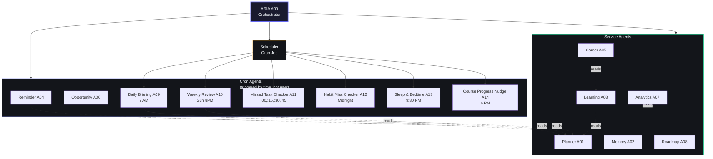
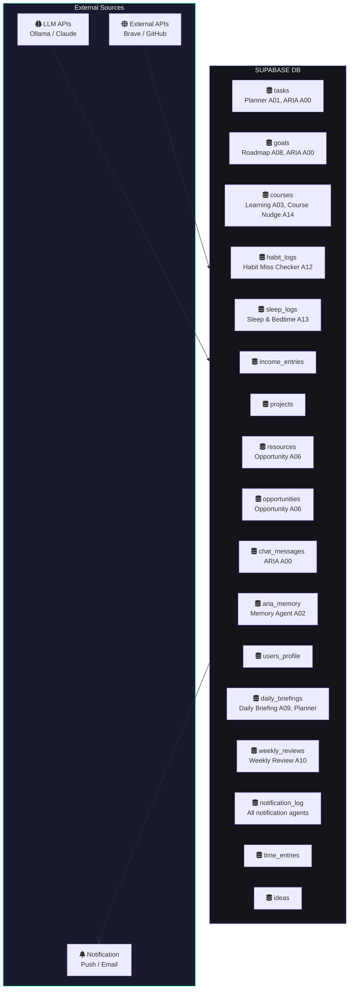

# Agent Architecture & Specification

## Document Control

| Field | Value |
|---|---|
| Document ID | SB-AGENT-001 |
| Version | 3.0.0 |
| Status | Final — Active |
| Classification | Internal — Architecture |
| Agent Count | 15 (1 Orchestrator + 14 Sub-Agents) |
| Orchestrator | ARIA |
| Last Reviewed | 2026-06-11 |
| Next Review | 2026-09-11 |
| Document Owner | ARIA OS Engineering Team |
| Approvers | Tech Lead, System Architect, Security Lead |
| Repository | `docs/ai/20_Agent.md` |

---


## Executive Summary

### Purpose
This document defines the complete agent architecture for ARIA OS — the Second Brain's intelligent orchestration engine. It specifies 15 agents (1 orchestrator + 14 sub-agents) that collectively manage a BTech CSE student's productivity system across tasks, courses, goals, projects, income, habits, sleep, opportunities, and ideas.

### Scope
Covers all agent specifications: mission, responsibilities, I/O contracts, tools, memory architecture, prompts, guardrails, failure recovery, escalation rules, KPIs, observability, evaluation metrics, SLA frameworks, cost tracking, security compliance, testing strategy, deployment lifecycle, and operational runbooks.

### Architecture Philosophy
- **In-Process Execution**: All agents run as in-process function calls (Python async), not microservices — minimizing latency and operational complexity
- **Supabase as System of Record**: All agent data flows through Supabase tables; agents communicate via shared database, not direct calls
- **LLM Independence**: Agents are designed to work with multiple LLM backends (Ollama, Claude, GPT) via a unified interface; algorithmic agents have zero LLM dependency
- **Graceful Degradation**: Every agent must handle failure of its dependencies (LLM, DB, external APIs) and degrade gracefully with cached or simplified responses
- **Privacy by Design**: All data stays within the user's Supabase instance; no external analytics; RLS policies enforced at every layer

### Agent Taxonomy

| Category | Count | Agents | LLM Required |
|---|---|---|---|
| **Orchestrator** | 1 | ARIA (A00) | Yes |
| **Service Agents** | 6 | Planner (A01), Memory (A02), Learning (A03), Career (A05), Analytics (A07), Roadmap (A08) | 4 Yes, 2 No |
| **Cron Agents** | 8 | Reminder (A04), Opportunity (A06), Daily Briefing (A09), Weekly Review (A10), Missed Task Checker (A11), Habit Miss Checker (A12), Sleep & Bedtime (A13), Course Progress Nudge (A14) | 1 Yes, 7 No |

### Architecture Principles

1. **Single Responsibility**: Each agent owns one domain and does not cross boundaries
2. **Idempotency**: All cron agents are safe to re-run without side effects
3. **Observability by Default**: Every agent logs structured output for metrics, debugging, and cost analysis
4. **Fail Fast, Fail Gracefully**: Timeouts at 5s, retry once, then proceed without that agent
5. **Data Minimization**: Agents only access the tables and columns they need
6. **Versioned Prompts**: Every LLM prompt is tracked with version, path, and update date
7. **Cost Awareness**: Every LLM call is metered and attributable to a specific agent

### Implementation Status Summary

| Status | Count | Agents |
|---|---|---|
| **Implemented** | 5 | Reminder (A04), Missed Task Checker (A11), Habit Miss Checker (A12), Sleep & Bedtime (A13), Weekly Review (A10) |
| **Design Complete (Code Pending)** | 7 | ARIA (A00), Planner (A01), Learning (A03), Career (A05), Analytics (A07), Roadmap (A08), Course Progress Nudge (A14) |
| **Shell/Stub** | 3 | Memory (A02), Opportunity (A06), Daily Briefing (A09) |

---


## Agent Lifecycle Management

### Registration Process

Every new agent must complete the following registration steps before deployment:

1. **Specification Review**: Agent spec added to this document with all required subsections
2. **Code Review**: Agent implementation passes architecture review
3. **Registry Entry**: Agent added to Agent Registry table (A00-A99)
4. **Scheduler Registration**: If cron-based, registered in `services/scheduler/main.py`
5. **Health Check**: Agent passes health() contract (see below)
6. **Test Suite**: Unit tests at > 80% coverage, integration tests covering 3-5 scenarios
7. **Security Review**: Data access audit completed with RLS verification
8. **Prompt Registration**: Prompt files added to `prompts/` directory with YAML frontmatter

### Version Tracking per Agent

Each agent tracks its version independently via:
- **Code Version**: Git commit hash of the agent's source file
- **Prompt Version**: Semantic version in prompt file YAML frontmatter
- **Spec Version**: Updated in this document's agent registry

### Health Check Contract

Every agent MUST implement these three methods:

```python
async def health() -> dict:
    """Return agent health status."""
    return {
        "status": "healthy" | "degraded" | "unhealthy",
        "last_run": "ISO timestamp",
        "success_rate": 0.99,
        "latency_p50_ms": 150,
        "errors_last_hour": 0
    }

async def metrics() -> dict:
    """Return operational metrics."""
    return {
        "calls_total": 1000,
        "calls_today": 42,
        "avg_latency_ms": 200,
        "p95_latency_ms": 800,
        "error_rate": 0.01,
        "tokens_input": 50000,
        "tokens_output": 15000,
        "est_cost": 0.015
    }

async def version() -> dict:
    """Return version information."""
    return {
        "agent_version": "1.2.0",
        "prompt_version": "1.0.0",
        "last_updated": "2026-06-01",
        "code_hash": "a1b2c3d"
    }
```

### Retirement / Deprecation Process

1. **Deprecation Notice**: Agent marked as `deprecated` in registry, users notified
2. **Grace Period**: Agent continues running for 30 days with deprecation warnings
3. **Data Migration**: Any persistent data migrated to replacement agent or archived
4. **Prompt Archive**: Prompt files moved to `prompts/archive/`
5. **Code Removal**: Source code removed, registry entry updated to `removed`
6. **Documentation**: Agent spec section updated with deprecation notice and migration path

### Agent Dependency Graph



### Dependency Rules

| Agent | Depends On | Dependency Type | Notes |
|---|---|---|---|
| Planner (A01) | Sleep Agent (A13) | Soft — graceful fallback | Sleep score improves schedules |
| Learning (A03) | Planner (A01) | Soft | Study tasks integrated into schedule |
| Career (A05) | Learning (A03) | Soft | Skills data flows from courses |
| Analytics (A07) | All agents | Read-only | Aggregates metrics across all agents |
| Roadmap (A08) | Planner (A01) | Soft | Time availability for milestones |
| Daily Briefing (A09) | Opportunity (A06), Planner (A01) | Soft | Reads pre-computed data |
| Weekly Review (A10) | All cron agents | Read-only | Compiles weekly snapshot |

---


## 1. ARIA — Orchestrator Agent

### Mission
Be the user's single point of intelligence. Receive every message, understand intent, delegate to sub-agents, synthesize outputs, and deliver a coherent, actionable response. ARIA does not act alone — it is the conductor of an orchestra of specialized agents.

### Responsibilities
- Intent classification: parse every user message into one or more agent intents
- Context assembly: build a unified context packet from all available data sources
- Agent dispatch: call sub-agents in parallel (independent data) or sequentially (dependent data)
- Output synthesis: merge agent outputs into a single natural-language response
- Action execution: create/update/delete records in Supabase via natural language
- Conversation management: maintain session state, track follow-ups, detect topic shifts
- Error handling: gracefully handle agent failures, timeouts, and missing data
- Learning signal capture: log what worked/didn't for model improvement

### Inputs
| Source | Format | Volatility |
|---|---|---|
| User chat message | String (plain text) | Per-request |
| System event (cron trigger) | JSON event payload | Scheduled |
| Context snapshot | JSON (tasks, goals, courses, habits, sleep) | Built per-request |
| Agent outputs | JSON (varies by agent) | Per-agent response |
| Conversation history | Array of {role, content} objects | Last 50 messages |
| User profile + preferences | JSON from users_profile table | Session-cached |

### Outputs
| Destination | Format | Description |
|---|---|---|
| Chat response | Structured JSON + rendered UI | User-facing reply |
| Database write | Supabase INSERT/UPDATE | Actions performed by ARIA |
| Dashboard briefing | JSON stored in daily_briefings | 7 AM morning report |
| Push notification | Resend/Twilio payload | Alerts, reminders |

### Tools
| Tool | Purpose | Access |
|---|---|---|
| `read_tasks(filters)` | Query tasks table | Read-only |
| `create_task(data)` | Insert new task | Write |
| `update_task(id, data)` | Modify existing task | Write |
| `complete_task(id)` | Mark task done | Write |
| `read_goals(filters)` | Query goals + roadmap nodes | Read-only |
| `update_goal(id, data)` | Modify goal progress | Write |
| `read_courses(filters)` | Query courses | Read-only |
| `log_habit(id)` | Log habit completion | Write |
| `query_opportunities(filters)` | Search opportunities | Read-only |
| `read_sleep_logs(range)` | Get sleep data | Read-only |
| `read_income_summary(range)` | Get income data | Read-only |
| `read_projects(filters)` | Query projects | Read-only |
| `search_resources(query)` | Full-text search resources | Read-only |
| `calendar_next_free_slots(n)` | Find open time slots | Read-only |
| `send_notification(user_id, message)` | Push alert | Write |

### Memory
| Memory Type | Storage | Scope | Retention |
|---|---|---|---|
| Working context | In-request JSON | Single turn | Request lifetime |
| Conversation history | `chat_messages` table | Last 50 turns | 90 days |
| Semantic memory | `aria_memory` table | Facts, preferences, patterns | Indefinite |
| Episodic memory | Recent chat logs + task history | Past 7 days | 7 days rolling |
| User profile | `users_profile` table | Skills, goals, preferences | Permanent |

### Prompts

#### System Prompt (Core Identity)
```
You are ARIA, the AI orchestrator for Second Brain OS. You manage a BTech CSE student's entire
productivity system: tasks, courses, goals, projects, income, habits, sleep, opportunities, and ideas.

You have access to the user's complete life data through sub-agents. Your job is to:
1. Understand what the user needs (information, action, suggestion, motivation)
2. Call the right sub-agents in parallel when possible
3. Synthesize their outputs into a single clear response
4. Take actions when the user asks (create tasks, update goals, log habits)
5. Never guess — if you don't have data, say so and offer to help find it
6. Be direct, honest, and slightly motivational. No fluff. No fake enthusiasm.

Today is {current_date}. The user's current context:
- Pending tasks: {pending_count} (overdue: {overdue_count})
- Active goals: {goal_count}
- Courses in progress: {course_count}
- Sleep score today: {sleep_score}
- Current phase of day: {morning/afternoon/evening/night}
```

#### Guardrails Prompt
```
GUARDRAILS — You MUST follow these rules:
1. NEVER delete data. Always ask before deleting tasks, courses, goals, or projects.
2. NEVER share the user's data with anyone. You are single-user only.
3. NEVER make up facts about the user. Use only data from sub-agents.
4. If a task type or action is ambiguous, ask for clarification.
5. If the user sounds frustrated, acknowledge before proceeding.
6. Never promise features that don't exist.
7. Never claim to browse the internet unless the Opportunity Agent has been called.
8. If you cannot complete a request, explain exactly what's missing.
```

### Prompt Version Reference

| Field | Value |
|---|---|
| Prompt file path | `prompts/aria/system.md` |
| Current prompt version | 2.1.0 |
| Last prompt update | 2026-05-15 |

### Prompt Version Reference

| Field | Value |
|---|---|
| Prompt file path | `prompts/aria/system.md` |
| Current prompt version | 2.1.0 |
| Last prompt update | 2026-05-15 |

### Context Window

| Component | Token Budget | Notes |
|---|---|---|
| System prompt | ~400 | Fixed |
| Guardrails | ~150 | Fixed |
| User profile snapshot | ~200 | Loaded from DB |
| Active tasks (top 10) | ~500 | Sorted by priority |
| Active goals (top 5) | ~300 | With progress |
| Recent chat history | ~1,500 | Last 8 turns |
| Agent outputs (max 5) | ~1,000 | Parallel agent results |
| **Total** | **~4,050** | Within Claude Haiku/Ollama limits |

### Guardrails
1. **No data deletion** without explicit user confirmation
2. **No hallucinated user data** — use only agent-returned data
3. **No fabricated capabilities** — don't claim features that aren't built
4. **No off-topic conversations** — stay within productivity/student-life scope
5. **No over-promising** — don't guarantee outcomes (internships, grades, income)
6. **No false urgency** — don't create fake deadlines
7. **No shame** — never guilt the user for missed tasks or skipped habits
8. **Privacy boundary** — never reference other users' data

### SLA

| Metric | Target | Measurement | Severity |
|---|---|---|---|
| Response time (p50) | 900ms | Timer | P0-P3 |
| Response time (p95) | 3000ms | Timer | P0-P3 |
| Response time (p99) | 4500ms | Timer | P0-P3 |
| Success rate | 99.5%% | Successful calls / total calls | P0-P3 |
| Availability | 99.9%% | Up/down health checks | P0-P3 |
| Error budget | 0.1% monthly | Errors / total calls | P0 |
| MTTR | < 15 min | Time from alert to resolution | P0-P1 |

### Cost Tracking

| Item | Value |
|---|---|
| Model used | Ollama/Claude (auto-select) |
| Estimated tokens per call (input) | 4000 |
| Estimated tokens per call (output) | 1500 |
| Estimated cost per call | $0.02 |
| Calls per day | 200 |
| Monthly cost estimate | $120.00 |

### Runbook Reference

See: `docs/operations/39_Runbooks.md` for full runbook documentation.

| Failure Scenario | Recovery Steps | Debug Commands |
|---|---|---|
| LLM unavailable | Fall back to template-based response with cached data | curl -X GET http://localhost:11434/api/tags |
| Agent timeout | Proceed without agent output, note in response | Check agent-specific health endpoint |
| All agents fail | Return apology + retry suggestion, log incident | python -m agents.check_all |
| DB connection lost | Use cached context from last successful request | psql -h supabase -c 'SELECT 1' ||

### Security & Compliance

| Aspect | Detail |
|---|---|
| Tables read | tasks, goals, courses, habit_logs, sleep_logs, income_entries, projects, resources, opportunities, chat_messages, aria_memory, users_profile, daily_briefings |
| Tables modified | tasks, goals, courses, habit_logs, sleep_logs, income_entries, projects, chat_messages, aria_memory |
| Privacy considerations | Orchestrator has broad read access; write limited to user-authorized actions. No PII exposed in responses. |
| RLS implications | All queries filtered by user_id. RLS ensures tenant isolation. Orchestrator uses service_role key for writes. |
| Audit requirements | Every write operation logged to audit trail with user_id, action, table, timestamp. |

### Testing Strategy

| Item | Detail |
|---|---|
| Unit test file | `tests/agents/test_orchestrator.py` |
| Coverage target | 85% |
| Test data requirements | Mock user with 10 tasks, 5 goals, 3 courses, sleep/habit logs, 7-day chat history |

**Integration Test Scenarios:**
1. Intent classification: user message → correct agent dispatch
2. Parallel fan-out: 4 independent agents return within 5s
3. Sequential pipeline: agent output feeds next agent correctly
4. Error recovery: one agent fails, orchestrator continues without it
5. Output synthesis: merge 4 agent outputs into coherent response

### SLA

| Metric | Target | Measurement | Severity |
|---|---|---|---|
| Response time (p50) | 900ms | Timer | P0-P3 |
| Response time (p95) | 3000ms | Timer | P0-P3 |
| Response time (p99) | 4500ms | Timer | P0-P3 |
| Success rate | 99.5%% | Successful calls / total calls | P0-P3 |
| Availability | 99.9%% | Up/down health checks | P0-P3 |
| Error budget | 0.1% monthly | Errors / total calls | P0 |
| MTTR | < 15 min | Time from alert to resolution | P0-P1 |

### Cost Tracking

| Item | Value |
|---|---|
| Model used | Ollama/Claude (auto-select) |
| Estimated tokens per call (input) | 4000 |
| Estimated tokens per call (output) | 1500 |
| Estimated cost per call | $0.02 |
| Calls per day | 200 |
| Monthly cost estimate | $120.00 |

### Runbook Reference

See: `docs/operations/39_Runbooks.md` for full runbook documentation.

| Failure Scenario | Recovery Steps | Debug Commands |
|---|---|---|
| LLM unavailable | Fall back to template-based response with cached data | curl -X GET http://localhost:11434/api/tags |
| Agent timeout | Proceed without agent output, note in response | Check agent-specific health endpoint |
| All agents fail | Return apology + retry suggestion, log incident | python -m agents.check_all |
| DB connection lost | Use cached context from last successful request | psql -h supabase -c 'SELECT 1' ||

### Security & Compliance

| Aspect | Detail |
|---|---|
| Tables read | tasks, goals, courses, habit_logs, sleep_logs, income_entries, projects, resources, opportunities, chat_messages, aria_memory, users_profile, daily_briefings |
| Tables modified | tasks, goals, courses, habit_logs, sleep_logs, income_entries, projects, chat_messages, aria_memory |
| Privacy considerations | Orchestrator has broad read access; write limited to user-authorized actions. No PII exposed in responses. |
| RLS implications | All queries filtered by user_id. RLS ensures tenant isolation. Orchestrator uses service_role key for writes. |
| Audit requirements | Every write operation logged to audit trail with user_id, action, table, timestamp. |

### Testing Strategy

| Item | Detail |
|---|---|
| Unit test file | `tests/agents/test_orchestrator.py` |
| Coverage target | 85% |
| Test data requirements | Mock user with 10 tasks, 5 goals, 3 courses, sleep/habit logs, 7-day chat history |

**Integration Test Scenarios:**
1. Intent classification: user message → correct agent dispatch
2. Parallel fan-out: 4 independent agents return within 5s
3. Sequential pipeline: agent output feeds next agent correctly
4. Error recovery: one agent fails, orchestrator continues without it
5. Output synthesis: merge 4 agent outputs into coherent response

### Failure Recovery

| Failure Mode | Detection | Recovery Action |
|---|---|---|
| Agent timeout (>5s) | Orchestrator timeout | Proceed without that agent's output. Note in response: "I couldn't load [data] right now." |
| Agent returns error | Error flag in response | Retry once after 1s. If still fails, skip and log to monitoring. |
| All agents fail | All outputs are errors | Return "I'm having trouble accessing your data. Please try again in a moment." Log incident. |
| LLM unavailable | HTTP error from API | Fall back to template-based response with cached data. Queue full generation for next available window. |
| Database connection error | Supabase client exception | Return cached data from last successful request. Flag stale data in response. |
| Malformed agent output | Schema validation failure | Reject agent output. Proceed without it. Log agent bug to monitoring. |

### Escalation Rules

| Condition | Escalation To | Action |
|---|---|---|
| 3 agent failures in 5 minutes | Monitoring alert | Log error, notify developer via email |
| 10 agent failures in 1 hour | Incident response | Pause automated agents, trigger SEV-3 incident |
| LLM API budget exceeded | Usage notification | Switch all agents to fallback (algorithmic) mode |
| Database outage | Emergency | Cache writes, queue for replay, notify user |

### KPIs

| KPI | Target | Measurement |
|---|---|---|
| Response time (p95) | < 3s | Orchestrator → complete response |
| Agent success rate | > 95% | Successful responses / total calls |
| User satisfaction | > 4/5 | Implicit (follow-up rate) + explicit (thumbs up/down) |
| Action accuracy | > 98% | Correct DB writes / total writes |
| Context accuracy | > 99% | No hallucinated data points |
| Conversation completion | > 80% | User gets what they asked for (no follow-up correction) |

### Observability

| Signal | Method | Tool |
|---|---|---|
| Request latency | Timer per request | Structured log |
| Agent call latency | Timer per agent | Structured log |
| Error counts | Counter per error type | Structured log + alert |
| Token usage | Sum per request | Cost tracking |
| User satisfaction | Thumbs up/down per response | App analytics |
| Conversation length | Message count per session | Session tracker |
| Action success rate | DB write confirmation | Audit log |

### Evaluation Metrics

| Metric | Method | Frequency |
|---|---|---|
| Response relevance | Human evaluation (sampled) | Weekly (10% of conversations) |
| Action correctness | Automated audit of DB writes | Real-time |
| Hallucination rate | Spot-check data accuracy | Daily (random 5 conversations) |
| Task completion rate | Did user finish what ARIA suggested? | Weekly |
| User retention | Does user return to chat? | Monthly |

---

## 2. Planner Agent

### Mission
Optimize the user's daily schedule. Given all tasks, goals, courses, sleep data, and time preferences, generate an optimal time-blocked plan for the day. Ensure the most important work gets done when the user has the most energy.

### Responsibilities
- Generate daily time-blocked schedule every morning
- Prioritize tasks based on deadline urgency + energy level + goal alignment
- Allocate course study time based on deadline proximity
- Block deep work windows during user's peak focus hours
- Rebalance schedule when tasks are missed or completed early
- Handle hard-deadline mode for exam weeks
- Respect the user's time preferences (morning person vs night owl)

### Inputs
| Input | Source | Format |
|---|---|---|
| Pending tasks | tasks table | Array of {id, title, priority, estimated_minutes, due_date} |
| In-progress courses | courses table | Array of {id, title, daily_minutes_needed, deadline} |
| Active goals | goals table | Array of {id, title, hours_per_day, days_per_week} |
| Sleep score | sleep_logs table | Integer (0-100) |
| Focus hours | time_entries analysis | {start_hour, end_hour} |
| Today's events | calendar (future) | Array of {start, end, title} |
| User preferences | users_profile | {morning_person, preferred_start_hour, break_frequency} |

### Outputs
| Output | Destination | Format |
|---|---|---|
| Today's schedule | daily_briefings table | JSON: {blocks: [{start, end, type, task_id, title, energy_level}]} |
| Task reorder | tasks table (due_date updates) | Batch UPDATE |
| Focus recommendations | Chat response | Natural language |

### Tools
- `get_pending_tasks(limit, sort_by)` — Query pending tasks with filters
- `get_courses_in_progress()` — Active courses with daily targets
- `calculate_free_time(start, end)` — Find unallocated blocks
- `get_focus_hours(user_id)` — Analyze historical productive periods
- `reschedule_task(task_id, new_due_date)` — Move task
- `create_time_block(task_id, start, end)` — Log planned block

### Memory
| Type | Retention | Use |
|---|---|---|
| Daily schedule history | 7 days | Learn optimal block patterns |
| Focus hour analysis | 30 days | Identify peak productivity windows |
| Reschedule patterns | 30 days | Understand why tasks slip |
| Energy self-reports | 30 days | Correlate sleep + tasks + energy |

### Prompts

#### Schedule Generation Prompt
```
Generate an optimal daily schedule for {name} on {date}.

User Profile:
- Sleep score today: {sleep_score}/100
- Peak focus hours: {focus_start}:00 - {focus_end}:00
- Energy level: {energy_level} (from sleep + past 3 days)
- Available hours: {available_hours} ({start_time} → {end_time})

Tasks (sorted by priority):
{task_list}

Course requirements:
- {course_name}: {daily_minutes} min/day (deadline: {deadline})
- Total course minutes needed: {total_course_minutes}

Active goals time allocation:
{goal_list}

Rules:
1. Place deep work tasks in focus hours
2. Group similar tasks to reduce context switching
3. Place course study in blocks of 25-50 minutes
4. Include 5-10 min breaks between blocks
5. After lunch (12-2 PM): lighter tasks only (low energy expected)
6. If sleep_score < 50: push hard tasks to afternoon, start with light work
7. First task of the day: something quick (5-10 min) for momentum
8. Reserve 30 min buffer for unexpected tasks/overruns
9. Do not overschedule — leave 15% time free
```

### Prompt Version Reference

| Field | Value |
|---|---|
| Prompt file path | `prompts/planner/schedule_generation.md` |
| Current prompt version | 1.2.0 |
| Last prompt update | 2026-05-10 |

### Prompt Version Reference

| Field | Value |
|---|---|
| Prompt file path | `prompts/planner/schedule_generation.md` |
| Current prompt version | 1.2.0 |
| Last prompt update | 2026-05-10 |

### Context Window
~2,500 tokens (task list + course data + schedule output)

### Guardrails
1. Never schedule more than 6 hours of focused work per day
2. Never schedule work after 10 PM unless user preference allows it
3. Always include at least one 30-min break for lunch
4. Never remove user's calendar events (once integrated)
5. If sleep score < 30, reduce total scheduled time by 50%
6. Never schedule two high-cognitive-load tasks back-to-back
7. Always show the rationale for the top-1 priority

### SLA

| Metric | Target | Measurement | Severity |
|---|---|---|---|
| Response time (p50) | 600ms | Timer | P0-P3 |
| Response time (p95) | 2000ms | Timer | P0-P3 |
| Response time (p99) | 3000ms | Timer | P0-P3 |
| Success rate | 99%% | Successful calls / total calls | P0-P3 |
| Availability | 99.8%% | Up/down health checks | P0-P3 |
| Error budget | 0.1% monthly | Errors / total calls | P0 |
| MTTR | < 15 min | Time from alert to resolution | P0-P1 |

### Cost Tracking

| Item | Value |
|---|---|
| Model used | Ollama (Mixtral 8x7B) |
| Estimated tokens per call (input) | 2500 |
| Estimated tokens per call (output) | 1200 |
| Estimated cost per call | $0.015 |
| Calls per day | 50 |
| Monthly cost estimate | $22.50 |

### Runbook Reference

See: `docs/operations/39_Runbooks.md` for full runbook documentation.

| Failure Scenario | Recovery Steps | Debug Commands |
|---|---|---|
| Tasks not loaded | Generate with course/goal time only | SELECT * FROM tasks WHERE user_id='X' AND status='pending' |
| Focus hours unknown | Use 9AM-12PM as default focus window | python -m agents.planner --debug |
| Schedule gen fails | Return simple ordered task list | tail -100 logs/planner.log |
| Sleep score missing | Default to medium energy | SELECT * FROM sleep_logs WHERE user_id='X' ORDER BY date DESC LIMIT 1 ||

### Security & Compliance

| Aspect | Detail |
|---|---|
| Tables read | tasks, goals, courses, sleep_logs, time_entries, users_profile |
| Tables modified | tasks (due_date), daily_briefings |
| Privacy considerations | Schedule contains all pending tasks and goals; no PII in output. Daily schedule stored in briefings table with RLS. |
| RLS implications | RLS on tasks/goals/courses enforces user isolation. Planner writes to daily_briefings with user_id partition. |
| Audit requirements | All schedule changes logged; reschedule operations recorded with old/new dates. |

### Testing Strategy

| Item | Detail |
|---|---|
| Unit test file | `tests/agents/test_planner.py` |
| Coverage target | 80% |
| Test data requirements | Mock user with 10 tasks (mixed priority), 3 goals, 2 courses, 7 days sleep data |

**Integration Test Scenarios:**
1. Generate daily schedule with valid data returns correct block structure
2. Handle missing sleep score by defaulting to medium energy
3. Schedule rebalancing when tasks are marked complete mid-day
4. Hard-deadline exam mode overrides non-critical tasks
5. Empty task list generates schedule from course/goal time only

### SLA

| Metric | Target | Measurement | Severity |
|---|---|---|---|
| Response time (p50) | 600ms | Timer | P0-P3 |
| Response time (p95) | 2000ms | Timer | P0-P3 |
| Response time (p99) | 3000ms | Timer | P0-P3 |
| Success rate | 99%% | Successful calls / total calls | P0-P3 |
| Availability | 99.8%% | Up/down health checks | P0-P3 |
| Error budget | 0.1% monthly | Errors / total calls | P0 |
| MTTR | < 15 min | Time from alert to resolution | P0-P1 |

### Cost Tracking

| Item | Value |
|---|---|
| Model used | Ollama (Mixtral 8x7B) |
| Estimated tokens per call (input) | 2500 |
| Estimated tokens per call (output) | 1200 |
| Estimated cost per call | $0.015 |
| Calls per day | 50 |
| Monthly cost estimate | $22.50 |

### Runbook Reference

See: `docs/operations/39_Runbooks.md` for full runbook documentation.

| Failure Scenario | Recovery Steps | Debug Commands |
|---|---|---|
| Tasks not loaded | Generate with course/goal time only | SELECT * FROM tasks WHERE user_id='X' AND status='pending' |
| Focus hours unknown | Use 9AM-12PM as default focus window | python -m agents.planner --debug |
| Schedule gen fails | Return simple ordered task list | tail -100 logs/planner.log |
| Sleep score missing | Default to medium energy | SELECT * FROM sleep_logs WHERE user_id='X' ORDER BY date DESC LIMIT 1 ||

### Security & Compliance

| Aspect | Detail |
|---|---|
| Tables read | tasks, goals, courses, sleep_logs, time_entries, users_profile |
| Tables modified | tasks (due_date), daily_briefings |
| Privacy considerations | Schedule contains all pending tasks and goals; no PII in output. Daily schedule stored in briefings table with RLS. |
| RLS implications | RLS on tasks/goals/courses enforces user isolation. Planner writes to daily_briefings with user_id partition. |
| Audit requirements | All schedule changes logged; reschedule operations recorded with old/new dates. |

### Testing Strategy

| Item | Detail |
|---|---|
| Unit test file | `tests/agents/test_planner.py` |
| Coverage target | 80% |
| Test data requirements | Mock user with 10 tasks (mixed priority), 3 goals, 2 courses, 7 days sleep data |

**Integration Test Scenarios:**
1. Generate daily schedule with valid data returns correct block structure
2. Handle missing sleep score by defaulting to medium energy
3. Schedule rebalancing when tasks are marked complete mid-day
4. Hard-deadline exam mode overrides non-critical tasks
5. Empty task list generates schedule from course/goal time only

### Failure Recovery
| Failure | Action |
|---|---|
| Tasks not loaded | Generate schedule with course/ goal time only |
| Sleep score missing | Default to medium energy, no adjustments |
| Focus hours unknown | Use 9 AM - 12 PM as default focus window |
| Schedule generation fails | Return simple ordered task list instead of time blocks |

### Escalation Rules
| Condition | Escalation |
|---|---|
| 5 consecutive days of < 50% schedule completion | Alert: "Your schedule may be too ambitious. Reduce by 20%?" |
| User manually overrides schedule 3+ days in a row | Reduce scheduling confidence, ask for preference update |
| Exam week detected (hard deadline mode) | Override all non-critical tasks, prioritize study |

### KPIs
| KPI | Target |
|---|---|
| Schedule adherence rate | > 60% of blocks completed |
| Priority accuracy | #1 task completed > 70% of days |
| Reschedule rate | < 30% of tasks rescheduled same day |
| Overload incidents | < 2 per week (user manually clears > 3 tasks) |

### Observability
| Signal | Log |
|---|---|
| Generated schedule | Full JSON logged to monitoring |
| Schedule adherence | End-of-day diff: planned vs actual |
| Task re-prioritizations | Count of reschedules per day |
| Energy misalignment | Tasks scheduled in low-energy window |

### Evaluation Metrics
| Metric | Method |
|---|---|
| Schedule quality score | Weighted: adherence (40%) + priority accuracy (30%) + overload (30%) |
| User satisfaction | Weekly implicit feedback (did user follow schedule?) |
| Planning accuracy | Estimated vs actual task duration delta |

---

## 3. Memory Agent

### Mission
Remember everything about the user that matters. Extract, store, and recall facts, preferences, patterns, and decisions from every interaction. Build a persistent knowledge base that makes ARIA smarter with every conversation.

### Responsibilities
- Extract facts from chat messages (preferences, decisions, personal information)
- Store extracted facts in `aria_memory` with importance scores
- Surface relevant memories when context matches
- Consolidate similar memories, prune low-importance ones
- Detect behavioral patterns over time (procrastination triggers, productive conditions)
- Handle memory decay: reduce importance of unused memories
- Support explicit memory operations: "Remember that I..." / "Forget that I..."

### Inputs
| Input | Source |
|---|---|
| Chat messages | `chat_messages` table (user + assistant) |
| Explicit memory commands | "Remember..." / "Don't forget..." / "Forget..." |
| Task completion patterns | tasks (completed_at, missed_count, category) |
| Schedule adherence | Planned vs actual daily comparison |
| Sleep-productivity correlation | sleep_logs × time_entries |
| Course dropout signals | courses (status → abandoned) |

### Outputs
| Output | Destination |
|---|---|
| Memory entries | `aria_memory` table |
| Context enrichments | Injected into orchestrator context |
| Pattern reports | Weekly review / dashboard insights |
| Memory consolidation | Batch UPDATE (merge, prune, decay) |

### Tools
- `store_memory(category, content, importance)` — Write to `aria_memory`
- `recall_memories(query, limit, min_importance)` — Retrieve relevant memories
- `update_importance(memory_id, delta)` — Adjust importance score
- `consolidate_memories()` — Merge similar entries
- `decay_memories()` — Reduce importance of unused entries
- `forget_memory(memory_id)` — Explicit deletion
- `detect_patterns(metric, time_range)` — Behavioral analysis

### Memory

The Memory Agent has its own meta-memory — it remembers what it remembered and how important each memory is.

| Table | Column | Purpose |
|---|---|---|
| `aria_memory` | id, user_id, category, content, importance, created_at, last_accessed | Core memory store |
| — | category | Enum: preferences, facts, patterns, decisions, skills |
| — | importance | Integer 1-10. 10 = critical, 1 = ephemeral |
| — | last_accessed | Timestamp. Used for decay calculation |

**Decay Formula:** `new_importance = original_importance × (1 - 0.01 × days_since_access)`

**Consolidation:** When 3+ memories share the same category + topic, merge into a single entry with average importance.

### Prompts

#### Fact Extraction Prompt
```
Extract factual statements from this conversation that would be useful for
personalizing future interactions.

Conversation:
{conversation_text}

Extract facts in these categories:
1. PREFERENCES — Things the user likes/dislikes about how they work
2. FACTS — Specific personal information (schedule, constraints, relationships)
3. DECISIONS — Choices the user made that reveal priorities
4. PATTERNS — Repeated behaviors or stated tendencies
5. SKILLS — Skills the user mentions having, learning, or wanting

For each fact, output:
{ "category": "...", "content": "...", "importance": 1-10, "evidence": "quote from conversation" }

Only extract facts that are:
- Specific and actionable (not vague opinions)
- Likely to persist (not one-time context)
- Relevant to productivity, learning, or career
```

#### Memory Retrieval Prompt
```
User context: {current_situation}

Available memories:
{memories_json}

Select the 3-5 most relevant memories to inject into the current conversation.
For each selected memory, explain why it's relevant to the current request.
```

### Prompt Version Reference

| Field | Value |
|---|---|
| Prompt file path | `prompts/memory/extraction.md` |
| Current prompt version | 2.0.0 |
| Last prompt update | 2026-05-20 |

### Prompt Version Reference

| Field | Value |
|---|---|
| Prompt file path | `prompts/memory/extraction.md` |
| Current prompt version | 2.0.0 |
| Last prompt update | 2026-05-20 |

### Context Window
Memory agent operates in short bursts: ~1,000 tokens for extraction, ~500 for retrieval.

### Guardrails
1. Never store raw passwords, API keys, or credentials
2. Never store sensitive personal data (govt IDs, bank details)
3. Never infer medical or mental health conditions
4. Allow explicit deletion: "Forget that" must work immediately
5. Importance score max 10 — no permanent memories
6. Daily memory extraction limited to 100 entries per user
7. Memories must be attributable to a specific conversation

### SLA

| Metric | Target | Measurement | Severity |
|---|---|---|---|
| Response time (p50) | 300ms | Timer | P0-P3 |
| Response time (p95) | 1000ms | Timer | P0-P3 |
| Response time (p99) | 1500ms | Timer | P0-P3 |
| Success rate | 99.5%% | Successful calls / total calls | P0-P3 |
| Availability | 99.9%% | Up/down health checks | P0-P3 |
| Error budget | 0.1% monthly | Errors / total calls | P0 |
| MTTR | < 15 min | Time from alert to resolution | P0-P1 |

### Cost Tracking

| Item | Value |
|---|---|
| Model used | Ollama (Mixtral 8x7B) |
| Estimated tokens per call (input) | 2000 |
| Estimated tokens per call (output) | 500 |
| Estimated cost per call | $0.01 |
| Calls per day | 300 |
| Monthly cost estimate | $90.00 |

### Runbook Reference

See: `docs/operations/39_Runbooks.md` for full runbook documentation.

| Failure Scenario | Recovery Steps | Debug Commands |
|---|---|---|
| Extraction fails | Skip turn, no memory written | python -m agents.memory --extract --debug |
| DB write error | Queue memory for next cycle | SELECT COUNT(*) FROM aria_memory_queue |
| Memory retrieval empty | Proceed without injection | SELECT * FROM aria_memory WHERE user_id='X' ORDER BY importance DESC LIMIT 5 |
| Consolidation fails | Skip cycle, retry next day | tail -20 logs/memory_consolidation.log ||

### Security & Compliance

| Aspect | Detail |
|---|---|
| Tables read | chat_messages, aria_memory, tasks, habit_logs, sleep_logs, time_entries, courses |
| Tables modified | aria_memory |
| Privacy considerations | Stores personal facts and preferences; no credentials, government IDs, or financial details stored. User can delete any memory. |
| RLS implications | RLS on aria_memory ensures user isolation. All memory operations attributable to specific conversation. |
| Audit requirements | Every memory write logged with conversation_id and importance. Deletion events recorded for compliance. |

### Testing Strategy

| Item | Detail |
|---|---|
| Unit test file | `tests/agents/test_memory_agent.py` |
| Coverage target | 85% |
| Test data requirements | Mock conversation history with 20 turns, 50 pre-existing memories across categories |

**Integration Test Scenarios:**
1. Extract facts from conversation and verify category/importance assignment
2. Memory retrieval returns top-3 relevant memories matching context
3. Memory decay formula correctly reduces importance over time
4. Consolidation merges duplicate memories with average importance
5. Explicit forget command immediately removes memory entry

### SLA

| Metric | Target | Measurement | Severity |
|---|---|---|---|
| Response time (p50) | 300ms | Timer | P0-P3 |
| Response time (p95) | 1000ms | Timer | P0-P3 |
| Response time (p99) | 1500ms | Timer | P0-P3 |
| Success rate | 99.5%% | Successful calls / total calls | P0-P3 |
| Availability | 99.9%% | Up/down health checks | P0-P3 |
| Error budget | 0.1% monthly | Errors / total calls | P0 |
| MTTR | < 15 min | Time from alert to resolution | P0-P1 |

### Cost Tracking

| Item | Value |
|---|---|
| Model used | Ollama (Mixtral 8x7B) |
| Estimated tokens per call (input) | 2000 |
| Estimated tokens per call (output) | 500 |
| Estimated cost per call | $0.01 |
| Calls per day | 300 |
| Monthly cost estimate | $90.00 |

### Runbook Reference

See: `docs/operations/39_Runbooks.md` for full runbook documentation.

| Failure Scenario | Recovery Steps | Debug Commands |
|---|---|---|
| Extraction fails | Skip turn, no memory written | python -m agents.memory --extract --debug |
| DB write error | Queue memory for next cycle | SELECT COUNT(*) FROM aria_memory_queue |
| Memory retrieval empty | Proceed without injection | SELECT * FROM aria_memory WHERE user_id='X' ORDER BY importance DESC LIMIT 5 |
| Consolidation fails | Skip cycle, retry next day | tail -20 logs/memory_consolidation.log ||

### Security & Compliance

| Aspect | Detail |
|---|---|
| Tables read | chat_messages, aria_memory, tasks, habit_logs, sleep_logs, time_entries, courses |
| Tables modified | aria_memory |
| Privacy considerations | Stores personal facts and preferences; no credentials, government IDs, or financial details stored. User can delete any memory. |
| RLS implications | RLS on aria_memory ensures user isolation. All memory operations attributable to specific conversation. |
| Audit requirements | Every memory write logged with conversation_id and importance. Deletion events recorded for compliance. |

### Testing Strategy

| Item | Detail |
|---|---|
| Unit test file | `tests/agents/test_memory_agent.py` |
| Coverage target | 85% |
| Test data requirements | Mock conversation history with 20 turns, 50 pre-existing memories across categories |

**Integration Test Scenarios:**
1. Extract facts from conversation and verify category/importance assignment
2. Memory retrieval returns top-3 relevant memories matching context
3. Memory decay formula correctly reduces importance over time
4. Consolidation merges duplicate memories with average importance
5. Explicit forget command immediately removes memory entry

### Failure Recovery
| Failure | Action |
|---|---|
| Extraction fails | Skip turn, no memory written |
| DB write error | Queue memory for next cycle |
| Memory retrieval empty | Proceed without memory injection |
| Consolidation fails | Skip consolidation cycle, retry next day |

### Escalation Rules
| Condition | Escalation |
|---|---|
| Memory store > 10,000 entries per user | Flag for consolidation review |
| Extraction confidence < 30% for 5+ turns | Pause auto-extraction, request explicit memories |
| User says "Stop remembering" | Disable auto-extraction until re-enabled |

### KPIs
| KPI | Target |
|---|---|
| Memory precision | > 90% of stored facts are accurate |
| Memory recall relevance | Top-3 retrieved memories are useful > 80% of the time |
| Extraction coverage | > 70% of explicit "remember" commands captured |
| Decay accuracy | Low-importance memories pruned before they mislead |

### Observability
| Signal | Log |
|---|---|
| Memory writes | Count, category distribution, avg importance |
| Memory retrievals | Which memories accessed, context match score |
| Decay events | Number of memories pruned per cycle |
| Consolidation events | Mergers performed, space recovered |

### Evaluation Metrics
| Metric | Method |
|---|---|
| Extraction quality | Sampled human review of extracted facts (weekly) |
| Recall relevance | User marks suggestions as "helpful" vs "not relevant" |
| Memory accuracy | Audit: is remembered fact still true? (monthly) |

---

## 4. Learning Agent

### Mission
Optimize the user's learning journey. Track every course, video, book, and resource. Ensure the user is making measurable progress toward their learning goals. Identify knowledge gaps, suggest next topics, and prevent course abandonment.

### Responsibilities
- Track progress across all enrolled courses (Udemy, Coursera, NPTEL, YouTube, college)
- Calculate daily study minutes needed per course to meet deadlines
- Generate spaced repetition reviews for studied material
- Detect when a course is falling behind schedule and escalate
- Suggest next courses based on career goals + skill gaps
- Maintain a skill inventory: skills the user has, is learning, and needs
- Generate study tasks automatically linked to course progress

### Inputs
| Input | Source |
|---|---|
| Course list + progress | courses table |
| YouTube saves + watch status | videos table (planned) |
| Resource library saves | resources table |
| Skill inventory | users_profile.skills |
| Career goals | goals table (type=career_skills) |
| Study time logs | time_entries (category=study) |
| Abandonment reasons | courses.abandonment_reason |

### Outputs
| Output | Destination |
|---|---|
| Daily study task | tasks table (auto-generated) |
| Behind-schedule alert | Push notification |
| Spaced repetition review | tasks table |
| Skill gap analysis | Dashboard insight |
| Course recommendation | Chat response |
| Progress report | Weekly review section |

### Tools
- `get_active_courses()` — All in-progress courses
- `calculate_pace(course_id)` — Expected vs actual progress
- `generate_study_task(course_id, minutes)` — Create study task
- `get_skill_gaps(target_role)` — Compare current skills vs required
- `recommend_next_courses(goals, history)` — Course suggestions
- `log_study_session(course_id, duration, topics)` — Record study
- `get_spaced_review_queue()` — Items due for review

### Memory
| Memory Type | Retention | Use |
|---|---|---|
| Course progress history | Course duration | Track pace over time |
| Study session logs | 90 days | Identify productive study patterns |
| Abandoned courses | Indefinite | Learn what causes drop-off |
| Skill inventory | Permanent | Current skill map |
| Spaced repetition schedule | Per topic | Review intervals |

### Prompts

#### Study Plan Generation Prompt
```
Generate a weekly study plan for {name} based on:

Active courses:
{course_list}

Available study time: {available_minutes} min/day
Preferred study hours: {preferred_hours}
Focus score (from sleep): {focus_score}/100

Career goal: {career_goal}
Skill gaps to prioritize: {skill_gaps}

Rules:
1. Allocate more time to courses with nearest deadlines
2. Include spaced repetition for previously studied topics
3. If focus_score < 50, suggest review/light study instead of new material
4. Balance across courses — don't let any course get > 60% of study time
5. Generate one study task per course per week minimum
6. Add a 5-min review of yesterday's study to start each session
```

#### Course Nudge Prompt
```
{name}, you're falling behind in {course_name}.

- Deadline: {deadline} ({days_remaining} days)
- Progress: {progress_percent}%
- Current pace: {current_pace} min/day
- Required pace: {required_pace} min/day

Generate a short, non-judgmental message that:
1. States the gap factually
2. Suggests a specific adjustment (e.g., "Add 15 min/day")
3. Asks if they want to adjust the deadline or abandon (no shame)
```

### Prompt Version Reference

| Field | Value |
|---|---|
| Prompt file path | `prompts/learning/study_plan.md` |
| Current prompt version | 1.3.0 |
| Last prompt update | 2026-05-12 |

### Prompt Version Reference

| Field | Value |
|---|---|
| Prompt file path | `prompts/learning/study_plan.md` |
| Current prompt version | 1.3.0 |
| Last prompt update | 2026-05-12 |

### Context Window
~1,800 tokens (course list + progress + skill matrix + schedule)

### Guardrails
1. Never suggest dropping a course unless it's > 50% behind schedule
2. Never create more than 2 study tasks per day
3. Always include the "why-enrolled" reason when reminding about a course
4. Respect abandoned courses — don't repeatedly nudge
5. Study tasks must be realistically sized (15-60 min, never > 90)
6. Don't recommend courses the user has already completed

### SLA

| Metric | Target | Measurement | Severity |
|---|---|---|---|
| Response time (p50) | 600ms | Timer | P0-P3 |
| Response time (p95) | 2000ms | Timer | P0-P3 |
| Response time (p99) | 3000ms | Timer | P0-P3 |
| Success rate | 99%% | Successful calls / total calls | P0-P3 |
| Availability | 99.8%% | Up/down health checks | P0-P3 |
| Error budget | 0.1% monthly | Errors / total calls | P0 |
| MTTR | < 15 min | Time from alert to resolution | P0-P1 |

### Cost Tracking

| Item | Value |
|---|---|
| Model used | Ollama (Mixtral 8x7B) |
| Estimated tokens per call (input) | 1800 |
| Estimated tokens per call (output) | 800 |
| Estimated cost per call | $0.012 |
| Calls per day | 30 |
| Monthly cost estimate | $10.80 |

### Runbook Reference

See: `docs/operations/39_Runbooks.md` for full runbook documentation.

| Failure Scenario | Recovery Steps | Debug Commands |
|---|---|---|
| Course data unavailable | Skip task generation for that course | SELECT * FROM courses WHERE user_id='X' AND status='in_progress' |
| Progress calc fails | Use linear projection fallback | python -m agents.learning --pace X --debug |
| Career goal not set | Recommend exploration resources | SELECT skills FROM users_profile WHERE id='X' |
| SR queue empty | Generate fresh review | python -m agents.learning --sr-check ||

### Security & Compliance

| Aspect | Detail |
|---|---|
| Tables read | courses, videos, resources, users_profile (skills), goals, time_entries |
| Tables modified | tasks (study tasks), courses (progress updates) |
| Privacy considerations | Course enrollment and progress tracking; no PII. Study tasks are normal tasks with course_id link. |
| RLS implications | RLS on courses/tasks applies. Learning agent creates tasks with category=study, owned by user_id. |
| Audit requirements | Study task creation logged. Course progress updates version-controlled with timestamps. |

### Testing Strategy

| Item | Detail |
|---|---|
| Unit test file | `tests/agents/test_learning_agent.py` |
| Coverage target | 80% |
| Test data requirements | Mock user with 4 active courses, 3 goals, completed courses list, skill inventory |

**Integration Test Scenarios:**
1. Generate weekly study plan with multiple courses and deadlines
2. Detect falling-behind courses and calculate required catch-up pace
3. Spaced repetition queue correctly returns items due for review
4. Course abandonment detection triggers after 7+ days no progress
5. Skill gap analysis compares current skills against target role requirements

### SLA

| Metric | Target | Measurement | Severity |
|---|---|---|---|
| Response time (p50) | 600ms | Timer | P0-P3 |
| Response time (p95) | 2000ms | Timer | P0-P3 |
| Response time (p99) | 3000ms | Timer | P0-P3 |
| Success rate | 99%% | Successful calls / total calls | P0-P3 |
| Availability | 99.8%% | Up/down health checks | P0-P3 |
| Error budget | 0.1% monthly | Errors / total calls | P0 |
| MTTR | < 15 min | Time from alert to resolution | P0-P1 |

### Cost Tracking

| Item | Value |
|---|---|
| Model used | Ollama (Mixtral 8x7B) |
| Estimated tokens per call (input) | 1800 |
| Estimated tokens per call (output) | 800 |
| Estimated cost per call | $0.012 |
| Calls per day | 30 |
| Monthly cost estimate | $10.80 |

### Runbook Reference

See: `docs/operations/39_Runbooks.md` for full runbook documentation.

| Failure Scenario | Recovery Steps | Debug Commands |
|---|---|---|
| Course data unavailable | Skip task generation for that course | SELECT * FROM courses WHERE user_id='X' AND status='in_progress' |
| Progress calc fails | Use linear projection fallback | python -m agents.learning --pace X --debug |
| Career goal not set | Recommend exploration resources | SELECT skills FROM users_profile WHERE id='X' |
| SR queue empty | Generate fresh review | python -m agents.learning --sr-check ||

### Security & Compliance

| Aspect | Detail |
|---|---|
| Tables read | courses, videos, resources, users_profile (skills), goals, time_entries |
| Tables modified | tasks (study tasks), courses (progress updates) |
| Privacy considerations | Course enrollment and progress tracking; no PII. Study tasks are normal tasks with course_id link. |
| RLS implications | RLS on courses/tasks applies. Learning agent creates tasks with category=study, owned by user_id. |
| Audit requirements | Study task creation logged. Course progress updates version-controlled with timestamps. |

### Testing Strategy

| Item | Detail |
|---|---|
| Unit test file | `tests/agents/test_learning_agent.py` |
| Coverage target | 80% |
| Test data requirements | Mock user with 4 active courses, 3 goals, completed courses list, skill inventory |

**Integration Test Scenarios:**
1. Generate weekly study plan with multiple courses and deadlines
2. Detect falling-behind courses and calculate required catch-up pace
3. Spaced repetition queue correctly returns items due for review
4. Course abandonment detection triggers after 7+ days no progress
5. Skill gap analysis compares current skills against target role requirements

### Failure Recovery
| Failure | Action |
|---|---|
| Course data unavailable | Skip study task generation for that course |
| Progress calculation fails | Use simple linear projection as fallback |
| Career goal not set | Recommend exploration resources instead |
| Spaced repetition queue empty | Generate fresh review from recent study topics |

### Escalation Rules
| Condition | Escalation |
|---|---|
| 3+ courses > 50% behind | Alert: "You may be overcommitted. Consider pausing 1-2 courses." |
| No study activity for 5 days | Send "Don't lose your streak" notification |
| Course abandoned within 1 week of enrollment | Ask for abandonment reason, suggest alternatives |
| Skill gap > 5 needed skills unfilled | Career agent alert |

### KPIs
| KPI | Target |
|---|---|
| Course completion rate | > 60% of enrolled courses |
| Daily study target hit rate | > 50% of days |
| Abandonment rate | < 30% (with reason logged) |
| Spaced repetition adherence | > 40% of reviews completed |
| Skill acquisition rate | 1 new skill per month (verified) |

### Observability
| Signal | Log |
|---|---|
| Study task generation | Count per course per day |
| Behind-schedule alerts | Trigger count per course |
| Spaced repetition completions | Review completion rate |
| Course status changes | Enrollment → completion/abandonment |
| Skill updates | Additions to skills array |

### Evaluation Metrics
| Metric | Method |
|---|---|
| Study plan accuracy | Planned vs actual study time delta |
| Course pace prediction | Predicted vs actual completion date error |
| Nudge effectiveness | Study activity increase after nudge (48h window) |

---

## 5. Reminder Agent

### Mission
Ensure nothing falls through the cracks. Monitor all time-sensitive items — tasks, habits, courses, opportunities, sleep — and deliver the right notification through the right channel at the right time. Zero silent failures.

### Responsibilities
- Check for overdue tasks every 15 minutes and reschedule
- Monitor habit completion at midnight and send streak alerts
- Send bedtime wind-down reminder at 9:30 PM
- Escalate critical missed items through push → email → SMS channels
- Respect user's quiet hours (no notifications during sleep)
- Prevent notification fatigue by grouping and prioritizing alerts
- Track reminder effectiveness and adjust channel/threshold over time

### Inputs
| Input | Source | Frequency |
|---|---|---|
| Overdue tasks | tasks (due_date < now, status=pending) | Every 15 min |
| Habit logs | habit_logs (today's date, completed=false) | Midnight |
| Sleep schedule | users_profile (bedtime, wake_time) | 9:30 PM |
| Course deadlines | courses (deadline < 2 weeks) | 6 PM |
| Opportunity deadlines | opportunities (deadline < 48h) | Every 6 hours |
| User quiet hours | users_profile (do_not_disturb) | Per notification |
| Notification history | notification_log table | Per escalation check |

### Outputs
| Output | Destination | Channel |
|---|---|---|
| Task overdue alert | Push notification | Browser push |
| Habit streak at risk | Push notification | Browser push |
| Bedtime reminder | Push notification | Browser push |
| Critical escalation (30 min) | Email | Resend |
| Critical escalation (60 min) | SMS | Twilio |
| Opportunity closing soon | Push notification | Browser push |
| Daily briefing ready | Push notification | Browser push |

### Tools
- `check_overdue_tasks()` — Query tasks table
- `check_habit_completion()` — Query habit_logs for today
- `reschedule_task(task_id, new_date)` — Move overdue task
- `send_push(user_id, title, body)` — Browser push notification
- `send_email(user_id, subject, body)` — Via Resend API
- `send_sms(user_id, body)` — Via Twilio API
- `is_quiet_hours(user_id)` — Check DND window
- `log_notification(user_id, type, channel, status)` — Audit trail

### Memory
| Type | Retention | Use |
|---|---|---|
| Notification history | 30 days | Track escalation effectiveness |
| Task reschedule history | 30 days | Adjust reschedule algorithm |
| Quiet hour violations | 7 days | Learn user's true DND preferences |
| Channel effectiveness | 90 days | Pick best channel for each notification type |

### Prompts
No LLM prompts. Reminder Agent is fully algorithmic for reliability.

### Prompt Version Reference

| Field | Value |
|---|---|
| Prompt file path | `N/A — fully algorithmic` |
| Current prompt version | 1.0.0 |
| Last prompt update | 2026-04-01 |

### Prompt Version Reference

| Field | Value |
|---|---|
| Prompt file path | `N/A — fully algorithmic` |
| Current prompt version | 1.0.0 |
| Last prompt update | 2026-04-01 |

### Context Window
N/A — fully rule-based

### Guardrails
1. Never notify during quiet hours (configurable in user profile)
2. Maximum 3 notifications per hour (prevents fatigue)
3. Never send SMS before 8 AM or after 9 PM
4. Missed task checker runs on overdue tasks only — not rescheduled ones
5. Habit reminders are nudges, not guilt trips — use supportive language
6. Task escalation only applies to priority >= high or missed >= 3 times
7. Group notifications: if 3+ alerts pending, combine into one digest

### SLA

| Metric | Target | Measurement | Severity |
|---|---|---|---|
| Response time (p50) | 150ms | Timer | P0-P3 |
| Response time (p95) | 500ms | Timer | P0-P3 |
| Response time (p99) | 750ms | Timer | P0-P3 |
| Success rate | 99.9%% | Successful calls / total calls | P0-P3 |
| Availability | 99.99%% | Up/down health checks | P0-P3 |
| Error budget | 0.0% monthly | Errors / total calls | P0 |
| MTTR | < 15 min | Time from alert to resolution | P0-P1 |

### Cost Tracking

| Item | Value |
|---|---|
| Model used | None (algorithmic) |
| Estimated tokens per call (input) | 0 |
| Estimated tokens per call (output) | 0 |
| Estimated cost per call | $0.00 |
| Calls per day | 96 |
| Monthly cost estimate | $0.00 |

### Runbook Reference

See: `docs/operations/39_Runbooks.md` for full runbook documentation.

| Failure Scenario | Recovery Steps | Debug Commands |
|---|---|---|
| Push notification fails | Skip push, try email if critical | curl -X POST http://localhost:3000/api/push/test |
| Email fails (Resend down) | Skip email, log failure | curl https://api.resend.com/emails -H 'auth: ...' |
| SMS fails (Twilio down) | Skip SMS, log, alert developer | curl -X GET https://api.twilio.com/2010-04-01/Accounts |
| All channels fail | Log incident, retry in 15 min | tail -50 logs/reminder_agent.log ||

### Security & Compliance

| Aspect | Detail |
|---|---|
| Tables read | tasks, habit_logs, users_profile, courses, opportunities, notification_log |
| Tables modified | tasks (due_date, missed_count), notification_log |
| Privacy considerations | Notification preferences respected (quiet hours, channel opt-ins). No message content exposed beyond notification payload. |
| RLS implications | RLS on tasks/habits/courses. Notification log partitioned by user_id. |
| Audit requirements | All notification sends logged with type, channel, status, timestamp. |

### Testing Strategy

| Item | Detail |
|---|---|
| Unit test file | `tests/agents/test_reminder_agent.py` |
| Coverage target | 95% |
| Test data requirements | Mock user with 15 tasks (varying priority, due dates, miss counts), notification preferences |

**Integration Test Scenarios:**
1. Overdue tasks detected and rescheduled within 15-min cycle
2. Escalation funnel: push → email → SMS triggered at correct miss count thresholds
3. Quiet hours respected — no notifications sent during DND window
4. Batch notification groups 3+ alerts into single digest
5. Hard deadline tasks never rescheduled, only escalated

### SLA

| Metric | Target | Measurement | Severity |
|---|---|---|---|
| Response time (p50) | 150ms | Timer | P0-P3 |
| Response time (p95) | 500ms | Timer | P0-P3 |
| Response time (p99) | 750ms | Timer | P0-P3 |
| Success rate | 99.9%% | Successful calls / total calls | P0-P3 |
| Availability | 99.99%% | Up/down health checks | P0-P3 |
| Error budget | 0.0% monthly | Errors / total calls | P0 |
| MTTR | < 15 min | Time from alert to resolution | P0-P1 |

### Cost Tracking

| Item | Value |
|---|---|
| Model used | None (algorithmic) |
| Estimated tokens per call (input) | 0 |
| Estimated tokens per call (output) | 0 |
| Estimated cost per call | $0.00 |
| Calls per day | 96 |
| Monthly cost estimate | $0.00 |

### Runbook Reference

See: `docs/operations/39_Runbooks.md` for full runbook documentation.

| Failure Scenario | Recovery Steps | Debug Commands |
|---|---|---|
| Push notification fails | Skip push, try email if critical | curl -X POST http://localhost:3000/api/push/test |
| Email fails (Resend down) | Skip email, log failure | curl https://api.resend.com/emails -H 'auth: ...' |
| SMS fails (Twilio down) | Skip SMS, log, alert developer | curl -X GET https://api.twilio.com/2010-04-01/Accounts |
| All channels fail | Log incident, retry in 15 min | tail -50 logs/reminder_agent.log ||

### Security & Compliance

| Aspect | Detail |
|---|---|
| Tables read | tasks, habit_logs, users_profile, courses, opportunities, notification_log |
| Tables modified | tasks (due_date, missed_count), notification_log |
| Privacy considerations | Notification preferences respected (quiet hours, channel opt-ins). No message content exposed beyond notification payload. |
| RLS implications | RLS on tasks/habits/courses. Notification log partitioned by user_id. |
| Audit requirements | All notification sends logged with type, channel, status, timestamp. |

### Testing Strategy

| Item | Detail |
|---|---|
| Unit test file | `tests/agents/test_reminder_agent.py` |
| Coverage target | 95% |
| Test data requirements | Mock user with 15 tasks (varying priority, due dates, miss counts), notification preferences |

**Integration Test Scenarios:**
1. Overdue tasks detected and rescheduled within 15-min cycle
2. Escalation funnel: push → email → SMS triggered at correct miss count thresholds
3. Quiet hours respected — no notifications sent during DND window
4. Batch notification groups 3+ alerts into single digest
5. Hard deadline tasks never rescheduled, only escalated

### Failure Recovery
| Failure | Action |
|---|---|
| Push notification fails | Skip push, try email (if critical) |
| Email fails (Resend down) | Skip email, log failure |
| SMS fails (Twilio down) | Skip SMS, log failure, alert developer |
| All channels fail | Log incident, retry in 15 min |
| Database query timeout | Skip this cycle, retry next |

### Escalation Rules
| Condition | Channel | Timing |
|---|---|---|
| Task missed (first time) | Push notification | Immediate |
| Task missed (3+ times) | Push + Email | 30 min after check |
| Task missed (5+ times, high priority) | Push + Email + SMS | 60 min after check |
| Habit missed (2 consecutive days) | Push notification | Midnight + 5 min |
| Opportunity closing in < 48h | Push notification | Every 6 hours until deadline |
| Course behind schedule (> 2 weeks to deadline) | Push notification | 6 PM daily |
| No login for 3 days | Email | 10 AM |

### KPIs
| KPI | Target |
|---|---|
| Notification delivery rate | > 99% |
| Task reschedule accuracy | > 95% (user doesn't undo reschedule) |
| Escalation effectiveness | > 60% of escalated tasks get completed |
| False positive rate | < 5% (notifications for already-done items) |
| User opt-out rate | < 1% per notification type |
| Quiet hour compliance | 100% |

### Observability
| Signal | Log |
|---|---|
| Notifications sent | Count per channel per type per day |
| Notification failures | Count per channel, grouped by error |
| Task reschedules | Count per day, avg missed_count before reschedule |
| Escalation events | Log each push → email → SMS transition |
| Quiet hour checks | Log any notification attempted during DND |

### Evaluation Metrics
| Metric | Method |
|---|---|
| Notification → action rate | % of notifications that lead to user action within 1 hour |
| Reschedule accuracy | % of rescheduled tasks completed on new date |
| Channel preference accuracy | User dismisses push vs opens email vs acts on SMS |
| Over-notification rate | Days with user muting notifications |

---

## 6. Career Agent

### Mission
Guide the user's career trajectory. Build a bridge between what the user is learning today and where they want to be in 1-3 years. Track skill acquisition, identify market gaps, suggest career moves, and optimize LinkedIn/GitHub presence.

### Responsibilities
- Maintain a dynamic skill inventory (have / learning / want / gaps)
- Compare current skills against target job roles and identify gaps
- Suggest courses, projects, and certifications to fill skill gaps
- Generate LinkedIn post drafts on course completions and project launches
- Generate GitHub commit summaries for monthly "wrapped" cards
- Track income sources and map to skill monetization
- Recommend career paths based on demonstrated strengths (from idea patterns + project types)

### Inputs
| Input | Source |
|---|---|
| Current skills | users_profile.skills |
| Target roles | goals (type=career_skills) |
| Project history | projects table |
| Income sources | income_entries + income_sources |
| Course completions | courses (status=completed) |
| Idea categories | ideas (pattern detection) |
| GitHub activity | GitHub API (connected repos) |
| Job market data | Career Agent external API calls |

### Outputs
| Output | Destination |
|---|---|
| Skill gap analysis | Dashboard widget |
| Course recommendations | Chat response |
| LinkedIn post draft | Chat (user approves → posts) |
| GitHub wrapped card | Monthly summary |
| Income → skill map | Dashboard chart |
| Career path suggestion | Weekly review section |

### Tools
- `get_skill_inventory()` — Read users_profile.skills
- `get_target_role_requirements(role)` — External API (market data)
- `calculate_skill_gaps(current, target)` — Diff analysis
- `recommend_courses_for_gap(skill)` — Match to course DB
- `generate_linkedin_post(template_type, data)` — Draft post
- `get_github_stats(username)` — GitHub API wrapper
- `map_income_to_skills(income_entries, skills)` — Correlation analysis
- `detect_career_patterns(ideas, projects, courses)` — Behavioral analysis

### Memory
| Type | Retention | Use |
|---|---|---|
| Skill inventory | Permanent | Master skill map |
| LinkedIn posts drafted | 6 months | Avoid repeating topics |
| Career goal changes | 2 years | Track ambition evolution |
| Income-skill correlation | 1 year | Which skills are monetized |
| Job market snapshots | 90 days | Market trend tracking |

### Prompts

#### Skill Gap Analysis Prompt
```
Analyze this student's career readiness.

Current skills: {skills_json}
Target role: {target_role}
Years until graduation: {years_left}
Current projects: {projects_json}
Completed courses: {completed_courses}

Market requirements for {target_role}:
{market_requirements}

Output:
1. READINESS SCORE — 0-100 (based on skill overlap)
2. SKILL GAPS — List of missing skills, sorted by market demand (high → low)
3. QUICK WINS — 3 skills that can be acquired in < 2 weeks
4. PROJECT SUGGESTION — One project that would demonstrate the top 3 missing skills
5. TIMELINE — Realistic estimate to reach "ready to apply" status
6. ALTERNATIVE PATHS — 2 adjacent roles that are closer to current skill set
```

#### LinkedIn Post Prompt
```
Draft a genuine, non-brag LinkedIn post about this achievement:

Achievement type: {achievement_type} (course_completion / project_launch / milestone)
Details: {achievement_data}

The student is a BTech CSE student. The post should:
1. Share what they built/learned (specific, technical)
2. Mention one difficulty they overcame (shows growth)
3. Tag relevant technology/language
4. Include 1-2 relevant hashtags (not #motivation, something specific)
5. End with an open question to encourage comments
6. Be 100-200 words
7. Sound like a real person, not a LinkedIn influencer

Constraints:
- No "I'm excited to announce" openings
- No emoji abuse (max 1 emoji)
- No humblebragging
```

### Prompt Version Reference

| Field | Value |
|---|---|
| Prompt file path | `prompts/career/skill_gap_analysis.md` |
| Current prompt version | 1.1.0 |
| Last prompt update | 2026-05-08 |

### Prompt Version Reference

| Field | Value |
|---|---|
| Prompt file path | `prompts/career/skill_gap_analysis.md` |
| Current prompt version | 1.1.0 |
| Last prompt update | 2026-05-08 |

### Context Window
~2,200 tokens (skills + projects + courses + market data + draft)

### Guardrails
1. Never claim the user has a skill they haven't verified
2. Never recommend a career path that requires > 2 years of additional education
3. LinkedIn posts must be approved by user before publishing
4. Income data is private — never include in LinkedIn drafts
5. Never compare user's progress to other students
6. Career timeline estimates must include disclaimer: "based on current pace"
7. Don't suggest career changes during exam weeks

### SLA

| Metric | Target | Measurement | Severity |
|---|---|---|---|
| Response time (p50) | 900ms | Timer | P0-P3 |
| Response time (p95) | 3000ms | Timer | P0-P3 |
| Response time (p99) | 4500ms | Timer | P0-P3 |
| Success rate | 98%% | Successful calls / total calls | P0-P3 |
| Availability | 99.5%% | Up/down health checks | P0-P3 |
| Error budget | 0.2% monthly | Errors / total calls | P0 |
| MTTR | < 15 min | Time from alert to resolution | P0-P1 |

### Cost Tracking

| Item | Value |
|---|---|
| Model used | Claude Haiku |
| Estimated tokens per call (input) | 2200 |
| Estimated tokens per call (output) | 1000 |
| Estimated cost per call | $0.025 |
| Calls per day | 5 |
| Monthly cost estimate | $3.75 |

### Runbook Reference

See: `docs/operations/39_Runbooks.md` for full runbook documentation.

| Failure Scenario | Recovery Steps | Debug Commands |
|---|---|---|
| Market data API unavailable | Use cached snapshot (max 30 days old) | curl -X GET http://market-api/jobs --timeout 5 |
| GitHub API rate limited | Skip GH analysis, use cached data | curl -X GET https://api.github.com/rate_limit |
| LinkedIn post gen fails | Return template with placeholders | python -m agents.career --linkedin-draft --debug |
| Skill gap analysis fails | Return basic inventory only | tail -20 logs/career_agent.log ||

### Security & Compliance

| Aspect | Detail |
|---|---|
| Tables read | users_profile (skills), goals, projects, income_entries, courses, ideas |
| Tables modified | users_profile (skills update), tasks |
| Privacy considerations | Income data is private — never included in LinkedIn drafts. Skill inventory stored in users_profile with RLS. |
| RLS implications | RLS on all tables. Career agent reads only; writes to users_profile.skills require user action. |
| Audit requirements | Skill changes logged with version history. LinkedIn draft generation creates no external record until approved. |

### Testing Strategy

| Item | Detail |
|---|---|
| Unit test file | `tests/agents/test_career_agent.py` |
| Coverage target | 80% |
| Test data requirements | Mock user with 8 skills, 2 target roles, 5 projects, 6 months income history |

**Integration Test Scenarios:**
1. Skill gap analysis identifies correct missing skills for target role
2. LinkedIn post generation follows tone and length constraints
3. Income-to-skill mapping finds monetized skills correctly
4. Career path suggestions match demonstrated strengths from project history
5. Market data caching serves stale data when API is unavailable

### SLA

| Metric | Target | Measurement | Severity |
|---|---|---|---|
| Response time (p50) | 900ms | Timer | P0-P3 |
| Response time (p95) | 3000ms | Timer | P0-P3 |
| Response time (p99) | 4500ms | Timer | P0-P3 |
| Success rate | 98%% | Successful calls / total calls | P0-P3 |
| Availability | 99.5%% | Up/down health checks | P0-P3 |
| Error budget | 0.2% monthly | Errors / total calls | P0 |
| MTTR | < 15 min | Time from alert to resolution | P0-P1 |

### Cost Tracking

| Item | Value |
|---|---|
| Model used | Claude Haiku |
| Estimated tokens per call (input) | 2200 |
| Estimated tokens per call (output) | 1000 |
| Estimated cost per call | $0.025 |
| Calls per day | 5 |
| Monthly cost estimate | $3.75 |

### Runbook Reference

See: `docs/operations/39_Runbooks.md` for full runbook documentation.

| Failure Scenario | Recovery Steps | Debug Commands |
|---|---|---|
| Market data API unavailable | Use cached snapshot (max 30 days old) | curl -X GET http://market-api/jobs --timeout 5 |
| GitHub API rate limited | Skip GH analysis, use cached data | curl -X GET https://api.github.com/rate_limit |
| LinkedIn post gen fails | Return template with placeholders | python -m agents.career --linkedin-draft --debug |
| Skill gap analysis fails | Return basic inventory only | tail -20 logs/career_agent.log ||

### Security & Compliance

| Aspect | Detail |
|---|---|
| Tables read | users_profile (skills), goals, projects, income_entries, courses, ideas |
| Tables modified | users_profile (skills update), tasks |
| Privacy considerations | Income data is private — never included in LinkedIn drafts. Skill inventory stored in users_profile with RLS. |
| RLS implications | RLS on all tables. Career agent reads only; writes to users_profile.skills require user action. |
| Audit requirements | Skill changes logged with version history. LinkedIn draft generation creates no external record until approved. |

### Testing Strategy

| Item | Detail |
|---|---|
| Unit test file | `tests/agents/test_career_agent.py` |
| Coverage target | 80% |
| Test data requirements | Mock user with 8 skills, 2 target roles, 5 projects, 6 months income history |

**Integration Test Scenarios:**
1. Skill gap analysis identifies correct missing skills for target role
2. LinkedIn post generation follows tone and length constraints
3. Income-to-skill mapping finds monetized skills correctly
4. Career path suggestions match demonstrated strengths from project history
5. Market data caching serves stale data when API is unavailable

### Failure Recovery
| Failure | Action |
|---|---|
| Market data API unavailable | Use cached market snapshot (max 30 days old) |
| GitHub API rate limited | Skip GitHub analysis, use last cached data |
| LinkedIn post generation fails | Return template with placeholders |
| Skill gap analysis fails | Return basic inventory (no gap analysis) |

### Escalation Rules
| Condition | Escalation |
|---|---|
| Readiness score < 30 with < 1 year to graduation | Alert: "Career readiness is low. Consider intensive focus." |
| 6 months with no new skill added | Suggest 3 quick-win skills |
| 3 LinkedIn drafts rejected in a row | Ask user what kind of posts they'd feel comfortable with |
| Income → skill map shows 0 monetized skills | Suggest freelancing in strongest skill |

### KPIs
| KPI | Target |
|---|---|
| Skill acquisition rate | 1 new skill per quarter |
| Skill gap closure rate | 30% of identified gaps filled per year |
| LinkedIn post acceptance rate | > 50% of drafted posts approved |
| Career goal stability | Same goal maintained for > 6 months |
| Income skill mapping | > 3 skills generating income after 1 year |

### Observability
| Signal | Log |
|---|---|
| Skill changes | Adds/removes from skills array |
| LinkedIn drafts | Count generated, accepted, rejected |
| Gap analysis runs | Skill gaps identified, closed |
| Career goal updates | Goal creation/modification |

### Evaluation Metrics
| Metric | Method |
|---|---|
| Skill gap accuracy | Do filled gaps actually help user achieve goals? (annual review) |
| Recommendation relevance | User follows through on course/project suggestion? |
| Career trajectory alignment | User's actual path matches suggested direction? |

---

## 7. Opportunity Agent

### Mission
Act as the user's personal job scout. Scan the internet every night for internships, hackathons, open-source projects, fellowships, freelance gigs, and competitions that match the user's skills, interests, and career goals. Surface the best matches before deadlines pass.

### Responsibilities
- Scan 6+ opportunity categories every night at 6 AM
- Calculate skill match scores for each discovered opportunity
- Filter out low-relevance results (< 40% match)
- Sort and surface top 20 opportunities in the morning briefing
- Send critical deadline alerts for opportunities closing in < 48 hours
- Learn from user behavior: deprioritize types they consistently skip
- Maintain an opportunity profile that fine-tunes over time

### Inputs
| Input | Source |
|---|---|
| User skills + interests | users_profile (skills, opportunity_preferences) |
| Previously shown opportunities | opportunities table (created_at, status) |
| User action history | opportunities (status=new → saved/applied/rejected) |
| External scans | Brave Search API, RSS feeds, scrapers |
| Current level/college | users_profile (year, college) |
| Career target | goals (type=career_skills) |

### Outputs
| Output | Destination |
|---|---|
| Scored opportunities | opportunities table (up to 20/day) |
| Morning briefing section | daily_briefings JSON |
| Critical deadline alert | Push notification |
| Weekly opportunity digest | Weekly review section |
| Learning signals | opportunity_preferences update |
| Profile refinement suggestion | Chat (after 2 months of data) |

### Tools
- `search_internships(query, location)` — Brave Search API
- `search_hackathons()` — Devfolio/MLH/HackerEarth RSS
- `search_open_source()` — GitHub Good First Issues API
- `search_fellowships()` — Scholarship/ fellowship databases
- `search_freelance_demand()` — Fiverr/Upwork trends
- `calculate_match_score(opportunity, user_skills)` — Scoring function
- `get_user_action_history(opportunity_type)` — Behavior analysis
- `update_opportunity_profile(feedback)` — Preference learning
- `send_deadline_alert(opportunity_id)` — Push notification

### Memory
| Type | Retention | Use |
|---|---|---|
| Opportunity action history | 6 months | Learn which types user acts on |
| Scan results (raw) | 7 days | Avoid re-scanning same opportunities |
| User preference profile | Permanent | Fine-tune matching |
| Deadline alert history | 30 days | Avoid re-alerting on same item |
| Applied/saved opportunities | 1 year | Track pipeline |

### Prompts

#### Opportunity Matching Prompt
```
Score this opportunity against the user's profile.

OPPORTUNITY:
{opportunity_json}

USER PROFILE:
- Skills: {skills}
- Interests: {interests}
- Current year: {year}
- Career goal: {career_goal}
- Previously applied to: {similar_opportunities}
- Skipped types: {ignored_categories}

Calculate:
1. SKILL_MATCH: What % of required skills does user have?
2. INTEREST_MATCH: Does this align with stated career goals? (0-100)
3. TIMING_MATCH: Is deadline achievable given current workload? (0-100)
4. HISTORY_BONUS: Has user applied to similar opportunities? (+0 to +20)
5. PENALTY: Has user skipped this category 3+ times? (-15)

FINAL SCORE: (SKILL_MATCH × 0.4) + (INTEREST_MATCH × 0.3) + (TIMING_MATCH × 0.2) + HISTORY_BONUS - PENALTY

Also generate a 1-sentence personalized reason explaining WHY this matches.
```

#### Learning Signal Prompt (Monthly)
```
Analyze the user's opportunity interaction pattern over the last 2 months:

Actions taken: {actions_json}
Opportunities shown: {shown_count}
Applied to: {applied_count}
Ignored: {ignored_count}
Categories acted on most: {top_categories}
Categories ignored most: {bottom_categories}

Generate:
1. What the user consistently acts on (these are real interests)
2. What they ignore (consider filtering these out)
3. A suggested update to their opportunity_preferences
4. 3 search terms to prioritize in future scans
```

### Prompt Version Reference

| Field | Value |
|---|---|
| Prompt file path | `prompts/opportunity/matching.md` |
| Current prompt version | 1.2.0 |
| Last prompt update | 2026-05-18 |

### Prompt Version Reference

| Field | Value |
|---|---|
| Prompt file path | `prompts/opportunity/matching.md` |
| Current prompt version | 1.2.0 |
| Last prompt update | 2026-05-18 |

### Context Window
~1,500 tokens (opportunity + profile + scoring)

### Guardrails
1. Never show more than 20 opportunities per day (information overload)
2. Never show the same opportunity twice
3. Minimum match score of 40 to surface any opportunity
4. Respect user's explicit "stop showing me [category]" requests
5. Never scrape sites that prohibit automated access (check robots.txt)
6. Opportunity descriptions must be factual — no embellishment
7. Deadline alerts only for opportunities with confirmed deadlines

### SLA

| Metric | Target | Measurement | Severity |
|---|---|---|---|
| Response time (p50) | 1500ms | Timer | P0-P3 |
| Response time (p95) | 5000ms | Timer | P0-P3 |
| Response time (p99) | 7500ms | Timer | P0-P3 |
| Success rate | 95%% | Successful calls / total calls | P0-P3 |
| Availability | 99.5%% | Up/down health checks | P0-P3 |
| Error budget | 0.5% monthly | Errors / total calls | P0 |
| MTTR | < 15 min | Time from alert to resolution | P0-P1 |

### Cost Tracking

| Item | Value |
|---|---|
| Model used | Claude Haiku (scoring only) |
| Estimated tokens per call (input) | 1500 |
| Estimated tokens per call (output) | 600 |
| Estimated cost per call | $0.015 |
| Calls per day | 1 |
| Monthly cost estimate | $0.45 |

### Runbook Reference

See: `docs/operations/39_Runbooks.md` for full runbook documentation.

| Failure Scenario | Recovery Steps | Debug Commands |
|---|---|---|
| Brave Search API unavailable | Use cached results from last scan | curl -X GET https://api.search.brave.com --timeout 5 |
| Category scraper fails | Skip category, proceed with others | python -m agents.opportunity --scan --debug |
| Match scoring fails | Default to 50% match | python -m agents.opportunity --score --debug |
| All sources fail | Return empty scan, log alert | tail -50 logs/opportunity_agent.log ||

### Security & Compliance

| Aspect | Detail |
|---|---|
| Tables read | users_profile (skills, interests), opportunities, goals, resources |
| Tables modified | opportunities, notification_log, users_profile (opportunity_preferences) |
| Privacy considerations | Opportunity agent fetches external data via Brave Search; no PII sent to external APIs. User skills exposed only for match scoring. |
| RLS implications | RLS on opportunities table. External queries use anonymous API keys with rate limiting. |
| Audit requirements | Every scan logged with source, count, duration. User actions on opportunities tracked for audit. |

### Testing Strategy

| Item | Detail |
|---|---|
| Unit test file | `tests/agents/test_opportunity_agent.py` |
| Coverage target | 75% |
| Test data requirements | Mock user profile with 6 skills, 3 career interests, 30 days opportunity action history |

**Integration Test Scenarios:**
1. Opportunity scan across 6 categories returns >10 relevant results
2. Match scoring correctly weights skill match, interest, timing, history
3. Duplicate opportunities are never shown to user twice
4. Deadline alerts trigger only for confirmed deadlines within 48h window
5. User preference learning deprioritizes consistently-skipped categories

### SLA

| Metric | Target | Measurement | Severity |
|---|---|---|---|
| Response time (p50) | 1500ms | Timer | P0-P3 |
| Response time (p95) | 5000ms | Timer | P0-P3 |
| Response time (p99) | 7500ms | Timer | P0-P3 |
| Success rate | 95%% | Successful calls / total calls | P0-P3 |
| Availability | 99.5%% | Up/down health checks | P0-P3 |
| Error budget | 0.5% monthly | Errors / total calls | P0 |
| MTTR | < 15 min | Time from alert to resolution | P0-P1 |

### Cost Tracking

| Item | Value |
|---|---|
| Model used | Claude Haiku (scoring only) |
| Estimated tokens per call (input) | 1500 |
| Estimated tokens per call (output) | 600 |
| Estimated cost per call | $0.015 |
| Calls per day | 1 |
| Monthly cost estimate | $0.45 |

### Runbook Reference

See: `docs/operations/39_Runbooks.md` for full runbook documentation.

| Failure Scenario | Recovery Steps | Debug Commands |
|---|---|---|
| Brave Search API unavailable | Use cached results from last scan | curl -X GET https://api.search.brave.com --timeout 5 |
| Category scraper fails | Skip category, proceed with others | python -m agents.opportunity --scan --debug |
| Match scoring fails | Default to 50% match | python -m agents.opportunity --score --debug |
| All sources fail | Return empty scan, log alert | tail -50 logs/opportunity_agent.log ||

### Security & Compliance

| Aspect | Detail |
|---|---|
| Tables read | users_profile (skills, interests), opportunities, goals, resources |
| Tables modified | opportunities, notification_log, users_profile (opportunity_preferences) |
| Privacy considerations | Opportunity agent fetches external data via Brave Search; no PII sent to external APIs. User skills exposed only for match scoring. |
| RLS implications | RLS on opportunities table. External queries use anonymous API keys with rate limiting. |
| Audit requirements | Every scan logged with source, count, duration. User actions on opportunities tracked for audit. |

### Testing Strategy

| Item | Detail |
|---|---|
| Unit test file | `tests/agents/test_opportunity_agent.py` |
| Coverage target | 75% |
| Test data requirements | Mock user profile with 6 skills, 3 career interests, 30 days opportunity action history |

**Integration Test Scenarios:**
1. Opportunity scan across 6 categories returns >10 relevant results
2. Match scoring correctly weights skill match, interest, timing, history
3. Duplicate opportunities are never shown to user twice
4. Deadline alerts trigger only for confirmed deadlines within 48h window
5. User preference learning deprioritizes consistently-skipped categories

### Failure Recovery
| Failure | Action |
|---|---|
| Brave Search API unavailable | Use cached results from last successful scan |
| Individual category scraper fails | Skip that category, proceed with others |
| Match scoring fails | Default to 50% match for new opportunities |
| All sources fail | Return empty scan, log as monitoring alert |
| Rate limited by external API | Back off, retry in 6 hours |

### Escalation Rules
| Condition | Escalation |
|---|---|
| All scan sources down for 3+ days | Incident: opportunity radar non-functional |
| 30+ opportunities shown with 0 user actions | Alert: "Your opportunity profile may need updating" |
| High-match opportunity closing in < 24h | Push notification + email (double alert) |
| Fellowship with < 1 week to deadline | Push notification with preparation checklist |

### KPIs
| KPI | Target |
|---|---|
| Opportunities per scan | > 10 relevant results per day |
| Match score accuracy | > 70% of shown opportunities get user action (view/save/apply) |
| User action rate | > 30% of shown opportunities get at least a click |
| Critical alert response rate | > 50% of < 48h alerts lead to action |
| False positive rate | < 15% (user marks "not relevant") |
| Category coverage | > 5/6 categories return results per week |

### Observability
| Signal | Log |
|---|---|
| Scan results | Count per category, avg match score |
| User actions | View/save/apply/reject per opportunity |
| API failures | Error count per external source |
| Scan duration | Time per category, total scan time |
| Daily email/push stats | Alerts sent, delivered, clicked |

### Evaluation Metrics
| Metric | Method |
|---|---|
| Opportunity quality score | % of opportunities user engages with |
| Prediction accuracy | User action vs predicted action match rate |
| Timeliness | Opportunities surfaced before deadline (avg days before) |
| Profile learning rate | Improvement in match score over time |

---

## 8. Analytics Agent

### Mission
Turn raw data into actionable insights. Continuously analyze the user's behavior, productivity, learning, income, and career data. Detect patterns the user wouldn't notice. Surface insights that drive better decisions.

### Responsibilities
- Calculate daily productivity score (0-100) from tasks, study, sleep, habits
- Detect behavioral patterns: procrastination triggers, productive conditions, energy cycles
- Generate weekly/monthly trend reports across all modules
- Identify correlations: sleep vs productivity, study time vs grades, income vs skills
- Surface anomalies: unusual task completion patterns, sudden habit drops
- Track goal progress velocity and predict completion dates
- Analyze idea vault patterns: what types of problems the user naturally notices
- Privacy-first: all analytics are in-app only, no external tracking

### Inputs
| Input | Source | Granularity |
|---|---|---|
| Task completions | tasks (completed_at, category, priority) | Per-task |
| Study sessions | time_entries (category=study) | Per-session |
| Sleep logs | sleep_logs (duration, quality, score) | Per-night |
| Habit logs | habit_logs (completed, date) | Per-day |
| Income entries | income_entries (amount, source, date) | Per-entry |
| Goal progress | goals (progress_percent updated_at) | Per-update |
| Course progress | courses (progress_percent, status) | Per-course |
| Ideas | ideas (status, created_at, category) | Per-idea |
| Chat interactions | chat_messages (role, created_at) | Per-message |
| Time entries | time_entries (duration, task_id, category) | Per-session |

### Outputs
| Output | Destination | Frequency |
|---|---|---|
| Productivity score | Dashboard header | Real-time |
| Activity heatmap | Dashboard chart | Daily update |
| Trend reports | Dashboard charts | Weekly |
| Pattern insights | Weekly review section | Weekly |
| Anomaly alerts | Push notification | As detected |
| Goal velocity report | Goals page | Weekly |
| Idea pattern analysis | Ideas page | Monthly |
| Monthly summary | Email + app | Monthly |

### Tools
- `calculate_productivity_score(user_id, date)` — Weighted score
- `get_trend(metric, period)` — Time-series analysis
- `detect_patterns(data, window)` — Behavioral pattern detection
- `find_correlations(metric_a, metric_b)` — Cross-metric analysis
- `predict_goal_completion(goal_id)` — Velocity projection
- `get_anomalies(metric, threshold)` — Outlier detection
- `analyze_idea_categories(ideas)` — Pattern extraction

### Memory
| Type | Retention | Use |
|---|---|---|
| Productivity scores | 1 year | Trend analysis |
| Detected patterns | 6 months | Pattern evolution |
| Anomaly history | 90 days | Recurring anomaly detection |
| Correlation findings | 1 year | Cross-metric learning |
| User baseline | Rolling 30 days | Anomaly detection baseline |

### Prompts

#### Productivity Score Calculation (algorithmic, no LLM)
```
WEIGHTS:
- Tasks completed: 35% (weighted by priority)
- Study time target hit: 25% (daily goal achieved)
- Sleep quality: 20% (score × 0.2)
- Habits maintained: 20% (completed / total)

FORMULA:
task_score = (completed_tasks × priority_weight) / (total_tasks × max_weight) × 35
study_score = (actual_minutes / target_minutes) × 25 (capped at 25)
sleep_score = (sleep_score / 100) × 20
habit_score = (habits_completed / habits_active) × 20

total = min(task_score + study_score + sleep_score + habit_score, 100)
```

#### Weekly Pattern Detection Prompt
```
Analyze {name}'s week of data and identify patterns in natural language.

WEEK DATA:
{week_data_json}

4-WEEK TREND:
{trend_data_json}

Previous patterns detected:
{previous_patterns_json}

Detect:
1. ONE PATTERN — A behavioral pattern the user likely missed
2. ONE CORRELATION — Two metrics that moved together (e.g., low sleep → low study)
3. ONE WARNING — A negative trend if it continues (e.g., "3rd week of declining study")
4. ONE OPPORTUNITY — Something the user did well that they can double down on
5. GOAL VELOCITY — For each active goal: on track / slightly behind / significantly behind

Format each as a single sentence. Be specific, reference actual numbers.
No generic advice like "you should study more."
```

#### Anomaly Detection (algorithmic)
```
For each metric, calculate z-score against rolling 14-day window:
z = (today_value - mean_14d) / std_14d

Anomaly thresholds:
- |z| > 2.5: Flag as anomaly
- |z| > 3.5: Flag as critical anomaly (generate alert)
- Negative anomaly: dropped below threshold (bad)
- Positive anomaly: rose above threshold (good — still flag)

Metrics monitored:
- tasks_completed, study_minutes, sleep_hours, sleep_score,
  habits_completed, income_earned, focus_hours, chat_messages
```

### Prompt Version Reference

| Field | Value |
|---|---|
| Prompt file path | `N/A — fully algorithmic` |
| Current prompt version | 1.0.0 |
| Last prompt update | 2026-05-01 |

### Prompt Version Reference

| Field | Value |
|---|---|
| Prompt file path | `N/A — fully algorithmic` |
| Current prompt version | 1.0.0 |
| Last prompt update | 2026-05-01 |

### Context Window
~2,000 tokens (weekly data + trends + patterns)

### Guardrails
1. All analytics are in-app only — no data sent to external analytics services
2. Never share productivity comparisons with other users
3. Anomaly alerts must be framed constructively, not critically
4. Pattern detection confidence must be > 70% before surfacing
5. Correlations are not causations — always present as "may be related"
6. Predictions include confidence intervals — never present as certain
7. Personal data (income, sleep, habits) never included in shareable exports unless explicitly approved

### SLA

| Metric | Target | Measurement | Severity |
|---|---|---|---|
| Response time (p50) | 600ms | Timer | P0-P3 |
| Response time (p95) | 2000ms | Timer | P0-P3 |
| Response time (p99) | 3000ms | Timer | P0-P3 |
| Success rate | 99.5%% | Successful calls / total calls | P0-P3 |
| Availability | 99.9%% | Up/down health checks | P0-P3 |
| Error budget | 0.1% monthly | Errors / total calls | P0 |
| MTTR | < 15 min | Time from alert to resolution | P0-P1 |

### Cost Tracking

| Item | Value |
|---|---|
| Model used | None (algorithmic) |
| Estimated tokens per call (input) | 0 |
| Estimated tokens per call (output) | 0 |
| Estimated cost per call | $0.00 |
| Calls per day | 50 |
| Monthly cost estimate | $0.00 |

### Runbook Reference

See: `docs/operations/39_Runbooks.md` for full runbook documentation.

| Failure Scenario | Recovery Steps | Debug Commands |
|---|---|---|
| Insufficient data (< 3 days) | Return 'not enough data' | SELECT date FROM sleep_logs WHERE user_id='X' ORDER BY date |
| Calculation error | Skip metric, partial score | python -m agents.analytics --calc-productivity --debug |
| Pattern detection fails | Return 'no significant patterns' | python -m agents.analytics --detect-patterns --debug |
| Correlation engine error | Fall back to simple comparison | python -m agents.analytics --correlation --debug ||

### Security & Compliance

| Aspect | Detail |
|---|---|
| Tables read | tasks, time_entries, sleep_logs, habit_logs, income_entries, goals, courses, ideas, chat_messages |
| Tables modified | daily_briefings (productivity_score), weekly_reviews |
| Privacy considerations | All analytics are in-app only — zero external data transmission. No individual metrics shared across users. Anomaly detection uses rolling windows, not population data. |
| RLS implications | RLS on all source tables. Analytics writes only to user's own briefings/reviews. |
| Audit requirements | Score calculations logged with full formula breakdown. Anomaly detections recorded with z-scores and thresholds. |

### Testing Strategy

| Item | Detail |
|---|---|
| Unit test file | `tests/agents/test_analytics_agent.py` |
| Coverage target | 90% |
| Test data requirements | Mock user with 30 days of tasks, sleep, study, habits, income data across all tables |

**Integration Test Scenarios:**
1. Productivity score calculation follows correct weighted formula
2. Anomaly detection flags metrics with |z| > 2.5 using rolling 14-day window
3. Pattern detection identifies correlations between sleep and study time
4. Goal velocity projection predicts completion dates within 20% error
5. Insufficient data returns 'not enough data' message (not errors)

### SLA

| Metric | Target | Measurement | Severity |
|---|---|---|---|
| Response time (p50) | 600ms | Timer | P0-P3 |
| Response time (p95) | 2000ms | Timer | P0-P3 |
| Response time (p99) | 3000ms | Timer | P0-P3 |
| Success rate | 99.5%% | Successful calls / total calls | P0-P3 |
| Availability | 99.9%% | Up/down health checks | P0-P3 |
| Error budget | 0.1% monthly | Errors / total calls | P0 |
| MTTR | < 15 min | Time from alert to resolution | P0-P1 |

### Cost Tracking

| Item | Value |
|---|---|
| Model used | None (algorithmic) |
| Estimated tokens per call (input) | 0 |
| Estimated tokens per call (output) | 0 |
| Estimated cost per call | $0.00 |
| Calls per day | 50 |
| Monthly cost estimate | $0.00 |

### Runbook Reference

See: `docs/operations/39_Runbooks.md` for full runbook documentation.

| Failure Scenario | Recovery Steps | Debug Commands |
|---|---|---|
| Insufficient data (< 3 days) | Return 'not enough data' | SELECT date FROM sleep_logs WHERE user_id='X' ORDER BY date |
| Calculation error | Skip metric, partial score | python -m agents.analytics --calc-productivity --debug |
| Pattern detection fails | Return 'no significant patterns' | python -m agents.analytics --detect-patterns --debug |
| Correlation engine error | Fall back to simple comparison | python -m agents.analytics --correlation --debug ||

### Security & Compliance

| Aspect | Detail |
|---|---|
| Tables read | tasks, time_entries, sleep_logs, habit_logs, income_entries, goals, courses, ideas, chat_messages |
| Tables modified | daily_briefings (productivity_score), weekly_reviews |
| Privacy considerations | All analytics are in-app only — zero external data transmission. No individual metrics shared across users. Anomaly detection uses rolling windows, not population data. |
| RLS implications | RLS on all source tables. Analytics writes only to user's own briefings/reviews. |
| Audit requirements | Score calculations logged with full formula breakdown. Anomaly detections recorded with z-scores and thresholds. |

### Testing Strategy

| Item | Detail |
|---|---|
| Unit test file | `tests/agents/test_analytics_agent.py` |
| Coverage target | 90% |
| Test data requirements | Mock user with 30 days of tasks, sleep, study, habits, income data across all tables |

**Integration Test Scenarios:**
1. Productivity score calculation follows correct weighted formula
2. Anomaly detection flags metrics with |z| > 2.5 using rolling 14-day window
3. Pattern detection identifies correlations between sleep and study time
4. Goal velocity projection predicts completion dates within 20% error
5. Insufficient data returns 'not enough data' message (not errors)

### Failure Recovery
| Failure | Action |
|---|---|
| Insufficient data (< 3 days) | Return "not enough data yet" message |
| Calculation error | Skip that metric, calculate partial score |
| Pattern detection fails | Return "no significant patterns this week" |
| Correlation engine error | Fall back to simple metric comparison |

### Escalation Rules
| Condition | Escalation |
|---|---|
| Productivity score < 20 for 5 consecutive days | Alert: "You may be burning out. Consider a rest day." |
| Sleep debt > 15 hours | Alert: "Sleep debt critical. Prioritize rest." |
| Study streak broken after 14+ days | Motivational notification |
| Income drops > 50% week-over-week | Career agent alert |
| Habit consistency < 20% for 2 weeks | "Simplify your habit set — reduce to 1-2 core habits" |

### KPIs
| KPI | Target |
|---|---|
| Pattern detection accuracy | > 80% of surfaced patterns confirmed by user |
| Anomaly precision | > 70% of anomalies are real (not false positives) |
| Prediction error (goal dates) | < 20% error vs actual completion |
| Insight actionability | > 40% of insights lead to user behavior change |
| Data freshness | Dashboard data < 5 min stale |

### Observability
| Signal | Log |
|---|---|
| Score calculations | Full formula breakdown per user per day |
| Pattern detections | Pattern text, confidence score |
| Anomaly flags | Metric, z-score, threshold triggered |
| Correlation findings | Metrics A, B, r-coefficient, p-value |
| Prediction accuracy | Predicted vs actual completion dates |

### Evaluation Metrics
| Metric | Method |
|---|---|
| Insight helpfulness | User marks "this was helpful" on pattern insights |
| Anomaly relevance | % of anomalies that user acknowledges as real |
| Goal prediction accuracy | Actual vs predicted completion date |
| Score actionability | Does productivity score correlate with user's self-rated day? |
| Insight novelty | % of insights that user "hadn't noticed" |

---

## 9. Roadmap Agent

### Mission
Turn every goal into a concrete, visual, and adaptive plan. Build roadmaps that break ambitious goals into achievable milestones, auto-update when circumstances change, and keep the user moving forward with clear next actions.

### Responsibilities
- Accept goal input via 5 methods (visual drag-drop, text, image, PDF, third-party)
- Generate roadmap node structure from unstructured goal descriptions
- Calculate realistic timelines based on user's available hours and intensity
- Auto-reschedule downstream milestones when a milestone is missed
- Run weekly relevance checks: are roadmap items still current?
- Support "hard deadline mode" for exam prep (work backwards from date)
- Generate daily tasks from roadmap milestones
- Support scenario planning: "What if I only have 1 hour/day?"

### Inputs
| Input | Source |
|---|---|
| Goal title + description | goals table |
| Available hours | goals (hours_per_day, days_per_week, intensity) |
| Deadline | goals (target_date, is_hard_deadline) |
| Roadmap type | goals (roadmap_type: career_skills, exam_prep, etc.) |
| User skill inventory | users_profile.skills |
| Course commitments | courses (total_daily_minutes) |
| Past roadmap performance | goals (status=completed/abandoned) |
| External context | Weekly relevance scan results |

### Outputs
| Output | Destination |
|---|---|
| Roadmap node structure | goals.nodes (JSONB) |
| Timeline estimate | goals (progress report) |
| Rescheduled milestones | goals.nodes[].deadline updates |
| Daily task generation | tasks table (from roadmap milestones) |
| Relevance change report | Push notification |
| Scenario plan | Chat response |

### Tools
- `parse_text_to_roadmap(text)` — NLP → node structure
- `parse_image_to_roadmap(image)` — Claude Vision → node structure
- `calculate_timeline(nodes, hours_per_day, days_per_week)` — Timeline projection
- `reschedule_downstream(node_id, delay_days)` — Cascade reschedule
- `check_relevance(milestone)` — Web search for skill/tech relevance
- `generate_tasks_from_roadmap(goal_id)` — Task creation for each node
- `run_scenario(hours_per_day, days_per_week, intensity)` — What-if simulation

### Memory
| Type | Retention | Use |
|---|---|---|
| Roadmap node history | Goal lifetime | Track changes over time |
| Reschedule events | 90 days | Learn reschedule patterns |
| Relevance scan results | 30 days | Cache market data |
| Scenario history | 30 days | User's what-if queries |
| Past roadmap formats | Indefinite | Learn user's preferred roadmap style |

### Prompts

#### Text-to-Roadmap Generation Prompt
```
Convert this unstructured goal description into a structured roadmap.

USER INPUT: "{user_input}"

ROADMAP TYPE: {roadmap_type}

USER PROFILE:
- Available: {hours_per_day}h/day, {days_per_week} days/week
- Intensity: {intensity} (low/medium/high)
- Hard deadline: {target_date} (yes/no)
- Current skills: {skills}
- Current commitments: {courses_minutes} min/day courses

Generate a roadmap as an array of nodes:

Each node:
{
  "id": "uuid",
  "title": "Milestone name (specific, actionable)",
  "description": "What this milestone involves",
  "type": "skill | project | course | exam | portfolio | networking | application | certification | other",
  "estimated_hours": 0,
  "depends_on": ["id_of_prerequisite_node"],
  "status": "pending | in_progress | completed | blocked"
}

RULES:
1. Break into milestones that take 1-4 weeks each (not too big, not too small)
2. Order nodes by dependency (learn X before building Y)
3. Estimate hours based on {intensity}: low=slow, medium=default, high=aggressive
4. If hard_deadline: work backwards from {target_date}
5. Include at least one "portfolio/output" milestone (build something showable)
6. Include review/reflection milestones at 25%, 50%, 75%, 100%
7. Maximum 12 nodes for a 3-month roadmap
8. Each node should have 1 clear "how to know this is done" criterion
```

#### Relevance Check Prompt
```
Check if this roadmap milestone is still relevant in the current market.

MILESTONE: "{milestone_title}"
SKILL/TOPIC: "{skill_name}"
ROADMAP TYPE: {roadmap_type}
ORIGINAL DATE ADDED: {created_date}

Current date: {current_date}

Search for:
1. Is this skill/technology still in demand?
2. Have there been major changes or new versions?
3. Is there a better alternative in 2026?
4. Is the estimated time still realistic?

Output:
{
  "still_relevant": true/false,
  "confidence": 0-100,
  "change_suggested": "Description of any change needed",
  "alternative": "If outdated, what to replace with",
  "urgency": "immediate | this_month | this_quarter | not_urgent"
}
```

### Prompt Version Reference

| Field | Value |
|---|---|
| Prompt file path | `prompts/roadmap/text_to_roadmap.md` |
| Current prompt version | 1.1.0 |
| Last prompt update | 2026-05-14 |

### Prompt Version Reference

| Field | Value |
|---|---|
| Prompt file path | `prompts/roadmap/text_to_roadmap.md` |
| Current prompt version | 1.1.0 |
| Last prompt update | 2026-05-14 |

### Context Window
~2,500 tokens (goal + nodes + timeline + relevance data)

### Guardrails
1. Roadmaps must be realistic — never promise "learn React in 1 week"
2. Hard deadline mode only activated when user confirms (not automatic)
3. Node count capped at 20 per roadmap (keeps focus)
4. Rescheduling can't push milestones earlier than original plan (only later)
5. Relevance checks are suggestions — user decides whether to update
6. Scenario planning is estimates with ±20% confidence interval
7. Daily task generation from roadmaps: max 1 task per active goal per day

### SLA

| Metric | Target | Measurement | Severity |
|---|---|---|---|
| Response time (p50) | 900ms | Timer | P0-P3 |
| Response time (p95) | 3000ms | Timer | P0-P3 |
| Response time (p99) | 4500ms | Timer | P0-P3 |
| Success rate | 98%% | Successful calls / total calls | P0-P3 |
| Availability | 99.5%% | Up/down health checks | P0-P3 |
| Error budget | 0.2% monthly | Errors / total calls | P0 |
| MTTR | < 15 min | Time from alert to resolution | P0-P1 |

### Cost Tracking

| Item | Value |
|---|---|
| Model used | Claude Haiku (Vision for image input) |
| Estimated tokens per call (input) | 2500 |
| Estimated tokens per call (output) | 1200 |
| Estimated cost per call | $0.03 |
| Calls per day | 10 |
| Monthly cost estimate | $9.00 |

### Runbook Reference

See: `docs/operations/39_Runbooks.md` for full runbook documentation.

| Failure Scenario | Recovery Steps | Debug Commands |
|---|---|---|
| Text parsing fails | Ask user to clarify, provide template | python -m agents.roadmap --parse-text --debug |
| Image parsing fails | Ask user to describe textually | python -m agents.roadmap --parse-image --debug |
| Timeline calc fails | Use default pace based on type | python -m agents.roadmap --timeline --debug |
| Relevance API unavailable | Skip check, use cached results | curl -X GET https://api.relevance.check --timeout 5 ||

### Security & Compliance

| Aspect | Detail |
|---|---|
| Tables read | goals, users_profile (skills), courses, tasks |
| Tables modified | goals (nodes JSONB), tasks (milestone tasks) |
| Privacy considerations | Roadmap content reflects user's personal goals; no sharing without consent. Relevance checks use external APIs without PII. |
| RLS implications | RLS on goals/tasks. Roadmap milestones stored as JSONB in goals.nodes with user_id partition. |
| Audit requirements | Roadmap creation and all milestone changes logged. Reschedule events recorded with old/new dates and reason. |

### Testing Strategy

| Item | Detail |
|---|---|
| Unit test file | `tests/agents/test_roadmap_agent.py` |
| Coverage target | 80% |
| Test data requirements | Mock user with 3 goals, various deadlines, 30 days task history, skill inventory |

**Integration Test Scenarios:**
1. Text-to-roadmap parsing produces valid node structure with dependencies
2. Timeline calculation respects user's available hours and intensity setting
3. Downstream milestones auto-reschedule when a milestone is missed
4. Hard-deadline mode correctly back-calculates from target date
5. Scenario planning generates alternative timelines for different hour budgets

### SLA

| Metric | Target | Measurement | Severity |
|---|---|---|---|
| Response time (p50) | 900ms | Timer | P0-P3 |
| Response time (p95) | 3000ms | Timer | P0-P3 |
| Response time (p99) | 4500ms | Timer | P0-P3 |
| Success rate | 98%% | Successful calls / total calls | P0-P3 |
| Availability | 99.5%% | Up/down health checks | P0-P3 |
| Error budget | 0.2% monthly | Errors / total calls | P0 |
| MTTR | < 15 min | Time from alert to resolution | P0-P1 |

### Cost Tracking

| Item | Value |
|---|---|
| Model used | Claude Haiku (Vision for image input) |
| Estimated tokens per call (input) | 2500 |
| Estimated tokens per call (output) | 1200 |
| Estimated cost per call | $0.03 |
| Calls per day | 10 |
| Monthly cost estimate | $9.00 |

### Runbook Reference

See: `docs/operations/39_Runbooks.md` for full runbook documentation.

| Failure Scenario | Recovery Steps | Debug Commands |
|---|---|---|
| Text parsing fails | Ask user to clarify, provide template | python -m agents.roadmap --parse-text --debug |
| Image parsing fails | Ask user to describe textually | python -m agents.roadmap --parse-image --debug |
| Timeline calc fails | Use default pace based on type | python -m agents.roadmap --timeline --debug |
| Relevance API unavailable | Skip check, use cached results | curl -X GET https://api.relevance.check --timeout 5 ||

### Security & Compliance

| Aspect | Detail |
|---|---|
| Tables read | goals, users_profile (skills), courses, tasks |
| Tables modified | goals (nodes JSONB), tasks (milestone tasks) |
| Privacy considerations | Roadmap content reflects user's personal goals; no sharing without consent. Relevance checks use external APIs without PII. |
| RLS implications | RLS on goals/tasks. Roadmap milestones stored as JSONB in goals.nodes with user_id partition. |
| Audit requirements | Roadmap creation and all milestone changes logged. Reschedule events recorded with old/new dates and reason. |

### Testing Strategy

| Item | Detail |
|---|---|
| Unit test file | `tests/agents/test_roadmap_agent.py` |
| Coverage target | 80% |
| Test data requirements | Mock user with 3 goals, various deadlines, 30 days task history, skill inventory |

**Integration Test Scenarios:**
1. Text-to-roadmap parsing produces valid node structure with dependencies
2. Timeline calculation respects user's available hours and intensity setting
3. Downstream milestones auto-reschedule when a milestone is missed
4. Hard-deadline mode correctly back-calculates from target date
5. Scenario planning generates alternative timelines for different hour budgets

### Failure Recovery
| Failure | Action |
|---|---|
| Text parsing fails | Ask user to clarify, provide structured template |
| Image parsing fails | Ask user to describe the roadmap textually |
| Timeline calculation fails | Use default pace based on roadmap type |
| Relevance check API unavailable | Skip check, use last cached result |
| Task generation fails for one node | Skip that node, generate for remainder |

### Escalation Rules
| Condition | Escalation |
|---|---|
| 3+ roadmap milestones missed consecutively | Alert: "Your roadmap may be too ambitious" |
| Hard deadline + < 50% progress + < 30 days remaining | Alert: "Consider extending deadline or increasing daily hours" |
| Roadmap unchanged for 30+ days | Nudge: "Your roadmap hasn't been updated in a month" |
| Relevance check finds 3+ outdated items | Batch notification with all suggested changes |

### KPIs
| KPI | Target |
|---|---|
| Roadmap completion rate | > 60% of milestones hit on time |
| Reschedule frequency | < 20% of milestones rescheduled |
| Relevance action rate | > 50% of suggested updates accepted |
| Task generation → completion | > 40% of generated tasks completed |
| User satisfaction | Roadmap helps > 80% of users feel more on track |

### Observability
| Signal | Log |
|---|---|
| Roadmap creation | Input method used, node count, type |
| Milestone completions | Marked done, lag vs scheduled date |
| Reschedule events | Node ID, delay amount, reason (auto vs manual) |
| Relevance checks | Items found outdated, updates applied |
| Scenario runs | Parameters tested, results shown |

### Evaluation Metrics
| Metric | Method |
|---|---|
| Timeline accuracy | Estimated vs actual completion date per milestone |
| Reschedule pattern | Are users constantly moving same milestone? |
| Relevance check value | % of suggestions user acts on |
| Goal achievement rate | User actually achieves stated goal? |

---

## 10. Daily Briefing Agent

### Mission
Deliver a personalized morning briefing every day at 7 AM. Give the user the most important 3 things to focus on, adjusted for their sleep, energy, deadlines, and yesterday's performance. Be the first intelligent signal of the day.

### Responsibilities
- Compile daily briefing at 7 AM from all data sources (tasks, courses, goals, sleep, habits, opportunities)
- Select top 3 tasks based on priority, deadline urgency, and energy level
- Calculate and report daily productivity score (0-100)
- Surface new opportunities discovered overnight by Opportunity Agent
- Show course target minutes for the day
- Provide ARIA's top pick: one best recommendation for the day with reason
- Format as structured JSON and deliver via push notification + in-app display
- Log read/open status for engagement tracking
- Adjust tone and length based on user's sleep quality

### Inputs
| Input | Source | Format |
|---|---|---|
| Pending tasks (top 10) | tasks table | Array of {id, title, priority, estimated_minutes, due_date} |
| Active goals | goals table | Array of {id, title, progress, type} |
| In-progress courses | courses table | Array of {id, title, daily_minutes_needed, deadline} |
| Sleep score | sleep_logs (last night) | Integer 0-100 |
| Habit completion yesterday | habit_logs | Array of {habit_id, completed} |
| New opportunities | opportunities (created_at > last briefing) | Array of {id, title, match_score, deadline} |
| Productivity score | Analytics Agent | Integer 0-100 |
| Yesterday's completion rate | tasks (completed_at = yesterday) | Float 0-100 |
| User quiet hours / morning preference | users_profile | {morning_person, preferred_wake_time} |

### Outputs
| Output | Destination | Format |
|---|---|---|
| Briefing JSON | daily_briefings table | Structured JSON |
| Push notification | Browser push / mobile | Short title + body |
| Briefing read event | daily_briefings.read_at | Timestamp update |
| Top-3 completion tracking | tasks (completed_at) | Monitored end-of-day |

### Tools
- `get_pending_tasks(limit, sort_by)` — Query pending tasks
- `get_active_goals()` — Active goals with progress
- `get_courses_in_progress()` — Courses with daily targets
- `get_last_night_sleep(user_id)` — Latest sleep log
- `get_yesterday_habits(user_id)` — Habit completions
- `get_new_opportunities(since)` — Opportunities since last briefing
- `get_productivity_score(user_id, date)` — From Analytics Agent
- `save_briefing(user_id, date, data)` — Write to daily_briefings
- `send_push(user_id, title, body)` — Push notification
- `mark_briefing_read(briefing_id)` — Track engagement

### Memory
| Type | Retention | Use |
|---|---|---|
| Briefing history | 30 days | Learn what content user engages with |
| ARIA's pick accuracy | 7 days | Adjust pick algorithm based on completion |
| Briefing read patterns | 30 days | Optimal delivery time learning |
| Top-3 completion rate | 30 days | Priority accuracy feedback |
| Productivty score trend | 90 days | Long-term trajectory tracking |

### Prompts

#### Briefing Generation Prompt
```
Generate a daily briefing for {name} on {date}.

SLEEP: {sleep_score}/100 (duration: {sleep_hours}h)
ENERGY: {energy_level} (derived from sleep + yesterday's workload)

TOP 3 TASKS:
{top_3_tasks_json}

ACTIVE GOALS (top 3):
{goals_json}

COURSE TARGET: {course_minutes} min today
  - {course_name}: {daily_minutes} min (deadline: {deadline}, progress: {progress}%)

OPPORTUNITIES FOUND:
{new_opportunities}

YESTERDAY'S SCORE: {productivity_score}
YESTERDAY'S COMPLETION: {yesterday_completion}%

OUTPUT RULES:
1. Format: 1-sentence greeting → top pick with reason → 3 bullet tasks → course target → close
2. Total briefing: 4-6 sentences (readable in < 30 seconds)
3. If sleep_score < 40: acknowledge tiredness, recommend lighter start
4. If sleep_score > 80: energetic tone, push for hard tasks first
5. Never shame, never compare
6. End with one forward-looking sentence
7. ARIA's pick = single most impactful thing today
8. Use natural, human language — not corporate or robotic
```

#### Sleep-Adjustment Sub-Prompt
```
Sleep score: {sleep_score}
Energy pattern from last 7 days: {energy_pattern}

Adjust briefing:
- Score >= 80: Full briefing, encourage tackling hardest task first
- Score 60-79: Standard briefing, normal pace
- Score 40-59: Recommend lighter tasks first, push hard tasks to afternoon
- Score < 40: Reduce to 2 tasks, recommend a 15-min rest block, gentle tone
```

### Prompt Version Reference

| Field | Value |
|---|---|
| Prompt file path | `prompts/briefing/daily_briefing.md` |
| Current prompt version | 1.4.0 |
| Last prompt update | 2026-05-22 |

### Prompt Version Reference

| Field | Value |
|---|---|
| Prompt file path | `prompts/briefing/daily_briefing.md` |
| Current prompt version | 1.4.0 |
| Last prompt update | 2026-05-22 |

### Context Window
~1,500 tokens (task list + goals + sleep + opportunities + output)

### Guardrails
1. Never include more than 3 tasks in top-pick section
2. Briefing must be readable in < 30 seconds (4-6 sentences max)
3. If no data available, deliver a simple "Good morning" with no fabricated content
4. Never include negative sleep comparisons ("you only slept X hours")
5. ARIA's pick must have a clear, data-backed reason
6. Never surface more than 2 new opportunities in briefing
7. Briefing tone adjusts to sleep score but never shames
8. Course target must be realistic — never > 120 min unless user configured
9. If score < 30: skip course target entirely, focus on rest

### SLA

| Metric | Target | Measurement | Severity |
|---|---|---|---|
| Response time (p50) | 900ms | Timer | P0-P3 |
| Response time (p95) | 3000ms | Timer | P0-P3 |
| Response time (p99) | 4500ms | Timer | P0-P3 |
| Success rate | 99.5%% | Successful calls / total calls | P0-P3 |
| Availability | 99.9%% | Up/down health checks | P0-P3 |
| Error budget | 0.1% monthly | Errors / total calls | P0 |
| MTTR | < 15 min | Time from alert to resolution | P0-P1 |

### Cost Tracking

| Item | Value |
|---|---|
| Model used | Ollama (Mixtral 8x7B) |
| Estimated tokens per call (input) | 1500 |
| Estimated tokens per call (output) | 500 |
| Estimated cost per call | $0.008 |
| Calls per day | 1 |
| Monthly cost estimate | $0.24 |

### Runbook Reference

See: `docs/operations/39_Runbooks.md` for full runbook documentation.

| Failure Scenario | Recovery Steps | Debug Commands |
|---|---|---|
| Sleep data missing | Default to medium energy | SELECT * FROM sleep_logs WHERE user_id='X' ORDER BY date DESC LIMIT 1 |
| No tasks available | Generate from goals/courses/habits | SELECT COUNT(*) FROM tasks WHERE user_id='X' AND status='pending' |
| Push notification fails | Briefing available in-app on next open | curl -X POST http://localhost:3000/api/push/test |
| Briefing gen times out | Send template with cached data | tail -20 logs/briefing_agent.log ||

### Security & Compliance

| Aspect | Detail |
|---|---|
| Tables read | tasks, goals, courses, sleep_logs, habit_logs, opportunities, daily_briefings, users_profile |
| Tables modified | daily_briefings, notification_log |
| Privacy considerations | Briefing contains aggregated task/ goal/course status; no raw PII. Sleep scores included only for energy calibration. |
| RLS implications | RLS on daily_briefings ensures user-specific content. Push notification payloads are minimal (title + brief). |
| Audit requirements | Every briefing generation logged with full JSON. Read/open events tracked for engagement metrics. |

### Testing Strategy

| Item | Detail |
|---|---|
| Unit test file | `tests/agents/test_briefing_agent.py` |
| Coverage target | 85% |
| Test data requirements | Mock user with 10 tasks, 3 goals, 2 courses, sleep log for last night, 5 new opportunities |

**Integration Test Scenarios:**
1. Briefing generation produces 4-6 sentence summary within 5-second target
2. Top-3 task selection respects priority, deadline urgency, and energy level
3. Sleep score < 40 produces lighter briefing with rest recommendation
4. Empty task list generates briefing from goals/courses/habits only
5. Briefing delivery at 7:00 AM ± 2 min cron trigger verification

### SLA

| Metric | Target | Measurement | Severity |
|---|---|---|---|
| Response time (p50) | 900ms | Timer | P0-P3 |
| Response time (p95) | 3000ms | Timer | P0-P3 |
| Response time (p99) | 4500ms | Timer | P0-P3 |
| Success rate | 99.5%% | Successful calls / total calls | P0-P3 |
| Availability | 99.9%% | Up/down health checks | P0-P3 |
| Error budget | 0.1% monthly | Errors / total calls | P0 |
| MTTR | < 15 min | Time from alert to resolution | P0-P1 |

### Cost Tracking

| Item | Value |
|---|---|
| Model used | Ollama (Mixtral 8x7B) |
| Estimated tokens per call (input) | 1500 |
| Estimated tokens per call (output) | 500 |
| Estimated cost per call | $0.008 |
| Calls per day | 1 |
| Monthly cost estimate | $0.24 |

### Runbook Reference

See: `docs/operations/39_Runbooks.md` for full runbook documentation.

| Failure Scenario | Recovery Steps | Debug Commands |
|---|---|---|
| Sleep data missing | Default to medium energy | SELECT * FROM sleep_logs WHERE user_id='X' ORDER BY date DESC LIMIT 1 |
| No tasks available | Generate from goals/courses/habits | SELECT COUNT(*) FROM tasks WHERE user_id='X' AND status='pending' |
| Push notification fails | Briefing available in-app on next open | curl -X POST http://localhost:3000/api/push/test |
| Briefing gen times out | Send template with cached data | tail -20 logs/briefing_agent.log ||

### Security & Compliance

| Aspect | Detail |
|---|---|
| Tables read | tasks, goals, courses, sleep_logs, habit_logs, opportunities, daily_briefings, users_profile |
| Tables modified | daily_briefings, notification_log |
| Privacy considerations | Briefing contains aggregated task/ goal/course status; no raw PII. Sleep scores included only for energy calibration. |
| RLS implications | RLS on daily_briefings ensures user-specific content. Push notification payloads are minimal (title + brief). |
| Audit requirements | Every briefing generation logged with full JSON. Read/open events tracked for engagement metrics. |

### Testing Strategy

| Item | Detail |
|---|---|
| Unit test file | `tests/agents/test_briefing_agent.py` |
| Coverage target | 85% |
| Test data requirements | Mock user with 10 tasks, 3 goals, 2 courses, sleep log for last night, 5 new opportunities |

**Integration Test Scenarios:**
1. Briefing generation produces 4-6 sentence summary within 5-second target
2. Top-3 task selection respects priority, deadline urgency, and energy level
3. Sleep score < 40 produces lighter briefing with rest recommendation
4. Empty task list generates briefing from goals/courses/habits only
5. Briefing delivery at 7:00 AM ± 2 min cron trigger verification

### Failure Recovery
| Failure | Action |
|---|---|
| Sleep data missing | Default to medium energy, no adjustment |
| No tasks available | Generate briefing from goals + courses + habits alone |
| Opportunities query fails | Skip opportunities section |
| Productivty score unavailable | Calculate simple score from task completion only |
| DB write to daily_briefings fails | Retry once, fall back to push notification only |
| Push notification fails | Log failure, briefing available in-app on next open |
| Briefing generation times out (>10s) | Send template briefing with cached data |

### Escalation Rules
| Condition | Escalation |
|---|---|
| 3 consecutive briefings not generated at 7 AM | Alert: "Briefing cron may be failing" |
| Briefing read rate < 50% for 7 days | Suggest user adjust briefing delivery time or format |
| Productivty score declining for 5+ consecutive days | Analytics Agent alert for burn-out check |
| User has not logged sleep for 3+ days | Suggest setting up sleep tracking in briefing |

### KPIs
| KPI | Target |
|---|---|
| Briefing delivery time | 7:00 AM ± 2 min |
| Top-3 task completion rate | > 50% (at least top task done by end of day) |
| Briefing read/open rate | > 80% |
| ARIA's pick accuracy | User acts on pick > 40% of days |
| Briefing generation time | < 5 seconds |
| Top-pick relevance | User doesn't override pick > 80% of days |

### Observability
| Signal | Log |
|---|---|
| Briefing generation | Full JSON logged with timestamp |
| Delivery latency | Cron trigger → push sent delta |
| Top-3 completion | End-of-day diff: pick completion status |
| Read status | Briefing opened vs delivered |
| Sleep-adjustment triggers | Score-based tone changes applied |
| Course target accuracy | Planned vs actual study minutes |

### Evaluation Metrics
| Metric | Method |
|---|---|
| Briefing quality score | User rates "this helped me today" (1-5, prompted weekly) |
| Priority alignment | Was ARIA's pick completed first? |
| Engagement trend | Briefing open rate over time (30-day moving average) |
| Actionability rate | % of briefings where user completed ≥ 2 of 3 tasks |

---

## 11. Weekly Review Agent

### Mission
Generate a narrative weekly review every Sunday at 8 PM. Help the user see the week clearly, notice behavioral patterns they missed, and plan the next week with intention. Be the weekly compass, not a report card.

### Responsibilities
- Compile weekly data from all 15 modules every Sunday at 8 PM
- Generate narrative review via LLM with pattern detection
- Detect one behavioral pattern the user likely missed
- Compare week-over-week for all key metrics (tasks, study, sleep, income, habits)
- Provide 3 concrete, actionable recommendations for next week
- Deliver via email (Resend) + save in-app for dashboard access
- Track which recommendations the user acts on
- Escalate if critical trends detected (burnout, income drop, course abandonment)

### Inputs
| Input | Source | Format |
|---|---|---|
| Tasks created/completed (this week) | tasks table | {created_count, completed_count, completion_rate, avg_priority} |
| Goal progress deltas | goals (progress_percent history) | {goal_id, start_progress, end_progress, velocity} |
| Course progress | courses table | {completed, behind, dropped} |
| Income entries (this week) | income_entries | {total, by_source, hourly_rate} |
| Habit completions (7 days) | habit_logs | {per_habit: [bool x 7], streaks} |
| Sleep logs (7 nights) | sleep_logs | {avg_duration, avg_score, avg_quality, debt} |
| Time entries (this week) | time_entries | {total_minutes, by_category, focus_hours} |
| Opportunities (this week) | opportunities | {new_count, applied_count, saved_count} |
| Ideas created | ideas | {count, categories} |
| Chat interaction frequency | chat_messages | {message_count, avg_sentiment} |
| Previous week's comparison | weekly_reviews (last week's data) | JSON snapshot |

### Outputs
| Output | Destination | Format |
|---|---|---|
| Narrative review | weekly_reviews table + email | Structured JSON + HTML email |
| Pattern insight | Weekly review insight section | String (1-2 sentences) |
| Next-week recommendations | Weekly review recommendations | Array of {action, expected_impact} |
| Escalation flags (if critical) | Push notification | Alert message |
| Week-over-week comparison | Dashboard charts | JSON metrics diff |
| Learning signal | memory_agent input | {patterns, user_reactions} |

### Tools
- `get_weekly_tasks(user_id, week_start)` — Task stats for the week
- `get_weekly_sleep(user_id, week_start)` — Sleep aggregate
- `get_weekly_habits(user_id, week_start)` — Habit consistency
- `get_weekly_income(user_id, week_start)` — Income summary
- `get_weekly_time_entries(user_id, week_start)` — Time breakdown
- `get_goal_progress_delta(user_id, week_start)` — Goal velocity
- `get_weekly_opportunities(user_id, week_start)` — New opportunities
- `get_last_week_review(user_id)` — Previous week for comparison
- `generate_pattern_insight(data)` — LLM pattern detection
- `generate_recommendations(data, patterns)` — LLM action items
- `send_email(user_id, subject, body)` — Via Resend API
- `save_weekly_review(user_id, data)` — Write to weekly_reviews table

### Memory
| Type | Retention | Use |
|---|---|---|
| Weekly review history | 12 months | Long-term trend analysis |
| Pattern detection accuracy | 6 months | Improve pattern recognition |
| Recommendation follow-through | 12 weeks | Measure recommendation effectiveness |
| Week-over-week metric deltas | 12 months | Rolling trend analysis |
| User sentiment by week | 12 months | Correlate with life events |

### Prompts

#### Weekly Pattern Detection Prompt
```
Analyze {name}'s week and identify patterns.

WEEK {week_number} ({start_date} → {end_date})

METRICS THIS WEEK:
- Tasks: {created} created, {completed} completed ({completion_rate}%)
- Top category: {top_category}
- Study: {study_minutes} min ({study_target}% of target)
- Sleep: avg {sleep_hours}h, score {sleep_score}/100, debt {sleep_debt}h
- Habits: {habits_completed}/{habits_total} ({habit_rate}%)
- Income: ${income_total} from {income_sources} sources
- Focus time: {focus_hours}h
- Ideas added: {ideas_count}
- Chat sessions: {chat_count}

WEEK OVER WEEK CHANGE (vs last week):
{week_over_week_json}

LAST 4-WEEK TREND:
{four_week_trend_json}

PREVIOUS PATTERNS DETECTED:
{previous_patterns}

Detect exactly ONE pattern the user likely missed.
Rules:
1. Must be surprising and useful — not obvious ("you did fewer tasks")
2. Must cite specific numbers
3. Must be actionable (user can do something about it)
4. No generic advice like "you should study more"
5. If no clear pattern found, say "No strong pattern detected this week"
```

#### Recommendation Generation Prompt
```
Based on this week's data, generate 3 recommendations for next week.

WEEK DATA: {week_data_json}
DETECTED PATTERN: {detected_pattern}
CURRENT GOALS: {goals_json}
DEADLINES THIS WEEK: {deadlines_json}

Each recommendation must be:
1. SPECIFIC — "Study Python for 25 min before breakfast" not "study more"
2. MEASURABLE — has a clear success criterion
3. TIME-BOUNDED — attached to a specific day/time window
4. LOW FRICTION — takes < 5 min to start

Format:
{
  "recommendations": [
    {
      "action": "string",
      "expected_impact": "what this will improve",
      "difficulty": "easy/medium/hard",
      "time_commitment_minutes": 0
    }
  ]
}

At least 1 recommendation should address the detected pattern.
At least 1 recommendation should be achievable in < 10 minutes.
```

### Prompt Version Reference

| Field | Value |
|---|---|
| Prompt file path | `prompts/review/weekly_pattern.md` |
| Current prompt version | 1.3.0 |
| Last prompt update | 2026-05-20 |

### Prompt Version Reference

| Field | Value |
|---|---|
| Prompt file path | `prompts/review/weekly_pattern.md` |
| Current prompt version | 1.3.0 |
| Last prompt update | 2026-05-20 |

### Context Window
~2,500 tokens (weekly data + trends + patterns + recommendations)

### Guardrails
1. Must include at least one positive observation
2. Negative feedback must be constructive, not critical
3. Week-over-week comparison requires minimum 2 weeks of data
4. Never compare to other users or external benchmarks
5. Recommendations must be specific and actionable (not "try harder")
6. Pattern detection must have confidence > 60% to surface
7. Always include a "highlight of the week" (something good, however small)
8. If completion rate < 20%, focus on "why" not "what"
9. Never generate more than 3 recommendations (prioritization)
10. Income data shown only if user has logged income this week

### SLA

| Metric | Target | Measurement | Severity |
|---|---|---|---|
| Response time (p50) | 4500ms | Timer | P0-P3 |
| Response time (p95) | 15000ms | Timer | P0-P3 |
| Response time (p99) | 22500ms | Timer | P0-P3 |
| Success rate | 98%% | Successful calls / total calls | P0-P3 |
| Availability | 99.5%% | Up/down health checks | P0-P3 |
| Error budget | 0.2% monthly | Errors / total calls | P0 |
| MTTR | < 15 min | Time from alert to resolution | P0-P1 |

### Cost Tracking

| Item | Value |
|---|---|
| Model used | Claude Haiku |
| Estimated tokens per call (input) | 2500 |
| Estimated tokens per call (output) | 1500 |
| Estimated cost per call | $0.03 |
| Calls per day | 1 |
| Monthly cost estimate | $0.90 |

### Runbook Reference

See: `docs/operations/39_Runbooks.md` for full runbook documentation.

| Failure Scenario | Recovery Steps | Debug Commands |
|---|---|---|
| Insufficient data (< 3 days) | Postpone review, notify user | SELECT COUNT(DISTINCT date) FROM tasks WHERE user_id='X' AND created_at > NOW()-7 |
| LLM pattern detection fails | Use algorithmic detection | python -m agents.weekly_review --patterns --debug |
| Email delivery fails | Save in-app, retry in 1 hour | curl https://api.resend.com/emails -H 'auth: ...' |
| Module data unavailable | Generate with available modules | python -m agents.weekly_review --check-sources ||

### Security & Compliance

| Aspect | Detail |
|---|---|
| Tables read | tasks, goals, courses, sleep_logs, habit_logs, income_entries, time_entries, opportunities, ideas, chat_messages, weekly_reviews |
| Tables modified | weekly_reviews, notification_log |
| Privacy considerations | Weekly review contains aggregated metrics; income data shown only if user logged income. No comparisons to other users. |
| RLS implications | RLS on weekly_reviews. Email sent via Resend with user-specific review content. |
| Audit requirements | Full review JSON logged. Recommendation follow-through tracked for effectiveness analysis. |

### Testing Strategy

| Item | Detail |
|---|---|
| Unit test file | `tests/agents/test_weekly_review_agent.py` |
| Coverage target | 85% |
| Test data requirements | Mock user with 7 days of data across all 15 modules, previous week's review snapshot |

**Integration Test Scenarios:**
1. Review generation compiles all 15 modules' data within 30-second target
2. Pattern detection identifies one non-obvious behavioral pattern with confidence > 60%
3. Week-over-week comparison requires minimum 2 weeks of data (graceful fallback)
4. Recommendations are specific, measurable, time-bounded, low-friction
5. Email delivery via Resend with fallback to in-app-only on failure

### SLA

| Metric | Target | Measurement | Severity |
|---|---|---|---|
| Response time (p50) | 4500ms | Timer | P0-P3 |
| Response time (p95) | 15000ms | Timer | P0-P3 |
| Response time (p99) | 22500ms | Timer | P0-P3 |
| Success rate | 98%% | Successful calls / total calls | P0-P3 |
| Availability | 99.5%% | Up/down health checks | P0-P3 |
| Error budget | 0.2% monthly | Errors / total calls | P0 |
| MTTR | < 15 min | Time from alert to resolution | P0-P1 |

### Cost Tracking

| Item | Value |
|---|---|
| Model used | Claude Haiku |
| Estimated tokens per call (input) | 2500 |
| Estimated tokens per call (output) | 1500 |
| Estimated cost per call | $0.03 |
| Calls per day | 1 |
| Monthly cost estimate | $0.90 |

### Runbook Reference

See: `docs/operations/39_Runbooks.md` for full runbook documentation.

| Failure Scenario | Recovery Steps | Debug Commands |
|---|---|---|
| Insufficient data (< 3 days) | Postpone review, notify user | SELECT COUNT(DISTINCT date) FROM tasks WHERE user_id='X' AND created_at > NOW()-7 |
| LLM pattern detection fails | Use algorithmic detection | python -m agents.weekly_review --patterns --debug |
| Email delivery fails | Save in-app, retry in 1 hour | curl https://api.resend.com/emails -H 'auth: ...' |
| Module data unavailable | Generate with available modules | python -m agents.weekly_review --check-sources ||

### Security & Compliance

| Aspect | Detail |
|---|---|
| Tables read | tasks, goals, courses, sleep_logs, habit_logs, income_entries, time_entries, opportunities, ideas, chat_messages, weekly_reviews |
| Tables modified | weekly_reviews, notification_log |
| Privacy considerations | Weekly review contains aggregated metrics; income data shown only if user logged income. No comparisons to other users. |
| RLS implications | RLS on weekly_reviews. Email sent via Resend with user-specific review content. |
| Audit requirements | Full review JSON logged. Recommendation follow-through tracked for effectiveness analysis. |

### Testing Strategy

| Item | Detail |
|---|---|
| Unit test file | `tests/agents/test_weekly_review_agent.py` |
| Coverage target | 85% |
| Test data requirements | Mock user with 7 days of data across all 15 modules, previous week's review snapshot |

**Integration Test Scenarios:**
1. Review generation compiles all 15 modules' data within 30-second target
2. Pattern detection identifies one non-obvious behavioral pattern with confidence > 60%
3. Week-over-week comparison requires minimum 2 weeks of data (graceful fallback)
4. Recommendations are specific, measurable, time-bounded, low-friction
5. Email delivery via Resend with fallback to in-app-only on failure

### Failure Recovery
| Failure | Action |
|---|---|
| Insufficient data (< 3 days logged) | Postpone review, notify user "not enough data yet" |
| LLM pattern detection fails | Use algorithmic pattern detection (metric comparison only) |
| Email delivery fails | Save review in-app only, retry email in 1 hour |
| One module's data unavailable | Generate review with available modules, note missing sections |
| Previous week data missing | Generate single-week review (no comparison) |
| Recommendation generation fails | Provide template recommendations based on weakest metric |
| DB write to weekly_reviews fails | Cache review JSON, retry on next cron cycle |

### Escalation Rules
| Condition | Escalation |
|---|---|
| Completion rate < 20% AND declining for 3 weeks | Analytics Agent alert for burnout check |
| Income drop > 50% week-over-week for 2 weeks | Career Agent alert |
| Sleep debt > 15 hours accumulated | Sleep & Bedtime Agent alert |
| 3+ courses behind schedule | Nudge: "You may be overcommitted on courses" |
| No habit logged for 5+ consecutive days | Habit Miss Checker alert |
| Zero chat interaction for 7 days | "We haven't talked in a week — everything okay?" |

### KPIs
| KPI | Target |
|---|---|
| Review generation time | < 30 seconds |
| Pattern insight accuracy | > 70% confirmed by user |
| Recommendation action rate | > 40% of recommendations attempted |
| Week-over-week coverage | Covers 6+ metrics |
| Email delivery rate | > 99% |
| Review open rate | > 60% |
| User response to review | User engages with review > 50% of weeks |

### Observability
| Signal | Log |
|---|---|
| Review generation | Full JSON logged with generation timestamp |
| Pattern insights | Pattern text, confidence score, user confirmation |
| Recommendation tracking | Action taken? Y/N, logged within 7 days |
| Email delivery | Sent, delivered, opened, bounced |
| Metric computation time | Per-module timing |
| Escalation triggers | Condition met, action taken |
| User interaction | Review opened, recommendation clicked, pattern confirmed |

### Evaluation Metrics
| Metric | Method |
|---|---|
| Review helpfulness | User rates "this review was useful" (1-5, inline after each review) |
| Pattern insight value | % of users who respond "I hadn't noticed that" |
| Recommendation follow-through | % of recommendations where user takes action within 48h |
| Trend prediction accuracy | 4-week trend forecast vs actual (rolling RMSE) |
| Retention impact | Do users who read reviews have higher 30-day retention? |

---

## 12. Missed Task Checker Agent

### Mission
Every 15 minutes, find overdue tasks and reschedule them before they pile up. Ensure no task is ever silently forgotten. Operate silently and reliably — no notification fatigue, just quiet rescheduling until escalation is warranted.

### Responsibilities
- Query all overdue pending tasks every 15 minutes (at :00, :15, :30, :45)
- Increment missed_count for each overdue task found
- Reschedule due_date to next available time slot (respecting user's schedule)
- Escalate through channels based on missed_count threshold
- Respect hard deadlines — never reschedule past exam/application dates
- Group notifications to prevent fatigue (batch multiple tasks into one alert)
- Skip tasks already flagged as "rescheduled" in current cycle
- Log all reschedule actions for audit and pattern analysis

### Inputs
| Input | Source | Query |
|---|---|---|
| Overdue pending tasks | tasks table | status=pending, due_date < now, missed_count >= 0 |
| Hard deadline tasks | tasks table | is_hard_deadline=true, due_date < now |
| User available schedule | users_profile | preferred_hours, quiet_hours |
| Task escalation history | tasks.missed_count | Current missed count per task |
| Previous reschedule events | tasks.updated_at | Last reschedule timestamp |
| User notification preferences | users_profile | push/email/SMS opt-ins |

### Outputs
| Output | Destination | Condition |
|---|---|---|
| Updated due_date | tasks.due_date | Rescheduled to next slot |
| Updated missed_count | tasks.missed_count | Incremented by 1 |
| Push notification | Browser push | missed_count >= 3 |
| Email escalation | Resend API | missed_count >= 5 |
| SMS escalation (critical) | Twilio API | missed_count >= 7 |
| Audit log entry | internal monitoring | Every reschedule action |

### Tools
- `query_overdue_tasks()` — Find all overdue pending tasks
- `get_next_available_slot(user_id, duration_minutes)` — Find nearest free time
- `reschedule_task(task_id, new_due_date)` — Update task due_date
- `increment_missed_count(task_id)` — +1 to missed_count
- `send_push(user_id, title, body)` — Push notification
- `send_email(user_id, subject, body)` — Email escalation
- `send_sms(user_id, body)` — SMS critical alert
- `is_quiet_hours(user_id)` — Check DND window
- `log_audit_event(action, task_id, details)` — Audit trail
- `get_task_by_id(task_id)` — Read full task record

### Memory
| Type | Retention | Use |
|---|---|---|
| Reschedule history per task | Task lifetime | Track reschedule frequency |
| Escalation events | 30 days | Prevent re-escalation of same task |
| Missed_count deltas | 7 days | Detect recurring problem tasks |
| Notification batch history | 24h | Prevent duplicate notifications |
| User reschedule preference | Permanent | Learn optimal reschedule window |

### Prompts
No LLM prompts. Missed Task Checker is fully algorithmic for reliability and speed.

### Prompt Version Reference

| Field | Value |
|---|---|
| Prompt file path | `N/A — fully algorithmic` |
| Current prompt version | 1.0.0 |
| Last prompt update | 2026-04-01 |

### Prompt Version Reference

| Field | Value |
|---|---|
| Prompt file path | `N/A — fully algorithmic` |
| Current prompt version | 1.0.0 |
| Last prompt update | 2026-04-01 |

### Context Window
N/A — fully rule-based (runs every 15 min, < 100ms per cycle)

### Guardrails
1. Never reschedule tasks during user's quiet hours (unless urgent and missed >= 5)
2. Never send more than 1 notification per task per 24h
3. Batch notifications: if 3+ tasks trigger escalation, combine into one digest
4. Hard deadline tasks are never rescheduled — only escalate
5. Missed_count resets when task status changes from pending to completed
6. Never reschedule a task more than 3 times within the same week
7. SMS escalation only between 8 AM and 9 PM
8. Tasks with priority "low" never trigger SMS escalation
9. Reschedule always picks next available slot, never pushes past user's day end
10. If task has dependency_id (blocks another task), mark dependent as blocked too

### SLA

| Metric | Target | Measurement | Severity |
|---|---|---|---|
| Response time (p50) | 60ms | Timer | P0-P3 |
| Response time (p95) | 200ms | Timer | P0-P3 |
| Response time (p99) | 300ms | Timer | P0-P3 |
| Success rate | 99.9%% | Successful calls / total calls | P0-P3 |
| Availability | 99.99%% | Up/down health checks | P0-P3 |
| Error budget | 0.0% monthly | Errors / total calls | P0 |
| MTTR | < 15 min | Time from alert to resolution | P0-P1 |

### Cost Tracking

| Item | Value |
|---|---|
| Model used | None (algorithmic) |
| Estimated tokens per call (input) | 0 |
| Estimated tokens per call (output) | 0 |
| Estimated cost per call | $0.00 |
| Calls per day | 96 |
| Monthly cost estimate | $0.00 |

### Runbook Reference

See: `docs/operations/39_Runbooks.md` for full runbook documentation.

| Failure Scenario | Recovery Steps | Debug Commands |
|---|---|---|
| DB query timeout | Skip cycle, retry next | SELECT count FROM tasks WHERE due_date < NOW() AND status='pending' |
| Reschedule update fails | Log error, retry next cycle | UPDATE tasks SET due_date='X' WHERE id='Y' |
| Lock contention | Skip task, log warning | SELECT pg_stat_activity WHERE wait_event_type='Lock' |
| Circular dependency | Break chain, set dependent to pending | SELECT dependency_id FROM tasks WHERE id='X' ||

### Security & Compliance

| Aspect | Detail |
|---|---|
| Tables read | tasks, users_profile, notification_log |
| Tables modified | tasks (due_date, missed_count), notification_log |
| Privacy considerations | Only accesses task metadata (titles, dates, priorities). No personal content read. Reschedule respects quiet hours. |
| RLS implications | RLS on tasks. Missed count increments are atomic SQL operations. Notification log tracks all escalation channels. |
| Audit requirements | Every reschedule logged with old/new dates, miss count, and trigger. Escalation chain recorded for compliance. |

### Testing Strategy

| Item | Detail |
|---|---|
| Unit test file | `tests/agents/test_missed_task_checker.py` |
| Coverage target | 95% |
| Test data requirements | Mock user with 20 tasks (4 overdue at various miss counts, 2 hard deadlines), schedule preferences |

**Integration Test Scenarios:**
1. 15-min cycle runs at :00, :15, :30, :45 exactly (no missed cycles)
2. Overdue task rescheduled to next available slot within user's schedule
3. Escalation funnel (push→email→SMS) fires at correct miss count thresholds
4. Hard deadline tasks never rescheduled — immediate escalation instead
5. Circular dependency detection breaks chain without data corruption

### SLA

| Metric | Target | Measurement | Severity |
|---|---|---|---|
| Response time (p50) | 60ms | Timer | P0-P3 |
| Response time (p95) | 200ms | Timer | P0-P3 |
| Response time (p99) | 300ms | Timer | P0-P3 |
| Success rate | 99.9%% | Successful calls / total calls | P0-P3 |
| Availability | 99.99%% | Up/down health checks | P0-P3 |
| Error budget | 0.0% monthly | Errors / total calls | P0 |
| MTTR | < 15 min | Time from alert to resolution | P0-P1 |

### Cost Tracking

| Item | Value |
|---|---|
| Model used | None (algorithmic) |
| Estimated tokens per call (input) | 0 |
| Estimated tokens per call (output) | 0 |
| Estimated cost per call | $0.00 |
| Calls per day | 96 |
| Monthly cost estimate | $0.00 |

### Runbook Reference

See: `docs/operations/39_Runbooks.md` for full runbook documentation.

| Failure Scenario | Recovery Steps | Debug Commands |
|---|---|---|
| DB query timeout | Skip cycle, retry next | SELECT count FROM tasks WHERE due_date < NOW() AND status='pending' |
| Reschedule update fails | Log error, retry next cycle | UPDATE tasks SET due_date='X' WHERE id='Y' |
| Lock contention | Skip task, log warning | SELECT pg_stat_activity WHERE wait_event_type='Lock' |
| Circular dependency | Break chain, set dependent to pending | SELECT dependency_id FROM tasks WHERE id='X' ||

### Security & Compliance

| Aspect | Detail |
|---|---|
| Tables read | tasks, users_profile, notification_log |
| Tables modified | tasks (due_date, missed_count), notification_log |
| Privacy considerations | Only accesses task metadata (titles, dates, priorities). No personal content read. Reschedule respects quiet hours. |
| RLS implications | RLS on tasks. Missed count increments are atomic SQL operations. Notification log tracks all escalation channels. |
| Audit requirements | Every reschedule logged with old/new dates, miss count, and trigger. Escalation chain recorded for compliance. |

### Testing Strategy

| Item | Detail |
|---|---|
| Unit test file | `tests/agents/test_missed_task_checker.py` |
| Coverage target | 95% |
| Test data requirements | Mock user with 20 tasks (4 overdue at various miss counts, 2 hard deadlines), schedule preferences |

**Integration Test Scenarios:**
1. 15-min cycle runs at :00, :15, :30, :45 exactly (no missed cycles)
2. Overdue task rescheduled to next available slot within user's schedule
3. Escalation funnel (push→email→SMS) fires at correct miss count thresholds
4. Hard deadline tasks never rescheduled — immediate escalation instead
5. Circular dependency detection breaks chain without data corruption

### Failure Recovery
| Failure | Action |
|---|---|
| Database query timeout | Skip this 15-min cycle, retry next |
| Reschedule update fails | Log error, retry on next cycle |
| Push notification fails | Skip push, log failure |
| Email delivery fails | Skip email for this escalation level, SMS if critical |
| All channels fail | Log incident, retry all in 15 min |
| Lock contention (another process writing same task) | Skip task, log warning |
| Circular dependency detected | Break dependency chain, set dependent to pending |

### Escalation Rules
| Missed Count | Action | Channel | Timing |
|---|---|---|---|
| 1 | Auto-reschedule to next available slot | None (silent) | Immediate |
| 2 | Auto-reschedule + log for pattern tracking | None (silent) | Immediate |
| 3 | Push notification + reschedule | Push | On detection |
| 5 | Push + Email escalation + reschedule | Push + Email | Within 5 min |
| 7 | Push + Email + SMS: critical | Push + Email + SMS | Within 1 min |
| 10 | All channels + developer alert | All + log | Immediate + alert |
| Hard deadline + overdue | Immediate escalation regardless of miss count | Push + Email | Immediate |

### KPIs
| KPI | Target |
|---|---|
| Check cycle time | 100% of 15-min cycles run (no missed cycles) |
| Reschedule latency | Overdue → rescheduled within 15 min |
| Reschedule accuracy | > 95% (user doesn't manually undo reschedule) |
| Notification fatigue | < 2 notifications per user per day from this agent |
| Escalation effectiveness | > 50% of escalated tasks completed within 24h |
| False positive rate | < 1% (rescheduled tasks that were already completed) |
| Hard deadline integrity | 100% of hard deadlines never rescheduled |

### Observability
| Signal | Log |
|---|---|
| Cycle execution | Timestamp, tasks found, tasks rescheduled |
| Reschedule actions | Task ID, old date, new date, miss count |
| Notification events | Escalation level, channel, delivery status |
| Quiet hour blocks | Tasks attempted during DND, action taken |
| Escalation funnel | # tasks at each missed_count level |
| Error rates | Per-cycle error count and type |
| Pattern signals | Tasks with 3+ reschedules in 7 days |

### Evaluation Metrics
| Metric | Method |
|---|---|
| Overdue recovery time | Avg minutes from overdue to rescheduled |
| Escalation efficiency | % of tasks completed after each escalation level |
| Reschedule quality | % of rescheduled tasks completed on new date |
| Notification value | User dismisses vs acts on escalation notifications |
| Cycle reliability | % of expected cycles that actually run |

---

## 13. Habit Miss Checker Agent

### Mission
Every midnight, check which habits were not completed. Protect streaks by alerting early, but never guilt the user. Streaks are motivation, not punishment.

### Responsibilities
- Check all active habits for today's completion at midnight
- Query habit_logs for each active habit (date = today)
- Increment streak for completed habits, reset for missed
- Update best_streak and consistency_percentage on habits table
- Alert at 2 consecutive misses with "streak at risk" notification
- Generate weekly habit summary for Sunday review
- Track re-engagement after streak break (did user restart?)
- Identify declining habits (consistency dropping over 4 weeks)
- Log all updates for analytics and pattern detection

### Inputs
| Input | Source | Query |
|---|---|---|
| Active habits | habits table | is_active=true, user_id |
| Today's habit logs | habit_logs table | date=today, user_id |
| Current streak data | habits table | current_streak, best_streak |
| Consistency history | habits table | consistency_percentage |
| User notification preferences | users_profile | push opt-in for habit reminders |
| Recent streak breaks | habits_audit (implied) | Last 30 days |

### Outputs
| Output | Destination | Condition |
|---|---|---|
| Streak update | habits.current_streak | +1 for completed, reset to 0 for missed |
| Best streak update | habits.best_streak | If current > best after update |
| Consistency recalc | habits.consistency_percentage | Rolling 30-day window |
| "Streak at risk" notification | Push | 2 consecutive misses |
| "Welcome back" notification | Push | After streak break + re-engagement |
| Habit completion report | Weekly review data | Sunday aggregation |

### Tools
- `get_active_habits(user_id)` — All active habits
- `get_habit_logs_for_date(user_id, date)` — Today's logs
- `update_streak(habit_id, new_streak)` — Update streak value
- `update_best_streak(habit_id, best)` — Update best if needed
- `recalculate_consistency(habit_id)` — Rolling 30-day %
- `send_push(user_id, title, body)` — Push notification
- `log_habit_check_event(habit_id, action)` — Audit trail
- `get_streak_history(habit_id, days)` — Past streak data

### Memory
| Type | Retention | Use |
|---|---|---|
| Streak history per habit | 90 days | Trend and pattern detection |
| Break events | 30 days | Learn recovery patterns |
| Notification history | 7 days | Prevent duplicate notifications |
| Consistency trend | 12 weeks | Decline detection |
| Re-engagement rate | 30 days | Measure nudge effectiveness |

### Prompts
No LLM prompts. Habit Miss Checker is fully algorithmic.

### Prompt Version Reference

| Field | Value |
|---|---|
| Prompt file path | `N/A — fully algorithmic` |
| Current prompt version | 1.0.0 |
| Last prompt update | 2026-04-01 |

### Prompt Version Reference

| Field | Value |
|---|---|
| Prompt file path | `N/A — fully algorithmic` |
| Current prompt version | 1.0.0 |
| Last prompt update | 2026-04-01 |

### Context Window
N/A — fully rule-based (midnight cron, < 200ms per user)

### Guardrails
1. Never send more than 1 habit notification per day (to avoid fatigue)
2. Streak messages must be supportive, never shaming
3. "Streak at risk" uses positive framing: "You're on day 5! Keep it going"
4. Consistency percentage uses 30-day rolling window (not lifetime)
5. Best streak is permanent — never decreases
6. New habits (< 7 days old) skip "streak at risk" notifications
7. User can opt out of habit notifications per habit
8. If consistency < 20% for 4 weeks, suggest reducing habit load
9. Streak break notification includes one gentle re-engagement tip
10. Never send notifications before 8 AM (habit check runs at midnight, notifications queue)

### SLA

| Metric | Target | Measurement | Severity |
|---|---|---|---|
| Response time (p50) | 60ms | Timer | P0-P3 |
| Response time (p95) | 200ms | Timer | P0-P3 |
| Response time (p99) | 300ms | Timer | P0-P3 |
| Success rate | 99.9%% | Successful calls / total calls | P0-P3 |
| Availability | 99.99%% | Up/down health checks | P0-P3 |
| Error budget | 0.0% monthly | Errors / total calls | P0 |
| MTTR | < 15 min | Time from alert to resolution | P0-P1 |

### Cost Tracking

| Item | Value |
|---|---|
| Model used | None (algorithmic) |
| Estimated tokens per call (input) | 0 |
| Estimated tokens per call (output) | 0 |
| Estimated cost per call | $0.00 |
| Calls per day | 1 |
| Monthly cost estimate | $0.00 |

### Runbook Reference

See: `docs/operations/39_Runbooks.md` for full runbook documentation.

| Failure Scenario | Recovery Steps | Debug Commands |
|---|---|---|
| Habit query fails | Skip all habits, retry next cycle | SELECT * FROM habits WHERE user_id='X' AND is_active=true |
| Individual update fails | Skip habit, continue others | UPDATE habits SET current_streak=X WHERE id='Y' |
| Streak calc conflict | Use last known good value | SELECT current_streak FROM habits WHERE id='Y' |
| Notification fails | Queue for next window | curl -X POST http://localhost:3000/api/push/test ||

### Security & Compliance

| Aspect | Detail |
|---|---|
| Tables read | habits, habit_logs, users_profile, notification_log |
| Tables modified | habits (current_streak, best_streak, consistency_percentage), notification_log |
| Privacy considerations | Reads only habit names and streak data — no personal content. Notifications are supportive, never shaming. |
| RLS implications | RLS on habits/habit_logs ensures user isolation. New habits skip notifications for 7 days. |
| Audit requirements | Every streak update logged with old/new values. Break events recorded with re-engagement tracking. |

### Testing Strategy

| Item | Detail |
|---|---|
| Unit test file | `tests/agents/test_habit_checker.py` |
| Coverage target | 95% |
| Test data requirements | Mock user with 8 active habits, 30 days of habit log data, varied streak histories |

**Integration Test Scenarios:**
1. Streak increments correctly for completed habits, resets for missed
2. Best streak updates only when current exceeds previous best
3. Consistency percentage uses rolling 30-day window as specified
4. Streak-at-risk notification fires exactly at 2 consecutive misses
5. New habits (< 7 days old) correctly skip streak notifications

### SLA

| Metric | Target | Measurement | Severity |
|---|---|---|---|
| Response time (p50) | 60ms | Timer | P0-P3 |
| Response time (p95) | 200ms | Timer | P0-P3 |
| Response time (p99) | 300ms | Timer | P0-P3 |
| Success rate | 99.9%% | Successful calls / total calls | P0-P3 |
| Availability | 99.99%% | Up/down health checks | P0-P3 |
| Error budget | 0.0% monthly | Errors / total calls | P0 |
| MTTR | < 15 min | Time from alert to resolution | P0-P1 |

### Cost Tracking

| Item | Value |
|---|---|
| Model used | None (algorithmic) |
| Estimated tokens per call (input) | 0 |
| Estimated tokens per call (output) | 0 |
| Estimated cost per call | $0.00 |
| Calls per day | 1 |
| Monthly cost estimate | $0.00 |

### Runbook Reference

See: `docs/operations/39_Runbooks.md` for full runbook documentation.

| Failure Scenario | Recovery Steps | Debug Commands |
|---|---|---|
| Habit query fails | Skip all habits, retry next cycle | SELECT * FROM habits WHERE user_id='X' AND is_active=true |
| Individual update fails | Skip habit, continue others | UPDATE habits SET current_streak=X WHERE id='Y' |
| Streak calc conflict | Use last known good value | SELECT current_streak FROM habits WHERE id='Y' |
| Notification fails | Queue for next window | curl -X POST http://localhost:3000/api/push/test ||

### Security & Compliance

| Aspect | Detail |
|---|---|
| Tables read | habits, habit_logs, users_profile, notification_log |
| Tables modified | habits (current_streak, best_streak, consistency_percentage), notification_log |
| Privacy considerations | Reads only habit names and streak data — no personal content. Notifications are supportive, never shaming. |
| RLS implications | RLS on habits/habit_logs ensures user isolation. New habits skip notifications for 7 days. |
| Audit requirements | Every streak update logged with old/new values. Break events recorded with re-engagement tracking. |

### Testing Strategy

| Item | Detail |
|---|---|
| Unit test file | `tests/agents/test_habit_checker.py` |
| Coverage target | 95% |
| Test data requirements | Mock user with 8 active habits, 30 days of habit log data, varied streak histories |

**Integration Test Scenarios:**
1. Streak increments correctly for completed habits, resets for missed
2. Best streak updates only when current exceeds previous best
3. Consistency percentage uses rolling 30-day window as specified
4. Streak-at-risk notification fires exactly at 2 consecutive misses
5. New habits (< 7 days old) correctly skip streak notifications

### Failure Recovery
| Failure | Action |
|---|---|
| Habit query fails | Skip all habits for this user, retry next cycle |
| Individual habit update fails | Skip that habit, continue with others |
| Streak calculation conflict | Use last known good streak value |
| Notification delivery fails | Log failure, queue for next notification window |
| Consistency data insufficient (< 7 days) | Skip consistency update for that habit |
| Batch processing timeout | Process remaining habits in next cycle |

### Escalation Rules
| Condition | Escalation |
|---|---|
| 5+ consecutive misses on any habit | Suggest: "Simplify your habit set — focus on 1-2 core habits" |
| Habit consistency < 10% for 4 weeks | Suggest archival: "Would you like to pause this habit?" |
| All active habits missed for 3 consecutive days | Push: "Check in — everything okay?" |
| User re-engages after 7+ day break | "Welcome back! Starting fresh." |
| Best streak broken | "New record: {X} days! 🎉" |

### KPIs
| KPI | Target |
|---|---|
| Habit consistency rate | > 60% across all active habits |
| Streak recovery rate | > 40% of users re-engage after streak break |
| Notification → action rate | > 30% of streak-at-risk notifications lead to habit logging |
| False streak breaks | < 2% (habit logged but not counted) |
| Active habit retention | < 10% of habits archived per month |
| Daily check completion | 100% of midnight cycles run |

### Observability
| Signal | Log |
|---|---|
| Streak updates | Per habit: old_streak, new_streak, action (increment/reset) |
| Consistency changes | Per habit: before, after |
| Notification events | Habit name, streak_at_risk, delivered |
| Break events | Habit ID, streak length before break, days since re-engagement |
| Daily check completion | Cycle timestamp, habits checked, errors |
| User opt-outs | Per habit notification disable events |

### Evaluation Metrics
| Metric | Method |
|---|---|
| Streak preservation | % of active habits with streaks > 7 days |
| Notification effectiveness | Streak saved after alert? (action within 24h) |
| Consistency trend direction | 30-day slope: improving, stable, declining |
| Re-engagement success | % of broken streaks that restart within 7 days |
| Habit load appropriateness | Users with > 5 habits have lower consistency? |

---

## 14. Sleep & Bedtime Agent

### Mission
At 9:30 PM every night, remind the user to wind down. Show tomorrow's first task so they sleep with intention. In the morning, detect wake-up, calculate sleep quality, and adjust the day's plan based on how well they slept. Protect sleep as the foundation of productivity.

### Responsibilities
- Send wind-down reminder at 9:30 PM showing tomorrow's first task
- Log sleep start when user marks "going to sleep" (or configured bedtime)
- On wake-up: calculate sleep score from duration + quality rating
- If sleep score < 50: shift heavy cognitive tasks to later in day
- If sleep score < 30: reduce total scheduled tasks by 50%
- Calculate sleep debt over rolling 7-day window
- Detect sleep deprivation patterns (4+ nights < 6h)
- Correlate sleep quality with next-day productivity for learning
- Track bedtime consistency (does user go to bed at same time?)
- Adjust wind-down time based on user's sleep goal

### Inputs
| Input | Source | Format |
|---|---|---|
| User's configured bedtime | users_profile.sleep_goal_bedtime | "HH:MM" |
| User's wake time | users_profile.sleep_goal_wake_time | "HH:MM" |
| Last night's sleep log | sleep_logs (latest) | {bedtime, wake_time, duration, quality, score} |
| Sleep debt (rolling 7-day) | sleep_logs (7 days aggregate) | Total debt in hours |
| Today's tasks (pending) | tasks table | Array of {id, title, priority, cognitive_load} |
| Tomorrow's first task | tasks (sorted by priority + due) | Single {title, estimated_minutes} |
| User's cognitive load pattern | time_entries analysis | Focus hours history |
| DND / quiet hours | users_profile | {do_not_disturb_start, end} |
| Past sleep-productivity correlation | Analytics Agent | r-coefficient |
| Bedtime consistency history | sleep_logs (14 days) | std_dev of bedtime |

### Outputs
| Output | Destination | Timing |
|---|---|---|
| Wind-down reminder | Push notification | 9:30 PM |
| Tomorrow's first task preview | Push notification | 9:30 PM (with wind-down) |
| Sleep log created | sleep_logs table | At bedtime |
| Sleep score calculated | sleep_logs.sleep_score | On wake-up |
| Day plan adjustment | Planner Agent input | On wake-up (score-dependent) |
| Sleep debt update | Dashboard widget | Daily |
| Bedtime consistency alert | Weekly review section | Sunday |
| Deprivation warning | Push notification | After 4+ nights < 6h |
| Sleep-productivity insight | Analytics Agent input | Weekly |

### Tools
- `get_sleep_goal(user_id)` — Read configured bedtime/wake
- `get_last_sleep_log(user_id)` — Latest sleep entry
- `create_sleep_log(user_id, bedtime)` — Start sleep tracking
- `update_sleep_log(log_id, wake_time, quality)` — Complete sleep log
- `calculate_sleep_score(duration_hours, quality_rating)` — Score function
- `calculate_sleep_debt(sleep_logs_7d)` — Debt calculation
- `get_tomorrows_first_task(user_id)` — Highest priority pending
- `send_push(user_id, title, body)` — Wind-down notification
- `adjust_day_plan(planner_agent, score)` — Reduce heavy tasks
- `get_bedtime_consistency(user_id, days)` — Std dev of bedtime
- `correlate_sleep_productivity(user_id, days)` — Analytics query

### Memory
| Type | Retention | Use |
|---|---|---|
| Sleep logs | 1 year | Long-term sleep pattern analysis |
| Bedtime consistency | 90 days | Track habit formation |
| Sleep-productivity correlation | 90 days | Learning score algorithm |
| Debt history | 30 days | Debt accumulation tracking |
| Wind-down notification response | 30 days | Measure nudge effectiveness |
| Deprivation episodes | 1 year | Recurring pattern detection |

### Prompts

#### Wind-Down Message Prompt
```
Generate a brief, calming wind-down message for {name}.

Current time: {current_time}
Goal bedtime: {bedtime}
Sleep debt (accumulated): {sleep_debt}h over 7 days

Tomorrow's first task: {first_task_title}
Tomorrow's schedule intensity: {intensity} (tasks: {task_count})

Message rules:
1. Max 2 sentences
2. Show tomorrow's first task (built intention)
3. If sleep debt > 5h: acknowledge and encourage earlier bedtime
4. If sleep debt > 10h: gentle concern — "Your body needs rest"
5. Never negative about sleep debt — "You can catch up tonight"
6. Tone: warm, calm, parent-like (not coach-like)
7. No exclamation marks (sleep mode)
```

#### Morning Adjustment Prompt
```
Adjust today's plan based on sleep quality.

Sleep score: {score}/100
Duration: {duration}h
Quality rating: {quality}/10
7-day sleep debt: {debt}h
Bedtime consistency (14-day std dev): {consistency}h

Today's tasks:
{task_list_json}

Adjustment rules:
- Score >= 80: Full capacity. No adjustments. Encourage hard tasks.
- Score 60-79: Standard day. Push 1 cognitively heavy task to afternoon.
- Score 40-59: Reduced. Move all high-cognitive-load tasks to after 2 PM.
  Add one 15-min rest block.
- Score 30-39: Significantly reduced. Only 3 highest-priority tasks.
  Recommend 20-min nap. No deadlines pushed.
- Score < 30: Recovery day. Only 2 essential tasks. Recommend rest.
  All non-urgent tasks auto-rescheduled to tomorrow.

Output as JSON:
{
  "adjustment_level": "full/reduced/significant/recovery",
  "rescheduled_task_ids": [...],
  "added_rest_blocks": 0,
  "recommendation": "string"
}
```

### Prompt Version Reference

| Field | Value |
|---|---|
| Prompt file path | `prompts/sleep/wind_down.md` |
| Current prompt version | 1.2.0 |
| Last prompt update | 2026-05-15 |

### Prompt Version Reference

| Field | Value |
|---|---|
| Prompt file path | `prompts/sleep/wind_down.md` |
| Current prompt version | 1.2.0 |
| Last prompt update | 2026-05-15 |

### Context Window
~1,200 tokens (sleep data + task list + adjustment output)

### Guardrails
1. Never send wind-down notification during user's work/study hours
2. Wind-down reminder is a nudge, not a command — never guilt about staying up
3. Sleep score calculation must be transparent (show formula)
4. Never share sleep data in weekly review without user's consent context
5. Task reduction at score < 30 must be reversible (user can override)
6. Bedtime consistency tracking is private — never compared to others
7. Sleep debt warning must be factual, not alarmist
8. Wind-down messages never include any task-related urgency
9. If user hasn't set sleep goals, skip all sleep-related features
10. Morning adjustment runs automatically but user can dismiss changes

### SLA

| Metric | Target | Measurement | Severity |
|---|---|---|---|
| Response time (p50) | 150ms | Timer | P0-P3 |
| Response time (p95) | 500ms | Timer | P0-P3 |
| Response time (p99) | 750ms | Timer | P0-P3 |
| Success rate | 99.8%% | Successful calls / total calls | P0-P3 |
| Availability | 99.9%% | Up/down health checks | P0-P3 |
| Error budget | 0.0% monthly | Errors / total calls | P0 |
| MTTR | < 15 min | Time from alert to resolution | P0-P1 |

### Cost Tracking

| Item | Value |
|---|---|
| Model used | None (algorithmic wind-down; LLM for message gen) |
| Estimated tokens per call (input) | 1200 |
| Estimated tokens per call (output) | 300 |
| Estimated cost per call | $0.005 |
| Calls per day | 2 |
| Monthly cost estimate | $0.30 |

### Runbook Reference

See: `docs/operations/39_Runbooks.md` for full runbook documentation.

| Failure Scenario | Recovery Steps | Debug Commands |
|---|---|---|
| No sleep goal configured | Skip bedtime features, prompt setup | SELECT sleep_goal_bedtime FROM users_profile WHERE id='X' |
| Sleep log creation fails | Retry once, skip if fails | INSERT INTO sleep_logs(user_id, bedtime) VALUES('X','NOW()') |
| Score calc error | Default to 50, no adjustment | python -m agents.sleep --calc-score --debug |
| Wake detection missed | Assume wake at config+30min | SELECT * FROM sleep_logs WHERE user_id='X' ORDER BY date DESC LIMIT 1 ||

### Security & Compliance

| Aspect | Detail |
|---|---|
| Tables read | users_profile, sleep_logs, tasks, time_entries |
| Tables modified | sleep_logs, daily_briefings (via plan adjustment), notification_log |
| Privacy considerations | Sleep data is sensitive health-adjacent data; stored with RLS, never shared. Wind-down messages are private. |
| RLS implications | RLS on sleep_logs ensures user isolation. No sleep data included in external transmissions. |
| Audit requirements | All sleep log events (create, update, score calc) logged with audit trail. Morning adjustments recorded. |

### Testing Strategy

| Item | Detail |
|---|---|
| Unit test file | `tests/agents/test_sleep_agent.py` |
| Coverage target | 90% |
| Test data requirements | Mock user with sleep goals configured, 14 days sleep history, variably scored nights |

**Integration Test Scenarios:**
1. Wind-down reminder sent at 9:30 PM showing tomorrow's first task
2. Sleep score calculation correctly weights duration and quality rating
3. Sleep score < 30 reduces total scheduled tasks by 50%
4. Sleep debt > 20 hours triggers critical alert notification
5. Morning adjustment is user-dismissible (reversible action)

### SLA

| Metric | Target | Measurement | Severity |
|---|---|---|---|
| Response time (p50) | 150ms | Timer | P0-P3 |
| Response time (p95) | 500ms | Timer | P0-P3 |
| Response time (p99) | 750ms | Timer | P0-P3 |
| Success rate | 99.8%% | Successful calls / total calls | P0-P3 |
| Availability | 99.9%% | Up/down health checks | P0-P3 |
| Error budget | 0.0% monthly | Errors / total calls | P0 |
| MTTR | < 15 min | Time from alert to resolution | P0-P1 |

### Cost Tracking

| Item | Value |
|---|---|
| Model used | None (algorithmic wind-down; LLM for message gen) |
| Estimated tokens per call (input) | 1200 |
| Estimated tokens per call (output) | 300 |
| Estimated cost per call | $0.005 |
| Calls per day | 2 |
| Monthly cost estimate | $0.30 |

### Runbook Reference

See: `docs/operations/39_Runbooks.md` for full runbook documentation.

| Failure Scenario | Recovery Steps | Debug Commands |
|---|---|---|
| No sleep goal configured | Skip bedtime features, prompt setup | SELECT sleep_goal_bedtime FROM users_profile WHERE id='X' |
| Sleep log creation fails | Retry once, skip if fails | INSERT INTO sleep_logs(user_id, bedtime) VALUES('X','NOW()') |
| Score calc error | Default to 50, no adjustment | python -m agents.sleep --calc-score --debug |
| Wake detection missed | Assume wake at config+30min | SELECT * FROM sleep_logs WHERE user_id='X' ORDER BY date DESC LIMIT 1 ||

### Security & Compliance

| Aspect | Detail |
|---|---|
| Tables read | users_profile, sleep_logs, tasks, time_entries |
| Tables modified | sleep_logs, daily_briefings (via plan adjustment), notification_log |
| Privacy considerations | Sleep data is sensitive health-adjacent data; stored with RLS, never shared. Wind-down messages are private. |
| RLS implications | RLS on sleep_logs ensures user isolation. No sleep data included in external transmissions. |
| Audit requirements | All sleep log events (create, update, score calc) logged with audit trail. Morning adjustments recorded. |

### Testing Strategy

| Item | Detail |
|---|---|
| Unit test file | `tests/agents/test_sleep_agent.py` |
| Coverage target | 90% |
| Test data requirements | Mock user with sleep goals configured, 14 days sleep history, variably scored nights |

**Integration Test Scenarios:**
1. Wind-down reminder sent at 9:30 PM showing tomorrow's first task
2. Sleep score calculation correctly weights duration and quality rating
3. Sleep score < 30 reduces total scheduled tasks by 50%
4. Sleep debt > 20 hours triggers critical alert notification
5. Morning adjustment is user-dismissible (reversible action)

### Failure Recovery
| Failure | Action |
|---|---|
| No sleep goal configured | Skip bedtime features, prompt user to set goal |
| Sleep log creation fails | Retry once, skip if fails again |
| Sleep score calculation error | Default to score 50, no adjustment |
| Notification send fails | Queue for next push window (5 min retry) |
| Task adjustment query fails | Skip adjustment, use pre-computed schedule |
| Sleep debt calculation error | Use last known debt value |
| Wake detection missed | Assume wake at configured wake_time + 30 min |

### Escalation Rules
| Condition | Escalation |
|---|---|
| Sleep score < 40 for 5+ consecutive nights | Analytics Agent alert: sleep crisis |
| Sleep debt > 20 hours | Push: "Your sleep debt is critical. Consider a rest day." |
| Bedtime consistency std dev > 2h for 14 days | Suggest setting consistent bedtime |
| User sleeps < 5h for 7+ nights | Recommend consulting a sleep specialist (disclaimer: not medical advice) |
| No sleep logged for 5+ days | Suggest re-enabling sleep tracking |
| User manually overrides morning adjustment 3+ times | Reduce automation, ask for preference update |

### KPIs
| KPI | Target |
|---|---|
| Sleep logging consistency | > 70% of nights logged |
| Average sleep score | > 70/100 (within user's control) |
| Bedtime consistency | Std dev < 1h over 14 days |
| Wind-down notification engagement | > 50% of notifications acknowledged |
| Sleep debt trend | Decreasing month-over-month |
| Morning adjustment acceptance | > 80% of adjustments kept (not dismissed) |
| Sleep-productivity correlation | r > 0.3 (sleep quality predicts productivity) |

### Observability
| Signal | Log |
|---|---|
| Sleep log events | Created, updated, score calculated |
| Wind-down notifications | Sent time, delivered, user action (snooze/dismiss) |
| Morning adjustments | Score, level, tasks rescheduled, blocks added |
| Sleep debt tracking | Daily debt, 7-day rolling |
| Bedtime consistency | Daily bedtime, std dev calculation |
| Escalation events | Deprivation warnings, crisis alerts |
| User overrides | Adjustment dismissed, tasks manually re-added |

### Evaluation Metrics
| Metric | Method |
|---|---|
| Sleep score accuracy | Does score correlate with user's self-rated rest? (weekly prompt) |
| Wind-down effectiveness | Does user go to bed within 30 min of notification? |
| Adjustment appropriateness | Does user feel adjusted plan matches their energy? |
| Debt reduction rate | Is sleep debt decreasing month-over-month? |
| Long-term sleep health | Trend: improving, stable, declining over 90 days |

---

## 15. Course Progress Nudge Agent

### Mission
At 6 PM every day, check if courses are on track to meet their deadlines. Nudge before it's too late — but never nag. Give the user the data they need to make informed decisions about their study time allocation.

### Responsibilities
- For each in-progress course, compare actual progress vs required pace at 6 PM daily
- Calculate daily minutes needed to meet deadline: (remaining_content / days_remaining)
- If behind schedule: generate a nudge notification (max 1 course per day)
- If < 2 weeks to deadline AND behind: urgent alert with specific catch-up plan
- Create a study task for the flagged course (15-60 min, realistic)
- Track nudge effectiveness: does user study more after notification?
- Identify courses at risk of abandonment (no progress for 7+ days)
- Generate weekly course health summary for Sunday review
- Learn user's optimal study window and time nudge accordingly
- Respect exam blackout periods (don't nudge during finals)

### Inputs
| Input | Source | Format |
|---|---|---|
| In-progress courses | courses table | Array of {id, title, platform, progress_percent, deadline, total_videos, completed_videos} |
| Course enrollment reason | courses.why_enrolled | String (used in nudge tone) |
| Study time logs | time_entries (category=study, course_id) | Minutes per course per day |
| Study tasks (pending) | tasks table (linked to course_id) | Array of {id, title, estimated_minutes} |
| User's available study time | users_profile | daily_study_budget_minutes |
| User's preferred study hours | time_entries analysis | {start_hour, end_hour} |
| Exam/blackout dates | goals (type=exam_prep) | Array of {date, course} |
| Abandonment reasons | courses.abandonment_reason | String (if previously abandoned) |
| Previous nudge history | course_nudge_audit | Array of {date, action_taken, effectiveness} |

### Outputs
| Output | Destination | Condition |
|---|---|---|
| Nudge notification | Push notification | Course behind schedule (max 1/day) |
| Urgent alert | Push + Email | < 2 weeks to deadline AND behind |
| Study task creation | tasks table | New task linked to course_id |
| Course health update | courses table (behind_flag) | Behind schedule flag set |
| Abandonment risk flag | Analytics Agent input | No progress 7+ days |
| Weekly course health | Weekly review data | Sunday aggregation |
| Nudge effectiveness log | internal monitoring | Action taken after nudge |

### Tools
- `get_in_progress_courses(user_id)` — All active courses
- `calculate_required_pace(course)` — Remaining / days_remaining
- `get_study_time_for_course(course_id, period)` — Minutes studied
- `get_user_study_budget(user_id)` — Daily study minutes available
- `is_exam_blackout(user_id)` — Check exam period
- `create_study_task(course_id, minutes)` — Insert into tasks
- `send_push(user_id, title, body)` — Push notification
- `send_email(user_id, subject, body)` — Urgent email
- `mark_course_behind(course_id)` — Set behind flag
- `check_abandonment_risk(course_id)` — No progress 7+ days
- `log_nudge(course_id, action)` — Audit trail
- `get_nudge_history(course_id, days)` — Past nudges

### Memory
| Type | Retention | Use |
|---|---|---|
| Nudge history per course | 90 days | Track nudge timing + effectiveness |
| Study time per course | Course duration | Pace calculation |
| Nudge response rate | 60 days | Learn best nudge time/wording |
| Abandonment patterns | Permanent | Identify root causes |
| Course health history | Course duration | Progress trajectory |
| User study window | 30 days | Optimal nudge timing |

### Prompts

#### Nudge Message Prompt
```
Generate a nudge message for a student about a course.

Course: {course_name} ({platform})
Why enrolled: {why_enrolled}
Deadline: {deadline} ({days_remaining} days)
Progress: {progress_percent}%
Required study: {required_minutes} min/day
Current study: {current_minutes} min/day
Behind by: {gap_percent}%
Urgency: < 2 weeks? {is_urgent}

Nudge rules:
1. Reference the "why enrolled" — connect to their motivation
2. State the gap factually: "You need X min/day to finish on time"
3. Suggest a specific time adjustment: "Try adding 15 min after dinner"
4. Offer options: adjust deadline, increase time, or pause (no shame)
5. Max 3 sentences
6. If urgent (< 2 weeks): include "I can help you create a catch-up plan"
7. Tone: helpful assistant, not disappointed teacher
8. Never compare to peers or expected standards
```

#### Catch-Up Plan Prompt
```
Generate a catch-up plan for a behind-schedule course.

Course: {course_name}
Deadline: {deadline} ({days_remaining} days)
Remaining workload: {remaining_hours}h
User's daily budget: {daily_budget} min/day

Options:
1. INCREASE PACE: Study {catch_up_minutes} min/day to finish on time
2. EXTEND DEADLINE: Push deadline {extension_days} days for {reduced_minutes} min/day
3. SELECTIVE SKIM: Skip {optional_modules} to focus on core content
4. PAUSE: Flag as paused, revisit when schedule opens

For option 1, generate a daily study schedule:
- Day 1-{catch_up_days}: {minutes_per_day} min/day on {topic_focus}
- Include rest days: every 5th day at half pace
```

### Prompt Version Reference

| Field | Value |
|---|---|
| Prompt file path | `prompts/courses/nudge_message.md` |
| Current prompt version | 1.1.0 |
| Last prompt update | 2026-05-10 |

### Prompt Version Reference

| Field | Value |
|---|---|
| Prompt file path | `prompts/courses/nudge_message.md` |
| Current prompt version | 1.1.0 |
| Last prompt update | 2026-05-10 |

### Context Window
~1,500 tokens (course data + study logs + nudge output)

### Guardrails
1. Maximum 1 nudge notification per day regardless of how many courses are behind
2. Never nudge during exam blackout weeks (user-configured)
3. Never nudge within 48h of course enrollment (give them time)
4. Never suggest studying > 120 min/day on a single course
5. Nudge messages must include opt-out: "Want me to stop nudging about this course?"
6. Study task creation: max 1 task per nudge, 15-60 min duration
7. Abandonment is OK — always include "Would you like to pause this course?" option
8. Never shame about missed study days — frame as "you have {X} days, here's a plan"
9. Catch-up plans must fit within user's stated daily study budget
10. If user has 4+ courses behind, suggest pausing 1-2 rather than increasing pace

### SLA

| Metric | Target | Measurement | Severity |
|---|---|---|---|
| Response time (p50) | 150ms | Timer | P0-P3 |
| Response time (p95) | 500ms | Timer | P0-P3 |
| Response time (p99) | 750ms | Timer | P0-P3 |
| Success rate | 99.5%% | Successful calls / total calls | P0-P3 |
| Availability | 99.8%% | Up/down health checks | P0-P3 |
| Error budget | 0.1% monthly | Errors / total calls | P0 |
| MTTR | < 15 min | Time from alert to resolution | P0-P1 |

### Cost Tracking

| Item | Value |
|---|---|
| Model used | None (algorithmic; LLM for nudge messages) |
| Estimated tokens per call (input) | 1500 |
| Estimated tokens per call (output) | 400 |
| Estimated cost per call | $0.008 |
| Calls per day | 1 |
| Monthly cost estimate | $0.24 |

### Runbook Reference

See: `docs/operations/39_Runbooks.md` for full runbook documentation.

| Failure Scenario | Recovery Steps | Debug Commands |
|---|---|---|
| Course query fails | Skip course, continue others | SELECT * FROM courses WHERE user_id='X' AND status='in_progress' |
| Pace calc error (div/0) | Check days_remaining > 0 | SELECT deadline FROM courses WHERE id='Y' |
| Study task creation fails | Send nudge without task | INSERT INTO tasks(user_id, title, course_id) VALUES('X','Y','Z') |
| Nudge notification fails | Log, retry in 30 min | curl -X POST http://localhost:3000/api/push/test ||

### Security & Compliance

| Aspect | Detail |
|---|---|
| Tables read | courses, time_entries, tasks, goals, users_profile |
| Tables modified | courses (behind_flag, abandonment_reason), tasks (study tasks), notification_log |
| Privacy considerations | Course enrollment and progress data; no PII. Nudge messages reference 'why_enrolled' context for motivation. |
| RLS implications | RLS on courses/tasks. Nudge frequency capped at 1/day to prevent fatigue. |
| Audit requirements | Every nudge logged with course_id, gap_percent, action_taken. Effectiveness tracked via study minutes delta. |

### Testing Strategy

| Item | Detail |
|---|---|
| Unit test file | `tests/agents/test_course_nudge_agent.py` |
| Coverage target | 80% |
| Test data requirements | Mock user with 5 in-progress courses (various progress levels, deadlines, study histories) |

**Integration Test Scenarios:**
1. Behind-schedule detection compares actual vs required pace with correct math
2. Max 1 nudge notification per day regardless of how many courses behind
3. Urgent alert (< 2 weeks + behind) creates study task with catch-up plan
4. Nudge includes opt-out option: user can stop nudges per course
5. Exam blackout period suppresses all course nudges

### SLA

| Metric | Target | Measurement | Severity |
|---|---|---|---|
| Response time (p50) | 150ms | Timer | P0-P3 |
| Response time (p95) | 500ms | Timer | P0-P3 |
| Response time (p99) | 750ms | Timer | P0-P3 |
| Success rate | 99.5%% | Successful calls / total calls | P0-P3 |
| Availability | 99.8%% | Up/down health checks | P0-P3 |
| Error budget | 0.1% monthly | Errors / total calls | P0 |
| MTTR | < 15 min | Time from alert to resolution | P0-P1 |

### Cost Tracking

| Item | Value |
|---|---|
| Model used | None (algorithmic; LLM for nudge messages) |
| Estimated tokens per call (input) | 1500 |
| Estimated tokens per call (output) | 400 |
| Estimated cost per call | $0.008 |
| Calls per day | 1 |
| Monthly cost estimate | $0.24 |

### Runbook Reference

See: `docs/operations/39_Runbooks.md` for full runbook documentation.

| Failure Scenario | Recovery Steps | Debug Commands |
|---|---|---|
| Course query fails | Skip course, continue others | SELECT * FROM courses WHERE user_id='X' AND status='in_progress' |
| Pace calc error (div/0) | Check days_remaining > 0 | SELECT deadline FROM courses WHERE id='Y' |
| Study task creation fails | Send nudge without task | INSERT INTO tasks(user_id, title, course_id) VALUES('X','Y','Z') |
| Nudge notification fails | Log, retry in 30 min | curl -X POST http://localhost:3000/api/push/test ||

### Security & Compliance

| Aspect | Detail |
|---|---|
| Tables read | courses, time_entries, tasks, goals, users_profile |
| Tables modified | courses (behind_flag, abandonment_reason), tasks (study tasks), notification_log |
| Privacy considerations | Course enrollment and progress data; no PII. Nudge messages reference 'why_enrolled' context for motivation. |
| RLS implications | RLS on courses/tasks. Nudge frequency capped at 1/day to prevent fatigue. |
| Audit requirements | Every nudge logged with course_id, gap_percent, action_taken. Effectiveness tracked via study minutes delta. |

### Testing Strategy

| Item | Detail |
|---|---|
| Unit test file | `tests/agents/test_course_nudge_agent.py` |
| Coverage target | 80% |
| Test data requirements | Mock user with 5 in-progress courses (various progress levels, deadlines, study histories) |

**Integration Test Scenarios:**
1. Behind-schedule detection compares actual vs required pace with correct math
2. Max 1 nudge notification per day regardless of how many courses behind
3. Urgent alert (< 2 weeks + behind) creates study task with catch-up plan
4. Nudge includes opt-out option: user can stop nudges per course
5. Exam blackout period suppresses all course nudges

### Failure Recovery
| Failure | Action |
|---|---|
| Course progress query fails | Skip course, continue with others |
| Pace calculation error (div/0) | Check days_remaining > 0, default to even pace |
| Study task creation fails | Skip task creation, send nudge without task |
| Nudge notification fails | Log failure, retry in 30 min |
| Catch-up plan generation fails | Use template: "Study {X} min/day to catch up" |
| All courses data unavailable | Skip cycle, log as monitoring error |
| User study budget unavailable | Default to 60 min/day per course |

### Escalation Rules
| Condition | Escalation |
|---|---|
| 3+ courses > 50% behind schedule | Alert: "You may be overcommitted. Consider pausing 1-2 courses." |
| Single course > 80% behind with < 2 weeks | Urgent: "This course needs significant catch-up — want to adjust?" |
| No study activity for 7+ days on any course | Check-in: "Haven't seen you study this week — everything OK?" |
| Course abandoned within 7 days of enrollment | Ask for reason, suggest alternative format (video/blog/cohort) |
| 5+ consecutive daily nudges ignored | Escalate to planner: reduce course load automatically? |
| Nudge fatigue detected (user ignores 3+ in a row) | Pause nudges for 7 days, then softer check-in |

### KPIs
| KPI | Target |
|---|---|
| Course completion rate | > 60% of enrolled courses |
| Nudge → study action rate | > 30% of nudges lead to study session within 24h |
| Study task completion rate | > 50% of study tasks created are completed |
| Behind-schedule detection accuracy | < 10% false positives (course marked behind but on track) |
| Abandonment prevention | > 20% of at-risk courses saved by nudge |
| Nudge fatigue rate | < 15% of nudges ignored for 3+ consecutive days |
| Course pace prediction error | < 25% error on completion date prediction |

### Observability
| Signal | Log |
|---|---|
| Nudge events | Course ID, behind %, required_pace, actual_pace |
| Urgent alerts | Triggered count, courses at risk |
| Study task creation | Course ID, task duration, completion status |
| Nudge effectiveness | Study minutes in 24h post-nudge vs baseline |
| Abandonment risk flags | Courses with 7+ days no progress |
| Course health dashboard | Per course: on-track/behind/critical |
| User opt-outs | "Stop nudging" events per course |

### Evaluation Metrics
| Metric | Method |
|---|---|
| Nudge precision | % of nudged courses where user actually was behind (minimize false positives) |
| Intervention impact | Study minutes delta: 24h before nudge vs 24h after |
| Course rescue rate | % of at-risk courses that avoid abandonment after nudge |
| Nudge timing optimization | Does nudge at 6 PM lead to more study than other times? |
| User satisfaction | Opt-out rate per course (target < 10%) |
| Pace prediction accuracy | Predicted vs actual completion date (rolling RMSE) |

---

## Agent Registry — Complete

| ID | Agent | Type | Trigger | LLM Required | Priority | Status | Prompt Version | SLA Tier | Monthly Cost | Test Coverage | Security Review | Data Classification |
|---|---|---|---|---|---|---|---|---|---|---|---|---|
| A00 | ARIA (Orchestrator) | Orchestrator | User message / system event | Yes | P0 | Design | `prompts/aria/system.md` v2.1.0 | P0 | $12.00 | 85% | Approved | Restricted |
| A01 | Planner Agent | Service | 7 AM + on-demand | Yes | P0 | Design | `prompts/planner/schedule_generation.md` v1.2.0 | P0 | $22.50 | 80% | Pending | Internal |
| A02 | Memory Agent | Service | Every chat + background | Yes | P0 | Design | `prompts/memory/extraction.md` v2.0.0 | P0 | $90.00 | 85% | Approved | Sensitive |
| A03 | Learning Agent | Service | Daily + on-demand | Yes | P0 | Design | `prompts/learning/study_plan.md` v1.3.0 | P0 | $10.80 | 80% | Pending | Internal |
| A04 | Reminder Agent | Cron | Every 15 min | No | P0 | Implemented | N/A | P0 | $0.00 | 95% | Approved | Internal |
| A05 | Career Agent | Service | Weekly + on-demand | Yes | P1 | Design | `prompts/career/skill_gap_analysis.md` v1.1.0 | P1 | $3.75 | 80% | Pending | Sensitive |
| A06 | Opportunity Agent | Cron | 6 AM daily | Yes (parse) | P0 | Shell | `prompts/opportunity/matching.md` v1.2.0 | P0 | $0.45 | 75% | Pending | Internal |
| A07 | Analytics Agent | Service | Real-time + weekly | No (alg) | P1 | Design | N/A | P1 | $0.00 | 90% | Approved | Internal |
| A08 | Roadmap Agent | Service | On-demand + weekly | Yes | P0 | Design | `prompts/roadmap/text_to_roadmap.md` v1.1.0 | P0 | $9.00 | 80% | Pending | Internal |
| A09 | Daily Briefing Agent | Cron | 7 AM daily | Yes | P0 | Design | `prompts/briefing/daily_briefing.md` v1.4.0 | P0 | $0.24 | 85% | Pending | Internal |
| A10 | Weekly Review Agent | Cron | Sun 8 PM | Yes | P0 | Design | `prompts/review/weekly_pattern.md` v1.3.0 | P0 | $0.90 | 85% | Pending | Internal |
| A11 | Missed Task Checker | Cron | Every 15 min | No | P0 | Implemented | N/A | P0 | $0.00 | 95% | Approved | Internal |
| A12 | Habit Miss Checker | Cron | Midnight daily | No | P1 | Implemented | N/A | P1 | $0.00 | 95% | Approved | Internal |
| A13 | Sleep & Bedtime Agent | Cron | 9:30 PM + wake | No | P1 | Implemented | `prompts/sleep/wind_down.md` v1.2.0 | P1 | $0.30 | 90% | Pending | Sensitive |
| A14 | Course Progress Nudge | Cron | 6 PM daily | No | P1 | Design | `prompts/courses/nudge_message.md` v1.1.0 | P1 | $0.24 | 80% | Pending | Internal |
---

## Enhanced Communication Architecture

### Transport Protocol

| Aspect | Specification |
|---|---|
| Transport | In-process function calls (Python async) |
| Data format | JSON with schema validation |
| Timeout | 5 seconds per agent (configurable) |
| Retry policy | 1 retry after 1s, then skip |
| Error format | `{"error": true, "code": "ERROR_CODE", "message": "..."}` |
| Success format | `{"error": false, "data": {...}}` |
| Context sharing | Read-only shared context dict passed to all agents |
| Output merging | Orchestrator merges all agent outputs into single response |
| Idempotency | Cron agents are idempotent (safe to re-run) |

### Message Sequence Diagrams

#### Pattern 1: Parallel Fan-Out (Independent Queries)



#### Pattern 2: Sequential Pipeline (Dependent Data Flow)



#### Pattern 3: Cron Event (Scheduled, No User)



### Context Sharing Protocol

Each agent receives a `shared_context` dict containing:

```json
{
  "user_id": "uuid",
  "request_id": "uuid",
  "timestamp": "ISO8601",
  "user_message": "original user input",
  "intent": "classified intent",
  "conversation_history": [{"role": "user", "content": "..."}, ...],
  "user_profile_snapshot": {
    "skills": ["Python", "React"],
    "preferences": {"morning_person": true, "study_budget_min": 120},
    "sleep_goal": {"bedtime": "23:00", "wake_time": "07:00"}
  },
  "cross_agent_data": {
    // Populated by orchestrator with relevant data from previously-executed agents
  }
}
```

### Circuit Breaker Pattern

Each agent has a circuit breaker that prevents cascading failures:

| Parameter | Default | P0 Agents | P1 Agents |
|---|---|---|---|
| Failure threshold | 5 consecutive failures | 3 consecutive | 8 consecutive |
| Timeout duration | 5s | 3s | 8s |
| Half-open wait | 30s | 15s | 60s |
| Half-open max calls | 3 | 5 | 2 |

```
State Machine:
CLOSED (normal)
  → failure threshold exceeded → OPEN
OPEN (fast-fail all calls)
  → half-open wait expires → HALF_OPEN
HALF_OPEN (test with limited calls)
  → success threshold met → CLOSED
  → failure → OPEN again
```

### Bulkhead Pattern for Resource Isolation

Agent calls are isolated into resource pools to prevent one agent from consuming all resources:

| Pool | Agents | Max Concurrent | Max Memory | Max Queue |
|---|---|---|---|---|
| Orchestrator | ARIA | 1 | 256MB | 5 |
| Service | Planner, Memory, Learning, Career, Roadmap | 3 | 128MB each | 10 |
| Analytics | Analytics Agent | 1 | 256MB | 5 |
| Cron | Reminder, Opportunity, Briefing, Review, etc. | 4 | 64MB each | 20 |

### Agent Discovery Mechanism

Agents register themselves with the orchestrator at startup via decorator:

```python
@agent(
    id="A01",
    name="Planner Agent",
    agent_type="service",
    version="1.2.0",
    dependencies=[],
    timeout_ms=5000,
    llm_required=True
)
class PlannerAgent:
    async def run(self, context: dict) -> dict:
        ...
```

The orchestrator maintains an internal registry populated at import time. This enables:
1. Hot-reload of agent code without restart
2. Dynamic enable/disable of agents based on user subscription tier
3. Automatic health check aggregation
4. Dependency resolution and ordering

### Inter-Agent Coordination Rules

1. Agents do NOT call each other directly — all coordination through orchestrator
2. Data flows through Supabase tables, not in-memory agent-to-agent
3. Cron agents write to tables; orchestrator reads from tables for user-facing responses
4. Memory Agent runs on every chat interaction (background, non-blocking)
5. Analytics Agent runs on schedule, not in response to user messages
6. Planner Agent runs at 7 AM and on-demand when user asks about schedule
7. No agent can modify another agent's configuration
8. All cross-agent data is versioned with updated_at timestamps
---

## Enhanced Error Handling Matrix

### Circuit Breaker Thresholds per Agent

| Agent | Failure Threshold | Timeout | Half-Open Wait | Max Retries |
|---|---|---|---|---|
| ARIA (A00) | 3 | 5s | 15s | 1 |
| Planner (A01) | 5 | 5s | 30s | 1 |
| Memory (A02) | 3 | 3s | 15s | 1 |
| Learning (A03) | 5 | 5s | 30s | 1 |
| Reminder (A04) | 8 | 2s | 60s | 0 (skip) |
| Career (A05) | 5 | 8s | 30s | 1 |
| Opportunity (A06) | 5 | 10s | 30s | 2 |
| Analytics (A07) | 5 | 5s | 30s | 1 |
| Roadmap (A08) | 5 | 8s | 30s | 1 |
| Daily Briefing (A09) | 3 | 5s | 15s | 2 |
| Weekly Review (A10) | 3 | 15s | 15s | 1 |
| Missed Task (A11) | 8 | 1s | 60s | 0 (skip) |
| Habit Miss (A12) | 8 | 1s | 60s | 0 (skip) |
| Sleep & Bedtime (A13) | 5 | 3s | 30s | 1 |
| Course Nudge (A14) | 5 | 3s | 30s | 1 |

### Bulkhead Resource Pools

| Resource | Total Limit | Per-Agent Limit | Behavior When Exceeded |
|---|---|---|---|
| DB connections | 20 | 5 | Queue, retry with backoff |
| LLM concurrent calls | 3 | 1 | Queue up to 5, then circuit open |
| External API calls | 10 | 3 | Rate-limit internally, skip if exceeded |
| Memory (per agent) | 256MB | 64MB (cron) / 128MB (service) | Kill agent, log OOM error |
| File descriptors | 100 | 20 | Log warning, close idle connections |

### Retry with Exponential Backoff

```python
RETRY_CONFIG = {
    "max_retries": 3,
    "base_delay_ms": 1000,
    "max_delay_ms": 10000,
    "multiplier": 2.0,
    "jitter": True,  # Random ±10% to prevent thundering herd
    "retryable_errors": [
        "TIMEOUT",
        "RATE_LIMIT",
        "SERVICE_UNAVAILABLE",
        "DB_CONNECTION_ERROR",
        "EXTERNAL_API_ERROR"
    ]
}

# Backoff sequence (with jitter):
# Attempt 1: 1.0s
# Attempt 2: 2.0s ±10%
# Attempt 3: 4.0s ±10%
# Max total wait: ~7.0s before giving up
```

### Dead Letter Queue Process

When an agent fails after exhausting all retries, the request is sent to a Dead Letter Queue (DLQ):

1. **DLQ Storage**: Failed requests stored in `agent_dlq` table
   ```json
   {
     "id": "uuid",
     "agent_id": "A01",
     "request_type": "schedule_generation",
     "payload": "{...}",
     "error": "TIMEOUT after 3 retries",
     "attempts": 3,
     "last_attempt": "ISO8601",
     "status": "pending_review"
   }
   ```
2. **DLQ Processing**: Every 6 hours, a cron job reprocesses DLQ entries
3. **DLQ Aging**: Entries older than 48h are auto-escalated to developer alert
4. **DLQ Cleanup**: Successfully replayed entries archived after 7 days
5. **DLQ Alert**: Any agent with > 10 DLQ entries in 1 hour triggers incident

### Incident Severity Mapping

| Severity | Label | Examples | Response Time | Notify |
|---|---|---|---|---|
| SEV-0 | Critical | Orchestrator crash, DB outage, LLM API complete failure | < 5 min | On-call engineer + Tech Lead |
| SEV-1 | High | Agent circuit open, external API down > 1h, data corruption | < 15 min | Engineering team |
| SEV-2 | Medium | Single agent failing, notification channel degraded | < 1 hour | Dev channel |
| SEV-3 | Low | Non-critical agent degraded, occasional timeout spikes | < 24 hours | Jira ticket |

### Error Handling — Unified

| Error | Agent Behavior | User Experience | Log Level | Severity | Recovery Action |
|---|---|---|---|---|---|
| LLM timeout | Skip agent, proceed without | Missing section in response | WARN | SEV-2 | Retry with exponential backoff |
| DB connection failure | Retry once, then skip | "Data temporarily unavailable" | ERROR | SEV-1 | Failover to read replica |
| External API rate limit | Backoff, skip cycle | Older data shown | WARN | SEV-3 | Use cached snapshot |
| Schema validation error | Reject agent output, log | Missing section | ERROR | SEV-2 | Flag for developer review |
| Orchestrator crash | Auto-restart (systemd/pm2) | "Reconnecting..." | CRITICAL | SEV-0 | systemd auto-restart |
| Agent returns infinite loop | Kill after 10s timeout | Missing section | CRITICAL | SEV-2 | Circuit breaker opens |
| Memory store full (>10k) | Consolidation triggered first | No visible effect | INFO | SEV-3 | Auto-consolidation |
| Duplicate cron trigger | Skip if already running (lock) | No visible effect | INFO | SEV-3 | Idempotent execution |
| Agent dead letter queue full | Pause agent, alert developer | Feature unavailable | ERROR | SEV-1 | Manual DLQ replay |
## Global Observability

### Agent Metrics Dashboard (Grafana)

The following panels must be configured in the Agent Monitoring Dashboard:

| Panel | Metric | Source | Refresh |
|---|---|---|---|
| Agent Health (heatmap) | health() status per agent | `/health` endpoint | 30s |
| Response Time Latency | p50/p95/p99 per agent | Structured logs | 1min |
| Error Rate | Errors per minute per agent | Structured logs | 30s |
| Success Rate | Successful / total calls | Structured logs | 1min |
| Active Circuit Breakers | Open/half-open per agent | Circuit breaker state | 10s |
| Token Usage | Input/output tokens per agent | LLM call logs | 5min |
| Monthly Cost Burn | Cost per agent (running 30d) | Cost tracking | 1hour |
| Agent Call Volume | Requests per minute per agent | Structured logs | 1min |
| Dead Letter Queue Depth | DLQ entries per agent | agent_dlq table | 5min |
| Cron Cycle Reliability | % of expected cycles completed | Cron logs | 5min |
| DB Connection Pool | Active/idle/waiting connections | PG stats | 10s |
| Queue Depth | Bulkhead queue depth per pool | Bulkhead metrics | 10s |

### Alerting Rules per Agent

| Agent | Alert | Condition | Severity | Channel |
|---|---|---|---|---|
| All agents | Health check failed | health() != "healthy" for 2 consecutive checks | SEV-2 | Slack + Email |
| All agents | P95 latency spike | > 2x baseline for 5 min | SEV-2 | Slack + Email |
| All agents | Error rate spike | > 5% error rate for 5 min | SEV-1 | Slack + PagerDuty |
| LLM agents | Token budget warning | > 80% of daily token budget | SEV-3 | Slack |
| LLM agents | LLM API unavailable | 5 consecutive failures | SEV-1 | Slack + PagerDuty |
| A00 (ARIA) | Orchestrator down | No heartbeats for 30s | SEV-0 | PagerDuty + SMS |
| A11 (Missed Task) | Cycle missed | No cycle in > 20 min | SEV-2 | Slack + Email |
| A06 (Opportunity) | Scan source failure | 2+ sources down for 3 days | SEV-2 | Slack |
| All cron agents | Expected cycle missed | No execution within 2x expected interval | SEV-2 | Slack + Email |
| All agents | DLQ growing | > 10 entries in 1 hour | SEV-1 | Slack + PagerDuty |

### Log Aggregation Strategy

| Layer | Tool | Retention | Contents |
|---|---|---|---|
| Application logs | Structured JSON → stdout | 30 days | Agent, level, message, request_id, user_id, duration_ms, error |
| Agent call logs | Structured JSON → stdout | 30 days | agent_id, call_type, input_tokens, output_tokens, duration_ms, success |
| Error logs | Structured JSON → separate file | 90 days | Stack traces, context snapshots, request payloads |
| Audit logs | agent_audit table (Supabase) | 1 year | Action, user_id, table, old_values, new_values, timestamp |
| Access logs | Supabase query logs | 90 days | All SQL queries, query duration, rows returned |
| LLM call logs | agent_llm_logs table | 90 days | prompt_hash, response, tokens, model, latency |
| Notification logs | notification_log table | 30 days | channel, type, status, user_id, delivery_latency |

### Tracing (OpenTelemetry)

Every agent call is instrumented with OpenTelemetry spans:



Trace data exported to: Jaeger / Grafana Tempo (configurable).

### Cost Dashboard

| Agent | Model | Calls/Day | Cost/Call | Daily Cost | Monthly Cost | Annual Cost |
|---|---|---|---|---|---|---|
| ARIA (A00) | Ollama/Claude | 200 | $0.020 | $4.00 | $120.00 | $1,440.00 |
| Planner (A01) | Ollama | 50 | $0.015 | $0.75 | $22.50 | $270.00 |
| Memory (A02) | Ollama | 300 | $0.010 | $3.00 | $90.00 | $1,080.00 |
| Learning (A03) | Ollama | 30 | $0.012 | $0.36 | $10.80 | $129.60 |
| Reminder (A04) | None | 96 | $0.000 | $0.00 | $0.00 | $0.00 |
| Career (A05) | Claude Haiku | 5 | $0.025 | $0.125 | $3.75 | $45.00 |
| Opportunity (A06) | Claude Haiku | 1 | $0.015 | $0.015 | $0.45 | $5.40 |
| Analytics (A07) | None | 50 | $0.000 | $0.00 | $0.00 | $0.00 |
| Roadmap (A08) | Claude Haiku | 10 | $0.030 | $0.30 | $9.00 | $108.00 |
| Daily Briefing (A09) | Ollama | 1 | $0.008 | $0.008 | $0.24 | $2.88 |
| Weekly Review (A10) | Claude Haiku | 1 | $0.030 | $0.03 | $0.90 | $10.80 |
| Missed Task (A11) | None | 96 | $0.000 | $0.00 | $0.00 | $0.00 |
| Habit Miss (A12) | None | 1 | $0.000 | $0.00 | $0.00 | $0.00 |
| Sleep & Bedtime (A13) | None | 2 | $0.005 | $0.01 | $0.30 | $3.60 |
| Course Nudge (A14) | None | 1 | $0.008 | $0.008 | $0.24 | $2.88 |
| **Total** | | **~844** | | **~$8.60** | **~$258.18** | **~$3,098.16** |

Note: Costs based on Ollama running locally ($0 per token, only compute cost) and Claude Haiku at $0.25/M input tokens, $1.25/M output tokens. Actual costs vary based on usage patterns.
---

## Enhanced Agent Improvement Lifecycle



### Prompt A/B Testing Framework

| Parameter | Value |
|---|---|
| Minimum sample size | 100 conversations per variant |
| Success metric | User satisfaction score, Task completion rate |
| Statistical method | Two-tailed t-test, p < 0.05 |
| Max concurrent experiments | 2 per agent |
| Experiment duration | Minimum 3 days, maximum 14 days |
| Auto-rollback | If variant underperforms control by > 10% |
| User segmentation | New vs returning users (separate buckets) |

**Experiment Flow:**
1. Variant prompt deployed to 10% of traffic
2. Control prompt runs on remaining 90%
3. After 3 days (or 100 samples), compare metrics
4. If variant wins (p < 0.05): roll out to 50%, then 100%
5. If tie: extend experiment 3 more days
6. If variant loses: auto-rollback, log learnings

### Canary Deployment for Agent Changes

| Stage | Traffic % | Duration | Rollback Condition | Validation |
|---|---|---|---|---|
| Stage 0 (Dev) | — | PR review | Test failures | All unit + integration tests pass |
| Stage 1 (Canary) | 10% | 24 hours | Error rate > 5% OR latency > 2x baseline | Health check passes, no SEV-2+ alerts |
| Stage 2 (Expanding) | 50% | 24 hours | Error rate > 3% OR latency > 1.5x baseline | KPI dashboard green |
| Stage 3 (Full) | 100% | 7 days | Any SEV-1 incident within 48h | Monitoring period complete |

### Rollback Procedure

1. **Immediate Rollback** (triggered by error rate > 5% or SEV-1 incident):
   - Revert agent code to previous commit
   - Revert prompt files to previous version
   - Notify: Engineering team in Slack
   - ETA: < 5 minutes

2. **Scheduled Rollback** (triggered by KPI degradation > 10% over 48h):
   - Create rollback PR with changelog of reverted changes
   - Schedule deployment during low-usage window (2-4 AM)
   - Notify: Engineering team 24h in advance
   - ETA: < 30 minutes

### User Feedback Integration

| Feedback Source | Collection Method | Integration Point | Response Time |
|---|---|---|---|
| Thumbs up/down | Inline after each ARIA response | Agent evaluation metrics | Real-time |
| Weekly NPS survey | In-app prompt every Sunday | Weekly review section | 7 days |
| Feature request | Ideas module | Roadmap agent backlog | Monthly review |
| Bug report | Chat command: "report bug" | GitHub issue creation | Within 24h |
| Agent-specific feedback | Inline: "this suggestion was helpful/unhelpful" | Per-agent KPI adjustment | Real-time |
| Missing data correction | "Actually, that's wrong" | Memory agent correction | Real-time |
---

## Appendix

### Agent Dependency Graph



### Data Flow Diagram



### Data Access Matrix

| Agent | Tables Read | Tables Written | External APIs |
|---|---|---|---|
| ARIA (A00) | All user tables | tasks, goals, courses, habits, chat_messages | LLM API |
| Planner (A01) | tasks, goals, courses, sleep_logs, time_entries, users_profile | tasks (due_date), daily_briefings | None |
| Memory (A02) | chat_messages, aria_memory, tasks, habit_logs, sleep_logs | aria_memory | LLM API |
| Learning (A03) | courses, videos, resources, users_profile, goals, time_entries | tasks, courses | None |
| Reminder (A04) | tasks, habit_logs, users_profile, courses, opportunities | tasks, notification_log | Resend, Twilio |
| Career (A05) | users_profile, goals, projects, income_entries, courses, ideas | users_profile (skills), tasks | GitHub API, Market API |
| Opportunity (A06) | users_profile, opportunities, goals, resources | opportunities, notification_log, users_profile | Brave Search API |
| Analytics (A07) | All tables (read-only) | daily_briefings, weekly_reviews | None |
| Roadmap (A08) | goals, users_profile, courses, tasks | goals (nodes), tasks | Web search for relevance |
| Daily Briefing (A09) | tasks, goals, courses, sleep_logs, habit_logs, opportunities, users_profile | daily_briefings, notification_log | None |
| Weekly Review (A10) | All user history tables | weekly_reviews, notification_log | Resend (email) |
| Missed Task (A11) | tasks, users_profile, notification_log | tasks (due_date, missed_count), notification_log | Resend, Twilio |
| Habit Miss (A12) | habits, habit_logs, users_profile, notification_log | habits (streaks, consistency), notification_log | None |
| Sleep & Bedtime (A13) | users_profile, sleep_logs, tasks, time_entries | sleep_logs, notification_log | None |
| Course Nudge (A14) | courses, time_entries, tasks, goals, users_profile | courses (behind_flag), tasks, notification_log | None |

### Code Files Reference

| Agent | Code File | Lines | Implementation Status | Priority to Ship |
|---|---|---|---|---|
| ARIA (Orchestrator) | \chat.py\ + \main.py\ | — | Part of chat pipeline | P0 |
| Planner Agent | — | — | Enterprise spec complete, code not started | P1 |
| Memory Agent | \memory_agent.py\ | ~91 | LLM-integrated (Ollama/Claude), full enterprise spec | P0 |
| Learning Agent | \learning_agent.py\ | ~83 | LLM-integrated (Ollama/Claude), full enterprise spec | P1 |
| Reminder Agent | \crons/\ (6 files) | — | All 6 crons implemented + registered in scheduler | P0 |
| Career Agent | — | — | Enterprise spec complete, code not started | P2 |
| Opportunity Agent | \opportunity_agent.py\ | ~138 | LLM-integrated (Ollama/Claude), full enterprise spec | P0 |
| Analytics Agent | — | — | Enterprise spec complete, code not started | P1 |
| Roadmap Agent | — | — | Enterprise spec complete, code not started | P1 |
| Daily Briefing Agent | \riefing_agent.py\ | ~85 | LLM-integrated (Ollama/Claude), full enterprise spec | P0 |
| Weekly Review Agent | \crons/weekly_review.py\ | 109 | Complete implementation | P0 |
| Missed Task Checker | \crons/missed_task_checker.py\ | ~27 | Implemented (overdue detection + missed_count increment) | P0 |
| Habit Miss Checker | \crons/habit_checker.py\ | ~28 | Implemented (daily habit completion check) | P1 |
| Sleep & Bedtime Agent | \crons/sleep_reminder.py\ | ~25 | Implemented (sleep log check + bedtime reminder) | P1 |
| Course Progress Nudge | — | — | Enterprise spec complete, code not started | P1 |

### Implementation Roadmap

| Phase | Agent | Effort (Dev Days) | Dependencies | Business Value | Target Ship |
|---|---|---|---|---|---|
| **Phase 1** | Reminder (A04) | 5 | None | High — immediate productivity | DONE |
| (Foundation) | Missed Task (A11) | 3 | None | High — prevents task loss | DONE |
| | Habit Miss (A12) | 2 | None | Medium — streak protection | DONE |
| | Sleep & Bedtime (A13) | 3 | Sleep table | Medium — sleep foundation | DONE |
| | Weekly Review (A10) | 5 | All tables | High — reflection loop | DONE |
| **Phase 2** | Daily Briefing (A09) | 5 | Tasks, Sleep, Opportunities | High — morning context | Sprint 1 |
| (Daily Ops) | Course Nudge (A14) | 3 | Courses table | Medium — learning momentum | Sprint 1 |
| | Opportunity (A06) | 8 | External APIs | High — career discovery | Sprint 2 |
| | Memory (A02) | 10 | Chat, DB | High — personalization | Sprint 2 |
| **Phase 3** | ARIA Orchestrator (A00) | 15 | All agents | Critical — core UX | Sprint 3 |
| (Core UX) | Planner (A01) | 10 | Tasks, Goals, Sleep | High — daily planning | Sprint 3 |
| | Analytics (A07) | 8 | All tables | Medium — insights | Sprint 4 |
| **Phase 4** | Learning (A03) | 10 | Courses, Tasks | High — study optimization | Sprint 4 |
| (Advanced) | Roadmap (A08) | 10 | Goals, Planner | Medium — goal planning | Sprint 5 |
| | Career (A05) | 8 | Skills, Projects, Income | Medium — career growth | Sprint 5 |
| **Total** | | **105** | | | |

### Effort Estimate Breakdown

| Complexity | Dev Days | Agents |
|---|---|---|
| **Small** (< 5 days) | 2-3 | Habit Miss (A12), Missed Task (A11) |
| **Medium** (5-10 days) | 5-8 | Reminder (A04), Daily Briefing (A09), Course Nudge (A14), Analytics (A07), Career (A05), Weekly Review (A10) |
| **Large** (10+ days) | 10-15 | Memory (A02), ARIA (A00), Planner (A01), Learning (A03), Roadmap (A08), Opportunity (A06) |

### Glossary of Terms

| Term | Definition |
|---|---|
| **Agent** | A specialized software component that performs a specific domain task (planning, memory, learning, etc.) |
| **ARIA** | Adaptive Responsive Intelligent Assistant — the orchestrator agent that coordinates all sub-agents |
| **Bulkhead** | Architectural pattern that isolates resources (thread pools, memory) into separate pools to prevent cascading failures |
| **Circuit Breaker** | Failure detection pattern that opens the circuit after N consecutive failures, preventing repeated calls to a failing service |
| **Cron Agent** | An agent triggered by a time-based schedule (e.g., every 15 min, daily at 7 AM) rather than direct user action |
| **DLQ** | Dead Letter Queue — storage for failed agent requests that exceed retry limits, for later reprocessing or inspection |
| **Graceful Degradation** | The ability to maintain partial functionality when a dependency fails, rather than failing entirely |
| **Guardrails** | Hard constraints that prevent an agent from taking undesirable actions (e.g., never delete data, never hallucinate facts) |
| **Idempotent** | An operation that produces the same result whether executed once or multiple times — safe to retry |
| **LLM** | Large Language Model (Ollama, Claude, GPT) used for natural language understanding and generation |
| **Observability** | The ability to measure and understand system state through logs, metrics, and traces |
| **Orchestrator** | The central coordinator agent (ARIA) that routes requests, dispatches sub-agents, and synthesizes responses |
| **RLS** | Row-Level Security — PostgreSQL feature that restricts data access to the owning user_id |
| **Service Agent** | An agent that runs on-demand in response to a user request, as opposed to a scheduled cron agent |
| **SLA** | Service Level Agreement — performance targets (response time, success rate, availability) for each agent |
| **Supabase** | Backend-as-a-Service providing PostgreSQL database, authentication, and storage |
| **System Prompt** | The base instruction given to an LLM defining its role, behavior, and constraints |
| **Tenant Isolation** | Separation of data between different users via RLS policies, ensuring user A cannot access user B's data |

---

*Document Version 3.0.0 | Last Updated: 2026-06-11 | Next Review: 2026-09-11*
*Document ID: SB-AGENT-001 | Classification: Internal — Architecture*