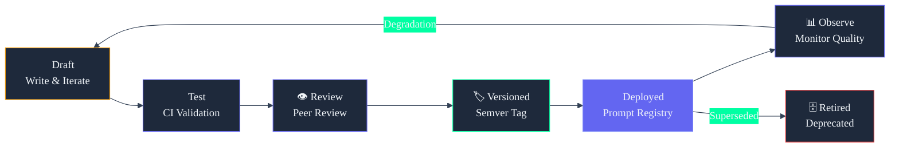

# 21. Prompts Library

## Overview

85+ ready-to-use prompts for ARIA and Claude. Sourced from the Second Brain OS Bible (Chapter 15) and extended for production use. Organized into two sections: **User Prompts** (speak to ARIA) and **Build Prompts** (use with Claude while developing).

---

## Prompt Lifecycle



---

## Section 1: Daily ARIA Prompts

### Daily Planning

```
1. What is the single most important thing I should do today to make progress toward becoming a builder rather than just a student?
2. I have 2 hours free between 4 PM and 6 PM. Given everything I am working on, what is the best use of that time?
3. I slept badly last night. What can I still do today that is useful but does not require full concentration?
4. I have 15 minutes right now. What is one useful thing that fits in 15 minutes exactly?
5. Tell me honestly — what am I procrastinating on right now? What is the real reason?
6. My week is looking overwhelming. Help me cut my task list in half. Which things are lowest value?
7. What should I focus on first this morning based on my priorities and deadlines?
8. Look at my tasks for today and tell me honestly which ones I should cut or defer.
9. My sleep score is low today. Adjust my plan to something I can actually do.
10. Give me my top 3 must-do items for today — nothing else matters.
11. ARIA, help me plan my week.
12. I only have 1 hour today. What is the single most important thing to do?
13. I am feeling overwhelmed. Can you simplify my task list to just the essentials?
14. What is the one thing I should do this week that I am currently avoiding?
```

### Opportunities & Career

```
15. Search for internship opportunities for a 3rd year BTech CSE student with Python and React skills closing this month.
16. What skills, if I learn them in the next 6 weeks, would most increase my chances of a paid internship?
17. I just got rejected from a startup internship. Here is the job description: [paste]. What was I missing and what is my 4-week fix?
18. What do companies like Zepto, Razorpay, and CRED actually look for that most colleges do not teach?
19. What hackathons are happening in the next 30 days relevant to web development and AI? Search online.
20. Search for the current year's Google Summer of Code organisations and suggest which match my skills.
21. I want a startup role, not a service company job. What is the honest difference in what each looks for?
22. Compare these two paths honestly: Path A — FAANG-track job. Path B — build products and work for myself.
23. Am I making real progress toward getting an internship? Be honest.
24. What skills should I prioritise learning in the next 30 days for my target role?
25. My GitHub has been inactive for 5 days. Suggest a small project I can commit to today.
26. Generate a weekly career progress report for me.
27. Search Product Hunt for tools launched in the last 30 days by solo developers. What can I learn from them?
28. What is the fastest path from 0 to first rupee on Fiverr for a developer in India in 2026? Search for demand.
29. Check if every skill on my developer roadmap is still in demand in 2026. Search recent job postings.
30. What YouTube programming tutorial topics are currently underserved where a new channel can get views?
```

### Courses & Learning

```
31. I enrolled in a React course 3 months ago and I am at 15%. I have 30 minutes a day. Build me a completion plan.
32. I have 3 active courses and I am behind on all of them. Help me decide which to focus on and which to pause.
33. What is the minimum I need to know about system design to not embarrass myself in a startup internship interview?
34. I have 47 videos in YouTube Watch Later. Help me sort them: watch this week, this month, archive.
35. What are the most important things a BTech CSE student should learn that will still matter in 5 years?
36. I want to learn machine learning. I know Python. Give me a realistic roadmap that leads to building something.
37. I keep abandoning courses after 3 weeks. What is going wrong and how do I fix it?
38. Which course am I most behind on and what should I do today to catch up?
39. Quiz me on the last topic I studied in DSA.
40. I have not touched my React course in a week. What are the consequences and how do I get back on track?
41. Create a 4-week study plan for completing my Node.js course by end of this month.
42. Summarise my learning progress this month and tell me if I am on track for my goals.
43. What are the most important things a BTech CSE student should learn right now that will still matter in 5 years?
44. I enrolled in [course]. Build me a daily plan starting today that guarantees completion by the deadline.
45. Give me a concept explanation of [topic] like I am 15 years old. Then give me the actual engineering version.
```

### Income & Building

```
46. I am a 3rd year BTech student with Python and JavaScript. I have never done a paid project. What is the most realistic first freelance gig in the next 4 weeks?
47. Give me 5 tool ideas small enough to build in a weekend but solving a real problem people would pay to fix.
48. I want to reach Rs. 5,000 per month in side income while maintaining my CGPA. Is this realistic? What is the exact path?
49. I built a project and want to post on LinkedIn. Write me a post that sounds genuine. Here is what I built: [describe].
50. My freelance rate is Rs. 300 per hour. What skills would double it in the next 3 months?
51. Log my income: [amount] from [source] for [hours] hours of work.
52. Show me my income breakdown by source this month.
53. What is my effective hourly rate across all income sources?
54. Which income source gave the best return on time this week?
```

### Roadmap & Goals

```
55. I want to become a full-stack developer in 6 months working 3 hours per day. I know basic HTML and CSS. Build me a complete visual roadmap.
56. Build me a business launch roadmap from idea to first 100 paying customers for a productivity SaaS targeting freelancers.
57. I am preparing for GATE 2027. Build me a complete preparation roadmap for CS branch starting from scratch.
58. Build me a financial roadmap. I earn Rs. 40,000 per month, have no savings, and want Rs. 10 lakh in 2 years.
59. My current roadmap includes AngularJS. Is it still relevant in 2026? Search online and tell me what to change.
60. I missed 3 weeks of my roadmap because I was sick. How should I adjust? What to skip, what must I do, new timeline.
61. Build me a 6-month full-stack roadmap.
62. I am 3 weeks behind on my goal. How to adjust?
63. Is AngularJS still relevant in 2026?
64. Set a new goal: [describe goal]. Generate a roadmap with milestones and time estimates.
65. Check if my roadmap is still current. Search online for any changes in the technologies I am learning.
66. Run a what-if: what happens to my roadmap if I reduce study time to 1 hour per day?
```

### Idea Validation

```
67. I have this startup idea: [describe]. Search online to see if it exists, who the competitors are, and what people complain about on Reddit or Twitter.
68. I want to validate an idea without spending money or building anything. Give me a 2-week validation plan as a college student.
69. I have 10 ideas. I only have time to pursue one. Ask me questions to help me decide which has the best combination of feasibility and market.
70. I want to build an MVP in 30 days while studying full time. Scope it down to the absolute minimum that still shows core value.
71. At what point should I treat my side project like a real business instead of just a portfolio piece?
72. Check this idea: [describe]. Do a quick market check — who are competitors, what is the estimated market size, and is there demand?
73. Give me a validation plan for [idea]. I have zero budget. Two weeks. Go.
```

### Weekly Review & Reflection

```
74. Give me a full review of my week. What did I complete versus plan? What patterns do you see?
75. I have been using this system for one month. What does my behaviour tell you about what I actually value versus what I say I value?
76. What is the one goal I have made least progress on? Why do you think that is? Should I try harder, change approach, or drop it?
77. List everything I saved in the last month that I have not acted on. Help me decide what to do, schedule, or archive.
78. How many hours did I actually study this week versus my goal?
79. What patterns do you notice in my missed tasks over the last 2 weeks?
80. Build me a realistic plan for next week based on what I know about my habits.
81. What is my biggest blocker right now and how should I remove it?
```

### Recovery & When Overwhelmed

```
82. I am overwhelmed. Too many things. Do not give me a speech. Just tell me the one thing I should do right now.
83. I want to quit everything and start over. Before I do, help me figure out if this is a real problem or just two weeks of burnout.
84. I have been saying I will start my side project for 3 months. What is actually stopping me? Ask me questions.
85. Help me cut my commitment list in half. I will tell you everything on it and you tell me what to drop without guilt.
86. I missed everything this week. Help me restart without guilt.
87. Reschedule all my missed tasks from the past 3 days into this week.
```

---

## Section 2: Build Prompts for Claude

Use these prompts with Claude.ai while developing each phase of the system.

### Database & Schema

```
1. Write a Supabase SQL schema for a tasks table with RLS for a personal productivity app. Include fields for recurrence, missed_count, and rescheduled_from.

2. Write RLS policies for these tables: tasks, goals, courses, opportunities. All must filter by auth.uid() = user_id.

3. Review my RLS policies for security holes: [paste policies]

4. Create a Supabase SQL migration that adds an aria_memory table with columns: id, user_id, key, value, importance_score, created_at, last_accessed_at.
```

### Frontend Components

```
5. Build a Next.js 14 task list component with Tailwind that shows priority, category tag, and a start/stop timer button.

6. Create a Zustand store for managing tasks with optimistic updates for marking tasks as done.

7. Write a Supabase Realtime subscription hook in React that listens for task changes and updates the UI live.

8. Optimise this Next.js component for mobile performance: [paste component]

9. Build a React Flow custom node component for roadmap milestones. Include drag handles, connection points, and a color-coded status indicator.
```

### Scheduler & Reminders

```
10. Write a Supabase Edge Function in TypeScript that runs every 15 minutes, finds overdue tasks, and moves them to the next available slot. Include auto-reschedule logic.

11. Write a Next.js API route that sends a Web Push notification using VAPID keys. Show the full service worker registration code.

12. Build a Google Calendar OAuth2 flow in Next.js that syncs a task with a due date to a Calendar event. Include two-way sync.

13. Write a sleep quality score algorithm that takes duration and self-rating and outputs a 0-100 score with explanations.

14. Write a cron job scheduler in Python using APScheduler that triggers all 8 agents at their respective times.
```

### AI Agents

```
15. Build an Orchestrator Agent using Python that receives a user message, calls a Planner and a Reminder sub-agent in parallel, and combines their outputs using Ollama.

16. Write the system prompt for ARIA — a personal AI assistant who knows the user's tasks, goals, courses, sleep data. Direct and like a smart friend, not a corporate bot.

17. Build a Memory Agent in Python that stores conversation history in Supabase and retrieves the last 10 relevant messages as context for the next AI call.

18. Create a Planner Agent function that takes a task list and sleep score and returns a prioritised daily schedule in JSON format.

19. Build an opportunity matching algorithm that takes user skills and opportunity requirements and returns a match score 0-100 with explanation.

20. Write a Python function that generates a weekly review narrative using Claude API. Include data aggregation from 6 tables and a template prompt.
```

### Deployment & Configuration

```
21. Write the complete environment variable setup guide for Second Brain OS including variables for .env.local vs Vercel dashboard vs Render.

22. My Vercel deployment is failing with this error. What is wrong and how do I fix it: [paste error]

23. Write a Dockerfile for the FastAPI backend with multi-stage build for production deployment.

24. Write a GitHub Actions workflow that runs ruff linting, pytest, and deploys on push to main.

25. Create a Render blueprint.yaml for the FastAPI backend service with environment variables, health checks, and auto-scaling.
```

---

## Section 3: Agent System Prompts

### Briefing Generation

```
Generate a morning briefing for a BTech CSE student using the following data context. The briefing must be structured, personalized, and actionable.

Context: {tasks, goals, courses, sleep, opportunities}

Output sections:
1. ARIA's Pick — the single task that matters most today, with a 1-sentence reason
2. Top 3 Priorities — ranked by urgency and energy match
3. Sleep Adjustment — if score below 60, note lighter alternatives
4. Course Focus — one course to work on today, with time estimate
5. Opportunity Highlight — one new or urgent opportunity
```

### Opportunity Scoring

```
Score each opportunity against the user's profile. Return a JSON array with score 0-100.

Input: {opportunity_title, description, skills_needed, deadline, url}
User: {skills, interests, past_application_history}

Scoring criteria:
- Skill match: 0-40 points based on overlap
- Deadline urgency: 0-30 points (under 48h: 30, under 7d: 20, under 14d: 10)
- Interest alignment: 0-20 points based on stated interests
- Past behaviour: -15 if user always skips this category

Filter out scores below 40. Sort descending.
```

### Task Breakdown

```
Break this task into concrete, completable subtasks: "{task}"

Rules:
- Each subtask must be completable in 15-60 minutes
- Each must have a clear done-condition
- Order sequentially where dependencies exist
- Max 5 subtasks

Return JSON: [{title: string, estimated_minutes: number, category: string}]
```

### Roadmap Generation

```
Generate a visual roadmap for this goal: "{goal}"

Parameters:
- Hours per day: {hours}
- Days per week: {days}
- Deadline: {date}
- Experience: {level}

Return JSON structure with milestones array. Each milestone:
- id (incrementing int)
- title
- description (1 sentence)
- estimated_days (integer, evidence-based)
- type: "milestone" | "task" | "learning" | "deliverable"
- depends_on: [milestone_id, ...]
- skills_developed: [string, ...]

Include a critical_path array with milestone ids that determine the overall timeline.
```

---

## Prompt Usage Guidelines

1. **Be specific** — Replace bracketed `[placeholders]` with real data
2. **Add context** — Mention recent events for better personalization
3. **Follow up** — Ask ARIA to elaborate on any response
4. **Voice ready** — All prompts work with Web Speech API voice input
5. **Chain prompts** — Use output of one as input to the next for deeper analysis
6. **System prompts** — Agent prompts are for backend code; user prompts are for chat
7. **Build prompts** — Use with Claude.ai during development, not with ARIA
