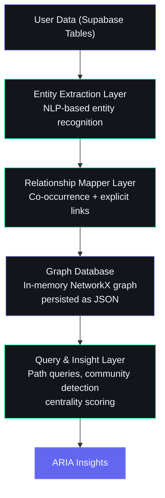

# 23. Knowledge Graph

## Overview

The knowledge graph connects all user data — tasks, goals, courses, skills, opportunities, habits, ideas, and projects — into a unified semantic network. This enables ARIA to surface hidden relationships, trace impact paths, and generate insights no single table query can produce.

---

## Architecture



---

## Entity Types

| Entity Type | Node Label | Source Table | Example |
|-------------|------------|-------------|---------|
| Task | `Task` | tasks | "Complete DSA assignment" |
| Goal | `Goal` | goals | "Become full-stack developer" |
| Course | `Course` | courses | "The Complete React Course" |
| Skill | `Skill` | users.skills | "Python", "React" |
| Opportunity | `Opportunity` | opportunities | "GSoC 2026" |
| Idea | `Idea` | ideas | "AI study planner app" |
| Project | `Project` | projects | "Portfolio website" |
| Habit | `Habit` | habits | "Study 2 hours daily" |
| Resource | `Resource` | resources | "System Design Interview book" |
| Video | `Video` | videos | "React Hooks Tutorial" |
| Income Source | `IncomeSource` | income_entries | "Fiverr freelancing" |
| Subject | `Subject` | subjects | "Data Structures" |

---

## Relationship Types

| Relationship | Source | Target | Meaning |
|-------------|--------|--------|---------|
| `CONTRIBUTES_TO` | Task, Course, Habit | Goal | Item helps achieve goal |
| `REQUIRES` | Task, Course, Goal | Skill | Item needs this skill |
| `DEVELOPS` | Task, Course, Project | Skill | Item builds this skill |
| `RELATED_TO` | Any | Any | Semantic similarity |
| `PRECEDES` | Task, Course, Milestone | Task, Course, Milestone | Temporal dependency |
| `GENERATES` | Project | IncomeSource | Project produces income |
| `BELONGS_TO` | Subtask | Task | Hierarchical grouping |
| `MENTIONED_IN` | Entity | ChatMessage | Discussed in conversation |
| `SIMILAR_TO` | Idea, Project, Opportunity | Idea, Project, Opportunity | Content-based similarity |
| `BLOCKED_BY` | Task, Project | Task, Skill, Resource | Dependency obstacle |

---

## Entity Extraction

### From Structured Data (Supabase Tables)

Entities are extracted directly from table columns with minimal processing:

```python
async def extract_entities_from_tables(user_id: str) -> list:
    """Extract all entities from user's Supabase data."""
    entities = []

    # Tasks
    tasks = supabase.from_("tasks").select("id, title, category, priority").eq("user_id", user_id).execute()
    for t in tasks.data:
        entities.append({
            "id": f"task:{t['id']}",
            "type": "Task",
            "label": t["title"],
            "properties": {"category": t.get("category"), "priority": t.get("priority")}
        })

    # Goals
    goals = supabase.from_("goals").select("id, title, type, status").eq("user_id", user_id).execute()
    for g in goals.data:
        entities.append({
            "id": f"goal:{g['id']}",
            "type": "Goal",
            "label": g["title"],
            "properties": {"type": g.get("type"), "status": g.get("status")}
        })

    # Courses
    courses = supabase.from_("courses").select("id, title, platform, status").eq("user_id", user_id).execute()
    for c in courses.data:
        entities.append({
            "id": f"course:{c['id']}",
            "type": "Course",
            "label": c["title"],
            "properties": {"platform": c.get("platform"), "status": c.get("status")}
        })

    # Skills from user profile
    users = supabase.from_("users").select("skills").eq("id", user_id).execute()
    if users.data and users.data[0].get("skills"):
        for skill in users.data[0]["skills"]:
            entities.append({
                "id": f"skill:{skill.lower().replace(' ', '_')}",
                "type": "Skill",
                "label": skill,
                "properties": {}
            })

    # Opportunities
    opps = supabase.from_("opportunities").select("id, title, category").eq("user_id", user_id).execute()
    for o in opps.data:
        entities.append({
            "id": f"opportunity:{o['id']}",
            "type": "Opportunity",
            "label": o["title"],
            "properties": {"category": o.get("category")}
        })

    return entities
```

### From Unstructured Data (Chat Messages, Notes)

For free-text content like chat messages and idea descriptions, entity extraction uses NLP:

```python
def extract_entities_from_text(text: str) -> list:
    """Extract entities from free text using keyword matching + NLP."""
    entities = []

    # Known skills dictionary
    known_skills = ["Python", "JavaScript", "React", "Node.js", "TypeScript",
                    "Django", "Flask", "Docker", "AWS", "SQL", "MongoDB"]

    for skill in known_skills:
        if skill.lower() in text.lower():
            entities.append({
                "type": "Skill",
                "label": skill,
                "source": "extracted"
            })

    # Goal-related keywords
    goal_patterns = {
        "internship": "Get Internship",
        "freelance": "Start Freelancing",
        "startup": "Build Startup",
        "gate": "GATE Preparation",
        "fullstack": "Become Full-Stack Developer",
        "machine learning": "Learn Machine Learning",
    }

    for keyword, goal_label in goal_patterns.items():
        if keyword.lower() in text.lower():
            entities.append({
                "type": "Goal",
                "label": goal_label,
                "source": "inferred"
            })

    return entities
```

---

## Relationship Mapping

### Explicit Relationships

From database foreign keys and user-defined links:

```python
async def build_explicit_relationships(user_id: str, entities: list) -> list:
    """Map explicit relationships from database references."""
    relationships = []
    entity_ids = {e["id"] for e in entities}

    # Goal-Task links (tasks with goal_id)
    tasks = supabase.from_("tasks").select("id, goal_id, title").eq("user_id", user_id).execute()
    for t in tasks.data:
        if t.get("goal_id") and f"goal:{t['goal_id']}" in entity_ids:
            relationships.append({
                "source": f"task:{t['id']}",
                "target": f"goal:{t['goal_id']}",
                "type": "CONTRIBUTES_TO"
            })

    # Course-Skill links (courses tagged with skills)
    courses = supabase.from_("courses").select("id, skills, title").eq("user_id", user_id).execute()
    for c in courses.data:
        for skill in c.get("skills", []):
            skill_id = f"skill:{skill.lower().replace(' ', '_')}"
            if skill_id in entity_ids:
                relationships.append({
                    "source": f"course:{c['id']}",
                    "target": skill_id,
                    "type": "DEVELOPS"
                })

    return relationships
```

### Implicit Relationships (Co-occurrence)

Entities mentioned together in the same context share a `RELATED_TO` relationship:

```python
def build_cooccurrence_relationships(entities_in_context: list) -> list:
    """Link entities that appear together in the same message or session."""
    relationships = []
    for i in range(len(entities_in_context)):
        for j in range(i + 1, len(entities_in_context)):
            relationships.append({
                "source": entities_in_context[i]["id"],
                "target": entities_in_context[j]["id"],
                "type": "RELATED_TO",
                "weight": 1.0
            })
    return relationships
```

---

## Graph Storage

### Runtime Format (NetworkX)

```python
import networkx as nx

graph = nx.Graph()
graph.add_node("goal:become_fullstack", type="Goal", label="Become Full-Stack Developer")
graph.add_node("skill:python", type="Skill", label="Python")
graph.add_node("course:react_course", type="Course", label="The Complete React Course")
graph.add_edge("course:react_course", "goal:become_fullstack", type="CONTRIBUTES_TO")
graph.add_edge("course:react_course", "skill:python", type="REQUIRES")
```

### Persistence Format (JSON)

```json
{
  "nodes": [
    {"id": "goal:become_fullstack", "type": "Goal", "label": "Become Full-Stack Developer", "properties": {}},
    {"id": "skill:python", "type": "Skill", "label": "Python", "properties": {}},
    {"id": "course:react_course", "type": "Course", "label": "The Complete React Course", "properties": {}}
  ],
  "edges": [
    {"source": "course:react_course", "target": "goal:become_fullstack", "type": "CONTRIBUTES_TO", "weight": 1.0},
    {"source": "course:react_course", "target": "skill:python", "type": "REQUIRES", "weight": 1.0}
  ]
}
```

### Snapshot Table: user_knowledge_graph

| Column | Type | Description |
|--------|------|-------------|
| id | uuid | Primary key |
| user_id | uuid | FK to users |
| graph_snapshot | jsonb | Full graph {nodes, edges} |
| version | int | Incrementing version |
| created_at | timestamptz | Snapshot timestamp |
| entity_count | int | Number of nodes |
| relationship_count | int | Number of edges |

---

## Graph Queries for ARIA Insights

### Path Finding — "How do I achieve this goal?"

```python
def find_path_to_goal(graph, goal_id: str, max_depth: int = 3) -> list:
    """Find actionable paths from current state to target goal."""
    paths = []
    for node in graph.nodes():
        if node == goal_id:
            continue
        if graph.nodes[node].get("type") == "Task":
            try:
                path = nx.shortest_path(graph, source=node, target=goal_id)
                if len(path) <= max_depth:
                    paths.append(path)
            except nx.NetworkXNoPath:
                continue
    return paths
```

### Skill Gap Analysis — "What's missing for this opportunity?"

```python
def find_skill_gaps(graph, opportunity_id: str, user_skills: set) -> list:
    """Find skills required by an opportunity the user does not yet have."""
    required_skills = set()
    for neighbor in graph.neighbors(opportunity_id):
        if graph.nodes[neighbor].get("type") == "Skill":
            required_skills.add(neighbor)

    gaps = required_skills - user_skills
    return [graph.nodes[g]["label"] for g in gaps]
```

### Community Detection — "What are my focus areas?"

```python
def detect_focus_clusters(graph) -> dict:
    """Use community detection to find clusters of related entities."""
    from networkx.algorithms.community import greedy_modularity_communities

    communities = greedy_modularity_communities(graph.to_undirected())

    clusters = {}
    for i, community in enumerate(communities):
        labels = [graph.nodes[n]["label"] for n in community]
        types = [graph.nodes[n]["type"] for n in community]
        clusters[f"cluster_{i}"] = {
            "entities": list(community),
            "labels": labels,
            "types": types,
            "size": len(community)
        }

    return clusters
```

### Centrality — "What matters most right now?"

```python
def find_most_connected_entities(graph, top_k: int = 5) -> list:
    """Find entities with highest degree centrality (most connected)."""
    centrality = nx.degree_centrality(graph)
    sorted_nodes = sorted(centrality.items(), key=lambda x: x[1], reverse=True)
    return [
        {
            "id": node_id,
            "label": graph.nodes[node_id]["label"],
            "type": graph.nodes[node_id]["type"],
            "centrality": score
        }
        for node_id, score in sorted_nodes[:top_k]
    ]
```

### Impact Trace — "What will happen if I drop this?"

```python
def trace_impact(graph, entity_id: str) -> dict:
    """Trace what entities will be affected if this entity is removed."""
    affected = set()
    for neighbor in graph.neighbors(entity_id):
        affected.add(neighbor)
        for second_degree in graph.neighbors(neighbor):
            if second_degree != entity_id:
                affected.add(second_degree)

    return {
        "entity": graph.nodes[entity_id]["label"],
        "directly_affected": [
            {"id": n, "label": graph.nodes[n]["label"], "type": graph.nodes[n]["type"]}
            for n in graph.neighbors(entity_id)
        ],
        "indirectly_affected": [
            {"id": n, "label": graph.nodes[n]["label"], "type": graph.nodes[n]["type"]}
            for n in affected if n not in graph.neighbors(entity_id) and n != entity_id
        ]
    }
```

---

## Integration with Vector Search

The knowledge graph works alongside vector embeddings for semantic similarity:

```python
async def hybrid_search(query: str, user_id: str, top_k: int = 10) -> list:
    """Combine vector similarity with graph connectivity for better results."""

    # 1. Get vector search results (from embeddings table)
    vector_results = await vector_search(query, user_id, top_k * 2)

    # 2. Load user's knowledge graph
    graph = await load_user_graph(user_id)

    # 3. Boost results that are more connected in the graph
    for result in vector_results:
        node_id = f"{result['type'].lower()}:{result['id']}"
        if graph.has_node(node_id):
            centrality = nx.degree_centrality(graph).get(node_id, 0)
            result["score"] = result["score"] * (1 + centrality * 0.5)

    # 4. Re-rank and return
    vector_results.sort(key=lambda x: x["score"], reverse=True)
    return vector_results[:top_k]
```

---

## Graph Refresh Cadence

| Trigger | Action | Scope |
|---------|--------|-------|
| User message | Extract entities from message text | Chat message entity |
| Task created/updated | Add/update task node + relationships | Single task |
| Goal created | Add goal node + link to tasks/skills | Single goal |
| Daily midnight | Full graph rebuild from all tables | Complete user graph |
| Weekly Sunday | Pattern detection + community re-clustering | Full graph |
| On demand | `/refresh-graph` command | Complete user graph |

---

## ARIA Insights Powered by the Graph

1. **Hidden Dependencies** — "Your DSA course is blocked because you haven't completed the Python fundamentals course you started 2 months ago."

2. **Skill Bridges** — "You already know Python. Your React course will be easier than expected — both share the same logical structuring patterns."

3. **Opportunity Fit** — "This internship requires React, which you're already learning in your course. Complete 60% of that course and you'll have a strong application."

4. **Goal Conflicts** — "You have 3 active goals that all depend on the same skill (React). Consider completing them sequentially rather than in parallel."

5. **Resource Discovery** — "The resource you saved about system design is directly relevant to your active internship preparation goal."

6. **Drop Impact** — "If you pause the Node.js course, it will delay your full-stack goal by approximately 3 weeks and affect 2 projects in your roadmap."

7. **Pattern Detection** — "You consistently abandon courses after 3 weeks when they move from fundamentals to advanced topics. Consider pairing advanced courses with a project from week 3 onwards."

8. **Income Insight** — "The skills you use for your freelance income (React, Python) are the same ones in your active courses. Completing these courses could directly increase your freelance rate."
