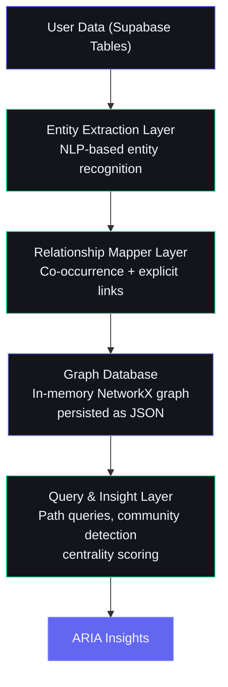
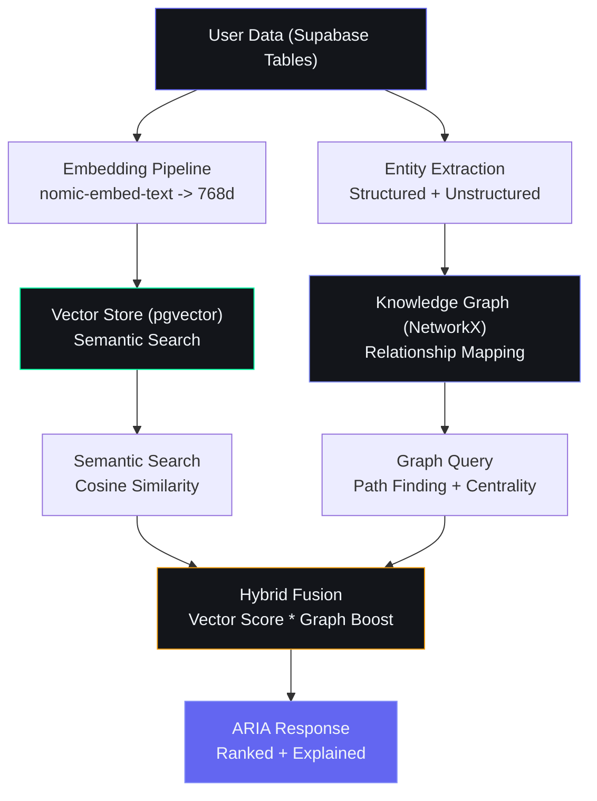

## Document Control

| Field | Value |
|---|---|
| Document ID | AI-KG-001 |
| Version | 2.0.0 |
| Status | Active |
| Last Updated | 2026-07-14 |

---

# 23. Knowledge Graph

## Overview

The knowledge graph connects all user data — tasks, goals, courses, skills, opportunities, habits, ideas, and projects — into a unified semantic network. This enables ARIA to surface hidden relationships, trace impact paths, and generate insights no single table query can produce.

---

## Architecture



---

## Entity Types

| Entity Type | Node Label | Source Table | Example |
|-------------|------------|-------------|---------|
| Task | `Task` | tasks | "Complete DSA assignment" |
| Goal | `Goal` | goals | "Become full-stack developer" |
| Course | `Course` | courses | "The Complete React Course" |
| Skill | `Skill` | users.skills | "Python", "React" |
| Opportunity | `Opportunity` | opportunities | "GSoC 2026" |
| Idea | `Idea` | ideas | "AI study planner app" |
| Project | `Project` | projects | "Portfolio website" |
| Habit | `Habit` | habits | "Study 2 hours daily" |
| Resource | `Resource` | resources | "System Design Interview book" |
| Video | `Video` | videos | "React Hooks Tutorial" |
| Income Source | `IncomeSource` | income_entries | "Fiverr freelancing" |
| Subject | `Subject` | subjects | "Data Structures" |

---

## Relationship Types

| Relationship | Source | Target | Meaning |
|-------------|--------|--------|---------|
| `CONTRIBUTES_TO` | Task, Course, Habit | Goal | Item helps achieve goal |
| `REQUIRES` | Task, Course, Goal | Skill | Item needs this skill |
| `DEVELOPS` | Task, Course, Project | Skill | Item builds this skill |
| `RELATED_TO` | Any | Any | Semantic similarity |
| `PRECEDES` | Task, Course, Milestone | Task, Course, Milestone | Temporal dependency |
| `GENERATES` | Project | IncomeSource | Project produces income |
| `BELONGS_TO` | Subtask | Task | Hierarchical grouping |
| `MENTIONED_IN` | Entity | ChatMessage | Discussed in conversation |
| `SIMILAR_TO` | Idea, Project, Opportunity | Idea, Project, Opportunity | Content-based similarity |
| `BLOCKED_BY` | Task, Project | Task, Skill, Resource | Dependency obstacle |

---

## Entity Extraction

### From Structured Data (Supabase Tables)

Entities are extracted directly from table columns with minimal processing:

```python
async def extract_entities_from_tables(user_id: str) -> list:
    """Extract all entities from user's Supabase data."""
    entities = []

    # Tasks
    tasks = supabase.from_("tasks").select("id, title, category, priority").eq("user_id", user_id).execute()
    for t in tasks.data:
        entities.append({
            "id": f"task:{t['id']}",
            "type": "Task",
            "label": t["title"],
            "properties": {"category": t.get("category"), "priority": t.get("priority")}
        })

    # Goals
    goals = supabase.from_("goals").select("id, title, type, status").eq("user_id", user_id).execute()
    for g in goals.data:
        entities.append({
            "id": f"goal:{g['id']}",
            "type": "Goal",
            "label": g["title"],
            "properties": {"type": g.get("type"), "status": g.get("status")}
        })

    # Courses
    courses = supabase.from_("courses").select("id, title, platform, status").eq("user_id", user_id).execute()
    for c in courses.data:
        entities.append({
            "id": f"course:{c['id']}",
            "type": "Course",
            "label": c["title"],
            "properties": {"platform": c.get("platform"), "status": c.get("status")}
        })

    # Skills from user profile
    users = supabase.from_("users").select("skills").eq("id", user_id).execute()
    if users.data and users.data[0].get("skills"):
        for skill in users.data[0]["skills"]:
            entities.append({
                "id": f"skill:{skill.lower().replace(' ', '_')}",
                "type": "Skill",
                "label": skill,
                "properties": {}
            })

    # Opportunities
    opps = supabase.from_("opportunities").select("id, title, category").eq("user_id", user_id).execute()
    for o in opps.data:
        entities.append({
            "id": f"opportunity:{o['id']}",
            "type": "Opportunity",
            "label": o["title"],
            "properties": {"category": o.get("category")}
        })

    return entities
```

### From Unstructured Data (Chat Messages, Notes)

For free-text content like chat messages and idea descriptions, entity extraction uses NLP:

```python
def extract_entities_from_text(text: str) -> list:
    """Extract entities from free text using keyword matching + NLP."""
    entities = []

    # Known skills dictionary
    known_skills = ["Python", "JavaScript", "React", "Node.js", "TypeScript",
                    "Django", "Flask", "Docker", "AWS", "SQL", "MongoDB"]

    for skill in known_skills:
        if skill.lower() in text.lower():
            entities.append({
                "type": "Skill",
                "label": skill,
                "source": "extracted"
            })

    # Goal-related keywords
    goal_patterns = {
        "internship": "Get Internship",
        "freelance": "Start Freelancing",
        "startup": "Build Startup",
        "gate": "GATE Preparation",
        "fullstack": "Become Full-Stack Developer",
        "machine learning": "Learn Machine Learning",
    }

    for keyword, goal_label in goal_patterns.items():
        if keyword.lower() in text.lower():
            entities.append({
                "type": "Goal",
                "label": goal_label,
                "source": "inferred"
            })

    return entities
```

---

## Relationship Mapping

### Explicit Relationships

From database foreign keys and user-defined links:

```python
async def build_explicit_relationships(user_id: str, entities: list) -> list:
    """Map explicit relationships from database references."""
    relationships = []
    entity_ids = {e["id"] for e in entities}

    # Goal-Task links (tasks with goal_id)
    tasks = supabase.from_("tasks").select("id, goal_id, title").eq("user_id", user_id).execute()
    for t in tasks.data:
        if t.get("goal_id") and f"goal:{t['goal_id']}" in entity_ids:
            relationships.append({
                "source": f"task:{t['id']}",
                "target": f"goal:{t['goal_id']}",
                "type": "CONTRIBUTES_TO"
            })

    # Course-Skill links (courses tagged with skills)
    courses = supabase.from_("courses").select("id, skills, title").eq("user_id", user_id).execute()
    for c in courses.data:
        for skill in c.get("skills", []):
            skill_id = f"skill:{skill.lower().replace(' ', '_')}"
            if skill_id in entity_ids:
                relationships.append({
                    "source": f"course:{c['id']}",
                    "target": skill_id,
                    "type": "DEVELOPS"
                })

    return relationships
```

### Implicit Relationships (Co-occurrence)

Entities mentioned together in the same context share a `RELATED_TO` relationship:

```python
def build_cooccurrence_relationships(entities_in_context: list) -> list:
    """Link entities that appear together in the same message or session."""
    relationships = []
    for i in range(len(entities_in_context)):
        for j in range(i + 1, len(entities_in_context)):
            relationships.append({
                "source": entities_in_context[i]["id"],
                "target": entities_in_context[j]["id"],
                "type": "RELATED_TO",
                "weight": 1.0
            })
    return relationships
```

---

## Graph Storage

### Runtime Format (NetworkX)

```python
import networkx as nx

graph = nx.Graph()
graph.add_node("goal:become_fullstack", type="Goal", label="Become Full-Stack Developer")
graph.add_node("skill:python", type="Skill", label="Python")
graph.add_node("course:react_course", type="Course", label="The Complete React Course")
graph.add_edge("course:react_course", "goal:become_fullstack", type="CONTRIBUTES_TO")
graph.add_edge("course:react_course", "skill:python", type="REQUIRES")
```

### Persistence Format (JSON)

```json
{
  "nodes": [
    {"id": "goal:become_fullstack", "type": "Goal", "label": "Become Full-Stack Developer", "properties": {}},
    {"id": "skill:python", "type": "Skill", "label": "Python", "properties": {}},
    {"id": "course:react_course", "type": "Course", "label": "The Complete React Course", "properties": {}}
  ],
  "edges": [
    {"source": "course:react_course", "target": "goal:become_fullstack", "type": "CONTRIBUTES_TO", "weight": 1.0},
    {"source": "course:react_course", "target": "skill:python", "type": "REQUIRES", "weight": 1.0}
  ]
}
```

### Snapshot Table: user_knowledge_graph

| Column | Type | Description |
|--------|------|-------------|
| id | uuid | Primary key |
| user_id | uuid | FK to users |
| graph_snapshot | jsonb | Full graph {nodes, edges} |
| version | int | Incrementing version |
| created_at | timestamptz | Snapshot timestamp |
| entity_count | int | Number of nodes |
| relationship_count | int | Number of edges |

---

## Graph Queries for ARIA Insights

### Path Finding — "How do I achieve this goal?"

```python
def find_path_to_goal(graph, goal_id: str, max_depth: int = 3) -> list:
    """Find actionable paths from current state to target goal."""
    paths = []
    for node in graph.nodes():
        if node == goal_id:
            continue
        if graph.nodes[node].get("type") == "Task":
            try:
                path = nx.shortest_path(graph, source=node, target=goal_id)
                if len(path) <= max_depth:
                    paths.append(path)
            except nx.NetworkXNoPath:
                continue
    return paths
```

### Skill Gap Analysis — "What's missing for this opportunity?"

```python
def find_skill_gaps(graph, opportunity_id: str, user_skills: set) -> list:
    """Find skills required by an opportunity the user does not yet have."""
    required_skills = set()
    for neighbor in graph.neighbors(opportunity_id):
        if graph.nodes[neighbor].get("type") == "Skill":
            required_skills.add(neighbor)

    gaps = required_skills - user_skills
    return [graph.nodes[g]["label"] for g in gaps]
```

### Community Detection — "What are my focus areas?"

```python
def detect_focus_clusters(graph) -> dict:
    """Use community detection to find clusters of related entities."""
    from networkx.algorithms.community import greedy_modularity_communities

    communities = greedy_modularity_communities(graph.to_undirected())

    clusters = {}
    for i, community in enumerate(communities):
        labels = [graph.nodes[n]["label"] for n in community]
        types = [graph.nodes[n]["type"] for n in community]
        clusters[f"cluster_{i}"] = {
            "entities": list(community),
            "labels": labels,
            "types": types,
            "size": len(community)
        }

    return clusters
```

### Centrality — "What matters most right now?"

```python
def find_most_connected_entities(graph, top_k: int = 5) -> list:
    """Find entities with highest degree centrality (most connected)."""
    centrality = nx.degree_centrality(graph)
    sorted_nodes = sorted(centrality.items(), key=lambda x: x[1], reverse=True)
    return [
        {
            "id": node_id,
            "label": graph.nodes[node_id]["label"],
            "type": graph.nodes[node_id]["type"],
            "centrality": score
        }
        for node_id, score in sorted_nodes[:top_k]
    ]
```

### Impact Trace — "What will happen if I drop this?"

```python
def trace_impact(graph, entity_id: str) -> dict:
    """Trace what entities will be affected if this entity is removed."""
    affected = set()
    for neighbor in graph.neighbors(entity_id):
        affected.add(neighbor)
        for second_degree in graph.neighbors(neighbor):
            if second_degree != entity_id:
                affected.add(second_degree)

    return {
        "entity": graph.nodes[entity_id]["label"],
        "directly_affected": [
            {"id": n, "label": graph.nodes[n]["label"], "type": graph.nodes[n]["type"]}
            for n in graph.neighbors(entity_id)
        ],
        "indirectly_affected": [
            {"id": n, "label": graph.nodes[n]["label"], "type": graph.nodes[n]["type"]}
            for n in affected if n not in graph.neighbors(entity_id) and n != entity_id
        ]
    }
```

---

## Integration with Vector Search

The knowledge graph works alongside vector embeddings for semantic similarity:

```python
async def hybrid_search(query: str, user_id: str, top_k: int = 10) -> list:
    """Combine vector similarity with graph connectivity for better results."""

    # 1. Get vector search results (from embeddings table)
    vector_results = await vector_search(query, user_id, top_k * 2)

    # 2. Load user's knowledge graph
    graph = await load_user_graph(user_id)

    # 3. Boost results that are more connected in the graph
    for result in vector_results:
        node_id = f"{result['type'].lower()}:{result['id']}"
        if graph.has_node(node_id):
            centrality = nx.degree_centrality(graph).get(node_id, 0)
            result["score"] = result["score"] * (1 + centrality * 0.5)

    # 4. Re-rank and return
    vector_results.sort(key=lambda x: x["score"], reverse=True)
    return vector_results[:top_k]
```

---

## Graph Refresh Cadence

| Trigger | Action | Scope |
|---------|--------|-------|
| User message | Extract entities from message text | Chat message entity |
| Task created/updated | Add/update task node + relationships | Single task |
| Goal created | Add goal node + link to tasks/skills | Single goal |
| Daily midnight | Full graph rebuild from all tables | Complete user graph |
| Weekly Sunday | Pattern detection + community re-clustering | Full graph |
| On demand | `/refresh-graph` command | Complete user graph |

---

## ARIA Insights Powered by the Graph

1. **Hidden Dependencies** — "Your DSA course is blocked because you haven't completed the Python fundamentals course you started 2 months ago."

2. **Skill Bridges** — "You already know Python. Your React course will be easier than expected — both share the same logical structuring patterns."

3. **Opportunity Fit** — "This internship requires React, which you're already learning in your course. Complete 60% of that course and you'll have a strong application."

4. **Goal Conflicts** — "You have 3 active goals that all depend on the same skill (React). Consider completing them sequentially rather than in parallel."

5. **Resource Discovery** — "The resource you saved about system design is directly relevant to your active internship preparation goal."

6. **Drop Impact** — "If you pause the Node.js course, it will delay your full-stack goal by approximately 3 weeks and affect 2 projects in your roadmap."

7. **Pattern Detection** — "You consistently abandon courses after 3 weeks when they move from fundamentals to advanced topics. Consider pairing advanced courses with a project from week 3 onwards."

8. **Income Insight** — "The skills you use for your freelance income (React, Python) are the same ones in your active courses. Completing these courses could directly increase your freelance rate."

---

## Security

### Data Isolation

Knowledge graph data is highly sensitive — it represents the complete semantic map of a user's digital life. Strict isolation is enforced at every layer:

```sql
-- RLS on graph snapshot table
ALTER TABLE user_knowledge_graph ENABLE ROW LEVEL SECURITY;

CREATE POLICY user_graph_isolation ON user_knowledge_graph
    FOR ALL USING (user_id = auth.uid())
    WITH CHECK (user_id = auth.uid());

-- RLS on entity extraction logs
CREATE TABLE graph_entity_extraction_log (
    id UUID PRIMARY KEY DEFAULT gen_random_uuid(),
    user_id UUID NOT NULL REFERENCES users(id) ON DELETE CASCADE,
    extraction_timestamp TIMESTAMPTZ NOT NULL DEFAULT now(),
    entities_found INTEGER,
    relationships_found INTEGER,
    source_type TEXT,            -- structured, unstructured
    extraction_duration_ms INTEGER
);

ALTER TABLE graph_entity_extraction_log ENABLE ROW LEVEL SECURITY;
CREATE POLICY graph_log_isolation ON graph_entity_extraction_log
    FOR ALL USING (user_id = auth.uid())
    WITH CHECK (user_id = auth.uid());
```

### Access Controls by Role

| Role | Read Graph | Write Graph | Execute Queries | Export Graph |
|---|---|---|---|---|
| User | Own graph only | Own graph only | Own graph only | Own graph (JSON) |
| AI Agent | Current user only (via context) | New entities from chat only | Path/insight queries | None |
| Admin | All graphs (aggregate stats only) | None | Aggregate graph stats | Anonymized only |
| Developer | All graphs (debug mode only) | Write (maintenance) | All queries | With audit log |

### Security Risks and Mitigations

| Risk | Severity | Mitigation |
|---|---|---|
| Re-identification via graph structure | Medium | Only expose graph query results through ARIA's natural language; never raw graph data |
| Entity extraction of sensitive data | High | PII filter on text before entity extraction; skip extraction for sensitive fields |
| Graph poisoning via malicious input | Medium | Input sanitization on chat messages before entity extraction; validate entity labels |
| Cross-user graph inference | Low | User-isolated graph snapshots; no global graph |
| Brute-force graph traversal | Low | Rate limit on `/refresh-graph` endpoint (max 1 per 5 min per user) |

### PII Filtering in Entity Extraction

```python
# packages/ai/knowledge_graph/security.py
class GraphPIIFilter:
    """Prevent sensitive information from entering the knowledge graph."""

    SENSITIVE_PATTERNS = {
        "password": r"(?i)(password|passwd|pwd)\s*[:=]\s*\S+",
        "api_key": r"(?i)(api[_-]?key|secret)\s*[:=]\s*\S+",
        "token": r"\b(eyJ[A-Za-z0-9_-]{10,}\.[A-Za-z0-9_-]{10,}\.[A-Za-z0-9_-]{10,})\b",
        "financial": r"\b\d{16}\b",  # Credit card numbers
    }

    def filter_entity_label(self, label: str) -> tuple[str, bool]:
        """Check if label contains sensitive data. Returns (cleaned_label, was_redacted)."""
        for pattern_name, pattern in self.SENSITIVE_PATTERNS.items():
            if re.search(pattern, label):
                logger.warning("graph.pii_detected", pattern=pattern_name)
                return "[Redacted]", True
        return label, False

    def filter_entity_batch(self, entities: list[dict]) -> list[dict]:
        """Filter a batch of entities for PII."""
        filtered = []
        for entity in entities:
            clean_label, redacted = self.filter_entity_label(entity.get("label", ""))
            entity["label"] = clean_label
            entity["pii_redacted"] = redacted
            filtered.append(entity)
        return filtered
```

---

## Error Handling

### Graph Operation Failures

| Failure Mode | Impact | Detection | Recovery |
|---|---|---|---|
| Entity extraction timeout | Partial graph update | asyncio.TimeoutError (5s timeout) | Fallback to structured extraction only |
| NetworkX operation error | Query returns incomplete results | nx exception caught | Return partial results with warning flag |
| Graph snapshot save failure | Last good snapshot preserved | supabase write error | Retry with backoff (3 attempts); keep previous version |
| JSON serialization error | Single entity lost | TypeError on serialization | Skip un-serializable entity, log warning |
| Concurrent graph updates | Race condition on version | Version conflict (optimistic lock) | Increment version; retry merge |
| Corrupt graph data | Queries fail | Deserialization error | Restore from last known good snapshot |

### Graceful Degradation

```python
# packages/ai/knowledge_graph/error_handler.py
class GraphErrorHandler:
    """Handle graph operation failures with graceful degradation."""

    async def safe_build_graph(self, user_id: str) -> dict:
        """Build user graph with fallback strategies."""
        try:
            return await self._build_full_graph(user_id)
        except TimeoutError:
            logger.warning("graph.build.timeout", user_id=user_id)
            return await self._build_structured_only_graph(user_id)  # Skip NLP extraction
        except Exception as e:
            logger.error("graph.build.failed", user_id=user_id, error=str(e))
            return await self._load_last_snapshot(user_id)  # Return stale graph

    async def safe_query(self, graph: nx.Graph, query_type: str, params: dict) -> dict:
        """Execute graph query with fallback for unsupported operations."""
        try:
            return await self._execute_query(graph, query_type, params)
        except nx.NetworkXError as e:
            logger.warning("graph.query.error", query_type=query_type, error=str(e))
            return {"error": str(e), "partial_results": [], "degraded": True}
        except Exception as e:
            logger.error("graph.query.fatal", query_type=query_type, error=str(e))
            return {"error": "Query failed", "results": [], "degraded": True}

    async def safe_save_snapshot(self, user_id: str, graph: nx.Graph) -> bool:
        """Save graph snapshot with automatic recovery."""
        version = await self._get_current_version(user_id)
        try:
            snapshot = self._serialize_graph(graph)
            await self.supabase.from_("user_knowledge_graph").insert({
                "user_id": user_id,
                "graph_snapshot": snapshot,
                "version": version + 1,
                "entity_count": graph.number_of_nodes(),
                "relationship_count": graph.number_of_edges(),
            }).execute()
            return True
        except Exception as e:
            logger.error("graph.save.failed", user_id=user_id, version=version, error=str(e))
            return False
```

### Consistency Recovery

```python
class GraphConsistencyChecker:
    """Validate graph integrity and repair inconsistencies."""

    async def check_and_repair(self, user_id: str) -> dict:
        """Run consistency checks and auto-repair issues."""
        graph = await self._load_graph(user_id)
        issues = []

        # Check 1: Orphan edges (edge referencing non-existent node)
        for edge in graph.edges():
            if not graph.has_node(edge[0]) or not graph.has_node(edge[1]):
                graph.remove_edge(edge[0], edge[1])
                issues.append(f"Removed orphan edge: {edge}")

        # Check 2: Duplicate nodes
        seen = set()
        for node in list(graph.nodes()):
            if node in seen:
                graph.remove_node(node)
                issues.append(f"Removed duplicate node: {node}")
            seen.add(node)

        # Check 3: Stale entities (referencing deleted source records)
        for node in list(graph.nodes()):
            if ":" in node:
                source_type, source_id = node.split(":", 1)
                if source_type in ("task", "goal", "course"):
                    exists = await self._check_record_exists(source_type, source_id)
                    if not exists:
                        graph.remove_node(node)
                        issues.append(f"Removed stale entity: {node}")

        return {"repaired": len(issues), "issues": issues, "graph": graph}
```

---

## Performance

### Graph Query Latency at Scale

| Operation | 100 Entities | 1,000 Entities | 10,000 Entities | Degradation Factor |
|---|---|---|---|---|
| Load graph (JSON deserialize) | 2ms | 15ms | 150ms | O(n) |
| Build graph from database | 50ms | 500ms | 5,000ms | O(n) |
| Path finding (shortest_path) | 1ms | 5ms | 50ms | O(V+E) |
| Community detection | 10ms | 100ms | 2,000ms | O(V log V) |
| Degree centrality | 1ms | 5ms | 50ms | O(V) |
| Impact trace (2 hops) | 2ms | 10ms | 100ms | O(d^2) |
| Skill gap analysis | 1ms | 3ms | 20ms | O(k) |
| JSON serialization | 1ms | 10ms | 100ms | O(V+E) |
| Save snapshot to Supabase | 10ms | 50ms | 500ms | O(n) |

### Indexing Strategy

```python
# packages/ai/knowledge_graph/indexing.py
class GraphIndexManager:
    """Maintain auxiliary indexes for fast graph operations."""

    def __init__(self):
        self.indexes = {}

    async def build_indexes(self, graph: nx.Graph):
        """Build all auxiliary indexes after graph construction."""
        start = time.time()

        # Index 1: Entity type index (for type-filtered queries)
        type_index = defaultdict(list)
        for node, data in graph.nodes(data=True):
            type_index[data.get("type", "Unknown")].append(node)
        self.indexes["type_index"] = dict(type_index)

        # Index 2: Relationship type index (for relation-filtered queries)
        rel_index = defaultdict(list)
        for u, v, data in graph.edges(data=True):
            rel_index[data.get("type", "related")].append((u, v))
        self.indexes["rel_index"] = dict(rel_index)

        # Index 3: Label text index (for search)
        label_index = {}
        for node, data in graph.nodes(data=True):
            label = data.get("label", "").lower()
            for word in label.split():
                if word not in label_index:
                    label_index[word] = []
                label_index[word].append(node)
        self.indexes["label_index"] = label_index

        logger.info("graph.indexes.built", duration_ms=(time.time() - start) * 1000)

    def search_by_label(self, query: str) -> list[str]:
        """Fast label search using pre-built text index."""
        words = query.lower().split()
        if not words or "label_index" not in self.indexes:
            return []
        results = set(self.indexes["label_index"].get(words[0], []))
        for word in words[1:]:
            results &= set(self.indexes["label_index"].get(word, []))
        return list(results)
```

### Performance Optimization Recommendations

| Technique | Improvement | Implementation Complexity | When to Apply |
|---|---|---|---|
| Lazy graph loading (load on first query) | 100% reduction in startup cost | Low | Always |
| Incremental graph updates (no full rebuild) | 10x faster for single changes | Medium | Production |
| Cache query results (TTL: 5 min) | 5x throughput for repeated queries | Low | High-traffic deployments |
| Async relationship builder | 3x faster build | Medium | Large graphs (> 1K entities) |
| Graph pruning (archive entities > 90 days stale) | 30% size reduction | Medium | Periodic maintenance |
| Edge-weight-based path finding | More relevant paths | Medium | Insight quality |

---

## Monitoring

### Graph Health Metrics

| Metric | Type | Description | Alert Threshold |
|---|---|---|---|
| `graph.entity_count` | Gauge | Number of entities per user | N/A (monitor trend) |
| `graph.relationship_count` | Gauge | Number of relationships per user | N/A (monitor trend) |
| `graph.density` | Gauge | Edge count / (Node count * (Node count - 1)) | > 0.3 (too dense, likely errors) |
| `graph.build_duration_ms` | Histogram | Time to build/refresh graph | > 5,000ms |
| `graph.query_duration_ms` | Histogram | Time to execute graph queries | > 500ms |
| `graph.save_duration_ms` | Histogram | Time to persist snapshot | > 1,000ms |
| `graph.entity_extraction_rate` | Counter | Entities extracted per source | N/A |
| `graph.stale_entity_cleanup` | Counter | Entities removed due to staleness | N/A |
| `graph.error_rate` | Counter | Graph operation errors | > 5% |

### Refresh Cadence Tracking

```python
# packages/ai/knowledge_graph/monitoring.py
class GraphRefreshMonitor:
    """Track graph refresh cadence and health."""

    async def record_refresh(self, user_id: str, trigger: str, duration_ms: int, entities: int, relationships: int):
        """Record a graph refresh event for monitoring."""
        await self.supabase.from_("graph_refresh_log").insert({
            "user_id": user_id,
            "trigger": trigger,           # message, cron, api, manual
            "duration_ms": duration_ms,
            "entities_found": entities,
            "relationships_found": relationships,
            "success": True,
        }).execute()

    async def get_refresh_health(self, user_id: str) -> dict:
        """Get graph refresh health summary for a user."""
        logs = await self.supabase.from_("graph_refresh_log")\
            .select("*")\
            .eq("user_id", user_id)\
            .order("created_at", desc=True)\
            .limit(20)\
            .execute()

        if not logs.data:
            return {"status": "never_refreshed"}

        recent = logs.data[:10]
        avg_duration = sum(l["duration_ms"] for l in recent) / len(recent)
        success_rate = sum(1 for l in recent if l["success"]) / len(recent)

        return {
            "status": "healthy" if success_rate > 0.9 else "degraded",
            "last_refresh": logs.data[0]["created_at"],
            "avg_duration_ms": avg_duration,
            "success_rate": success_rate,
            "total_refreshes": len(logs.data),
        }
```

### Dashboard Panels

A dedicated Grafana panel for graph health:

```
|-------------------------------------------------------|
| Graph Entity Count (per user, avg)                    |
| Line: 7-day trend                                     |
| Current: 45.2 entities/user   Trend: +12% vs prev wk |
|-------------------------------------------------------|
| Graph Build Latency (p50/p95/p99)                     |
| Line: 24h timeline                                    |
| P50: 120ms  P95: 450ms  P99: 1800ms                   |
|-------------------------------------------------------|
| Graph Refresh Success Rate                            |
| Gauge: 96.2%                                          |
|-------------------------------------------------------|
| Top Graph Query Types                                 |
| Bar: path_finding (42%), centrality (28%), gap (20%)  |
|-------------------------------------------------------|
```

---

## Integration with Embedding / Vector System

The knowledge graph and vector embedding system are complementary and deeply integrated:

### Hybrid Search with Graph Boost

```python
# packages/ai/knowledge_graph/hybrid_search.py
class GraphEnhancedSearch:
    """Combine vector similarity with graph connectivity for ranked retrieval."""

    async def search(self, query: str, user_id: str, top_k: int = 10) -> list[dict]:
        """Hybrid search: vector similarity boosted by graph centrality."""
        # 1. Get vector search results (from embeddings table)
        vector_results = await vector_search(query, user_id, top_k * 2)

        # 2. Load user's knowledge graph
        graph = await self.load_user_graph(user_id)

        # 3. Boost results that are more connected in the graph
        centrality = nx.degree_centrality(graph) if graph.number_of_nodes() > 0 else {}

        for result in vector_results:
            node_id = self._to_node_id(result)
            if node_id in centrality:
                result["score"] = result.get("score", 0) * (1 + centrality[node_id] * 0.5)
                result["graph_boost"] = centrality[node_id]

            # Add graph context
            if node_id in graph:
                neighbors = list(graph.neighbors(node_id))[:5]
                result["graph_neighbors"] = [
                    {"id": n, "label": graph.nodes[n].get("label", ""), "type": graph.nodes[n].get("type", "")}
                    for n in neighbors
                ]

        # 4. Re-rank and return
        vector_results.sort(key=lambda x: x.get("score", 0), reverse=True)
        return vector_results[:top_k]
```

### Cross-System Data Flow



### Shared Entity Resolution

Entities extracted for the knowledge graph are also tagged with the same IDs used in the embedding system:

```python
class EntityResolver:
    """Ensure consistent entity IDs between graph and vector systems."""

    def resolve_entity_id(self, source_table: str, source_id: str) -> str:
        """Generate a consistent entity ID used in both systems."""
        return f"{source_table[:-1]}:{source_id}"  # e.g., task:abc-123

    def resolve_embedding_id(self, source_table: str, source_id: str) -> str:
        """Generate the embedding record ID for cross-reference."""
        return f"{source_table}:{source_id}"

    async def get_entity_with_embeddings(
        self, user_id: str, entity_id: str
    ) -> dict:
        """Fetch both graph entity data and its vector embeddings."""
        graph = await load_user_graph(user_id)
        node_data = graph.nodes.get(entity_id, {})

        embeddings = await supabase.from_("document_embeddings")\
            .select("content, embedding")\
            .eq("user_id", user_id)\
            .eq("source_record_id", entity_id.split(":")[-1])\
            .execute()

        return {
            "graph_data": node_data,
            "embeddings": embeddings.data,
            "entity_id": entity_id,
        }
```

### Unified Refresh Job

A single cron job refreshes both systems in sequence:

```python
async def unified_refresh(user_id: str):
    """Refresh both knowledge graph and embeddings for a user."""
    # Phase 1: Update graph
    graph_builder = GraphBuilder()
    graph = await graph_builder.build_graph(user_id)
    await graph_builder.save_snapshot(user_id, graph)

    # Phase 2: Update embeddings (only for tables that changed)
    indexer = EmbeddingIndexer()
    await indexer.index_user(user_id)

    # Phase 3: Cross-reference validation
    resolver = EntityResolver()
    issues = await resolver.validate_consistency(user_id, graph)
    if issues:
        logger.warning("graph.embedding.inconsistency", user_id=user_id, issues=issues)

    logger.info("graph.embedding.refresh.complete", user_id=user_id)
```

---

## Related Documents

| Document | Description | Cross-Reference |
|---|---|---|
| [Embeddings.md](Embeddings.md) | Embedding generation and storage | Shared vector representation for graph nodes |
| [RAGArchitecture.md](RAGArchitecture.md) | Retrieval-augmented generation | Graph-enhanced retrieval for context assembly |
| [22_MemoryArchitecture.md](22_MemoryArchitecture.md) | Memory system architecture | Graph as long-term semantic memory store |
| [SemanticMemory.md](SemanticMemory.md) | Semantic memory implementation | Entity relationships stored in knowledge graph |
| [MCP-Architecture.md](MCP-Architecture.md) | MCP server architecture | Graph query tools exposed via MCP |
| [docs/engineering/15_Database.md](../engineering/15_Database.md) | Database schema | Supabase tables feeding entity extraction |
| [docs/ai/20_Agent.md](20_Agent.md) | AI agent specification | Agents consuming graph insights |
