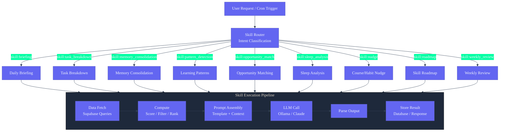

# 36. Skills

## Overview

AI agents in Second Brain OS have a defined set of skills — distinct capabilities that combine data access, prompt templates, and decision logic to produce specific outputs. This document catalogs every skill, how it is invoked, and how skills improve over time.

---

## Skill Architecture

```
User request or system trigger
    │
    ▼
┌─────────────────────┐
│ Skill Router        │ ← Maps intent to skill
│ (Orchestrator)      │
└──────────┬──────────┘
           ▼
┌─────────────────────┐
│ Skill Executor      │ ← Runs the skill: data + prompt + logic
│ (Agent function)    │
└──────────┬──────────┘
           ▼
┌─────────────────────┐
│ Output Formatter    │ ← Formats result for user or storage
│ (Template)          │
└──────────┬──────────┘
           ▼
    Response / Database write
```

---

## Skills System Architecture



---

## Skill Catalog

### 1. Daily Briefing Generation

| Property | Value |
|----------|-------|
| **Skill ID** | `skill:briefing` |
| **Agent** | Briefing Agent (#1) |
| **Trigger** | 7 AM cron, or user says "Good morning" |
| **Input** | Real-time data: tasks, goals, courses, sleep, habits, opportunities |
| **Output** | Structured morning briefing JSON |
| **LLM Required** | Yes (Claude or Ollama) |
| **Complexity** | Medium |

**Skill Steps:**

1. Query Supabase for today's state (tasks, goals, courses, sleep, habits)
2. Calculate productivity score (task completion × sleep factor × streak factor)
3. Calculate course target minutes (remaining progress / days until deadline)
4. Rank pending tasks by priority and urgency
5. Call LLM with briefing prompt template
6. Parse structured output and insert into daily_briefings table
7. Return formatted briefing dictionary

**Improvement Mechanism:**

- Track briefing read-rate (did user open it within 30 min?)
- Track which recommendations user acts on
- Adjust prompt to emphasize acted-on sections
- Learn user's preferred briefing length over time

---

### 2. Task Breakdown

| Property | Value |
|----------|-------|
| **Skill ID** | `skill:task_breakdown` |
| **Agent** | Task Agent (#2) |
| **Trigger** | User asks "Break this task down" or task created with description |
| **Input** | Task title + description |
| **Output** | 2-5 subtasks inserted into tasks table |
| **LLM Required** | No (keyword-based breakdown) |
| **Complexity** | Low |

**Skill Steps:**

1. Parse task description for keywords (research, write, build, code, design, test)
2. Map keywords to subtask templates
3. Create subtasks in Supabase with parent_task_id
4. Apply original task's priority and category to subtasks
5. Return created subtask list

**Improvement Mechanism:**

- Log which breakdown patterns lead to completed subtasks
- Add new keyword→template mappings based on successful patterns
- Increase detail level for task categories user often abandons
- Learn user's typical subtask time estimates

---

### 3. Opportunity Matching

| Property | Value |
|----------|-------|
| **Skill ID** | `skill:opportunity_match` |
| **Agent** | Opportunity Agent (#3) |
| **Trigger** | 6 AM daily cron |
| **Input** | User skills, interests, past opportunity history |
| **Output** | Scored opportunities inserted into opportunities table |
| **LLM Required** | Yes (for parsing and ranking) |
| **Complexity** | High |

**Skill Steps:**

1. Fetch user profile (skills array, interests, past applications)
2. For each category (internships, hackathons, open source, etc.):
   a. Query external sources (or use cached/mock data)
   b. Parse opportunity details (title, description, skills, deadline)
3. For each parsed opportunity, calculate match score
4. Apply deadline urgency bonus and history penalty
5. Filter out scores below 40
6. Sort by score descending
7. Insert top 20 into opportunities table
8. Generate 1-sentence personalized reason

**Improvement Mechanism:**

- Track which scored opportunities user clicks/applies to
- Adjust scoring weights based on user behavior (if user always ignores hackathons, reduce weight)
- Learn user's preferred opportunity categories
- Improve skill extraction from opportunity descriptions

---

### 4. Roadmap Building

| Property | Value |
|----------|-------|
| **Skill ID** | `skill:roadmap_build` |
| **Agent** | Orchestrator (calls LLM directly) |
| **Trigger** | User says "Build me a roadmap for..." |
| **Input** | Goal description, hours/day, days/week, deadline, experience level |
| **Output** | JSON roadmap with milestones, saved to goals table |
| **LLM Required** | Yes (Claude for structured generation) |
| **Complexity** | High |

**Skill Steps:**

1. Collect goal parameters from user (title, time commitment, deadline, experience)
2. Build roadmap generation prompt with all parameters
3. Call LLM with structured output format requirement
4. Parse returned milestone array
5. Validate milestones (reasonable time estimates, logical ordering)
6. Generate tasks from each milestone
7. Save goal + milestones + tasks to Supabase
8. Return rendered roadmap

**Improvement Mechanism:**

- Track roadmap completion rate per milestone
- Calibrate time estimates based on actual user pace
- Learn which roadmap types (career, exam, project) user completes best
- Adjust milestone granularity based on user preference

---

### 5. Weekly Review Generation

| Property | Value |
|----------|-------|
| **Skill ID** | `skill:weekly_review` |
| **Agent** | Weekly Review Agent (#5) |
| **Trigger** | Sunday 8 PM cron |
| **Input** | Full week's data from 6+ tables |
| **Output** | Narrative review → email + app |
| **LLM Required** | Yes (Claude for narrative) |
| **Complexity** | High |

**Skill Steps:**

1. Query all data sources for the past week:
   - tasks (completed, missed, created)
   - courses (hours studied, topics covered)
   - income_entries (amount, source, hours)
   - habits (streaks, consistency)
   - sleep_logs (average score, hours)
   - goals (progress updates)
   - chat_messages (key decisions)
2. Calculate aggregate metrics (completion rate, trend comparisons)
3. Detect behavioral patterns (abandoned categories, peak times)
4. Build review prompt with all metrics
5. Call LLM for narrative generation
6. Save review to app and send via email (Resend)
7. Update month-over-month comparison if applicable

**Improvement Mechanism:**

- Track user engagement with reviews (read time, follow-up actions)
- Adjust narrative tone based on user's weekly performance (gentler on bad weeks)
- Learn which metrics user cares about most
- Improve pattern detection with more data

---

### 6. Idea Validation

| Property | Value |
|----------|-------|
| **Skill ID** | `skill:idea_validation` |
| **Agent** | Orchestrator |
| **Trigger** | User captures idea or says "Validate this idea" |
| **Input** | Idea title + description |
| **Output** | Market check report (competitors, feasibility, validation plan) |
| **LLM Required** | Yes |
| **Complexity** | Medium |

**Skill Steps:**

1. Extract idea name and description
2. Search online for existing solutions and competitors
3. Analyze market signals (Reddit complaints, search trends)
4. Estimate market size and feasibility
5. Generate validation plan (2-week, zero-budget)
6. Store enriched idea in ideas table
7. Return market check report

**Improvement Mechanism:**

- Track which validated ideas user actually builds
- Improve competitor search accuracy over time
- Learn which validation steps user actually completes
- Refine market size estimation based on user's target audience

---

### 7. Task Prioritization

| Property | Value |
|----------|-------|
| **Skill ID** | `skill:task_prioritize` |
| **Agent** | Task Agent (#2) |
| **Trigger** | User says "Prioritize my tasks" or daily briefing |
| **Input** | All pending tasks + sleep score + goal links |
| **Output** | Reordered task list with priority assignments |
| **LLM Required** | No (algorithmic) |
| **Complexity** | Low |

**Skill Steps:**

1. Fetch all pending tasks with priorities and due dates
2. Sort by: urgency (priority level), then deadline (closest first)
3. If sleep score < 60: move heavy cognitive tasks to end
4. Apply goal-linked tasks boost (tasks linked to active goals get +1 level)
5. Return top 10 prioritized tasks

**Improvement Mechanism:**

- Track which prioritized tasks user actually completes
- Adjust priority ranking for repeated procrastination on certain categories
- Learn user's productive time of day and align task types accordingly

---

### 8. Course Catch-Up Plan

| Property | Value |
|----------|-------|
| **Skill ID** | `skill:course_plan` |
| **Agent** | Learning Agent (#4) |
| **Trigger** | User says "Help me catch up on [course]" |
| **Input** | Course progress, deadline, daily availability |
| **Output** | Daily study plan until deadline |
| **LLM Required** | Yes |
| **Complexity** | Medium |

**Skill Steps:**

1. Get course details (progress %, deadline, total content estimate)
2. Calculate remaining content and days until deadline
3. Calculate daily minutes needed = remaining_work / days_left
4. Check user's actual study history (avg daily study time)
5. If required > historical max: flag as unrealistic, suggest extension
6. Generate day-by-day study plan with topics
7. Create tasks for each study session
8. Return plan

**Improvement Mechanism:**

- Track plan adherence vs actual study
- Calibrate content estimation per platform (Udemy vs Coursera vs NPTEL)
- Learn user's optimal daily study duration
- Adjust topic sequencing based on difficulty ratings

---

### 9. Knowledge Graph Insight

| Property | Value |
|----------|-------|
| **Skill ID** | `skill:graph_insight` |
| **Agent** | Orchestrator |
| **Trigger** | User asks "What connects X and Y?" or weekly analysis |
| **Input** | User's full knowledge graph |
| **Output** | Natural language insight about entity relationships |
| **LLM Required** | Yes (explain graph results) |
| **Complexity** | High |

**Skill Steps:**

1. Load user's knowledge graph
2. Run relevant graph query (shortest path, centrality, community)
3. Get raw graph analysis results
4. Call LLM to convert graph data into natural language insight
5. Return insight with actionable recommendation

**Improvement Mechanism:**

- Track which types of insights user finds valuable
- Improve graph query selection based on context
- Learn which entity relationships matter most to user

---

### 10. Sleep-Aware Schedule Adjustment

| Property | Value |
|----------|-------|
| **Skill ID** | `skill:sleep_adjust` |
| **Agent** | Sleep Agent (#6) |
| **Trigger** | New sleep log entry (morning) |
| **Input** | Sleep score + today's task list |
| **Output** | Adjusted task schedule |
| **LLM Required** | No (algorithmic) |
| **Complexity** | Low |

**Skill Steps:**

1. Receive sleep score (0-100) from user log or auto-detection
2. Fetch today's pending tasks
3. Classify tasks: heavy cognitive (coding, studying, writing) vs light (reviewing, organizing, routine)
4. If score < 50: move heavy tasks to afternoon or tomorrow
5. If hours < 5: reschedule all non-critical tasks
6. Return adjusted schedule with explanation

**Improvement Mechanism:**

- Learn user's actual cognitive capacity vs reported sleep score
- Track if adjusted schedule leads to better task completion
- Fine-tune threshold scores based on individual user physiology

---

### 11. Habit Streak Protection

| Property | Value |
|----------|-------|
| **Skill ID** | `skill:habit_protect` |
| **Agent** | Habit Agent (#7) |
| **Trigger** | Midnight cron, missed habit detection |
| **Input** | Habit logs, streak data |
| **Output** | Notification + streak preservation logic |
| **LLM Required** | No |
| **Complexity** | Low |

**Skill Steps:**

1. Check each active habit for today's log entry
2. If missing: log missed_count++, check streak boundary
3. If 2 consecutive misses: send "Streak at risk" notification
4. If logged: reset missed_count, update current streak
5. Compare with best streak, update if beaten
6. Calculate consistency % = (days_logged / days_in_period) × 100

**Improvement Mechanism:**

- Learn optimal reminder time per habit
- Detect which habits user consistently drops → suggest archiving
- Identify habit chains (habits user does together) → suggest bundling

---

### 12. Browser Extension Capture

| Property | Value |
|----------|-------|
| **Skill ID** | `skill:capture` |
| **Agent** | Orchestrator (receives from browser extension) |
| **Trigger** | User saves item via browser extension |
| **Input** | URL, title, selected text, category |
| **Output** | Enriched saved item (summary, tags, goal links) |
| **LLM Required** | Yes (for enrichment) |
| **Complexity** | Low (capture) / Medium (enrichment) |

**Skill Steps:**

1. Receive raw capture (URL, title, type)
2. Save to appropriate table (videos, resources, ideas)
3. Call LLM for enrichment:
   - YouTube: 3-sentence summary
   - Article: auto-tag with topics and skills
   - Idea: preliminary market check
4. Link to relevant goals automatically
5. Return enrichment result as notification

**Improvement Mechanism:**

- Track which captured items user actually consumes later
- Improve tagging accuracy with user corrections
- Learn user's content preferences for better goal linking

---

## Skill Invocation Matrix

| Skill | User Chat | Cron | API Call | Browser Ext |
|-------|-----------|------|----------|-------------|
| Briefing | ✓ | ✓ | | |
| Task Breakdown | ✓ | | ✓ | |
| Opportunity Match | | ✓ | | |
| Roadmap Build | ✓ | | | |
| Weekly Review | | ✓ | | |
| Idea Validation | ✓ | | | ✓ |
| Task Prioritization | ✓ | ✓ | ✓ | |
| Course Plan | ✓ | | | |
| Graph Insight | ✓ | | | |
| Sleep Adjust | | ✓ | ✓ | |
| Habit Protect | | ✓ | | |
| Capture | | | | ✓ |

---

## Skill Improvement Over Time

### Feedback Loop

```
Skill Executes
    │
    ▼
User responds (or doesn't)
    │
    ▼
Outcome measured:
  - Was recommendation followed?
  - Was output accurate?
  - Did user engage?
    │
    ▼
Parameters adjusted:
  - Prompt weights
  - Importance scores
  - Threshold values
    │
    ▼
Next execution improved
```

### Per-Skill Learning Signals

| Skill | Success Signal | Failure Signal | Adaptation |
|-------|---------------|----------------|------------|
| Briefing | User completes top task | User ignores briefing | Change briefing format/tone |
| Task Breakdown | Subtasks completed | Subtasks abandoned | Smaller/fewer subtasks |
| Opportunity Match | User applies | User never clicks | Adjust scoring weights |
| Roadmap Build | User follows milestones | Milestones missed | Adjust time estimates |
| Weekly Review | User reads full review | User skips | Shorten review length |
| Idea Validation | User starts building | User archives | Improve market analysis |
| Task Prioritization | User completes top tasks | User rearranges | Learn user's actual priority |
| Course Plan | User sticks to plan | User abandons | Reduce daily target |
| Graph Insight | User acts on insight | User ignores | Improve query relevance |

### Data-Driven Refinement

Every 30 days, aggregate skill performance across all users:

```sql
-- Track skill effectiveness
SELECT
    skill_id,
    COUNT(*) as executions,
    AVG(success_rate) as avg_success,
    AVG(execution_time_ms) as avg_speed,
    COUNT(CASE WHEN success_rate > 0.8 THEN 1 END) as high_performance_count
FROM skill_logs
WHERE created_at >= NOW() - INTERVAL '30 days'
GROUP BY skill_id
ORDER BY avg_success DESC;
```

Skills below 60% success rate are reviewed and their prompts/parameters are updated.

---

## Skills Not Yet Implemented

Skills listed in the bible but not yet coded (planned for future phases):

| Skill | Priority | Dependencies |
|-------|----------|-------------|
| Voice command parsing | Medium | Web Speech API integration |
| Image-based roadmap extraction | Low | Claude Vision API |
| Predictive task skipping | Low | 3+ months user history needed |
| Automatic skill profile updates from GitHub | Medium | GitHub API integration |
| Monthly GitHub wrapped report | Low | GitHub API + narrative generation |
| LinkedIn post drafting | Low | Template system |
| Opportunity application auto-fill | Very Low | Browser extension v2 |
| Cross-user pattern aggregation (anonymized) | Very Low | Multi-user infrastructure |
