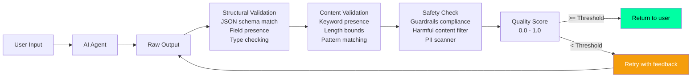
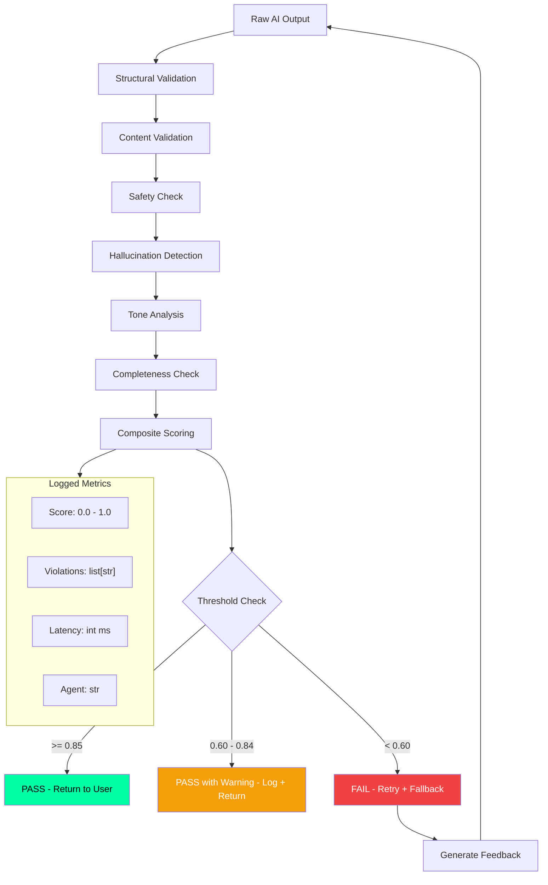
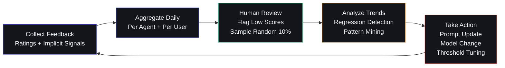
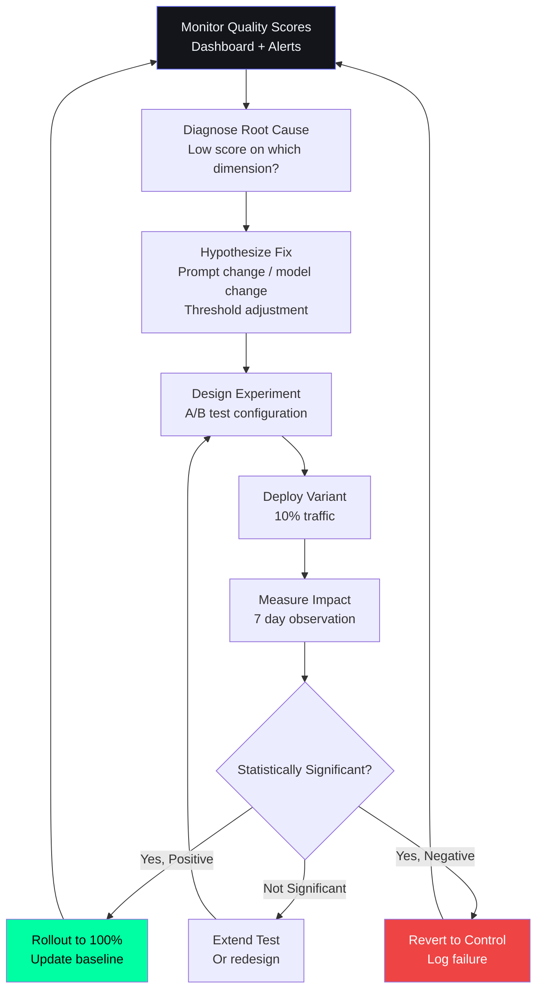

# AI Output Evaluation — Second Brain OS

## Document Control

| Field | Value |
|---|---|
| Document ID | AI-EVL-001 |
| Version | 2.0.0 |
| Status | Active |
| Last Updated | 2026-07-14 |
| Classification | Internal |
| Owner | Developer |
| Related Docs | [HallucinationHandling.md](HallucinationHandling.md), [AIModels.md](AIModels.md) |

---

## 1. Executive Summary

The AI output evaluation framework ensures that every response from ARIA and its agents meets quality standards across five dimensions: relevance, accuracy, completeness, safety, and tone. Evaluation is both automated (structural validation, rule-based checks) and manual (user feedback, A/B testing).

---

## 2. Evaluation Pipeline



---

## 3. Evaluation Dimensions

| Dimension | Weight | Definition | Measurement |
|---|---|---|---|
| **Relevance** | 25% | Does the output address the user's intent? | BLEU score, keyword overlap, intent match |
| **Accuracy** | 30% | Are facts and data correct? | Factual verification, source grounding |
| **Completeness** | 20% | Does it cover all required aspects? | Required field presence, coverage score |
| **Safety** | 15% | Is it free from harmful/biased content? | Guardrails check, toxicity score |
| **Tone** | 10% | Is the tone appropriate for context? | Tone classifier, consistency check |

---

## 4. Automated Evaluation Checks

### 4.1 Structural Validation

```python
def validate_structure(output: dict, schema: dict) -> float:
    """Check JSON structure matches expected schema."""
    try:
        model_validate(schema, output)
        return 1.0
    except ValidationError as e:
        logger.warn(f"Structure validation failed: {e}")
        return 0.0
```

### 4.2 Content Validation Rules

| Agent | Required Fields | Min Length | Max Length |
|---|---|---|---|
| Briefing | today_focus, opportunities, course_target | 200 chars | 4000 chars |
| Memory | memory_type, content, confidence | 50 chars | 1000 chars |
| Opportunity | match_score, match_reason, skills_required | 100 chars | 2000 chars |

### 4.3 Safety Check

```python
SAFETY_RULES = [
    ("no_pii", r"\b\d{3}-\d{2}-\d{4}\b"),           # SSN
    ("no_credentials", r"(?i)(password|api_key|secret)"),
    ("no_harmful", r"(?i)(violence|self.harm|suicide)"),
]
```

---

## 5. Quality Scoring Formula

```
quality_score = (relevance * 0.25) + (accuracy * 0.30) + 
                (completeness * 0.20) + (safety * 0.15) + 
                (tone * 0.10)
```

**Thresholds:**
| Score | Action |
|---|---|
| >= 0.85 | Pass — return to user |
| 0.60 - 0.84 | Pass with warning — log, return to user |
| < 0.60 | Fail — retry with feedback, fallback to algorithmic result |

---

## 6. Hallucination Detection (Embedded)

Factual hallucination detection is integrated into the evaluation pipeline. See [HallucinationHandling.md](HallucinationHandling.md) for the dedicated detection framework.

### 6.1 Hallucination Detection Framework

```python
# packages/ai/evaluation/hallucination_detector.py
class HallucinationDetector:
    """Multi-signal hallucination detection integrated into evaluation."""

    SIGNAL_WEIGHTS = {
        "factual_contradiction": 0.35,
        "unverifiable_claim": 0.25,
        "low_confidence_tokens": 0.20,
        "hedging_language": 0.10,
        "source_mismatch": 0.10,
    }

    def __init__(self, guardrails: Optional[GuardrailsChecker] = None):
        self.guardrails = guardrails or GuardrailsChecker()

    async def evaluate(self, output: str, context: dict) -> dict:
        """Run all hallucination detection signals and return composite score."""
        signals = {}
        total_score = 0.0

        # Signal 1: Factual contradiction with known user data
        if "user_data" in context:
            contradictions = await self._check_contradictions(output, context["user_data"])
            score = min(len(contradictions) * 0.15, self.SIGNAL_WEIGHTS["factual_contradiction"])
            signals["factual_contradiction"] = {"score": score, "details": contradictions}
            total_score += score

        # Signal 2: Unverifiable claims (named entities not in user's knowledge base)
        entities = self._extract_entities(output)
        known_entities = await self._load_known_entities(context.get("user_id", ""))
        unverifiable = [e for e in entities if e not in known_entities]
        if unverifiable:
            ratio = len(unverifiable) / max(len(entities), 1)
            score = ratio * self.SIGNAL_WEIGHTS["unverifiable_claim"]
            signals["unverifiable_claim"] = {"score": score, "entities": unverifiable}
            total_score += score

        # Signal 3: Low-probability token sequences (requires logprobs)
        if "logprobs" in context:
            score = self._assess_token_confidence(context["logprobs"])
            signals["low_confidence_tokens"] = {"score": score}
            total_score += score

        # Signal 4: Hedging / vague language
        hedging_score = self._detect_hedging(output)
        signals["hedging_language"] = {"score": hedging_score}
        total_score += hedging_score

        # Signal 5: Guardrails compliance check
        guardrail_result = await self.guardrails.check(output)
        if not guardrail_result["passed"]:
            signals["guardrails"] = {"score": 0.3, "violations": guardrail_result["violations"]}
            total_score += 0.3

        return {
            "hallucination_score": round(min(total_score, 1.0), 3),
            "threshold_exceeded": total_score >= 0.5,
            "signals": signals,
            "recommended_action": "reject" if total_score >= 0.7 else "review" if total_score >= 0.5 else "pass",
        }
```

### 6.2 Cross-Reference to Guardrails

The hallucination detection framework works in tandem with the guardrails system defined in [Guardrails.md](Guardrails.md). The guardrails system provides:
- Content boundary enforcement (topics the AI must not discuss)
- PII scanning on output (regex patterns for SSN, email, credentials)
- Toxicity scoring via a lightweight classifier
- Reinforcement learning feedback loop for guardrail violations

The hallucination detector and guardrails checker run in parallel during evaluation, and both must pass for the output to reach the user.

---

## 7. Per-Agent Evaluation Criteria

Every agent has specific evaluation criteria tailored to its output type. This table defines the full matrix for all 17 agents:

| Agent ID | Agent Name | Output Type | Primary Dimensions | Custom Rules | Min Quality Score |
|---|---|---|---|---|---|
| A01 | Planner | Task breakdown list | Relevance, Completeness, Accuracy | Tasks must have dates; subtasks must be actionable | 0.70 |
| A02 | Memory Agent | Memory entries | Accuracy, Completeness | Memories must reference specific user data; confidence > 0.5 | 0.75 |
| A03 | Learning Agent | Pattern insights | Relevance, Accuracy, Tone | Patterns must cite evidence from user data | 0.70 |
| A04 | Reminder | Notification text | Relevance, Tone, Safety | Must respect user quiet hours; max 200 chars | 0.80 |
| A05 | Career Agent | Career recommendations | Relevance, Accuracy, Completeness | Recommendations must match user skills | 0.75 |
| A06 | Opportunity Radar | Opportunity matches | Relevance, Accuracy, Completeness | Match score must be computed; skills required must be listed | 0.70 |
| A07 | Analytics Agent | Insight summaries | Accuracy, Completeness, Tone | Metrics must be derived from actual data | 0.80 |
| A08 | Roadmap Agent | Skill roadmap | Relevance, Completeness, Tone | Steps must be sequenced; prerequisites must be listed | 0.70 |
| A09 | Daily Briefing | Morning briefing | Completeness, Relevance, Tone | Must include all sections: focus, opportunities, courses | 0.75 |
| A10 | Weekly Review | Weekly report | Completeness, Accuracy, Tone | Must include stats + trends + recommendations | 0.75 |
| A11 | Missed Task Checker | Alert list | Relevance, Accuracy, Safety | Max 5 alerts; must include task names | 0.80 |
| A12 | Habit Miss Checker | Reminder list | Relevance, Accuracy, Tone | Max 3 nudges; must reference streak data | 0.80 |
| A13 | Sleep Agent | Wind-down message | Relevance, Tone, Safety | Must respect user's bedtime preferences | 0.75 |
| A14 | Nudge Agent | Course/habit nudges | Relevance, Tone, Safety | Nudges must be encouraging; max 150 chars | 0.75 |
| A15 | Opportunity Matching | Scoring output | Accuracy, Completeness | Score must be between 0-100; reasoning must be provided | 0.70 |
| A16 | (Reserved) | -- | -- | -- | -- |
| A00 | ARIA (Orchestrator) | Chat response | All five dimensions | Context must be cited; no hallucination | 0.85 |

### 7.1 Custom Validation Per Agent

```python
# packages/ai/evaluation/per_agent_rules.py
AGENT_VALIDATION_RULES = {
    "briefing_agent": {
        "required_sections": ["today_focus", "opportunities", "course_target", "habit_checkin"],
        "section_order": ["today_focus", "opportunities", "course_target", "habit_checkin"],
        "date_format": r"\d{4}-\d{2}-\d{2}",
        "max_links": 5,
    },
    "memory_agent": {
        "min_confidence": 0.5,
        "valid_memory_types": ["preference", "pattern", "fact", "decision"],
        "must_reference_user_data": True,
    },
    "sleep_agent": {
        "bedtime_cutoff": "22:00",
        "max_length_chars": 500,
        "must_not_discourage_sleep": True,
    },
    "nudge_agent": {
        "max_nudges": 3,
        "positive_tone_required": True,
        "max_length_chars": 150,
        "banned_phrases": ["you should", "you must", "you need to"],
    },
}

def validate_agent_output(agent_name: str, output: dict) -> list[str]:
    """Run agent-specific validation rules. Returns list of violations."""
    violations = []
    rules = AGENT_VALIDATION_RULES.get(agent_name, {})

    if "required_sections" in rules:
        for section in rules["required_sections"]:
            if section not in output:
                violations.append(f"Missing required section: {section}")

    if "min_confidence" in rules:
        if output.get("confidence", 1.0) < rules["min_confidence"]:
            violations.append(f"Confidence {output.get('confidence')} below minimum {rules['min_confidence']}")

    if "max_length_chars" in rules:
        content = json.dumps(output)
        if len(content) > rules["max_length_chars"]:
            violations.append(f"Output exceeds max length of {rules['max_length_chars']} chars")

    return violations
```

---

## 8. Automated Evaluation Pipeline (Detailed)

### 8.1 Full Architecture



### 8.2 Evaluation Orchestrator

```python
# packages/ai/evaluation/orchestrator.py
class EvaluationOrchestrator:
    """Coordinates all evaluation checks for an AI output."""

    def __init__(self):
        self.structural = StructuralValidator()
        self.content = ContentValidator()
        self.safety = SafetyChecker()
        self.hallucination = HallucinationDetector()
        self.tone = ToneAnalyzer()
        self.completeness = CompletenessChecker()

    async def evaluate(
        self,
        output: dict,
        agent_name: str,
        context: dict,
    ) -> EvaluationResult:
        """Run all evaluation stages and return composite result."""
        start_time = time.time()
        violations = []
        dimension_scores = {}

        # Stage 1: Structural validation
        schema = self._get_schema_for_agent(agent_name)
        struct_score, struct_violations = await self.structural.validate(output, schema)
        dimension_scores["structure"] = struct_score
        violations.extend(struct_violations)

        # Stage 2: Content validation
        content_score, content_violations = await self.content.validate(output, agent_name)
        dimension_scores["content"] = content_score
        violations.extend(content_violations)

        # Stage 3: Safety check
        safety_score, safety_violations = await self.safety.check(output)
        dimension_scores["safety"] = safety_score
        violations.extend(safety_violations)

        # Stage 4: Hallucination detection (parallel with safety)
        hallucination_result = await self.hallucination.evaluate(output.get("content", ""), context)
        dimension_scores["hallucination"] = 1.0 - hallucination_result["hallucination_score"]
        if hallucination_result["threshold_exceeded"]:
            violations.append(f"Hallucination score {hallucination_result['hallucination_score']:.2f} exceeds threshold")

        # Stage 5: Tone analysis
        tone_score, tone_violations = await self.tone.analyze(output, agent_name)
        dimension_scores["tone"] = tone_score
        violations.extend(tone_violations)

        # Stage 6: Completeness check
        completeness_score, completeness_violations = await self.completeness.check(output, agent_name)
        dimension_scores["completeness"] = completeness_score
        violations.extend(completeness_violations)

        # Composite score
        weights = self._get_weights(agent_name)
        composite_score = sum(dimension_scores.get(dim, 0) * weights.get(dim, 0) for dim in weights)

        elapsed = (time.time() - start_time) * 1000

        return EvaluationResult(
            score=round(composite_score, 3),
            dimension_scores=dimension_scores,
            violations=violations,
            latency_ms=elapsed,
            agent_name=agent_name,
        )

    def _get_weights(self, agent_name: str) -> dict:
        """Get dimension weights specific to agent type."""
        base_weights = {
            "structure": 0.15, "content": 0.20, "safety": 0.20,
            "hallucination": 0.20, "tone": 0.10, "completeness": 0.15,
        }
        agent_overrides = {
            "briefing_agent": {"completeness": 0.25, "tone": 0.15},
            "nudge_agent": {"safety": 0.30, "tone": 0.20},
            "sleep_agent": {"safety": 0.25, "tone": 0.20},
        }
        weights = base_weights.copy()
        weights.update(agent_overrides.get(agent_name, {}))
        return weights
```

---

## 9. Human Evaluation Workflow

### 9.1 Feedback Collection

Human evaluation is collected through explicit (ratings, comments) and implicit (behavioral signals) feedback:

```python
# apps/api/app/api/ai_feedback.py
@router.post("/api/v1/ai/feedback")
async def submit_evaluation_feedback(
    interaction_id: str = Body(...),
    rating: int = Body(..., ge=1, le=5),
    feedback_type: str = Body("explicit"),
    comment: Optional[str] = Body(None),
    tags: Optional[list[str]] = Body(None),
    current_user = Depends(require_auth),
):
    """Submit human evaluation feedback for an AI interaction."""
    result = await supabase.from_("ai_feedback").insert({
        "interaction_id": interaction_id,
        "user_id": current_user.id,
        "rating": rating,
        "feedback_type": feedback_type,
        "comment": comment,
        "tags": tags or [],
        "flow": get_active_ab_test(interaction_id),
        "created_at": datetime.utcnow().isoformat(),
    }).execute()
    return {"status": "recorded", "id": result.data[0]["id"]}
```

### 9.2 Implicit Quality Signals

| Signal | Metric | Collection Method | Weight in Score |
|---|---|---|---|
| Task acceptance rate | `user.accepted_task` | Click "Add" vs "Dismiss" on AI-generated task | 15% |
| Edit distance | `user.edit_distance_ratio` | Levenshtein distance / original length | 10% |
| Re-prompt rate | `user.reprompt_count` | User triggered regeneration | 10% |
| Dismissal rate | `user.dismissal_count` | User dismissed without action | 10% |
| Session continuation | `user.session_continued` | User sent follow-up message | 5% |
| Time-to-action | `user.time_to_act_minutes` | Time between suggestion and user action | 5% |

### 9.3 Feedback Review Cycle



---

## 10. A/B Testing Framework

### 10.1 Experiment Configuration

```python
# packages/ai/evaluation/ab_testing.py
class ABTestManager:
    """Manages A/B test experiments for prompt variants and model parameters."""

    def __init__(self):
        self.active_experiments: dict[str, Experiment] = {}

    async def create_experiment(self, config: ExperimentConfig) -> Experiment:
        """Register a new A/B test experiment."""
        experiment = Experiment(
            id=str(uuid.uuid4()),
            agent_name=config.agent_name,
            parameter=config.parameter,
            variant_a=config.variant_a,
            variant_b=config.variant_b,
            traffic_split=config.traffic_split or 0.10,  # Start with 10%
            metrics=config.metrics,
            min_duration_days=config.min_duration_days or 7,
            status="running",
            created_at=datetime.now(),
        )
        self.active_experiments[experiment.id] = experiment
        await self._persist(experiment)
        return experiment

    async def assign_variant(self, user_id: str, experiment_id: str) -> str:
        """Assign user to variant A or B deterministically."""
        experiment = self.active_experiments.get(experiment_id)
        if not experiment:
            return "control"
        # Deterministic assignment based on user_id hash
        user_hash = hash(f"{user_id}:{experiment_id}") % 100
        if user_hash < experiment.traffic_split * 100:
            return "variant_b"
        return "variant_a"
```

### 10.2 Experiment Catalog

| Experiment ID | Agent | Parameter | Variant A | Variant B | Success Metric | Status |
|---|---|---|---|---|---|---|
| EXP-001 | Briefing | Temperature | 0.3 | 0.5 | User rating + Task acceptance | Running |
| EXP-002 | Task Agent | Max tokens | 1024 | 2048 | Completeness score | Completed |
| EXP-003 | Nudge Agent | Prompt version | v1 (verbose) | v2 (concise) | Nudge action rate | Planned |
| EXP-004 | Sleep Agent | Tone instruction | "Calm" | "Informative" | Bedtime adherence | Running |
| EXP-005 | Memory Agent | Context limit | 5 memories | 10 memories | Hallucination score | Planned |

### 10.3 Statistical Analysis

```python
# packages/ai/evaluation/stats.py
import scipy.stats as stats

class ExperimentAnalyzer:
    """Statistical analysis for A/B test results."""

    def analyze(self, experiment_id: str) -> AnalysisResult:
        """Compute statistical significance and effect size."""
        variant_a_data = self._fetch_metrics(experiment_id, "variant_a")
        variant_b_data = self._fetch_metrics(experiment_id, "variant_b")

        t_stat, p_value = stats.ttest_ind(variant_a_data, variant_b_data)
        effect_size = (np.mean(variant_b_data) - np.mean(variant_a_data)) / np.std(variant_a_data)

        return AnalysisResult(
            experiment_id=experiment_id,
            p_value=round(p_value, 4),
            effect_size=round(effect_size, 3),
            significant=p_value < 0.05,
            winner="variant_b" if np.mean(variant_b_data) > np.mean(variant_a_data) else "variant_a",
            samples_a=len(variant_a_data),
            samples_b=len(variant_b_data),
        )

    def decide_rollout(self, result: AnalysisResult) -> str:
        """Decide whether to roll out the winning variant."""
        if not result.significant:
            return "continue_testing"
        if result.effect_size < 0.1:
            return "marginal_keep_current"
        if result.effect_size < 0.3:
            return "rollout_to_50_percent"
        return "rollout_to_100_percent"
```

### 10.4 Rollout Stages

| Stage | Traffic % | Duration | Criteria to Advance |
|---|---|---|---|
| Pilot | 5% | 2 days | No critical errors, monitoring OK |
| Test | 10% | 7 days | p < 0.05, effect size > 0.1 |
| Canary | 25% | 3 days | No regression in key metrics |
| Ramp | 50% | 3 days | Effect sustained, no negative impact |
| Full | 100% | -- | Winner declared, control deprecated |

---

## 11. Regression Testing

### 11.1 Test Suite

```bash
# Run the full evaluation regression suite
pytest tests/test_ai_evaluation.py -v --eval

# Compare results against a known baseline
pytest tests/test_ai_evaluation.py --eval --compare-baseline=baseline.json

# Run per-agent evaluation tests
pytest tests/test_ai_evaluation.py -k "test_briefing_evaluation" -v
pytest tests/test_ai_evaluation.py -k "test_memory_evaluation" -v
pytest tests/test_ai_evaluation.py -k "test_sleep_evaluation" -v

# Run hallucination detection tests
pytest tests/test_hallucination_detector.py -v

# Run quality scoring formula tests
pytest tests/test_quality_scoring.py -v

# Generate a new baseline after intentional changes
pytest tests/test_ai_evaluation.py --eval --generate-baseline=baseline.json

# Run with coverage for evaluation module
pytest tests/test_ai_evaluation.py --cov=packages/ai/evaluation --cov-report=term
```

### 11.2 Baseline Comparison

```python
# tests/test_ai_evaluation.py
import json
import pytest
from pathlib import Path

BASELINE_DIR = Path("tests/baselines")

@pytest.mark.eval
async def test_against_baseline():
    """Verify current evaluation scores match expected baseline within tolerance."""
    baseline_path = BASELINE_DIR / "evaluation_baseline.json"
    if not baseline_path.exists():
        pytest.skip("No baseline file found")

    with open(baseline_path) as f:
        baseline = json.load(f)

    orchestrator = EvaluationOrchestrator()
    test_cases = load_test_cases()

    for case in test_cases:
        result = await orchestrator.evaluate(case["output"], case["agent"], case["context"])
        expected_score = baseline[case["name"]]["score"]

        # Allow 10% tolerance
        assert abs(result.score - expected_score) < 0.1, \
            f"{case['name']}: expected {expected_score}, got {result.score}"
```

### 11.3 Alert-Driven Regression Detection

```python
# packages/ai/evaluation/regression_monitor.py
class RegressionMonitor:
    """Alert on significant quality score drops compared to rolling baseline."""

    def __init__(self, window_days: int = 7, threshold_drop: float = 0.1):
        self.window_days = window_days
        self.threshold_drop = threshold_drop

    async def check_regression(self, agent_name: str) -> list[Alert]:
        """Compare recent scores against 7-day rolling average."""
        recent = await self._get_recent_scores(agent_name, days=1)
        historical = await self._get_recent_scores(agent_name, days=self.window_days)

        if not historical or not recent:
            return []

        avg_recent = sum(recent) / len(recent)
        avg_historical = sum(historical) / len(historical)
        drop = avg_historical - avg_recent

        if drop > self.threshold_drop:
            return [Alert(
                name=f"quality_regression_{agent_name}",
                severity="warning",
                message=f"{agent_name} quality dropped {drop:.2f} points in 24h",
                value=drop,
            )]
        return []
```

---

## 12. Performance Benchmarks

### 12.1 Evaluation Pipeline Latency

| Evaluation Stage | P50 | P95 | P99 | Description |
|---|---|---|---|---|
| Structural validation | 1ms | 5ms | 15ms | JSON schema validation |
| Content validation | 2ms | 10ms | 30ms | Rule-based checks per agent |
| Safety check | 5ms | 25ms | 100ms | Guardrails + toxicity scan |
| Hallucination detection | 10ms | 50ms | 200ms | Entity verification + signal fusion |
| Tone analysis | 3ms | 15ms | 50ms | Tone classifier |
| Completeness check | 1ms | 5ms | 20ms | Required field coverage |
| **Full pipeline (all stages)** | **25ms** | **100ms** | **400ms** | Composite evaluation |
| Full pipeline + retry (fail path) | 100ms | 500ms | 2000ms | Includes retry with feedback |

### 12.2 Per-Agent Evaluation Cost

| Agent | Avg Tokens Eval'd | Eval Latency | Eval Cost (est.) | Frequency |
|---|---|---|---|---|
| Briefing (A09) | 800 | 40ms | $0.0001 | Daily |
| Weekly Review (A10) | 1200 | 50ms | $0.0002 | Weekly |
| Opportunity Radar (A06) | 600 | 30ms | $0.0001 | Daily |
| Memory Agent (A02) | 200 | 15ms | <$0.0001 | Per chat |
| Learning Agent (A03) | 300 | 20ms | <$0.0001 | Daily |
| Sleep Agent (A13) | 400 | 25ms | <$0.0001 | Daily |
| Nudge Agent (A14) | 200 | 15ms | <$0.0001 | Daily |
| Roadmap Agent (A08) | 500 | 30ms | $0.0001 | On-demand |
| Task Agent (A01) | 350 | 20ms | <$0.0001 | On-demand |
| ARIA Chat (A00) | 500 | 30ms | $0.0001 | Per message |
| **Total (daily)** | **~5,000** | **~300ms** | **~$0.001** | **All agents** |

### 12.3 Evaluation Resource Budget

| Resource | Budget | Peak Usage | Notes |
|---|---|---|---|
| CPU | < 5% of AI service | 15% during batch evaluation | Runnable on same host |
| Memory | < 50 MB | < 100 MB | Loads schemas, guardrails config |
| Network | < 0.5 MB/s | < 2 MB/s | Feedback writes to DB |
| Storage (logs) | < 10 MB/day | < 50 MB/day | Evaluation results retained 90 days |

---

## 13. Error Handling

### 13.1 Evaluation Failure Modes

| Failure Mode | Impact | Detection | Recovery |
|---|---|---|---|
| Schema not found for agent | Structural validation fails | KeyError caught | Return score 0, log warning |
| Guardrails service unavailable | Safety check fails | TimeoutError caught | Skip safety check, degrade score |
| Hallucination detector timeout | Hallucination score unknown | asyncio.TimeoutError | Use fallback: compute only entity check |
| Feedback DB write fails | User feedback lost | Supabase write error | Buffer feedback, retry with backoff |
| A/B test config invalid | Experiment assignment wrong | ValidationError | Log error, assign control variant |
| Tone classifier model unloaded | Tone analysis fails | ModelNotFoundError | Return neutral score (0.75) |

### 13.2 Graceful Degradation

```python
# packages/ai/evaluation/error_handler.py
class EvaluationErrorHandler:
    """Handle evaluation failures gracefully without blocking user response."""

    async def safe_evaluate(
        self, orchestrator: EvaluationOrchestrator, output: dict, agent: str, context: dict
    ) -> EvaluationResult:
        """Run evaluation with fallback for each stage."""
        try:
            return await asyncio.wait_for(
                orchestrator.evaluate(output, agent, context),
                timeout=5.0,
            )
        except asyncio.TimeoutError:
            logger.error("evaluation.timeout", agent=agent)
            return EvaluationResult(
                score=0.75,  # Neutral score on timeout
                dimension_scores={},
                violations=["Evaluation timeout - using neutral score"],
                latency_ms=5000,
                agent_name=agent,
            )
        except Exception as e:
            logger.error("evaluation.failed", agent=agent, error=str(e))
            return EvaluationResult(
                score=0.70,  # Slightly penalize on error
                dimension_scores={},
                violations=[f"Evaluation error: {str(e)[:100]}"],
                latency_ms=0,
                agent_name=agent,
            )
```

---

## 14. Continuous Improvement Workflow

### 14.1 Quality Improvement Loop



### 14.2 Quality Score Trend Tracking

```sql
-- Quality trend view for dashboard
CREATE VIEW ai_quality_trend AS
SELECT
    agent_name,
    date_trunc('day', created_at) AS day,
    AVG(quality_score) AS avg_score,
    COUNT(*) AS sample_count,
    STDDEV(quality_score) AS score_variance,
    AVG(hallucination_score) AS avg_hallucination,
    COUNT(*) FILTER (WHERE user_edited = TRUE) AS edited_count
FROM ai_interaction_logs
WHERE quality_score IS NOT NULL
    AND created_at >= NOW() - INTERVAL '30 days'
GROUP BY agent_name, date_trunc('day', created_at)
ORDER BY day DESC;
```

### 14.3 Action Triggers

| Signal | Threshold | Action | Owner | SLA |
|---|---|---|---|---|
| Quality score drop | > 0.1 below 7-day avg | Create issue, investigate | Developer | 24h |
| Hallucination spike | > 0.3 avg over 1 hour | Block agent, page | Developer | 15min |
| A/B test significant win | p < 0.05, effect > 0.2 | Auto-rollout to 100% | System | Immediate |
| A/B test significant loss | p < 0.05, effect < -0.1 | Auto-revert to control | System | Immediate |
| Feedback volume drop | < 10% of interactions rated | Prompt users for feedback | System | 7 days |
| Guardrails violation | > 5 violations/day | Manual review of prompts | Developer | 24h |
| Evaluation pipeline error | > 1% error rate | Fix pipeline | Developer | 4h |

### 14.4 Improvement Playbook

| Scenario | Likely Root Cause | Recommended Fix | Verification |
|---|---|---|---|
| Briefing missing sections | Prompt template change | Add missing sections back | Run agent test suite |
| Memory agent low confidence | Context budget too tight | Increase context limit | A/B test |
| Sleep agent too verbose | Tone instruction ambiguous | Clearer "concise" instruction | User rating check |
| Task agent hallucinating dates | No date format example | Add date format to few-shot | Hallucination score |
| Nudge agent sounding pushy | Banned phrases not enforced | Add to banned_phrases list | Safety check pass |
| All scores dropping | Model update degraded | Rollback model version | Compare baselines |

---

## 15. Related Documents

| Document | Description | Cross-Reference |
|---|---|---|
| [HallucinationHandling.md](HallucinationHandling.md) | Hallucination detection and mitigation framework | Section 6 references detection signals |
| [Guardrails.md](Guardrails.md) | Safety guardrails and content boundaries | Section 4.3 integrates guardrails checks |
| [AIModels.md](AIModels.md) | Model configuration and provider setup | Per-agent model selection affects quality |
| [AIObservability.md](AIObservability.md) | AI observability metrics and dashboards | Quality scores feed observability dashboards |
| [AI Prompt System](../prompts/README.md) | Prompt management and versioning | Prompt versions tracked in experiments |
| [docs/qa/28_Testing.md](../../docs/qa/28_Testing.md) | General testing strategy | Eval tests integrated in CI pipeline |
| [AIOperations.md](AIOperations.md) | AI operations runbook | Incident response for quality regressions |
