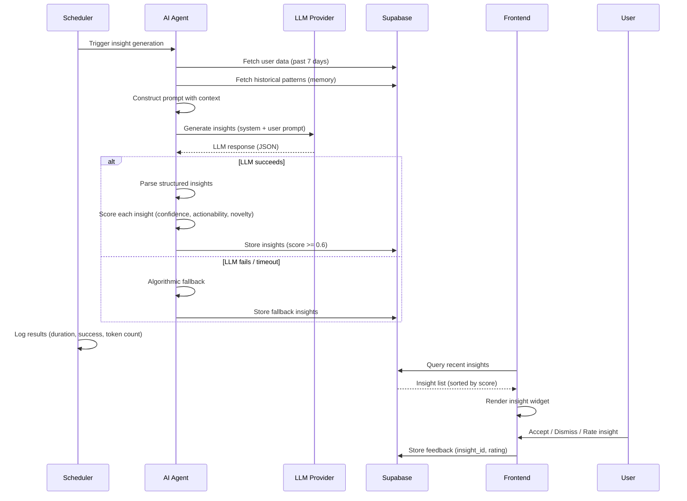
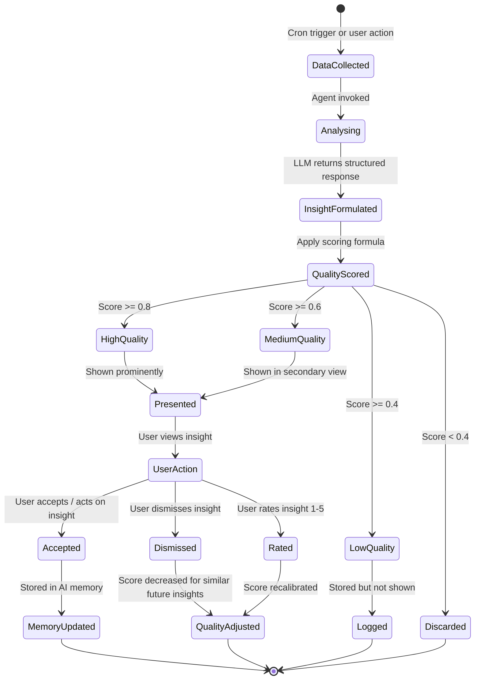

# AI-Powered Insights — Second Brain OS

## Document Control

| Field | Value |
|---|---|
| Document ID | AI-AII-001 |
| Version | 1.0.0 |
| Status | Approved |
| Date | 2026-07-10 |
| Classification | Internal |
| Owner | Developer |

---

## Table of Contents

- [1. Executive Summary](#1-executive-summary)
- [2. Purpose](#2-purpose)
- [3. Scope](#3-scope)
- [4. Business Context](#4-business-context)
- [5. Functional Specification](#5-functional-specification)
- [6. Non-Functional Requirements](#6-non-functional-requirements)
- [7. Architecture](#7-architecture)
- [8. Diagrams](#8-diagrams)
- [9. Data Models](#9-data-models)
- [10. APIs](#10-apis)
- [11. Security](#11-security)
- [12. Performance Targets](#12-performance-targets)
- [13. Edge Cases](#13-edge-cases)
- [14. Failure Scenarios](#14-failure-scenarios)
- [15. Risks & Mitigations](#15-risks--mitigations)
- [16. Acceptance Criteria](#16-acceptance-criteria)
- [17. Traceability](#17-traceability)
- [18. Implementation Notes](#18-implementation-notes)
- [19. Testing Strategy](#19-testing-strategy)
- [20. References](#20-references)

---

## 1. Executive Summary

AI-powered insights are the differentiating feature of Second Brain OS. Beyond passive data collection and reporting, the AI layer actively analyses user data to identify trends, detect anomalies, make predictions, and generate personalised recommendations. Five insight types are defined: trend detection, pattern recognition, anomaly detection, predictions, and recommendations. Insights are generated by the 11 AI agent modules, each specialised in a domain (tasks, habits, sleep, opportunities, learning, etc.). The insight pipeline follows a standardised flow: data collection, analysis, insight formulation, quality scoring, and presentation.

---

## 2. Purpose

Insights transform raw user data into actionable intelligence that helps the user be more productive, make better decisions, and achieve their goals. Without AI insights, the system is a passive data store. With insights, it becomes an active productivity partner that surfaces relevant information at the right time. The insight quality scoring system ensures that users see only high-confidence, valuable insights.

---

## 3. Scope

This document covers:

- Five insight types: trends, patterns, anomalies, predictions, recommendations
- Insight generation pipeline across all 11 AI agents
- Insight quality scoring and confidence levels
- Insight personalisation (user-specific vs general insights)
- Insight value measurement and feedback loop
- Insight presentation in the frontend

Out of scope: real-time insight generation, external data sources for insights, collaborative insights across users (single-user system).

---

## 4. Business Context

Insights are the primary value driver of the AI agents. Each of the 11 agents generates domain-specific insights:

- **Briefing Agent**: Daily productivity insights and priority recommendations
- **Weekly Review Agent**: Weekly trend analysis and goal progress insights
- **Memory Agent**: Pattern recognition across user behaviour
- **Learning Agent**: Trend detection in learning and skill development
- **Opportunity Agent**: Opportunity matching based on skills and interests
- **Sleep Agent**: Sleep pattern analysis and improvement recommendations
- **Nudge Agent**: Behavioural nudges for habit formation and course progress
- **Roadmap Agent**: Skill development roadmap optimisation
- **Task Agent**: Task breakdown and prioritisation insights

---

## 5. Functional Specification

### 5.1 Insight Types

| Type | Definition | Example | Agents |
|---|---|---|---|
| **Trend Detection** | Identify direction and rate of change over time | "Your task completion rate has increased 15% this week." | Briefing, Weekly Review, Learning |
| **Pattern Recognition** | Identify recurring structures or sequences | "You are most productive between 9-11 AM on weekdays." | Memory, Learning, Sleep |
| **Anomaly Detection** | Identify outliers that deviate from expected behaviour | "You logged 3 hours of deep work today, 2x your average." | All agents |
| **Predictions** | Forecast future states based on historical data | "Based on current progress, you will complete Course X in 2 weeks." | Briefing, Roadmap, Learning |
| **Recommendations** | Suggest specific actions to improve outcomes | "Consider blocking 2 hours tomorrow morning for Course X." | Briefing, Nudge, Roadmap, Task |

### 5.2 Insight Generation Pipeline

```mermaid
flowchart LR
    subgraph Collection["Data Collection"]
        UserData[(Supabase Data<br/>27 tables)]
        Events[(Analytics Events)]
        History[(AI Memory<br/>preferences + patterns)]
    end

    subgraph Analysis["AI Analysis"]
        Agent[Domain Agent<br/>(11 agents)]
        LLM[LLM Call<br/>Ollama / Claude]
        Algorithm[Algorithmic<br/>Fallback]
    end

    subgraph Formulation["Insight Formulation"]
        Extract[Extract Insights<br/>from LLM Response]
        Score[Quality Score<br/>confidence + value]
        Filter[Filter Low Quality<br/>below threshold]
    end

    subgraph Storage["Storage"]
        InsightDB[(AI Insights<br/>Table)]
        Notif[(Notifications<br/>Table)]
    end

    subgraph Presentation["Presentation"]
        Dashboard[Insight Widgets]
        Briefing[Daily Briefing]
        Nudge[Nudge Cards]
    end

    subgraph Feedback["Feedback Loop"]
        Accept[Accepted Insight]
        Dismiss[Dismissed Insight]
        Rate[Rating: 1-5]
    end

    Collection --> Analysis
    Analysis --> Formulation
    Formulation --> Storage
    Storage --> Presentation
    Presentation --> Feedback
    Feedback --> History
```

### 5.3 Insight Quality Scoring

Each insight is scored on three dimensions:

| Dimension | Weight | Scale | Description |
|---|---|---|---|
| **Confidence** | 40% | 0.0 - 1.0 | How certain is the AI that this insight is correct? |
| **Actionability** | 35% | 0.0 - 1.0 | Can the user act on this insight? |
| **Novelty** | 25% | 0.0 - 1.0 | Is this new information or already known? |

**Overall Score** = 0.4 * Confidence + 0.35 * Actionability + 0.25 * Novelty

**Thresholds:**
- Score >= 0.8: Present prominently
- Score >= 0.6: Present in secondary view
- Score >= 0.4: Log only (don't show user)
- Score < 0.4: Discard

### 5.4 Insight Types by Agent

| Agent | Trend Detection | Pattern Recognition | Anomaly Detection | Predictions | Recommendations |
|---|---|---|---|---|---|
| Briefing | ✅ | — | ✅ | ✅ | ✅ |
| Weekly Review | ✅ | ✅ | ✅ | ✅ | ✅ |
| Memory | ✅ | ✅ | ✅ | — | — |
| Learning | ✅ | ✅ | ✅ | ✅ | ✅ |
| Opportunity | — | ✅ | — | — | ✅ |
| Sleep | — | ✅ | ✅ | — | ✅ |
| Nudge | — | ✅ | — | — | ✅ |
| Roadmap | — | ✅ | — | ✅ | ✅ |
| Task | — | ✅ | ✅ | — | ✅ |

---

## 6. Non-Functional Requirements

| ID | Requirement | Target |
|---|---|---|
| AII-NFR-001 | Insight generation latency (per agent) | < 15 seconds |
| AII-NFR-002 | Insight quality score accuracy | > 80% correlation with user ratings |
| AII-NFR-003 | Minimum insight quality threshold | Score >= 0.6 for presentation |
| AII-NFR-004 | Insights per user per day | < 20 (avoid overload) |
| AII-NFR-005 | Insight storage retention | 90 days |
| AII-NFR-006 | False insight rate | < 10% |

---

## 7. Architecture



---

## 8. Diagrams

### 8.1 Insight Lifecycle



---

## 9. Data Models

### 9.1 AI Insight Schema

```python
class AIInsight(BaseModel):
    id: str
    user_id: str
    agent_name: str  # briefing_agent, memory_agent, etc.
    insight_type: str  # trend, pattern, anomaly, prediction, recommendation
    title: str  # Short headline (e.g., "Productivity Peak Detected")
    description: str  # Full insight text
    confidence_score: float  # 0.0 - 1.0
    actionability_score: float  # 0.0 - 1.0
    novelty_score: float  # 0.0 - 1.0
    overall_score: float  # Composite 0.0 - 1.0
    metadata: dict  # Agent-specific data
    source_data: dict  # Data that generated this insight
    ai_generated: bool
    provider: Optional[str]  # ollama, claude, algorithmic
    feedback: Optional[InsightFeedback]
    created_at: datetime
    expires_at: datetime  # TTL for this insight
```

### 9.2 Insight Feedback Schema

```python
class InsightFeedback(BaseModel):
    insight_id: str
    user_id: str
    action: str  # accepted, dismissed, rated
    rating: Optional[int]  # 1-5, if action is "rated"
    comment: Optional[str]
    created_at: datetime
```

---

## 10. APIs

| Endpoint | Method | Purpose |
|---|---|---|
| `GET /api/v1/insights/` | GET | Get recent insights for user |
| `POST /api/v1/insights/feedback` | POST | Submit feedback on an insight |
| `GET /api/v1/analytics/insights` | GET | Insight analytics (admin) |

---

## 11. Security

- Insights are user-specific; served only to the authenticated user
- Insight data is derived from user's own data; no cross-user data used
- Insight feedback does not contain PII
- AI providers (Ollama local, Claude API with data privacy agreement) do not store insight data
- Low-quality insights (score < 0.4) are discarded entirely; not stored

---

## 12. Performance Targets

| Metric | Target |
|---|---|
| Insight generation (per agent) | < 15 seconds |
| Insight API response (list) | < 150ms |
| Insight quality score accuracy | > 80% |
| False insight rate | < 10% |
| Insights per user per day | < 20 |

---

## 13. Edge Cases

| Edge Case | Handling |
|---|---|
| User has no data | Insight: "Start using modules to receive personalised insights." |
| All insights score below threshold | Return empty list; no false insights shown |
| Same insight generated repeatedly | Dedup by insight hash; update expires_at |
| Insight contradicts user's memory | Include confidence score; let user feedback override |
| LLM generates hallucinated insight | Quality scoring should catch; algorithmic verification for critical insights |
| User generates data at unusual times | Anomaly detection accounts for user-specific baselines |

---

## 14. Failure Scenarios

| Scenario | Impact | Mitigation |
|---|---|---|
| All LLM providers unavailable | No AI insights generated | Algorithmic fallback: rule-based insights only |
| Insight quality scoring fails | All insights shown or none | Default threshold; log scoring errors |
| Insight storage insert fails | Lost insight | Retry 3 times; log failure |
| User provides no feedback | No quality improvement | Active learning: serve diverse insights to learn preferences |
| Agent generates too many insights | User overwhelmed | Daily cap of 20; quality threshold of 0.6 minimum |

---

## 15. Risks & Mitigations

| Risk | Likelihood | Impact | Mitigation |
|---|---|---|---|
| AI generates incorrect insights eroding trust | Medium | High | Show confidence score; let user dismiss; remove low-confidence insights |
| Users ignore insights (notification fatigue) | Medium | Medium | Personalise delivery cadence; vary insight types |
| LLM costs scale with insight generation | Medium | Low | Algorithmic fallback is free; only use LLM for high-value insights |
| Insight storage grows unbounded | Low | Medium | 90-day TTL; auto-delete expired insights |

---

## 16. Acceptance Criteria

- [ ] All 5 insight types are generated by at least one agent
- [ ] Insight quality scoring filters low-quality insights
- [ ] Users can accept, dismiss, or rate insights
- [ ] Feedback loop improves future insight relevance
- [ ] Algorithmic fallback generates insights when AI is unavailable
- [ ] Users see no more than 20 insights per day
- [ ] Insights older than 90 days are automatically deleted

---

## 17. Traceability

| Requirement | Covered By | Verified By |
|---|---|---|
| AII-NFR-001 | Agent timing metrics | `tests/test_agents.py` |
| AII-NFR-002 | User rating correlation | Insight quality analysis |
| AII-NFR-003 | Quality threshold filter | `tests/test_ai_modules.py` |
| AII-NFR-004 | Daily insight cap | Integration test |
| AII-NFR-005 | Retention SQL | `tests/test_scripts.py` |

---

## 18. Implementation Notes

### 18.1 Insight Quality Improvement Cycle

1. **Collect**: Capture user feedback (accept, dismiss, rate)
2. **Analyse**: Compare user ratings vs quality scores
3. **Adjust**: Tweak quality scoring weights based on correlation
4. **Test**: Run A/B comparison of old vs new scoring
5. **Deploy**: Update scoring model in agents

### 18.2 Adding Insight Types to a New Agent

When creating a new AI agent, ensure it generates at least one insight type:

1. Define insight structure in the agent's output JSON schema
2. Implement extraction logic in the agent module
3. Apply quality scoring in the agent's return path
4. Store insights via the shared `save_insight()` utility
5. Test in `tests/test_agents.py`

### 18.3 Algorithmic Fallback Insights

For when LLM is unavailable, each agent has rule-based insights:

- **Task Agent**: "You have X overdue tasks." / "Your completion rate is Y% this week."
- **Habit Agent**: "Your longest current streak is X days on Habit Y."
- **Sleep Agent**: "Your average sleep duration this week is X hours."
- **General**: "You have been using the system for X days. Keep going!"

---

## 19. Testing Strategy

| Test Type | Scope | Location |
|---|---|---|
| Unit | Quality scoring formula | `tests/test_shared_utils.py` |
| Unit | Insight schema validation | `tests/test_schemas.py` |
| Integration | Agent generates structured insights | `tests/test_agents.py` |
| Integration | Insight feedback loop | `tests/test_ai_modules.py` |
| Integration | Algorithmic fallback insights | `tests/test_agents.py` |
| Integration | Daily insight cap enforcement | `tests/test_api_endpoints.py` |

---

## 20. References

| Reference | Description |
|---|---|
| [Agent Architecture](../engineering/14_AgentArchitecture.md) | AI agent system overview |
| [Agent Specification](../ai/20_Agent.md) | Detailed agent specifications (239KB) |
| [Memory Architecture](../ai/22_MemoryArchitecture.md) | AI memory for pattern learning |
| [Knowledge Graph](../ai/23_KnowledgeGraph.md) | Relationship-based insights |
| [Reports](../operations/Reports.md) | Reports that present aggregated insights |
| [Events](../operations/Events.md) | Event data used for trend detection |
| [Funnels](../operations/Funnels.md) | Funnels for insight validation |

---

## Revision History

| Version | Date | Author | Changes |
|---|---|---|---|
| 1.0.0 | 2026-07-10 | Developer | Initial AI-powered insights document |
