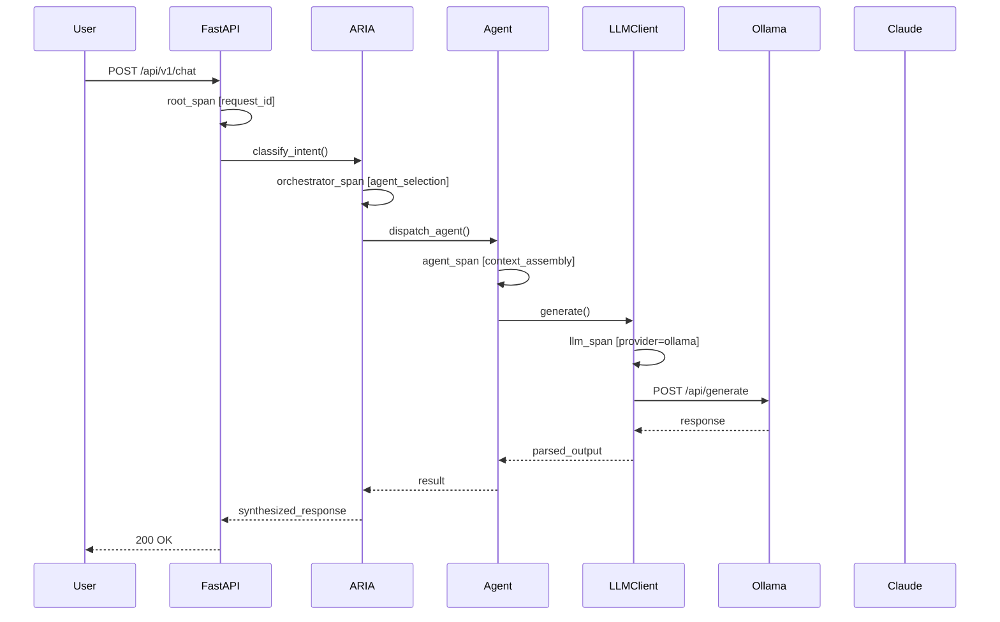

# AI Observability System

## Document Control

| Field | Value |
|---|---|
| Document ID | AI-OBS-001 |
| Version | 2.0.0 |
| Status | Active |
| Owner | Developer |
| Last Updated | 2026-07-14 |
| Classification | Internal |
| Target Audience | AI Agents, Backend Developers, SRE |
| Review Cycle | Monthly |
| SLA Tier | Tier 1 (Critical) |

---

## Table of Contents

1. [Executive Summary](#1-executive-summary)
2. [AI Observability Challenges](#2-ai-observability-challenges)
3. [Current State](#3-current-state)
4. [LLM Metrics](#4-llm-metrics)
5. [Quality Metrics](#5-quality-metrics)
6. [Tracing Architecture](#6-tracing-architecture)
7. [LLM Cost Tracking](#7-llm-cost-tracking)
8. [Logging Strategy](#8-logging-strategy)
9. [Alerting](#9-alerting)
10. [Dashboard](#10-dashboard)
11. [Error Handling](#11-error-handling)
12. [Security](#12-security)
13. [Performance](#13-performance)
14. [Related Documents](#14-related-documents)
15. [Appendices](#15-appendices)

---

## 1. Executive Summary

### 1.1 Purpose

The AI Observability System provides end-to-end visibility into all AI operations within ARIA OS. It enables developers and operators to monitor, measure, and debug the behavior of 11 AI agents, the ARIA orchestrator, and all LLM interactions in real time.

### 1.2 Scope

This system covers:

- **LLM Metrics**: Response times, token usage, cost, error rates, retry counts, circuit breaker states
- **Quality Metrics**: Hallucination detection, user feedback scores, fallback rates, task acceptance rates
- **Distributed Tracing**: End-to-end trace spans from user request through agent dispatch to LLM provider calls
- **Cost Tracking**: Per-agent, per-user, and aggregate cost dashboards with budget enforcement
- **Alerting**: Proactive notifications for anomalies, degradations, and failures
- **Logging**: Structured JSON logs for all AI interactions with configurable retention

### 1.3 Business Drivers

| Driver | Impact | Target |
|---|---|---|
| **Cost Control** | Each LLM call costs \$0.001–\$0.015; 11 agents × 1000s of calls/month adds up | < \$5/month total AI cost |
| **Hallucination Detection** | Untrusted agent outputs erode user confidence | < 1% hallucination rate |
| **Latency Degradation** | Slow AI responses break the user experience | p95 < 30s, p50 < 10s |
| **Failover Visibility** | Circuit breaker transitions must be visible within 60s | Alert within 60s of open state |

### 1.4 Design Principles

1. **Zero overhead by default**: Sampling ensures observability never exceeds 2% CPU overhead
2. **Never lose telemetry**: Local buffer flushes telemetry when the collector is unavailable
3. **PII-safe by design**: All logged data passes through automated PII redaction
4. **Actionable alerts**: Every alert includes a runbook link and suggested remediation

---

## 2. AI Observability Challenges

### 2.1 Hallucination Detection

LLMs generate plausible-sounding but factually incorrect outputs. Detecting hallucinations requires:

- Semantic similarity comparison between input context and output claims
- Consistency checks across repeated queries
- Confidence score calibration from the LLM provider
- User feedback correlation (corrections, rejections)

**Challenges**: No ground truth available at inference time; detection adds latency and cost.

### 2.2 Latency Tracking

AI requests flow through multiple stages: intent classification → context assembly → prompt construction → LLM call → response parsing → post-processing. Each stage adds latency.

**Challenges**: LLM provider response times are unpredictable (2s–60s+); retries with backoff compound delays; circuit breaker transitions cause intermittent latency spikes.

### 2.3 Cost Monitoring

Cost varies by provider, model, token count, and request volume. Without granular tracking:

- Per-agent costs are invisible
- Token waste from oversized prompts goes undetected
- Budget overruns are discovered only at billing time
- Cost attribution by user/feature is impossible

**Challenges**: Ollama is free but local; Claude fallback costs \$0.003–\$0.015/request; tracking requires per-request token accounting.

### 2.4 Quality Measurement

Output quality is inherently subjective. Proxy metrics include:

| Metric | Signal | Limitation |
|---|---|---|
| User thumbs-up/down | Direct quality signal | Sparse, biased toward extremes |
| Task acceptance rate | User chose to use the output | Confounded by user diligence |
| Edit distance | How much user modified output | High variance by task type |
| Fallback rate | System fell back to algorithmic | Indicates LLM failure, not quality |

### 2.5 Provider Failover

When the primary LLM provider fails, the system falls back:

```
Ollama (primary) → Claude API (fallback 1) → Algorithmic (fallback 2)
```

Each transition must be traced, timed, and alerted on.

---

## 3. Current State

### 3.1 What Exists

| Component | Status | Details |
|---|---|---|
| `structlog` structured logging | ✅ Active | JSON-formatted logs with request IDs |
| `sentry.io` error tracking | ✅ Active | Captures Python exceptions |
| FastAPI request logging middleware | ✅ Active | Logs method, path, status, duration |
| Circuit breaker logging | ✅ Active | Logs state transitions |
| LLM client retry logging | ✅ Active | Logs retry attempts with backoff |

### 3.2 What's Needed

| Component | Status | Target |
|---|---|---|
| OpenTelemetry tracing | ❌ Missing | End-to-end trace spans |
| AI interaction log DB table | ❌ Missing | Structured queryable logs |
| Cost tracking by agent/user | ❌ Missing | Per-request cost attribution |
| Quality metrics dashboard | ❌ Missing | Grafana panels |
| Hallucination detector | ❌ Missing | Automated quality scoring |
| Alert rules for AI | ❌ Missing | Proactive notification |
| Budget enforcement | ❌ Missing | Hard and soft budget limits |

---

## 4. LLM Metrics

### 4.1 Core Metrics

| Metric | Type | Description | Source | Labels |
|---|---|---|---|---|
| `llm_response_time_ms` | Histogram | Time to complete LLM call | LLM Client | provider, agent, model, status |
| `llm_token_input` | Counter | Input tokens consumed | Provider Response | provider, agent, model |
| `llm_token_output` | Counter | Output tokens consumed | Provider Response | provider, agent, model |
| `llm_cost_usd` | Counter | Estimated cost in USD | Calculated | provider, agent, model |
| `llm_requests_total` | Counter | Total LLM requests | LLM Client | provider, agent, status |
| `llm_errors_total` | Counter | LLM failures (all types) | LLM Client | provider, error_type |
| `llm_retry_count` | Counter | Retry attempts | LLM Client | provider, attempt |
| `llm_circuit_breaker_state` | Gauge | Current CB state (0=closed, 1=open, 2=half) | Circuit Breaker | provider |
| `llm_context_window_usage` | Gauge | % of context window used | Provider Response | provider, agent |
| `llm_fallback_activated` | Counter | Fallback provider used | LLM Client | from_provider, to_provider |
| `agent_execution_time_ms` | Histogram | Full agent execution | Agent Base | agent, status |
| `hallucination_score` | Gauge | Detected hallucination probability | Hallucination Detector | agent |
| `user_feedback_score` | Gauge | Explicit user rating (1-5) | Feedback API | agent |

### 4.2 Metric Implementation

```python
from opentelemetry import metrics
from opentelemetry.metrics import Histogram, Counter, Gauge
from functools import wraps
import time
from typing import Optional, Callable

meter = metrics.get_meter("aria-llm", version="1.0.0")

# Histograms
llm_response_time: Histogram = meter.create_histogram(
    name="llm.response_time_ms",
    description="LLM provider response time in milliseconds",
    unit="ms",
    boundaries=[100, 500, 1000, 3000, 5000, 10000, 30000, 60000],
)

agent_execution_time: Histogram = meter.create_histogram(
    name="agent.execution_time_ms",
    description="Full agent execution time in milliseconds",
    unit="ms",
    boundaries=[500, 1000, 5000, 10000, 30000, 60000, 120000],
)

# Counters
llm_requests: Counter = meter.create_counter(
    name="llm.requests_total",
    description="Total LLM requests",
)

llm_errors: Counter = meter.create_counter(
    name="llm.errors_total",
    description="Total LLM errors",
)

llm_cost: Counter = meter.create_counter(
    name="llm.cost_usd",
    description="Estimated LLM cost in USD",
    unit="usd",
)

# Gauges
llm_cb_state: Gauge = meter.create_gauge(
    name="llm.circuit_breaker_state",
    description="Circuit breaker state: 0=closed, 1=open, 2=half-open",
)


def record_llm_call(provider: str, agent: str, model: str):
    """Decorator to record LLM call metrics."""

    def decorator(func: Callable):
        @wraps(func)
        async def wrapper(*args, **kwargs):
            start = time.time()
            status = "success"
            error_type = None
            tokens_in = 0
            tokens_out = 0

            try:
                result = await func(*args, **kwargs)

                if isinstance(result, dict):
                    tokens_in = result.get("usage", {}).get("input_tokens", 0) or \
                                result.get("usage", {}).get("prompt_tokens", 0)
                    tokens_out = result.get("usage", {}).get("output_tokens", 0) or \
                                 result.get("usage", {}).get("completion_tokens", 0)

                return result

            except Exception as e:
                status = "error"
                error_type = type(e).__name__
                llm_errors.add(
                    1,
                    {"provider": provider, "error_type": error_type, "agent": agent},
                )
                raise

            finally:
                duration_ms = (time.time() - start) * 1000

                llm_response_time.record(
                    duration_ms,
                    {"provider": provider, "agent": agent, "model": model, "status": status},
                )

                llm_requests.add(
                    1,
                    {"provider": provider, "agent": agent, "status": status},
                )

                if tokens_in > 0 or tokens_out > 0:
                    cost = calculate_cost(provider, model, tokens_in, tokens_out)
                    llm_cost.add(
                        cost,
                        {"provider": provider, "agent": agent, "model": model},
                    )

                    _log_interaction(
                        agent=agent,
                        provider=provider,
                        model=model,
                        tokens_in=tokens_in,
                        tokens_out=tokens_out,
                        cost=cost,
                        duration_ms=duration_ms,
                        status=status,
                        error_type=error_type,
                    )

        return wrapper

    return decorator


def calculate_cost(provider: str, model: str, tokens_in: int, tokens_out: int) -> float:
    """Calculate estimated cost for an LLM call."""
    rates = {
        ("ollama", "mistral:7b"): {"input": 0.0, "output": 0.0},
        ("claude", "claude-sonnet-4-20250514"): {"input": 0.003, "output": 0.015},
        ("claude", "claude-haiku-3-5-20241022"): {"input": 0.001, "output": 0.005},
        ("openai", "gpt-4o-mini"): {"input": 0.00015, "output": 0.0006},
        ("openai", "gpt-4o"): {"input": 0.0025, "output": 0.01},
    }

    key = (provider, model)
    if key not in rates:
        rate = rates.get((provider, "default"), {"input": 0.0, "output": 0.0})
    else:
        rate = rates[key]

    return (tokens_in / 1000) * rate["input"] + (tokens_out / 1000) * rate["output"]
```

### 4.3 Provider Cost Rates

| Provider | Model | Input \$/1K tokens | Output \$/1K tokens |
|---|---|---|---|
| Ollama (local) | mistral:7b | \$0.000000 | \$0.000000 |
| Ollama (local) | llama3:8b | \$0.000000 | \$0.000000 |
| Claude | claude-sonnet-4-20250514 | \$0.003000 | \$0.015000 |
| Claude | claude-haiku-3-5-20241022 | \$0.001000 | \$0.005000 |
| OpenAI | gpt-4o-mini | \$0.000150 | \$0.000600 |
| OpenAI | gpt-4o | \$0.002500 | \$0.010000 |

---

## 5. Quality Metrics

### 5.1 Explicit User Feedback

```python
from fastapi import APIRouter, HTTPException, Depends
from pydantic import BaseModel
from config.core.supabase import get_supabase

router = APIRouter(prefix="/api/v1/feedback", tags=["feedback"])


class FeedbackCreate(BaseModel):
    interaction_id: str
    rating: int  # 1-5 thumbs up/down
    feedback_text: str | None = None
    agent: str
    corrected_output: str | None = None


@router.post("/ai")
async def submit_ai_feedback(
    feedback: FeedbackCreate,
    supabase=Depends(get_supabase),
    user_id: str = Depends(get_current_user),
):
    if feedback.rating < 1 or feedback.rating > 5:
        raise HTTPException(status_code=422, detail="Rating must be 1-5")

    result = supabase.table("ai_feedback").insert({
        "user_id": user_id,
        "interaction_id": feedback.interaction_id,
        "rating": feedback.rating,
        "feedback_text": feedback.feedback_text,
        "agent": feedback.agent,
        "corrected_output": feedback.corrected_output,
    }).execute()

    _record_quality_metric(feedback.agent, feedback.rating)

    return {"status": "recorded"}
```

### 5.2 Implicit Quality Signals

```python
class ImplicitQualityTracker:
    """Tracks implicit quality signals from user behavior."""

    def __init__(self, supabase_client):
        self.supabase = supabase_client

    async def record_task_acceptance(
        self, user_id: str, agent: str, suggested: str, accepted: bool
    ):
        await self.supabase.table("ai_quality_signals").insert({
            "user_id": user_id,
            "agent": agent,
            "signal_type": "task_acceptance",
            "value": 1.0 if accepted else 0.0,
            "metadata": {"suggested_length": len(suggested)},
        }).execute()

    async def record_edit_distance(
        self, user_id: str, agent: str, original: str, edited: str
    ):
        from difflib import SequenceMatcher

        distance = 1.0 - SequenceMatcher(None, original, edited).ratio()

        await self.supabase.table("ai_quality_signals").insert({
            "user_id": user_id,
            "agent": agent,
            "signal_type": "edit_distance",
            "value": distance,
            "metadata": {
                "original_length": len(original),
                "edited_length": len(edited),
            },
        }).execute()

    async def get_agent_quality_score(self, agent: str, days: int = 7) -> dict:
        """Composite quality score for an agent over a time window."""
        signals = self.supabase.table("ai_quality_signals")\
            .select("*")\
            .eq("agent", agent)\
            .gte("created_at", f"now() - interval '{days} days'")\
            .execute()

        if not signals.data:
            return {"agent": agent, "score": None, "signals": 0}

        weights = {
            "explicit_rating": 0.4,
            "task_acceptance": 0.3,
            "edit_distance": 0.2,
            "fallback_rate": 0.1,
        }

        scores = {}
        for st, weight in weights.items():
            matching = [s for s in signals.data if s["signal_type"] == st]
            if matching:
                scores[st] = sum(s["value"] for s in matching) / len(matching)

        if not scores:
            return {"agent": agent, "score": None, "signals": len(signals.data)}

        composite = sum(scores.get(st, 0) * weights[st] for st in weights)
        return {
            "agent": agent,
            "score": round(composite, 3),
            "signals": len(signals.data),
            "breakdown": scores,
        }
```

### 5.3 Hallucination Rate Detection

```python
import re
from typing import Optional
import numpy as np


class HallucinationDetector:
    """Detects potential hallucinations in LLM outputs."""

    def __init__(self, threshold: float = 0.3):
        self.threshold = threshold

    async def score_output(
        self,
        input_context: str,
        agent_output: str,
        known_facts: Optional[list[str]] = None,
    ) -> dict:
        """Score an agent output for hallucination risk."""
        signals = []

        # Signal 1: Contradiction with input context
        contradiction = self._check_contradiction(input_context, agent_output)
        signals.append(contradiction)

        # Signal 2: Numerical inconsistency
        num_inconsistent = self._check_numerical_consistency(agent_output)
        signals.append(num_inconsistent)

        # Signal 3: Over-specificity (hallucinated details)
        over_specific = self._check_over_specificity(agent_output)
        signals.append(over_specific)

        # Signal 4: Known fact contradiction (if available)
        if known_facts:
            fact_check = self._check_known_facts(agent_output, known_facts)
            signals.append(fact_check)

        composite = float(np.mean(signals)) if signals else 0.0
        is_hallucination = composite > self.threshold

        return {
            "score": round(composite, 3),
            "is_hallucination": is_hallucination,
            "signals": {
                "contradiction": contradiction,
                "numerical_inconsistency": num_inconsistent,
                "over_specificity": over_specific,
                "known_fact_contradiction": fact_check if known_facts else None,
            },
        }

    def _check_contradiction(self, context: str, output: str) -> float:
        """Check if output contradicts input context."""
        context_sentences = set(re.split(r'[.!?]+', context.lower()))
        output_sentences = re.split(r'[.!?]+', output.lower())

        contradictions = 0
        total = 0
        for out_sent in output_sentences:
            out_sent = out_sent.strip()
            if not out_sent or len(out_sent) < 10:
                continue
            total += 1
            for ctx_sent in context_sentences:
                if self._is_contradictory(ctx_sent, out_sent):
                    contradictions += 1
                    break

        return contradictions / max(total, 1)

    def _check_numerical_consistency(self, output: str) -> float:
        """Flag outputs with fabricated numbers."""
        number_patterns = re.findall(r'\b\d+[.]?\d*%?', output)
        if not number_patterns:
            return 0.0

        suspicious = sum(
            1 for n in number_patterns
            if self._is_suspicious_number(n)
        )
        return suspicious / len(number_patterns)

    def _check_over_specificity(self, output: str) -> float:
        """Flag outputs with excessive specific details."""
        specific_patterns = [
            r'\bexactly\s+\d+',
            r'\bprecisely\s+\d+',
            r'\b\d+[.]\d{4,}',  # Overly precise decimals
        ]
        matches = sum(len(re.findall(p, output, re.IGNORECASE)) for p in specific_patterns)
        return min(1.0, matches / 3.0)

    def _check_known_facts(self, output: str, known_facts: list[str]) -> float:
        """Check output against known facts."""
        output_lower = output.lower()
        violations = 0
        for fact in known_facts:
            if fact.lower() not in output_lower:
                violations += 1
        return violations / max(len(known_facts), 1)

    @staticmethod
    def _is_contradictory(s1: str, s2: str) -> bool:
        """Simple negation-based contradiction detection."""
        negation_words = {"not", "no", "never", "cannot", "don't", "doesn't", "isn't"}
        has_negation = any(w in s2.split() for w in negation_words)
        overlap = len(set(s1.split()) & set(s2.split()))
        return has_negation and overlap > 2

    @staticmethod
    def _is_suspicious_number(num_str: str) -> bool:
        """Check if a number looks fabricated."""
        try:
            num = float(num_str.replace("%", ""))
            return num > 1000 and num % 100 != 0  # Suspicious non-round large numbers
        except ValueError:
            return False
```

### 5.4 Fallback Rate Monitoring

```python
class FallbackMonitor:
    """Tracks LLM fallback rates per agent."""

    def __init__(self, supabase_client):
        self.supabase = supabase_client

    async def record_fallback(
        self,
        agent: str,
        from_provider: str,
        to_provider: str,
        reason: str,
        duration_ms: float,
    ):
        await self.supabase.table("ai_fallback_log").insert({
            "agent": agent,
            "from_provider": from_provider,
            "to_provider": to_provider,
            "reason": reason,
            "duration_ms": duration_ms,
        }).execute()

        llm_fallback_activated.add(
            1,
            {"from_provider": from_provider, "to_provider": to_provider, "agent": agent},
        )

    async def get_fallback_rate(self, agent: str, days: int = 7) -> float:
        """Calculate fallback rate as percentage of total requests."""
        total = self.supabase.table("ai_interaction_logs")\
            .select("id", count="exact")\
            .eq("agent", agent)\
            .gte("created_at", f"now() - interval '{days} days'")\
            .execute()

        fallbacks = self.supabase.table("ai_fallback_log")\
            .select("id", count="exact")\
            .eq("agent", agent)\
            .gte("created_at", f"now() - interval '{days} days'")\
            .execute()

        total_count = total.count if hasattr(total, "count") else len(total.data)
        fallback_count = fallbacks.count if hasattr(fallbacks, "count") else len(fallbacks.data)

        if total_count == 0:
            return 0.0

        return (fallback_count / total_count) * 100.0
```

---

## 6. Tracing Architecture

### 6.1 Trace Span Hierarchy



### 6.2 OpenTelemetry Setup

```python
from opentelemetry import trace
from opentelemetry.sdk.trace import TracerProvider
from opentelemetry.sdk.trace.export import BatchSpanProcessor
from opentelemetry.exporter.otlp.proto.http.trace_exporter import OTLPSpanExporter
from opentelemetry.sdk.resources import Resource, SERVICE_NAME, SERVICE_VERSION
import os

from shared.utils.logger import logger


def setup_tracing():
    """Initialize OpenTelemetry tracing for AI observability."""
    collector_endpoint = os.getenv(
        "OTEL_EXPORTER_OTLP_ENDPOINT",
        "http://localhost:4318/v1/traces",
    )

    resource = Resource.create({
        SERVICE_NAME: "aria-ai",
        SERVICE_VERSION: "2.0.0",
        "deployment.environment": os.getenv("ENVIRONMENT", "development"),
    })

    provider = TracerProvider(resource=resource)
    processor = BatchSpanProcessor(
        OTLPSpanExporter(endpoint=collector_endpoint),
        max_queue_size=2048,
        max_export_batch_size=512,
        schedule_delay_millis=5000,
    )
    provider.add_span_processor(processor)
    trace.set_tracer_provider(provider)

    logger.info(
        "tracing_initialized",
        endpoint=collector_endpoint,
        resource={"service": "aria-ai", "version": "2.0.0"},
    )

    return trace.get_tracer("aria-ai", "2.0.0")


tracer = setup_tracing()
```

### 6.3 AI Call Tracing Decorator

```python
from opentelemetry import trace
from opentelemetry.trace import Status, StatusCode
import functools
import json
from typing import Optional


def trace_ai_call(agent_name: str, span_name: Optional[str] = None):
    """Decorator to create OpenTelemetry spans for AI agent calls."""

    def decorator(func):
        @functools.wraps(func)
        async def wrapper(*args, **kwargs):
            span_attrs = {
                "agent.name": agent_name,
                "agent.version": "2.0.0",
            }

            if "user_id" in kwargs:
                span_attrs["user.id"] = kwargs["user_id"]

            span_name_final = span_name or f"{agent_name}.execute"

            with tracer.start_as_current_span(
                span_name_final,
                attributes=span_attrs,
                kind=trace.SpanKind.CLIENT,
            ) as span:
                try:
                    result = await func(*args, **kwargs)

                    span.set_attribute("ai.response_length", len(str(result)))
                    span.set_attribute("ai.status", "success")

                    if isinstance(result, dict):
                        if "cost" in result:
                            span.set_attribute("ai.cost_usd", result["cost"])
                        if "tokens" in result:
                            span.set_attribute("ai.tokens_total", result["tokens"])

                    span.set_status(Status(StatusCode.OK))
                    return result

                except Exception as e:
                    span.set_attribute("ai.status", "error")
                    span.set_attribute("ai.error_type", type(e).__name__)
                    span.set_attribute("ai.error_message", str(e)[:500])
                    span.set_status(Status(StatusCode.ERROR, str(e)))
                    span.record_exception(e)
                    raise

        return wrapper

    return decorator
```

### 6.4 Agent-Level Tracing Example

```python
from opentelemetry import trace
from ai.tracing import tracer, trace_ai_call


class BaseAgent:
    """Base class for all AI agents with built-in tracing."""

    def __init__(self, name: str, version: str = "1.0.0"):
        self.name = name
        self.version = version
        self.tracer = tracer

    async def execute(self, user_id: str, context: dict) -> dict:
        """Execute agent with full tracing. Override in subclass."""
        raise NotImplementedError

    def _create_span(self, name: str, attributes: dict = None):
        """Create a child span for a sub-operation."""
        attrs = {
            "agent.name": self.name,
            "agent.version": self.version,
            **(attributes or {}),
        }
        return self.tracer.start_as_current_span(name, attributes=attrs)

    async def _llm_call(self, prompt: str, system: str = None) -> dict:
        """Wrapped LLM call with tracing."""
        with self._create_span(f"{self.name}.llm_call") as span:
            span.set_attribute("prompt_length", len(prompt))
            span.set_attribute("system_length", len(system or ""))

            from ai.client import llm
            result = await llm.generate_json(prompt, system=system)

            span.set_attribute("response_length", len(str(result)))
            return result


class BriefingAgent(BaseAgent):
    """Daily briefing agent with full trace coverage."""

    def __init__(self):
        super().__init__(name="briefing_agent", version="2.1.0")

    @trace_ai_call(agent_name="briefing_agent")
    async def execute(self, user_id: str, context: dict) -> dict:
        with self._create_span("briefing_agent.assembly") as span:
            prompt = self._assemble_context(context)
            span.set_attribute("context.task_count", len(context.get("tasks", [])))
            span.set_attribute("context.event_count", len(context.get("events", [])))

        with self._create_span("briefing_agent.llm") as span:
            prompt_entry = prompts.get_agent("briefing_agent")
            if prompt_entry:
                system = prompt_entry.system_prompt
            else:
                system = "You generate daily briefings."

            result = await self._llm_call(prompt, system=system)

        with self._create_span("briefing_agent.post_process") as span:
            parsed = self._parse_response(result)
            span.set_attribute("output.sections", len(parsed.get("sections", [])))

        return parsed
```

---

## 7. LLM Cost Tracking

### 7.1 Cost by Agent (SQL View)

```sql
CREATE VIEW ai_cost_by_agent AS
SELECT
    agent,
    provider,
    model,
    COUNT(*) AS request_count,
    SUM(tokens_input) AS total_tokens_input,
    SUM(tokens_output) AS total_tokens_output,
    SUM(cost_usd) AS total_cost_usd,
    AVG(cost_usd) AS avg_cost_per_request,
    AVG(duration_ms) AS avg_duration_ms,
    DATE(created_at) AS date
FROM ai_interaction_logs
GROUP BY agent, provider, model, DATE(created_at);


CREATE VIEW ai_cost_by_user AS
SELECT
    user_id,
    agent,
    SUM(cost_usd) AS total_cost_usd,
    COUNT(*) AS request_count,
    DATE(created_at) AS date
FROM ai_interaction_logs
GROUP BY user_id, agent, DATE(created_at);


CREATE VIEW ai_daily_spend AS
SELECT
    DATE(created_at) AS date,
    provider,
    SUM(cost_usd) AS total_cost_usd,
    SUM(tokens_input + tokens_output) AS total_tokens
FROM ai_interaction_logs
GROUP BY DATE(created_at), provider
ORDER BY date DESC;
```

### 7.2 Per-User Daily Budget Enforcement

```python
import redis.asyncio as redis
from datetime import date
import os
from shared.utils.logger import logger


class BudgetEnforcer:
    """Enforces per-user daily AI spend budgets."""

    def __init__(self):
        self.redis = redis.from_url(
            os.getenv("REDIS_URL", "redis://localhost:6379/0"),
            decode_responses=True,
        )
        self.default_budget = float(os.getenv("AI_DAILY_BUDGET_PER_USER", "0.05"))
        self.hard_limit = float(os.getenv("AI_DAILY_HARD_LIMIT", "0.10"))

    async def check_and_record(
        self, user_id: str, cost: float, agent: str
    ) -> tuple[bool, dict]:
        """
        Check budget and record spend atomically.

        Returns:
            (allowed: bool, budget_info: dict)
        """
        today = date.today().isoformat()
        key = f"budget:daily:{user_id}:{today}"

        current = await self.redis.incrbyfloat(key, cost)

        await self.redis.expire(key, 86400)

        user_budget = await self._get_user_budget(user_id)
        soft_limit = user_budget or self.default_budget

        budget_info = {
            "user_id": user_id,
            "date": today,
            "daily_spend": round(current, 6),
            "soft_limit": soft_limit,
            "hard_limit": self.hard_limit,
            "agent": agent,
            "request_cost": round(cost, 6),
            "soft_exceeded": current > soft_limit,
            "hard_exceeded": current > self.hard_limit,
        }

        if current > self.hard_limit:
            logger.warning(
                "budget_hard_limit_exceeded",
                user_id=user_id,
                spend=current,
                limit=self.hard_limit,
                agent=agent,
            )
            return False, budget_info

        if current > soft_limit:
            logger.info(
                "budget_soft_limit_exceeded",
                user_id=user_id,
                spend=current,
                limit=soft_limit,
                agent=agent,
            )

        return True, budget_info

    async def get_user_spend(self, user_id: str) -> dict:
        """Get current spend for a user."""
        today = date.today().isoformat()
        key = f"budget:daily:{user_id}:{today}"

        spend = float(await self.redis.get(key) or 0)
        user_budget = await self._get_user_budget(user_id)

        return {
            "user_id": user_id,
            "date": today,
            "daily_spend": round(spend, 6),
            "soft_limit": user_budget or self.default_budget,
            "hard_limit": self.hard_limit,
            "remaining": round(
                (user_budget or self.default_budget) - spend, 6
            ),
        }

    async def _get_user_budget(self, user_id: str) -> float | None:
        """Get user-specific budget from Supabase."""
        from config.core.supabase import get_supabase

        supabase = get_supabase()
        result = supabase.table("user_settings")\
            .select("ai_daily_budget")\
            .eq("user_id", user_id)\
            .execute()

        if result.data and result.data[0].get("ai_daily_budget"):
            return float(result.data[0]["ai_daily_budget"])
        return None
```

### 7.3 Cost Dashboard Page (TypeScript/React)

```typescript
'use client';

import { useEffect, useState } from 'react';
import { Card, CardContent, CardHeader, CardTitle } from '@/components/ui/card';
import { Progress } from '@/components/ui/progress';
import { Badge } from '@/components/ui/badge';

interface CostData {
  total_cost_usd: number;
  daily_cost_usd: number;
  by_agent: Array<{
    agent: string;
    cost_usd: number;
    request_count: number;
    avg_cost: number;
  }>;
  by_provider: Array<{
    provider: string;
    cost_usd: number;
    token_count: number;
  }>;
  daily_budget: number;
  daily_remaining: number;
}

export function AICostDashboard() {
  const [data, setData] = useState<CostData | null>(null);
  const [loading, setLoading] = useState(true);

  useEffect(() => {
    fetch('/api/v1/analytics/ai-costs')
      .then((r) => r.json())
      .then(setData)
      .finally(() => setLoading(false));
  }, []);

  if (loading || !data) {
    return <div className="animate-pulse h-48 bg-background-card rounded-xl" />;
  }

  const budgetPercent = data.daily_budget > 0
    ? ((data.daily_cost_usd / data.daily_budget) * 100).toFixed(1)
    : '0';

  return (
    <div className="space-y-6">
      {/* Budget Gauge */}
      <Card>
        <CardHeader>
          <CardTitle>Daily AI Budget</CardTitle>
        </CardHeader>
        <CardContent>
          <div className="space-y-2">
            <div className="flex justify-between text-sm">
              <span className="text-text-secondary">
                ${data.daily_cost_usd.toFixed(4)} spent
              </span>
              <span className="text-text-secondary">
                ${data.daily_remaining.toFixed(4)} remaining
              </span>
            </div>
            <Progress
              value={parseFloat(budgetPercent)}
              className="h-2"
              indicatorClassName={
                parseFloat(budgetPercent) > 80
                  ? 'bg-accent-danger'
                  : parseFloat(budgetPercent) > 50
                    ? 'bg-accent-warning'
                    : 'bg-accent-neon'
              }
            />
            <p className="text-xs text-text-secondary text-right">
              {budgetPercent}% of ${data.daily_budget.toFixed(4)} daily limit
            </p>
          </div>
        </CardContent>
      </Card>

      {/* By Agent */}
      <Card>
        <CardHeader>
          <CardTitle>Cost by Agent</CardTitle>
        </CardHeader>
        <CardContent>
          <div className="space-y-3">
            {data.by_agent.map((agent) => (
              <div
                key={agent.agent}
                className="flex items-center justify-between"
              >
                <div className="flex items-center gap-2">
                  <span className="font-medium capitalize">
                    {agent.agent.replace('_', ' ')}
                  </span>
                  <Badge variant="secondary">{agent.request_count} req</Badge>
                </div>
                <span className="font-mono text-sm">
                  ${agent.cost_usd.toFixed(4)}
                  <span className="text-text-secondary ml-1">
                    (${agent.avg_cost.toFixed(6)}/req)
                  </span>
                </span>
              </div>
            ))}
          </div>
        </CardContent>
      </Card>

      {/* By Provider */}
      <Card>
        <CardHeader>
          <CardTitle>Cost by Provider</CardTitle>
        </CardHeader>
        <CardContent>
          <div className="space-y-3">
            {data.by_provider.map((provider) => (
              <div
                key={provider.provider}
                className="flex items-center justify-between"
              >
                <span className="font-medium capitalize">
                  {provider.provider}
                </span>
                <div className="text-right">
                  <span className="font-mono text-sm block">
                    ${provider.cost_usd.toFixed(4)}
                  </span>
                  <span className="text-xs text-text-secondary">
                    {provider.token_count.toLocaleString()} tokens
                  </span>
                </div>
              </div>
            ))}
          </div>
        </CardContent>
      </Card>

      {/* Summary */}
      <div className="grid grid-cols-3 gap-4">
        <Card>
          <CardContent className="pt-4 text-center">
            <p className="text-2xl font-bold font-mono">
              ${data.total_cost_usd.toFixed(4)}
            </p>
            <p className="text-xs text-text-secondary">Total Cost</p>
          </CardContent>
        </Card>
        <Card>
          <CardContent className="pt-4 text-center">
            <p className="text-2xl font-bold font-mono">
              {data.by_agent.reduce((a, b) => a + b.request_count, 0)}
            </p>
            <p className="text-xs text-text-secondary">Total Requests</p>
          </CardContent>
        </Card>
        <Card>
          <CardContent className="pt-4 text-center">
            <p className="text-2xl font-bold font-mono">
              ${(
                data.total_cost_usd /
                Math.max(data.by_agent.reduce((a, b) => a + b.request_count, 0), 1)
              ).toFixed(6)}
            </p>
            <p className="text-xs text-text-secondary">Avg Cost/Req</p>
          </CardContent>
        </Card>
      </div>
    </div>
  );
}
```

---

## 8. Logging Strategy

### 8.1 Structured AI Interaction Log Schema

Every AI interaction is logged as a structured JSON record:

```json
{
  "timestamp": "2026-07-14T12:00:00.000Z",
  "request_id": "req_a1b2c3d4",
  "trace_id": "0x4a5b6c7d8e9f0a1b",
  "span_id": "0x1a2b3c4d5e6f7a8b",
  "user_id": "usr_abc123",
  "agent": "briefing_agent",
  "provider": "ollama",
  "model": "mistral:7b",
  "status": "success",
  "duration_ms": 4231.5,
  "tokens_input": 842,
  "tokens_output": 612,
  "cost_usd": 0.0,
  "retry_attempt": 0,
  "circuit_breaker_state": "closed",
  "fallback_used": false,
  "prompt_tokens": 842,
  "response_length": 4120,
  "error_type": null,
  "error_message": null,
  "hallucination_score": 0.02,
  "quality_score": 0.87,
  "cache_hit": false,
}
```

### 8.2 Database Schema

```sql
CREATE TABLE ai_interaction_logs (
    id UUID PRIMARY KEY DEFAULT gen_random_uuid(),
    request_id TEXT NOT NULL,
    trace_id TEXT,
    span_id TEXT,
    user_id UUID NOT NULL REFERENCES users(id),
    agent TEXT NOT NULL,
    provider TEXT NOT NULL,
    model TEXT NOT NULL,
    status TEXT NOT NULL CHECK (status IN ('success', 'error', 'fallback', 'timeout')),
    duration_ms NUMERIC(10, 2) NOT NULL,
    tokens_input INTEGER NOT NULL DEFAULT 0,
    tokens_output INTEGER NOT NULL DEFAULT 0,
    cost_usd NUMERIC(12, 8) NOT NULL DEFAULT 0,
    retry_attempt INTEGER NOT NULL DEFAULT 0,
    circuit_breaker_state TEXT CHECK (circuit_breaker_state IN ('closed', 'open', 'half-open')),
    fallback_used BOOLEAN NOT NULL DEFAULT FALSE,
    prompt_preview TEXT,
    response_preview TEXT,
    prompt_tokens INTEGER,
    response_length INTEGER,
    error_type TEXT,
    error_message TEXT,
    hallucination_score NUMERIC(5, 4),
    quality_score NUMERIC(5, 4),
    cache_hit BOOLEAN NOT NULL DEFAULT FALSE,
    metadata JSONB DEFAULT '{}',
    environment TEXT NOT NULL DEFAULT 'production',
    created_at TIMESTAMPTZ NOT NULL DEFAULT NOW()
);

-- Indexes for query performance
CREATE INDEX idx_ai_logs_created_at ON ai_interaction_logs (created_at DESC);
CREATE INDEX idx_ai_logs_user_id ON ai_interaction_logs (user_id, created_at DESC);
CREATE INDEX idx_ai_logs_agent ON ai_interaction_logs (agent, created_at DESC);
CREATE INDEX idx_ai_logs_status ON ai_interaction_logs (status, created_at DESC);
CREATE INDEX idx_ai_logs_provider ON ai_interaction_logs (provider, created_at DESC);
CREATE INDEX idx_ai_logs_error ON ai_interaction_logs (error_type) WHERE error_type IS NOT NULL;
CREATE INDEX idx_ai_logs_cost ON ai_interaction_logs (cost_usd) WHERE cost_usd > 0;
CREATE INDEX idx_ai_logs_metadata ON ai_interaction_logs USING GIN (metadata jsonb_path_ops);

-- Partition by month for retention management
CREATE TABLE ai_interaction_logs_y2026m07 PARTITION OF ai_interaction_logs
    FOR VALUES FROM ('2026-07-01') TO ('2026-08-01');

-- RLS: users can only see their own logs
ALTER TABLE ai_interaction_logs ENABLE ROW LEVEL SECURITY;

CREATE POLICY user_ai_logs_isolation ON ai_interaction_logs
    FOR ALL USING (user_id = auth.uid())
    WITH CHECK (user_id = auth.uid());

-- Admin can see all logs
CREATE POLICY admin_ai_logs_access ON ai_interaction_logs
    FOR SELECT USING (
        auth.uid() IN (SELECT user_id FROM user_roles WHERE role = 'admin')
    );


CREATE TABLE ai_fallback_log (
    id UUID PRIMARY KEY DEFAULT gen_random_uuid(),
    agent TEXT NOT NULL,
    from_provider TEXT NOT NULL,
    to_provider TEXT NOT NULL,
    reason TEXT NOT NULL,
    duration_ms NUMERIC(10, 2),
    created_at TIMESTAMPTZ NOT NULL DEFAULT NOW()
);

CREATE INDEX idx_ai_fallback_agent ON ai_fallback_log (agent, created_at DESC);


CREATE TABLE ai_feedback (
    id UUID PRIMARY KEY DEFAULT gen_random_uuid(),
    user_id UUID NOT NULL REFERENCES users(id),
    interaction_id UUID NOT NULL REFERENCES ai_interaction_logs(id),
    rating INTEGER NOT NULL CHECK (rating >= 1 AND rating <= 5),
    feedback_text TEXT,
    agent TEXT NOT NULL,
    corrected_output TEXT,
    created_at TIMESTAMPTZ NOT NULL DEFAULT NOW()
);

CREATE INDEX idx_ai_feedback_rating ON ai_feedback (rating);
CREATE INDEX idx_ai_feedback_agent ON ai_feedback (agent, created_at DESC);


CREATE TABLE ai_quality_signals (
    id UUID PRIMARY KEY DEFAULT gen_random_uuid(),
    user_id UUID NOT NULL REFERENCES users(id),
    agent TEXT NOT NULL,
    signal_type TEXT NOT NULL CHECK (
        signal_type IN (
            'explicit_rating',
            'task_acceptance',
            'edit_distance',
            'correction',
            'regeneration_request'
        )
    ),
    value NUMERIC(5, 4) NOT NULL,
    metadata JSONB DEFAULT '{}',
    created_at TIMESTAMPTZ NOT NULL DEFAULT NOW()
);

CREATE INDEX idx_ai_quality_agent ON ai_quality_signals (agent, signal_type);
CREATE INDEX idx_ai_quality_user ON ai_quality_signals (user_id, created_at DESC);
```

### 8.3 AIInteractionLogger Class

```python
import json
import uuid
from datetime import datetime, timezone
from typing import Optional
from config.core.supabase import get_supabase
from shared.utils.logger import logger


class AIInteractionLogger:
    """Logs AI interactions to structured storage and structured logs."""

    def __init__(self, supabase_client=None):
        self.supabase = supabase_client or get_supabase()

    async def log_interaction(
        self,
        user_id: str,
        agent: str,
        provider: str,
        model: str,
        status: str,
        duration_ms: float,
        tokens_input: int = 0,
        tokens_output: int = 0,
        cost_usd: float = 0.0,
        retry_attempt: int = 0,
        circuit_breaker_state: Optional[str] = None,
        fallback_used: bool = False,
        prompt_preview: Optional[str] = None,
        response_preview: Optional[str] = None,
        error_type: Optional[str] = None,
        error_message: Optional[str] = None,
        hallucination_score: Optional[float] = None,
        quality_score: Optional[float] = None,
        cache_hit: bool = False,
        metadata: Optional[dict] = None,
        request_id: Optional[str] = None,
        trace_id: Optional[str] = None,
        span_id: Optional[str] = None,
    ) -> str:
        """Log an AI interaction to Supabase and structured logs."""
        log_id = str(uuid.uuid4())

        record = {
            "id": log_id,
            "request_id": request_id or str(uuid.uuid4()),
            "trace_id": trace_id,
            "span_id": span_id,
            "user_id": user_id,
            "agent": agent,
            "provider": provider,
            "model": model,
            "status": status,
            "duration_ms": round(duration_ms, 2),
            "tokens_input": tokens_input,
            "tokens_output": tokens_output,
            "cost_usd": round(cost_usd, 8),
            "retry_attempt": retry_attempt,
            "circuit_breaker_state": circuit_breaker_state,
            "fallback_used": fallback_used,
            "prompt_preview": prompt_preview[:500] if prompt_preview else None,
            "response_preview": response_preview[:1000] if response_preview else None,
            "error_type": error_type,
            "error_message": str(error_message)[:500] if error_message else None,
            "hallucination_score": (
                round(hallucination_score, 4) if hallucination_score is not None else None
            ),
            "quality_score": (
                round(quality_score, 4) if quality_score is not None else None
            ),
            "cache_hit": cache_hit,
            "metadata": metadata or {},
            "environment": os.getenv("ENVIRONMENT", "development"),
        }

        # Log to structured logger (always succeeds)
        logger.info(
            "ai_interaction",
            **{k: v for k, v in record.items() if v is not None},
        )

        # Log to Supabase (best-effort)
        try:
            result = self.supabase.table("ai_interaction_logs").insert(record).execute()
            if result.error:
                logger.warn("ai_log_insert_failed", error=str(result.error))
        except Exception as e:
            logger.error("ai_log_insert_exception", error=str(e))

        return log_id

    async def get_interactions(
        self,
        user_id: str,
        agent: Optional[str] = None,
        limit: int = 50,
        offset: int = 0,
        status: Optional[str] = None,
    ) -> list[dict]:
        """Retrieve AI interactions for a user."""
        query = (
            self.supabase.table("ai_interaction_logs")
            .select("*")
            .eq("user_id", user_id)
            .order("created_at", desc=True)
            .range(offset, offset + limit - 1)
        )

        if agent:
            query = query.eq("agent", agent)
        if status:
            query = query.eq("status", status)

        result = query.execute()
        return result.data

    async def get_error_summary(self, days: int = 7) -> list[dict]:
        """Get error summary across all agents."""
        result = (
            self.supabase.table("ai_interaction_logs")
            .select(
                "agent",
                "error_type",
                count="count",
            )
            .eq("status", "error")
            .gte("created_at", f"now() - interval '{days} days'")
            .execute()
        )
        return result.data
```

### 8.4 Log Retention Policy

| Environment | Retention | Partition Interval | Deletion Method |
|---|---|---|---|
| Development | 7 days | Daily | DROP PARTITION |
| Staging | 30 days | Weekly | DROP PARTITION |
| Production | 90 days | Monthly | DROP PARTITION + Archive to S3 |
| Audit (errors only) | 1 year | Monthly | Separate archive table |

```sql
CREATE OR REPLACE FUNCTION drop_ai_logs_partition()
RETURNS void AS $$
DECLARE
    partition_name TEXT;
    cutoff_date DATE;
BEGIN
    cutoff_date := CURRENT_DATE - INTERVAL '90 days';

    FOR partition_name IN
        SELECT tablename
        FROM pg_tables
        WHERE tablename LIKE 'ai_interaction_logs_%'
          AND tablename < 'ai_interaction_logs_'
                               || to_char(cutoff_date, '"y"YYYY"m"MM')
    LOOP
        EXECUTE format('DROP TABLE IF EXISTS %I', partition_name);
    END LOOP;
END;
$$ LANGUAGE plpgsql;
```

---

## 9. Alerting

### 9.1 Alert Rules

| Rule | Metric | Condition | Severity | Throttle | Runbook |
|---|---|---|---|---|---|
| High AI Error Rate | `llm_errors_total` | rate > 10% over 5m | P1 | 5m | docs/operations/runbooks/ai-error-rate.md |
| High AI Latency | `llm_response_time_ms` | p95 > 30s over 5m | P1 | 10m | docs/operations/runbooks/ai-latency.md |
| Circuit Breaker Open | `llm_circuit_breaker_state` | state == 1 (open) | P1 | 1m | docs/operations/runbooks/circuit-breaker.md |
| Budget Hard Limit Hit | budget enforcement | user exceeds hard limit | P2 | 15m | docs/operations/runbooks/ai-budget.md |
| All Providers Down | `llm_errors_total` | all providers failing > 2m | P0 | 1m | docs/operations/runbooks/ai-outage.md |
| Hallucination Spike | `hallucination_score` | avg > 0.5 over 15m | P2 | 30m | docs/operations/runbooks/hallucination.md |
| Fallback Rate Spike | `llm_fallback_activated` | rate > 20% over 5m | P2 | 10m | docs/operations/runbooks/fallback-rate.md |
| Retry Storm | `llm_retry_count` | > 10 retries/min over 1m | P2 | 5m | docs/operations/runbooks/retry-storm.md |
| Token Usage Spike | `llm_token_input` + `llm_token_output` | > 2x daily average over 5m | P3 | 15m | docs/operations/runbooks/token-spike.md |
| No AI Interactions | `llm_requests_total` | rate == 0 over 30m (during business hours) | P3 | 1h | docs/operations/runbooks/silent-ai.md |
| Quality Score Drop | `user_feedback_score` | avg < 2.0 over 1h | P2 | 30m | docs/operations/runbooks/quality-drop.md |
| Agent Silent Failure | `agent_execution_time_ms` | agent returns no output > 5 times | P2 | 15m | docs/operations/runbooks/agent-silent.md |

### 9.2 Alert Manager Implementation

```python
from enum import Enum
import asyncio
from datetime import datetime, timedelta
from dataclasses import dataclass, field
from typing import Optional


class AlertSeverity(Enum):
    P0 = "P0"
    P1 = "P1"
    P2 = "P2"
    P3 = "P3"
    P4 = "P4"


class AlertStatus(Enum):
    FIRING = "firing"
    RESOLVED = "resolved"
    ACKNOWLEDGED = "acknowledged"


@dataclass
class Alert:
    name: str
    severity: AlertSeverity
    message: str
    labels: dict = field(default_factory=dict)
    annotations: dict = field(default_factory=dict)
    status: AlertStatus = AlertStatus.FIRING
    started_at: datetime = field(default_factory=datetime.utcnow)
    resolved_at: Optional[datetime] = None
    runbook_url: Optional[str] = None


class AIAlertManager:
    """Manages alert rules and notifications for AI observability."""

    def __init__(self, supabase_client=None):
        self.supabase = supabase_client
        self.throttle_cache: dict[str, datetime] = {}
        self.notification_channels = self._init_channels()

    def _init_channels(self) -> list:
        channels = []
        if os.getenv("SLACK_WEBHOOK_URL"):
            channels.append(SlackChannel(os.getenv("SLACK_WEBHOOK_URL")))
        if os.getenv("SENTRY_DSN"):
            channels.append(SentryChannel())
        channels.append(LogChannel())
        return channels

    async def evaluate_rules(self, metrics: dict) -> list[Alert]:
        """Evaluate all alert rules against current metrics."""
        alerts = []

        # Rule: High error rate
        if self._rate(metrics, "llm.errors_total") > 0.1:
            alerts.append(Alert(
                name="HighAIErrorRate",
                severity=AlertSeverity.P1,
                message=f"AI error rate at {self._rate(metrics, 'llm.errors_total'):.1%}",
                labels={"metric": "llm.errors_total"},
                runbook_url="/docs/operations/runbooks/ai-error-rate.md",
            ))

        # Rule: High latency
        if metrics.get("llm.response_time_ms.p95", 0) > 30000:
            alerts.append(Alert(
                name="HighAILatency",
                severity=AlertSeverity.P1,
                message=f"AI p95 latency at {metrics['llm.response_time_ms.p95']:.0f}ms",
                labels={"metric": "llm.response_time_ms"},
                runbook_url="/docs/operations/runbooks/ai-latency.md",
            ))

        # Rule: Circuit breaker open
        if metrics.get("llm.circuit_breaker_state") == 1:
            for provider, state in metrics.get("llm.circuit_breaker_states", {}).items():
                if state == 1:
                    alerts.append(Alert(
                        name="CircuitBreakerOpen",
                        severity=AlertSeverity.P1,
                        message=f"Circuit breaker OPEN for {provider}",
                        labels={"provider": provider},
                        runbook_url="/docs/operations/runbooks/circuit-breaker.md",
                    ))

        # Rule: All providers failing
        provider_errors = {}
        for k, v in metrics.items():
            if k.startswith("llm.errors_total."):
                provider = k.split(".")[-1]
                provider_errors[provider] = v

        if all(e > 0 for e in provider_errors.values()) and len(provider_errors) > 1:
            alerts.append(Alert(
                name="AllProvidersDown",
                severity=AlertSeverity.P0,
                message="All LLM providers are failing",
                labels={"providers": ",".join(provider_errors.keys())},
                runbook_url="/docs/operations/runbooks/ai-outage.md",
            ))

        # Filter throttled alerts
        return [
            a for a in alerts
            if not self._is_throttled(a.name, a.labels)
        ]

    async def fire_alerts(self, alerts: list[Alert]):
        """Send alerts to all notification channels."""
        for alert in alerts:
            self._update_throttle(alert.name, alert.labels)

            for channel in self.notification_channels:
                try:
                    await channel.send(alert)
                except Exception as e:
                    logger.error(
                        "alert_channel_failed",
                        channel=channel.__class__.__name__,
                        alert=alert.name,
                        error=str(e),
                    )

    def _is_throttled(self, name: str, labels: dict) -> bool:
        """Check if an alert is throttled."""
        key = f"{name}:{hash(frozenset(labels.items()))}"
        last_fired = self.throttle_cache.get(key)
        if not last_fired:
            return False
        throttle_duration = {
            AlertSeverity.P0: timedelta(minutes=1),
            AlertSeverity.P1: timedelta(minutes=5),
            AlertSeverity.P2: timedelta(minutes=15),
            AlertSeverity.P3: timedelta(hours=1),
        }.get(AlertSeverity.P2, timedelta(minutes=10))
        return datetime.utcnow() - last_fired < throttle_duration

    def _update_throttle(self, name: str, labels: dict):
        key = f"{name}:{hash(frozenset(labels.items()))}"
        self.throttle_cache[key] = datetime.utcnow()

    @staticmethod
    def _rate(metrics: dict, counter_name: str) -> float:
        """Calculate per-second rate from a counter metric."""
        current = metrics.get(counter_name, 0)
        previous = metrics.get(f"{counter_name}.previous", 0)
        return (current - previous) / max(metrics.get("window_seconds", 300), 1)
```

### 9.3 Circuit Breaker Integration

```python
# From packages/shared/utils/retry.py — extended with observability hooks

class CircuitBreaker:
    """Circuit breaker with observability instrumentation."""

    def __init__(
        self,
        name: str,
        failure_threshold: int = 5,
        recovery_timeout: int = 60,
        half_open_max_requests: int = 3,
    ):
        self.name = name
        self.failure_threshold = failure_threshold
        self.recovery_timeout = recovery_timeout
        self.half_open_max_requests = half_open_max_requests
        self._state = "closed"
        self._failure_count = 0
        self._last_failure_time: Optional[datetime] = None
        self._half_open_requests = 0
        self._alert_manager = AIAlertManager()

    async def _transition_to(self, new_state: str):
        old_state = self._state
        self._state = new_state
        self._half_open_requests = 0

        # Update OpenTelemetry gauge
        state_map = {"closed": 0, "open": 1, "half-open": 2}
        llm_cb_state.set(state_map.get(new_state, 0), {"provider": self.name})

        # Log state transition
        logger.warning(
            "circuit_breaker_transition",
            name=self.name,
            from_state=old_state,
            to_state=new_state,
            failure_count=self._failure_count,
        )

        # Fire alert if opening
        if new_state == "open":
            await self._alert_manager.fire_alerts([
                Alert(
                    name="CircuitBreakerOpen",
                    severity=AlertSeverity.P1,
                    message=f"Circuit breaker OPEN for {self.name} "
                            f"after {self._failure_count} failures",
                    labels={"provider": self.name, "from_state": old_state},
                    runbook_url="/docs/operations/runbooks/circuit-breaker.md",
                )
            ])
```

---

## 10. Dashboard

### 10.1 Grafana Dashboard (JSON Configuration)

The AI observability dashboard consists of 5 rows:

**Row 1: Overview KPIs**

| Panel | Type | Target | Description |
|---|---|---|---|
| AI Request Rate | Stat | — | Requests/sec across all agents |
| Error Rate | Stat | < 5% | Percentage of failed requests |
| p95 Latency | Stat | < 30s | 95th percentile response time |
| Daily Cost | Stat | < \$0.05 | Current day's total AI spend |
| Circuit Breaker | Status | ✅ | All providers operational |

**Row 2: LLM Performance**

| Panel | Type | Queries |
|---|---|---|
| Response Time (p50/p95/p99) | Time series | `histogram_quantile(0.5, ...)`, `0.95`, `0.99` |
| Token Usage (Input vs Output) | Stacked bar | `sum by(type) (llm_token_input, llm_token_output)` |
| Requests by Provider | Pie | `count by(provider) (llm_requests_total)` |

**Row 3: Agent Health**

| Panel | Type | Queries |
|---|---|---|
| Error Rate by Agent | Table | `error_count / total_count by(agent)` |
| Execution Time by Agent | Heatmap | `agent_execution_time_ms` by agent |
| Fallback Rate by Agent | Time series | `fallback_count / total_count by(agent)` |

**Row 4: Quality Metrics**

| Panel | Type | Queries |
|---|---|---|
| User Feedback Score | Gauge | `avg by(agent) (user_feedback_score)` |
| Hallucination Score | Time series | `avg by(agent) (hallucination_score)` |
| Quality Signals | Time series | `rate(ai_quality_signals[5m])` |

**Row 5: Cost Breakdown**

| Panel | Type | Queries |
|---|---|---|
| Cost by Agent | Bar | `sum by(agent) (llm_cost_usd)` |
| Cost by Provider | Table | `sum by(provider) (llm_cost_usd)` |
| Daily Spend Trend | Time series | `sum by(provider) (increase(llm_cost_usd[24h]))` |

### 10.2 Embedded Admin Dashboard (TypeScript/React)

```typescript
'use client';

import { useEffect, useState } from 'react';
import {
  Card, CardContent, CardHeader, CardTitle, CardDescription,
} from '@/components/ui/card';
import { Alert, AlertDescription, AlertTitle } from '@/components/ui/alert';
import { Badge } from '@/components/ui/badge';
import { Progress } from '@/components/ui/progress';

interface AIHealthStatus {
  overall: 'healthy' | 'degraded' | 'critical';
  providers: Array<{
    name: string;
    status: 'ok' | 'degraded' | 'down';
    latency_p95_ms: number;
    error_rate: number;
    cb_state: string;
  }>;
  agents: Array<{
    name: string;
    status: 'ok' | 'degraded' | 'error';
    requests_24h: number;
    error_rate: number;
    avg_latency_ms: number;
    quality_score: number;
  }>;
  summary: {
    total_requests_24h: number;
    total_errors_24h: number;
    total_cost_24h: number;
    active_circuit_breakers: number;
  };
}

export function AIObservabilityDashboard() {
  const [health, setHealth] = useState<AIHealthStatus | null>(null);
  const [alerts, setAlerts] = useState<Array<{
    name: string; severity: string; message: string; timestamp: string;
  }>>([]);

  useEffect(() => {
    const fetchData = async () => {
      const [healthRes, alertsRes] = await Promise.all([
        fetch('/api/v1/monitoring/ai-health'),
        fetch('/api/v1/monitoring/ai-alerts?active=true'),
      ]);
      if (healthRes.ok) setHealth(await healthRes.json());
      if (alertsRes.ok) setAlerts(await alertsRes.json());
    };
    fetchData();
    const interval = setInterval(fetchData, 15000);
    return () => clearInterval(interval);
  }, []);

  if (!health) {
    return <div className="animate-pulse h-96 bg-background-card rounded-xl" />;
  }

  return (
    <div className="space-y-6">
      {/* Active Alerts */}
      {alerts.length > 0 && (
        <div className="space-y-2">
          <h2 className="text-lg font-semibold text-accent-danger">
            Active Alerts ({alerts.length})
          </h2>
          {alerts.map((alert) => (
            <Alert key={`${alert.name}-${alert.timestamp}`} variant="destructive">
              <AlertTitle className="flex items-center gap-2">
                <Badge variant="outline">{alert.severity}</Badge>
                {alert.name}
              </AlertTitle>
              <AlertDescription>{alert.message}</AlertDescription>
            </Alert>
          ))}
        </div>
      )}

      {/* Summary KPIs */}
      <div className="grid grid-cols-5 gap-4">
        <Card>
          <CardContent className="pt-4 text-center">
            <p className="text-2xl font-bold font-mono">
              {health.summary.total_requests_24h}
            </p>
            <p className="text-xs text-text-secondary">Requests (24h)</p>
          </CardContent>
        </Card>
        <Card>
          <CardContent className="pt-4 text-center">
            <p className="text-2xl font-bold font-mono">
              {health.summary.total_errors_24h}
            </p>
            <p className="text-xs text-text-secondary">Errors (24h)</p>
            <Progress
              value={(health.summary.total_errors_24h / Math.max(health.summary.total_requests_24h, 1)) * 100}
              className="h-1 mt-1"
            />
          </CardContent>
        </Card>
        <Card>
          <CardContent className="pt-4 text-center">
            <p className="text-2xl font-bold font-mono">
              ${health.summary.total_cost_24h.toFixed(4)}
            </p>
            <p className="text-xs text-text-secondary">Cost (24h)</p>
          </CardContent>
        </Card>
        <Card>
          <CardContent className="pt-4 text-center">
            <p className="text-2xl font-bold font-mono">
              {health.summary.active_circuit_breakers}
            </p>
            <p className="text-xs text-text-secondary">Open Circuit Breakers</p>
          </CardContent>
        </Card>
        <Card>
          <CardContent className="pt-4 text-center">
            <Badge
              variant={
                health.overall === 'healthy'
                  ? 'default'
                  : health.overall === 'degraded'
                    ? 'secondary'
                    : 'destructive'
              }
              className="text-lg px-4 py-1"
            >
              {health.overall.toUpperCase()}
            </Badge>
            <p className="text-xs text-text-secondary mt-1">System Health</p>
          </CardContent>
        </Card>
      </div>

      {/* Provider Status */}
      <Card>
        <CardHeader>
          <CardTitle>LLM Providers</CardTitle>
          <CardDescription>
            Real-time status of all configured LLM providers
          </CardDescription>
        </CardHeader>
        <CardContent>
          <div className="space-y-4">
            {health.providers.map((provider) => (
              <div
                key={provider.name}
                className="flex items-center justify-between p-3 rounded-lg bg-background-page"
              >
                <div className="flex items-center gap-3">
                  <div
                    className={`w-2 h-2 rounded-full ${
                      provider.status === 'ok'
                        ? 'bg-accent-neon'
                        : provider.status === 'degraded'
                          ? 'bg-accent-warning'
                          : 'bg-accent-danger'
                    }`}
                  />
                  <span className="font-medium capitalize">{provider.name}</span>
                  <Badge variant="outline">{provider.cb_state}</Badge>
                </div>
                <div className="flex gap-6 text-sm font-mono">
                  <span className="text-text-secondary">
                    {provider.latency_p95_ms.toFixed(0)}ms p95
                  </span>
                  <span
                    className={
                      provider.error_rate > 0.05
                        ? 'text-accent-danger'
                        : 'text-text-secondary'
                    }
                  >
                    {(provider.error_rate * 100).toFixed(1)}% errors
                  </span>
                </div>
              </div>
            ))}
          </div>
        </CardContent>
      </Card>

      {/* Agent Health Table */}
      <Card>
        <CardHeader>
          <CardTitle>Agent Health</CardTitle>
          <CardDescription>
            Performance metrics for all AI agents
          </CardDescription>
        </CardHeader>
        <CardContent>
          <div className="overflow-x-auto">
            <table className="w-full text-sm">
              <thead>
                <tr className="text-text-secondary border-b border-border-default">
                  <th className="text-left pb-2">Agent</th>
                  <th className="text-right pb-2">Status</th>
                  <th className="text-right pb-2">Requests</th>
                  <th className="text-right pb-2">Errors</th>
                  <th className="text-right pb-2">Avg Latency</th>
                  <th className="text-right pb-2">Quality</th>
                </tr>
              </thead>
              <tbody>
                {health.agents.map((agent) => (
                  <tr
                    key={agent.name}
                    className="border-b border-border-default hover:bg-background-card-hover"
                  >
                    <td className="py-2 capitalize">
                      {agent.name.replace(/_/g, ' ')}
                    </td>
                    <td className="py-2 text-right">
                      <Badge
                        variant={
                          agent.status === 'ok'
                            ? 'default'
                            : agent.status === 'degraded'
                              ? 'secondary'
                              : 'destructive'
                        }
                      >
                        {agent.status}
                      </Badge>
                    </td>
                    <td className="py-2 text-right font-mono">
                      {agent.requests_24h}
                    </td>
                    <td className="py-2 text-right font-mono">
                      <span
                        className={
                          agent.error_rate > 0.05
                            ? 'text-accent-danger'
                            : 'text-text-secondary'
                        }
                      >
                        {(agent.error_rate * 100).toFixed(1)}%
                      </span>
                    </td>
                    <td className="py-2 text-right font-mono">
                      {agent.avg_latency_ms.toFixed(0)}ms
                    </td>
                    <td className="py-2 text-right font-mono">
                      <span
                        className={
                          agent.quality_score < 0.5
                            ? 'text-accent-danger'
                            : agent.quality_score < 0.7
                              ? 'text-accent-warning'
                              : 'text-accent-neon'
                        }
                      >
                        {(agent.quality_score * 100).toFixed(0)}%
                      </span>
                    </td>
                  </tr>
                ))}
              </tbody>
            </table>
          </div>
        </CardContent>
      </Card>
    </div>
  );
}
```

---

## 11. Error Handling

### 11.1 Observability System Failure Modes

| Failure Mode | Impact | Detection | Recovery |
|---|---|---|---|
| Supabase unavailable | Interaction logs not persisted | HTTP 5xx from insert | Local buffer → retry |
| OpenTelemetry collector down | Traces dropped | Export timeout | Batch in memory → flush on reconnect |
| Redis unavailable | Budget enforcement disabled | Connection error | Allow all requests, log warning |
| Log queue full | Recent logs dropped | Queue size alert | Drop oldest, warn |
| Metric cardinality explosion | Collector memory pressure | Cardinality > 1000 labels | Label limiting (Section 12.3) |
| Alert channel down | Alerts not delivered | HTTP error from channel | Retry, fallback to log channel |

### 11.2 Three-Tier Degradation Strategy

```python
import asyncio
from collections import deque
from dataclasses import dataclass
from typing import Any
import json


@dataclass
class LogRecord:
    data: dict
    retries: int = 0
    last_attempt: float = 0.0


class ResilientLogger:
    """Three-tier degradation for observability logs."""

    def __init__(
        self,
        supabase_client,
        max_buffer_size: int = 1000,
        flush_interval: float = 10.0,
        max_retries: int = 3,
    ):
        self.supabase = supabase_client
        self.buffer: deque[LogRecord] = deque(maxlen=max_buffer_size)
        self.flush_interval = flush_interval
        self.max_retries = max_retries
        self._flush_task: asyncio.Task | None = None
        self._running = False

        # Tier state
        self.tier = 1  # 1=normal, 2=local buffer, 3=degraded
        self.consecutive_failures = 0
        self.logger = logger

    async def start(self):
        self._running = True
        self._flush_task = asyncio.create_task(self._periodic_flush())

    async def stop(self):
        self._running = False
        if self._flush_task:
            self._flush_task.cancel()
        await self._flush_buffer()

    async def log(self, record: dict):
        """Log a record with 3-tier degradation."""

        if self.tier == 3:
            # Tier 3: Write to local file only
            await self._write_to_local(record)
            return

        if self.tier == 2:
            # Tier 2: Buffer in memory
            self.buffer.append(LogRecord(data=record))
            return

        # Tier 1: Attempt DB write
        try:
            result = await self.supabase.table("ai_interaction_logs").insert(record).execute()
            if result.error:
                raise Exception(str(result.error))
            self.consecutive_failures = 0
        except Exception as e:
            self.consecutive_failures += 1
            self.buffer.append(LogRecord(data=record))
            logger.warn("log_write_failed", error=str(e), attempt=1)

            if self.consecutive_failures >= 3:
                await self._degrade()

    async def _periodic_flush(self):
        """Periodically flush buffered records."""
        while self._running:
            await asyncio.sleep(self.flush_interval)
            if self.buffer:
                await self._flush_buffer()

    async def _flush_buffer(self):
        """Flush buffered records to DB."""
        if not self.buffer:
            return

        batch = []
        while self.buffer and len(batch) < 100:
            record = self.buffer.popleft()
            record.retries += 1
            record.last_attempt = asyncio.get_event_loop().time()

            if record.retries <= self.max_retries:
                batch.append(record.data)

        if not batch:
            return

        try:
            result = await self.supabase.table("ai_interaction_logs").insert(batch).execute()
            if result.error:
                raise Exception(str(result.error))

            self.consecutive_failures = 0
            if self.tier > 1:
                self.tier -= 1
            logger.info("log_buffer_flushed", count=len(batch))

        except Exception as e:
            # Re-queue failed records
            for data in batch:
                self.buffer.append(LogRecord(
                    data=data,
                    retries=self.buffer[0].retries if self.buffer else 1,
                    last_attempt=asyncio.get_event_loop().time(),
                ))

            self.consecutive_failures += 1
            if self.consecutive_failures >= 5:
                await self._degrade()

    async def _degrade(self):
        """Move to next degradation tier."""
        self.tier = min(self.tier + 1, 3)
        logger.warning(
            "observability_degraded",
            tier=self.tier,
            buffer_size=len(self.buffer),
        )

    async def _write_to_local(self, record: dict):
        """Write to local log file as last resort."""
        import aiofiles

        log_line = json.dumps(record) + "\n"
        async with aiofiles.open(
            f"logs/ai_interactions_{datetime.utcnow().strftime('%Y%m%d')}.jsonl",
            mode="a",
        ) as f:
            await f.write(log_line)
```

### 11.3 Local Metric Buffering

```python
class LocalMetricBuffer:
    """In-memory buffer for OpenTelemetry metrics when collector is unavailable."""

    def __init__(self, max_size: int = 5000):
        self.buffer: list[dict] = []
        self.max_size = max_size

    def add(self, metric: dict):
        if len(self.buffer) < self.max_size:
            self.buffer.append(metric)

    async def flush_to_collector(self, collector_endpoint: str):
        """Flush buffered metrics to OTEL collector."""
        if not self.buffer:
            return

        import httpx

        batch = self.buffer[:1000]
        self.buffer = self.buffer[1000:]

        try:
            async with httpx.AsyncClient(timeout=10.0) as client:
                response = await client.post(
                    f"{collector_endpoint}/v1/metrics",
                    json={"resourceMetrics": batch},
                )
                if response.status_code == 200:
                    logger.info("metrics_flushed", count=len(batch))
                else:
                    self.buffer.extend(batch)
                    logger.warn("metrics_flush_failed", status=response.status_code)
        except Exception as e:
            self.buffer.extend(batch)
            logger.warn("metrics_flush_error", error=str(e))
```

---

## 12. Security

### 12.1 Access Control Matrix

| Resource | Read | Write | Admin |
|---|---|---|---|
| `ai_interaction_logs` | Own records only + Admin | System only | All records |
| `ai_feedback` | Own records only | Own records only | All records |
| `ai_fallback_log` | Own agent logs + Admin | System only | All records |
| `ai_quality_signals` | Own signals only | System only | All records |
| Metrics (OTEL) | Monitoring system | System only | Monitoring system |
| Cost data | Admin only | System only | Admin only |
| Alerts | All authenticated | System only | All |
| Budget config | Own budget | System only | All budgets |

### 12.2 PII Redaction in Logs

```python
import re
from typing import Optional


class PIIRedactor:
    """Redacts personally identifiable information from log records."""

    PATTERNS = [
        (re.compile(r'\b[A-Za-z0-9._%+-]+@[A-Za-z0-9.-]+\.[A-Za-z]{2,}\b'), '[EMAIL]'),
        (re.compile(r'\b\d{3}[-.]?\d{3}[-.]?\d{4}\b'), '[PHONE]'),
        (re.compile(r'\b(?:\d{4}[-\s]?){3}\d{4}\b'), '[CARD]'),
        (re.compile(r'\b[A-Z]{2}\d{6}[A-Z\d]?\b'), '[PASSPORT]'),
        (re.compile(r'\b\d{3}-\d{2}-\d{4}\b'), '[SSN]'),
        (re.compile(r'\b(?:0x)?[0-9a-fA-F]{40}\b'), '[TOKEN]'),
        (re.compile(r'(?i)(?:api[_-]?key|secret|password|token)\s*[=:]\s*\S+'),
         r'\1=[REDACTED]'),
        (re.compile(r'(?i)(?:bearer|basic)\s+[A-Za-z0-9._~+/=-]+'),
         '[AUTH_HEADER_REDACTED]'),
    ]

    def __init__(self, redact_prompt_content: bool = True):
        self.redact_prompt_content = redact_prompt_content

    def redact(self, record: dict) -> dict:
        """Return a new dict with PII redacted."""
        redacted = {}

        for key, value in record.items():
            if value is None:
                redacted[key] = None
                continue

            if isinstance(value, str):
                # Redact sensitive fields entirely
                if key in ("prompt_preview", "response_preview"):
                    if self.redact_prompt_content:
                        redacted[key] = self._apply_patterns(value)
                    else:
                        redacted[key] = value
                elif key in ("error_message", "metadata"):
                    redacted[key] = self._apply_patterns(value)
                else:
                    redacted[key] = value

            elif isinstance(value, dict):
                redacted[key] = self.redact(value)

            elif isinstance(value, list):
                redacted[key] = [
                    self.redact(item) if isinstance(item, dict)
                    else self._apply_patterns(str(item)) if isinstance(item, str)
                    else item
                    for item in value
                ]

            else:
                redacted[key] = value

        return redacted

    def _apply_patterns(self, text: str) -> str:
        """Apply all PII patterns to text."""
        result = text
        for pattern, replacement in self.PATTERNS:
            result = pattern.sub(replacement, result)
        return result
```

### 12.3 Label Cardinality Guard

```python
class CardinalityGuard:
    """Prevents metric label explosion from user-supplied data."""

    MAX_LABEL_COUNT = 20
    MAX_LABEL_VALUE_LENGTH = 128
    MAX_UNIQUE_LABEL_VALUES = 100
    ALLOWED_LABEL_KEYS = {
        "provider", "agent", "model", "status", "error_type",
        "user_id", "environment", "cache_hit", "retry_attempt",
        "from_provider", "to_provider", "agent_version",
    }

    def __init__(self):
        self.label_value_counts: dict[str, set[str]] = {}

    def validate_labels(self, labels: dict) -> dict:
        """Validate and sanitize metric labels."""
        sanitized = {}

        for key, value in labels.items():
            # Reject unknown label keys
            if key not in self.ALLOWED_LABEL_KEYS:
                logger.warn("label_key_rejected", key=key)
                continue

            # Truncate long values
            if isinstance(value, str) and len(value) > self.MAX_LABEL_VALUE_LENGTH:
                value = value[:self.MAX_LABEL_VALUE_LENGTH]
                logger.warn("label_value_truncated", key=key)

            # Track cardinality
            if key not in self.label_value_counts:
                self.label_value_counts[key] = set()
            self.label_value_counts[key].add(str(value))

            # Enforce cardinality limit
            if len(self.label_value_counts[key]) > self.MAX_UNIQUE_LABEL_VALUES:
                logger.warn(
                    "label_cardinality_exceeded",
                    key=key,
                    count=len(self.label_value_counts[key]),
                    limit=self.MAX_UNIQUE_LABEL_VALUES,
                )
                continue

            sanitized[key] = value

        return sanitized
```

### 12.4 Audit Trail

```sql
CREATE TABLE ai_observability_audit (
    id UUID PRIMARY KEY DEFAULT gen_random_uuid(),
    action TEXT NOT NULL CHECK (
        action IN (
            'log_viewed', 'log_exported', 'budget_modified',
            'alert_acknowledged', 'alert_silenced',
            'dashboard_accessed', 'config_modified'
        )
    ),
    actor_id UUID NOT NULL REFERENCES users(id),
    target_type TEXT,
    target_id TEXT,
    metadata JSONB DEFAULT '{}',
    ip_address INET,
    user_agent TEXT,
    created_at TIMESTAMPTZ NOT NULL DEFAULT NOW()
);

CREATE INDEX idx_ai_audit_actor ON ai_observability_audit (actor_id, created_at DESC);
CREATE INDEX idx_ai_audit_action ON ai_observability_audit (action, created_at DESC);

ALTER TABLE ai_observability_audit ENABLE ROW LEVEL SECURITY;

-- Only admins can read audit logs
CREATE POLICY admin_audit_access ON ai_observability_audit
    FOR SELECT USING (
        auth.uid() IN (SELECT user_id FROM user_roles WHERE role = 'admin')
    );
```

---

## 13. Performance

### 13.1 Overhead Budget

| Component | Budget | Typical | Measurement |
|---|---|---|---|
| Metric collection | < 0.5ms per call | ~0.1ms | `time.perf_counter` |
| Structured logging | < 1ms per record | ~0.3ms | `time.perf_counter` |
| Supabase log insert | < 50ms | ~15ms | Request duration |
| PII redaction | < 5ms | ~1ms | `time.perf_counter` |
| Hallucination scoring | < 100ms | ~20ms | `time.perf_counter` |
| OpenTelemetry export | < 100ms per batch | ~30ms | Batch duration |
| **Total per AI call** | **< 5% overhead** | **~2%** | Relative to LLM time |

### 13.2 Adaptive Sampling Strategy

```python
import random
from dataclasses import dataclass


@dataclass
class SamplingConfig:
    """Adaptive sampling configuration."""
    base_rate: float = 1.0  # Sample everything by default
    error_rate_multiplier: float = 1.0  # Always sample errors
    high_latency_ms: float = 5000.0  # Always sample slow requests
    max_samples_per_min: int = 1000


class AdaptiveSampler:
    """Adaptive sampling to control observability overhead."""

    def __init__(self, config: SamplingConfig = None):
        self.config = config or SamplingConfig()
        self.samples_this_min = 0
        self.minute_start = datetime.utcnow().timestamp()
        self.current_rate = self.config.base_rate

    def should_sample(self, duration_ms: float, status: str) -> bool:
        """Determine if an interaction should be sampled."""
        now = datetime.utcnow().timestamp()

        # Reset counter every minute
        if now - self.minute_start > 60:
            self.samples_this_min = 0
            self.minute_start = now
            self._adjust_rate()

        # Always sample errors
        if status == "error":
            return True

        # Always sample high-latency requests
        if duration_ms >= self.config.high_latency_ms:
            return True

        # Rate limit sampling
        if self.samples_this_min >= self.config.max_samples_per_min:
            return False

        # Sample based on current rate
        if random.random() <= self.current_rate:
            self.samples_this_min += 1
            return True

        return False

    def _adjust_rate(self):
        """Adjust sampling rate based on recent volume."""
        if self.samples_this_min >= self.config.max_samples_per_min * 0.9:
            self.current_rate = max(0.1, self.current_rate * 0.8)
        elif self.samples_this_min <= self.config.max_samples_per_min * 0.3:
            self.current_rate = min(1.0, self.current_rate * 1.2)
```

### 13.3 Sampling Rates by Environment

| Environment | Base Rate | Max Samples/Min | Rationale |
|---|---|---|---|
| Development | 1.0 (100%) | 5000 | Debugging, no cost concern |
| Staging | 0.5 (50%) | 1000 | Balance coverage vs overhead |
| Production | 0.1 (10%) | 500 | Minimize overhead, sample errors at 100% |
| Production (high load) | 0.05 (5%) | 200 | Auto-reduced, errors always captured |
| Production (incident) | 1.0 (100%) | 5000 | Auto-elevated during active incident |

### 13.4 Cost of Observability

| Component | Ops Cost/Month | Notes |
|---|---|---|
| OpenTelemetry Collector | \$0 (self-hosted) | Runs as sidecar on existing infra |
| Supabase storage (90d logs) | ~\$2 | ~50K records/day × 90 days × ~1KB |
| Grafana Cloud (free tier) | \$0 | 3 user, 10K series limit |
| Redis for budget tracking | \$0 (existing) | Shared instance |
| **Total** | **~\$2/month** | |

---

## 14. Related Documents

| Document | Location | Relevance |
|---|---|---|
| Observability Strategy | `docs/operations/31_Observability.md` | Overall observability architecture and tooling |
| Monitoring & Alerting | `docs/operations/32_Monitoring.md` | Infrastructure-level monitoring and alerting |
| AI Guardrails | `docs/ai/Guardrails.md` | Safety and content boundaries for AI outputs |
| RAG Architecture | `docs/ai/RAGArchitecture.md` | Retrieval-augmented generation pipeline |
| AI Evaluation | `docs/ai/AIEvaluation.md` | Offline evaluation and benchmarking |
| Agent Architecture | `docs/engineering/14_AgentArchitecture.md` | Agent design patterns and execution model |
| Prompt System | `docs/ai/PromptSystem.md` | Prompt loading and management |
| Cost Analysis | `docs/engineering/18_CostAnalysis.md` | Infrastructure and API cost analysis |
| Security Compliance | `docs/security/24_Security.md` | Security policies and compliance requirements |
| Error Budget | `docs/operations/error-budget.md` | SLO definitions and error budget tracking |
| Runbooks | `docs/operations/39_Runbooks.md` | Operational runbooks for incident response |

---

## 15. Appendices

### 15.1 Log Schema Reference

| Field | Type | Required | Description | Example |
|---|---|---|---|---|
| `id` | UUID | ✓ | Primary key | `a1b2c3d4-...` |
| `request_id` | TEXT | ✓ | External request identifier | `req_abc123` |
| `trace_id` | TEXT | — | OpenTelemetry trace ID | `0x4a5b6c7d...` |
| `span_id` | TEXT | — | OpenTelemetry span ID | `0x1a2b3c4d...` |
| `user_id` | UUID | ✓ | Authenticated user | `usr_abc123` |
| `agent` | TEXT | ✓ | Agent name | `briefing_agent` |
| `provider` | TEXT | ✓ | LLM provider | `ollama` |
| `model` | TEXT | ✓ | Model name | `mistral:7b` |
| `status` | TEXT | ✓ | Outcome | `success` |
| `duration_ms` | NUMERIC | ✓ | Response time | `4231.50` |
| `tokens_input` | INTEGER | ✓ | Prompt tokens | `842` |
| `tokens_output` | INTEGER | ✓ | Completion tokens | `612` |
| `cost_usd` | NUMERIC | ✓ | Estimated cost | `0.00000000` |
| `retry_attempt` | INTEGER | ✓ | Retry number (0=first) | `0` |
| `circuit_breaker_state` | TEXT | — | CB at time of call | `closed` |
| `fallback_used` | BOOLEAN | ✓ | Provider fallback? | `false` |
| `prompt_preview` | TEXT | — | First 500 chars of prompt | — |
| `response_preview` | TEXT | — | First 1000 chars of response | — |
| `error_type` | TEXT | — | Error class | `LLMProviderError` |
| `error_message` | TEXT | — | Truncated error message | — |
| `hallucination_score` | NUMERIC | — | 0.0 (safe) – 1.0 (hallucination) | `0.02` |
| `quality_score` | NUMERIC | — | 0.0 (bad) – 1.0 (good) | `0.87` |
| `cache_hit` | BOOLEAN | ✓ | Response from cache? | `false` |
| `metadata` | JSONB | — | Extensible metadata | `{}` |
| `environment` | TEXT | ✓ | Deployment environment | `production` |
| `created_at` | TIMESTAMPTZ | ✓ | Record timestamp | `2026-07-14T12:00:00Z` |

### 15.2 Alert Threshold Reference

| Rule Metric | Warning Threshold | Critical Threshold | Evaluation Window |
|---|---|---|---|
| Error Rate | > 5% | > 10% | 5 minutes |
| p95 Latency | > 15s | > 30s | 5 minutes |
| p99 Latency | > 30s | > 60s | 5 minutes |
| Circuit Breaker State | half-open | open | Instant |
| Hallucination Score | > 0.3 avg | > 0.5 avg | 15 minutes |
| Fallback Rate | > 10% | > 20% | 5 minutes |
| Retry Rate | > 5/min | > 10/min | 1 minute |
| Budget Utilization | > 80% daily | > 100% daily | 1 hour |
| Quality Score | < 3.0 avg | < 2.0 avg | 1 hour |
| Token Usage Spike | > 1.5x daily avg | > 2x daily avg | 5 minutes |
| No Interactions | 0 req/30min (business) | 0 req/1h (business) | 30 minutes |
| Agent Silent Failure | 3 consecutive | 5 consecutive | Per agent |

### 15.3 OpenTelemetry Collector Configuration

```yaml
receivers:
  otlp:
    protocols:
      grpc:
        endpoint: 0.0.0.0:4317
      http:
        endpoint: 0.0.0.0:4318

processors:
  batch:
    timeout: 5s
    send_batch_size: 512
    send_batch_max_size: 1024

  memory_limiter:
    check_interval: 5s
    limit_mib: 512
    spike_limit_mib: 128

  attributes:
    actions:
      - key: environment
        value: "${ENVIRONMENT}"
        action: upsert
      - key: service.name
        value: "aria-ai"
        action: upsert

  filter:
    error_mode: ignore
    metrics:
      metric:
        - 'IsMatch(name, "llm\\.(response_time_ms|requests_total|cost_usd)")'
        - 'IsMatch(name, "agent\\.execution_time_ms")'
        - 'IsMatch(name, "hallucination_score")'

  resource:
    attributes:
      - key: deployment.environment
        value: "${ENVIRONMENT}"
        action: upsert

exporters:
  prometheus:
    endpoint: 0.0.0.0:8889
    namespace: aria_ai
    send_timestamps: true
    metric_expiration: 300s

  otlp:
    endpoint: "${OTEL_EXPORTER_OTLP_ENDPOINT}"
    tls:
      insecure: false
    headers:
      Authorization: "Bearer ${OTEL_EXPORTER_OTLP_TOKEN}"

  logging:
    loglevel: warn

service:
  pipelines:
    metrics:
      receivers: [otlp]
      processors: [memory_limiter, batch, attributes, filter, resource]
      exporters: [prometheus, otlp]
    traces:
      receivers: [otlp]
      processors: [memory_limiter, batch, attributes, resource]
      exporters: [otlp, logging]
    logs:
      receivers: [otlp]
      processors: [memory_limiter, batch, attributes, resource]
      exporters: [otlp]

  telemetry:
    logs:
      level: info
    metrics:
      level: basic
      address: 0.0.0.0:8888
```
