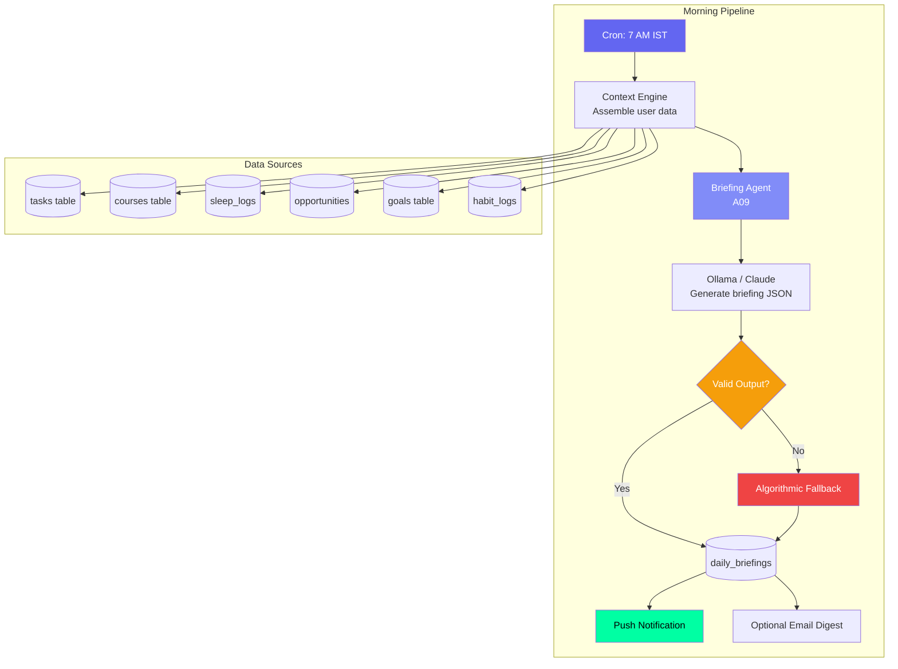
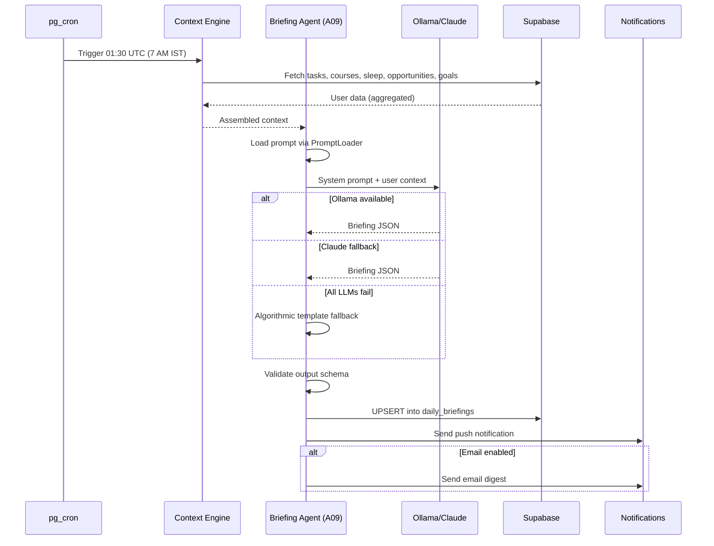
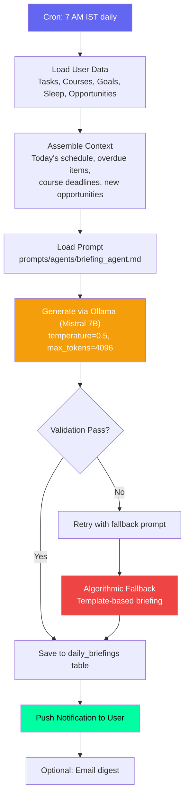

# Briefing Agent — Daily Morning Intelligence

## Document Control

| Field | Value |
|---|---|
| **Document ID** | AI-AGT-001 |
| **Version** | 2.0.0 |
| **Status** | Approved |
| **Date** | 2026-07-14 |
| **Classification** | Internal |
| **Owner** | Developer |
| **Review Cycle** | Monthly |
| **Prompt File** | `prompts/agents/briefing_agent.md` (957 lines, v2.1.0) |
| **Agent Module** | `packages/ai/agents/briefing_agent.py` |
| **Agent ID** | A09 |
| **Related Docs** | [WeeklyReviewAgent.md](WeeklyReviewAgent.md), [AgentArchitecture.md](../engineering/14_AgentArchitecture.md), [ContextEngine.md](ContextEngine.md) |

---

## 1. Overview

The Briefing Agent generates a personalized daily briefing every morning at 7 AM IST. It consolidates data from 8+ modules into a single-page morning intelligence dashboard covering today's focus, pending deadlines, course targets, opportunity radar matches, and ARIA's top pick for the day. The briefing serves as the user's single-page morning intelligence report.

**Key Features:**
- 7 day-profile templates for varied briefing styles (Motivational Monday, Focused Tuesday, etc.)
- 5 few-shot examples in the prompt for consistent formatting
- Complete algorithmic fallback if LLM is unavailable
- Push notification + optional email delivery
- UPSERT deduplication (no duplicate briefings per date)

---

## 2. Architecture

### Agent Positioning



### Data Flow Sequence



---

## 3. Processing Flow



---

## 4. Input Schema

| Field | Source | Description | Max Items |
|---|---|---|---|
| user_id | Auth context | Target user | 1 |
| today_tasks | tasks table | Tasks due today | 10 |
| overdue_tasks | tasks table | Overdue tasks | 10 |
| active_courses | courses table | Courses nearing deadline | 5 |
| sleep_score | sleep_logs | Last night's sleep quality | 1 |
| new_opportunities | opportunities table | New matches | 5 |
| active_goals | goals table | Goals with progress | 5 |
| habits_due_today | habit_logs | Habits needing completion | 10 |
| yesterday_summary | weekly_reviews | Previous day summary | 1 |

### Context Assembly

The context is assembled by the Context Engine, which queries all 8+ data sources and serializes them into a token-budgeted string:

```python
async def assemble_briefing_context(user_id: str) -> dict:
    tasks = await get_tasks_due_today(user_id)
    courses = await get_active_courses(user_id)
    sleep = await get_last_sleep_log(user_id)
    opportunities = await get_new_opportunities(user_id)
    goals = await get_active_goals(user_id)
    habits = await get_habits_due_today(user_id)
    return {
        "tasks": tasks[:10],
        "courses": courses[:5],
        "sleep": sleep,
        "opportunities": opportunities[:5],
        "goals": goals[:5],
        "habits": habits[:10],
    }
```

---

## 5. Output Schema

```json
{
  "date": "2026-07-10",
  "today_focus": "3 key priorities for today",
  "urgent_deadlines": [{"title": "...", "due": "..."}],
  "course_target": "What course to study today",
  "opportunities": [{"title": "...", "match_score": 85}],
  "aria_top_pick": "ARIA's single most important recommendation",
  "what_to_skip": "What can be deprioritized",
  "sleep_insight": "Brief sleep quality observation",
  "habit_reminder": "One habit to focus on today"
}
```

### Output Validation Rules

| Field | Rule |
|---|---|
| today_focus | 1-3 items, max 200 chars each |
| urgent_deadlines | Max 5 items, sorted by due date |
| aria_top_pick | Always present, single recommendation |
| what_to_skip | Optional, present only if overloaded |
| opportunities | Max 3, only match_score >= 50 |

### Validation Implementation

```python
def validate_briefing_output(output: dict) -> bool:
    required_fields = ["date", "today_focus", "aria_top_pick"]
    for field in required_fields:
        if field not in output:
            logger.error(f"Missing required field: {field}")
            return False
    if not isinstance(output.get("today_focus"), list):
        return False
    if len(output.get("urgent_deadlines", [])) > 5:
        return False
    return True
```

---

## 6. LLM Configuration

| Parameter | Value | Rationale |
|---|---|---|
| Model | Ollama (Mistral 7B) | Free, local, fast |
| Temperature | 0.5 | Balanced creativity/determinism |
| Max tokens | 4096 | Budget for full briefing |
| Fallback model | Claude Sonnet 4 | If Ollama unavailable |
| Retry attempts | 3 | Exponential backoff (2s, 4s, 8s) |
| Circuit breaker | 5 failures -> 60s cooldown | Prevents cascade failures |

---

## 7. Prompt Usage

The agent loads `prompts/agents/briefing_agent.md` via `PromptLoader`:

```python
from ai.prompt_loader import prompts

entry = prompts.get_agent("briefing_agent")
if entry:
    system_prompt = entry.system_prompt
    user_prompt = construct_user_prompt(context)
else:
    # Fallback inline prompt
    system_prompt = "You are a daily briefing assistant..."
    user_prompt = "Generate a morning briefing with: {context}"
```

The prompt file contains 7 day-profile templates, 5 few-shot examples, edge case handling, and quality criteria checklists.

### Day Profile Templates

| Day | Template Style | Focus |
|---|---|---|
| Monday | Motivational Monday | Fresh start, goal setting |
| Tuesday | Productivity Push | Deep work emphasis |
| Wednesday | Midweek Check | Progress review |
| Thursday | Strategic Focus | Deadline prioritization |
| Friday | Finish Strong | Task completion push |
| Saturday | Weekend Mode | Lighter schedule |
| Sunday | Reflective Sunday | Weekly preview |

---

## 8. Fallback Behavior

### Algorithmic Fallback (Template-Based)

When LLM is unavailable, the agent generates a template-based briefing:

```python
def generate_template_briefing(context: dict) -> dict:
    today = datetime.now().strftime("%Y-%m-%d")
    tasks = context.get("tasks", [])
    courses = context.get("courses", [])
    sleep = context.get("sleep", {})

    briefing = {
        "date": today,
        "today_focus": [t["title"] for t in tasks[:3]] if tasks else ["No tasks scheduled"],
        "urgent_deadlines": [{"title": t["title"], "due": t["due_date"]} for t in tasks if t.get("priority") == "urgent"],
        "course_target": courses[0]["title"] if courses else None,
        "opportunities": [],
        "aria_top_pick": tasks[0]["title"] if tasks else "Start with something small today",
        "sleep_insight": f"Sleep score: {sleep.get('score', 'N/A')}" if sleep else None,
    }
    return briefing
```

### Fallback Matrix

| Failure Mode | Fallback | Result |
|---|---|---|
| LLM unavailable | Template-based briefing | Static but functional |
| Supabase timeout | Partial data briefing | Missing data labeled |
| Prompt file missing | Inline fallback prompt | Same structure, less polish |
| Empty data | "No data yet" briefing | Encouraging message |
| LLM output invalid JSON | Re-parse, retry once | Fixable structural errors |
| All providers fail | Hardcoded template | "Good morning! Here's your day." |

---

## 9. Failure Modes

| Mode | Symptom | Handling |
|---|---|---|
| Empty tasks | Briefing lacks focus items | Skip section, suggest goal setting |
| No new opportunities | No opportunities section | Omit section entirely |
| Sleep data missing | No sleep insight | Omit sleep section |
| Briefing too long > 4096 tokens | Truncated | Hard truncation at token budget |
| Database write fails | Briefing generated but not persisted | Log error, retry once |
| Push notification fails | User sees on next app open | Log, no retry |
| Briefing > 24h old | Stale data shown | Timestamp shows age, regenerate |

### Recovery Strategy

| Issue | Recovery |
|---|---|
| Briefing not generated | Retry at next cron interval (7 AM + 15 min) |
| Partial briefing generated | Store partial, flag for regeneration |
| Duplicate date briefing | UPSERT on (user_id, date) unique constraint |

---

## 10. Error Handling

```python
async def generate_briefing(user_id: str) -> dict:
    try:
        context = await assemble_briefing_context(user_id)
    except SupabaseError as e:
        logger.error(f"Context assembly failed: {e}")
        context = {}  # Continue with empty context

    try:
        response = await llm.generate_json(user_prompt, system=system_prompt)
        briefing = parse_llm_response(response)
    except (LLMProviderUnavailableError, JSONParseError) as e:
        logger.warn(f"LLM failed: {e}, using template fallback")
        briefing = generate_template_briefing(context)

    try:
        await supabase.table("daily_briefings").upsert(briefing).execute()
    except SupabaseError as e:
        logger.error(f"Failed to save briefing: {e}")

    return briefing
```

---

## 11. Performance Targets

| Operation | Target | Current |
|---|---|---|
| Context assembly | < 500ms | ~300ms |
| LLM generation | < 15s | ~8s |
| Total pipeline | < 20s | ~12s |
| Notification delivery | < 5s | ~2s |
| Storage size per briefing | < 2KB | ~1.5KB |

---

## 12. Related Documents

| Document | Description |
|---|---|
| [prompts/agents/briefing_agent.md](../../prompts/agents/briefing_agent.md) | Full prompt template (957 lines) |
| [WeeklyReviewAgent.md](WeeklyReviewAgent.md) | Weekly counterpart (A10) |
| [AgentArchitecture.md](../engineering/14_AgentArchitecture.md) | Agent system architecture |
| [ContextEngine.md](ContextEngine.md) | Context assembly pipeline |
| [Briefings API](../../apps/api/app/api/briefings.py) | API endpoint |
| [Scheduler Cron](../../services/scheduler/crons/daily_briefing.py) | Cron job implementation |
| [14_AgentArchitecture.md §A09](../engineering/14_AgentArchitecture.md) | Agent registry reference |

---

## Revision History

| Version | Date | Author | Changes |
|---|---|---|---|
| 1.0.0 | 2026-07-10 | Developer | Initial agent documentation |
| 2.0.0 | 2026-07-14 | Developer | Expanded to full enterprise reference. Added architecture diagram, sequence diagram, context assembly code, validation implementation, algorithmic fallback implementation, day profile templates, error handling code, performance targets, and cross-references to AgentArchitecture.md. |
