```mermaid
%%{init: {'theme': 'base', 'themeVariables': { 'background': '#0A0B0F', 'primaryColor': '#6366F1', 'secondaryColor': '#00FFA3', 'tertiaryColor': '#1E293B', 'primaryTextColor': '#F1F5F9', 'secondaryTextColor': '#94A3B8', 'lineColor': '#334155', 'fontFamily': 'DM Sans' }}}%%
flowchart LR
    Agent["Agent Trigger"] --> Fetch["1. Fetch<br/>Supabase Queries<br/>18+ Tables"]
    Fetch --> Filter["2. Filter<br/>Agent-specific<br/>Remove Irrelevant"]
    Filter --> Rank["3. Rank<br/>Recency × Urgency<br/>× Relevance Score"]
    Rank --> Budget["4. Token Budget<br/>Fit in 4096 ctx<br/>Truncate Excess"]
    Budget --> Assemble["5. Assemble<br/>Structured Text +<br/>JSON Blocks"]
    Assemble --> Cache["6. Cache<br/>TTL: 30s-5min"]
    Cache --> Inject["7. Inject → Prompt<br/>LLM Ready Context"]

    style Agent fill:#6366F1,stroke:#818CF8,color:#F1F5F9
    style Fetch fill:#1E293B,stroke:#6366F1,color:#F1F5F9
    style Filter fill:#1E293B,stroke:#6366F1,color:#F1F5F9
    style Rank fill:#1E293B,stroke:#00FFA3,color:#F1F5F9
    style Budget fill:#1E293B,stroke:#F59E0B,color:#F1F5F9
    style Assemble fill:#1E293B,stroke:#6366F1,color:#F1F5F9
    style Cache fill:#1E293B,stroke:#6366F1,color:#F1F5F9
    style Inject fill:#00FFA3,stroke:#00CC82,color:#0A0B0F
```

# Context Engine — Enterprise Reference

---

## Document Control

| Metadata | Value |
|----------|-------|
| **Document ID** | ARIA-ARCH-CE-001 |
| **Version** | 1.0.0 |
| **Status** | APPROVED |
| **Classification** | INTERNAL — Engineering |
| **Last Updated** | 2026-06-11 |
| **Owner** | AI Architecture Team |
| **Review Cycle** | Quarterly |
| **Next Review** | 2026-09-11 |

---

## Executive Summary

### Why the Context Engine Matters

The Context Engine is the bridge between raw database state and the AI prompt. Every ARIA interaction — whether it's a daily briefing, a weekly review, a sleep nudge, or a chat response — requires a structured, prioritized, and token-budgeted view of the user's current reality. Without the Context Engine, the AI would receive either too much data (overflowing context windows) or too little (producing irrelevant or hallucinated responses).

The Context Engine solves three fundamental problems:

1. **Data selection**: Which of the 18+ database tables need to be queried for a given agent?
2. **Token budgeting**: How do we fit the most relevant information into a limited (4096 token) context window?
3. **Priority ranking**: Which facts about the user matter most right now — overdue tasks, poor sleep, course deadlines, or new opportunities?

### Key Design Decisions

| Decision | Choice | Rationale |
|----------|--------|-----------|
| **Assembly approach** | Fetch → Filter → Rank → Assemble pipeline | Modular, testable stages; each stage can be independently optimized or skipped |
| **Token budget model** | Per-agent fixed budget with dynamic weighting | Guarantees no agent exceeds context window; priority scoring ensures best data wins |
| **Context cache** | TTL-based (30s for live data, 5min for stable data) | Balances freshness with assembly latency; avoids redundant Supabase queries |
| **Serialization format** | Structured text with JSON blocks for machine parsing | Human-readable when logged; machine-parseable for the LLM |
| **Weighting algorithm** | Recency × Urgency × Relevance composite score | Ensures stale data decays naturally while critical items float to top |
| **Fallback behavior** | Graceful degradation per data source | If `sleep_logs` is down, briefing still works — just without sleep insights |

### Architecture Principles

1. **Sub-100ms assembly target** — Context assembly must not add perceptible latency to user interactions
2. **Token-first design** — Every byte counts; the assembly pipeline prioritizes information density
3. **Observability by default** — Every assembly records source tables, token counts, latency, and priority scores
4. **Fail open** — If a context source is unavailable, the engine logs the error but assembles context from remaining sources
5. **Agent-specific tailoring** — The briefing agent gets different context than the sleep agent; the engine filters by agent type

---

## Architecture Overview

```
┌─────────────────────────────────────────────────────────────────────────────┐
│                         CONTEXT ENGINE ARCHITECTURE                          │
├─────────────────────────────────────────────────────────────────────────────┤
│                                                                              │
│  ┌─────────────┐    ┌──────────────┐    ┌─────────────┐    ┌────────────┐   │
│  │  AGENT       │    │  CONTEXT     │    │  PRIORITY   │    │  PROMPT    │   │
│  │  TRIGGER     │───▶│  FETCHER     │───▶│  SCORER     │───▶│  ASSEMBLER │   │
│  │  (Event/     │    │  (Supabase   │    │  (Recency   │    │  (Token    │   │
│  │   Cron/Chat) │    │   Queries)   │    │   × Urgency)│    │   Budget)  │   │
│  └─────────────┘    └──────┬───────┘    └──────┬──────┘    └──────┬─────┘   │
│                            │                   │                   │         │
│                            ▼                   ▼                   ▼         │
│                     ┌──────────────┐    ┌─────────────┐    ┌────────────┐   │
│                     │  CACHE LAYER │    │  FILTER     │    │  LLM       │   │
│                     │  (TTL-based  │    │  ENGINE     │    │  CLIENT    │   │
│                     │   Expiry)    │    │  (Threshold)│    │  (Ollama/  │   │
│                     └──────────────┘    └─────────────┘    │  Claude)   │   │
│                                                            └────────────┘   │
│                                                                              │
│  DATA SOURCES (Supabase Tables):                                             │
│  ┌──────┐ ┌──────┐ ┌──────┐ ┌──────┐ ┌──────┐ ┌──────┐ ┌──────┐ ┌──────┐  │
│  │Tasks │ │Courses│ │Habits│ │Sleep │ │Memory│ │Goals │ │Income│ │Time  │  │
│  └──────┘ └──────┘ └──────┘ └──────┘ └──────┘ └──────┘ └──────┘ └──────┘  │
│  ┌──────┐ ┌──────┐ ┌──────┐ ┌──────┐                                        │
│  │Ideas │ │Proj. │ │Users │ │Chat  │                                        │
│  └──────┘ └──────┘ └──────┘ └──────┘                                        │
└─────────────────────────────────────────────────────────────────────────────┘
```

---

## Context Assembly Pipeline



---

## Context Sources

### Source Registry

The Context Engine maintains a registry of all available context sources, each annotated with metadata used by the filter and scoring pipeline.

| Source Table | Refresh Interval | Default Token Budget | Agents That Use It | Priority Multiplier |
|---|---|---|---|---|
| `tasks` | 30s | 800 | All agents | 1.5 (if overdue) |
| `courses` | 60s | 600 | Briefing, Nudge, Weekly Review | 1.2 (if deadline near) |
| `habits` | 60s | 400 | Briefing, Nudge, Weekly Review | 1.0 |
| `habit_logs` | 30s | 200 | Nudge, Weekly Review | 0.8 |
| `sleep_logs` | 30s | 400 | Sleep Agent, Briefing | 1.8 (if < 6h) |
| `goals` | 120s | 400 | Briefing, Weekly Review, Task Agent | 1.3 |
| `income_entries` | 300s | 200 | Weekly Review | 0.6 |
| `time_entries` | 30s | 300 | Briefing, Weekly Review | 1.0 |
| `memory` | 60s | 600 | All agents | 1.4 (learned patterns) |
| `ideas` | 120s | 200 | Briefing, Weekly Review | 0.5 |
| `projects` | 60s | 400 | Briefing, Weekly Review | 1.2 (if blocked) |
| `opportunities` | 300s | 300 | Briefing | 0.7 |
| `users` | 300s | 200 | All agents | 1.0 (base prefs) |
| `chat_messages` | 30s | 400 | Chat agent only | 0.9 |
| `daily_briefings` | 300s | 200 | Briefing (for yesterday) | 0.6 |
| `weekly_reviews` | 600s | 200 | Weekly Review (for context) | 0.6 |
| `learning_progress` | 300s | 300 | Learning Agent, Briefing | 1.1 (if declining) |

### Source Metadata Schema

Each source in the registry is defined by:

```python
@dataclass
class ContextSource:
    table_name: str
    refresh_interval: int  # seconds
    default_token_budget: int  # tokens
    agents: list[str]  # which agents query this source
    priority_multiplier: float  # base × multiplier for priority scoring
    fields: list[str]  # specific columns to fetch
    where_clause: str | None  # SQL filter override per agent
    order_by: str | None  # default sort order
    limit: int | None  # max rows to fetch

SOURCE_REGISTRY: dict[str, ContextSource] = {
    "tasks": ContextSource(
        table_name="tasks",
        refresh_interval=30,
        default_token_budget=800,
        agents=["briefing_agent", "task_agent", "weekly_review_agent",
                "nudge_agent", "sleep_agent", "chat"],
        priority_multiplier=1.5,  # overdue tasks get 1.5× boost
        fields=["id", "title", "status", "priority", "due_date", "goal_id"],
        where_clause="status IN ('pending', 'in_progress')",
        order_by="due_date ASC NULLS LAST",
        limit=20,
    ),
    "sleep_logs": ContextSource(
        table_name="sleep_logs",
        refresh_interval=30,
        default_token_budget=400,
        agents=["sleep_agent", "briefing_agent"],
        priority_multiplier=1.8,  # poor sleep gets 1.8× boost
        fields=["id", "sleep_date", "duration_hours", "score", "bedtime", "wake_time"],
        where_clause="sleep_date >= CURRENT_DATE - 7",
        order_by="sleep_date DESC",
        limit=7,
    ),
    # ... other sources follow the same pattern
}
```

---

## Context Assembly Pipeline

### Pipeline Stages

The pipeline consists of four stages, executed sequentially for every context assembly request:

```
Stage 1: FETCH
├── Identify agent → lookup required sources from registry
├── Check cache → return cached context if TTL valid
├── Execute parallel Supabase queries for each required source
└── Collect results in raw data dict

Stage 2: FILTER
├── Remove rows that don't meet minimum priority threshold
├── Strip PII fields (passwords, secrets) from data
├── Apply agent-specific filter overrides
├── Deduplicate entries (same task from different queries)
└── Output clean, safe dataset

Stage 3: RANK
├── Score each item using composite priority algorithm
├── Sort by score descending
├── Apply token budget allocation per source
└── Truncate low-priority items when budget exceeded

Stage 4: ASSEMBLE
├── Format data into structured text template
├── Insert agent-specific instruction blocks
├── Attach system prompts from PromptLoader
├── Calculate final token count
└── Return assembled context dict to calling agent
```

### Assembly Pipeline Implementation

```python
from dataclasses import dataclass, field
from typing import Any, Optional
import time
import json

@dataclass
class ContextAssemblyResult:
    context: str
    token_count: int
    sources_used: list[str]
    sources_failed: list[str]
    assembly_latency_ms: float
    priority_scores: dict[str, float]

class ContextEngine:
    def __init__(self, supabase_client, cache_ttl: int = 30):
        self.supabase = supabase_client
        self.cache: dict[str, tuple[float, Any]] = {}
        self.cache_ttl = cache_ttl

    async def assemble(
        self,
        agent_name: str,
        user_id: str,
        token_budget: int = 4000,
        force_refresh: bool = False
    ) -> ContextAssemblyResult:
        start = time.perf_counter()
        sources = self._get_sources_for_agent(agent_name)
        sources_used = []
        sources_failed = []
        all_data = {}

        # Stage 1: Fetch
        for source in sources:
            cache_key = f"{user_id}:{source.table_name}"
            if not force_refresh and cache_key in self.cache:
                cached_at, cached_data = self.cache[cache_key]
                if time.time() - cached_at < self.cache_ttl:
                    all_data[source.table_name] = cached_data
                    sources_used.append(source.table_name)
                    continue
            try:
                query = self.supabase.table(source.table_name)\
                    .select(",".join(source.fields))\
                    .eq("user_id", user_id)
                if source.where_clause:
                    query = self._apply_where(query, source.where_clause)
                if source.order_by:
                    query = query.order(source.order_by)
                if source.limit:
                    query = query.limit(source.limit)
                result = query.execute()
                data = result.data if result.data else []
                self.cache[cache_key] = (time.time(), data)
                all_data[source.table_name] = data
                sources_used.append(source.table_name)
            except Exception as e:
                sources_failed.append(source.table_name)
                all_data[source.table_name] = []

        # Stage 2: Filter
        filtered_data = self._filter(all_data, agent_name)

        # Stage 3: Rank
        ranked, priority_scores = self._rank(filtered_data)

        # Stage 4: Assemble
        context = self._assemble(ranked, agent_name, token_budget)
        token_count = self._estimate_tokens(context)

        latency = (time.perf_counter() - start) * 1000
        return ContextAssemblyResult(
            context=context,
            token_count=token_count,
            sources_used=sources_used,
            sources_failed=sources_failed,
            assembly_latency_ms=latency,
            priority_scores=priority_scores,
        )

    def _get_sources_for_agent(self, agent_name: str) -> list[ContextSource]:
        """Return all sources where the agent name appears in the source's agent list."""
        return [s for s in SOURCE_REGISTRY.values() if agent_name in s.agents]

    def _filter(self, data: dict[str, list], agent_name: str) -> dict[str, list]:
        """Apply agent-specific filters to raw fetched data."""
        filtered = {}
        for table_name, rows in data.items():
            if not rows:
                filtered[table_name] = []
                continue
            # Strip PII: remove any field matching secret patterns
            safe_rows = []
            for row in rows:
                safe_row = {k: v for k, v in row.items()
                            if k not in ("password", "secret", "token", "api_key")}
                safe_rows.append(safe_row)
            filtered[table_name] = safe_rows
        return filtered

    def _rank(
        self, data: dict[str, list]
    ) -> tuple[dict[str, list], dict[str, float]]:
        """Score and sort each item within its source table."""
        ranked = {}
        priority_scores = {}
        for table_name, rows in data.items():
            if not rows:
                ranked[table_name] = []
                continue
            now = time.time()
            source_meta = SOURCE_REGISTRY.get(table_name)
            multiplier = source_meta.priority_multiplier if source_meta else 1.0
            scored = []
            for row in rows:
                score = self._calculate_priority(
                    row, table_name, now, multiplier
                )
                scored.append((score, row))
                priority_scores[f"{table_name}/{row.get('id', 'unknown')}"] = score
            scored.sort(key=lambda x: x[0], reverse=True)
            ranked[table_name] = [r for _, r in scored]
        return ranked, priority_scores

    def _calculate_priority(
        self, row: dict, table_name: str, now: float, multiplier: float
    ) -> float:
        """Composite priority score: recency × urgency × multiplier."""
        score = 1.0

        # Recency factor: items modified recently score higher
        if "updated_at" in row:
            age_hours = (now - self._parse_time(row["updated_at"])) / 3600
            score *= max(0.1, 1.0 - (age_hours / 168))  # decay over 7 days

        # Urgency factor: due dates approaching score higher
        if "due_date" in row and row["due_date"]:
            due = self._parse_time(row["due_date"])
            hours_until_due = (due - now) / 3600
            if hours_until_due < 0:
                score *= 3.0  # overdue = urgent
            elif hours_until_due < 24:
                score *= 2.5  # due within 24h
            elif hours_until_due < 72:
                score *= 1.5  # due within 3 days

        # Sleep-specific: low sleep score == high priority
        if "score" in row and table_name == "sleep_logs":
            score *= (100 - row["score"]) / 50 if row["score"] else 1.0

        # Priority field multiplier (tasks, projects)
        priority_map = {"urgent": 2.0, "high": 1.5, "medium": 1.0, "low": 0.5}
        if "priority" in row and row["priority"] in priority_map:
            score *= priority_map[row["priority"]]

        return score * multiplier

    def _assemble(
        self, data: dict[str, list], agent_name: str, token_budget: int
    ) -> str:
        """Format ranked data into structured context string within token budget."""
        sections = []
        total_tokens = 0
        max_tokens = token_budget

        # Header
        header = f"## Context for {agent_name}\n"
        header += f"Assembled at: {time.strftime('%Y-%m-%dT%H:%M:%SZ', time.gmtime())}\n\n"
        sections.append(header)
        total_tokens += self._estimate_tokens(header)

        for table_name, rows in data.items():
            if not rows:
                continue
            source_meta = SOURCE_REGISTRY.get(table_name)
            budget = source_meta.default_token_budget if source_meta else 200
            section_header = f"### {table_name.replace('_', ' ').title()}\n"
            sections.append(section_header)
            total_tokens += self._estimate_tokens(section_header)

            for row in rows:
                line = json.dumps(row, default=str) + "\n"
                line_tokens = self._estimate_tokens(line)
                if total_tokens + line_tokens > max_tokens:
                    sections.append("...(context truncated due to token budget)\n")
                    break
                sections.append(line)
                total_tokens += line_tokens

                if total_tokens >= budget:
                    sections.append(f"...({table_name} truncated at budget)\n")
                    break

        return "".join(sections)

    def _estimate_tokens(self, text: str) -> int:
        """Rough token estimation: ~4 chars per token."""
        return len(text) // 4

    def _parse_time(self, value) -> float:
        """Parse various time formats to epoch seconds."""
        if isinstance(value, (int, float)):
            return float(value)
        if isinstance(value, str):
            from datetime import datetime
            try:
                return datetime.fromisoformat(value.replace("Z", "+00:00")).timestamp()
            except (ValueError, TypeError):
                return time.time()
        return time.time()

    def _apply_where(self, query, where_clause: str):
        """Apply a SQL-like where clause to a Supabase query builder.
        
        Supports simple patterns like 'status IN (x, y)' and 'field = value'.
        """
        import re
        # Simple parser for common patterns
        in_match = re.match(r"(\w+)\s+IN\s+\((.+)\)", where_clause)
        if in_match:
            field = in_match.group(1)
            values = [v.strip().strip("'\"") for v in in_match.group(2).split(",")]
            return query.in_(field, values)
        eq_match = re.match(r"(\w+)\s*=\s*(.+)", where_clause)
        if eq_match:
            field = eq_match.group(1)
            value = eq_match.group(2).strip().strip("'\"")
            return query.eq(field, value)
        return query
```

---

## Context Window Management

### Per-Agent Token Budgets

| Agent | Total Budget | Source Allocation Strategy | Max Sources |
|---|---|---|---|
| Briefing Agent (A09) | 4096 | Tasks(800) + Sleep(400) + Habits(400) + Goals(400) + Courses(600) + Memory(600) + Time(300) + Opportunities(300) + Learning(300) | 9 |
| Weekly Review (A10) | 4096 | Tasks(800) + Habits(400) + Goals(400) + Courses(600) + Memory(600) + Income(200) + Time(300) + Projects(400) + Learning(300) | 9 |
| Memory Agent (A02) | 2048 | Chat(800) + Memory(600) + Tasks(300) + Habits(200) | 4 |
| Learning Agent (A03) | 2048 | Courses(600) + Habits(200) + Learning Progress(600) + Tasks(300) + Memory(300) | 5 |
| Task Agent (A01) | 2048 | Tasks(1200) + Goals(400) + Memory(400) | 3 |
| Opportunity Agent (A06) | 2048 | Opportunities(800) + Memory(400) + Tasks(400) + Goals(400) | 4 |
| Sleep Agent (A13) | 2048 | Sleep(800) + Tasks(400) + Habits(200) + Memory(400) + User(200) | 5 |
| Nudge Agent (A14) | 2048 | Courses(600) + Habits(400) + Tasks(400) + Memory(400) + Learning(200) | 5 |
| Chat (ARIA) | 4096 | Chat(800) + Memory(600) + Tasks(600) + All Others(200 each) | All |

### Truncation Strategy

When assembled context exceeds the agent's token budget, the engine applies a three-tier truncation strategy:

```
Tier 1: Truncate Low-Priority Items (within source)
└── For each source, drop items below the 20th percentile of priority scores
    → Typical savings: 20-30% of source tokens

Tier 2: Remove Lowest-Value Sources
└── Sort sources by aggregate priority score × agent-relevance multiplier
└── Remove sources from the bottom until budget is within 90%
    → Priority order: Sleep(1.8) > Tasks(1.5) > Memory(1.4) > Goals(1.3) > ...

Tier 3: Summarize Instead of List
└── Replace item-level data with aggregate summaries
    └── "12 tasks pending (3 urgent, 5 high, 4 medium)"
    └── "Sleep avg 6.2h over 7 days (trending down)"
    → Used only as last resort; reduces detail but preserves signal
```

### Priority Scoring Algorithm

```
composite_score = recency_factor × urgency_factor × priority_multiplier × source_multiplier

Where:
  recency_factor    = max(0.1, 1 - (age_hours / 168))
  urgency_factor    = 3.0 (overdue) | 2.5 (due < 24h) | 1.5 (due < 72h) | 1.0 (else)
  priority_multiplier = 2.0 (urgent) | 1.5 (high) | 1.0 (medium) | 0.5 (low)
  source_multiplier = Per-source constant from registry (1.0 - 1.8)
```

---

## Dynamic Context Weighting

### Weight Adjustment Rules

The Context Engine applies dynamic weight adjustments based on detected user state:

| Detected State | Weight Adjustments | Trigger Conditions |
|---|---|---|
| **Poor sleep** | Sleep context +50%, Tasks -20% | `sleep_logs.score < 60` in last 3 days |
| **High task load** | Tasks +30%, filter to top 5 only | `tasks.count > 15` where pending |
| **Exam period** | Courses +50%, Opportunities -30% | `courses` with deadline < 7 days |
| **Weekend** | Habits +20%, Courses -20% | Day of week is Sat or Sun |
| **Low energy** | All context -20% (be concise) | `sleep_logs.score < 40` today |
| **After deadline week** | Weekly Review +40%, Tasks -30% | `tasks` with >3 recently completed overdue tasks |
| **Morning (6-10 AM)** | Briefing context +20% weight | Time of day check |
| **Evening (9PM-midnight)** | Sleep context +40% | Time of day check |

### Weight Adjustment Implementation

```python
class DynamicWeightEngine:
    def __init__(self, supabase_client):
        self.supabase = supabase_client

    async def get_weight_adjustments(
        self, user_id: str
    ) -> dict[str, float]:
        """Return multiplier adjustments per source table."""
        adjustments = {}

        # 1. Sleep quality adjustment
        sleep_data = await self._fetch_recent_sleep(user_id)
        avg_sleep_score = self._average_sleep_score(sleep_data)
        if avg_sleep_score is not None and avg_sleep_score < 60:
            adjustments["sleep_logs"] = 1.5
            adjustments["tasks"] = 0.8
        if avg_sleep_score is not None and avg_sleep_score < 40:
            # Across-the-board conciseness
            for source in SOURCE_REGISTRY:
                adjustments[source] = 0.8

        # 2. Task load adjustment
        task_count = await self._count_pending_tasks(user_id)
        if task_count > 15:
            adjustments["tasks"] = adjustments.get("tasks", 1.0) * 1.3

        # 3. Course deadline adjustment
        near_deadlines = await self._count_near_deadline_courses(user_id)
        if near_deadlines > 0:
            adjustments["courses"] = adjustments.get("courses", 1.0) * 1.5
            adjustments["opportunities"] = adjustments.get("opportunities", 1.0) * 0.7

        # 4. Day-of-week adjustment
        from datetime import datetime
        weekday = datetime.now().weekday()
        if weekday >= 5:  # Saturday=5, Sunday=6
            adjustments["habits"] = adjustments.get("habits", 1.0) * 1.2
            adjustments["courses"] = adjustments.get("courses", 1.0) * 0.8

        return adjustments

    async def _fetch_recent_sleep(self, user_id: str) -> list[dict]:
        result = self.supabase.table("sleep_logs")\
            .select("score").eq("user_id", user_id)\
            .order("sleep_date", desc=True).limit(3).execute()
        return result.data or []

    def _average_sleep_score(self, data: list[dict]) -> float | None:
        scores = [d.get("score", 0) for d in data if d.get("score")]
        return sum(scores) / len(scores) if scores else None

    async def _count_pending_tasks(self, user_id: str) -> int:
        result = self.supabase.table("tasks")\
            .select("id", count="exact")\
            .eq("user_id", user_id)\
            .in_("status", ("pending", "in_progress"))\
            .execute()
        return result.count or 0

    async def _count_near_deadline_courses(self, user_id: str) -> int:
        from datetime import datetime, timedelta
        cutoff = datetime.now().isoformat()
        result = self.supabase.table("courses")\
            .select("id", count="exact")\
            .eq("user_id", user_id)\
            .lte("deadline", cutoff)\
            .execute()
        return result.count or 0
```

---

## Cross-Agent Context Sharing

### Context Flow Diagram

```
┌─────────────────────────────────────────────────────────────────────────────┐
│                     CROSS-AGENT CONTEXT SHARING                               │
├─────────────────────────────────────────────────────────────────────────────┤
│                                                                              │
│  ┌──────────────────┐         ┌──────────────────┐                           │
│  │ Memory Agent (A02)│         │ Context Engine    │                         │
│  │ Consolidates      │────────▶│ Writes to        │                         │
│  │ patterns + prefs  │  memory│ memory table      │                         │
│  └──────────────────┘    ────▶└──────────────────┘                           │
│                                                  │                           │
│                                                  ▼                           │
│  ┌──────────────────┐         ┌──────────────────┐                           │
│  │ Briefing Agent    │◀────────│ Context Engine    │                         │
│  │ (A09)             │  reads  │ Reads memory      │                         │
│  │ Receives learned   │  memory │ table for briefing│                         │
│  │ patterns           │         └──────────────────┘                           │
│  └──────────────────┘                                                        │
│                                                                              │
│  ┌──────────────────────────────────────────────────────────────────────────┐│
│  │ Shared Artifacts in memory table:                                        ││
│  │  - user_preferences: {"tone": "direct", "detail_level": "concise"}       ││
│  │  - learned_patterns: {"procrastination": "Tues evenings",                ││
│  │    "peak_productivity": "mornings before 11 AM"}                         ││
│  │  - interaction_history: {"last_briefing_sent": "2026-06-10T07:00:00Z"}   ││
│  └──────────────────────────────────────────────────────────────────────────┘│
│                                                                              │
│  CONTEXT ENGINE SHARING PROTOCOL:                                            │
│  1. Agent A produces context → stored in memory with source_id, ttl         │
│  2. Agent B requests context → engine checks memory table for source_id     │
│  3. If found & within TTL → returns cached context                          │
│  4. If not → engine fetches fresh from Supabase, stores for future agents   │
└─────────────────────────────────────────────────────────────────────────────┘
```

### Sharing Protocol

The Context Engine implements a publish-subscribe pattern for cross-agent context sharing:

1. **Producer agents** (Memory, Learning) write structured context artifacts to the `memory` table with a `context_key` field
2. **Consumer agents** (Briefing, Weekly Review, Nudge) query the `memory` table by `context_key` during their assembly phase
3. **TTL enforcement**: Context artifacts expire after `memory_ttl` seconds (default 300s for dynamic data, 3600s for stable preferences)
4. **Freshness guarantee**: If a consumer requests context that is expired, the engine fetches fresh data and re-populates the artifact

```python
# Context sharing via memory table
async def share_context(
    supabase_client,
    user_id: str,
    context_key: str,
    context_value: dict | str,
    ttl_seconds: int = 300
) -> None:
    """Store a context artifact for cross-agent sharing."""
    import json
    from datetime import datetime, timedelta

    supabase_client.table("memory").upsert({
        "user_id": user_id,
        "context_key": context_key,
        "context_value": json.dumps(context_value) if isinstance(context_value, dict) else context_value,
        "expires_at": (datetime.now() + timedelta(seconds=ttl_seconds)).isoformat(),
        "updated_at": datetime.now().isoformat(),
    }, on_conflict="user_id, context_key").execute()


async def consume_context(
    supabase_client,
    user_id: str,
    context_key: str
) -> dict | str | None:
    """Retrieve a shared context artifact, respecting TTL."""
    from datetime import datetime

    result = supabase_client.table("memory")\
        .select("context_value", "expires_at")\
        .eq("user_id", user_id)\
        .eq("context_key", context_key)\
        .execute()

    if not result.data:
        return None

    entry = result.data[0]
    expires_at = datetime.fromisoformat(entry["expires_at"].replace("Z", "+00:00"))
    if datetime.now() > expires_at:
        return None  # Expired; caller should re-fetch

    return entry["context_value"]
```

---

## Context Serialization Format

### Serialization Template

The assembled context is serialized into a structured text format optimized for LLM consumption:

```text
## Context for briefing_agent
Assembled at: 2026-06-11T06:30:00Z
User State: rested (sleep 7.2h), moderate task load (9 pending)

### Tasks
{"id": "abc123", "title": "Complete React dashboard", "status": "in_progress", "priority": "high", "due_date": "2026-06-12", "goal_id": "g001"}
{"id": "abc124", "title": "Submit DSA assignment", "status": "pending", "priority": "urgent", "due_date": "2026-06-11", "goal_id": "g002"}
...(3 more tasks)

### Sleep
{"id": "slp001", "sleep_date": "2026-06-10", "duration_hours": 7.2, "score": 82, "bedtime": "23:00", "wake_time": "06:15"}
{"id": "slp002", "sleep_date": "2026-06-09", "duration_hours": 5.8, "score": 55, "bedtime": "01:30", "wake_time": "07:15"}

### Memory
{"key": "user_preferences", "value": {"tone": "direct", "detail_level": "concise"}, "confidence": 0.95}
{"key": "learned_patterns", "value": {"procrastination": "Tues evenings", "peak_productivity": "mornings before 11 AM"}, "confidence": 0.85}

### Habits
{"id": "hab001", "name": "LeetCode daily", "streak": 12, "frequency": "daily", "last_logged": "2026-06-10"}
{"id": "hab002", "name": "Read 30min", "streak": 5, "frequency": "daily", "last_logged": "2026-06-09"}
```

### Serialization Rules

| Rule | Description |
|---|---|
| **JSON-per-line** | Each data row is a single JSON object on one line for machine parsing |
| **Section headers** | `### TableName` format, matching Supabase table naming |
| **Metadata header** | Agent name, assembly timestamp, user state summary |
| **Token-efficient** | No markdown tables or verbose formatting inside sections |
| **Truncation markers** | `...(N more items)` when items are omitted due to budget |
| **Null safety** | Missing fields are omitted from JSON; no `null` values |

---

## Caching Strategy

### Cache Architecture

```
┌──────────────────────────────────────────────────────────────────────┐
│                       CONTEXT CACHE LAYER                             │
├──────────────────────────────────────────────────────────────────────┤
│                                                                       │
│  ┌─────────────────────┐    ┌─────────────────────┐                   │
│  │  TIER 1: In-Memory   │    │  TIER 2: Supabase   │                   │
│  │  Dict Cache          │    │  memory Table       │                   │
│  │                      │    │                      │                   │
│  │  Key: user_id:table  │    │  Key: user_id:key   │                   │
│  │  TTL: 30-300s       │    │  TTL: 300-3600s     │                   │
│  │  Storage: ~50MB max │    │  Storage: Unlimited  │                   │
│  │  Eviction: LRU      │    │  Eviction: TTL       │                   │
│  └─────────────────────┘    └─────────────────────┘                   │
│         │                           │                                 │
│         ▼                           ▼                                 │
│  ┌──────────────────────────────────────────────┐                     │
│  │  CACHE MANAGER                                 │                     │
│  │  - get(key): check Tier 1 → miss → check T2  │                     │
│  │  - set(key, value, ttl): write to T1 + T2     │                     │
│  │  - invalidate(table_name): clear T1 entries   │                     │
│  │  - warmup(agent_name): pre-fetch common srcs  │                     │
│  └──────────────────────────────────────────────┘                     │
│                                                                       │
└──────────────────────────────────────────────────────────────────────┘
```

### TTL Configuration

| Data Type | TTL | Rationale |
|---|---|---|
| Tasks (pending/in_progress) | 30s | Changes frequently as user completes tasks |
| Tasks (completed/archived) | 120s | Stable; less likely to change |
| Sleep logs | 60s | Updated once daily typically |
| Habits | 120s | Changes when user logs or modifies habits |
| Courses | 120s | Updated when user completes modules |
| Memory (learned patterns) | 300s | Stable; consolidated periodically |
| User preferences | 600s | Very stable; rarely changes |
| Opportunities | 300s | Refreshed by cron agent daily |
| Income entries | 600s | Updated when user logs income |
| Goals | 300s | Updated when milestones are reached |

### Cache Implementation

```python
from collections import OrderedDict
from typing import Any, Optional
import time
import threading

class ContextCache:
    """Thread-safe, TTL-based context cache with LRU eviction."""

    def __init__(self, max_size_mb: int = 50, default_ttl: int = 30):
        self._cache: OrderedDict[str, tuple[float, Any, int]] = OrderedDict()
        self._max_bytes = max_size_mb * 1024 * 1024
        self._current_bytes = 0
        self._default_ttl = default_ttl
        self._lock = threading.Lock()

    def get(self, key: str) -> Optional[Any]:
        with self._lock:
            if key not in self._cache:
                return None
            expiry, value, size = self._cache[key]
            if time.time() > expiry:
                del self._cache[key]
                self._current_bytes -= size
                return None
            # Move to end (most recently used)
            self._cache.move_to_end(key)
            return value

    def set(self, key: str, value: Any, ttl: Optional[int] = None) -> None:
        with self._lock:
            ttl = ttl or self._default_ttl
            size = self._estimate_size(value)
            # Evict if needed
            while self._current_bytes + size > self._max_bytes and self._cache:
                _, (_, _, oldest_size) = self._cache.popitem(last=False)
                self._current_bytes -= oldest_size
            expiry = time.time() + ttl
            self._cache[key] = (expiry, value, size)
            self._current_bytes += size

    def invalidate(self, table_name: str) -> None:
        """Invalidate all cache entries for a given table."""
        with self._lock:
            keys_to_delete = [
                k for k in self._cache if k.startswith(f"*:{table_name}")
                or f":{table_name}" in k
            ]
            for key in keys_to_delete:
                _, _, size = self._cache.pop(key)
                self._current_bytes -= size

    def invalidate_all(self) -> None:
        with self._lock:
            self._cache.clear()
            self._current_bytes = 0

    def warmup(self, user_id: str, tables: list[str]) -> None:
        """Pre-fetch common data sources on agent startup."""
        import asyncio
        for table in tables:
            key = f"{user_id}:{table}"
            if self.get(key) is None:
                asyncio.create_task(self._fetch_and_cache(user_id, table))

    async def _fetch_and_cache(self, user_id: str, table: str):
        """Background fetch to populate cache."""
        try:
            from config.core.supabase import get_supabase
            client = get_supabase()
            result = client.table(table).select("*").eq("user_id", user_id).execute()
            if result.data:
                self.set(f"{user_id}:{table}", result.data)
        except Exception:
            pass  # Silently fail on warmup

    def _estimate_size(self, value: Any) -> int:
        import json, sys
        try:
            serialized = json.dumps(value, default=str)
            return sys.getsizeof(serialized) + len(serialized)
        except (TypeError, ValueError):
            return sys.getsizeof(str(value)) + len(str(value))

    @property
    def stats(self) -> dict:
        with self._lock:
            return {
                "entries": len(self._cache),
                "current_bytes": self._current_bytes,
                "max_bytes": self._max_bytes,
                "utilization_pct": round(
                    self._current_bytes / self._max_bytes * 100, 1
                ) if self._max_bytes else 0,
            }
```

---

## Fallback Behavior

### Fallback Decision Tree

When a context source is unavailable (Supabase error, network timeout, corrupted data), the Context Engine follows this fallback hierarchy:

```
Source unavailable
    │
    ├── Cache hit?
    │   ├── Yes → Return cached data (stale but functional)
    │   └── No  → Continue
    │
    ├── Alternative source available?
    │   ├── Yes → Substitute (e.g., use habit_logs if habits fails)
    │   └── No  → Continue
    │
    ├── Can compute derived data?
    │   ├── Yes → Compute from other sources
    │   └── No  → Continue
    │
    └── Skip source → Log warning → Assemble without it
        └── Agent receives incomplete context → Degraded but functional
```

### Source Substitution Matrix

| Failed Source | Substitute Source | Degradation Impact |
|---|---|---|
| `tasks` | `chat_messages` (extract mentioned tasks via regex) | Loses task-level detail; preserves broad awareness |
| `sleep_logs` | `time_entries` (detect gap > 6h overnight) | Approximate; no quality scoring |
| `habits` | `habit_logs` (last 7 days) | Loses habit metadata; retains completion data |
| `courses` | `learning_progress` | Loses deadlines; retains progress metrics |
| `memory` | None | Falls back to inline defaults; loses personalization |
| `goals` | `tasks` derived (group by goal_id) | Loses goal metadata; retains task-goal links |

### Degradation Response Template

```python
class FallbackHandler:
    @staticmethod
    def handle_missing_source(
        source_name: str,
        error: Exception,
        user_id: str
    ) -> list[dict]:
        """Return best-effort substitute data or empty list."""
        logger.warning(
            f"Context source '{source_name}' unavailable for user {user_id}: {error}"
        )
        if source_name == "sleep_logs":
            return FallbackHandler._derive_sleep_from_time_entries(user_id)
        if source_name == "tasks":
            return FallbackHandler._extract_tasks_from_chat(user_id)
        if source_name == "memory":
            return FallbackHandler._get_default_memory()
        return []  # No substitute available

    @staticmethod
    def _derive_sleep_from_time_entries(user_id: str) -> list[dict]:
        """Estimate sleep from time entry gaps between midnight and 8 AM."""
        from datetime import datetime, timedelta
        result = supabase.table("time_entries")\
            .select("start_time", "end_time")\
            .eq("user_id", user_id)\
            .gte("start_time", (datetime.now() - timedelta(days=7)).isoformat())\
            .execute()
        entries = result.data or []
        sleep_estimates = []
        for entry in entries:
            start = datetime.fromisoformat(entry["start_time"])
            end = datetime.fromisoformat(entry["end_time"])
            if start.hour >= 22 or end.hour <= 8:
                duration = (end - start).total_seconds() / 3600
                if 3 <= duration <= 10:
                    sleep_estimates.append({
                        "sleep_date": start.date().isoformat(),
                        "duration_hours": round(duration, 1),
                        "source": "derived_from_time_entries",
                        "confidence": 0.6,
                    })
        return sleep_estimates

    @staticmethod
    def _get_default_memory() -> list[dict]:
        return [{
            "key": "user_preferences",
            "value": {"tone": "direct", "detail_level": "concise"},
            "source": "default",
            "confidence": 0.5,
        }]
```

---

## Error Handling

### Error Classification and Response

| Error Type | Example | Action | User Impact |
|---|---|---|---|
| **Timeout** | Supabase query > 5s | Retry 1x, then fallback | Potential stale data |
| **Missing table** | `tasks` not found | Log critical, skip source | Missing task context |
| **Corrupt data** | Invalid JSON in memory | Parse error, log, skip row | Missing one memory entry |
| **Cache overflow** | Context > 50MB | LRU eviction, log warning | Cache miss, fresh fetch |
| **Priority collision** | Two items same score | Use FIFO tiebreaker | Minimal |
| **Assembly timeout** | Pipeline > 500ms | Return partial context | Incomplete context |
| **Rate limit** | Supabase 429 | Backoff 1s, retry, then skip | Possible stale data |

### Error Recovery Implementation

```python
import asyncio
from functools import wraps
from typing import TypeVar, Callable, Any
import time

T = TypeVar("T")

def with_retry(
    max_retries: int = 2,
    base_delay: float = 0.5,
    backoff_factor: float = 2.0,
    retryable_exceptions: tuple = (TimeoutError, ConnectionError, IOError),
) -> Callable:
    """Decorator for retrying context operations with exponential backoff."""
    def decorator(func: Callable[..., Any]) -> Callable[..., Any]:
        @wraps(func)
        async def wrapper(*args, **kwargs) -> Any:
            last_exception = None
            for attempt in range(max_retries + 1):
                try:
                    return await func(*args, **kwargs)
                except retryable_exceptions as e:
                    last_exception = e
                    if attempt < max_retries:
                        delay = base_delay * (backoff_factor ** attempt)
                        logger.info(
                            f"Retry {attempt + 1}/{max_retries} for "
                            f"{func.__name__} after {delay}s: {e}"
                        )
                        await asyncio.sleep(delay)
            raise last_exception
        return wrapper
    return decorator


async def safe_fetch(
    supabase_client,
    table_name: str,
    user_id: str,
    fields: list[str] | None = None,
    retry_count: int = 2,
) -> list[dict]:
    """Fetch data with error handling, returning empty list on failure."""
    try:
        query = supabase_client.table(table_name)\
            .select(",".join(fields) if fields else "*")\
            .eq("user_id", user_id)
        result = await query.execute()
        return result.data or []
    except Exception as e:
        logger.error(
            f"[ContextEngine] Failed to fetch {table_name} for user {user_id}: {e}"
        )
        # Attempt fallback substitution
        fallback = FallbackHandler.handle_missing_source(table_name, e, user_id)
        if fallback:
            logger.info(f"[ContextEngine] Using fallback for {table_name}: {len(fallback)} items")
        return fallback
```

---

## Monitoring and Observability

### Metrics Collected

Every context assembly operation emits the following metrics:

```python
@dataclass
class ContextAssemblyMetrics:
    agent_name: str
    user_id: str
    assembly_latency_ms: float
    total_tokens: int
    token_budget: int
    utilization_pct: float  # total_tokens / token_budget
    sources_used: list[str]
    sources_failed: list[str]
    cache_hit_ratio: float  # sources served from cache / total sources
    item_count: int  # total items assembled
    timestamp: str
    priority_scores: dict[str, float]  # top 5 items for debugging
```

### Logging Format

```json
{
  "event": "context_assembly",
  "agent": "briefing_agent",
  "user": "user_abc123",
  "latency_ms": 42.3,
  "tokens": 2850,
  "budget": 4096,
  "utilization": 69.5,
  "sources": ["tasks", "sleep", "habits", "memory"],
  "failed_sources": [],
  "cache_hit_ratio": 0.75,
  "items": 47,
  "timestamp": "2026-06-11T06:30:00.123Z"
}
```

### Performance Dashboard Queries

```sql
-- Average assembly latency by agent (last 24h)
SELECT
    agent_name,
    AVG(assembly_latency_ms) AS avg_latency,
    PERCENTILE_CONT(0.5) WITHIN GROUP (ORDER BY assembly_latency_ms) AS p50,
    PERCENTILE_CONT(0.95) WITHIN GROUP (ORDER BY assembly_latency_ms) AS p95,
    PERCENTILE_CONT(0.99) WITHIN GROUP (ORDER BY assembly_latency_ms) AS p99
FROM context_assembly_logs
WHERE timestamp > NOW() - INTERVAL '24 hours'
GROUP BY agent_name;

-- Top 5 slowest assemblies for debugging
SELECT agent_name, assembly_latency_ms, sources_used, item_count
FROM context_assembly_logs
WHERE timestamp > NOW() - INTERVAL '1 hour'
ORDER BY assembly_latency_ms DESC
LIMIT 5;

-- Cache hit rate by source
SELECT
    source_name,
    SUM(CASE WHEN source_was_cached THEN 1 ELSE 0 END) AS cache_hits,
    COUNT(*) AS total_requests,
    ROUND(100.0 * SUM(CASE WHEN source_was_cached THEN 1 ELSE 0 END) / COUNT(*), 1) AS hit_rate_pct
FROM context_source_logs
WHERE timestamp > NOW() - INTERVAL '24 hours'
GROUP BY source_name
ORDER BY hit_rate_pct ASC;
```

### Alert Thresholds

| Metric | Warning | Critical | Action |
|---|---|---|---|
| Assembly latency (P95) | > 200ms | > 500ms | Investigate Supabase query performance |
| Cache hit rate | < 60% | < 30% | Adjust TTLs or pre-fetch strategy |
| Source failure rate | > 5% | > 15% | Check Supabase connectivity |
| Token utilization | < 20% or > 95% | < 10% or > 100% | Adjust per-agent token budgets |
| Items per assembly | < 5 or > 200 | < 2 or > 500 | Review filter/rank thresholds |

---

## Performance Targets

| Metric | Target | Stretch Goal | Measurement Method |
|---|---|---|---|
| Average assembly latency | < 50ms | < 20ms | `time.perf_counter()` instrumentation |
| P95 assembly latency | < 100ms | < 50ms | Metric logging per assembly |
| P99 assembly latency | < 200ms | < 100ms | Metric logging per assembly |
| Cache hit ratio | > 80% | > 90% | Cache get/set counters |
| Token budget utilization | 50-85% | 60-80% | Token count / budget ratio |
| Source availability | > 99.5% | > 99.9% | Source fetch success rate |
| Max context assembly size | < 50MB | < 20MB | `sys.getsizeof` on cache |

### Optimization Techniques

1. **Parallel query execution**: All Supabase queries for a given assembly run concurrently via `asyncio.gather()`
2. **Query projection**: Only fetch fields listed in `ContextSource.fields`, never `SELECT *`
3. **Connection pooling**: Reuse httpx client sessions across requests
4. **Pre-computed aggregations**: `SELECT COUNT(*)` for task/habit counts is cached before detail queries
5. **Graceful truncation**: Stop fetching once budget is reached (lazy evaluation pattern)
6. **Request collapsing**: Identical queries from different agents in the same 100ms window are collapsed into one

---

## Revision History

| Version | Date | Author | Changes |
|---|---|---|---|
| 1.0.0 | 2026-06-11 | AI Architecture Team | Initial enterprise reference document |
