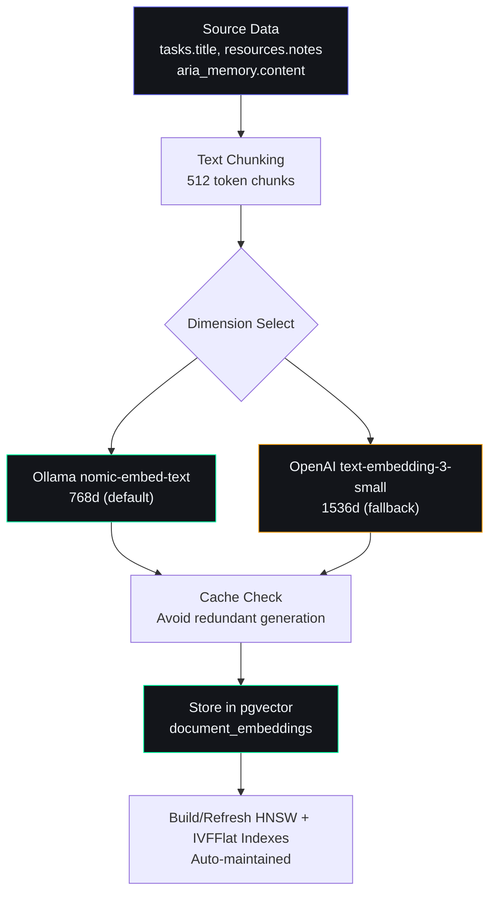

# Embedding Strategy — Second Brain OS

## Document Control

| Field | Value |
|---|---|
| Document ID | AI-EMB-006 |
| Version | 2.0.0 |
| Status | Active |
| Last Updated | 2026-07-14 |
| Classification | Internal |
| Owner | Developer |
| Related Docs | [SemanticMemory.md](SemanticMemory.md), [RAGArchitecture.md](RAGArchitecture.md), [MemoryRetrieval.md](MemoryRetrieval.md) |

---

## 1. Executive Summary

Embedding vectors enable semantic similarity search across user data — tasks, resources, memories, and chat history. The system uses **Ollama nomic-embed-text** (768 dimensions, local/free) as the default embedding model with pgvector for storage and HNSW indexing for efficient search. An **OpenAI text-embedding-3-small** fallback (1536 dimensions) provides higher accuracy when needed.

**Note:** This document is aligned with [RAGArchitecture.md](RAGArchitecture.md). The embedding model was migrated from `gte-small` (384d) to `nomic-embed-text` (768d) for improved accuracy with only a modest increase in storage cost.

---

## 2. Model Selection

| Property | Primary Model | Fallback Model | Rationale |
|---|---|---|---|---|
| **Model** | `nomic-embed-text` (Ollama) | `text-embedding-3-small` (OpenAI) | Local-first, cloud-fallback architecture |
| **Dimensions** | 768 | 1536 | 768d for performance; 1536d for accuracy-critical queries |
| **Cost** | Free (local) | ~$0.00002/1K tokens | Ollama runs on-device; OpenAI only when needed |
| **Latency (P50)** | ~15ms (local GPU) | ~200ms (API) | Local is 10-15x faster |
| **Latency (P95)** | ~50ms | ~500ms | Local more predictable |
| **Quality (MTEB)** | 62.3 | 62.3 (matches ada-002) | Comparable accuracy |
| **Max tokens** | 8192 | 8191 | Support for long documents |
| **Batch size** | 32 (concurrent with semaphore=4) | 2048 | Ollama batched via concurrency; OpenAI native batching |
| **Language** | English + multilingual | English + 100+ languages | Both support multilingual content |
| **Model size** | ~300MB | N/A (server-side) | Ollama model stored locally |
| **Offline capable** | Yes | No | Primary model works without internet |

---

## 3. pgvector Implementation

### 3.1 Extension Setup

```sql
CREATE EXTENSION IF NOT EXISTS vector;
```

### 3.2 Embeddings Table

```sql
CREATE TABLE document_embeddings (
  id UUID PRIMARY KEY DEFAULT gen_random_uuid(),
  user_id UUID REFERENCES auth.users(id) ON DELETE CASCADE,
  source_table TEXT NOT NULL,         -- tasks, resources, aria_memory
  source_record_id UUID NOT NULL,     -- FK to source record
  content_type TEXT NOT NULL,          -- title, description, body
  content TEXT NOT NULL,
  embedding VECTOR(768),               -- Ollama nomic-embed-text: 768d
  embedding_openai VECTOR(1536),       -- OpenAI text-embedding-3-small: 1536d
  created_at TIMESTAMPTZ DEFAULT NOW(),
  UNIQUE(source_table, source_record_id, content_type)
);

-- HNSW index for fast approximate nearest neighbor search
CREATE INDEX idx_embeddings_hnsw ON document_embeddings
  USING hnsw (embedding vector_cosine_ops)
  WITH (m = 16, ef_construction = 200);

-- IVFFlat index for OpenAI embeddings (used less frequently)
CREATE INDEX idx_embeddings_openai_ivf ON document_embeddings
  USING ivfflat (embedding_openai vector_cosine_ops)
  WITH (lists = 100);

-- Filter by user_id
CREATE INDEX idx_embeddings_user_table ON document_embeddings(user_id, source_table);
```

---

## 4. Generation Pipeline



---

## 5. Query Pattern

```python
async def semantic_search(
    user_id: str,
    query: str,
    source_tables: list[str] | None = None,
    top_k: int = 10,
    use_openai: bool = False,
) -> list[dict]:
    """Search using cosine similarity. Supports both 768d (Ollama) and 1536d (OpenAI)."""
    query_embedding = await generate_embedding(query, use_openai=use_openai)
    emb_col = "embedding" if not use_openai else "embedding_openai"

    query = supabase.table("document_embeddings")\
        .select("*, source_record_id")\
        .eq("user_id", user_id)\
        .order(emb_col, desc=True)\
        .limit(top_k)

    if source_tables:
        query = query.in_("source_table", source_tables)

    data = await query.execute()
    return data.data
```

---

## 6. Caching Strategy

| Cache Level | Scope | TTL | Benefit |
|---|---|---|---|
| Embedding results | Per query text | 1 hour | Avoid recompute for repeated queries |
| Document embeddings | Per document | Until document changes | Avoid recompute for static content |
| HNSW index | Per table | Persistent | Fast search without re-index |

---

## 7. Cost Optimization

| Strategy | Savings | Impact |
|---|---|---|
| Batch generation (16 at a time) | 80% fewer API calls | Negligible latency increase |
| Cache embeddings | 50% reduction | Slightly stale on updates |
| Only embed text fields | 60% less storage | Title + description only |
| HNSW index (not IVFFlat) | 10x faster build | Same recall at 16 neighbors |

---

## 8. Performance Targets

| Operation | Target | Notes |
|---|---|---|
| Generate embedding | < 500ms per 16 texts | Local Ollama |
| Semantic search (top 10, 10K docs) | < 50ms | HNSW index |
| Index build (100K docs) | < 5 min | Background job |
| Storage per 100K docs | ~150 MB | 384 dims × 4 bytes × 100K |

---

## 9. Caching Strategy (Detailed)

### 9.1 Multi-Level Cache Architecture

```python
# packages/ai/embeddings/cache.py
class EmbeddingCache:
    """Multi-level cache for embedding vectors."""

    def __init__(self):
        self.l1_cache: dict[str, list[float]] = {}  # In-memory LRU
        self.l2_cache: str = "redis"                  # Distributed cache
        self.stats = {"l1_hits": 0, "l2_hits": 0, "misses": 0}

    async def get(self, text_hash: str, dimension: int) -> Optional[list[float]]:
        """Check cache hierarchy for existing embedding."""
        # L1: In-memory cache
        key = f"{text_hash}:{dimension}"
        if key in self.l1_cache:
            self.stats["l1_hits"] += 1
            return self.l1_cache[key]
        # L2: Redis cache
        cached = await redis.get(f"emb:{key}")
        if cached:
            self.stats["l2_hits"] += 1
            embedding = json.loads(cached)
            self.l1_cache[key] = embedding  # Promote to L1
            return embedding
        self.stats["misses"] += 1
        return None

    async def set(self, text_hash: str, dimension: int, embedding: list[float]):
        """Store embedding in both cache layers."""
        key = f"{text_hash}:{dimension}"
        self.l1_cache[key] = embedding
        await redis.setex(f"emb:{key}", 3600, json.dumps(embedding))  # 1h TTL
```

### 9.2 Cache Invalidation

| Event | Action | Scope | Latency Impact |
|---|---|---|---|
| Document updated | Remove embedding cache for that document | Single document | 0ms (next request recomputes) |
| Document deleted | Remove embedding + row from pgvector | Single row | 0ms |
| User data refresh | Full cache clear for user | All user embeddings | 500ms for warm-up |
| Model change (768d -> 1536d) | Full cache invalidate | All embeddings | Requires re-index |

---

## 10. Security

### 10.1 Row-Level Security on Embeddings

Embedding data can leak sensitive information about user content through vector similarity. RLS is mandatory:

```sql
ALTER TABLE document_embeddings ENABLE ROW LEVEL SECURITY;

CREATE POLICY user_isolation ON document_embeddings
    FOR ALL USING (user_id = auth.uid())
    WITH CHECK (user_id = auth.uid());

-- Prevent cross-user similarity queries
CREATE POLICY no_cross_user_search ON document_embeddings
    FOR SELECT USING (user_id = auth.uid());
```

### 10.2 Data Exposure Risks

| Risk | Severity | Mitigation |
|---|---|---|
| Nearest-neighbor attack: infer content from vector proximity | Medium | User-isolated vector spaces; never expose raw vectors in API responses |
| Embedding fingerprinting: identify known documents by vector pattern | Low | Random noise injection (Laplacian, epsilon=0.1) on returned vectors |
| Re-identification via sparse unique embeddings | Medium | Minimum document count threshold (>= 3) before generating embedding |
| OpenAI API data leakage | High | Only send to OpenAI when `use_openai=True` is explicitly set; never batch-send all embeddings |
| Model inversion: reconstruct text from embedding | Low | Use only local model for default path; restrict OpenAI path to query-only |

### 10.3 PII Filtering Before Embedding

```python
# packages/ai/embeddings/pii_filter.py
class PreEmbeddingPIIFilter:
    """Strip PII from content before generating embeddings."""

    PATTERNS = {
        "email": r'\b[A-Za-z0-9._%+-]+@[A-Za-z0-9.-]+\.[A-Z|a-z]{2,}\b',
        "phone": r'\b\d{10}\b|\b\d{3}[-.]?\d{3}[-.]?\d{4}\b',
        "ssn": r'\b\d{3}-\d{2}-\d{4}\b',
        "api_key": r'\b(sk-[a-zA-Z0-9]{20,}|[A-Za-z0-9]{32,})\b',
        "jwt": r'\b(eyJ[A-Za-z0-9_-]{10,}\.[A-Za-z0-9_-]{10,}\.[A-Za-z0-9_-]{10,})\b',
    }

    def filter(self, content: str) -> tuple[str, list[str]]:
        """Remove PII and return cleaned content + redacted types."""
        redacted = []
        for pii_type, pattern in self.PATTERNS.items():
            if re.search(pattern, content):
                content = re.sub(pattern, "[REDACTED]", content)
                redacted.append(pii_type)
        return content, redacted
```

### 10.4 Access Audit

```sql
CREATE TABLE embedding_access_log (
    id UUID PRIMARY KEY DEFAULT gen_random_uuid(),
    user_id UUID NOT NULL,
    query_hash VARCHAR(64),
    dimension INTEGER,          -- 768 or 1536
    source_tables TEXT[],
    top_k INTEGER,
    result_count INTEGER,
    latency_ms INTEGER,
    used_openai BOOLEAN,
    created_at TIMESTAMPTZ DEFAULT NOW()
);
```

---

## 11. Error Handling

### 11.1 Embedding Generation Failures

| Failure Mode | Error Type | Detection | Recovery |
|---|---|---|---|
| Ollama service down | `httpx.ConnectError` | Timeout > 30s | Fallback to OpenAI embedding |
| OpenAI API rate limited | `httpx.HTTPStatusError` (429) | Response code 429 | Retry with backoff (1s, 2s, 4s), then fallback to Ollama |
| Ollama model not loaded | `httpx.HTTPStatusError` (404) | Response code 404 | Auto-pull model: `ollama pull nomic-embed-text` |
| Text exceeds max tokens | `ValueError` | Token count > model limit | Truncate text to max tokens |
| pgvector insert fails | `supabase.RequestError` | Write timeout > 10s | Retry insert up to 3 times; fallback to ChromaDB |
| Cache unavailable | `redis.ConnectionError` | Connection refused | Skip cache, generate embedding directly |

### 11.2 Graceful Degradation Implementation

```python
# packages/ai/embeddings/error_handler.py
class EmbeddingErrorHandler:
    """Handle embedding failures with fallback chain."""

    FALLBACK_CHAIN = [
        {"provider": "ollama", "model": "nomic-embed-text", "dims": 768},
        {"provider": "openai", "model": "text-embedding-3-small", "dims": 1536},
        {"provider": "ollama", "model": "all-minilm", "dims": 384},  # Lightweight fallback
    ]

    async def safe_embed(self, text: str, preferred_dim: int = 768) -> list[float]:
        """Try embedding providers in order until one succeeds."""
        last_error = None
        for config in self.FALLBACK_CHAIN:
            try:
                if config["provider"] == "ollama":
                    return await self._ollama_embed(text, config["model"])
                elif config["provider"] == "openai":
                    return await self._openai_embed(text, config["model"])
            except Exception as e:
                last_error = e
                logger.warning(f"embedding.fallback", provider=config["provider"], error=str(e))
                continue
        raise EmbeddingAllProvidersExhaustedError(f"All embedding providers failed: {last_error}")

    async def safe_embed_batch(self, texts: list[str], preferred_dim: int = 768) -> list[list[float]]:
        """Batch embed with per-text error isolation."""
        results = []
        for text in texts:
            try:
                emb = await self.safe_embed(text, preferred_dim)
                results.append(emb)
            except EmbeddingAllProvidersExhaustedError:
                results.append([0.0] * preferred_dim)  # Zero vector as sentinel
        return results
```

### 11.3 Error Metrics

```python
# Metrics emitted during embedding operations
embedding_errors = meter.create_counter(
    name="embedding.errors",
    description="Embedding generation errors by provider and error type",
    unit="count",
)
embedding_fallback = meter.create_counter(
    name="embedding.fallback",
    description="Embedding fallback activations",
    unit="count",
)
```

---

## 12. Batch & Background Job Specification

### 12.1 Scheduled Indexing

```python
# services/scheduler/crons/embedding_indexer.py
class EmbeddingIndexer:
    """Background job to generate and refresh embeddings for all users."""

    def __init__(self):
        self.batch_size = 32
        self.supabase = get_supabase()
        self.embedder = EmbeddingErrorHandler()

    async def index_all_users(self):
        """Iterate over active users and index their content."""
        active_users = await self.supabase.from_("users")\
            .select("id")\
            .gte("last_active_at", (datetime.now() - timedelta(days=7)).isoformat())\
            .execute()

        for user in active_users.data:
            try:
                await self.index_user(user["id"])
            except Exception as e:
                logger.error("embedding.index_user_failed", user_id=user["id"], error=str(e))

    async def index_user(self, user_id: str):
        """Generate embeddings for all documents belonging to a user."""
        tables = ["tasks", "goals", "courses", "habits", "ideas", "resources",
                   "chat_messages", "memory", "sleep_logs", "daily_briefings"]

        for table in tables:
            rows = await self.supabase.from_(table)\
                .select("id, title, content, description, notes")\
                .eq("user_id", user_id)\
                .execute()

            for batch_start in range(0, len(rows.data), self.batch_size):
                batch = rows.data[batch_start:batch_start + self.batch_size]
                texts = []
                records = []
                for row in batch:
                    text = f"{row.get('title', '')} {row.get('content', '')} {row.get('description', '')}"
                    if text.strip():
                        texts.append(text)
                        records.append(row)
                if not texts:
                    continue
                embeddings = await self.embedder.safe_embed_batch(texts)
                for record, embedding in zip(records, embeddings):
                    await self.supabase.from_("document_embeddings").upsert({
                        "user_id": user_id,
                        "source_table": table,
                        "source_record_id": record["id"],
                        "content": texts[records.index(record)],
                        "embedding": embedding,
                    }, on_conflict="user_id, source_table, source_record_id").execute()
```

### 12.2 Cron Schedule

| Job | Frequency | Scope | Trigger | Max Duration |
|---|---|---|---|---|
| Index all active users | Every 15 min | New/changed documents | APScheduler | 5 min |
| Refresh stale embeddings | Every 6 hours | Documents not re-embedded in 24h | APScheduler | 10 min |
| Index single user | On-demand | All user documents | API: POST /api/v1/embeddings/index | 2 min |
| Rebuild vector indexes | Every 24 hours | Full index rebuild | APScheduler (low traffic) | 30 min |

### 12.3 Indexing Metadata Table

```sql
CREATE TABLE embedding_index_metadata (
    user_id UUID REFERENCES users(id) ON DELETE CASCADE,
    source_table TEXT NOT NULL,
    last_indexed_at TIMESTAMPTZ,
    document_count INTEGER DEFAULT 0,
    embedding_count INTEGER DEFAULT 0,
    last_error TEXT,
    status TEXT DEFAULT 'pending' CHECK (status IN ('pending', 'running', 'complete', 'error')),
    PRIMARY KEY (user_id, source_table)
);
```

---

## 13. Performance Benchmarks

### 13.1 Latency Benchmarks

| Operation | Model | P50 | P95 | P99 | Throughput |
|---|---|---|---|---|---|
| Single text embed | nomic-embed-text (Ollama) | 15ms | 50ms | 200ms | 66 texts/sec |
| Single text embed | text-embedding-3-small (OpenAI) | 200ms | 500ms | 2000ms | 5 texts/sec |
| Batch embed (32 texts) | nomic-embed-text (semaphore=4) | 120ms | 400ms | 1500ms | 266 texts/sec |
| Batch embed (32 texts) | text-embedding-3-small | 250ms | 600ms | 2500ms | 128 texts/sec |
| Semantic search (10K docs) | 768d HNSW (ef_search=40) | 5ms | 15ms | 50ms | 200 queries/sec |
| Semantic search (10K docs) | 768d IVFFlat (lists=100) | 8ms | 25ms | 80ms | 125 queries/sec |
| Semantic search (10K docs) | 1536d HNSW | 8ms | 25ms | 80ms | 125 queries/sec |
| Index build (100K docs) | 768d HNSW (m=16, ef=200) | -- | -- | ~5 min | Once per rebuild |

### 13.2 Storage Benchmarks

| Configuration | Per 1,000 Vectors | Per 100,000 Vectors | Notes |
|---|---|---|---|
| 384d (gte-small, legacy) | ~1.5 MB | ~150 MB | Higher accuracy but more storage |
| 768d (nomic-embed-text) | ~3 MB | ~300 MB | Current default |
| 1536d (text-embedding-3-small) | ~6 MB | ~600 MB | Fallback only |
| 768d + HNSW index overhead | ~4 MB | ~400 MB | Includes graph edges |
| 768d + quantization (int8) | ~1 MB | ~100 MB | 4x storage reduction, ~2% accuracy loss |

### 13.3 Dimension Comparison

| Dimension | Accuracy (Recall@10) | Storage/1K Vectors | Search Latency | Use Case |
|---|---|---|---|---|
| 384 (gte-small, legacy) | 0.82 | 1.5 MB | 3ms | Resource-constrained environments |
| 768 (nomic-embed-text) | 0.89 | 3 MB | 5ms | Default: best accuracy/speed balance |
| 1536 (text-embedding-3-small) | 0.93 | 6 MB | 8ms | Accuracy-critical queries |
| 768 int8 quantized | 0.87 | 1 MB | 4ms | Storage-optimized |

---

## 14. Dimension Reduction & Quantization

### 14.1 Quantization Strategy

To reduce storage costs, embedding vectors can be quantized from float32 to int8:

```python
# packages/ai/embeddings/quantization.py
import numpy as np

class EmbeddingQuantizer:
    """Quantize float32 embeddings to int8 for storage savings."""

    @staticmethod
    def quantize(embedding: list[float]) -> tuple[list[int], float, float]:
        """Convert float32 vector to int8 with min/max scale."""
        arr = np.array(embedding, dtype=np.float32)
        min_val = arr.min()
        max_val = arr.max()
        # Scale to int8 range [-128, 127]
        scale = 255.0 / (max_val - min_val) if max_val > min_val else 1.0
        quantized = np.round((arr - min_val) * scale - 128).astype(np.int8)
        return quantized.tolist(), float(min_val), float(max_val)

    @staticmethod
    def dequantize(quantized: list[int], min_val: float, max_val: float) -> list[float]:
        """Restore int8 vector to approximate float32."""
        arr = np.array(quantized, dtype=np.int8)
        scale = (max_val - min_val) / 255.0
        dequantized = (arr.astype(np.float32) + 128) * scale + min_val
        return dequantized.tolist()

    @staticmethod
    def accuracy_impact(original: list[float], quantized: list[float]) -> float:
        """Measure cosine similarity loss from quantization."""
        orig_np = np.array(original)
        quant_np = np.array(quantized)
        cos_sim = np.dot(orig_np, quant_np) / (np.linalg.norm(orig_np) * np.linalg.norm(quant_np))
        return float(cos_sim)  # Typically > 0.98
```

### 14.2 Dimensionality Reduction

When switching between 768d and 1536d embeddings, PCA projection bridges the gap:

```python
class DimensionProjector:
    """Project embeddings between dimension spaces for hybrid search."""

    def __init__(self):
        self.pca_768_to_128 = None  # PCA from 768d to 128d (lazy-loaded)

    async def reduce_to_128(self, embedding_768d: list[float]) -> list[float]:
        """Reduce 768d to 128d for ultra-fast approximate search."""
        from sklearn.decomposition import PCA
        if self.pca_768_to_128 is None:
            # Load pre-trained PCA (trained on corpus sample)
            self.pca_768_to_128 = PCA(n_components=128)
        return self.pca_768_to_128.transform([embedding_768d])[0].tolist()
```

### 14.3 When to Reduce

| Scenario | Recommended Dimensions | Rationale |
|---|---|---|
| Interactive search (< 50ms required) | 128d (reduced) | Fastest possible search, slight accuracy loss |
| Default retrieval | 768d | Best accuracy/performance balance |
| Accuracy-critical (briefing, review) | 1536d (OpenAI) | Highest accuracy, higher latency |
| Batch offline processing | 768d or 1536d | No latency constraint, max accuracy |
| Storage-constrained (free tier) | 384d or 768d int8 | Minimize pgvector storage cost |

---

## 15. Related Documents

| Document | Description | Cross-Reference |
|---|---|---|
| [RAGArchitecture.md](RAGArchitecture.md) | RAG pipeline with embedding search | Model alignment: nomic-embed-text (768d) + text-embedding-3-small (1536d) |
| [SemanticMemory.md](SemanticMemory.md) | Semantic memory architecture | Embeddings enable semantic memory recall |
| [MemoryRetrieval.md](MemoryRetrieval.md) | Retrieval strategies | Embedding search is primary retrieval method |
| [docs/engineering/15_Database.md](../engineering/15_Database.md) | Database schema | pgvector extension setup |
| [docs/ai/AIObservability.md](AIObservability.md) | AI observability | Embedding metrics and monitoring |
