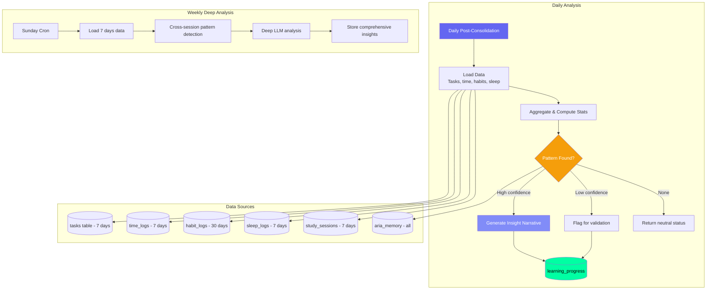
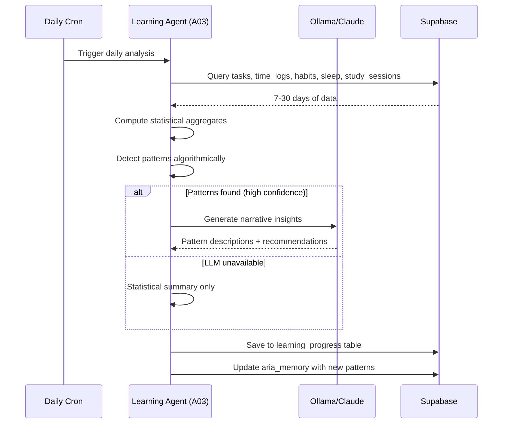
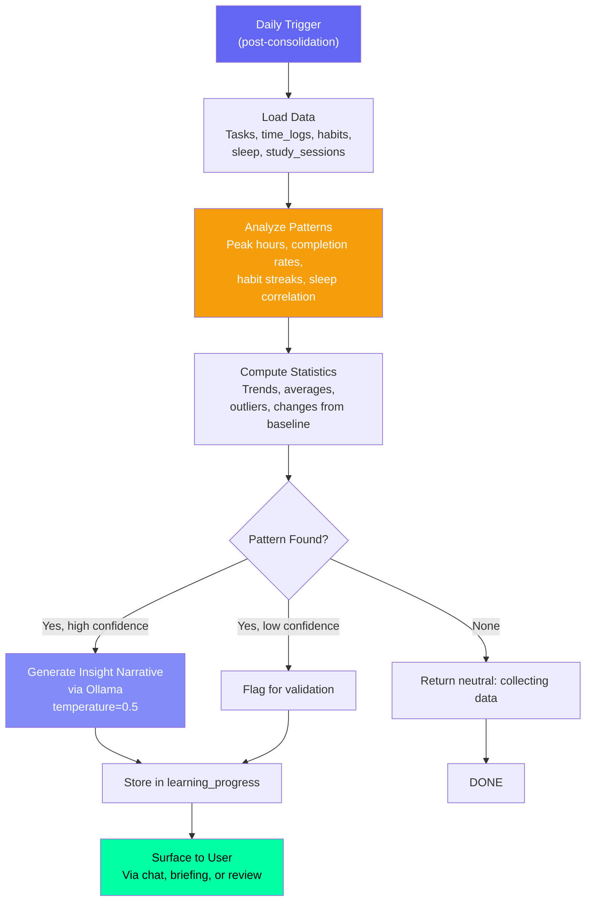

# Learning Agent — Pattern Detection & Insights

## Document Control

| Field | Value |
|---|---|
| **Document ID** | AI-AGT-006 |
| **Version** | 2.0.0 |
| **Status** | Approved |
| **Date** | 2026-07-14 |
| **Classification** | Internal |
| **Owner** | Developer |
| **Review Cycle** | Monthly |
| **Prompt File** | `prompts/agents/learning_agent.md` (850 lines, v2.1.0) |
| **Agent Module** | `packages/ai/agents/learning_agent.py` |
| **Agent ID** | A03 |
| **Related Docs** | [MemoryAgent.md](MemoryAgent.md), [AgentArchitecture.md](../engineering/14_AgentArchitecture.md), [Analytics API](../../apps/api/app/api/analytics.py) |

---

## 1. Overview

The Learning Agent detects behavioral patterns, productivity trends, and learning progress from user data by analyzing daily logs, time entries, task completions, and habit data. It runs daily (post-consolidation) with a deeper weekly analysis on Sundays. Insights feed into the briefing, weekly review, and ARIA chat responses.

**Key Features:**
- Productivity peak detection (best time of day for focused work)
- Trend analysis across 5 key metrics
- Anomaly detection (unusual behavior patterns)
- Spaced repetition reminders (1/3/7/14/30 day intervals)
- Course progress tracking with recalculated daily targets
- Statistical analysis fallback when LLM unavailable

---

## 2. Architecture

### Agent Positioning



### Data Flow Sequence



---

## 3. Processing Flow



---

## 4. Input Schema

| Field | Source | Days Lookback | Description |
|---|---|---|---|
| tasks_completed | tasks | 7 days | Completion timestamps |
| time_logs | time_logs | 7 days | Session timing, duration, energy |
| habits | habit_logs | 30 days | Consistency, streaks |
| sleep | sleep_logs | 7 days | Duration, score, quality |
| study_sessions | study_sessions | 7 days | Topics, duration, course |
| existing_memories | aria_memory | All | Stored patterns for comparison |

### Data Loading Implementation

```python
async def load_learning_data(user_id: str) -> dict:
    now = datetime.now()
    lookback_7d = now - timedelta(days=7)
    lookback_30d = now - timedelta(days=30)

    tasks = await supabase.table("tasks")\
        .select("title, status, priority, updated_at")\
        .eq("user_id", user_id)\
        .gte("updated_at", lookback_7d.isoformat())\
        .execute()

    time_logs = await supabase.table("time_logs")\
        .select("start_time, duration_minutes, energy_level, task_type")\
        .eq("user_id", user_id)\
        .gte("start_time", lookback_7d.isoformat())\
        .execute()

    habits = await supabase.table("habit_logs")\
        .select("habit_id, completed, date")\
        .eq("user_id", user_id)\
        .gte("date", lookback_30d.isoformat())\
        .execute()

    return {
        "tasks": tasks.data,
        "time_logs": time_logs.data,
        "habits": habits.data,
        "task_count": len(tasks.data),
        "study_minutes": sum(t["duration_minutes"] for t in time_logs.data),
    }
```

---

## 5. Output Schema

```json
{
  "patterns": [
    {
      "type": "productivity_peak",
      "name": "morning_peak",
      "description": "Most productive between 9-11 AM with 90min average focus",
      "confidence": 0.85,
      "evidence": {
        "session_count": 15,
        "avg_duration_minutes": 92,
        "completion_rate": 0.88
      },
      "source_tables": ["time_logs", "tasks"]
    }
  ],
  "trends": {
    "task_completion_rate": {"value": 78, "change": "+12% from last week", "direction": "up"},
    "sleep_quality": {"value": 72, "change": "-5 points", "direction": "down"},
    "study_consistency": {"value": 85, "change": "stable", "direction": "stable"}
  },
  "anomalies": [
    {
      "date": "2026-07-08",
      "type": "late_study",
      "description": "Unusual late-night study session at 2 AM",
      "severity": "notice"
    }
  ],
  "recommendation": "Schedule deep work before 11 AM for best results",
  "learning_velocity": {
    "courses_this_month": 2,
    "videos_watched": 15,
    "hours_studied": 28
  }
}
```

### Pattern Types

| Type | Description | Min Data Points |
|---|---|---|
| productivity_peak | Best time of day for focused work | 10 sessions |
| completion_rate_trend | Task finishing trend over time | 20 tasks |
| energy_correlation | Sleep quality vs productivity | 7 days |
| habit_consistency | Streak maintenance pattern | 14 days |
| learning_velocity | Course progress rate | 5 sessions |

---

## 6. Statistical Analysis (Algorithmic)

```python
def detect_productivity_peak(time_logs: list[dict]) -> dict | None:
    """Detect most productive time window from time logs."""
    hourly_scores = {}
    for log in time_logs:
        hour = datetime.fromisoformat(log["start_time"]).hour
        if hour not in hourly_scores:
            hourly_scores[hour] = {"count": 0, "total_duration": 0}
        hourly_scores[hour]["count"] += 1
        hourly_scores[hour]["total_duration"] += log["duration_minutes"]

    if not hourly_scores:
        return None

    best_hour = max(hourly_scores, key=lambda h: hourly_scores[h]["count"])
    stats = hourly_scores[best_hour]
    avg_duration = stats["total_duration"] / stats["count"] if stats["count"] > 0 else 0

    if stats["count"] >= 10:
        return {
            "type": "productivity_peak",
            "hour": best_hour,
            "avg_duration": round(avg_duration, 1),
            "session_count": stats["count"],
            "confidence": min(0.9, stats["count"] / 50),
        }
    return None


def calculate_trend(current: float, previous: float) -> dict:
    """Calculate trend direction and change percentage."""
    if previous == 0:
        return {"change": "new", "direction": "stable"}
    change_pct = round(((current - previous) / previous) * 100, 1)
    direction = "up" if change_pct > 0 else ("down" if change_pct < 0 else "stable")
    return {
        "value": current,
        "change": f"{'+' if change_pct > 0 else ''}{change_pct}%",
        "direction": direction,
    }
```

---

## 7. LLM Configuration

| Parameter | Value | Rationale |
|---|---|---|
| Model | Ollama (Mistral 7B) | Fast, private |
| Temperature | 0.5 | Moderate creativity for insight |
| Max tokens | 2048 | Enough for multi-pattern output |
| Fallback | Claude Sonnet 4 | Cloud backup |

---

## 8. Prompt Usage

```python
from ai.prompt_loader import prompts

entry = prompts.get_agent("learning_agent")
if entry:
    system = entry.system_prompt
    user = f"Analyze user data for patterns:\n{json.dumps(data, indent=2)}"
    result = await llm.generate_json(user, system=system)
else:
    result = statistical_analysis_only(data)
```

---

## 9. Fallback Behavior

| Failure Mode | Fallback | Result |
|---|---|---|
| LLM unavailable | Statistical summary only | No narrative insights |
| Insufficient data (< 3 days) | "Collecting data, check back in 3 days" | Neutral response |
| All patterns low confidence | Report only high-confidence patterns | Conservative output |
| Trend calculation fails | Show raw data without comparison | Reduced quality |

---

## 10. Failure Modes

| Mode | Handling |
|---|---|
| No time logs | Skip productivity analysis |
| Only 1 day of data | Defer analysis, return neutral response |
| Conflicting patterns | Report all with confidence scores |
| Anomaly false positive | Log as low-confidence anomaly |
| Learning velocity zero | Check if user is new or inactive |
| All metrics declining | Flag for weekly review, suggest intervention |

### Recovery Strategy

| Scenario | Action |
|---|---|
| Daily analysis skipped | Merge into next day's analysis |
| Weekly analysis fails | Skip week, note gap in next week |
| Pattern database corrupt | Rebuild from raw data |

---

## 11. Error Handling

```python
async def run_learning_analysis(user_id: str) -> dict:
    data = await load_learning_data(user_id)
    if not data or data.get("task_count", 0) < 3:
        return {"status": "insufficient_data", "message": "Need more data for analysis"}

    # Always compute statistical patterns first (algorithmic fallback)
    patterns = []
    peak = detect_productivity_peak(data.get("time_logs", []))
    if peak:
        patterns.append(peak)

    # Attempt LLM enrichment
    try:
        llm_result = await llm.generate_json(user_prompt, system=system)
        enriched = parse_llm_patterns(llm_result)
        patterns.extend(enriched)
    except (LLMProviderUnavailableError, JSONParseError) as e:
        logger.warn(f"LLM pattern detection failed: {e}")

    result = {
        "patterns": patterns,
        "trends": calculate_all_trends(data),
        "anomalies": detect_anomalies(data),
        "status": "complete",
    }

    await supabase.table("learning_progress").upsert({
        "user_id": user_id,
        "date": datetime.now().date().isoformat(),
        "data": result,
    }).execute()

    return result
```

---

## 12. Performance Targets

| Operation | Target |
|---|---|
| Data loading + aggregation | < 500ms |
| Pattern detection (algorithmic) | < 200ms |
| LLM insight generation | < 10s |
| Total pipeline | < 12s |

---

## 13. Related Documents

| Document | Description |
|---|---|
| [prompts/agents/learning_agent.md](../../prompts/agents/learning_agent.md) | Full prompt template (850 lines) |
| [MemoryAgent.md](MemoryAgent.md) | Memory consolidation companion (A02) |
| [AgentArchitecture.md](../engineering/14_AgentArchitecture.md) | Agent system architecture |
| [Analytics API](../../apps/api/app/api/analytics.py) | Analytics endpoint |
| [14_AgentArchitecture.md §A03](../engineering/14_AgentArchitecture.md) | Agent registry reference |

---

## Revision History

| Version | Date | Author | Changes |
|---|---|---|---|
| 1.0.0 | 2026-07-10 | Developer | Initial agent documentation |
| 2.0.0 | 2026-07-14 | Developer | Expanded to full enterprise reference. Added architecture diagram, sequence diagram, data loading implementation, algorithmic pattern detection (productivity_peak, trend analysis), error handling code, and cross-references. |
