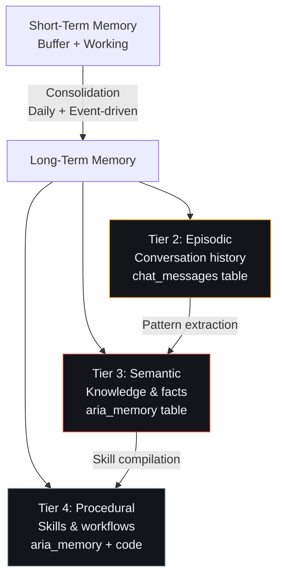

# Long-Term Memory — Second Brain OS

## Document Control

| Field | Value |
|---|---|
| **Document ID** | AI-LTM-004 |
| **Version** | 1.0.0 |
| **Status** | Approved |
| **Date** | 2026-07-10 |
| **Classification** | Internal |
| **Owner** | Developer |
| **Related Docs** | [22_MemoryArchitecture.md](22_MemoryArchitecture.md), [ShortTermMemory.md](ShortTermMemory.md), [SemanticMemory.md](SemanticMemory.md), [MemoryCompression.md](MemoryCompression.md) |

---

## 1. Executive Summary

Long-term memory comprises Tiers 2-4 of the 5-tier memory model: Episodic (conversation history), Semantic (knowledge & facts), and Procedural (skills & workflows). All three tiers are persisted in Supabase PostgreSQL, enabling cross-session recall, behavioral adaptation, and personalization.

---

## 2. Tier Architecture



---

## 3. Episodic Memory (Tier 2)

### Purpose
Persistent record of past conversations and interactions. Stored in the `chat_messages` table.

### Schema

```sql
CREATE TABLE chat_messages (
  id UUID PRIMARY KEY DEFAULT gen_random_uuid(),
  user_id UUID REFERENCES auth.users(id) ON DELETE CASCADE NOT NULL,
  role TEXT NOT NULL CHECK (role IN ('user', 'assistant', 'system')),
  content TEXT NOT NULL,
  action_taken TEXT,
  metadata JSONB DEFAULT '{}',
  created_at TIMESTAMPTZ DEFAULT NOW()
);
```

### Retrieval Patterns

```python
async def get_episodic_context(user_id: str, lookback: int = 10) -> list[dict]:
    """Get last N messages for context assembly."""
    data = await supabase.table("chat_messages")\
        .select("*")\
        .eq("user_id", user_id)\
        .order("created_at", desc=True)\
        .limit(lookback)\
        .execute()
    return list(reversed(data.data))
```

### Retention

| Policy | Duration | Action |
|---|---|---|
| Active retention | 90 days | Full detail available |
| Archival | 90-365 days | Compressed summary |
| Deletion | > 365 days | Purged (auto-cleanup) |

---

## 4. Semantic Memory (Tier 3)

### Purpose
Extracted user facts, preferences, and patterns. Stored in the `aria_memory` table.

### Schema

```sql
CREATE TABLE aria_memory (
  id UUID PRIMARY KEY DEFAULT gen_random_uuid(),
  user_id UUID REFERENCES auth.users(id) ON DELETE CASCADE NOT NULL,
  memory_type TEXT NOT NULL CHECK (memory_type IN ('preference', 'fact', 'pattern', 'decision')),
  content TEXT NOT NULL,
  confidence FLOAT DEFAULT 0.8 CHECK (confidence BETWEEN 0 AND 1),
  created_at TIMESTAMPTZ DEFAULT NOW(),
  last_referenced_at TIMESTAMPTZ DEFAULT NOW()
);
```

### Memory Types

| Type | Example | Importance Score |
|---|---|---|
| **preference** | "User prefers morning study" | 0.9 |
| **fact** | "User is in 3rd year CSE" | 1.0 |
| **pattern** | "User studies best in 90-min blocks" | 0.7 |
| **decision** | "User chose React over Angular" | 0.8 |

### Retrieval

```python
async def get_semantic_memories(user_id: str, top_k: int = 20) -> list[dict]:
    """Get top-K relevant memories by confidence and recency."""
    data = await supabase.table("aria_memory")\
        .select("*")\
        .eq("user_id", user_id)\
        .gte("confidence", 0.3)\
        .order("last_referenced_at", desc=True)\
        .limit(top_k)\
        .execute()
    return data.data
```

---

## 5. Procedural Memory (Tier 4)

### Purpose
Learned user workflows, skill patterns, and behavioral routines. Stored as structured data in `aria_memory` with type 'pattern'.

### Examples

- **Workflow:** "User follows this pattern when starting a new project: research → plan → build → test"
- **Skill level:** "User is intermediate in Python, beginner in React"
- **Adjustment:** "User prefers concise answers after 10 PM"

---

## 6. Consolidation Pipeline


---

## 7. Decay & Maintenance

| Phase | Trigger | Action |
|---|---|---|
| Decay | Weekly (Sunday 2 AM) | Multiply confidence by 0.8 for memories > 30 days old |
| Archive | Confidence < 0.1 | Mark for archival (reduce retrieval priority) |
| Purge | Confidence < 0.05 | Delete permanently |

---

## 8. Performance Targets

| Operation | Target | Current |
|---|---|---|
| Episodic retrieval (last 10) | < 50ms | ~15ms |
| Semantic retrieval (top 20) | < 100ms | ~30ms |
| Memory consolidation | < 30s per user | ~10s |
| Memory decay (all users) | < 60s | ~20s |

---

## 9. Related Documents

| Document | Description |
|---|---|
| [22_MemoryArchitecture.md](22_MemoryArchitecture.md) | Full memory architecture |
| [MemoryCompression.md](MemoryCompression.md) | Compression strategies |
| [MemoryRetrieval.md](MemoryRetrieval.md) | Retrieval strategies |
