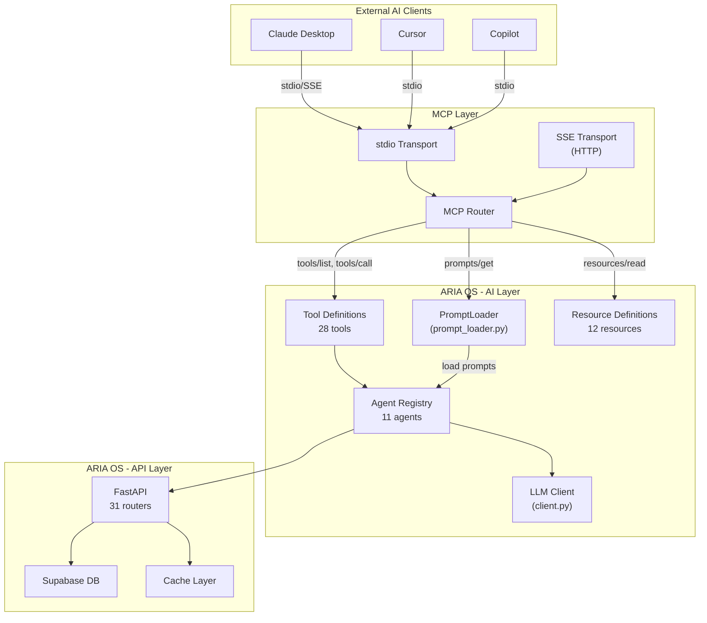
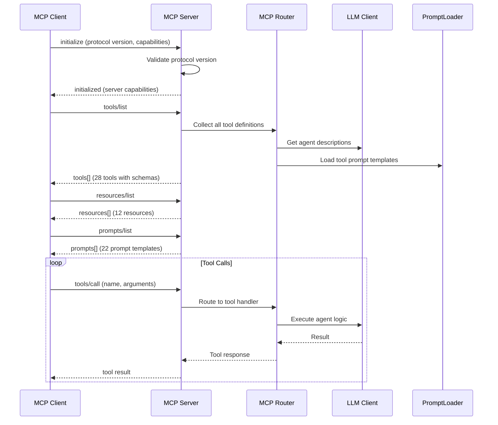

# Model Context Protocol (MCP) Architecture

## Document Control

| Field | Value |
|---|---|
| Document ID | AI-MCP-001 |
| Version | 1.0.0 |
| Status | Active |
| Last Updated | 2026-07-14 |
| Classification | Internal |
| Owner | Developer |
| Review Cycle | Monthly |

---

## Table of Contents

1. [Executive Summary](#1-executive-summary)
2. [What is MCP in ARIA OS Context](#2-what-is-mcp-in-aria-os-context)
3. [MCP Server Architecture](#3-mcp-server-architecture)
4. [Tool Definitions](#4-tool-definitions)
5. [Resource Definitions](#5-resource-definitions)
6. [Prompt Templates](#6-prompt-templates)
7. [Transport Layer](#7-transport-layer)
8. [Integration with PromptLoader](#8-integration-with-promptloader)
9. [Security Considerations](#9-security-considerations)
10. [Error Handling](#10-error-handling)
11. [Monitoring MCP Server Health](#11-monitoring-mcp-server-health)
12. [Configuration Reference](#12-configuration-reference)
13. [Related Documents](#13-related-documents)

---

## 1. Executive Summary

The Model Context Protocol (MCP) provides a standardized interface for ARIA OS agents to expose tools, resources, and prompts to MCP-compatible clients. It enables external AI assistants (Claude Desktop, Cursor, Copilot) to interact with ARIA OS agents through a well-defined protocol rather than raw REST API calls. In the ARIA OS context, MCP acts as the bridge between external AI orchestrators and the in-process agent system defined in ADR-004.

---

## 2. What is MCP in ARIA OS Context

### 2.1 Protocol Overview

MCP (Model Context Protocol) is an open standard that defines how AI applications expose capabilities to Large Language Models. In ARIA OS, MCP serves as the external-facing API layer for AI agents, complementing the existing REST API at `/api/v1/`.

### 2.2 Why MCP for ARIA OS

| Requirement | REST API | MCP |
|---|---|---|
| AI-native tool discovery | Manual documentation | Dynamic `tools/list` + `tools/call` |
| Resource access | Endpoint per resource | URI-based `resources/read` |
| Prompt templating | Hardcoded in code | Externalized `prompts/get` |
| Real-time streaming | WebSocket setup required | Built-in SSE transport |
| Client auto-discovery | OpenAPI spec required | `initialize` handshake |

### 2.3 When to Use MCP vs REST API

| Scenario | Recommended Interface |
|---|---|
| External AI assistant (Claude Desktop, Cursor) | MCP |
| Frontend browser requests | REST API (`/api/v1/`) |
| Cron job agent triggers | REST API (internal) |
| Third-party integration | REST API (API key auth) |
| AI agent-to-agent communication | MCP (local) or internal Python calls |

---

## 3. MCP Server Architecture

### 3.1 High-Level Architecture



### 3.2 MCP Server Startup Flow



### 3.3 Component Description

#### MCP Server (`packages/ai/mcp/server.py`)

The MCP server is a lightweight async server that implements the MCP specification. It supports both stdio and SSE transport, maintains a registry of tools, resources, and prompts, and routes incoming requests to the appropriate ARIA OS component.

**Responsibilities:**
- Handle MCP protocol handshake (`initialize`/`initialized`)
- Route `tools/list` and `tools/call` requests to tool handlers
- Serve `resources/read` and `resources/list` for MCP resources
- Serve `prompts/get` and `prompts/list` from the PromptLoader
- Manage transport connections and cleanup

#### MCP Router (`packages/ai/mcp/router.py`)

The router maps MCP method names to handler functions and validates tool call arguments against their JSON schemas before dispatch.

**Interfaces:**
- `register_tool(name, schema, handler)` -- Register a tool definition
- `register_resource(uri, handler)` -- Register a resource resolver
- `register_prompt(name, template)` -- Register a prompt template
- `handle_request(method, params)` -- Route an incoming MCP request

#### Tool Definitions (`packages/ai/mcp/tools.py`)

Each tool definition includes a name, description, input JSON Schema, and a reference to the agent function that executes it.

---

## 4. Tool Definitions

### 4.1 Tool Registry (28 tools)

All tool names follow the `aria_` prefix convention to avoid namespace collisions.

| Tool Name | Description | Agent | Input Schema |
|---|---|---|---|
| `aria_list_tasks` | List user tasks with filters | A01 Planner | `{status?, priority?, limit?, offset?}` |
| `aria_create_task` | Create a new task | A01 Planner | `{title, description?, priority?, due_date?}` |
| `aria_update_task` | Update an existing task | A01 Planner | `{task_id, title?, status?, priority?}` |
| `aria_complete_task` | Mark a task as complete | A01 Planner | `{task_id}` |
| `aria_delete_task` | Delete a task | A01 Planner | `{task_id}` |
| `aria_list_courses` | List user courses | A14 Nudge | `{status?, limit?, offset?}` |
| `aria_get_course` | Get course details | A14 Nudge | `{course_id}` |
| `aria_list_goals` | List user goals | A08 Roadmap | `{status?, limit?, offset?}` |
| `aria_create_goal` | Create a new goal | A08 Roadmap | `{title, description?, target_date?}` |
| `aria_list_habits` | List user habits | A14 Nudge | `{limit?, offset?}` |
| `aria_log_habit` | Log a habit completion | A14 Nudge | `{habit_id, date?, notes?}` |
| `aria_get_sleep_analysis` | Get sleep analysis | A13 Sleep | `{date?}` |
| `aria_list_opportunities` | List opportunities | A06 Opportunity | `{status?, limit?, offset?}` |
| `aria_score_opportunity` | Score an opportunity | A15 Matching | `{opportunity_id}` |
| `aria_get_memory` | Retrieve preferences from memory | A02 Memory | `{key?}` |
| `aria_set_memory` | Store a preference in memory | A02 Memory | `{key, value}` |
| `aria_get_briefing` | Get today's daily briefing | A09 Briefing | `{date?}` |
| `aria_get_review` | Get current weekly review | A10 Review | `{week_start?}` |
| `aria_chat` | Send a message to ARIA | A00 ARIA | `{message, conversation_id?}` |
| `aria_get_analytics` | Get productivity analytics | A07 Analytics | `{period?, metric?}` |
| `aria_list_resources` | List user resources | -- | `{tags?, limit?, offset?}` |
| `aria_list_ideas` | List user ideas | -- | `{stage?, limit?, offset?}` |
| `aria_get_schedule` | Get today's schedule | A01 Planner | `{date?}` |
| `aria_get_roadmap` | Get skill roadmap | A08 Roadmap | `{goal_id?}` |
| `aria_generate_briefing` | Generate a new briefing | A09 Briefing | `{}` |
| `aria_analyze_patterns` | Analyze learning patterns | A03 Learning | `{days?: int}` |
| `aria_get_nudges` | Get pending nudges | A14 Nudge | `{}` |
| `aria_get_circuit_breaker_status` | Get AI provider health | Monitoring | `{}` |

### 4.2 Tool Definition Format

```python
TOOL_DEFINITIONS = [
    {
        "name": "aria_list_tasks",
        "description": "List tasks for the authenticated user with optional status and priority filters.",
        "input_schema": {
            "type": "object",
            "properties": {
                "status": {
                    "type": "string",
                    "enum": ["pending", "in_progress", "completed", "cancelled"],
                    "description": "Filter by task status"
                },
                "priority": {
                    "type": "string",
                    "enum": ["low", "medium", "high", "urgent"],
                    "description": "Filter by priority level"
                },
                "limit": {
                    "type": "integer",
                    "minimum": 1,
                    "maximum": 100,
                    "default": 20
                },
                "offset": {
                    "type": "integer",
                    "minimum": 0,
                    "default": 0
                }
            }
        }
    },
    {
        "name": "aria_create_task",
        "description": "Create a new task with title, description, priority, and due date.",
        "input_schema": {
            "type": "object",
            "properties": {
                "title": {
                    "type": "string",
                    "minLength": 1,
                    "maxLength": 500,
                    "description": "Task title"
                },
                "description": {
                    "type": "string",
                    "maxLength": 5000,
                    "description": "Optional task description"
                },
                "priority": {
                    "type": "string",
                    "enum": ["low", "medium", "high", "urgent"],
                    "default": "medium"
                },
                "due_date": {
                    "type": "string",
                    "format": "date-time",
                    "description": "ISO 8601 due date"
                }
            },
            "required": ["title"]
        }
    }
]
```

### 4.3 Tool Handler Pattern

Every tool handler follows the same pattern: validate input, call the underlying REST API or agent, handle errors, and return a structured response.

```python
async def handle_list_tasks(args: dict, user_id: str) -> dict:
    """Handler for aria_list_tasks tool."""
    supabase = get_supabase_client()
    query = (
        supabase.table("tasks")
        .select("id, title, status, priority, due_date, created_at")
        .eq("user_id", user_id)
    )

    if args.get("status"):
        query = query.eq("status", args["status"])
    if args.get("priority"):
        query = query.eq("priority", args["priority"])

    limit = args.get("limit", 20)
    offset = args.get("offset", 0)
    result = query.range(offset, offset + limit - 1).order("created_at", desc=True).execute()

    return {
        "content": [
            {
                "type": "text",
                "text": json.dumps({
                    "tasks": result.data,
                    "count": len(result.data),
                    "limit": limit,
                    "offset": offset,
                }, indent=2)
            }
        ]
    }
```

---

## 5. Resource Definitions

### 5.1 Resource URI Scheme

Resources use the `aria://` URI scheme with path-based addressing:

```
aria://tasks                      → All user tasks
aria://tasks/{task_id}            → Single task by ID
aria://courses                    → All user courses
aria://courses/{course_id}        → Single course by ID
aria://goals                      → All user goals
aria://goals/{goal_id}            → Single goal by ID
aria://habits                     → All user habits
aria://habits/{habit_id}          → Single habit by ID
aria://memory                     → All user memory entries
aria://memory/{key}               → Single memory entry by key
aria://briefing/today             → Today's briefing
aria://review/current             → Current weekly review
```

### 5.2 Resource Template

```python
RESOURCE_DEFINITIONS = [
    {
        "uri": "aria://tasks/{task_id}",
        "name": "Task by ID",
        "description": "Retrieve a single task by its UUID",
        "mime_type": "application/json",
    },
    {
        "uri": "aria://briefing/today",
        "name": "Today's Briefing",
        "description": "Get the daily briefing for the current date",
        "mime_type": "application/json",
    },
]
```

### 5.3 Resource Read Handler

```python
async def read_resource(uri: str, user_id: str) -> dict:
    """Resolve an aria:// URI to its resource content."""
    parsed = urlparse(uri)

    if parsed.scheme != "aria":
        raise ValueError(f"Unsupported URI scheme: {parsed.scheme}")

    if parsed.path == "/briefing/today":
        supabase = get_supabase_client()
        result = (
            supabase.table("daily_briefings")
            .select("*")
            .eq("user_id", user_id)
            .eq("date", datetime.now().date().isoformat())
            .limit(1)
            .execute()
        )
        if not result.data:
            return {
                "contents": [{
                    "uri": uri,
                    "mime_type": "application/json",
                    "text": json.dumps({"status": "not_generated_yet"})
                }]
            }
        return {
            "contents": [{
                "uri": uri,
                "mime_type": "application/json",
                "text": json.dumps(result.data[0], indent=2)
            }]
        }

    # Pattern match for parameterized URIs: /{resource}/{id}
    parts = parsed.path.strip("/").split("/", 1)
    if len(parts) == 2:
        resource_type, resource_id = parts
        table_map = {
            "tasks": "tasks",
            "courses": "courses",
            "goals": "goals",
            "habits": "habits",
        }
        table = table_map.get(resource_type)
        if table:
            result = (
                supabase.table(table)
                .select("*")
                .eq("id", resource_id)
                .eq("user_id", user_id)
                .limit(1)
                .execute()
            )
            if not result.data:
                raise ValueError(f"Resource not found: {uri}")
            return {
                "contents": [{
                    "uri": uri,
                    "mime_type": "application/json",
                    "text": json.dumps(result.data[0], indent=2)
                }]
            }

    raise ValueError(f"Unknown resource: {uri}")
```

---

## 6. Prompt Templates

### 6.1 Prompt Registration

MCP prompts mirror the PromptLoader categories. When an external AI requests a prompt, the MCP server loads it via the existing PromptLoader and returns it.

```python
PROMPT_DEFINITIONS = [
    {
        "name": "aria_task_analysis",
        "description": "Template for analyzing and breaking down a user task",
        "arguments": [
            {
                "name": "task_title",
                "description": "Title of the task to analyze",
                "required": True
            },
            {
                "name": "task_description",
                "description": "Optional task description for context",
                "required": False
            }
        ]
    },
    {
        "name": "aria_briefing_template",
        "description": "Template for generating a daily briefing",
        "arguments": [
            {
                "name": "date",
                "description": "Date for the briefing (ISO format)",
                "required": False
            }
        ]
    }
]
```

### 6.2 Prompt Get Handler

```python
async def get_prompt(name: str, arguments: dict) -> dict:
    """Resolve a prompt template by name with argument substitution."""
    entry = prompts.get_agent(name) or prompts.get_template(name)
    if not entry:
        raise ValueError(f"Prompt not found: {name}")

    rendered = entry.render(**arguments) if arguments else entry.body

    return {
        "description": entry.frontmatter.get("description", ""),
        "messages": [
            {
                "role": "system",
                "content": {
                    "type": "text",
                    "text": f"Version: {entry.frontmatter.get('version', 'unknown')}\n\n{rendered}"
                }
            }
        ]
    }
```

---

## 7. Transport Layer

### 7.1 Transport Options

| Transport | Use Case | Pros | Cons |
|---|---|---|---|
| `stdio` | Local tools (Cursor, VS Code, CLI) | Zero network config, low latency | Single process, no remote |
| `SSE` (Server-Sent Events) | Remote clients, Claude Desktop | HTTP-based, firewall-friendly | Requires HTTP server, polling |
| `Streamable HTTP` | High-throughput production | Bidirectional, scalable | More complex setup |

### 7.2 stdio Transport

The stdio transport runs the MCP server as a subprocess, communicating over stdin/stdout with JSON-RPC messages.

```python
async def run_stdio_server():
    """Run MCP server over stdio transport."""
    server = MCPServer()
    transport = StdioServerTransport()
    await server.connect(transport)
    await server.run()
```

**Startup:**
```bash
# Run as standalone MCP server (stdio)
python -m packages.ai.mcp.server --transport stdio

# Configure in claude_desktop_config.json
# {
#   "mcpServers": {
#     "aria-os": {
#       "command": "python",
#       "args": ["-m", "packages.ai.mcp.server", "--transport", "stdio"]
#     }
#   }
# }
```

### 7.3 SSE Transport

The SSE transport exposes the MCP server over HTTP, allowing remote clients to connect.

```python
async def run_sse_server(host: str = "localhost", port: int = 8765):
    """Run MCP server over SSE transport."""
    server = MCPServer()
    transport = SseServerTransport(endpoint="/mcp")
    app = FastAPI()

    @app.get("/mcp")
    async def handle_sse(request: Request):
        async with transport.connect_sse(request) as session:
            await server.run(session)

    import uvicorn
    uvicorn.run(app, host=host, port=port)
```

**Startup:**
```bash
# Run as HTTP MCP server (SSE)
python -m packages.ai.mcp.server --transport sse --port 8765
```

### 7.4 Transport Selection Guide

```python
def create_transport(transport_type: str):
    if transport_type == "stdio":
        return StdioServerTransport()
    elif transport_type == "sse":
        return SseServerTransport(endpoint="/mcp")
    elif transport_type == "streamable-http":
        return StreamableHttpTransport(endpoint="/mcp")
    else:
        raise ValueError(f"Unsupported transport: {transport_type}")
```

---

## 8. Integration with PromptLoader

### 8.1 Shared Prompt Registry

The MCP server reuses the singleton `PromptLoader` instance from `packages/ai/prompt_loader.py`. All prompt templates in `prompts/` are automatically available through the MCP `prompts/list` and `prompts/get` endpoints.

```python
from ai.prompt_loader import prompts

class MCPServer:
    def __init__(self):
        self.prompt_loader = prompts  # Reuse singleton
        self._register_prompts()

    def _register_prompts(self):
        """Register all PromptLoader prompts as MCP prompts."""
        for name in self.prompt_loader.list_prompts():
            entry = self.prompt_loader.get(name)
            if entry:
                self._prompts[name] = {
                    "name": name,
                    "description": entry.frontmatter.get(
                        "description",
                        f"Prompt template for {name}"
                    ),
                    "arguments": self._extract_arguments(entry),
                }
```

### 8.2 Prompt Resolution Fallback Chain

When an MCP client requests a prompt, the resolution follows the same fallback order as agent modules:

1. Check `PromptLoader` for `prompts/agents/{name}.md`
2. Check `PromptLoader` for `prompts/templates/{name}.md`
3. Check `PromptLoader` for `prompts/system/{name}.md`
4. Fall back to inline default prompt embedded in tool handler

This ensures that MCP clients always receive a valid prompt even if the prompt file is temporarily missing.

---

## 9. Security Considerations

### 9.1 Tool Access Control

| Protection | Implementation |
|---|---|
| Authentication | All tool calls require a valid JWT or API key |
| Authorization | Tools filter all database queries by `user_id` |
| Rate limiting | MCP server enforces per-client rate limits (30 req/min per tool) |
| Input validation | JSON Schema validation on every `tools/call` before dispatch |
| Sanitization | User-provided string arguments are sanitized (XSS prevention) |

### 9.2 Input Validation Pipeline

```python
async def handle_tool_call(name: str, arguments: dict, user_id: str) -> dict:
    """Validate, authorize, and execute a tool call."""
    # Step 1: Validate tool exists
    tool = tool_registry.get(name)
    if not tool:
        return {
            "content": [{"type": "text", "text": f"Unknown tool: {name}"}],
            "is_error": True,
        }

    # Step 2: Validate arguments against JSON Schema
    errors = validate_schema(arguments, tool["input_schema"])
    if errors:
        return {
            "content": [{"type": "text", "text": f"Validation errors: {', '.join(errors)}"}],
            "is_error": True,
        }

    # Step 3: Sanitize string inputs
    from shared.utils.sanitizer import sanitize_string
    sanitized = {
        k: sanitize_string(v) if isinstance(v, str) else v
        for k, v in arguments.items()
    }

    # Step 4: Execute handler
    try:
        return await tool["handler"](sanitized, user_id)
    except HTTPException as e:
        return {
            "content": [{"type": "text", "text": e.detail}],
            "is_error": True,
        }
    except Exception as e:
        logger.error("Tool call failed", tool=name, error=str(e))
        return {
            "content": [{"type": "text", "text": "An internal error occurred"}],
            "is_error": True,
        }
```

### 9.3 Security Boundaries

- **stdio transport**: Secure by local process isolation. Only trusted applications on the same machine can connect.
- **SSE transport**: Must be behind the FastAPI authentication layer. All requests require `Authorization: Bearer <token>` header.
- **No tool escalation**: Tools cannot call other tools. Each tool is an isolated operation with no side-effect chaining.
- **Resource URI validation**: All `aria://` URIs are validated against a whitelist pattern to prevent path traversal attacks.

---

## 10. Error Handling

### 10.1 MCP Error Protocol

All errors follow the MCP specification's JSON-RPC error format:

```json
{
    "jsonrpc": "2.0",
    "id": 1,
    "error": {
        "code": -32603,
        "message": "Internal error",
        "data": {
            "tool": "aria_list_tasks",
            "detail": "Supabase connection failed"
        }
    }
}
```

### 10.2 Error Code Reference

| MCP Error Code | Meaning | When Raised |
|---|---|---|
| `-32700` | Parse error | Invalid JSON in request |
| `-32600` | Invalid request | Missing required fields |
| `-32601` | Method not found | Unknown tool/resource/prompt name |
| `-32602` | Invalid params | Schema validation failure |
| `-32603` | Internal error | Handler raised an unexpected exception |
| `-32000` | Rate limited | Client exceeded rate limit |
| `-32001` | Unauthorized | Missing or invalid auth token |
| `-32002` | Resource not found | `aria://` URI does not exist |

### 10.3 Error Handling by Layer

```python
class MCPError(Exception):
    """Base MCP error with JSON-RPC error code."""
    def __init__(self, code: int, message: str, data: dict = None):
        self.code = code
        self.message = message
        self.data = data or {}

class MCPRateLimitError(MCPError):
    def __init__(self, retry_after: int = 60):
        super().__init__(-32000, "Rate limit exceeded", {"retry_after": retry_after})

class MCPUnauthorizedError(MCPError):
    def __init__(self, detail: str = "Invalid authentication"):
        super().__init__(-32001, detail)

class MCPResourceNotFoundError(MCPError):
    def __init__(self, uri: str):
        super().__init__(-32002, "Resource not found", {"uri": uri})
```

### 10.4 Graceful Degradation

When an underlying AI provider fails during a tool call:

1. Tool handler catches `LLMProviderUnavailableError`
2. Returns algorithmic fallback result instead of raising an error
3. Response includes `"fallback": true` flag so the client knows the response was generated without AI

---

## 11. Monitoring MCP Server Health

### 11.1 Health Check Endpoints

The MCP server exposes its own health check, separate from the REST API:

| Endpoint | Method | Description |
|---|---|---|
| `/mcp/health` | GET | Server alive, uptime, connected clients |
| `/mcp/health/ready` | GET | All dependencies (PromptLoader, Supabase) healthy |
| `/mcp/metrics` | GET | Tool call count by name, error rate, latency p50/p95/p99 |

### 11.2 Key Metrics to Monitor

| Metric | Source | Alert Threshold |
|---|---|---|
| Tool call success rate | Per-tool counter | < 95% over 5 min |
| Schema validation failures | Validation counter | > 10/min |
| Auth failures | Auth middleware | > 5/min |
| Latency p95 per tool | Timing middleware | > 5s |
| Active SSE connections | Connection tracker | > 50 concurrent |
| PromptLoader miss rate | Prompt cache counter | > 10/min |

### 11.3 Logging

```python
logger.info(
    "MCP tool call",
    tool=name,
    duration_ms=duration_ms,
    success=not is_error,
    client_id=client_id,
)
```

All MCP interactions are logged with the same structured format as the REST API (see `packages/shared/utils/logger.py`).

---

## 12. Configuration Reference

### 12.1 Environment Variables

```env
# MCP Server Configuration
MCP_TRANSPORT=stdio                      # stdio | sse | streamable-http
MCP_SSE_HOST=localhost                   # SSE transport bind host
MCP_SSE_PORT=8765                        # SSE transport bind port
MCP_MAX_TOOL_CALLS_PER_MIN=30            # Per-client tool rate limit
MCP_PROMPT_CACHE_TTL=300                 # Prompt cache TTL in seconds
MCP_ENABLE_STREAMING=true                # Enable streaming responses
MCP_LOG_LEVEL=INFO                       # Log level for MCP server

# Inherited from ARIA OS config
OLLAMA_BASE_URL=http://localhost:11434   # For AI-powered tool handlers
CLAUDE_API_KEY=sk-ant-...                # Cloud AI fallback
```

### 12.2 MCP Server Arguments

```bash
# All available CLI arguments
python -m packages.ai.mcp.server \
  --transport sse \
  --host 0.0.0.0 \
  --port 8765 \
  --log-level DEBUG \
  --max-tool-rate 50 \
  --prompt-cache-ttl 600
```

### 12.3 Client Configuration

**Claude Desktop (`claude_desktop_config.json`):**
```json
{
  "mcpServers": {
    "aria-os": {
      "command": "python",
      "args": [
        "-m",
        "packages.ai.mcp.server",
        "--transport",
        "stdio"
      ],
      "env": {
        "MCP_LOG_LEVEL": "INFO"
      }
    }
  }
}
```

**Cursor (`~/.cursor/mcp.json`):**
```json
{
  "mcpServers": {
    "aria-os": {
      "command": "python",
      "args": ["-m", "packages.ai.mcp.server", "--transport", "stdio"]
    }
  }
}
```

---

## 13. Related Documents

| Document | Relationship |
|---|---|
| `docs/ai/20_Agent.md` | Agent architecture that MCP tools wrap |
| `docs/ai/21_Prompts.md` | Prompt templates served through MCP |
| `docs/ai/PromptVersioning.md` | Prompt versioning strategy used by MCP prompt endpoints |
| `docs/engineering/17_API.md` | REST API that underlies most MCP tool handlers |
| `docs/engineering/api/rate-limiting.md` | Rate limiting patterns extended to MCP layer |
| `docs/engineering/api/error-catalog.md` | Error codes shared between REST and MCP layers |
| `docs/engineering/integrations/Ollama.md` | Default AI provider for tool handlers |
| `docs/engineering/integrations/Claude.md` | Fallback AI provider for tool handlers |
| `packages/ai/client.py` | LLM client used by MCP tool handlers |
| `packages/ai/prompt_loader.py` | PromptLoader shared between MCP and agents |
| `docs/security/24_Security.md` | Security model that MCP auth builds upon |
| `docs/governance/01_DocumentationStandards.md` | Document standards followed in this document |

---

## Revision History

| Version | Date | Author | Changes |
|---|---|---|---|
| 1.0.0 | 2026-07-14 | Developer | Initial MCP architecture document |
