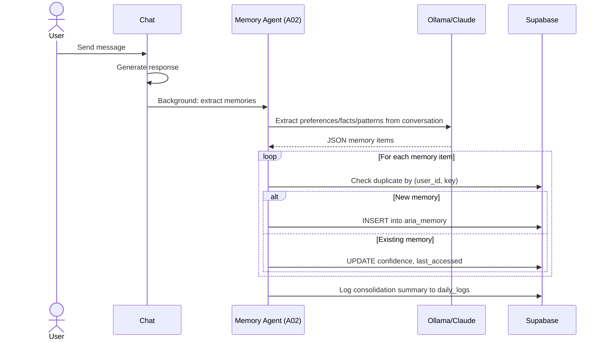

# Memory Agent — Memory Consolidation & Retrieval

## Document Control

| Field | Value |
|---|---|
| **Document ID** | AI-AGT-005 |
| **Version** | 2.0.0 |
| **Status** | Approved |
| **Date** | 2026-07-14 |
| **Classification** | Internal |
| **Owner** | Developer |
| **Review Cycle** | Monthly |
| **Prompt File** | `prompts/agents/memory_agent.md` (821 lines, v2.1.0) |
| **Agent Module** | `packages/ai/agents/memory_agent.py` |
| **Agent ID** | A02 |
| **Related Docs** | [22_MemoryArchitecture.md](22_MemoryArchitecture.md), [LearningAgent.md](LearningAgent.md), [AgentArchitecture.md](../engineering/14_AgentArchitecture.md) |

---

## 1. Overview

The Memory Agent extracts, categorizes, and stores user preferences, facts, patterns, and decisions from conversation history. It runs as a background task during every chat interaction and performs bulk consolidation on a daily schedule. It is the primary pipeline for populating Tier 3 (Semantic) memory and enables ARIA's cross-session personalization.

**Key Features:**
- Real-time extraction during chat (background, non-blocking)
- Batch consolidation daily cron for bulk processing
- 4 memory types: preference, fact, pattern, decision
- Confidence scoring (0.0-1.0) with decay mechanism
- Deduplication with upsert by user_id + key
- Rule-based extraction fallback when LLM unavailable
- Weekly deep consolidation with cross-session pattern detection

---

## 2. Architecture

### Agent Positioning

```mermaid
graph TD
    subgraph Memory Pipeline
        CHAT[Chat Interaction] --> EXTRACT[Real-Time Extraction<br/>Background task]
        EXTRACT --> CLASSIFY[Classify Memory Type<br/>preference | fact | pattern | decision]
        CLASSIFY --> SCORE[Score Importance + Confidence]
        SCORE --> DEDUP{Deduplicate?}
        DEDUP -->|New| STORE[(aria_memory)]
        DEDUP -->|Exists| UPDATE[Update confidence + timestamp]
    end

    subgraph Daily Consolidation
        CRON[Daily Cron] --> LOAD[Load recent chat_messages]
        LOAD --> SUMMARIZE[LLM Summarization]
        SUMMARIZE --> EXTRACT_B[Extract patterns,<br/>preferences, decisions]
        EXTRACT_B --> BULK[Batch upsert to aria_memory]
    end

    subgraph Retrieval
        QUERY[Context Request] --> RETRIEVE[Retrieve by user_id]
        RETRIEVE --> RANK[Rank by importance + recency]
        RANK --> INJECT[Inject into prompt context]
    end

    STORE --> RETRIEVE
    UPDATE --> RETRIEVE

    style CHAT fill:#6366F1,color:#fff
    style EXTRACT fill:#F59E0B,color:#fff
    style STORE fill:#00FFA3,color:#000
    style CRON fill:#818CF8,color:#fff
```

### Data Flow Sequence



---

## 3. Processing Flow

```mermaid
graph TD
    CHAT["Chat Message (user + assistant)"] --> EXTRACT[Extract Entities<br/>NER, Intent, Entities]
    EXTRACT --> CLASSIFY[Classify Memory Type<br/>preference | fact | pattern | decision]
    CLASSIFY --> SCORE[Score Importance<br/>0.0 - 1.0]
    SCORE --> DUPLICATE{Duplicate Check}
    DUPLICATE -->|"New"| STORE[Store in aria_memory]
    DUPLICATE -->|"Exists"| UPDATE[Update confidence + timestamp]
    STORE --> DECAY[Background: Apply decay<br/>to old memories]
    UPDATE --> DONE

    subgraph Batch Consolidation (Daily Cron)
        BATCH[Load Recent Chat Messages] --> EXTRACT_B[Extract & Classify]
        EXTRACT_B --> SCORE_B[Score & Deduplicate]
        SCORE_B --> BULK_STORE[Batch Insert<br/>aria_memory]
    end

    style CHAT fill:#6366F1,color:#fff
    style EXTRACT fill:#F59E0B,color:#fff
    style STORE fill:#00FFA3,color:#000
    style BATCH fill:#13151A,stroke:#818CF8,color:#F1F5F9
```

---

## 4. Input Schema

| Field | Source | Description |
|---|---|---|
| user_id | Auth context | User identifier |
| conversation | chat_messages | Recent message history (last 10-50) |
| existing_memories | aria_memory | User's current memory profile |
| confidence_threshold | Config | Min confidence to store (default: 0.3) |

### Conversation Format

```json
[
  {"role": "user", "content": "I prefer studying in the morning", "timestamp": "..."},
  {"role": "assistant", "content": "Got it! I'll schedule your study sessions before noon.", "timestamp": "..."}
]
```

---

## 5. Output Schema

```json
{
  "memories_created": 3,
  "memories_updated": 1,
  "memories_discarded": 2,
  "new_memories": [
    {
      "type": "preference",
      "category": "study_habit",
      "content": "User prefers morning study sessions before 10 AM",
      "confidence": 0.85,
      "evidence": "Consistent pattern across 5 interactions"
    }
  ],
  "consolidation_summary": "3 new preferences extracted from today's chat"
}
```

### Memory Type Classification Rules

| Type | Trigger | Min Confidence | Examples |
|---|---|---|---|
| **preference** | User states preference | 0.6 | "I like studying in the morning" |
| **fact** | User provides information | 0.8 | "I'm in 3rd year CSE" |
| **pattern** | Observed behavior (3+ occurrences) | 0.5 | "Studies best in 90-min blocks" |
| **decision** | User makes a choice | 0.7 | "I'll use React over Vue" |

---

## 6. Storage Schema

### aria_memory Table

| Column | Type | Description |
|---|---|---|
| id | uuid | PK |
| user_id | uuid | FK -> users(id), NOT NULL |
| key | text | NOT NULL, UNIQUE(user_id, key) |
| value | jsonb | Memory value |
| importance | float | 0.0-1.0, DEFAULT 0.5 |
| category | text | preference, pattern, trait, decision, fact, skill |
| confidence | float | 0.0-1.0, DEFAULT 0.5 |
| source | text | explicit, extracted, inferred, consolidated, event_driven |
| ttl_days | int | NULL = indefinite |
| version | int | DEFAULT 1, incremented on update |
| last_accessed | timestamptz | For decay calculation |
| access_count | int | Number of retrievals |
| tags | jsonb | Faceted search |

### Indexes

```sql
CREATE UNIQUE INDEX idx_aria_memory_user_key ON aria_memory (user_id, key);
CREATE INDEX idx_aria_memory_user_importance ON aria_memory (user_id, importance DESC);
CREATE INDEX idx_aria_memory_category ON aria_memory (user_id, category);
CREATE INDEX idx_aria_memory_last_accessed ON aria_memory (user_id, last_accessed);
```

---

## 7. LLM Configuration

| Parameter | Value | Rationale |
|---|---|---|
| Model | Ollama (Mistral 7B) | Fast, private |
| Temperature | 0.3 | Low for consistent classification |
| Max tokens | 1024 | Concise extraction |
| Fallback model | Claude Sonnet 4 | Cloud backup |

---

## 8. Prompt Usage

```python
from ai.prompt_loader import prompts

entry = prompts.get_agent("memory_agent")
if entry:
    system_prompt = entry.system_prompt
    user_prompt = f"Extract memories from conversation:\n{messages}"
    response = await llm.generate_json(user_prompt, system=system_prompt)
else:
    # Rule-based fallback extraction
    memories = rule_based_extraction(messages)
```

---

## 9. Fallback Behavior

| Failure Mode | Fallback | Data Impact |
|---|---|---|
| LLM unavailable | Rule-based extraction (pattern matching) | Lower quality, higher noise |
| Classification confidence < 0.3 | Discard entry | May miss subtle patterns |
| Duplicate detection fails | Store with dedup key check | Duplicates cleaned in consolidation |
| Batch consolidation fails | Skip cycle, retry next day | Delayed learning |

### Rule-Based Extraction (Fallback)

```python
def rule_based_extraction(messages: list[dict]) -> list[dict]:
    memories = []
    phrases = {
        "preference": ["i like", "i prefer", "i enjoy", "i love"],
        "fact": ["i am", "i have", "i study", "i work"],
        "decision": ["i will", "i'll use", "i choose", "let's use"],
    }
    for msg in messages:
        if msg["role"] != "user":
            continue
        for mem_type, triggers in phrases.items():
            for trigger in triggers:
                if trigger in msg["content"].lower():
                    memories.append({
                        "type": mem_type,
                        "content": msg["content"],
                        "confidence": 0.5,
                    })
                    break
    return memories
```

---

## 10. Failure Modes

| Mode | Handling |
|---|---|
| Empty conversation | Skip, return 0 memories |
| Confidence < 0.3 | Discard, log as low confidence |
| Too many extraction candidates | Limit to top 5 per interaction |
| Database write failure | Log and retry next cycle |
| Memory limit exceeded (1000/user) | Prune oldest, lowest-confidence |
| Circular preference detection | Flag, log for manual review |

---

## 11. Error Handling

```python
async def extract_memories(user_id: str, messages: list[dict]) -> dict:
    try:
        response = await llm.generate_json(user_prompt, system=system_prompt)
        memories = parse_memory_json(response)
    except (LLMProviderUnavailableError, JSONParseError) as e:
        logger.warn(f"LLM extraction failed: {e}, using rule-based fallback")
        memories = rule_based_extraction(messages)

    created = 0
    updated = 0
    for mem in memories[:5]:  # Limit to top 5 per interaction
        if mem.get("confidence", 0) < 0.3:
            continue
        try:
            result = await upsert_memory(user_id, mem)
            if result.get("created"):
                created += 1
            else:
                updated += 1
        except SupabaseError as e:
            logger.error(f"Failed to store memory: {e}")

    return {
        "memories_created": created,
        "memories_updated": updated,
        "memories_discarded": len(memories) - created - updated,
    }
```

---

## 12. Performance Targets

| Operation | Target | Current |
|---|---|---|
| Real-time extraction | < 500ms | ~200ms |
| Batch consolidation (500 messages) | < 30s | ~10s |
| DB writes per consolidation | < 100 | ~20 |
| Memory retrieval p95 | < 100ms | ~30ms |

---

## 13. Related Documents

| Document | Description |
|---|---|
| [prompts/agents/memory_agent.md](../../prompts/agents/memory_agent.md) | Full prompt template (821 lines) |
| [22_MemoryArchitecture.md](22_MemoryArchitecture.md) | Full memory architecture (1927 lines) |
| [AgentArchitecture.md](../engineering/14_AgentArchitecture.md) | Agent system architecture |
| [LearningAgent.md](LearningAgent.md) | Pattern detection companion (A03) |
| [Memory API](../../apps/api/app/api/memory.py) | API endpoint |
| [ContextEngine.md](ContextEngine.md) | Context assembly pipeline |
| [14_AgentArchitecture.md §A02](../engineering/14_AgentArchitecture.md) | Agent registry reference |

---

## Revision History

| Version | Date | Author | Changes |
|---|---|---|---|
| 1.0.0 | 2026-07-10 | Developer | Initial agent documentation |
| 2.0.0 | 2026-07-14 | Developer | Expanded to full enterprise reference. Added architecture diagram, sequence diagram, storage schema with full DDL, indexing strategy, error handling implementation, cross-references to MemoryArchitecture and AgentArchitecture. |
