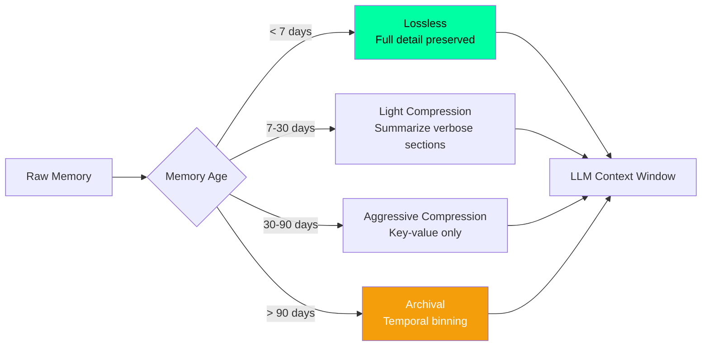

# Memory Compression — Second Brain OS

## Document Control

| Field | Value |
|---|---|
| **Document ID** | AI-MCP-007 |
| **Version** | 1.0.0 |
| **Status** | Approved |
| **Date** | 2026-07-10 |
| **Classification** | Internal |
| **Owner** | Developer |
| **Related Docs** | [LongTermMemory.md](LongTermMemory.md), [MemoryRetrieval.md](MemoryRetrieval.md), [ContextEngine.md](ContextEngine.md) |

---

## 1. Executive Summary

Memory compression reduces the token footprint of stored memories while preserving semantic value. Compression is applied during consolidation (bulk) and context assembly (on-demand). The system balances between lossless (structure preserved) and lossy (key points only) compression based on the use case.

---

## 2. Compression Triggers

| Trigger | Location | Type | Target |
|---|---|---|---|
| Daily consolidation | Backend cron | Bulk compression | All new episodic memories |
| Context assembly | Per-request | On-demand | Memory retrieved for prompt |
| Token budget exceeded | Per-request | Emergency | Truncate lowest-priority memories |
| Weekly deep consolidation | Sunday cron | Deep compression | All memories > 30 days old |

---

## 3. Compression Algorithms

### 3.1 Summarization (Lossy)

```python
async def compress_summary(text: str, max_tokens: int = 200) -> str:
    """Summarize long text to fit within token budget."""
    if len(text.split()) <= max_tokens:
        return text  # No compression needed

    # Use LLM to summarize
    system = "Compress the following text to under {max_tokens} tokens while preserving key facts."
    result = await llm.generate(text, system=system)
    return result
```

### 3.2 Key-Value Extraction (Lossless structured)

```python
def compress_kv(memory: dict) -> dict:
    """Extract key-value pairs from unstructured memory text."""
    return {
        "type": memory["memory_type"],
        "content": memory["content"],
        "confidence": memory["confidence"],
        "created": memory["created_at"].isoformat(),
    }
```

### 3.3 Temporal Binning (Lossy for old memories)

```python
def compress_temporal(memories: list[dict], bin_days: int = 7) -> list[dict]:
    """Group memories into time buckets and summarize each bucket."""
    binned = defaultdict(list)
    for m in memories:
        bucket = m["created_at"].date() // timedelta(days=bin_days)
        binned[bucket].append(m)

    compressed = []
    for bucket, group in binned.items():
        compressed.append({
            "bucket_start": bucket * bin_days,
            "bucket_end": (bucket + 1) * bin_days,
            "count": len(group),
            "types": list(set(m["memory_type"] for m in group)),
            "summary": summarize_memories(group),
        })
    return compressed
```

---

## 4. Compression Ratios

| Method | Ratio | Quality | Use Case |
|---|---|---|---|
| Key-value extraction | 10:1 | Lossless | Memory storage |
| Temporal binning | 5:1 | Low loss | Old episodic archive |
| LLM summarization | 3:1 to 10:1 | Moderate loss | Context assembly |
| Keyword extraction | 20:1 | High loss | Index/search only |
| Truncation (hard cut) | Variable | High loss | Emergency budget |

---

## 5. Lossy vs Lossless Strategy



---

## 6. Implementation

```python
class MemoryCompressor:
    """Compress memories based on age and importance."""

    def compress(self, memory: dict) -> dict:
        age_days = (datetime.now() - memory["created_at"]).days
        confidence = memory.get("confidence", 0.5)

        if age_days < 7 or confidence > 0.9:
            return memory  # Lossless — high value
        elif age_days < 30:
            return self._light_compress(memory)
        elif age_days < 90:
            return self._aggressive_compress(memory)
        else:
            return self._archive_compress(memory)

    def _light_compress(self, memory: dict) -> dict:
        memory["content"] = self._summarize(memory["content"], ratio=0.5)
        return memory

    def _aggressive_compress(self, memory: dict) -> dict:
        return compress_kv(memory)
```

---

## 7. Quality Metrics

| Metric | Target | Measurement |
|---|---|---|
| Compression ratio (episodic) | 5:1 | Avg tokens in / tokens out |
| Compression ratio (semantic) | 3:1 | Avg tokens in / tokens out |
| Information preservation | > 90% | Key fact recall test |
| User-perceived quality | > 80% | A/B test feedback score |

---

## 8. Related Documents

| Document | Description |
|---|---|
| [LongTermMemory.md](LongTermMemory.md) | Long-term memory architecture |
| [MemoryRetrieval.md](MemoryRetrieval.md) | Retrieval across compressed memories |
| [ContextEngine.md](ContextEngine.md) | Context assembly pipeline |
