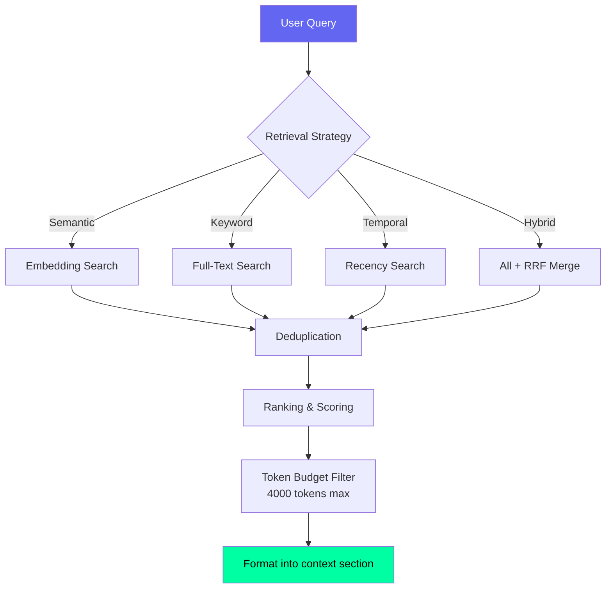

# Memory Retrieval — Second Brain OS

## Document Control

| Field | Value |
|---|---|
| **Document ID** | AI-MRT-008 |
| **Version** | 1.0.0 |
| **Status** | Approved |
| **Date** | 2026-07-10 |
| **Classification** | Internal |
| **Owner** | Developer |
| **Related Docs** | [Embeddings.md](Embeddings.md), [SemanticMemory.md](SemanticMemory.md), [ContextEngine.md](ContextEngine.md), [LongTermMemory.md](LongTermMemory.md) |

---

## 1. Executive Summary

Memory retrieval selects and ranks the most relevant memories for inclusion in the AI prompt context window. The system uses a hybrid retrieval strategy combining semantic (embedding-based), keyword (text search), temporal (recency), and explicit (user_id) signals. Retrieved memories are assembled into a ranked context window of ~4000 tokens.

---

## 2. Retrieval Strategies

### 2.1 Semantic Retrieval

```python
async def semantic_retrieval(query: str, user_id: str, top_k: int = 10) -> list[dict]:
    """Find memories semantically similar to query."""
    query_emb = await generate_embedding(query)
    results = await supabase.table("document_embeddings")\
        .select("*")\
        .eq("user_id", user_id)\
        .order("embedding", desc=True)\
        .limit(top_k)\
        .execute()
    return results.data
```

**Best for:** Open-ended queries, conceptual search, "anything related to X"

### 2.2 Keyword Retrieval

```sql
SELECT * FROM aria_memory
WHERE user_id = 'uuid'
  AND content ILIKE '%keyword%'
ORDER BY confidence DESC
LIMIT 10;
```

**Best for:** Exact match, known entity lookup, specific fact retrieval

### 2.3 Temporal Retrieval

```python
async def temporal_retrieval(user_id: str, lookback_days: int = 7) -> list[dict]:
    """Get most recent memories."""
    results = await supabase.table("aria_memory")\
        .select("*")\
        .eq("user_id", user_id)\
        .gte("created_at", now() - timedelta(days=lookback_days))\
        .order("created_at", desc=True)\
        .limit(10)\
        .execute()
    return results.data
```

**Best for:** Recent context, "what happened recently", current state

### 2.4 Hybrid Retrieval

```python
async def hybrid_retrieval(query: str, user_id: str, top_k: int = 20) -> list[dict]:
    """Combine semantic + keyword + temporal with weighted ranking."""
    semantic = await semantic_retrieval(query, user_id, top_k)
    keyword = await keyword_retrieval(query, user_id, top_k)
    temporal = await temporal_retrieval(user_id, lookback_days=7)

    # Deduplicate and merge with RRF (Reciprocal Rank Fusion)
    combined = rrf_merge([semantic, keyword, temporal], weights=[0.5, 0.3, 0.2])
    return combined[:top_k]
```

---

## 3. Ranking & Scoring

```python
def rank_memories(
    memories: list[dict],
    query: str = "",
    recency_weight: float = 0.3,
    confidence_weight: float = 0.4,
    relevance_weight: float = 0.3,
) -> list[dict]:
    """Rank memories by composite score."""
    for m in memories:
        recency_score = 1.0 / (1 + (now() - m["last_referenced_at"]).days)
        confidence_score = m.get("confidence", 0.5)
        relevance_score = compute_relevance(m["content"], query)

        m["_rank_score"] = (
            recency_score * recency_weight +
            confidence_score * confidence_weight +
            relevance_score * relevance_weight
        )

    return sorted(memories, key=lambda m: m["_rank_score"], reverse=True)
```

---

## 4. Multi-Hop Retrieval

For complex queries requiring multiple retrieval steps:

```python
async def multi_hop_retrieval(query: str, user_id: str, hops: int = 2) -> list[dict]:
    """Iterative retrieval — use initial results to refine query."""
    results = await hybrid_retrieval(query, user_id, top_k=10)

    for hop in range(hops - 1):
        # Extract entities from current results
        entities = extract_entities(results)
        # Build expanded query
        expanded_query = f"{query} {' '.join(entities)}"
        # Re-retrieve
        results = await hybrid_retrieval(expanded_query, user_id, top_k=10)

    return results
```

---

## 5. Context Assembly

Retrieved memories are assembled into the prompt context:



---

## 6. Evaluation Metrics

| Metric | Target | Method |
|---|---|---|
| **Recall@10** | > 0.85 | Relevance judgement on test queries |
| **Precision@10** | > 0.70 | Relevance judgement |
| **Mean Reciprocal Rank (MRR)** | > 0.80 | Position of first relevant result |
| **Latency p95** | < 200ms | Hybrid retrieval timing |
| **Context window utilization** | > 80% | Tokens used / budget |

---

## 7. Performance Optimization

| Technique | Impact | Implementation |
|---|---|---|
| Embedding caching | 50% latency reduction | Cache query embeddings for 1h |
| Result caching | 80% latency reduction for repeated queries | Cache top-20 for 5min |
| HNSW index | 10x faster than brute force | pgvector HNSW index |
| Pre-filtering by user_id | Reduce search space | Composite index on (user_id, embedding) |
| Async parallel retrieval | 3x faster hybrid query | Run semantic + keyword in parallel |

---

## 8. Related Documents

| Document | Description |
|---|---|
| [Embeddings.md](Embeddings.md) | Embedding generation & storage |
| [SemanticMemory.md](SemanticMemory.md) | Semantic memory architecture |
| [ContextEngine.md](ContextEngine.md) | Context assembly pipeline |
| [MemoryCompression.md](MemoryCompression.md) | Compression for retrieval optimization |
