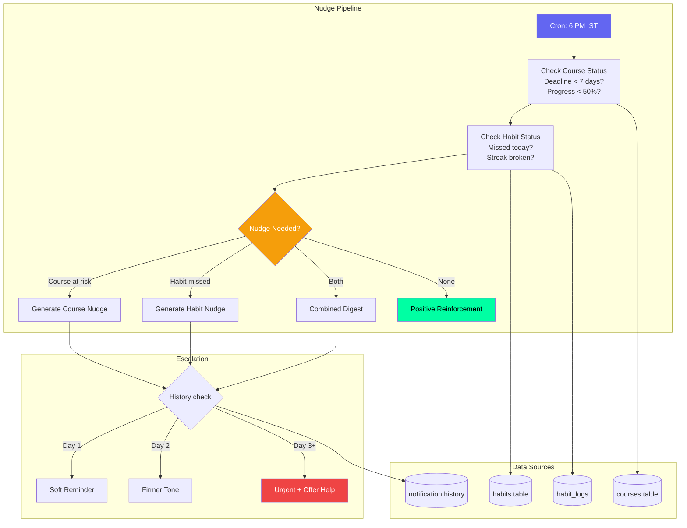
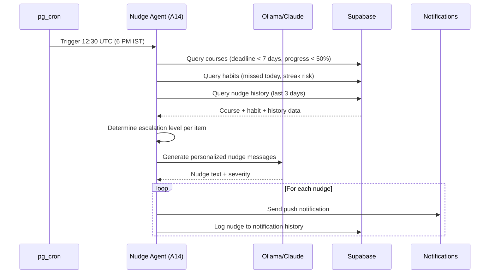

# Nudge Agent — Course & Habit Progress Nudges

## Document Control

| Field | Value |
|---|---|
| **Document ID** | AI-AGT-009 |
| **Version** | 2.0.0 |
| **Status** | Approved |
| **Date** | 2026-07-14 |
| **Classification** | Internal |
| **Owner** | Developer |
| **Review Cycle** | Monthly |
| **Prompt File** | `prompts/agents/nudge_agent.md` (665 lines, v2.1.0) |
| **Agent Module** | `packages/ai/agents/nudge_agent.py` |
| **Agent ID** | A14 |
| **Related Docs** | [SleepAgent.md](SleepAgent.md), [TaskAgent.md](TaskAgent.md), [AgentArchitecture.md](../engineering/14_AgentArchitecture.md), [Courses API](../../apps/api/app/api/courses.py) |

---

## 1. Overview

The Nudge Agent sends timely, personalized nudges to keep the user on track with course deadlines and habit streaks. It runs daily at 6 PM IST, checking for at-risk courses (approaching deadlines, low progress) and habit consistency (missed days, broken streaks). Escalation happens over 3 days if the user doesn't respond.

**Key Features:**
- 3-level escalation system (gentle -> concerned -> urgent)
- Combined course + habit digest when both need attention
- Template-based fallback nudges when LLM unavailable
- Respects user notification preferences (opt-out supported)
- Positive reinforcement when everything is on track

---

## 2. Architecture

### Agent Positioning



### Data Flow Sequence



---

## 3. Processing Flow

```mermaid
graph TD
    TRIGGER["Cron: 6 PM IST daily"] --> CHECK[Check Courses<br/>Deadline < 7 days?<br/>Progress < 50%?]
    CHECK --> CHECK2[Check Habits<br/>Missed today?<br/>Streak broken?]
    CHECK2 --> NUDGE{Needs Nudge?}
    NUDGE -->|"Course at risk"| COURSE[Generate Course Nudge<br/>Deadline urgency<br/>Remaining workload]
    NUDGE -->|"Habit missed"| HABIT[Generate Habit Nudge<br/>Streak context<br/>Gentle reminder]
    NUDGE -->|"Both"| COMBINE[Combine into one digest]
    COURSE --> ESCALATE{Already nudged?}
    HABIT --> ESCALATE
    COMBINE --> ESCALATE
    ESCALATE -->|"Day 1"| SOFT[Soft reminder]
    ESCALATE -->|"Day 2"| FIRM[Firmer tone<br/>"You're falling behind"]
    ESCALATE -->|"Day 3"| URGENT[Urgent + offer help<br/>"Can I help?"]
    SOFT --> PUSH[Push Notification]
    FIRM --> PUSH
    URGENT --> PUSH

    style TRIGGER fill:#6366F1,color:#fff
    style NUDGE fill:#F59E0B,color:#fff
    style URGENT fill:#EF4444,color:#fff
    style PUSH fill:#00FFA3,color:#000
```

---

## 4. Input Schema

| Field | Source | Description |
|---|---|---|
| user_id | Auth | Target user |
| courses | courses table | Active courses with deadlines |
| habits | habits table | Active habits with streaks |
| habit_logs | habit_logs | Today's completion status |
| previous_nudges | notification history | Last 3 days' nudge history |

### Course Risk Detection

```python
async def detect_course_risks(user_id: str) -> list[dict]:
    now = datetime.now()
    week_from_now = now + timedelta(days=7)

    courses = await supabase.table("courses")\
        .select("id, title, progress, deadline, daily_target_minutes")\
        .eq("user_id", user_id)\
        .eq("status", "active")\
        .lte("deadline", week_from_now.isoformat())\
        .execute()

    risks = []
    for course in courses.data:
        days_left = (datetime.fromisoformat(course["deadline"]) - now).days
        min_needed = course.get("daily_target_minutes", 30)
        if course.get("progress", 0) < 50:
            risks.append({
                **course,
                "risk_type": "behind_schedule",
                "days_left": days_left,
                "min_needed": min_needed,
            })
    return risks
```

---

## 5. Output Schema

```json
{
  "nudges": [
    {
      "type": "course",
      "severity": "high",
      "course_title": "Complete React Course",
      "deadline": "2026-07-15",
      "remaining_videos": 12,
      "daily_minutes_needed": 45,
      "message": "Your React course deadline is in 5 days. You need 45min/day to finish."
    }
  ],
  "habit_reminders": [
    {
      "habit_title": "Morning study",
      "missed_days": 2,
      "current_streak": 5,
      "message": "You've missed morning study twice. Let's keep that 5-day streak!"
    }
  ],
  "escalation_level": 1
}
```

---

## 6. Escalation Levels

| Level | Day | Tone | Message Style |
|---|---|---|---|
| 0 | First miss | Gentle | "Don't forget to..." |
| 1 | Day 2 | Concerned | "You're falling behind..." |
| 2 | Day 3+ | Urgent + Help | "Can I help you get back on track?" |

### Escalation Logic

```python
def get_escalation_level(nudge_history: list[dict]) -> int:
    """Determine escalation level based on past nudge history."""
    if not nudge_history:
        return 0
    consecutive_days = 0
    for entry in sorted(nudge_history, key=lambda x: x["date"], reverse=True):
        if entry["action_taken"]:
            break
        consecutive_days += 1
    return min(consecutive_days, 2)  # 0, 1, or 2


def get_escalation_message(level: int, item_name: str, details: str) -> str:
    messages = {
        0: f"Don't forget to {item_name}! {details}",
        1: f"You're falling behind on {item_name}. {details}",
        2: f"Can I help you get back on track with {item_name}? {details}",
    }
    return messages.get(level, messages[0])
```

---

## 7. LLM Configuration

| Parameter | Value |
|---|---|
| Model | Ollama (Mistral 7B) |
| Temperature | 0.5 |
| Max tokens | 1024 |
| Fallback | Template-based nudge messages |

---

## 8. Fallback Behavior

| Failure | Fallback |
|---|---|
| LLM unavailable | Template nudges by severity level |
| No courses/habits active | Skip, no nudge sent |
| Notification fails | Log, user sees on next app open |

### Template Nudge Fallback

```python
def generate_template_nudge(item: dict, escalation: int) -> dict:
    templates = {
        "course": [
            "Time for {title}! Only {days_left} days until your deadline.",
            "Your {title} course needs attention. {min_per_day}min/day to finish on time.",
            "Can I help you with {title}? The deadline is approaching.",
        ],
        "habit": [
            "Don't forget to {habit_name} today!",
            "You've missed {habit_name} {missed_days} times. Let's get back on track!",
            "Your {habit_name} streak is at risk. Want to do it now?",
        ],
    }
    template = templates[item["type"]][min(escalation, 2)]
    return {"message": template.format(**item), "template": True}
```

---

## 9. Failure Modes

| Mode | Handling |
|---|---|
| Course already completed | Skip nudge, archive alert |
| Habit already completed today | Mark as satisfied, no nudge |
| User disabled nudges | Respect notification preferences |
| All courses/habits on track | Send positive reinforcement instead |

---

## 10. Error Handling

```python
async def send_nudges(user_id: str) -> dict:
    nudges = []

    try:
        course_risks = await detect_course_risks(user_id)
        habit_risks = await detect_habit_risks(user_id)
    except SupabaseError as e:
        logger.error(f"Risk detection failed: {e}")
        return {"nudges": [], "error": str(e)}

    for risk in course_risks + habit_risks:
        escalation = get_escalation_level(risk.get("history", []))
        try:
            message = await llm.generate_json(nudge_prompt, system=system_prompt)
        except LLMProviderUnavailableError:
            message = generate_template_nudge(risk, escalation)

        nudges.append({
            **risk,
            "message": message,
            "escalation_level": escalation,
        })

    return {"nudges": nudges, "escalation_level": max(n["escalation_level"] for n in nudges) if nudges else 0}
```

---

## 11. Performance Targets

| Operation | Target |
|---|---|
| Course/habit risk detection | < 300ms |
| LLM nudge generation | < 3s |
| Total pipeline | < 5s |

---

## 12. Related Documents

| Document | Description |
|---|---|
| [prompts/agents/nudge_agent.md](../../prompts/agents/nudge_agent.md) | Full prompt template (665 lines) |
| [SleepAgent.md](SleepAgent.md) | Related bedtime nudge (A13) |
| [AgentArchitecture.md](../engineering/14_AgentArchitecture.md) | Agent system architecture |
| [Courses API](../../apps/api/app/api/courses.py) | Courses endpoint |
| [Notifications API](../../apps/api/app/api/notifications.py) | Notification endpoint |
| [14_AgentArchitecture.md §A14](../engineering/14_AgentArchitecture.md) | Agent registry reference |

---

## Revision History

| Version | Date | Author | Changes |
|---|---|---|---|
| 1.0.0 | 2026-07-10 | Developer | Initial agent documentation |
| 2.0.0 | 2026-07-14 | Developer | Expanded to full enterprise reference. Added architecture diagram, sequence diagram, course risk detection implementation, escalation logic implementation, template nudge fallback, error handling code, and cross-references. |
