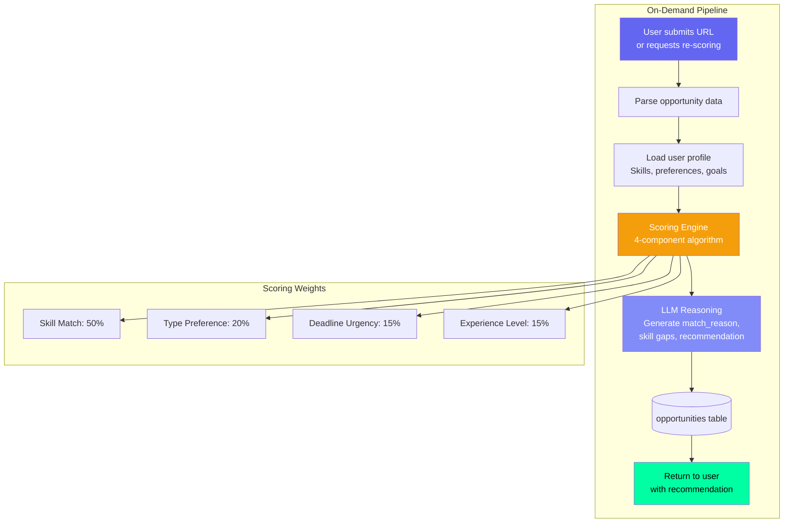
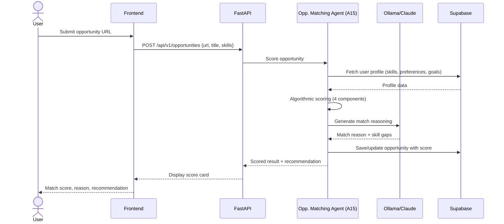
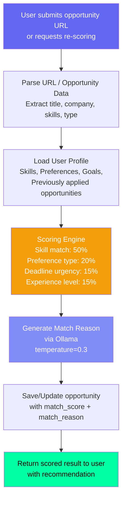

# Opportunity Matching Agent — On-Demand Scoring Engine

## Document Control

| Field | Value |
|---|---|
| **Document ID** | AI-AGT-004 |
| **Version** | 2.0.0 |
| **Status** | Approved |
| **Date** | 2026-07-14 |
| **Classification** | Internal |
| **Owner** | Developer |
| **Review Cycle** | Monthly |
| **Prompt File** | `prompts/agents/opportunity_matching_agent.md` (210 lines, v1.0.0) |
| **Agent Module** | `packages/ai/agents/opportunity_matching_agent.py` |
| **Agent ID** | A15 |
| **Related Docs** | [OpportunityRadarAgent.md](OpportunityRadarAgent.md), [AgentArchitecture.md](../engineering/14_AgentArchitecture.md) |

---

## 1. Overview

The Opportunity Matching Agent provides on-demand opportunity scoring when the user manually submits an opportunity URL or requests re-scoring of existing opportunities. Unlike the cron-based radar agent (which batch-processes), this agent executes immediately with the user's current context and returns a scored recommendation with reasoning.

**Key Features:**
- On-demand execution with < 4s total response time
- 4-component scoring algorithm (skill, type, urgency, experience)
- LLM-generated natural language match reasoning
- Skill gap identification
- Goal alignment bonus scoring
- Duplicate URL detection (re-scoring with current profile)

---

## 2. Architecture

### Agent Positioning



### Data Flow Sequence



---

## 3. Processing Flow



---

## 4. Input Schema

| Field | Required | Source | Description |
|---|---|---|---|
| user_id | Yes | Auth | Target user |
| url | Yes | User input | Opportunity URL |
| title | Yes | Parsed/User | Opportunity title |
| company | No | Parsed | Organization/company name |
| skills_required | Yes | Parsed/User | Required skills as array |
| deadline | No | Parsed | Application deadline date |
| type | Yes | Parsed/User | One of: internship, hackathon, open_source, fellowship, freelance, competition, scholarship, course |

### User Profile Loaded

| Field | Source | Used For |
|---|---|---|
| user_skills | users_profile.skills | Skill overlap |
| opportunity_preferences | users_profile.opportunity_preferences | Type/domain matching |
| past_applications | opportunities table (status=applied) | Avoid duplicate recommendations |
| active_goals | goals table (status=active) | Goal alignment bonus |

---

## 5. Output Schema

```json
{
  "match_score": 87,
  "score_breakdown": {
    "skill_match": 42,
    "type_preference": 18,
    "deadline_urgency": 15,
    "experience_level": 12
  },
  "match_reason": "Your Python (advanced) and React (intermediate) skills are strong matches...",
  "skill_gaps": ["TensorFlow", "Docker"],
  "deadline_status": "2 weeks remaining",
  "deadline_days": 14,
  "goal_alignment": ["Full-stack developer goal"],
  "recommendation": "apply",
  "recommendation_confidence": "high"
}
```

### Recommendation Values

| Score Range | Recommendation | Display Color |
|---|---|---|
| 80-100 | apply | Green (#00FFA3) |
| 60-79 | consider | Yellow (#F59E0B) |
| 40-59 | maybe | Orange |
| 0-39 | skip | Gray |

---

## 6. Scoring Algorithm

```python
def calculate_match_score(opportunity: dict, profile: dict) -> int:
    """
    Calculate opportunity match score (0-100).

    Components:
    1. Skill overlap (50%) - weighted by skill level
    2. Type preference (20%) - user's preferred opportunity types
    3. Deadline urgency (15%) - closer deadlines score higher
    4. Experience level (15%) - user's average skill level
    """
    # Component 1: Skill overlap (50%)
    skill_score = skill_overlap_weighted(
        opportunity["skills_required"],
        profile["skills"],
        level_weight=True
    )

    # Component 2: Type preference (20%)
    type_prefs = profile.get("opportunity_preferences", {})
    preferred_types = type_prefs.get("types", [])
    type_score = 100 if opportunity["type"] in preferred_types else 50

    # Component 3: Deadline urgency (15%)
    if opportunity.get("deadline"):
        days_left = (opportunity["deadline"] - datetime.now()).days
        urgency_score = min(100, max(0, (30 - days_left) * 3.3))
    else:
        urgency_score = 50

    # Component 4: Experience level (15%)
    avg_user_level = average_level(profile["skills"])
    exp_score = min(100, avg_user_level * 25)

    return int(
        skill_score * 0.5 +
        type_score * 0.2 +
        urgency_score * 0.15 +
        exp_score * 0.15
    )


def skill_overlap_weighted(
    required: list[str],
    user_skills: list[dict],
    level_weight: bool = True
) -> float:
    """
    Calculate skill overlap with optional level weighting.
    Returns 0-100 score.
    """
    if not required:
        return 50  # Neutral score when no skills listed

    user_map = {s["name"].lower(): s.get("level", 1) for s in user_skills}
    total_weight = 0
    matched_weight = 0

    for skill in required:
        weight = 1
        if level_weight and skill.lower() in user_map:
            # Higher level = higher weight
            weight = user_map[skill.lower()] / 5.0  # Normalize to 0.2-1.0
        total_weight += weight
        if skill.lower() in user_map:
            matched_weight += weight

    return (matched_weight / total_weight) * 100 if total_weight > 0 else 50
```

---

## 7. LLM Configuration

| Parameter | Value | Rationale |
|---|---|---|
| Model | Ollama (Mistral 7B) | Fast, on-demand |
| Temperature | 0.3 | Low for consistent reasoning |
| Max tokens | 1024 | Concise match reasoning |
| Fallback model | Claude Sonnet 4 | Cloud backup |

---

## 8. Prompt Usage

```python
from ai.prompt_loader import prompts

entry = prompts.get_agent("opportunity_matching_agent")
if entry:
    system = entry.system_prompt
    user = f"Score this opportunity:\n{opportunity}\nUser profile:\n{profile}"
    result = await llm.generate_json(user, system=system)
else:
    result = {"match_score": calculate_match_score(opportunity, profile)}
```

---

## 9. Fallback Behavior

| Failure Mode | Fallback | Result |
|---|---|---|
| LLM unavailable | Pure algorithmic scoring | Same score, no reasoning text |
| LLM timeout | Algorithmic score only | Reduced quality (missing reason) |
| Input parsing fails | Return 400 error | Ask user for clearer input |
| Missing required skills | Default to 50% skill score | Conservative estimate |
| Profile incomplete | Set missing fields to neutral (50) | Lower confidence |

### Algorithmic Fallback

```python
async def score_without_llm(opportunity: dict, profile: dict) -> dict:
    """Generate score card without LLM enrichment."""
    score = calculate_match_score(opportunity, profile)
    return {
        "match_score": score,
        "score_breakdown": calculate_breakdown(opportunity, profile),
        "match_reason": f"Algorithmic score: {score}/100 based on skill overlap.",
        "skill_gaps": find_skill_gaps(opportunity["skills_required"], profile["skills"]),
        "recommendation": get_recommendation(score),
        "recommendation_confidence": "medium",
    }
```

---

## 10. Failure Modes

| Mode | Handling |
|---|---|
| Missing skills in user profile | Default to 50% skill score, note in log |
| Invalid URL format | Parse error, return error with guidance |
| Duplicate match request (same URL) | Re-score with current profile, update existing |
| Deadline already passed | Score = 0, recommendation = "deadline_passed" |
| Skills list empty | All skills = 50%, recommendation = "consider" |
| User has no goals | Goal alignment = 0, omit from output |

### Recovery Strategy

| Issue | Action |
|---|---|
| External API for scraping fails | Prompt user to enter details manually |
| Profile load fails (Supabase down) | Return error, retry with backoff |
| Score calculation overflow | Clamp to 0-100 range |

---

## 11. Performance Targets

| Operation | Target |
|---|---|
| Profile loading | < 100ms |
| Algorithmic scoring | < 50ms |
| LLM reasoning generation | < 3s |
| Total response (user-facing) | < 4s |

---

## 12. Related Documents

| Document | Description |
|---|---|
| [prompts/agents/opportunity_matching_agent.md](../../prompts/agents/opportunity_matching_agent.md) | Scoring prompt (210 lines) |
| [OpportunityRadarAgent.md](OpportunityRadarAgent.md) | Cron-based batch matching (A06) |
| [AgentArchitecture.md](../engineering/14_AgentArchitecture.md) | Agent system architecture |
| [Opportunities API](../../apps/api/app/api/opportunities.py) | API endpoint |
| [14_AgentArchitecture.md §A15](../engineering/14_AgentArchitecture.md) | Agent registry reference |

---

## Revision History

| Version | Date | Author | Changes |
|---|---|---|---|
| 1.0.0 | 2026-07-10 | Developer | Initial agent documentation |
| 2.0.0 | 2026-07-14 | Developer | Expanded to full enterprise reference. Added architecture diagram, sequence diagram, complete 4-component scoring algorithm implementation with skill_overlap_weighted helper, algorithmic fallback implementation, error handling patterns, and cross-references. |
