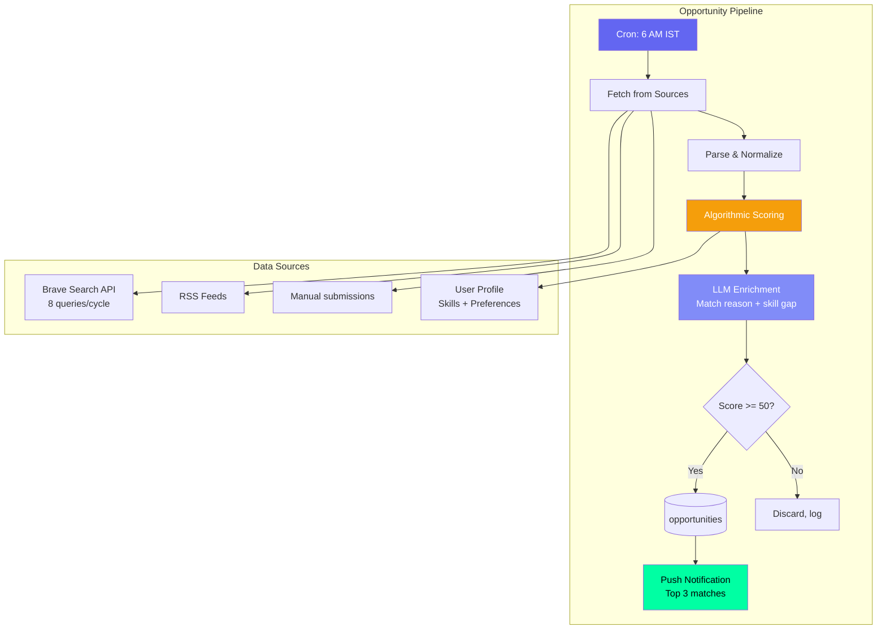
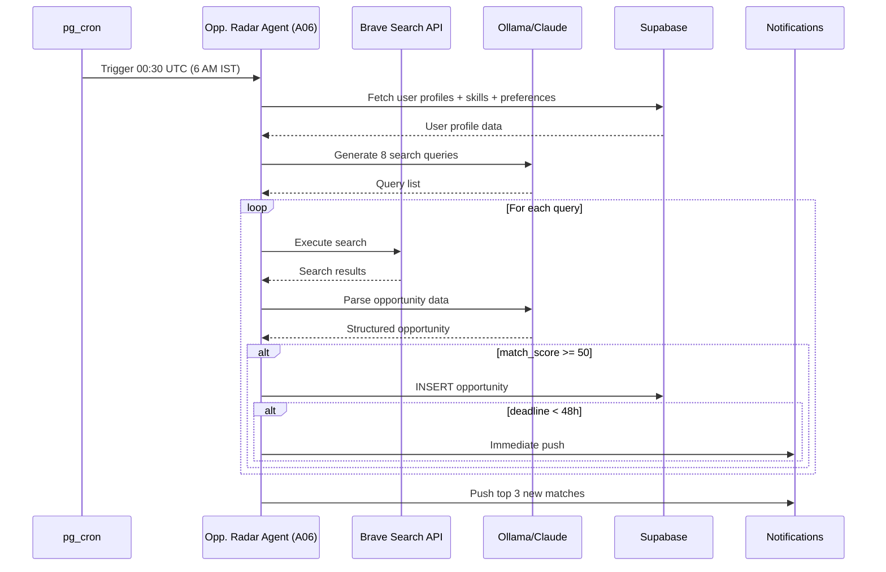
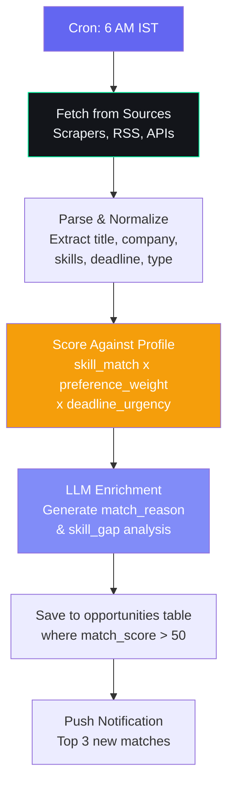

# Opportunity Radar Agent — Daily Matching

## Document Control

| Field | Value |
|---|---|
| **Document ID** | AI-AGT-003 |
| **Version** | 2.0.0 |
| **Status** | Approved |
| **Date** | 2026-07-14 |
| **Classification** | Internal |
| **Owner** | Developer |
| **Review Cycle** | Monthly |
| **Prompt File** | `prompts/agents/opportunity_radar_agent.md` (822 lines, v2.1.0) |
| **Agent Module** | `packages/ai/agents/opportunity_agent.py` |
| **Agent ID** | A06 |
| **Related Docs** | [OpportunityMatchingAgent.md](OpportunityMatchingAgent.md), [AgentArchitecture.md](../engineering/14_AgentArchitecture.md), [API Reference](../engineering/17_API.md) |

---

## 1. Overview

The Opportunity Radar Agent scans external opportunity sources daily at 6 AM IST, matches them against the user's skill profile and preferences, and surfaces the most relevant internships, hackathons, fellowships, and scholarships. The agent uses a category-based matching algorithm with AI scoring enhancement.

**Key Features:**
- 8 curated Brave Search queries per cycle for comprehensive coverage
- Skill overlap scoring with user profile matching
- LLM enrichment for match reasoning and skill gap analysis
- 3-tier notification (normal, urgent for < 48h deadlines)
- Deduplication by URL + title

---

## 2. Architecture

### Agent Positioning



### Data Flow Sequence



---

## 3. Processing Flow



---

## 4. Input Schema

| Field | Source | Description |
|---|---|---|
| user_id | Auth | Target user |
| skills | users_profile.skills | [{name, level}] |
| preferences | users_profile.opportunity_preferences | {types, min_score, excluded} |
| raw_opportunities | External sources | Scraped/fetched listings |
| existing_ids | opportunities table | Avoid duplicates |

### Search Query Generation

The LLM generates 8 query strings based on the user's skill profile:

```python
QUERY_CATEGORIES = [
    "internship", "hackathon", "fellowship", "scholarship",
    "open_source", "freelance", "competition", "course"
]

async def generate_search_queries(profile: dict) -> list[str]:
    skills = ", ".join(s["name"] for s in profile.get("skills", []))
    queries = []
    for category in QUERY_CATEGORIES:
        queries.append(f"{skills} {category} 2026")
    return queries
```

---

## 5. Output Schema

```json
{
  "opportunities": [
    {
      "title": "GSoC 2026 - TensorFlow",
      "company": "Google",
      "url": "https://...",
      "type": "open_source",
      "skills_required": ["Python", "ML", "TensorFlow"],
      "deadline": "2026-04-15",
      "match_score": 92,
      "match_reason": "Your Python and ML experience aligns..."
    }
  ],
  "new_count": 5,
  "top_pick": "GSoC 2026 - TensorFlow"
}
```

---

## 6. Matching Algorithm

```python
def calculate_match_score(opportunity: dict, profile: dict) -> int:
    """Calculate opportunity match score (0-100)."""
    skill_score = skill_overlap(opportunity["skills"], profile["skills"])
    type_weight = type_preference(opportunity["type"], profile["preferences"])
    deadline_urgency = urgency_score(opportunity["deadline"])
    base_score = (skill_score * 0.5 + type_weight * 0.3 + deadline_urgency * 0.2)
    return min(int(base_score * 100), 100)


def skill_overlap(required: list[str], user_skills: list[dict]) -> float:
    """Calculate skill overlap ratio (0.0-1.0)."""
    if not required:
        return 0.5
    user_skill_names = {s["name"].lower() for s in user_skills}
    matches = sum(1 for r in required if r.lower() in user_skill_names)
    return matches / len(required)


def urgency_score(deadline: str | None) -> float:
    """Calculate deadline urgency (0.0-1.0)."""
    if not deadline:
        return 0.5
    days_left = (datetime.fromisoformat(deadline) - datetime.now()).days
    if days_left < 0:
        return 0.0
    return min(1.0, max(0.0, 1.0 - (days_left / 90)))
```

---

## 7. LLM Configuration

| Parameter | Value |
|---|---|
| Model | Ollama (Mistral 7B) |
| Temperature | 0.3 (low for consistent scoring) |
| Max tokens | 2048 |
| Fallback | Algorithmic scoring only |

---

## 8. Fallback Behavior

| Failure | Fallback |
|---|---|
| LLM unavailable | Algorithmic scoring (no enrichment) |
| Source fetch fails | Skip source, log error |
| No new opportunities | Return empty list |
| All match scores < 50 | Return empty, log "no matches" |

### Algorithmic Scoring Fallback

```python
def algorithmic_scoring_fallback(raw_opportunities: list, profile: dict) -> list:
    """Pure algorithmic scoring when LLM enrichment fails."""
    scored = []
    for opp in raw_opportunities:
        score = calculate_match_score(opp, profile)
        if score >= 50:
            opp["match_score"] = score
            opp["match_reason"] = f"Skill match: {score}%"
            scored.append(opp)
    scored.sort(key=lambda x: x["match_score"], reverse=True)
    return scored[:10]
```

---

## 9. Failure Modes

| Mode | Handling |
|---|---|
| Scraper rate limited | Exponential backoff, skip cycle |
| Duplicate opportunity | Dedup by URL + title |
| Missing skills data | Default to 50 match score |
| Network error (source down) | Retry next cycle |
| Brave Search API limit (50/day) | Prioritize by user preference order |
| No opportunities found for 7+ days | Send "widening search" notification |

---

## 10. Error Handling

```python
async def run_opportunity_scan(user_id: str) -> dict:
    profile = await get_user_profile(user_id)

    try:
        queries = await generate_search_queries(profile)
    except LLMProviderUnavailableError:
        queries = [f"{cat} internship 2026" for cat in QUERY_CATEGORIES]

    opportunities = []
    for query in queries:
        try:
            results = await brave_search.search(query)
            parsed = await parse_opportunities(results, profile)
            opportunities.extend(parsed)
        except (BraveSearchError, TimeoutError) as e:
            logger.error(f"Search failed for query '{query}': {e}")
            continue

    scored = algorithmic_scoring_fallback(opportunities, profile)
    saved = await save_new_opportunities(user_id, scored)
    return {"new_count": len(saved), "top_pick": saved[0] if saved else None}
```

---

## 11. Performance Targets

| Operation | Target |
|---|---|
| Search query generation (LLM) | < 3s |
| Brave Search API calls (8 queries) | < 10s |
| Algorithmic scoring | < 200ms |
| LLM enrichment per opportunity | < 2s |
| Total pipeline | < 30s |

---

## 12. Related Documents

| Document | Description |
|---|---|
| [prompts/agents/opportunity_radar_agent.md](../../prompts/agents/opportunity_radar_agent.md) | Full prompt (822 lines) |
| [OpportunityMatchingAgent.md](OpportunityMatchingAgent.md) | On-demand scoring engine (A15) |
| [AgentArchitecture.md](../engineering/14_AgentArchitecture.md) | Agent system architecture |
| [Opportunities API](../../apps/api/app/api/opportunities.py) | API endpoint |
| [14_AgentArchitecture.md §A06](../engineering/14_AgentArchitecture.md) | Agent registry reference |

---

## Revision History

| Version | Date | Author | Changes |
|---|---|---|---|
| 1.0.0 | 2026-07-10 | Developer | Initial agent documentation |
| 2.0.0 | 2026-07-14 | Developer | Expanded to full enterprise reference. Added architecture diagram, sequence diagram, search query generation code, algorithmic scoring fallback implementation, complete matching algorithm with skill_overlap and urgency_score functions, error handling code, and cross-references. |
