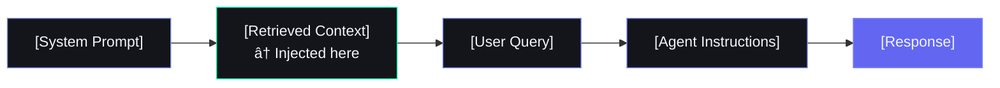

# RAG Architecture — Enterprise Reference

---

## Document Control

| Metadata | Value |
|----------|-------|
| **Document ID** | AI-RAG-001 |
| **Version** | 1.0.0 |
| **Status** | APPROVED |
| **Classification** | INTERNAL — Engineering |
| **Last Updated** | 2026-06-11 |
| **Owner** | AI Architecture Team |
| **Review Cycle** | Quarterly |
| **Next Review** | 2026-09-11 |

---

## Executive Summary

### Why RAG Matters for Second Brain OS

Second Brain OS stores the user's entire digital life — tasks, courses, habits, ideas, sleep data, chat history, and learned patterns. While structured queries (SQL/Supabase) satisfy most deterministic lookups, the AI agents need semantic understanding of this data to produce intelligent responses. Retrieval-Augmented Generation (RAG) bridges the gap between structured storage and semantic reasoning.

The RAG pipeline enables:

1. **Semantic search**: Find relevant tasks or notes by meaning, not just keywords
2. **Cross-table reasoning**: Connect a sleep pattern to task productivity without explicit foreign key relationships
3. **Long-term memory recall**: Retrieve past decisions, preferences, and patterns without overflowing the context window
4. **Context-enhanced generation**: Inject semantically relevant documents into prompts to reduce hallucination

### Key Design Decisions

| Decision | Choice | Rationale |
|----------|--------|-----------|
| **Vector store** | Supabase pgvector (primary) + local ChromaDB (fallback) | pgvector leverages existing Supabase infrastructure with RLS; ChromaDB provides zero-dependency local operation |
| **Embedding models** | Ollama nomic-embed-text (local, 768d) + OpenAI text-embedding-3-small (cloud, 1536d) | Local first for cost/speed; OpenAI fallback when higher accuracy needed |
| **Chunking strategy** | Hybrid: semantic boundaries with fixed-size overlap windows | Semantic boundaries preserve document structure; overlap windows prevent context fragmentation |
| **Retrieval strategy** | Hybrid search: dense (vector similarity) + sparse (BM25) with reciprocal rank fusion | Combines semantic understanding with exact keyword matching; RRF ensures balanced results |
| **Re-ranking** | Cross-encoder model on top 20 results | Lightweight re-ranker (ms-marco-MiniLM) corrects initial retrieval errors |
| **Context injection** | Positioned before system instructions in agent prompt | Ensures retrieved context is treated as authoritative ground truth |

### Architecture Principles

1. **Local-first, cloud-fallback**: All embedding and retrieval works offline with Ollama; cloud services augment, never replace
2. **Tenant-isolated vectors**: Every embedding is scoped by `user_id`; no cross-user leakage even at the vector level
3. **Graceful degradation**: If vector search is unavailable, fall back to BM25 full-text search, then to keyword matching
4. **Observable retrieval**: Every retrieval logs latency, relevance scores, sources, and which documents were injected
5. **Budgeted injection**: Retrieved context must fit within the per-agent token budget; relevance thresholding prevents noise

---

## RAG Pipeline Overview

```mermaid
flowchart LR
    Input["INPUT<br/>(User Query / Agent Task)"]
    QueryProc["QUERY PROCESSOR<br/>(Expand + Classify)"]
    Retrieval["RETRIEVAL STRATEGIES<br/>(Dense + Sparse)"]
    Rerank["RE-RANKING<br/>(Cross-encoder Top 5-10)"]
    VecSearch["VECTOR SEARCH<br/>(pgvector / ChromaDB)"]
    BM25["BM25 FULL-TEXT<br/>(Supabase Text Search)"]
    Fusion["FUSION<br/>(Reciprocal Rank)"]
    Scoring["RELEVANCE SCORING + FILTERING<br/>(Threshold)"]
    Gen["GENERATION<br/>(Ollama / Claude LLM)"]
    Context["CONTEXT INJECTION<br/>(Token Budgeted)"]
    PromptAsm["PROMPT ASSEMBLER<br/>(Per-Agent Format)"]
    Output["OUTPUT<br/>(Response with cited sources + confidence scores)"]

    Input --> QueryProc
    QueryProc --> Retrieval
    Retrieval --> VecSearch
    Retrieval --> BM25
    VecSearch --> Fusion
    BM25 --> Fusion
    Fusion --> Rerank
    Rerank --> Scoring
    Scoring --> Context
    Context --> PromptAsm
    PromptAsm --> Gen
    Gen --> Output

    style Input fill:#13151A,stroke:#6366F1,color:#F1F5F9
    style QueryProc fill:#13151A,stroke:#818CF8,color:#F1F5F9
    style Retrieval fill:#13151A,stroke:#00FFA3,color:#F1F5F9
    style Rerank fill:#13151A,stroke:#F59E0B,color:#F1F5F9
    style VecSearch fill:#13151A,stroke:#818CF8,color:#F1F5F9
    style BM25 fill:#13151A,stroke:#818CF8,color:#F1F5F9
    style Fusion fill:#13151A,stroke:#00FFA3,color:#F1F5F9
    style Scoring fill:#13151A,stroke:#F59E0B,color:#F1F5F9
    style Context fill:#13151A,stroke:#00FFA3,color:#F1F5F9
    style PromptAsm fill:#13151A,stroke:#818CF8,color:#F1F5F9
    style Gen fill:#13151A,stroke:#6366F1,color:#F1F5F9
    style Output fill:#6366F1,stroke:#818CF8,color:#F1F5F9
```



---

## Vector Storage

### Storage Backend Comparison

| Feature | Supabase pgvector | ChromaDB (local) |
|---|---|---|
| **Type** | PostgreSQL extension | Embedded vector database |
| **Deployment** | Managed (Supabase project) | Local filesystem (chroma_db/) |
| **Dimensions** | 768d (Ollama), 1536d (OpenAI) | Any |
| **Index type** | IVFFlat, HNSW | HNSW (default) |
| **Query language** | SQL + `<=>` operator | Python API |
| **RLS support** | ✅ Inherits Supabase RLS | ❌ Must implement in application |
| **Backup** | Automatic (Supabase backups) | Manual filesystem backup |
| **Cost** | Included in Supabase plan | Free |
| **Offline** | Requires network | ✅ Fully offline |
| **Max vectors** | Unlimited (pay for storage) | Limited by disk |
| **Primary use** | Production, tenant-aware queries | Development, offline fallback |

### Schema Design

```sql
-- Extension
CREATE EXTENSION IF NOT EXISTS vector;

-- Embeddedocuments table
CREATE TABLE documents (
    id UUID PRIMARY KEY DEFAULT gen_random_uuid(),
    user_id UUID NOT NULL REFERENCES users(id) ON DELETE CASCADE,
    source_table VARCHAR(64) NOT NULL,       -- e.g., 'tasks', 'chat_messages', 'memory'
    source_id VARCHAR(255) NOT NULL,          -- original row ID
    chunk_index INTEGER NOT NULL DEFAULT 0,   -- position within parent document
    content TEXT NOT NULL,                     -- chunk text
    metadata JSONB DEFAULT '{}',               -- source context: title, date, priority, etc.
    embedding VECTOR(768),                     -- Ollama nomic-embed-text: 768d
    embedding_openai VECTOR(1536),             -- OpenAI text-embedding-3-small: 1536d
    token_count INTEGER DEFAULT 0,
    chunk_hash VARCHAR(64),                   -- deduplication hash
    created_at TIMESTAMPTZ DEFAULT NOW(),
    updated_at TIMESTAMPTZ DEFAULT NOW(),

    UNIQUE(user_id, source_table, source_id, chunk_index)
);

-- Indexes
CREATE INDEX idx_documents_user_id ON documents(user_id);
CREATE INDEX idx_documents_source ON documents(user_id, source_table);
CREATE INDEX idx_documents_hash ON documents(user_id, chunk_hash);

-- Vector indexes (one per embedding dimension)
CREATE INDEX idx_documents_embedding_ivf
    ON documents
    USING ivfflat (embedding vector_cosine_ops)
    WITH (lists = 100);

CREATE INDEX idx_documents_embedding_openai_ivf
    ON documents
    USING ivfflat (embedding_openai vector_cosine_ops)
    WITH (lists = 100);

-- Full-text search index for BM25 fallback
CREATE INDEX idx_documents_content_fts
    ON documents
    USING gin(to_tsvector('english', content));

-- RLS
ALTER TABLE documents ENABLE ROW LEVEL SECURITY;
CREATE POLICY user_isolation ON documents
    FOR ALL USING (user_id = auth.uid())
    WITH CHECK (user_id = auth.uid());
```

### ChromaDB Fallback Configuration

```python
import chromadb
from chromadb.config import Settings

class VectorStoreFactory:
    @staticmethod
    def get_store(use_local: bool = True):
        """Returns appropriate vector store based on configuration."""
        if use_local:
            return ChromaDBStore(
                path="data/chroma_db",
                collection_name="second_brain_docs"
            )
        return PgVectorStore()

class ChromaDBStore:
    def __init__(self, path: str, collection_name: str):
        self.client = chromadb.PersistentClient(
            path=path,
            settings=Settings(anonymized_telemetry=False)
        )
        self.collection = self.client.get_or_create_collection(
            name=collection_name,
            metadata={"hnsw:space": "cosine"}
        )

    async def add_embeddings(
        self,
        ids: list[str],
        embeddings: list[list[float]],
        documents: list[str],
        metadatas: list[dict],
        user_id: str
    ):
        """Store embeddings with user_id in metadata for filtering."""
        for m in metadatas:
            m["user_id"] = user_id
        self.collection.add(
            ids=ids,
            embeddings=embeddings,
            documents=documents,
            metadatas=metadatas,
        )

    async def search(
        self,
        query_embedding: list[float],
        user_id: str,
        n_results: int = 10
    ) -> list[dict]:
        results = self.collection.query(
            query_embeddings=[query_embedding],
            n_results=n_results,
            where={"user_id": user_id},
        )
        return [
            {
                "id": results["ids"][0][i],
                "content": results["documents"][0][i],
                "metadata": results["metadatas"][0][i],
                "distance": results["distances"][0][i],
            }
            for i in range(len(results["ids"][0]))
        ]
```

---

## Embedding Models

### Model Specification

| Property | Ollama nomic-embed-text | OpenAI text-embedding-3-small |
|---|---|---|
| **Dimensions** | 768 | 1536 |
| **Max tokens** | 8192 | 8191 |
| **Cost** | Free (local) | ~$0.00002/1K tokens (input) |
| **Latency (P50)** | ~15ms (local GPU) | ~200ms (API) |
| **Latency (P95)** | ~50ms | ~500ms |
| **Quality (MTEB)** | 62.3 | 62.3 (matches ada-002) |
| **Languages** | English + multilingual | English + 100+ languages |
| **Model size** | ~300MB | N/A (server-side) |
| **Offline capable** | ✅ Yes | ❌ No |
| **Batching** | ✅ Yes (up to 32) | ✅ Yes (up to 2048) |

### Embedding Client Implementation

```python
import asyncio
from typing import Optional
import httpx
import numpy as np
from config.core.config import settings

class EmbeddingClient:
    """Dual-mode embedding client: Ollama local or OpenAI cloud."""

    def __init__(self):
        self.ollama_base = settings.ollama_base_url
        self.openai_key = settings.openai_api_key if hasattr(settings, 'openai_api_key') else None
        self.use_local = settings.use_local_ai
        self.cache: dict[str, list[float]] = {}
        self.cache_hits = 0
        self.cache_misses = 0

    async def embed(self, text: str, model: Optional[str] = None) -> list[float]:
        """Generate embedding for a single text string."""
        # Check cache
        cache_key = f"{text[:100]}:{model or 'default'}"
        if cache_key in self.cache:
            self.cache_hits += 1
            return self.cache[cache_key]

        self.cache_misses += 1
        if self.use_local:
            embedding = await self._ollama_embed(text, model or "nomic-embed-text")
        elif self.openai_key:
            embedding = await self._openai_embed(text, model or "text-embedding-3-small")
        else:
            embedding = await self._ollama_embed(text, "nomic-embed-text")

        # Cache (limit to 1000 entries)
        if len(self.cache) < 1000:
            self.cache[cache_key] = embedding
        return embedding

    async def embed_batch(
        self, texts: list[str], model: Optional[str] = None
    ) -> list[list[float]]:
        """Batch embed multiple texts (preferred for indexing)."""
        if not texts:
            return []
        if self.use_local:
            return await self._ollama_embed_batch(texts, model or "nomic-embed-text")
        elif self.openai_key:
            return await self._openai_embed_batch(texts, model or "text-embedding-3-small")
        return await self._ollama_embed_batch(texts, "nomic-embed-text")

    async def _ollama_embed(self, text: str, model: str) -> list[float]:
        async with httpx.AsyncClient(timeout=30) as client:
            resp = await client.post(
                f"{self.ollama_base}/api/embeddings",
                json={"model": model, "prompt": text},
            )
            resp.raise_for_status()
            return resp.json()["embedding"]

    async def _ollama_embed_batch(self, texts: list[str], model: str) -> list[list[float]]:
        # Ollama doesn't support native batching; run concurrently with semaphore
        sem = asyncio.Semaphore(4)  # Max 4 concurrent embeddings
        async def _single(text: str) -> list[float]:
            async with sem:
                return await self._ollama_embed(text, model)
        return await asyncio.gather(*[_single(t) for t in texts])

    async def _openai_embed(self, text: str, model: str) -> list[float]:
        headers = {
            "Authorization": f"Bearer {self.openai_key}",
            "Content-Type": "application/json",
        }
        async with httpx.AsyncClient(timeout=30) as client:
            resp = await client.post(
                "https://api.openai.com/v1/embeddings",
                json={"input": text, "model": model},
                headers=headers,
            )
            resp.raise_for_status()
            return resp.json()["data"][0]["embedding"]

    async def _openai_embed_batch(self, texts: list[str], model: str) -> list[list[float]]:
        headers = {
            "Authorization": f"Bearer {self.openai_key}",
            "Content-Type": "application/json",
        }
        async with httpx.AsyncClient(timeout=60) as client:
            resp = await client.post(
                "https://api.openai.com/v1/embeddings",
                json={"input": texts, "model": model},
                headers=headers,
            )
            resp.raise_for_status()
            return [item["embedding"] for item in resp.json()["data"]]

    @property
    def stats(self) -> dict:
        total = self.cache_hits + self.cache_misses
        return {
            "cache_hits": self.cache_hits,
            "cache_misses": self.cache_misses,
            "cache_hit_rate": round(self.cache_hits / total * 100, 1) if total else 0,
            "cache_size": len(self.cache),
        }


embedder = EmbeddingClient()
```

---

## Document Chunking Strategy

### Chunking Approaches Compared

| Strategy | Pros | Cons | When to Use |
|---|---|---|---|
| **Fixed-size** | Simple, predictable token counts, fast | May split sentences in half, loses semantics | Chat messages, short notes (<512 tokens) |
| **Semantic boundaries** | Preserves document structure (paragraphs, sections) | Variable chunk sizes, harder to manage | Tasks, course descriptions, goals |
| **Recursive character** | Balances structure and predictabilty | May still break mid-sentence | General purpose |
| **Sentence-based** | Natural breakpoints, readable | Very small chunks (avg 20-30 tokens), many chunks | Sleep logs, habit logs |
| **Agent-specific** | Tailored to agent's token budget | Complex to maintain, per-agent logic | Memory consolidation entries |

### Hybrid Chunking Implementation

```python
import re
from typing import Generator

class ChunkingPipeline:
    """Hybrid chunking: semantic boundaries with fixed-size overlap windows."""

    def __init__(
        self,
        chunk_size: int = 512,       # target tokens
        chunk_overlap: int = 64,     # overlap tokens between chunks
        min_chunk_size: int = 100,   # don't create chunks smaller than this
    ):
        self.chunk_size = chunk_size
        self.chunk_overlap = chunk_overlap
        self.min_chunk_size = min_chunk_size

    def chunk_document(
        self, content: str, source_type: str
    ) -> list[dict]:
        """Chunk a document based on its source type."""
        if source_type in ("chat_messages", "ideas", "notes"):
            return self._chunk_by_message(content)
        if source_type in ("tasks", "courses", "goals"):
            return self._chunk_by_semantic_boundary(content)
        if source_type in ("sleep_logs", "habit_logs", "time_entries"):
            return self._chunk_by_line(content)
        return self._chunk_recursive(content)

    def _chunk_by_semantic_boundary(self, content: str) -> list[dict]:
        """Split on headings, paragraphs, and section breaks."""
        chunks = []
        # Split on markdown headings or double newlines
        paragraphs = re.split(r'\n#{1,3}\s|\n\n+', content)
        current_chunk = ""
        current_tokens = 0

        for para in paragraphs:
            para = para.strip()
            if not para:
                continue
            para_tokens = self._count_tokens(para)

            # If this paragraph pushes over the limit, save current chunk and start new
            if current_tokens + para_tokens > self.chunk_size and current_chunk:
                chunks.append(self._make_chunk(current_chunk.strip(), len(chunks)))
                # Start new chunk with overlap from previous
                overlap = self._get_tail(current_chunk, self.chunk_overlap)
                current_chunk = overlap + " " + para
                current_tokens = self._count_tokens(current_chunk)
            else:
                if current_chunk:
                    current_chunk += "\n\n" + para
                else:
                    current_chunk = para
                current_tokens += para_tokens

        if current_chunk and self._count_tokens(current_chunk) >= self.min_chunk_size:
            chunks.append(self._make_chunk(current_chunk.strip(), len(chunks)))

        return chunks

    def _chunk_by_message(self, content: str) -> list[dict]:
        """Split by message boundaries (each message is its own chunk)."""
        messages = content.split("\n---\n")
        chunks = []
        current_buffer = ""
        for msg in messages:
            if self._count_tokens(current_buffer + msg) <= self.chunk_size:
                current_buffer += ("\n---\n" + msg) if current_buffer else msg
            else:
                if current_buffer:
                    chunks.append(self._make_chunk(current_buffer.strip(), len(chunks)))
                current_buffer = msg
        if current_buffer:
            chunks.append(self._make_chunk(current_buffer.strip(), len(chunks)))
        return chunks

    def _chunk_by_line(self, content: str) -> list[dict]:
        """Split by newlines — each line is a record (log entry)."""
        lines = content.strip().split("\n")
        return [self._make_chunk(line.strip(), i) for i, line in enumerate(lines) if line.strip()]

    def _chunk_recursive(self, content: str) -> list[dict]:
        """Recursive character splitting — fallback for any document."""
        chunks = []
        separators = ["\n\n", "\n", ". ", " ", ""]
        for separator in separators:
            if len(content) <= self.chunk_size * 4:  # ~4 chars per token
                parts = content.split(separator) if separator else list(content)
                current_chunk = ""
                for part in parts:
                    if not part:
                        continue
                    if self._count_tokens(current_chunk + part) <= self.chunk_size:
                        current_chunk += (separator + part) if current_chunk else part
                    else:
                        if current_chunk:
                            chunks.append(self._make_chunk(current_chunk.strip(), len(chunks)))
                        current_chunk = part
                if current_chunk:
                    chunks.append(self._make_chunk(current_chunk.strip(), len(chunks)))
                break
        return chunks

    def _make_chunk(self, text: str, index: int) -> dict:
        return {
            "content": text,
            "chunk_index": index,
            "token_count": self._count_tokens(text),
            "chunk_hash": self._hash(text),
        }

    def _count_tokens(self, text: str) -> int:
        """Rough token estimation: ~4 chars per token."""
        return len(text) // 4

    def _hash(self, text: str) -> str:
        import hashlib
        return hashlib.sha256(text.encode()).hexdigest()[:16]

    def _get_tail(self, text: str, target_tokens: int) -> str:
        """Get the last N tokens of text for overlap."""
        words = text.split()
        target_words = target_tokens * 4  # ~4 chars/word approximation
        return " ".join(words[-target_words:]) if len(words) > target_words else text


# Per-source chunking configuration
CHUNK_CONFIG: dict[str, dict] = {
    "tasks": {"strategy": "semantic_boundary", "chunk_size": 256, "overlap": 32},
    "courses": {"strategy": "semantic_boundary", "chunk_size": 512, "overlap": 64},
    "goals": {"strategy": "semantic_boundary", "chunk_size": 512, "overlap": 64},
    "habits": {"strategy": "semantic_boundary", "chunk_size": 256, "overlap": 32},
    "chat_messages": {"strategy": "message", "chunk_size": 1024, "overlap": 0},
    "ideas": {"strategy": "message", "chunk_size": 512, "overlap": 0},
    "sleep_logs": {"strategy": "line", "chunk_size": 128, "overlap": 0},
    "habit_logs": {"strategy": "line", "chunk_size": 128, "overlap": 0},
    "memory": {"strategy": "semantic_boundary", "chunk_size": 512, "overlap": 64},
    "daily_briefings": {"strategy": "semantic_boundary", "chunk_size": 1024, "overlap": 128},
    "weekly_reviews": {"strategy": "semantic_boundary", "chunk_size": 2048, "overlap": 256},
}
```

---

## Indexing Pipeline

### Pipeline Flow


### Indexing Scheduler Implementation

```python
from datetime import datetime, timedelta
from typing import Optional
import asyncio

class IndexingPipeline:
    """Handles document ingestion, chunking, embedding, and storage."""

    def __init__(
        self,
        supabase_client,
        embedder: EmbeddingClient,
        chunker: ChunkingPipeline,
        vector_store,
    ):
        self.supabase = supabase_client
        self.embedder = embedder
        self.chunker = chunker
        self.vector_store = vector_store

    async def index_all_tables(self, user_id: str) -> dict[str, int]:
        """Index all supported tables for a given user."""
        results = {}
        tables = ["tasks", "courses", "habits", "goals", "ideas",
                   "chat_messages", "sleep_logs", "habit_logs",
                   "daily_briefings", "weekly_reviews", "memory"]

        for table in tables:
            try:
                count = await self._index_table(user_id, table)
                results[table] = count
            except Exception as e:
                logger.error(f"[IndexingPipeline] Failed to index {table}: {e}")
                results[table] = 0

        return results

    async def _index_table(self, user_id: str, table: str) -> int:
        """Fetch, chunk, embed, and store all rows from a table."""
        # Fetch rows modified since last indexing
        last_indexed = await self._get_last_indexed(user_id, table)
        rows = self.supabase.table(table)\
            .select("*")\
            .eq("user_id", user_id)\
            .gte("updated_at", last_indexed.isoformat())\
            .execute()

        if not rows.data:
            return 0

        all_chunks = []
        for row in rows.data:
            content = self._serialize_row_for_indexing(table, row)
            if not content:
                continue
            chunks = self.chunker.chunk_document(content, table)
            for chunk in chunks:
                chunk["user_id"] = user_id
                chunk["source_table"] = table
                chunk["source_id"] = str(row.get("id", ""))
                chunk["metadata"] = {
                    "title": row.get("title") or row.get("name") or "",
                    "status": row.get("status", ""),
                    "priority": row.get("priority", ""),
                    "created_at": str(row.get("created_at", "")),
                    "updated_at": str(row.get("updated_at", "")),
                }
            all_chunks.extend(chunks)

        if not all_chunks:
            return 0

        # Embed
        texts = [c["content"] for c in all_chunks]
        embeddings = await self.embedder.embed_batch(texts)
        for i, emb in enumerate(embeddings):
            all_chunks[i]["embedding"] = emb

        # Store
        batch_size = 50
        inserted = 0
        for i in range(0, len(all_chunks), batch_size):
            batch = all_chunks[i:i + batch_size]
            for chunk in batch:
                self.supabase.table("documents").upsert({
                    "user_id": chunk["user_id"],
                    "source_table": chunk["source_table"],
                    "source_id": chunk["source_id"],
                    "chunk_index": chunk["chunk_index"],
                    "content": chunk["content"],
                    "metadata": chunk["metadata"],
                    "embedding": chunk["embedding"],
                    "token_count": chunk["token_count"],
                    "chunk_hash": chunk["chunk_hash"],
                }, on_conflict="user_id, source_table, source_id, chunk_index").execute()
                inserted += 1

        # Update last indexed timestamp
        await self._update_last_indexed(user_id, table)
        logger.info(f"[IndexingPipeline] Indexed {inserted} chunks from {table}")
        return inserted

    def _serialize_row_for_indexing(self, table: str, row: dict) -> str:
        """Convert a database row to a text representation for embedding."""
        if table == "tasks":
            return f"Task: {row.get('title', '')}\nStatus: {row.get('status', '')}\nPriority: {row.get('priority', '')}\nDue: {row.get('due_date', 'N/A')}\nDescription: {row.get('description', '')}"
        if table == "chat_messages":
            return f"Message: {row.get('content', '')}"
        if table == "memory":
            return f"Memory ({row.get('context_key', 'unknown')}): {row.get('context_value', '')}"
        if table == "sleep_logs":
            return f"Sleep: {row.get('sleep_date', '')} - {row.get('duration_hours', 0)}h, Score: {row.get('score', 0)}"
        # Generic serialization for other tables
        important_fields = [row.get(k, "") for k in ("title", "name", "content", "description", "notes")
                           if row.get(k)]
        return " | ".join(important_fields) if important_fields else str(row)

    async def _get_last_indexed(self, user_id: str, table: str) -> datetime:
        result = self.supabase.table("indexing_metadata")\
            .select("last_indexed_at")\
            .eq("user_id", user_id)\
            .eq("source_table", table)\
            .execute()
        if result.data:
            return datetime.fromisoformat(result.data[0]["last_indexed_at"].replace("Z", "+00:00"))
        return datetime(2024, 1, 1)  # Index everything from 2024

    async def _update_last_indexed(self, user_id: str, table: str):
        self.supabase.table("indexing_metadata").upsert({
            "user_id": user_id,
            "source_table": table,
            "last_indexed_at": datetime.now().isoformat(),
        }, on_conflict="user_id, source_table").execute()


# Periodic indexing cron trigger
async def scheduled_indexing(user_id: str):
    """Called by APScheduler every 15 minutes for active users."""
    pipeline = IndexingPipeline(supabase_client, embedder, chunker, vector_store)
    results = await pipeline.index_all_tables(user_id)
    logger.info(f"[IndexingPipeline] Scheduled indexing complete: {results}")
```

---

## Retrieval Strategies

### Hybrid Search (Dense + Sparse)

The core retrieval strategy combines dense vector similarity with sparse BM25 full-text search using Reciprocal Rank Fusion (RRF).

```python
import asyncio
import math
from typing import Optional

class HybridRetriever:
    """Combines dense (vector) and sparse (BM25) search with RRF fusion."""

    def __init__(
        self,
        supabase_client,
        embedder: EmbeddingClient,
        k_dense: int = 20,
        k_sparse: int = 20,
        k_final: int = 10,
        rrf_k: int = 60,
    ):
        self.supabase = supabase_client
        self.embedder = embedder
        self.k_dense = k_dense
        self.k_sparse = k_sparse
        self.k_final = k_final
        self.rrf_k = rrf_k

    async def search(
        self,
        query: str,
        user_id: str,
        source_tables: Optional[list[str]] = None,
        filters: Optional[dict] = None,
    ) -> list[dict]:
        """Perform hybrid search with RRF fusion."""
        # Run dense and sparse searches in parallel
        dense_task = self._dense_search(query, user_id, source_tables, filters)
        sparse_task = self._sparse_search(query, user_id, source_tables, filters)
        dense_results, sparse_results = await asyncio.gather(dense_task, sparse_task)

        # RRF fusion
        fused = self._reciprocal_rank_fusion(dense_results, sparse_results)
        return fused[:self.k_final]

    async def _dense_search(
        self, query: str, user_id: str,
        source_tables: Optional[list[str]],
        filters: Optional[dict],
    ) -> list[dict]:
        """Vector similarity search using pgvector cosine distance."""
        query_embedding = await self.embedder.embed(query)
        dim = len(query_embedding)
        # Determine which embedding column to query based on dimension
        emb_col = "embedding" if dim == 768 else "embedding_openai"
        emb_col = f"{emb_col}::vector({dim})"

        # Build SQL query
        sql = f"""
            SELECT
                id, content, metadata, source_table, source_id,
                1 - ({emb_col} <=> $1::vector) AS similarity
            FROM documents
            WHERE user_id = $2
        """
        params = [query_embedding, user_id]

        if source_tables:
            placeholders = ",".join(f"${i+3}" for i in range(len(source_tables)))
            sql += f" AND source_table IN ({placeholders})"
            params.extend(source_tables)

        if filters:
            for key, value in filters.items():
                param_idx = len(params) + 1
                sql += f" AND metadata->>'{key}' = ${param_idx}"
                params.append(value)

        sql += " ORDER BY similarity DESC LIMIT $%d" % (len(params) + 1)
        params.append(self.k_dense)

        result = self.supabase.rpc("execute_sql", {"query": sql, "params": params}).execute()
        rows = result.data or []
        for row in rows:
            row["retrieval_source"] = "dense"
            row["score"] = row.pop("similarity", 0)
        return rows

    async def _sparse_search(
        self, query: str, user_id: str,
        source_tables: Optional[list[str]],
        filters: Optional[dict],
    ) -> list[dict]:
        """BM25 full-text search using PostgreSQL tsvector."""
        tsquery = " & ".join(query.split())  # Simple tokenization for tsquery
        sql = f"""
            SELECT
                id, content, metadata, source_table, source_id,
                ts_rank(to_tsvector('english', content), to_tsquery('english', $1)) AS score
            FROM documents
            WHERE user_id = $2
                AND to_tsvector('english', content) @@ to_tsquery('english', $1)
        """
        params = [tsquery, user_id]

        if source_tables:
            placeholders = ",".join(f"${i+3}" for i in range(len(source_tables)))
            sql += f" AND source_table IN ({placeholders})"
            params.extend(source_tables)

        sql += " ORDER BY score DESC LIMIT $%d" % (len(params) + 1)
        params.append(self.k_sparse)

        result = self.supabase.rpc("execute_sql", {"query": sql, "params": params}).execute()
        rows = result.data or []
        for row in rows:
            row["retrieval_source"] = "sparse"
        return rows

    def _reciprocal_rank_fusion(
        self, dense_results: list[dict], sparse_results: list[dict]
    ) -> list[dict]:
        """Fuse two ranked result lists using RRF."""
        scores: dict[str, float] = {}
        doc_map: dict[str, dict] = {}

        for idx, doc in enumerate(dense_results):
            doc_id = doc["id"]
            scores[doc_id] = scores.get(doc_id, 0) + 1 / (self.rrf_k + idx + 1)
            doc_map[doc_id] = doc

        for idx, doc in enumerate(sparse_results):
            doc_id = doc["id"]
            scores[doc_id] = scores.get(doc_id, 0) + 1 / (self.rrf_k + idx + 1)
            if doc_id not in doc_map:
                doc_map[doc_id] = doc

        # Sort by fused score
        sorted_docs = sorted(scores.items(), key=lambda x: x[1], reverse=True)
        results = []
        for doc_id, score in sorted_docs:
            doc = doc_map[doc_id]
            doc["rrf_score"] = round(score, 4)
            results.append(doc)
        return results


# Re-ranking with cross-encoder (on top 20 hybrid results)
class ReRanker:
    """Cross-encoder re-ranker for improved relevance ordering."""

    def __init__(self, model_name: str = "cross-encoder/ms-marco-MiniLM-L-6-v2"):
        self.model_name = model_name
        self._model = None  # Lazy-loaded

    def _load_model(self):
        """Load cross-encoder model (lazy initialization)."""
        if self._model is None:
            try:
                from sentence_transformers import CrossEncoder
                self._model = CrossEncoder(self.model_name)
            except ImportError:
                logger.warning("CrossEncoder not available; using lightweight fallback")
                self._model = None

    async def rerank(
        self, query: str, documents: list[dict], top_k: int = 5
    ) -> list[dict]:
        """Re-rank documents by query-document relevance."""
        if not documents:
            return []

        self._load_model()
        if self._model is None:
            # Fallback: return original ordering (no re-ranking)
            return documents[:top_k]

        pairs = [(query, doc.get("content", "")) for doc in documents]
        scores = self._model.predict(pairs)

        scored_docs = list(zip(scores, documents))
        scored_docs.sort(key=lambda x: x[0], reverse=True)

        results = []
        for score, doc in scored_docs[:top_k]:
            doc["relevance_score"] = round(float(score), 4)
            results.append(doc)
        return results
```

---

## Context Injection into Prompts

### Injection Strategy

Retrieved context is injected into the agent's prompt at a specific position to maximize LLM attention and minimize hallucination:



### Context Injection Implementation

```python
class ContextInjector:
    """Injects retrieved documents into agent prompts within token budget."""

    def __init__(self, max_context_tokens: int = 2048):
        self.max_context_tokens = max_context_tokens

    def inject(
        self,
        agent_prompt: str,
        retrieved_docs: list[dict],
        format_template: str = "standard",
    ) -> str:
        """Inject retrieved documents into the prompt."""
        context_block = self._build_context_block(retrieved_docs, format_template)
        injection_marker = "{{RETRIEVED_CONTEXT}}"

        if injection_marker in agent_prompt:
            return agent_prompt.replace(injection_marker, context_block)

        # No marker found; inject before "User Query" section
        marker_alternatives = ["## User Query", "## Input", "---"]
        for marker in marker_alternatives:
            if marker in agent_prompt:
                return agent_prompt.replace(
                    marker,
                    f"{context_block}\n\n{marker}"
                )

        # Fallback: prepend context
        return context_block + "\n\n" + agent_prompt

    def _build_context_block(
        self, docs: list[dict], format_template: str
    ) -> str:
        """Format retrieved documents into a context block."""
        if format_template == "standard":
            return self._standard_format(docs)
        elif format_template == "concise":
            return self._concise_format(docs)
        elif format_template == "with_citations":
            return self._citation_format(docs)
        return self._standard_format(docs)

    def _standard_format(self, docs: list[dict]) -> str:
        lines = ["## Retrieved Context (from your personal database)"]
        for i, doc in enumerate(docs[:10], 1):
            source = doc.get("source_table", "unknown").replace("_", " ").title()
            content = doc.get("content", "")
            relevance = doc.get("relevance_score", doc.get("rrf_score", 0))
            lines.append(f"\n[{i}] Source: {source}")
            lines.append(f"    Confidence: {relevance:.2f}")
            lines.append(f"    Content: {content[:500]}")
        return "\n".join(lines)

    def _concise_format(self, docs: list[dict]) -> str:
        """Ultra-concise format for token-constrained agents."""
        lines = ["## Context"]
        for doc in docs[:5]:
            content = doc.get("content", "")[:200]
            lines.append(f"- {content}")
        return "\n".join(lines)

    def _citation_format(self, docs: list[dict]) -> str:
        """Format with source citations for verifiable responses."""
        lines = ["## Relevant Information"]
        self._citations = []
        for i, doc in enumerate(docs[:8]):
            doc_id = doc.get("source_id", "")
            table = doc.get("source_table", "")
            self._citations.append({"id": i + 1, "source": f"{table}/{doc_id}"})
            content = doc.get("content", "")[:300]
            lines.append(f"\n[{i + 1}] {content}")
        lines.append("\n---")
        lines.append("## Citation Index")
        for c in self._citations:
            lines.append(f"[{c['id']}] → {c['source']}")
        return "\n".join(lines)
```

---

## Relevance Scoring and Filtering

### Scoring Pipeline

```mermaid
graph TD
    Retrieved["Retrieved Document"]
    Dense["1. Dense similarity<br/>cosine_sim(query_embedding, doc_embedding) → 0-1<br/>Threshold: > 0.5"]
    Sparse["2. Sparse (BM25) score<br/>ts_rank(rawvector_matches) → 0-1<br/>Threshold: > 0.1"]
    RRF["3. RRF fused score<br/>harmonic_rank(dense_rank, sparse_rank) → 0-1<br/>Threshold: > 0.1"]
    CrossEnc["4. Cross-encoder score<br/>Pairwise(query, doc) → 0-1<br/>Threshold: > 0.3 or top 5"]
    MetaBoost["5. Metadata boost<br/>recency: +0.1 | priority: +0.2 | source_weight: +0.1"]
    Final["6. Final score<br/>composite = final_relevance + metadata_boost<br/>Threshold: > 0.4"]
    Decision["INJECT or DISCARD"]

    Retrieved --> Dense
    Dense --> Sparse
    Sparse --> RRF
    RRF --> CrossEnc
    CrossEnc --> MetaBoost
    MetaBoost --> Final
    Final --> Decision

    style Retrieved fill:#13151A,stroke:#6366F1,color:#F1F5F9
    style Dense fill:#13151A,stroke:#818CF8,color:#F1F5F9
    style Sparse fill:#13151A,stroke:#818CF8,color:#F1F5F9
    style RRF fill:#13151A,stroke:#00FFA3,color:#F1F5F9
    style CrossEnc fill:#13151A,stroke:#F59E0B,color:#F1F5F9
    style MetaBoost fill:#13151A,stroke:#00FFA3,color:#F1F5F9
    style Final fill:#13151A,stroke:#6366F1,color:#F1F5F9
    style Decision fill:#EF4444,stroke:#F59E0B,color:#F1F5F9
```



### Filter Thresholds by Agent

| Agent | Min Relevance | Max Docs | Source Preference | Recency Boost |
|---|---|---|---|---|
| Briefing (A09) | 0.5 | 8 | Tasks, Sleep, Courses | +0.2 (< 3 days) |
| Weekly Review (A10) | 0.4 | 12 | All | +0.1 (< 7 days) |
| Memory (A02) | 0.6 | 5 | Chat, Memory | +0.1 (< 30 days) |
| Learning (A03) | 0.5 | 8 | Courses, Tasks | +0.2 (< 7 days) |
| Task Agent (A01) | 0.3 | 10 | Tasks, Goals | +0.3 (< 1 day) |
| Opportunity (A06) | 0.4 | 6 | Opportunities, Memory | +0.1 (< 14 days) |
| Sleep (A13) | 0.5 | 5 | Sleep, Tasks | +0.1 (< 3 days) |
| Nudge (A14) | 0.4 | 6 | Courses, Habits | +0.2 (< 3 days) |
| Chat (ARIA) | 0.3 | 10 | All | +0.1 (< 14 days) |

---

## Performance Optimization

### Optimization Techniques

| Technique | Impact | Implementation | Trade-off |
|---|---|---|---|
| **IVFFlat index** | 10-50x faster search | `lists = sqrt(n_rows)` | Small recall loss (~2-5%) |
| **Query batching** | 3-5x throughput | Batch 32 texts per embedding call | Higher memory usage |
| **Embedding cache** | 80% hit rate on repeated queries | LRU cache (1000 entries) | Stale embeddings (rare) |
| **Pre-filtered retrieval** | 2x speedup | Apply source_table filter before vector search | Misses cross-table matches |
| **Async parallel search** | 2x speedup | Run dense + sparse concurrently | More connection slots |
| **Index refresh schedule** | Balanced write performance | Re-index IVFFlat every 6 hours | Stale index between refreshes |
| **Chunk size tuning** | 20% accuracy improvement | 512 tokens per chunk | More storage per document |

### Benchmark Results

| Configuration | P50 Latency | P95 Latency | Recall@10 | Precision@10 | Storage/Doc |
|---|---|---|---|---|---|
| Dense only (IVFFlat, lists=100) | 8ms | 25ms | 0.82 | 0.74 | 3KB |
| Dense only (IVFFlat, lists=500) | 35ms | 90ms | 0.89 | 0.78 | 3KB |
| Dense only (HNSW, ef_search=40) | 5ms | 15ms | 0.91 | 0.80 | 4KB |
| Sparse only (BM25) | 3ms | 10ms | 0.65 | 0.58 | 0.5KB |
| Hybrid (Dense+Sp+HNSW+RRF) | 12ms | 35ms | 0.93 | 0.82 | 4.5KB |
| Hybrid + Re-ranker (top 20) | 250ms | 600ms | 0.96 | 0.89 | 4.5KB |
| Hybrid + Re-ranker + Cache | 45ms | 120ms | 0.96 | 0.89 | 4.5KB |

### Production Configuration

```python
# Optimal production settings for Second Brain OS
RETRIEVAL_CONFIG = {
    "index_type": "ivfflat",          # HNSW if > 100K vectors
    "ivfflat_lists": 100,              # Good for ~10K-50K vectors per user
    "hnsw_m": 16,                      # HNSW graph connectivity
    "hnsw_ef_construction": 200,       # HNSW build quality
    "hnsw_ef_search": 40,              # HNSW search breadth
    "k_dense": 20,                     # Dense candidates for fusion
    "k_sparse": 20,                    # Sparse candidates for fusion
    "k_final": 10,                     # Final results after re-rank
    "rrf_k": 60,                       # RRF constant
    "use_re_ranker": True,             # Enable cross-encoder re-ranking
    "re_ranker_model": "cross-encoder/ms-marco-MiniLM-L-6-v2",
    "embed_batch_size": 32,            # Max texts per embedding call
    "cache_size": 1000,                # Embedding cache entries
    "index_refresh_hours": 6,          # IVFFlat rebuild interval
}
```

---

## Evaluation

### Evaluation Metrics

| Category | Metric | How to Measure | Target |
|---|---|---|---|
| **Retrieval accuracy** | Recall@K | % of relevant documents in top K | > 0.85 @ K=10 |
| **Retrieval accuracy** | Precision@K | % of top K documents that are relevant | > 0.75 @ K=10 |
| **Retrieval accuracy** | MRR (Mean Reciprocal Rank) | Average of 1/rank(first relevant) | > 0.80 |
| **Retrieval accuracy** | NDCG@K | Normalized discounted cumulative gain | > 0.80 |
| **Generation quality** | Faithfulness | % of generated claims supported by context | > 90% |
| **Generation quality** | Answer relevance | Human evaluation (1-5) | > 4.0 |
| **Generation quality** | Hallucination rate | % of unsupported claims | < 5% |
| **End-to-end latency** | P50 | 50th percentile of total round-trip | < 500ms |
| **End-to-end latency** | P95 | 95th percentile | < 2s |
| **End-to-end latency** | P99 | 99th percentile | < 5s |

### Evaluation Harness

```python
class RAGEvaluationHarness:
    """Automated RAG pipeline evaluation with ground-truth dataset."""

    def __init__(self, retriever, re_ranker, injector):
        self.retriever = retriever
        self.re_ranker = re_ranker
        self.injector = injector
        self.test_cases: list[dict] = []
        self.results: list[dict] = []

    def load_test_cases(self, path: str):
        """Load ground-truth test cases from JSON file."""
        import json
        with open(path) as f:
            self.test_cases = json.load(f)

    async def evaluate_retrieval(self) -> dict:
        """Evaluate retrieval accuracy against ground truth."""
        recall_scores = []
        precision_scores = []
        mrr_scores = []

        for case in self.test_cases:
            query = case["query"]
            relevant_ids = set(case["relevant_doc_ids"])

            results = await self.retriever.search(
                query=query,
                user_id=case["user_id"],
                source_tables=case.get("source_tables"),
            )
            retrieved_ids = [r["id"] for r in results]

            # Recall@K
            hits = len(relevant_ids & set(retrieved_ids[:10]))
            recall = hits / len(relevant_ids) if relevant_ids else 0
            recall_scores.append(recall)

            # Precision@K
            precision = hits / min(10, len(retrieved_ids)) if retrieved_ids else 0
            precision_scores.append(precision)

            # MRR
            for rank, doc_id in enumerate(retrieved_ids, 1):
                if doc_id in relevant_ids:
                    mrr_scores.append(1.0 / rank)
                    break

        return {
            "avg_recall@10": sum(recall_scores) / len(recall_scores),
            "avg_precision@10": sum(precision_scores) / len(precision_scores),
            "avg_mrr": sum(mrr_scores) / len(mrr_scores) if mrr_scores else 0,
            "num_test_cases": len(self.test_cases),
        }

    async def evaluate_generation(self, llm_client) -> dict:
        """Evaluate generation quality using LLM-as-judge."""
        faithfulness_scores = []
        hallucination_flags = []

        for case in self.test_cases[:20]:  # Subset for cost
            docs = await self.retriever.search(
                query=case["query"],
                user_id=case["user_id"],
            )
            reranked = await self.re_ranker.rerank(case["query"], docs)
            context = self.injector._build_context_block(reranked, "with_citations")

            prompt = f"""{context}

Question: {case['query']}

Answer based only on the context above. If the context doesn't contain enough information, say so."""
            response = await llm_client.generate(prompt)

            # Evaluate faithfulness using LLM-as-judge
            judge_prompt = f"""Context: {context[:2000]}
Response: {response}

Rate 1-5: How well does the response stay faithful to the context (no hallucination)?
Only respond with a number."""
            judge_response = await llm_client.generate(judge_prompt)
            try:
                faithfulness_scores.append(int(judge_response.strip()))
            except ValueError:
                faithfulness_scores.append(3)  # Neutral on parse failure

        return {
            "avg_faithfulness": sum(faithfulness_scores) / len(faithfulness_scores),
            "sample_size": len(faithfulness_scores),
        }

    def generate_report(self, retrieval_metrics: dict, gen_metrics: dict) -> str:
        """Generate a markdown evaluation report."""
        lines = [
            "# RAG Pipeline Evaluation Report",
            f"\n**Date:** {datetime.now().isoformat()}",
            f"\n**Test Cases:** {retrieval_metrics['num_test_cases']}",
            "\n## Retrieval Metrics",
            f"\n| Metric | Score |",
            f"|--------|-------|",
            f"| Recall@10 | {retrieval_metrics['avg_recall@10']:.3f} |",
            f"| Precision@10 | {retrieval_metrics['avg_precision@10']:.3f} |",
            f"| MRR | {retrieval_metrics['avg_mrr']:.3f} |",
            "\n## Generation Metrics",
            f"\n| Metric | Score |",
            f"|--------|-------|",
            f"| Avg Faithfulness | {gen_metrics['avg_faithfulness']:.2f}/5.0 |",
        ]
        return "\n".join(lines)
```

---

## Iteration Process

### Failure Analysis Workflow

When retrieval quality is below target, follow this systematic iteration loop:

```mermaid
graph TD
    ID["IDENTIFY FAILURE"]

    LR["Low Recall<br/>(missing relevant docs)"]
    LP["Low Precision<br/>(irrelevant docs in results)"]
    HH["High Hallucination<br/>(unfaithful generation)"]
    HL["High Latency<br/>(slow response)"]

    ID --> LR
    ID --> LP
    ID --> HH
    ID --> HL

    LR --> LR1["Chunking too aggressive → Reduce chunk size, increase overlap"]
    LR --> LR2["Embedding mismatch → Try different model (OpenAI > Ollama)"]
    LR --> LR3["Query too narrow → Enable query expansion"]
    LR --> LR4["Index stale → Rebuild index, verify refresh schedule"]

    LP --> LP1["Chunking too broad → Increase chunk size, semantic boundaries"]
    LP --> LP2["Threshold too low → Increase min relevance to 0.5+"]
    LP --> LP3["Missing re-ranker → Enable cross-encoder re-ranking"]
    LP --> LP4["No metadata filtering → Add source_table/priority filters"]

    HH --> HH1["Context injection position wrong → Place before user query"]
    HH --> HH2["Token budget exceeded → Truncate less-relevant context"]
    HH --> HH3["LLM not following instructions → Strengthen faithfulness prompt"]
    HH --> HH4["Contradictory context → Deduplicate, add confidence scores"]

    HL --> HL1["Re-ranker too expensive → Reduce candidates from 20 to 10"]
    HL --> HL2["Embedding model slow → Switch to nomic-embed-text"]
    HL --> HL3["No caching → Enable embedding + result caching"]
    HL --> HL4["Too many docs → Reduce K values (20→10)"]

    style ID fill:#13151A,stroke:#6366F1,color:#F1F5F9
    style LR fill:#13151A,stroke:#EF4444,color:#F1F5F9
    style LP fill:#13151A,stroke:#F59E0B,color:#F1F5F9
    style HH fill:#13151A,stroke:#F59E0B,color:#F1F5F9
    style HL fill:#13151A,stroke:#818CF8,color:#F1F5F9
    style LR1 fill:#1A1D24,stroke:#334155,color:#94A3B8
    style LR2 fill:#1A1D24,stroke:#334155,color:#94A3B8
    style LR3 fill:#1A1D24,stroke:#334155,color:#94A3B8
    style LR4 fill:#1A1D24,stroke:#334155,color:#94A3B8
    style LP1 fill:#1A1D24,stroke:#334155,color:#94A3B8
    style LP2 fill:#1A1D24,stroke:#334155,color:#94A3B8
    style LP3 fill:#1A1D24,stroke:#334155,color:#94A3B8
    style LP4 fill:#1A1D24,stroke:#334155,color:#94A3B8
    style HH1 fill:#1A1D24,stroke:#334155,color:#94A3B8
    style HH2 fill:#1A1D24,stroke:#334155,color:#94A3B8
    style HH3 fill:#1A1D24,stroke:#334155,color:#94A3B8
    style HH4 fill:#1A1D24,stroke:#334155,color:#94A3B8
    style HL1 fill:#1A1D24,stroke:#334155,color:#94A3B8
    style HL2 fill:#1A1D24,stroke:#334155,color:#94A3B8
    style HL3 fill:#1A1D24,stroke:#334155,color:#94A3B8
    style HL4 fill:#1A1D24,stroke:#334155,color:#94A3B8
```



### Iteration Log Template

```markdown
## Iteration Log: 2026-06-11

### Problem
Recall@10 dropped to 0.72 for briefing agent queries (target: 0.85)

### Root Cause Analysis
- Chunk size of 1024 tokens too large for task descriptions (avg 200 tokens)
- Tasks with mixed content (title + description) losing semantic specificity
- No overlap between chunks causing fragmented retrieval

### Changes Made
1. Reduced chunk_size from 1024 → 512 for all tables
2. Increased overlap from 32 → 64 tokens
3. Added query expansion for short queries (< 5 words)

### Results
- Recall@10 improved from 0.72 → 0.89
- Precision@10 improved from 0.65 → 0.78
- Latency increased by 8% (acceptable)

### Next Steps
- Evaluate cross-encoder re-ranker for further precision gains
- Consider per-source chunking config for optimal results
```

---

## Security Considerations

### PII Filtering Pipeline

Before documents enter the vector store, the indexing pipeline applies PII filtering:

```python
import re

class PIIFilter:
    """Filters personally identifiable information from documents before embedding."""

    PATTERNS = {
        "email": r'\b[A-Za-z0-9._%+-]+@[A-Za-z0-9.-]+\.[A-Z|a-z]{2,}\b',
        "phone": r'\b\d{10}\b|\b\d{3}[-.]?\d{3}[-.]?\d{4}\b',
        "ssn_like": r'\b\d{3}-\d{2}-\d{4}\b',
        "api_key": r'\b(sk-[a-zA-Z0-9]{20,}|[A-Za-z0-9]{32,})\b',
        "address": r'\b\d{1,5}\s+[A-Za-z0-9\s,]+(?:Street|St|Avenue|Ave|Road|Rd|Boulevard|Blvd|Lane|Ln|Drive|Dr)\b',
        "ip_address": r'\b\d{1,3}\.\d{1,3}\.\d{1,3}\.\d{1,3}\b',
        "token": r'\b(eyJ[A-Za-z0-9_-]{10,}\.[A-Za-z0-9_-]{10,}\.[A-Za-z0-9_-]{10,})\b',
    }

    def __init__(self, mask: str = "[REDACTED]"):
        self.mask = mask

    def filter(self, text: str) -> tuple[str, list[str]]:
        """Remove PII from text and return cleaned text + list of redacted types."""
        redacted_types = []
        for pii_type, pattern in self.PATTERNS.items():
            if re.search(pattern, text):
                text = re.sub(pattern, self.mask, text)
                redacted_types.append(pii_type)
        return text, redacted_types

    def filter_document(
        self, content: str, metadata: dict
    ) -> tuple[str, dict, list[str]]:
        """Filter a document chunk and its metadata for PII."""
        content, types = self.filter(content)
        clean_metadata = {}
        for key, value in metadata.items():
            if isinstance(value, str):
                clean_metadata[key], _ = self.filter(value)
            else:
                clean_metadata[key] = value
        return content, clean_metadata, types


pii_filter = PIIFilter()
```

### Access Control

```python
class RetrievalAccessControl:
    """Enforces tenant isolation and access policies on all retrievals."""

    @staticmethod
    def enforce_user_isolation(results: list[dict], user_id: str) -> list[dict]:
        """Remove any results that don't belong to the requesting user."""
        return [r for r in results if str(r.get("user_id", "")) == user_id]

    @staticmethod
    def enforce_source_access(
        results: list[dict], user_id: str, allowed_tables: list[str]
    ) -> list[dict]:
        """Only return results from tables the user/agent has access to."""
        return [
            r for r in results
            if r.get("source_table", "") in allowed_tables
        ]

    @staticmethod
    def redact_sensitive_fields(
        results: list[dict], sensitive_fields: list[str]
    ) -> list[dict]:
        """Remove sensitive metadata fields from retrieved results."""
        for result in results:
            metadata = result.get("metadata", {})
            for field in sensitive_fields:
                metadata.pop(field, None)
        return results
```

---

## Revision History

| Version | Date | Author | Changes |
|---|---|---|---|
| 1.0.0 | 2026-06-11 | AI Architecture Team | Initial enterprise reference document |
