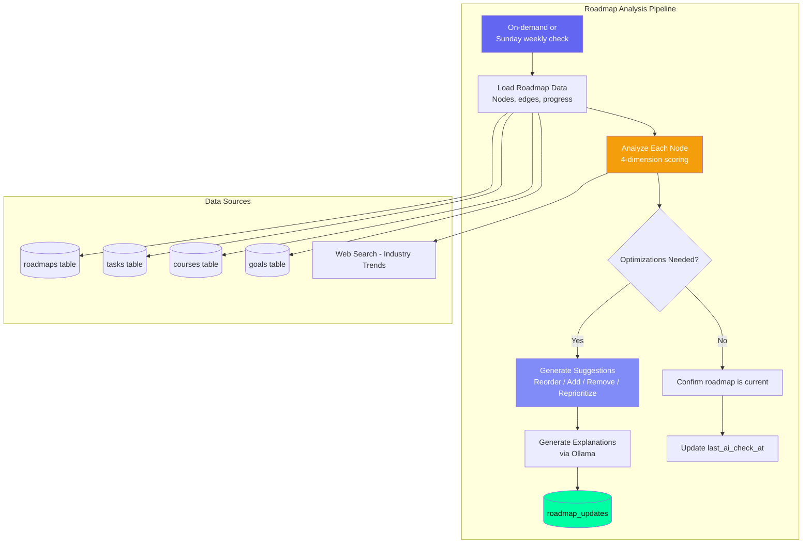
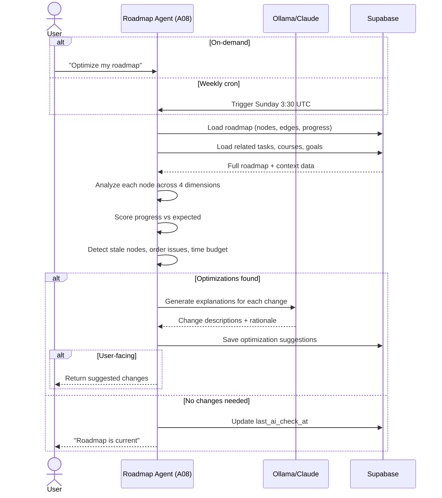
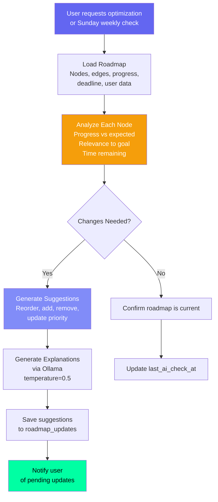

# Roadmap Agent — Skill Development Optimizer

## Document Control

| Field | Value |
|---|---|
| **Document ID** | AI-AGT-010 |
| **Version** | 2.0.0 |
| **Status** | Approved |
| **Date** | 2026-07-14 |
| **Classification** | Internal |
| **Owner** | Developer |
| **Review Cycle** | Monthly |
| **Prompt File** | `prompts/agents/roadmap_agent.md` (257 lines, v1.0.0) |
| **Agent Module** | `packages/ai/agents/roadmap_agent.py` |
| **Agent ID** | A08 |
| **Related Docs** | [TaskAgent.md](TaskAgent.md), [AgentArchitecture.md](../engineering/14_AgentArchitecture.md), [Goals API](../../apps/api/app/api/goals.py), [Roadmap API](../../apps/api/app/api/roadmap.py) |

---

## 1. Overview

The Roadmap Agent optimizes skill development roadmaps by analyzing user progress, suggesting adjustments to nodes, detecting stale or outdated content, and reprioritizing based on deadlines. The agent runs on-demand (user request) and weekly (Sunday morning) to ensure roadmaps remain current and actionable.

**Key Features:**
- Multi-dimensional analysis (progress, relevance, prerequisites, time budget)
- Automatic detection of stale/outdated nodes
- Prerequisite order validation (circular dependency detection)
- Estimated completion date projection
- External factor integration (industry trends via web search)
- Algorithmic analysis fallback (always available)

---

## 2. Architecture

### Agent Positioning



### Data Flow Sequence



---

## 3. Processing Flow



---

## 4. Input Schema

| Field | Source | Description |
|---|---|---|
| user_id | Auth | Target user |
| roadmap_id | Request param | Specific roadmap |
| roadmap_data | roadmaps table | Nodes + edges |
| user_progress | tasks, courses | Related progress data |
| deadline | roadmaps table | Hard deadline if set |
| external_factors | web search | Industry trends (optional) |

### Data Loading Implementation

```python
async def load_roadmap_context(user_id: str, roadmap_id: str) -> dict:
    roadmap = await supabase.table("roadmaps")\
        .select("*")\
        .eq("id", roadmap_id)\
        .eq("user_id", user_id)\
        .single()\
        .execute()

    nodes = await supabase.table("roadmap_nodes")\
        .select("*")\
        .eq("roadmap_id", roadmap_id)\
        .order("order_index")\
        .execute()

    edges = await supabase.table("roadmap_edges")\
        .select("*")\
        .eq("roadmap_id", roadmap_id)\
        .execute()

    related_tasks = await supabase.table("tasks")\
        .select("title, status, priority")\
        .eq("user_id", user_id)\
        .eq("roadmap_id", roadmap_id)\
        .execute()

    return {
        "roadmap": roadmap.data,
        "nodes": nodes.data,
        "edges": edges.data,
        "related_tasks": related_tasks.data,
        "node_count": len(nodes.data),
        "completed_nodes": sum(1 for n in nodes.data if n.get("status") == "completed"),
    }
```

---

## 5. Output Schema

```json
{
  "roadmap_id": "uuid",
  "analysis_date": "2026-07-10",
  "status": "optimized",
  "suggested_changes": [
    {
      "type": "reorder",
      "node_label": "Advanced DSA",
      "reason": "Should come after basic DSA completion",
      "priority": "critical"
    },
    {
      "type": "add",
      "node_label": "System Design Basics",
      "reason": "Required for upcoming interviews",
      "source_url": "https://...",
      "priority": "suggested"
    }
  ],
  "overall_progress": 45,
  "estimated_completion": "2026-09-15"
}
```

---

## 6. Analysis Algorithm

```python
async def analyze_roadmap(roadmap_data: dict) -> list[dict]:
    """Analyze roadmap across 4 dimensions and return optimization suggestions."""
    suggestions = []
    nodes = roadmap_data["nodes"]
    edges = roadmap_data["edges"]

    # Dimension 1: Progress vs Expected (40%)
    completed = sum(1 for n in nodes if n.get("status") == "completed")
    total = len(nodes)
    progress_pct = (completed / total * 100) if total > 0 else 0

    if progress_pct < 30 and total > 5:
        suggestions.append({
            "type": "warning",
            "node_label": roadmap_data.get("roadmap", {}).get("title", "Roadmap"),
            "reason": f"Only {progress_pct:.0f}% complete. Consider adjusting scope.",
            "priority": "attention",
        })

    # Dimension 2: Prerequisite Order (20%)
    for edge in edges:
        source_id = edge["source_node_id"]
        target_id = edge["target_node_id"]
        source = next((n for n in nodes if n["id"] == source_id), None)
        target = next((n for n in nodes if n["id"] == target_id), None)
        if source and target:
            if source.get("status") != "completed" and target.get("status") == "completed":
                suggestions.append({
                    "type": "reorder",
                    "node_label": target.get("label", "Unknown"),
                    "reason": f"Completed without prerequisite: {source.get('label', 'Unknown')}",
                    "priority": "info",
                })

    # Dimension 3: Time Budget (15%)
    deadline = roadmap_data.get("roadmap", {}).get("deadline")
    if deadline:
        days_left = (datetime.fromisoformat(deadline) - datetime.now()).days
        remaining = total - completed
        if remaining > 0 and days_left > 0:
            pace = days_left / remaining
            if pace < 1:  # Less than 1 day per remaining node
                suggestions.append({
                    "type": "warning",
                    "reason": f"{remaining} nodes remain with {days_left} days. Consider increasing daily effort or reducing scope.",
                    "priority": "critical",
                })

    return suggestions


def detect_circular_dependency(edges: list[dict]) -> bool:
    """Detect circular dependencies in roadmap edges."""
    graph = {}
    for edge in edges:
        src = edge["source_node_id"]
        tgt = edge["target_node_id"]
        if src not in graph:
            graph[src] = []
        graph[src].append(tgt)

    visited = set()
    rec_stack = set()

    def dfs(node):
        visited.add(node)
        rec_stack.add(node)
        for neighbor in graph.get(node, []):
            if neighbor not in visited:
                if dfs(neighbor):
                    return True
            elif neighbor in rec_stack:
                return True
        rec_stack.discard(node)
        return False

    for node in graph:
        if node not in visited:
            if dfs(node):
                return True
    return False
```

---

## 7. Analysis Dimensions

| Dimension | Weight | What It Checks |
|---|---|---|
| **Progress vs Expected** | 40% | Is the user on track? |
| **Node Relevance** | 25% | Are nodes still relevant to the goal? |
| **Prerequisite Order** | 20% | Are dependencies correct? |
| **Time Budget** | 15% | Can the user finish by deadline? |

---

## 8. LLM Configuration

| Parameter | Value |
|---|---|
| Model | Ollama (Mistral 7B) |
| Temperature | 0.5 |
| Max tokens | 2048 |
| Fallback | Claude Sonnet 4 |

---

## 9. Fallback Behavior

| Failure Mode | Fallback |
|---|---|
| LLM unavailable | Algorithmic analysis (progress %, time remaining) |
| Roadmap empty | "Create a roadmap first" prompt |
| No changes needed | Return "roadmap is current" confirmation |
| Edge data malformed | Skip malformed edges, report count |

### Algorithmic Analysis Fallback

```python
def generate_algorithmic_analysis(roadmap_data: dict) -> dict:
    nodes = roadmap_data.get("nodes", [])
    completed = sum(1 for n in nodes if n.get("status") == "completed")
    total = len(nodes)
    progress = round((completed / total) * 100, 1) if total > 0 else 0

    suggestions = []
    if detect_circular_dependency(roadmap_data.get("edges", [])):
        suggestions.append({
            "type": "error",
            "reason": "Circular dependency detected",
            "priority": "critical",
        })

    return {
        "status": "analyzed",
        "overall_progress": progress,
        "suggested_changes": suggestions,
        "algorithmic": True,
    }
```

---

## 10. Failure Modes

| Mode | Handling |
|---|---|
| Invalid node structure | Skip malformed nodes, report count |
| Deadline already passed | Flag as "overdue", suggest revision |
| All nodes completed | Suggest next goal or new roadmap |
| Circular dependency in nodes | Detect and flag for manual fix |
| Empty roadmap results | Prompt user to create nodes first |

---

## 11. Error Handling

```python
async def optimize_roadmap(user_id: str, roadmap_id: str) -> dict:
    try:
        context = await load_roadmap_context(user_id, roadmap_id)
    except SupabaseError as e:
        logger.error(f"Roadmap load failed: {e}")
        return {"error": "roadmap_not_found", "roadmap_id": roadmap_id}

    if not context.get("nodes"):
        return {"status": "empty", "message": "Create nodes first"}

    # Always run algorithmic analysis first
    algorithm_result = generate_algorithmic_analysis(context)

    try:
        response = await llm.generate_json(roadmap_prompt, system=system_prompt)
        llm_result = parse_llm_suggestions(response)
        llm_result["algorithmic"] = False
        return llm_result
    except (LLMProviderUnavailableError, JSONParseError) as e:
        logger.warn(f"LLM roadmap analysis failed: {e}")
        return algorithm_result
```

---

## 12. Performance Targets

| Operation | Target |
|---|---|
| Data loading | < 300ms |
| Algorithmic analysis | < 200ms |
| LLM generation | < 10s |
| Total pipeline (on-demand) | < 12s |

---

## 13. Related Documents

| Document | Description |
|---|---|
| [prompts/agents/roadmap_agent.md](../../prompts/agents/roadmap_agent.md) | Full prompt template (257 lines) |
| [TaskAgent.md](TaskAgent.md) | Related task planning agent (A01) |
| [AgentArchitecture.md](../engineering/14_AgentArchitecture.md) | Agent system architecture |
| [Roadmap API](../../apps/api/app/api/roadmap.py) | API endpoint |
| [Goals API](../../apps/api/app/api/goals.py) | Goals endpoint |
| [14_AgentArchitecture.md §A08](../engineering/14_AgentArchitecture.md) | Agent registry reference |

---

## Revision History

| Version | Date | Author | Changes |
|---|---|---|---|
| 1.0.0 | 2026-07-10 | Developer | Initial agent documentation |
| 2.0.0 | 2026-07-14 | Developer | Expanded to full enterprise reference. Added architecture diagram, sequence diagram, data loading implementation, 4-dimension analysis algorithm, circular dependency detection, algorithmic analysis fallback, error handling code, and cross-references. |
