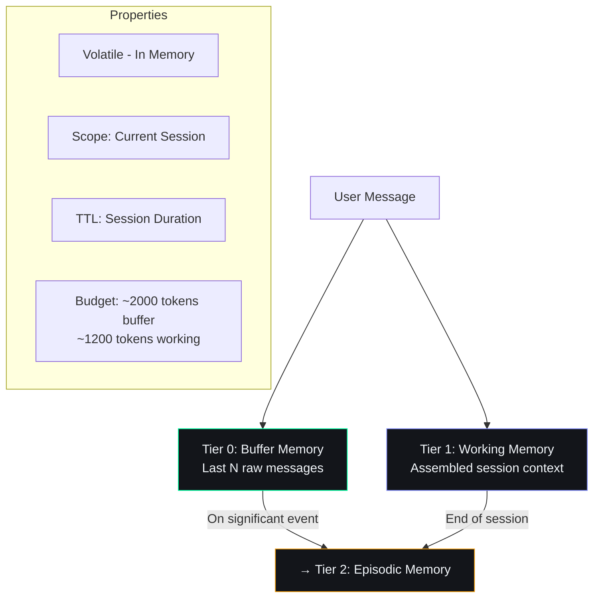

# Short-Term Memory — Second Brain OS

## Document Control

| Field | Value |
|---|---|
| **Document ID** | AI-STM-003 |
| **Version** | 1.0.0 |
| **Status** | Approved |
| **Date** | 2026-07-10 |
| **Classification** | Internal |
| **Owner** | Developer |
| **Related Docs** | [22_MemoryArchitecture.md](22_MemoryArchitecture.md), [LongTermMemory.md](LongTermMemory.md), [ContextEngine.md](ContextEngine.md) |

---

## 1. Executive Summary

Short-term memory encompasses two volatile tiers of the 5-tier memory model: Buffer (Tier 0) and Working Memory (Tier 1). These hold immediate conversational context and session-level state, respectively. Neither is persisted to the database — they are reconstructed on every request and destroyed when the session ends.

---

## 2. Architecture Overview



---

## 3. Buffer Memory (Tier 0)

### Purpose
Holds the last N messages of the current conversation for immediate contextual continuity.

### Implementation

```python
class BufferMemory:
    """Ring buffer of recent messages for immediate context."""

    def __init__(self, capacity: int = 10):
        self.capacity = capacity
        self.messages: list[dict] = []

    def add(self, role: str, content: str, metadata: dict | None = None) -> None:
        self.messages.append({
            "role": role,
            "content": content,
            "metadata": metadata or {},
            "timestamp": datetime.now().isoformat(),
        })
        if len(self.messages) > self.capacity:
            self.messages.pop(0)

    def trim_to_token_budget(self, budget: int = 2000) -> list[dict]:
        trimmed = []
        total = 0
        for m in reversed(self.messages):
            tokens = len(m["content"].split())
            if total + tokens > budget:
                break
            trimmed.insert(0, m)
            total += tokens
        return trimmed
```

### Lifecycle

| Event | Action |
|---|---|
| New user message | Appended to buffer |
| Buffer full (capacity exceeded) | Oldest message dropped |
| Session ends | Buffer discarded |
| Significant interaction | Promoted to episodic memory |

---

## 4. Working Memory (Tier 1)

### Purpose
Assembled context snapshot for the current session — identity, temporal context, session state, and real-time data.

### Structure

```python
working_memory_schema = {
    "identity": {
        "user_name": str,
        "user_id": str,
        "last_interaction": datetime,
        "persona_tone": str,
    },
    "temporal": {
        "current_time": datetime,
        "day_of_week": str,
        "time_of_day": str,
        "semester_week": int | None,
        "is_exam_period": bool,
    },
    "session": {
        "session_id": str,
        "message_count_today": int,
        "last_3_messages": [str, str, str],
        "current_intent": str | None,
        "pending_actions": [str],
    },
    "state": {
        "tasks_today_count": int,
        "overdue_count": int,
        "sleep_score": int | None,
        "active_goals_count": int,
        "habit_streak": int | None,
    },
}
```

### Refresh Cadence

| Trigger | Action | Latency Budget |
|---|---|---|
| Every user message | Full rebuild | < 200 ms |
| System event | Partial update | < 50 ms |
| Background TTL | Cache refresh | < 100 ms |

### Token Budget Allocation

```python
BUDGET = 1200  # tokens

allocation = {
    "identity": 100,
    "temporal": 100,
    "session": 400,
    "state": 400,
    "buffer_overhead": 200,
}
```

### Truncation Priority

1. **Never remove:** user_name, current_time, active_goals_count
2. **Keep if possible:** overdue_count, sleep_score, pending_actions
3. **Truncate first:** completed goals, old descriptions, verbose titles

---

## 5. Short-Term to Long-Term Transfer

| Trigger | Data Transferred | Destination |
|---|---|---|
| Task created | Task details + user intent | Episodic (Tier 2) |
| Goal set | Goal + reasoning | Semantic (Tier 3) |
| Session ends | Conversation summary | Episodic (Tier 2) |
| Significant correction | Preference change | Semantic (Tier 3) |

---

## 6. Related Documents

| Document | Description |
|---|---|
| [22_MemoryArchitecture.md](22_MemoryArchitecture.md) | 5-tier memory model |
| [LongTermMemory.md](LongTermMemory.md) | Persistent memory tiers |
| [ContextEngine.md](ContextEngine.md) | Context assembly pipeline |
