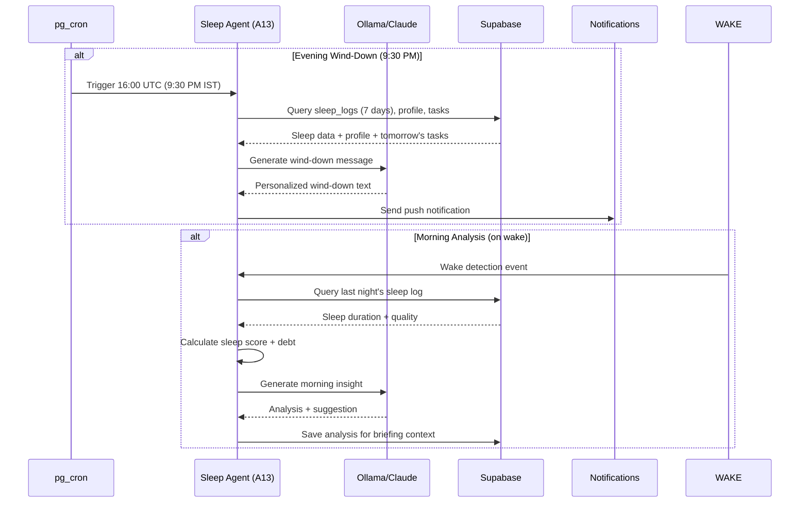

# Sleep Agent — Sleep Analysis & Wind-Down

## Document Control

| Field | Value |
|---|---|
| **Document ID** | AI-AGT-008 |
| **Version** | 2.0.0 |
| **Status** | Approved |
| **Date** | 2026-07-14 |
| **Classification** | Internal |
| **Owner** | Developer |
| **Review Cycle** | Monthly |
| **Prompt File** | `prompts/agents/sleep_agent.md` (905 lines, v2.1.0) |
| **Agent Module** | `packages/ai/agents/sleep_agent.py` |
| **Agent ID** | A13 |
| **Related Docs** | [BriefingAgent.md](BriefingAgent.md), [AgentArchitecture.md](../engineering/14_AgentArchitecture.md), [Sleep API](../../apps/api/app/api/sleep.py) |

---

## 1. Overview

The Sleep Agent generates personalized sleep wind-down messages at 9:30 PM IST and provides morning-after sleep analysis with recovery suggestions. It uses 5 sleep profiles (balanced, night owl, early bird, irregular, under-sleeper) to tailor recommendations. The agent also tracks sleep debt and adjusts task recommendations based on energy levels.

**Key Features:**
- 5 sleep profiles for personalized recommendations
- Sleep score calculation (duration + quality)
- Energy-based task adjustment (heavy tasks deferred on low sleep)
- Sleep debt tracking (cumulative deficit across week)
- Wind-down reminder 30 min before bedtime
- Bedtime reminder with tomorrow's first task
- Google Fit sync (optional)
- Weekly sleep report with charts

---

## 2. Architecture

### Agent Positioning

```mermaid
graph TD
    subgraph Evening Pipeline (9:30 PM)
        CRON_BN["Cron: 9:30 PM IST"] --> LOAD[Load Sleep Data<br/>Recent logs, debt, profile]
        LOAD --> PROFILE[Identify Sleep Profile<br/>Balanced / Night Owl / Early Bird / Irregular / Under-sleeper]
        PROFILE --> GEN[Generate Wind-Down Message<br/>Personalized + profile-based]
        GEN --> PUSH[Push Notification<br/>"Time to wind down..."]
    end

    subgraph Morning Pipeline
        WAKE[On wake detection<br/>or morning check] --> ANALYZE[Analyze Night's Sleep<br/>Duration, quality, debt]
        ANALYZE --> SCORE[Calculate Sleep Score<br/>0-100]
        SCORE --> INSIGHT[Generate Insight<br/>Score + trend + suggestion]
        INSIGHT --> ADJUST[Adjust Task Schedule<br/>Based on energy level]
    end

    subgraph Data Sources
        LOGS[(sleep_logs)]
        PROFILE_DB[(users_profile)]
        TASKS[(tasks table)]
    end

    LOAD --> LOGS
    LOAD --> PROFILE_DB
    ADJUST --> TASKS

    style CRON_BN fill:#6366F1,color:#fff
    style GEN fill:#818CF8,color:#fff
    style PUSH fill:#F59E0B,color:#fff
    style SCORE fill:#00FFA3,color:#000
```

### Data Flow Sequence



---

## 3. Processing Flow

```mermaid
graph TD
    BEDTIME["Cron: 9:30 PM IST"] --> LOAD[Load Sleep Data<br/>Recent logs, debt, profile]
    LOAD --> GENERATE[Generate Wind-Down<br/>Personalized message<br/>Based on sleep profile]
    GENERATE --> PUSH[Push Notification<br/>"Time to wind down..."]
    PUSH --> WAKE["Cron: On wake detection<br/>or morning check"]
    WAKE --> ANALYZE[Analyze Night's Sleep<br/>Duration, quality, debt]
    ANALYZE --> INSIGHT[Generate Insight<br/>Score, trend, suggestion]
    INSIGHT --> STORE[Save sleep analysis<br/>to daily_briefing context]

    style BEDTIME fill:#6366F1,color:#fff
    style GENERATE fill:#818CF8,color:#fff
    style PUSH fill:#F59E0B,color:#fff
    style INSIGHT fill:#00FFA3,color:#000
```

---

## 4. Input Schema

| Field | Source | Description |
|---|---|---|
| user_id | Auth | Target user |
| sleep_logs | sleep_logs | Recent 7 days |
| sleep_profile | users_profile | bedtime, wake_time |
| sleep_debt | sleep_logs | Accumulated debt |
| yesterday_tasks | tasks | Yesterday's task load |
| today_tasks | tasks | Today's scheduled tasks |

---

## 5. Output Schema

### Evening Wind-Down

```json
{
  "type": "wind_down",
  "message": "You had a productive day with 6 tasks completed. Time to wind down...",
  "suggestion": "Try reading for 15 minutes instead of phone",
  "bedtime_align": true,
  "sleep_target": "11:00 PM - 7:00 AM (8 hours)"
}
```

### Morning Analysis

```json
{
  "type": "morning_analysis",
  "sleep_score": 82,
  "duration_hours": 7.5,
  "quality_rating": 4,
  "debt_change": -15,
  "insight": "You slept 30 minutes more than average this week",
  "energy_prediction": "Good energy for morning study session",
  "suggestion": "Schedule your most demanding task before noon"
}
```

---

## 6. Sleep Score Algorithm

```python
def calculate_sleep_score(duration_minutes: int, quality_rating: int) -> int:
    """
    Calculate sleep score (0-100).

    Formula:
    score = min(100, (duration_minutes / 480 x 60) + (quality_rating x 8))

    Where:
    - 480 minutes = 8 hours (optimal sleep duration)
    - quality_rating = user-reported 1-5 scale
    """
    score = min(100, (duration_minutes / 480 * 60) + (quality_rating * 8))
    return int(score)


def calculate_sleep_debt(sleep_logs: list[dict], target_hours: int = 8) -> int:
    """Calculate cumulative sleep debt in minutes over the last 7 days."""
    total_debt = 0
    target_minutes = target_hours * 60
    for log in sleep_logs[-7:]:
        actual = log.get("duration_minutes", 0)
        total_debt += max(0, target_minutes - actual)
    return total_debt
```

### Task Adjustment by Score

| Score | Action |
|---|---|
| >= 70 | Full schedule -- normal operation |
| 40-69 | Move deep-concentration tasks (system design, competitive coding) to tomorrow |
| < 40 | Keep only light tasks today, all heavy work deferred |

```python
async def adjust_tasks_for_energy(user_id: str, sleep_score: int) -> list[dict]:
    """Adjust today's task schedule based on sleep score."""
    if sleep_score >= 70:
        return []  # No adjustment needed

    today_tasks = await get_tasks_due_today(user_id)
    cognitive_types = {"coding", "design", "study", "writing", "problem_solving"}
    heavy_tasks = [t for t in today_tasks if t.get("type") in cognitive_types]

    adjusted = []
    for task in heavy_tasks:
        if sleep_score < 40:
            adjusted.append({
                "task_id": task["id"],
                "title": task["title"],
                "action": "defer_to_tomorrow",
                "reason": "Low energy - recommend rest today",
            })
        elif sleep_score < 70:
            adjusted.append({
                "task_id": task["id"],
                "title": task["title"],
                "action": "move_to_afternoon",
                "reason": "Moderate energy - schedule for peak hours",
            })

    return adjusted
```

---

## 7. Sleep Profile Types

| Profile | Characteristic | Wind-Down Strategy |
|---|---|---|
| **Balanced** | Regular 7-8h, consistent | Maintain routine |
| **Night Owl** | Late bedtime, late wake | Gradual shift, light exposure morning |
| **Early Bird** | Early bedtime, early rise | Protect morning routine |
| **Irregular** | Variable schedule | Consistency nudge |
| **Under-sleeper** | Chronic < 6h | Debt management, nap strategy |

---

## 8. LLM Configuration

| Parameter | Value |
|---|---|
| Model | Ollama (Mistral 7B) |
| Temperature | 0.7 (creative for wind-down) |
| Max tokens | 1024 |
| Fallback model | Claude Sonnet 4 |

---

## 9. Fallback Behavior

| Failure | Fallback |
|---|---|
| LLM unavailable | Template-based wind-down message |
| No sleep data | Default to 8h recommendation |
| Sleep debt calculation error | Use last known value |

### Template Wind-Down Fallback

```python
def generate_template_wind_down(profile: str, completed: int, tomorrow_task: str) -> str:
    templates = {
        "balanced": f"Great day! You completed {completed} tasks. Time for your usual wind-down. {tomorrow_task} awaits tomorrow.",
        "night_owl": f"I know you're a night person, but try to start winding down now. {completed} tasks done - good progress!",
        "early_bird": f"Your early start tomorrow needs a good night's sleep. {completed} tasks complete. Rest well!",
        "irregular": f"Try to get to bed by your target time tonight for consistency. {completed} tasks done today.",
        "under_sleeper": f"You've been running on low sleep. Please aim for 8 hours tonight to start recovering sleep debt.",
    }
    return templates.get(profile, templates["balanced"])
```

---

## 10. Failure Modes

| Mode | Handling |
|---|---|
| No sleep logs this week | Show generic sleep hygiene tips |
| Profile not set | Default to balanced profile |
| Wind-down notification fails | Log error, retry at next interval |
| Conflicting sleep data | Use manual logs over auto-detected |
| Sleep debt exceeds 20 hours | Flag for weekly review, suggest catch-up plan |

---

## 11. Error Handling

```python
async def generate_wind_down(user_id: str) -> dict:
    profile = await get_sleep_profile(user_id)
    sleep_debt = calculate_sleep_debt(await get_recent_sleep_logs(user_id))

    try:
        response = await llm.generate_json(wind_down_prompt, system=system_prompt)
        message = parse_wind_down(response)
    except LLMProviderUnavailableError:
        completed = await count_tasks_completed_today(user_id)
        tomorrow = await get_first_task_tomorrow(user_id)
        message = generate_template_wind_down(profile["type"], completed, tomorrow)

    return {
        "type": "wind_down",
        "message": message,
        "sleep_debt": sleep_debt,
        "profile": profile["type"],
    }
```

---

## 12. Performance Targets

| Operation | Target |
|---|---|
| Sleep data loading | < 200ms |
| Score calculation | < 50ms |
| LLM wind-down generation | < 5s |
| Total evening pipeline | < 6s |
| Total morning analysis | < 3s |

---

## 13. Related Documents

| Document | Description |
|---|---|
| [prompts/agents/sleep_agent.md](../../prompts/agents/sleep_agent.md) | Full prompt template (905 lines) |
| [BriefingAgent.md](BriefingAgent.md) | Sleep insight in daily briefing (A09) |
| [AgentArchitecture.md](../engineering/14_AgentArchitecture.md) | Agent system architecture |
| [Sleep API](../../apps/api/app/api/sleep.py) | API endpoint |
| [14_AgentArchitecture.md §A13](../engineering/14_AgentArchitecture.md) | Agent registry reference |

---

## Revision History

| Version | Date | Author | Changes |
|---|---|---|---|
| 1.0.0 | 2026-07-10 | Developer | Initial agent documentation |
| 2.0.0 | 2026-07-14 | Developer | Expanded to full enterprise reference. Added architecture diagram, sequence diagram, sleep score algorithm, sleep debt calculation, energy-based task adjustment algorithm, template wind-down fallback, error handling code, and cross-references. |
