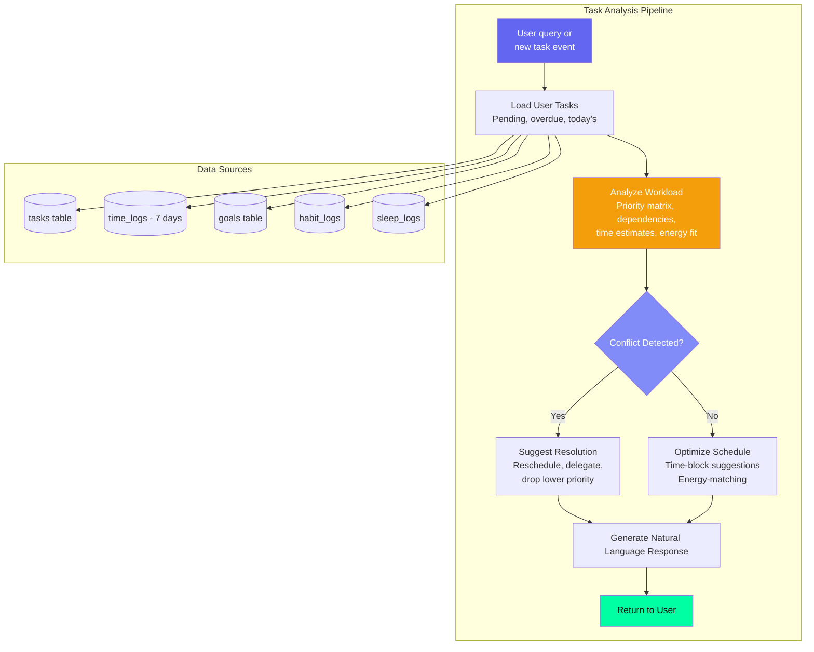
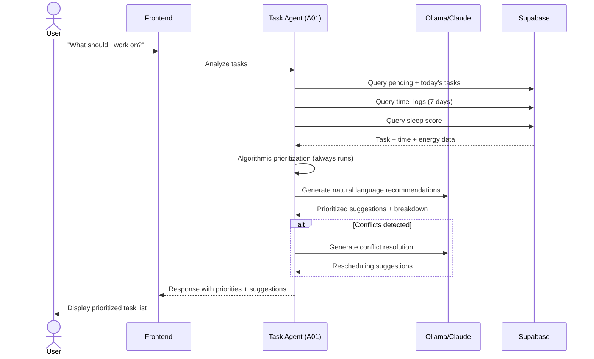
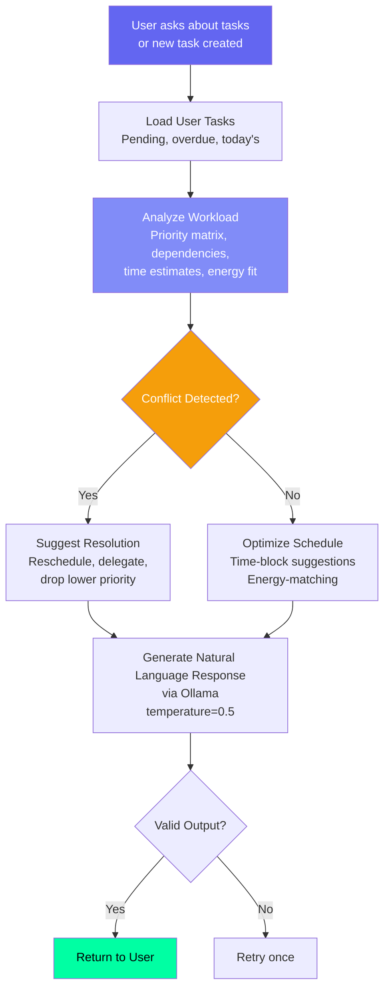

# Task Agent — Task Breakdown & Prioritization

## Document Control

| Field | Value |
|---|---|
| **Document ID** | AI-AGT-007 |
| **Version** | 2.0.0 |
| **Status** | Approved |
| **Date** | 2026-07-14 |
| **Classification** | Internal |
| **Owner** | Developer |
| **Review Cycle** | Monthly |
| **Prompt File** | `prompts/agents/task_agent.md` (839 lines, v2.1.0) |
| **Agent Module** | `packages/ai/agents/task_agent.py` |
| **Agent ID** | A01 |
| **Related Docs** | [RoadmapAgent.md](RoadmapAgent.md), [AgentArchitecture.md](../engineering/14_AgentArchitecture.md), [Goals API](../../apps/api/app/api/goals.py) |

---

## 1. Overview

The Task Agent analyzes user tasks, suggests intelligent breakdowns, prioritizes workloads based on deadlines and energy levels, and detects scheduling conflicts. It is invoked on-demand when the user asks ARIA about their tasks, when a new task is created that might affect existing commitments, or as part of the daily briefing context assembly.

**Key Features:**
- Priority scoring with multi-factor weighting (deadline, importance, energy)
- Energy-aware scheduling (matches task type to sleep score)
- Conflict detection across overlapping time estimates
- Smart breakdown of complex tasks into subtasks
- Circular dependency detection
- Algorithmic prioritization fallback (always available)

---

## 2. Architecture

### Agent Positioning



### Data Flow Sequence



---

## 3. Processing Flow



---

## 4. Input Schema

| Field | Source | Description | Max Items |
|---|---|---|---|
| user_id | Auth | Target user | 1 |
| tasks | tasks table | User's tasks (pending + today) | 50 |
| user_query | Chat message | "What should I work on?" | 1 |
| time_entries | time_logs | Recent time logs (7 days) | 50 |
| goals | goals table | Active goals for context | 10 |
| habits_due | habits/habit_logs | Habits due today | 10 |
| energy_level | time_logs | Last reported energy | 1 |

---

## 5. Output Schema

```json
{
  "today_priority": [
    {
      "title": "Complete DSA assignment",
      "priority": "high",
      "reason": "Due tomorrow, estimated 2h",
      "suggested_time": "9:00 AM - 11:00 AM"
    }
  ],
  "suggested_breakdown": {
    "task_id": "uuid",
    "title": "Build portfolio",
    "subtasks": [
      "Design homepage layout",
      "Implement navigation",
      "Add project cards",
      "Deploy to Vercel"
    ],
    "estimated_total": "4 hours"
  },
  "schedule_conflicts": [
    {
      "tasks": ["Study React", "Freelance project"],
      "conflict_type": "time_overlap",
      "time_range": "2:00 PM - 5:00 PM",
      "suggestion": "Reschedule freelance to after 5 PM"
    }
  ],
  "estimated_completion_time": "3 hours 30 minutes",
  "energy_recommendation": {
    "high_energy_tasks": ["DSA assignment"],
    "low_energy_tasks": ["Review notes", "Organize bookmarks"]
  }
}
```

### Priority Classification

| Priority | Criteria | Action |
|---|---|---|
| **urgent** | Due < 24h, high impact | Do first |
| **high** | Due < 72h, important | Schedule today |
| **medium** | Due this week | Time-block |
| **low** | No deadline, optional | Consider deferring |

---

## 6. Algorithmic Prioritization (Fallback Base)

```python
def algorithmic_prioritization(tasks: list) -> list:
    """Core prioritization algorithm - always runs as base layer."""
    score_map = {"urgent": 0, "high": 1, "medium": 2, "low": 3}
    return sorted(tasks, key=lambda t: (
        score_map.get(t["priority"], 99),
        t.get("due_date") or "9999-12-31"
    ))


def priority_score_with_energy(task: dict, sleep_score: int | None) -> float:
    """
    Calculate priority score incorporating energy compatibility.

    Score = (deadline_urgency x 0.4) + (task_importance x 0.3) + (energy_compatibility x 0.3)
    """
    deadline_urgency = 1 - (days_remaining / max_days)
    task_importance = {"low": 1, "medium": 2, "high": 3, "urgent": 4}.get(task.get("priority", "low"), 1)

    energy_compatibility = 1.0
    if sleep_score is not None:
        is_cognitive = task.get("type") in ("coding", "design", "study", "writing")
        if is_cognitive and sleep_score < 50:
            energy_compatibility = 0.3
        elif is_cognitive and sleep_score < 70:
            energy_compatibility = 0.6

    return (deadline_urgency * 0.4) + (task_importance * 0.3) + (energy_compatibility * 0.3)
```

---

## 7. LLM Configuration

| Parameter | Value | Rationale |
|---|---|---|
| Model | Ollama (Mistral 7B) | Fast response needed |
| Temperature | 0.5 | Balanced |
| Max tokens | 2048 | Enough for task list |
| Fallback | Claude Sonnet 4 | Cloud backup |

---

## 8. Prompt Usage

```python
from ai.prompt_loader import prompts

entry = prompts.get_agent("task_agent")
if entry:
    system = entry.system_prompt
    user = f"User query: {query}\nTasks: {tasks}\nGoals: {goals}"
    result = await llm.generate_json(user, system=system)
else:
    result = algorithmic_prioritization(tasks)
```

---

## 9. Fallback Behavior

| Failure Mode | Fallback | Result |
|---|---|---|
| LLM unavailable | Sort by priority + due_date | Algorithmic, no natural language |
| No tasks found | "No pending tasks!" | Positive reinforcement |
| Conflict analysis fails | Show tasks without suggestion | Reduced quality |
| Breakdown fails | Don't suggest subtasks | Minimal response |

### Algorithmic Prioritization (Fallback Response)

```python
def generate_algorithmic_response(tasks: list) -> dict:
    """Generate structured response without LLM."""
    prioritized = algorithmic_prioritization(tasks)
    return {
        "today_priority": [
            {
                "title": t["title"],
                "priority": t.get("priority", "medium"),
                "reason": f"Priority: {t.get('priority', 'medium')}",
                "suggested_time": "Schedule as needed",
            }
            for t in prioritized[:3]
        ],
        "algorithmic": True,
        "note": "Prioritized by deadline and importance",
    }
```

---

## 10. Failure Modes

| Mode | Handling |
|---|---|
| Circular dependencies in tasks | Detect cycle, flag for manual fix |
| Impossible workload (> 16h of tasks) | Prioritize top 3, suggest deferring rest |
| Missing estimated times | Default to 30 min per generic task |
| Concurrent task conflicts | Show overlap visualization |
| User query ambiguous | Ask clarifying question |
| All tasks completed | Positive: "All done! Great work today." |
| Task count > 50 | Process top 50 by priority + deadline |

### Recovery Strategy

| Issue | Action |
|---|---|
| Analysis timeout (> 5s) | Return algorithmic sort |
| Empty result | Re-run with broader query |
| User rejects suggestion | Learn preference for next time |

---

## 11. Error Handling

```python
async def analyze_tasks(user_id: str, query: str) -> dict:
    tasks = await load_user_tasks(user_id)

    # Always compute algorithmic prioritization first (guaranteed fallback)
    algorithm_result = algorithmic_prioritization(tasks)

    try:
        response = await llm.generate_json(user_prompt, system=system_prompt)
        llm_result = parse_llm_response(response)
        return llm_result
    except (LLMProviderUnavailableError, TimeoutError, JSONParseError) as e:
        logger.warn(f"LLM task analysis failed: {e}, using algorithmic result")
        return generate_algorithmic_response(tasks)
```

---

## 12. Performance Targets

| Operation | Target |
|---|---|
| Task loading | < 100ms |
| Conflict detection (algorithmic) | < 200ms |
| LLM generation | < 5s |
| Total response | < 6s |

---

## 13. Related Documents

| Document | Description |
|---|---|
| [prompts/agents/task_agent.md](../../prompts/agents/task_agent.md) | Full prompt template (839 lines) |
| [AgentArchitecture.md](../engineering/14_AgentArchitecture.md) | Agent system architecture |
| [RoadmapAgent.md](RoadmapAgent.md) | Related planning agent (A08) |
| [Tasks API](../../apps/api/app/api/tasks.py) | API endpoint |
| [14_AgentArchitecture.md §A01](../engineering/14_AgentArchitecture.md) | Agent registry reference |

---

## Revision History

| Version | Date | Author | Changes |
|---|---|---|---|
| 1.0.0 | 2026-07-10 | Developer | Initial agent documentation |
| 2.0.0 | 2026-07-14 | Developer | Expanded to full enterprise reference. Added architecture diagram, sequence diagram, algorithmic prioritization implementation with energy-aware scoring, algorithmic fallback response generator, error handling code, and cross-references. |
