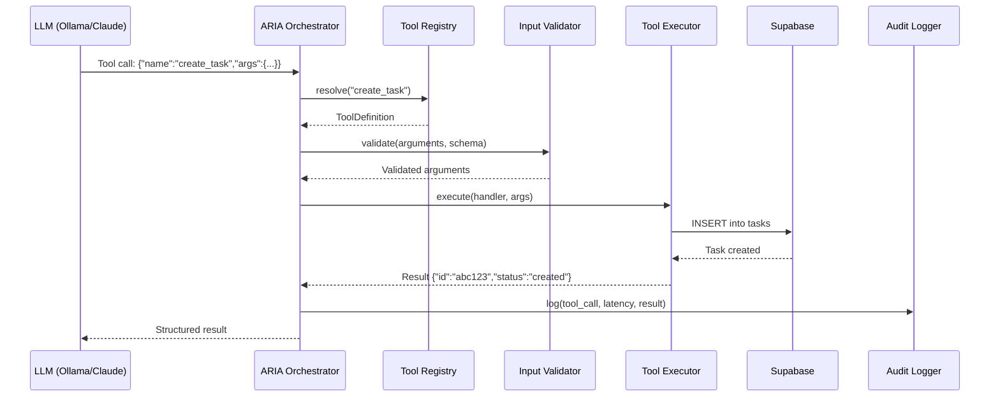
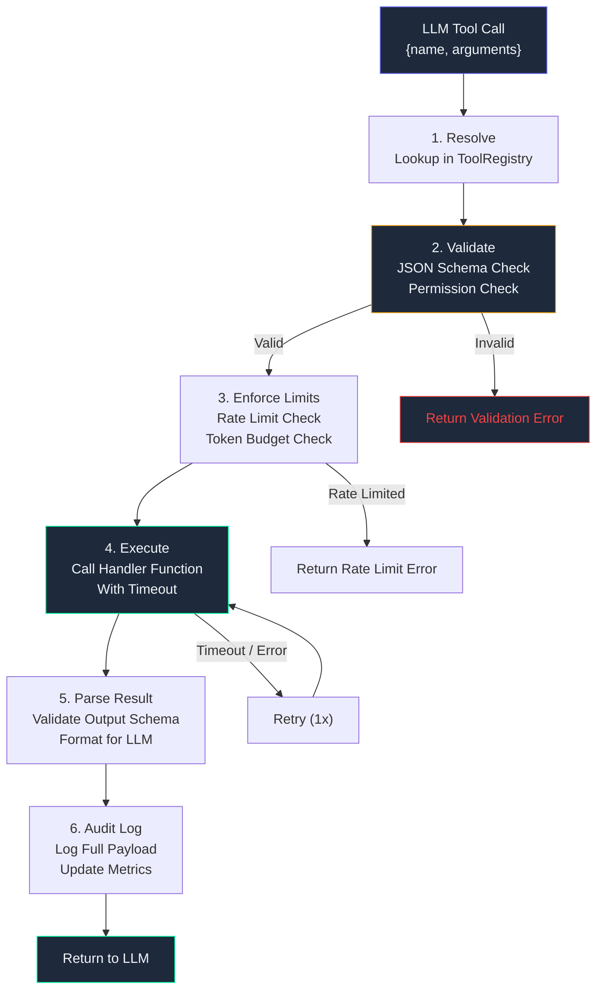

# Tool Calling Architecture — Enterprise Reference

## Document Control

| Field | Value |
|---|---|
| Document ID | AI-TLC-001 |
| Version | 1.0.0 |
| Status | Approved |
| Classification | Internal — Architecture |
| Owner | Developer |
| Last Updated | 2026-07-10 |
| Review Cycle | Quarterly |

---

## 1. Executive Summary

The tool calling system enables ARIA and all sub-agents to perform structured operations on user data through a unified function-calling interface. Instead of generating raw SQL or manipulating APIs directly, the LLM declares its intent via JSON-schema tool definitions, which the runtime validates, executes, and returns as structured results. This architecture provides security boundaries, audit trails, and consistent error handling across all agent operations.

## 2. Purpose

Define the complete tool calling framework: schema definition patterns, registry structure, execution pipeline, error handling, security controls, and observability for every tool invocation across all 15 agents.

## 3. Scope

Covers all tool types (data query, CRUD, agent dispatch, analytics), the tool registry lifecycle, execution pipeline with parallel/sequential chaining, input/output validation, permission model, and monitoring dashboards.

## 4. Business Context

| Concern | Impact |
|---|---|
| Security | Tool definitions prevent LLM from executing arbitrary code or accessing unauthorized data |
| Auditability | Every tool call is logged with input, output, latency, and user identity |
| Consistency | Standardized JSON schema ensures all agents produce parseable tool calls |
| Resilience | Tool execution supports retry, timeout, and graceful fallback per call |

## 5. Functional Specification

### 5.1 Tool Definition Schema

Every tool is defined as a JSON Schema function declaration:

```json
{
  "name": "create_task",
  "description": "Create a new task in the user's task list",
  "parameters": {
    "type": "object",
    "properties": {
      "title": {"type": "string", "description": "Task title"},
      "priority": {"type": "string", "enum": ["low", "medium", "high", "urgent"]},
      "due_date": {"type": "string", "format": "date", "description": "ISO date"},
      "goal_id": {"type": "string", "description": "Optional goal association"}
    },
    "required": ["title"]
  }
}
```

### 5.2 Tool Categories

| Category | Tool Count | Examples | Permission Level |
|---|---|---|---|
| Data Query | 12 | read_tasks, read_goals, search_resources | Read |
| CRUD Operations | 8 | create_task, update_goal, delete_idea | Write |
| Agent Dispatch | 10 | dispatch_briefing, trigger_radar | Execute |
| Analytics | 4 | get_productivity_stats, get_sleep_trends | Read |
| System | 3 | send_notification, log_feedback | Write |

### 5.3 Tool Registry

```python
from dataclasses import dataclass, field
from typing import Any, Callable, Optional

@dataclass
class ToolDefinition:
    name: str
    description: str
    parameters: dict  # JSON Schema
    handler: Callable
    permission: str  # "read" | "write" | "execute"
    timeout_ms: int = 5000
    retry_count: int = 1
    rate_limit: Optional[int] = None  # calls per minute
    audit_level: str = "info"  # "info" | "debug" | "critical"

class ToolRegistry:
    def __init__(self):
        self._tools: dict[str, ToolDefinition] = {}

    def register(self, tool: ToolDefinition):
        if tool.name in self._tools:
            raise DuplicateToolError(f"Tool '{tool.name}' already registered")
        self._tools[tool.name] = tool

    def get(self, name: str) -> ToolDefinition:
        tool = self._tools.get(name)
        if not tool:
            raise ToolNotFoundError(f"Tool '{name}' not found in registry")
        return tool

    def list_by_permission(self, permission: str) -> list[ToolDefinition]:
        return [t for t in self._tools.values() if t.permission == permission]

    def validate_call(self, name: str, arguments: dict) -> list[str]:
        """Validate tool arguments against JSON Schema. Returns list of errors."""
        tool = self.get(name)
        errors = []
        schema = tool.parameters
        required = schema.get("required", [])
        for field in required:
            if field not in arguments:
                errors.append(f"Missing required field: {field}")
        for key, value in arguments.items():
            prop_schema = schema.get("properties", {}).get(key)
            if prop_schema:
                if "enum" in prop_schema and value not in prop_schema["enum"]:
                    errors.append(f"Invalid value for '{key}': must be one of {prop_schema['enum']}")
                if prop_schema.get("type") == "string" and not isinstance(value, str):
                    errors.append(f"Field '{key}' must be a string")
        return errors
```

## 6. Non-Functional Requirements

| Requirement | Target | Measurement |
|---|---|---|
| Tool call latency | < 200ms p50, < 500ms p95 | Per-call timer |
| Tool registry load time | < 100ms | Startup benchmark |
| Concurrent tool executions | > 50 | Load test |
| Tool call success rate | > 99.5% | Success / total calls |
| Validation overhead | < 5ms per call | Timer before/after validation |

## 7. Architecture



## 8. Diagrams

### Tool Execution Pipeline



## 9. Data Models

```python
@dataclass
class ToolCall:
    id: str  # UUID
    tool_name: str
    arguments: dict
    user_id: str
    session_id: str
    timestamp: datetime
    permission: str

@dataclass
class ToolResult:
    success: bool
    data: Any
    error: Optional[str] = None
    latency_ms: float = 0
    tool_call_id: str = ""

    def to_llm_format(self) -> dict:
        if self.success:
            return {"status": "success", "data": self.data}
        return {"status": "error", "error": self.error}
```

## 10. APIs

### Tool Call Endpoint

```
POST /api/v1/execute-tool
{
    "tool": "create_task",
    "arguments": {"title": "Complete DSA", "priority": "high"}
}
→ {
    "status": "success",
    "data": {"id": "abc-123", "title": "Complete DSA", "status": "pending"}
}
```

### Tool Registry Endpoint

```
GET /api/v1/tools
→ {
    "tools": [
        {"name": "create_task", "description": "...", "parameters": {...}},
        ...
    ]
}
```

## 11. Security

| Layer | Control | Implementation |
|---|---|---|
| Authentication | User identity verified | JWT token validation on every call |
| Authorization | Permission boundary | Tool registry enforces read/write/execute perms |
| Input validation | JSON Schema validation | Every argument validated before execution |
| Rate limiting | Per-tool, per-user | Token bucket algorithm |
| Audit logging | All calls logged | Immutable audit trail in Supabase |
| Output sanitization | No PII in results | PII redactor runs on tool outputs |

## 12. Performance Targets

| Metric | Target | Notes |
|---|---|---|
| Tool call validation | < 5ms | Schema validation is lightweight |
| Handler execution | < 200ms p50 | Most handlers are Supabase queries |
| Full round-trip | < 500ms p95 | Validation + execution + logging |
| Registry lookup | < 1ms | Dict-based, no I/O |

## 13. Edge Cases

| Scenario | Handling |
|---|---|
| LLM calls non-existent tool | Return error, log warning, prompt LLM to retry with valid tool |
| LLM provides partial arguments | Validate against schema, return specific missing field error |
| Tool handler throws exception | Catch, log, return error result to LLM for self-correction |
| Concurrent calls to same tool | Serialize via asyncio.Lock per tool if write operation |
| Rate limit exceeded | Return rate limit error with retry-after header |

## 14. Failure Scenarios

| Failure | Detection | Recovery |
|---|---|---|
| Tool not found in registry | Registry.get() raises ToolNotFoundError | Return error to LLM, log to monitoring |
| Validation fails | Validator returns error list | Return formatted validation errors |
| Handler times out | asyncio.wait_for(timeout) | Retry once, then return timeout error |
| Supabase unavailable | HTTP error from client | Return cached result if available, else error |

## 15. Risks & Mitigations

| Risk | Likelihood | Impact | Mitigation |
|---|---|---|---|
| LLM generates malformed tool call | Medium | Medium | Schema validation catches; LLM retries |
| Tool handler has side effects | Low | High | All write handlers are idempotent where possible |
| Permission escalation | Low | Critical | Registry enforces per-tool permission; independent of LLM |
| Rate limit bypass | Low | Medium | Server-side enforcement, not client-side |

## 16. Acceptance Criteria

- [ ] All 30+ tools defined with JSON Schema parameters
- [ ] Tool registry loads in < 100ms at startup
- [ ] Schema validation catches 100% of missing required fields
- [ ] Write tools are idempotent (safe to retry)
- [ ] Audit log captures every tool call with full I/O
- [ ] Rate limiting blocks > 60 calls/minute per tool per user

## 17. Traceability

| Requirement | Source | Verified By |
|---|---|---|
| JSON Schema validation | ADR-007 | test_tool_registry.py |
| Permission enforcement | Security Requirements | test_tool_permissions.py |
| Audit logging | SOC 2 Control Matrix | test_tool_audit.py |

## 18. Implementation Notes

- Tool handlers are async functions registered at startup
- Use `inspect.signature()` to verify handler matches schema at registration time
- Tool registry is a singleton loaded before any agent starts
- Cross-agent tool calls use the same pipeline (no bypass)

## 19. Testing Strategy

| Test Category | File | Coverage Target |
|---|---|---|
| Registry operations | `tests/test_tool_registry.py` | 100% |
| Schema validation | `tests/test_tool_validation.py` | 100% |
| Permission enforcement | `tests/test_tool_permissions.py` | 100% |
| Execution pipeline | `tests/test_tool_execution.py` | 95% |
| Error handling | `tests/test_tool_errors.py` | 100% |

## 20. References

| Document | Link |
|---|---|
| Agent Architecture | [20_Agent.md](./20_Agent.md) |
| Security Architecture | [Guardrails.md](./Guardrails.md) |
| Orchestrator Spec | [BriefingAgent.md](./BriefingAgent.md) |
