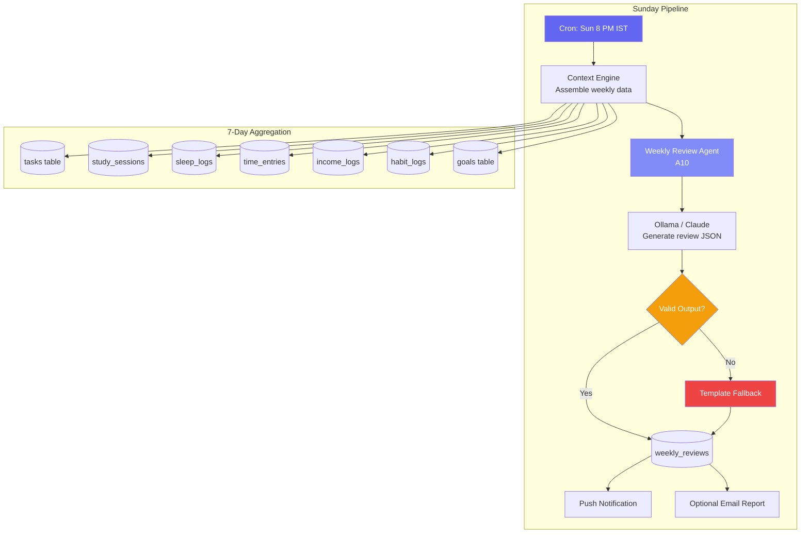
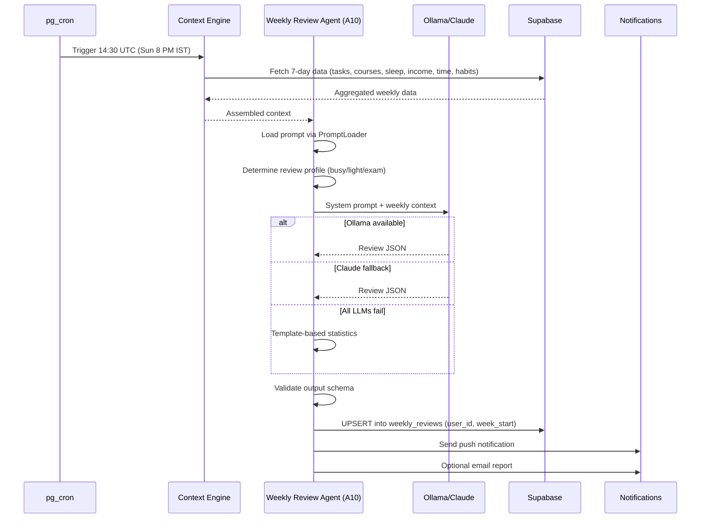
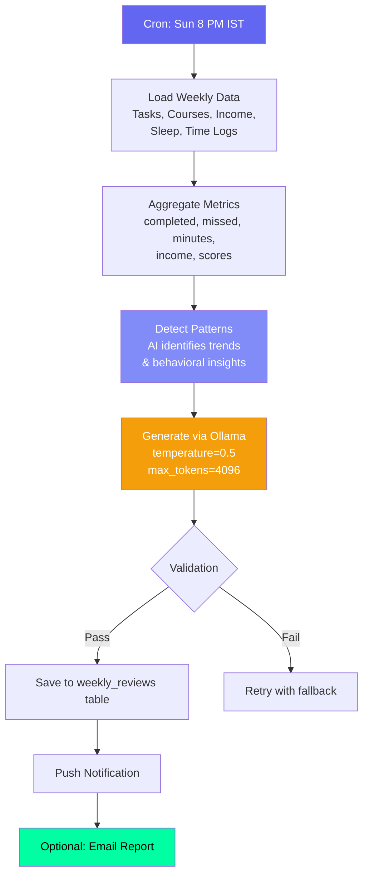

# Weekly Review Agent — Sunday Retrospective

## Document Control

| Field | Value |
|---|---|
| **Document ID** | AI-AGT-002 |
| **Version** | 2.0.0 |
| **Status** | Approved |
| **Date** | 2026-07-14 |
| **Classification** | Internal |
| **Owner** | Developer |
| **Review Cycle** | Monthly |
| **Prompt File** | `prompts/agents/weekly_review_agent.md` (1264 lines, v2.1.0) |
| **Agent Module** | `packages/ai/agents/weekly_review_agent.py` |
| **Agent ID** | A10 |
| **Related Docs** | [BriefingAgent.md](BriefingAgent.md), [LearningAgent.md](LearningAgent.md), [AgentArchitecture.md](../engineering/14_AgentArchitecture.md) |

---

## 1. Overview

The Weekly Review Agent generates a comprehensive weekly review every Sunday at 8 PM IST. It covers tasks completed vs missed, courses studied, income logged, sleep trends, and ARIA's pattern insight. The review serves as a weekly accountability and awareness tool, helping the user reflect on their week and plan the next one.

**Key Features:**
- 5 review profiles for different weekly contexts (busy week, light week, exam week, etc.)
- 4 few-shot examples in the prompt for consistent narrative structure
- Pattern detection via LLM analysis of cross-module data
- Push notification + optional email report delivery
- UPSERT deduplication (no duplicate reviews per week_start)

---

## 2. Architecture

### Agent Positioning



### Data Flow Sequence



---

## 3. Processing Flow



---

## 4. Input Schema

| Field | Source | Description | Range |
|---|---|---|---|
| week_start | Computed | Monday of current week | Date |
| tasks_completed | tasks table | Count completed this week | 0-100+ |
| tasks_missed | tasks table | Count missed this week | 0-100+ |
| course_minutes | study_sessions | Total study time | 0-5000 |
| income_logged | income_logs | Total income this week | 0-100000 |
| sleep_scores | sleep_logs | Daily sleep scores (7 days) | 0-100 each |
| best_day | time_logs | Most productive day | Enum |
| habit_streaks | habit_logs | Current streak data | 0-365 |
| previous_goals | weekly_reviews | Last week's focus | Text |

### Context Assembly

```python
async def assemble_weekly_context(user_id: str) -> dict:
    week_start = get_current_week_monday()
    week_end = week_start + timedelta(days=6)

    tasks_completed = await supabase.table("tasks")\
        .select("count", "title")\
        .eq("user_id", user_id)\
        .eq("status", "done")\
        .gte("updated_at", week_start.isoformat())\
        .lte("updated_at", week_end.isoformat())\
        .execute()

    study_time = await supabase.table("study_sessions")\
        .select("duration_minutes")\
        .eq("user_id", user_id)\
        .gte("start_time", week_start.isoformat())\
        .execute()

    return {
        "week_start": week_start.isoformat(),
        "tasks_completed": len(tasks_completed.data),
        "tasks_missed": await count_missed_tasks(user_id, week_start),
        "study_minutes": sum(s["duration_minutes"] for s in study_time.data),
        "sleep_scores": await get_weekly_sleep_scores(user_id, week_start),
        "income_total": await get_weekly_income(user_id, week_start),
    }
```

---

## 5. Output Schema

```json
{
  "week_start": "2026-07-06",
  "week_end": "2026-07-12",
  "overall_score": 78,
  "tasks_completed": 12,
  "tasks_missed": 3,
  "task_completion_rate": 80,
  "courses_studied_minutes": 450,
  "income_logged": 250.00,
  "best_day": "Tuesday",
  "aria_pattern_insight": "You're most productive in morning sessions...",
  "focus_for_next_week": "Prioritize DSA practice before exam",
  "habit_consistency": 85,
  "sleep_avg_score": 72,
  "sleep_trend": "stable",
  "improvement_areas": ["Evening routine consistency"]
}
```

### Output Validation

| Field | Rule |
|---|---|
| overall_score | 0-100 integer |
| task_completion_rate | 0-100 percentage |
| aria_pattern_insight | 50-200 chars |
| focus_for_next_week | 1-3 items, max 150 chars each |

---

## 6. LLM Configuration

| Parameter | Value | Rationale |
|---|---|---|
| Model | Ollama (Mistral 7B) | Free, private |
| Temperature | 0.5 | Balanced |
| Max tokens | 4096 | Large output budget |
| Fallback model | Claude Sonnet 4 | Cloud backup |
| Retry attempts | 3 | With backoff (2s, 4s, 8s) |

---

## 7. Prompt Usage

```python
from ai.prompt_loader import prompts

entry = prompts.get_agent("weekly_review_agent")
if entry:
    system_prompt = entry.system_prompt
    user_prompt = f"Weekly review for {week_start} to {week_end}\nData: {aggregated_data}"
else:
    system_prompt = "You generate weekly productivity reviews."
    user_prompt = f"Generate review for week starting {week_start}"
```

### Review Profiles

The prompt file includes 5 review profiles that adapt the narrative tone:

| Profile | When Used | Narrative Style |
|---|---|---|
| Productive Week | Completion rate > 80% | Celebratory, reinforcing |
| Busy but Scattered | High tasks attempted, low completion | Redirecting, strategic |
| Light Week | Low task count | Gentle re-engagement |
| Exam Week | High study time, low tasks | Supportive, balanced |
| Recovery Week | After multiple low weeks | Encouraging, fresh start |

---

## 8. Fallback Behavior

| Failure Mode | Fallback | Result |
|---|---|---|
| LLM unavailable | Template with statistics | Data-only review, no insights |
| Supabase error | Partial data review | Missing data labeled |
| Empty week data | "No data this week" | Neutral, encouraging response |
| Pattern detection fails | Aggregate stats only | Missing behavioral insight |

### Template Fallback Implementation

```python
def generate_template_review(context: dict) -> dict:
    week_start = context.get("week_start")
    completed = context.get("tasks_completed", 0)
    missed = context.get("tasks_missed", 0)
    total = completed + missed
    completion_rate = round((completed / total) * 100, 1) if total > 0 else 0

    return {
        "week_start": week_start,
        "overall_score": completion_rate,
        "tasks_completed": completed,
        "tasks_missed": missed,
        "task_completion_rate": completion_rate,
        "aria_pattern_insight": f"You completed {completed} of {total} tasks this week.",
        "focus_for_next_week": "Review your goals and set priorities",
    }
```

---

## 9. Failure Modes

| Mode | Handling |
|---|---|
| No tasks completed | Show empty stats, suggest next week focus |
| Income data missing | Omit income section |
| Sleep data incomplete (3/7 days) | Average available days, note gap |
| Review too long | Truncate to 4096 tokens, log warning |
| Cron job missed (> 2h delay) | Generate on next trigger (late, with note) |
| Duplicate week review | UPSERT on (user_id, week_start) |
| All metrics zero (new user) | "Welcome! Your first week's data..." |

### Recovery Strategy

| Scenario | Action |
|---|---|
| Review not generated | Retry at +15min, +30min, then skip |
| Partial review | Store partial, flag for regeneration |
| Email delivery fails | Log error, show in-app only |

---

## 10. Error Handling

```python
async def generate_weekly_review(user_id: str) -> dict:
    week_start = get_current_week_monday()

    # Check for existing review to avoid duplicates
    existing = await supabase.table("weekly_reviews")\
        .select("id")\
        .eq("user_id", user_id)\
        .eq("week_start", week_start.isoformat())\
        .execute()
    if existing.data:
        logger.info(f"Review already exists for week {week_start}")
        return existing.data[0]

    try:
        context = await assemble_weekly_context(user_id)
        response = await llm.generate_json(user_prompt, system=system_prompt)
        review = parse_and_validate_response(response)
    except Exception as e:
        logger.error(f"Review generation failed: {e}, using fallback")
        review = generate_template_review(context)

    review["user_id"] = user_id
    review["week_start"] = week_start.isoformat()
    result = await supabase.table("weekly_reviews").upsert(review).execute()
    return result.data[0]
```

---

## 11. Performance Targets

| Operation | Target |
|---|---|
| Data aggregation (7 days) | < 1s |
| LLM generation | < 20s |
| Total pipeline | < 25s |
| Storage per review | < 2KB |
| Notification delivery | < 5s |

---

## 12. Related Documents

| Document | Description |
|---|---|
| [prompts/agents/weekly_review_agent.md](../../prompts/agents/weekly_review_agent.md) | Full prompt template (1264 lines) |
| [BriefingAgent.md](BriefingAgent.md) | Daily counterpart (A09) |
| [AgentArchitecture.md](../engineering/14_AgentArchitecture.md) | Agent system architecture |
| [LearningAgent.md](LearningAgent.md) | Pattern detection companion |
| [Analytics API](../../apps/api/app/api/analytics.py) | Analytics endpoint |
| [WeeklyReviews API](../../apps/api/app/api/reviews.py) | API endpoint |
| [14_AgentArchitecture.md §A10](../engineering/14_AgentArchitecture.md) | Agent registry reference |

---

## Revision History

| Version | Date | Author | Changes |
|---|---|---|---|
| 1.0.0 | 2026-07-10 | Developer | Initial agent documentation |
| 2.0.0 | 2026-07-14 | Developer | Expanded to full enterprise reference. Added architecture diagram, sequence diagram, context assembly code, algorithmic fallback implementation, review profiles table, error handling code, performance targets, and cross-references. |
