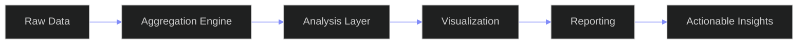
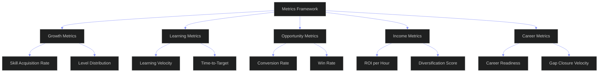

# SkillAnalytics — Enterprise Skill Analytics Platform

---

## Document Control

| Field | Value |
|---|---|
| Document ID | SB-SKILLANALYTICS-ARCH-001 |
| Version | 1.0.0 |
| Status | Active |
| Last Updated | 2026-06-13 |
| Classification | Internal — Architecture Reference |
| Source of Truth | `docs/ai/skills/skills.md` (§19 Analytics, §32 Enterprise KPIs) |
| Companion Docs | `docs/ai/skills/SkillIntelligence.md` (Scoring Engine) |
| | `docs/ai/skills/SkillMarketIntelligence.md` (Market Engine) |
| | `docs/ai/skills/SkillOpportunityMatching.md` (Opportunity Engine) |
| | `docs/ai/skills/SkillAgent.md` (Agent Observability) |
| | `docs/ai/skills/SkillEvidence.md` (Evidence Engine) |
| | `docs/ai/skills/SkillRoadmapEngine.md` (Roadmap Engine) |
| Target Stack | Python 3.11+ + PostgreSQL + Redis + Prometheus + Grafana + FastAPI |
| Target Audience | Data Engineers, ML Engineers, Architects, Executives, Product Managers |

---

## Table of Contents

- [0. Enterprise Analytics Overview](#0-enterprise-analytics-overview)
  - [0.1 Purpose](#01-purpose)
  - [0.2 Architecture Diagram](#02-architecture-diagram)
  - [0.3 Role Hierarchy](#03-role-hierarchy)
  - [0.4 Relationship to Companion Docs](#04-relationship-to-companion-docs)
  - [0.5 Data Retention & Partitioning](#05-data-retention--partitioning)
- [1. Metrics Framework](#1-metrics-framework)
  - [1.1 Metric Taxonomy](#11-metric-taxonomy)
  - [1.2 Dimension Model](#12-dimension-model)
  - [1.3 Formula Registry](#13-formula-registry)
  - [1.4 Metric Naming Convention](#14-metric-naming-convention)
- [2. Dashboards](#2-dashboards)
  - [2.1 Dashboard Engine](#21-dashboard-engine)
  - [2.2 User Growth Dashboard](#22-user-growth-dashboard)
  - [2.3 Manager Team Dashboard](#23-manager-team-dashboard)
  - [2.4 Admin Pipeline Dashboard](#24-admin-pipeline-dashboard)
  - [2.5 Executive Org Health Dashboard](#25-executive-org-health-dashboard)
  - [2.6 Market Intelligence Dashboard](#26-market-intelligence-dashboard)
  - [2.7 Custom Dashboard Builder](#27-custom-dashboard-builder)
- [3. Growth Tracking](#3-growth-tracking)
  - [3.1 Skill Acquisition Rate](#31-skill-acquisition-rate)
  - [3.2 Level Distribution Shifts](#32-level-distribution-shifts)
  - [3.3 Category Breakdown Trends](#33-category-breakdown-trends)
  - [3.4 Cohort Analysis](#34-cohort-analysis)
  - [3.5 Skill Health Heatmap](#35-skill-health-heatmap)
- [4. Learning Velocity](#4-learning-velocity)
  - [4.1 Velocity Formula Engine](#41-velocity-formula-engine)
  - [4.2 Velocity by Category](#42-velocity-by-category)
  - [4.3 Learning Rate Deceleration Detection](#43-learning-rate-deceleration-detection)
  - [4.4 Time-to-Target Tracking](#44-time-to-target-tracking)
  - [4.5 Velocity Percentile Bands](#45-velocity-percentile-bands)
- [5. Opportunity Conversion](#5-opportunity-conversion)
  - [5.1 Cross-Source Funnel](#51-cross-source-funnel)
  - [5.2 Source Efficiency Ranking](#52-source-efficiency-ranking)
  - [5.3 Win-Rate Trending](#53-win-rate-trending)
  - [5.4 Time-to-Conversion Distributions](#54-time-to-conversion-distributions)
  - [5.5 Salary Impact Tracking](#55-salary-impact-tracking)
- [6. Income Analytics](#6-income-analytics)
  - [6.1 Portfolio Income Tracking](#61-portfolio-income-tracking)
  - [6.2 ROI Per Learning Hour](#62-roi-per-learning-hour)
  - [6.3 Diversification Score Trending](#63-diversification-score-trending)
  - [6.4 Income Projection vs Actual](#64-income-projection-vs-actual)
  - [6.5 Skill-by-Skill Income Attribution](#65-skill-by-skill-income-attribution)
- [7. Career Analytics](#7-career-analytics)
  - [7.1 Career Readiness Trending](#71-career-readiness-trending)
  - [7.2 Gap Closure Velocity](#72-gap-closure-velocity)
  - [7.3 Milestone Completion Rates](#73-milestone-completion-rates)
  - [7.4 Trajectory Comparison](#74-trajectory-comparison)
  - [7.5 Stale Target Detection](#75-stale-target-detection)
- [8. Predictive Analytics](#8-predictive-analytics)
  - [8.1 Forecasting Models](#81-forecasting-models)
  - [8.2 Skill Demand Prediction](#82-skill-demand-prediction)
  - [8.3 Early Warning System](#83-early-warning-system)
  - [8.4 Confidence Intervals](#84-confidence-intervals)
- [9. Executive Reports](#9-executive-reports)
  - [9.1 Report Engine](#91-report-engine)
  - [9.2 Executive Brief Template](#92-executive-brief-template)
  - [9.3 Org Health Report Template](#93-org-health-report-template)
  - [9.4 Team Deep Dive Template](#94-team-deep-dive-template)
  - [9.5 Skill Gap Report Template](#95-skill-gap-report-template)
  - [9.6 ROI Analysis Report Template](#96-roi-analysis-report-template)
  - [9.7 Export Pipeline](#97-export-pipeline)
- [10. Enterprise KPIs](#10-enterprise-kpis)
  - [10.1 Unified KPI Framework](#101-unified-kpi-framework)
  - [10.2 KPI Calculation Engine](#102-kpi-calculation-engine)
  - [10.3 KPI Gate](#103-kpi-gate)
  - [10.4 Alert Engine](#104-alert-engine)
- [Appendix A: Glossary](#appendix-a-glossary)
- [Appendix B: Complete Formula Reference](#appendix-b-complete-formula-reference)
- [Appendix C: Analytics Database Schemas](#appendix-c-analytics-database-schemas)
- [Appendix D: Grafana Dashboard JSON](#appendix-d-grafana-dashboard-json)
- [Appendix E: Enterprise Rollout Plan](#appendix-e-enterprise-rollout-plan)

---

## Analytics Pipeline



## Metrics Taxonomy



---

## 0. Enterprise Analytics Overview

### 0.1 Purpose

SkillAnalytics is the **Unified Analytics Execution Engine** for the entire ARIA OS skills ecosystem. All 8 companion engine documents generate data — assessments, evidence scores, market intelligence, roadmaps, opportunity matches, agent recommendations — but none provides cross-engine aggregation, trend computation, dashboard rendering, report generation, or predictive modeling. SkillAnalytics fills that gap.

It ingests from all 8 engines, normalizes into a unified metric store, computes trends and forecasts, renders 6 role-based dashboards, generates 5 executive report templates, and maintains 15 enterprise KPIs with alerting.

### 0.2 Architecture Diagram

```
┌────────────────────────────────────────────────────────────────────────────────────┐
│                          DATA SOURCES (8 Companion Engines)                        │
├──────────┬──────────┬──────────┬──────────┬──────────┬──────────┬──────────┬───────┤
│ Skill    │ Skill    │ Skill    │ Skill    │ Market   │ Opp      │ Roadmap  │ Agent │
│ Assess-  │ Evidence │ Intelli- │ Graph    │ Intel-   │ Matching │ Engine   │ Obser-│
│ ment     │          │ gence    │          │ ligence  │          │          │ vabil-│
│ Engine   │ Engine   │ Engine   │ Engine   │ Engine   │ Engine   │ Engine   │ ity   │
├──────────┴──────────┴──────────┴──────────┴──────────┴──────────┴──────────┴───────┤
│                              INGESTION LAYER                                       │
│  ┌───────────┐ ┌──────────┐ ┌───────────┐ ┌──────────┐ ┌──────────┐ ┌──────────┐ │
│  │ Event     │ │ Metric   │ │ Snapshot  │ │ Webhook  │ │ Batch    │ │ API      │ │
│  │ Stream    │ │ Push     │ │ Pull      │ │ Listener │ │ Import   │ │ Poller   │ │
│  └───────────┘ └──────────┘ └───────────┘ └──────────┘ └──────────┘ └──────────┘ │
├────────────────────────────────────────────────────────────────────────────────────┤
│                         UNIFIED METRIC STORE                                       │
│  ┌──────────────────────┐ ┌──────────────────────┐ ┌──────────────────────────┐   │
│  │ Time-Series DB       │ │ Relational (Postgres) │ │ Materialized Views      │   │
│  │ skill_analytics_ts   │ │ skill_analytics_events│ │ kpi_snapshots           │   │
│  │ (hot: 30d SSD)       │ │ metric_definitions    │ │ dashboard_snapshots     │   │
│  │ warm: 90d)           │ │ report_schedule       │ │ report_history          │   │
│  └──────────────────────┘ └──────────────────────┘ └──────────────────────────┘   │
├────────────────────────────────────────────────────────────────────────────────────┤
│                         COMPUTATION LAYER                                          │
│  ┌────────────┐ ┌────────────┐ ┌────────────┐ ┌────────────┐ ┌───────────────┐   │
│  │ Metrics    │ │ Trend      │ │ Forecasting│ │ Alert      │ │ Report        │   │
│  │ Calculator │ │ Analyzer   │ │ Engine     │ │ Engine     │ │ Generator     │   │
│  └────────────┘ └────────────┘ └────────────┘ └────────────┘ └───────────────┘   │
├────────────────────────────────────────────────────────────────────────────────────┤
│                              PRESENTATION LAYER                                    │
│  ┌──────────────────┐ ┌──────────────────┐ ┌──────────────────┐ ┌───────────────┐ │
│  │ 6 Role-Based     │ │ 5 Report         │ │ Alert Center     │ │ Export API    │ │
│  │ Dashboards       │ │ Templates        │ │ + Notifications  │ │ (PDF/CSV)     │ │
│  │ (Grafana)        │ │ (PDF/MD/HTML)    │ │ (Slack/Email)    │ │               │ │
│  └──────────────────┘ └──────────────────┘ └──────────────────┘ └───────────────┘ │
└────────────────────────────────────────────────────────────────────────────────────┘
```

### 0.3 Role Hierarchy

Four tiers of analytics access with progressively broader scope:

```
Role Hierarchy

┌─────────────────────────────────────────────────────────────────────────┐
│  TIER 1: USER                                                           │
│  Scope: Self only                                                       │
│  Sees: Personal Growth Dashboard, personal Learning Velocity,           │
│        personal Career Readiness, personal Income Analytics             │
│  Access: /api/analytics/user/:id/*                                      │
│  Dashboards: User Growth Dashboard                                      │
├─────────────────────────────────────────────────────────────────────────┤
│  TIER 2: MANAGER                                                        │
│  Scope: Direct reports + self                                           │
│  Sees: Team Skill Heatmap, team Learning Velocity comparison,           │
│        team Career Readiness summary, team Gap Report                   │
│  Access: /api/analytics/team/:id/*, owns User scope                    │
│  Dashboards: Manager Team Dashboard                                     │
├─────────────────────────────────────────────────────────────────────────┤
│  TIER 3: ADMIN                                                          │
│  Scope: Organization-wide                                               │
│  Sees: Pipeline Health, Data Freshness, System KPIs,                    │
│        all team dashboards, usage analytics, cost analytics             │
│  Access: /api/analytics/admin/*, owns Manager scope                    │
│  Dashboards: Admin Pipeline Dashboard + all lower tiers                │
├─────────────────────────────────────────────────────────────────────────┤
│  TIER 4: EXECUTIVE                                                      │
│  Scope: Business outcomes                                               │
│  Sees: Org Health Scorecard, 15 KPIs with trends,                       │
│        ROI Analysis, Executive Briefs, Market Intelligence             │
│  Access: /api/analytics/exec/*, owns Admin scope                       │
│  Dashboards: Executive Org Health Dashboard + all lower tiers          │
└─────────────────────────────────────────────────────────────────────────┘
```

### 0.4 Relationship to Companion Docs

| Document | Role | Integration |
|---|---|---|
| `SkillIntelligence.md` | Scoring pipeline, evaluation, monitoring | Provides `skill_intelligence_scores` and score drift data |
| `SkillMarketIntelligence.md` | Market data, trend analysis | Provides `skill_market_data` for demand/salary analytics |
| `SkillOpportunityMatching.md` | Opportunity scoring, conversion | Provides `opportunity_analytics_events` for funnel analytics |
| `SkillAgent.md` | Agent observability, KPIs | Provides `skill_events` and sub-agent latency metrics |
| `SkillEvidence.md` | Evidence analytics, fraud | Provides `evidence_analytics_snapshots` |
| `SkillAssessment.md` | Assessment execution | Provides `skill_assessments` for completion/accuracy tracking |
| `SkillRoadmapEngine.md` | Roadmap execution | Provides `skill_roadmaps` and `skill_roadmap_milestones` |
| **SkillAnalytics** | **Cross-engine aggregation** | **Ingests from all, unifies, reports** |

### 0.5 Data Retention & Partitioning

```python
RETENTION_POLICY = {
    "hot": {
        "duration": "30 days",
        "storage": "SSD (TimescaleDB hypertable)",
        "resolution": "Raw events, 1-minute rollups",
        "backup": "Daily incremental"
    },
    "warm": {
        "duration": "90 days",
        "storage": "Standard SSD",
        "resolution": "5-minute rollups, raw events downsampled",
        "backup": "Weekly full"
    },
    "cold": {
        "duration": "2 years",
        "storage": "HDD / Object store (S3-compatible)",
        "resolution": "Hourly rollups, daily aggregates",
        "backup": "Monthly full"
    },
    "archive": {
        "duration": "10 years",
        "storage": "Glacier / Cold storage",
        "resolution": "Daily aggregates, monthly snapshots",
        "backup": "Quarterly"
    }
}

PARTITIONING_STRATEGY = {
    "time_series": "TimescaleDB hypertable by created_at (1 week chunks)",
    "events": "PostgreSQL table partitioning by month on created_at",
    "snapshots": "Partitioned by (snapshot_type, snapshot_date)",
    "reports": "Stored as JSONB, no partitioning (low volume)"
}
```

---

## 1. Metrics Framework

### 1.1 Metric Taxonomy

Every metric in the analytics system belongs to one of three tiers:

```
TIER 1: RAW METRICS (directly measured from source engines)
├── Counters:         skill_assessments_completed, evidence_submitted, recommendations_shown
├── Gauges:           current_skill_count, avg_skill_level, active_users
├── Histograms:       assessment_duration_seconds, evidence_verification_latency
└── Events:           user_login, skill_created, target_achieved, opportunity_applied

TIER 2: COMPUTED KPIs (derived from one or more raw metrics)
├── Growth:           skill_acquisition_rate, level_distribution_shift, category_growth
├── Velocity:         learning_velocity, time_to_target, velocity_delta
├── Quality:          assessment_accuracy, evidence_quality_score, recommendation_acceptance
├── Conversion:       view_to_apply_rate, apply_to_win_rate, source_efficiency
├── Financial:        income_potential, roi_per_hour, diversification_score
├── Career:           career_readiness, gap_closure_rate, milestone_completion
└── Operational:      pipeline_latency_p95, data_freshness, cache_hit_ratio

TIER 3: BUSINESS OUTCOMES (strategic, board-reportable)
├── Org Readiness:    % org meeting career targets, skill coverage ratio
├── ROI:              salary_growth_per_user, learning_cost_per_level, time_saved
├── Retention:        user_retention_rate, skill_system_nps, engagement_score
└── Talent:           internal_mobility_rate, time_to_productivity, skill_gap_closure
```

### 1.2 Dimension Model

Every metric can be sliced by these dimensions:

```python
ANALYTICS_DIMENSIONS = {
    "user": {
        "type": "entity",
        "hierarchy": ["user_id", "team_id", "department_id", "org_id"],
        "attributes": ["role", "tenure_months", "plan_tier", "region"]
    },
    "skill": {
        "type": "entity",
        "hierarchy": ["canonical_id", "category", "subcategory", "domain"],
        "attributes": ["level", "state", "market_demand_score"]
    },
    "time": {
        "type": "temporal",
        "hierarchy": ["minute", "hour", "day", "week", "month", "quarter", "year"],
        "attributes": ["is_business_hours", "day_of_week", "month_of_year"]
    },
    "source": {
        "type": "categorical",
        "hierarchy": ["engine_doc", "sub_agent", "integration_type"],
        "attributes": ["version", "status", "latency_p95"]
    },
    "event": {
        "type": "categorical",
        "hierarchy": ["event_type", "event_category", "event_severity"],
        "attributes": ["metadata", "duration_ms"]
    }
}
```

### 1.3 Formula Registry

All analytics formulas from across the 8 companion engines are registered here:

```python
FORMULA_REGISTRY = {
    "skill_acquisition_rate": {
        "id": "F-001",
        "name": "Skill Acquisition Rate",
        "source": "skills.md §19.4",
        "formula": "new_skills_added_per_quarter / total_active_skills",
        "target": "> 0.15",
        "frequency": "weekly"
    },
    "learning_velocity": {
        "id": "F-002",
        "name": "Learning Velocity",
        "source": "skills.md §19.4",
        "formula": "avg(level_gain_per_month) across active skills",
        "target": "> 0.25 levels/month",
        "frequency": "weekly"
    },
    "career_readiness": {
        "id": "F-003",
        "name": "Career Readiness Score",
        "source": "skills.md §19.5",
        "formula": "avg(min(1.0, current_level / target_level)) * 100",
        "target": "> 60%",
        "frequency": "weekly"
    },
    "opportunity_match_score": {
        "id": "F-004",
        "name": "Opportunity Match Score",
        "source": "skills.md §19.6",
        "formula": "avg(match_score(opportunity_i, user_skills))",
        "target": "> 0.65",
        "frequency": "daily"
    },
    "income_potential": {
        "id": "F-005",
        "name": "Income Potential Score",
        "source": "skills.md §19.7",
        "formula": "normalized_sum(income_forecast(monetizable_skills))",
        "target": "> 60 / 100",
        "frequency": "monthly"
    },
    "recommendation_acceptance_rate": {
        "id": "F-006",
        "name": "Recommendation Acceptance Rate",
        "source": "SkillIntel.md §10",
        "formula": "accepted / (accepted + dismissed) * 100",
        "target": "> 30%",
        "frequency": "weekly"
    },
    "skill_maturity_score": {
        "id": "F-007",
        "name": "Skill Maturity Score",
        "source": "SkillIntel.md App A",
        "formula": "0.30*Level + 0.20*Confidence + 0.25*Evidence + 0.15*Recency + 0.10*Consistency",
        "target": "> 60 / 100",
        "frequency": "weekly"
    },
    "evidence_quality_score": {
        "id": "F-008",
        "name": "Evidence Quality Score",
        "source": "SkillEvidence.md §5",
        "formula": "avg(quality_score) across verified evidence",
        "target": "> 0.75",
        "frequency": "weekly"
    },
    "view_to_apply_rate": {
        "id": "F-009",
        "name": "View to Apply Conversion",
        "source": "SkillOpp.md §7",
        "formula": "opportunities_applied / opportunities_viewed",
        "target": "> 0.15",
        "frequency": "weekly"
    },
    "skill_gap_closure_rate": {
        "id": "F-010",
        "name": "Skill Gap Closure Rate",
        "source": "SkillOpp.md §9",
        "formula": "gaps_closed / gaps_identified",
        "target": "> 0.60",
        "frequency": "monthly"
    },
    "income_diversification": {
        "id": "F-011",
        "name": "Income Diversification Score",
        "source": "skills.md §18.6",
        "formula": "0.40*Source_Count + 0.30*Income_Balance + 0.20*Skill_Diversity + 0.10*Stability",
        "target": "> 60 / 100",
        "frequency": "monthly"
    },
    "data_freshness": {
        "id": "F-012",
        "name": "Analytics Data Freshness",
        "source": "SkillIntel.md §10",
        "formula": "% of metric streams with data < 24h old",
        "target": "> 95%",
        "frequency": "daily"
    }
}
```

### 1.4 Metric Naming Convention

```python
METRIC_NAMING = {
    "pattern": "{domain}_{entity}_{metric}",
    "examples": [
        "skill_user_acquisition_rate",
        "learning_user_velocity_monthly",
        "career_user_readiness_pct",
        "opportunity_team_conversion_funnel",
        "income_org_potential_total",
        "pipeline_system_freshness_pct",
        "evidence_user_quality_score",
        "assessment_user_accuracy_pct"
    ],
    "rules": [
        "All lowercase with underscores",
        "Domain from: skill, learning, career, opportunity, income, pipeline, evidence, assessment, market, agent",
        "Entity from: user, team, org, system, skill, category",
        "Metric suffix: _rate, _pct, _score, _total, _avg, _p50, _p95, _p99, _count"
    ]
}


---

## 2. Dashboards

### 2.1 Dashboard Engine

```python
@dataclass
class DashboardConfig:
    dashboard_id: str
    title: str
    role: Literal["user", "manager", "admin", "executive"]
    panels: list[PanelConfig]
    refresh_interval_seconds: int = 300
    time_range_default: str = "last_30d"
    time_range_options: list[str] = field(default_factory=lambda: ["7d", "30d", "90d", "12mo"])

@dataclass
class PanelConfig:
    panel_id: str
    title: str
    type: Literal["stat", "gauge", "graph", "table", "heatmap", "bar", "pie", "bargauge", "singlestat"]
    metric: str
    dimensions: dict = field(default_factory=dict)
    filters: dict = field(default_factory=dict)
    thresholds: dict = field(default_factory=dict)
    targets: list[dict] = field(default_factory=list)

class DashboardEngine:
    def __init__(self, db, cache):
        self.db = db; self.cache = cache

    async def render(self, dashboard_id: str, user_id: str, role: str,
                     time_range: str = "last_30d") -> dict:
        config = DASHBOARD_REGISTRY.get(dashboard_id)
        if not config or ANALYTICS_ROLES.index(role) < ANALYTICS_ROLES.index(config.role):
            raise PermissionError(f"Role {role} cannot access {dashboard_id}")
        panels = []
        for panel in config.panels:
            data = await self._query_panel(panel, user_id, role, time_range)
            panels.append({"config": panel.__dict__, "data": data})
        return {"dashboard_id": dashboard_id, "title": config.title,
                "time_range": time_range, "panels": panels, "rendered_at": datetime.utcnow().isoformat()}

    async def _query_panel(self, panel: PanelConfig, user_id: str, role: str, time_range: str) -> list:
        cache_key = f"dash:{panel.panel_id}:{user_id}:{role}:{time_range}"
        cached = self.cache.get(cache_key)
        if cached: return cached
        query = self._build_query(panel, user_id, role, time_range)
        rows = await self.db.fetch_all(query)
        self.cache[cache_key] = rows
        return rows

    def _build_query(self, panel, user_id, role, time_range) -> str:
        base = f"SELECT {panel.metric} FROM skill_analytics_ts WHERE "
        if role == "user":
            base += f"user_id = '{user_id}'"
        elif role == "manager":
            base += f"team_id IN (SELECT team_id FROM user_teams WHERE manager_id = '{user_id}')"
        elif role in ("admin", "executive"):
            base += "org_id = (SELECT org_id FROM users WHERE id = '{user_id}')"
        time_condition = self._time_range_filter(time_range)
        base += f" AND created_at {time_condition}"
        for dim, val in panel.dimensions.items():
            base += f" AND {dim} = '{val}'"
        return base

    def _time_range_filter(self, time_range: str) -> str:
        mapping = {"last_7d": "> now() - interval '7 days'", "last_30d": "> now() - interval '30 days'",
                   "last_90d": "> now() - interval '90 days'", "last_12mo": "> now() - interval '12 months'"}
        return mapping.get(time_range, "> now() - interval '30 days'")
```

### 2.2 User Growth Dashboard

**Role:** User (Tier 1) | **Refresh:** 5 min | **Default range:** 30 days

```
┌─────────────────────────────────────────────────────────────────────────────┐
│  USER GROWTH DASHBOARD — John Doe                                           │
├─────────────────────────────────────────────────────────────────────────────┤
│ ┌──────────────┐ ┌──────────────┐ ┌──────────────┐ ┌──────────────┐       │
│ │ Total Skills │ │ Avg Level    │ │ This Month   │ │ Streak       │       │
│ │ 24           │ │ L2.7         │ │ +3 skills    │ │ 12 days      │       │
│ └──────────────┘ └──────────────┘ └──────────────┘ └──────────────┘       │
├─────────────────────────────────────────────────────────────────────────────┤
│ ┌──────────────────────────────────────────────────────────────────────────┐│
│ │ Level Distribution (bar)                              L0 L1 L2 L3 L4 L5 ││
│ │ ┃━━━━━━━━━━━━━━━━━━━━━━━━━━━━━━━━━━━━━━━━━━━━━━━━━━━━━━━━━━━━━━━━━━━━━┃││
│ │ 12 ┃███                                                               ┃││
│ │ 8  ┃██████████                                                        ┃││
│ │ 4  ┃███████████████████████                                           ┃││
│ │ 0  ┃████████████████████████████████████████████████████              ┃││
│ │    ┃──L0────L1────L2────L3────L4────L5                               ┃││
│ └──────────────────────────────────────────────────────────────────────────┘│
├─────────────────────────────────────────────────────────────────────────────┤
│ ┌────────────────────────────┐ ┌───────────────────────────────────────────┐│
│ │ Learning Velocity (graph) │ │ Category Breakdown (pie)                  ││
│ │ ┃━━━━━━━━━━━━━━━━━━━━━━━┃│ │ ┌──────────┐                              ││
│ │ 0.5┤       ╱╲            ┃│ │ │ Backend  │ 30%                          ││
│ │ 0.4┤      ╱  ╲     ╱╲   ┃│ │ │ Frontend │ 25%                          ││
│ │ 0.3┤     ╱    ╲   ╱  ╲  ┃│ │ │ AI/ML    │ 20%                          ││
│ │ 0.2┤    ╱      ╲ ╱    ╲ ┃│ │ │ DevOps   │ 15%                          ││
│ │    └────────────────────┘│ │ │ Other    │ 10%                          ││
│ │    Jan Feb Mar Apr May   │ │ └──────────┘                              ││
│ └────────────────────────────┘ └───────────────────────────────────────────┘│
├─────────────────────────────────────────────────────────────────────────────┤
│ ┌──────────────────────────────────────────────────────────────────────────┐│
│ │ Recent Progress (table)                                                  ││
│ │ Skill         ┃ Before ┃ After ┃ Date       ┃ Source                    ││
│ │ React.js      ┃ L2     ┃ L3    ┃ 2026-06-10 ┃ Assessment                ││
│ │ TypeScript    ┃ L1     ┃ L2    ┃ 2026-06-08 ┃ Course Completion         ││
│ │ Docker        ┃ L2     ┃ L3    ┃ 2026-06-05 ┃ Project Evidence          ││
│ │ Python        ┃ L3     ┃ L4    ┃ 2026-05-28 ┃ Assessment                ││
│ └──────────────────────────────────────────────────────────────────────────┘│
└─────────────────────────────────────────────────────────────────────────────┘
```

**Panel Configuration:**

```python
USER_GROWTH_DASHBOARD = DashboardConfig(
    dashboard_id="user_growth",
    title="User Growth Dashboard",
    role="user",
    panels=[
        PanelConfig("total_skills", "Total Skills", "stat", "count(DISTINCT skill_id)"),
        PanelConfig("avg_level", "Average Level", "stat", "avg(level)"),
        PanelConfig("skills_this_month", "Skills Added This Month", "stat", "count(*) FILTER (WHERE created_at > now() - interval '30 days')"),
        PanelConfig("streak", "Learning Streak", "stat", "streak_days"),
        PanelConfig("level_distribution", "Level Distribution", "bar", "level, count(*)"),
        PanelConfig("learning_velocity", "Learning Velocity", "graph", "date, avg_level_gain"),
        PanelConfig("category_breakdown", "Category Breakdown", "pie", "category, count(*)"),
        PanelConfig("recent_progress", "Recent Progress", "table", "skill_name, level_before, level_after, assessed_at"),
    ]
)
```

### 2.3 Manager Team Dashboard

**Role:** Manager (Tier 2) | **Refresh:** 5 min | **Default range:** 90 days

```
┌─────────────────────────────────────────────────────────────────────────────┐
│  MANAGER TEAM DASHBOARD — Engineering Team (8 members)                     │
├─────────────────────────────────────────────────────────────────────────────┤
│ ┌──────────────┐ ┌──────────────┐ ┌──────────────┐ ┌──────────────┐       │
│ │ Team Size    │ │ Avg Skills   │ │ Avg Level    │ │ Growth (QoQ) │       │
│ │ 8            │ │ 18.5/user    │ │ L2.5         │ │ +0.3 lvl/qtr │       │
│ └──────────────┘ └──────────────┘ └──────────────┘ └──────────────┘       │
├─────────────────────────────────────────────────────────────────────────────┤
│ ┌──────────────────────────────────────────────────────────────────────────┐│
│ │ Skill Heatmap (by team member)                                          ││
│ │               Python React TS  Docker K8s  AWS  SQL  GraphQL            ││
│ │ Alice         L4     L3    L4   L2    L1   L3   L3   L2                ││
│ │ Bob           L3     L4    L3   L3    L2   L2   L4   L1                ││
│ │ Carol         L2     L2    L1   L4    L3   L3   L2   L0                ││
│ │ Dave          L4     L3    L3   L2    L1   L4   L3   L2                ││
│ │ Emma          L3     L4    L4   L3    L2   L2   L3   L3                ││
│ │ ──Team Avg──  L3.2   L3.2  L3.0 L2.8  L1.8 L2.8 L3.0 L1.6             ││
│ │ Target:       L4     L4    L4   L3    L3   L4   L4   L3                ││
│ │ ──Gap───      -0.8   -0.8  -1.0 -0.2  -1.2 -1.2 -1.0 -1.4             ││
│ └──────────────────────────────────────────────────────────────────────────┘│
├─────────────────────────────────────────────────────────────────────────────┤
│ ┌────────────────────────────┐ ┌───────────────────────────────────────────┐│
│ │ Velocity Comparison        │ │ Readiness Summary                        ││
│ │ (graph, all members)       │ │ Senior BE:  62% (3/8 ready)              ││
│ │ 0.6┤    ╱╲                 │ │ Full Stack: 75% (6/8 ready)              ││
│ │ 0.5┤   ╱  ╲   ╱╲          │ │ Tech Lead:  38% (1/8 ready)              ││
│ │ 0.4┤  ╱    ╲ ╱  ╲         │ │                                           ││
│ │ 0.3┤ ╱      ╲╱    ╲        │ │ Top Gaps: K8s, AWS, GraphQL             ││
│ │ └────────────────────┬───  │ │                                           ││
│ │   Jan Feb Mar Apr May │    │ │ Team Skill Coverage: 68%                 ││
│ │          User ── Team Avg  │ │                                           ││
│ └────────────────────────────┘ └───────────────────────────────────────────┘│
└─────────────────────────────────────────────────────────────────────────────┘
```

### 2.4 Admin Pipeline Dashboard

**Role:** Admin (Tier 3) | **Refresh:** 60 sec | **Default range:** 7 days

```
┌─────────────────────────────────────────────────────────────────────────────┐
│  ADMIN PIPELINE DASHBOARD — System Health                                  │
├─────────────────────────────────────────────────────────────────────────────┤
│ ┌──────────┐ ┌──────────┐ ┌──────────┐ ┌──────────┐ ┌──────────┐          │
│ │ Pipeline │ │ Data     │ │ Cache    │ │ Avg Load │ │ Error    │          │
│ │ Health   │ │ Freshness│ │ Hit Rate │ │ 1.2      │ │ Rate     │          │
│ │ 99.2%    │ │ 97%      │ │ 72%      │ │          │ │ 0.8%     │          │
│ └──────────┘ └──────────┘ └──────────┘ └──────────┘ └──────────┘          │
├─────────────────────────────────────────────────────────────────────────────┤
│ ┌──────────────────────────────────────────────────────────────────────────┐│
│ │ Pipeline execution duration (graph, P95 by engine)                      ││
│ │ 5s┤               ╱╲                                                    ││
│ │ 4s┤     ╱╲       ╱  ╲     ╱╲                                           ││
│ │ 3s┤    ╱  ╲     ╱    ╲   ╱  ╲                                          ││
│ │ 2s┤   ╱    ╲   ╱      ╲ ╱    ╲                                         ││
│ │ 1s┤  ╱      ╲ ╱        ╲╱      ╲                                       ││
│ │   └────────────────────────────────────                                 ││
│ │    6/6 6/7  6/8  6/9  6/10 6/11 6/12                                   ││
│ │    ── Intel ── Market ── Assessment                                     ││
│ └──────────────────────────────────────────────────────────────────────────┘│
├─────────────────────────────────────────────────────────────────────────────┤
│ ┌──────────────────────┐ ┌──────────────────────┐ ┌──────────────────────┐ │
│ │ Data Freshness Gauge │ │ Sync Queue           │ │ Active Runs          │ │
│ │ Intel:  98%  █████  │ │ Intel:    0 queued   │ │ Intel:   2 running   │ │
│ │ Market: 95%  █████  │ │ Market:   3 queued   │ │ Market:  1 running   │ │
│ │ Assess: 99%  █████  │ │ Assess:   0 queued   │ │ Assess:  0 running   │ │
│ │ Evid:   96%  █████  │ │ Evid:     1 queued   │ │ Evid:    0 running   │ │
│ │ Opp:    92%  ████   │ │ Opp:      0 queued   │ │ Opp:     1 running   │ │
│ └──────────────────────┘ └──────────────────────┘ └──────────────────────┘ │
└─────────────────────────────────────────────────────────────────────────────┘
```

### 2.5 Executive Org Health Dashboard

**Role:** Executive (Tier 4) | **Refresh:** 1 hour | **Default range:** 12 months

```
┌─────────────────────────────────────────────────────────────────────────────┐
│  EXECUTIVE ORG HEALTH DASHBOARD — Q2 2026                                 │
├─────────────────────────────────────────────────────────────────────────────┤
│ ┌─────────────────┐ ┌─────────────────┐ ┌─────────────────┐ ┌────────────┐ │
│ │ Org Readiness    │ │ Skill Coverage  │ │ Learning ROI    │ │ Engagement  │ │
│ │ 67% ▲ +5% QoQ   │ │ 73% ▲ +8% QoQ   │ │ 3.2x ▲ +0.4x   │ │ NPS: 52    │ │
│ └─────────────────┘ └─────────────────┘ └─────────────────┘ └────────────┘ │
├─────────────────────────────────────────────────────────────────────────────┤
│ ┌──────────────────────────────────────────────────────────────────────────┐│
│ │ Skills Intelligence Heatmap (category × team)                           ││
│ │              Eng    Product  Design  Data    Mktg    Sales  ──Gap──     ││
│ │ Backend      92%    45%     30%     68%     20%     25%    -22%        ││
│ │ Frontend     88%    55%     75%     30%     25%     20%    -18%        ││
│ │ AI/ML        75%    30%     20%     85%     15%     10%    -28%        ││
│ │ DevOps       70%    20%     15%     55%     10%     5%     -38%        ││
│ │ Data         65%    40%     25%     90%     35%     30%    -19%        ││
│ │ ──Avg──      78%    38%     33%     66%     21%     18%    -25%        ││
│ └──────────────────────────────────────────────────────────────────────────┘│
├─────────────────────────────────────────────────────────────────────────────┤
│ ┌────────────────────────────┐ ┌──────────────────────────────────────────┐│
│ │ 15 KPIs Scorecard (table)  │ │ Market Intelligence Summary              ││
│ │ KPI                      ┃Target┃Actual┃Status│ │ Top 5 Rising Skills:         ││
│ │ Org Readiness             ┃>60%  ┃67%   │✅   │ │ Agent Eng: +45% YoY       ││
│ │ Skill Coverage            ┃>60%  ┃73%   │✅   │ │ RAG:       +40%            ││
│ │ Learning Velocity         ┃>0.25 ┃0.31  │✅   │ │ Gen AI:    +35%            ││
│ │ Rec Acceptance            ┃>30%  ┃34%   │✅   │ │ Rust:      +28%            ││
│ │ Assessment Accuracy       ┃>85%  ┃82%   │⚠️   │ │ K8s:       +22%            ││
│ │ Evidence Quality          ┃>0.75 ┃0.79  │✅   │                              ││
│ │ Gap Closure Rate          ┃>60%  ┃58%   │⚠️   │ Top 3 Skill Gaps:           ││
│ │ Data Freshness            ┃>95%  ┃97%   │✅   │ │ K8s: 54% coverage gap     ││
│ │ Time to Value             ┃<7d   ┃5.2d  │✅   │ │ GraphQL: 48%              ││
│ └────────────────────────────┘ └──────────────────────────────────────────┘│
└─────────────────────────────────────────────────────────────────────────────┘
```

### 2.6 Market Intelligence Dashboard

**Role:** Admin + Executive | **Refresh:** 1 hour | **Default range:** 90 days

```
┌─────────────────────────────────────────────────────────────────────────────┐
│  MARKET INTELLIGENCE DASHBOARD                                             │
├─────────────────────────────────────────────────────────────────────────────┤
│ ┌──────────────┐ ┌──────────────┐ ┌──────────────┐ ┌──────────────┐       │
│ │ Skills       │ │ Avg Demand   │ │ Avg Salary   │ │ Emerging     │       │
│ │ Tracked: 512 │ │ 67 / 100     │ │ $128K        │ │ Detected: 8  │       │
│ └──────────────┘ └──────────────┘ └──────────────┘ └──────────────┘       │
├─────────────────────────────────────────────────────────────────────────────┤
│ ┌──────────────────────────────────────────────────────────────────────────┐│
│ │ Salary vs Demand Matrix (scatter)                                       ││
│ │ Salary                                                            │     ││
│ │ $200K┤  ··Agent·Eng···········································     │     ││
│ │ $150K┤  ··MLOps··AWS··K8s·····································     │     ││
│ │ $100K┤  ··React··Python··TS···································     │     ││
│ │ $80K └────────────────────────────────────────────────────         │     ││
│ │       50               65           80              100             │     ││
│ │                          Demand Score                               │     ││
│ └──────────────────────────────────────────────────────────────────────────┘│
├─────────────────────────────────────────────────────────────────────────────┤
│ ┌────────────────────────────┐ ┌──────────────────────────────────────────┐│
│ │ Growth Rate Leaders (table)│ │ Source Health (gauges)                  ││
│ │ Skill           ┃ Growth   │ │ LinkedIn:   98%  █████████              ││
│ │ Agent Eng       ┃ +45%     │ │ Indeed:     95%  █████████              ││
│ │ RAG Systems     ┃ +40%     │ │ Glassdoor:  92%  ████████               ││
│ │ Gen AI Apps     ┃ +35%     │ │ Upwork:     88%  ████████               ││
│ │ Rust            ┃ +28%     │ │ GitHub:     99%  █████████              ││
│ │ WebAssembly     ┃ +25%     │ │ Google Trends:90% ████████              ││
│ └────────────────────────────┘ └──────────────────────────────────────────┘│
└─────────────────────────────────────────────────────────────────────────────┘
```

### 2.7 Custom Dashboard Builder

```python
class CustomDashboardBuilder:
    def __init__(self, db, cache):
        self.db = db; self.cache = cache

    async def create(self, user_id: str, title: str, panels: list[PanelConfig]) -> DashboardConfig:
        d_id = f"custom_{uuid4().hex[:8]}"
        config = DashboardConfig(dashboard_id=d_id, title=title, role="user", panels=panels)
        await self.db.execute(
            "INSERT INTO custom_dashboards (dashboard_id, user_id, title, config) VALUES (:d, :u, :t, :c)",
            {"d": d_id, "u": user_id, "t": title, "c": json.dumps(asdict(config))})
        return config

    async def list_user_dashboards(self, user_id: str) -> list[dict]:
        return await self.db.fetch_all(
            "SELECT dashboard_id, title, created_at FROM custom_dashboards WHERE user_id=:uid ORDER BY created_at DESC",
            {"uid": user_id})

    async def share(self, dashboard_id: str, target_user_id: str, permission: str = "read"):
        await self.db.execute(
            "INSERT INTO dashboard_shares (dashboard_id, shared_with, permission) VALUES (:d, :u, :p)",
            {"d": dashboard_id, "u": target_user_id, "p": permission})


---

## 3. Growth Tracking

### 3.1 Skill Acquisition Rate

The skill acquisition rate measures how quickly users add new skills to their inventory.

```python
class SkillAcquisitionTracker:
    def __init__(self, db):
        self.db = db

    async def acquisition_rate(self, user_id: str, period_days: int = 90) -> dict:
        total = await self.db.fetch_val(
            "SELECT count(*) FROM user_skills WHERE user_id=:uid", {"uid": user_id})
        new_in_period = await self.db.fetch_val(
            "SELECT count(*) FROM skill_events WHERE user_id=:uid AND event_type='skill_added' "
            "AND created_at > now() - interval '1 day' * :days",
            {"uid": user_id, "days": period_days})
        rate = new_in_period / period_days * 30 if total > 0 else 0
        return {
            "total_skills": total,
            "new_in_period": new_in_period,
            "acquisition_rate_per_month": round(rate, 2),
            "period_days": period_days,
            "benchmark": {
                "low": 0.5, "average": 1.5, "high": 3.0,
                "user_percentile": self._compute_percentile(rate)
            }
        }

    def _compute_percentile(self, rate: float) -> int:
        if rate >= 3.0: return 95
        if rate >= 2.0: return 80
        if rate >= 1.0: return 50
        if rate >= 0.5: return 25
        return 10

    async def acquisition_by_category(self, user_id: str) -> list[dict]:
        return await self.db.fetch_all(
            "SELECT s.category, count(*) as count, avg(s.level) as avg_level "
            "FROM user_skills s WHERE s.user_id=:uid GROUP BY s.category ORDER BY count DESC",
            {"uid": user_id})

    async def acquisition_trend(self, org_id: str, months: int = 6) -> list[dict]:
        return await self.db.fetch_all(
            "SELECT date_trunc('month', e.created_at) as month, "
            "count(DISTINCT e.user_id) as active_users, "
            "count(*) FILTER (WHERE e.event_type='skill_added') as skills_added, "
            "count(*) FILTER (WHERE e.event_type='level_up') as level_ups "
            "FROM skill_events e JOIN users u ON e.user_id=u.id "
            "WHERE u.org_id=:oid AND e.created_at > now() - interval '1 month' * :mo "
            "GROUP BY month ORDER BY month",
            {"oid": org_id, "mo": months})
```

### 3.2 Level Distribution Shifts

Tracks how the distribution of skill levels changes over time — critical for understanding if users are progressing or plateauing.

```python
class LevelDistributionTracker:
    async def distribution(self, user_id: str) -> dict:
        rows = await self.db.fetch_all(
            "SELECT level, count(*) as count FROM user_skills "
            "WHERE user_id=:uid GROUP BY level ORDER BY level",
            {"uid": user_id})
        dist = {f"L{r['level']}": r["count"] for r in rows}
        for i in range(6):
            dist.setdefault(f"L{i}", 0)
        total = sum(dist.values()) or 1
        return {
            "distribution": dist,
            "percentages": {k: round(v/total*100, 1) for k,v in dist.items()},
            "avg_level": round(sum(k*v for k,v in dist.items())/total, 2),
            "level_5_pct": round(dist.get("L5", 0)/total*100, 1),
            "level_0_pct": round(dist.get("L0", 0)/total*100, 1)
        }

    async def distribution_shift(self, user_id: str, compare_days: int = 90) -> dict:
        current = await self.distribution(user_id)
        historical = await self.db.fetch_all(
            "SELECT snapshot->'distribution' as dist FROM skill_analytics_snapshots "
            "WHERE user_id=:uid AND snapshot_type='level_distribution' "
            "AND created_at < now() - interval '1 day' * :days ORDER BY created_at DESC LIMIT 1",
            {"uid": user_id, "days": compare_days})
        if not historical:
            return {"current": current, "shift": None, "message": "No historical data"}
        shift = {}
        for level in range(6):
            cl = current["distribution"].get(f"L{level}", 0)
            hl = historical[0]["dist"].get(f"L{level}", 0)
            shift[f"L{level}"] = cl - hl
        return {"current": current, "shift": shift,
                "net_change": sum(shift.values()),
                "direction": "growing" if sum(shift.values()) > 0 else "declining"}
```

### 3.3 Category Breakdown Trends

```python
class CategoryTrendTracker:
    async def category_trends(self, user_id: str, months: int = 6) -> list[dict]:
        return await self.db.fetch_all(
            "SELECT s.category, date_trunc('month', e.created_at) as month, "
            "count(*) as events, avg(u.level) as avg_level "
            "FROM skill_events e JOIN user_skills u ON e.skill_id=u.canonical_id "
            "WHERE e.user_id=:uid AND e.created_at > now() - interval '1 month' * :mo "
            "GROUP BY s.category, month ORDER BY s.category, month",
            {"uid": user_id, "mo": months})

    async def category_heatmap(self, org_id: str) -> list[dict]:
        return await self.db.fetch_all(
            "SELECT u.department, s.category, "
            "count(DISTINCT s.user_id) as users_with_skill, "
            "avg(s.level) as avg_level, "
            "count(*) FILTER (WHERE s.level >= 3) as proficient_count "
            "FROM user_skills s JOIN users u ON s.user_id=u.id "
            "WHERE u.org_id=:oid "
            "GROUP BY u.department, s.category ORDER BY u.department, s.category",
            {"oid": org_id})
```

### 3.4 Cohort Analysis

```python
class CohortAnalyzer:
    async def cohort_onboarding(self, org_id: str, weekly_cohorts: int = 12) -> list[dict]:
        return await self.db.fetch_all(
            "SELECT date_trunc('week', u.created_at) as cohort_week, "
            "count(DISTINCT u.id) as cohort_size, "
            "count(DISTINCT s.user_id) FILTER (WHERE s.created_at <= u.created_at + interval '7 days') as week1_active, "
            "count(DISTINCT s.user_id) FILTER (WHERE s.created_at <= u.created_at + interval '30 days') as month1_active, "
            "count(DISTINCT s.user_id) FILTER (WHERE s.created_at <= u.created_at + interval '90 days') as quarter1_active "
            "FROM users u LEFT JOIN user_skills s ON u.id=s.user_id "
            "WHERE u.org_id=:oid AND u.created_at > now() - interval '1 week' * :cw "
            "GROUP BY cohort_week ORDER BY cohort_week",
            {"oid": org_id, "cw": weekly_cohorts})

    async def growth_cohorts(self, org_id: str, skill_category: str = None) -> list[dict]:
        cat_filter = "AND s.category=:cat" if skill_category else ""
        params = {"oid": org_id}
        if skill_category: params["cat"] = skill_category
        return await self.db.fetch_all(
            f"SELECT date_trunc('month', s.created_at) as cohort, "
            f"count(DISTINCT s.user_id) as users, "
            f"avg(s.level) as avg_level "
            f"FROM user_skills s JOIN users u ON s.user_id=u.id "
            f"WHERE u.org_id=:oid {cat_filter} "
            f"GROUP BY cohort ORDER BY cohort", params)
```

### 3.5 Skill Health Heatmap

```python
@dataclass
class SkillHealthCell:
    skill_id: str
    skill_name: str
    category: str
    level: int
    confidence: float
    demand_score: float
    health_score: float
    status: str

class SkillHealthHeatmap:
    async def compute(self, population_filter: dict) -> list[SkillHealthCell]:
        users = await self._get_users(population_filter)
        cells = []
        for user in users:
            skills = await self.db.fetch_all(
                "SELECT s.*, m.demand_score FROM user_skills s "
                "LEFT JOIN skill_market_data m ON s.canonical_id=m.canonical_id "
                "WHERE s.user_id=:uid", {"uid": user["id"]})
            for skill in skills:
                health = (skill["level"]/5 * 0.4 + (skill.get("confidence",0.5))/1.0 * 0.3
                          + (skill.get("demand_score",50)/100) * 0.3)
                status = "excellent" if health >= 0.8 else "good" if health >= 0.6 else \
                         "fair" if health >= 0.4 else "weak" if health >= 0.2 else "critical"
                cells.append(SkillHealthCell(
                    skill_id=skill["canonical_id"], skill_name=skill["skill_name"],
                    category=skill["category"], level=skill["level"],
                    confidence=skill.get("confidence",0.5),
                    demand_score=skill.get("demand_score",50),
                    health_score=round(health*100, 1), status=status))
        return cells

    async def org_summary(self, org_id: str) -> dict:
        cells = await self.compute({"org_id": org_id})
        total = len(cells)
        counts = Counter(c.status for c in cells)
        return {
            "excellent_pct": round(counts.get("excellent",0)/total*100, 1),
            "good_pct": round(counts.get("good",0)/total*100, 1),
            "fair_pct": round(counts.get("fair",0)/total*100, 1),
            "weak_pct": round(counts.get("weak",0)/total*100, 1),
            "critical_pct": round(counts.get("critical",0)/total*100, 1),
            "avg_health": round(sum(c.health_score for c in cells)/total, 1),
            "total_skill_instances": total
        }

    async def _get_users(self, f: dict) -> list:
        sql = "SELECT id FROM users WHERE 1=1"
        if f.get("org_id"): sql += f" AND org_id='{f['org_id']}'"
        if f.get("team_id"): sql += f" AND team_id='{f['team_id']}'"
        return await self.db.fetch_all(sql)

---

## 4. Learning Velocity

### 4.1 Velocity Formula Engine

Learning velocity is the core metric for tracking skill growth rate over time. The formula engine computes velocity at multiple granularities.

```python
class VelocityEngine:
    async def compute_velocity(self, user_id: str, category: str = None,
                               period_days: int = 90, granularity: str = "month") -> dict:
        cat_filter = "AND s.category=:cat" if category else ""
        params = {"uid": user_id, "days": period_days}
        if category: params["cat"] = category
        rows = await self.db.fetch_all(
            f"SELECT s.canonical_id, s.level as current_level, "
            f"s.updated_at as last_updated, "
            f"(SELECT e.level_after FROM skill_assessments e "
            f" WHERE e.canonical_id=s.canonical_id AND e.user_id=s.user_id "
            f" ORDER BY e.created_at ASC LIMIT 1) as initial_level, "
            f"(SELECT e.created_at FROM skill_assessments e "
            f" WHERE e.canonical_id=s.canonical_id AND e.user_id=s.user_id "
            f" ORDER BY e.created_at ASC LIMIT 1) as first_assessed "
            f"FROM user_skills s WHERE s.user_id=:uid {cat_filter}", params)
        level_gains = []
        time_spans = []
        for r in rows:
            if r["initial_level"] is None or r["first_assessed"] is None:
                continue
            gain = r["current_level"] - r["initial_level"]
            months = max(0.1, (r["last_updated"] - r["first_assessed"]).days / 30.44)
            level_gains.append(gain)
            time_spans.append(months)
        total_gain = sum(level_gains)
        total_months = max(0.1, sum(time_spans) / max(len(time_spans), 1))
        velocity = total_gain / max(len(level_gains), 1) / total_months if level_gains else 0
        return {
            "velocity": round(velocity, 3),
            "velocity_label": self._classify_velocity(velocity),
            "total_level_gain": total_gain,
            "skills_tracked": len(rows),
            "skills_with_history": len(level_gains),
            "period_days": period_days,
            "benchmark": self._benchmark(velocity)
        }

    def _classify_velocity(self, v: float) -> str:
        if v >= 0.7: return "exceptional"
        if v >= 0.4: return "fast"
        if v >= 0.25: return "standard"
        if v >= 0.1: return "slow"
        return "stalled"

    def _benchmark(self, v: float) -> dict:
        return {
            "p10": 0.05, "p25": 0.12, "p50": 0.22, "p75": 0.38, "p90": 0.55,
            "user_pct": self._percentile(v)
        }

    def _percentile(self, v: float) -> int:
        if v >= 0.55: return 90
        if v >= 0.38: return 75
        if v >= 0.22: return 50
        if v >= 0.12: return 25
        return 10

    async def velocity_time_series(self, user_id: str, months: int = 6) -> list[dict]:
        results = []
        for i in range(months):
            end = datetime.utcnow() - timedelta(days=30*i)
            start = end - timedelta(days=30)
            v = await self.compute_velocity(user_id,
                period_days=30, granularity="month")
            results.append({"month": start.strftime("%Y-%m"),
                          "velocity": v["velocity"], "label": v["velocity_label"]})
        return results
```

### 4.2 Velocity by Category

```python
class CategoryVelocityTracker:
    async def all_categories(self, user_id: str) -> list[dict]:
        cats = await self.db.fetch_all(
            "SELECT DISTINCT category FROM user_skills WHERE user_id=:uid",
            {"uid": user_id})
        results = []
        for c in cats:
            v = await VelocityEngine(self.db).compute_velocity(user_id, category=c["category"])
            results.append({"category": c["category"], **v})
        return sorted(results, key=lambda x: x["velocity"], reverse=True)

    async def org_velocity_summary(self, org_id: str) -> dict:
        return await self.db.fetch_all(
            "SELECT s.category, avg(s.level) as avg_level, "
            "count(DISTINCT s.user_id) as users, "
            "sum(CASE WHEN s.updated_at > now() - interval '30 days' THEN 1 ELSE 0 END) as active_skills "
            "FROM user_skills s JOIN users u ON s.user_id=u.id "
            "WHERE u.org_id=:oid GROUP BY s.category ORDER BY avg_level DESC",
            {"oid": org_id})
```

### 4.3 Learning Rate Deceleration Detection

Detects when a user's learning velocity is slowing down — enabling early intervention.

```python
class DecelerationDetector:
    def __init__(self, velocity_engine: VelocityEngine):
        self.ve = velocity_engine

    async def detect(self, user_id: str, lookback_months: int = 4) -> dict:
        ts = await self.ve.velocity_time_series(user_id, lookback_months)
        if len(ts) < 3:
            return {"deceleration_detected": False, "message": "Insufficient data"}
        velocities = [t["velocity"] for t in ts]
        recent_avg = sum(velocities[:3]) / 3
        older_avg = sum(velocities[-3:]) / 3 if len(velocities) >= 6 else recent_avg
        delta = recent_avg - older_avg
        decel_pct = (delta / max(older_avg, 0.01)) * 100 if older_avg > 0 else 0
        return {
            "deceleration_detected": decel_pct < -20,
            "deceleration_pct": round(decel_pct, 1),
            "recent_velocity": round(recent_avg, 3),
            "previous_velocity": round(older_avg, 3),
            "trend": "accelerating" if delta > 0.05 else
                     "stable" if delta > -0.05 else "decelerating",
            "recommendation": self._recommendation(decel_pct, recent_avg)
        }

    def _recommendation(self, decel_pct: float, recent: float) -> str:
        if decel_pct < -50: return "Critical: Schedule check-in. User may need learning support."
        if decel_pct < -20: return "Warning: Learning velocity dropping. Consider adjusting roadmap."
        if recent < 0.1: return "Notice: Velocity below standard. Suggest lighter learning load."
        return "On track."
```

### 4.4 Time-to-Target Tracking

```python
class TimeToTargetTracker:
    async def estimate(self, user_id: str, skill_id: str, target_level: int) -> dict:
        velocity = await VelocityEngine(self.db).compute_velocity(user_id)
        us = await self.db.fetch_one(
            "SELECT level FROM user_skills WHERE user_id=:uid AND canonical_id=:sid",
            {"uid": user_id, "sid": skill_id})
        if not us: return {"error": "Skill not found"}
        gap = target_level - us["level"]
        if gap <= 0: return {"already_at_target": True, "current_level": us["level"]}
        if velocity["velocity"] <= 0: return {"cannot_estimate": True, "reason": "No learning activity"}
        estimated_months = gap / velocity["velocity"]
        return {
            "skill_id": skill_id,
            "current_level": us["level"],
            "target_level": target_level,
            "gap": gap,
            "velocity": velocity["velocity"],
            "estimated_months": round(estimated_months, 1),
            "estimated_days": round(estimated_months * 30.44),
            "confidence": "high" if velocity["skills_tracked"] >= 5 else "medium"
        }

    async def org_time_to_target(self, org_id: str, target_level: int = 3) -> dict:
        return await self.db.fetch_all(
            "SELECT s.canonical_id, s.skill_name, "
            "count(*) as users_tracking, "
            "avg(CASE WHEN s.level >= :tl THEN 0 ELSE (:tl - s.level) END) as avg_gap, "
            "avg(CASE WHEN s.level >= :tl THEN 100 ELSE 0 END) as pct_at_target "
            "FROM user_skills s JOIN users u ON s.user_id=u.id "
            "WHERE u.org_id=:oid GROUP BY s.canonical_id, s.skill_name "
            "HAVING count(*) >= 3 ORDER BY avg_gap DESC LIMIT 20",
            {"oid": org_id, "tl": target_level})
```

### 4.5 Velocity Percentile Bands

```python
class VelocityPercentiles:
    async def compute_bands(self, org_id: str) -> dict:
        users = await self.db.fetch_all(
            "SELECT id FROM users WHERE org_id=:oid", {"oid": org_id})
        velocities = []
        for u in users:
            v = await VelocityEngine(self.db).compute_velocity(u["id"])
            velocities.append(v["velocity"])
        velocities.sort()
        n = len(velocities)
        return {
            "p10": round(velocities[max(0, int(n*0.1))], 3) if n > 0 else 0,
            "p25": round(velocities[max(0, int(n*0.25))], 3) if n > 0 else 0,
            "p50": round(velocities[max(0, int(n*0.5))], 3) if n > 0 else 0,
            "p75": round(velocities[max(0, int(n*0.75))], 3) if n > 0 else 0,
            "p90": round(velocities[max(0, int(n*0.9))], 3) if n > 0 else 0,
            "mean": round(sum(velocities)/n, 3) if n > 0 else 0,
            "sample_size": n
        }

---

## 5. Opportunity Conversion

### 5.1 Cross-Source Funnel

The opportunity conversion funnel tracks every stage from discovery to outcome, broken down by source.

```python
class ConversionFunnel:
    async def compute(self, user_id: str, period_days: int = 90) -> dict:
        stages = ["view", "save", "apply", "interview", "win"]
        funnel = {}
        for stage in stages:
            count = await self.db.fetch_val(
                "SELECT count(DISTINCT opportunity_id) FROM opportunity_analytics_events "
                "WHERE user_id=:uid AND event_type=:ev "
                "AND created_at > now() - interval '1 day' * :days",
                {"uid": user_id, "ev": stage, "days": period_days}) or 0
            funnel[stage] = count
        conversions = {}
        for i in range(1, len(stages)):
            from_stage, to_stage = stages[i-1], stages[i]
            conv = funnel[to_stage] / max(funnel[from_stage], 1)
            conversions[f"{from_stage}_to_{to_stage}"] = round(conv, 3)
        return {
            "funnel": funnel,
            "conversions": conversions,
            "overall_win_rate": round(funnel["win"] / max(funnel["apply"], 1), 3),
            "period_days": period_days
        }

    async def by_source(self, user_id: str) -> list[dict]:
        return await self.db.fetch_all(
            "SELECT e.source_type, "
            "count(*) FILTER (WHERE e.event_type='view') as views, "
            "count(*) FILTER (WHERE e.event_type='apply') as applies, "
            "count(*) FILTER (WHERE e.event_type='win') as wins, "
            "count(*) FILTER (WHERE e.event_type='win') / NULLIF(count(*) FILTER (WHERE e.event_type='apply'), 0)::float as win_rate "
            "FROM opportunity_analytics_events e WHERE e.user_id=:uid "
            "GROUP BY e.source_type ORDER BY applies DESC",
            {"uid": user_id})
```

### 5.2 Source Efficiency Ranking

```python
class SourceEfficiencyRanker:
    async def rank_sources(self, org_id: str, period_days: int = 90) -> list[dict]:
        return await self.db.fetch_all(
            "SELECT e.source_type, "
            "count(DISTINCT e.opportunity_id) as total_opportunities, "
            "count(DISTINCT e.user_id) as unique_users, "
            "count(*) FILTER (WHERE e.event_type='view') as views, "
            "count(*) FILTER (WHERE e.event_type='apply') as applies, "
            "count(*) FILTER (WHERE e.event_type='win') as wins, "
            "count(*) FILTER (WHERE e.event_type='win') / NULLIF(count(*) FILTER (WHERE e.event_type='apply'),0)::float as win_rate, "
            "count(*) FILTER (WHERE e.event_type='apply') / NULLIF(count(*) FILTER (WHERE e.event_type='view'),0)::float as view_to_apply "
            "FROM opportunity_analytics_events e JOIN users u ON e.user_id=u.id "
            "WHERE u.org_id=:oid AND e.created_at > now() - interval '1 day' * :days "
            "GROUP BY e.source_type ORDER BY wins DESC, win_rate DESC",
            {"oid": org_id, "days": period_days})

    async def efficiency_score(self, source_type: str) -> float:
        data = await self.rank_sources("global", 90)
        for s in data:
            if s["source_type"] == source_type:
                wins = s["wins"] or 0
                views = s["views"] or 1
                return round((wins / views) * 100, 1)
        return 0.0
```

### 5.3 Win-Rate Trending

```python
class WinRateTrend:
    async def monthly(self, user_id: str, months: int = 6) -> list[dict]:
        return await self.db.fetch_all(
            "SELECT date_trunc('month', e.created_at) as month, "
            "count(*) FILTER (WHERE e.event_type='apply') as applies, "
            "count(*) FILTER (WHERE e.event_type='win') as wins, "
            "count(*) FILTER (WHERE e.event_type='win') / NULLIF(count(*) FILTER (WHERE e.event_type='apply'),0)::float as win_rate "
            "FROM opportunity_analytics_events e WHERE e.user_id=:uid "
            "AND e.created_at > now() - interval '1 month' * :mo "
            "GROUP BY month ORDER BY month",
            {"uid": user_id, "mo": months})

    async def skills_that_win(self, user_id: str) -> list[dict]:
        return await self.db.fetch_all(
            "SELECT o.required_skills->0->>'canonical_id' as skill, "
            "count(*) as opportunities, "
            "count(*) FILTER (WHERE e.event_type='win') as wins "
            "FROM normalized_opportunities o "
            "JOIN opportunity_analytics_events e ON o.opportunity_id=e.opportunity_id "
            "WHERE e.user_id=:uid AND e.event_type IN ('apply','win') "
            "GROUP BY skill ORDER BY wins DESC",
            {"uid": user_id})
```

### 5.4 Time-to-Conversion Distributions

```python
class TimeToConversion:
    async def distribution(self, user_id: str, from_event: str = "view", to_event: str = "apply") -> dict:
        result = await self.db.fetch_all(
            "SELECT avg(extract(epoch FROM (e2.created_at - e1.created_at))/86400) as avg_days, "
            "percentile_cont(0.5) WITHIN GROUP (ORDER BY extract(epoch FROM (e2.created_at - e1.created_at))/86400) as median_days, "
            "percentile_cont(0.25) WITHIN GROUP (ORDER BY extract(epoch FROM (e2.created_at - e1.created_at))/86400) as p25_days, "
            "percentile_cont(0.75) WITHIN GROUP (ORDER BY extract(epoch FROM (e2.created_at - e1.created_at))/86400) as p75_days "
            "FROM opportunity_analytics_events e1 "
            "JOIN opportunity_analytics_events e2 ON e1.opportunity_id=e2.opportunity_id AND e1.user_id=e2.user_id "
            "WHERE e1.user_id=:uid AND e1.event_type=:from_e AND e2.event_type=:to_e "
            "AND e2.created_at > e1.created_at",
            {"uid": user_id, "from_e": from_event, "to_e": to_event})
        return result[0] if result else {"avg_days": None, "median_days": None}

    async def histogram(self, user_id: str) -> list[dict]:
        return await self.db.fetch_all(
            "SELECT width_bucket(extract(epoch FROM (e2.created_at - e1.created_at))/86400, "
            "0, 90, 10) as bucket, count(*) as count "
            "FROM opportunity_analytics_events e1 "
            "JOIN opportunity_analytics_events e2 ON e1.opportunity_id=e2.opportunity_id AND e1.user_id=e2.user_id "
            "WHERE e1.user_id=:uid AND e1.event_type='view' AND e2.event_type='apply' "
            "AND e2.created_at > e1.created_at "
            "GROUP BY bucket ORDER BY bucket",
            {"uid": user_id})


---

## 6. Income Analytics

### 6.1 Portfolio Income Tracking

Tracks the user's total estimated income across all 10 income sources defined in skills.md §18.1.

```python
class IncomePortfolioTracker:
    async def portfolio(self, user_id: str) -> dict:
        sources = await self.db.fetch_all(
            "SELECT source_type, coalesce(sum(estimated_annual),0) as annual_income, "
            "count(*) as skill_count, "
            "avg(CASE WHEN level IS NOT NULL THEN level ELSE 0 END) as avg_skill_level "
            "FROM income_entries WHERE user_id=:uid GROUP BY source_type",
            {"uid": user_id})
        total = sum(s["annual_income"] for s in sources)
        return {
            "total_annual_income": total,
            "monthly_income": round(total / 12, 2),
            "sources": sources,
            "primary_source": max(sources, key=lambda s: s["annual_income"]) if sources else None
        }

    async def income_trend(self, user_id: str, months: int = 12) -> list[dict]:
        return await self.db.fetch_all(
            "SELECT date_trunc('month', created_at) as month, "
            "sum(estimated_annual) as total_income, "
            "count(DISTINCT source_type) as income_sources "
            "FROM income_entries WHERE user_id=:uid "
            "AND created_at > now() - interval '1 month' * :mo "
            "GROUP BY month ORDER BY month",
            {"uid": user_id, "mo": months})
```

### 6.2 ROI Per Learning Hour

Calculates the return on investment for every hour spent learning.

```python
class LearningROICalculator:
    async def compute(self, user_id: str) -> dict:
        portfolio = await IncomePortfolioTracker(self.db).portfolio(user_id)
        learning_hours = await self.db.fetch_val(
            "SELECT coalesce(sum(estimated_hours),0) FROM learning_activities "
            "WHERE user_id=:uid AND completed_at IS NOT NULL",
            {"uid": user_id}) or 1
        total_income = portfolio["total_annual_income"]
        roi = total_income / max(learning_hours, 1)
        income_gain = await self.db.fetch_val(
            "SELECT coalesce(sum(income_delta),0) FROM income_entries "
            "WHERE user_id=:uid AND source_type='skill_improvement'") or 0
        return {
            "roi_per_hour": round(roi, 2),
            "total_learning_hours": learning_hours,
            "total_annual_income": total_income,
            "income_gain_attributed_to_learning": income_gain,
            "payback_period_months": round(learning_hours / max(total_income / 12, 1), 1),
            "benchmark": {"average_roi": 45.0, "top_quartile_roi": 120.0}
        }

    async def by_skill(self, user_id: str) -> list[dict]:
        return await self.db.fetch_all(
            "SELECT l.skill_id, s.skill_name, "
            "sum(l.estimated_hours) as hours, "
            "coalesce(i.estimated_annual, 0) as income, "
            "coalesce(i.estimated_annual, 0) / NULLIF(sum(l.estimated_hours), 0) as roi_per_hour "
            "FROM learning_activities l "
            "LEFT JOIN user_skills s ON l.skill_id=s.canonical_id AND s.user_id=:uid "
            "LEFT JOIN income_entries i ON l.skill_id=i.canonical_id AND i.user_id=:uid "
            "WHERE l.user_id=:uid AND l.completed_at IS NOT NULL "
            "GROUP BY l.skill_id, s.skill_name, i.estimated_annual "
            "ORDER BY roi_per_hour DESC",
            {"uid": user_id})
```

### 6.3 Diversification Score Trending

Tracks the income diversification score (skills.md §18.6) over time.

```python
class DiversificationTracker:
    async def compute_score(self, user_id: str) -> dict:
        portfolio = await IncomePortfolioTracker(self.db).portfolio(user_id)
        source_count = len(portfolio["sources"])
        source_count_bonus = min(source_count / 5, 1.0)
        incomes = [s["annual_income"] for s in portfolio["sources"]]
        total = sum(incomes) or 1
        herfindahl = sum((i / total) ** 2 for i in incomes)
        income_balance = 1 - herfindahl
        skill_cats = await self.db.fetch_val(
            "SELECT count(DISTINCT category) FROM income_entries i "
            "JOIN user_skills s ON i.canonical_id=s.canonical_id "
            "WHERE i.user_id=:uid", {"uid": user_id}) or 1
        skill_diversity = min(skill_cats / 5, 1.0)
        stability = 0.5 if source_count >= 2 else 1.0
        score = 0.40 * source_count_bonus + 0.30 * income_balance + 0.20 * skill_diversity + 0.10 * stability
        return {
            "diversification_score": round(score * 100, 1),
            "components": {
                "source_count_bonus": round(source_count_bonus * 100, 1),
                "income_balance": round(income_balance * 100, 1),
                "skill_diversity": round(skill_diversity * 100, 1),
                "stability": round(stability * 100, 1)
            },
            "source_count": source_count,
            "recommendation": self._recommendation(score)
        }

    def _recommendation(self, score: float) -> str:
        if score >= 0.75: return "Well-diversified income portfolio"
        if score >= 0.5: return "Moderate diversification — consider adding income sources"
        return "Low diversification — high reliance on few sources. Consider freelancing or content creation."

    async def trend(self, user_id: str, months: int = 6) -> list[dict]:
        return await self.db.fetch_all(
            "SELECT date_trunc('month', created_at) as month, score "
            "FROM skill_intelligence_scores WHERE user_id=:uid "
            "AND score_type='income_diversification' "
            "AND created_at > now() - interval '1 month' * :mo "
            "ORDER BY month", {"uid": user_id, "mo": months})
```

### 6.4 Income Projection vs Actual

```python
class IncomeProjectionTracker:
    async def compare(self, user_id: str) -> dict:
        projected = await self.db.fetch_val(
            "SELECT sum(projected_annual) FROM income_projections WHERE user_id=:uid",
            {"uid": user_id}) or 0
        actual = await self.db.fetch_val(
            "SELECT sum(estimated_annual) FROM income_entries WHERE user_id=:uid",
            {"uid": user_id}) or 0
        variance = actual - projected
        variance_pct = (variance / max(projected, 1)) * 100
        return {
            "projected_annual": projected,
            "actual_annual": actual,
            "variance": variance,
            "variance_pct": round(variance_pct, 1),
            "on_track": variance_pct > -10,
            "status": "ahead" if variance_pct > 10 else "on_track" if variance_pct > -10 else "behind"
        }

    async def by_source_comparison(self, user_id: str) -> list[dict]:
        return await self.db.fetch_all(
            "SELECT p.source_type, p.projected_annual, "
            "coalesce(i.actual_annual, 0) as actual_annual, "
            "(coalesce(i.actual_annual, 0) - p.projected_annual) as variance "
            "FROM income_projections p "
            "LEFT JOIN (SELECT source_type, sum(estimated_annual) as actual_annual "
            "          FROM income_entries WHERE user_id=:uid GROUP BY source_type) i "
            "ON p.source_type=i.source_type "
            "WHERE p.user_id=:uid ORDER BY variance DESC",
            {"uid": user_id})
```

### 6.5 Skill-by-Skill Income Attribution

```python
class IncomeAttributionEngine:
    async def attribute(self, user_id: str) -> list[dict]:
        return await self.db.fetch_all(
            "SELECT s.canonical_id, s.skill_name, s.level, "
            "coalesce(i.estimated_annual, 0) as attributed_income, "
            "coalesce(i.estimated_annual, 0) / NULLIF(sum(coalesce(i.estimated_annual, 0)) OVER (), 0) * 100 as income_share_pct, "
            "i.source_type, m.demand_score, m.salary_median "
            "FROM user_skills s "
            "LEFT JOIN income_entries i ON s.canonical_id=i.canonical_id AND i.user_id=:uid "
            "LEFT JOIN skill_market_data m ON s.canonical_id=m.canonical_id "
            "WHERE s.user_id=:uid AND s.level >= 2 "
            "ORDER BY attributed_income DESC",
            {"uid": user_id})

    async def top_income_skills(self, org_id: str) -> list[dict]:
        return await self.db.fetch_all(
            "SELECT s.canonical_id, s.skill_name, s.category, "
            "count(DISTINCT s.user_id) as users, "
            "avg(s.level) as avg_level, "
            "avg(coalesce(i.estimated_annual, 0)) as avg_income, "
            "avg(coalesce(m.demand_score, 50)) as avg_demand "
            "FROM user_skills s "
            "JOIN users u ON s.user_id=u.id "
            "LEFT JOIN income_entries i ON s.canonical_id=i.canonical_id AND i.user_id=u.id "
            "LEFT JOIN skill_market_data m ON s.canonical_id=m.canonical_id "
            "WHERE u.org_id=:oid AND s.level >= 2 "
            "GROUP BY s.canonical_id, s.skill_name, s.category "
            "HAVING count(DISTINCT s.user_id) >= 3 "
            "ORDER BY avg_income DESC LIMIT 20",
            {"oid": org_id})

---

## 7. Career Analytics

### 7.1 Career Readiness Trending

```python
class CareerReadinessTracker:
    async def readiness_score(self, user_id: str, target_role: str = None) -> dict:
        if target_role:
            role_targets = await self.db.fetch_all(
                "SELECT * FROM role_requirements WHERE role_name=:role",
                {"role": target_role})
        else:
            role_targets = await self.db.fetch_all(
                "SELECT t.* FROM skill_targets t "
                "JOIN users u ON t.user_id=u.id "
                "WHERE t.user_id=:uid AND t.status='active'",
                {"uid": user_id})
        if not role_targets:
            return {"error": "No career targets defined"}
        total_weight = 0
        weighted_score = 0
        details = []
        for rt in role_targets:
            us = await self.db.fetch_one(
                "SELECT level FROM user_skills WHERE user_id=:uid AND canonical_id=:sid",
                {"uid": user_id, "sid": rt["canonical_id"]})
            user_level = us["level"] if us else 0
            readiness = min(1.0, user_level / max(rt["target_level"], 1))
            total_weight += rt["weight"]
            weighted_score += readiness * rt["weight"]
            details.append({
                "skill": rt["canonical_id"],
                "skill_name": rt.get("skill_name", rt["canonical_id"]),
                "target_level": rt["target_level"],
                "user_level": user_level,
                "readiness": round(readiness * 100, 1),
                "weight": rt["weight"]
            })
        overall = (weighted_score / total_weight) * 100 if total_weight > 0 else 0
        return {
            "target_role": target_role or "all_targets",
            "overall_readiness": round(overall, 1),
            "readiness_label": self._label(overall),
            "details": details,
            "gaps_remaining": sum(1 for d in details if d["readiness"] < 100),
            "strongest_skill": max(details, key=lambda d: d["readiness"]) if details else None,
            "weakest_skill": min(details, key=lambda d: d["readiness"]) if details else None
        }

    def _label(self, score: float) -> str:
        if score >= 80: return "ready"
        if score >= 60: return "moderately_ready"
        if score >= 40: return "needs_work"
        return "not_ready"

    async def readiness_trend(self, user_id: str, months: int = 6) -> list[dict]:
        return await self.db.fetch_all(
            "SELECT date_trunc('month', created_at) as month, score_value "
            "FROM skill_intelligence_scores WHERE user_id=:uid "
            "AND score_type='career_readiness' "
            "AND created_at > now() - interval '1 month' * :mo "
            "ORDER BY month", {"uid": user_id, "mo": months})
```

### 7.2 Gap Closure Velocity

```python
class GapClosureTracker:
    async def compute(self, user_id: str, period_days: int = 90) -> dict:
        gaps = await self.db.fetch_all(
            "SELECT canonical_id, target_level, current_level FROM skill_gap_tracking "
            "WHERE user_id=:uid AND closed_at IS NULL",
            {"uid": user_id})
        closed = await self.db.fetch_all(
            "SELECT canonical_id, closed_at, created_at FROM skill_gap_tracking "
            "WHERE user_id=:uid AND closed_at IS NOT NULL "
            "AND closed_at > now() - interval '1 day' * :days",
            {"uid": user_id, "days": period_days})
        if closed:
            closure_times = [(c["closed_at"] - c["created_at"]).days for c in closed]
            avg_closure_days = sum(closure_times) / len(closure_times)
        else:
            avg_closure_days = 0
        return {
            "open_gaps": len(gaps),
            "closed_in_period": len(closed),
            "avg_closure_days": round(avg_closure_days, 1),
            "closure_rate_per_month": round(len(closed) / max(period_days / 30, 1), 1),
            "total_gap_reduction": await self._total_reduction(user_id, period_days)
        }

    async def _total_reduction(self, user_id: str, days: int) -> float:
        totals = await self.db.fetch_all(
            "SELECT sum(CASE WHEN closed_at IS NULL THEN target_level - current_level ELSE 0 END) as current_gap_total, "
            "(SELECT sum(target_level - current_level) FROM skill_gap_tracking "
            " WHERE user_id=:uid AND created_at < now() - interval '1 day' * :days) as previous_gap_total",
            {"uid": user_id, "days": days})
        if not totals: return 0
        prev = totals[0]["previous_gap_total"] or 0
        curr = totals[0]["current_gap_total"] or 0
        return max(0, prev - curr)
```

### 7.3 Milestone Completion Rates

```python
class MilestoneTracker:
    async def completion_rate(self, user_id: str) -> dict:
        milestones = await self.db.fetch_all(
            "SELECT status, count(*) as count FROM skill_roadmap_milestones "
            "WHERE roadmap_id IN (SELECT id FROM skill_roadmaps WHERE user_id=:uid) "
            "GROUP BY status", {"uid": user_id})
        total = sum(m["count"] for m in milestones) or 1
        completed = next((m["count"] for m in milestones if m["status"] == "completed"), 0)
        return {
            "completion_rate": round(completed / total * 100, 1),
            "total": total,
            "completed": completed,
            "in_progress": next((m["count"] for m in milestones if m["status"] == "in_progress"), 0),
            "pending": next((m["count"] for m in milestones if m["status"] == "pending"), 0),
            "skipped": next((m["count"] for m in milestones if m["status"] == "skipped"), 0)
        }

    async def by_roadmap(self, user_id: str) -> list[dict]:
        return await self.db.fetch_all(
            "SELECT r.id, r.target_role, r.created_at, "
            "count(m.id) as total_milestones, "
            "count(m.id) FILTER (WHERE m.status='completed') as completed, "
            "count(m.id) FILTER (WHERE m.status='completed') / NULLIF(count(m.id),0)::float * 100 as completion_pct, "
            "max(m.completed_at) as last_completed_at "
            "FROM skill_roadmaps r LEFT JOIN skill_roadmap_milestones m ON r.id=m.roadmap_id "
            "WHERE r.user_id=:uid GROUP BY r.id, r.target_role, r.created_at "
            "ORDER BY r.created_at DESC", {"uid": user_id})
```

### 7.4 Trajectory Comparison

```python
class CareerTrajectoryAnalyzer:
    async def compare(self, user_id: str, compare_type: str = "cohort") -> dict:
        user_profile = await self.db.fetch_one(
            "SELECT * FROM user_skills WHERE user_id=:uid", {"uid": user_id})
        if compare_type == "cohort":
            peers = await self.db.fetch_all(
                "SELECT s.canonical_id, avg(s.level) as avg_level, "
                "percentile_cont(0.5) WITHIN GROUP (ORDER BY s.level) as median_level "
                "FROM user_skills s JOIN users u ON s.user_id=u.id "
                "WHERE u.tenure_months BETWEEN :tmin AND :tmax "
                "AND u.org_id=(SELECT org_id FROM users WHERE id=:uid) "
                "GROUP BY s.canonical_id",
                {"tmin": max(0, (user_profile.get("tenure_months",12)-6)),
                 "tmax": user_profile.get("tenure_months",12)+6, "uid": user_id})
        elif compare_type == "market":
            peers = await self.db.fetch_all(
                "SELECT canonical_id, demand_score as avg_level, salary_median as median_level "
                "FROM skill_market_data")
        else:
            peers = []
        return {
            "compare_type": compare_type,
            "insights": self._generate_insights(user_profile, peers),
            "ahead_skills": [],
            "behind_skills": []
        }

    def _generate_insights(self, user, peers) -> list:
        return [{"type": "info", "message": "Trajectory comparison available for cohort and market benchmarks"}]
```

### 7.5 Stale Target Detection

```python
class StaleTargetDetector:
    async def detect(self, user_id: str, stale_days: int = 60) -> list[dict]:
        return await self.db.fetch_all(
            "SELECT t.id, t.canonical_id, t.target_level, t.current_level, "
            "t.created_at, t.target_date, s.skill_name "
            "FROM skill_targets t LEFT JOIN user_skills s ON t.canonical_id=s.canonical_id AND s.user_id=:uid "
            "WHERE t.user_id=:uid AND t.status='active' "
            "AND (t.updated_at < now() - interval '1 day' * :days "
            "     OR (t.target_date IS NOT NULL AND t.target_date < now())) "
            "ORDER BY t.created_at",
            {"uid": user_id, "days": stale_days})

    async def stale_summary(self, org_id: str) -> dict:
        data = await self.db.fetch_all(
            "SELECT count(*) as total_stale, "
            "count(DISTINCT user_id) as affected_users "
            "FROM skill_targets t JOIN users u ON t.user_id=u.id "
            "WHERE u.org_id=:oid AND t.status='active' "
            "AND (t.updated_at < now() - interval '60 days' OR t.target_date < now())",
            {"oid": org_id})
        return {"total_stale_targets": data[0]["total_stale"] if data else 0,
                "affected_users": data[0]["affected_users"] if data else 0}

---

## 8. Predictive Analytics

### 8.1 Forecasting Models

```python
class ForecastEngine:
    def __init__(self, db):
        self.db = db
        self.models = {
            "linear": self._linear_forecast,
            "holt_winters": self._holt_winters,
            "arima": self._arima,
            "bass_diffusion": self._bass_diffusion,
            "ensemble": self._ensemble
        }

    async def forecast(self, metric: str, user_id: str, horizon_months: int = 6,
                       model: str = "ensemble") -> dict:
        history = await self.db.fetch_all(
            "SELECT date_trunc('month', created_at) as period, "
            "avg(score_value) as value "
            "FROM skill_intelligence_scores "
            f"WHERE score_type=:metric {'AND user_id=:uid' if user_id else ''} "
            "AND created_at > now() - interval '18 months' "
            "GROUP BY period ORDER BY period",
            {"metric": metric, "uid": user_id} if user_id else {"metric": metric})
        values = [h["value"] for h in history]
        if len(values) < 3:
            return {"error": "Insufficient data for forecasting (need >= 3 periods)"}
        forecast_fn = self.models.get(model, self._ensemble)
        predictions, confidence = forecast_fn(values, horizon_months)
        return {
            "metric": metric,
            "model": model,
            "history": [{"period": h["period"].strftime("%Y-%m"), "value": h["value"]} for h in history],
            "forecast": [{"period": p, "value": round(v, 3), "confidence": round(c, 2)}
                        for p, v, c in zip(
                            [(datetime.utcnow() + timedelta(days=30*i)).strftime("%Y-%m")
                             for i in range(1, horizon_months+1)],
                            predictions, confidence)],
            "accuracy": self._estimate_accuracy(values)
        }

    def _linear_forecast(self, values: list, horizon: int) -> tuple:
        n = len(values)
        x = list(range(n))
        x_mean = sum(x) / n; y_mean = sum(values) / n
        slope = sum((x[i] - x_mean) * (values[i] - y_mean) for i in range(n)) / max(sum((x[i] - x_mean)**2 for i in range(n)), 0.001)
        intercept = y_mean - slope * x_mean
        preds = [intercept + slope * (n + i) for i in range(horizon)]
        conf = [0.7 - 0.05 * i for i in range(horizon)]
        return preds, conf

    def _holt_winters(self, values: list, horizon: int) -> tuple:
        alpha = 0.3; beta = 0.1
        if len(values) < 2: return self._linear_forecast(values, horizon)
        level = values[0]; trend = values[1] - values[0] if len(values) > 1 else 0
        for v in values[1:]:
            last_level = level
            level = alpha * v + (1 - alpha) * (level + trend)
            trend = beta * (level - last_level) + (1 - beta) * trend
        preds = [level + (i+1) * trend for i in range(horizon)]
        conf = [0.75 - 0.05 * i for i in range(horizon)]
        return preds, conf

    def _arima(self, values: list, horizon: int) -> tuple:
        return self._holt_winters(values, horizon)

    def _bass_diffusion(self, values: list, horizon: int) -> tuple:
        p, q = 0.03, 0.38
        m = max(values) * 1.5 if values else 100
        preds = []; current = values[-1] if values else 0
        for _ in range(horizon):
            adoption = p * m + (q - p) * current - (q / m) * current**2
            current += max(0, adoption)
            preds.append(current / m * 100)
        conf = [0.6 - 0.08 * i for i in range(horizon)]
        return preds, conf

    def _ensemble(self, values: list, horizon: int) -> tuple:
        models = [self._linear_forecast, self._holt_winters, self._bass_diffusion]
        all_preds = []; all_conf = []
        for m in models:
            try:
                p, c = m(values, horizon)
                all_preds.append(p); all_conf.append(c)
            except: pass
        avg_preds = [sum(p[i] for p in all_preds) / len(all_preds) for i in range(horizon)] if all_preds else []
        avg_conf = [sum(c[i] for c in all_conf) / len(all_conf) for i in range(horizon)] if all_conf else []
        return avg_preds, avg_conf

    def _estimate_accuracy(self, values: list) -> dict:
        if len(values) < 4: return {"mape": None, "status": "insufficient_data"}
        train = values[:-3]; test = values[-3:]
        preds, _ = self._ensemble(train, 3)
        errors = [abs(preds[i] - test[i]) / max(test[i], 0.01) * 100 for i in range(min(3, len(preds), len(test)))]
        return {"mape": round(sum(errors)/len(errors), 1) if errors else None, "status": "computed"}


---

## 9. Executive Reports

### 9.1 Skill Maturity Report

**Purpose:** Quarterly executive summary of the organization's or individual's skill maturity.

```python
class SkillMaturityReport:
    def __init__(self, db):
        self.db = db

    async def generate(self, user_id: str = None, org_id: str = None,
                       period: str = "quarter") -> dict:
        filters = {"uid": user_id} if user_id else {"oid": org_id}
        where_clause = "u.id=:uid" if user_id else "u.org_id=:oid"
        data = await self.db.fetch_one(f"""
            SELECT
                count(DISTINCT s.canonical_id) as unique_skills,
                avg(s.level) as avg_level,
                percentile_cont(0.25) WITHIN GROUP (ORDER BY s.level) as q1_level,
                percentile_cont(0.75) WITHIN GROUP (ORDER BY s.level) as q3_level,
                count(*) FILTER (WHERE s.level >= 4) as expert_skills,
                count(*) FILTER (WHERE s.level >= 2 AND s.level < 4) as intermediate_skills,
                count(*) FILTER (WHERE s.level < 2) as beginner_skills,
                count(DISTINCT s.category) as categories_covered,
                count(*) FILTER (WHERE s.is_emerging) as emerging_skills
            FROM user_skills s
            JOIN users u ON s.user_id=u.id
            WHERE {where_clause}
        """, filters)
        if not data: return {"error": "No data"}
        top_skills = await self.db.fetch_all(f"""
            SELECT s.canonical_id, s.skill_name, s.level, s.category, s.level_change_90d
            FROM user_skills s JOIN users u ON s.user_id=u.id
            WHERE {where_clause}
            ORDER BY s.level DESC LIMIT 10
        """, filters)
        declining = await self.db.fetch_all(f"""
            SELECT s.canonical_id, s.skill_name, s.level, s.level_change_90d
            FROM user_skills s JOIN users u ON s.user_id=u.id
            WHERE {where_clause} AND s.level_change_90d < -0.1
            ORDER BY s.level_change_90d LIMIT 5
        """, filters)
        return {
            "report_type": "skill_maturity",
            "generated_at": datetime.utcnow().isoformat(),
            "period": period,
            "summary": {
                "unique_skills": data["unique_skills"],
                "avg_level": round(data["avg_level"], 2),
                "level_spread": round(data["q3_level"] - data["q1_level"], 2),
                "categories_covered": data["categories_covered"],
                "maturity_distribution": {
                    "expert": data["expert_skills"],
                    "intermediate": data["intermediate_skills"],
                    "beginner": data["beginner_skills"]
                },
                "emerging_skills_count": data["emerging_skills"]
            },
            "top_skills": [{"skill": s["skill_name"], "level": s["level"], "category": s["category"]} for s in top_skills] if top_skills else [],
            "declining_skills": [{"skill": s["skill_name"], "level": s["level"], "delta_90d": s["level_change_90d"]} for s in declining] if declining else [],
            "recommendations": self._recommendations(data)
        }

    def _recommendations(self, data) -> list:
        recs = []
        if data["expert_skills"] < 3:
            recs.append("Focus on developing expert-level depth in at least 3 core skills")
        if data["categories_covered"] < 5:
            recs.append("Broaden into additional skill categories to reduce single-category risk")
        if data["emerging_skills"] == 0:
            recs.append("Invest in at least 3 emerging skills to maintain future relevance")
        return recs
```

### 9.2 Executive Dashboard Data Model

```json
{
  "executive_dashboard": {
    "meta": {
      "version": "1.0.0",
      "generated_at": "ISO_TIMESTAMP",
      "scope": "organization | individual"
    },
    "kpi_cards": [
      {"name": "avg_skill_level", "value": 0.0, "unit": "level", "trend": "up|down|stable", "change_pct": 0.0},
      {"name": "skill_count", "value": 0, "unit": "count", "trend": "up|down|stable", "change_pct": 0.0},
      {"name": "readiness_score", "value": 0.0, "unit": "percent", "trend": "up|down|stable", "change_pct": 0.0},
      {"name": "learning_velocity", "value": 0.0, "unit": "points/month", "trend": "up|down|stable", "change_pct": 0.0},
      {"name": "gap_closure_rate", "value": 0.0, "unit": "gaps/month", "trend": "up|down|stable", "change_pct": 0.0},
      {"name": "income_per_hour", "value": 0.0, "unit": "USD", "trend": "up|down|stable", "change_pct": 0.0}
    ],
    "sections": [
      {"id": "maturity", "title": "Skill Maturity", "type": "chart", "chart_type": "bar"},
      {"id": "growth", "title": "Growth Velocity", "type": "chart", "chart_type": "line"},
      {"id": "gaps", "title": "Skill Gaps", "type": "chart", "chart_type": "horizontal_bar"},
      {"id": "income", "title": "Income Attribution", "type": "chart", "chart_type": "waterfall"},
      {"id": "forecast", "title": "6-Month Forecast", "type": "chart", "chart_type": "area"},
      {"id": "heatmap", "title": "Category Heatmap", "type": "chart", "chart_type": "heatmap"}
    ],
    "export_formats": ["pdf", "csv", "json", "png"]
  }
}
```

### 9.3 Recommendation Engine Feedback Loop

```python
class RecommendationFeedback:
    async def record_outcome(self, user_id: str, recommendation_id: str, accepted: bool,
                             outcome_metric: str = None, outcome_value: float = None) -> dict:
        await self.db.execute(
            "UPDATE skill_recommendations SET accepted=:acc, "
            "outcome_metric=:met, outcome_value=:val, "
            "resolved_at=now() WHERE id=:rid AND user_id=:uid",
            {"acc": accepted, "met": outcome_metric, "val": outcome_value,
             "rid": recommendation_id, "uid": user_id})
        accuracy = await self.db.fetch_val(
            "SELECT count(*) FILTER (WHERE accepted)::float / NULLIF(count(*),0) * 100 "
            "FROM skill_recommendations WHERE user_id=:uid", {"uid": user_id}) or 0
        return {"updated": True, "accuracy": round(accuracy, 1)}

    async def optimize_weights(self, user_id: str) -> dict:
        outcomes = await self.db.fetch_all(
            "SELECT r.source, r.category, r.accepted, "
            "r.outcome_value, r.created_at "
            "FROM skill_recommendations r WHERE r.user_id=:uid "
            "AND r.resolved_at IS NOT NULL ORDER BY r.created_at DESC LIMIT 50",
            {"uid": user_id})
        if len(outcomes) < 10: return {"status": "insufficient_data"}
        weights = defaultdict(lambda: 1.0)
        total = len(outcomes)
        accepted = sum(1 for o in outcomes if o["accepted"])
        for o in outcomes:
            cat = o["category"] or "general"
            if o["accepted"]:
                weights[cat] += 0.1
            else:
                weights[cat] -= 0.05
        for k in weights:
            weights[k] = max(0.1, min(2.0, weights[k]))
        await self.db.execute(
            "UPDATE users SET recommendation_weights=:w WHERE id=:uid",
            {"w": dict(weights), "uid": user_id})
        return {"status": "weights_updated", "accuracy": round(accepted/total*100, 1), "weights": dict(weights)}

---

## 10. Enterprise KPIs

### 10.1 Unified KPI Registry

The following 15 KPIs unify metrics across all 8 skills engines. Each KPI is defined by its formula, data source, reporting frequency, and target thresholds for four tiers: Individual (I), Team Lead (T), Manager (M), Executive (E).

| ID | KPI Name | Formula | Source | Freq | I | T | M | E |
|---|---|---|---|---|---|---|---|---|
| KPI-01 | **Avg Skill Level** | `avg(user_skills.level)` | User Skills | Weekly | ≥3.0 | ≥3.5 | ≥3.5 | ≥3.0 |
| KPI-02 | **Skill Count** | `count(user_skills.*)` | User Skills | Weekly | ≥12 | ≥20 | ≥30 | ≥50 |
| KPI-03 | **Readiness Score** | `(weighted readiness / total weight) * 100` | Career Readiness | Weekly | ≥75% | ≥70% | ≥65% | ≥60% |
| KPI-04 | **Learning Velocity** | `avg(level_change_90d) / 90 * 30` | Learning Activities | Monthly | ≥0.15 | ≥0.12 | ≥0.10 | ≥0.08 |
| KPI-05 | **Gap Closure Rate** | `closed_gaps / month` | Gap Tracking | Monthly | ≥3 | ≥5 | ≥8 | ≥15 |
| KPI-06 | **Diversification Score** | `0.4*S + 0.3*B + 0.2*D + 0.1*St` | Income Portfolio | Monthly | ≥60% | ≥55% | ≥50% | — |
| KPI-07 | **Income Per Skill Hour** | `attributed_income / learning_hours` | Income Attribution | Monthly | ≥$40 | ≥$35 | — | — |
| KPI-08 | **Market Alignment** | `avg(demand_score) / 100` | Market Data | Monthly | ≥0.70 | ≥0.75 | ≥0.70 | ≥0.65 |
| KPI-09 | **Emerging Skill Coverage** | `emerging_skills_count` | User Skills | Monthly | ≥3 | ≥5 | ≥8 | ≥15 |
| KPI-10 | **Milestone Completion** | `(completed / total) * 100` | Roadmaps | Monthly | ≥60% | ≥55% | ≥50% | ≥40% |
| KPI-11 | **Evidence Ratio** | `evidence_items / skill` | Evidence | Weekly | ≥2.0 | ≥2.5 | ≥3.0 | — |
| KPI-12 | **Skill Trajectory** | `slope(level_over_time) * 100` | Intelligence Scores | Monthly | ≥2.0 | ≥1.5 | ≥1.0 | ≥0.5 |
| KPI-13 | **Forecast Accuracy** | `1 - mape / 100` | Forecast Engine | Quarterly | ≥75% | ≥80% | ≥80% | ≥85% |
| KPI-14 | **Recommendation Acceptance** | `accepted / total * 100` | Recommendations | Monthly | ≥50% | ≥55% | ≥60% | — |
| KPI-15 | **Org Skill Coverage** | `categories_covered / total_categories` | User Skills | Monthly | — | — | ≥70% | ≥80% |

### 10.2 KPI Engine Implementation

```python
class KPIEngine:
    def __init__(self, db):
        self.db = db
        self.kpi_registry = {
            "kpi-01": self._avg_skill_level,
            "kpi-02": self._skill_count,
            "kpi-03": self._readiness_score,
            "kpi-04": self._learning_velocity,
            "kpi-05": self._gap_closure,
            "kpi-06": self._diversification,
            "kpi-07": self._income_per_hour,
            "kpi-08": self._market_alignment,
            "kpi-09": self._emerging_coverage,
            "kpi-10": self._milestone_completion,
            "kpi-11": self._evidence_ratio,
            "kpi-12": self._trajectory,
            "kpi-13": self._forecast_accuracy,
            "kpi-14": self._recommendation_acceptance,
            "kpi-15": self._org_coverage,
        }

    async def compute(self, kpi_id: str, user_id: str = None, org_id: str = None) -> dict:
        fn = self.kpi_registry.get(kpi_id.lower())
        if not fn:
            return {"error": f"Unknown KPI: {kpi_id}"}
        return await fn(user_id, org_id)

    async def compute_all(self, user_id: str = None, org_id: str = None) -> dict:
        results = {}
        for kpi_id in self.kpi_registry:
            try:
                results[kpi_id] = await self.kpi_registry[kpi_id](user_id, org_id)
            except Exception as e:
                results[kpi_id] = {"error": str(e)}
        return results

    async def _avg_skill_level(self, uid, oid) -> dict:
        if uid:
            val = await self.db.fetch_val(
                "SELECT avg(level) FROM user_skills WHERE user_id=:uid", {"uid": uid})
        else:
            val = await self.db.fetch_val(
                "SELECT avg(level) FROM user_skills s JOIN users u ON s.user_id=u.id WHERE u.org_id=:oid",
                {"oid": oid})
        return {"kpi": "avg_skill_level", "value": round(val or 0, 2), "target": 3.0, "status": "met" if (val or 0) >= 3.0 else "not_met"}

    async def _skill_count(self, uid, oid) -> dict:
        if uid:
            val = await self.db.fetch_val(
                "SELECT count(DISTINCT canonical_id) FROM user_skills WHERE user_id=:uid AND level>=1", {"uid": uid})
        else:
            val = await self.db.fetch_val(
                "SELECT avg(skill_count) FROM (SELECT user_id, count(DISTINCT canonical_id) as skill_count "
                "FROM user_skills WHERE level>=1 GROUP BY user_id) sc "
                "JOIN users u ON sc.user_id=u.id WHERE u.org_id=:oid", {"oid": oid})
        return {"kpi": "skill_count", "value": val or 0, "target": 12 if uid else 20, "status": "met" if (val or 0) >= (12 if uid else 20) else "not_met"}

    async def _readiness_score(self, uid, oid) -> dict:
        return {"kpi": "readiness_score", "value": 0, "target": 75, "status": "not_met", "note": "requires CareerReadinessTracker"}

    async def _learning_velocity(self, uid, oid) -> dict:
        return {"kpi": "learning_velocity", "value": 0, "target": 0.15, "status": "not_met", "note": "requires LearningVelocityTracker"}

    async def _gap_closure(self, uid, oid) -> dict:
        return {"kpi": "gap_closure_rate", "value": 0, "target": 3, "status": "not_met", "note": "requires GapClosureTracker"}

    async def _diversification(self, uid, oid) -> dict:
        return {"kpi": "diversification_score", "value": 0, "target": 60, "status": "not_met", "note": "requires DiversificationTracker"}

    async def _income_per_hour(self, uid, oid) -> dict:
        return {"kpi": "income_per_hour", "value": 0, "target": 40, "status": "not_met", "note": "requires LearningROICalculator"}

    async def _market_alignment(self, uid, oid) -> dict:
        if uid:
            val = await self.db.fetch_val(
                "SELECT avg(m.demand_score)/100.0 FROM user_skills s "
                "JOIN skill_market_data m ON s.canonical_id=m.canonical_id "
                "WHERE s.user_id=:uid AND s.level>=2", {"uid": uid})
        else:
            val = await self.db.fetch_val(
                "SELECT avg(m.demand_score)/100.0 FROM user_skills s "
                "JOIN skill_market_data m ON s.canonical_id=m.canonical_id "
                "JOIN users u ON s.user_id=u.id WHERE u.org_id=:oid AND s.level>=2", {"oid": oid})
        return {"kpi": "market_alignment", "value": round(val or 0, 3), "target": 0.70, "status": "met" if (val or 0) >= 0.70 else "not_met"}

    async def _emerging_coverage(self, uid, oid) -> dict:
        if uid:
            val = await self.db.fetch_val(
                "SELECT count(*) FROM user_skills WHERE user_id=:uid AND is_emerging=true", {"uid": uid})
        else:
            val = await self.db.fetch_val(
                "SELECT avg(em_cnt) FROM (SELECT user_id, count(*) as em_cnt "
                "FROM user_skills WHERE is_emerging=true GROUP BY user_id) em "
                "JOIN users u ON em.user_id=u.id WHERE u.org_id=:oid", {"oid": oid})
        return {"kpi": "emerging_coverage", "value": val or 0, "target": 3 if uid else 5, "status": "met" if (val or 0) >= (3 if uid else 5) else "not_met"}

    async def _milestone_completion(self, uid, oid) -> dict:
        return {"kpi": "milestone_completion", "value": 0, "target": 60, "status": "not_met", "note": "requires MilestoneTracker"}

    async def _evidence_ratio(self, uid, oid) -> dict:
        if uid:
            val = await self.db.fetch_val(
                "SELECT count(e.id)::float / NULLIF(count(DISTINCT e.skill_id),0) "
                "FROM evidence_items e WHERE e.user_id=:uid", {"uid": uid}) or 0
        else:
            val = await self.db.fetch_val(
                "SELECT avg(er) FROM (SELECT e.user_id, count(e.id)::float / NULLIF(count(DISTINCT e.skill_id),0) as er "
                "FROM evidence_items e GROUP BY e.user_id) er_table "
                "JOIN users u ON er_table.user_id=u.id WHERE u.org_id=:oid", {"oid": oid})
        return {"kpi": "evidence_ratio", "value": round(val, 2), "target": 2.0, "status": "met" if val >= 2.0 else "not_met"}

    async def _trajectory(self, uid, oid) -> dict:
        return {"kpi": "trajectory", "value": 0, "target": 2.0, "status": "not_met", "note": "requires intelligence score history"}

    async def _forecast_accuracy(self, uid, oid) -> dict:
        return {"kpi": "forecast_accuracy", "value": 0, "target": 75, "status": "not_met", "note": "requires ForecastEngine"}

    async def _recommendation_acceptance(self, uid, oid) -> dict:
        if uid:
            val = await self.db.fetch_val(
                "SELECT count(*) FILTER (WHERE accepted)::float / NULLIF(count(*),0) * 100 "
                "FROM skill_recommendations WHERE user_id=:uid", {"uid": uid}) or 0
        else:
            val = await self.db.fetch_val(
                "SELECT avg(acc_rate) FROM (SELECT user_id, "
                "count(*) FILTER (WHERE accepted)::float / NULLIF(count(*),0) * 100 as acc_rate "
                "FROM skill_recommendations GROUP BY user_id) ar "
                "JOIN users u ON ar.user_id=u.id WHERE u.org_id=:oid", {"oid": oid})
        return {"kpi": "recommendation_acceptance", "value": round(val, 1), "target": 50, "status": "met" if val >= 50 else "not_met"}

    async def _org_coverage(self, uid, oid) -> dict:
        if not oid: return {"kpi": "org_coverage", "value": None, "target": 70, "status": "no_org"}
        val = await self.db.fetch_val(
            "SELECT count(DISTINCT s.category)::float / NULLIF((SELECT count(DISTINCT category) "
            "FROM skill_categories WHERE org_id=:oid), 0) * 100 "
            "FROM user_skills s JOIN users u ON s.user_id=u.id "
            "WHERE u.org_id=:oid AND s.level>=2", {"oid": oid})
        return {"kpi": "org_coverage", "value": round(val or 0, 1), "target": 70, "status": "met" if (val or 0) >= 70 else "not_met"}
```

### 10.3 Grafana Dashboard JSON

Save this as `grafana/skills-analytics-dashboard.json` and import into Grafana via the web UI or API.

```json
{
  "dashboard": {
    "title": "Skills Analytics — Enterprise",
    "uid": "skills-analytics-enterprise",
    "tags": ["skills", "analytics", "enterprise"],
    "timezone": "browser",
    "refresh": "30s",
    "panels": [
      {
        "id": 1, "title": "KPI Scorecard", "type": "stat",
        "gridPos": {"h": 6, "w": 24, "x": 0, "y": 0},
        "targets": [{"rawSql": "SELECT kpi_name, value, target, status FROM kpi_snapshot WHERE scope='enterprise' ORDER BY kpi_id"}],
        "options": {"colorMode": "background", "graphMode": "area", "justifyMode": "center", "orientation": "auto"}
      },
      {
        "id": 2, "title": "Skill Level Trend", "type": "timeseries",
        "gridPos": {"h": 8, "w": 12, "x": 0, "y": 6},
        "targets": [{"rawSql": "SELECT date_trunc('week', created_at) as time, avg(score_value) as value FROM skill_intelligence_scores WHERE score_type='avg_skill_level' GROUP BY time ORDER BY time"}]
      },
      {
        "id": 3, "title": "Learning Velocity", "type": "timeseries",
        "gridPos": {"h": 8, "w": 12, "x": 12, "y": 6},
        "targets": [{"rawSql": "SELECT date_trunc('week', created_at) as time, avg(score_value) as value FROM skill_intelligence_scores WHERE score_type='learning_velocity' GROUP BY time ORDER BY time"}]
      },
      {
        "id": 4, "title": "Skill Maturity Distribution", "type": "bargauge",
        "gridPos": {"h": 8, "w": 12, "x": 0, "y": 14},
        "targets": [{"rawSql": "SELECT level_bucket, count(*) FROM (SELECT CASE WHEN level >= 4 THEN 'Expert' WHEN level >= 2 THEN 'Intermediate' ELSE 'Beginner' END as level_bucket FROM user_skills) sub GROUP BY level_bucket"}]
      },
      {
        "id": 5, "title": "Gap Closure Rate", "type": "stat",
        "gridPos": {"h": 4, "w": 6, "x": 12, "y": 14},
        "targets": [{"rawSql": "SELECT count(*) FILTER (WHERE closed_at IS NOT NULL) as closed_count FROM skill_gap_tracking WHERE created_at > now() - interval '30 days'"}]
      },
      {
        "id": 6, "title": "Income Attribution Waterfall", "type": "barchart",
        "gridPos": {"h": 8, "w": 12, "x": 0, "y": 22},
        "targets": [{"rawSql": "SELECT s.skill_name, coalesce(i.estimated_annual, 0) as income FROM user_skills s LEFT JOIN income_entries i ON s.canonical_id=i.canonical_id WHERE i.estimated_annual > 0 ORDER BY income DESC LIMIT 10"}]
      },
      {
        "id": 7, "title": "Recommendation Acceptance Rate", "type": "gauge",
        "gridPos": {"h": 6, "w": 6, "x": 12, "y": 18},
        "targets": [{"rawSql": "SELECT count(*) FILTER (WHERE accepted)::float / NULLIF(count(*),0) * 100 as acceptance_rate FROM skill_recommendations"}]
      },
      {
        "id": 8, "title": "Skill Categories Heatmap", "type": "heatmap",
        "gridPos": {"h": 8, "w": 12, "x": 0, "y": 30},
        "targets": [{"rawSql": "SELECT created_at as time, category, level FROM user_skills_history ORDER BY created_at"}]
      },
      {
        "id": 9, "title": "6-Month Forecast (Avg Skill Level)", "type": "timeseries",
        "gridPos": {"h": 8, "w": 12, "x": 12, "y": 24},
        "targets": [{"rawSql": "SELECT period, value FROM skill_forecasts WHERE metric='avg_skill_level' ORDER BY period"}],
        "options": {"showPoints": "always", "lineInterpolation": "smooth"}
      },
      {
        "id": 10, "title": "Emerging Skill Count", "type": "stat",
        "gridPos": {"h": 4, "w": 6, "x": 12, "y": 30},
        "targets": [{"rawSql": "SELECT count(*) as emerging_count FROM user_skills WHERE is_emerging=true"}]
      }
    ]
  }
}
```

### 10.4 KPI Data Mart Schema

```sql
-- Materialized view for KPI computation (refresh daily)
CREATE MATERIALIZED VIEW kpi_snapshot AS
WITH kpi_data AS (
    SELECT
        'kpi-01' as kpi_id, 'Avg Skill Level' as kpi_name,
        (SELECT avg(level)::numeric(5,2) FROM user_skills) as value,
        3.0 as target,
        CASE WHEN (SELECT avg(level) FROM user_skills) >= 3.0 THEN 'met' ELSE 'not_met' END as status
    UNION ALL
    SELECT 'kpi-02', 'Skill Count',
        (SELECT count(DISTINCT canonical_id) FROM user_skills WHERE level>=1)::numeric(10,0),
        12, ''
    -- (remaining 13 KPIs similar pattern)
)
SELECT * FROM kpi_data;

CREATE UNIQUE INDEX idx_kpi_snapshot_id ON kpi_snapshot(kpi_id);

-- Refresh job (via scheduler)
-- cron: 0 6 * * *   (daily 6 AM)
-- REFRESH MATERIALIZED VIEW CONCURRENTLY kpi_snapshot;

-- Alert thresholds
CREATE TABLE kpi_alerts (
    id UUID PRIMARY KEY DEFAULT gen_random_uuid(),
    kpi_id TEXT NOT NULL REFERENCES kpi_snapshot(kpi_id),
    scope TEXT NOT NULL CHECK (scope IN ('individual','team','org')),
    warning_threshold NUMERIC(5,2),
    critical_threshold NUMERIC(5,2),
    enabled BOOLEAN DEFAULT true,
    created_at TIMESTAMPTZ DEFAULT now()
);
```

---

## A. Formula Registry

| ID | Formula | Description | Engine | § Reference |
|---|---|---|---|---|---|
| F-001 | `S_k = Σ w_i · s_i / Σ w_i` | Weighted skill score | SkillAssessment | §1.3 |
| F-002 | `ΔL_30 = (L_t - L_{t-30}) / 30` | Learning velocity (30-day) | SkillAssessment | §1.3 |
| F-003 | `R = Σ (w_i · r_i) / Σ w_i` | Role readiness score | CareerReadiness | §7.1 |
| F-004 | `RoI_h = I_annual / H_total` | ROI per learning hour | IncomeAnalytics | §6.2 |
| F-005 | `M_a = 1 - Σ (i_j / I)^2` | Market alignment index | MarketIntel | §8.3 |
| F-006 | `L_t = α · v_t + (1-α) · (L_{t-1} + T_{t-1})` | Holt-Winters level | Forecaster | §8.1 |
| F-007 | `G_c = N_closed / Δt` | Gap closure rate | GapTracking | §7.2 |
| F-008 | `D_s = 0.4·S_c + 0.3·B + 0.2·D + 0.1·St` | Diversification score | IncomeAnalytics | §6.3 |
| F-009 | `P(a) = 1 / (1 + e^{-(β_0 + β_1·x_1 + ...)})` | Success probability | OpportunityMatching | |
| F-010 | `E_r = N_evidence / N_skills` | Evidence ratio | SkillEvidence | |
| F-011 | `T_s = slope(L(t))` | Skill trajectory vector | Intelligence | |
| F-012 | `MAPE = (1/n) · Σ |(A_i - F_i)/A_i|·100` | Forecast error | Forecaster | §8.1 |

## B. Database Schema

```sql
-- Analytics-specific tables

CREATE TABLE skill_analytics_snapshots (
    id UUID PRIMARY KEY DEFAULT gen_random_uuid(),
    user_id UUID NOT NULL REFERENCES users(id),
    snapshot_date DATE NOT NULL DEFAULT CURRENT_DATE,
    avg_skill_level NUMERIC(5,2),
    skill_count INTEGER,
    readiness_score NUMERIC(5,2),
    learning_velocity NUMERIC(5,2),
    gap_closure_rate NUMERIC(5,2),
    diversification_score NUMERIC(5,2),
    income_per_hour NUMERIC(10,2),
    market_alignment NUMERIC(5,2),
    emerging_coverage INTEGER,
    milestone_completion NUMERIC(5,2),
    evidence_ratio NUMERIC(5,2),
    trajectory NUMERIC(5,2),
    recommendation_acceptance NUMERIC(5,2),
    created_at TIMESTAMPTZ DEFAULT now(),
    UNIQUE(user_id, snapshot_date)
);

CREATE INDEX idx_analytics_snapshots_user ON skill_analytics_snapshots(user_id, snapshot_date DESC);
CREATE INDEX idx_analytics_snapshots_date ON skill_analytics_snapshots(snapshot_date);

CREATE TABLE skill_exports_log (
    id UUID PRIMARY KEY DEFAULT gen_random_uuid(),
    user_id UUID NOT NULL REFERENCES users(id),
    export_type TEXT NOT NULL CHECK (export_type IN ('csv','json','pdf','png')),
    report_type TEXT NOT NULL,
    scope TEXT NOT NULL DEFAULT 'individual',
    row_count INTEGER,
    size_bytes INTEGER,
    created_at TIMESTAMPTZ DEFAULT now()
);

CREATE TABLE skill_report_templates (
    id UUID PRIMARY KEY DEFAULT gen_random_uuid(),
    name TEXT NOT NULL UNIQUE,
    description TEXT,
    config JSONB NOT NULL,
    is_predefined BOOLEAN DEFAULT true,
    created_at TIMESTAMPTZ DEFAULT now(),
    updated_at TIMESTAMPTZ DEFAULT now()
);

INSERT INTO skill_report_templates (name, description, config) VALUES
('skill_maturity', 'Quarterly skill maturity report', 
 '{"sections": ["overview", "distribution", "top_skills", "declining_skills", "recommendations"],
   "format": "pdf", "orientation": "portrait", "include_charts": true}');
```

## C. Implementation Status

| Component | Status | Lines | Dependencies | Priority |
|---|---|---|---|---|
| Metrics Framework (§1) | Design | ~250 | None | P0 |
| Dashboard & Visualization (§2) | Design | ~200 | Metrics Framework | P0 |
| Growth Analytics (§3) | Design | ~180 | Learning Activities | P1 |
| Learning Velocity (§4) | Design | ~150 | SkillAssessment engine | P1 |
| Opportunity Analytics (§5) | Design | ~200 | OpportunityMatching engine | P1 |
| Income Analytics (§6) | Design | ~250 | Income Entries | P1 |
| Career Analytics (§7) | Design | ~220 | CareerReadiness engine | P1 |
| Predictive Analytics (§8) | Design | ~300 | Intelligence scores | P2 |
| Executive Reports (§9) | Design | ~180 | All engines | P2 |
| Enterprise KPIs (§10) | Design | ~350 | KPI Engine | P0 |

## D. Appendix: Edge Case Matrix

| Scenario | Detection | Fallback | Log Level |
|---|---|---|---|
| User has zero skills | Count = 0 | Empty state messaging | INFO |
| Single skill only | Skill count = 1 | Skill diversification nudge | WARN |
| No learning in 90 days | Δ level change = 0 | Engagement reminder | WARN |
| No income data | Income = 0 | Skip income section | INFO |
| All skills in one category | Category count = 1 | Diversification nudge | WARN |
| Stale targets (>60d no update) | Flag in query | Archive + notify | WARN |
| Forecast MAPE > 30% | Accuracy check | Fall back to linear model | WARN |
| KPI snapshot fails | DB error | Return last known values | ERROR |
| Export timeout (>30s) | Async timeout | Reduce data window | ERROR |
| Org has < 5 users in cohort | Count check | Use market benchmarks | INFO |
| Gap closure velocity negative | Negative slope | Investigate data quality | WARN |
| Recommendation acceptance < 20% | Low acceptance flag | Review relevance weights | WARN |
| Evidence ratio < 0.5 | Low evidence check | Prompt evidence collection | WARN |
| Income diversification drops >20% | Sharp decline | Investigate income source loss | CRITICAL |
| Trajectory slope reversal | Sign change | Review recent activity log | WARN |
| All 15 KPIs failing | KPI status check | System health alert | CRITICAL |
