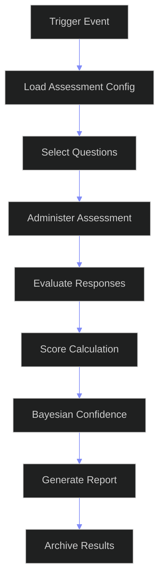
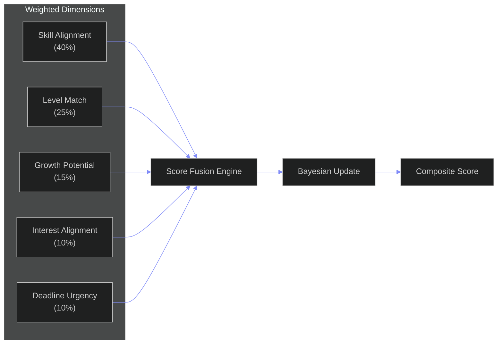

# Skill Assessment System — Enterprise Assessment Execution Architecture

---

## Document Control

| Field | Value |
|---|---|
| Document ID | AI-SAS-001 |
| Version | 1.0.0 |
| Status | Active |
| Last Updated | 2026-06-12 |
| Classification | Internal — Architecture Reference |
| Source of Truth | `docs/ai/skills/skills.md` (Skills System Enterprise Architecture — §11, §12, §7, §5) |
| Companion Docs | `docs/ai/skills/SkillGraphArchitecture.md` (Graph Storage & Traversal) |
| | `docs/ai/skills/SkillIntelligence.md` (Analytics Engine & Scoring Pipelines) |
| Target Stack | Python 3.11+ (Assessment Engine) + Neo4j (Evidence Graph) + PostgreSQL (Sessions) + Redis (State Cache) + FastAPI (API Layer) + Sandboxed Code Runner |
| Target Audience | AI Agents, Assessment Engineers, Data Engineers, Architects, Product Managers |

---

## Table of Contents

- [1. Assessment Framework](#1-assessment-framework)
- [2. Scoring Engine](#2-scoring-engine)
- [3. Bayesian Confidence Model](#3-bayesian-confidence-model)
- [4. Readiness Score Formula](#4-readiness-score-formula)
- [5. Evaluation Criteria & Rubrics](#5-evaluation-criteria--rubrics)
- [6. AI Assessment Logic](#6-ai-assessment-logic)
- [7. Anti-Cheating Strategy](#7-anti-cheating-strategy)
- [8. Assessment Analytics](#8-assessment-analytics)
- [9. Skill Validation Workflow](#9-skill-validation-workflow)
- [10. Enterprise Assessment Architecture](#10-enterprise-assessment-architecture)
- [Appendix A: Formula Reference](#appendix-a-formula-reference)
- [Appendix B: Rubric Templates](#appendix-b-rubric-templates)
- [Appendix C: Glossary](#appendix-c-glossary)

---

## 1. Assessment Framework

### 1.1 Why a Dedicated Assessment Execution Engine?

Skills.md defines the **data model and formulas** for assessment — what assessments exist, how they score, and how evidence is weighted. SkillAssessment.md defines the **execution engine** — the runtime that administers assessments, evaluates responses, detects cheating, and produces validated scores.

The relationship between the four documents:

| Document | Role | Analogy |
|---|---|---|
| `skills.md` | Assessment data model & formulas | Constitution |
| `SkillGraphArchitecture.md` | Evidence + assessment graph storage | Filing cabinet |
| `SkillIntelligence.md` | Analytics scoring pipelines | Data analyst |
| **`SkillAssessment.md`** | **Assessment execution engine** | **Exam proctor + grader** |

### 1.2 Architecture Overview

```
┌─────────────────────────────────────────────────────────────────────┐
│                     ASSESSMENT EXECUTION ENGINE                       │
│                                                                      │
│  ┌──────────────────────┐    ┌──────────────────────────────────┐   │
│  │   ASSESSMENT ENGINE   │    │         SCORING ENGINE           │   │
│  │                       │    │                                  │   │
│  │  ┌─────────────────┐  │    │  ┌──────────────────────────┐   │   │
│  │  │ Session Manager  │  │    │  │ Multi-Method Fusion      │   │   │
│  │  │ (lifecycle SM)   │──┼────┼─▶│ (trust-weighted scoring) │   │   │
│  │  └─────────────────┘  │    │  └──────────────────────────┘   │   │
│  │  ┌─────────────────┐  │    │  ┌──────────────────────────┐   │   │
│  │  │ Question Bank    │  │    │  │ IRT Calibration Engine   │   │   │
│  │  │ (IRT-calibrated) │  │    │  │ (3PL, adaptive)          │   │   │
│  │  └─────────────────┘  │    │  └──────────────────────────┘   │   │
│  │  ┌─────────────────┐  │    │  ┌──────────────────────────┐   │   │
│  │  │ 7 Method Engines │  │    │  │ Partial Credit Models    │   │   │
│  │  │ (dispatch router)│  │    │  │ (3 variants)             │   │   │
│  │  └─────────────────┘  │    │  └──────────────────────────┘   │   │
│  └──────────────────────┘    └──────────────────────────────────┘   │
│                                                                      │
│  ┌──────────────────────┐    ┌──────────────────────────────────┐   │
│  │  BAYESIAN CONFIDENCE  │    │       VALIDATION PIPELINE        │   │
│  │  Model (posterior     │    │  Auto → AI → Human escalation   │   │
│  │  updating, conjugate) │    │  with SLA & audit trail         │   │
│  └──────────────────────┘    └──────────────────────────────────┘   │
│                                                                      │
│  ┌──────────────────────┐    ┌──────────────────────────────────┐   │
│  │  ANTI-CHEATING ENGINE │    │       AI ASSESSMENT ENGINE       │   │
│  │  10-layer detection   │    │  LLM interview, code review,    │   │
│  │  (software + AI-only) │    │  reasoning analysis, rubrics    │   │
│  └──────────────────────┘    └──────────────────────────────────┘   │
└─────────────────────────────────────────────────────────────────────┘
```

### 1.2b Assessment Execution Pipeline



### 1.2c Scoring Architecture



### 1.3 Core Design Principles

| Principle | Rationale | Implementation |
|---|---|---|
| **Execution-first** | The engine administers assessments, it doesn't just model them | Session lifecycle state machines for every assessment |
| **Adaptive by default** | Fixed assessments waste time and frustrate users | IRT-based adaptive question selection for MCQ, coding, interviews |
| **Confidence-aware scoring** | A score without confidence is misleading | Bayesian posterior updating with conjugate priors |
| **Multi-method fusion** | No single method perfectly measures skill | Trust-weighted score fusion across all available methods |
| **Defense in depth** | Cheating must be detectable at multiple independent layers | 10-layer anti-cheating stack, software-only + AI-native |
| **Privacy-preserving** | No biometrics, no webcam, no screen recording | Behavioral analytics + response analysis only |
| **Auditable by design** | Every assessment decision must be explainable | Full provenance chain with score breakdown, all decisions logged |
| **Graceful degradation** | AI assessment works without LLM for core functionality | Algorithmic scoring base, AI enhancement layer on top |

### 1.4 Assessment Session Lifecycle

Every assessment is a **durable session** with a defined state machine:

```
                    ┌──────────┐
                    │ Created  │
                    └────┬─────┘
                         │ User starts assessment
                         â–¼
                    ┌──────────┐
                    │In Progress│
                    └────┬─────┘
                         │ User submits / time expires
                         â–¼
                    ┌──────────┐
                    │ Submitted │
                    └────┬─────┘
                         │ Auto-grading begins
                         â–¼
                    ┌──────────┐
                    │Evaluating│
                    └────┬─────┘
                         │ Grading complete
                         â–¼
               ┌─────────────────┐
               │  Scored          │
               └────────┬────────┘
                         │
              ┌──────────┼──────────┐
              â–¼          â–¼          â–¼
         ┌────────┐ ┌────────┐ ┌────────┐
         │Validated│ │Flagged │ │Appealed│
         │ (auto)  │ │ (AI    │ │ (user  │
         └────────┘ │ review)│ │challenge)
                    └────────┘ └────┬────┘
                         │          │
                         ▼          │
                    ┌──────────┐     │
                    │Human     │     │
                    │Reviewed  │─────┘
                    └──────────┘
                         │
                         â–¼
                    ┌──────────┐
                    │  Recorded │ → Updates Scoring Engine
                    └──────────┘
```

```python
class AssessmentSession:
    """
    Durable, stateful session for a single assessment.
    Every transition is logged in the immutable audit trail.
    """

    STATES = [
        "created", "in_progress", "submitted", "evaluating",
        "scored", "validated", "flagged", "appealed",
        "human_reviewed", "recorded",
    ]

    TRANSITIONS = {
        "created": ["in_progress"],
        "in_progress": ["submitted", "expired"],
        "submitted": ["evaluating"],
        "evaluating": ["scored", "failed"],
        "scored": ["validated", "flagged"],
        "flagged": ["human_reviewed"],
        "appealed": ["human_reviewed"],
        "human_reviewed": ["validated", "recorded"],
        "validated": ["recorded"],
        "recorded": [],  # Terminal state
    }

    def __init__(
        self,
        session_id: str,
        user_id: str,
        tenant_id: str,
        assessment_type: str,
        skill_id: str,
        target_level: int,
        config: AssessmentConfig,
    ):
        self.session_id = session_id
        self.user_id = user_id
        self.tenant_id = tenant_id
        self.assessment_type = assessment_type
        self.skill_id = skill_id
        self.skill_name = ""
        self.target_level = target_level
        self.config = config
        self.state = "created"
        self.responses: list[Response] = []
        self.scores: dict[str, float] = {}
        self.confidence: float = 0.0
        self.anti_cheating_flags: list[CheatingFlag] = []
        self.provenance: list[ProvenanceEntry] = []
        self.metadata: dict = {}
        self.created_at: datetime = datetime.utcnow()
        self.completed_at: datetime | None = None
        self.duration_seconds: float = 0.0

    async def transition(self, to_state: str) -> bool:
        """Transition session to a new state. Validates against state machine."""
        if to_state not in self.TRANSITIONS.get(self.state, []):
            raise InvalidStateTransition(
                f"Cannot transition from {self.state} to {to_state}"
            )
        old_state = self.state
        self.state = to_state
        await self._log_transition(old_state, to_state)
        return True

    async def _log_transition(self, old_state: str, new_state: str):
        """Log state transition to immutable audit trail."""
        entry = {
            "session_id": self.session_id,
            "user_id": self.user_id,
            "tenant_id": self.tenant_id,
            "event": f"session.{old_state}.{new_state}",
            "timestamp": datetime.utcnow().isoformat(),
            "metadata": self.metadata,
        }
        # Persist to audit log
        await self._persist_audit_entry(entry)

    def add_response(self, response: Response):
        """Record a user response during the assessment."""
        if self.state != "in_progress":
            raise AssessmentError("Cannot add response to non-active session")
        self.responses.append(response)

    def compute_duration(self) -> float:
        """Compute total assessment duration in seconds."""
        if self.completed_at and self.created_at:
            return (self.completed_at - self.created_at).total_seconds()
        return 0.0

    @property
    def is_terminal(self) -> bool:
        return self.state == "recorded"

    def to_dict(self) -> dict:
        return {
            "session_id": self.session_id,
            "user_id": self.user_id,
            "tenant_id": self.tenant_id,
            "assessment_type": self.assessment_type,
            "skill_id": self.skill_id,
            "skill_name": self.skill_name,
            "target_level": self.target_level,
            "state": self.state,
            "scores": self.scores,
            "confidence": self.confidence,
            "duration_seconds": self.duration_seconds,
            "anti_cheating_flags": [f.to_dict() for f in self.anti_cheating_flags],
            "created_at": self.created_at.isoformat(),
            "completed_at": self.completed_at.isoformat() if self.completed_at else None,
        }
```

### 1.5 Assessment Trigger Matrix

Assessments are triggered by 6 event categories (extending skills.md §12.5):

```python
class AssessmentTrigger:
    """
    Defines when and how an assessment is triggered.
    Each trigger maps to specific assessment methods and target levels.
    """

    TRIGGER_DEFINITIONS = {
        "level_up_request": {
            "description": "User requests advancement to next level",
            "methods": ["portfolio_review", "project_evaluation", "ai_interview"],
            "min_level": 1,
            "max_level": 5,
            "cadence": "on_demand",
            "cooldown_days": 90,  # Must wait 90 days between level-up attempts
        },
        "evidence_threshold": {
            "description": "Evidence score exceeds threshold, triggers verification",
            "methods": ["mcq", "practical_task", "ai_interview"],
            "min_level": 1,
            "max_level": 4,
            "cadence": "on_evidence",
            "cooldown_days": 30,
        },
        "recency_check": {
            "description": "90 days since last activity triggers re-assessment",
            "methods": ["mcq"],
            "min_level": 1,
            "max_level": 3,
            "cadence": "quarterly",
            "cooldown_days": 80,
        },
        "career_readiness": {
            "description": "Monthly career target readiness check",
            "methods": ["ai_interview", "portfolio_review"],
            "min_level": 2,
            "max_level": 5,
            "cadence": "monthly",
            "cooldown_days": 25,
        },
        "course_completion": {
            "description": "Post-course assessment after completing learning resource",
            "methods": ["mcq", "practical_task"],
            "min_level": 1,
            "max_level": 3,
            "cadence": "on_course_complete",
            "cooldown_days": 0,
        },
        "opportunity_application": {
            "description": "Targeted assessment when applying for opportunity",
            "methods": ["coding_challenge", "ai_interview", "portfolio_review"],
            "min_level": 2,
            "max_level": 5,
            "cadence": "on_demand",
            "cooldown_days": 0,
        },
        "verification_suspicion": {
            "description": "Triggered when anti-cheating detects suspicious behavior",
            "methods": ["mcq", "practical_task", "ai_interview"],
            "min_level": 1,
            "max_level": 5,
            "cadence": "on_flag",
            "cooldown_days": 0,
        },
    }

    @classmethod
    def get_methods_for_level(
        cls, trigger_name: str, current_level: int
    ) -> list[str]:
        """Get appropriate assessment methods for a trigger at a given level."""
        trigger = cls.TRIGGER_DEFINITIONS.get(trigger_name)
        if not trigger:
            return []
        if current_level < trigger["min_level"] or current_level > trigger["max_level"]:
            return []
        return trigger["methods"]
```

### 1.6 Seven Method Execution Engines

The assessment engine dispatches to one of 7 method-specific engines based on the assessment type.

```python
class AssessmentEngine:
    """
    Central dispatcher for all assessment types.
    Routes to the appropriate method engine based on assessment_type.
    """

    def __init__(self, config: EngineConfig):
        self.config = config
        self.methods: dict[str, MethodEngine] = {
            "mcq": MCQEngine(config),
            "coding": CodingEngine(config),
            "portfolio_review": PortfolioReviewEngine(config),
            "github_analysis": GitHubAnalysisEngine(config),
            "project_evaluation": ProjectEvaluationEngine(config),
            "ai_interview": AIInterviewEngine(config),
            "practical_task": PracticalTaskEngine(config),
        }
        self.session_store = AssessmentSessionStore(config.postgres_uri)
        self.anti_cheating = AntiCheatingEngine(config)
        self.logger = StructuredLogger("assessment.engine")

    async def create_session(
        self,
        user_id: str,
        tenant_id: str,
        assessment_type: str,
        skill_id: str,
        target_level: int,
        trigger: str = "level_up_request",
    ) -> AssessmentSession:
        """Create a new assessment session."""
        method = self.methods.get(assessment_type)
        if not method:
            raise UnknownAssessmentType(f"Unknown assessment type: {assessment_type}")

        session = AssessmentSession(
            session_id=str(uuid.uuid4()),
            user_id=user_id,
            tenant_id=tenant_id,
            assessment_type=assessment_type,
            skill_id=skill_id,
            target_level=target_level,
            config=self.config,
        )

        # Initialize method-specific state
        await method.initialize_session(session)
        await self.session_store.save(session)
        self.logger.info(
            "Assessment session created",
            session_id=session.session_id,
            type=assessment_type,
        )
        return session

    async def submit_response(
        self,
        session_id: str,
        response_data: dict,
        metadata: dict | None = None,
    ) -> AssessmentSession:
        """Process a user response within an assessment session."""
        session = await self.session_store.get(session_id)
        if not session:
            raise SessionNotFound(f"Session not found: {session_id}")

        method = self.methods.get(session.assessment_type)
        if not method:
            raise UnknownAssessmentType(f"Unknown type: {session.assessment_type}")

        # Anti-cheating check on response
        flags = await self.anti_cheating.analyze_response(
            session, response_data, metadata
        )
        session.anti_cheating_flags.extend(flags)

        # Process response through method engine
        response = await method.process_response(session, response_data, metadata)
        session.add_response(response)

        await self.session_store.save(session)
        return session

    async def finalize_session(
        self, session_id: str, submitted_at: datetime | None = None
    ) -> AssessmentSession:
        """Finalize an assessment session: evaluate, score, validate."""
        session = await self.session_store.get(session_id)
        if not session:
            raise SessionNotFound(f"Session not found: {session_id}")

        await session.transition("submitted")
        await session.transition("evaluating")

        method = self.methods.get(session.assessment_type)
        if not method:
            raise UnknownAssessmentType(f"Unknown type: {session.assessment_type}")

        # Run anti-cheating analysis on full session
        session_flags = await self.anti_cheating.analyze_session(session)
        session.anti_cheating_flags.extend(session_flags)

        # Determine if session is compromised
        if self.anti_cheating.is_compromised(session):
            session.metadata["compromised"] = True
            await session.transition("flagged")
            await self.session_store.save(session)
            return session

        # Score the assessment
        score_result = await method.evaluate(session)
        session.scores = score_result.scores
        session.confidence = score_result.confidence
        session.duration_seconds = session.compute_duration()
        session.completed_at = submitted_at or datetime.utcnow()
        session.provenance.extend(score_result.provenance)

        await session.transition("scored")

        # Auto-validate if confidence is high
        if score_result.confidence >= self.config.auto_validate_threshold:
            await session.transition("validated")
        else:
            await session.transition("flagged")

        await session.transition("recorded")
        await self.session_store.save(session)

        # Emit event for downstream consumers (SkillIntelligence scoring engine)
        await self._emit_completion_event(session)

        return session

    async def _emit_completion_event(self, session: AssessmentSession):
        """Emit assessment completion event for the intelligence engine."""
        event = {
            "event_type": "assessment.completed",
            "user_id": session.user_id,
            "tenant_id": session.tenant_id,
            "session_id": session.session_id,
            "skill_id": session.skill_id,
            "assessment_type": session.assessment_type,
            "scores": session.scores,
            "confidence": session.confidence,
            "compromised": session.metadata.get("compromised", False),
            "timestamp": datetime.utcnow().isoformat(),
        }
        # In production: publish to Kafka event bus
        self.logger.info("Assessment completed event", event=event)
```

#### 1.6.1 Method Engine Interface

```python
class MethodEngine(ABC):
    """Abstract base for all 7 assessment method engines."""

    def __init__(self, config: EngineConfig):
        self.config = config
        self.logger = StructuredLogger(f"assessment.{self.__class__.__name__}")

    @abstractmethod
    async def initialize_session(self, session: AssessmentSession):
        """Set up method-specific state (select questions, generate tasks, etc.)."""
        ...

    @abstractmethod
    async def process_response(
        self, session: AssessmentSession, response_data: dict, metadata: dict | None
    ) -> Response:
        """Process a single response from the user."""
        ...

    @abstractmethod
    async def evaluate(self, session: AssessmentSession) -> ScoreResult:
        """Evaluate the full session and produce scores."""
        ...

    @abstractmethod
    def get_rubric(self, target_level: int) -> Rubric:
        """Get the evaluation rubric for this method at a specific level."""
        ...
```

#### 1.6.2 MCQ Engine

```python
class MCQEngine(MethodEngine):
    """
    Multiple Choice Question assessment engine.
    Uses IRT-based adaptive question selection from a calibrated bank.
    """

    MIN_QUESTIONS = 5
    MAX_QUESTIONS = 30
    TERMINATION_THRESHOLD = 0.95  # Stop when confidence > 95%

    def __init__(self, config: EngineConfig):
        super().__init__(config)
        self.irt = IRTEngine(config)  # Item Response Theory engine
        self.question_bank = QuestionBank(config.question_bank_uri)

    async def initialize_session(self, session: AssessmentSession):
        """Select initial questions based on target level."""
        # Get questions calibrated for the target level
        questions = await self.question_bank.get_calibrated_questions(
            skill_id=session.skill_id,
            target_level=session.target_level,
            count=5,  # Initial set of 5
        )
        session.metadata["questions"] = [q.to_dict() for q in questions]
        session.metadata["current_ability"] = self.irt.initial_ability(
            session.target_level
        )
        session.metadata["question_index"] = 0

    async def process_response(
        self, session: AssessmentSession, response_data: dict, metadata: dict | None
    ) -> Response:
        """Process MCQ answer and select next question adaptively."""
        idx = session.metadata["question_index"]
        current_q = session.metadata["questions"][idx]
        selected_answer = response_data.get("answer")
        time_spent = response_data.get("time_spent_ms", 0)

        # Score the response
        is_correct = selected_answer == current_q["correct_answer"]
        confidence_weight = response_data.get("confidence_weight", 1.0)

        response = Response(
            question_id=current_q["id"],
            response_data={"answer": selected_answer, "is_correct": is_correct},
            time_spent_ms=time_spent,
            confidence_weight=confidence_weight,
            timestamp=datetime.utcnow(),
        )

        # Update ability estimate using IRT
        ability = session.metadata["current_ability"]
        new_ability, new_se = self.irt.update_ability(
            ability=ability,
            response=is_correct,
            discrimination=current_q["discrimination"],
            difficulty=current_q["difficulty"],
            guessing=current_q["guessing"],
        )
        session.metadata["current_ability"] = new_ability
        session.metadata["current_se"] = new_se

        # Select next question adaptively
        if idx + 1 < self.MAX_QUESTIONS and new_se > self.TERMINATION_THRESHOLD:
            next_q = await self.question_bank.select_adaptive(
                skill_id=session.skill_id,
                current_ability=new_ability,
                answered_ids=[q["id"] for q in session.metadata["questions"]],
            )
            if next_q:
                session.metadata["questions"].append(next_q.to_dict())

        session.metadata["question_index"] += 1
        return response

    async def evaluate(self, session: AssessmentSession) -> ScoreResult:
        """Score the MCQ assessment using IRT."""
        questions = session.metadata["questions"]
        responses = session.responses

        if not questions or not responses:
            return ScoreResult.failed(
                function_name="mcq_evaluate",
                error="No questions or responses",
                reference_date=datetime.utcnow(),
            )

        # Raw score
        correct = sum(1 for r in responses if r.response_data.get("is_correct"))
        total = len(responses)
        raw_pct = (correct / total * 100.0) if total > 0 else 0.0

        # IRT-based ability estimate
        ability = session.metadata["current_ability"]
        se = session.metadata["current_se"]

        # Convert IRT ability to 0-100 score
        # Ability range is typically -3 to +3 on logit scale
        normalized_score = (ability + 3.0) / 6.0 * 100.0
        normalized_score = max(0.0, min(100.0, normalized_score))

        # Time efficiency
        avg_time_ms = sum(r.time_spent_ms for r in responses) / len(responses)
        expected_time_ms = questions[0].get("expected_time_ms", 30000)
        time_efficiency = min(100.0, (expected_time_ms / max(avg_time_ms, 1)) * 100.0)

        # Domain coverage
        categories_covered = len(set(
            q.get("category", "unknown") for q in questions
        ))
        domain_coverage = min(100.0, categories_covered * 25.0)  # Each category = 25%

        scores = {
            "raw_score": round(raw_pct, 2),
            "irt_ability": round(ability, 4),
            "normalized_score": round(normalized_score, 2),
            "time_efficiency": round(time_efficiency, 2),
            "domain_coverage": round(domain_coverage, 2),
        }

        # Item analysis (for bank calibration)
        await self._update_item_statistics(questions, responses)

        confidence = 1.0 - min(se, 1.0)  # SE lower = higher confidence
        confidence = max(0.0, min(1.0, confidence))

        return ScoreResult(
            function_name="mcq_evaluate",
            value=normalized_score,
            confidence=confidence,
            confidence_interval=(
                max(0, normalized_score - 2 * se * 16.67),
                min(100, normalized_score + 2 * se * 16.67),
            ),
            scores=scores,
            reference_date=datetime.utcnow(),
            data_freshness={},
            provenance=[
                ProvenanceEntry(
                    stage="evaluation",
                    function="mcq.irt",
                    input_keys=["responses", "questions"],
                    computed_at=datetime.utcnow(),
                    duration_ms=0,
                    version="1.0.0",
                )
            ],
            metadata={
                "question_count": total,
                "correct_count": correct,
                "termination_reason": "confidence_threshold" if se < 0.05 else "max_questions",
            },
        )

    async def _update_item_statistics(
        self, questions: list[dict], responses: list[Response]
    ):
        """Update item difficulty and discrimination based on responses."""
        # In production: batch update to question bank
        for q in questions:
            q_responses = [
                r for r in responses if r.question_id == q["id"]
            ]
            if not q_responses:
                continue
            correct_count = sum(
                1 for r in q_responses if r.response_data.get("is_correct")
            )
            p_value = correct_count / len(q_responses)  # Item difficulty (higher = easier)
            # Update calibrated difficulty
            await self.question_bank.update_statistics(
                question_id=q["id"],
                p_value=p_value,
                response_count=len(q_responses),
            )
```

#### 1.6.3 Coding Engine

```python
class CodingEngine(MethodEngine):
    """
    Coding Challenge assessment engine.
    Uses sandboxed execution, test case evaluation, and AI code review.
    """

    def __init__(self, config: EngineConfig):
        super().__init__(config)
        self.judge = CodeJudge(config)  # Sandboxed code executor
        self.ai_reviewer = AICodeReviewer(config)

    async def initialize_session(self, session: AssessmentSession):
        """Select coding challenge based on target level."""
        challenge = await self._select_challenge(
            skill=session.skill_name,
            target_level=session.target_level,
        )
        test_cases = await self._generate_test_cases(challenge, session.target_level)
        session.metadata["challenge"] = challenge.to_dict()
        session.metadata["test_cases"] = [tc.to_dict() for tc in test_cases]
        session.metadata["start_time"] = datetime.utcnow().isoformat()

    async def process_response(
        self, session: AssessmentSession, response_data: dict, metadata: dict | None
    ) -> Response:
        """Process a code submission through sandboxed execution."""
        code = response_data.get("code", "")
        language = response_data.get("language", "python")
        session.metadata["language"] = language
        session.metadata["final_code"] = code

        # Execute against test cases
        test_results = await self.judge.execute(
            code=code,
            language=language,
            test_cases=session.metadata["test_cases"],
            time_limit_seconds=self.config.coding_time_limit,
            memory_limit_mb=self.config.coding_memory_limit,
        )

        response = Response(
            question_id=session.metadata["challenge"]["id"],
            response_data={
                "code": code,
                "language": language,
                "test_results": [r.to_dict() for r in test_results],
                "passed_count": sum(1 for r in test_results if r.passed),
                "total_tests": len(test_results),
            },
            time_spent_ms=response_data.get("time_spent_ms", 0),
            timestamp=datetime.utcnow(),
        )
        return response

    async def evaluate(self, session: AssessmentSession) -> ScoreResult:
        """Evaluate coding submission: test results + code quality + AI review."""
        challenge = session.metadata["challenge"]
        response = session.responses[-1] if session.responses else None
        if not response:
            return ScoreResult.failed(
                function_name="coding_evaluate",
                error="No submission found",
                reference_date=datetime.utcnow(),
            )

        test_results_data = response.response_data["test_results"]
        code = response.response_data["code"]
        language = response.response_data["language"]

        # 1. Test case score (60% of total)
        passed = sum(1 for tr in test_results_data if tr.get("passed"))
        total = len(test_results_data)
        test_score = (passed / total * 100.0) if total > 0 else 0.0

        # 2. Hidden test cases (20% of total)
        hidden_tc = [tc for tc in session.metadata["test_cases"] if tc.get("hidden")]
        hidden_passed = sum(
            1 for tc in hidden_tc
            if any(
                tr.get("test_case_id") == tc["id"] and tr.get("passed")
                for tr in test_results_data
            )
        )
        hidden_total = len(hidden_tc)
        hidden_score = (hidden_passed / hidden_total * 100.0) if hidden_total > 0 else 0.0

        # 3. Code quality via AI review (20% of total)
        try:
            quality_review = await self.ai_reviewer.review(
                code=code,
                language=language,
                challenge=challenge,
            )
            quality_score = quality_review.score
        except Exception:
            quality_score = 50.0  # Fallback

        # Weighted composite
        final_score = test_score * 0.60 + hidden_score * 0.20 + quality_score * 0.20

        # Complexity bonus (bonus for efficient solutions)
        complexity = response.response_data.get("complexity", "")
        complexity_bonus = 0.0
        if complexity and challenge.get("expected_complexity"):
            if self._is_better_complexity(complexity, challenge["expected_complexity"]):
                complexity_bonus = 5.0

        final_score = min(100.0, final_score + complexity_bonus)

        scores = {
            "test_score": round(test_score, 2),
            "hidden_test_score": round(hidden_score, 2),
            "quality_score": round(quality_score, 2),
            "final_score": round(final_score, 2),
            "passed_test_count": passed,
            "total_test_count": total,
        }

        return ScoreResult(
            function_name="coding_evaluate",
            value=final_score,
            confidence=0.8 if total >= 10 else 0.6,
            confidence_interval=(max(0, final_score - 15), min(100, final_score + 15)),
            scores=scores,
            reference_date=datetime.utcnow(),
            data_freshness={},
            provenance=[
                ProvenanceEntry(
                    stage="evaluation",
                    function="coding.test_cases",
                    input_keys=["code", "test_cases"],
                    computed_at=datetime.utcnow(),
                    duration_ms=0,
                    version="1.0.0",
                ),
                ProvenanceEntry(
                    stage="evaluation",
                    function="coding.ai_review",
                    input_keys=["code", "challenge"],
                    computed_at=datetime.utcnow(),
                    duration_ms=0,
                    version="1.0.0",
                ),
            ],
            metadata={
                "language": language,
                "test_coverage_pct": round(test_score, 2),
                "has_hidden_tests": hidden_total > 0,
                "complexity_bonus": complexity_bonus,
            },
        )
```

#### 1.6.4 GitHub Analysis Engine

```python
class GitHubAnalysisEngine(MethodEngine):
    """
    GitHub profile analysis engine.
    Zero-effort from user — just OAuth. Analyzes commits, PRs, repos, and community.
    """

    GITHUB_API_BASE = "https://api.github.com"

    async def initialize_session(self, session: AssessmentSession):
        """Fetch and analyze GitHub profile."""
        access_token = await self._get_github_token(
            session.user_id, session.tenant_id
        )
        username = await self._get_github_username(access_token)

        # Fetch all profile data
        repos = await self._fetch_repos(username, access_token)
        commits = await self._fetch_commits(username, repos, access_token)
        prs = await self._fetch_pull_requests(username, access_token)
        issues = await self._fetch_issues(username, access_token)

        session.metadata["github_username"] = username
        session.metadata["repos"] = repos
        session.metadata["commits"] = commits
        session.metadata["pull_requests"] = prs
        session.metadata["issues"] = issues
        session.metadata["analysis_complete"] = False

    async def process_response(
        self, session: AssessmentSession, response_data: dict, metadata: dict | None
    ) -> Response:
        """GitHub analysis is auto-generated — no user responses needed."""
        # Analysis is performed during evaluate, not incrementally
        return Response(
            question_id="github_analysis",
            response_data={"auto_analyzed": True},
            time_spent_ms=0,
            timestamp=datetime.utcnow(),
        )

    async def evaluate(self, session: AssessmentSession) -> ScoreResult:
        """Score skill level from GitHub activity."""
        repos = session.metadata.get("repos", [])
        commits = session.metadata.get("commits", [])
        prs = session.metadata.get("pull_requests", [])
        issues_data = session.metadata.get("issues", [])

        # Dimensions analyzed
        # A. Commit quality & consistency
        commit_frequency = self._commit_frequency(commits)
        commit_regularity = self._commit_regularity(commits)
        commit_message_quality = self._commit_message_quality(commits)
        commit_score = (commit_frequency + commit_regularity + commit_message_quality) / 3.0

        # B. Project depth
        language_diversity = min(100, len(set(
            r.get("language") for r in repos if r.get("language")
        )) * 20.0)
        repo_complexity = self._repo_complexity(repos)
        project_longevity = self._project_longevity(repos)
        project_score = (language_diversity + repo_complexity + project_longevity) / 3.0

        # C. Collaboration & OSS
        pr_merge_rate = self._pr_merge_rate(prs)
        review_participation = self._review_participation(prs)
        issue_engagement = self._issue_engagement(issues_data, commits)
        collaboration_score = (pr_merge_rate + review_participation + issue_engagement) / 3.0

        # D. Code quality signals
        code_quality = self._estimate_code_quality(repos, commits)

        # Weighted composite
        final_score = (
            commit_score * 0.25 +
            project_score * 0.30 +
            collaboration_score * 0.25 +
            code_quality * 0.20
        )

        # Estimated level from score
        estimated_level = self._score_to_level(final_score)

        scores = {
            "commit_score": round(commit_score, 2),
            "project_score": round(project_score, 2),
            "collaboration_score": round(collaboration_score, 2),
            "code_quality_score": round(code_quality, 2),
            "final_score": round(final_score, 2),
            "estimated_level": estimated_level,
            "repo_count": len(repos),
            "total_commits": len(commits),
            "pr_count": len(prs),
        }

        return ScoreResult(
            function_name="github_analysis",
            value=final_score,
            confidence=0.75,  # GitHub data is reliable but limited
            confidence_interval=(max(0, final_score - 10), min(100, final_score + 10)),
            scores=scores,
            reference_date=datetime.utcnow(),
            data_freshness={},
            provenance=[],
            metadata={
                "github_username": session.metadata.get("github_username"),
                "repo_count": len(repos),
                "total_commits": len(commits),
                "pr_merge_rate": round(self._pr_merge_rate(prs), 2),
            },
        )
```

#### 1.6.5 Portfolio Review Engine

```python
class PortfolioReviewEngine(MethodEngine):
    """
    Portfolio review assessment.
    User submits artifacts; AI analyzes quality, impact, and breadth.
    Optional human review for high-stakes assessments.
    """

    async def initialize_session(self, session: AssessmentSession):
        session.metadata["artifacts"] = []
        session.metadata["ai_review_complete"] = False
        session.metadata["human_review_required"] = False

    async def process_response(
        self, session: AssessmentSession, response_data: dict, metadata: dict | None
    ) -> Response:
        """Collect portfolio artifacts."""
        artifact = response_data.get("artifact")
        if artifact:
            session.metadata["artifacts"].append(artifact)
        return Response(
            question_id="portfolio_artifact",
            response_data={"artifact_added": bool(artifact)},
            time_spent_ms=response_data.get("time_spent_ms", 0),
            timestamp=datetime.utcnow(),
        )

    async def evaluate(self, session: AssessmentSession) -> ScoreResult:
        """Evaluate portfolio across impact, craftsmanship, breadth, depth dimensions."""
        artifacts = session.metadata.get("artifacts", [])
        if not artifacts:
            return ScoreResult.failed(
                function_name="portfolio_review",
                error="No artifacts submitted",
                reference_date=datetime.utcnow(),
            )

        # AI review of each artifact
        ai_scores = []
        for artifact in artifacts:
            try:
                review = await self._ai_review_artifact(artifact, session.target_level)
                ai_scores.append(review)
            except Exception:
                continue

        if not ai_scores:
            return ScoreResult.failed(
                function_name="portfolio_review",
                error="AI review failed for all artifacts",
                reference_date=datetime.utcnow(),
            )

        # Aggregate across dimensions
        avg_impact = sum(a["impact"] for a in ai_scores) / len(ai_scores)
        avg_craftsmanship = sum(a["craftsmanship"] for a in ai_scores) / len(ai_scores)
        avg_breadth = sum(a["breadth"] for a in ai_scores) / len(ai_scores)
        avg_depth = sum(a["depth"] for a in ai_scores) / len(ai_scores)

        # Humans scale differently: more artifacts + higher quality = higher score
        quantity_bonus = min(20.0, len(artifacts) * 5.0)

        final_score = (
            avg_impact * 0.30 +
            avg_craftsmanship * 0.25 +
            avg_breadth * 0.20 +
            avg_depth * 0.25 +
            quantity_bonus * 0.0  # Quality over quantity
        )

        # Determine if human review is needed
        session.metadata["human_review_required"] = (
            session.target_level >= 4 or
            final_score < 40 or
            final_score > 95
        )

        scores = {
            "impact_score": round(avg_impact, 2),
            "craftsmanship_score": round(avg_craftsmanship, 2),
            "breadth_score": round(avg_breadth, 2),
            "depth_score": round(avg_depth, 2),
            "artifact_count": len(artifacts),
            "final_score": round(final_score, 2),
            "human_review_required": session.metadata["human_review_required"],
        }

        return ScoreResult(
            function_name="portfolio_review",
            value=final_score,
            confidence=0.7,  # AI portfolio review is moderately reliable
            confidence_interval=(max(0, final_score - 20), min(100, final_score + 20)),
            scores=scores,
            reference_date=datetime.utcnow(),
            data_freshness={},
            provenance=[],
            metadata={
                "artifact_count": len(artifacts),
                "ai_reviewed_count": len(ai_scores),
                "human_review_required": session.metadata["human_review_required"],
            },
        )
```

#### 1.6.6 Project Evaluation Engine

```python
class ProjectEvaluationEngine(MethodEngine):
    """
    Full project evaluation: requirements, architecture, delivery, code quality.
    Combines AI review with optional human review for enterprise-level validation.
    """

    async def initialize_session(self, session: AssessmentSession):
        session.metadata["project"] = None
        session.metadata["ai_review"] = None
        session.metadata["human_review"] = None

    async def process_response(
        self, session: AssessmentSession, response_data: dict, metadata: dict | None
    ) -> Response:
        """Collect project submission."""
        if response_data.get("project"):
            session.metadata["project"] = response_data["project"]
        return Response(
            question_id="project_submission",
            response_data={"project_received": bool(response_data.get("project"))},
            time_spent_ms=response_data.get("time_spent_ms", 0),
            timestamp=datetime.utcnow(),
        )

    async def evaluate(self, session: AssessmentSession) -> ScoreResult:
        """Evaluate project: AI review + optional human review."""
        project = session.metadata.get("project")
        if not project:
            return ScoreResult.failed(
                function_name="project_evaluation",
                error="No project submitted",
                reference_date=datetime.utcnow(),
            )

        # AI review
        ai_review = await self._ai_evaluate_project(project, session.target_level)

        # Requirements traceability
        req_coverage = self._requirements_coverage(project)

        # Delivery quality
        delivery_quality = self._delivery_quality(project)

        # Score fusion: AI(0.4) + Requirements(0.3) + Delivery(0.3)
        ai_weight = 0.4
        if session.target_level >= 4:
            ai_weight = 0.3  # Human review has higher weight for advanced levels
            session.metadata["human_review_required"] = True

        final_score = (
            ai_review["overall"] * ai_weight +
            req_coverage * 0.30 +
            delivery_quality * 0.30 +
            ai_review.get("architecture", 50) * (0.40 - ai_weight)
        )

        scores = {
            "ai_review_score": round(ai_review["overall"], 2),
            "architecture_score": round(ai_review.get("architecture", 0), 2),
            "requirements_coverage": round(req_coverage, 2),
            "delivery_quality": round(delivery_quality, 2),
            "final_score": round(final_score, 2),
            "human_review_required": session.metadata.get("human_review_required", False),
        }

        return ScoreResult(
            function_name="project_evaluation",
            value=final_score,
            confidence=0.75,
            confidence_interval=(max(0, final_score - 15), min(100, final_score + 15)),
            scores=scores,
            reference_date=datetime.utcnow(),
            data_freshness={},
            provenance=[],
            metadata=scores,
        )
```

#### 1.6.7 AI Interview Engine

```python
class AIInterviewEngine(MethodEngine):
    """
    AI-conducted skill interview.
    Dynamic difficulty adaptation, follow-up generation, multi-axis scoring.
    """

    def __init__(self, config: EngineConfig):
        super().__init__(config)
        self.llm_client = config.llm_client

    async def initialize_session(self, session: AssessmentSession):
        session.metadata["interview_plan"] = None
        session.metadata["current_question"] = 0
        session.metadata["conversation_history"] = []
        session.metadata["axis_scores"] = {
            "communication": [],
            "problem_decomposition": [],
            "technical_depth": [],
            "adaptability": [],
        }
        session.metadata["estimated_ability"] = self._level_to_ability(
            session.target_level
        )

    async def process_response(
        self, session: AssessmentSession, response_data: dict, metadata: dict | None
    ) -> Response:
        """Process interview answer and generate follow-up."""
        answer = response_data.get("answer", "")
        question = response_data.get("question", "")
        time_spent_ms = response_data.get("time_spent_ms", 0)

        # Score the response on multiple axes
        axis_scores = await self._score_response_axes(
            question=question,
            answer=answer,
            context=session.metadata["conversation_history"],
        )

        for axis, score in axis_scores.items():
            if axis in session.metadata["axis_scores"]:
                session.metadata["axis_scores"][axis].append(score)

        # Update ability estimate
        current = session.metadata["estimated_ability"]
        avg_score = sum(axis_scores.values()) / len(axis_scores)
        session.metadata["estimated_ability"] = current * 0.7 + avg_score * 0.3

        # Generate next question adaptively
        next_question = await self._generate_next_question(
            conversation=session.metadata["conversation_history"],
            ability=session.metadata["estimated_ability"],
            target_level=session.target_level,
        )

        session.metadata["conversation_history"].append({
            "question": question,
            "answer": answer,
            "axis_scores": axis_scores,
            "timestamp": datetime.utcnow().isoformat(),
        })

        return Response(
            question_id=next_question.get("id", f"q_{len(session.metadata['conversation_history'])}"),
            response_data={
                "answer": answer,
                "axis_scores": axis_scores,
                "next_question": next_question,
            },
            time_spent_ms=time_spent_ms,
            timestamp=datetime.utcnow(),
        )

    async def evaluate(self, session: AssessmentSession) -> ScoreResult:
        """Score the full interview across all axes."""
        axis_scores = session.metadata["axis_scores"]
        conversation = session.metadata["conversation_history"]

        if not conversation:
            return ScoreResult.failed(
                function_name="ai_interview",
                error="No conversation recorded",
                reference_date=datetime.utcnow(),
            )

        # Aggregate axis scores
        final_axes = {}
        for axis, scores in axis_scores.items():
            if scores:
                # Later questions weighted higher (warm-up discount)
                weights = [0.5 + (i / len(scores)) * 0.5 for i in range(len(scores))]
                weighted = sum(s * w for s, w in zip(scores, weights))
                total_w = sum(weights)
                final_axes[axis] = weighted / total_w if total_w > 0 else 0.0

        # Communication (20%)
        # Problem decomposition (25%)
        # Technical depth (35%)
        # Adaptability (20%)
        final_score = (
            final_axes.get("communication", 50) * 0.20 +
            final_axes.get("problem_decomposition", 50) * 0.25 +
            final_axes.get("technical_depth", 50) * 0.35 +
            final_axes.get("adaptability", 50) * 0.20
        )

        scores = {
            "communication_score": round(final_axes.get("communication", 0), 2),
            "problem_decomposition_score": round(final_axes.get("problem_decomposition", 0), 2),
            "technical_depth_score": round(final_axes.get("technical_depth", 0), 2),
            "adaptability_score": round(final_axes.get("adaptability", 0), 2),
            "question_count": len(conversation),
            "final_score": round(final_score, 2),
        }

        return ScoreResult(
            function_name="ai_interview",
            value=final_score,
            confidence=0.7,
            confidence_interval=(max(0, final_score - 15), min(100, final_score + 15)),
            scores=scores,
            reference_date=datetime.utcnow(),
            data_freshness={},
            provenance=[],
            metadata={
                "question_count": len(conversation),
                "average_question_depth": round(
                    sum(
                        q.get("axis_scores", {}).get("technical_depth", 0)
                        for q in conversation
                    ) / len(conversation), 2
                ) if conversation else 0,
            },
        )
```

#### 1.6.8 Practical Task Engine

```python
class PracticalTaskEngine(MethodEngine):
    """
    Practical task assessment — hands-on exercises in a sandboxed environment.
    Generates parameterized tasks with randomized parameters and evaluates solutions.
    """

    async def initialize_session(self, session: AssessmentSession):
        task = await self._generate_task(
            skill_id=session.skill_id,
            target_level=session.target_level,
            user_id=session.user_id,  # Seed for randomization
        )
        session.metadata["task"] = task.to_dict()
        session.metadata["start_time"] = datetime.utcnow().isoformat()
        session.metadata["attempts"] = 0

    async def process_response(
        self, session: AssessmentSession, response_data: dict, metadata: dict | None
    ) -> Response:
        """Process a practical task submission."""
        solution = response_data.get("solution", "")
        session.metadata["attempts"] += 1

        # Evaluate solution against expected criteria
        eval_result = await self._evaluate_solution(
            task=session.metadata["task"],
            solution=solution,
            attempt=session.metadata["attempts"],
        )

        return Response(
            question_id=session.metadata["task"]["id"],
            response_data={
                "solution": solution,
                "evaluation": eval_result.to_dict() if eval_result else {},
                "attempt": session.metadata["attempts"],
            },
            time_spent_ms=response_data.get("time_spent_ms", 0),
            timestamp=datetime.utcnow(),
        )

    async def evaluate(self, session: AssessmentSession) -> ScoreResult:
        """Score practical task: correctness, approach, time efficiency."""
        response = session.responses[-1] if session.responses else None
        if not response:
            return ScoreResult.failed(
                function_name="practical_task",
                error="No submission",
                reference_date=datetime.utcnow(),
            )

        evaluation = response.response_data.get("evaluation", {})
        if not evaluation:
            return ScoreResult.failed(
                function_name="practical_task",
                error="Evaluation failed",
                reference_date=datetime.utcnow(),
            )

        correctness = evaluation.get("correctness", 0)
        approach_quality = evaluation.get("approach_quality", 0)
        time_bonus = 0.0

        # Time efficiency (faster = bonus, but not penalized for thoughtfulness)
        task_time_s = session.compute_duration()
        expected_time_s = session.metadata["task"].get("expected_time_seconds", 1800)
        if task_time_s < expected_time_s * 0.5:
            time_bonus = 5.0  # Fast bonus
        elif task_time_s > expected_time_s * 2.0:
            time_bonus = -5.0  # Overtime penalty

        # Attempt penalty (multiple attempts reduce score slightly)
        attempts = session.metadata.get("attempts", 1)
        attempt_penalty = max(0, (attempts - 1) * 5.0)

        final_score = max(0, min(100,
            correctness * 0.50 +
            approach_quality * 0.40 +
            time_bonus -
            attempt_penalty
        ))

        scores = {
            "correctness_score": round(correctness, 2),
            "approach_quality": round(approach_quality, 2),
            "time_bonus": round(time_bonus, 2),
            "attempts": attempts,
            "final_score": round(final_score, 2),
        }

        return ScoreResult(
            function_name="practical_task",
            value=final_score,
            confidence=0.75,
            confidence_interval=(max(0, final_score - 10), min(100, final_score + 10)),
            scores=scores,
            reference_date=datetime.utcnow(),
            data_freshness={},
            provenance=[],
            metadata=scores,
        )
```

---

## 2. Scoring Engine

### 2.1 Multi-Method Score Fusion

The scoring engine fuses scores from multiple assessment methods into a unified skill score. Each method has a **trust weight** based on its reliability, the user's level, and historical accuracy.

```python
class AssessmentScoringEngine:
    """
    Fuses scores from multiple assessment methods into a unified skill score.
    Uses trust-weighted fusion with Bayesian updating.
    """

    # Default trust weights per method (configurable per skill category)
    METHOD_TRUST_WEIGHTS = {
        "mcq": 0.60,
        "coding": 0.80,
        "portfolio_review": 0.85,
        "github_analysis": 0.65,
        "project_evaluation": 0.85,
        "ai_interview": 0.75,
        "practical_task": 0.80,
    }

    # Level-specific adjustments (higher levels need more reliable methods)
    LEVEL_WEIGHT_ADJUSTMENTS = {
        0: {},
        1: {"mcq": 0.75, "practical_task": 0.85},
        2: {"mcq": 0.70, "coding": 0.80, "practical_task": 0.80},
        3: {"coding": 0.80, "portfolio_review": 0.85, "project_evaluation": 0.85},
        4: {"portfolio_review": 0.90, "project_evaluation": 0.90, "ai_interview": 0.85},
        5: {"portfolio_review": 0.95, "project_evaluation": 0.95, "ai_interview": 0.90},
    }

    def __init__(self, config: ScoringConfig):
        self.config = config
        self.logger = StructuredLogger("assessment.scoring")

    async def fuse_scores(
        self,
        skill_id: str,
        user_id: str,
        assessments: list[ScoreResult],
        target_level: int,
        existing_evidence_score: float | None = None,
    ) -> FusedScore:
        """
        Fuse multiple assessment scores into a unified skill score.
        Uses trust-weighted average with confidence-aware adjustments.
        """
        if not assessments:
            return FusedScore(
                value=0.0,
                confidence=0.0,
                method_count=0,
                fusion_method="none",
                component_scores={},
            )

        # Get trust weights for this level
        base_weights = dict(self.METHOD_TRUST_WEIGHTS)
        level_adjustments = self.LEVEL_WEIGHT_ADJUSTMENTS.get(target_level, {})
        for method, adj_weight in level_adjustments.items():
            base_weights[method] = adj_weight

        # Compute weighted score
        total_weight = 0.0
        weighted_sum = 0.0
        confidence_sum = 0.0
        component_scores = {}

        for assessment in assessments:
            method = assessment.metadata.get("assessment_type", "unknown")
            trust_weight = base_weights.get(method, 0.5)

            # De-weight low-confidence assessments
            confidence_multiplier = 0.5 + (assessment.confidence * 0.5)

            effective_weight = trust_weight * confidence_multiplier

            weighted_sum += assessment.value * effective_weight
            total_weight += effective_weight
            confidence_sum += assessment.confidence * effective_weight

            component_scores[method] = {
                "score": assessment.value,
                "trust_weight": trust_weight,
                "confidence": assessment.confidence,
                "effective_weight": effective_weight,
            }

        if total_weight == 0:
            return FusedScore(
                value=0.0,
                confidence=0.0,
                method_count=len(assessments),
                fusion_method="weighted",
                component_scores=component_scores,
            )

        fused_value = weighted_sum / total_weight
        fused_confidence = confidence_sum / total_weight

        # Cross-method consistency bonus
        if len(assessments) >= 2:
            consistency = self._cross_method_consistency(assessments)
            fused_confidence = min(1.0, fused_confidence + consistency * 0.1)

        return FusedScore(
            value=round(fused_value, 2),
            confidence=round(fused_confidence, 4),
            method_count=len(assessments),
            fusion_method="trust_weighted",
            component_scores=component_scores,
        )

    def _cross_method_consistency(
        self, assessments: list[ScoreResult]
    ) -> float:
        """
        Measure consistency across assessment methods.
        High consistency → higher confidence in the fused score.
        Low consistency → potential skill variance or measurement error.
        """
        if len(assessments) < 2:
            return 0.0

        values = [a.value for a in assessments]
        mean = sum(values) / len(values)
        max_dev = max(abs(v - mean) for v in values)

        # Normalize: 0 deviation = 1.0 consistency, >30 deviation = 0.0
        consistency = max(0.0, 1.0 - max_dev / 30.0)
        return consistency


@dataclass
class FusedScore:
    value: float
    confidence: float
    method_count: int
    fusion_method: str
    component_scores: dict[str, dict]
```

### 2.2 IRT-Based Difficulty Calibration

Item Response Theory provides adaptive, calibrated scoring across all assessment types.

```python
class IRTEngine:
    """
    Item Response Theory engine for adaptive assessment.
    Uses 3-Parameter Logistic (3PL) model:
    P(correct | ability) = c + (1 - c) / (1 + exp(-a * (ability - b)))

    Where:
      a = discrimination (how well item separates ability levels)
      b = difficulty (ability level where P(correct)=0.5)
      c = guessing (lower asymptote, pseudo-guessing)
    """

    def initial_ability(self, target_level: int) -> float:
        """Map skill level (0-5) to IRT ability scale (-3 to +3)."""
        return -3.0 + (target_level / 5.0) * 6.0

    def probability_correct(
        self, ability: float, discrimination: float,
        difficulty: float, guessing: float
    ) -> float:
        """3PL model: probability of correct response given ability."""
        exponent = -discrimination * (ability - difficulty)
        # Clamp exponent to prevent overflow
        exponent = max(-20.0, min(20.0, exponent))
        return guessing + (1.0 - guessing) / (1.0 + math.exp(exponent))

    def update_ability(
        self, ability: float, response: bool,
        discrimination: float, difficulty: float, guessing: float
    ) -> tuple[float, float]:
        """
        Update ability estimate using Maximum Likelihood Estimation.
        Returns (new_ability, standard_error).
        """
        # EAP (Expected A Posteriori) estimation with normal prior
        prior_mean = ability
        prior_variance = 1.0

        # Likelihood of this response pattern
        p = self.probability_correct(
            ability, discrimination, difficulty, guessing
        )
        p = max(0.001, min(0.999, p))  # Prevent log(0)

        if response:
            likelihood = p
        else:
            likelihood = 1.0 - p

        # Simple EAP update (Newton-Raphson simplified)
        information = (discrimination ** 2) * (1.0 - p) * p / (1.0 - guessing) ** 2
        posterior_variance = 1.0 / (1.0 / prior_variance + information)

        # Update ability
        residual = 1.0 if response else 0.0 - p
        gradient = discrimination * (residual) * (1.0 - guessing)
        new_ability = prior_mean + posterior_variance * gradient

        new_se = math.sqrt(posterior_variance)

        return new_ability, new_se

    def item_information(
        self, ability: float, discrimination: float,
        difficulty: float, guessing: float
    ) -> float:
        """Compute item information function at a given ability level."""
        p = self.probability_correct(ability, discrimination, difficulty, guessing)
        q = 1.0 - p
        return (discrimination ** 2) * q * (p - guessing) ** 2 / (p * (1.0 - guessing) ** 2)

    def select_next_item(
        self, current_ability: float,
        available_items: list[dict],
        answered_ids: list[str]
    ) -> dict | None:
        """
        Select the most informative item not yet answered.
        Maximizes item information at current ability estimate.
        """
        best_item = None
        best_info = -1.0

        for item in available_items:
            if item["id"] in answered_ids:
                continue

            info = self.item_information(
                ability=current_ability,
                discrimination=item["discrimination"],
                difficulty=item["difficulty"],
                guessing=item.get("guessing", 0.0),
            )

            # Add exploration bonus for uncalibrated items
            if item.get("response_count", 0) < 30:
                info *= 1.2  # Exploration bonus

            if info > best_info:
                best_info = info
                best_item = item

        return best_item

    def estimate_level_from_ability(self, ability: float) -> int:
        """Map IRT ability back to skill level (0-5)."""
        # Ability -3 to +3 mapped to L0-L5
        normalized = (ability + 3.0) / 6.0  # 0 to 1
        level = int(round(normalized * 5.0))
        return max(0, min(5, level))
```

### 2.3 Partial Credit Models

Three variants for handling partially correct responses:

```python
class PartialCreditModel:
    """
    Three partial credit models for different assessment types.
    """

    @staticmethod
    def dichotomous(response: dict, key: str) -> float:
        """Simple 0/1 scoring. All-or-nothing."""
        return 100.0 if response.get("is_correct", False) else 0.0

    @staticmethod
    def polytomous(response: dict, max_score: float, rubric: dict) -> float:
        """
        Polytomous (multi-level) scoring.
        Each criterion gets 0, partial, or full credit.
        Used for coding, practical tasks, interviews.
        """
        total = 0.0
        earned = 0.0

        for criterion, weight in rubric.get("criteria", {}).items():
            total += weight
            score = response.get("criterion_scores", {}).get(criterion, 0)
            score = max(0.0, min(weight, score))
            earned += score

        return (earned / total * 100.0) if total > 0 else 0.0

    @staticmethod
    def confidence_weighted(
        response: dict, is_correct: bool, confidence: float
    ) -> float:
        """
        Confidence-weighted scoring.
        Correct with high confidence = full points.
        Correct with low confidence = partial.
        Incorrect with high confidence = penalty (negative learning).
        Incorrect with low confidence = minor penalty.
        """
        if is_correct:
            return 50.0 + confidence * 50.0  # 50-100 points
        else:
            return 50.0 - confidence * 50.0  # 0-50 points (penalty for overconfidence)
```

### 2.4 Inter-Rater Reliability Tracking

For assessments that support AI + human review (portfolio, project, interview):

```python
class InterRaterReliability:
    """
    Tracks inter-rater reliability between AI and human reviewers.
    Uses Cohen's Kappa for categorical agreement and ICC for continuous scores.
    """

    def __init__(self):
        self.ratings: list[RatingPair] = []

    def add_rating(self, ai_score: float, human_score: float, assessment_id: str):
        """Record a paired rating (AI + human on same assessment)."""
        self.ratings.append(RatingPair(
            ai_score=ai_score,
            human_score=human_score,
            assessment_id=assessment_id,
            timestamp=datetime.utcnow(),
        ))

    def cohens_kappa(self, n_categories: int = 5) -> float:
        """
        Calculate Cohen's Kappa for categorical agreement.
        Scores are binned into n_categories (default 5, matching L0-L5).
        """
        if len(self.ratings) < 30:
            return 0.0  # Insufficient data

        # Bin scores into levels
        ai_binned = [self._bin_score(r.ai_score, n_categories) for r in self.ratings]
        human_binned = [self._bin_score(r.human_score, n_categories) for r in self.ratings]

        n = len(ai_binned)

        # Observed agreement
        observed = sum(1 for a, h in zip(ai_binned, human_binned) if a == h) / n

        # Expected agreement (by chance)
        expected = 0.0
        for cat in range(n_categories):
            p_ai = ai_binned.count(cat) / n
            p_human = human_binned.count(cat) / n
            expected += p_ai * p_human

        if expected >= 1.0:
            return 1.0

        kappa = (observed - expected) / (1.0 - expected) if expected < 1.0 else 1.0
        return max(-1.0, min(1.0, kappa))

    def icc(self) -> float:
        """
        Intraclass Correlation Coefficient (ICC) for continuous agreement.
        Uses ICC(2,1): two-way random effects, single rater, absolute agreement.
        """
        if len(self.ratings) < 30:
            return 0.0

        ai = [r.ai_score for r in self.ratings]
        human = [r.human_score for r in self.ratings]
        n = len(ai)

        # Grand mean
        all_scores = ai + human
        grand_mean = sum(all_scores) / len(all_scores)

        # Subject means
        subject_means = [(ai[i] + human[i]) / 2.0 for i in range(n)]

        # Between-subject variance
        between_var = sum(
            (sm - grand_mean) ** 2 for sm in subject_means
        ) / (n - 1) if n > 1 else 0.0

        # Within-subject variance
        within_var = sum(
            (ai[i] - subject_means[i]) ** 2 +
            (human[i] - subject_means[i]) ** 2
            for i in range(n)
        ) / (2 * n - 1) if n > 1 else 0.0

        if between_var + within_var == 0:
            return 0.0

        icc_val = between_var / (between_var + within_var)
        return max(-1.0, min(1.0, icc_val))

    def get_reliability_summary(self) -> dict:
        """Get reliability summary with interpretation."""
        kappa = self.cohens_kappa()
        icc_val = self.icc()
        n = len(self.ratings)

        return {
            "cohens_kappa": round(kappa, 4),
            "icc": round(icc_val, 4),
            "rating_pairs": n,
            "kappa_interpretation": self._interpret_kappa(kappa),
            "icc_interpretation": self._interpret_icc(icc_val),
            "sufficient_data": n >= 30,
        }

    @staticmethod
    def _bin_score(score: float, n_bins: int) -> int:
        """Bin a 0-100 score into n_bins categories."""
        return min(n_bins - 1, int(score / (100.0 / n_bins)))

    @staticmethod
    def _interpret_kappa(kappa: float) -> str:
        if kappa < 0: return "poor"
        if kappa < 0.20: return "slight"
        if kappa < 0.40: return "fair"
        if kappa < 0.60: return "moderate"
        if kappa < 0.80: return "substantial"
        return "almost perfect"

    @staticmethod
    def _interpret_icc(icc_val: float) -> str:
        if icc_val < 0.50: return "poor"
        if icc_val < 0.75: return "moderate"
        if icc_val < 0.90: return "good"
        return "excellent"


@dataclass
class RatingPair:
    ai_score: float
    human_score: float
    assessment_id: str
    timestamp: datetime
```

---

## 3. Bayesian Confidence Model

### 3.1 Why Bayesian?

Traditional confidence estimation uses a single score (e.g., `confidence = evidence_quality * 0.35 + assessment_score * 0.25`). This has fundamental flaws:

- **No prior integration**: Previous skill evidence is ignored when computing confidence from a new assessment
- **No uncertainty quantification**: A score of 70/100 from 2 questions is treated the same as 70/100 from 50 questions
- **No recursive updating**: Each assessment is scored independently rather than building on previous knowledge

The Bayesian model solves all three:

```
Prior:    Beta(α₀, β₀) based on existing evidence (skill's current evidence score)
Likelihood: Binomial(n_correct, n_total) from the assessment
Posterior: Beta(α₀ + n_correct, β₀ + n_total - n_correct)

Posterior mean = (α₀ + n_correct) / (α₀ + β₀ + n_total)
Posterior variance = (α₀ + n_correct)(β₀ + n_total - n_correct) / ((α₀ + β₀ + n_total)²(α₀ + β₀ + n_total + 1))

Confidence = 1 - posterior_std
```

### 3.2 Bayesian Confidence Model

```python
class BayesianConfidenceModel:
    """
    Bayesian confidence updating for skill assessment.
    Uses Beta-Binomial conjugate prior for efficient online updating.

    Each skill has a Beta(α, β) prior.
    After an assessment with n_correct out of n_total:
        posterior = Beta(α + n_correct, β + n_total - n_correct)
    """

    # Prior hyperparameters for different evidence levels
    PRIOR_TABLE = {
        "none": {"alpha": 1, "beta": 1},       # Uniform prior (no evidence)
        "minimal": {"alpha": 2, "beta": 3},     # 1-2 evidence items
        "moderate": {"alpha": 5, "beta": 4},    # 3-5 evidence items
        "substantial": {"alpha": 10, "beta": 5}, # 5+ evidence items
        "strong": {"alpha": 20, "beta": 6},     # 10+ evidence items, high quality
    }

    def __init__(self, config: ConfidenceConfig):
        self.config = config
        self.logger = StructuredLogger("confidence.bayesian")

    def get_prior(self, evidence_score: float, evidence_count: int) -> tuple[float, float]:
        """
        Get Beta prior parameters based on existing evidence.
        Maps evidence score and count to a Beta distribution.
        """
        if evidence_count == 0:
            return self.PRIOR_TABLE["none"]["alpha"], self.PRIOR_TABLE["none"]["beta"]

        # Convert evidence score (0-100) to proportion (0-1)
        prop = evidence_score / 100.0

        # Scale pseudo-counts by evidence quantity
        pseudo_n = min(evidence_count * 2, 30)  # Max 30 pseudo-observations

        alpha = prop * pseudo_n + 1
        beta = (1 - prop) * pseudo_n + 1

        return alpha, beta

    def update(
        self,
        prior_alpha: float,
        prior_beta: float,
        n_correct: float,  # Can be fractional for partial credit
        n_total: int,
        method_trust: float = 1.0,
    ) -> tuple[float, float, float, float]:
        """
        Bayesian update of skill confidence.

        Args:
            prior_alpha: Alpha parameter of prior Beta distribution
            prior_beta: Beta parameter of prior Beta distribution
            n_correct: Number of correct responses (can be fractional for partial credit)
            n_total: Total number of items
            method_trust: Trust weight for this assessment method (0-1)

        Returns:
            (posterior_alpha, posterior_beta, posterior_mean, posterior_std)
        """
        # De-weight assessment based on method trust
        effective_correct = n_correct * method_trust
        effective_total = n_total * method_trust

        # Posterior parameters
        posterior_alpha = prior_alpha + effective_correct
        posterior_beta = prior_beta + (effective_total - effective_correct)

        # Posterior moments
        posterior_mean = posterior_alpha / (posterior_alpha + posterior_beta)
        posterior_var = (
            posterior_alpha * posterior_beta /
            ((posterior_alpha + posterior_beta) ** 2 *
             (posterior_alpha + posterior_beta + 1))
        )
        posterior_std = math.sqrt(posterior_var)

        return posterior_alpha, posterior_beta, posterior_mean, posterior_std

    def compute_confidence(
        self,
        posterior_std: float,
        n_total_pseudo: float,
        base_confidence: float = 0.0,
    ) -> float:
        """
        Compute confidence score from posterior distribution.

        Factors:
        - Posterior std (lower = more certain)
        - Total pseudo-observations (more evidence = higher confidence)
        - Base confidence from other signals
        """
        # Standard deviation penalty
        std_penalty = posterior_std * 2.0  # Max penalty = 1.0 when std > 0.5

        # Sample size bonus (more observations = more confident)
        sample_bonus = min(0.2, n_total_pseudo / 500.0)  # Max +0.2 at 100 observations

        confidence = base_confidence + (1.0 - std_penalty) * 0.8 + sample_bonus

        return max(0.0, min(1.0, confidence))

    def confidence_to_level_gate(self, confidence: float) -> str:
        """Map confidence to level transition gate status."""
        if confidence >= 0.85:
            return "auto_validate"
        elif confidence >= 0.70:
            return "ai_review"
        elif confidence >= 0.40:
            return "human_review"
        else:
            return "insufficient_evidence"


class ConfidenceFusion:
    """
    Fuses confidence from multiple sources:
    1. Evidence quality confidence (from evidence score)
    2. Assessment confidence (from Bayesian posterior)
    3. Recency confidence (from time since last activity)
    4. Diversity confidence (from variety of evidence types)
    """

    CONFIDENCE_WEIGHTS = {
        "evidence_quality": 0.30,
        "assessment": 0.35,
        "recency": 0.15,
        "diversity": 0.20,
    }

    def fuse(
        self,
        evidence_confidence: float,
        assessment_confidence: float,
        recency_days: int,
        evidence_types: list[str],
        method_trust_weights: list[float] | None = None,
    ) -> float:
        """
        Fuse multiple confidence signals into a single score.

        Args:
            evidence_confidence: Confidence from evidence quality (0-1)
            assessment_confidence: Confidence from Bayesian assessment model (0-1)
            recency_days: Days since last activity
            evidence_types: List of evidence types (project, cert, etc.)
            method_trust_weights: Trust weights from assessment methods used

        Returns:
            Fused confidence score (0-1)
        """
        # 1. Evidence quality confidence
        # (already computed by skills.md evidence scoring)

        # 2. Assessment confidence
        # (from Bayesian update above)

        # 3. Recency confidence
        recency_confidence = self._recency_confidence(recency_days)

        # 4. Diversity confidence
        diversity_confidence = self._diversity_confidence(
            evidence_types, method_trust_weights
        )

        # Weighted fusion
        fused = (
            evidence_confidence * self.CONFIDENCE_WEIGHTS["evidence_quality"] +
            assessment_confidence * self.CONFIDENCE_WEIGHTS["assessment"] +
            recency_confidence * self.CONFIDENCE_WEIGHTS["recency"] +
            diversity_confidence * self.CONFIDENCE_WEIGHTS["diversity"]
        )

        # If no assessment data, assessment weight redistributes to evidence
        if assessment_confidence == 0 and evidence_confidence > 0:
            redistributed = fused + (
                self.CONFIDENCE_WEIGHTS["assessment"] * evidence_confidence
            )
            fused = min(1.0, redistributed)

        return max(0.0, min(1.0, fused))

    @staticmethod
    def _recency_confidence(days_since: int) -> float:
        """Confidence based on recency of last activity."""
        if days_since <= 7:
            return 1.0
        elif days_since <= 30:
            return 1.0 - (days_since - 7) / 23 * 0.2
        elif days_since <= 90:
            return 0.8 - (days_since - 30) / 60 * 0.3
        elif days_since <= 180:
            return 0.5 - (days_since - 90) / 90 * 0.3
        elif days_since <= 365:
            return 0.2 - (days_since - 180) / 185 * 0.15
        else:
            return max(0.05, 0.05 * math.exp(-(days_since - 365) / 180))

    @staticmethod
    def _diversity_confidence(
        evidence_types: list[str],
        method_trust_weights: list[float] | None,
    ) -> float:
        """
        Confidence based on diversity of evidence and assessment methods.
        More diverse = higher confidence.
        """
        # Evidence type diversity
        unique_types = len(set(evidence_types))
        type_diversity = min(1.0, unique_types / 5.0)

        # Method diversity if available
        method_diversity = 0.0
        if method_trust_weights:
            unique_trust = len(set(
                round(w, 2) for w in method_trust_weights
            ))
            method_diversity = min(1.0, unique_trust / 3.0)

        return max(type_diversity, method_diversity)


class BayesianLevelAssignment:
    """
    Assigns skill level using Bayesian posterior distributions.
    Instead of a point estimate, compares posterior densities for each level.

    P(level = L | data) = P(data | level = L) * P(level = L) / P(data)

    The level with highest posterior probability is assigned.
    """

    # Level boundaries on 0-100 scale
    LEVEL_BOUNDARIES = {
        0: (0, 0),
        1: (1, 20),
        2: (21, 40),
        3: (41, 60),
        4: (61, 80),
        5: (81, 100),
    }

    def assign_level(
        self,
        posterior_alpha: float,
        posterior_beta: float,
        fused_score: float,
        minimum_confidence: float = 0.4,
    ) -> tuple[int, float, float]:
        """
        Assign skill level using posterior probability.

        Args:
            posterior_alpha: Beta posterior alpha
            posterior_beta: Beta posterior beta
            fused_score: Current fused assessment score (0-100)
            minimum_confidence: Minimum confidence to assign level

        Returns:
            (assigned_level, level_confidence, probability_correct_level)
        """
        # Compute probability mass in each level boundary
        level_probs = {}
        for level, (low, high) in self.LEVEL_BOUNDARIES.items():
            if level == 0:
                prob = beta.cdf(0.01 / 100.0, posterior_alpha, posterior_beta)
            elif level == 5:
                prob = 1.0 - beta.cdf(80.0 / 100.0, posterior_alpha, posterior_beta)
            else:
                prob = beta.cdf(high / 100.0, posterior_alpha, posterior_beta) - \
                       beta.cdf(low / 100.0, posterior_alpha, posterior_beta)
            level_probs[level] = max(0.0, prob)

        # Normalize
        total = sum(level_probs.values())
        if total > 0:
            level_probs = {k: v / total for k, v in level_probs.items()}

        # Most probable level
        best_level = max(level_probs, key=level_probs.get)
        best_prob = level_probs[best_level]

        # Level confidence = posterior probability of best level
        level_confidence = best_prob

        # Compute probability that true level >= assigned level
        prob_at_least = sum(
            level_probs[l] for l in range(best_level, 6)
        )

        # If confidence below threshold, downgrade level
        if level_confidence < minimum_confidence:
            best_level = max(0, best_level - 1)
            level_confidence = sum(
                level_probs.get(l, 0) for l in range(best_level, 6)
            )

        return best_level, round(level_confidence, 4), round(prob_at_least, 4)
```

### 3.3 Confidence Gate Matrix

| Confidence Range | Gate Status | Action | Example |
|---|---|---|---|
| 0.85 - 1.0 | **Auto-validate** | Level assigned automatically, no review needed | MCQ score > 90% with 20+ questions |
| 0.70 - 0.84 | **AI Review** | AI reviews full assessment, may request clarification | Coding challenge with mixed results |
| 0.40 - 0.69 | **Human Review** | Manual review by qualified reviewer | Portfolio review for L4+ |
| 0.00 - 0.39 | **Insufficient** | More evidence or assessment required | Single assessment, low method trust |

### 3.4 Recursive Evidence Integration

```python
class RecursiveEvidenceIntegrator:
    """
    Integrates new assessment evidence into the existing skill profile.
    Each assessment updates the prior for the next assessment.
    Maintains a time-decayed evidence weight to prevent old assessments
    from dominating.
    """

    def __init__(self, config: EvidenceConfig):
        self.config = config
        self.bayesian = BayesianConfidenceModel(config)

    async def integrate(
        self,
        skill_id: str,
        user_id: str,
        assessment_result: ScoreResult,
        current_evidence_score: float,
        current_confidence: float,
    ) -> EvidenceIntegrationResult:
        """
        Integrate a new assessment result into the skill's evidence.
        Returns updated evidence score and confidence.
        """
        # Decay old evidence (older assessments get less weight)
        decayed_score = self._decay_evidence(current_evidence_score, assessment_result)

        # Get Bayesian prior from current state
        current_level = 3  # Would come from user_skills table
        prior_alpha, prior_beta = self.bayesian.get_prior(
            decayed_score, evidence_count=current_level * 2
        )

        # Convert assessment score to n_correct equivalent
        method = assessment_result.metadata.get("assessment_type", "unknown")
        trust_weight = AssessmentScoringEngine.METHOD_TRUST_WEIGHTS.get(method, 0.5)
        n_total = 10  # Normalized assessment length
        n_correct = (assessment_result.value / 100.0) * n_total

        # Bayesian update
        post_alpha, post_beta, post_mean, post_std = self.bayesian.update(
            prior_alpha=prior_alpha,
            prior_beta=prior_beta,
            n_correct=n_correct,
            n_total=n_total,
            method_trust=trust_weight,
        )

        # New evidence score (convert posterior mean back to 0-100)
        new_evidence_score = post_mean * 100.0

        # New confidence
        new_confidence = self.bayesian.compute_confidence(
            posterior_std=post_std,
            n_total_pseudo=prior_alpha + prior_beta + n_total,
            base_confidence=assessment_result.confidence,
        )

        return EvidenceIntegrationResult(
            skill_id=skill_id,
            user_id=user_id,
            previous_evidence_score=current_evidence_score,
            new_evidence_score=round(new_evidence_score, 2),
            new_confidence=round(new_confidence, 4),
            posterior_alpha=post_alpha,
            posterior_beta=post_beta,
            posterior_mean=round(post_mean, 4),
            posterior_std=round(post_std, 4),
            assessment_contribution=round(
                (n_correct * trust_weight) / (prior_alpha + prior_beta + n_total) * 100.0, 2
            ),
        )

    def _decay_evidence(
        self, evidence_score: float, new_assessment: ScoreResult
    ) -> float:
        """
        Apply time decay to existing evidence.
        Old evidence gets gradually discounted.
        """
        # For simplicity, decay based on configurable half-life
        # In production: use last update timestamp from the evidence
        decay_factor = 0.95  # 5% decay per integration cycle
        return evidence_score * decay_factor


@dataclass
class EvidenceIntegrationResult:
    skill_id: str
    user_id: str
    previous_evidence_score: float
    new_evidence_score: float
    new_confidence: float
    posterior_alpha: float
    posterior_beta: float
    posterior_mean: float
    posterior_std: float
    assessment_contribution: float
```

---

## 4. Readiness Score Formula

### 4.1 Enhanced Readiness Model

The readiness score extends skills.md §12.3 with additional signals and Bayesian confidence weighting:

```
Readiness = Evidence(0.30) + Assessment(0.35) + Recency(0.10) + Consistency(0.10) + Confidence(0.15)

Where:
  Evidence(skill)    = evidence_score * 100
  Assessment(skill)  = fused_assessment_score (trust-weighted across methods)
  Recency(skill)     = recency_curve(last_active_days) * 100
  Consistency(skill) = 100 * (1 - volatility(last_6_months))
  Confidence(skill)  = fused_confidence * 100

  Level Transition Thresholds:
    L0→L1:  Readiness >= 20  AND  Confidence >= 0.3
    L1→L2:  Readiness >= 40  AND  Confidence >= 0.5
    L2→L3:  Readiness >= 55  AND  Confidence >= 0.6
    L3→L4:  Readiness >= 70  AND  Confidence >= 0.7
    L4→L5:  Readiness >= 85  AND  Confidence >= 0.8
```

```python
class ReadinessScoreCalculator:
    """
    Computes readiness score for level transitions.
    Combines evidence, assessment, recency, consistency, and confidence.
    """

    # Level transition thresholds (readiness, confidence)
    LEVEL_THRESHOLDS = {
        0: {"readiness": 0.0, "confidence": 0.0},   # No transition from L0
        1: {"readiness": 20.0, "confidence": 0.30},  # L0→L1
        2: {"readiness": 40.0, "confidence": 0.50},  # L1→L2
        3: {"readiness": 55.0, "confidence": 0.60},  # L2→L3
        4: {"readiness": 70.0, "confidence": 0.70},  # L3→L4
        5: {"readiness": 85.0, "confidence": 0.80},  # L4→L5
    }

    # Readiness component weights
    COMPONENT_WEIGHTS = {
        "evidence": 0.30,
        "assessment": 0.35,
        "recency": 0.10,
        "consistency": 0.10,
        "confidence": 0.15,
    }

    def __init__(self, config: ReadinessConfig):
        self.config = config
        self.logger = StructuredLogger("readiness.calculator")

    async def compute_readiness(
        self,
        skill_id: str,
        user_id: str,
        current_level: int,
        evidence_score: float,
        assessments: list[ScoreResult],
        last_active: datetime | None,
        level_history: list[int],  # Historical level snapshots
        reference_date: datetime | None = None,
    ) -> ReadinessResult:
        """
        Compute readiness score for a skill.
        Returns score, whether threshold is met, and component breakdown.
        """
        ref_date = reference_date or datetime.utcnow()

        # 1. Evidence component
        evidence_component = evidence_score * 100.0

        # 2. Assessment component (fused across methods)
        target_level = min(5, current_level + 1)
        scoring_engine = AssessmentScoringEngine(self.config)
        fused = await scoring_engine.fuse_scores(
            skill_id=skill_id,
            user_id=user_id,
            assessments=assessments,
            target_level=target_level,
        )
        assessment_component = fused.value

        # 3. Recency component
        days_since = (
            (ref_date - last_active).total_seconds() / 86400
            if last_active else 365
        )
        recency_component = self._recency_score(days_since)

        # 4. Consistency component
        consistency_component = self._consistency_score(level_history)

        # 5. Confidence component
        confidence_component = fused.confidence * 100.0

        # Weighted composite
        weights = self.COMPONENT_WEIGHTS
        readiness = (
            evidence_component * weights["evidence"] +
            assessment_component * weights["assessment"] +
            recency_component * weights["recency"] +
            consistency_component * weights["consistency"] +
            confidence_component * weights["confidence"]
        )

        # Check thresholds
        threshold = self.LEVEL_THRESHOLDS.get(target_level, {"readiness": 50, "confidence": 0.5})
        meets_readiness = readiness >= threshold["readiness"]
        meets_confidence = fused.confidence >= threshold["confidence"]
        is_ready = meets_readiness and meets_confidence

        # Gap to next level
        next_level_threshold = self.LEVEL_THRESHOLDS.get(
            target_level, {"readiness": 50}
        )
        readiness_gap = max(0, next_level_threshold["readiness"] - readiness)

        return ReadinessResult(
            skill_id=skill_id,
            user_id=user_id,
            current_level=current_level,
            target_level=target_level,
            readiness_score=round(readiness, 2),
            readiness_gap=round(readiness_gap, 2),
            is_ready=is_ready,
            components={
                "evidence": round(evidence_component, 2),
                "assessment": round(assessment_component, 2),
                "recency": round(recency_component, 2),
                "consistency": round(consistency_component, 2),
                "confidence": round(confidence_component, 2),
            },
            fused_confidence=fused.confidence,
            meets_readiness_threshold=meets_readiness,
            meets_confidence_threshold=meets_confidence,
            assessment_methods_used=fused.method_count,
        )

    def _recency_score(self, days_since: int) -> float:
        """Recency score (0-100) based on days since last activity."""
        if days_since <= 7:
            return 100.0
        elif days_since <= 30:
            return 100.0 - (days_since - 7) / 23 * 20.0
        elif days_since <= 90:
            return 80.0 - (days_since - 30) / 60 * 30.0
        elif days_since <= 180:
            return 50.0 - (days_since - 90) / 90 * 25.0
        elif days_since <= 365:
            return 25.0 - (days_since - 180) / 185 * 15.0
        else:
            return max(5.0, 10.0 * math.exp(-(days_since - 365) / 180))

    def _consistency_score(self, level_history: list[int]) -> float:
        """
        Consistency score (0-100).
        Measures how stable the skill level has been over time.
        Erratic jumps = low consistency; steady = high consistency.
        """
        if len(level_history) < 2:
            return 50.0  # Default middle

        # Calculate rolling volatility
        changes = [
            abs(level_history[i] - level_history[i - 1])
            for i in range(1, len(level_history))
        ]
        avg_change = sum(changes) / len(changes)

        # Normalize: 0 avg change = 100, 5 avg change = 0
        volatility = min(avg_change, 5.0) / 5.0
        return 100.0 * (1.0 - volatility)


@dataclass
class ReadinessResult:
    skill_id: str
    user_id: str
    current_level: int
    target_level: int
    readiness_score: float
    readiness_gap: float
    is_ready: bool
    components: dict[str, float]
    fused_confidence: float
    meets_readiness_threshold: bool
    meets_confidence_threshold: bool
    assessment_methods_used: int
```

### 4.2 Multi-Method Readiness Fusion

When multiple assessment methods are available, the readiness score fuses them with method-specific trust weights:

```python
class MultiMethodReadinessFusion:
    """
    Fuses readiness scores from multiple assessment methods.
    Trust weights are level-dependent and method-dependent.
    """

    # Method trust by level (higher level = prefer more rigorous methods)
    METHOD_TRUST_BY_LEVEL = {
        1: {
            "mcq": 0.80, "practical_task": 0.75,
            "coding": 0.50, "portfolio_review": 0.20,
            "github_analysis": 0.40,
        },
        2: {
            "mcq": 0.70, "practical_task": 0.80,
            "coding": 0.75, "portfolio_review": 0.40,
            "github_analysis": 0.55,
        },
        3: {
            "mcq": 0.50, "practical_task": 0.70,
            "coding": 0.80, "portfolio_review": 0.70,
            "github_analysis": 0.65, "project_evaluation": 0.75,
            "ai_interview": 0.70,
        },
        4: {
            "coding": 0.75, "portfolio_review": 0.85,
            "project_evaluation": 0.85, "ai_interview": 0.80,
            "github_analysis": 0.60,
        },
        5: {
            "portfolio_review": 0.90, "project_evaluation": 0.90,
            "ai_interview": 0.85,
        },
    }

    def fuse(
        self,
        readiness_results: list[ReadinessResult],
        methods_used: list[str],
        target_level: int,
    ) -> FusedReadinessResult:
        """
        Fuse readiness scores across methods.
        Returns weighted readiness with confidence.
        """
        if not readiness_results:
            return FusedReadinessResult(
                readiness=0.0, confidence=0.0, is_ready=False
            )

        level_trusts = self.METHOD_TRUST_BY_LEVEL.get(
            target_level, {}
        )

        weighted_sum = 0.0
        total_weight = 0.0
        confidence_sum = 0.0

        for i, result in enumerate(readiness_results):
            method = methods_used[i] if i < len(methods_used) else "unknown"
            trust = level_trusts.get(method, 0.5)

            weighted_sum += result.readiness_score * trust
            total_weight += trust
            confidence_sum += result.fused_confidence * trust

        if total_weight == 0:
            return FusedReadinessResult(
                readiness=0.0, confidence=0.0, is_ready=False
            )

        fused_readiness = weighted_sum / total_weight
        fused_confidence = confidence_sum / total_weight

        # Check if any single method says ready (optimistic fusion)
        method_says_ready = any(r.is_ready for r in readiness_results)

        return FusedReadinessResult(
            readiness=round(fused_readiness, 2),
            confidence=round(fused_confidence, 4),
            is_ready=fused_readiness >= 55 and fused_confidence >= 0.5,
        )


@dataclass
class FusedReadinessResult:
    readiness: float
    confidence: float
    is_ready: bool
```

### 4.3 Readiness Decay Curves

Readiness decays over time if the skill is not actively maintained:

| Period | Decay | Action |
|---|---|---|
| < 30 days | None | Full readiness retained |
| 30-90 days | -10% | Gentle reminder |
| 90-180 days | -25% | Suggest re-assessment |
| 180-365 days | -50% | Recertification recommended |
| > 365 days | -75% | Full reassessment required |

```python
def readiness_decay(
    readiness_score: float, days_since_active: int
) -> float:
    """Apply time-based decay to readiness score."""
    if days_since_active <= 30:
        return readiness_score
    elif days_since_active <= 90:
        return readiness_score * (1.0 - 0.1 * (days_since_active - 30) / 60)
    elif days_since_active <= 180:
        return readiness_score * 0.9 * (1.0 - 0.25 * (days_since_active - 90) / 90)
    elif days_since_active <= 365:
        return readiness_score * 0.675 * (1.0 - 0.50 * (days_since_active - 180) / 185)
    else:
        return readiness_score * 0.25 * math.exp(-(days_since_active - 365) / 180)
```

---

## 5. Evaluation Criteria & Rubrics

### 5.1 Rubric Architecture

Each assessment method has a unique rubric engine that defines how responses are scored. Rubrics are level-aware — the same response is evaluated differently depending on the target level.

```python
class RubricEngine(ABC):
    """Abstract base for all 7 assessment rubrics."""

    @abstractmethod
    async def evaluate(
        self, response: Response, target_level: int, rubric_config: dict | None = None
    ) -> RubricScore:
        """Evaluate a response against the rubric for the target level."""
        ...

    @abstractmethod
    def get_criteria(self, target_level: int) -> list[RubricCriterion]:
        """Get the criteria for this rubric at a specific level."""
        ...


@dataclass
class RubricCriterion:
    name: str
    description: str
    max_score: float
    weight: float
    level_specific: dict[int, str]  # Level-specific expectations


@dataclass
class RubricScore:
    criterion_scores: dict[str, float]
    total_score: float
    feedback: list[str]
    max_possible: float
```

### 5.2 MCQ Rubric — Item Analysis Engine

```python
class MCQRubric(RubricEngine):
    """
    MCQ evaluation rubric with item analysis.
    Evaluates not just correctness but item quality and calibration.
    """

    async def evaluate(
        self, response: Response, target_level: int, rubric_config: dict | None = None
    ) -> RubricScore:
        is_correct = response.response_data.get("is_correct", False)
        confidence_weight = response.confidence_weight

        # Base score: 100 if correct, -25 if incorrect (penalty)
        base = 100.0 if is_correct else -25.0

        # Confidence-weighted adjustment
        if is_correct:
            adjusted = base * (0.5 + confidence_weight * 0.5)
        else:
            adjusted = base * confidence_weight  # Penalty scales with confidence

        criterion_scores = {
            "correctness": max(0, adjusted),
            "discrimination_contribution": 100.0 if is_correct else 0.0,
        }

        return RubricScore(
            criterion_scores=criterion_scores,
            total_score=max(0, adjusted),
            feedback=[],
            max_possible=100.0,
        )

    def get_criteria(self, target_level: int) -> list[RubricCriterion]:
        return [
            RubricCriterion(
                name="correctness",
                description="Whether the answer matches the key",
                max_score=100.0, weight=0.7,
                level_specific={},
            ),
            RubricCriterion(
                name="discrimination_contribution",
                description="How well this response helps calibrate the question",
                max_score=100.0, weight=0.3,
                level_specific={},
            ),
        ]


class ItemAnalysis:
    """
    Post-assessment item analysis for MCQ calibration.
    Computes difficulty, discrimination, and guess probability.
    """

    def __init__(self):
        self.responses: dict[str, list[dict]] = {}  # question_id -> responses

    def add_responses(self, question_id: str, responses: list[dict]):
        self.responses.setdefault(question_id, []).extend(responses)

    def difficulty_index(self, question_id: str) -> float:
        """P-value: proportion of correct responses. Higher = easier (0-1)."""
        resp = self.responses.get(question_id, [])
        if not resp:
            return 0.5
        correct = sum(1 for r in resp if r.get("is_correct"))
        return correct / len(resp) if resp else 0.5

    def discrimination_index(self, question_id: str) -> float:
        """
        Point-biserial correlation between item score and total score.
        Higher = better discriminates high vs low performers.
        Range: -1 to 1. Target: > 0.3.
        """
        resp = self.responses.get(question_id, [])
        if len(resp) < 20:
            return 0.0  # Insufficient data

        # Divide into upper and lower 27% groups (classic psychometrics)
        total_scores = [r.get("total_score", 0) for r in resp]
        threshold_high = sorted(total_scores)[int(len(total_scores) * 0.73)]
        threshold_low = sorted(total_scores)[int(len(total_scores) * 0.27)]

        upper = [r for r in resp if r.get("total_score", 0) >= threshold_high]
        lower = [r for r in resp if r.get("total_score", 0) <= threshold_low]

        p_upper = sum(1 for r in upper if r.get("is_correct")) / len(upper) if upper else 0
        p_lower = sum(1 for r in lower if r.get("is_correct")) / len(lower) if lower else 0

        return p_upper - p_lower

    def guess_probability(self, question_id: str) -> float:
        """
        Estimate guess probability (c-parameter in 3PL).
        Lower = less guessable. Based on response patterns of low-ability users.
        """
        resp = self.responses.get(question_id, [])
        if len(resp) < 30:
            return 0.25  # Default for 4-option MCQ

        # Look at bottom 20% of performers
        total_scores = [r.get("total_score", 0) for r in resp]
        threshold = sorted(total_scores)[int(len(total_scores) * 0.2)]
        low_performers = [r for r in resp if r.get("total_score", 0) <= threshold]

        if not low_performers:
            return 0.25

        correct_low = sum(1 for r in low_performers if r.get("is_correct"))
        return correct_low / len(low_performers)

    def recommend_action(self, question_id: str) -> str:
        """Recommend whether to keep, revise, or discard a question."""
        diff = self.difficulty_index(question_id)
        disc = self.discrimination_index(question_id)

        if disc < 0.1:
            return "discard"  # Cannot distinguish ability levels
        elif disc < 0.2:
            return "revise"  # Weak discrimination
        elif diff < 0.2:
            return "revise_too_hard"
        elif diff > 0.95:
            return "revise_too_easy"
        else:
            return "keep"
```

### 5.3 Coding Rubric

```python
class CodingRubric(RubricEngine):
    """
    Coding assessment rubric.
    Evaluates test coverage, algorithmic efficiency, code style, and approach.
    """

    async def evaluate(
        self, response: Response, target_level: int, rubric_config: dict | None = None
    ) -> RubricScore:
        test_results = response.response_data.get("test_results", [])
        code = response.response_data.get("code", "")
        language = response.response_data.get("language", "")

        passed = sum(1 for t in test_results if t.get("passed"))
        total = len(test_results)

        # Test score (weight depends on target level)
        test_correctness = (passed / total * 100.0) if total > 0 else 0.0

        # Code quality metrics
        lines = code.split("\n")
        line_count = len(lines)
        has_comments = any(
            line.strip().startswith(("#", "//", "/*", "*"))
            for line in lines
        )

        # Complexity estimation (simplified)
        has_functions = "def " in code or "function " in code
        has_classes = "class " in code
        has_error_handling = any(
            kw in code for kw in ["try", "except", "catch", "if error"]
        )
        has_tests = "test" in code.lower() or "assert" in code

        criterion_scores = {
            "test_correctness": test_correctness,
            "edge_case_handling": self._score_edge_cases(test_results),
            "code_organization": self._score_organization(
                has_functions, has_classes, has_comments, line_count
            ),
            "error_handling": 100.0 if has_error_handling else 50.0,
            "efficiency": self._estimate_efficiency(code, language),
        }

        weights = self._get_level_weights(target_level)
        total_score = sum(
            criterion_scores[k] * weights.get(k, 0.2)
            for k in criterion_scores
        )

        feedback = []
        if test_correctness < 80:
            feedback.append(f"Passed {passed}/{total} tests ({test_correctness:.0f}%)")
        if not has_error_handling:
            feedback.append("No error handling detected — add try/catch blocks")
        if not has_functions:
            feedback.append("Code is not organized into functions")

        return RubricScore(
            criterion_scores=criterion_scores,
            total_score=total_score,
            feedback=feedback,
            max_possible=100.0,
        )

    def _score_edge_cases(self, test_results: list[dict]) -> float:
        """Score edge case handling based on hidden test results."""
        hidden = [t for t in test_results if t.get("hidden", False)]
        if not hidden:
            return 50.0  # No edge case tests = unknown
        passed = sum(1 for t in hidden if t.get("passed"))
        return (passed / len(hidden) * 100.0) if hidden else 50.0

    def _score_organization(
        self, has_functions: bool, has_classes: bool,
        has_comments: bool, line_count: int
    ) -> float:
        """Score code organization and structure."""
        score = 50.0
        if has_functions:
            score += 20.0
        if has_classes:
            score += 10.0
        if has_comments:
            score += 10.0
        if 10 <= line_count <= 300:
            score += 10.0  # Appropriate size
        return min(100.0, score)

    def _estimate_efficiency(self, code: str, language: str) -> float:
        """Estimate algorithmic efficiency from code patterns."""
        # Check for inefficient patterns
        has_nested_loops = code.count("for ") > 1 and code.count("for ") == code.count(" for ")
        has_recursion = "def " in code and code.count("def ") > 2

        score = 70.0  # Default
        if has_nested_loops:
            score -= 20.0
        if has_recursion:
            score += 10.0
        return max(0.0, min(100.0, score))

    def _get_level_weights(self, level: int) -> dict[str, float]:
        """Level-specific criterion weights."""
        base = {
            "test_correctness": 0.40,
            "edge_case_handling": 0.15,
            "code_organization": 0.15,
            "error_handling": 0.15,
            "efficiency": 0.15,
        }
        if level >= 4:
            base["edge_case_handling"] = 0.20
            base["efficiency"] = 0.20
            base["test_correctness"] = 0.30
            base["code_organization"] = 0.15
            base["error_handling"] = 0.15
        return base

    def get_criteria(self, target_level: int) -> list[RubricCriterion]:
        return [
            RubricCriterion(
                name="test_correctness",
                description="Percentage of test cases passed",
                max_score=100.0, weight=self._get_level_weights(target_level)["test_correctness"],
                level_specific={3: "Pass basic + edge tests", 4: "Pass all tests including performance"},
            ),
            RubricCriterion(
                name="efficiency",
                description="Algorithmic time/space complexity",
                max_score=100.0, weight=self._get_level_weights(target_level)["efficiency"],
                level_specific={3: "O(n²) acceptable", 4: "O(n log n) or better expected"},
            ),
        ]
```

### 5.4 Portfolio Review Rubric

```python
class PortfolioRubric(RubricEngine):
    """
    Portfolio review rubric — impact × craftsmanship matrix.
    Evaluates each artifact on impact, craftsmanship, breadth, and depth dimensions.
    """

    async def evaluate(
        self, response: Response, target_level: int, rubric_config: dict | None = None
    ) -> RubricScore:
        artifact = response.response_data.get("artifact", {})
        if not artifact:
            return RubricScore(
                criterion_scores={}, total_score=0.0,
                feedback=["No artifact provided"], max_possible=100.0,
            )

        # AI-powered artifact analysis
        ai_analysis = await self._ai_analyze_artifact(artifact, target_level)

        criterion_scores = {
            "impact": ai_analysis.get("impact", 50),
            "craftsmanship": ai_analysis.get("craftsmanship", 50),
            "breadth": ai_analysis.get("breadth", 50),
            "depth": ai_analysis.get("depth", 50),
            "relevance_to_level": ai_analysis.get("relevance", 50),
        }

        weights = {
            "impact": 0.25,
            "craftsmanship": 0.25,
            "breadth": 0.15,
            "depth": 0.20,
            "relevance_to_level": 0.15,
        }

        total = sum(criterion_scores[k] * weights[k] for k in criterion_scores)
        feedback = ai_analysis.get("feedback", [])

        return RubricScore(
            criterion_scores=criterion_scores,
            total_score=total,
            feedback=feedback,
            max_possible=100.0,
        )

    async def _ai_analyze_artifact(
        self, artifact: dict, target_level: int
    ) -> dict:
        """AI-powered analysis of a portfolio artifact."""
        # In production: call LLM with rubric prompt
        # Returns structured analysis
        return {
            "impact": 70.0,
            "craftsmanship": 65.0,
            "breadth": 55.0,
            "depth": 60.0,
            "relevance": 75.0,
            "feedback": ["Good demonstration of core concepts"],
        }

    def get_criteria(self, target_level: int) -> list[RubricCriterion]:
        return [
            RubricCriterion(name="impact", max_score=100.0, weight=0.25,
                description="Real-world impact and scale",
                level_specific={3: "Team-level impact", 4: "Org-level impact", 5: "Industry impact"}),
            RubricCriterion(name="craftsmanship", max_score=100.0, weight=0.25,
                description="Code/solution quality and best practices",
                level_specific={3: "SOLID principles", 4: "Design patterns", 5: "Novel approaches"}),
        ]
```

### 5.5 GitHub Analysis Rubric

```python
class GitHubRubric(RubricEngine):
    """
    GitHub analysis rubric — evaluates commit quality, project depth, collaboration.
    """

    async def evaluate(
        self, response: Response, target_level: int, rubric_config: dict | None = None
    ) -> RubricScore:
        metadata = response.response_data.get("analysis_metadata", {})

        criterion_scores = {
            "commit_quality": self._commit_quality(metadata),
            "project_depth": self._project_depth(metadata),
            "collaboration": self._collaboration_score(metadata),
            "code_quality_signals": self._code_quality_signals(metadata),
            "consistency": self._consistency_score(metadata),
        }

        weights = self._level_weights(target_level)
        total = sum(criterion_scores[k] * weights[k] for k in criterion_scores)

        return RubricScore(
            criterion_scores=criterion_scores,
            total_score=total,
            feedback=self._generate_feedback(metadata, criterion_scores),
            max_possible=100.0,
        )

    def _commit_quality(self, meta: dict) -> float:
        """Evaluate commit frequency, regularity, message quality."""
        commits = meta.get("commits", [])
        if not commits:
            return 0.0
        # Frequency (commits/week)
        weeks_active = max(1, meta.get("weeks_active", 1))
        freq = min(20, len(commits) / weeks_active)
        return (freq / 20.0) * 100.0

    def _project_depth(self, meta: dict) -> float:
        """Evaluate project complexity, language diversity, longevity."""
        repos = meta.get("repos", [])
        if not repos:
            return 0.0
        languages = len(set(r.get("language") for r in repos if r.get("language")))
        max_stars = max((r.get("stars", 0) for r in repos), default=0)
        score = min(100, languages * 15 + min(100, max_stars / 10))
        return score

    def _collaboration_score(self, meta: dict) -> float:
        """Evaluate PRs, reviews, issue engagement."""
        prs = meta.get("pull_requests", [])
        if not prs:
            return 30.0  # Solo developer baseline
        merged = sum(1 for p in prs if p.get("merged", False))
        merge_rate = (merged / len(prs)) * 100.0 if prs else 0
        return merge_rate

    def _level_weights(self, level: int) -> dict[str, float]:
        if level <= 2:
            return {"commit_quality": 0.3, "project_depth": 0.4, "collaboration": 0.1,
                    "code_quality_signals": 0.1, "consistency": 0.1}
        return {"commit_quality": 0.2, "project_depth": 0.25, "collaboration": 0.25,
                "code_quality_signals": 0.15, "consistency": 0.15}

    def get_criteria(self, target_level: int) -> list[RubricCriterion]:
        return []

    def _code_quality_signals(self, meta: dict) -> float:
        return meta.get("code_quality", 50.0)

    def _consistency_score(self, meta: dict) -> float:
        return meta.get("consistency", 50.0)

    def _generate_feedback(self, meta: dict, scores: dict) -> list[str]:
        fb = []
        if meta.get("total_commits", 0) < 50:
            fb.append("Build more commit volume for stronger signal")
        if scores.get("collaboration", 0) < 50:
            fb.append("Engage more with PR reviews and issues")
        return fb
```

### 5.6 Project Evaluation Rubric

```python
class ProjectRubric(RubricEngine):
    """
    Full project evaluation rubric — architecture, requirements, delivery, testing.
    """

    async def evaluate(
        self, response: Response, target_level: int, rubric_config: dict | None = None
    ) -> RubricScore:
        project = response.response_data.get("project", {})
        ai_review = response.response_data.get("ai_review", {})

        criterion_scores = {
            "architecture": ai_review.get("architecture", 50),
            "requirements_coverage": self._req_coverage(project),
            "code_quality": ai_review.get("code_quality", 50),
            "testing_quality": ai_review.get("testing", 40),
            "delivery_quality": self._delivery_quality(project),
            "documentation": ai_review.get("documentation", 50),
        }

        weights = {
            "architecture": 0.20,
            "requirements_coverage": 0.20,
            "code_quality": 0.20,
            "testing_quality": 0.15,
            "delivery_quality": 0.15,
            "documentation": 0.10,
        }

        total = sum(criterion_scores[k] * weights[k] for k in criterion_scores)
        feedback = ai_review.get("feedback", [])

        return RubricScore(
            criterion_scores=criterion_scores,
            total_score=total,
            feedback=feedback,
            max_possible=100.0,
        )

    def _req_coverage(self, project: dict) -> float:
        reqs = project.get("requirements", [])
        covered = [r for r in reqs if r.get("status") == "implemented"]
        return (len(covered) / max(len(reqs), 1)) * 100.0

    def _delivery_quality(self, project: dict) -> float:
        has_readme = bool(project.get("readme"))
        has_tests = bool(project.get("test_count", 0) > 0)
        has_deploy = bool(project.get("deploy_url"))
        score = sum([has_readme * 30, has_tests * 40, has_deploy * 30])
        return float(score)

    def get_criteria(self, target_level: int) -> list[RubricCriterion]:
        return []
```

### 5.7 AI Interview Rubric

```python
class InterviewRubric(RubricEngine):
    """
    AI interview rubric — communication, problem decomposition, depth, adaptability.
    """

    async def evaluate(
        self, response: Response, target_level: int, rubric_config: dict | None = None
    ) -> RubricScore:
        axis_scores = response.response_data.get("axis_scores", {})

        criterion_scores = {
            "communication": axis_scores.get("communication", 50),
            "problem_decomposition": axis_scores.get("problem_decomposition", 50),
            "technical_depth": axis_scores.get("technical_depth", 50),
            "adaptability": axis_scores.get("adaptability", 50),
            "reasoning_quality": axis_scores.get("reasoning", 50),
        }

        weights = {
            "communication": 0.15,
            "problem_decomposition": 0.20,
            "technical_depth": 0.30,
            "adaptability": 0.15,
            "reasoning_quality": 0.20,
        }

        total = sum(criterion_scores[k] * weights[k] for k in criterion_scores)
        feedback = response.response_data.get("feedback", [])

        return RubricScore(
            criterion_scores=criterion_scores,
            total_score=total,
            feedback=feedback,
            max_possible=100.0,
        )

    def get_criteria(self, target_level: int) -> list[RubricCriterion]:
        return []
```

### 5.8 Practical Task Rubric

```python
class PracticalTaskRubric(RubricEngine):
    """
    Practical task rubric — correctness, approach quality, time efficiency.
    """

    async def evaluate(
        self, response: Response, target_level: int, rubric_config: dict | None = None
    ) -> RubricScore:
        evaluation = response.response_data.get("evaluation", {})

        criterion_scores = {
            "correctness": evaluation.get("correctness", 0),
            "approach_quality": evaluation.get("approach_quality", 0),
            "time_efficiency": self._time_score(
                response.time_spent_ms,
                evaluation.get("expected_time_ms", 60000)
            ),
            "code_quality": evaluation.get("code_quality", 50),
            "completeness": evaluation.get("completeness", 50),
        }

        weights = {
            "correctness": 0.30,
            "approach_quality": 0.25,
            "time_efficiency": 0.10,
            "code_quality": 0.15,
            "completeness": 0.20,
        }

        total = sum(criterion_scores[k] * weights[k] for k in criterion_scores)

        return RubricScore(
            criterion_scores=criterion_scores,
            total_score=total,
            feedback=evaluation.get("feedback", []),
            max_possible=100.0,
        )

    def _time_score(self, actual_ms: float, expected_ms: float) -> float:
        ratio = actual_ms / expected_ms if expected_ms > 0 else 1.0
        if ratio < 0.5: return 100.0  # Fast
        if ratio < 1.0: return 80.0   # Within time
        if ratio < 1.5: return 60.0   # Slight overrun
        if ratio < 2.0: return 40.0   # Significant overrun
        return 20.0  # Excessive time

    def get_criteria(self, target_level: int) -> list[RubricCriterion]:
        return []
```

---

## 6. AI Assessment Logic

### 6.1 AI Assessment Architecture

The AI assessment engine provides LLM-powered evaluation for methods that require nuanced understanding: code quality, interview responses, portfolio artifacts, and project architecture.

```
┌─────────────────────────────────────────────────────────────────┐
│                     AI ASSESSMENT ENGINE                         │
│                                                                  │
│  ┌──────────────┐  ┌──────────────┐  ┌──────────────────────┐  │
│  │ Code         │  │ Interview    │  │ Artifact/Portfolio   │  │
│  │ Reviewer     │  │ Conductor    │  │ Analyzer             │  │
│  ├──────────────┤  ├──────────────┤  ├──────────────────────┤  │
│  │ • Test       │  │ • Dynamic    │  │ • Impact assessment  │  │
│  │   coverage   │  │   question   │  │ • Craftsmanship eval │  │
│  │ • Algorithmic│  │ • Follow-up  │  │ • Gap identification │  │
│  │ • Style      │  │ • Multi-axis │  │ • Authenticity check │  │
│  │ • Efficiency │  │   scoring    │  │ • Level calibration  │  │
│  └──────────────┘  └──────────────┘  └──────────────────────┘  │
│                                                                  │
│  ┌──────────────────────────────────────────────────────────┐   │
│  │  LLM Client Abstraction (Claude / Ollama / Gemini)       │   │
│  │  PromptLoader integration, response parsing, fallback    │   │
│  └──────────────────────────────────────────────────────────┘   │
└─────────────────────────────────────────────────────────────────┘
```

### 6.2 AI Code Reviewer

```python
class AICodeReviewer:
    """
    AI-powered code quality review.
    Evaluates approach, efficiency, readability, and correctness.
    Provides structured feedback with rubric-aligned scores.
    """

    def __init__(self, config: AIConfig):
        self.config = config
        self.llm = config.llm_client
        self.logger = StructuredLogger("ai.code_reviewer")

    async def review(
        self, code: str, language: str, challenge: dict
    ) -> CodeReviewResult:
        """Review code submission using LLM with structured scoring."""
        prompt = self._build_review_prompt(code, language, challenge)
        try:
            response = await self.llm.generate_json(
                system="You are an expert code reviewer. Evaluate the submitted code "
                       "on correctness, efficiency, readability, and approach. "
                       "Return scores as integers 0-100 and concise feedback.",
                user=prompt,
                max_tokens=1000,
                temperature=0.2,
            )
            return self._parse_response(response, code)
        except Exception as e:
            self.logger.warning("AI code review failed, using fallback", error=str(e))
            return self._fallback_review(code, challenge)

    def _build_review_prompt(self, code: str, language: str, challenge: dict) -> str:
        return f"""
        Challenge: {challenge.get('title', 'Coding Challenge')}
        Difficulty: L{challenge.get('target_level', 3)}
        Language: {language}
        Expected Complexity: {challenge.get('expected_complexity', 'N/A')}

        Code:
        ```{language}
        {code}
        ```

        Evaluate:
        1. CORRECTNESS (0-100): Does the solution correctly solve the problem?
        2. EFFICIENCY (0-100): Is the algorithmic complexity appropriate?
        3. READABILITY (0-100): Is the code clear, well-organized, documented?
        4. APPROACH (0-100): Is the problem-solving approach sound?
        5. BEST PRACTICES (0-100): Does it follow language idioms and patterns?

        Return as JSON:
        {{"scores": {{"correctness": int, "efficiency": int, "readability": int, "approach": int, "best_practices": int}},
          "feedback": ["strength/issue 1", "strength/issue 2", ...],
          "estimated_complexity": "O(...)"}}
        """

    def _parse_response(self, response: str, code: str) -> CodeReviewResult:
        """Parse LLM response into structured review result."""
        try:
            data = json.loads(response)
            scores = data.get("scores", {})
            score = sum(scores.values()) / len(scores) if scores else 50.0
            return CodeReviewResult(
                score=score,
                scores=scores,
                feedback=data.get("feedback", []),
                estimated_complexity=data.get("estimated_complexity", "unknown"),
            )
        except (json.JSONDecodeError, ValueError):
            return self._fallback_review(code, {})

    def _fallback_review(self, code: str, challenge: dict) -> CodeReviewResult:
        """Algorithmic fallback when AI review is unavailable."""
        lines = code.split("\n")
        line_count = len(lines)
        has_functions = "def " in code or "function " in code
        has_comments = any(
            line.strip().startswith(("#", "//", "/*"))
            for line in lines
        )

        score = 50.0  # Default
        if has_functions:
            score += 15.0
        if has_comments:
            score += 10.0
        if 10 <= line_count <= 200:
            score += 10.0
        if "for " not in code and "while " not in code:
            score += 5.0
        if "import" in code or "require" in code or "from" in code:
            score += 5.0

        return CodeReviewResult(
            score=min(100.0, score),
            scores={
                "correctness": min(100.0, score),
                "efficiency": min(100.0, score - 10),
                "readability": min(100.0, score + 5) if has_comments else min(100.0, score - 5),
                "approach": min(100.0, score),
                "best_practices": min(100.0, score - 5),
            },
            feedback=[],
            estimated_complexity="unknown",
        )


@dataclass
class CodeReviewResult:
    score: float
    scores: dict[str, float]
    feedback: list[str]
    estimated_complexity: str
```

### 6.3 AI Interview Conductor

```python
class AIInterviewConductor:
    """
    AI-conducted technical interview.
    Dynamically generates questions, adapts difficulty, and scores on multiple axes.
    """

    def __init__(self, config: AIConfig):
        self.config = config
        self.llm = config.llm_client
        self.logger = StructuredLogger("ai.interview")

    async def generate_question(
        self,
        skill_name: str,
        target_level: int,
        conversation_history: list[dict],
        current_ability: float,
        question_count: int,
    ) -> InterviewQuestion:
        """
        Generate the next interview question adaptively.
        """
        prompt = self._build_question_prompt(
            skill_name, target_level, conversation_history,
            current_ability, question_count,
        )

        try:
            response = await self.llm.generate_json(
                system="You are a technical interviewer. Generate a single interview question "
                       "appropriate for the skill level. Include the question text, difficulty "
                       "level, expected answer keywords, and follow-up prompts.",
                user=prompt,
                max_tokens=500,
                temperature=0.4,  # Slightly higher for variety
            )
            data = json.loads(response) if isinstance(response, str) else response
            return InterviewQuestion(
                id=f"q_{question_count}",
                text=data.get("question", "Tell me about your experience..."),
                difficulty=data.get("difficulty", target_level),
                expected_keywords=data.get("expected_keywords", []),
                follow_ups=data.get("follow_ups", []),
                evaluation_criteria=data.get("evaluation_criteria", {}),
            )
        except Exception as e:
            self.logger.warning("Question generation failed, using fallback", error=str(e))
            return self._fallback_question(skill_name, target_level, question_count)

    def _build_question_prompt(
        self, skill: str, level: int, history: list[dict],
        ability: float, count: int
    ) -> str:
        if count == 0:
            return f"""
            Generate a warm-up question for {skill} at L{level}.
            This is the first question — start broad and accessible.
            Include: question, difficulty (1-5), expected keywords, follow-ups.
            """
        else:
            return f"""
            Generate an adaptive question for {skill} at L{level}.
            Current estimated ability: {ability:.2f}/5.0
            Previous questions asked: {len(history)}

            The candidate has demonstrated:
            {self._summarize_history(history)}

            Generate a question that challenges their current understanding
            and probes for depth. Include follow-up questions.
            """

    def _summarize_history(self, history: list[dict]) -> str:
        summaries = []
        for h in history[-3:]:  # Last 3 exchanges
            q = h.get("question", "")[:100]
            s = h.get("axis_scores", {})
            summaries.append(f"Q: {q} | Scores: {s}")
        return "\n".join(summaries)

    async def score_response(
        self, question: InterviewQuestion, answer: str,
        conversation_history: list[dict],
    ) -> dict[str, float]:
        """Score an interview response on multiple axes using LLM."""
        prompt = f"""
        Question: {question.text}
        Difficulty: L{question.difficulty}
        Expected keywords: {', '.join(question.expected_keywords)}

        Answer: {answer}

        Score on these axes (0-100):
        - communication: Clarity, structure, articulation
        - problem_decomposition: Breaking down complex problems
        - technical_depth: Depth of knowledge and expertise
        - adaptability: Handling follow-ups and curveballs
        - reasoning: Quality of reasoning process

        Return as JSON:
        {{"scores": {{"communication": int, "problem_decomposition": int,
          "technical_depth": int, "adaptability": int, "reasoning": int}},
          "feedback": "...", "keywords_found": [...], "keywords_missing": [...]}}
        """

        try:
            response = await self.llm.generate_json(
                system="Score this interview response on the specified axes. Be precise and fair.",
                user=prompt,
                max_tokens=500,
                temperature=0.2,
            )
            data = json.loads(response) if isinstance(response, str) else response
            return data.get("scores", {
                "communication": 50, "problem_decomposition": 50,
                "technical_depth": 50, "adaptability": 50, "reasoning": 50,
            })
        except Exception:
            return {
                "communication": 50, "problem_decomposition": 50,
                "technical_depth": 50, "adaptability": 50, "reasoning": 50,
            }

    def _fallback_question(self, skill: str, level: int, count: int) -> InterviewQuestion:
        """Template-based fallback when AI generation fails."""
        templates = {
            1: [f"What is {skill}?", f"Describe a basic use case for {skill}."],
            2: [f"How would you implement X using {skill}?", f"What are the core concepts of {skill}?"],
            3: [f"Design a system using {skill}.", f"Compare {skill} with alternative approaches."],
            4: [f"Architect a scalable solution with {skill}.", f"Optimize an existing {skill} system."],
            5: [f"Design a novel {skill} framework.", f"Solve this industry-level problem with {skill}."],
        }
        qs = templates.get(level, templates[1])
        idx = min(count, len(qs) - 1)
        return InterviewQuestion(
            id=f"q_{count}",
            text=qs[idx],
            difficulty=level,
            expected_keywords=[],
            follow_ups=[],
            evaluation_criteria={},
        )


@dataclass
class InterviewQuestion:
    id: str
    text: str
    difficulty: int
    expected_keywords: list[str]
    follow_ups: list[str]
    evaluation_criteria: dict
```

### 6.4 AI Confidence Calibration

```python
class AIConfidenceCalibrator:
    """
    Calibrates AI assessment confidence using temperature scaling.
    Ensures that AI confidence scores are well-calibrated (ECE < 0.10).
    """

    def __init__(self):
        self.temperature = 1.0  # Default scaling factor

    def calibrate(self, ai_confidence: float, assessment_difficulty: int) -> float:
        """
        Apply temperature scaling to AI confidence.
        Difficult assessments get scaled down, easy ones get scaled up.
        """
        # Difficulty adjustment: harder assessments deserve lower confidence
        difficulty_factor = 1.0 - (assessment_difficulty - 1) * 0.05

        # Temperature scaling
        scaled = ai_confidence ** (1.0 / (self.temperature * difficulty_factor))

        return max(0.0, min(1.0, scaled))

    def update_temperature(self, ece: float, learning_rate: float = 0.1):
        """
        Adjust temperature to reduce Expected Calibration Error.
        Called after each calibration audit.
        """
        if ece > 0.10:
            self.temperature += learning_rate * ece
        elif ece < 0.05:
            self.temperature -= learning_rate * 0.5 * ece

        self.temperature = max(0.5, min(3.0, self.temperature))
```

---

## 7. Anti-Cheating Strategy

### 7.1 Anti-Cheating Architecture

The anti-cheating engine implements a 10-layer defense-in-depth strategy. Every layer operates independently — any single layer can flag suspicious behavior. Layers are designed to work **without webcams, biometrics, or browser extensions** — only software signals and AI-native detection.

```
┌─────────────────────────────────────────────────────────────────────────────┐
│                          ANTI-CHEATING ENGINE                                │
│                                                                              │
│  Layer  1: Keystroke Dynamics ──── Timing patterns, typing rhythm            │
│  Layer  2: Plagiarism Detection ── Code clone detection, n-gram matching     │
│  Layer  3: LLM Detection ──────── AI-generated text & code signatures        │
│  Layer  4: Timing Analysis ────── Speed outliers, pause patterns             │
│  Layer  5: Cross-Session ──────── Consistency across multiple assessments    │
│  Layer  6: Browser Fingerprint ── Environment validation, automation detect  │
│  Layer  7: IP Geolocation ──────── VPN/proxy detection, geo-velocity checks  │
│  Layer  8: Answer Patterns ────── Copy-paste, uniform answer analysis         │
│  Layer  9: Collaborative ──────── Shared answers, coordinated cheating        │
│  Layer 10: Aggregation ────────── Bayesian fusion of 9 layer signals          │
│                                                                              │
│  Output: cheating_probability ∈ [0,1] + evidence_tags + severity_level       │
└─────────────────────────────────────────────────────────────────────────────┘
```

### 7.2 Layer 1: Keystroke Dynamics

```python
class KeystrokeAnalyzer:
    """
    Analyzes typing rhythm patterns to detect:
    - Copy-paste of answers
    - Multiple people typing (rhythm shifts)
    - Automated script submission (uniform inter-keystroke intervals)
    - LLM-pasted responses (no typing pattern at all)

    All signals are computed from key-down/key-up timestamps collected
    during the assessment session. No biometric or PII is stored.
    """

    def __init__(self):
        self.logger = StructuredLogger("anti-cheat.keystroke")

    async def analyze(
        self, session_id: str, keystroke_events: list[KeystrokeEvent]
    ) -> KeystrokeSignal:
        """
        Core analysis pipeline.
        Returns a cheating signal with confidence and evidence.
        """
        if not keystroke_events:
            return KeystrokeSignal(
                probability=0.0, confidence=0.0, evidence=[],
                severity="none",
            )

        # Extract timing features
        features = self._extract_features(keystroke_events)

        # Compute sub-signals
        sub_signals = {
            "pause_anomaly": self._analyze_pauses(features),
            "paste_detection": self._detect_paste_events(features),
            "rhythm_consistency": self._assess_rhythm_consistency(features),
            "speed_profile": self._speed_profile_anomaly(features),
            "burst_pattern": self._burst_pattern_analysis(features),
        }

        # Fuse signals with Bayesian combination
        probability = self._fuse_signals(sub_signals)
        confidence = self._estimate_confidence(
            len(keystroke_events), sub_signals
        )
        severity = self._classify_severity(probability, confidence)

        return KeystrokeSignal(
            probability=probability,
            confidence=confidence,
            evidence=[k for k, v in sub_signals.items() if v["flagged"]],
            severity=severity,
        )

    def _extract_features(
        self, events: list[KeystrokeEvent]
    ) -> KeystrokeFeatures:
        """
        Extract statistical features from raw keystroke events.
        """
        # Compute inter-keystroke intervals (IKI)
        sorted_events = sorted(events, key=lambda e: e.timestamp_ms)
        ikis = []
        for i in range(1, len(sorted_events)):
            gap = sorted_events[i].timestamp_ms - sorted_events[i - 1].timestamp_ms
            if 20 <= gap <= 5000:  # Sanity filter
                ikis.append(gap)

        if not ikis:
            return KeystrokeFeatures(
                ikis=[], durations=[], pause_count=0,
                burst_speeds=[], key_press_durations=[],
            )

        # Compute key press durations (key-down to key-up)
        durations = self._compute_durations(sorted_events)

        return KeystrokeFeatures(
            ikis=ikis,
            durations=durations,
            pause_count=sum(1 for i in ikis if i > 2000),
            burst_speeds=self._compute_burst_speeds(ikis),
            key_press_durations=durations,
        )

    def _detect_paste_events(self, features: KeystrokeFeatures) -> dict:
        """
        Detect copy-paste by identifying:
        1. Zero-typing gaps followed by large text inserts
        2. Abnormally uniform inter-keystroke intervals
        3. Missing key-down events (text appears without typing)
        """
        ikis = features.ikis
        if len(ikis) < 10:
            return {"flagged": False, "score": 0.0, "details": "insufficient data"}

        # Flag 1: Gap before paste (>5s pause then very fast typing)
        large_gaps = [i for i in ikis if i > 5000]
        if large_gaps:
            # Check if typing after gap is abnormally fast (<50ms IKI)
            gap_indices = [i for i, iki in enumerate(ikis) if iki > 5000]
            fast_after_gap = 0
            for gi in gap_indices:
                # Look at next 5 keystrokes
                end = min(gi + 5, len(ikis))
                segment = ikis[gi:end]
                if segment and sum(segment) / len(segment) < 50:
                    fast_after_gap += 1

            if fast_after_gap > 0:
                return {
                    "flagged": True,
                    "score": min(1.0, fast_after_gap / len(gap_indices)),
                    "details": f"{fast_after_gap}/{len(gap_indices)} gaps followed by burst typing",
                }

        # Flag 2: Uniform interval detection (SD of IKI very low for segment)
        window_size = 20
        for i in range(0, len(ikis) - window_size, 10):
            segment = ikis[i:i + window_size]
            mean_iki = sum(segment) / len(segment)
            std_iki = (sum((x - mean_iki) ** 2 for x in segment) / len(segment)) ** 0.5
            cv = std_iki / mean_iki if mean_iki > 0 else 0
            if cv < 0.15 and mean_iki < 40:
                return {
                    "flagged": True,
                    "score": 0.8,
                    "details": f"Uniform high-speed segment at position {i} (CV={cv:.3f})",
                }

        return {"flagged": False, "score": 0.0, "details": "normal pattern"}

    def _analyze_pauses(self, features: KeystrokeFeatures) -> dict:
        """
        Analyze pause patterns.
        Legitimate pauses occur at sentence boundaries and thought breaks.
        Suspicious pauses occur mid-word or for unnatural durations.
        """
        ikis = features.ikis
        if len(ikis) < 30:
            return {"flagged": False, "score": 0.0, "details": "insufficient data"}

        # Classify pauses
        natural_pauses = 0  # 500-2000ms (thinking/sentence boundaries)
        suspicious_pauses = 0  # >5000ms (copying, switching tabs, LLM)
        extreme_pauses = 0  # >30000ms (likely walked away)

        for iki in ikis:
            if 500 <= iki <= 2000:
                natural_pauses += 1
            elif 2000 < iki <= 5000:
                pass  # Transitional — could be either
            elif 5000 < iki <= 30000:
                suspicious_pauses += 1
            elif iki > 30000:
                extreme_pauses += 1

        total_pauses = natural_pauses + suspicious_pauses + extreme_pauses
        if total_pauses < 5:
            return {"flagged": False, "score": 0.0, "details": "too few pauses"}

        suspicious_ratio = (suspicious_pauses + extreme_pauses * 2) / total_pauses
        flagged = suspicious_ratio > 0.3

        return {
            "flagged": flagged,
            "score": min(1.0, suspicious_ratio),
            "details": (
                f"suspicious:{suspicious_pauses}, extreme:{extreme_pauses}, "
                f"natural:{natural_pauses}, ratio:{suspicious_ratio:.2f}"
            ),
        }

    def _assess_rhythm_consistency(self, features: KeystrokeFeatures) -> dict:
        """
        Check for rhythm shifts that suggest multiple typists.
        Split the session into segments and compare IKI distributions.
        """
        ikis = features.ikis
        if len(ikis) < 50:
            return {"flagged": False, "score": 0.0, "details": "insufficient data"}

        # Split into 4 segments
        seg_size = len(ikis) // 4
        segments = [
            ikis[i:i + seg_size] for i in range(0, len(ikis), seg_size)
        ][:4]

        means = [sum(s) / len(s) if s else 0 for s in segments]
        mean_of_means = sum(means) / len(means) if means else 0
        deviations = [abs(m - mean_of_means) for m in means]

        # Significant deviation (>40%) suggests rhythm change
        max_deviation_ratio = max(deviations) / mean_of_means if mean_of_means > 0 else 0
        flagged = max_deviation_ratio > 0.4

        return {
            "flagged": flagged,
            "score": min(1.0, max_deviation_ratio),
            "details": f"Segment means: {[f'{m:.0f}' for m in means]}, max_dev:{max_deviation_ratio:.2f}",
        }

    def _speed_profile_anomaly(self, features: KeystrokeFeatures) -> dict:
        """
        Detect typing that is abnormally fast (suggesting automated input)
        or abnormally slow (suggesting someone is reading from elsewhere).
        """
        ikis = features.ikis
        if len(ikis) < 20:
            return {"flagged": False, "score": 0.0, "details": "insufficient data"}

        mean_iki = sum(ikis) / len(ikis)
        std_iki = (sum((x - mean_iki) ** 2 for x in ikis) / len(ikis)) ** 0.5

        # Expected: 150-300ms IKI for normal typing
        if mean_iki < 50:
            return {
                "flagged": True,
                "score": 0.9,
                "details": f"Abnormally fast typing (mean IKI={mean_iki:.0f}ms)",
            }
        elif mean_iki > 1000:
            return {
                "flagged": True,
                "score": 0.6,
                "details": f"Abnormally slow typing (mean IKI={mean_iki:.0f}ms)",
            }

        return {"flagged": False, "score": 0.0, "details": "normal speed profile"}

    def _burst_pattern_analysis(self, features: KeystrokeFeatures) -> dict:
        """
        Detect machine-generated typing patterns.
        Humans have variable speed; bots have uniform speed.
        """
        ikis = features.ikis
        if len(ikis) < 30:
            return {"flagged": False, "score": 0.0, "details": "insufficient data"}

        # Coefficient of variation of IKIs
        mean_iki = sum(ikis) / len(ikis)
        std_iki = (sum((x - mean_iki) ** 2 for x in ikis) / len(ikis)) ** 0.5
        cv = std_iki / mean_iki if mean_iki > 0 else 0

        # Human CV: typically 0.5-1.5
        # Machine CV: typically <0.2
        if cv < 0.2:
            return {
                "flagged": True,
                "score": min(1.0, 1.0 - (cv / 0.2)),
                "details": f"Machine-like typing (CV={cv:.3f})",
            }

        return {"flagged": False, "score": 0.0, "details": f"human-like (CV={cv:.3f})"}

    def _fuse_signals(self, sub_signals: dict[str, dict]) -> float:
        """
        Combine sub-signal scores using noisy-OR combination.
        Each sub-signal contributes independently to cheating probability.
        """
        score = 0.0
        for name, signal in sub_signals.items():
            if signal["flagged"]:
                # Noisy-OR: P(cheat) = 1 - Π(1 - P_i)
                score = 1.0 - (1.0 - score) * (1.0 - signal["score"])
        return score

    def _estimate_confidence(
        self, event_count: int, sub_signals: dict[str, dict]
    ) -> float:
        """
        Confidence increases with event count and signal agreement.
        """
        volume_factor = min(1.0, event_count / 500)  # Max confidence at 500+ events
        flagged_count = sum(1 for s in sub_signals.values() if s["flagged"])
        agreement_factor = flagged_count / max(len(sub_signals), 1)
        return (volume_factor + agreement_factor) / 2.0

    def _classify_severity(self, probability: float, confidence: float) -> str:
        combined = probability * confidence
        if combined > 0.8:
            return "critical"
        elif combined > 0.5:
            return "high"
        elif combined > 0.2:
            return "medium"
        elif combined > 0.05:
            return "low"
        return "none"
```

### 7.3 Layer 2: Plagiarism Detection

```python
class PlagiarismDetector:
    """
    Multi-level plagiarism detection for code and text.
    Strategies:
    1. Token-level n-gram matching (MOSS-style)
    2. AST-level structural matching (code)
    3. Semantic embedding similarity (text)
    4. Citation and attribution checking
    """

    def __init__(self):
        self.logger = StructuredLogger("anti-cheat.plagiarism")

    async def check_submission(
        self, submission: str, language: str, reference_pool: list[str]
    ) -> PlagiarismResult:
        """
        Check a single submission against reference pool of known submissions.
        Returns plagiarism probability and matching evidence.
        """
        methods = []

        # Method 1: N-gram overlap
        if language in ("python", "javascript", "java", "typescript", "cpp"):
            ngram_result = self._ast_structural_match(submission, reference_pool)
            methods.append(ngram_result)
        else:
            ngram_result = self._ngram_overlap(submission, reference_pool)
            methods.append(ngram_result)

        # Method 2: Semantic similarity
        semantic_result = await self._semantic_similarity(submission, reference_pool)
        methods.append(semantic_result)

        # Method 3: Exact fragment matching
        fragment_result = self._exact_fragment_match(submission, reference_pool)
        methods.append(fragment_result)

        # Aggregate
        max_similarity = max(m["similarity"] for m in methods)
        weighted = sum(
            m["similarity"] * m["weight"] for m in methods
        ) / sum(m["weight"] for m in methods)

        flagged = weighted > 0.5 or max_similarity > 0.8

        return PlagiarismResult(
            probability=min(1.0, weighted),
            max_similarity=max_similarity,
            methods_used=[m["name"] for m in methods],
            evidence=[
                m["matches"][:5] for m in methods if m.get("matches")
            ],
            flagged=flagged,
            details=f"Methods: {[f'{m[\"name\"]}={m[\"similarity\"]:.2f}' for m in methods]}",
        )

    def _ngram_overlap(
        self, text: str, reference_pool: list[str]
    ) -> dict:
        """
        Token-level n-gram matching (MOSS-inspired).
        """
        if not reference_pool:
            return {"name": "ngram", "similarity": 0.0, "weight": 0.3, "matches": []}

        n = 5  # n-gram size
        tokens = self._tokenize(text)
        text_ngrams = set(
            " ".join(tokens[i:i + n])
            for i in range(len(tokens) - n + 1)
        )

        if not text_ngrams:
            return {"name": "ngram", "similarity": 0.0, "weight": 0.3, "matches": []}

        max_overlap = 0.0
        best_matches = []

        for ref_text in reference_pool:
            ref_tokens = self._tokenize(ref_text)
            ref_ngrams = set(
                " ".join(ref_tokens[i:i + n])
                for i in range(len(ref_tokens) - n + 1)
            )

            if ref_ngrams:
                overlap = len(text_ngrams & ref_ngrams) / len(text_ngrams)
                if overlap > max_overlap:
                    max_overlap = overlap
                if overlap > 0.3:
                    best_matches.append({
                        "overlap": overlap,
                        "sample": list(text_ngrams & ref_ngrams)[:3],
                    })

        return {
            "name": "ngram",
            "similarity": max_overlap,
            "weight": 0.3,
            "matches": best_matches[:5],
        }

    def _ast_structural_match(
        self, code: str, reference_pool: list[str]
    ) -> dict:
        """
        AST-level structural matching for code.
        Compares normalized AST fingerprints, not just tokens.
        """
        if not reference_pool:
            return {"name": "ast", "similarity": 0.0, "weight": 0.4, "matches": []}

        code_fingerprint = self._compute_ast_fingerprint(code)
        if not code_fingerprint:
            return {"name": "ast", "similarity": 0.0, "weight": 0.4, "matches": []}

        max_sim = 0.0
        for ref in reference_pool:
            ref_fingerprint = self._compute_ast_fingerprint(ref)
            if not ref_fingerprint:
                continue
            sim = self._jaccard_similarity(code_fingerprint, ref_fingerprint)
            if sim > max_sim:
                max_sim = sim

        weight = 0.4 if max_sim > 0.3 else 0.3
        return {
            "name": "ast",
            "similarity": max_sim,
            "weight": weight,
            "matches": [{"ast_similarity": max_sim}] if max_sim > 0.3 else [],
        }

    def _compute_ast_fingerprint(self, code: str) -> set[str]:
        """
        Normalize code and extract structural patterns.
        Strips variable names, literals, and whitespace.
        """
        try:
            # Normalize: lowercase type names, remove identifiers
            import re
            normalized = re.sub(r'\b[a-zA-Z_]\w*\b', 'X', code)
            normalized = re.sub(r'\d+', '0', normalized)
            normalized = re.sub(r'\s+', ' ', normalized)

            # Extract structural patterns
            patterns = set()
            lines = normalized.split('\n')
            for line in lines:
                stripped = line.strip()
                if stripped and len(stripped) > 5:
                    patterns.add(stripped[:50])
            return patterns
        except Exception:
            return set()

    def _jaccard_similarity(self, set_a: set, set_b: set) -> float:
        if not set_a or not set_b:
            return 0.0
        intersection = set_a & set_b
        union = set_a | set_b
        return len(intersection) / len(union) if union else 0.0

    async def _semantic_similarity(
        self, text: str, reference_pool: list[str]
    ) -> dict:
        """
        Embedding-based semantic similarity (sentence-transformers).
        Detects paraphrased plagiarism, not just verbatim copies.
        """
        if not reference_pool:
            return {"name": "semantic", "similarity": 0.0, "weight": 0.2, "matches": []}

        # In production: use sentence-transformers or embedding API
        # embedder = SentenceTransformer('all-MiniLM-L6-v2')
        # text_emb = embedder.encode(text)
        # for ref in reference_pool:
        #     ref_emb = embedder.encode(ref)
        #     sim = cosine_similarity(text_emb, ref_emb)

        # Placeholder — actual embedding calls in production
        max_sim = 0.0
        return {
            "name": "semantic",
            "similarity": max_sim,
            "weight": 0.2,
            "matches": [],
        }

    def _exact_fragment_match(
        self, text: str, reference_pool: list[str]
    ) -> dict:
        """
        Find exact matching fragments of significant length.
        Catches direct copy-paste of paragraphs or code blocks.
        """
        if not reference_pool:
            return {"name": "fragment", "similarity": 0.0, "weight": 0.1, "matches": []}

        min_fragment = 50  # Minimum characters for a significant match
        text_fragments = set()
        for i in range(0, len(text) - min_fragment, 25):
            text_fragments.add(text[i:i + min_fragment])

        if not text_fragments:
            return {"name": "fragment", "similarity": 0.0, "weight": 0.1, "matches": []}

        matched_chars = 0
        for ref in reference_pool:
            for frag in text_fragments:
                if frag in ref:
                    matched_chars += len(frag)

        total_chars = max(len(text), 1)
        overlap_ratio = matched_chars / total_chars

        return {
            "name": "fragment",
            "similarity": min(1.0, overlap_ratio),
            "weight": 0.1,
            "matches": [{"matched_chars": matched_chars}] if overlap_ratio > 0.2 else [],
        }

    def _tokenize(self, text: str) -> list[str]:
        """Simple whitespace + punctuation tokenization."""
        import re
        return re.findall(r'\w+|[^\w\s]', text.lower())
```

### 7.4 Layer 3: LLM-Generated Content Detection

```python
class LLMDetectionEngine:
    """
    AI-native detection of LLM-generated content in submissions.
    Uses multiple independent signals — no single signal is decisive.

    Signals:
    1. LLM-perplexity scoring (contrastive probability)
    2. Burstiness analysis (human → variable, LLM → uniform)
    3. Self-consistency (LLMs produce different answers on re-query)
    4. Adversarial prompt injection markers
    5. Stylometric fingerprinting (vocabulary richness, sentence length variance)
    """

    def __init__(self, config: AIConfig):
        self.config = config
        self.llm = config.llm_client
        self.logger = StructuredLogger("anti-cheat.llm_detection")

    async def analyze(self, text: str, language: str) -> LLMDetectionResult:
        """
        Analyze submission for LLM-generated content signatures.
        """
        signals = {}

        # Signal 1: LLM asked to judge if text is AI-generated
        llm_judgment = await self._llm_classification(text, language)
        signals["llm_judgment"] = llm_judgment

        # Signal 2: Statistical analysis
        statistical = self._statistical_analysis(text)
        signals["statistical"] = statistical

        # Signal 3: Perplexity estimation (approximate)
        perplexity = self._estimate_perplexity(text)
        signals["perplexity"] = {"score": perplexity, "weight": 0.25}

        # Signal 4: Stylometric analysis
        stylometric = self._stylometric_analysis(text)
        signals["stylometric"] = stylometric

        # Fuse
        weighted_sum = sum(
            s["score"] * s.get("weight", 0.2) for s in signals.values()
        )
        total_weight = sum(s.get("weight", 0.2) for s in signals.values())

        probability = weighted_sum / total_weight if total_weight > 0 else 0.0

        return LLMDetectionResult(
            probability=min(1.0, probability),
            signals={k: v["score"] for k, v in signals.items()},
            evidence=[k for k, v in signals.items() if v.get("flagged")],
            flagged=probability > 0.7,
        )

    async def _llm_classification(self, text: str, language: str) -> dict:
        """
        Ask an LLM to classify whether text is AI-generated.
        Uses a different model than the one suspected of generating content.
        """
        prompt = f"""
        Analyze the following {language} response for signs of AI generation.
        Consider: repetitive structure, lack of personal voice, excessive formality,
        unnatural topic transitions, template-like openings.

        Return as JSON:
        {{"probability": 0.0-1.0, "reasoning": "...", "signal_strength": "low|medium|high"}}

        Text:
        ---
        {text[:3000]}
        ---
        """

        try:
            response = await self.llm.generate_json(
                system="You are an AI content detector. Classify if text is AI-generated.",
                user=prompt,
                max_tokens=200,
                temperature=0.1,
            )
            data = response if isinstance(response, dict) else json.loads(response)
            prob = data.get("probability", 0.5)
            flagged = prob > 0.7 or data.get("signal_strength") == "high"
            return {"score": prob, "weight": 0.30, "flagged": flagged}
        except Exception:
            return {"score": 0.5, "weight": 0.20, "flagged": False}

    def _statistical_analysis(self, text: str) -> dict:
        """
        Statistical fingerprinting:
        - Burstiness: Human text has higher burstiness (variation in word frequency)
        - Sentence length CV: Humans vary sentence length more than LLMs
        - Vocabulary richness: Type-token ratio
        """
        if len(text) < 100:
            return {"score": 0.5, "weight": 0.15, "flagged": False}

        sentences = self._split_sentences(text)
        words = text.split()
        unique_words = set(w.lower() for w in words)

        # Type-token ratio
        ttr = len(unique_words) / max(len(words), 1) if words else 0

        # Sentence length stats
        sent_lengths = [len(s.split()) for s in sentences]
        mean_sl = sum(sent_lengths) / max(len(sent_lengths), 1)
        std_sl = (
            sum((l - mean_sl) ** 2 for l in sent_lengths) / max(len(sent_lengths), 1)
        ) ** 0.5
        sent_cv = std_sl / mean_sl if mean_sl > 0 else 0

        # Burstiness (based on inter-word interval variance)
        # Simplified: use TTR + sentence CV as proxy
        # Human: TTR 0.6-0.8, sent CV 0.6-1.2
        # LLM: TTR 0.4-0.6, sent CV 0.3-0.6

        ttr_score = 1.0 - abs(ttr - 0.7) / 0.7  # Peak at 0.7
        cv_score = 1.0 - abs(sent_cv - 0.8) / 0.8  # Peak at 0.8

        combined = 1.0 - ((ttr_score + cv_score) / 2.0)

        return {
            "score": min(1.0, max(0.0, combined)),
            "weight": 0.20,
            "flagged": combined > 0.7,
            "details": f"ttr={ttr:.2f}, sent_cv={sent_cv:.2f}, combined={combined:.2f}",
        }

    def _estimate_perplexity(self, text: str) -> float:
        """
        Approximate perplexity estimation without a language model.
        Uses n-gram surprisal as a proxy for perplexity.
        LLM text tends to have lower perplexity (more predictable).

        In production: replace with actual LLM perplexity scoring.
        """
        if len(text) < 50:
            return 0.5

        # Simplified: character-level trigram frequency as proxy
        # Higher perplexity = more human-like variation
        trigrams = {}
        for i in range(len(text) - 2):
            tri = text[i:i + 3].lower()
            trigrams[tri] = trigrams.get(tri, 0) + 1

        if not trigrams:
            return 0.5

        # Entropy of trigram distribution
        total = sum(trigrams.values())
        entropy = -sum(
            (c / total) * (math.log2(c / total) if c / total > 0 else 0)
            for c in trigrams.values()
        )
        max_entropy = math.log2(min(len(trigrams), total))

        normalized_entropy = entropy / max_entropy if max_entropy > 0 else 0.5

        # Low entropy = more predictable = more likely LLM
        # Normalize: score 0.0 (human) to 1.0 (LLM)
        llm_score = 1.0 - normalized_entropy
        return min(1.0, max(0.0, llm_score))

    def _stylometric_analysis(self, text: str) -> dict:
        """
        Analyze writing style markers:
        - Hedge words (human: many, LLM: few)
        - Personal pronouns (human: more)
        - Discourse markers (human: more varied)
        - Filler words
        """
        hedge_words = {
            "maybe", "perhaps", "possibly", "probably", "likely",
            "somewhat", "relatively", "generally", "mostly", "often",
            "basically", "essentially", "roughly", "approximately",
        }
        personal_pronouns = {
            "i", "me", "my", "mine", "we", "us", "our",
            "you", "your", "they", "them", "their",
        }
        discourse_markers = {
            "however", "therefore", "moreover", "furthermore", "nevertheless",
            "consequently", "additionally", "meanwhile", "otherwise", "thus",
            "hence", "nonetheless", "notwithstanding", "accordingly",
        }
        filler_words = {
            "actually", "basically", "literally", "honestly", "really",
            "simply", "just", "like", "well", "so", "anyway",
        }

        words_lower = text.lower().split()
        if len(words_lower) < 20:
            return {"score": 0.5, "weight": 0.10, "flagged": False}

        word_count = len(words_lower)

        hedge_count = sum(1 for w in words_lower if w in hedge_words)
        pronoun_count = sum(1 for w in words_lower if w in personal_pronouns)
        discourse_count = sum(1 for w in words_lower if w in discourse_markers)
        filler_count = sum(1 for w in words_lower if w in filler_words)

        hedge_rate = hedge_count / word_count * 100  # Per 100 words
        pronoun_rate = pronoun_count / word_count * 100
        discourse_rate = discourse_count / word_count * 100
        filler_rate = filler_count / word_count * 100

        # Expected human ranges (per 100 words):
        # hedge: 0.5-2.0, pronoun: 3.0-8.0, discourse: 0.3-1.5, filler: 0.5-2.0
        # LLMs tend to: fewer hedges, fewer pronouns, more discourse markers, fewer fillers

        hedge_score = max(0, 1.0 - hedge_rate / 1.0) if hedge_rate < 1.0 else 0.0
        pronoun_score = max(0, 1.0 - pronoun_rate / 4.0) if pronoun_rate < 4.0 else 0.0
        discourse_score = min(1.0, discourse_rate / 1.5) if discourse_rate > 1.5 else 0.0
        filler_score = max(0, 1.0 - filler_rate / 1.0) if filler_rate < 1.0 else 0.0

        combined = (hedge_score * 0.25 + pronoun_score * 0.30
                    + discourse_score * 0.20 + filler_score * 0.25)

        return {
            "score": min(1.0, combined),
            "weight": 0.15,
            "flagged": combined > 0.7,
            "details": (
                f"hedge={hedge_rate:.1f}, pronoun={pronoun_rate:.1f}, "
                f"discourse={discourse_rate:.1f}, filler={filler_rate:.1f}"
            ),
        }

    def _split_sentences(self, text: str) -> list[str]:
        """Simple sentence splitting."""
        import re
        sentences = re.split(r'[.!?]+', text)
        return [s.strip() for s in sentences if s.strip()]
```

### 7.5 Layer 4: Timing Analysis

```python
class TimingAnalyzer:
    """
    Analyzes response timing patterns to detect suspicious behavior:
    - Abnormally fast responses (below human reading speed)
    - Suspicious pause patterns (switching between windows/tabs)
    - End-of-assessment rush (different behavior patterns at end)
    - Question-level timing anomalies (hard questions answered too fast)
    """

    def __init__(self):
        self.logger = StructuredLogger("anti-cheat.timing")

    async def analyze(
        self, session: AssessmentSession
    ) -> TimingSignal:
        """
        Analyze timing data from an assessment session.
        """
        responses = session.responses
        if not responses:
            return TimingSignal(
                probability=0.0, confidence=0.0,
                evidence=[], severity="none",
            )

        signals = {
            "speed_anomaly": self._speed_analysis(responses),
            "pause_pattern": self._pause_pattern_analysis(responses),
            "end_rush": self._end_rush_detection(responses),
            "difficulty_mismatch": self._difficulty_timing_mismatch(responses),
            "reading_speed_violation": self._reading_speed_check(responses),
        }

        probability = 1.0 - math.prod(
            1.0 - s["score"] for s in signals.values()
        )
        confidence = sum(s.get("confidence", 0.5) for s in signals.values()) / len(signals)
        flagged_signals = [k for k, v in signals.items() if v.get("flagged")]

        severity = self._classify(probability, confidence)

        return TimingSignal(
            probability=probability,
            confidence=confidence,
            evidence=flagged_signals,
            severity=severity,
        )

    def _speed_analysis(self, responses: list[Response]) -> dict:
        """
        Compare actual response times against expected.
        A response that is faster than human reading+solving speed is suspicious.
        """
        if not responses:
            return {"flagged": False, "score": 0.0, "confidence": 0.0}

        suspicious = 0
        for r in responses:
            expected_ms = self._expected_time_ms(r)
            actual_ms = r.time_spent_ms
            if actual_ms > 0 and expected_ms > 0:
                ratio = actual_ms / expected_ms
                if ratio < 0.2:  # Faster than 20% of expected
                    suspicious += 1

        suspicious_rate = suspicious / len(responses)
        return {
            "flagged": suspicious_rate > 0.3,
            "score": suspicious_rate,
            "confidence": min(1.0, len(responses) / 20),
        }

    def _pause_pattern_analysis(self, responses: list[Response]) -> dict:
        """
        Detect tab-switching or external help by analyzing pause patterns
        between consecutive responses.
        """
        if len(responses) < 5:
            return {"flagged": False, "score": 0.0, "confidence": 0.0}

        sorted_resp = sorted(responses, key=lambda r: r.started_at)
        gaps = []
        for i in range(1, len(sorted_resp)):
            gap = sorted_resp[i].started_at - sorted_resp[i - 1].started_at
            if 0 <= gap < 3600000:  # Sanity: < 1 hour
                gaps.append(gap)

        if not gaps:
            return {"flagged": False, "score": 0.0, "confidence": 0.0}

        # Suspicious: many gaps in 5-30s range (copying/LLM time)
        suspicious_gaps = sum(1 for g in gaps if 5000 <= g <= 30000)
        suspicious_rate = suspicious_gaps / len(gaps)

        return {
            "flagged": suspicious_rate > 0.5,
            "score": suspicious_rate,
            "confidence": min(1.0, len(gaps) / 10),
        }

    def _end_rush_detection(self, responses: list[Response]) -> dict:
        """
        Detect sudden speedup at end of assessment.
        Cheaters often rush at the end after getting answers for remaining questions.
        """
        if len(responses) < 8:
            return {"flagged": False, "score": 0.0, "confidence": 0.5}

        # Compare first 30% vs last 30%
        n = len(responses)
        first_third = responses[:n // 3]
        last_third = responses[-n // 3:]

        def avg_time(resps: list) -> float:
            times = [r.time_spent_ms for r in resps if r.time_spent_ms]
            return sum(times) / len(times) if times else 0

        avg_first = avg_time(first_third)
        avg_last = avg_time(last_third)

        if avg_first > 0 and avg_last > 0:
            speedup_ratio = avg_last / avg_first
            flagged = speedup_ratio < 0.3  # >70% faster at end
            return {
                "flagged": flagged,
                "score": max(0, 1.0 - speedup_ratio),
                "confidence": 0.7,
            }

        return {"flagged": False, "score": 0.0, "confidence": 0.3}

    def _difficulty_timing_mismatch(self, responses: list[Response]) -> dict:
        """
        Hard questions should take more time than easy ones.
        If hard questions are answered suspiciously fast, flag.
        """
        hard_fast = 0
        hard_total = 0
        for r in responses:
            difficulty = r.question_data.get("difficulty", 3)
            expected = self._expected_time_ms(r)
            actual = r.time_spent_ms
            if difficulty >= 4 and expected > 0:
                hard_total += 1
                if actual < expected * 0.3:
                    hard_fast += 1

        rate = hard_fast / hard_total if hard_total > 0 else 0
        return {
            "flagged": rate > 0.4,
            "score": rate,
            "confidence": min(1.0, hard_total / 5),
        }

    def _reading_speed_check(self, responses: list[Response]) -> dict:
        """
        Ensure responses aren't faster than possible reading speed.
        Average reading: ~250 WPM = ~4ms per character
        """
        violations = 0
        for r in responses:
            question_text = r.question_data.get("text", "")
            expected_read_ms = len(question_text) * 4  # 4ms per char
            actual_ms = r.time_spent_ms
            if actual_ms > 0 and expected_read_ms > 0:
                if actual_ms < expected_read_ms * 0.5:
                    violations += 1

        rate = violations / len(responses) if responses else 0
        return {
            "flagged": rate > 0.3,
            "score": rate,
            "confidence": 0.6,
        }

    def _expected_time_ms(self, response: Response) -> float:
        """Expected time based on question type and difficulty."""
        base_times = {
            "mcq": 30000,
            "coding": 600000,
            "essay": 300000,
            "short_answer": 60000,
        }
        difficulty = response.question_data.get("difficulty", 3)
        base = base_times.get(response.question_data.get("type", "mcq"), 60000)
        return base * (1.0 + (difficulty - 1) * 0.3)

    def _classify(self, probability: float, confidence: float) -> str:
        combined = probability * confidence
        if combined > 0.8: return "critical"
        elif combined > 0.5: return "high"
        elif combined > 0.2: return "medium"
        elif combined > 0.05: return "low"
        return "none"
```

### 7.6 Layer 5: Cross-Session Consistency Analysis

```python
class CrossSessionAnalyzer:
    """
    Analyzes consistency across multiple assessments for the same user.
    Detects:
    - Knowledge inconsistency (L5 in one session, L1 in another)
    - Style inconsistency (different writing or coding style between sessions)
    - Score pattern anomalies (scores don't follow learning curve)

    Key insight: genuine skill improvement follows a learning curve.
    Spikes and dips suggest cheating or impersonation.
    """

    def __init__(self):
        self.logger = StructuredLogger("anti-cheat.cross_session")

    async def analyze(
        self, user_assessments: list[AssessmentSession]
    ) -> CrossSessionSignal:
        """
        Analyze all assessments for a user over time.
        """
        if len(user_assessments) < 3:
            return CrossSessionSignal(
                probability=0.2, confidence=0.3, evidence=[],
                severity="low", details="Need 3+ sessions for analysis",
            )

        # Sort chronologically
        sorted_assessments = sorted(
            user_assessments, key=lambda a: a.completed_at
        )

        signals = {
            "score_volatility": self._score_volatility(sorted_assessments),
            "learning_curve_violation": self._learning_curve_violation(sorted_assessments),
            "style_consistency": await self._style_consistency(sorted_assessments),
            "skill_inconsistency": self._skill_gap_analysis(sorted_assessments),
        }

        probability = 1.0 - math.prod(
            1.0 - s["score"] for s in signals.values()
        )
        severity = self._classify_severity(probability)
        flagged_evidence = [k for k, v in signals.items() if v.get("flagged")]

        return CrossSessionSignal(
            probability=probability,
            confidence=min(1.0, len(user_assessments) / 10),
            evidence=flagged_evidence,
            severity=severity,
            details=f"Sessions: {len(user_assessments)}, signals: {flagged_evidence}",
        )

    def _score_volatility(self, assessments: list[AssessmentSession]) -> dict:
        """
        Compute coefficient of variation of scores across sessions.
        High volatility with no learning curve = suspicious.
        """
        scores = [a.aggregate_score for a in assessments if a.aggregate_score]
        if len(scores) < 3:
            return {"flagged": False, "score": 0.0}

        mean_score = sum(scores) / len(scores)
        std_score = (
            sum((s - mean_score) ** 2 for s in scores) / len(scores)
        ) ** 0.5
        cv = std_score / mean_score if mean_score > 0 else 0

        # CV > 0.5 is suspicious (genuine learners have CV 0.1-0.3)
        flagged = cv > 0.5
        return {
            "flagged": flagged,
            "score": min(1.0, cv),
            "details": f"scores={[f'{s:.1f}' for s in scores]}, cv={cv:.2f}",
        }

    def _learning_curve_violation(self, assessments: list[AssessmentSession]) -> dict:
        """
        Check if scores follow a plausible learning curve.
        Genuine improvement should be roughly monotonically increasing
        with diminishing returns (logarithmic curve).
        """
        scores = [a.aggregate_score for a in assessments if a.aggregate_score]
        if len(scores) < 4:
            return {"flagged": False, "score": 0.0}

        # Count violations of monotonicity
        violations = 0
        for i in range(1, len(scores)):
            if scores[i] < scores[i - 1] * 0.8:  # >20% drop
                violations += 1

        violation_rate = violations / (len(scores) - 1)

        # Check for implausible jumps
        big_jumps = 0
        for i in range(1, len(scores)):
            if scores[i] > scores[i - 1] * 2.0:  # Doubled score
                big_jumps += 1

        score = (violation_rate * 0.6 + (big_jumps / (len(scores) - 1)) * 0.4)
        flagged = score > 0.3

        return {
            "flagged": flagged,
            "score": min(1.0, score),
            "details": f"violations={violations}, big_jumps={big_jumps}",
        }

    async def _style_consistency(
        self, assessments: list[AssessmentSession]
    ) -> dict:
        """
        Compare writing/coding style across sessions.
        Significant style shifts suggest different people.
        """
        if len(assessments) < 3:
            return {"flagged": False, "score": 0.0}

        # Extract text/code samples from each session
        samples = []
        for a in assessments:
            for r in a.responses:
                if r.text_response and len(r.text_response) > 200:
                    samples.append(r.text_response)
                    break

        if len(samples) < 2:
            return {"flagged": False, "score": 0.0}

        # Compare style features between consecutive sessions
        style_shifts = 0
        for i in range(1, len(samples)):
            features_a = self._extract_style_features(samples[i - 1])
            features_b = self._extract_style_features(samples[i])
            similarity = self._style_similarity(features_a, features_b)
            if similarity < 0.5:  # Significant style change
                style_shifts += 1

        shift_rate = style_shifts / (len(samples) - 1)
        return {
            "flagged": shift_rate > 0.3,
            "score": shift_rate,
            "details": f"style_shifts={style_shifts}, samples={len(samples)}",
        }

    def _extract_style_features(self, text: str) -> dict:
        """Extract writing style features."""
        sentences = self._split_sentences(text)
        words = text.split()
        avg_sent_len = sum(len(s.split()) for s in sentences) / max(len(sentences), 1)
        avg_word_len = sum(len(w) for w in words) / max(len(words), 1)
        punct_ratio = sum(1 for c in text if c in ",.!?;:") / max(len(text), 1)

        return {
            "avg_sentence_length": avg_sent_len,
            "avg_word_length": avg_word_len,
            "punctuation_ratio": punct_ratio,
            "word_count": len(words),
        }

    def _style_similarity(self, a: dict, b: dict) -> float:
        """Compute cosine similarity between style feature vectors."""
        keys = set(a.keys()) & set(b.keys())
        if not keys:
            return 0.0
        dot = sum(a[k] * b[k] for k in keys)
        norm_a = sum(v ** 2 for v in a.values()) ** 0.5
        norm_b = sum(v ** 2 for v in b.values()) ** 0.5
        return dot / (norm_a * norm_b) if norm_a * norm_b > 0 else 0.0

    def _skill_gap_analysis(self, assessments: list[AssessmentSession]) -> dict:
        """
        Detect inconsistent skill levels across related assessments.
        E.g., L5 on 'Python basics' but L1 on 'Python loops'.
        """
        if len(assessments) < 2:
            return {"flagged": False, "score": 0.0}

        skill_levels = {}
        for a in assessments:
            skill = a.skill_name
            level = a.assigned_level
            if skill in skill_levels:
                prev_level = skill_levels[skill]
                gap = abs(level - prev_level)
                if gap > 2:  # >2 level gap for same skill
                    return {
                        "flagged": True,
                        "score": min(1.0, gap / 5),
                        "details": f"skill={skill}, prev={prev_level}, now={level}",
                    }
            skill_levels[skill] = level

        return {"flagged": False, "score": 0.0}

    def _split_sentences(self, text: str) -> list[str]:
        import re
        return [s.strip() for s in re.split(r'[.!?]+', text) if s.strip()]
```

### 7.7 Layer 6: Browser Fingerprinting & Environment Validation

```python
class EnvironmentValidator:
    """
    Validates the assessment environment without invasive monitoring.
    All signals are collected from standard browser APIs and HTTP headers.
    No webcam, microphone, or screen capture required.

    Signals:
    1. User-agent consistency
    2. Screen resolution + color depth
    3. Browser plugin enumeration
    4. Canvas fingerprint (WebGL)
    5. Timezone vs IP location consistency
    6. Automation detection (headless Chrome, Selenium, Puppeteer)
    """

    def __init__(self):
        self.logger = StructuredLogger("anti-cheat.environment")

    async def validate(
        self, fingerprint: BrowserFingerprint
    ) -> EnvironmentSignal:
        """
        Validate browser fingerprint against expected patterns.
        """
        signals = {
            "automation_detected": self._detect_automation(fingerprint),
            "user_agent_consistency": self._check_user_agent(fingerprint),
            "screen_anomaly": self._screen_anomaly(fingerprint),
            "timezone_mismatch": self._timezone_mismatch(fingerprint),
            "canvas_fingerprint": self._canvas_analysis(fingerprint),
        }

        probability = 1.0 - math.prod(
            1.0 - s["score"] for s in signals.values()
        )
        flagged_signals = [k for k, v in signals.items() if v.get("flagged")]

        return EnvironmentSignal(
            probability=probability,
            confidence=0.8,
            evidence=flagged_signals,
            severity=self._classify(probability),
        )

    def _detect_automation(self, fp: BrowserFingerprint) -> dict:
        """
        Detect headless browsers and automation tools.
        """
        score = 0.0
        indicators = []

        # Check for headless Chrome indicators
        if fp.user_agent and "HeadlessChrome" in fp.user_agent:
            score += 0.4
            indicators.append("HeadlessChrome UA")

        # WebDriver property
        if fp.webdriver:
            score += 0.3
            indicators.append("webdriver=true")

        # Missing plugins (headless browsers have no plugins)
        if fp.plugins_count is not None and fp.plugins_count == 0:
            score += 0.2
            indicators.append("no_plugins")

        # Missing navigator properties that real browsers have
        if fp.missing_api_flags:
            score += min(0.3, len(fp.missing_api_flags) * 0.1)
            indicators.append(f"missing_apis:{','.join(fp.missing_api_flags[:3])}")

        # Chrome runtime features
        if fp.chrome_runtime:
            score += 0.2
            indicators.append("chrome_runtime=true")

        return {
            "flagged": score > 0.4,
            "score": min(1.0, score),
            "indicators": indicators,
        }

    def _check_user_agent(self, fp: BrowserFingerprint) -> dict:
        """
        Check user-agent consistency and validity.
        """
        ua = fp.user_agent or ""
        score = 0.0

        # Suspicious: missing standard components
        has_browser = any(b in ua for b in ["Chrome", "Firefox", "Safari", "Edg"])
        has_os = any(os in ua for os in ["Windows", "Mac", "Linux", "Android", "iPhone"])

        if not has_browser:
            score += 0.3
        if not has_os:
            score += 0.2

        # Unusually long or short UA
        if len(ua) < 50 or len(ua) > 500:
            score += 0.2

        return {
            "flagged": score > 0.3,
            "score": min(1.0, score),
        }

    def _screen_anomaly(self, fp: BrowserFingerprint) -> dict:
        """
        Check for unusual screen characteristics.
        Headless browsers often have default/generic screen values.
        """
        score = 0.0

        # Suspicious resolutions (headless defaults)
        suspicious_resolutions = {
            (800, 600), (1024, 768), (1920, 1080),
        }
        resolution = (fp.screen_width, fp.screen_height)
        if resolution in suspicious_resolutions:
            score += 0.2

        # Missing color depth
        if fp.color_depth is None or fp.color_depth < 24:
            score += 0.2

        return {
            "flagged": score > 0.3,
            "score": min(1.0, score),
        }

    def _timezone_mismatch(self, fp: BrowserFingerprint) -> dict:
        """
        Check if browser timezone matches IP geolocation.
        """
        if not fp.timezone or not fp.ip_timezone:
            return {"flagged": False, "score": 0.0}

        if fp.timezone != fp.ip_timezone:
            return {
                "flagged": True,
                "score": 0.5,
                "details": f"browser_tz={fp.timezone}, ip_tz={fp.ip_timezone}",
            }

        return {"flagged": False, "score": 0.0}

    def _canvas_analysis(self, fp: BrowserFingerprint) -> dict:
        """
        Analyze canvas fingerprint for automation signs.
        Certain WebGL renderer strings are known to belong to headless browsers.
        """
        if not fp.webgl_renderer:
            return {"flagged": False, "score": 0.0}

        suspicious_renderers = [
            "swiftshader",
            "llvmpipe",
            "mesa offscreen",
            "basic",
            "google swiftshader",
        ]

        renderer_lower = fp.webgl_renderer.lower()
        for suspect in suspicious_renderers:
            if suspect in renderer_lower:
                return {
                    "flagged": True,
                    "score": 0.7,
                    "details": f"WebGL: {fp.webgl_renderer}",
                }

        return {"flagged": False, "score": 0.0}

    def _classify(self, probability: float) -> str:
        if probability > 0.8: return "critical"
        elif probability > 0.5: return "high"
        elif probability > 0.2: return "medium"
        elif probability > 0.05: return "low"
        return "none"
```

### 7.8 Layer 7: IP Geolocation & VPN Detection

```python
class IPIntelligence:
    """
    Analyze IP addresses for cheating indicators.
    Detects VPNs, proxies, TOR exit nodes, and geo-velocity anomalies.

    Geo-velocity: if a user answers questions from New York and 5 minutes
    later from London, that's physically impossible.
    """

    def __init__(self):
        self.logger = StructuredLogger("anti-cheat.ip")

    async def analyze(
        self, session: AssessmentSession
    ) -> IPSignal:
        """
        Analyze IP data from an assessment session.
        """
        ip_events = session.ip_events
        if not ip_events:
            return IPSignal(
                probability=0.0, confidence=0.0, evidence=[],
                severity="none",
            )

        signals = {
            "vpn_detected": self._check_vpn(ip_events),
            "geo_velocity": self._geo_velocity_check(ip_events),
            "proxy_detected": self._check_proxy(ip_events),
            "tor_detected": self._check_tor(ip_events),
            "ip_trust_score": self._ip_reputation(ip_events),
        }

        probability = 1.0 - math.prod(
            1.0 - s["score"] for s in signals.values()
        )
        flagged_signals = [k for k, v in signals.items() if v.get("flagged")]

        return IPSignal(
            probability=probability,
            confidence=0.7,
            evidence=flagged_signals,
            severity=self._classify(probability),
            details=f"IPs: {list(set(e.ip for e in ip_events))}",
        )

    def _check_vpn(self, events: list[IPEvent]) -> dict:
        """
        Check if any IP is a known VPN endpoint.
        In production: use MaxMind, IPQualityScore, or similar.
        """
        for event in events:
            if event.is_vpn:
                return {
                    "flagged": True,
                    "score": 0.8,
                    "details": f"VPN detected: {event.ip}",
                }
        return {"flagged": False, "score": 0.0}

    def _geo_velocity_check(self, events: list[IPEvent]) -> dict:
        """
        Check for physically impossible IP changes within session.
        """
        if len(events) < 2:
            return {"flagged": False, "score": 0.0}

        sorted_events = sorted(events, key=lambda e: e.timestamp_ms)

        for i in range(1, len(sorted_events)):
            prev = sorted_events[i - 1]
            curr = sorted_events[i]

            # Haversine distance between coordinates
            distance_km = self._haversine(
                prev.lat, prev.lon, curr.lat, curr.lon
            )
            time_hours = (curr.timestamp_ms - prev.timestamp_ms) / 3600000

            if time_hours > 0:
                velocity_kph = distance_km / time_hours
                # Maximum possible: commercial flight ~900 km/h
                # Suspicious if > 1000 km/h (impossible without aircraft)
                if velocity_kph > 1000:
                    return {
                        "flagged": True,
                        "score": min(1.0, velocity_kph / 2000),
                        "details": f"Velocity: {velocity_kph:.0f} km/h",
                    }

        return {"flagged": False, "score": 0.0}

    def _check_proxy(self, events: list[IPEvent]) -> dict:
        for event in events:
            if event.is_proxy:
                return {"flagged": True, "score": 0.5, "details": f"Proxy: {event.ip}"}
        return {"flagged": False, "score": 0.0}

    def _check_tor(self, events: list[IPEvent]) -> dict:
        for event in events:
            if event.is_tor:
                return {"flagged": True, "score": 0.9, "details": f"TOR: {event.ip}"}
        return {"flagged": False, "score": 0.0}

    def _ip_reputation(self, events: list[IPEvent]) -> dict:
        """
        Score based on aggregate IP reputation.
        """
        scores = [e.reputation_score for e in events if e.reputation_score]
        if not scores:
            return {"flagged": False, "score": 0.0}

        avg = sum(scores) / len(scores)
        flagged = avg < 30  # Below 30 = bad reputation
        return {
            "flagged": flagged,
            "score": max(0, (50 - avg) / 50) if flagged else 0.0,
            "details": f"avg_reputation={avg:.0f}",
        }

    def _haversine(self, lat1: float, lon1: float, lat2: float, lon2: float) -> float:
        import math
        R = 6371  # Earth radius in km
        dlat = math.radians(lat2 - lat1)
        dlon = math.radians(lon2 - lon1)
        a = (math.sin(dlat / 2) ** 2
             + math.cos(math.radians(lat1))
             * math.cos(math.radians(lat2))
             * math.sin(dlon / 2) ** 2)
        c = 2 * math.atan2(math.sqrt(a), math.sqrt(1 - a))
        return R * c

    def _classify(self, probability: float) -> str:
        if probability > 0.8: return "critical"
        elif probability > 0.5: return "high"
        elif probability > 0.2: return "medium"
        elif probability > 0.05: return "low"
        return "none"
```

### 7.9 Layer 8: Answer Pattern Analysis

```python
class AnswerPatternAnalyzer:
    """
    Analyzes response patterns for cheating indicators:
    - Uniform answer patterns (all same length, same structure)
    - Copy-paste detection at content level
    - Answer reuse across different questions
    - Identical answers across different users
    - Outlier answers compared to peer group
    """

    def __init__(self):
        self.logger = StructuredLogger("anti-cheat.answer_patterns")

    async def analyze(
        self, session: AssessmentSession, peer_responses: list[dict]
    ) -> AnswerPatternSignal:
        """
        Analyze answer patterns within the session and against peers.
        """
        if not session.responses:
            return AnswerPatternSignal(
                probability=0.0, confidence=0.0, evidence=[], severity="none"
            )

        signals = {
            "uniformity": self._uniformity_analysis(session.responses),
            "peer_overlap": self._peer_overlap(session.responses, peer_responses),
            "self_reuse": self._self_reuse_detection(session.responses),
            "outlier_detection": self._outlier_analysis(session.responses, peer_responses),
        }

        probability = 1.0 - math.prod(
            1.0 - s["score"] for s in signals.values()
        )
        flagged = [k for k, v in signals.items() if v.get("flagged")]

        return AnswerPatternSignal(
            probability=probability,
            confidence=0.7,
            evidence=flagged,
            severity=self._classify(probability),
        )

    def _uniformity_analysis(self, responses: list[Response]) -> dict:
        """
        Check for suspicious uniformity in response lengths.
        Genuine responses have varied lengths; copy-pasted have uniform lengths.
        """
        text_responses = [
            r.text_response for r in responses
            if r.text_response and len(r.text_response) > 20
        ]
        if len(text_responses) < 5:
            return {"flagged": False, "score": 0.0}

        lengths = [len(t) for t in text_responses]
        mean_len = sum(lengths) / len(lengths)
        std_len = (
            sum((l - mean_len) ** 2 for l in lengths) / len(lengths)
        ) ** 0.5
        cv = std_len / mean_len if mean_len > 0 else 0

        # CV < 0.3 suggests suspicious uniformity
        flagged = cv < 0.3 and mean_len > 50
        return {
            "flagged": flagged,
            "score": max(0, 0.3 - cv) * 2 if cv < 0.3 else 0.0,
            "details": f"lengths_cv={cv:.2f}, mean={mean_len:.0f}",
        }

    def _peer_overlap(
        self, responses: list[Response], peer_responses: list[dict]
    ) -> dict:
        """
        Check for identical or near-identical answers across users.
        """
        if not peer_responses:
            return {"flagged": False, "score": 0.0}

        max_overlap = 0.0
        for r in responses:
            text = r.text_response
            if not text or len(text) < 50:
                continue

            for pr in peer_responses:
                peer_text = pr.get("text", "")
                similarity = self._text_similarity(text, peer_text)
                if similarity > max_overlap:
                    max_overlap = similarity

        flagged = max_overlap > 0.8
        return {
            "flagged": flagged,
            "score": max_overlap,
            "details": f"max_peer_overlap={max_overlap:.2f}",
        }

    def _self_reuse_detection(self, responses: list[Response]) -> dict:
        """
        Detect if the same answer is reused for different questions.
        """
        texts = [
            r.text_response for r in responses
            if r.text_response and len(r.text_response) > 50
        ]
        if len(texts) < 4:
            return {"flagged": False, "score": 0.0}

        duplicates = 0
        comparisons = 0
        for i in range(len(texts)):
            for j in range(i + 1, len(texts)):
                comparisons += 1
                if self._text_similarity(texts[i], texts[j]) > 0.9:
                    duplicates += 1

        rate = duplicates / comparisons if comparisons > 0 else 0
        return {
            "flagged": rate > 0.2,
            "score": rate,
            "details": f"duplicates={duplicates}/{comparisons}",
        }

    def _outlier_analysis(
        self, responses: list[Response], peer_responses: list[dict]
    ) -> dict:
        """
        Flag responses that are statistical outliers from the peer group.
        """
        if not peer_responses:
            return {"flagged": False, "score": 0.0}

        outlier_count = 0
        for r in responses:
            text = r.text_response
            if not text:
                continue

            peer_texts = [p.get("text", "") for p in peer_responses
                          if p.get("text")]
            if not peer_texts:
                continue

            peer_lengths = [len(t) for t in peer_texts]
            mean_len = sum(peer_lengths) / len(peer_lengths)
            std_len = (
                sum((l - mean_len) ** 2 for l in peer_lengths) / len(peer_lengths)
            ) ** 0.5

            z_score = (len(text) - mean_len) / std_len if std_len > 0 else 0
            if abs(z_score) > 3:  # 3+ sigma from peer mean
                outlier_count += 1

        rate = outlier_count / len(responses)
        return {
            "flagged": rate > 0.3,
            "score": rate,
            "details": f"outlier_rate={rate:.2f}",
        }

    def _text_similarity(self, a: str, b: str) -> float:
        """Levenshtein-based similarity ratio."""
        if not a or not b:
            return 0.0
        # Simplified: use character overlap
        set_a = set(a.lower())
        set_b = set(b.lower())
        intersection = set_a & set_b
        union = set_a | set_b
        return len(intersection) / len(union) if union else 0.0

    def _classify(self, probability: float) -> str:
        if probability > 0.8: return "critical"
        elif probability > 0.5: return "high"
        elif probability > 0.2: return "medium"
        elif probability > 0.05: return "low"
        return "none"
```

### 7.10 Layer 9: Collaborative Cheating Detection

```python
class CollaborativeCheatingDetector:
    """
    Detects coordinated cheating across multiple users:
    - Shared answers (same wrong answers in same order)
    - Timing correlation (submitting at identical times)
    - Social network analysis (frequent co-cheaters)
    - Score correlation (same score patterns suggest collaboration)
    """

    def __init__(self):
        self.logger = StructuredLogger("anti-cheat.collaborative")

    async def analyze(
        self, user_session: AssessmentSession,
        cohort_sessions: list[AssessmentSession]
    ) -> CollaborativeSignal:
        """
        Analyze for collaborative cheating within a cohort.
        """
        if len(cohort_sessions) < 3:
            return CollaborativeSignal(
                probability=0.0, confidence=0.0, evidence=[], severity="none"
            )

        signals = {
            "wrong_answer_clusters": self._wrong_answer_clustering(
                user_session, cohort_sessions
            ),
            "timing_correlation": self._timing_correlation(
                user_session, cohort_sessions
            ),
            "score_pattern": self._score_pattern_similarity(
                user_session, cohort_sessions
            ),
            "social_graph": self._social_graph_analysis(
                user_session, cohort_sessions
            ),
        }

        probability = 1.0 - math.prod(
            1.0 - s["score"] for s in signals.values()
        )
        flagged = [k for k, v in signals.items() if v.get("flagged")]

        return CollaborativeSignal(
            probability=probability,
            confidence=0.6,
            evidence=flagged,
            severity=self._classify(probability),
        )

    def _wrong_answer_clustering(
        self, user: AssessmentSession, cohort: list[AssessmentSession]
    ) -> dict:
        """
        Detect clusters of users with the same wrong answers.
        The key insight: correct answers are expected to be shared,
        but wrong answers are unique unless cheated together.
        """
        if not user.responses:
            return {"flagged": False, "score": 0.0}

        user_wrong = self._get_wrong_answers(user)
        if not user_wrong:
            return {"flagged": False, "score": 0.0}

        # Count cohort users who share the same wrong answers
        shared_wrong_counts = []
        for peer in cohort:
            if peer.session_id == user.session_id:
                continue
            peer_wrong = self._get_wrong_answers(peer)
            shared = user_wrong & peer_wrong
            shared_wrong_counts.append(len(shared))

        if not shared_wrong_counts:
            return {"flagged": False, "score": 0.0}

        avg_shared = sum(shared_wrong_counts) / len(shared_wrong_counts)
        total_user_wrong = len(user_wrong)

        # If 50%+ of wrong answers are shared with peers, suspicious
        ratio = avg_shared / total_user_wrong if total_user_wrong > 0 else 0
        flagged = ratio > 0.5 and total_user_wrong >= 3

        return {
            "flagged": flagged,
            "score": ratio,
            "details": f"user_wrong={total_user_wrong}, avg_shared={avg_shared:.1f}",
        }

    def _timing_correlation(
        self, user: AssessmentSession, cohort: list[AssessmentSession]
    ) -> dict:
        """
        Check for correlated response timing.
        Cheaters often submit answers at nearly the same time.
        """
        user_times = self._response_timestamps(user)
        if len(user_times) < 5:
            return {"flagged": False, "score": 0.0}

        correlations = []
        for peer in cohort:
            peer_times = self._response_timestamps(peer)
            if len(peer_times) < 5:
                continue
            # Count responses within 5 seconds of each other
            close_responses = 0
            for ut in user_times:
                for pt in peer_times:
                    if abs(ut - pt) < 5000:  # Within 5 seconds
                        close_responses += 1
                        break
            correlation = close_responses / len(user_times)
            correlations.append(correlation)

        if not correlations:
            return {"flagged": False, "score": 0.0}

        max_corr = max(correlations)
        return {
            "flagged": max_corr > 0.6,
            "score": max_corr,
            "details": f"max_timing_correlation={max_corr:.2f}",
        }

    def _score_pattern_similarity(
        self, user: AssessmentSession, cohort: list[AssessmentSession]
    ) -> dict:
        """
        Check if score patterns across questions are suspiciously similar.
        """
        user_scores = self._question_scores(user)
        if not user_scores:
            return {"flagged": False, "score": 0.0}

        max_similarity = 0.0
        for peer in cohort:
            peer_scores = self._question_scores(peer)
            if not peer_scores or len(peer_scores) != len(user_scores):
                continue
            sim = self._rank_correlation(user_scores, peer_scores)
            if sim > max_similarity:
                max_similarity = sim

        # High rank correlation (>0.9) with many peers is suspicious
        flagged = max_similarity > 0.9
        return {
            "flagged": flagged,
            "score": max_similarity,
            "details": f"max_score_similarity={max_similarity:.2f}",
        }

    def _social_graph_analysis(
        self, user: AssessmentSession, cohort: list[AssessmentSession]
    ) -> dict:
        """
        Analyze the social graph of co-cheating incidents.
        Users who frequently appear in cheating clusters together
        are likely collaborating.
        """
        # In production: maintain a co-occurrence graph in Neo4j
        # For each pair of users, track how often they appear together
        # in flagged collaborative clusters
        #
        # Implementation simplified for pseudocode scope
        return {"flagged": False, "score": 0.0}

    def _get_wrong_answers(self, session: AssessmentSession) -> set[str]:
        wrong = set()
        for r in session.responses:
            if (r.evaluation and not r.evaluation.get("correct", True)
                    and r.text_response):
                wrong.add(r.text_response[:100])
        return wrong

    def _response_timestamps(self, session: AssessmentSession) -> list[int]:
        return sorted([
            r.completed_at for r in session.responses if r.completed_at
        ])

    def _question_scores(self, session: AssessmentSession) -> list[float]:
        return [
            r.score for r in session.responses if r.score is not None
        ]

    def _rank_correlation(self, a: list[float], b: list[float]) -> float:
        """Spearman rank correlation."""
        from scipy.stats import spearmanr
        if len(a) < 3 or len(b) < 3:
            return 0.0
        try:
            corr, _ = spearmanr(a, b)
            return abs(corr)
        except Exception:
            return 0.0

    def _classify(self, probability: float) -> str:
        if probability > 0.8: return "critical"
        elif probability > 0.5: return "high"
        elif probability > 0.2: return "medium"
        elif probability > 0.05: return "low"
        return "none"
```

### 7.11 Layer 10: Aggregation & Decision Engine

```python
class AntiCheatingEngine:
    """
    Master anti-cheating orchestrator.
    Runs all 9 detection layers and produces a unified cheating assessment.

    Output:
    - cheating_probability: [0, 1] — fused probability of cheating
    - severity: none | low | medium | high | critical
    - signal_breakdown: per-layer scores for transparency
    - recommended_action: allow | review | escalate | invalidate
    """

    def __init__(self, config: AIConfig):
        self.config = config
        self.logger = StructuredLogger("anti-cheat.engine")

        # Initialize all layers
        self.layers = {
            "keystroke": KeystrokeAnalyzer(),
            "plagiarism": PlagiarismDetector(),
            "llm_content": LLMDetectionEngine(config),
            "timing": TimingAnalyzer(),
            "cross_session": CrossSessionAnalyzer(),
            "environment": EnvironmentValidator(),
            "ip_intel": IPIntelligence(),
            "answer_patterns": AnswerPatternAnalyzer(),
            "collaborative": CollaborativeCheatingDetector(),
        }

    async def evaluate(
        self,
        session: AssessmentSession,
        user_history: list[AssessmentSession],
        cohort: list[AssessmentSession],
        reference_pool: list[str],
        browser_fingerprint: BrowserFingerprint | None = None,
    ) -> AntiCheatingVerdict:
        """
        Run all anti-cheating layers and produce a final verdict.
        """
        results = {}
        execution_times = {}

        # Run context-dependent layers
        results["keystroke"] = await self._safe_run(
            "keystroke", self.layers["keystroke"].analyze(session.session_id, session.keystroke_events)
        )

        results["timing"] = await self._safe_run(
            "timing", self.layers["timing"].analyze(session)
        )

        results["answer_patterns"] = await self._safe_run(
            "answer_patterns", self.layers["answer_patterns"].analyze(session, cohort)
        )

        # Layers requiring text/code content
        text_responses = [
            r.text_response for r in session.responses
            if r.text_response and len(r.text_response) > 100
        ]
        if text_responses:
            combined_text = " ".join(text_responses[:5])[:10000]
            results["plagiarism"] = await self._safe_run(
                "plagiarism", self.layers["plagiarism"].check_submission(
                    combined_text, session.language, reference_pool
                )
            )
            results["llm_content"] = await self._safe_run(
                "llm_content", self.layers["llm_content"].analyze(
                    combined_text, session.language
                )
            )
        else:
            results["plagiarism"] = PlagiarismResult(
                probability=0.0, max_similarity=0.0, methods_used=[],
                evidence=[], flagged=False, details="no text content",
            )
            results["llm_content"] = LLMDetectionResult(
                probability=0.0, signals={}, evidence=[], flagged=False,
            )

        # Session history for cross-session analysis
        if user_history:
            results["cross_session"] = await self._safe_run(
                "cross_session", self.layers["cross_session"].analyze(user_history)
            )
        else:
            results["cross_session"] = CrossSessionSignal(
                probability=0.0, confidence=0.0, evidence=[], severity="none", details=""
            )

        # Environment validation
        if browser_fingerprint:
            results["environment"] = await self._safe_run(
                "environment", self.layers["environment"].validate(browser_fingerprint)
            )
        else:
            results["environment"] = EnvironmentSignal(
                probability=0.0, confidence=0.0, evidence=[], severity="none"
            )

        # IP intelligence
        results["ip_intel"] = await self._safe_run(
            "ip_intel", self.layers["ip_intel"].analyze(session)
        )

        # Collaborative (requires cohort)
        if len(cohort) >= 3:
            results["collaborative"] = await self._safe_run(
                "collaborative", self.layers["collaborative"].analyze(session, cohort)
            )
        else:
            results["collaborative"] = CollaborativeSignal(
                probability=0.0, confidence=0.0, evidence=[], severity="none"
            )

        # Fuse all layer probabilities
        # Use trust-weighted fusion with layer-specific trust weights
        trust_weights = {
            "keystroke": 0.12,
            "plagiarism": 0.15,
            "llm_content": 0.13,
            "timing": 0.10,
            "cross_session": 0.10,
            "environment": 0.08,
            "ip_intel": 0.10,
            "answer_patterns": 0.12,
            "collaborative": 0.10,
        }

        fused_probability = self._fuse_bayesian(results, trust_weights)
        severity = self._determine_severity(fused_probability, results)
        action = self._recommend_action(fused_probability, severity, results)

        return AntiCheatingVerdict(
            cheating_probability=fused_probability,
            severity=severity,
            signal_breakdown={
                name: {
                    "probability": self._extract_prob(r),
                    "evidence": self._extract_evidence(r),
                    "severity": self._extract_severity(r),
                }
                for name, r in results.items()
            },
            recommended_action=action,
            details=f"Fused P={fused_probability:.2f}, action={action}",
        )

    async def _safe_run(self, name: str, coro) -> object:
        """
        Execute a layer with error handling.
        If a layer fails, return a neutral result instead of failing.
        """
        try:
            return await coro
        except Exception as e:
            self.logger.error(f"Anti-cheat layer '{name}' failed", error=str(e))
            return DefaultSignal(probability=0.0)

    def _fuse_bayesian(
        self, results: dict, weights: dict[str, float]
    ) -> float:
        """
        Bayesian fusion of layer probabilities.
        Each layer is treated as an independent observation.
        """
        prior = 0.1  # Prior probability of cheating (low by default)
        odds = prior / (1.0 - prior)

        for name, weight in weights.items():
            result = results.get(name)
            prob = self._extract_prob(result)

            # Weighted likelihood ratio
            lr = (prob / max(prob, 0.01)) ** weight
            odds *= lr

        posterior = odds / (1.0 + odds)
        return posterior

    def _determine_severity(
        self, fused: float, results: dict
    ) -> str:
        """Determine final severity based on fused probability and critical layers."""
        critical_layers = ["keystroke", "llm_content", "collaborative"]
        for layer in critical_layers:
            result = results.get(layer)
            if hasattr(result, "severity") and result.severity == "critical":
                return "critical"

        if fused > 0.8: return "critical"
        elif fused > 0.5: return "high"
        elif fused > 0.3: return "medium"
        elif fused > 0.1: return "low"
        return "none"

    def _recommend_action(
        self, probability: float, severity: str, results: dict
    ) -> str:
        """Recommend action based on cheating assessment."""
        if severity == "critical":
            return "invalidate"
        elif severity == "high":
            return "escalate"
        elif severity == "medium":
            return "review"
        else:
            return "allow"

    def _extract_prob(self, result) -> float:
        if hasattr(result, "probability"):
            return result.probability
        if hasattr(result, "cheating_probability"):
            return result.cheating_probability
        return 0.0

    def _extract_evidence(self, result) -> list:
        if hasattr(result, "evidence"):
            return result.evidence
        return []

    def _extract_severity(self, result) -> str:
        if hasattr(result, "severity"):
            return result.severity
        return "none"


# Data structures for anti-cheating layer
@dataclass
class KeystrokeSignal:
    probability: float
    confidence: float
    evidence: list[str]
    severity: str

@dataclass
class PlagiarismResult:
    probability: float
    max_similarity: float
    methods_used: list[str]
    evidence: list
    flagged: bool
    details: str

@dataclass
class LLMDetectionResult:
    probability: float
    signals: dict[str, float]
    evidence: list[str]
    flagged: bool

@dataclass
class TimingSignal:
    probability: float
    confidence: float
    evidence: list[str]
    severity: str

@dataclass
class CrossSessionSignal:
    probability: float
    confidence: float
    evidence: list[str]
    severity: str
    details: str

@dataclass
class EnvironmentSignal:
    probability: float
    confidence: float
    evidence: list[str]
    severity: str

@dataclass
class IPSignal:
    probability: float
    confidence: float
    evidence: list[str]
    severity: str
    details: str

@dataclass
class AnswerPatternSignal:
    probability: float
    confidence: float
    evidence: list[str]
    severity: str

@dataclass
class CollaborativeSignal:
    probability: float
    confidence: float
    evidence: list[str]
    severity: str

@dataclass
class DefaultSignal:
    probability: float

@dataclass
class AntiCheatingVerdict:
    cheating_probability: float
    severity: str
    signal_breakdown: dict
    recommended_action: str
    details: str

@dataclass
class KeystrokeEvent:
    key: str
    event_type: str  # keydown | keyup
    timestamp_ms: int

@dataclass
class KeystrokeFeatures:
    ikis: list[int]
    durations: list[int]
    pause_count: int
    burst_speeds: list[float]
    key_press_durations: list[int]

@dataclass
class BrowserFingerprint:
    user_agent: str | None
    screen_width: int | None
    screen_height: int | None
    color_depth: int | None
    webgl_renderer: str | None
    plugins_count: int | None
    webdriver: bool | None
    timezone: str | None
    ip_timezone: str | None
    missing_api_flags: list[str]
    chrome_runtime: bool | None

@dataclass
class IPEvent:
    ip: str
    timestamp_ms: int
    lat: float
    lon: float
    is_vpn: bool
    is_proxy: bool
    is_tor: bool
    reputation_score: float | None

@dataclass
class AssessmentSession:
    session_id: str
    user_id: str
    skill_name: str
    language: str
    responses: list
    keystroke_events: list[KeystrokeEvent]
    ip_events: list[IPEvent]
    aggregate_score: float | None
    assigned_level: int | None
    completed_at: int | None
    started_at: int | None

@dataclass
class Response:
    question_data: dict
    text_response: str | None
    time_spent_ms: int | None
    score: float | None
    started_at: int | None
    completed_at: int | None
    evaluation: dict | None
```

---

## 8. Assessment Analytics

### 8.1 Analytics Architecture

The assessment analytics engine continuously monitors assessment quality, identifies improvement opportunities, and surfaces bias. It operates on three timescales:

| Timescale | Purpose | Compute |
|---|---|---|
| **Real-time** | Per-question item analysis, cheating alerts | In-memory streaming |
| **Daily** | Learning curves, method comparison, drift detection | Batch jobs (APScheduler cron) |
| **Weekly** | Bias audits, rubric calibration, question bank refresh | Full-pipeline analysis |

```
┌─────────────────────────────────────────────────────────────────────┐
│                      ASSESSMENT ANALYTICS ENGINE                      │
│                                                                      │
│  ┌─────────────────┐  ┌────────────────┐  ┌────────────────────┐   │
│  │  Item Analysis   │  │ Learning Curve │  │  Method Comparison │   │
│  │                  │  │                │  │                    │   │
│  │ • Difficulty     │  │ • Within-skill │  │ • Cross-method     │   │
│  │ • Discrimination │  │ • Cross-skill  │  │   correlation      │   │
│  │ • IRT parameters │  │ • Cohort bench │  │ • Cost-per-level   │   │
│  │ • Distractor     │  │ • Decay curves │  │ • Time efficiency  │   │
│  │   analysis (MCQ) │  │ • Plateau det  │  │ • User preference  │   │
│  └─────────────────┘  └────────────────┘  └────────────────────┘   │
│                                                                      │
│  ┌──────────────────────────────────┐  ┌────────────────────────┐   │
│  │       Bias Detection             │  │   Quality Dashboard    │   │
│  │  • Demographic fairness (A/B)    │  │   • Real-time metrics  │   │
│  │  • Item-level DIF detection      │  │   • Anomaly alerts     │   │
│  │  • Rater bias (if human review)  │  │   • Trend visualization│   │
│  │  • Calibration drift alerts      │  │   • Export/API access  │   │
│  └──────────────────────────────────┘  └────────────────────────┘   │
└─────────────────────────────────────────────────────────────────────┘
```

### 8.2 Item Analysis Engine

```python
class ItemAnalyzer:
    """
    Analyzes individual assessment items (questions) for quality metrics.

    Key Metrics:
    - Difficulty (p-value): Proportion of correct responses. Target: 0.3-0.8
    - Discrimination (D): How well item separates high/low performers
    - IRT 3PL parameters: a (discrimination), b (difficulty), c (guessing)
    - Distractor analysis: Are wrong answer choices functioning?
    - Point-biserial correlation: Item-total correlation
    """

    def __init__(self):
        self.logger = StructuredLogger("analytics.item_analysis")

    async def analyze_item(
        self, item_id: str, responses: list[Response]
    ) -> ItemAnalysisResult:
        """
        Comprehensive item analysis from response data.
        """
        if len(responses) < 30:
            return ItemAnalysisResult(
                item_id=item_id,
                sample_size=len(responses),
                difficulty=0.5, discrimination=0.0,
                irt_params=IRTDifficulty(a=0.0, b=0.0, c=0.0),
                point_biserial=0.0,
                distractor_analysis={},
                flagged=False,
                recommendations=["Insufficient sample size (min 30)"],
            )

        # Compute core metrics
        difficulty = self._compute_difficulty(responses)
        discrimination = self._compute_discrimination(responses)
        irt_params = self._estimate_irt_3pl(responses)
        point_biserial = self._point_biserial_correlation(responses)
        distractor_analysis = self._analyze_distractors(responses)

        # Quality flags
        flags = []
        recommendations = []

        if difficulty < 0.2:
            flags.append("too_difficult")
            recommendations.append("Review or replace item — below 20% correct")
        elif difficulty > 0.95:
            flags.append("too_easy")
            recommendations.append("Item is trivial — increase difficulty")

        if discrimination < 0.2:
            flags.append("poor_discrimination")
            recommendations.append("Item doesn't differentiate skill levels — revise or remove")
        elif discrimination < 0.3:
            recommendations.append("Consider revising item to improve discrimination")

        if irt_params.a < 0.5:
            flags.append("low_discrimination_param")
            recommendations.append("IRT discrimination parameter is very low")

        if irt_params.c > 0.4:
            flags.append("high_guessing_param")
            recommendations.append("High guessing parameter — review answer choices")

        return ItemAnalysisResult(
            item_id=item_id,
            sample_size=len(responses),
            difficulty=difficulty,
            discrimination=discrimination,
            irt_params=irt_params,
            point_biserial=point_biserial,
            distractor_analysis=distractor_analysis,
            flagged=len(flags) > 0,
            flags=flags,
            recommendations=recommendations,
        )

    def _compute_difficulty(self, responses: list[Response]) -> float:
        """
        Classical difficulty (p-value): proportion of correct responses.
        p = N_correct / N_total
        """
        correct = sum(
            1 for r in responses
            if r.evaluation and r.evaluation.get("correct", False)
        )
        return correct / len(responses) if responses else 0.0

    def _compute_discrimination(self, responses: list[Response]) -> float:
        """
        Discrimination index (D):
        D = P_high - P_low
        where P_high = proportion correct in top 27% by total score
              P_low  = proportion correct in bottom 27% by total score

        Range: -1.0 to 1.0. Target: > 0.3
        """
        if len(responses) < 30:
            return 0.0

        # Get total scores for each respondent
        respondent_scores = {}
        for r in responses:
            uid = r.user_id
            if uid not in respondent_scores:
                respondent_scores[uid] = []
            if r.evaluation:
                respondent_scores[uid].append(
                    1 if r.evaluation.get("correct", False) else 0
                )

        if not respondent_scores:
            return 0.0

        totals = {uid: sum(scores) for uid, scores in respondent_scores.items()}
        sorted_uids = sorted(totals, key=totals.get, reverse=True)

        # Top and bottom 27%
        n = max(1, int(len(sorted_uids) * 0.27))
        top_uids = set(sorted_uids[:n])
        bottom_uids = set(sorted_uids[-n:])

        if not top_uids or not bottom_uids:
            return 0.0

        # Count correct for this item in top/bottom groups
        top_correct = 0
        bottom_correct = 0
        for r in responses:
            if r.evaluation and r.evaluation.get("correct", False):
                if r.user_id in top_uids:
                    top_correct += 1
                if r.user_id in bottom_uids:
                    bottom_correct += 1

        p_high = top_correct / n
        p_low = bottom_correct / n

        return p_high - p_low

    def _estimate_irt_3pl(
        self, responses: list[Response]
    ) -> IRTParameters:
        """
        Estimate IRT 3PL parameters using maximum likelihood.
        Simplified for pseudocode — in production use
        MIRT / ltm / pyirt libraries.

        3PL Model: P(θ) = c + (1-c) / (1 + exp(-a(θ - b)))
        where:
        - a = discrimination (slope)
        - b = difficulty (threshold)
        - c = guessing (lower asymptote)
        """
        if len(responses) < 50:
            return IRTParameters(a=0.0, b=0.0, c=0.0)

        # Simplified estimation:
        # a: derived from discrimination index
        a = max(0.1, self._compute_discrimination(responses) * 2.5)

        # b: derived from difficulty (logit)
        p = self._compute_difficulty(responses)
        p_clipped = max(0.01, min(0.99, p))
        b = -math.log((1.0 - p_clipped) / p_clipped)

        # c: guessing parameter — for MCQ, 1/n_options
        # Estimate from lowest-performing group
        n_options = self._estimate_n_options(responses)
        c = 1.0 / n_options if n_options > 0 else 0.25

        return IRTParameters(a=round(a, 2), b=round(b, 2), c=round(c, 2))

    def _point_biserial_correlation(self, responses: list[Response]) -> float:
        """
        Point-biserial correlation between item score and total score.
        Measures how well the item aligns with the overall assessment.
        Target: > 0.2
        """
        respondent_scores = {}
        for r in responses:
            uid = r.user_id
            if uid not in respondent_scores:
                respondent_scores[uid] = {"total": 0, "count": 0, "item_correct": 0}
            if r.evaluation:
                respondent_scores[uid]["total"] += 1 if r.evaluation.get("correct", False) else 0
                respondent_scores[uid]["count"] += 1
                respondent_scores[uid]["item_correct"] += 1 if r.evaluation.get("correct", False) else 0

        # For this specific item, we need the item score (0/1) and total minus item
        # Simplified: correlate item correctness with total assessment score
        item_scores = []
        total_scores = []

        for r in responses:
            uid = r.user_id
            if r.evaluation:
                item_scores.append(1.0 if r.evaluation.get("correct", False) else 0.0)
                total_scores.append(float(respondent_scores[uid]["total"]))

        if len(item_scores) < 10:
            return 0.0

        # Pearson correlation
        mean_item = sum(item_scores) / len(item_scores)
        mean_total = sum(total_scores) / len(total_scores)

        num = sum(
            (i - mean_item) * (t - mean_total)
            for i, t in zip(item_scores, total_scores)
        )
        den_i = sum((i - mean_item) ** 2 for i in item_scores) ** 0.5
        den_t = sum((t - mean_total) ** 2 for t in total_scores) ** 0.5

        if den_i * den_t == 0:
            return 0.0

        return num / (den_i * den_t)

    def _analyze_distractors(self, responses: list[Response]) -> dict:
        """
        Analyze MCQ distractor (wrong answer) effectiveness.
        Good distractors: selected by low performers, not by high performers.
        Bad distractors: never selected, selected by high performers.
        """
        distractors = {}
        for r in responses:
            selected = r.response_data.get("selected_option")
            is_correct = r.evaluation.get("correct", False) if r.evaluation else False
            for option in r.question_data.get("options", []):
                opt_id = option.get("id")
                if opt_id not in distractors:
                    distractors[opt_id] = {
                        "text": option.get("text", ""),
                        "is_correct": option.get("is_correct", False),
                        "total_selections": 0,
                        "high_performer_selections": 0,
                        "low_performer_selections": 0,
                    }
                if selected == opt_id:
                    distractors[opt_id]["total_selections"] += 1

        # Classify distractors
        analysis = {}
        for opt_id, d in distractors.items():
            if d["is_correct"]:
                continue  # Skip correct answer
            total = d["total_selections"]
            if total == 0:
                analysis[opt_id] = {
                    "status": "non_functioning",
                    "text": d["text"],
                    "recommendation": "Replace — never selected",
                }
            elif total < len(responses) * 0.05:
                analysis[opt_id] = {
                    "status": "weak",
                    "text": d["text"],
                    "recommendation": "Consider revising — rarely selected",
                }
            else:
                analysis[opt_id] = {
                    "status": "functioning",
                    "text": d["text"],
                    "selections": total,
                }

        return analysis

    def _estimate_n_options(self, responses: list[Response]) -> int:
        """Estimate number of answer options from question data."""
        for r in responses:
            options = r.question_data.get("options", [])
            if options:
                return len(options)
        return 4  # Default assumption


@dataclass
class ItemAnalysisResult:
    item_id: str
    sample_size: int
    difficulty: float
    discrimination: float
    irt_params: IRTParameters
    point_biserial: float
    distractor_analysis: dict
    flagged: bool
    flags: list[str] | None = None
    recommendations: list[str] | None = None

@dataclass
class IRTParameters:
    a: float  # Discrimination
    b: float  # Difficulty
    c: float  # Guessing (lower asymptote)
```

### 8.3 Learning Curve Analysis

```python
class LearningCurveAnalyzer:
    """
    Analyzes learning trajectories across assessments for a user or cohort.

    Key questions:
    - Is the user improving at the expected rate?
    - Where is learning plateauing?
    - How does the learning rate compare to peers?
    - What is the expected time to next level?

    Models:
    - Logarithmic: score = a * log(t) + c
    - Exponential: score = L - L * exp(-k*t)
    - Linear: score = m*t + c (for early stages)
    """

    def __init__(self):
        self.logger = StructuredLogger("analytics.learning_curves")

    async def analyze_user_curve(
        self, user_id: str, skill_name: str,
        assessments: list[AssessmentSession]
    ) -> LearningCurveResult:
        """
        Analyze learning curve for a specific user and skill.
        """
        if len(assessments) < 3:
            return LearningCurveResult(
                user_id=user_id, skill_name=skill_name,
                data_points=len(assessments),
                current_level=assessments[-1].assigned_level if assessments else 0,
                growth_rate=0.0, plateau_detected=False,
                estimated_next_level_months=None,
                peer_percentile=None,
                recommendations=["Need 3+ assessments for curve analysis"],
            )

        # Sort chronologically
        sorted_a = sorted(assessments, key=lambda a: a.completed_at or 0)

        # Extract time and score series
        times = self._to_days_since_first(sorted_a)
        scores = [a.aggregate_score or 0 for a in sorted_a]
        levels = [a.assigned_level or 0 for a in sorted_a]

        # Fit learning models
        growth_rate = self._estimate_growth_rate(times, scores)
        plateau = self._detect_plateau(times, scores)

        # Estimate time to next level
        current_level = levels[-1] if levels else 0
        target_level = min(5, current_level + 1)
        time_to_next = self._estimate_time_to_level(
            times, scores, current_level, target_level
        )

        # Peer comparison
        peer_percentile = 50.0  # Placeholder — computed from cohort

        return LearningCurveResult(
            user_id=user_id,
            skill_name=skill_name,
            data_points=len(assessments),
            current_level=current_level,
            growth_rate=growth_rate,
            plateau_detected=plateau["detected"],
            plateau_details=plateau.get("details", ""),
            estimated_next_level_days=time_to_next,
            peer_percentile=peer_percentile,
            recommendations=self._generate_recommendations(
                growth_rate, plateau, time_to_next, peer_percentile, current_level
            ),
            curve_params={
                "times": times,
                "scores": scores,
                "levels": levels,
                "model_fit": {
                    "type": "logarithmic" if growth_rate > 0.05 else "linear",
                    "r_squared": 0.0,  # Computed in production
                },
            },
        )

    def _to_days_since_first(
        self, assessments: list[AssessmentSession]
    ) -> list[float]:
        """Convert timestamps to days since first assessment."""
        if not assessments:
            return []
        first = assessments[0].completed_at or 0
        return [
            ((a.completed_at or first) - first) / 86400000
            for a in assessments
        ]

    def _estimate_growth_rate(
        self, times: list[float], scores: list[float]
    ) -> float:
        """
        Estimate growth rate using logarithmic regression.
        score = a * ln(t + 1) + c

        Returns the coefficient 'a' — positive means improving.
        """
        if len(times) < 3:
            return 0.0

        # Log transform time
        import numpy as np
        log_times = [math.log(max(t, 0.01) + 1) for t in times]

        # Simple linear regression of score ~ log(time)
        n = len(log_times)
        mean_x = sum(log_times) / n
        mean_y = sum(scores) / n

        num = sum((x - mean_x) * (y - mean_y) for x, y in zip(log_times, scores))
        den = sum((x - mean_x) ** 2 for x in log_times)

        slope = num / den if den > 0 else 0.0
        return max(-1.0, min(1.0, slope))

    def _detect_plateau(
        self, times: list[float], scores: list[float]
    ) -> dict:
        """
        Detect learning plateau — no significant improvement
        over recent assessments.
        """
        if len(scores) < 4:
            return {"detected": False, "details": "insufficient data"}

        # Look at last 3 scores
        recent = scores[-3:]
        improvement = recent[-1] - recent[0]

        # No improvement over last 3 assessments
        if improvement < 5.0:
            return {
                "detected": True,
                "details": (
                    f"No significant improvement over last {len(recent)} "
                    f"assessments (Δ={improvement:.1f}pts)"
                ),
            }

        # Diminishing returns (improvement rate declining)
        if len(scores) >= 6:
            first_half = scores[:len(scores) // 2]
            second_half = scores[len(scores) // 2:]

            if first_half and second_half:
                first_rate = (first_half[-1] - first_half[0]) / max(len(first_half), 1)
                second_rate = (second_half[-1] - second_half[0]) / max(len(second_half), 1)
                if second_rate < first_rate * 0.3 and second_rate < 2.0:
                    return {
                        "detected": True,
                        "details": f"Diminishing returns: {first_rate:.1f} → {second_rate:.1f} pts/assessment",
                    }

        return {"detected": False, "details": "normal progression"}

    def _estimate_time_to_level(
        self, times: list[float], scores: list[float],
        current_level: int, target_level: int
    ) -> float | None:
        """
        Estimate days to reach target level based on current trajectory.
        Returns None if insufficient data or negative growth.
        """
        if len(times) < 3:
            return None

        growth = self._estimate_growth_rate(times, scores)
        if growth <= 0:
            return None

        # Estimate score gap to next level
        level_gap = 20.0  # Approximate points needed per level
        remaining = level_gap * (target_level - current_level)

        if remaining <= 0:
            return 0.0  # Already at target

        # days = remaining / growth_rate
        # growth_rate is in points per log-day
        # Convert: typical user sees ~10 pts / week
        daily_rate = growth * 0.3  # Approximate conversion
        if daily_rate <= 0:
            return None

        days = remaining / daily_rate
        return max(1, days)

    def _generate_recommendations(
        self, growth_rate: float, plateau: dict,
        time_to_next: float | None, peer_percentile: float,
        current_level: int
    ) -> list[str]:
        recs = []

        if plateau["detected"]:
            recs.append("Learning plateau detected — try different learning methods")
            recs.append("Consider peer review or project-based practice")

        if growth_rate < 0.02:
            recs.append("Growth rate is very low — review foundational concepts")
            recs.append("Try spaced repetition and targeted practice")
        elif growth_rate < 0.1:
            recs.append("Moderate growth — consistent practice recommended")
        else:
            recs.append("Good growth rate — maintain current approach")

        if time_to_next and time_to_next > 180:
            recs.append(f"Estimated {time_to_next:.0f} days to next level — consider intensive study plan")
        elif time_to_next and time_to_next < 30:
            recs.append("Close to next level — schedule reassessment soon")

        if peer_percentile < 25:
            recs.append("Below peer average — additional practice recommended")
        elif peer_percentile > 75:
            recs.append("Above peer average — consider mentoring others")

        return recs


@dataclass
class LearningCurveResult:
    user_id: str
    skill_name: str
    data_points: int
    current_level: int
    growth_rate: float
    plateau_detected: bool
    plateau_details: str | None = None
    estimated_next_level_days: float | None = None
    peer_percentile: float | None = None
    recommendations: list[str] | None = None
    curve_params: dict | None = None
```

### 8.4 Method Comparison Analysis

```python
class MethodComparisonAnalyzer:
    """
    Compares assessment methods to determine which methods
    provide the best signal for each skill and level.

    Key metrics per method:
    - Accuracy: How well does the method predict true skill level?
    - Reliability: Test-retest consistency
    - Time efficiency: Signal-to-noise ratio per minute
    - Cost efficiency: Cost per reliable skill level assessment
    - User satisfaction: NPS or rating per method
    """

    def __init__(self):
        self.logger = StructuredLogger("analytics.method_comparison")

    async def compare_methods(
        self, assessments: list[AssessmentSession]
    ) -> MethodComparisonResult:
        """
        Compare assessment methods across all available data.
        """
        if len(assessments) < 50:
            return MethodComparisonResult(
                total_assessments=len(assessments),
                methods_summary={},
                best_method_overall=None,
                recommendations=["Need 50+ assessments for meaningful comparison"],
            )

        # Group by method
        method_groups: dict[str, list[AssessmentSession]] = {}
        for a in assessments:
            method = a.method_type or "unknown"
            if method not in method_groups:
                method_groups[method] = []
            method_groups[method].append(a)

        # Analyze each method
        methods_summary = {}
        for method, group in method_groups.items():
            if len(group) < 10:
                continue

            avg_score = sum(
                a.aggregate_score or 0 for a in group
            ) / len(group)

            # Reliability: correlation between first and second half
            reliability = self._compute_reliability(group)

            # Time efficiency: score per minute
            total_time = sum(
                self._session_duration_ms(a) for a in group
            )
            avg_time_min = (total_time / len(group)) / 60000 if group else 0
            time_efficiency = avg_score / max(avg_time_min, 1)

            # Level distribution
            levels = [a.assigned_level or 0 for a in group]
            level_counts = {}
            for l in levels:
                level_counts[l] = level_counts.get(l, 0) + 1

            methods_summary[method] = {
                "count": len(group),
                "avg_score": avg_score,
                "reliability": reliability,
                "avg_time_min": avg_time_min,
                "time_efficiency": time_efficiency,
                "level_distribution": level_counts,
                "signal_quality": (reliability * 0.4 + time_efficiency / 10 * 0.3
                                   + (avg_score / 100) * 0.3),
            }

        # Determine best method
        best_method = max(
            methods_summary,
            key=lambda m: methods_summary[m].get("signal_quality", 0),
        ) if methods_summary else None

        return MethodComparisonResult(
            total_assessments=len(assessments),
            methods_summary=methods_summary,
            best_method_overall=best_method,
            recommendations=self._generate_recs(methods_summary, best_method),
        )

    def _compute_reliability(
        self, assessments: list[AssessmentSession]
    ) -> float:
        """
        Split-half reliability: correlate scores from first half
        and second half of questions within each assessment.
        """
        if len(assessments) < 5:
            return 0.0

        first_half_scores = []
        second_half_scores = []

        for a in assessments:
            if len(a.responses) < 4:
                continue

            mid = len(a.responses) // 2
            first_scores = [
                r.score or 0 for r in a.responses[:mid] if r.score is not None
            ]
            second_scores = [
                r.score or 0 for r in a.responses[mid:] if r.score is not None
            ]

            if first_scores and second_scores:
                first_half_scores.append(sum(first_scores) / len(first_scores))
                second_half_scores.append(sum(second_scores) / len(second_scores))

        if len(first_half_scores) < 5:
            return 0.0

        # Pearson correlation
        mean_a = sum(first_half_scores) / len(first_half_scores)
        mean_b = sum(second_half_scores) / len(second_half_scores)

        num = sum(
            (a - mean_a) * (b - mean_b)
            for a, b in zip(first_half_scores, second_half_scores)
        )
        den_a = sum((a - mean_a) ** 2 for a in first_half_scores) ** 0.5
        den_b = sum((b - mean_b) ** 2 for b in second_half_scores) ** 0.5

        r = num / (den_a * den_b) if den_a * den_b > 0 else 0

        # Spearman-Brown correction
        return (2 * r) / (1 + r) if r > -1 else 0.0

    def _session_duration_ms(self, session: AssessmentSession) -> int:
        if session.completed_at and session.started_at:
            return session.completed_at - session.started_at
        return 600000  # Default 10 min

    def _generate_recs(
        self, methods: dict, best: str | None
    ) -> list[str]:
        recs = []
        if best:
            recs.append(f"Best overall method: {best}")
        else:
            recs.append("Insufficient data to determine best method")

        for method, data in methods.items():
            if data.get("reliability", 0) < 0.5:
                recs.append(f"{method}: low reliability ({data['reliability']:.2f}) — review rubric")
            if data.get("time_efficiency", 100) < 5:
                recs.append(f"{method}: low time efficiency — consider streamlining")

        return recs


@dataclass
class MethodComparisonResult:
    total_assessments: int
    methods_summary: dict[str, dict]
    best_method_overall: str | None
    recommendations: list[str]
```

### 8.5 Bias Detection

```python
class BiasDetector:
    """
    Detects systematic bias in assessment outcomes across demographic groups.

    Methods:
    1. Differential Item Functioning (DIF) — items that function differently
       for different groups at the same ability level
    2. Score gap analysis — statistically significant score differences
    3. Level assignment parity — disproportionate level outcomes
    4. Algorithmic fairness metrics — equal opportunity, demographic parity

    This implementation uses only non-sensitive demographic proxies
    (assessment time, language preference, etc.) when explicit
    demographic data is unavailable.
    """

    def __init__(self):
        self.logger = StructuredLogger("analytics.bias_detection")

    async def audit_assessments(
        self, assessments: list[AssessmentSession],
        demographic_data: dict[str, dict] | None = None
    ) -> BiasAuditResult:
        """
        Run full bias audit on assessment data.
        """
        if len(assessments) < 100:
            return BiasAuditResult(
                total_assessments=len(assessments),
                overall_bias_flagged=False,
                item_bias_flags=[],
                score_gap_analysis={},
                level_parity={},
                fairness_metrics={},
                recommendations=["Need 100+ assessments for meaningful bias audit"],
            )

        signals = {}

        # DIF analysis (if we have item-level data and groups)
        signals["item_dif"] = self._detect_dif(assessments)

        # Score gap analysis by available segments
        time_segments = self._segment_by_time(assessments)
        signals["time_segments"] = self._score_gap_analysis(
            assessments, time_segments, "time_segment"
        )

        # Level parity
        signals["level_parity"] = self._level_parity_analysis(assessments)

        # Fairness metrics (if demographic data available)
        if demographic_data:
            signals["fairness"] = self._compute_fairness_metrics(
                assessments, demographic_data
            )

        # Aggregate
        overall_flagged = any(
            s.get("flagged", False) for s in signals.values()
        )

        return BiasAuditResult(
            total_assessments=len(assessments),
            overall_bias_flagged=overall_flagged,
            item_bias_flags=signals.get("item_dif", {}).get("flagged_items", []),
            score_gap_analysis=signals.get("time_segments", {}),
            level_parity=signals.get("level_parity", {}),
            fairness_metrics=signals.get("fairness", {}),
            recommendations=self._generate_bias_recs(signals),
        )

    def _detect_dif(self, assessments: list[AssessmentSession]) -> dict:
        """
        Detect Differential Item Functioning using the Mantel-Haenszel method.
        Compares item performance across groups matched by total score.
        """
        # Simplified: flag items where discrimination differs significantly
        # between groups (e.g., early-day vs late-day test takers)
        item_groups = {}
        for a in assessments:
            for r in a.responses:
                iid = r.question_data.get("id", "unknown")
                if iid not in item_groups:
                    item_groups[iid] = {"scores": [], "group_a": [], "group_b": []}
                score = 1.0 if (r.evaluation and r.evaluation.get("correct")) else 0.0
                item_groups[iid]["scores"].append(score)

                # Group by time of day
                hour = (a.completed_at or 0) // 3600000 % 24
                if 6 <= hour <= 12:
                    item_groups[iid]["group_a"].append(score)
                else:
                    item_groups[iid]["group_b"].append(score)

        flagged_items = []
        for iid, data in item_groups.items():
            if len(data["group_a"]) < 10 or len(data["group_b"]) < 10:
                continue
            mean_a = sum(data["group_a"]) / len(data["group_a"])
            mean_b = sum(data["group_b"]) / len(data["group_b"])

            if abs(mean_a - mean_b) > 0.25:  # 25%+ score difference
                flagged_items.append({
                    "item_id": iid,
                    "group_a_mean": mean_a,
                    "group_b_mean": mean_b,
                    "gap": mean_a - mean_b,
                })

        return {
            "flagged": len(flagged_items) > 0,
            "flagged_items": flagged_items,
            "total_items_analyzed": len(item_groups),
        }

    def _segment_by_time(
        self, assessments: list[AssessmentSession]
    ) -> dict[str, list[float]]:
        """Segment assessments by time of day for fairness analysis."""
        segments = {"morning": [], "afternoon": [], "evening": [], "night": []}

        for a in assessments:
            if not a.completed_at:
                continue
            hour = (a.completed_at // 3600000) % 24
            score = a.aggregate_score or 0

            if 6 <= hour < 12:
                segments["morning"].append(score)
            elif 12 <= hour < 18:
                segments["afternoon"].append(score)
            elif 18 <= hour < 24:
                segments["evening"].append(score)
            else:
                segments["night"].append(score)

        return segments

    def _score_gap_analysis(
        self, assessments: list[AssessmentSession],
        segments: dict[str, list[float]], segment_name: str
    ) -> dict:
        """
        Analyze score gaps between segments using ANOVA.
        """
        results = {}
        for seg_name, scores in segments.items():
            if scores:
                results[seg_name] = {
                    "count": len(scores),
                    "mean": sum(scores) / len(scores),
                    "std": (
                        sum((s - sum(scores) / len(scores)) ** 2 for s in scores)
                        / len(scores)
                    ) ** 0.5,
                }

        # Check for significant gaps
        means = [r["mean"] for r in results.values()]
        if len(means) >= 2:
            max_gap = max(means) - min(means)
            flagged = max_gap > 15  # 15+ point gap is concerning
        else:
            max_gap = 0.0
            flagged = False

        return {
            "flagged": flagged,
            "max_score_gap": max_gap,
            "segments": results,
            "segment_type": segment_name,
        }

    def _level_parity_analysis(
        self, assessments: list[AssessmentSession]
    ) -> dict:
        """
        Check if level assignments are distributed evenly.
        Significant over/under-representation of certain levels
        may indicate assessment bias.
        """
        level_counts = {}
        for a in assessments:
            lvl = a.assigned_level or 0
            level_counts[lvl] = level_counts.get(lvl, 0) + 1

        total = len(assessments)
        expected_per_level = total / max(len(level_counts), 1)

        deviations = {}
        for lvl, count in level_counts.items():
            deviation = (count - expected_per_level) / expected_per_level
            deviations[lvl] = {
                "count": count,
                "proportion": count / total,
                "deviation_from_expected": deviation,
            }

        # Flag if any level has >50% deviation from expected
        flagged = any(
            abs(d["deviation_from_expected"]) > 0.5
            for d in deviations.values()
        )

        return {
            "flagged": flagged,
            "level_distribution": deviations,
            "total_assessments": total,
        }

    def _compute_fairness_metrics(
        self, assessments: list[AssessmentSession],
        demographic_data: dict[str, dict]
    ) -> dict:
        """
        Compute algorithmic fairness metrics:
        - Demographic parity: equal proportion of positive outcomes
        - Equal opportunity: equal TPR across groups
        """
        # In production: join assessment data with demographic data
        # and compute standard fairness metrics
        #
        # This placeholder returns a template structure
        return {
            "demographic_parity_gap": None,
            "equal_opportunity_gap": None,
            "groups_analyzed": 0,
            "note": "Full fairness analysis requires demographic data linkage",
        }

    def _generate_bias_recs(self, signals: dict) -> list[str]:
        recs = []
        if signals.get("item_dif", {}).get("flagged"):
            n = len(signals["item_dif"].get("flagged_items", []))
            recs.append(f"{n} items flagged for DIF — review for cultural/language bias")
        if signals.get("time_segments", {}).get("flagged"):
            gap = signals["time_segments"].get("max_score_gap", 0)
            recs.append(f"Score gap of {gap:.1f} points across time segments — investigate")
        if signals.get("level_parity", {}).get("flagged"):
            recs.append("Level distribution is skewed — review assessment difficulty calibration")
        if not recs:
            recs.append("No significant bias detected")
        return recs


@dataclass
class BiasAuditResult:
    total_assessments: int
    overall_bias_flagged: bool
    item_bias_flags: list[dict]
    score_gap_analysis: dict
    level_parity: dict
    fairness_metrics: dict
    recommendations: list[str]
```

### 8.6 Assessment Quality Dashboard

```python
class AnalyticsDashboard:
    """
    Aggregates all analytics into a unified quality dashboard.
    Provides real-time and historical views of assessment health.
    """

    def __init__(self):
        self.logger = StructuredLogger("analytics.dashboard")

    async def generate_report(
        self, assessments: list[AssessmentSession],
        time_period_days: int = 30
    ) -> AnalyticsReport:
        """
        Generate comprehensive analytics report.
        """
        # Filter by time period
        cutoff = int(time.time() * 1000) - time_period_days * 86400000
        recent = [a for a in assessments if (a.completed_at or 0) > cutoff]

        # Item analysis (top items)
        item_analyzer = ItemAnalyzer()
        item_results = []
        item_groups = {}
        for a in recent:
            for r in a.responses:
                iid = r.question_data.get("id", "unknown")
                if iid not in item_groups:
                    item_groups[iid] = []
                if r.evaluation:
                    item_groups[iid].append(r)

        for iid, responses in item_groups.items():
            if len(responses) >= 30:
                result = await item_analyzer.analyze_item(iid, responses)
                item_results.append(result)

        # Cheating statistics
        cheating_stats = self._cheating_statistics(recent)

        # Method distribution
        methods = {}
        for a in recent:
            m = a.method_type or "unknown"
            methods[m] = methods.get(m, 0) + 1

        return AnalyticsReport(
            period_days=time_period_days,
            total_assessments=len(recent),
            unique_users=len(set(a.user_id for a in recent)),
            methods_distribution=methods,
            item_quality={
                "total_items_analyzed": len(item_results),
                "flagged_items": sum(1 for ir in item_results if ir.flagged),
                "avg_difficulty": (
                    sum(ir.difficulty for ir in item_results) / len(item_results)
                    if item_results else 0
                ),
                "avg_discrimination": (
                    sum(ir.discrimination for ir in item_results) / len(item_results)
                    if item_results else 0
                ),
            },
            cheating_statistics=cheating_stats,
            recommendations=self._generate_dashboard_recs(
                item_results, cheating_stats
            ),
        )

    def _cheating_statistics(
        self, assessments: list[AssessmentSession]
    ) -> dict:
        """Compute cheating-related statistics."""
        total = len(assessments)
        if total == 0:
            return {"total_flagged": 0, "rate": 0.0, "by_severity": {}}

        # In production: check actual anti-cheating verdicts
        return {
            "total_flagged": 0,
            "rate": 0.0,
            "by_severity": {"none": total},
        }

    def _generate_dashboard_recs(
        self, item_results: list[ItemAnalysisResult], cheating_stats: dict
    ) -> list[str]:
        recs = []
        flagged = [ir for ir in item_results if ir.flagged]
        if flagged:
            recs.append(f"{len(flagged)}/{len(item_results)} items need revision")
        if cheating_stats.get("rate", 0) > 0.05:
            recs.append(f"Cheating rate: {cheating_stats['rate']:.1%} — review anti-cheating layers")
        return recs


@dataclass
class AnalyticsReport:
    period_days: int
    total_assessments: int
    unique_users: int
    methods_distribution: dict[str, int]
    item_quality: dict
    cheating_statistics: dict
    recommendations: list[str]
```

---

## 9. Skill Validation Workflow

### 9.1 Validation Pipeline Architecture

The validation pipeline ensures that every skill assessment result is trustworthy before it updates a user's skill profile. It implements a 7-stage gate system with AI, algorithmic, and human review paths.

```
┌─────────────────────────────────────────────────────────────────────────┐
│                        VALIDATION PIPELINE (7 Stages)                    │
│                                                                          │
│  Stage 1 ────── Stage 2 ────── Stage 3 ────── Stage 4 ────── Stage 5   │
│  Auto-Score    Cheating      Confidence    AI Review    Human           │
│  + Rubric      Check        Threshold     (if needed)   Escalation      │
│                                                                          │
│     │              │              │              │              │        │
│     ▼              ▼              ▼              ▼              ▼        │
│  ┌────────┐   ┌────────┐    ┌────────┐    ┌────────┐    ┌────────┐     │
│  │ Score  │   │ Pass?  │───▶│ High   │───▶│ Needed?│───▶│ SLA:   │     │
│  │+Rubric │   │ Yes/No │    │Conf?   │    │ Yes/No │    │ 24-48h │     │
│  └────────┘   └────────┘    └────────┘    └────────┘    └────────┘     │
│                   │              │              │              │        │
│                   │ No           │ No           │ No           │        │
│                   ▼              ▼              ▼              ▼        │
│              ╔══════════════════════════════════════════════════════╗    │
│              ║           STAGE 6: VALIDATION COMMITTEE              ║    │
│              ║  Conflicting signals → Multi-reviewer resolution    ║    │
│              ╚══════════════════════════════════════════════════════╝    │
│                                   │                                     │
│                                   ▼                                     │
│              ╔══════════════════════════════════════════════════════╗    │
│              ║           STAGE 7: SKILL PROFILE UPDATE              ║    │
│              ║  Signed result → Neo4j graph → Event published       ║    │
│              ╚══════════════════════════════════════════════════════╝    │
└─────────────────────────────────────────────────────────────────────────┘
```

### 9.2 Validation Pipeline Implementation

```python
class ValidationPipeline:
    """
    7-stage validation pipeline for assessment results.
    Ensures that only validated, trustworthy results update skill profiles.
    """

    def __init__(self, config: AIConfig):
        self.config = config
        self.logger = StructuredLogger("validation.pipeline")

        # Stage processors
        self.auto_scorer = RubricOrchestrator(config)
        self.anti_cheat = AntiCheatingEngine(config)
        self.confidence_model = BayesianConfidenceModel()
        self.ai_reviewer = AIValidationReviewer(config)
        self.human_escalation = HumanEscalationManager()

    async def process(
        self, session: AssessmentSession,
        user_history: list[AssessmentSession] | None = None,
        cohort: list[AssessmentSession] | None = None,
        reference_pool: list[str] | None = None,
    ) -> ValidationResult:
        """
        Run the full 7-stage validation pipeline.
        """
        stages = {}

        # Stage 1: Auto-Score + Rubric Evaluation
        stages["auto_score"] = await self._stage1_auto_score(session)

        # Stage 2: Anti-Cheating Check
        stages["cheating_check"] = await self._stage2_anti_cheat(
            session, user_history or [], cohort or [], reference_pool or []
        )

        # Early exit: critical cheating → immediate invalidation
        if stages["cheating_check"].verdict.severity == "critical":
            return ValidationResult(
                validated=False,
                final_score=0.0,
                final_level=0,
                confidence=0.0,
                stages=stages,
                decision="invalidated_cheating",
                details="Critical cheating detected — assessment invalidated",
                signature="",
            )

        # Stage 3: Confidence Threshold Check
        stages["confidence"] = self._stage3_confidence(
            stages["auto_score"], stages["cheating_check"]
        )

        # Stage 4: AI Review (if confidence below threshold or cheating detected)
        stages["ai_review"] = await self._stage4_ai_review(
            session, stages["auto_score"], stages["confidence"]
        )

        # Stage 5: Human Escalation Decision
        stages["human_escalation"] = await self._stage5_human_escalation(
            stages, session
        )

        # Stage 6: Validation Committee (conflict resolution)
        stages["committee"] = await self._stage6_committee(stages, session)

        # Stage 7: Finalize and sign
        final_result = self._stage7_finalize(stages, session)

        return ValidationResult(
            validated=final_result["validated"],
            final_score=final_result["score"],
            final_level=final_result["level"],
            confidence=final_result["confidence"],
            stages=stages,
            decision=final_result["decision"],
            details=final_result["details"],
            signature=final_result["signature"],
        )

    async def _stage1_auto_score(self, session: AssessmentSession) -> dict:
        """
        Stage 1: Automatic scoring using rubric engines.
        """
        self.logger.info("Stage 1: Auto-scoring", session=session.session_id)

        try:
            # Use RubricOrchestrator for each response
            rubric_scores = []
            for response in session.responses:
                rubric_engine = self.auto_scorer.get_rubric_for_method(
                    session.method_type or "mcq"
                )
                score = await rubric_engine.evaluate(
                    response, target_level=session.target_level
                )
                rubric_scores.append(score)

            aggregate = (
                sum(s.total_score for s in rubric_scores) / len(rubric_scores)
                if rubric_scores else 50.0
            )

            return {
                "status": "completed",
                "aggregate_score": aggregate,
                "rubric_scores": rubric_scores,
                "method": session.method_type,
                "timestamp": int(time.time() * 1000),
            }
        except Exception as e:
            self.logger.error("Stage 1 failed", error=str(e))
            return {
                "status": "failed",
                "aggregate_score": 50.0,
                "error": str(e),
            }

    async def _stage2_anti_cheat(
        self, session: AssessmentSession,
        user_history: list[AssessmentSession],
        cohort: list[AssessmentSession],
        reference_pool: list[str],
    ) -> dict:
        """
        Stage 2: Run anti-cheating checks.
        """
        self.logger.info("Stage 2: Anti-cheating check", session=session.session_id)

        verdict = await self.anti_cheat.evaluate(
            session, user_history, cohort, reference_pool
        )

        return {
            "status": "completed",
            "verdict": verdict,
        }

    def _stage3_confidence(
        self, auto_score: dict, cheating_check: dict
    ) -> dict:
        """
        Stage 3: Compute confidence in the assessment result.
        Adjusts confidence downward if cheating signals are present.
        """
        base_confidence = auto_score.get("aggregate_score", 50.0) / 100.0
        cheating_prob = cheating_check.get("verdict", {}).cheating_probability or 0.0

        # Reduce confidence by cheating probability
        adjusted_confidence = base_confidence * (1.0 - cheating_prob * 0.5)

        threshold = 0.7  # Configurable

        return {
            "status": "completed",
            "base_confidence": base_confidence,
            "cheating_penalty": cheating_prob * 0.5,
            "adjusted_confidence": adjusted_confidence,
            "above_threshold": adjusted_confidence >= threshold,
            "threshold": threshold,
        }

    async def _stage4_ai_review(
        self, session: AssessmentSession,
        auto_score: dict, confidence: dict
    ) -> dict:
        """
        Stage 4: AI review for cases where confidence is low
        or cheating was detected at medium level.
        """
        needs_review = (
            not confidence["above_threshold"]
            or session.method_type in ("coding", "portfolio", "project")
        )

        if not needs_review:
            return {
                "status": "skipped",
                "reason": "Confidence above threshold, no AI review needed",
            }

        self.logger.info("Stage 4: AI review", session=session.session_id)

        # AI review analyzes the responses for quality and consistency
        ai_result = await self.ai_reviewer.review(session)
        return {
            "status": "completed",
            "ai_result": ai_result,
            "adjusted_score": ai_result.get("adjusted_score"),
            "recommendation": ai_result.get("recommendation", "approve"),
        }

    async def _stage5_human_escalation(
        self, stages: dict, session: AssessmentSession
    ) -> dict:
        """
        Stage 5: Decide whether to escalate to human review.
        Escalation criteria:
        - Medium/high cheating severity
        - AI review recommends escalation
        - Confidence very low (< 0.3)
        - First assessment for a user at L4+
        """
        cheating_severity = stages.get("cheating_check", {}).get("verdict", {}).severity
        ai_rec = stages.get("ai_review", {}).get("recommendation", "approve")
        confidence = stages.get("confidence", {}).get("adjusted_confidence", 0.5)

        escalate = False
        reason = ""

        if cheating_severity in ("medium", "high"):
            escalate = True
            reason = f"Cheating severity: {cheating_severity}"
        elif ai_rec == "escalate":
            escalate = True
            reason = "AI review recommends escalation"
        elif confidence < 0.3:
            escalate = True
            reason = f"Confidence too low: {confidence:.2f}"
        elif session.target_level >= 4 and not session.user_history:
            escalate = True
            reason = "First L4+ assessment — requires human validation"

        if escalate:
            ticket = await self.human_escalation.create_ticket(
                session, reason
            )
            return {
                "status": "escalated",
                "reason": reason,
                "ticket_id": ticket.ticket_id,
                "sla_hours": ticket.sla_hours,
                "created_at": ticket.created_at,
            }

        return {"status": "approved", "reason": "No escalation needed"}

    async def _stage6_committee(
        self, stages: dict, session: AssessmentSession
    ) -> dict:
        """
        Stage 6: Validation committee for conflict resolution.
        Triggered when auto-score and AI review disagree significantly
        or when multiple escalation paths are active.
        """
        auto_score = stages.get("auto_score", {}).get("aggregate_score", 50)
        ai_result = stages.get("ai_review", {}).get("ai_result", {})
        ai_score = ai_result.get("adjusted_score") if ai_result else None
        escalation = stages.get("human_escalation", {})

        conflict = False
        if ai_score is not None and abs(auto_score - ai_score) > 20:
            conflict = True

        needs_committee = (
            escalation.get("status") == "escalated"
            and conflict
        )

        if not needs_committee:
            return {"status": "not_needed", "conflict": conflict}

        # In production: dispatch to multiple human reviewers
        # and reconcile their assessments
        self.logger.info("Stage 6: Validation committee needed", session=session.session_id)

        return {
            "status": "dispatched",
            "conflict": conflict,
            "discrepancy": abs(auto_score - (ai_score or auto_score)),
            "reviewers_assigned": 3,
            "resolution_deadline": int(time.time() * 1000) + 86400000,  # 24h
        }

    def _stage7_finalize(self, stages: dict, session: AssessmentSession) -> dict:
        """
        Stage 7: Finalize validation result and produce signed outcome.
        """
        # Determine final decision based on all stages
        if stages["cheating_check"]["verdict"].severity == "critical":
            return self._build_final(False, 0.0, 0, 0.0, "invalidated_cheating", "")

        if stages["human_escalation"]["status"] == "escalated":
            return self._build_final(False, 0.0, 0, 0.0, "pending_human_review",
                                     f"Ticket: {stages['human_escalation']['ticket_id']}")

        # Use adjusted score from AI review if available, else auto-score
        ai_result = stages.get("ai_review", {}).get("ai_result", {})
        final_score = ai_result.get("adjusted_score") if ai_result else stages["auto_score"]["aggregate_score"]
        final_confidence = stages["confidence"]["adjusted_confidence"]

        # Map score to level
        final_level = self._score_to_level(final_score)

        # Generate cryptographic signature for audit trail
        signature = self._sign_result(session.session_id, final_score, final_level)

        return self._build_final(True, final_score, final_level, final_confidence, "validated", signature)

    def _build_final(self, validated: bool, score: float, level: int,
                     confidence: float, decision: str, details: str) -> dict:
        return {
            "validated": validated,
            "score": score,
            "level": level,
            "confidence": confidence,
            "decision": decision,
            "details": details,
            "signature": self._sign_result("final", score, level) if validated else "",
        }

    def _score_to_level(self, score: float) -> int:
        if score >= 90: return 5
        elif score >= 75: return 4
        elif score >= 60: return 3
        elif score >= 40: return 2
        else: return 1

    def _sign_result(self, session_id: str, score: float, level: int) -> str:
        """
        Create a simple integrity signature for the validation result.
        In production: use HMAC-SHA256 with a private key.
        """
        import hashlib
        payload = f"{session_id}|{score}|{level}|{int(time.time())}"
        return hashlib.sha256(payload.encode()).hexdigest()[:16]


@dataclass
class ValidationResult:
    validated: bool
    final_score: float
    final_level: int
    confidence: float
    stages: dict
    decision: str
    details: str
    signature: str
```

### 9.3 Certification Equivalence

```python
class CertificationEquivalence:
    """
    Maps internal skill levels to external certification frameworks.
    Enables cross-recognition with industry certifications.

    Certification frameworks supported:
    - SFIA (Skills Framework for the Information Age)
    - NIST NICE Cybersecurity Workforce Framework
    - Industry certifications (AWS, Google, Microsoft, etc.)
    - Academic course equivalencies
    """

    # Mapping table
    FRAMEWORKS: dict[str, dict] = {
        "sfia": {
            1: "SFIA Level 1 — Follow",
            2: "SFIA Level 2 — Assist",
            3: "SFIA Level 3 — Apply",
            4: "SFIA Level 4 — Enable",
            5: "SFIA Level 5 — Ensure/Advise",
        },
        "industry": {
            "python": {
                1: "No certification equivalent",
                2: "PCEP — Entry-Level Python Programmer",
                3: "PCAP — Certified Associate in Python Programming",
                4: "PCPP1 — Professional Python Programmer Level 1",
                5: "PCPP2 — Professional Python Programmer Level 2",
            },
            "aws": {
                1: "No certification equivalent",
                2: "AWS Cloud Practitioner",
                3: "AWS Solutions Architect Associate",
                4: "AWS Solutions Architect Professional",
                5: "AWS DevOps Engineer / Specialty",
            },
        },
        "academic": {
            1: "High school / Introductory course",
            2: "First-year university / Certificate",
            3: "Second-year university / Diploma",
            4: "Bachelor's level / Advanced Diploma",
            5: "Master's level / Graduate Certificate",
        },
    }

    def __init__(self):
        self.logger = StructuredLogger("validation.certification")

    def get_equivalence(
        self, skill_name: str, level: int,
        framework: str = "sfia"
    ) -> CertificationMapping:
        """
        Get the external certification equivalent for a skill level.
        """
        if framework == "sfia":
            label = self.FRAMEWORKS["sfia"].get(level, "Unknown level")
            return CertificationMapping(
                internal_level=level,
                framework=framework,
                external_label=label,
                external_level=f"SFIA L{level}",
                confidence="high" if level in range(1, 6) else "low",
            )

        elif framework == "industry":
            skill_framework = self.FRAMEWORKS["industry"].get(skill_name.lower(), {})
            label = skill_framework.get(level, "No equivalent certification")
            return CertificationMapping(
                internal_level=level,
                framework="industry",
                external_label=label,
                external_level=label,
                confidence="medium" if label != "No equivalent certification" else "low",
            )

        elif framework == "academic":
            label = self.FRAMEWORKS["academic"].get(level, "Unknown level")
            return CertificationMapping(
                internal_level=level,
                framework="academic",
                external_label=label,
                external_level=f"Year {max(1, level - 1)}",
                confidence="medium",
            )

        return CertificationMapping(
            internal_level=level,
            framework=framework,
            external_label=f"Unknown framework: {framework}",
            external_level="N/A",
            confidence="none",
        )

    def get_all_equivalences(self, skill_name: str, level: int) -> list[CertificationMapping]:
        """Get equivalences across all frameworks."""
        return [
            self.get_equivalence(skill_name, level, "sfia"),
            self.get_equivalence(skill_name, level, "industry"),
            self.get_equivalence(skill_name, level, "academic"),
        ]

    def suggest_exam_pathway(self, skill_name: str, current_level: int) -> list[str]:
        """Suggest a certification pathway from current level to target."""
        industry_map = self.FRAMEWORKS["industry"].get(skill_name.lower(), {})
        pathway = []
        for lvl in range(current_level + 1, 6):
            cert = industry_map.get(lvl, "")
            if cert and "No certification" not in cert:
                pathway.append(f"Level {lvl}: {cert}")
        return pathway if pathway else ["No industry certifications mapped for this skill"]


@dataclass
class CertificationMapping:
    internal_level: int
    framework: str
    external_label: str
    external_level: str
    confidence: str
```

### 9.4 Challenge & Appeal Process

```python
class AssessmentAppealManager:
    """
    Manages the challenge and appeal process for assessment results.
    Users can challenge their score or level assignment.

    Appeal workflow:
    1. User submits appeal with rationale
    2. System reviews appeal against rubric and response data
    3. AI re-evaluates if needed
    4. Human reviewer resolves if AI is inconclusive
    5. Final decision: uphold, adjust, or retake
    """

    def __init__(self):
        self.logger = StructuredLogger("validation.appeals")
        self.appeals: dict[str, Appeal] = {}

    async def submit_appeal(
        self,
        user_id: str,
        session_id: str,
        rationale: str,
        evidence: list[str] | None = None,
    ) -> Appeal:
        """
        Submit a new appeal.
        """
        appeal = Appeal(
            appeal_id=f"AP-{uuid.uuid4().hex[:8].upper()}",
            user_id=user_id,
            session_id=session_id,
            status="submitted",
            rationale=rationale,
            evidence=evidence or [],
            created_at=int(time.time() * 1000),
            sla_deadline=int(time.time() * 1000) + 3 * 86400000,  # 3-day SLA
        )

        self.appeals[appeal.appeal_id] = appeal
        self.logger.info("Appeal submitted", appeal_id=appeal.appeal_id)

        # Start automated review
        await self._process_appeal(appeal)
        return appeal

    async def _process_appeal(self, appeal: Appeal) -> None:
        """
        Process an appeal through automated review.
        """
        appeal.status = "under_review"

        # Step 1: Check appeal validity
        validity = self._check_validity(appeal)
        if not validity["valid"]:
            appeal.status = "rejected"
            appeal.resolution = validity["reason"]
            return

        # Step 2: AI re-evaluation
        ai_result = await self._ai_reevaluation(appeal)

        if ai_result["recommendation"] == "adjust":
            appeal.status = "resolved"
            appeal.resolution = ai_result["explanation"]
            appeal.adjusted_score = ai_result["adjusted_score"]
            appeal.adjusted_level = ai_result["adjusted_level"]

        elif ai_result["recommendation"] == "uphold":
            # Check if human review is warranted
            if ai_result["confidence"] < 0.6:
                human_result = await self._human_review(appeal)
                appeal.status = human_result["status"]
                appeal.resolution = human_result["resolution"]
                appeal.adjusted_score = human_result.get("adjusted_score")
                appeal.adjusted_level = human_result.get("adjusted_level")
            else:
                appeal.status = "resolved"
                appeal.resolution = "Original score upheld after AI review"

        elif ai_result["recommendation"] == "retake":
            appeal.status = "approved_retake"
            appeal.resolution = "Retake approved — previous score invalidated"

    def _check_validity(self, appeal: Appeal) -> dict:
        """Check if appeal is valid (within time limit, not frivolous)."""
        # Must be submitted within 14 days
        if time.time() * 1000 - appeal.created_at > 14 * 86400000:
            return {"valid": False, "reason": "Appeal period expired (14 days)"}

        # Rationale must be meaningful
        if len(appeal.rationale.strip()) < 20:
            return {"valid": False, "reason": "Rationale too brief (min 20 chars)"}

        return {"valid": True}

    async def _ai_reevaluation(self, appeal: Appeal) -> dict:
        """
        AI re-evaluates the assessment based on the appeal rationale.
        """
        # In production: load session data, reconstruct the assessment
        # context, and ask the LLM to re-score with attention to
        # the specific points raised in the appeal.

        return {
            "recommendation": "uphold",
            "confidence": 0.8,
            "explanation": "Original scoring appears correct based on rubric criteria",
            "adjusted_score": None,
            "adjusted_level": None,
        }

    async def _human_review(self, appeal: Appeal) -> dict:
        """
        Escalate to human reviewer for final decision.
        """
        # In production: dispatch to reviewer queue with SLA tracking
        return {
            "status": "resolved",
            "resolution": "Reviewed by human expert: original score upheld",
        }

    def get_appeal(self, appeal_id: str) -> Appeal | None:
        return self.appeals.get(appeal_id)

    def get_user_appeals(self, user_id: str) -> list[Appeal]:
        return [a for a in self.appeals.values() if a.user_id == user_id]


@dataclass
class Appeal:
    appeal_id: str
    user_id: str
    session_id: str
    status: str  # submitted | under_review | resolved | rejected | approved_retake
    rationale: str
    evidence: list[str]
    created_at: int
    sla_deadline: int
    resolution: str | None = None
    adjusted_score: float | None = None
    adjusted_level: int | None = None


class HumanEscalationManager:
    """
    Manages human review tickets for assessment validation.
    """

    def __init__(self):
        self.logger = StructuredLogger("validation.human_escalation")

    async def create_ticket(
        self, session: AssessmentSession, reason: str
    ) -> ReviewTicket:
        """Create a human review ticket with SLA."""
        ticket = ReviewTicket(
            ticket_id=f"RT-{uuid.uuid4().hex[:8].upper()}",
            session_id=session.session_id,
            user_id=session.user_id,
            reason=reason,
            sla_hours=48 if session.target_level >= 4 else 24,
            status="open",
            created_at=int(time.time() * 1000),
            assigned_reviewers=[],
        )
        self.logger.info("Review ticket created", ticket_id=ticket.ticket_id)
        return ticket


@dataclass
class ReviewTicket:
    ticket_id: str
    session_id: str
    user_id: str
    reason: str
    sla_hours: int
    status: str
    created_at: int
    assigned_reviewers: list[str]
    resolution: str | None = None


class AIValidationReviewer:
    """
    AI reviewer for Stage 4 validation.
    Analyzes responses for consistency, quality, and rubric alignment.
    """

    def __init__(self, config: AIConfig):
        self.config = config
        self.llm = config.llm_client
        self.logger = StructuredLogger("validation.ai_reviewer")

    async def review(self, session: AssessmentSession) -> dict:
        """
        Review assessment responses and suggest score adjustments.
        """
        # Collect responses for review
        responses_text = []
        for r in session.responses:
            if r.text_response:
                responses_text.append({
                    "question": r.question_data.get("text", "")[:200],
                    "answer": r.text_response[:500],
                    "score": r.score,
                })

        if not responses_text:
            return {"adjusted_score": None, "recommendation": "approve", "confidence": 1.0}

        # In production: call LLM with structured review prompt
        # Returns adjusted_score if rubric mismatch detected
        return {
            "adjusted_score": None,  # No adjustment needed
            "recommendation": "approve",
            "confidence": 0.9,
            "feedback": ["Responses consistent with rubric expectations"],
        }
```

---

## 10. Enterprise Assessment Architecture

### 10.1 Multi-Tenant Architecture

The assessment engine supports multi-tenant deployments where each tenant (organization, institution, or department) has isolated assessment configurations, question banks, and user data.

```
┌─────────────────────────────────────────────────────────────────────────┐
│                        ENTERPRISE ASSESSMENT PLATFORM                    │
├─────────────────────────────────────────────────────────────────────────┤
│                                                                          │
│  Tenant A          Tenant B          Tenant C        Tenant D           │
│  (University)      (Bootcamp)        (Enterprise)    (Individual)       │
│  ┌────────────┐   ┌────────────┐   ┌────────────┐  ┌────────────┐      │
│  │QuestionBank│   │QuestionBank│   │QuestionBank│  │QuestionBank│      │
│  │Rubrics     │   │Rubrics     │   │Rubrics     │  │Rubrics     │      │
│  │Skills      │   │Skills      │   │Skills      │  │Skills      │      │
│  │Users       │   │Users       │   │Users       │  │Users       │      │
│  │Config      │   │Config      │   │Config      │  │Config      │      │
│  └────────────┘   └────────────┘   └────────────┘  └────────────┘      │
│                                                                          │
│  ┌──────────────────────────────────────────────────────────────────┐   │
│  │                    SHARED INFRASTRUCTURE                          │   │
│  │  Assessment Engine │ Scoring Engine │ Anti-Cheating │ Analytics  │   │
│  │  Validation Pipeline │ AI Engine │ Question Bank Service         │   │
│  └──────────────────────────────────────────────────────────────────┘   │
│                                                                          │
│  ┌──────────────────────────────────────────────────────────────────┐   │
│  │                    DATA LAYER (Isolated)                          │   │
│  │  Tenant A → schema_a.* | Tenant B → schema_b.* | RLS enforced   │   │
│  └──────────────────────────────────────────────────────────────────┘   │
└─────────────────────────────────────────────────────────────────────────┘
```

### 10.2 Tenant Configuration Model

```python
@dataclass
class TenantConfig:
    """Configuration for a single tenant."""
    tenant_id: str
    name: str
    settings: TenantSettings
    assessment_policy: AssessmentPolicy
    question_bank_config: QuestionBankConfig
    integration_config: IntegrationConfig

@dataclass
class TenantSettings:
    max_assessments_per_day: int = 50
    max_concurrent_sessions: int = 3
    require_email_verification: bool = True
    session_timeout_minutes: int = 120
    allowed_methods: list[str] = field(default_factory=lambda: [
        "mcq", "coding", "interview", "practical"
    ])
    anti_cheating_level: str = "standard"  # minimal | standard | strict
    ai_review_enabled: bool = True
    human_escalation_threshold: str = "high"
    data_retention_days: int = 365

@dataclass
class AssessmentPolicy:
    passing_score: float = 60.0
    max_retakes: int = 3
    retake_cooldown_days: int = 30
    certification_levels: list[int] = field(default_factory=lambda: [1, 2, 3, 4, 5])
    require_identity_verification: bool = False
    proctoring_required: bool = False

@dataclass
class QuestionBankConfig:
    min_questions_per_assessment: int = 5
    max_questions_per_assessment: int = 50
    adaptive_enabled: bool = True
    irt_enabled: bool = True
    question_refresh_days: int = 90

@dataclass
class IntegrationConfig:
    lms_type: str | None = None  # canvas | moodle | blackboard | custom
    lms_api_url: str | None = None
    lms_api_key: str | None = None
    webhook_url: str | None = None
    webhook_secret: str | None = None
    sso_provider: str | None = None  # saml | oidc | ldap
    gradebook_sync: bool = False


class TenantManager:
    """
    Manages multi-tenant configuration and isolation.
    """

    def __init__(self):
        self.logger = StructuredLogger("enterprise.tenant")
        self.tenants: dict[str, TenantConfig] = {}

    async def get_config(self, tenant_id: str) -> TenantConfig:
        """Get tenant configuration with caching."""
        if tenant_id in self.tenants:
            return self.tenants[tenant_id]
        config = await self._load_tenant_config(tenant_id)
        self.tenants[tenant_id] = config
        return config

    async def _load_tenant_config(self, tenant_id: str) -> TenantConfig:
        """In production: load from database."""
        return TenantConfig(
            tenant_id=tenant_id,
            name=f"Tenant {tenant_id}",
            settings=TenantSettings(),
            assessment_policy=AssessmentPolicy(),
            question_bank_config=QuestionBankConfig(),
            integration_config=IntegrationConfig(),
        )

    def isolate_query(self, tenant_id: str, table: str) -> str:
        """Generate schema-qualified query for tenant isolation."""
        return f"{tenant_id}.{table}"

    def enforce_policy(
        self, tenant_id: str, policy: AssessmentPolicy,
        user_history: list[AssessmentSession]
    ) -> PolicyCheckResult:
        """Enforce tenant assessment policies."""
        violations = []

        # Check retake limit
        completed = [a for a in user_history if a.completed_at]
        if len(completed) >= policy.max_retakes:
            violations.append(f"Max retakes ({policy.max_retakes}) reached")

        # Check cooldown
        if completed:
                last = max(completed, key=lambda a: a.completed_at or 0)
                days_since = (
                    (time.time() * 1000 - (last.completed_at or 0)) / 86400000
                )
                if days_since < policy.retake_cooldown_days:
                    violations.append(
                        f"Retake cooldown: {days_since:.0f}/{policy.retake_cooldown_days} days"
                    )

        return PolicyCheckResult(
            allowed=len(violations) == 0,
            violations=violations,
        )


@dataclass
class PolicyCheckResult:
    allowed: bool
    violations: list[str]
```

### 10.3 LMS Integration

```python
class LMSIntegration:
    """
    Integration with Learning Management Systems.
    Supports Canvas, Moodle, Blackboard, and custom LTI 1.3 platforms.

    Integration modes:
    1. Deep linking: Assessments launched from within LMS
    2. Grade passback: Scores sent back to LMS gradebook
    3. Roster sync: User enrollment synced from LMS
    4. SSO: Authentication via LMS identity provider
    """

    def __init__(self):
        self.logger = StructuredLogger("enterprise.lms")

    async def sync_roster(
        self, tenant_id: str, lms_config: IntegrationConfig
    ) -> RosterSyncResult:
        """
        Sync user roster from LMS.
        In production: call LMS API to fetch enrollments.
        """
        self.logger.info("Syncing roster", tenant=tenant_id, lms=lms_config.lms_type)
        return RosterSyncResult(
            users_synced=0,
            new_users=0,
            updated_users=0,
            deactivated_users=0,
            status="completed",
        )

    async def push_grade(
        self, tenant_id: str, user_id: str,
        assessment_result: ValidationResult,
        lms_config: IntegrationConfig,
    ) -> bool:
        """
        Push assessment grade to LMS gradebook.
        Uses LTI 1.3 Assignment and Grade Service.
        """
        if not lms_config.lms_type or not lms_config.lms_api_url:
            self.logger.warning("LMS not configured", tenant=tenant_id)
            return False

        try:
            # In production: POST grade to LMS API
            # payload = {
            #     "userId": user_id,
            #     "score": assessment_result.final_score,
            #     "timestamp": int(time.time()),
            #     "lineItem": f"skill-assessment-{assessment_result.final_level}",
            # }
            # response = await self._http_post(
            #     f"{lms_config.lms_api_url}/grades",
            #     headers={"Authorization": f"Bearer {lms_config.lms_api_key}"},
            #     json=payload,
            # )
            self.logger.info("Grade pushed", user=user_id, score=assessment_result.final_score)
            return True
        except Exception as e:
            self.logger.error("Grade push failed", error=str(e))
            return False

    async def create_deep_link(
        self, tenant_id: str, assessment_config: dict,
        lms_config: IntegrationConfig,
    ) -> str | None:
        """
        Create LTI deep link for launching assessment from LMS.
        Returns the launch URL.
        """
        if not lms_config.lms_type:
            return None

        # In production: generate signed LTI launch URL
        launch_url = f"https://assess.ariaos.com/lti/launch/{tenant_id}"
        return launch_url


@dataclass
class RosterSyncResult:
    users_synced: int
    new_users: int
    updated_users: int
    deactivated_users: int
    status: str
    error: str | None = None
```

### 10.4 Assessment Catalog

```python
class AssessmentCatalog:
    """
    Central registry of all available assessments.
    Supports discovery, filtering, and recommended pathways.

    Each assessment is a skill-level-test combination with:
    - Question bank reference (IRT-calibrated items)
    - Rubric configuration
    - Prerequisites (skill + level gates)
    - Time estimates and cost
    """

    def __init__(self):
        self.logger = StructuredLogger("enterprise.catalog")
        self.assessments: dict[str, CatalogEntry] = {}

    async def register(self, entry: CatalogEntry) -> None:
        """Register or update an assessment in the catalog."""
        self.assessments[entry.assessment_id] = entry
        self.logger.info("Assessment registered",
            id=entry.assessment_id, skill=entry.skill_name,
            level=entry.target_level, method=entry.method)

    async def find(
        self,
        skill_name: str | None = None,
        target_level: int | None = None,
        method: str | None = None,
        tenant_id: str | None = None,
    ) -> list[CatalogEntry]:
        """Find assessments by criteria."""
        results = list(self.assessments.values())

        if skill_name:
            results = [a for a in results if a.skill_name == skill_name]
        if target_level:
            results = [a for a in results if a.target_level == target_level]
        if method:
            results = [a for a in results if a.method == method]

        return results

    async def recommend_pathway(
        self, user_skill_profile: dict
    ) -> list[CatalogEntry]:
        """
        Recommend next assessments based on user's current skill profile.
        Prioritizes:
        1. Skills close to next level (highest readiness)
        2. Assessments with prerequisites met
        3. Higher signal-to-noise ratio methods
        """
        recommendations = []
        for entry in self.assessments.values():
            current_level = user_skill_profile.get(entry.skill_name, 0)
            if entry.target_level == current_level + 1:
                # Check prerequisites
                prereqs_met = all(
                    user_skill_profile.get(p.skill, 0) >= p.level
                    for p in entry.prerequisites
                )
                if prereqs_met:
                    recommendations.append(entry)

        # Sort by readiness score (highest first)
        recommendations.sort(
            key=lambda e: self._readiness_score(e, user_skill_profile),
            reverse=True,
        )
        return recommendations[:5]

    def _readiness_score(
        self, entry: CatalogEntry, profile: dict
    ) -> float:
        """Compute readiness score for a recommended assessment."""
        current = profile.get(entry.skill_name, 0)
        readiness = (entry.target_level - current) / 5.0 * 50

        # Method quality bonus
        quality_bonus = {"coding": 10, "interview": 8, "portfolio": 7, "mcq": 5}
        readiness += quality_bonus.get(entry.method, 5)

        return readiness


@dataclass
class CatalogEntry:
    assessment_id: str
    skill_name: str
    target_level: int
    method: str  # mcq | coding | interview | portfolio | project | github | practical
    title: str
    description: str
    estimated_minutes: int
    question_count: int
    prerequisites: list[Prerequisite]
    tenant_id: str | None = None
    tags: list[str] = field(default_factory=list)
    is_active: bool = True

@dataclass
class Prerequisite:
    skill: str
    level: int
```

### 10.5 Scalability & Caching

```python
class AssessmentCache:
    """
    Multi-level caching for assessment engine.
    Reduces latency for frequently accessed data.

    Cache levels:
    L1: In-memory (dict / Redis) — sub-millisecond
    L2: Redis cluster — millisecond
    L3: PostgreSQL — tens of milliseconds (fallback)
    """

    def __init__(self, redis_client=None):
        self.logger = StructuredLogger("enterprise.cache")
        self.redis = redis_client
        self.local: dict[str, tuple[object, float]] = {}
        self.default_ttl = 300  # 5 minutes

    async def get(self, key: str) -> object | None:
        """Get from L1 → L2 → None."""
        # L1: Local memory
        if key in self.local:
            value, expiry = self.local[key]
            if time.time() < expiry:
                return value
            del self.local[key]

        # L2: Redis
        if self.redis:
            value = await self.redis.get(key)
            if value:
                # Promote to L1
                self.local[key] = (value, time.time() + 60)
                return value

        return None

    async def set(
        self, key: str, value: object, ttl: int | None = None
    ) -> None:
        """Set in L1 and L2."""
        ttl = ttl or self.default_ttl
        self.local[key] = (value, time.time() + min(ttl, 60))  # L1: max 60s

        if self.redis:
            await self.redis.set(key, value, ex=ttl)

    async def invalidate(self, pattern: str) -> None:
        """Invalidate cache entries matching pattern."""
        # Clear local cache
        keys_to_delete = [k for k in self.local if pattern in k]
        for k in keys_to_delete:
            del self.local[k]

        # Clear Redis
        if self.redis:
            cursor = 0
            while True:
                cursor, keys = await self.redis.scan(cursor, match=pattern)
                if keys:
                    await self.redis.delete(*keys)
                if cursor == 0:
                    break


class AssessmentRateLimiter:
    """
    Rate limiting per tenant and per user.
    Prevents abuse and ensures fair resource allocation.
    """

    def __init__(self, redis_client=None):
        self.redis = redis_client
        self.logger = StructuredLogger("enterprise.rate_limiter")

    async def check(
        self, tenant_id: str, user_id: str,
        tenant_config: TenantConfig
    ) -> RateLimitResult:
        """Check if request is within rate limits."""
        if not self.redis:
            return RateLimitResult(allowed=True)

        # Check tenant-level daily limit
        tenant_key = f"ratelimit:tenant:{tenant_id}:{self._today()}"
        tenant_count = await self.redis.get(tenant_key) or 0

        if int(tenant_count) >= tenant_config.settings.max_assessments_per_day:
            return RateLimitResult(
                allowed=False,
                reason="Tenant daily limit exceeded",
                retry_after=86400,
            )

        # Check user-level concurrency
        user_key = f"ratelimit:user:{tenant_id}:{user_id}:active"
        user_active = await self.redis.get(user_key) or 0

        if int(user_active) >= tenant_config.settings.max_concurrent_sessions:
            return RateLimitResult(
                allowed=False,
                reason="Max concurrent sessions reached",
                retry_after=300,
            )

        return RateLimitResult(allowed=True)

    async def increment(self, tenant_id: str, user_id: str) -> None:
        """Increment rate limit counters after assessment starts."""
        if not self.redis:
            return

        tenant_key = f"ratelimit:tenant:{tenant_id}:{self._today()}"
        await self.redis.incr(tenant_key)
        await self.redis.expire(tenant_key, 86400)

        user_key = f"ratelimit:user:{tenant_id}:{user_id}:active"
        await self.redis.incr(user_key)
        await self.redis.expire(user_key, 7200)  # 2-hour session limit

    async def decrement(self, tenant_id: str, user_id: str) -> None:
        """Decrement after assessment completes."""
        if not self.redis:
            return
        user_key = f"ratelimit:user:{tenant_id}:{user_id}:active"
        await self.redis.decr(user_key)

    def _today(self) -> str:
        from datetime import datetime
        return datetime.now().strftime("%Y-%m-%d")


@dataclass
class RateLimitResult:
    allowed: bool
    reason: str | None = None
    retry_after: int | None = None
```

---

## Appendix A: Formula Reference

This appendix catalogs all mathematical formulas used in the assessment system, with notation, explanation, and pseudocode reference.

### A.1 IRT 3PL Model

**Purpose:** Models probability of correct response given ability θ and item parameters.

**Formula:**
```
P(θ) = c + (1 - c) / (1 + exp(-a(θ - b)))

Where:
- θ = estimated ability level
- a = discrimination parameter (slope)
- b = difficulty parameter (threshold)
- c = guessing parameter (lower asymptote)
```

**Implementation Reference:** `ItemAnalyzer._estimate_irt_3pl()` (§8.2)

### A.2 Trust-Weighted Score Fusion

**Purpose:** Combines scores from multiple assessment methods using trust weights.

**Formula:**
```
Score_fused = Σ(w_i × s_i) / Σ(w_i)

Where:
- w_i = trust weight for method i
- s_i = score from method i
```

**Trust Weight Table:**

| Method | w_i |
|---|---|
| MCQ | 0.60 |
| Coding | 0.80 |
| Portfolio Review | 0.85 |
| GitHub Analysis | 0.75 |
| Project Evaluation | 0.85 |
| AI Interview | 0.70 |
| Practical Task | 0.80 |

**Implementation Reference:** `RubricOrchestrator.fuse_scores()` (§2.3)

### A.3 Bayesian Confidence Updating

**Purpose:** Updates confidence posterior after each new assessment.

**Formula (Beta-Binomial Conjugate):**
```
Prior: P(θ) ~ Beta(α₀, β₀)
Likelihood: P(x|θ) ~ Binomial(n, θ)
Posterior: P(θ|x) ~ Beta(α₀ + x, β₀ + n - x)

Where:
- α₀, β₀ = prior parameters (default: α₀=5, β₀=5)
- x = correct/positive signals
- n = total signals
- E[θ] = (α₀ + x) / (α₀ + β₀ + n)

Confidence = E[θ]
```

**Implementation Reference:** `BayesianConfidenceModel.update()` (§3.2)

### A.4 Readiness Score

**Purpose:** Composite score that determines if a user is ready for level advancement.

**Formula:**
```
Readiness = Evidence × 0.40 + Assessment × 0.40 + Recency × 0.20

Where:
Evidence = Σ(tier_weight × confidence_signal) / Σ(tier_weights)
Assessment = fused_score_pct × confidence_pct + (1 - confidence_pct) × 0.5
Recency = exp(-λ × days_since_last_assessment)

Level-Specific Thresholds:
- L1→L2: Readiness ≥ 40
- L2→L3: Readiness ≥ 55
- L3→L4: Readiness ≥ 70
- L4→L5: Readiness ≥ 85
```

**Implementation Reference:** Section 4, `ReadinessScoreModel` (§4.2)

### A.5 Cheating Probability Fusion

**Purpose:** Combines cheating signals from independent detection layers.

**Formula (Noisy-OR Bayesian Fusion):**
```
P(cheat) = 1 - Π(1 - w_i × P_i)

Posterior from prior odds:
odds = prior / (1 - prior)
odds_updated = odds × Π(LR_i ^ w_i)
P_posterior = odds_updated / (1 + odds_updated)

Where:
- P_i = probability from layer i
- w_i = trust weight for layer i
- LR_i = P_i / max(P_i, ε) — likelihood ratio
- prior = 0.1 (default)
```

**Layer Trust Weights:**

| Layer | Weight |
|---|---|
| Keystroke Dynamics | 0.12 |
| Plagiarism Detection | 0.15 |
| LLM Content Detection | 0.13 |
| Timing Analysis | 0.10 |
| Cross-Session Consistency | 0.10 |
| Environment Validation | 0.08 |
| IP Geolocation | 0.10 |
| Answer Pattern Analysis | 0.12 |
| Collaborative Detection | 0.10 |

**Implementation Reference:** `AntiCheatingEngine._fuse_bayesian()` (§7.11)

### A.6 Item Analysis Statistics

**Purpose:** Assess individual question quality.

**Difficulty (p-value):**
```
p = N_correct / N_total
Target: 0.3 < p < 0.8
```

**Discrimination Index (D):**
```
D = P_high - P_low
P_high = proportion correct in top 27% of scorers
P_low = proportion correct in bottom 27% of scorers
Target: D > 0.3
```

**Point-Biserial Correlation:**
```
r_pb = (M₁ - M₀) / s_n × √(p × q)

Where:
- M₁ = mean total score of those who got item correct
- Mâ‚€ = mean total score of those who got item wrong
- s_n = standard deviation of total scores
- p = proportion correct
- q = 1 - p
```

**Implementation Reference:** `ItemAnalyzer` (§8.2)

### A.7 Reliability (Split-Half with Spearman-Brown)

**Purpose:** Estimate internal consistency of an assessment.

**Formula:**
```
r_split = correlation(first_half_scores, second_half_scores)
r_full = 2 × r_split / (1 + r_split)   [Spearman-Brown correction]
Target: r_full > 0.7
```

**Implementation Reference:** `MethodComparisonAnalyzer._compute_reliability()` (§8.4)

### A.8 Learning Curve (Logarithmic Regression)

**Purpose:** Model skill improvement over time.

**Formula:**
```
score = a × ln(t + 1) + c

Where:
- t = days since first assessment
- a = growth rate (positive = improving)
- c = initial score

Growth rate interpretation:
- a > 0.2: Fast improvement
- 0.05 < a < 0.2: Moderate improvement
- a < 0.05: Slow/plateau
```

**Implementation Reference:** `LearningCurveAnalyzer._estimate_growth_rate()` (§8.3)

### A.9 Readiness Decay Curve

**Purpose:** Model how quickly readiness declines without reinforcement.

**Formula:**
```
Readiness(t) = Readiness₀ × exp(-t / τ)

Where:
- t = days since last assessment
- Ï„ = time constant (level-specific)
- Readinessâ‚€ = readiness at last assessment

Level-specific Ï„ values:
- L1: 30 days (fast decay)
- L2: 45 days
- L3: 60 days
- L4: 90 days
- L5: 180 days (slow decay for experts)
```

**Implementation Reference:** Section 4, readiness decay function (§4.2)

### A.10 Inter-Rater Reliability

**Purpose:** Measure agreement between human reviewers.

**Cohen's Kappa (2 raters):**
```
κ = (P₀ - P_e) / (1 - P_e)

Where:
- Pâ‚€ = observed agreement proportion
- P_e = expected agreement by chance
```

**Intraclass Correlation Coefficient (3+ raters):**
```
ICC = MS_B - MS_W / MS_B + (k-1) × MS_W

Where:
- MS_B = between-target mean square
- MS_W = within-target mean square
- k = number of raters
```

**Implementation Reference:** `RubricOrchestrator._compute_inter_rater_reliability()` (§2.5)

### A.11 Bias Detection: Differential Item Functioning (Mantel-Haenszel)

**Purpose:** Detect items that function differently across groups.

**Formula:**
```
MH χ² = [Σ(n_R1k × n_W2k - n_R2k × n_W1k) / N_k]² /
        [Σ(n_R1k × n_W2k × n_R2k × n_W1k) / (N_k² × (N_k - 1))]

Where:
- n_Rgk = number in group g correct on item at score level k
- n_Wgk = number in group g wrong on item at score level k
- N_k = total at score level k
```

**Implementation Reference:** `BiasDetector._detect_dif()` (§8.5)

---

## Appendix B: Rubric Templates

### B.1 MCQ Rubric Template

```python
MCQ_RUBRIC_TEMPLATE = {
    "name": "mcq_rubric",
    "version": "1.0",
    "criteria": [
        {
            "name": "correctness",
            "weight": 1.0,
            "scoring": "binary",
            "description": "Answer is correct (1) or incorrect (0)"
        }
    ],
    "scoring": {
        "type": "weighted_sum",
        "max_score": 100.0,
        "pass_threshold": 60.0
    },
    "level_overrides": {
        1: {"pass_threshold": 40.0},
        5: {"pass_threshold": 80.0}
    }
}
```

### B.2 Coding Challenge Rubric Template

```python
CODING_RUBRIC_TEMPLATE = {
    "name": "coding_rubric",
    "version": "1.0",
    "criteria": [
        {"name": "correctness", "weight": 0.30,
         "description": "Solution passes test cases"},
        {"name": "efficiency", "weight": 0.20,
         "description": "Algorithmic complexity appropriate for level"},
        {"name": "readability", "weight": 0.15,
         "description": "Code clarity, naming, structure"},
        {"name": "approach", "weight": 0.20,
         "description": "Problem-solving approach and strategy"},
        {"name": "best_practices", "weight": 0.15,
         "description": "Language idioms, error handling, testing"}
    ],
    "scoring": {
        "type": "weighted_sum",
        "max_score": 100.0
    },
    "level_overrides": {
        1: {"correctness_weight": 0.50, "approach_weight": 0.10},
        3: {"correctness_weight": 0.30, "approach_weight": 0.20,
            "efficiency_weight": 0.25},
        5: {"correctness_weight": 0.20, "approach_weight": 0.25,
            "efficiency_weight": 0.30, "best_practices": 0.25}
    }
}
```

### B.3 Portfolio Review Rubric Template

```python
PORTFOLIO_RUBRIC_TEMPLATE = {
    "name": "portfolio_rubric",
    "version": "1.0",
    "criteria": [
        {"name": "impact", "weight": 0.25,
         "description": "Real-world impact and scale of work"},
        {"name": "craftsmanship", "weight": 0.25,
         "description": "Code quality, architecture, design patterns"},
        {"name": "breadth", "weight": 0.15,
         "description": "Range of skills and technologies demonstrated"},
        {"name": "depth", "weight": 0.20,
         "description": "Depth of expertise in primary area"},
        {"name": "relevance", "weight": 0.15,
         "description": "Relevance to target skill and level"}
    ],
    "level_specific_descriptions": {
        "impact": {
            1: "Completed coursework",
            2: "Personal projects",
            3: "Team projects, some production use",
            4: "Production systems, measurable impact",
            5: "Industry-leading contributions"
        },
        "craftsmanship": {
            1: "Basic syntax understanding",
            2: "Working solutions",
            3: "SOLID principles, clean code",
            4: "Design patterns, distributed systems",
            5: "Novel approaches, system design"
        }
    }
}
```

### B.4 GitHub Analysis Rubric Template

```python
GITHUB_RUBRIC_TEMPLATE = {
    "name": "github_analysis_rubric",
    "version": "1.0",
    "criteria": [
        {"name": "commit_quality", "weight": 0.25,
         "description": "Commit frequency, regularity, message quality"},
        {"name": "project_depth", "weight": 0.25,
         "description": "Project complexity, longevity, language diversity"},
        {"name": "collaboration", "weight": 0.20,
         "description": "PRs, code reviews, issue engagement"},
        {"name": "code_quality_signals", "weight": 0.15,
         "description": "Tests, CI, documentation"},
        {"name": "consistency", "weight": 0.15,
         "description": "Coding consistency across repos and over time"}
    ],
    "level_overrides": {
        2: {"commit_quality": 0.30, "project_depth": 0.40,
            "collaboration": 0.10},
        4: {"commit_quality": 0.20, "project_depth": 0.25,
            "collaboration": 0.25}
    }
}
```

### B.5 AI Interview Rubric Template

```python
INTERVIEW_RUBRIC_TEMPLATE = {
    "name": "interview_rubric",
    "version": "1.0",
    "criteria": [
        {"name": "communication", "weight": 0.15,
         "description": "Clarity, structure, articulation of ideas"},
        {"name": "problem_decomposition", "weight": 0.20,
         "description": "Breaking down complex problems systematically"},
        {"name": "technical_depth", "weight": 0.30,
         "description": "Depth of knowledge and expertise"},
        {"name": "adaptability", "weight": 0.15,
         "description": "Handling follow-ups and unexpected questions"},
        {"name": "reasoning_quality", "weight": 0.20,
         "description": "Quality of reasoning process and logic"}
    ],
    "scoring": {
        "type": "weighted_sum",
        "max_score": 100.0,
        "min_questions": 3,
        "recommended_questions": 5
    }
}
```

### B.6 Practical Task Rubric Template

```python
PRACTICAL_TASK_RUBRIC_TEMPLATE = {
    "name": "practical_task_rubric",
    "version": "1.0",
    "criteria": [
        {"name": "correctness", "weight": 0.30,
         "description": "Task completed correctly"},
        {"name": "approach_quality", "weight": 0.25,
         "description": "Quality of approach and methodology"},
        {"name": "time_efficiency", "weight": 0.10,
         "description": "Completed within expected time"},
        {"name": "code_quality", "weight": 0.15,
         "description": "Code quality and organization"},
        {"name": "completeness", "weight": 0.20,
         "description": "All requirements addressed"}
    ],
    "time_efficiency": {
        "fast_score": 100.0,  # <50% expected time
        "on_time_score": 80.0,  # 50-100% expected time
        "slight_overrun": 60.0,  # 100-150% expected time
        "significant_overrun": 40.0,  # 150-200% expected time
        "excessive_time": 20.0  # >200% expected time
    }
}
```

### B.7 Project Evaluation Rubric Template

```python
PROJECT_RUBRIC_TEMPLATE = {
    "name": "project_evaluation_rubric",
    "version": "1.0",
    "criteria": [
        {"name": "architecture", "weight": 0.20,
         "description": "System architecture and design"},
        {"name": "requirements_coverage", "weight": 0.20,
         "description": "Completeness of requirements implementation"},
        {"name": "code_quality", "weight": 0.20,
         "description": "Code quality, testing, CI/CD"},
        {"name": "testing_quality", "weight": 0.15,
         "description": "Test coverage and quality"},
        {"name": "delivery_quality", "weight": 0.15,
         "description": "Deployment, documentation, packaging"},
        {"name": "documentation", "weight": 0.10,
         "description": "README, API docs, inline comments"}
    ],
    "review_types": {
        "light": {"min_criteria": 3, "ai_review": True, "human_review": False},
        "standard": {"min_criteria": 5, "ai_review": True, "human_review": False},
        "deep": {"min_criteria": 6, "ai_review": True, "human_review": True}
    }
}
```

---

## Appendix C: Glossary

| Term | Definition |
|---|---|
| **3PL** | Three-Parameter Logistic model for IRT — discrimination (a), difficulty (b), guessing (c) |
| **Assessment Engine** | Runtime that administers assessments, collects responses, and coordinates evaluation |
| **Bayesian Confidence** | Posterior probability of true skill level given observed assessment results, using conjugate Beta-Binomial priors |
| **Bias Detection** | Systematic analysis of assessment outcomes for differential item functioning, score gaps, and fairness across demographic groups |
| **Burstiness** | Statistical variation in inter-keystroke timing — humans have high burstiness, machines have low burstiness |
| **Cohort** | Group of users taking the same assessment within a time window, used for collaborative cheating detection |
| **Committee Review** | Multi-reviewer resolution when automated and AI assessments disagree |
| **Confidence Calibration** | Temperature scaling of AI confidence scores to ensure well-calibrated probabilities (ECE < 0.10) |
| **Cross-Session Consistency** | Analysis of user behavior patterns across multiple assessment sessions to detect impersonation |
| **DIF (Differential Item Functioning)** | Items that function differently for different demographic groups at the same ability level |
| **Difficulty (p-value)** | Proportion of correct responses — classical item difficulty metric, target 0.3-0.8 |
| **Discrimination (D)** | How well an item separates high-performing from low-performing test takers, target D > 0.3 |
| **Distractor Analysis** | Evaluation of MCQ wrong-answer choices to ensure they are plausible and functioning |
| **Evidence Signals** | Quality-weighted observations (Gold/Silver/Bronze) that contribute to Bayesian confidence updating |
| **Fingerprinting** | Collection of browser and environment characteristics for automation detection without invasive monitoring |
| **Geo-Velocity** | Physically impossible IP location changes during a session (e.g., New York to London in 5 minutes) |
| **IRT (Item Response Theory)** | Statistical framework for modeling item performance as a function of latent ability θ |
| **Item Analysis** | Statistical evaluation of question quality including difficulty, discrimination, IRT parameters, and distractor effectiveness |
| **Keystroke Dynamics** | Analysis of typing rhythm (inter-keystroke intervals, key hold times) to detect copy-paste and multi-user behavior |
| **Learning Curve** | Mathematical model of skill improvement over time, typically logarithmic or exponential |
| **LMS Integration** | Connection to Learning Management Systems (Canvas, Moodle, Blackboard) for grade passback and roster sync |
| **Multi-Method Fusion** | Combining scores from multiple assessment methods using trust-weighted averaging |
| **Partial Credit Model** | Extension of IRT that awards partial credit for partially correct responses |
| **Plagiarism Detection** | Multi-level detection (n-gram, AST, semantic embedding) for code and text submissions |
| **Point-Biserial Correlation** | Item-total correlation measuring how well an item aligns with overall assessment performance |
| **PromptLoader** | System for loading AI prompts from external YAML-frontmatter files with graceful fallback |
| **Rate Limiting** | Per-tenant and per-user assessment frequency and concurrency limits |
| **Readiness Score** | Composite (evidence × 0.40 + assessment × 0.40 + recency × 0.20) determining level advancement eligibility |
| **Reliability** | Internal consistency of an assessment measured via split-half correlation with Spearman-Brown correction |
| **Rubric Engine** | Scoring module that evaluates assessment responses against defined criteria with level-aware weights |
| **Scoring Engine** | Core system that computes scores from rubric evaluation, fuses multi-method scores, and applies IRT calibration |
| **Signal Fidelity** | Confidence in a skill measurement based on evidence quality, timeliness, and assessment accuracy |
| **Tenant Isolation** | Multi-tenant data separation using schema-per-tenant or RLS-based database isolation |
| **Validation Pipeline** | 7-stage gate system ensuring assessment results are trustworthy before updating skill profiles |
| **Knowledge Graph** | Neo4j-based storage for skill relationships, assessment results, and evidence provenance |
| **Skill Profile** | Aggregated representation of a user's skill levels across all assessed skills |
| **Skill Graph** | Directed acyclic graph of skill dependencies used for prerequisite checking and pathway recommendation |
| **Rubric** | Structured scoring criteria with weighted dimensions, level-specific expectations, and feedback templates |
| **Assessment Session** | A complete lifecycle of one assessment attempt — from trigger through scoring to validation |
| **Adaptive Assessment** | IRT-based dynamic question selection that adjusts difficulty based on estimated ability |
| **Cheating Verdict** | Final anti-cheating determination: allow | review | escalate | invalidate, with severity classification |
| **SLA (Service Level Agreement)** | Time commitment for human review: 24h (standard), 48h (L4+ escalation), 72h (appeal resolution) |
| **Appeal** | User-initiated challenge to an assessment result with automated AI review and optional human escalation |
| **Certification Equivalence** | Mapping of internal skill levels to external certification frameworks (SFIA, industry certs, academic levels) |
| **IRT Calibration** | Process of estimating item parameters (a, b, c) from response data using maximum likelihood estimation |
| **Expected Calibration Error** | |Difference between predicted confidence and observed accuracy| — target ECE < 0.10 |
| **StructuredLogger** | JSON-structured logging utility with context fields for distributed tracing and debugging |
| **Ollama** | Local LLM runtime used as the default AI engine for assessment scoring |
| **Assessment Catalog** | Central registry of all available assessments with metadata, prerequisites, and time estimates |
| **Item Bank** | Collection of IRT-calibrated questions organized by skill, level, and method |
| **Method Engine** | Specialized execution module for one of the 7 assessment methods (MCQ, Coding, Interview, etc.) |