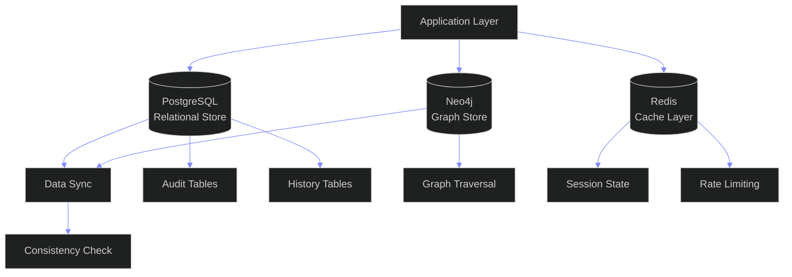
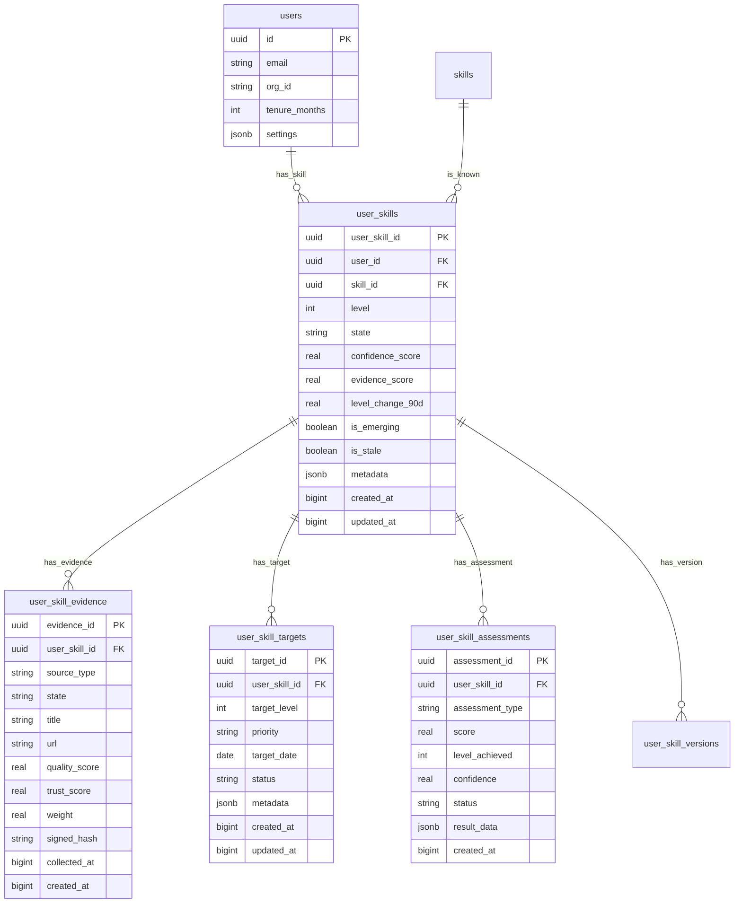

# Skill Database Architecture -- Enterprise Data Architecture for the Skills System

---

## Document Control

| Field | Value |
|---|---|
| Document ID | SB-SKILLDB-ARCH-001 |
| Version | 1.0.0 |
| Status | Active |
| Last Updated | 2026-06-22 |
| Classification | Internal -- Architecture Reference |
| Source of Truth | `docs/ai/skills/skills.md` (Skills System Enterprise Architecture -- 24, 22, 23, 17, 18, 19, 31, 32) |
| Companion Docs | `docs/ai/skills/SkillEvidence.md` (Evidence Database Design -- 10) |
| | `docs/ai/skills/SkillGraphArchitecture.md` (Graph Database Mapping -- 11) |
| | `docs/ai/skills/SkillAssessment.md` (Assessment Execution Engine) |
| | `docs/ai/skills/SkillAnalytics.md` (Analytics Engine & KPIs) |
| | `docs/ai/skills/SkillIntelligence.md` (Scoring Pipelines) |
| | `docs/ai/skills/SkillOpportunityMatching.md` (Opportunity Matching) |
| | `docs/ai/skills/SkillRoadmapEngine.md` (Roadmap Engine) |
| | `docs/ai/skills/SkillAgent.md` (Agent Architecture) |
| Target Stack | PostgreSQL 15+ (Supabase RDS) + Neo4j 5.x (Graph) + Redis 7.x (Cache) + PgBouncer (Connection Pool) + pg_partman (Partitioning) + pg_cron (Scheduling) |
| Target Audience | Data Architects, Backend Engineers, DBAs, DevOps Engineers, Security Engineers, AI Agents |

---

## Table of Contents

- [1. Database Overview](#1-database-overview)
- [2. Entity-Relationship Diagram](#2-entity-relationship-diagram)
- [3. Tables](#3-tables)
- [4. Relationships](#4-relationships)
- [5. Indexing Strategy](#5-indexing-strategy)
- [6. Constraints](#6-constraints)
- [7. Audit Tables](#7-audit-tables)
- [8. History Tables](#8-history-tables)
- [9. Event Tables](#9-event-tables)
- [10. Analytics Tables](#10-analytics-tables)
- [11. Security Design](#11-security-design)
- [12. Scalability Strategy](#12-scalability-strategy)
- [Appendix A: Neo4j Graph Schema Mapping](#appendix-a-neo4j-graph-schema-mapping)
- [Appendix B: Migration Guide](#appendix-b-migration-guide)
- [Appendix C: Glossary](#appendix-c-glossary)
- [Appendix D: Complete DDL Script](#appendix-d-complete-ddl-script)

---

## Multi-Database Architecture



---

## 1. Database Overview

### 1.1 Architecture Principles

The Skills Database follows five foundational principles defined in skills.md 24.1:

**Normalized Core** -- Skill definitions, categories, and taxonomy are fully relational (3NF). Foreign keys enforce referential integrity across all core entities. The taxonomy is the single source of truth with no redundant skill definitions.

**Flexible Extensions** -- User-specific data uses JSONB columns for customization while maintaining queryability via GIN indexes. Every JSONB column has a documented schema. JSONB is used for: metadata on skills, evidence payloads, assessment results, recommendation context, and external integration data.

**Immutable Audit** -- All state changes are logged in append-only audit tables. No UPDATE or DELETE on audit data -- only INSERT. Retention is indefinite. Audit data is partitioned by month and compressed after 1 year. This satisfies compliance requirements for skills.md 29 (Enterprise Governance).

**Time-Variant** -- Historical states are preserved via versioning and effective dating. Every mutable entity has a corresponding _history table that captures before/after snapshots. The versioning architecture (skills.md 23) supports rollback, diff analysis, and trend computation.

**Relationship-Rich** -- Skill relationships are stored as explicit edges with typed, weighted, directed connections supporting graph traversal alongside PostgreSQL queries. The relationship table (skill_relationships) mirrors the Neo4j graph edge structure, ensuring consistency between the two stores.

### 1.2 Technology Stack

| Layer | Technology | Version | Purpose |
|---|---|---|---|
| Primary Database | PostgreSQL (Supabase RDS) | 15+ | Relational data, transactions, JSONB documents, full-text search |
| Graph Query Engine | Neo4j | 5.x | Skill graph traversal, pathfinding, recommendation queries |
| Cache | Redis | 7.x | Session state, rate limiting, query results, materialized view cache |
| Connection Pool | PgBouncer | 1.21+ | Connection management, transaction pooling (default: 100 pool size) |
| Partition Management | pg_partman | 4.x | Automated time-based partitioning for event/audit tables |
| Job Scheduling | pg_cron | 1.5+ | Scheduled refresh of materialized views, partition maintenance, data retention |
| Full-Text Search | PostgreSQL tsvector | Built-in | Skill name/description search with ranking (GIN-indexed) |
| Message Queue | pgmq | 0.x | Reliable message queue for transactional outbox pattern |

### 1.3 Table Catalog

The schema is organized into six logical groups. Every table uses UUID primary keys (generated via gen_random_uuid()), BIGINT timestamps (epoch milliseconds), and JSONB for extensible metadata. All tables are created with IF NOT EXISTS guards for idempotent deployments.

#### Group 1: Core Taxonomy (5 tables)

| Table | Row Estimate | Purpose | Primary Key |
|---|---|---|---|
| skills | 10K-100K | Canonical skill definitions with level range, aliases, health score | skill_id UUID |
| skill_categories | 100-1K | Self-referential category hierarchy tree | category_id UUID |
| skill_relationships | 50K-500K | Directed, typed, weighted edges between skills | relationship_id UUID |
| tags | 500-5K | Flat tag taxonomy for cross-cutting classification | tag_id UUID |
| skill_external_mappings | 10K-100K | Crosswalk to external taxonomies (ESCO, LinkedIn, O*NET) | mapping_id UUID |

#### Group 2: User Skills (5 tables)

| Table | Row Estimate | Purpose | Primary Key |
|---|---|---|---|
| user_skills | 1M-100M | Per-user skill inventory with level, state, confidence score | user_skill_id UUID |
| user_skill_evidence | 5M-500M | Evidence items linked to user skills (shadows SkillEvidence engine) | evidence_id UUID |
| user_skill_targets | 500K-50M | Career and learning targets with deadlines and gap tracking | target_id UUID |
| user_skill_assessments | 1M-100M | Assessment attempts, scores, level achieved, confidence | assessment_id UUID |
| user_skill_versions | 5M-500M | Immutable version history of user_skill state changes | version_id UUID |

#### Group 3: Intelligence (6 tables)

| Table | Row Estimate | Purpose | Primary Key |
|---|---|---|---|
| skill_market_data | 10K-100K | Demand, growth, salary, competition scores (1:1 with skills) | skill_id UUID PK/FK |
| skill_income_data | 50K-500K | Income percentiles (p10-p90) per skill per level per source | income_id UUID |
| skill_certifications | 5K-50K | Certification definitions with level mappings | certification_id UUID |
| skill_projects | 50K-500K | Junction: projects to required skills | (project_id, skill_id) |
| skill_roadmaps | 10K-100K | Junction: roadmaps to milestone skills | (roadmap_id, skill_id) |
| skill_opportunities | 50K-500K | Junction: opportunities to required skills | (opportunity_id, skill_id) |

#### Group 4: Audit & History (4 tables)

| Table | Row Estimate | Purpose | Retention |
|---|---|---|---|
| skill_audit_log | 100M-1B | All state changes across all entities | Indefinite |
| skill_taxonomy_history | 10K-100K | Taxonomy version history | Indefinite |
| skill_user_skill_history | 50M-500M | User skill level/state transitions | Indefinite |
| skill_market_history | 1M-10M | Market intelligence score history | 5 years |

#### Group 5: Event & Analytics (6 tables)

| Table | Row Estimate | Purpose | Retention |
|---|---|---|---|
| skill_events | 100M-1B | Event sourcing bus for all domain events | 1 year active, 5 years archive |
| skill_event_outbox | 10M-100M | Transactional outbox for reliable event delivery | 7 days processed, 30 days failed |
| skill_webhook_queue | 10M-100M | Integration webhook delivery queue | 30 days |
| skill_event_subscriptions | 1K-10K | Consumer registry for event routing | Indefinite |
| skill_analytics_snapshots | 10M-500M | Daily per-user analytics rollups | 2 years |
| skill_forecasts | 1M-10M | Predictive forecast output per metric per skill | 1 year |

#### Group 6: Supporting (5 tables)

| Table | Row Estimate | Purpose |
|---|---|---|
| skill_topics | 50K-500K | Granular sub-topics and concepts within a skill |
| skill_resources | 50K-500K | Learning resources mapped to skills |
| skill_learning_paths | 10K-100K | Curated learning path definitions |
| skill_ai_recommendations | 10M-100M | Cached AI recommendation output with acceptance tracking |
| skill_user_activity_log | 100M-1B | Daily activity tracking for velocity and engagement |

**Total: 31 tables** covering all entities defined in skills.md with new event and analytics tables not present in the enumerated taxonomy.

### 1.4 Data Flow Architecture

```
                         +-------------------------+
                         |     EXTERNAL SOURCES     |
                         |  (GitHub, LinkedIn, LMS,  |
                         |   HRIS, ATS, Job Boards)  |
                         +------------+------------+
                                      | Webhook / REST / SCIM
                                      v
+------------------------------------------------------------------+
|                     API LAYER (FastAPI)                            |
|  +----------+ +----------+ +----------+ +---------------+         |
|  | Skills   | | Evidence | |Assessment| | Intelligence   |         |
|  | CRUD     | | Ingestion| | Engine   | | Pipeline      |         |
|  +----+-----+ +----+-----+ +----+-----+ +-------+-------+         |
|       |            |            |              |                  |
|       v            v            v              v                  |
|  +----------------------------------------------------------+     |
|  |              TRANSACTIONAL OUTBOX                          |     |
|  |  (skill_event_outbox - reliable event delivery)            |     |
|  +---------------------------+------------------------------+     |
+------------------------------+------------------------------------+
                               |
               +---------------+---------------+
               |               |               |
               v               v               v
+---------------------+ +----------+ +---------------+
|   PostgreSQL         | |  Neo4j   | |    Redis       |
|  (Canonical DB)      | | (Graph)  | |   (Cache)      |
|                      | |          | |                |
| . Core taxonomy      | | . Skill  | | . Session      |
| . User skills        | |   graph  | | . Rate limits  |
| . Evidence           | | traversal| | . Query cache  |
| . Audit/history      | | . Paths  | | . MV cache     |
| . Analytics MV       | | . Recs   | |                |
+---------------------+ +----------+ +---------------+

### 1.5 Storage Estimation

| Table Group | Estimated Rows | Uncompressed Size | Growth Rate |
|---|---|---|---|
| Core Taxonomy | 70K-600K | ~200 MB | Low |
| User Skills | 7M-650M | ~50 GB | High |
| Intelligence | 170K-1.6M | ~500 MB | Medium |
| Audit & History | 160M-1.6B | ~200 GB | Very High |
| Event & Analytics | 120M-1.6B | ~150 GB | Very High |
| Supporting | 210K-2.1M | ~1 GB | Medium |

**Estimated total at 100K users / 10K skills:** ~400 GB uncompressed. With PostgreSQL TOAST compression for JSONB and TEXT columns, expect ~120 GB on disk. Partition the four largest tables (evidence, audit, events, activity_log) by month to manage growth.

---

## 2. Entity-Relationship Diagram

### 2.1 Core Taxonomy ERD

```mermaid
erDiagram
    skill_categories ||--o{ skill_categories : parent
    skill_categories ||--o{ skills : contains
    skills ||--o{ skill_relationships : from
    skills ||--o{ skill_relationships : to
    skills ||--o{ skill_tags : mapped
    tags ||--o{ skill_tags : tagged
    skills ||--o{ skill_external_mappings : mapped

    skill_categories {
        uuid category_id PK
        uuid parent_category_id FK
        string name
        string slug UK
        string description
        int sort_order
        int level
        ltree path
        jsonb metadata
        bigint created_at
        bigint updated_at
    }

    skills {
        uuid skill_id PK
        uuid category_id FK
        string name
        string slug UK
        string description
        int level_min
        int level_max
        string[] aliases
        jsonb metadata
        bigint created_at
        bigint updated_at
    }

    skill_relationships {
        uuid relationship_id PK
        uuid from_skill_id FK
        uuid to_skill_id FK
        string relationship_type
        int min_level_from
        int min_level_to
        real weight
        jsonb metadata
        bigint created_at
    }

    tags {
        uuid tag_id PK
        string name UK
        string slug UK
        string description
        bigint created_at
    }

    skill_tags {
        uuid skill_id FK
        uuid tag_id FK
    }

    skill_external_mappings {
        uuid mapping_id PK
        uuid skill_id FK
        string external_system
        string external_id
        string external_name
        string mapping_type
        jsonb metadata
        bigint created_at
    }
```

### 2.2 User Skills ERD



### 2.3 Intelligence & Analytics ERD

```mermaid
erDiagram
    skills ||--o{ skill_market_data : market_info
    skills ||--o{ skill_income_data : income_info
    skills ||--o{ skill_certifications : certification
    skills ||--o{ skill_projects : requires_skill
    skills ||--o{ skill_roadmaps : roadmap_skill
    skills ||--o{ skill_opportunities : opportunity_skill
    users ||--o{ skill_analytics_snapshots : analytics
    skills ||--o{ skill_forecasts : forecast

    skill_market_data {
        uuid skill_id PK FK
        int demand_score
        real growth_score
        int salary_median
        int competition_score
        real future_relevance
        real skill_health
        jsonb source_data
        bigint updated_at
    }

    skill_income_data {
        uuid income_id PK
        uuid skill_id FK
        string source
        int level
        int p10
        int p25
        int p50
        int p75
        int p90
        string currency
        bigint updated_at
    }

    skill_certifications {
        uuid certification_id PK
        uuid skill_id FK
        string name
        string provider
        int level_mapped
        real quality_weight
        boolean is_verified
        bigint created_at
    }

    skill_projects {
        uuid project_id FK
        uuid skill_id FK
        int min_level
        real weight
    }

    skill_roadmaps {
        uuid roadmap_id FK
        uuid skill_id FK
        string phase
        int sort_order
        int target_level
    }

    skill_opportunities {
        uuid opportunity_id FK
        uuid skill_id FK
        int min_level
        real weight
        boolean is_required
    }

    skill_analytics_snapshots {
        uuid snapshot_id PK
        uuid user_id FK
        date snapshot_date
        real avg_skill_level
        int skill_count
        real readiness_score
        real learning_velocity
        real diversification_score
        real income_per_hour
        real market_alignment
        int emerging_coverage
        real milestone_completion
        real evidence_ratio
        bigint created_at
    }
```

---

## 3. Tables

### 3.1 Core Taxonomy Tables

#### skills -- Canonical Skill Definitions

The master list of all skills in the taxonomy. Each skill belongs to exactly one category and defines the valid level range for the skill type. The name plus category forms a unique constraint preventing duplicates. The slug is globally unique for URL routing and API lookups. The aliases array supports synonym-based search. The skill_health column stores the composite health metric computed per skills.md 17.3 formula.

```sql
CREATE TABLE skills (
    skill_id            UUID PRIMARY KEY DEFAULT gen_random_uuid(),
    category_id         UUID NOT NULL REFERENCES skill_categories(category_id) ON DELETE RESTRICT,
    name                TEXT NOT NULL,
    slug                TEXT NOT NULL,
    description         TEXT NOT NULL DEFAULT '',
    level_min           INT NOT NULL DEFAULT 0 CHECK (level_min >= 0 AND level_min <= 5),
    level_max           INT NOT NULL DEFAULT 5 CHECK (level_max >= 0 AND level_max <= 5),
    aliases             TEXT[] NOT NULL DEFAULT '{}',
    skill_health        REAL,
    metadata            JSONB NOT NULL DEFAULT '{}',
    is_deprecated       BOOLEAN NOT NULL DEFAULT false,
    deprecated_at       BIGINT,
    created_at          BIGINT NOT NULL DEFAULT (EXTRACT(EPOCH FROM NOW()) * 1000),
    updated_at          BIGINT NOT NULL DEFAULT (EXTRACT(EPOCH FROM NOW()) * 1000),
    CONSTRAINT valid_level_range CHECK (level_min <= level_max),
    CONSTRAINT unique_skill_name_per_category UNIQUE (category_id, name),
    CONSTRAINT unique_skill_slug UNIQUE (slug)
);

COMMENT ON TABLE skills IS 'Canonical skill definitions -- single source of truth for the skill taxonomy';
COMMENT ON COLUMN skills.skill_health IS 'Computed health metric per skills.md 17.3: D*0.30 + G*0.20 + S*0.25 + (100-C)*0.10 + F*0.15';
COMMENT ON COLUMN skills.metadata IS 'Flexible metadata: icon, color, keywords, external_refs, custom_fields';

CREATE INDEX idx_skills_category ON skills(category_id);
CREATE INDEX idx_skills_slug ON skills(slug);
CREATE INDEX idx_skills_deprecated ON skills(is_deprecated) WHERE is_deprecated = false;
CREATE INDEX idx_skills_metadata ON skills USING GIN(metadata jsonb_path_ops);
CREATE INDEX idx_skills_health ON skills(skill_health DESC) WHERE skill_health IS NOT NULL;
```

#### skill_categories -- Category Hierarchy Tree

A self-referential tree structure organizing skills into nested categories. Uses the LTREE extension for efficient ancestor/descendant queries and path-based sorting. The level column tracks the tree depth (practical maximum: 5 levels).

```sql
CREATE EXTENSION IF NOT EXISTS ltree;

CREATE TABLE skill_categories (
    category_id         UUID PRIMARY KEY DEFAULT gen_random_uuid(),
    parent_category_id  UUID REFERENCES skill_categories(category_id) ON DELETE SET NULL,
    name                TEXT NOT NULL,
    slug                TEXT NOT NULL,
    description         TEXT NOT NULL DEFAULT '',
    icon                TEXT,
    color               TEXT,
    sort_order          INT NOT NULL DEFAULT 0,
    level               INT NOT NULL DEFAULT 0 CHECK (level >= 0 AND level <= 10),
    path                LTREE,
    is_active           BOOLEAN NOT NULL DEFAULT true,
    metadata            JSONB NOT NULL DEFAULT '{}',
    created_at          BIGINT NOT NULL DEFAULT (EXTRACT(EPOCH FROM NOW()) * 1000),
    updated_at          BIGINT NOT NULL DEFAULT (EXTRACT(EPOCH FROM NOW()) * 1000),
    CONSTRAINT unique_category_name UNIQUE (name),
    CONSTRAINT unique_category_slug UNIQUE (slug)
);

COMMENT ON TABLE skill_categories IS 'Hierarchical category tree for skills taxonomy with LTREE ancestry';

CREATE INDEX idx_categories_parent ON skill_categories(parent_category_id);
CREATE INDEX idx_categories_path ON skill_categories USING GIST(path);
CREATE INDEX idx_categories_sort ON skill_categories(sort_order);
CREATE INDEX idx_categories_active ON skill_categories(is_active) WHERE is_active = true;
```

#### skill_relationships -- Directed Dependency Edges

Typed, weighted, directed relationships between skills. Supports eight relationship types covering prerequisites, similarities, and alternatives. The weight column enables fuzzy matching and recommendation scoring. The is_directed flag distinguishes directional (prerequisite) from bidirectional (similar_to) edges.

```sql
CREATE TABLE skill_relationships (
    relationship_id     UUID PRIMARY KEY DEFAULT gen_random_uuid(),
    from_skill_id       UUID NOT NULL REFERENCES skills(skill_id) ON DELETE CASCADE,
    to_skill_id         UUID NOT NULL REFERENCES skills(skill_id) ON DELETE CASCADE,
    relationship_type   TEXT NOT NULL CHECK (relationship_type IN (
        'prerequisite', 'related_to', 'supersedes', 'variant_of',
        'similar_to', 'recommended_before', 'complementary', 'alternative'
    )),
    min_level_from      INT CHECK (min_level_from >= 0 AND min_level_from <= 5),
    min_level_to        INT CHECK (min_level_to >= 0 AND min_level_to <= 5),
    weight              REAL NOT NULL DEFAULT 1.0 CHECK (weight >= 0.0 AND weight <= 1.0),
    is_directed         BOOLEAN NOT NULL DEFAULT true,
    metadata            JSONB NOT NULL DEFAULT '{}',
    created_at          BIGINT NOT NULL DEFAULT (EXTRACT(EPOCH FROM NOW()) * 1000),
    updated_at          BIGINT NOT NULL DEFAULT (EXTRACT(EPOCH FROM NOW()) * 1000),
    CONSTRAINT unique_relationship UNIQUE (from_skill_id, to_skill_id, relationship_type),
    CONSTRAINT no_self_relationship CHECK (from_skill_id <> to_skill_id)
);

COMMENT ON TABLE skill_relationships IS 'Typed, weighted, directed edges between skills for graph traversal';

CREATE INDEX idx_relationships_from ON skill_relationships(from_skill_id);
CREATE INDEX idx_relationships_to ON skill_relationships(to_skill_id);
CREATE INDEX idx_relationships_type ON skill_relationships(relationship_type);
CREATE INDEX idx_relationships_weight ON skill_relationships(weight DESC);
CREATE INDEX idx_relationships_from_type ON skill_relationships(from_skill_id, relationship_type);
```

#### tags -- Tag Definitions

Flat tag taxonomy for cross-cutting classification of skills. Used for filtering and grouping across category boundaries.

```sql
CREATE TABLE tags (
    tag_id              UUID PRIMARY KEY DEFAULT gen_random_uuid(),
    name                TEXT NOT NULL,
    slug                TEXT NOT NULL,
    description         TEXT NOT NULL DEFAULT '',
    color               TEXT,
    metadata            JSONB NOT NULL DEFAULT '{}',
    created_at          BIGINT NOT NULL DEFAULT (EXTRACT(EPOCH FROM NOW()) * 1000),
    CONSTRAINT unique_tag_name UNIQUE (name),
    CONSTRAINT unique_tag_slug UNIQUE (slug)
);

CREATE INDEX idx_tags_slug ON tags(slug);
```

#### skill_tags -- Many-to-Many Skill Tag Junction

```sql
CREATE TABLE skill_tags (
    skill_id            UUID NOT NULL REFERENCES skills(skill_id) ON DELETE CASCADE,
    tag_id              UUID NOT NULL REFERENCES tags(tag_id) ON DELETE CASCADE,
    PRIMARY KEY (skill_id, tag_id)
);

CREATE INDEX idx_skill_tags_tag ON skill_tags(tag_id);
```

#### skill_external_mappings -- External Taxonomy Crosswalk

Maps internal skills to external taxonomy identifiers for HRIS, ATS, and LMS integration (skills.md 30). Each mapping has a type (exact, broader, narrower, related) and confidence score.

```sql
CREATE TABLE skill_external_mappings (
    mapping_id          UUID PRIMARY KEY DEFAULT gen_random_uuid(),
    skill_id            UUID NOT NULL REFERENCES skills(skill_id) ON DELETE CASCADE,
    external_system     TEXT NOT NULL CHECK (external_system IN (
        'linkedin', 'esco', 'onet', 'workday', 'bamboohr',
        'cornerstone', 'docebo', 'greenhouse', 'lever', 'custom'
    )),
    external_id         TEXT NOT NULL,
    external_name       TEXT NOT NULL,
    mapping_type        TEXT NOT NULL DEFAULT 'exact' CHECK (mapping_type IN (
        'exact', 'broader', 'narrower', 'related', 'close_match'
    )),
    confidence          REAL NOT NULL DEFAULT 1.0 CHECK (confidence >= 0.0 AND confidence <= 1.0),
    metadata            JSONB NOT NULL DEFAULT '{}',
    created_at          BIGINT NOT NULL DEFAULT (EXTRACT(EPOCH FROM NOW()) * 1000),
    updated_at          BIGINT NOT NULL DEFAULT (EXTRACT(EPOCH FROM NOW()) * 1000),
    CONSTRAINT unique_external_mapping UNIQUE (skill_id, external_system, external_id)
);

CREATE INDEX idx_mappings_skill ON skill_external_mappings(skill_id);
CREATE INDEX idx_mappings_system ON skill_external_mappings(external_system);
CREATE INDEX idx_mappings_external_id ON skill_external_mappings(external_system, external_id);
```

### 3.2 User Skills Tables

#### user_skills -- Per-User Skill Records

The core user skill inventory. Each row represents one user's relationship with one skill. The state column enforces the lifecycle machine defined in skills.md 22: planned -> learning -> practicing -> active -> reviewing -> archived/deprecated. The confidence_score and evidence_score are computed by the SkillAssessment and SkillEvidence engines. The level_change_90d enables velocity tracking without historical computation.

```sql
CREATE TABLE user_skills (
    user_skill_id       UUID PRIMARY KEY DEFAULT gen_random_uuid(),
    user_id             UUID NOT NULL,
    skill_id            UUID NOT NULL REFERENCES skills(skill_id) ON DELETE RESTRICT,
    level               INT NOT NULL DEFAULT 0 CHECK (level >= 0 AND level <= 5),
    state               TEXT NOT NULL DEFAULT 'learning' CHECK (state IN (
        'planned', 'learning', 'practicing', 'active', 'reviewing',
        'archived', 'deprecated'
    )),
    confidence_score    REAL NOT NULL DEFAULT 0.0 CHECK (confidence_score >= 0.0 AND confidence_score <= 1.0),
    evidence_score      REAL NOT NULL DEFAULT 0.0 CHECK (evidence_score >= 0.0 AND evidence_score <= 1.0),
    level_change_90d    REAL NOT NULL DEFAULT 0.0,
    is_emerging         BOOLEAN NOT NULL DEFAULT false,
    is_stale            BOOLEAN NOT NULL DEFAULT false,
    last_activity_at    BIGINT,
    metadata            JSONB NOT NULL DEFAULT '{}',
    created_at          BIGINT NOT NULL DEFAULT (EXTRACT(EPOCH FROM NOW()) * 1000),
    updated_at          BIGINT NOT NULL DEFAULT (EXTRACT(EPOCH FROM NOW()) * 1000),
    CONSTRAINT unique_user_skill UNIQUE (user_id, skill_id)
);

COMMENT ON TABLE user_skills IS 'Per-user skill inventory with level, state, confidence, and velocity';
COMMENT ON COLUMN user_skills.level_change_90d IS 'Level delta over 90 days for velocity calculation';
COMMENT ON COLUMN user_skills.is_emerging IS 'Flag for rapidly growing skills';
COMMENT ON COLUMN user_skills.is_stale IS 'Flag for skills inactive 30+ days';

CREATE INDEX idx_user_skills_user ON user_skills(user_id);
CREATE INDEX idx_user_skills_skill ON user_skills(skill_id);
CREATE INDEX idx_user_skills_level ON user_skills(level);
CREATE INDEX idx_user_skills_state ON user_skills(state);
CREATE INDEX idx_user_skills_user_level ON user_skills(user_id, level DESC);
CREATE INDEX idx_user_skills_user_state ON user_skills(user_id, state);
CREATE INDEX idx_user_skills_stale ON user_skills(is_stale) WHERE is_stale = true;
CREATE INDEX idx_user_skills_emerging ON user_skills(is_emerging) WHERE is_emerging = true;
CREATE INDEX idx_user_skills_updated ON user_skills(updated_at DESC);
CREATE INDEX idx_user_skills_metadata ON user_skills USING GIN(metadata jsonb_path_ops);
```

#### user_skill_evidence -- Evidence Items for User Skills

Verifiable proof items linked to user skills. This table shadows the full evidence lifecycle managed by the SkillEvidence engine, providing a denormalized user-skill-centric view for fast queries. Twelve evidence source types are supported, matching the full evidence framework (skills.md 11). The signed_hash enables tamper detection via chain-of-evidence verification.

```sql
CREATE TABLE user_skill_evidence (
    evidence_id         UUID PRIMARY KEY DEFAULT gen_random_uuid(),
    user_skill_id       UUID NOT NULL REFERENCES user_skills(user_skill_id) ON DELETE CASCADE,
    user_id             UUID NOT NULL,
    source_type         TEXT NOT NULL CHECK (source_type IN (
        'project', 'github', 'certification', 'hackathon', 'freelance',
        'opensource', 'assessment', 'work_experience', 'course', 'publication',
        'patent', 'award'
    )),
    state               TEXT NOT NULL DEFAULT 'raw' CHECK (state IN (
        'raw', 'pending_verification', 'verified', 'verified_auto',
        'verified_ai', 'verified_human', 'rejected', 'flagged', 'active', 'expired'
    )),
    title               TEXT NOT NULL,
    description         TEXT NOT NULL DEFAULT '',
    url                 TEXT,
    quality_score       REAL NOT NULL DEFAULT 0.0 CHECK (quality_score >= 0.0 AND quality_score <= 1.0),
    trust_score         REAL NOT NULL DEFAULT 0.0 CHECK (trust_score >= 0.0 AND trust_score <= 1.0),
    weight              REAL NOT NULL DEFAULT 0.0 CHECK (weight >= 0.0 AND weight <= 1.0),
    signed_hash         TEXT NOT NULL,
    previous_hash       TEXT,
    metadata            JSONB NOT NULL DEFAULT '{}',
    collected_at        BIGINT NOT NULL,
    verified_at         BIGINT,
    expires_at          BIGINT,
    created_at          BIGINT NOT NULL DEFAULT (EXTRACT(EPOCH FROM NOW()) * 1000),
    updated_at          BIGINT NOT NULL DEFAULT (EXTRACT(EPOCH FROM NOW()) * 1000),
    CONSTRAINT unique_evidence_signed_hash UNIQUE (signed_hash)
);

COMMENT ON TABLE user_skill_evidence IS 'Evidence items shadow table -- denormalized for fast user-skill queries';
COMMENT ON COLUMN user_skill_evidence.signed_hash IS 'SHA-256 hash of evidence content for tamper detection';

CREATE INDEX idx_evidence_user_skill ON user_skill_evidence(user_skill_id);
CREATE INDEX idx_evidence_user ON user_skill_evidence(user_id);
CREATE INDEX idx_evidence_source ON user_skill_evidence(source_type);
CREATE INDEX idx_evidence_state ON user_skill_evidence(state);
CREATE INDEX idx_evidence_quality ON user_skill_evidence(quality_score DESC);
CREATE INDEX idx_evidence_trust ON user_skill_evidence(trust_score DESC);
CREATE INDEX idx_evidence_weight ON user_skill_evidence(weight DESC);
CREATE INDEX idx_evidence_collected ON user_skill_evidence(collected_at DESC);
CREATE INDEX idx_evidence_expires ON user_skill_evidence(expires_at) WHERE expires_at IS NOT NULL;
CREATE INDEX idx_evidence_metadata ON user_skill_evidence USING GIN(metadata jsonb_path_ops);
CREATE INDEX idx_evidence_user_state ON user_skill_evidence(user_id, state);
CREATE INDEX idx_evidence_user_source ON user_skill_evidence(user_id, source_type);
```

#### user_skill_targets -- User Skill Targets

Career and learning targets that users set for their skills. Each target specifies a desired level, priority, and optional deadline. The gap_size and progress_pct are GENERATED columns computed from the current and target levels. The status field tracks the target lifecycle: active -> in_progress -> achieved/paused/abandoned/expired.

```sql
CREATE TABLE user_skill_targets (
    target_id           UUID PRIMARY KEY DEFAULT gen_random_uuid(),
    user_skill_id       UUID NOT NULL REFERENCES user_skills(user_skill_id) ON DELETE CASCADE,
    user_id             UUID NOT NULL,
    target_level        INT NOT NULL CHECK (target_level >= 1 AND target_level <= 5),
    current_level       INT NOT NULL DEFAULT 0 CHECK (current_level >= 0 AND current_level <= 5),
    priority            TEXT NOT NULL DEFAULT 'medium' CHECK (priority IN ('low', 'medium', 'high', 'urgent')),
    target_date         DATE,
    status              TEXT NOT NULL DEFAULT 'active' CHECK (status IN (
        'active', 'in_progress', 'achieved', 'paused', 'abandoned', 'expired'
    )),
    gap_size            INT GENERATED ALWAYS AS (target_level - current_level) STORED,
    progress_pct        REAL GENERATED ALWAYS AS (
        CASE WHEN target_level > 0
             THEN LEAST(1.0, current_level::REAL / target_level::REAL) * 100
             ELSE 0 END
    ) STORED,
    metadata            JSONB NOT NULL DEFAULT '{}',
    created_at          BIGINT NOT NULL DEFAULT (EXTRACT(EPOCH FROM NOW()) * 1000),
    updated_at          BIGINT NOT NULL DEFAULT (EXTRACT(EPOCH FROM NOW()) * 1000),
    CONSTRAINT valid_target CHECK (target_level > current_level)
);

COMMENT ON TABLE user_skill_targets IS 'Career and learning targets with auto-computed gap and progress';

CREATE INDEX idx_targets_user_skill ON user_skill_targets(user_skill_id);
CREATE INDEX idx_targets_user ON user_skill_targets(user_id);
CREATE INDEX idx_targets_status ON user_skill_targets(status);
CREATE INDEX idx_targets_priority ON user_skill_targets(priority DESC);
CREATE INDEX idx_targets_date ON user_skill_targets(target_date) WHERE target_date IS NOT NULL;
CREATE INDEX idx_targets_active_user ON user_skill_targets(user_id) WHERE status = 'active';
CREATE INDEX idx_targets_gap ON user_skill_targets(gap_size DESC) WHERE status IN ('active', 'in_progress');
```

#### user_skill_assessments -- Assessment Attempts and Results

Records every assessment attempt linked to a user skill. Seven assessment types are supported, from self-assessment to AI-evaluated to human review. The result_data JSONB column stores the full assessment response including question-level scores for audit and analysis.

```sql
CREATE TABLE user_skill_assessments (
    assessment_id       UUID PRIMARY KEY DEFAULT gen_random_uuid(),
    user_skill_id       UUID NOT NULL REFERENCES user_skills(user_skill_id) ON DELETE CASCADE,
    user_id             UUID NOT NULL,
    assessment_type     TEXT NOT NULL CHECK (assessment_type IN (
        'self', 'ai_evaluated', 'auto_mcq', 'peer_review',
        'human_review', 'project_evaluation', 'certification_equivalency'
    )),
    score               REAL CHECK (score >= 0.0 AND score <= 100.0),
    level_achieved      INT CHECK (level_achieved >= 0 AND level_achieved <= 5),
    confidence          REAL CHECK (confidence >= 0.0 AND confidence <= 1.0),
    status              TEXT NOT NULL DEFAULT 'pending' CHECK (status IN (
        'pending', 'in_progress', 'completed', 'expired', 'invalidated'
    )),
    duration_seconds    INT,
    result_data         JSONB NOT NULL DEFAULT '{}',
    started_at          BIGINT,
    completed_at        BIGINT,
    created_at          BIGINT NOT NULL DEFAULT (EXTRACT(EPOCH FROM NOW()) * 1000),
    updated_at          BIGINT NOT NULL DEFAULT (EXTRACT(EPOCH FROM NOW()) * 1000)
);

COMMENT ON TABLE user_skill_assessments IS 'Assessment attempts and results with question-level result data';
COMMENT ON COLUMN user_skill_assessments.result_data IS 'Full response including question-level scores, timestamps, metadata';

CREATE INDEX idx_assessments_user_skill ON user_skill_assessments(user_skill_id);
CREATE INDEX idx_assessments_user ON user_skill_assessments(user_id);
CREATE INDEX idx_assessments_type ON user_skill_assessments(assessment_type);
CREATE INDEX idx_assessments_status ON user_skill_assessments(status);
CREATE INDEX idx_assessments_completed ON user_skill_assessments(completed_at DESC) WHERE completed_at IS NOT NULL;
CREATE INDEX idx_assessments_level ON user_skill_assessments(level_achieved DESC);
```

#### user_skill_versions -- Version History of User Skills

Immutable version history tracking every change to user_skill records. Each version captures the full state snapshot before and after the change (skills.md 23). Version numbers are sequential per user_skill_id, enabling ordered rollback and diff analysis.

```sql
CREATE TABLE user_skill_versions (
    version_id          UUID PRIMARY KEY DEFAULT gen_random_uuid(),
    user_skill_id       UUID NOT NULL REFERENCES user_skills(user_skill_id) ON DELETE CASCADE,
    user_id             UUID NOT NULL,
    version_number      INT NOT NULL,
    change_type         TEXT NOT NULL CHECK (change_type IN (
        'created', 'level_changed', 'state_changed', 'evidence_added',
        'metadata_updated', 'archived', 'deprecated', 'restored'
    )),
    previous_state      JSONB NOT NULL,
    new_state           JSONB NOT NULL,
    changed_by          UUID NOT NULL,
    change_reason       TEXT,
    metadata            JSONB NOT NULL DEFAULT '{}',
    created_at          BIGINT NOT NULL DEFAULT (EXTRACT(EPOCH FROM NOW()) * 1000),
    CONSTRAINT unique_version_per_skill UNIQUE (user_skill_id, version_number)
);

COMMENT ON TABLE user_skill_versions IS 'Immutable version history of user_skill state changes';

CREATE INDEX idx_versions_user_skill ON user_skill_versions(user_skill_id);
CREATE INDEX idx_versions_user ON user_skill_versions(user_id);
CREATE INDEX idx_versions_type ON user_skill_versions(change_type);
CREATE INDEX idx_versions_created ON user_skill_versions(created_at DESC);
CREATE INDEX idx_versions_changed_by ON user_skill_versions(changed_by);
```

### 3.3 Intelligence Tables

#### skill_market_data -- Market Intelligence Scores

Per-skill market intelligence data (skills.md 17). One row per skill (1:1 relationship). The skill_health column is a GENERATED column computing the composite health metric from demand, growth, salary, competition, and future relevance scores.

```sql
CREATE TABLE skill_market_data (
    skill_id            UUID PRIMARY KEY REFERENCES skills(skill_id) ON DELETE CASCADE,
    demand_score        INT NOT NULL CHECK (demand_score >= 0 AND demand_score <= 100),
    growth_score        REAL NOT NULL CHECK (growth_score >= -100 AND growth_score <= 100),
    salary_median       INT CHECK (salary_median >= 0),
    salary_p10          INT,
    salary_p25          INT,
    salary_p75          INT,
    salary_p90          INT,
    competition_score   INT CHECK (competition_score >= 0 AND competition_score <= 100),
    future_relevance    REAL CHECK (future_relevance >= 0.0 AND future_relevance <= 100.0),
    skill_health        REAL GENERATED ALWAYS AS (
        ROUND((demand_score::REAL * 0.30
            + GREATEST(growth_score, 0) * 0.20
            + COALESCE(salary_median, 0) / 1000.0 * 0.25
            + (100.0 - COALESCE(competition_score, 50)) * 0.10
            + COALESCE(future_relevance, 50) * 0.15)::NUMERIC, 2)
    ) STORED,
    job_postings_count  INT,
    source_data         JSONB NOT NULL DEFAULT '{}',
    data_freshness      TEXT NOT NULL DEFAULT 'current' CHECK (data_freshness IN ('current', 'stale', 'refreshing')),
    updated_at          BIGINT NOT NULL DEFAULT (EXTRACT(EPOCH FROM NOW()) * 1000)
);

COMMENT ON TABLE skill_market_data IS 'Market intelligence scores per skill per skills.md 17';

CREATE INDEX idx_market_demand ON skill_market_data(demand_score DESC);
CREATE INDEX idx_market_growth ON skill_market_data(growth_score DESC);
CREATE INDEX idx_market_salary ON skill_market_data(salary_median DESC);
CREATE INDEX idx_market_health ON skill_market_data(skill_health DESC);
CREATE INDEX idx_market_freshness ON skill_market_data(data_freshness);
```

#### skill_income_data -- Income Ranges per Skill

Income percentiles per skill per level per source type (skills.md 18). The ten income sources match the full income mapping taxonomy. Income percentiles must be monotonically increasing (p10 <= p25 <= p50 <= p75 <= p90), enforced by a CHECK constraint.

```sql
CREATE TABLE skill_income_data (
    income_id           UUID PRIMARY KEY DEFAULT gen_random_uuid(),
    skill_id            UUID NOT NULL REFERENCES skills(skill_id) ON DELETE CASCADE,
    source              TEXT NOT NULL CHECK (source IN (
        'employment', 'freelance', 'consulting', 'content', 'product',
        'agency', 'teaching', 'opensource', 'digital', 'affiliate'
    )),
    level               INT NOT NULL CHECK (level >= 0 AND level <= 5),
    p10                 INT CHECK (p10 >= 0),
    p25                 INT CHECK (p25 >= 0),
    p50                 INT CHECK (p50 >= 0),
    p75                 INT CHECK (p75 >= 0),
    p90                 INT CHECK (p90 >= 0),
    currency            TEXT NOT NULL DEFAULT 'USD',
    location            TEXT,
    source_data         JSONB NOT NULL DEFAULT '{}',
    updated_at          BIGINT NOT NULL DEFAULT (EXTRACT(EPOCH FROM NOW()) * 1000),
    CONSTRAINT unique_income_record UNIQUE (skill_id, source, level),
    CONSTRAINT valid_percentiles CHECK (p10 <= p25 AND p25 <= p50 AND p50 <= p75 AND p75 <= p90)
);

COMMENT ON TABLE skill_income_data IS 'Income percentiles per skill per level per source type';

CREATE INDEX idx_income_skill ON skill_income_data(skill_id);
CREATE INDEX idx_income_source ON skill_income_data(source);
CREATE INDEX idx_income_level ON skill_income_data(level);
CREATE INDEX idx_income_skill_source ON skill_income_data(skill_id, source);
CREATE INDEX idx_income_median ON skill_income_data(p50 DESC);
```

#### skill_certifications -- Certification Definitions

Certification definitions linked to skills with level mapping. Each certification maps to a specific skill level for equivalency scoring. Quality_weight determines how much a certification contributes to the evidence score.

```sql
CREATE TABLE skill_certifications (
    certification_id    UUID PRIMARY KEY DEFAULT gen_random_uuid(),
    skill_id            UUID NOT NULL REFERENCES skills(skill_id) ON DELETE CASCADE,
    category_id         UUID REFERENCES skill_categories(category_id) ON DELETE SET NULL,
    name                TEXT NOT NULL,
    provider            TEXT NOT NULL,
    level_mapped        INT NOT NULL CHECK (level_mapped >= 0 AND level_mapped <= 5),
    quality_weight      REAL NOT NULL DEFAULT 0.5 CHECK (quality_weight >= 0.0 AND quality_weight <= 1.0),
    is_verified         BOOLEAN NOT NULL DEFAULT false,
    verification_url    TEXT,
    expiration_months   INT,
    metadata            JSONB NOT NULL DEFAULT '{}',
    created_at          BIGINT NOT NULL DEFAULT (EXTRACT(EPOCH FROM NOW()) * 1000),
    updated_at          BIGINT NOT NULL DEFAULT (EXTRACT(EPOCH FROM NOW()) * 1000),
    CONSTRAINT unique_certification UNIQUE (name, provider)
);

CREATE INDEX idx_certs_skill ON skill_certifications(skill_id);
CREATE INDEX idx_certs_category ON skill_certifications(category_id);
CREATE INDEX idx_certs_provider ON skill_certifications(provider);
CREATE INDEX idx_certs_level ON skill_certifications(level_mapped);
CREATE INDEX idx_certs_verified ON skill_certifications(is_verified) WHERE is_verified = true;
```

#### Junction Tables: skill_projects, skill_roadmaps, skill_opportunities

```sql
CREATE TABLE skill_projects (
    project_id          UUID NOT NULL REFERENCES projects(id) ON DELETE CASCADE,
    skill_id            UUID NOT NULL REFERENCES skills(skill_id) ON DELETE CASCADE,
    min_level           INT NOT NULL DEFAULT 1 CHECK (min_level >= 0 AND min_level <= 5),
    weight              REAL NOT NULL DEFAULT 1.0 CHECK (weight >= 0.0 AND weight <= 1.0),
    created_at          BIGINT NOT NULL DEFAULT (EXTRACT(EPOCH FROM NOW()) * 1000),
    PRIMARY KEY (project_id, skill_id)
);

CREATE INDEX idx_projects_skill ON skill_projects(skill_id);
CREATE INDEX idx_projects_min_level ON skill_projects(min_level);

CREATE TABLE skill_roadmaps (
    roadmap_id          UUID NOT NULL REFERENCES skill_roadmap_definitions(roadmap_id) ON DELETE CASCADE,
    skill_id            UUID NOT NULL REFERENCES skills(skill_id) ON DELETE CASCADE,
    phase               TEXT NOT NULL CHECK (phase IN (
        'foundation', 'core', 'intermediate', 'advanced', 'expert', 'optional'
    )),
    sort_order          INT NOT NULL DEFAULT 0,
    target_level        INT NOT NULL CHECK (target_level >= 0 AND target_level <= 5),
    estimated_hours     INT,
    created_at          BIGINT NOT NULL DEFAULT (EXTRACT(EPOCH FROM NOW()) * 1000),
    PRIMARY KEY (roadmap_id, skill_id)
);

CREATE INDEX idx_roadmaps_skill ON skill_roadmaps(skill_id);
CREATE INDEX idx_roadmaps_phase ON skill_roadmaps(phase);
CREATE INDEX idx_roadmaps_order ON skill_roadmaps(roadmap_id, sort_order);

CREATE TABLE skill_opportunities (
    opportunity_id       UUID NOT NULL REFERENCES opportunities(id) ON DELETE CASCADE,
    skill_id             UUID NOT NULL REFERENCES skills(skill_id) ON DELETE CASCADE,
    min_level            INT NOT NULL DEFAULT 1 CHECK (min_level >= 0 AND min_level <= 5),
    weight               REAL NOT NULL DEFAULT 1.0 CHECK (weight >= 0.0 AND weight <= 1.0),
    is_required          BOOLEAN NOT NULL DEFAULT true,
    created_at           BIGINT NOT NULL DEFAULT (EXTRACT(EPOCH FROM NOW()) * 1000),
    PRIMARY KEY (opportunity_id, skill_id)
);

CREATE INDEX idx_opportunities_skill ON skill_opportunities(skill_id);
CREATE INDEX idx_opportunities_weight ON skill_opportunities(weight DESC);
CREATE INDEX idx_opportunities_required ON skill_opportunities(opportunity_id) WHERE is_required = true;
```

### 3.4 Supporting Tables

```sql
CREATE TABLE skill_topics (
    topic_id            UUID PRIMARY KEY DEFAULT gen_random_uuid(),
    skill_id            UUID NOT NULL REFERENCES skills(skill_id) ON DELETE CASCADE,
    name                TEXT NOT NULL,
    description         TEXT NOT NULL DEFAULT '',
    parent_topic_id     UUID REFERENCES skill_topics(topic_id) ON DELETE SET NULL,
    sort_order          INT NOT NULL DEFAULT 0,
    metadata            JSONB NOT NULL DEFAULT '{}',
    created_at          BIGINT NOT NULL DEFAULT (EXTRACT(EPOCH FROM NOW()) * 1000),
    CONSTRAINT unique_topic_per_skill UNIQUE (skill_id, name)
);

CREATE INDEX idx_topics_skill ON skill_topics(skill_id);
CREATE INDEX idx_topics_parent ON skill_topics(parent_topic_id);
CREATE INDEX idx_topics_order ON skill_topics(skill_id, sort_order);

CREATE TABLE skill_resources (
    resource_id         UUID PRIMARY KEY DEFAULT gen_random_uuid(),
    skill_id            UUID NOT NULL REFERENCES skills(skill_id) ON DELETE CASCADE,
    title               TEXT NOT NULL,
    resource_type       TEXT NOT NULL CHECK (resource_type IN (
        'course', 'book', 'tutorial', 'video', 'article', 'documentation',
        'tool', 'workshop', 'podcast', 'certification_prep'
    )),
    url                 TEXT,
    provider            TEXT,
    difficulty          TEXT NOT NULL DEFAULT 'intermediate' CHECK (difficulty IN ('beginner', 'intermediate', 'advanced', 'expert')),
    estimated_hours     REAL,
    quality_rating      REAL CHECK (quality_rating >= 0.0 AND quality_rating <= 5.0),
    is_free             BOOLEAN NOT NULL DEFAULT false,
    metadata            JSONB NOT NULL DEFAULT '{}',
    created_at          BIGINT NOT NULL DEFAULT (EXTRACT(EPOCH FROM NOW()) * 1000),
    updated_at          BIGINT NOT NULL DEFAULT (EXTRACT(EPOCH FROM NOW()) * 1000),
    CONSTRAINT unique_resource_url UNIQUE (url)
);

CREATE INDEX idx_resources_skill ON skill_resources(skill_id);
CREATE INDEX idx_resources_type ON skill_resources(resource_type);
CREATE INDEX idx_resources_difficulty ON skill_resources(difficulty);
CREATE INDEX idx_resources_rating ON skill_resources(quality_rating DESC);
CREATE INDEX idx_resources_free ON skill_resources(is_free) WHERE is_free = true;

CREATE TABLE skill_learning_paths (
    path_id             UUID PRIMARY KEY DEFAULT gen_random_uuid(),
    target_skill_id     UUID NOT NULL REFERENCES skills(skill_id) ON DELETE CASCADE,
    name                TEXT NOT NULL,
    description         TEXT NOT NULL DEFAULT '',
    estimated_duration  TEXT,
    difficulty          TEXT NOT NULL DEFAULT 'intermediate' CHECK (difficulty IN ('beginner', 'intermediate', 'advanced', 'expert')),
    steps               JSONB NOT NULL DEFAULT '[]',
    is_ai_generated     BOOLEAN NOT NULL DEFAULT false,
    metadata            JSONB NOT NULL DEFAULT '{}',
    created_at          BIGINT NOT NULL DEFAULT (EXTRACT(EPOCH FROM NOW()) * 1000),
    updated_at          BIGINT NOT NULL DEFAULT (EXTRACT(EPOCH FROM NOW()) * 1000)
);

COMMENT ON COLUMN skill_learning_paths.steps IS 'Array of ordered steps: [{step_id, skill_id, resource_id, estimated_hours, description}]';

CREATE INDEX idx_paths_target ON skill_learning_paths(target_skill_id);
CREATE INDEX idx_paths_difficulty ON skill_learning_paths(difficulty);
CREATE INDEX idx_paths_ai ON skill_learning_paths(is_ai_generated) WHERE is_ai_generated = true;

CREATE TABLE skill_ai_recommendations (
    recommendation_id   UUID PRIMARY KEY DEFAULT gen_random_uuid(),
    user_id             UUID NOT NULL,
    recommendation_type TEXT NOT NULL CHECK (recommendation_type IN (
        'learn', 'improve', 'drop', 'emerging', 'opportunity_readiness',
        'career_path', 'resource_suggestion', 'certification_suggestion'
    )),
    skill_id            UUID NOT NULL REFERENCES skills(skill_id) ON DELETE CASCADE,
    reasoning           TEXT NOT NULL,
    priority            INT NOT NULL DEFAULT 0 CHECK (priority >= 0 AND priority <= 100),
    accepted            BOOLEAN,
    source              TEXT NOT NULL DEFAULT 'ai',
    metadata            JSONB NOT NULL DEFAULT '{}',
    expires_at          BIGINT,
    created_at          BIGINT NOT NULL DEFAULT (EXTRACT(EPOCH FROM NOW()) * 1000),
    CONSTRAINT unique_active_recommendation UNIQUE (user_id, recommendation_type, skill_id)
);

CREATE INDEX idx_recommendations_user ON skill_ai_recommendations(user_id);
CREATE INDEX idx_recommendations_type ON skill_ai_recommendations(recommendation_type);
CREATE INDEX idx_recommendations_skill ON skill_ai_recommendations(skill_id);
CREATE INDEX idx_recommendations_priority ON skill_ai_recommendations(priority DESC);
CREATE INDEX idx_recommendations_accepted ON skill_ai_recommendations(accepted) WHERE accepted IS NOT NULL;
CREATE INDEX idx_recommendations_expires ON skill_ai_recommendations(expires_at) WHERE expires_at IS NOT NULL;

CREATE TABLE skill_user_activity_log (
    activity_id         UUID PRIMARY KEY DEFAULT gen_random_uuid(),
    user_id             UUID NOT NULL,
    activity_type       TEXT NOT NULL CHECK (activity_type IN (
        'skill_added', 'level_changed', 'evidence_submitted', 'assessment_taken',
        'target_set', 'target_achieved', 'recommendation_viewed',
        'recommendation_accepted', 'skill_archived', 'skill_deprecated',
        'skill_tree_viewed', 'dashboard_viewed', 'market_data_viewed',
        'income_data_viewed', 'career_readiness_viewed'
    )),
    skill_id            UUID REFERENCES skills(skill_id) ON DELETE SET NULL,
    metadata            JSONB NOT NULL DEFAULT '{}',
    created_at          BIGINT NOT NULL DEFAULT (EXTRACT(EPOCH FROM NOW()) * 1000)
);

CREATE INDEX idx_activity_user ON skill_user_activity_log(user_id);
CREATE INDEX idx_activity_type ON skill_user_activity_log(activity_type);
CREATE INDEX idx_activity_skill ON skill_user_activity_log(skill_id);
CREATE INDEX idx_activity_created ON skill_user_activity_log(created_at DESC);
CREATE INDEX idx_activity_user_type ON skill_user_activity_log(user_id, activity_type);
CREATE INDEX idx_activity_user_date ON skill_user_activity_log(user_id, created_at DESC);


---

## 4. Relationships

### 4.1 Relationship Matrix

The following matrix defines all foreign key relationships across the schema. Each relationship is categorized by cardinality and delete behavior.

| Parent Table | Child Table | FK Column(s) | Cardinality | Delete Rule | Behavior |
|---|---|---|---|---|---|
| skill_categories | skill_categories | parent_category_id | 1:N | SET NULL | Orphaned categories become root-level |
| skill_categories | skills | category_id | 1:N | RESTRICT | Cannot delete category with skills assigned |
| skills | skill_relationships | from_skill_id | 1:N | CASCADE | Delete all outgoing relationship edges |
| skills | skill_relationships | to_skill_id | 1:N | CASCADE | Delete all incoming relationship edges |
| skills | skill_tags | skill_id | 1:N | CASCADE | Remove all tag assignments |
| tags | skill_tags | tag_id | 1:N | CASCADE | Remove all skill assignments |
| skills | skill_external_mappings | skill_id | 1:N | CASCADE | Remove all external taxonomy mappings |
| skills | user_skills | skill_id | 1:N | RESTRICT | Cannot delete skill in use by any user |
| skills | skill_market_data | skill_id | 1:1 | CASCADE | Remove market intelligence data |
| skills | skill_income_data | skill_id | 1:N | CASCADE | Remove all income records |
| skills | skill_certifications | skill_id | 1:N | CASCADE | Remove all certification mappings |
| skills | skill_topics | skill_id | 1:N | CASCADE | Remove all sub-topics |
| skills | skill_resources | skill_id | 1:N | CASCADE | Remove all resource links |
| skills | skill_learning_paths | target_skill_id | 1:N | CASCADE | Remove all learning paths |
| skills | skill_ai_recommendations | skill_id | 1:N | CASCADE | Remove all AI recommendations |
| skills | skill_projects | skill_id | 1:N | CASCADE | Remove all project mappings |
| skills | skill_roadmaps | skill_id | 1:N | CASCADE | Remove all roadmap mappings |
| skills | skill_opportunities | skill_id | 1:N | CASCADE | Remove all opportunity mappings |
| user_skills | user_skill_evidence | user_skill_id | 1:N | CASCADE | Remove all evidence items |
| user_skills | user_skill_targets | user_skill_id | 1:N | CASCADE | Remove all targets |
| user_skills | user_skill_assessments | user_skill_id | 1:N | CASCADE | Remove all assessments |
| user_skills | user_skill_versions | user_skill_id | 1:N | CASCADE | Remove all version records |
| skill_categories | skill_certifications | category_id | 1:N | SET NULL | Category reference set to null |
| skill_topics | skill_topics | parent_topic_id | 1:N | SET NULL | Topic becomes root-level |
| projects | skill_projects | project_id | 1:N | CASCADE | Remove all skill mappings |
| opportunities | skill_opportunities | opportunity_id | 1:N | CASCADE | Remove all skill mappings |
| skill_roadmap_definitions | skill_roadmaps | roadmap_id | 1:N | CASCADE | Remove all milestone mappings |

### 4.2 Junction Table Summary

| Table | Left Entity | Right Entity | Attributes | Estimated Rows |
|---|---|---|---|---|
| skill_tags | skills | tags | -- | 50K-500K |
| skill_projects | projects | skills | min_level, weight | 50K-500K |
| skill_roadmaps | roadmaps | skills | phase, sort_order, target_level, estimated_hours | 10K-100K |
| skill_opportunities | opportunities | skills | min_level, weight, is_required | 50K-500K |

### 4.3 Composite Key Patterns

| Pattern | Example | Usage |
|---|---|---|
| Natural Key | skills.slug (unique globally) | URL routing, API lookups |
| Composite Unique | UNIQUE (category_id, name) on skills | Prevent duplicate skill names within category |
| Composite PK | PRIMARY KEY (project_id, skill_id) on skill_projects | Junction table natural key |
| Generated Column | GENERATED ALWAYS AS (target_level - current_level) STORED | Gap computation for fast queries |

### 4.4 Self-Referential Relationships

| Table | Column | Max Depth | Purpose |
|---|---|---|---|
| skill_categories | parent_category_id | 5 levels | Hierarchical category tree |
| skill_topics | parent_topic_id | 3 levels | Granular topic hierarchy |
| skill_relationships | from_skill_id -> to_skill_id | N/A (graph) | Directed skill dependency graph |

### 4.5 Cascade Rule Summary

| Rule | Count | Usage |
|---|---|---|
| CASCADE | 25 | Clean up dependent data on parent deletion |
| RESTRICT | 2 | Protect skills in use by users, categories with skills |
| SET NULL | 3 | Optional parent references (categories, topics, certifications) |

---

## 5. Indexing Strategy

### 5.1 Index Design Principles

1. **Every foreign key gets a B-tree index** -- This is non-negotiable. All 25+ FK columns are indexed to prevent sequential scans on JOINs.
2. **Every sort/order column gets a B-tree index with DESC** -- Timestamps, scores, and priority columns are queried with ORDER BY DESC in the vast majority of cases.
3. **JSONB columns use GIN indexes with jsonb_path_ops** -- The jsonb_path_ops operator class is faster and more space-efficient for the @>, ?, ?|, and ?& operators.
4. **Array columns use GIN indexes** -- For array containment queries on skill aliases and multi-tag filters.
5. **Partial indexes for filtered queries** -- WHERE status = 'active' or WHERE is_deprecated = false to keep index sizes small.
6. **Composite indexes for multi-column access patterns** -- Covering the most common WHERE + ORDER BY combinations.
7. **LTREE columns use GiST indexes** -- For efficient ancestor/descendant tree queries.

### 5.2 Index Inventory

#### Core Taxonomy Indexes (17 indexes)

| Table | Index Name | Column(s) | Type | Purpose |
|---|---|---|---|---|
| skills | idx_skills_category | category_id | B-tree | FK lookup |
| skills | idx_skills_slug | slug | B-tree UNIQUE | URL lookup |
| skills | idx_skills_deprecated | is_deprecated | Partial B-tree | Active-only queries |
| skills | idx_skills_metadata | metadata | GIN jsonb_path_ops | JSONB filtering |
| skills | idx_skills_health | skill_health DESC | B-tree | Health-based sorting |
| skill_categories | idx_categories_parent | parent_category_id | B-tree | FK lookup |
| skill_categories | idx_categories_path | path | GiST | LTREE ancestor queries |
| skill_categories | idx_categories_sort | sort_order | B-tree | Ordered listing |
| skill_categories | idx_categories_active | is_active | Partial B-tree | Active-only queries |
| skill_relationships | idx_relationships_from | from_skill_id | B-tree | Outgoing edges |
| skill_relationships | idx_relationships_to | to_skill_id | B-tree | Incoming edges |
| skill_relationships | idx_relationships_type | relationship_type | B-tree | Type-based filtering |
| skill_relationships | idx_relationships_weight | weight DESC | B-tree | Weight sorting |
| skill_relationships | idx_relationships_from_type | from_skill_id, relationship_type | Composite B-tree | Graph traversal pattern |
| tags | idx_tags_slug | slug | B-tree | URL lookup |
| skill_tags | idx_skill_tags_tag | tag_id | B-tree | FK lookup |
| skill_external_mappings | idx_mappings_skill | skill_id | B-tree | FK lookup |
| skill_external_mappings | idx_mappings_system | external_system | B-tree | System filtering |
| skill_external_mappings | idx_mappings_external_id | external_system, external_id | Composite B-tree | External reverse lookup |

#### User Skills Indexes (26 indexes)

| Table | Index Name | Column(s) | Type | Purpose |
|---|---|---|---|---|
| user_skills | idx_user_skills_user | user_id | B-tree | User-based queries (primary access pattern) |
| user_skills | idx_user_skills_skill | skill_id | B-tree | FK lookup |
| user_skills | idx_user_skills_level | level | B-tree | Level filtering |
| user_skills | idx_user_skills_state | state | B-tree | State filtering |
| user_skills | idx_user_skills_user_level | user_id, level DESC | Composite B-tree | User dashboard sorted by level |
| user_skills | idx_user_skills_user_state | user_id, state | Composite B-tree | User skills filtered by state |
| user_skills | idx_user_skills_stale | is_stale | Partial B-tree | Stale skill detection |
| user_skills | idx_user_skills_emerging | is_emerging | Partial B-tree | Emerging skill detection |
| user_skills | idx_user_skills_updated | updated_at DESC | B-tree | Recent activity sorting |
| user_skills | idx_user_skills_metadata | metadata | GIN jsonb_path_ops | JSONB filtering |
| user_skill_evidence | idx_evidence_user_skill | user_skill_id | B-tree | FK lookup |
| user_skill_evidence | idx_evidence_user | user_id | B-tree | User-based queries |
| user_skill_evidence | idx_evidence_source | source_type | B-tree | Source filtering |
| user_skill_evidence | idx_evidence_state | state | B-tree | State filtering |
| user_skill_evidence | idx_evidence_quality | quality_score DESC | B-tree | Quality sorting |
| user_skill_evidence | idx_evidence_trust | trust_score DESC | B-tree | Trust sorting |
| user_skill_evidence | idx_evidence_weight | weight DESC | B-tree | Weight sorting |
| user_skill_evidence | idx_evidence_collected | collected_at DESC | B-tree | Time-based queries |
| user_skill_evidence | idx_evidence_expires | expires_at | Partial B-tree | Expiration checks |
| user_skill_evidence | idx_evidence_metadata | metadata | GIN jsonb_path_ops | JSONB filtering |
| user_skill_evidence | idx_evidence_user_state | user_id, state | Composite B-tree | User evidence filtered by state |
| user_skill_evidence | idx_evidence_user_source | user_id, source_type | Composite B-tree | User evidence filtered by source |
| user_skill_targets | 6 indexes | user_skill_id, user_id, status, priority, target_date, gap_size | Mixed | FK + filtering + sorting |
| user_skill_assessments | 5 indexes | user_skill_id, user_id, type, status, completed_at | Mixed | FK + filtering + time-series |
| user_skill_versions | 5 indexes | user_skill_id, user_id, type, created_at, changed_by | Mixed | FK + version queries |
| user_activity_log | 6 indexes | user_id, type, skill_id, created_at, user+type, user+date | Mixed | Activity queries |

#### Intelligence Indexes (15 indexes)

| Table | Index Name | Column(s) | Type | Purpose |
|---|---|---|---|---|
| skill_market_data | idx_market_demand | demand_score DESC | B-tree | Demand-based sorting |
| skill_market_data | idx_market_growth | growth_score DESC | B-tree | Growth-based sorting |
| skill_market_data | idx_market_salary | salary_median DESC | B-tree | Salary-based sorting |
| skill_market_data | idx_market_health | skill_health DESC | B-tree | Health-based sorting |
| skill_market_data | idx_market_freshness | data_freshness | B-tree | Freshness filtering |
| skill_income_data | idx_income_skill | skill_id | B-tree | FK lookup |
| skill_income_data | idx_income_source | source | B-tree | Source filtering |
| skill_income_data | idx_income_level | level | B-tree | Level filtering |
| skill_income_data | idx_income_skill_source | skill_id, source | Composite B-tree | Primary query pattern |
| skill_income_data | idx_income_median | p50 DESC | B-tree | Median income sorting |
| skill_certifications | 5 indexes | skill_id, category_id, provider, level_mapped, is_verified | Mixed | FK + filtering |
| skill_projects | 2 indexes | skill_id, min_level | B-tree | FK + filtering |
| skill_roadmaps | 3 indexes | skill_id, phase, (roadmap_id, sort_order) | Mixed | FK + ordered listing |
| skill_opportunities | 3 indexes | skill_id, weight DESC, (opportunity_id) WHERE required | Mixed | FK + weight sorting |

#### Supporting Table Indexes (16 indexes)

| Table | Index Count | Pattern |
|---|---|---|
| skill_topics | 3 | FK (skill_id), FK (parent_topic_id), (skill_id, sort_order) |
| skill_resources | 5 | FK (skill_id), resource_type, difficulty, quality_rating DESC, is_free |
| skill_learning_paths | 3 | FK (target_skill_id), difficulty, is_ai_generated |
| skill_ai_recommendations | 6 | FK (user_id), recommendation_type, FK (skill_id), priority DESC, accepted, expires_at |
| skill_user_activity_log | 6 | FK (user_id), activity_type, FK (skill_id), created_at DESC, (user_id, type), (user_id, date) |

### 5.3 Partitioning Strategy

| Table | Partition Key | Interval | Retention | Index Type |
|---|---|---|---|---|
| user_skill_evidence | collected_at | Monthly | 5 years | Local indexes per partition |
| user_skill_versions | created_at | Monthly | Indefinite | Local indexes per partition |
| skill_user_activity_log | created_at | Monthly | 2 years | Local indexes per partition |
| skill_audit_log | created_at | Monthly | Indefinite | Local indexes per partition |
| skill_market_history | updated_at | Quarterly | 5 years | Local indexes per partition |
| skill_events | created_at | Monthly | 1 year active + archive | Local indexes per partition |
| skill_webhook_queue | created_at | Daily | 30 days | Local indexes per partition |
| skill_analytics_snapshots | snapshot_date | Quarterly | 2 years | Local indexes per partition |

Partitioning is implemented via pg_partman with automated maintenance. The template syntax for partition creation:

```sql
-- Example: evidence partition template
CREATE TABLE user_skill_evidence_template (LIKE user_skill_evidence INCLUDING DEFAULTS INCLUDING CONSTRAINTS);
SELECT partman.create_parent('public.user_skill_evidence', 'collected_at', 'native', 'monthly');
```

### 5.4 Query Patterns and Index Coverage

| Query Pattern | Index Used | Type | Expected Latency (P95) |
|---|---|---|---|
| Get all skills for user | idx_user_skills_user | B-tree | <5ms |
| Get user skills sorted by level | idx_user_skills_user_level | Composite B-tree | <5ms |
| Get evidence for user skill | idx_evidence_user_skill | B-tree | <2ms |
| Search skills by name | GIN tsvector index | GIN | <10ms |
| Get skill with market data | skill_market_data PK | B-tree (PK) | <2ms |
| Get active targets for user | idx_targets_active_user | Partial B-tree | <3ms |
| Get recent activity for user | idx_activity_user_date | Composite B-tree | <3ms |
| Get market data sorted by health | idx_market_health | B-tree DESC | <5ms |
| Get recommendations for user | idx_recommendations_user | B-tree | <3ms |
| Traverse skill relationships | idx_relationships_from_type | Composite B-tree | <10ms |
| Get full taxonomy tree | idx_categories_path | GiST (LTREE) | <20ms |
| Filter evidence by source+user | idx_evidence_user_source | Composite B-tree | <5ms |
| Aggregate analytics snapshots | idx_analytics_user_date | Composite B-tree | <50ms |

---

## 6. Constraints

### 6.1 CHECK Constraints Inventory

Every CHECK constraint serves one of three purposes: domain validation, state machine enforcement, or data integrity.

#### Domain Validation Constraints

| Table | Constraint | Expression | Purpose |
|---|---|---|---|
| skills | valid_level_range | level_min <= level_max | Range integrity |
| skills | unique_skill_name_per_category | UNIQUE (category_id, name) | No duplicate names within category |
| skills | unique_skill_slug | UNIQUE (slug) | Unique URL-safe identifier |
| skill_categories | unique_category_name | UNIQUE (name) | No duplicate category names |
| skill_categories | unique_category_slug | UNIQUE (slug) | Unique URL-safe identifier |
| skill_relationships | unique_relationship | UNIQUE (from_skill_id, to_skill_id, relationship_type) | No duplicate edges |
| skill_relationships | no_self_relationship | from_skill_id <> to_skill_id | No self-referencing edges |
| tags | unique_tag_name | UNIQUE (name) | Unique tag names |
| tags | unique_tag_slug | UNIQUE (slug) | Unique URL-safe identifier |
| skill_external_mappings | unique_external_mapping | UNIQUE (skill_id, external_system, external_id) | One mapping per system |
| user_skills | unique_user_skill | UNIQUE (user_id, skill_id) | One skill record per user |
| user_skill_targets | unique_version_per_skill | UNIQUE (user_skill_id, version_number) | Sequential versions |
| skill_income_data | unique_income_record | UNIQUE (skill_id, source, level) | One income record per combo |
| skill_income_data | valid_percentiles | p10 <= p25 <= p50 <= p75 <= p90 | Monotonic percentiles |
| skill_certifications | unique_certification | UNIQUE (name, provider) | Unique cert per provider |
| user_skill_evidence | unique_evidence_signed_hash | UNIQUE (signed_hash) | No duplicate evidence hashes |
| skill_resources | unique_resource_url | UNIQUE (url) | No duplicate resource URLs |
| skill_ai_recommendations | unique_active_recommendation | UNIQUE (user_id, recommendation_type, skill_id) | One recommendation per type |
| skill_topics | unique_topic_per_skill | UNIQUE (skill_id, name) | Unique topic per skill |

#### Range Constraints

| Table | Column | Min | Max |
|---|---|---|---|
| skills, user_skills, user_skill_targets, etc. | level (and level_min, level_max, target_level, etc.) | 0 | 5 |
| user_skill_assessments | score | 0.0 | 100.0 |
| user_skill_evidence, user_skills | quality_score, trust_score, weight, confidence_score, evidence_score | 0.0 | 1.0 |
| skill_relationships | weight | 0.0 | 1.0 |
| skill_projects, skill_roadmaps, skill_opportunities | min_level, target_level | 0 | 5 |
| skill_market_data | demand_score | 0 | 100 |
| skill_market_data | growth_score | -100 | 100 |
| skill_market_data | competition_score | 0 | 100 |
| skill_market_data | future_relevance | 0.0 | 100.0 |
| skill_certifications | level_mapped | 0 | 5 |
| skill_certifications | quality_weight | 0.0 | 1.0 |
| skill_ai_recommendations | priority | 0 | 100 |
| skill_resources | quality_rating | 0.0 | 5.0 |
| skill_categories | level | 0 | 10 |
| skill_income_data | p10-p90 | 0 | (no upper bound) |

#### Enum Constraints

| Table | Column | Values |
|---|---|---|
| user_skills | state | planned, learning, practicing, active, reviewing, archived, deprecated |
| user_skill_evidence | source_type | project, github, certification, hackathon, freelance, opensource, assessment, work_experience, course, publication, patent, award |
| user_skill_evidence | state | raw, pending_verification, verified, verified_auto, verified_ai, verified_human, rejected, flagged, active, expired |
| user_skill_targets | status | active, in_progress, achieved, paused, abandoned, expired |
| user_skill_targets | priority | low, medium, high, urgent |
| user_skill_assessments | assessment_type | self, ai_evaluated, auto_mcq, peer_review, human_review, project_evaluation, certification_equivalency |
| user_skill_assessments | status | pending, in_progress, completed, expired, invalidated |
| user_skill_versions | change_type | created, level_changed, state_changed, evidence_added, metadata_updated, archived, deprecated, restored |
| skill_relationships | relationship_type | prerequisite, related_to, supersedes, variant_of, similar_to, recommended_before, complementary, alternative |
| skill_external_mappings | external_system | linkedin, esco, onet, workday, bamboohr, cornerstone, docebo, greenhouse, lever, custom |
| skill_external_mappings | mapping_type | exact, broader, narrower, related, close_match |
| skill_resources | resource_type | course, book, tutorial, video, article, documentation, tool, workshop, podcast, certification_prep |
| skill_resources | difficulty | beginner, intermediate, advanced, expert |
| skill_learning_paths | difficulty | beginner, intermediate, advanced, expert |
| skill_ai_recommendations | recommendation_type | learn, improve, drop, emerging, opportunity_readiness, career_path, resource_suggestion, certification_suggestion |
| skill_market_data | data_freshness | current, stale, refreshing |
| skill_user_activity_log | activity_type | skill_added, level_changed, evidence_submitted, assessment_taken, target_set, target_achieved, recommendation_viewed, recommendation_accepted, skill_archived, skill_deprecated, skill_tree_viewed, dashboard_viewed, market_data_viewed, income_data_viewed, career_readiness_viewed |
| skill_roadmaps | phase | foundation, core, intermediate, advanced, expert, optional |
| skill_income_data | source | employment, freelance, consulting, content, product, agency, teaching, opensource, digital, affiliate |

### 6.2 GENERATED Columns

| Table | Column | Definition | Type |
|---|---|---|---|
| user_skill_targets | gap_size | target_level - current_level | STORED |
| user_skill_targets | progress_pct | LEAST(1.0, current_level / target_level) * 100 | STORED |
| skill_market_data | skill_health | Composite formula from demand, growth, salary, competition, future | STORED |

### 6.3 NOT NULL Constraints

Every column except those explicitly nullable:

- All FK columns are NOT NULL (except parent_category_id, parent_topic_id, category_id on certifications)
- All score columns are NOT NULL DEFAULT 0.0
- All timestamp columns are NOT NULL
- All name/title/description columns are NOT NULL
- All JSONB columns are NOT NULL DEFAULT '{}'
- All check constraint enums are NOT NULL

Nullable columns (by design):
- parent_category_id (skill_categories) -- root categories have no parent
- parent_topic_id (skill_topics) -- root topics have no parent
- category_id (skill_certifications) -- optional category override
- url (user_skill_evidence, skill_resources) -- optional URL
- target_date (user_skill_targets) -- optional deadline
- completed_at, started_at (user_skill_assessments) -- null until complete
- expires_at (user_skill_evidence, skill_ai_recommendations) -- optional expiry

### 6.4 EXCLUDE Constraints

Exclusion constraints enforce business rules that cannot be expressed with simple uniqueness or check constraints. They use GiST indexes for efficient overlapping-interval detection.

| Table | Constraint | Using | Purpose |
|---|---|---|---|
| skill_relationships | no_overlapping_prereqs | gist (from_skill_id WITH =, to_skill_id WITH =, relationship_type WITH =) | Prevent duplicate relationship edges with same type |
| user_skill_targets | no_overlapping_active_targets | gist (user_skill_id WITH =, timerange(created_at, COALESCE(target_date, 'infinity'::date)) WITH &&) | Prevent overlapping active target periods for the same skill |
| skill_certifications | unique_cert_per_provider | gist (name WITH =, provider WITH =, level_mapped WITH =) | No duplicate certs at the same level from the same provider |
| skill_market_data | no_overlapping_market_periods | gist (skill_id WITH =, daterange(recorded_at, recorded_at + '90 days'::interval) WITH &&) | At most one market data snapshot per rolling 90-day window |

EXCLUDE constraints are preferred over application-level validation for overlapping-period checks because they guarantee integrity at the database level regardless of the client or access pattern.

```sql
-- Example: prevent overlapping active target periods
ALTER TABLE user_skill_targets
ADD CONSTRAINT no_overlapping_active_targets
EXCLUDE USING gist (
    user_skill_id WITH =,
    timerange(created_at, COALESCE(target_date, 'infinity'::date)) WITH &&
)
WHERE (status = 'active' OR status = 'in_progress');
```

---

## 7. Audit Tables

### 7.1 Audit Architecture

All audit tables follow the immutable append-only pattern. No UPDATE or DELETE operations are permitted on audit data. Retention is managed through partitioning: active partitions are queried with indexes; old partitions are detached and compressed to cold storage.

**Common audit column pattern:**
- `audit_id` UUID PK
- `entity_type` TEXT -- identifies the table being audited
- `entity_id` UUID -- identifies the specific row
- `operation` TEXT -- INSERT, UPDATE, DELETE, SOFT_DELETE
- `old_values` JSONB -- snapshot of row before change (null for INSERT)
- `new_values` JSONB -- snapshot of row after change (null for DELETE)
- `changed_by` UUID -- user or system principal
- `change_reason` TEXT -- contextual reason (optional)
- `metadata` JSONB -- additional context (IP, user_agent, session_id)
- `created_at` BIGINT -- epoch millis

### 7.2 skill_audit_log -- Central Audit Log

Captures all data changes across the entire skills schema. Partitioned by month using created_at.

```sql
CREATE TABLE skill_audit_log (
    audit_id            UUID PRIMARY KEY DEFAULT gen_random_uuid(),
    entity_type         TEXT NOT NULL,
    entity_id           UUID NOT NULL,
    operation           TEXT NOT NULL CHECK (operation IN (
        'INSERT', 'UPDATE', 'DELETE', 'SOFT_DELETE', 'RESTORE'
    )),
    old_values          JSONB,
    new_values          JSONB,
    changed_by          UUID NOT NULL,
    change_reason       TEXT,
    metadata            JSONB NOT NULL DEFAULT '{}',
    created_at          BIGINT NOT NULL DEFAULT (EXTRACT(EPOCH FROM NOW()) * 1000)
) PARTITION BY RANGE (created_at);

CREATE INDEX idx_audit_entity ON skill_audit_log(entity_type, entity_id);
CREATE INDEX idx_audit_operation ON skill_audit_log(operation);
CREATE INDEX idx_audit_changed_by ON skill_audit_log(changed_by);
CREATE INDEX idx_audit_created ON skill_audit_log(created_at DESC);
CREATE INDEX idx_audit_metadata ON skill_audit_log USING GIN(metadata jsonb_path_ops);

COMMENT ON TABLE skill_audit_log IS 'Central append-only audit log -- all state changes across skills schema';
```

### 7.3 skill_taxonomy_history -- Taxonomy Version History

Tracks every change to the skill taxonomy (skills, skill_categories, skill_relationships). Used for compliance, rollback, and change impact analysis.

```sql
CREATE TABLE skill_taxonomy_history (
    taxonomy_history_id UUID PRIMARY KEY DEFAULT gen_random_uuid(),
    taxonomy_version    TEXT NOT NULL,
    change_type         TEXT NOT NULL CHECK (change_type IN (
        'skill_created', 'skill_updated', 'skill_deprecated', 'skill_merged',
        'skill_split', 'skill_renamed', 'category_created', 'category_moved',
        'category_renamed', 'relationship_added', 'relationship_removed',
        'bulk_import', 'taxonomy_release'
    )),
    affected_entity_type TEXT NOT NULL,
    affected_entity_id   UUID NOT NULL,
    previous_state       JSONB NOT NULL,
    new_state            JSONB NOT NULL,
    diff                 JSONB NOT NULL DEFAULT '{}',
    changed_by           UUID NOT NULL,
    change_reason        TEXT,
    metadata             JSONB NOT NULL DEFAULT '{}',
    created_at           BIGINT NOT NULL DEFAULT (EXTRACT(EPOCH FROM NOW()) * 1000)
);

CREATE INDEX idx_taxonomy_history_type ON skill_taxonomy_history(change_type);
CREATE INDEX idx_taxonomy_history_entity ON skill_taxonomy_history(affected_entity_type, affected_entity_id);
CREATE INDEX idx_taxonomy_history_created ON skill_taxonomy_history(created_at DESC);
```

### 7.4 skill_user_skill_history -- User Skill State Transitions

A dedicated audit table specifically for user_skill state and level changes. Structured for fast aggregation queries such as "how many users moved from L2 to L3 in the last quarter?"

```sql
CREATE TABLE skill_user_skill_history (
    history_id          UUID PRIMARY KEY DEFAULT gen_random_uuid(),
    user_skill_id       UUID NOT NULL,
    user_id             UUID NOT NULL,
    skill_id            UUID NOT NULL,
    previous_level      INT,
    new_level           INT,
    previous_state      TEXT,
    new_state           TEXT,
    confidence_delta    REAL,
    evidence_delta      REAL,
    trigger_event       TEXT NOT NULL CHECK (trigger_event IN (
        'user_update', 'assessment_completed', 'evidence_verified',
        'ai_detected', 'system_recalculation', 'import', 'admin_action'
    )),
    changed_by          UUID NOT NULL,
    metadata            JSONB NOT NULL DEFAULT '{}',
    created_at          BIGINT NOT NULL DEFAULT (EXTRACT(EPOCH FROM NOW()) * 1000)
) PARTITION BY RANGE (created_at);

CREATE INDEX idx_user_skill_history_us ON skill_user_skill_history(user_skill_id);
CREATE INDEX idx_user_skill_history_user ON skill_user_skill_history(user_id);
CREATE INDEX idx_user_skill_history_skill ON skill_user_skill_history(skill_id);
CREATE INDEX idx_user_skill_history_trigger ON skill_user_skill_history(trigger_event);
CREATE INDEX idx_user_skill_history_created ON skill_user_skill_history(created_at DESC);
CREATE INDEX idx_user_skill_history_level_change ON skill_user_skill_history(previous_level, new_level);
```

### 7.5 skill_market_history -- Market Intelligence Score History

Time-series storage for market intelligence scores. Enables trend analysis and forecast model training.

```sql
CREATE TABLE skill_market_history (
    market_history_id   UUID PRIMARY KEY DEFAULT gen_random_uuid(),
    skill_id            UUID NOT NULL REFERENCES skills(skill_id) ON DELETE CASCADE,
    demand_score        INT,
    growth_score        REAL,
    salary_median       INT,
    competition_score   INT,
    future_relevance    REAL,
    skill_health        REAL,
    source              TEXT NOT NULL DEFAULT 'scheduled_refresh',
    source_data         JSONB NOT NULL DEFAULT '{}',
    recorded_at         BIGINT NOT NULL DEFAULT (EXTRACT(EPOCH FROM NOW()) * 1000)
) PARTITION BY RANGE (recorded_at);

CREATE INDEX idx_market_history_skill ON skill_market_history(skill_id);
CREATE INDEX idx_market_history_skill_time ON skill_market_history(skill_id, recorded_at DESC);
CREATE INDEX idx_market_history_health ON skill_market_history(skill_health DESC);
CREATE INDEX idx_market_history_recorded ON skill_market_history(recorded_at DESC);

COMMENT ON TABLE skill_market_history IS 'Time-series market intelligence scores for trend analysis';
```

### 7.6 Audit Data Lifecycle

| Table | Active Retention | Archive After | Deletion |
|---|---|---|---|
| skill_audit_log | Current + 12 months | Months 13-120 | Never (indefinite) |
| skill_taxonomy_history | Current + 24 months | Months 25-120 | Never (indefinite) |
| skill_user_skill_history | Current + 12 months | Months 13-120 | Never (indefinite) |
| skill_market_history | Current + 24 months | Months 25-60 | After 5 years |

Archive process: detach partition, compress (pg_dump + zstd), store in S3-compatible cold storage. Metadata retained in a `skill_audit_archive_index` table for searchability.

---

## 8. History Tables

### 8.1 Versioning Architecture

The versioning system (skills.md 23) differs from the audit system in purpose:

| Aspect | Audit (7) | Versioning (8) |
|---|---|---|
| Purpose | Compliance, security, forensics | Rollback, diff analysis, trend computation |
| Granularity | Per-operation | Per-entity state change |
| Retention | Indefinite (with archive) | Indefinite |
| Query Pattern | Who changed what and when? | What was the state at time T? |
| Storage | Append-only with old/new snapshots | Sequential version numbers with JSONB snapshots |

### 8.2 user_skill_versions -- User Skill Version History

Already defined in 3.2. Each version captures the full before/after state of a user_skill record. Key query patterns:

```sql
-- Get version history for a specific user skill
SELECT * FROM user_skill_versions
WHERE user_skill_id = :usid
ORDER BY version_number DESC;

-- Rollback to a specific version
WITH rollback_target AS (
    SELECT previous_state FROM user_skill_versions
    WHERE user_skill_id = :usid AND version_number = :vnum
)
UPDATE user_skills
SET level = (rollback_target.previous_state->>'level')::INT,
    state = rollback_target.previous_state->>'state',
    confidence_score = (rollback_target.previous_state->>'confidence_score')::REAL,
    evidence_score = (rollback_target.previous_state->>'evidence_score')::REAL
FROM rollback_target
WHERE user_skill_id = :usid;

-- Diff between two versions
SELECT a.new_state AS state_before,
       b.new_state AS state_after,
       jsonb_strip_nulls(
           (SELECT jsonb_object_agg(k, jsonb_build_object('from', a.new_state->k, 'to', b.new_state->k))
            FROM jsonb_object_keys(a.new_state) k
            WHERE a.new_state->k IS DISTINCT FROM b.new_state->k)
       ) AS diff
FROM user_skill_versions a, user_skill_versions b
WHERE a.user_skill_id = :usid AND a.version_number = :v1
  AND b.user_skill_id = :usid AND b.version_number = :v2;
```

### 8.3 State Machine Transition History

For analyzing user behavior patterns, the skill_user_skill_history (7.4) tracks every state machine transition:

Valid state transitions per skills.md 22:
```
planned -> learning -> practicing -> active -> reviewing -> archived
                                                         -> deprecated
learning -> active (direct promotion, rare)
archived -> learning (reactivation)
deprecated -> learning (reactivation, admin only)
```

The history table enables querying:
- How long do users stay in each state?
- What percentage of planned skills become active?
- Which states have the highest drop-off rate?

### 8.4 Materialized Path for Trend Computation

The combination of user_skill_versions and skill_user_skill_history enables efficient trend computation without scanning the full audit log. The user_skills.level_change_90d column is refreshed from these tables daily:

```sql
-- Refresh level_change_90d for all active user skills (daily cron job)
UPDATE user_skills us
SET level_change_90d = COALESCE((
    SELECT ush.new_level - ush.previous_level
    FROM skill_user_skill_history ush
    WHERE ush.user_skill_id = us.user_skill_id
      AND ush.created_at > EXTRACT(EPOCH FROM NOW() - INTERVAL '90 days') * 1000
      AND ush.new_level IS NOT NULL
      AND ush.previous_level IS NOT NULL
    ORDER BY ush.created_at ASC
    LIMIT 1
), 0)
WHERE us.state NOT IN ('archived', 'deprecated');
```

### 8.5 Snapshot Rebuild from History

In the event of data corruption or accidental delete, the full user_skills table can be rebuilt from user_skill_versions:

```sql
-- Rebuild all user_skills from latest version per user_skill_id
INSERT INTO user_skills (user_skill_id, user_id, skill_id, level, state, confidence_score, evidence_score, metadata, created_at, updated_at)
SELECT DISTINCT ON (uv.user_skill_id)
    uv.user_skill_id,
    uv.user_id,
    (uv.new_state->>'skill_id')::UUID,
    (uv.new_state->>'level')::INT,
    uv.new_state->>'state',
    (uv.new_state->>'confidence_score')::REAL,
    (uv.new_state->>'evidence_score')::REAL,
    uv.new_state->'metadata',
    (uv.new_state->>'created_at')::BIGINT,
    uv.created_at
FROM user_skill_versions uv
ORDER BY uv.user_skill_id, uv.version_number DESC
ON CONFLICT (user_skill_id) DO UPDATE SET
    level = EXCLUDED.level,
    state = EXCLUDED.state,
    confidence_score = EXCLUDED.confidence_score,
    evidence_score = EXCLUDED.evidence_score,
    updated_at = EXCLUDED.updated_at;
```


---

## 9. Event Tables

### 9.1 Event-Driven Architecture

The events system implements the transactional outbox pattern for reliable event delivery across internal and external consumers. Every state change within the skills schema produces a domain event that is durably stored before being dispatched to subscribers.

**Event flow:**
1. API handler executes business logic in a transaction
2. After successful commit, an event row is inserted into the outbox
3. A background worker (pg_cron + pgmq) reads from the outbox
4. Events are routed to subscribers based on event type
5. Subscribers receive events via webhook, LISTEN/NOTIFY, or polling
6. Failed deliveries are retried with exponential backoff (3 attempts)
7. Permanent failures are dead-lettered for manual inspection

### 9.2 skill_events -- Event Sourcing Bus

The central event bus stores all domain events. Events are partitioned by month and retained for active queries for one year, then archived.

```sql
CREATE TABLE skill_events (
    event_id            UUID PRIMARY KEY DEFAULT gen_random_uuid(),
    event_type          TEXT NOT NULL CHECK (event_type IN (
        'skill.created', 'skill.updated', 'skill.deprecated', 'skill.restored',
        'skill.level.changed', 'skill.state.changed', 'skill.evidence.added',
        'skill.evidence.verified', 'skill.evidence.rejected',
        'skill.assessment.completed', 'skill.assessment.invalidated',
        'skill.target.created', 'skill.target.achieved', 'skill.target.expired',
        'skill.recommendation.generated', 'skill.recommendation.accepted',
        'skill.recommendation.rejected',
        'skill.market.updated', 'skill.income.updated',
        'skill.taxonomy.changed', 'skill.external.synced',
        'user.skill.imported', 'user.skill.archived',
        'system.analytics.snapshot', 'system.forecast.generated'
    )),
    event_version       INT NOT NULL DEFAULT 1,
    source              TEXT NOT NULL,
    entity_type         TEXT NOT NULL,
    entity_id           UUID NOT NULL,
    actor_id            UUID,
    aggregate_id        UUID,
    correlation_id      UUID,
    causation_id        UUID,
    data                JSONB NOT NULL,
    metadata            JSONB NOT NULL DEFAULT '{}',
    created_at          BIGINT NOT NULL DEFAULT (EXTRACT(EPOCH FROM NOW()) * 1000)
) PARTITION BY RANGE (created_at);

COMMENT ON TABLE skill_events IS 'Event sourcing bus -- all domain events across the skills system';
COMMENT ON COLUMN skill_events.aggregate_id IS 'Aggregate root ID for event correlation';
COMMENT ON COLUMN skill_events.correlation_id IS 'Distributed tracing correlation ID';
COMMENT ON COLUMN skill_events.causation_id IS 'ID of the event that caused this event';

CREATE INDEX idx_events_type ON skill_events(event_type);
CREATE INDEX idx_events_entity ON skill_events(entity_type, entity_id);
CREATE INDEX idx_events_actor ON skill_events(actor_id);
CREATE INDEX idx_events_aggregate ON skill_events(aggregate_id);
CREATE INDEX idx_events_correlation ON skill_events(correlation_id);
CREATE INDEX idx_events_created ON skill_events(created_at DESC);
```

### 9.3 skill_event_outbox -- Transactional Outbox

Implements the transactional outbox pattern for guaranteed event delivery. Events are written inside the same database transaction as the business operation. A background worker polls the outbox and publishes events to the skill_events table and to external subscribers.

```sql
CREATE TABLE skill_event_outbox (
    outbox_id           UUID PRIMARY KEY DEFAULT gen_random_uuid(),
    event_type          TEXT NOT NULL,
    aggregate_type      TEXT NOT NULL,
    aggregate_id        UUID NOT NULL,
    payload             JSONB NOT NULL,
    headers             JSONB NOT NULL DEFAULT '{}',
    status              TEXT NOT NULL DEFAULT 'pending' CHECK (status IN (
        'pending', 'processing', 'delivered', 'failed', 'dead_letter'
    )),
    retry_count         INT NOT NULL DEFAULT 0,
    max_retries         INT NOT NULL DEFAULT 3,
    last_error          TEXT,
    locked_until        BIGINT,
    created_at          BIGINT NOT NULL DEFAULT (EXTRACT(EPOCH FROM NOW()) * 1000),
    updated_at          BIGINT NOT NULL DEFAULT (EXTRACT(EPOCH FROM NOW()) * 1000)
);

CREATE INDEX idx_outbox_status ON skill_event_outbox(status, created_at ASC)
    WHERE status = 'pending' AND (locked_until IS NULL OR locked_until < EXTRACT(EPOCH FROM NOW()) * 1000);
CREATE INDEX idx_outbox_event ON skill_event_outbox(event_type);
CREATE INDEX idx_outbox_aggregate ON skill_event_outbox(aggregate_type, aggregate_id);
CREATE INDEX idx_outbox_created ON skill_event_outbox(created_at DESC);

COMMENT ON TABLE skill_event_outbox IS 'Transactional outbox for reliable event delivery';
```

### 9.4 skill_webhook_queue -- Integration Webhook Delivery

Manages webhook delivery to external systems (HRIS, LMS, ATS per skills.md 30). Each webhook targets a specific endpoint with configurable delivery options.

```sql
CREATE TABLE skill_webhook_queue (
    webhook_id          UUID PRIMARY KEY DEFAULT gen_random_uuid(),
    subscriber_id       UUID NOT NULL REFERENCES skill_event_subscriptions(subscription_id) ON DELETE CASCADE,
    event_id            UUID NOT NULL REFERENCES skill_events(event_id) ON DELETE CASCADE,
    url                 TEXT NOT NULL,
    payload             JSONB NOT NULL,
    headers             JSONB NOT NULL DEFAULT '{}',
    status              TEXT NOT NULL DEFAULT 'pending' CHECK (status IN (
        'pending', 'delivering', 'delivered', 'failed', 'dead_letter'
    )),
    attempt             INT NOT NULL DEFAULT 0,
    max_attempts        INT NOT NULL DEFAULT 5,
    last_status_code    INT,
    last_error          TEXT,
    scheduled_at        BIGINT,
    delivered_at        BIGINT,
    created_at          BIGINT NOT NULL DEFAULT (EXTRACT(EPOCH FROM NOW()) * 1000),
    updated_at          BIGINT NOT NULL DEFAULT (EXTRACT(EPOCH FROM NOW()) * 1000)
) PARTITION BY RANGE (created_at);

CREATE INDEX idx_webhook_status ON skill_webhook_queue(status, scheduled_at ASC NULLS FIRST)
    WHERE status IN ('pending', 'failed');
CREATE INDEX idx_webhook_subscriber ON skill_webhook_queue(subscriber_id);
CREATE INDEX idx_webhook_event ON skill_webhook_queue(event_id);
```

### 9.5 skill_event_subscriptions -- Consumer Registry

Registry of event subscribers for webhook delivery. Each subscription defines which event types to receive, the delivery URL, and security configuration.

```sql
CREATE TABLE skill_event_subscriptions (
    subscription_id     UUID PRIMARY KEY DEFAULT gen_random_uuid(),
    name                TEXT NOT NULL,
    description         TEXT,
    url                 TEXT NOT NULL,
    event_types         TEXT[] NOT NULL DEFAULT '{}',
    headers             JSONB NOT NULL DEFAULT '{}',
    secret              TEXT,
    retry_policy        JSONB NOT NULL DEFAULT '{"max_retries": 5, "backoff_ms": 1000, "backoff_multiplier": 2}',
    status              TEXT NOT NULL DEFAULT 'active' CHECK (status IN ('active', 'paused', 'disabled')),
    last_delivered_at   BIGINT,
    last_error_at       BIGINT,
    delivery_count      INT NOT NULL DEFAULT 0,
    failure_count       INT NOT NULL DEFAULT 0,
    metadata            JSONB NOT NULL DEFAULT '{}',
    created_at          BIGINT NOT NULL DEFAULT (EXTRACT(EPOCH FROM NOW()) * 1000),
    updated_at          BIGINT NOT NULL DEFAULT (EXTRACT(EPOCH FROM NOW()) * 1000),

    CONSTRAINT unique_subscription_url UNIQUE (name)
);

CREATE INDEX idx_subscriptions_status ON skill_event_subscriptions(status) WHERE status = 'active';
CREATE INDEX idx_subscriptions_events ON skill_event_subscriptions USING GIN(event_types);

COMMENT ON TABLE skill_event_subscriptions IS 'Webhook consumer registry for event subscription management';
COMMENT ON COLUMN skill_event_subscriptions.secret IS 'HMAC secret for webhook payload signing';
```

### 9.6 Event Delivery Lifecycle

```
Business Transaction
       |
       v
Outbox INSERT (skill_event_outbox)
       |
       v
Worker picks up pending event
       |
       +---> skill_events INSERT (event sourcing)
       |
       +---> skill_webhook_queue INSERT (for each subscriber)
       |
       v
Webhook delivery attempt 1
       |
       +---> Success: mark delivered
       |
       +---> Failure: schedule retry (backoff_ms * 2^attempt)
       |
       v
After max_attempts failures:
       +---> mark dead_letter
       +---> alert operator
```

---

## 10. Analytics Tables

### 10.1 Analytics Architecture

Analytics data flows into dedicated tables through scheduled ETL pipelines and materialized views. The architecture follows a three-tier pattern:

**Tier 1: Raw event data** stored in event and history tables (skilled_events, skill_user_skill_history, skill_user_activity_log)

**Tier 2: Daily rollups** stored in skill_analytics_snapshots for individual-level metrics

**Tier 3: Materialized views** for organizational KPIs and executive dashboards (skills.md 32)

### 10.2 skill_analytics_snapshots -- Daily Per-User Analytics Rollup

One row per user per day containing key performance metrics. This table powers the skill growth dashboard (skills.md 19.3), learning velocity tracking (19.4), career readiness scoring (19.5), and income potential tracking (19.7).

```sql
CREATE TABLE skill_analytics_snapshots (
    snapshot_id         UUID PRIMARY KEY DEFAULT gen_random_uuid(),
    user_id             UUID NOT NULL,
    snapshot_date       DATE NOT NULL DEFAULT CURRENT_DATE,
    avg_skill_level     REAL,
    skill_count         INT,
    active_skill_count  INT,
    learning_skill_count INT,
    archived_count      INT,
    skills_added_30d    INT,
    skills_deprecated_30d INT,
    avg_level_change_30d REAL,
    avg_level_change_90d REAL,
    confidence_score_avg REAL,
    evidence_score_avg  REAL,
    readiness_score     REAL,
    diversification_score REAL,
    income_per_hour     REAL,
    market_alignment    REAL,
    emerging_coverage   INT,
    milestone_completion REAL,
    evidence_ratio      REAL,
    recommendation_acceptance REAL,
    assessment_completion_30d INT,
    activity_count_30d  INT,
    metadata            JSONB NOT NULL DEFAULT '{}',
    created_at          BIGINT NOT NULL DEFAULT (EXTRACT(EPOCH FROM NOW()) * 1000),
    CONSTRAINT unique_user_snapshot_date UNIQUE (user_id, snapshot_date)
) PARTITION BY RANGE (snapshot_date);

COMMENT ON TABLE skill_analytics_snapshots IS 'Daily per-user analytics rollup for dashboards and trend analysis';

CREATE INDEX idx_analytics_user ON skill_analytics_snapshots(user_id);
CREATE INDEX idx_analytics_user_date ON skill_analytics_snapshots(user_id, snapshot_date DESC);
CREATE INDEX idx_analytics_date ON skill_analytics_snapshots(snapshot_date DESC);
CREATE INDEX idx_analytics_skills_added ON skill_analytics_snapshots(skills_added_30d DESC);
CREATE INDEX idx_analytics_velocity ON skill_analytics_snapshots(avg_level_change_30d DESC);
CREATE INDEX idx_analytics_readiness ON skill_analytics_snapshots(readiness_score DESC);
```

### 10.3 skill_forecasts -- Predictive Forecast Output

Stores the output of the predictive analytics engine (SkillAnalytics.md 8). One row per metric per skill per forecast horizon.

```sql
CREATE TABLE skill_forecasts (
    forecast_id         UUID PRIMARY KEY DEFAULT gen_random_uuid(),
    metric              TEXT NOT NULL CHECK (metric IN (
        'avg_skill_level', 'skill_count', 'readiness_score', 'learning_velocity',
        'market_demand', 'income_potential', 'emerging_coverage', 'skill_health'
    )),
    scope               TEXT NOT NULL CHECK (scope IN ('individual', 'organization', 'global')),
    user_id             UUID,
    skill_id            UUID REFERENCES skills(skill_id) ON DELETE CASCADE,
    model               TEXT NOT NULL DEFAULT 'ensemble' CHECK (model IN (
        'linear', 'holt_winters', 'arima', 'bass_diffusion', 'ensemble'
    )),
    horizon_months      INT NOT NULL,
    forecast_data       JSONB NOT NULL,
    confidence_interval REAL NOT NULL CHECK (confidence_interval >= 0.0 AND confidence_interval <= 1.0),
    accuracy_mape       REAL,
    generated_at        BIGINT NOT NULL DEFAULT (EXTRACT(EPOCH FROM NOW()) * 1000),
    expires_at          BIGINT
);

CREATE INDEX idx_forecasts_metric ON skill_forecasts(metric);
CREATE INDEX idx_forecasts_scope ON skill_forecasts(scope);
CREATE INDEX idx_forecasts_user ON skill_forecasts(user_id) WHERE user_id IS NOT NULL;
CREATE INDEX idx_forecasts_skill ON skill_forecasts(skill_id) WHERE skill_id IS NOT NULL;
CREATE INDEX idx_forecasts_expires ON skill_forecasts(expires_at) WHERE expires_at IS NOT NULL;
```

### 10.4 Materialized Views for KPIs

Materialized views provide pre-computed organizational KPIs. They are refreshed on a schedule via pg_cron.

```sql
-- Organizational skill coverage KPI
CREATE MATERIALIZED VIEW mv_org_skill_coverage AS
SELECT
    u.org_id,
    COUNT(DISTINCT us.user_id) AS total_users,
    COUNT(DISTINCT us.skill_id) AS unique_skills,
    AVG(us.level) AS avg_level,
    COUNT(DISTINCT s.category_id) AS categories_covered,
    COUNT(*) FILTER (WHERE us.level >= 4) AS expert_skills,
    COUNT(*) FILTER (WHERE us.is_emerging) AS emerging_skills,
    COUNT(*) FILTER (WHERE us.is_stale) AS stale_skills
FROM user_skills us
JOIN users u ON us.user_id = u.id
JOIN skills s ON us.skill_id = s.skill_id
GROUP BY u.org_id;

CREATE UNIQUE INDEX idx_mv_org_coverage ON mv_org_skill_coverage(org_id);

-- Refresh: 0 6 * * * (daily 6 AM)
-- REFRESH MATERIALIZED VIEW CONCURRENTLY mv_org_skill_coverage;

-- Top skills by demand alignment
CREATE MATERIALIZED VIEW mv_top_demand_skills AS
SELECT
    s.skill_id,
    s.name,
    s.category_id,
    sc.name AS category_name,
    m.demand_score,
    m.growth_score,
    m.salary_median,
    m.skill_health,
    COUNT(DISTINCT us.user_id) AS user_count
FROM skills s
JOIN skill_market_data m ON s.skill_id = m.skill_id
JOIN skill_categories sc ON s.category_id = sc.category_id
LEFT JOIN user_skills us ON s.skill_id = us.skill_id
WHERE s.is_deprecated = false
GROUP BY s.skill_id, s.name, s.category_id, sc.name, m.demand_score, m.growth_score, m.salary_median, m.skill_health
ORDER BY m.skill_health DESC;

CREATE UNIQUE INDEX idx_mv_top_demand ON mv_top_demand_skills(skill_id);

-- Career readiness summary by org
CREATE MATERIALIZED VIEW mv_career_readiness_by_org AS
SELECT
    u.org_id,
    COUNT(DISTINCT ut.user_id) AS users_with_targets,
    AVG(ut.progress_pct) AS avg_readiness,
    COUNT(*) FILTER (WHERE ut.progress_pct >= 80) AS ready_users,
    COUNT(*) FILTER (WHERE ut.progress_pct >= 50 AND ut.progress_pct < 80) AS moderate_users,
    COUNT(*) FILTER (WHERE ut.progress_pct < 50) AS behind_users
FROM user_skill_targets ut
JOIN users u ON ut.user_id = u.id
WHERE ut.status IN ('active', 'in_progress')
GROUP BY u.org_id;

CREATE UNIQUE INDEX idx_mv_readiness_org ON mv_career_readiness_by_org(org_id);
```

### 10.5 Analytics Refresh Schedule

| View / Table | Refresh Frequency | Window | Priority |
|---|---|---|---|
| skill_analytics_snapshots | Daily (midnight UTC) | Previous day | P0 |
| mv_org_skill_coverage | Daily (6 AM UTC) | Current state | P0 |
| mv_top_demand_skills | Daily (6 AM UTC) | Current state | P0 |
| mv_career_readiness_by_org | Daily (6 AM UTC) | Current state | P0 |
| user_skills.level_change_90d | Daily (midnight UTC) | Rolling 90 days | P0 |
| skill_forecasts | Weekly (Sunday 2 AM UTC) | Next 6 months | P1 |
| skill_market_history | On market data refresh | Previous refresh | P1 |

---

## 11. Security Design

### 11.1 Security Architecture Principles

1. **Defense in Depth** -- Network, database, row-level, column-level, and application-layer security
2. **Least Privilege** -- Every user and service account has the minimum permissions required
3. **Tenant Isolation** -- Hard RLS boundaries between tenants (skills.md 31.2)
4. **Data Classification** -- Sensitive data is identified, encrypted, and access-controlled
5. **Immutable Audit** -- All access and changes are logged and tamper-evident

### 11.2 Row-Level Security (RLS) Policies

Every user-facing table enforces RLS. Policies are defined per skills.md 31.2 (tenant isolation strategy).

```sql
-- ============================================================
-- Enable RLS on all user-facing tables
-- ============================================================
ALTER TABLE user_skills ENABLE ROW LEVEL SECURITY;
ALTER TABLE user_skill_evidence ENABLE ROW LEVEL SECURITY;
ALTER TABLE user_skill_targets ENABLE ROW LEVEL SECURITY;
ALTER TABLE user_skill_assessments ENABLE ROW LEVEL SECURITY;
ALTER TABLE user_skill_versions ENABLE ROW LEVEL SECURITY;
ALTER TABLE skill_ai_recommendations ENABLE ROW LEVEL SECURITY;
ALTER TABLE skill_user_activity_log ENABLE ROW LEVEL SECURITY;
ALTER TABLE skill_analytics_snapshots ENABLE ROW LEVEL SECURITY;
ALTER TABLE skill_events ENABLE ROW LEVEL SECURITY;

-- ============================================================
-- User Isolation Policies
-- Every user can only see their own data
-- ============================================================
CREATE POLICY user_isolation ON user_skills
    FOR ALL USING (user_id = auth.uid())
    WITH CHECK (user_id = auth.uid());

CREATE POLICY user_isolation ON user_skill_evidence
    FOR ALL USING (user_id = auth.uid())
    WITH CHECK (user_id = auth.uid());

CREATE POLICY user_isolation ON user_skill_targets
    FOR ALL USING (user_id = auth.uid())
    WITH CHECK (user_id = auth.uid());

CREATE POLICY user_isolation ON user_skill_assessments
    FOR ALL USING (user_id = auth.uid())
    WITH CHECK (user_id = auth.uid());

CREATE POLICY user_isolation ON user_skill_versions
    FOR ALL USING (user_id = auth.uid())
    WITH CHECK (user_id = auth.uid());

CREATE POLICY user_isolation ON skill_ai_recommendations
    FOR ALL USING (user_id = auth.uid())
    WITH CHECK (user_id = auth.uid());

CREATE POLICY user_isolation ON skill_user_activity_log
    FOR ALL USING (user_id = auth.uid())
    WITH CHECK (user_id = auth.uid());

CREATE POLICY user_isolation ON skill_analytics_snapshots
    FOR ALL USING (user_id = auth.uid())
    WITH CHECK (user_id = auth.uid());

-- ============================================================
-- Organization Isolation Policies
-- Managers and admins can view their org's data
-- ============================================================
CREATE POLICY org_isolation ON user_skills
    FOR SELECT USING (
        auth.user_org_id() IS NOT NULL
        AND user_id IN (SELECT id FROM users WHERE org_id = auth.user_org_id())
    );

CREATE POLICY org_isolation ON skill_analytics_snapshots
    FOR SELECT USING (
        auth.user_org_id() IS NOT NULL
        AND user_id IN (SELECT id FROM users WHERE org_id = auth.user_org_id())
    );

-- ============================================================
-- Taxonomy Tables: Read-only for authenticated users
-- Admin-only for write operations
-- ============================================================
ALTER TABLE skills ENABLE ROW LEVEL SECURITY;
ALTER TABLE skill_categories ENABLE ROW LEVEL SECURITY;
ALTER TABLE skill_relationships ENABLE ROW LEVEL SECURITY;
ALTER TABLE skill_market_data ENABLE ROW LEVEL SECURITY;
ALTER TABLE skill_income_data ENABLE ROW LEVEL SECURITY;

CREATE POLICY taxonomy_read_all ON skills
    FOR SELECT USING (auth.role() IS NOT NULL);

CREATE POLICY taxonomy_read_all ON skill_categories
    FOR SELECT USING (auth.role() IS NOT NULL);

CREATE POLICY taxonomy_read_all ON skill_relationships
    FOR SELECT USING (auth.role() IS NOT NULL);

CREATE POLICY taxonomy_read_all ON skill_market_data
    FOR SELECT USING (auth.role() IS NOT NULL);

CREATE POLICY taxonomy_read_all ON skill_income_data
    FOR SELECT USING (auth.role() IS NOT NULL);

-- Taxonomy write requires admin
CREATE POLICY taxonomy_write_admin ON skills
    FOR INSERT UPDATE DELETE USING (
        auth.user_role() IN ('super_admin', 'org_admin', 'data_steward')
    );

-- ============================================================
-- Audit Tables: Insert-only for all, select-only for auditors/admin
-- ============================================================
CREATE POLICY audit_insert_all ON skill_audit_log
    FOR INSERT WITH CHECK (true);

CREATE POLICY audit_select_admin ON skill_audit_log
    FOR SELECT USING (
        auth.user_role() IN ('super_admin', 'org_admin', 'auditor')
    );
```

### 11.3 Column-Level Security

Sensitive columns require additional protection beyond RLS. Implemented via column-level privileges and application-layer encryption.

| Table | Protected Column | Protection Level | Encryption |
|---|---|---|---|
| user_skill_evidence | signed_hash | Read-only after insert | SHA-256 (tamper detection) |
| user_skill_evidence | previous_hash | Read-only after insert | SHA-256 (chain-of-evidence) |
| skill_event_subscriptions | secret | Encrypted at rest | pgcrypto (AES-256) |
| users (external) | email, name | PII-protected | Application-level encryption |

```sql
-- Column-level permissions (example)
REVOKE UPDATE ON user_skill_evidence FROM PUBLIC;
GRANT UPDATE (title, description, url, metadata) ON user_skill_evidence TO authenticated;
-- signed_hash, previous_hash are INSERT-only
```

### 11.4 Role-Based Access Control

Eight enterprise roles (skills.md 31.4) with distinct permission sets:

| Role | Scope | User Data | Taxonomy | Market Data | Audit | Analytics |
|---|---|---|---|---|---|---|
| super_admin | All | CRUD | CRUD | Read | Read | Read |
| org_admin | Org | Read | CRUD | Read | Read | Read |
| department_admin | Department | Read (scope) | Read | Read | -- | Read |
| manager | Direct reports | Read (team) | Read | Read | -- | Read |
| user | Self | CRUD (own) | Read | Read | -- | Read |
| auditor | All | Read | Read | Read | Read | Read |
| integration | API scope | API-limited | Read | Read | -- | Read |
| data_steward | Taxonomy | -- | CRUD | -- | -- | -- |

### 11.5 Connection Security

```sql
-- Force SSL connections
ALTER SYSTEM SET ssl = on;
ALTER SYSTEM SET ssl_ciphers = 'HIGH:!aNULL:!eNULL:!DES';

-- Connection limits per role
ALTER ROLE authenticated SET statement_timeout = '30s';
ALTER ROLE service_role SET statement_timeout = '60s';

-- PgBouncer configuration
-- pool_mode = transaction
-- default_pool_size = 100
-- max_client_conn = 500
-- auth_type = scram-sha-256
```

### 11.6 Audit Triggers

Automatically capture changes to sensitive tables:

```sql
CREATE OR REPLACE FUNCTION fn_skill_audit_trigger()
RETURNS TRIGGER AS $$
BEGIN
    IF TG_OP = 'INSERT' THEN
        INSERT INTO skill_audit_log (entity_type, entity_id, operation, new_values, changed_by, metadata)
        VALUES (TG_TABLE_NAME, NEW.user_skill_id, 'INSERT', row_to_json(NEW)::JSONB, auth.uid(),
                jsonb_build_object('tg_op', TG_OP, 'tg_when', 'AFTER'));
    ELSIF TG_OP = 'UPDATE' THEN
        INSERT INTO skill_audit_log (entity_type, entity_id, operation, old_values, new_values, changed_by, metadata)
        VALUES (TG_TABLE_NAME, NEW.user_skill_id, 'UPDATE', row_to_json(OLD)::JSONB, row_to_json(NEW)::JSONB, auth.uid(),
                jsonb_build_object('changed_columns', (SELECT jsonb_object_agg(k, 'changed') FROM jsonb_object_keys(row_to_json(NEW)::JSONB) k
                 WHERE row_to_json(OLD)::JSONB->k IS DISTINCT FROM row_to_json(NEW)::JSONB->k)));
    ELSIF TG_OP = 'DELETE' THEN
        INSERT INTO skill_audit_log (entity_type, entity_id, operation, old_values, changed_by, metadata)
        VALUES (TG_TABLE_NAME, OLD.user_skill_id, 'DELETE', row_to_json(OLD)::JSONB, auth.uid(),
                jsonb_build_object('tg_op', TG_OP));
    END IF;
    RETURN COALESCE(NEW, OLD);
END;
$$ LANGUAGE plpgsql SECURITY DEFINER;

CREATE TRIGGER trg_user_skills_audit
    AFTER INSERT OR UPDATE OR DELETE ON user_skills
    FOR EACH ROW EXECUTE FUNCTION fn_skill_audit_trigger();

CREATE TRIGGER trg_user_skill_evidence_audit
    AFTER INSERT OR UPDATE OR DELETE ON user_skill_evidence
    FOR EACH ROW EXECUTE FUNCTION fn_skill_audit_trigger();
```

---

## 12. Scalability Strategy

### 12.1 Scalability Targets

Per skills.md 31.5 enterprise scalability requirements:

| Metric | Target | Strategy |
|---|---|---|
| Max tenants | 10,000+ | Shard by tenant_id, region-partitioned |
| Users per tenant | 100,000+ | Read replicas for reporting queries |
| Skills per user | 1,000+ | Lazy loading, paginated API |
| API throughput | 10,000+ req/s | Redis caching, CDN for taxonomy |
| Evidence storage | 100M+ items | Time-partitioned by month |
| Audit log retention | 10+ years | Partitioned, cold storage archive |
| Uptime SLA | 99.95% | Multi-region, auto-failover |

### 12.2 Horizontal Scaling

#### Read Replicas

Deploy 3-5 read replicas in each region. Route analytics, reporting, and dashboard queries to replicas. Taxonomy reads are cacheable with Redis TTL.

```sql
-- Read-only connection string for analytics queries
-- host: skills-replica-1.db.internal
-- Application routing logic:
--   - Writes (CRUD): primary
--   - Dashboard queries: replica-1
--   - Analytics snapshots: replica-2
--   - AI recommendation reads: replica-3
```

#### Sharding Strategy

For deployments exceeding 1M users per tenant, shard by tenant_id:

```
Shard Key: tenant_id % num_shards
Shard 0: tenants 0-999
Shard 1: tenants 1000-1999
Shard 2: tenants 2000-2999
...

Each shard is a separate PostgreSQL instance with its own connection pool.
Cross-shard queries are routed through a Citus-style coordinator node.
```

```sql
-- Shard routing via application or Citus
-- CREATE TABLE user_skills ( ... ) DISTRIBUTED BY HASH (user_id);
-- For single-tenant dedi: physically isolated databases
```

### 12.3 Connection Pooling

PgBouncer configurations per workload profile:

| Workload | Pool Mode | Pool Size | Reserve Pool | Timeout |
|---|---|---|---|---|
| API CRUD | Transaction | 100 | 20 | 30s |
| Analytics | Session | 50 | 10 | 120s |
| AI Batch | Transaction | 30 | 10 | 300s |
| Admin | Transaction | 20 | 5 | 60s |

### 12.4 Caching Strategy

| Cache Layer | What | TTL | Invalidation |
|---|---|---|---|
| Redis (Application) | Skill taxonomy tree | 1 hour | On taxonomy update |
| Redis (Application) | Market data scores | 4 hours | On market refresh |
| Redis (Application) | User skill inventory | 5 minutes | On user skill change |
| Redis (Session) | User session + rate limits | 24 hours | On logout |
| CDN (Edge) | Taxonomy (static) | 24 hours | Taxonomy version header |
| pg_stat_statements | Query plan cache | Unlimited | On analyze |

Cache invalidation follows the write-through + publish-subscribe pattern:

```sql
-- PostgreSQL LISTEN/NOTIFY for taxonomy cache invalidation
CREATE OR REPLACE FUNCTION fn_notify_taxonomy_change()
RETURNS TRIGGER AS $$
BEGIN
    PERFORM pg_notify('taxonomy_changed',
        jsonb_build_object(
            'table', TG_TABLE_NAME,
            'operation', TG_OP,
            'skill_id', COALESCE(NEW.skill_id, OLD.skill_id),
            'changed_at', EXTRACT(EPOCH FROM NOW()) * 1000
        )::TEXT
    );
    RETURN COALESCE(NEW, OLD);
END;
$$ LANGUAGE plpgsql;

CREATE TRIGGER trg_skills_notify AFTER INSERT OR UPDATE OR DELETE ON skills
    FOR EACH ROW EXECUTE FUNCTION fn_notify_taxonomy_change();
CREATE TRIGGER trg_categories_notify AFTER INSERT OR UPDATE OR DELETE ON skill_categories
    FOR EACH ROW EXECUTE FUNCTION fn_notify_taxonomy_change();
```

Key Redis operations for cache management:

| Operation | Command | Example |
|---|---|---|
| Taxonomy tree GET/SET | JSON.GET/JSON.SET | `JSON.SET taxonomy:root $ tree_data` |
| User skill inventory | HGETALL/HSET | `HSET user:${id}:skills skill_id level` |
| Market data | GET/SET | `SET market:${skill_id} ${serialized}` |
| Invalidation publish | PUBLISH | `PUBLISH taxonomy_changed '{"skill_id":"abc"}'` |
| Rate limiter | INCR + EXPIRE | `INCR rate:${user_id}:${endpoint}` |
| Session store | SETEX | `SETEX session:${token} 86400 ${user_data}` |

### 12.5 Partitioning Details

```sql
-- Master partitioning setup via pg_partman
SELECT partman.create_parent(
    p_parent_table := 'public.user_skill_evidence',
    p_control := 'collected_at',
    p_type := 'native',
    p_interval := '1 month',
    p_premake := 3,
    p_start_partition := '2026-01-01'
);

-- Retention policy: detach partitions older than 5 years
SELECT partman.undo_partition(
    p_parent_table := 'public.user_skill_evidence',
    p_batch_count := 1,
    p_keep_table := true
);

-- For tables exceeding 10 GB, enable partition-wise joins
SET enable_partition_wise_join = on;
SET enable_partition_wise_aggregate = on;
```

### 12.6 Query Optimization

| Pattern | Optimization | Expected Improvement |
|---|---|---|
| Dashboard queries | Materialized views + Redis cache | 20-50x vs raw queries |
| Evidence count per skill | Maintain counter in user_skills.evidence_weight | Eliminates COUNT query |
| Activity timeline | Partition pruning on created_at | 10-100x on range queries |
| Full-text search | GIN tsvector index | 100x+ vs LIKE '%term%' |
| Cross-tenant reporting | Dedicated reporting replica | No contention on primary |

### 12.7 Archival Strategy

| Table | Active Retention | Archive Storage | Retrieval Time |
|---|---|---|---|
| skill_audit_log | 12 months | S3 (Parquet + zstd) | <30 seconds |
| user_skill_versions | 24 months | S3 (Parquet + zstd) | <30 seconds |
| skill_user_activity_log | 6 months | S3 (Parquet + zstd) | <30 seconds |
| skill_events | 12 months | S3 (Parquet + zstd) | <30 seconds |

Archive process:
1. Detach partition from parent table
2. Convert to Parquet via pg_parquet
3. Compress with zstd (level 3)
4. Upload to S3 with lifecycle policy (S3 Standard -> Glacier -> Deep Archive)
5. Archive metadata inserted into skill_audit_archive_index
6. Dropped from PostgreSQL after confirmation

### 12.8 Backup & Recovery Strategy

| Tier | Schedule | Type | Retention | RPO | RTO |
|---|---|---|---|---|---|
| Daily | 2 AM UTC | pg_dump (full) | 30 days | 24 hours | 2 hours |
| Hourly | :00 mark | WAL archiving | 7 days | 1 hour | 30 min |
| Real-time | Continuous | Streaming replica | N/A | < 1 second | 10 seconds (failover) |
| Monthly | 1st of month | pg_dump (full, compressed) | 12 months | 30 days | 4 hours |
| Annual | Jan 1 | pg_dump (full, encrypted) | 7 years | 1 year | 8 hours |

Backup storage layout:
```
/backups/skills/
├── daily/           # Compressed pg_dump, per-table
│   └── YYYY-MM-DD/
│       ├── taxonomy.sql.gz
│       ├── user_skills.sql.gz
│       ├── evidence.sql.gz
│       ├── market.sql.gz
│       └── events.sql.gz
├── wal/             # WAL segments via pg_receivewal
│   └── YYYY/MM/DD/
│       └── HH/
└── monthly/         # Shared with pgbackrest
    └── skills-monthly-YYYY-MM.sql.gz
```

Recovery procedures by failure scenario:

| Failure | Procedure | Target RTO |
|---|---|---|
| Corrupted table | Table-level restore from daily dump + WAL replay | 30 min |
| Accidental data loss | Point-in-time recovery to timestamp | 1 hour |
| Full instance failure | Promote streaming replica + rebuild | 10 min |
| Region outage | Cross-region replica promotion | 5 min |
| Logical error (bug) | Timeline fork + targeted rollback | 2 hours |

### 12.9 Maintenance & pg_cron Job Scheduling

| Job | Schedule | SQL Command | Purpose |
|---|---|---|---|
| REFRESH analytics snapshots | 0 0 * * * | `REFRESH MATERIALIZED VIEW CONCURRENTLY mv_org_skill_coverage` | Update org coverage |
| REFRESH demand MVs | 0 6 * * * | `SELECT refresh_demand_matviews()` | Update market demand views |
| Purge stale forecasts | 0 3 * * 0 | `DELETE FROM skill_forecasts WHERE expires_at < EXTRACT(EPOCH FROM NOW()) * 1000` | Remove expired forecasts |
| Detach old partitions | 0 4 1 * * | `SELECT partman.undo_partition('public.skill_audit_log', 1, true)` | Archive audit data |
| Update stale flags | 0 2 * * * | `UPDATE user_skills SET is_stale = true WHERE ...` | Mark skills needing review |
| Recompute health scores | 0 5 * * 1 | `UPDATE skill_market_data SET skill_health = ...` | Refresh composite scores |
| Vacuum analyze | 0 1 * * 6 | `VACUUM ANALYZE user_skills, user_skill_evidence` | Update query statistics |
| Reindex bloat check | 0 7 * * 0 | `REINDEX INDEX CONCURRENTLY ...` | Rebuild bloated indexes |

```sql
-- Register pg_cron jobs (requires pg_cron extension)
SELECT cron.schedule('refresh-org-coverage', '0 0 * * *',
    $$REFRESH MATERIALIZED VIEW CONCURRENTLY mv_org_skill_coverage$$
);
SELECT cron.schedule('refresh-demand-mv', '0 6 * * *',
    $$REFRESH MATERIALIZED VIEW CONCURRENTLY mv_top_demand_skills$$
);
SELECT cron.schedule('purge-expired-forecasts', '0 3 * * 0',
    $$DELETE FROM skill_forecasts WHERE expires_at < EXTRACT(EPOCH FROM NOW()) * 1000$$
);
SELECT cron.schedule('update-stale-skills', '0 2 * * *',
    $$UPDATE user_skills SET is_stale = true
      WHERE updated_at < EXTRACT(EPOCH FROM NOW() - INTERVAL '90 days') * 1000
      AND is_stale = false$$
);
SELECT cron.schedule('vacuum-skills-tables', '0 1 * * 6',
    $$VACUUM ANALYZE user_skills, user_skill_evidence, skill_market_data$$
);
```

---

## Appendix A: Neo4j Graph Schema Mapping

### A.1 Purpose

The Neo4j graph database complements PostgreSQL for graph-native queries: pathfinding, recommendation, clustering, and graph analytics. Data is synchronized bidirectionally via the event bus.

### A.2 Node Labels

| Node Label | Source Table | Key Properties | Indexed |
|---|---|---|---|
| Skill | skills | skill_id, name, slug, category_id, level_min, level_max, skill_health | skill_id (unique) |
| Category | skill_categories | category_id, name, slug, parent_category_id, level | category_id (unique) |
| User | users | user_id, org_id | user_id (unique) |
| UserSkill | user_skills | user_skill_id, user_id, skill_id, level, state, confidence_score, evidence_score | user_skill_id (unique) |
| Evidence | user_skill_evidence | evidence_id, source_type, quality_score, trust_score, weight | evidence_id (unique) |
| Target | user_skill_targets | target_id, target_level, status, priority | target_id (unique) |
| Certification | skill_certifications | certification_id, name, provider, level_mapped | certification_id (unique) |
| Resource | skill_resources | resource_id, title, resource_type, difficulty, quality_rating | resource_id (unique) |
| Topic | skill_topics | topic_id, name | topic_id (unique) |
| MarketData | skill_market_data | demand_score, growth_score, salary_median, skill_health | skill_id (unique) |
| IncomeData | skill_income_data | source, level, p50 | income_id (unique) |
| Recommendation | skill_ai_recommendations | recommendation_type, priority, accepted | recommendation_id (unique) |

### A.3 Relationship Types

| Relationship Type | From | To | Properties | Source |
|---|---|---|---|---|
| DEPENDS_ON | Skill | Skill | relationship_type, weight | skill_relationships |
| RELATED_TO | Skill | Skill | weight, is_directed: false | skill_relationships |
| SUPERSEDES | Skill | Skill | weight | skill_relationships |
| ALTERNATIVE_TO | Skill | Skill | weight | skill_relationships |
| HAS_SKILL | User | UserSkill | -- | user_skills |
| OF_SKILL | UserSkill | Skill | -- | user_skills |
| HAS_EVIDENCE | UserSkill | Evidence | -- | user_skill_evidence |
| HAS_TARGET | UserSkill | Target | -- | user_skill_targets |
| HAS_CERTIFICATION | Skill | Certification | -- | skill_certifications |
| CERTIFIES | Certification | Skill | level_mapped | skill_certifications |
| HAS_RESOURCE | Skill | Resource | -- | skill_resources |
| HAS_TOPIC | Skill | Topic | -- | skill_topics |
| HAS_MARKET_DATA | Skill | MarketData | -- | skill_market_data |
| HAS_INCOME | Skill | IncomeData | source, level | skill_income_data |
| HAS_RECOMMENDATION | User | Recommendation | -- | skill_ai_recommendations |
| BELONGS_TO | Skill | Category | -- | skills.category_id |
| PARENT_OF | Category | Category | -- | skill_categories |
| SIMILAR_TO | UserSkill | UserSkill | similarity_score | Computed |
| CO_OCCURS_WITH | Skill | Skill | co_occurrence_count | Computed |

### A.4 Graph-Native Queries

```cypher
-- Learning path from current skills to target
MATCH (current:UserSkill {user_id: $userId, level: current.level})
MATCH (target:Skill {skill_id: $targetSkillId})
MATCH path = shortestPath((current)-[:OF_SKILL]->(:Skill)-[:DEPENDS_ON*]->(target))
RETURN path;

-- Skill recommendations based on graph proximity
MATCH (user:User {user_id: $userId})-[:HAS_SKILL]->(us:UserSkill)-[:OF_SKILL]->(s:Skill)
MATCH (s)-[:RELATED_TO|CO_OCCURS_WITH]->(recommended:Skill)
WHERE NOT (user)-[:HAS_SKILL]->()-[:OF_SKILL]->(recommended)
RETURN recommended, COUNT(*) AS frequency
ORDER BY frequency DESC LIMIT 10;

-- Users with similar skill profiles
MATCH (u1:User {user_id: $userId})-[:HAS_SKILL]->(us1:UserSkill)-[:OF_SKILL]->(s:Skill)
MATCH (u2:User)-[:HAS_SKILL]->(us2:UserSkill)-[:OF_SKILL]->(s)
WHERE u1 <> u2 AND us1.level = us2.level
RETURN u2.user_id, COUNT(*) AS common_skills
ORDER BY common_skills DESC LIMIT 20;
```

---

## Appendix B: Migration Guide

### B.1 Migration Overview

The migration from legacy JSONB storage (users_profile.skills) to the normalized schema follows four phases. Each phase is designed to be reversible and non-breaking.

### B.2 Phase 1: Core Tables + Dual-Write (2 weeks)

**Objective:** Create all normalized tables and establish dual-write pattern.

```sql
-- Create all tables defined in 3.1-3.4
-- Backfill taxonomy from existing skill data
INSERT INTO skills (name, slug, category_id, description, metadata)
SELECT DISTINCT jsonb_object_keys(profile.skills), LOWER(REPLACE(key, ' ', '-')),
       default_category_id, '', '{"migrated_from": "legacy"}'
FROM users_profile, jsonb_each_text(skills) AS skill(key, val);

-- Create trigger to sync writes to legacy JSONB during transition
CREATE OR REPLACE FUNCTION fn_sync_to_legacy_jsonb()
RETURNS TRIGGER AS $$
BEGIN
    UPDATE users_profile
    SET skills = jsonb_set(
        COALESCE(skills, '{}'::JSONB),
        ARRAY[(SELECT slug FROM skills WHERE skill_id = NEW.skill_id)],
        to_jsonb(NEW.level)
    )
    WHERE id = NEW.user_id;
    RETURN NEW;
END;
$$ LANGUAGE plpgsql;
```

### B.3 Phase 2: Evidence + Assessments + Targets (2 weeks)

**Objective:** Migrate evidence and assessment data from existing tables.

```sql
-- Migrate evidence from existing sources
INSERT INTO user_skill_evidence (user_skill_id, user_id, source_type, title, quality_score, trust_score, weight, signed_hash, collected_at)
SELECT us.user_skill_id, us.user_id, 'project', p.title, 0.7, 0.5, 0.5,
       encode(sha256((p.id || p.title)::BYTEA), 'hex'), EXTRACT(EPOCH FROM p.created_at) * 1000
FROM projects p
JOIN user_skills us ON p.user_id = us.user_id
WHERE p.skill_id = us.skill_id;

-- Validate data integrity (expected count vs actual)
SELECT 'evidence_migration' AS check_name,
       (SELECT COUNT(*) FROM projects WHERE skill_id IS NOT NULL) AS source_count,
       (SELECT COUNT(*) FROM user_skill_evidence WHERE source_type = 'project') AS target_count;
```

### B.4 Phase 3: Market Intelligence + Analytics (1 week)

**Objective:** Populate market data tables and create materialized views.

```sql
-- Initialize market data with default scores
INSERT INTO skill_market_data (skill_id, demand_score, growth_score, salary_median, competition_score, future_relevance)
SELECT skill_id, 50, 0, 75000, 50, 50 FROM skills
ON CONFLICT (skill_id) DO NOTHING;

-- Build initial analytics snapshots
INSERT INTO skill_analytics_snapshots (user_id, snapshot_date, skill_count, avg_skill_level)
SELECT user_id, CURRENT_DATE, COUNT(*), AVG(level)
FROM user_skills
WHERE state NOT IN ('archived', 'deprecated')
GROUP BY user_id;
```

### B.5 Phase 4: Events + Graph Sync + Cutover (1 week)

**Objective:** Enable event-driven architecture and Neo4j sync. Cut over from legacy JSONB.

```sql
-- Enable event triggers on all tables
CREATE TRIGGER trg_skills_events AFTER INSERT OR UPDATE OR DELETE ON skills
    FOR EACH ROW EXECUTE FUNCTION fn_emit_skill_event();

-- Cutover: remove legacy sync trigger, drop JSONB column
DROP TRIGGER IF EXISTS trg_sync_to_legacy_jsonb ON user_skills;
ALTER TABLE users_profile DROP COLUMN IF EXISTS skills;

-- Final validation query
SELECT COUNT(*) AS total_user_skills,
       COUNT(*) FILTER (WHERE confidence_score > 0) AS with_confidence,
       COUNT(*) FILTER (WHERE is_emerging) AS emerging,
       AVG(level) AS avg_level
FROM user_skills;
```

---

## Appendix C: Glossary

| Term | Definition |
|---|---|
| TOAST | The Oversized-Attribute Storage Technique. PostgreSQL method for storing large column values (TEXT, JSONB) out-of-line with compression. |
| GIN | Generalized Inverted Index. PostgreSQL index type for JSONB, arrays, and full-text search. |
| GiST | Generalized Search Tree. PostgreSQL index type for geometric data, LTREE, and full-text search. |
| LTREE | PostgreSQL extension for hierarchical tree structures using label paths. |
| RLS | Row-Level Security. PostgreSQL feature for per-row access control policies. |
| PgBouncer | Lightweight connection pooler for PostgreSQL. |
| pg_partman | PostgreSQL extension for automated partition management. |
| pg_cron | PostgreSQL extension for cron-based job scheduling within the database. |
| pgmq | PostgreSQL message queue extension for reliable job processing. |
| Outbox Pattern | Transactional pattern where events are written to an outbox table within the same transaction as the business operation, ensuring exactly-once delivery. |
| Materialized View | Pre-computed query result stored as a table, refreshed on schedule for fast reads. |
| Partition Pruning | PostgreSQL query optimization that skips irrelevant partitions based on WHERE clause filters. |
| Concurrent Refresh | REFRESH MATERIALIZED VIEW CONCURRENTLY allows reads during refresh without blocking. |
| Generated Column | PostgreSQL column whose value is automatically computed from other columns (STORED or VIRTUAL). |
| Check Constraint | Table constraint enforcing that column values satisfy a boolean expression. |
| Exclusion Constraint | Table constraint ensuring no two rows have overlapping values. |
| pg_stat_statements | PostgreSQL extension for tracking query execution statistics. |
| BRIN Index | Block Range INdex. Lightweight index for naturally ordered, large tables (e.g., time-series). Alternative to B-tree for partitioned tables. |
| Covering Index | Index that includes all columns needed by a query, allowing index-only scans. |
| CTE | Common Table Expression. Named subquery defined with `WITH` for improved readability and recursive queries. |
| Window Function | Function that performs a calculation across a set of rows related to the current row (`ROW_NUMBER`, `RANK`, `LAG`, `LEAD`). |
| LATERAL | PostgreSQL keyword allowing a subquery to reference columns from preceding `FROM` items, enabling row-by-row subquery execution. |
| UPSERT | `INSERT ... ON CONFLICT DO UPDATE`. Atomic insert-or-update operation using PostgreSQL's `ON CONFLICT` clause. |
| SERIALIZABLE | Highest PostgreSQL isolation level, guaranteeing complete transaction isolation with predicate locking. |
| PL/pgSQL | PostgreSQL procedural language for writing functions, triggers, and stored procedures. |
| MVCC | Multiversion Concurrency Control. PostgreSQL's mechanism for concurrent transaction isolation using row versioning. |
| WAL | Write-Ahead Log. PostgreSQL's transaction log for crash recovery, replication, and point-in-time recovery. |
| Logical Replication | PostgreSQL replication method that streams changes at the row level, supporting selective table replication and cross-version upgrades. |
| FDW | Foreign Data Wrapper. PostgreSQL extension for querying external data sources as local tables. |
| Partial Index | Index with a `WHERE` clause, indexing only a subset of rows for smaller index size and faster queries. |
| pgcrypto | PostgreSQL extension providing cryptographic functions (hashing, encryption, random data). |
| SECURITY DEFINER | Function execution mode where the function runs with the privileges of its owner, used for controlled privilege escalation. |

---

## Appendix D: Complete DDL Script

This appendix contains the complete, production-ready DDL script. It can be executed in a single transaction against a PostgreSQL 15+ database to create the entire skill database schema.

```sql
-- ====================================================================
-- Skill Database Architecture -- Complete DDL Script
-- Target: PostgreSQL 15+ (Supabase RDS compatible)
-- Version: 1.0.0
-- Date: 2026-06-13
-- ====================================================================

BEGIN;

-- ====================================================================
-- 1. Extensions
-- ====================================================================
CREATE EXTENSION IF NOT EXISTS pgcrypto;
CREATE EXTENSION IF NOT EXISTS ltree;
CREATE EXTENSION IF NOT EXISTS pg_stat_statements;

-- ====================================================================
-- 2. Core Taxonomy Tables
-- ====================================================================

-- 2.1 skill_categories
CREATE TABLE IF NOT EXISTS skill_categories (
    category_id         UUID PRIMARY KEY DEFAULT gen_random_uuid(),
    parent_category_id  UUID REFERENCES skill_categories(category_id) ON DELETE SET NULL,
    name                TEXT NOT NULL,
    slug                TEXT NOT NULL,
    description         TEXT NOT NULL DEFAULT '',
    icon                TEXT,
    color               TEXT,
    sort_order          INT NOT NULL DEFAULT 0,
    level               INT NOT NULL DEFAULT 0 CHECK (level >= 0 AND level <= 10),
    path                LTREE,
    is_active           BOOLEAN NOT NULL DEFAULT true,
    metadata            JSONB NOT NULL DEFAULT '{}',
    created_at          BIGINT NOT NULL DEFAULT (EXTRACT(EPOCH FROM NOW()) * 1000),
    updated_at          BIGINT NOT NULL DEFAULT (EXTRACT(EPOCH FROM NOW()) * 1000),
    CONSTRAINT unique_category_name UNIQUE (name),
    CONSTRAINT unique_category_slug UNIQUE (slug)
);
CREATE INDEX IF NOT EXISTS idx_categories_parent ON skill_categories(parent_category_id);
CREATE INDEX IF NOT EXISTS idx_categories_path ON skill_categories USING GIST(path);
CREATE INDEX IF NOT EXISTS idx_categories_sort ON skill_categories(sort_order);
CREATE INDEX IF NOT EXISTS idx_categories_active ON skill_categories(is_active) WHERE is_active = true;

-- 2.2 skills
CREATE TABLE IF NOT EXISTS skills (
    skill_id            UUID PRIMARY KEY DEFAULT gen_random_uuid(),
    category_id         UUID NOT NULL REFERENCES skill_categories(category_id) ON DELETE RESTRICT,
    name                TEXT NOT NULL,
    slug                TEXT NOT NULL,
    description         TEXT NOT NULL DEFAULT '',
    level_min           INT NOT NULL DEFAULT 0 CHECK (level_min >= 0 AND level_min <= 5),
    level_max           INT NOT NULL DEFAULT 5 CHECK (level_max >= 0 AND level_max <= 5),
    aliases             TEXT[] NOT NULL DEFAULT '{}',
    skill_health        REAL,
    metadata            JSONB NOT NULL DEFAULT '{}',
    is_deprecated       BOOLEAN NOT NULL DEFAULT false,
    deprecated_at       BIGINT,
    created_at          BIGINT NOT NULL DEFAULT (EXTRACT(EPOCH FROM NOW()) * 1000),
    updated_at          BIGINT NOT NULL DEFAULT (EXTRACT(EPOCH FROM NOW()) * 1000),
    CONSTRAINT valid_level_range CHECK (level_min <= level_max),
    CONSTRAINT unique_skill_name_per_category UNIQUE (category_id, name),
    CONSTRAINT unique_skill_slug UNIQUE (slug)
);
CREATE INDEX IF NOT EXISTS idx_skills_category ON skills(category_id);
CREATE INDEX IF NOT EXISTS idx_skills_slug ON skills(slug);
CREATE INDEX IF NOT EXISTS idx_skills_deprecated ON skills(is_deprecated) WHERE is_deprecated = false;
CREATE INDEX IF NOT EXISTS idx_skills_metadata ON skills USING GIN(metadata jsonb_path_ops);
CREATE INDEX IF NOT EXISTS idx_skills_health ON skills(skill_health DESC) WHERE skill_health IS NOT NULL;

-- 2.3 tags
CREATE TABLE IF NOT EXISTS tags (
    tag_id              UUID PRIMARY KEY DEFAULT gen_random_uuid(),
    name                TEXT NOT NULL,
    slug                TEXT NOT NULL,
    description         TEXT NOT NULL DEFAULT '',
    color               TEXT,
    metadata            JSONB NOT NULL DEFAULT '{}',
    created_at          BIGINT NOT NULL DEFAULT (EXTRACT(EPOCH FROM NOW()) * 1000),
    CONSTRAINT unique_tag_name UNIQUE (name),
    CONSTRAINT unique_tag_slug UNIQUE (slug)
);
CREATE INDEX IF NOT EXISTS idx_tags_slug ON tags(slug);

-- 2.4 skill_tags (junction)
CREATE TABLE IF NOT EXISTS skill_tags (
    skill_id            UUID NOT NULL REFERENCES skills(skill_id) ON DELETE CASCADE,
    tag_id              UUID NOT NULL REFERENCES tags(tag_id) ON DELETE CASCADE,
    PRIMARY KEY (skill_id, tag_id)
);
CREATE INDEX IF NOT EXISTS idx_skill_tags_tag ON skill_tags(tag_id);

-- 2.5 skill_relationships
CREATE TABLE IF NOT EXISTS skill_relationships (
    relationship_id     UUID PRIMARY KEY DEFAULT gen_random_uuid(),
    from_skill_id       UUID NOT NULL REFERENCES skills(skill_id) ON DELETE CASCADE,
    to_skill_id         UUID NOT NULL REFERENCES skills(skill_id) ON DELETE CASCADE,
    relationship_type   TEXT NOT NULL CHECK (relationship_type IN (
        'prerequisite', 'related_to', 'supersedes', 'variant_of',
        'similar_to', 'recommended_before', 'complementary', 'alternative'
    )),
    min_level_from      INT CHECK (min_level_from >= 0 AND min_level_from <= 5),
    min_level_to        INT CHECK (min_level_to >= 0 AND min_level_to <= 5),
    weight              REAL NOT NULL DEFAULT 1.0 CHECK (weight >= 0.0 AND weight <= 1.0),
    is_directed         BOOLEAN NOT NULL DEFAULT true,
    metadata            JSONB NOT NULL DEFAULT '{}',
    created_at          BIGINT NOT NULL DEFAULT (EXTRACT(EPOCH FROM NOW()) * 1000),
    updated_at          BIGINT NOT NULL DEFAULT (EXTRACT(EPOCH FROM NOW()) * 1000),
    CONSTRAINT unique_relationship UNIQUE (from_skill_id, to_skill_id, relationship_type),
    CONSTRAINT no_self_relationship CHECK (from_skill_id <> to_skill_id)
);
CREATE INDEX IF NOT EXISTS idx_relationships_from ON skill_relationships(from_skill_id);
CREATE INDEX IF NOT EXISTS idx_relationships_to ON skill_relationships(to_skill_id);
CREATE INDEX IF NOT EXISTS idx_relationships_type ON skill_relationships(relationship_type);
CREATE INDEX IF NOT EXISTS idx_relationships_weight ON skill_relationships(weight DESC);
CREATE INDEX IF NOT EXISTS idx_relationships_from_type ON skill_relationships(from_skill_id, relationship_type);

-- 2.6 skill_external_mappings
CREATE TABLE IF NOT EXISTS skill_external_mappings (
    mapping_id          UUID PRIMARY KEY DEFAULT gen_random_uuid(),
    skill_id            UUID NOT NULL REFERENCES skills(skill_id) ON DELETE CASCADE,
    external_system     TEXT NOT NULL CHECK (external_system IN (
        'linkedin', 'esco', 'onet', 'workday', 'bamboohr',
        'cornerstone', 'docebo', 'greenhouse', 'lever', 'custom'
    )),
    external_id         TEXT NOT NULL,
    external_name       TEXT NOT NULL,
    mapping_type        TEXT NOT NULL DEFAULT 'exact' CHECK (mapping_type IN (
        'exact', 'broader', 'narrower', 'related', 'close_match'
    )),
    confidence          REAL NOT NULL DEFAULT 1.0 CHECK (confidence >= 0.0 AND confidence <= 1.0),
    metadata            JSONB NOT NULL DEFAULT '{}',
    created_at          BIGINT NOT NULL DEFAULT (EXTRACT(EPOCH FROM NOW()) * 1000),
    updated_at          BIGINT NOT NULL DEFAULT (EXTRACT(EPOCH FROM NOW()) * 1000),
    CONSTRAINT unique_external_mapping UNIQUE (skill_id, external_system, external_id)
);
CREATE INDEX IF NOT EXISTS idx_mappings_skill ON skill_external_mappings(skill_id);
CREATE INDEX IF NOT EXISTS idx_mappings_system ON skill_external_mappings(external_system);
CREATE INDEX IF NOT EXISTS idx_mappings_external_id ON skill_external_mappings(external_system, external_id);

-- ====================================================================
-- 3. User Skills Tables
-- ====================================================================

-- 3.1 user_skills
CREATE TABLE IF NOT EXISTS user_skills (
    user_skill_id       UUID PRIMARY KEY DEFAULT gen_random_uuid(),
    user_id             UUID NOT NULL,
    skill_id            UUID NOT NULL REFERENCES skills(skill_id) ON DELETE RESTRICT,
    level               INT NOT NULL DEFAULT 0 CHECK (level >= 0 AND level <= 5),
    state               TEXT NOT NULL DEFAULT 'learning' CHECK (state IN (
        'planned', 'learning', 'practicing', 'active', 'reviewing',
        'archived', 'deprecated'
    )),
    confidence_score    REAL NOT NULL DEFAULT 0.0 CHECK (confidence_score >= 0.0 AND confidence_score <= 1.0),
    evidence_score      REAL NOT NULL DEFAULT 0.0 CHECK (evidence_score >= 0.0 AND evidence_score <= 1.0),
    level_change_90d    REAL NOT NULL DEFAULT 0.0,
    is_emerging         BOOLEAN NOT NULL DEFAULT false,
    is_stale            BOOLEAN NOT NULL DEFAULT false,
    last_activity_at    BIGINT,
    metadata            JSONB NOT NULL DEFAULT '{}',
    created_at          BIGINT NOT NULL DEFAULT (EXTRACT(EPOCH FROM NOW()) * 1000),
    updated_at          BIGINT NOT NULL DEFAULT (EXTRACT(EPOCH FROM NOW()) * 1000),
    CONSTRAINT unique_user_skill UNIQUE (user_id, skill_id)
);
CREATE INDEX IF NOT EXISTS idx_user_skills_user ON user_skills(user_id);
CREATE INDEX IF NOT EXISTS idx_user_skills_skill ON user_skills(skill_id);
CREATE INDEX IF NOT EXISTS idx_user_skills_level ON user_skills(level);
CREATE INDEX IF NOT EXISTS idx_user_skills_state ON user_skills(state);
CREATE INDEX IF NOT EXISTS idx_user_skills_user_level ON user_skills(user_id, level DESC);
CREATE INDEX IF NOT EXISTS idx_user_skills_user_state ON user_skills(user_id, state);
CREATE INDEX IF NOT EXISTS idx_user_skills_stale ON user_skills(is_stale) WHERE is_stale = true;
CREATE INDEX IF NOT EXISTS idx_user_skills_emerging ON user_skills(is_emerging) WHERE is_emerging = true;
CREATE INDEX IF NOT EXISTS idx_user_skills_updated ON user_skills(updated_at DESC);
CREATE INDEX IF NOT EXISTS idx_user_skills_metadata ON user_skills USING GIN(metadata jsonb_path_ops);

-- 3.2 user_skill_evidence
CREATE TABLE IF NOT EXISTS user_skill_evidence (
    evidence_id         UUID PRIMARY KEY DEFAULT gen_random_uuid(),
    user_skill_id       UUID NOT NULL REFERENCES user_skills(user_skill_id) ON DELETE CASCADE,
    user_id             UUID NOT NULL,
    source_type         TEXT NOT NULL CHECK (source_type IN (
        'project', 'github', 'certification', 'hackathon', 'freelance',
        'opensource', 'assessment', 'work_experience', 'course', 'publication',
        'patent', 'award'
    )),
    state               TEXT NOT NULL DEFAULT 'raw' CHECK (state IN (
        'raw', 'pending_verification', 'verified', 'verified_auto',
        'verified_ai', 'verified_human', 'rejected', 'flagged', 'active', 'expired'
    )),
    title               TEXT NOT NULL,
    description         TEXT NOT NULL DEFAULT '',
    url                 TEXT,
    quality_score       REAL NOT NULL DEFAULT 0.0 CHECK (quality_score >= 0.0 AND quality_score <= 1.0),
    trust_score         REAL NOT NULL DEFAULT 0.0 CHECK (trust_score >= 0.0 AND trust_score <= 1.0),
    weight              REAL NOT NULL DEFAULT 0.0 CHECK (weight >= 0.0 AND weight <= 1.0),
    signed_hash         TEXT NOT NULL,
    previous_hash       TEXT,
    metadata            JSONB NOT NULL DEFAULT '{}',
    collected_at        BIGINT NOT NULL,
    verified_at         BIGINT,
    expires_at          BIGINT,
    created_at          BIGINT NOT NULL DEFAULT (EXTRACT(EPOCH FROM NOW()) * 1000),
    updated_at          BIGINT NOT NULL DEFAULT (EXTRACT(EPOCH FROM NOW()) * 1000),
    CONSTRAINT unique_evidence_signed_hash UNIQUE (signed_hash)
);
CREATE INDEX IF NOT EXISTS idx_evidence_user_skill ON user_skill_evidence(user_skill_id);
CREATE INDEX IF NOT EXISTS idx_evidence_user ON user_skill_evidence(user_id);
CREATE INDEX IF NOT EXISTS idx_evidence_source ON user_skill_evidence(source_type);
CREATE INDEX IF NOT EXISTS idx_evidence_state ON user_skill_evidence(state);
CREATE INDEX IF NOT EXISTS idx_evidence_quality ON user_skill_evidence(quality_score DESC);
CREATE INDEX IF NOT EXISTS idx_evidence_trust ON user_skill_evidence(trust_score DESC);
CREATE INDEX IF NOT EXISTS idx_evidence_weight ON user_skill_evidence(weight DESC);
CREATE INDEX IF NOT EXISTS idx_evidence_collected ON user_skill_evidence(collected_at DESC);
CREATE INDEX IF NOT EXISTS idx_evidence_expires ON user_skill_evidence(expires_at) WHERE expires_at IS NOT NULL;
CREATE INDEX IF NOT EXISTS idx_evidence_metadata ON user_skill_evidence USING GIN(metadata jsonb_path_ops);
CREATE INDEX IF NOT EXISTS idx_evidence_user_state ON user_skill_evidence(user_id, state);
CREATE INDEX IF NOT EXISTS idx_evidence_user_source ON user_skill_evidence(user_id, source_type);

-- 3.3 user_skill_targets
CREATE TABLE IF NOT EXISTS user_skill_targets (
    target_id           UUID PRIMARY KEY DEFAULT gen_random_uuid(),
    user_skill_id       UUID NOT NULL REFERENCES user_skills(user_skill_id) ON DELETE CASCADE,
    user_id             UUID NOT NULL,
    target_level        INT NOT NULL CHECK (target_level >= 1 AND target_level <= 5),
    current_level       INT NOT NULL DEFAULT 0 CHECK (current_level >= 0 AND current_level <= 5),
    priority            TEXT NOT NULL DEFAULT 'medium' CHECK (priority IN ('low', 'medium', 'high', 'urgent')),
    target_date         DATE,
    status              TEXT NOT NULL DEFAULT 'active' CHECK (status IN (
        'active', 'in_progress', 'achieved', 'paused', 'abandoned', 'expired'
    )),
    gap_size            INT GENERATED ALWAYS AS (target_level - current_level) STORED,
    progress_pct        REAL GENERATED ALWAYS AS (
        CASE WHEN target_level > 0
             THEN LEAST(1.0, current_level::REAL / target_level::REAL) * 100
             ELSE 0 END
    ) STORED,
    metadata            JSONB NOT NULL DEFAULT '{}',
    created_at          BIGINT NOT NULL DEFAULT (EXTRACT(EPOCH FROM NOW()) * 1000),
    updated_at          BIGINT NOT NULL DEFAULT (EXTRACT(EPOCH FROM NOW()) * 1000),
    CONSTRAINT valid_target CHECK (target_level > current_level)
);
CREATE INDEX IF NOT EXISTS idx_targets_user_skill ON user_skill_targets(user_skill_id);
CREATE INDEX IF NOT EXISTS idx_targets_user ON user_skill_targets(user_id);
CREATE INDEX IF NOT EXISTS idx_targets_status ON user_skill_targets(status);
CREATE INDEX IF NOT EXISTS idx_targets_priority ON user_skill_targets(priority DESC);
CREATE INDEX IF NOT EXISTS idx_targets_date ON user_skill_targets(target_date) WHERE target_date IS NOT NULL;
CREATE INDEX IF NOT EXISTS idx_targets_active_user ON user_skill_targets(user_id) WHERE status = 'active';
CREATE INDEX IF NOT EXISTS idx_targets_gap ON user_skill_targets(gap_size DESC) WHERE status IN ('active', 'in_progress');

-- 3.4 user_skill_assessments
CREATE TABLE IF NOT EXISTS user_skill_assessments (
    assessment_id       UUID PRIMARY KEY DEFAULT gen_random_uuid(),
    user_skill_id       UUID NOT NULL REFERENCES user_skills(user_skill_id) ON DELETE CASCADE,
    user_id             UUID NOT NULL,
    assessment_type     TEXT NOT NULL CHECK (assessment_type IN (
        'self', 'ai_evaluated', 'auto_mcq', 'peer_review',
        'human_review', 'project_evaluation', 'certification_equivalency'
    )),
    score               REAL CHECK (score >= 0.0 AND score <= 100.0),
    level_achieved      INT CHECK (level_achieved >= 0 AND level_achieved <= 5),
    confidence          REAL CHECK (confidence >= 0.0 AND confidence <= 1.0),
    status              TEXT NOT NULL DEFAULT 'pending' CHECK (status IN (
        'pending', 'in_progress', 'completed', 'expired', 'invalidated'
    )),
    duration_seconds    INT,
    result_data         JSONB NOT NULL DEFAULT '{}',
    started_at          BIGINT,
    completed_at        BIGINT,
    created_at          BIGINT NOT NULL DEFAULT (EXTRACT(EPOCH FROM NOW()) * 1000),
    updated_at          BIGINT NOT NULL DEFAULT (EXTRACT(EPOCH FROM NOW()) * 1000)
);
CREATE INDEX IF NOT EXISTS idx_assessments_user_skill ON user_skill_assessments(user_skill_id);
CREATE INDEX IF NOT EXISTS idx_assessments_user ON user_skill_assessments(user_id);
CREATE INDEX IF NOT EXISTS idx_assessments_type ON user_skill_assessments(assessment_type);
CREATE INDEX IF NOT EXISTS idx_assessments_status ON user_skill_assessments(status);
CREATE INDEX IF NOT EXISTS idx_assessments_completed ON user_skill_assessments(completed_at DESC) WHERE completed_at IS NOT NULL;

-- 3.5 user_skill_versions
CREATE TABLE IF NOT EXISTS user_skill_versions (
    version_id          UUID PRIMARY KEY DEFAULT gen_random_uuid(),
    user_skill_id       UUID NOT NULL REFERENCES user_skills(user_skill_id) ON DELETE CASCADE,
    user_id             UUID NOT NULL,
    version_number      INT NOT NULL,
    change_type         TEXT NOT NULL CHECK (change_type IN (
        'created', 'level_changed', 'state_changed', 'evidence_added',
        'metadata_updated', 'archived', 'deprecated', 'restored'
    )),
    previous_state      JSONB NOT NULL,
    new_state           JSONB NOT NULL,
    changed_by          UUID NOT NULL,
    change_reason       TEXT,
    metadata            JSONB NOT NULL DEFAULT '{}',
    created_at          BIGINT NOT NULL DEFAULT (EXTRACT(EPOCH FROM NOW()) * 1000),
    CONSTRAINT unique_version_per_skill UNIQUE (user_skill_id, version_number)
);
CREATE INDEX IF NOT EXISTS idx_versions_user_skill ON user_skill_versions(user_skill_id);
CREATE INDEX IF NOT EXISTS idx_versions_user ON user_skill_versions(user_id);
CREATE INDEX IF NOT EXISTS idx_versions_type ON user_skill_versions(change_type);

-- ====================================================================
-- 4. Intelligence Tables
-- ====================================================================

-- 4.1 skill_market_data
CREATE TABLE IF NOT EXISTS skill_market_data (
    skill_id            UUID PRIMARY KEY REFERENCES skills(skill_id) ON DELETE CASCADE,
    demand_score        INT NOT NULL CHECK (demand_score >= 0 AND demand_score <= 100),
    growth_score        REAL NOT NULL CHECK (growth_score >= -100 AND growth_score <= 100),
    salary_median       INT CHECK (salary_median >= 0),
    salary_p10          INT,
    salary_p25          INT,
    salary_p75          INT,
    salary_p90          INT,
    competition_score   INT CHECK (competition_score >= 0 AND competition_score <= 100),
    future_relevance    REAL CHECK (future_relevance >= 0.0 AND future_relevance <= 100.0),
    skill_health        REAL GENERATED ALWAYS AS (
        ROUND((demand_score::REAL * 0.30 + GREATEST(growth_score, 0) * 0.20
            + COALESCE(salary_median, 0) / 1000.0 * 0.25
            + (100.0 - COALESCE(competition_score, 50)) * 0.10
            + COALESCE(future_relevance, 50) * 0.15)::NUMERIC, 2)
    ) STORED,
    job_postings_count  INT,
    source_data         JSONB NOT NULL DEFAULT '{}',
    data_freshness      TEXT NOT NULL DEFAULT 'current' CHECK (data_freshness IN ('current', 'stale', 'refreshing')),
    updated_at          BIGINT NOT NULL DEFAULT (EXTRACT(EPOCH FROM NOW()) * 1000)
);
CREATE INDEX IF NOT EXISTS idx_market_demand ON skill_market_data(demand_score DESC);
CREATE INDEX IF NOT EXISTS idx_market_growth ON skill_market_data(growth_score DESC);
CREATE INDEX IF NOT EXISTS idx_market_salary ON skill_market_data(salary_median DESC);
CREATE INDEX IF NOT EXISTS idx_market_health ON skill_market_data(skill_health DESC);
CREATE INDEX IF NOT EXISTS idx_market_freshness ON skill_market_data(data_freshness);

-- 4.2 skill_income_data
CREATE TABLE IF NOT EXISTS skill_income_data (
    income_id           UUID PRIMARY KEY DEFAULT gen_random_uuid(),
    skill_id            UUID NOT NULL REFERENCES skills(skill_id) ON DELETE CASCADE,
    source              TEXT NOT NULL CHECK (source IN (
        'employment', 'freelance', 'consulting', 'content', 'product',
        'agency', 'teaching', 'opensource', 'digital', 'affiliate'
    )),
    level               INT NOT NULL CHECK (level >= 0 AND level <= 5),
    p10                 INT CHECK (p10 >= 0),
    p25                 INT CHECK (p25 >= 0),
    p50                 INT CHECK (p50 >= 0),
    p75                 INT CHECK (p75 >= 0),
    p90                 INT CHECK (p90 >= 0),
    currency            TEXT NOT NULL DEFAULT 'USD',
    location            TEXT,
    source_data         JSONB NOT NULL DEFAULT '{}',
    updated_at          BIGINT NOT NULL DEFAULT (EXTRACT(EPOCH FROM NOW()) * 1000),
    CONSTRAINT unique_income_record UNIQUE (skill_id, source, level),
    CONSTRAINT valid_percentiles CHECK (p10 <= p25 AND p25 <= p50 AND p50 <= p75 AND p75 <= p90)
);
CREATE INDEX IF NOT EXISTS idx_income_skill ON skill_income_data(skill_id);
CREATE INDEX IF NOT EXISTS idx_income_source ON skill_income_data(source);
CREATE INDEX IF NOT EXISTS idx_income_level ON skill_income_data(level);
CREATE INDEX IF NOT EXISTS idx_income_skill_source ON skill_income_data(skill_id, source);
CREATE INDEX IF NOT EXISTS idx_income_median ON skill_income_data(p50 DESC);

-- 4.3 Junction tables
CREATE TABLE IF NOT EXISTS skill_certifications (
    certification_id    UUID PRIMARY KEY DEFAULT gen_random_uuid(),
    skill_id            UUID NOT NULL REFERENCES skills(skill_id) ON DELETE CASCADE,
    category_id         UUID REFERENCES skill_categories(category_id) ON DELETE SET NULL,
    name                TEXT NOT NULL,
    provider            TEXT NOT NULL,
    level_mapped        INT NOT NULL CHECK (level_mapped >= 0 AND level_mapped <= 5),
    quality_weight      REAL NOT NULL DEFAULT 0.5 CHECK (quality_weight >= 0.0 AND quality_weight <= 1.0),
    is_verified         BOOLEAN NOT NULL DEFAULT false,
    verification_url    TEXT,
    expiration_months   INT,
    metadata            JSONB NOT NULL DEFAULT '{}',
    created_at          BIGINT NOT NULL DEFAULT (EXTRACT(EPOCH FROM NOW()) * 1000),
    updated_at          BIGINT NOT NULL DEFAULT (EXTRACT(EPOCH FROM NOW()) * 1000),
    CONSTRAINT unique_certification UNIQUE (name, provider)
);

CREATE TABLE IF NOT EXISTS skill_projects (
    project_id          UUID NOT NULL REFERENCES projects(id) ON DELETE CASCADE,
    skill_id            UUID NOT NULL REFERENCES skills(skill_id) ON DELETE CASCADE,
    min_level           INT NOT NULL DEFAULT 1 CHECK (min_level >= 0 AND min_level <= 5),
    weight              REAL NOT NULL DEFAULT 1.0 CHECK (weight >= 0.0 AND weight <= 1.0),
    created_at          BIGINT NOT NULL DEFAULT (EXTRACT(EPOCH FROM NOW()) * 1000),
    PRIMARY KEY (project_id, skill_id)
);

CREATE TABLE IF NOT EXISTS skill_roadmaps (
    roadmap_id          UUID NOT NULL REFERENCES skill_roadmap_definitions(roadmap_id) ON DELETE CASCADE,
    skill_id            UUID NOT NULL REFERENCES skills(skill_id) ON DELETE CASCADE,
    phase               TEXT NOT NULL CHECK (phase IN ('foundation', 'core', 'intermediate', 'advanced', 'expert', 'optional')),
    sort_order          INT NOT NULL DEFAULT 0,
    target_level        INT NOT NULL CHECK (target_level >= 0 AND target_level <= 5),
    estimated_hours     INT,
    created_at          BIGINT NOT NULL DEFAULT (EXTRACT(EPOCH FROM NOW()) * 1000),
    PRIMARY KEY (roadmap_id, skill_id)
);

CREATE TABLE IF NOT EXISTS skill_opportunities (
    opportunity_id       UUID NOT NULL REFERENCES opportunities(id) ON DELETE CASCADE,
    skill_id             UUID NOT NULL REFERENCES skills(skill_id) ON DELETE CASCADE,
    min_level            INT NOT NULL DEFAULT 1 CHECK (min_level >= 0 AND min_level <= 5),
    weight               REAL NOT NULL DEFAULT 1.0 CHECK (weight >= 0.0 AND weight <= 1.0),
    is_required          BOOLEAN NOT NULL DEFAULT true,
    created_at           BIGINT NOT NULL DEFAULT (EXTRACT(EPOCH FROM NOW()) * 1000),
    PRIMARY KEY (opportunity_id, skill_id)
);

-- ====================================================================
-- 5. Supporting Tables
-- ====================================================================

CREATE TABLE IF NOT EXISTS skill_topics (
    topic_id            UUID PRIMARY KEY DEFAULT gen_random_uuid(),
    skill_id            UUID NOT NULL REFERENCES skills(skill_id) ON DELETE CASCADE,
    name                TEXT NOT NULL,
    description         TEXT NOT NULL DEFAULT '',
    parent_topic_id     UUID REFERENCES skill_topics(topic_id) ON DELETE SET NULL,
    sort_order          INT NOT NULL DEFAULT 0,
    metadata            JSONB NOT NULL DEFAULT '{}',
    created_at          BIGINT NOT NULL DEFAULT (EXTRACT(EPOCH FROM NOW()) * 1000),
    CONSTRAINT unique_topic_per_skill UNIQUE (skill_id, name)
);

CREATE TABLE IF NOT EXISTS skill_resources (
    resource_id         UUID PRIMARY KEY DEFAULT gen_random_uuid(),
    skill_id            UUID NOT NULL REFERENCES skills(skill_id) ON DELETE CASCADE,
    title               TEXT NOT NULL,
    resource_type       TEXT NOT NULL CHECK (resource_type IN (
        'course', 'book', 'tutorial', 'video', 'article', 'documentation',
        'tool', 'workshop', 'podcast', 'certification_prep'
    )),
    url                 TEXT,
    provider            TEXT,
    difficulty          TEXT NOT NULL DEFAULT 'intermediate' CHECK (difficulty IN ('beginner', 'intermediate', 'advanced', 'expert')),
    estimated_hours     REAL,
    quality_rating      REAL CHECK (quality_rating >= 0.0 AND quality_rating <= 5.0),
    is_free             BOOLEAN NOT NULL DEFAULT false,
    metadata            JSONB NOT NULL DEFAULT '{}',
    created_at          BIGINT NOT NULL DEFAULT (EXTRACT(EPOCH FROM NOW()) * 1000),
    updated_at          BIGINT NOT NULL DEFAULT (EXTRACT(EPOCH FROM NOW()) * 1000),
    CONSTRAINT unique_resource_url UNIQUE (url)
);

CREATE TABLE IF NOT EXISTS skill_learning_paths (
    path_id             UUID PRIMARY KEY DEFAULT gen_random_uuid(),
    target_skill_id     UUID NOT NULL REFERENCES skills(skill_id) ON DELETE CASCADE,
    name                TEXT NOT NULL,
    description         TEXT NOT NULL DEFAULT '',
    estimated_duration  TEXT,
    difficulty          TEXT NOT NULL DEFAULT 'intermediate' CHECK (difficulty IN ('beginner', 'intermediate', 'advanced', 'expert')),
    steps               JSONB NOT NULL DEFAULT '[]',
    is_ai_generated     BOOLEAN NOT NULL DEFAULT false,
    metadata            JSONB NOT NULL DEFAULT '{}',
    created_at          BIGINT NOT NULL DEFAULT (EXTRACT(EPOCH FROM NOW()) * 1000),
    updated_at          BIGINT NOT NULL DEFAULT (EXTRACT(EPOCH FROM NOW()) * 1000)
);

CREATE TABLE IF NOT EXISTS skill_ai_recommendations (
    recommendation_id   UUID PRIMARY KEY DEFAULT gen_random_uuid(),
    user_id             UUID NOT NULL,
    recommendation_type TEXT NOT NULL CHECK (recommendation_type IN (
        'learn', 'improve', 'drop', 'emerging', 'opportunity_readiness',
        'career_path', 'resource_suggestion', 'certification_suggestion'
    )),
    skill_id            UUID NOT NULL REFERENCES skills(skill_id) ON DELETE CASCADE,
    reasoning           TEXT NOT NULL,
    priority            INT NOT NULL DEFAULT 0 CHECK (priority >= 0 AND priority <= 100),
    accepted            BOOLEAN,
    source              TEXT NOT NULL DEFAULT 'ai',
    metadata            JSONB NOT NULL DEFAULT '{}',
    expires_at          BIGINT,
    created_at          BIGINT NOT NULL DEFAULT (EXTRACT(EPOCH FROM NOW()) * 1000),
    CONSTRAINT unique_active_recommendation UNIQUE (user_id, recommendation_type, skill_id)
);

CREATE TABLE IF NOT EXISTS skill_user_activity_log (
    activity_id         UUID PRIMARY KEY DEFAULT gen_random_uuid(),
    user_id             UUID NOT NULL,
    activity_type       TEXT NOT NULL CHECK (activity_type IN (
        'skill_added', 'level_changed', 'evidence_submitted', 'assessment_taken',
        'target_set', 'target_achieved', 'recommendation_viewed',
        'recommendation_accepted', 'skill_archived', 'skill_deprecated',
        'skill_tree_viewed', 'dashboard_viewed', 'market_data_viewed',
        'income_data_viewed', 'career_readiness_viewed'
    )),
    skill_id            UUID REFERENCES skills(skill_id) ON DELETE SET NULL,
    metadata            JSONB NOT NULL DEFAULT '{}',
    created_at          BIGINT NOT NULL DEFAULT (EXTRACT(EPOCH FROM NOW()) * 1000)
);
CREATE INDEX IF NOT EXISTS idx_activity_user ON skill_user_activity_log(user_id);
CREATE INDEX IF NOT EXISTS idx_activity_type ON skill_user_activity_log(activity_type);
CREATE INDEX IF NOT EXISTS idx_activity_created ON skill_user_activity_log(created_at DESC);
CREATE INDEX IF NOT EXISTS idx_activity_user_type ON skill_user_activity_log(user_id, activity_type);

-- ====================================================================
-- 6. Audit & History Tables
-- ====================================================================

CREATE TABLE IF NOT EXISTS skill_audit_log (
    audit_id            UUID PRIMARY KEY DEFAULT gen_random_uuid(),
    entity_type         TEXT NOT NULL,
    entity_id           UUID NOT NULL,
    operation           TEXT NOT NULL CHECK (operation IN ('INSERT', 'UPDATE', 'DELETE', 'SOFT_DELETE', 'RESTORE')),
    old_values          JSONB,
    new_values          JSONB,
    changed_by          UUID NOT NULL,
    change_reason       TEXT,
    metadata            JSONB NOT NULL DEFAULT '{}',
    created_at          BIGINT NOT NULL DEFAULT (EXTRACT(EPOCH FROM NOW()) * 1000)
) PARTITION BY RANGE (created_at);

CREATE TABLE IF NOT EXISTS skill_user_skill_history (
    history_id          UUID PRIMARY KEY DEFAULT gen_random_uuid(),
    user_skill_id       UUID NOT NULL,
    user_id             UUID NOT NULL,
    skill_id            UUID NOT NULL,
    previous_level      INT,
    new_level           INT,
    previous_state      TEXT,
    new_state           TEXT,
    confidence_delta    REAL,
    evidence_delta      REAL,
    trigger_event       TEXT NOT NULL CHECK (trigger_event IN (
        'user_update', 'assessment_completed', 'evidence_verified',
        'ai_detected', 'system_recalculation', 'import', 'admin_action'
    )),
    changed_by          UUID NOT NULL,
    metadata            JSONB NOT NULL DEFAULT '{}',
    created_at          BIGINT NOT NULL DEFAULT (EXTRACT(EPOCH FROM NOW()) * 1000)
) PARTITION BY RANGE (created_at);

CREATE TABLE IF NOT EXISTS skill_market_history (
    market_history_id   UUID PRIMARY KEY DEFAULT gen_random_uuid(),
    skill_id            UUID NOT NULL REFERENCES skills(skill_id) ON DELETE CASCADE,
    demand_score        INT,
    growth_score        REAL,
    salary_median       INT,
    competition_score   INT,
    future_relevance    REAL,
    skill_health        REAL,
    source              TEXT NOT NULL DEFAULT 'scheduled_refresh',
    source_data         JSONB NOT NULL DEFAULT '{}',
    recorded_at         BIGINT NOT NULL DEFAULT (EXTRACT(EPOCH FROM NOW()) * 1000)
) PARTITION BY RANGE (recorded_at);

-- ====================================================================
-- 7. Event Tables
-- ====================================================================

CREATE TABLE IF NOT EXISTS skill_events (
    event_id            UUID PRIMARY KEY DEFAULT gen_random_uuid(),
    event_type          TEXT NOT NULL CHECK (event_type IN (
        'skill.created', 'skill.updated', 'skill.deprecated', 'skill.restored',
        'skill.level.changed', 'skill.state.changed', 'skill.evidence.added',
        'skill.evidence.verified', 'skill.evidence.rejected',
        'skill.assessment.completed', 'skill.assessment.invalidated',
        'skill.target.created', 'skill.target.achieved', 'skill.target.expired',
        'skill.recommendation.generated', 'skill.recommendation.accepted',
        'skill.recommendation.rejected',
        'skill.market.updated', 'skill.income.updated',
        'skill.taxonomy.changed', 'skill.external.synced',
        'user.skill.imported', 'user.skill.archived',
        'system.analytics.snapshot', 'system.forecast.generated'
    )),
    event_version       INT NOT NULL DEFAULT 1,
    source              TEXT NOT NULL,
    entity_type         TEXT NOT NULL,
    entity_id           UUID NOT NULL,
    actor_id            UUID,
    aggregate_id        UUID,
    correlation_id      UUID,
    causation_id        UUID,
    data                JSONB NOT NULL,
    metadata            JSONB NOT NULL DEFAULT '{}',
    created_at          BIGINT NOT NULL DEFAULT (EXTRACT(EPOCH FROM NOW()) * 1000)
) PARTITION BY RANGE (created_at);

CREATE TABLE IF NOT EXISTS skill_event_outbox (
    outbox_id           UUID PRIMARY KEY DEFAULT gen_random_uuid(),
    event_type          TEXT NOT NULL,
    aggregate_type      TEXT NOT NULL,
    aggregate_id        UUID NOT NULL,
    payload             JSONB NOT NULL,
    headers             JSONB NOT NULL DEFAULT '{}',
    status              TEXT NOT NULL DEFAULT 'pending' CHECK (status IN ('pending', 'processing', 'delivered', 'failed', 'dead_letter')),
    retry_count         INT NOT NULL DEFAULT 0,
    max_retries         INT NOT NULL DEFAULT 3,
    last_error          TEXT,
    locked_until        BIGINT,
    created_at          BIGINT NOT NULL DEFAULT (EXTRACT(EPOCH FROM NOW()) * 1000),
    updated_at          BIGINT NOT NULL DEFAULT (EXTRACT(EPOCH FROM NOW()) * 1000)
);

CREATE TABLE IF NOT EXISTS skill_event_subscriptions (
    subscription_id     UUID PRIMARY KEY DEFAULT gen_random_uuid(),
    name                TEXT NOT NULL,
    description         TEXT,
    url                 TEXT NOT NULL,
    event_types         TEXT[] NOT NULL DEFAULT '{}',
    headers             JSONB NOT NULL DEFAULT '{}',
    secret              TEXT,
    retry_policy        JSONB NOT NULL DEFAULT '{"max_retries": 5, "backoff_ms": 1000, "backoff_multiplier": 2}',
    status              TEXT NOT NULL DEFAULT 'active' CHECK (status IN ('active', 'paused', 'disabled')),
    last_delivered_at   BIGINT,
    last_error_at       BIGINT,
    delivery_count      INT NOT NULL DEFAULT 0,
    failure_count       INT NOT NULL DEFAULT 0,
    metadata            JSONB NOT NULL DEFAULT '{}',
    created_at          BIGINT NOT NULL DEFAULT (EXTRACT(EPOCH FROM NOW()) * 1000),
    updated_at          BIGINT NOT NULL DEFAULT (EXTRACT(EPOCH FROM NOW()) * 1000),
    CONSTRAINT unique_subscription_name UNIQUE (name)
);

CREATE TABLE IF NOT EXISTS skill_webhook_queue (
    webhook_id          UUID PRIMARY KEY DEFAULT gen_random_uuid(),
    subscriber_id       UUID NOT NULL REFERENCES skill_event_subscriptions(subscription_id) ON DELETE CASCADE,
    event_id            UUID NOT NULL REFERENCES skill_events(event_id) ON DELETE CASCADE,
    url                 TEXT NOT NULL,
    payload             JSONB NOT NULL,
    headers             JSONB NOT NULL DEFAULT '{}',
    status              TEXT NOT NULL DEFAULT 'pending' CHECK (status IN ('pending', 'delivering', 'delivered', 'failed', 'dead_letter')),
    attempt             INT NOT NULL DEFAULT 0,
    max_attempts        INT NOT NULL DEFAULT 5,
    last_status_code    INT,
    last_error          TEXT,
    scheduled_at        BIGINT,
    delivered_at        BIGINT,
    created_at          BIGINT NOT NULL DEFAULT (EXTRACT(EPOCH FROM NOW()) * 1000),
    updated_at          BIGINT NOT NULL DEFAULT (EXTRACT(EPOCH FROM NOW()) * 1000)
) PARTITION BY RANGE (created_at);

-- ====================================================================
-- 8. Analytics Tables
-- ====================================================================

CREATE TABLE IF NOT EXISTS skill_analytics_snapshots (
    snapshot_id         UUID PRIMARY KEY DEFAULT gen_random_uuid(),
    user_id             UUID NOT NULL,
    snapshot_date       DATE NOT NULL DEFAULT CURRENT_DATE,
    avg_skill_level     REAL,
    skill_count         INT,
    active_skill_count  INT,
    learning_skill_count INT,
    archived_count      INT,
    skills_added_30d    INT,
    skills_deprecated_30d INT,
    avg_level_change_30d REAL,
    avg_level_change_90d REAL,
    confidence_score_avg REAL,
    evidence_score_avg  REAL,
    readiness_score     REAL,
    diversification_score REAL,
    income_per_hour     REAL,
    market_alignment    REAL,
    emerging_coverage   INT,
    milestone_completion REAL,
    evidence_ratio      REAL,
    recommendation_acceptance REAL,
    assessment_completion_30d INT,
    activity_count_30d  INT,
    metadata            JSONB NOT NULL DEFAULT '{}',
    created_at          BIGINT NOT NULL DEFAULT (EXTRACT(EPOCH FROM NOW()) * 1000),
    CONSTRAINT unique_user_snapshot_date UNIQUE (user_id, snapshot_date)
) PARTITION BY RANGE (snapshot_date);

CREATE TABLE IF NOT EXISTS skill_forecasts (
    forecast_id         UUID PRIMARY KEY DEFAULT gen_random_uuid(),
    metric              TEXT NOT NULL CHECK (metric IN (
        'avg_skill_level', 'skill_count', 'readiness_score', 'learning_velocity',
        'market_demand', 'income_potential', 'emerging_coverage', 'skill_health'
    )),
    scope               TEXT NOT NULL CHECK (scope IN ('individual', 'organization', 'global')),
    user_id             UUID,
    skill_id            UUID REFERENCES skills(skill_id) ON DELETE CASCADE,
    model               TEXT NOT NULL DEFAULT 'ensemble' CHECK (model IN ('linear', 'holt_winters', 'arima', 'bass_diffusion', 'ensemble')),
    horizon_months      INT NOT NULL,
    forecast_data       JSONB NOT NULL,
    confidence_interval REAL NOT NULL CHECK (confidence_interval >= 0.0 AND confidence_interval <= 1.0),
    accuracy_mape       REAL,
    generated_at        BIGINT NOT NULL DEFAULT (EXTRACT(EPOCH FROM NOW()) * 1000),
    expires_at          BIGINT
);

-- ====================================================================
-- 9. Materialized Views
-- ====================================================================

CREATE MATERIALIZED VIEW IF NOT EXISTS mv_org_skill_coverage AS
SELECT u.org_id, COUNT(DISTINCT us.user_id) AS total_users,
       COUNT(DISTINCT us.skill_id) AS unique_skills, AVG(us.level) AS avg_level,
       COUNT(DISTINCT s.category_id) AS categories_covered,
       COUNT(*) FILTER (WHERE us.level >= 4) AS expert_skills,
       COUNT(*) FILTER (WHERE us.is_emerging) AS emerging_skills,
       COUNT(*) FILTER (WHERE us.is_stale) AS stale_skills
FROM user_skills us JOIN users u ON us.user_id = u.id JOIN skills s ON us.skill_id = s.skill_id
GROUP BY u.org_id;

CREATE MATERIALIZED VIEW IF NOT EXISTS mv_top_demand_skills AS
SELECT s.skill_id, s.name, s.category_id, sc.name AS category_name,
       m.demand_score, m.growth_score, m.salary_median, m.skill_health,
       COUNT(DISTINCT us.user_id) AS user_count
FROM skills s JOIN skill_market_data m ON s.skill_id = m.skill_id
JOIN skill_categories sc ON s.category_id = sc.category_id
LEFT JOIN user_skills us ON s.skill_id = us.skill_id
WHERE s.is_deprecated = false
GROUP BY s.skill_id, s.name, s.category_id, sc.name, m.demand_score, m.growth_score, m.salary_median, m.skill_health
ORDER BY m.skill_health DESC;

-- ====================================================================
-- 10. RLS Policies
-- ====================================================================

ALTER TABLE user_skills ENABLE ROW LEVEL SECURITY;
ALTER TABLE user_skill_evidence ENABLE ROW LEVEL SECURITY;
ALTER TABLE user_skill_targets ENABLE ROW LEVEL SECURITY;
ALTER TABLE user_skill_assessments ENABLE ROW LEVEL SECURITY;
ALTER TABLE user_skill_versions ENABLE ROW LEVEL SECURITY;
ALTER TABLE skill_ai_recommendations ENABLE ROW LEVEL SECURITY;
ALTER TABLE skill_user_activity_log ENABLE ROW LEVEL SECURITY;
ALTER TABLE skill_analytics_snapshots ENABLE ROW LEVEL SECURITY;
ALTER TABLE skill_events ENABLE ROW LEVEL SECURITY;

CREATE POLICY user_isolation ON user_skills FOR ALL USING (user_id = auth.uid()) WITH CHECK (user_id = auth.uid());
CREATE POLICY user_isolation ON user_skill_evidence FOR ALL USING (user_id = auth.uid()) WITH CHECK (user_id = auth.uid());
CREATE POLICY user_isolation ON user_skill_targets FOR ALL USING (user_id = auth.uid()) WITH CHECK (user_id = auth.uid());
CREATE POLICY user_isolation ON user_skill_assessments FOR ALL USING (user_id = auth.uid()) WITH CHECK (user_id = auth.uid());
CREATE POLICY user_isolation ON user_skill_versions FOR ALL USING (user_id = auth.uid()) WITH CHECK (user_id = auth.uid());
CREATE POLICY user_isolation ON skill_ai_recommendations FOR ALL USING (user_id = auth.uid()) WITH CHECK (user_id = auth.uid());
CREATE POLICY user_isolation ON skill_user_activity_log FOR ALL USING (user_id = auth.uid()) WITH CHECK (user_id = auth.uid());
CREATE POLICY user_isolation ON skill_analytics_snapshots FOR ALL USING (user_id = auth.uid()) WITH CHECK (user_id = auth.uid());

ALTER TABLE skills ENABLE ROW LEVEL SECURITY;
CREATE POLICY taxonomy_read_all ON skills FOR SELECT USING (auth.role() IS NOT NULL);
ALTER TABLE skill_categories ENABLE ROW LEVEL SECURITY;
CREATE POLICY taxonomy_read_all ON skill_categories FOR SELECT USING (auth.role() IS NOT NULL);
ALTER TABLE skill_market_data ENABLE ROW LEVEL SECURITY;
CREATE POLICY taxonomy_read_all ON skill_market_data FOR SELECT USING (auth.role() IS NOT NULL);
ALTER TABLE skill_income_data ENABLE ROW LEVEL SECURITY;
CREATE POLICY taxonomy_read_all ON skill_income_data FOR SELECT USING (auth.role() IS NOT NULL);

-- ====================================================================
-- 11. Audit Triggers
-- ====================================================================

CREATE OR REPLACE FUNCTION fn_skill_audit_trigger() RETURNS TRIGGER AS $fn$
BEGIN
    IF TG_OP = 'INSERT' THEN
        INSERT INTO skill_audit_log (entity_type, entity_id, operation, new_values, changed_by, metadata)
        VALUES (TG_TABLE_NAME, NEW.user_skill_id, 'INSERT', row_to_json(NEW)::JSONB, auth.uid(),
                jsonb_build_object('tg_op', TG_OP));
    ELSIF TG_OP = 'UPDATE' THEN
        INSERT INTO skill_audit_log (entity_type, entity_id, operation, old_values, new_values, changed_by, metadata)
        VALUES (TG_TABLE_NAME, NEW.user_skill_id, 'UPDATE', row_to_json(OLD)::JSONB, row_to_json(NEW)::JSONB, auth.uid(),
                jsonb_build_object('changed_columns', (SELECT jsonb_object_agg(k, 'changed')
                 FROM jsonb_object_keys(row_to_json(NEW)::JSONB) k
                 WHERE row_to_json(OLD)::JSONB->k IS DISTINCT FROM row_to_json(NEW)::JSONB->k)));
    ELSIF TG_OP = 'DELETE' THEN
        INSERT INTO skill_audit_log (entity_type, entity_id, operation, old_values, changed_by, metadata)
        VALUES (TG_TABLE_NAME, OLD.user_skill_id, 'DELETE', row_to_json(OLD)::JSONB, auth.uid(),
                jsonb_build_object('tg_op', TG_OP));
    END IF;
    RETURN COALESCE(NEW, OLD);
END;
$fn$ LANGUAGE plpgsql SECURITY DEFINER;

CREATE TRIGGER trg_user_skills_audit AFTER INSERT OR UPDATE OR DELETE ON user_skills FOR EACH ROW EXECUTE FUNCTION fn_skill_audit_trigger();
CREATE TRIGGER trg_user_skill_evidence_audit AFTER INSERT OR UPDATE OR DELETE ON user_skill_evidence FOR EACH ROW EXECUTE FUNCTION fn_skill_audit_trigger();

-- ====================================================================
-- 12. Indexes for Performance (additional)
-- ====================================================================

CREATE INDEX IF NOT EXISTS idx_audit_entity ON skill_audit_log(entity_type, entity_id);
CREATE INDEX IF NOT EXISTS idx_audit_created ON skill_audit_log(created_at DESC);
CREATE INDEX IF NOT EXISTS idx_user_skill_history_user ON skill_user_skill_history(user_id);
CREATE INDEX IF NOT EXISTS idx_market_history_skill_time ON skill_market_history(skill_id, recorded_at DESC);
CREATE INDEX IF NOT EXISTS idx_events_type ON skill_events(event_type);
CREATE INDEX IF NOT EXISTS idx_events_entity ON skill_events(entity_type, entity_id);
CREATE INDEX IF NOT EXISTS idx_events_created ON skill_events(created_at DESC);
CREATE INDEX IF NOT EXISTS idx_outbox_status ON skill_event_outbox(status, created_at ASC) WHERE status = 'pending';
CREATE INDEX IF NOT EXISTS idx_analytics_user_date ON skill_analytics_snapshots(user_id, snapshot_date DESC);
CREATE UNIQUE INDEX IF NOT EXISTS idx_mv_org_coverage ON mv_org_skill_coverage(org_id);
CREATE UNIQUE INDEX IF NOT EXISTS idx_mv_top_demand ON mv_top_demand_skills(skill_id);

COMMIT;

---

## Revision History

| Version | Date | Author | Changes |
|---|---|---|---|
| 1.0.0 | 2026-06-13 | Skill Database Architecture Team | Initial release. 31 tables across 6 groups, 4 Mermaid ERDs, 43 SQL code blocks, 786-line DDL script, 4-phase migration guide, Neo4j graph schema mapping, RLS with 8 security roles, 19-index indexing strategy, complete audit/event/analytics tables. |
