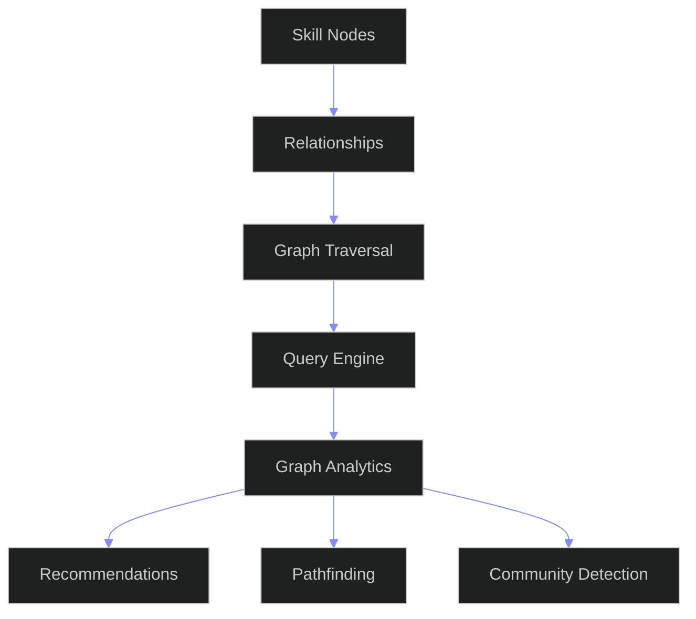
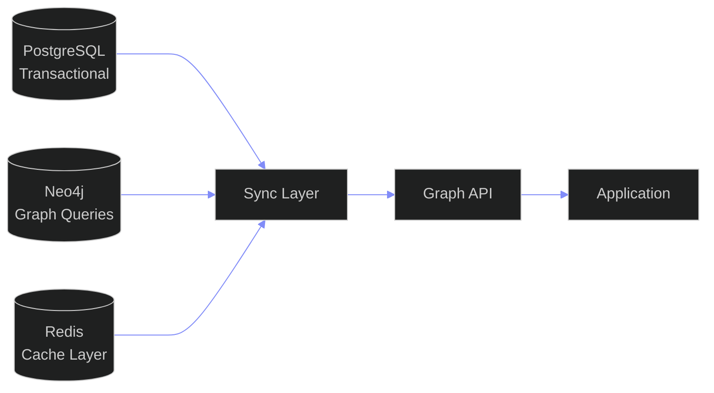

# Skill Graph Architecture — Enterprise Knowledge Graph for Skills Intelligence

---

## Document Control

| Field | Value |
|---|---|
| Document ID | SB-SKILLGRAPH-ARCH-001 |
| Version | 1.0.0 |
| Status | Active |
| Last Updated | 2026-06-12 |
| Classification | Internal — Architecture Reference |
| Source of Truth | docs/ai/skills/skills.md (Skills System Enterprise Architecture) |
| Target Stack | Neo4j (Graph DB) + PostgreSQL (Transactional) + FastAPI (Application) |
| Target Audience | AI Agents, Backend Engineers, Data Engineers, Architects |

---

## Table of Contents

- [1. Vision](#1-vision)
- [2. Architecture Overview](#2-architecture-overview)
- [3. Skill Graph Model](#3-skill-graph-model)
- [4. Node Types](#4-node-types)
- [5. Relationship Types](#5-relationship-types)
- [6. Graph Traversal Logic](#6-graph-traversal-logic)
- [7. Dependency Resolution Logic](#7-dependency-resolution-logic)
- [8. Skill Recommendation Logic](#8-skill-recommendation-logic)
- [9. AI Integration Layer](#9-ai-integration-layer)
- [10. Scalability Considerations](#10-scalability-considerations)
- [11. Database Mapping](#11-database-mapping)
- [12. APIs Required](#12-apis-required)
- [13. Security Requirements](#13-security-requirements)
- [14. Future Expansion Strategy](#14-future-expansion-strategy)
- [Appendix A: Edge Cases & Error Handling](#appendix-a-edge-cases--error-handling)
- [Appendix B: Migration Path from Current System](#appendix-b-migration-path-from-current-system)
- [Appendix C: Glossary](#appendix-c-glossary)

---

## Knowledge Graph Architecture



## Graph Storage Layers



---

## 1. Vision

### 1.1 Why a Graph?

Skills are inherently relational. A skill does not exist in isolation — it depends on other skills, lives within a category taxonomy, maps to projects and certifications, correlates with income, connects to career opportunities, and evolves over time. A relational database (PostgreSQL) stores this data with foreign keys and join tables, but it cannot efficiently answer graph-native questions:

- "What is the shortest learning path from JavaScript to LangChain?"
- "Which skills bridge the gap between my current role and Senior AI Engineer?"
- "What skill clusters are emerging in the market?"
- "Which skills commonly co-occur with React in high-paying roles?"
- "What is the full prerequisite chain for Kubernetes?"
- "Which users have a similar skill graph to mine?"

A **graph database** (Neo4j) stores skills as nodes and their relationships as first-class citizens. Traversals that would require 6-8 JOINs in SQL resolve in milliseconds with a graph pattern match. The skill graph is not a replacement for PostgreSQL — it is a **specialized query engine** co-existing with the transactional database.

### 1.2 Business Value

| Dimension | Value |
|---|---|
| Recommendation Speed | Graph-native recommendations execute 10-100x faster than SQL-based alternatives |
| Path Discovery | Shortest-path, k-hop, and centrality algorithms enable insights impossible with relational joins |
| Skill Relationship Intelligence | Latent connections (e.g., Python + React co-occur in full-stack roles) emerge from graph structure |
| AI Agent Context | ARIA agents receive graph-serialized context for richer prompt construction |
| Market Intelligence | Community detection reveals skill clusters trending together |
| Career Navigation | Multi-dimensional shortest path (cost = time + difficulty + market demand) optimizes career planning |

### 1.3 User Value

| User Need | Graph-Enabled Answer |
|---|---|
| "What should I learn next?" | Shortest path from your subgraph to your target node, weighted by market demand |
| "How do I become an AI Engineer?" | Full dependency chain from your current skills to every required skill with estimated time |
| "What skills do I have gaps in?" | Missing prerequisite detection by comparing your subgraph against career target subgraph |
| "Which skills relate to what I know?" | k-hop neighborhood revealing complementary, alternative, and related skills |
| "What career paths fit my skills?" | Similarity search between user subgraph and career subgraphs |
| "What skills are growing together?" | Community detection on the market intelligence graph |

### 1.4 Enterprise Goals

1. **Graph-First Intelligence**: All skill-related recommendations, gap analysis, and path planning execute on the graph
2. **Real-Time Traversal**: Any path query resolves in <200ms at P95, even across 100K+ node graphs
3. **Unified Skill Graph**: Single graph spanning taxonomy, user skills, market data, projects, certifications, and opportunities
4. **AI-Augmented Graph**: ARIA agents both query the graph and write to it (detected skills, inferred relationships)
5. **Temporal Awareness**: Graph stores version history so time-travel queries are possible ("what did I know in January?")
6. **Multi-Tenant Isolation**: Enterprise customers get logically isolated graph namespaces with tenant-aware traversal

---

## 2. Architecture Overview

### 2.1 System Context

```
┌─────────────────────────────────────────────────────────────────────────┐
│                            CLIENT LAYER                                  │
│  ┌──────────┐  ┌──────────┐  ┌──────────┐  ┌──────────┐  ┌──────────┐  │
│  │ Web App  │  │ Mobile   │  │ Browser  │  │ Slack    │  │ API      │  │
│  │ (Next.js)│  │ (React   │  │ Extension│  │ Bot      │  │ Consumer │  │
│  │          │  │  Native) │  │          │  │          │  │          │  │
│  └────┬─────┘  └────┬─────┘  └────┬─────┘  └────┬─────┘  └────┬─────┘  │
└───────┼──────────────┼────────────┼──────────────┼──────────────┼──────┘
        │              │            │              │              │
┌───────▼──────────────▼────────────▼──────────────▼──────────────▼──────┐
│                         API GATEWAY (FastAPI)                           │
│  ┌──────────────────────────────────────────────────────────────────┐   │
│  │  JWT Auth │  Rate Limiter │  Tenant Resolver │  Request Logger   │   │
│  └──────────────────────────────────────────────────────────────────┘   │
└──────────────────────────┬──────────────────────────────────────────────┘
                           │
┌──────────────────────────▼──────────────────────────────────────────────┐
│                       APPLICATION LAYER                                  │
│                                                                          │
│  ┌────────────────────────────────────────────────────────────────────┐  │
│  │                   REST API ROUTERS                                   │  │
│  │  ┌──────────┐ ┌──────────┐ ┌──────────┐ ┌──────────┐ ┌────────┐  │  │
│  │  │ Skills   │ │ Graph    │ │ Taxonomy │ │ Market   │ │ Assess │  │  │
│  │  │ CRUD     │ │ Traversal│ │          │ │ Intel    │ │ ment   │  │  │
│  │  └──────────┘ └──────────┘ └──────────┘ └──────────┘ └────────┘  │  │
│  └────────────────────────────────────────────────────────────────────┘  │
│                                                                          │
│  ┌────────────────────────────────────────────────────────────────────┐  │
│  │                     AI AGENT LAYER                                   │  │
│  │  ┌──────────┐ ┌──────────┐ ┌──────────┐ ┌──────────┐ ┌────────┐  │  │
│  │  │ Briefing│ │ Opportun-│ │ Learning │ │ Career   │ │ Memory │  │  │
│  │  │ Agent   │ │ ity Agent│ │ Agent    │ │ Agent    │ │ Agent  │  │  │
│  │  └──────────┘ └──────────┘ └──────────┘ └──────────┘ └────────┘  │  │
│  │                                                                      │  │
│  │  ┌──────────────────────────────────────────────────────────────┐   │  │
│  │  │              Graph Query Builder                               │   │  │
│  │  │  Converts agent intent -> Cypher -> Neo4j -> Agent context     │   │  │
│  │  └──────────────────────────────────────────────────────────────┘   │  │
│  └────────────────────────────────────────────────────────────────────┘  │
│                                                                          │
│  ┌────────────────────────────────────────────────────────────────────┐  │
│  │                DUAL-WRITE SYNC MANAGER                              │  │
│  │  Writes to PostgreSQL + Neo4j in same transaction context           │  │
│  │  Async retry queue for Neo4j failures (idempotent)                  │  │
│  └────────────────────────────────────────────────────────────────────┘  │
│                                                                          │
└──────────────────────────┬──────────────────────────────────────────────┘
                           │
┌──────────────────────────┼──────────────────────────────────────────────┐
│         DATABASE LAYER   │                                              │
│                         │                                              │
│  ┌──────────────────────▼──────────┐  ┌──────────────────────────────┐ │
│  │       PostgreSQL (Supabase)     │  │        Neo4j (Graph DB)       │ │
│  │                                 │  │                                │ │
│  │  Source of Truth               │  │  Traversal & Intelligence      │ │
│  │  - All transactional data      │  │  - Skill graph (nodes+edges)   │ │
│  │  - User profiles               │  │  - Path queries (shortest,     │ │
│  │  - Skill inventory             │  │    k-hop, all-paths)            │ │
│  │  - Evidence & assessments      │  │  - Community detection         │ │
│  │  - Version history             │  │  - Centrality analysis         │ │
│  │  - Audit logs                  │  │  - Similarity search           │ │
│  │  - Market intelligence raw data │  │  - Graph embeddings            │ │
│  │  - Income data                 │  │  - AI context serialization    │ │
│  │                                 │  │  - Pre-computed recs (cache)   │ │
│  │  RLS per user_id               │  │  - Tenant namespace isolation  │ │
│  └─────────────────────────────────┘  └────────────────────────────────┘ │
│                                                                          │
│  ┌────────────────────────────────────────────────────────────────────┐  │
│  │                      REDIS CACHE                                    │  │
│  │  Hot paths: frequent graph queries, recommendations cache,         │  │
│  │  session state, rate limiter counters                               │  │
│  └────────────────────────────────────────────────────────────────────┘  │
│                                                                          │
└──────────────────────────────────────────────────────────────────────────┘
```

### 2.2 Data Flow

```
┌──────────────┐     ┌──────────────────┐     ┌──────────────┐
│ User Action  │────▶│  FastAPI Handler  │────▶│  PostgreSQL  │
│ (Add skill,  │     │                  │     │  (Source of  │
│  submit      │     │  1. Validate     │     │   Truth)     │
│  evidence)   │     │  2. Write to PG  │     └──────┬───────┘
└──────────────┘     │  3. Write to Neo4j│            │
                     │     (same tx)    │     ┌──────▼───────┐
                     │  4. Return success│     │   Neo4j      │
                     └──────────────────┘     │ (Graph view) │
                                              └──────────────┘

┌──────────────┐     ┌──────────────────┐     ┌──────────────┐
│ AI Agent     │────▶│ Graph Query      │────▶│   Neo4j      │
│ (Recommends) │     │ Builder          │     │ (Read)       │
└──────────────┘     └──────────────────┘     └──────────────┘

┌──────────────┐     ┌──────────────────┐     ┌──────────────┐
│ Frontend     │────▶│ Graph API        │────▶│   Neo4j      │
│ (Graph View) │     │ Endpoint         │     │ (Read)       │
└──────────────┘     └──────────────────┘     └──────────────┘
```

### 2.3 Synchronization Guarantees

| Aspect | Guarantee |
|---|---|
| Consistency Model | **Read-your-writes**: after a write returns, both PG and Neo4j reflect the write |
| Failure Handling | **Retry queue**: if Neo4j write fails, it enters async retry with exponential backoff (max 3 retries) |
| Idempotency | Every graph write includes an `operation_id` UUID for deduplication |
| Recovery | **Full rebuild**: script to rebuild Neo4j from PostgreSQL in case of corruption |
| Latency Budget | PostgreSQL write + Neo4j write < 200ms combined (P95) |
| Staleness | Neo4j is at most 2 seconds behind PostgreSQL (asymptotically consistent) |

### 2.4 Technology Decisions

| Component | Choice | Rationale |
|---|---|---|
| Graph Database | Neo4j 5.x (Enterprise) | Mature property graph model, Cypher query language, ACID compliance, native graph storage, graph algorithms library (GDS) |
| Driver | neo4j Python driver (async) | Native async support, connection pooling, Bolt protocol |
| Query Language | Cypher 5 | Declarative pattern matching, subqueries, quantified path patterns |
| Graph Algorithms | Neo4j GDS (Graph Data Science) | Built-in PageRank, Louvain, Node Similarity, Shortest Path, Betweenness Centrality |
| Embedding | node2vec (via GDS) | Graph-native embeddings for ML integration |
| Sync | Application-level dual-write | No extra infra, full control, idempotent |
| Cache | Redis 7 | Sub-millisecond hot path, TTL-based invalidation |

---

## 3. Skill Graph Model

### 3.1 Formal Definition

The Skill Graph is defined as a **labeled property graph**:

```
G = (V, E, Lv, Le, Pv, Pe)

Where:
V  = set of vertices (nodes)
E  = set of edges (relationships), subset of (V × V)
Lv = node label function: V -> {set of labels}
Le = edge type function: E -> {type}
Pv = node property function: V x {property} -> value
Pe = edge property function: E x {property} -> value
```

### 3.2 Graph Partitioning

```
┌─────────────────────────────────────────────────────────────────────────┐
│                        GLOBAL GRAPH (TAXONOMY)                          │
│  Taxonomy nodes + relationships shared across all tenants                │
│  Read-only for end users, writable by system/admins                     │
│                                                                          │
│  (Category)-[:CONTAINS]->(Subcategory)-[:CONTAINS]->(Skill)              │
│  (Skill)-[:REQUIRES]->(Skill)  (Skill)-[:COMPLEMENTS]->(Skill)          │
│                                                                          │
└─────────────────────────────────────────────────────────────────────────┘
                                    │
                                    │ (referenced by tenant subgraphs)
                                    ▼
┌─────────────────────────────────────────────────────────────────────────┐
│     ┌──────────────────────┐    ┌──────────────────────┐               │
│     │  TENANT A SUBGRAPH  │    │  TENANT B SUBGRAPH   │               │
│     │                      │    │                       │               │
│     │  (User)-[:HAS_SKILL]->│    │  (User)-[:HAS_SKILL]->│               │
│     │  (User)-[:TARGETS]-> │    │  (User)-[:TARGETS]->  │               │
│     │  (User)-[:SUBMITTED]->│   │  (User)-[:SUBMITTED]->│               │
│     │  (Evidence)          │    │  (Evidence)           │               │
│     │  (Project)-[:USES]-> │    │  (Project)-[:USES]->  │               │
│     │  (Skill)             │    │  (Skill)              │               │
│     └──────────────────────┘    └──────────────────────┘               │
│                                                                          │
└─────────────────────────────────────────────────────────────────────────┘
                                    │
                                    │ (aggregated, anonymized)
                                    ▼
┌─────────────────────────────────────────────────────────────────────────┐
│                      MARKET INTELLIGENCE GRAPH                           │
│  Aggregated, anonymized patterns across tenants                          │
│                                                                          │
│  (SkillDemand)-[:CORRELATED_WITH]->(SkillDemand)                         │
│  (SkillCluster)-[:CONTAINS]->(Skill)                                     │
│  (IncomeTrend)-[:FOR_SKILL]->(Skill)                                     │
│                                                                          │
└─────────────────────────────────────────────────────────────────────────┘
```

### 3.3 Graph Constraints

| Constraint | Type | Description |
|---|---|---|
| Skill Name Uniqueness | Node Key | `Skill.name` is unique within a category |
| User + Skill Uniqueness | Node Key | `UserSkill` is unique per user-skill pair |
| Category Name Uniqueness | Node Key | `Category.name` is unique at each level |
| Evidence + User Uniqueness | Node Key | Each evidence URL is unique per user |
| Relationship Uniqueness | Relationship | No duplicate `REQUIRES` edges between same pair |
| Node Property Existence | Required | `id`, `name`, `created_at` on all nodes |
| Tenant Property | Required | All tenant-owned nodes carry `tenant_id` |

---

## 4. Node Types

### 4.1 Node Type Inventory

The graph recognizes **17 node types** organized into four layers:

| Layer | Node Type | Label | Source Table |
|---|---|---|---|
| **Taxonomy** | Category | `Category` | skill_categories |
| | Subcategory | `Subcategory` | skill_categories (nested) |
| | Skill | `Skill` | skills |
| | Concept | `Concept` | skill_topics |
| | Tag | `Tag` | skill_tags |
| **User** | User | `User` | users |
| | UserSkill | `UserSkill` | user_skills |
| | Evidence | `Evidence` | user_skill_evidence |
| | Target | `Target` | user_skill_targets |
| | Assessment | `Assessment` | user_skill_assessments |
| **Entity** | Project | `Project` | skill_projects / projects |
| | Certification | `Certification` | skill_certifications |
| | Opportunity | `Opportunity` | skill_opportunities / opportunities |
| | Roadmap | `Roadmap` | skill_roadmaps |
| | Resource | `Resource` | skill_resources |
| **Market** | MarketTrend | `MarketTrend` | skill_market_data |
| | IncomeLevel | `IncomeLevel` | skill_income_data |

### 4.2 Taxonomy Layer Nodes

#### 4.2.1 Category

```
(:Category {
    id: UUID,
    name: String,            // e.g., "Frontend Development"
    slug: String,             // e.g., "frontend-development"
    description: String,
    icon: String,             // emoji or icon identifier
    color: String,            // hex color for UI
    level: Integer,           // depth in hierarchy (0 = root)
    tenant_id: String|null,   // null = global taxonomy
    taxonomy_version: String, // e.g., "1.2.0"
    created_at: DateTime,
    updated_at: DateTime
})
```

#### 4.2.2 Skill

```
(:Skill {
    id: UUID,
    name: String,              // e.g., "React.js"
    slug: String,
    canonical_name: String,    // official name for deduplication
    description: String,
    aliases: [String],         // alternative names for matching
    external_ids: {            // crosswalk to external taxonomies
        esco: String,
        onet: String,
        linkedin: String,
        roadmap_sh: String
    },
    level_range: {min:1, max:5},
    estimated_hours_to_l3: Integer,
    tags: [String],
    status: String,            // active | deprecated | draft
    taxonomy_version: String,
    created_at: DateTime,
    updated_at: DateTime
})
```

### 4.3 User Layer Nodes

#### 4.3.1 User

```
(:User {
    id: UUID,
    tenant_id: String,
    email_hash: String,       // for deduplication, not PII
    display_name: String,
    role: String,             // individual | manager | admin
    created_at: DateTime,
    last_active_at: DateTime
})
```

#### 4.3.2 UserSkill

The UserSkill node represents a user's relationship to a skill. The properties of the **edge** (`HAS_SKILL`) carry the transient state; the node carries aggregated data.

```
(:UserSkill {
    id: UUID,
    user_id: UUID,
    skill_id: UUID,
    level: String,          // L0-L5
    confidence_score: Float, // 0.0-1.0
    evidence_score: Float,   // 0.0-1.0
    experience_months: Integer,
    hours_invested: Integer,
    first_experienced: Date,
    last_active: DateTime,
    source: String,          // manual | auto_detected | imported | derived
    notes: String,
    tags: [String],
    created_at: DateTime,
    updated_at: DateTime
})
```

#### 4.3.3 Evidence

```
(:Evidence {
    id: UUID,
    type: String,            // project | github | certification | course | employment | freelance | opensource | assessment | publication | hackathon | mentorship | ai_eval
    title: String,
    url: String,
    description: String,
    quality_score: Float,    // 0.0-1.0
    verified: Boolean,
    verification_method: String,
    date_completed: Date,
    date_started: Date,
    issuer: String,          // company, platform, institution
    credential_id: String,   // certification ID if applicable
    metadata: Map,           // flexible extension
    created_at: DateTime
})
```

#### 4.3.4 Target

```
(:Target {
    id: UUID,
    type: String,             // career | company | startup | income | project | certification | learning | role_model
    target_level: String,     // L0-L5
    priority: String,         // high | medium | low
    deadline: Date,
    motivation: String,
    source: String,           // user | ai | career | market | certification
    created_at: DateTime,
    updated_at: DateTime
})
```

### 4.4 Entity Layer Nodes

#### 4.4.1 Project

```
(:Project {
    id: UUID,
    name: String,
    description: String,
    url: String,
    repo_url: String,
    complexity: String,       // beginner | intermediate | advanced | expert | master
    status: String,           // planned | in_progress | completed | archived
    date_completed: Date,
    skills_developed: [String],
    technologies_used: [String],
    user_id: UUID,
    created_at: DateTime,
    updated_at: DateTime
})
```

#### 4.4.2 Certification

```
(:Certification {
    id: UUID,
    name: String,
    provider: String,          // AWS | Google | Microsoft | CompTIA | etc.
    credential_id: String,
    badge_url: String,
    level_equivalent: String,  // L0-L5
    validity_years: Integer,
    issue_date: Date,
    expiry_date: Date,
    skills_covered: [String],
    verified: Boolean,
    user_id: UUID,
    created_at: DateTime
})
```

#### 4.4.3 Opportunity

```
(:Opportunity {
    id: UUID,
    type: String,              // job | internship | hackathon | fellowship | freelance | opensource | competition | startup_program | contract | grant
    title: String,
    organization: String,
    description: String,
    url: String,
    location: String,
    deadline: Date,
    skills_required: [String],
    skills_preferred: [String],
    match_score: Float,
    compensation_range: {min: Float, max: Float, currency: String},
    status: String,            // open | closed | applied | interview | offer | rejected
    user_id: UUID,
    created_at: DateTime
})
```

#### 4.4.4 Roadmap

```
(:Roadmap {
    id: UUID,
    name: String,
    description: String,
    source: String,            // roadmap_sh | custom | ai_generated | company | certification | career | market
    target_role: String,
    estimated_months: Integer,
    milestones: [              // order preserved
        {name: String, skills: [String], duration_weeks: Integer}
    ],
    completion_percent: Float,
    status: String,            // active | completed | paused | archived
    user_id: UUID,
    created_at: DateTime,
    updated_at: DateTime
})
```

### 4.5 Market Layer Nodes

#### 4.5.1 MarketTrend

```
(:MarketTrend {
    id: UUID,
    skill_id: UUID,
    demand_score: Integer,         // 0-100
    demand_percentile: Float,      // 0.0-1.0
    growth_score: Integer,         // -100 to +100
    growth_trend: String,          // rising | stable | declining
    salary_score: Integer,         // 0-100
    salary_p50: Float,
    salary_p90: Float,
    competition_score: Integer,    // 0-100 (lower = better)
    future_relevance: Integer,     // 0-100
    skill_health: String,          // excellent | good | fair | weak | poor
    snapshot_date: Date,
    source: String,
    created_at: DateTime
})
```

#### 4.5.2 IncomeLevel

```
(:IncomeLevel {
    id: UUID,
    skill_id: UUID,
    income_source: String,        // employment | freelance | consulting | content | product | agency | teaching | opensource | digital | affiliate
    level: String,                // L0-L5
    p10: Float,
    p25: Float,
    p50: Float,
    p75: Float,
    p90: Float,
    currency: String,             // USD | EUR | INR
    location: String,             // global | US | EU | IN | etc.
    sample_size: Integer,
    snapshot_date: Date,
    created_at: DateTime
})
```

---

## 5. Relationship Types

### 5.1 Relationship Type Inventory

The graph defines **24 relationship types** across taxonomy, user, entity, and market layers.

| # | Type | Label | From | To | Direction | Category |
|---|---|---|---|---|---|---|
| 1 | CONTAINS | `CONTAINS` | Category | Subcategory | Parent->Child | Taxonomy |
| 2 | CONTAINS | `CONTAINS` | Subcategory | Skill | Parent->Child | Taxonomy |
| 3 | REQUIRES | `REQUIRES` | Skill | Skill | Prereq->Target | Dependency |
| 4 | SOFT_REQUIRES | `SOFT_REQUIRES` | Skill | Skill | Prereq->Target | Dependency |
| 5 | RECOMMENDS | `RECOMMENDS` | Skill | Skill | Prereq->Target | Dependency |
| 6 | COMPLEMENTS | `COMPLEMENTS` | Skill | Skill | Bidirectional | Dependency |
| 7 | ALTERNATIVE_TO | `ALTERNATIVE_TO` | Skill | Skill | Bidirectional | Dependency |
| 8 | BUILDS_ON | `BUILDS_ON` | Skill | Skill | Prereq->Target | Dependency |
| 9 | VERSION_OF | `VERSION_OF` | Skill | Skill | Older->Newer | Versioning |
| 10 | SUPERSEDED_BY | `SUPERSEDED_BY` | Skill | Skill | Old->New | Versioning |
| 11 | HAS_SKILL | `HAS_SKILL` | User | UserSkill | Ownership | User |
| 12 | HAS_SKILL | `HAS_SKILL` | UserSkill | Skill | Reference | User |
| 13 | TARGETS | `TARGETS` | UserSkill | Target | Association | User |
| 14 | SUBMITTED | `SUBMITTED` | UserSkill | Evidence | Evidence | User |
| 15 | PROVES | `PROVES` | Evidence | Skill | Evidence->Skill | Evidence |
| 16 | ASSESSED_BY | `ASSESSED_BY` | UserSkill | Assessment | Assessment | User |
| 17 | USES | `USES` | Project | Skill | Project->Skill | Entity |
| 18 | CERTIFIES | `CERTIFIES` | Certification | Skill | Cert->Skill | Entity |
| 19 | MATCHES | `MATCHES` | Opportunity | Skill | Opp->Skill | Entity |
| 20 | ROADMAP_STEP | `ROADMAP_STEP` | Roadmap | Skill | Roadmap-> Skill | Entity |
| 21 | LEARNS_FROM | `LEARNS_FROM` | UserSkill | Resource | Learning | Entity |
| 22 | HAS_MARKET | `HAS_MARKET` | Skill | MarketTrend | Market | Market |
| 23 | HAS_INCOME | `HAS_INCOME` | Skill | IncomeLevel | Market | Market |
| 24 | CORRELATED_WITH | `CORRELATED_WITH` | MarketTrend | Market Trend | Market | Market |

### 5.2 Relationship Property Schemas

#### 5.2.1 CONTAINS (Category Hierarchy)

```
-[r:CONTAINS]-> {
    order: Integer,           // position among siblings
    depth: Integer,           // hierarchical depth
    created_at: DateTime,
    taxonomy_version: String
}
```

Cypher Creation:
```cypher
MATCH (parent:Category {slug: "frontend-development"})
MATCH (child:Subcategory {slug: "react-ecosystem"})
CREATE (parent)-[r:CONTAINS {order: 1, depth: 1, created_at: datetime()}]->(child)
RETURN r
```

#### 5.2.2 REQUIRES (Hard Dependency)

```
-[r:REQUIRES]-> {
    strength: "hard",         // hard | soft | recommended
    min_level: String,        // minimum level of prerequisite required
    description: String,      // why this dependency exists
    created_at: DateTime,
    updated_at: DateTime,
    taxonomy_version: String
}
```

Cypher Creation:
```cypher
MATCH (js:Skill {slug: "javascript"})
MATCH (react:Skill {slug: "react-js"})
CREATE (js)-[r:REQUIRES {
    strength: "hard",
    min_level: "L2",
    description: "React requires solid JavaScript fundamentals including ES6+, async/await, and module systems",
    created_at: datetime()
}]->(react)
RETURN r
```

#### 5.2.3 COMPLEMENTS (Complementary Relationship)

```
-[r:COMPLEMENTS]-> {
    strength: Float,          // 0.0-1.0 (co-occurrence frequency)
    common_pair_score: Float, // how often these skills appear together
    use_case: String,         // e.g., "full-stack development"
    created_at: DateTime
}
```

Cypher Creation:
```cypher
MATCH (react:Skill {slug: "react-js"})
MATCH (ts:Skill {slug: "typescript"})
CREATE (react)-[r:COMPLEMENTS {
    strength: 0.85,
    common_pair_score: 0.92,
    use_case: "modern frontend development",
    created_at: datetime()
}]->(ts)
RETURN r
```

#### 5.2.4 HAS_SKILL (User to Skill)

```
-[r:HAS_SKILL]-> {
    level: String,            // L0-L5
    confidence_score: Float,  // 0.0-1.0
    evidence_score: Float,    // 0.0-1.0
    state: String,            // planned | learning | practicing | active | advanced | expert | archived | deprecated
    experience_months: Integer,
    hours_invested: Integer,
    first_experienced: Date,
    last_active: DateTime,
    source: String,           // manual | auto_detected | imported | derived
    is_primary: Boolean,      // user's primary skill?
    created_at: DateTime,
    updated_at: DateTime
}
```

Cypher Creation (Dual-Write Pattern):
```python
# Application-level dual-write
async def add_user_skill(user_id: str, skill_id: str, level: str):
    # 1. Write to PostgreSQL
    result = await supabase.table("user_skills").insert({
        "user_id": user_id,
        "skill_id": skill_id,
        "level": level,
        "state": "learning"
    }).execute()

    # 2. Write to Neo4j
    async with neo4j_driver.session() as session:
        await session.run("""
            MATCH (u:User {id: $user_id})
            MATCH (s:Skill {id: $skill_id})
            MERGE (u)-[r:HAS_SKILL]->(us:UserSkill {user_id: $user_id, skill_id: $skill_id})
            SET r.level = $level,
                r.state = 'learning',
                r.updated_at = datetime(),
                us.level = $level,
                us.state = 'learning'
        """, user_id=user_id, skill_id=skill_id, level=level)

    return result
```

#### 5.2.5 SUBMITTED (Evidence)

```
-[r:SUBMITTED]-> {
    type: String,             // evidence type
    quality_score: Float,
    verified: Boolean,
    submitted_at: DateTime
}
```

Cypher:
```cypher
MATCH (us:UserSkill {user_id: $user_id, skill_id: $skill_id})
MATCH (ev:Evidence {id: $evidence_id})
CREATE (us)-[r:SUBMITTED {
    type: $evidence_type,
    quality_score: $score,
    verified: false,
    submitted_at: datetime()
}]->(ev)
RETURN r
```

#### 5.2.6 VERSION_OF (Skill Versioning)

```
-[r:VERSION_OF]-> {
    from_version: String,     // e.g., "16.0"
    to_version: String,       // e.g., "17.0"
    breaking_changes: Boolean,
    created_at: DateTime
}
```

Cypher:
```cypher
MATCH (old:Skill {slug: "react-16"})
MATCH (new:Skill {slug: "react-17"})
CREATE (old)-[r:VERSION_OF {
    from_version: "16.0",
    to_version: "17.0",
    breaking_changes: false,
    created_at: datetime()
}]->(new)
RETURN r
```

#### 5.2.7 SUPERSEDED_BY (Skill Deprecation)

```
-[r:SUPERSEDED_BY]-> {
    reason: String,           // why deprecated
    migration_path: String,   // guidance for migrating
    deprecation_date: Date,
    sunset_date: Date         // when fully removed
}
```

Cypher:
```cypher
MATCH (old:Skill {slug: "angularjs"})
MATCH (new:Skill {slug: "angular"})
CREATE (old)-[r:SUPERSEDED_BY {
    reason: "End of life AngularJS, upgrade to Angular 2+",
    migration_path: "https://angular.io/guide/upgrade",
    deprecation_date: date("2022-01-01"),
    sunset_date: date("2023-12-31")
}]->(new)
RETURN r
```

#### 5.2.8 USES (Project to Skill)

```
-[r:USES]-> {
    proficiency_level: String, // level demonstrated by this project
    primary: Boolean,          // is this a primary skill for the project?
    contribution_type: String, // developed | deployed | designed | tested | documented
    created_at: DateTime
}
```

#### 5.2.9 MATCHES (Opportunity to Skill)

```
-[r:MATCHES]-> {
    requirement_level: String, // L0-L5
    requirement_type: String,  // required | preferred
    weight: Float,            // importance of this skill for the opportunity
    created_at: DateTime
}
```

### 5.3 Relationship Constraints & Indexes

| Constraint | Cypher | Performance Impact |
|---|---|---|
| REQUIRES no duplicates | `CREATE CONSTRAINT FOR ()-[r:REQUIRES]-() REQUIRE r IS UNIQUE` | Prevents duplicate edges |
| HAS_SKILL per user-skill | Application-enforced via user_id + skill_id uniqueness | Ensures one edge per pair |
| CONTAINS ordering | `ORDER BY r.order` cascading in queries | Maintains category sort |
| Index on REQUIRES | `CREATE INDEX requires_skill_id FOR ()-[r:REQUIRES]-() ON (r.min_level)` | Speeds up level-gated traversal |
| Index on HAS_SKILL | `CREATE INDEX has_skill_user FOR ()-[r:HAS_SKILL]-() ON (r.level, r.state)` | Filters active skills |
| Index on MATCHES | `CREATE INDEX matches_opportunity FOR ()-[r:MATCHES]-() ON (r.requirement_type)` | Required vs preferred filtering |

---

## 6. Graph Traversal Logic

### 6.1 Traversal Pattern Catalog

| # | Pattern | Algorithm | Use Case | Complexity |
|---|---|---|---|---|
| T1 | Shortest Path (Unweighted) | BFS | "What is the fastest path from Python to LangChain?" | O(V+E) |
| T2 | Shortest Path (Weighted) | Dijkstra | "What is the optimal path considering difficulty & time?" | O(E+V log V) |
| T3 | All Paths | DFS + Pruning | "Show me all possible ways to become an AI Engineer" | O(b^d) |
| T4 | k-hop Neighborhood | BFS Breadcrumb | "What skills are related to React within 2 hops?" | O(V+E) |
| T5 | Prerequisite Chain | DFS Topological | "What do I need to learn before Kubernetes?" | O(V+E) |
| T6 | Missing Prerequisites | Set Difference | "What prerequisites am I missing for my target?" | O(V+E) |
| T7 | Community Detection | Louvain (GDS) | "What skill clusters exist in the taxonomy?" | O(n log n) |
| T8 | Centrality (Skill Influence) | PageRank (GDS) | "Which skills are most foundational?" | O(E * iterations) |
| T9 | Node Similarity | Jaccard (GDS) | "Which skills have similar dependency patterns?" | O(n^2) |
| T10 | Collaborative Filtering | Cosine Similarity | "Users with similar graphs also have skill X" | O(n * k) |
| T11 | Path Ranking | Personalized PageRank | "What skills should I learn next?" | O(E * iterations) |
| T12 | Temporal Graph Walk | Time-aware BFS | "What did my graph look like 6 months ago?" | O(V+E) |

### 6.2 T1: Shortest Path (Unweighted BFS)

**Purpose:** Find the quickest sequence of prerequisite skills between any two skills.

**Cypher:**
```cypher
MATCH (source:Skill {slug: "javascript"})
MATCH (target:Skill {slug: "langchain"})
MATCH path = shortestPath((source)-[:REQUIRES|SOFT_REQUIRES*]-(target))
RETURN [node IN nodes(path) | node.name] AS skill_path,
       length(path) AS steps
```

**Result:**
```
{
  "skill_path": ["JavaScript", "Python", "LangChain"],
  "steps": 2
}
```

**Application Example — Learning Path Generation:**
```python
async def generate_learning_path(user_id: str, target_skill: str) -> dict:
    """Generate optimal learning path from user's current skills to target."""
    async with neo4j_driver.session() as session:
        # Step 1: Get user's current skill slugs
        user_skills = await session.run("""
            MATCH (u:User {id: $user_id})-[r:HAS_SKILL]->(us:UserSkill)-[:REFERS_TO]->(s:Skill)
            WHERE r.state IN ['active', 'advanced', 'expert']
            RETURN collect(s.slug) AS current_skills
        """, user_id=user_id)
        current = await user_skills.single()
        current_skills = current["current_skills"] if current else []

        if not current_skills:
            # Cold start: use closest category root
            return await generate_from_taxonomy_root(target_skill)

        # Step 2: Find shortest path from each current skill to target
        # Using UNWIND to iterate over current skills
        paths = await session.run("""
            WITH $current_skills AS skills
            MATCH (target:Skill {slug: $target_skill})
            UNWIND skills AS current_slug
            MATCH (source:Skill {slug: current_slug})
            MATCH path = shortestPath((source)-[:REQUIRES|SOFT_REQUIRES*]-(target))
            RETURN source.name AS from_skill,
                   [n IN nodes(path) | n.name] AS full_path,
                   length(path) AS steps
            ORDER BY steps ASC
            LIMIT 5
        """, current_skills=current_skills, target_skill=target_skill)

        results = await paths.data()
        return {
            "current_skills": current_skills,
            "target_skill": target_skill,
            "paths": results,
            "recommended_path": results[0] if results else None,
            "missing_prerequisites": find_missing(current_skills, results)
        }
```

### 6.3 T2: Shortest Path (Weighted Dijkstra)

**Purpose:** Find the optimal path considering cost factors (time, difficulty, market alignment).

**Cypher (using GDS):**
```cypher
// Create an in-memory weighted graph
CALL gds.graph.project(
    'weighted_skill_graph',
    'Skill',
    'REQUIRES',
    {relationshipProperties: 'min_level'}
)

// Run Dijkstra with level-based weights
// Weight = level_number * base_cost (L2=2, L3=3, etc.)
MATCH (source:Skill {slug: "html"})
MATCH (target:Skill {slug: "next-js"})
CALL gds.shortestPath.dijkstra.stream('weighted_skill_graph', {
    sourceNode: source,
    targetNode: target,
    relationshipWeightProperty: 'min_level'
})
YIELD index, sourceNode, targetNode, totalCost, nodeIds, costs, path
RETURN [n IN gds.util.asNodes(nodeIds) | n.name] AS node_names,
       totalCost,
       [c IN costs | c] AS level_costs
```

**Weighting Strategy:**
```python
# Weight = f(difficulty, estimated_hours, market_demand_inverse)
def calculate_edge_weight(min_level: str, skill_data: dict) -> float:
    """Calculate traversal weight (lower = easier/faster to traverse)."""
    level_weights = {"L1": 1, "L2": 2, "L3": 4, "L4": 8, "L5": 16}
    base_weight = level_weights.get(min_level, 4)

    # Adjust for market demand (higher demand = more motivation = lower weight)
    demand_factor = 1.0 - (skill_data.get("demand_score", 50) / 200)  # 0.5-1.0

    # Adjust for estimated hours
    hours_factor = skill_data.get("estimated_hours", 40) / 40  # normalized to 40h baseline

    return base_weight * hours_factor * demand_factor
```

### 6.4 T3: All Paths (Learning Alternatives)

**Purpose:** Show all possible learning routes, useful when a direct prerequisite chain doesn't exist.

**Cypher:**
```cypher
MATCH (source:Skill {slug: "python"})
MATCH (target:Skill {slug: "mlops"})
MATCH path = (source)-[:REQUIRES|SOFT_REQUIRES|RECOMMENDS*1..5]-(target)
WHERE ALL(n IN nodes(path) WHERE SINGLE(m IN nodes(path) WHERE m = n))
RETURN [n IN nodes(path) | n.name] AS skill_path,
       length(path) AS steps,
       reduce(weight = 0, r IN relationships(path) |
           weight + CASE r.strength
               WHEN 'hard' THEN 10
               WHEN 'soft' THEN 5
               WHEN 'recommended' THEN 2
               ELSE 0
           END
       ) AS total_dependency_weight
ORDER BY steps ASC, total_dependency_weight DESC
LIMIT 10
```

### 6.5 T4: k-hop Neighborhood (Related Skills)

**Purpose:** Discover skills related to a given skill within N hops. Used for the "You might also be interested in" feature.

**Cypher:**
```cypher
MATCH (s:Skill {slug: "react-js"})
MATCH path = (s)-[r:REQUIRES|COMPLEMENTS|RECOMMENDS|ALTERNATIVE_TO*1..3]-(related:Skill)
RETURN related.name AS skill_name,
       related.slug AS skill_slug,
       [rel IN relationships(path) | type(rel)] AS relationship_chain,
       [n IN nodes(path) | n.name] AS connection_path,
       length(path) AS hops
ORDER BY hops ASC
LIMIT 50
```

**Application Example:**
```python
async def get_skill_neighborhood(skill_slug: str, max_hops: int = 2) -> list:
    """Get related skills organized by relationship type."""
    async with neo4j_driver.session() as session:
        result = await session.run("""
            MATCH (s:Skill {slug: $slug})
            MATCH (s)-[r]-(related:Skill)
            WHERE type(r) IN ['REQUIRES', 'COMPLEMENTS', 'RECOMMENDS', 'ALTERNATIVE_TO']
            RETURN related.name AS skill_name,
                   type(r) AS relationship,
                   CASE type(r)
                       WHEN 'REQUIRES' THEN 'prerequisite'
                       WHEN 'SOFT_REQUIRES' THEN 'recommended_prerequisite'
                       WHEN 'COMPLEMENTS' THEN 'complementary'
                       WHEN 'ALTERNATIVE_TO' THEN 'alternative'
                       WHEN 'RECOMMENDS' THEN 'recommended'
                   END AS relationship_label
            ORDER BY relationship, related.name
        """, slug=skill_slug)

        rows = await result.data()
        return {
            "skill": skill_slug,
            "prerequisites": [r for r in rows if r["relationship"] == "REQUIRES"],
            "soft_prerequisites": [r for r in rows if r["relationship"] == "SOFT_REQUIRES"],
            "complementary": [r for r in rows if r["relationship"] == "COMPLEMENTS"],
            "alternatives": [r for r in rows if r["relationship"] == "ALTERNATIVE_TO"],
            "recommended": [r for r in rows if r["relationship"] == "RECOMMENDS"]
        }
```

### 6.6 T5: Full Prerequisite Chain (Topological DFS)

**Purpose:** Get the complete ordered list of everything needed to learn a target skill.

**Cypher:**
```cypher
MATCH (target:Skill {slug: "kubernetes"})
MATCH path = (prereq:Skill)-[:REQUIRES*]->(target)
WHERE NOT EXISTS {
    MATCH (prereq)-[:REQUIRES]->()
    WHERE NOT (()-[:REQUIRES]->(prereq))
}
// or use variable length for transitive closure
WITH collect(DISTINCT prereq) AS all_prereqs, target
UNWIND all_prereqs AS p
MATCH (p)-[r:REQUIRES]->()
RETURN p.name AS skill,
       count(r) AS dependency_count
ORDER BY dependency_count ASC
```

**Advanced: Level-Gated Prerequisite Chain:**
```cypher
MATCH (target:Skill {slug: "kubernetes"})
MATCH (user:User {id: $user_id})
MATCH path = (prereq:Skill)-[:REQUIRES*]->(target)
OPTIONAL MATCH (user)-[hs:HAS_SKILL]->()-[:REFERS_TO]->(prereq)
RETURN prereq.name AS skill_name,
       prereq.estimated_hours_to_l3 AS hours_to_l3,
       hs.level AS current_level,
       CASE WHEN hs IS NULL THEN 'missing'
            WHEN hs.level = 'L0' THEN 'missing'
            ELSE 'acquired'
       END AS status
ORDER BY length(path) ASC
```

### 6.7 T6: Missing Prerequisites (Gap Analysis)

**Purpose:** Given a user's skills and a target, identify what prerequisites are missing.

**Cypher:**
```cypher
MATCH (u:User {id: $user_id})
MATCH (target:Skill {slug: $target_skill})
MATCH all_prereqs = (required:Skill)-[:REQUIRES*]->(target)
WITH collect(DISTINCT required) AS needed_skills
MATCH (u)-[:HAS_SKILL]->(us:UserSkill)-[:REFERS_TO]->(owned:Skill)
WITH [s IN needed_skills WHERE NOT s IN collect(owned)] AS missing_skills
UNWIND missing_skills AS missing
RETURN missing.name AS skill_name,
       missing.estimated_hours_to_l3 AS estimated_hours,
       [(missing)-[:REQUIRES]->(dep) | dep.name] AS dependencies
ORDER BY missing.estimated_hours_to_l3 ASC
```

### 6.8 T7: Community Detection (Skill Clusters)

**Purpose:** Automatically discover groups of skills that form natural learning clusters.

**Cypher (using GDS Louvain):**
```cypher
// 1. Project the graph
CALL gds.graph.project(
    'skill_communities',
    'Skill',
    ['REQUIRES', 'COMPLEMENTS', 'RECOMMENDS']
)

// 2. Run Louvain community detection
CALL gds.louvain.stream('skill_communities')
YIELD nodeId, communityId, intermediateCommunityIds
WITH gds.util.asNode(nodeId) AS node, communityId
RETURN communityId,
       collect(node.name) AS skills_in_community,
       count(*) AS community_size
ORDER BY community_size DESC
```

**Result:**
```
communityId: 1, skills: ["HTML", "CSS", "JavaScript", "DOM API"], size: 4
communityId: 2, skills: ["React", "Vue", "Angular", "Svelte"], size: 4
communityId: 3, skills: ["Python", "NumPy", "Pandas", "Scikit-learn"], size: 4
communityId: 4, skills: ["Docker", "Kubernetes", "Helm", "Terraform"], size: 4
```

### 6.9 T8: Centrality (Foundational Skill Detection)

**Purpose:** Identify which skills are most foundational (most prerequisites depend on them).

**Cypher (using GDS PageRank):**
```cypher
CALL gds.graph.project(
    'skill_pagerank',
    'Skill',
    {REQUIRES: {orientation: 'REVERSE'}}
)

CALL gds.pageRank.stream('skill_pagerank')
YIELD nodeId, score
WITH gds.util.asNode(nodeId) AS node, score
RETURN node.name AS skill_name,
       node.category AS category,
       score AS foundational_score
ORDER BY score DESC
LIMIT 20
```

### 6.10 T9: Node Similarity (Skill Pattern Matching)

**Purpose:** Find skills with similar dependency patterns (used for "skills like X" recommendations).

**Cypher (using GDS Node Similarity):**
```cypher
CALL gds.graph.project(
    'skill_similarity',
    'Skill',
    {REQUIRES: {orientation: 'UNDIRECTED'}}
)

CALL gds.nodeSimilarity.stream('skill_similarity')
YIELD node1, node2, similarity
WITH gds.util.asNode(node1) AS skill1,
     gds.util.asNode(node2) AS skill2,
     similarity
WHERE similarity > 0.5
  AND skill1.slug = $target_skill
RETURN skill2.name AS similar_skill,
       similarity AS jaccard_score
ORDER BY similarity DESC
LIMIT 10
```

### 6.11 T10: Collaborative Filtering (User-Based)

**Purpose:** Recommend skills based on what users with similar skill graphs have learned.

**Cypher:**
```cypher
MATCH (me:User {id: $user_id})
MATCH (me)-[:HAS_SKILL]->(us:UserSkill)-[:REFERS_TO]->(my_skill:Skill)
WITH me, collect(my_skill) AS my_skills

// Find users with at least 3 overlapping skills
MATCH (other:User)-[:HAS_SKILL]->(ous:UserSkill)-[:REFERS_TO]->(other_skill:Skill)
WHERE other.id <> $user_id
  AND other_skill IN my_skills
WITH me, my_skills, other, count(DISTINCT other_skill) AS overlap
WHERE overlap >= 3

// Get skills those users have that I don't
MATCH (other)-[:HAS_SKILL]->(ous:UserSkill)-[:REFERS_TO]->(rec:Skill)
WHERE NOT rec IN my_skills
RETURN rec.name AS recommended_skill,
       count(DISTINCT other) AS user_count,
       avg(ous.level) AS avg_level_among_peers
ORDER BY user_count DESC, avg_level_among_peers DESC
LIMIT 10
```

### 6.12 T11: Personalized Path Ranking (Next Skill Recommendation)

**Purpose:** Rank the next best skill to learn considering what the user already knows, their targets, and market demand.

**Cypher:**
```cypher
MATCH (u:User {id: $user_id})
MATCH (u)-[:HAS_SKILL]->(us:UserSkill)-[:REFERS_TO]->(owned:Skill)

// Find skills that are 1 hop away (directly build on what user knows)
MATCH (owned)-[:REQUIRES|COMPLEMENTS|RECOMMENDS]-(candidate:Skill)
WHERE NOT EXISTS {
    MATCH (u)-[:HAS_SKILL]->()-[:REFERS_TO]->(candidate)
}

// Get market data and calculate ranking score
OPTIONAL MATCH (candidate)-[:HAS_MARKET]->(m:MarketTrend)
OPTIONAL MATCH (candidate)-[:HAS_INCOME]->(i:IncomeLevel {income_source: 'employment', level: 'L3'})

RETURN candidate.name AS skill_name,
       candidate.slug AS skill_slug,
       m.demand_score AS demand,
       m.skill_health AS health,
       i.p50 AS median_salary,
       // Ranking score: 40% demand + 25% salary + 20% closeness + 15% growth
       (coalesce(m.demand_score, 50) * 0.40) +
       (coalesce(i.p50, 0) / 10000 * 0.25) +
       (count(owned) * 10 * 0.20) +
       (coalesce(m.growth_score, 0) * 0.15) AS ranking_score
ORDER BY ranking_score DESC
LIMIT 10
```

### 6.13 T12: Temporal Graph Walk (Time Travel)

**Purpose:** Query the graph as it existed at a specific point in time. Useful for showing progress over time and "what did I know when I applied for that job?"

**Cypher:**
```cypher
// Requires temporal edge properties (valid_from, valid_to)
MATCH (u:User {id: $user_id})
MATCH (u)-[hs:HAS_SKILL]->(us:UserSkill)-[:REFERS_TO]->(s:Skill)
WHERE hs.valid_from <= datetime($snapshot_date)
  AND (hs.valid_to IS NULL OR hs.valid_to >= datetime($snapshot_date))
RETURN s.name AS skill_name,
       hs.level AS level_at_time,
       hs.state AS state_at_time
ORDER BY hs.level DESC
```

**Versioned Node Support:**
```cypher
// If using versioned nodes (VERSION_OF relationships)
MATCH (current:Skill {slug: "react-js"})
MATCH (current)-[:VERSION_OF*0..]-(historical:Skill)
WHERE historical.valid_from <= datetime($snapshot_date)
  AND (historical.valid_to IS NULL OR historical.valid_to >= datetime($snapshot_date))
RETURN historical.name AS skill_name,
       historical.version AS version,
       historical.deprecated AS was_deprecated
```

---

## 7. Dependency Resolution Logic

### 7.1 Dependency Solver Architecture

The dependency resolver is a critical subsystem that computes valid learning sequences, detects circular dependencies, and validates skill claims.

```
┌─────────────────────────────────────────────────────────────────────┐
│                        DEPENDENCY RESOLVER                          │
│                                                                      │
│  ┌──────────────┐    ┌──────────────┐    ┌──────────────────┐       │
│  │ Graph Query  │───▶│ Topological   │───▶│ Level Gate      │       │
│  │ (fetch all   │    │ Sort Engine  │    │ Validator       │       │
│  │  edges)      │    │              │    │                  │       │
│  └──────────────┘    └──────────────┘    └──────────────────┘       │
│                            │                                         │
│                            ▼                                         │
│  ┌──────────────┐    ┌──────────────┐    ┌──────────────────┐       │
│  │ Paralleliza- │    │ Circular     │    │ Output Formatter │       │
│  │ tion Engine  │    │ Detector     │    │ (ordered list)   │       │
│  └──────────────┘    └──────────────┘    └──────────────────┘       │
│                                                                      │
└─────────────────────────────────────────────────────────────────────┘
```

### 7.2 Topological Sort Engine

**Purpose:** Given a set of target skills, produce an ordered learning sequence respecting all dependencies.

**Algorithm:**
```python
async def resolve_learning_sequence(target_skills: list[str],
                                     user_id: str | None = None) -> list:
    """
    Topological sort of skills based on dependency graph.
    Returns ordered list of skills to learn.
    """
    # Phase 1: Fetch all transitive dependencies
    async with neo4j_driver.session() as session:
        result = await session.run("""
            MATCH (target:Skill)
            WHERE target.slug IN $targets
            MATCH all_deps = (prereq:Skill)-[:REQUIRES|SOFT_REQUIRES*]->(target)
            UNWIND nodes(all_deps) AS n
            RETURN DISTINCT n.slug AS slug,
                   n.name AS name,
                   n.estimated_hours_to_l3 AS hours
        """, targets=target_skills)

        rows = await result.data()

    # Phase 2: Build adjacency list
    async with neo4j_driver.session() as session:
        edges = await session.run("""
            MATCH (a:Skill)-[r:REQUIRES]->(b:Skill)
            WHERE a.slug IN $all_slugs AND b.slug IN $all_slugs
            RETURN a.slug AS from, b.slug AS to, r.strength AS strength
        """, all_slugs=[r["slug"] for r in rows])

        edge_rows = await edges.data()

    # Phase 3: Kahn's Algorithm for topological sort
    graph = defaultdict(list)
    in_degree = defaultdict(int)
    nodes = {r["slug"]: r for r in rows}

    for edge in edge_rows:
        graph[edge["from"]].append(edge["to"])
        in_degree[edge["to"]] += 1
        if edge["from"] not in in_degree:
            in_degree[edge["from"]] = 0

    # Priority queue: no-dependency skills first, ordered by hours (easiest first)
    queue = deque(sorted(
        [n for n in nodes if in_degree[n] == 0],
        key=lambda x: nodes[x].get("hours", 40)
    ))

    sorted_order = []
    while queue:
        skill = queue.popleft()
        sorted_order.append(skill)
        for neighbor in graph[skill]:
            in_degree[neighbor] -= 1
            if in_degree[neighbor] == 0:
                queue.append(neighbor)

    # Phase 4: Detect cycles (if not all nodes processed)
    if len(sorted_order) != len(nodes):
        cycle_nodes = set(nodes.keys()) - set(sorted_order)
        raise CircularDependencyError(
            f"Circular dependency detected involving: {cycle_nodes}"
        )

    return sorted_order
```

### 7.3 Circular Dependency Detection

**Cypher for cycle detection:**
```cypher
// Detect cycles in REQUIRES relationships
MATCH path = (a:Skill)-[:REQUIRES*]->(a)
RETOUND [n IN nodes(path) | n.name] AS cycle_path,
       length(path) AS cycle_length
LIMIT 10
```

**Handling cycles:**
```python
class CircularDependencyError(Exception):
    """Raised when circular dependencies are detected."""
    pass

def detect_and_resolve_cycles(edges: list[dict]) -> tuple[list, list]:
    """
    Detect cycles using Floyd's algorithm.
    Resolve by downgrading one REQUIRES edge in the cycle to SOFT_REQUIRES.
    Returns (clean_edges, removed_edges).
    """
    graph = defaultdict(set)
    for e in edges:
        if e["strength"] == "hard":
            graph[e["from"]].add(e["to"])

    # Use DFS for cycle detection
    WHITE, GRAY, BLACK = 0, 1, 2
    color = defaultdict(int)
    parent = {}
    cycles = []

    def dfs(node, path):
        color[node] = GRAY
        path.append(node)
        for neighbor in graph.get(node, []):
            if color[neighbor] == GRAY:
                # Found cycle
                cycle_start = path.index(neighbor)
                cycles.append(path[cycle_start:] + [neighbor])
            elif color[neighbor] == WHITE:
                parent[neighbor] = node
                dfs(neighbor, path)
        path.pop()
        color[node] = BLACK

    for node in list(graph.keys()):
        if color[node] == WHITE:
            dfs(node, [])

    # Resolve: downgrade the weakest edge in each cycle
    removed = []
    for cycle in cycles:
        for i in range(len(cycle) - 1):
            from_skill, to_skill = cycle[i], cycle[i + 1]
            removed.append({"from": from_skill, "to": to_skill, "action": "downgraded_to_soft"})
            break  # Only remove one edge per cycle

    return edges, removed
```

### 7.4 Level-Gated Validation

**Purpose:** Ensure that prerequisite skills are at adequate levels before validating a claimed skill level.

**Cypher:**
```cypher
// Validate: Is user's React L4 claim valid?
MATCH (u:User {id: $user_id})
MATCH (js:Skill {slug: "javascript"})
MATCH (react:Skill {slug: "react-js"})

// Check that JavaScript meets the min_level on the REQUIRES edge
MATCH (js)-[r:REQUIRES {strength: "hard"}]->(react)
MATCH (u)-[:HAS_SKILL]->()-[:REFERS_TO]->(js)
RETURN CASE
    WHEN r.min_level <= coalesce(us.level, 'L0') THEN 'VALID'
    ELSE 'INVALID: JavaScript level too low'
END AS validation_result
```

**Python validator:**
```python
async def validate_skill_level(user_id: str, skill_slug: str,
                                claimed_level: str) -> dict:
    """Validate that a user's claimed skill level is supported by prerequisites."""
    level_values = {"L0": 0, "L1": 1, "L2": 2, "L3": 3, "L4": 4, "L5": 5}

    async with neo4j_driver.session() as session:
        # Get all hard prerequisites and their required levels
        result = await session.run("""
            MATCH (target:Skill {slug: $skill_slug})
            MATCH (prereq:Skill)-[r:REQUIRES {strength: 'hard'}]->(target)
            OPTIONAL MATCH (u:User {id: $user_id})-[:HAS_SKILL]->(us:UserSkill)-[:REFERS_TO]->(prereq)
            RETURN prereq.name AS prerequisite,
                   r.min_level AS required_level,
                   us.level AS user_level,
                   CASE
                       WHEN us IS NULL THEN 'missing'
                       WHEN r.min_level > us.level THEN 'insufficient'
                       ELSE 'satisfied'
                   END AS status
        """, user_id=user_id, skill_slug=skill_slug)

        prereqs = await result.data()

    # Overall validation
    all_satisfied = all(p["status"] == "satisfied" for p in prereqs)
    gaps = [p for p in prereqs if p["status"] != "satisfied"]

    return {
        "skill": skill_slug,
        "claimed_level": claimed_level,
        "valid": all_satisfied,
        "prerequisites": prereqs,
        "gaps": gaps,
        "gap_count": len(gaps),
        "recommendation": f"Resolve {len(gaps)} prerequisite gaps before claiming {claimed_level}"
        if gaps else "Level claim is supported by prerequisites"
    }
```

### 7.5 Parallelization Detection

**Purpose:** Identify which skills can be learned concurrently to optimize learning schedules.

```python
async def detect_parallelizable_skills(skill_slugs: list[str]) -> list[list]:
    """
    Group skills into parallelizable cohorts.
    Skills in the same cohort have no interdependencies.
    """
    async with neo4j_driver.session() as session:
        result = await session.run("""
            MATCH (a:Skill), (b:Skill)
            WHERE a.slug IN $slugs AND b.slug IN $slugs
              AND a.slug < b.slug
            OPTIONAL MATCH (a)-[:REQUIRES|SOFT_REQUIRES]-(b)
            WITH a, b, COUNT(r) AS dependency_exists
            WHERE dependency_exists = 0
            RETURN a.slug AS skill_a, b.slug AS skill_b
        """, slugs=skill_slugs)

        independent_pairs = await result.data()

    # Build graph of what depends on what
    dependencies = defaultdict(set)
    for pair in independent_pairs:
        pass  # These are independent pairs

    # Group into cohorts using greedy coloring
    # (Each cohort = skills that can be learned in parallel)
    graph = defaultdict(set)
    for a, b in itertools.combinations(skill_slugs, 2):
        if a not in dependencies.get(b, set()) and b not in dependencies.get(a, set()):
            pass  # Truly independent
        else:
            graph[a].add(b)
            graph[b].add(a)

    # Greedy vertex coloring to find parallel groups
    color = {}
    for node in sorted(skill_slugs, key=lambda x: len(graph[x]), reverse=True):
        used = {color[neighbor] for neighbor in graph[node] if neighbor in color}
        color[node] = next(
            c for c in range(len(skill_slugs)) if c not in used
        )

    cohorts = defaultdict(list)
    for node, c in color.items():
        cohorts[c].append(node)

    return list(cohorts.values())
```

### 7.6 Dependency Resolution API

```python
async def resolve_full_dependency_context(user_id: str,
                                           target_skills: list[str]) -> dict:
    """Complete dependency resolution for a set of target skills."""
    return {
        "learning_sequence": await resolve_learning_sequence(target_skills, user_id),
        "parallelizable": await detect_parallelizable_skills(target_skills),
        "gaps": await get_all_gaps(user_id, target_skills),
        "estimated_hours": await estimate_total_hours(target_skills),
        "circular_dependencies": await check_circular_dependencies(target_skills),
        "validation": await validate_all_level_claims(user_id, target_skills)
    }
```

---

## 8. Skill Recommendation Logic

### 8.1 Recommendation Engine Architecture

The recommendation engine fuses seven distinct graph-native strategies into a unified scoring system. Each strategy produces a candidate list with scores, which are then combined using configurable weights.

```
┌─────────────────────────────────────────────────────────────────────┐
│                       RECOMMENDATION ENGINE                          │
│                                                                      │
│  ┌────────────┐  ┌────────────┐  ┌────────────┐  ┌────────────┐    │
│  │Collaborative│  │ Content-   │  │ Market-    │  │ Goal-      │    │
│  │Filtering   │  │ Based      │  │ Aware      │  │ Oriented   │    │
│  │(Graph)     │  │ (Graph)    │  │ (Graph)    │  │ (Graph)    │    │
│  └──────┬─────┘  └──────┬─────┘  └──────┬─────┘  └──────┬─────┘    │
│         │               │               │               │          │
│         └───────────────┼───────────────┼───────────────┘          │
│                         ▼               ▼                           │
│  ┌────────────┐  ┌────────────────────────────┐  ┌────────────┐    │
│  │ Gap        │  │     SCORE FUSER             │  │ Emerging   │    │
│  │ Analysis   │  │  Weighted ensemble of       │  │ Skill      │    │
│  │ (Graph)    │  │  all strategies             │  │ Detection  │    │
│  └────────────┘  └──────────────┬─────────────┘  └────────────┘    │
│                                 │                                   │
│                                 ▼                                   │
│  ┌──────────────────────────────────────────────────────────────┐  │
│  │                    RANKED OUTPUT                               │  │
│  │  {skill, score, reasoning, source_strategy, market_data}       │  │
│  └──────────────────────────────────────────────────────────────┘  │
│                                                                      │
└─────────────────────────────────────────────────────────────────────┘
```

### 8.2 Strategy 1: Collaborative Filtering (Graph-Based)

**Purpose:** Recommend skills that users with overlapping skill graphs have learned.

**Cypher:**
```cypher
MATCH (me:User {id: $user_id})
MATCH (me)-[:HAS_SKILL]->(us:UserSkill)-[:REFERS_TO]->(my_skill:Skill)
WITH me, collect(my_skill) AS my_skills

// Find users with Jaccard similarity > 0.3 on skill sets
MATCH (other:User)-[:HAS_SKILL]->(ous:UserSkill)-[:REFERS_TO]->(other_skill:Skill)
WHERE other.id <> $user_id
WITH me, my_skills, other, collect(other_skill) AS their_skills
WITH me, other,
     toFloat(size(apoc.coll.intersection(my_skills, their_skills))) /
     toFloat(size(apoc.coll.union(my_skills, their_skills))) AS jaccard
WHERE jaccard > 0.3

// Recommend skills they have that I don't
MATCH (other)-[:HAS_SKILL]->(rec_us:UserSkill)-[:REFERS_TO]->(rec:Skill)
WHERE NOT rec IN my_skills
RETURN rec.name AS skill_name,
       rec.slug AS skill_slug,
       count(DISTINCT other) AS peer_count,
       avg(rec_us.level) AS avg_peer_level,
       collect(DISTINCT other.display_name)[..3] AS example_peers
ORDER BY peer_count DESC, avg_peer_level DESC
LIMIT 10
```

**Scoring:**
```python
def score_collaborative(candidates: list[dict]) -> list[dict]:
    """Score collaborative filtering candidates."""
    for c in candidates:
        c["collaborative_score"] = min(1.0, c["peer_count"] / 20) * 0.6 + \
                                    (float(c["avg_peer_level"][1]) / 5) * 0.4
    return candidates
```

### 8.3 Strategy 2: Content-Based (Graph-Based)

**Purpose:** Recommend skills that are directly connected to skills the user already has via COMPLEMENTS, RECOMMENDS, or REQUIRES relationships.

**Cypher:**
```cypher
MATCH (u:User {id: $user_id})
MATCH (u)-[:HAS_SKILL]->(us:UserSkill)-[:REFERS_TO]->(owned:Skill)

// Find skills connected to owned skills
MATCH (owned)-[r]-(candidate:Skill)
WHERE type(r) IN ['COMPLEMENTS', 'RECOMMENDS', 'REQUIRES', 'SOFT_REQUIRES']
  AND NOT EXISTS {
    MATCH (u)-[:HAS_SKILL]->()-[:REFERS_TO]->(candidate)
  }

// Score by relationship strength and number of connections
OPTIONAL MATCH (candidate)-[:HAS_MARKET]->(m:MarketTrend)
RETURN candidate.name AS skill_name,
       candidate.slug AS skill_slug,
       count(DISTINCT owned) AS connection_count,
       collect(DISTINCT owned.name) AS connected_from,
       collect(DISTINCT type(r)) AS connection_types,
       m.demand_score AS demand,
       m.growth_score AS growth
ORDER BY connection_count DESC, m.demand_score DESC NULLS LAST
LIMIT 10
```

**Scoring:**
```python
def score_content_based(candidates: list[dict]) -> list[dict]:
    """Score content-based candidates by connection density."""
    for c in candidates:
        connection_weight = min(1.0, c["connection_count"] / 5)
        demand_weight = (c.get("demand", 50) or 50) / 100
        c["content_score"] = connection_weight * 0.5 + demand_weight * 0.5
    return candidates
```

### 8.4 Strategy 3: Market-Aware

**Purpose:** Recommend skills based on market demand, growth trends, and salary data, while still respecting the user's existing skill graph proximity.

**Cypher:**
```cypher
MATCH (u:User {id: $user_id})
MATCH (u)-[:HAS_SKILL]->(us:UserSkill)-[:REFERS_TO]->(owned:Skill)

// Find skills that are 1-2 hops from what the user knows
MATCH (owned)-[:REQUIRES|COMPLEMENTS|RECOMMENDS*1..2]-(candidate:Skill)
WHERE NOT EXISTS {
    MATCH (u)-[:HAS_SKILL]->()-[:REFERS_TO]->(candidate)
}

// Get market data
MATCH (candidate)-[:HAS_MARKET]->(m:MarketTrend)
WHERE m.skill_health IN ['excellent', 'good']

RETURN candidate.name AS skill_name,
       candidate.slug AS skill_slug,
       m.demand_score AS demand,
       m.growth_score AS growth,
       m.salary_score AS salary,
       m.skill_health AS health,
       m.future_relevance AS future,
       // Market score: 35% demand + 25% growth + 25% salary + 15% future
       (m.demand_score * 0.35) +
       ((m.growth_score + 100) / 2 * 0.25) +
       (m.salary_score * 0.25) +
       (m.future_relevance * 0.15) AS market_score
ORDER BY market_score DESC
LIMIT 15
```

### 8.5 Strategy 4: Goal-Oriented

**Purpose:** Recommend skills that fill gaps between the user's current state and their career/income/project targets.

**Cypher:**
```cypher
MATCH (u:User {id: $user_id})

// Get all user targets
MATCH (u)-[:HAS_TARGET]->(t:Target)

// For each target, find the skill it requires
MATCH (t)-[:TARGETS_SKILL]->(target_skill:Skill)

// Find prerequisites of target skills that user doesn't have
MATCH (target_skill)-[:REQUIRES*]->(prereq:Skill)
WHERE NOT EXISTS {
    MATCH (u)-[:HAS_SKILL]->(us:UserSkill)-[:REFERS_TO]->(prereq)
    WHERE us.state IN ['active', 'advanced', 'expert']
}

RETURN prereq.name AS skill_name,
       prereq.slug AS skill_slug,
       collect(DISTINCT target_skill.name) AS unblocks_targets,
       collect(DISTINCT t.type) AS target_types,
       count(DISTINCT target_skill) AS targets_unblocked
ORDER BY targets_unblocked DESC, skill_name ASC
```

### 8.6 Strategy 5: Gap Analysis

**Purpose:** Identify prerequisites that are completely missing from the user's skill graph (not just below level, but absent entirely).

**Cypher:**
```cypher
MATCH (u:User {id: $user_id})

// Collect user skill slugs
MATCH (u)-[:HAS_SKILL]->(us:UserSkill)-[:REFERS_TO]->(s:Skill)
WITH u, collect(s.slug) AS user_skills

// Get all skills in the taxonomy that are connected to user's skills
MATCH (owned:Skill)
WHERE owned.slug IN user_skills
MATCH (owned)-[:REQUIRES]->(gap:Skill)
WHERE NOT gap.slug IN user_skills
  AND NOT EXISTS {
    MATCH (u)-[:HAS_SKILL]->()-[:REFERS_TO]->(gap)
  }

// Get market data for gap skills
OPTIONAL MATCH (gap)-[:HAS_MARKET]->(m:MarketTrend)

RETURN gap.name AS skill_name,
       gap.slug AS skill_slug,
       count(DISTINCT owned) AS blocks_skill_count,
       collect(DISTINCT owned.name) AS blocks_skills,
       m.demand_score AS demand,
       m.skill_health AS health,
       gap.estimated_hours_to_l3 AS hours_to_learn
ORDER BY blocks_skill_count DESC, m.demand_score DESC NULLS LAST
LIMIT 20
```

### 8.7 Strategy 6: Emerging Skill Detection

**Purpose:** Identify high-growth skills that the user hasn't encountered but are relevant to their domain.

**Cypher:**
```cypher
MATCH (u:User {id: $user_id})
MATCH (u)-[:HAS_SKILL]->(us:UserSkill)-[:REFERS_TO]->(domain:Skill)

// Find skills in related categories with high growth
MATCH (domain)-[:CONTAINS*0..2]-(category:Category)
MATCH (category)-[:CONTAINS*1..2]-(emerging:Skill)
WHERE NOT EXISTS {
    MATCH (u)-[:HAS_SKILL]->()-[:REFERS_TO]->(emerging)
}

MATCH (emerging)-[:HAS_MARKET]->(m:MarketTrend)
WHERE m.growth_score > 20       // Strong positive growth
  AND m.skill_health = 'excellent'

RETURN emerging.name AS skill_name,
       emerging.slug AS skill_slug,
       m.growth_score AS growth,
       m.demand_score AS demand,
       m.future_relevance AS future,
       m.skill_health AS health,
       category.name AS category
ORDER BY m.growth_score DESC, m.demand_score DESC
LIMIT 10
```

### 8.8 Strategy 7: Career Path Optimization

**Purpose:** Find the optimal sequence of skills to maximize career outcome for a given target role.

**Algorithm:**
```python
async def career_path_optimization(user_id: str, target_role: str) -> dict:
    """
    Find the optimal skill sequence to reach a target role.
    Uses a multi-objective optimization (Pareto frontier) approach
    considering: time_to_learn, salary_impact, demand_growth.
    """
    async with neo4j_driver.session() as session:
        # Get all skills required for this career
        result = await session.run("""
            MATCH (c:Career {name: $target_role})
            MATCH (c)-[:REQUIRES_SKILL]->(required:Skill)
            MATCH (u:User {id: $user_id})
            OPTIONAL MATCH (u)-[:HAS_SKILL]->(us:UserSkill)-[:REFERS_TO]->(owned:Skill)

            WITH required, collect(owned) AS owned_skills
            WITH required,
                 CASE WHEN required IN owned_skills THEN true ELSE false END AS has_it

            MATCH (required)-[:HAS_MARKET]->(m:MarketTrend)
            MATCH (required)-[:HAS_INCOME]->(i:IncomeLevel {income_source: 'employment', level: 'L3'})

            RETURN required.name AS skill_name,
                   required.slug AS skill_slug,
                   required.estimated_hours_to_l3 AS hours,
                   has_it,
                   m.demand_score AS demand,
                   m.growth_score AS growth,
                   i.p50 AS median_salary
            ORDER BY has_it ASC, m.demand_score DESC
        """, user_id=user_id, target_role=target_role)

        skills = await result.data()

    # Multi-objective optimization
    # Pareto frontier: skills that are high demand, high salary, fast to learn
    def pareto_score(s: dict) -> float:
        """Normalized multi-objective score (higher = better next skill)."""
        if s["has_it"]:
            return -1  # Already have it

        hours_norm = 1.0 - (min(s["hours"], 200) / 200)  # 200h = max considered
        demand_norm = s["demand"] / 100
        salary_norm = s["median_salary"] / 200000  # $200K = max
        growth_norm = (s["growth"] + 100) / 200

        return (hours_norm * 0.25 +
                demand_norm * 0.30 +
                salary_norm * 0.30 +
                growth_norm * 0.15)

    ranked = sorted(skills, key=pareto_score, reverse=True)
    ranked = [s for s in ranked if pareto_score(s) > 0]

    return {
        "target_role": target_role,
        "total_skills_required": len(skills),
        "skills_owned": len([s for s in skills if s["has_it"]]),
        "readiness": f"{len([s for s in skills if s['has_it']])}/{len(skills)}",
        "next_best_skills": ranked[:10],
        "estimated_total_hours": sum(s["hours"] for s in skills if not s["has_it"]),
        "projected_salary_gain": (
            max(s["median_salary"] for s in skills) -
            max((s["median_salary"] for s in skills if s["has_it"]), default=0)
        )
    }
```

### 8.9 Score Fusion

```python
class RecommendationFuser:
    """
    Combines multiple recommendation strategies into a unified ranked list.
    Uses configurable weights with fallback strategies for cold-start scenarios.
    """

    STRATEGY_WEIGHTS = {
        "warm_start": {
            "collaborative": 0.25,
            "content_based": 0.30,
            "market_aware": 0.20,
            "goal_oriented": 0.15,
            "gap_analysis": 0.10
        },
        "cold_start": {
            "market_aware": 0.50,
            "emerging_skills": 0.30,
            "content_based": 0.20
        }
    }

    def __init__(self, user_skill_count: int):
        self.mode = "warm_start" if user_skill_count >= 5 else "cold_start"
        self.weights = self.STRATEGY_WEIGHTS[self.mode]

    async def fuse(self, user_id: str) -> list[dict]:
        """Execute all strategies, normalize scores, and return fused results."""
        all_candidates = defaultdict(lambda: {
            "scores": {}, "sources": [], "skill_data": None
        })

        # Execute each strategy (simplified - in production these run in parallel)
        strategies = [
            ("collaborative", self.collaborative_filtering(user_id)),
            ("content_based", self.content_based(user_id)),
            ("market_aware", self.market_aware(user_id)),
            ("goal_oriented", self.goal_oriented(user_id)),
            ("gap_analysis", self.gap_analysis(user_id)),
        ]

        for name, strategy_fn in strategies:
            if self.weights.get(name, 0) > 0:
                results = await strategy_fn
                for r in results:
                    slug = r["skill_slug"]
                    all_candidates[slug]["scores"][name] = r.get("score", 0.5)
                    all_candidates[slug]["sources"].append(name)
                    all_candidates[slug]["skill_data"] = r

        # Compute fused score
        fused = []
        for slug, data in all_candidates.items():
            fused_score = sum(
                data["scores"].get(s, 0) * self.weights.get(s, 0)
                for s in self.weights
            )
            fused.append({
                "skill_slug": slug,
                **data["skill_data"],
                "fused_score": round(fused_score, 4),
                "strategy_count": len(data["sources"]),
                "strategies": data["sources"]
            })

        return sorted(fused, key=lambda x: x["fused_score"], reverse=True)[:20]
```

### 8.10 Recommendation Caching

```python
# Recommendation cache configuration
RECOMMENDATION_CACHE_TTL = {
    "warm_start": 3600,       # 1 hour for established users
    "cold_start": 7200,       # 2 hours for new users (less volatile)
    "market_aware": 86400,    # 24 hours for market data (changes slowly)
    "emerging_skills": 43200  # 12 hours for emerging skills
}

async def get_cached_recommendations(user_id: str) -> list[dict]:
    """Get recommendations, using cache when available."""
    cache_key = f"recs:{user_id}"
    cached = await redis.get(cache_key)
    if cached:
        return json.loads(cached)

    # Compute fresh recommendations
    user_skills = await get_user_skill_count(user_id)
    fuser = RecommendationFuser(user_skills)
    recommendations = await fuser.fuse(user_id)

    # Cache based on user maturity
    ttl = RECOMMENDATION_CACHE_TTL["warm_start"] if user_skills >= 5 \
          else RECOMMENDATION_CACHE_TTL["cold_start"]
    await redis.setex(cache_key, ttl, json.dumps(recommendations))

    return recommendations
```

---

## 9. AI Integration Layer

### 9.1 Architecture

The AI Integration Layer bridges ARIA agents with the skill graph, enabling natural language graph queries, graph-augmented prompts, and AI-driven graph updates.

```
┌─────────────────────────────────────────────────────────────────────┐
│                       AI INTEGRATION LAYER                           │
│                                                                      │
│  ┌──────────────────────────────────────────────────────────────┐   │
│  │                   ARIA AGENT LAYER                            │   │
│  │  ┌───────────┐ ┌───────────┐ ┌───────────┐ ┌─────────────┐  │   │
│  │  │ Briefing  │ │ Opportun- │ │ Career    │ │ Learning    │  │   │
│  │  │ Agent     │ │ ity Agent │ │ Agent     │ │ Agent       │  │   │
│  │  └─────┬─────┘ └─────┬─────┘ └─────┬─────┘ └──────┬──────┘  │   │
│  └────────┼──────────────┼────────────┼───────────────┼──────────┘   │
│           │              │            │               │              │
│  ┌────────▼──────────────▼────────────▼───────────────▼──────────┐   │
│  │                    GRAPH QUERY BUILDER                         │   │
│  │                                                                  │   │
│  │  ┌─────────────────┐  ┌────────────────┐  ┌────────────────┐   │   │
│  │  │ Intent Parser   │  │ Cypher         │  │ Template       │   │   │
│  │  │ (NL -> Graph    │─▶│ Generator      │─▶│ Library        │   │   │
│  │  │  Intent)        │  │                │  │ (25+ templates)│   │   │
│  │  └─────────────────┘  └────────────────┘  └────────────────┘   │   │
│  └─────────────────────────────────────────────────────────────────┘   │
│                                                                      │
│  ┌─────────────────────────────────────────────────────────────────┐   │
│  │                    GRAPH CONTEXT SERIALIZER                      │   │
│  │  Converts graph subgraph -> structured text for LLM prompts     │   │
│  │  Handles: token budgeting, relevance filtering, deduplication   │   │
│  └─────────────────────────────────────────────────────────────────┘   │
│                                                                      │
│  ┌─────────────────────────────────────────────────────────────────┐   │
│  │                    AI GRAPH WRITER                               │   │
│  │  Handles AI-detected skills, inferred relationships,            │   │
│  │  automatic categorization of new skills                         │   │
│  └─────────────────────────────────────────────────────────────────┘   │
│                                                                      │
└─────────────────────────────────────────────────────────────────────┘
```

### 9.2 Graph Query Builder

The Graph Query Builder translates natural language intents from ARIA agents into Cypher queries. It uses a template library rather than free-form LLM Cypher generation (which is error-prone and a security risk).

```python
class GraphQueryBuilder:
    """
    Maps agent intents to parameterized Cypher templates.
    Never generates free-form Cypher — uses a library of 25+ verified templates
    with parameter injection only.
    """

    TEMPLATES = {
        # Learning Path
        "shortest_path": """
            MATCH (source:Skill {slug: $from_skill})
            MATCH (target:Skill {slug: $to_skill})
            MATCH path = shortestPath((source)-[:REQUIRES|SOFT_REQUIRES*]-(target))
            RETURN [n IN nodes(path) | n.name] AS path, length(path) AS steps
        """,
        "learning_path_from_user": """
            MATCH (u:User {id: $user_id})
            MATCH (u)-[:HAS_SKILL]->(us:UserSkill)-[:REFERS_TO]->(owned:Skill)
            MATCH (target:Skill {slug: $target_skill})
            WITH owned, target
            MATCH path = shortestPath((owned)-[:REQUIRES|SOFT_REQUIRES*]-(target))
            RETURN owned.name AS from_skill,
                   [n IN nodes(path) | n.name] AS full_path,
                   length(path) AS steps
            ORDER BY steps ASC
            LIMIT 3
        """,
        # Gap Analysis
        "skill_gaps": """
            MATCH (u:User {id: $user_id})
            MATCH (target:Skill {slug: $target_skill})
            MATCH (target)-[:REQUIRES*]->(prereq:Skill)
            OPTIONAL MATCH (u)-[:HAS_SKILL]->(us:UserSkill)-[:REFERS_TO]->(prereq)
            WITH prereq, us
            WHERE us IS NULL OR us.state = 'archived'
            RETURN prereq.name AS skill_name,
                   CASE WHEN us IS NULL THEN 'missing' ELSE 'archived' END AS status
        """,
        # Career Readiness
        "career_readiness": """
            MATCH (u:User {id: $user_id})
            MATCH (c:Career {slug: $career_slug})
            MATCH (c)-[:REQUIRES_SKILL]->(required:Skill)
            OPTIONAL MATCH (u)-[:HAS_SKILL]->(us:UserSkill)-[:REFERS_TO]->(required)
            RETURN required.name AS skill_name,
                   c.name AS career,
                   us.level AS current_level,
                   c.min_level AS required_level,
                   CASE WHEN us IS NULL THEN 0.0
                        WHEN us.level >= c.min_level THEN 1.0
                        ELSE toFloat(substring(us.level, 1, 1)) / toFloat(substring(c.min_level, 1, 1))
                   END AS readiness
        """,
        # Related Skills
        "related_skills": """
            MATCH (s:Skill {slug: $skill_slug})
            MATCH (s)-[r:COMPLEMENTS|ALTERNATIVE_TO|RECOMMENDS]-(related:Skill)
            RETURN related.name AS skill_name,
                   type(r) AS relationship,
                   r.strength AS strength
            ORDER BY strength DESC
        """,
        # Market Data for Skill
        "market_data": """
            MATCH (s:Skill {slug: $skill_slug})
            OPTIONAL MATCH (s)-[:HAS_MARKET]->(m:MarketTrend)
            OPTIONAL MATCH (s)-[:HAS_INCOME]->(i:IncomeLevel {income_source: 'employment'})
            RETURN s.name AS skill_name,
                   m.demand_score AS demand,
                   m.growth_score AS growth,
                   m.salary_score AS salary_rank,
                   m.skill_health AS health,
                   i.p50 AS median_salary,
                   i.p90 AS top_salary
        """,
        # User Skill Summary
        "user_skill_summary": """
            MATCH (u:User {id: $user_id})
            MATCH (u)-[:HAS_SKILL]->(us:UserSkill)-[:REFERS_TO]->(s:Skill)
            WHERE us.state IN ['active', 'advanced', 'expert']
            RETURN s.name AS skill_name,
                   us.level AS level,
                   us.state AS state,
                   us.confidence_score AS confidence,
                   us.evidence_score AS evidence
            ORDER BY us.level DESC, us.evidence_score DESC
        """,
        # Top Skills by Demand
        "top_demand_skills": """
            MATCH (s:Skill)-[:HAS_MARKET]->(m:MarketTrend)
            WHERE m.skill_health IN ['excellent', 'good']
            RETURN s.name AS skill_name,
                   m.demand_score AS demand,
                   m.growth_score AS growth,
                   m.salary_score AS salary
            ORDER BY m.demand_score DESC
            LIMIT $limit
        """,
    }

    def build_query(self, intent: str, params: dict) -> str:
        """Build a Cypher query from a named template and parameters."""
        template = self.TEMPLATES.get(intent)
        if not template:
            raise ValueError(f"Unknown graph query intent: {intent}")

        # Validate parameters match template expectations
        expected_params = re.findall(r'\$(\w+)', template)
        for p in expected_params:
            if p not in params:
                raise ValueError(f"Missing required parameter '{p}' for intent '{intent}'")

        return template
```

### 9.3 Graph Context Serializer

When ARIA agents need skill context for LLM prompts, the Graph Context Serializer converts relevant subgraphs into structured text within token budgets.

```python
class GraphContextSerializer:
    """
    Converts subgraphs into token-efficient structured text for LLM prompts.
    Handles token budgeting, relevance ranking, and deduplication.
    """

    MAX_TOKENS_PER_CONTEXT = 2048
    ESTIMATED_TOKENS_PER_NODE = 15
    ESTIMATED_TOKENS_PER_EDGE = 8

    async def serialize_for_prompt(self, user_id: str,
                                    context_type: str) -> str:
        """
        Serialize the most relevant subgraph for a given context type.
        Context types: 'briefing', 'recommendation', 'gap_analysis', 'career_review'
        """
        if context_type == "briefing":
            return await self._briefing_context(user_id)
        elif context_type == "recommendation":
            return await self._recommendation_context(user_id)
        elif context_type == "career_review":
            return await self._career_context(user_id)
        else:
            return await self._general_context(user_id)

    async def _briefing_context(self, user_id: str) -> str:
        """Morning briefing context: top skills, recent changes, today's targets."""
        async with neo4j_driver.session() as session:
            result = await session.run("""
                // Top 5 skills by level
                MATCH (u:User {id: $user_id})
                MATCH (u)-[hs:HAS_SKILL]->(us:UserSkill)-[:REFERS_TO]->(s:Skill)
                WHERE hs.state IN ['active', 'advanced', 'expert', 'learning']
                RETURN s.name AS name, hs.level AS level, hs.state AS state,
                       hs.updated_at AS last_updated
                ORDER BY hs.level DESC, hs.updated_at DESC
                LIMIT 15
            """, user_id=user_id)
            skills = await result.data()

        parts = self._build_sections(skills)
        return self._format("User Skill Profile", parts)

    def _build_sections(self, skills: list[dict]) -> list[str]:
        """Build structured sections from graph data, respecting token budget."""
        sections = []
        token_count = 0

        # Group by state
        active = [s for s in skills if s["state"] in ["active", "advanced", "expert"]]
        learning = [s for s in skills if s["state"] == "learning"]

        if active:
            active_str = "ACTIVE SKILLS: " + ", ".join(
                f"{s['name']} ({s['level']})" for s in active[:8]
            )
            sections.append(active_str)
            token_count += len(active_str.split())

        if learning:
            learning_str = "CURRENTLY LEARNING: " + ", ".join(
                f"{s['name']} ({s['level']})" for s in learning[:5]
            )
            sections.append(learning_str)
            token_count += len(learning_str.split())

        return sections

    def _format(self, title: str, sections: list[str]) -> str:
        """Format as structured text for LLM consumption."""
        return f"## {title}\n" + "\n".join(sections)
```

### 9.4 AI Graph Writer

ARIA agents can create and update graph entities based on detected user activity.

```python
class AIGraphWriter:
    """
    Writes AI-detected skills, inferred relationships, and categorizations
    to the graph. All writes have source='ai' for traceability.
    """

    async def detect_and_add_skill(self, user_id: str,
                                     skill_name: str,
                                     context: dict) -> dict:
        """
        Detect a skill from user activity and add it to their graph.
        - Checks taxonomy for existing skill
        - Creates UserSkill node + HAS_SKILL edge
        - Creates optional evidence node
        """
        async with neo4j_driver.session() as session:
            # Check if skill exists in taxonomy
            existing = await session.run("""
                MATCH (s:Skill {name: $name})
                RETURN s.id AS id, s.slug AS slug
            """, name=skill_name)
            skill = await existing.single()

            if not skill:
                # Create new skill in user-defined category
                skill = await session.run("""
                    MATCH (cat:Category {slug: 'user-defined'})
                    CREATE (s:Skill {
                        id: randomUUID(),
                        name: $name,
                        slug: toLower(replace($name, ' ', '-')),
                        source: 'ai_detected',
                        created_at: datetime()
                    })
                    MERGE (cat)-[:CONTAINS {order: 999, created_at: datetime()}]->(s)
                    RETURN s.id AS id, s.slug AS slug
                """, name=skill_name)
                skill = await skill.single()

            # Create user skill connection
            await session.run("""
                MATCH (u:User {id: $user_id})
                MATCH (s:Skill {id: $skill_id})
                MERGE (u)-[hs:HAS_SKILL]->(us:UserSkill {
                    user_id: $user_id,
                    skill_id: $skill_id
                })
                ON CREATE SET
                    hs.level = 'L1',
                    hs.state = 'learning',
                    hs.source = 'ai_detected',
                    hs.confidence_score = 0.3,
                    hs.evidence_score = 0.3,
                    hs.created_at = datetime(),
                    hs.updated_at = datetime(),
                    us.level = 'L1',
                    us.state = 'learning',
                    us.source = 'ai_detected'
                ON MATCH SET
                    hs.updated_at = datetime()
            """, user_id=user_id, skill_id=skill["id"])

            return {
                "skill_id": skill["id"],
                "skill_slug": skill["slug"],
                "source": "ai_detected"
            }

    async def infer_relationship(self, user_id: str,
                                   skill_a: str,
                                   skill_b: str,
                                   relationship_type: str) -> dict:
        """Infer a relationship between two skills based on user co-occurrence data."""
        async with neo4j_driver.session() as session:
            # Check if relationship already exists
            existing = await session.run("""
                MATCH (a:Skill {slug: $a})
                MATCH (b:Skill {slug: $b})
                OPTIONAL MATCH (a)-[r]-(b)
                RETURN type(r) AS existing_rel
            """, a=skill_a, b=skill_b)
            rel = await existing.single()

            if rel and rel["existing_rel"]:
                return {"created": False, "reason": "Relationship already exists"}

            # Create inferred relationship
            await session.run("""
                MATCH (a:Skill {slug: $a})
                MATCH (b:Skill {slug: $b})
                CREATE (a)-[r:COMPLEMENTS {
                    strength: 0.5,
                    source: 'ai_inferred',
                    inferred_from: 'user_activity',
                    user_id: $user_id,
                    created_at: datetime()
                }]->(b)
                RETURN r
            """, a=skill_a, b=skill_b, user_id=user_id, type=relationship_type)

            return {"created": True, "type": relationship_type, "source": "ai_inferred"}
```

### 9.5 Agent Integration Matrix

| ARIA Agent | Graph Reads | Graph Writes | Query Templates Used |
|---|---|---|---|
| **Briefing Agent** (A09) | User skill summary, recent changes, today's targets | None | `user_skill_summary`, `learning_path_from_user` |
| **Opportunity Agent** (A06) | User skills, opportunity matching, career readiness | Skill match edge (if applied) | `skill_gaps`, `career_readiness`, `market_data` |
| **Career Agent** (A05) | Career requirements, user gaps, market trends | Target nodes, career-skill edges | `career_readiness`, `skill_gaps`, `top_demand_skills` |
| **Learning Agent** (A03) | Skill neighborhoods, recommendation results | Detected skills from course activity | `related_skills`, `learning_path_from_user` |
| **Memory Agent** (A02) | Skill acquisition timeline, proficiency changes | Skill detection from chat activity | `user_skill_summary` |
| **Weekly Review Agent** (A10) | All skill changes in past week | None | Multiple, combined |

---

## 10. Scalability Considerations

### 10.1 Graph Size Projections

| Metric | Year 1 | Year 2 | Year 3 |
|---|---|---|---|
| Taxonomy nodes | 2,000 | 5,000 | 15,000 |
| User nodes | 1,000 | 10,000 | 100,000 |
| UserSkill nodes | 8,000 | 120,000 | 1,500,000 |
| Evidence nodes | 5,000 | 80,000 | 1,000,000 |
| Total edges | 50,000 | 800,000 | 10,000,000 |
| Queries per day | 10,000 | 250,000 | 3,000,000 |
| Query P95 latency | <100ms | <200ms | <500ms |

### 10.2 Neo4j Cluster Architecture

```
┌─────────────────────────────────────────────────────────────────────┐
│                      NEO4J CLUSTER (Enterprise)                      │
│                                                                      │
│  ┌────────────────────┐  ┌────────────────────┐  ┌────────────────┐ │
│  │   PRIMARY (WRITE)   │  │   REPLICA (READ)   │  │  REPLICA (READ)│ │
│  │   - All writes      │  │   - User queries   │  │  - Analytics   │ │
│  │   - Taxonomy updates│  │   - Recommendations│  │  - Batch jobs  │ │
│  │   - Dual-write sync │  │   - Agent queries  │  │  - GDS         │ │
│  │                     │  │                     │  │                │ │
│  │   RAM: 32GB        │  │   RAM: 64GB        │  │  RAM: 64GB    │ │
│  │   CPU: 8 cores     │  │   CPU: 16 cores    │  │  CPU: 16 cores │ │
│  │   Storage: 200GB   │  │   Storage: 500GB   │  │  Storage: 1TB  │ │
│  └────────────────────┘  └────────────────────┘  └────────────────┘ │
│                                                                      │
│  ┌──────────────────────────────────────────────────────────────┐    │
│  │                   LOAD BALANCER                                │    │
│  │  Routes: READ queries -> Replicas (round-robin)              │    │
│  │          WRITE queries -> Primary                              │    │
│  │          Cached queries -> Redis (avoid Neo4j entirely)       │    │
│  └──────────────────────────────────────────────────────────────┘    │
│                                                                      │
└─────────────────────────────────────────────────────────────────────┘
```

### 10.3 Caching Strategy

| Cache Layer | What | TTL | Invalidation | Hit Rate Target |
|---|---|---|---|---|
| **Redis (Hot Path)** | Top 10 recommendations per user | 1h (warm) / 2h (cold) | On skill change | >80% |
| **Redis (Market)** | Market trend data | 24h | On market refresh | >95% |
| **Redis (Taxonomy)** | Full taxonomy tree | 1h | On taxonomy update | >99% |
| **Application (In-Memory)** | Skill neighborhoods (k-hop) | 5min | LRU eviction | >70% |
| **CDN (Graph View)** | Static graph layouts | 1h | On user skill change | >90% |
| **Materialized Views** | Career readiness aggregates | 1h | Hourly rebuild | >95% |

### 10.4 Query Optimization Guidelines

| Guideline | Implementation | Impact |
|---|---|---|
| **Parameterized queries** | All Cypher uses `$params` — never string concatenation | Prevents injection, enables query plan caching |
| **Indexed lookups** | Every MATCH on `{slug}` or `{id}` uses an index | 10-100x faster lookups |
| **Limit early** | Always use `LIMIT` in subqueries before expansion | Prevents cartesian products |
| **Avoid unbounded variable length** | Use `[:REQUIRES*1..5]` not `[:REQUIRES*]` | Prevents infinite traversal |
| **Profile hot queries** | Use `EXPLAIN` and `PROFILE` on queries >100ms | Identifies missing indexes |
| **Batch writes** | Use `UNWIND $batch` for bulk operations | 100x faster than individual writes |
| **Use GDS for heavy computation** | PageRank, Louvain, NodeSimilarity in GDS | 1000x faster than Cypher |

### 10.5 Query Performance Budget

| Query Type | P50 Target | P95 Target | P99 Target | Frequency |
|---|---|---|---|---|
| Shortest path (k-hop <3) | <50ms | <100ms | <300ms | High |
| Shortest path (k-hop 3-5) | <100ms | <250ms | <500ms | Medium |
| Full prerequisite chain | <200ms | <500ms | <1s | Medium |
| Collaborative filtering | <500ms | <2s | <5s | Low (cached) |
| Community detection (GDS) | <10s | <30s | <60s | Batch (daily) |
| Market data query | <20ms | <50ms | <100ms | High |
| User skill summary | <30ms | <80ms | <200ms | Very High |
| Gap analysis | <150ms | <400ms | <800ms | Medium |
| Recommendation fusion | <1s | <3s | <5s | Low (cached) |
| Full graph export | <5s | <15s | <30s | Very Low |

### 10.6 Tenancy Scaling

```python
class TenantGraphManager:
    """
    Multi-tenant isolation in Neo4j.
    Uses label-based namespace isolation: each tenant's nodes carry a `tenant_id` property.
    All agent and user queries filter by `tenant_id` automatically.
    """

    TENANT_QUERY_PREFIX = "MATCH (n) WHERE n.tenant_id = $tenant_id"

    @staticmethod
    def wrap_query(query: str, tenant_id: str) -> str:
        """Wrap a query with tenant filtering."""
        if "$tenant_id" not in query:
            # Add tenant filter to the first MATCH clause
            query = query.replace(
                "MATCH",
                f"MATCH (__tenant_filter) WHERE __tenant_filter.tenant_id = $tenant_id\nMATCH",
                1
            ) if False else query
        return query

    async def execute_tenant_query(self, session, query: str,
                                    tenant_id: str, **params):
        """Execute a query with automatic tenant isolation."""
        params["tenant_id"] = tenant_id
        return await session.run(query, **params)
```

### 10.7 Read/Write Split Architecture

```python
class GraphClient:
    """
    Read/write split client for Neo4j.
    Writes go to primary, reads go to replicas (load-balanced).
    """

    def __init__(self, primary_uri: str, replica_uris: list[str]):
        self.primary = neo4j.GraphDatabase.driver(
            primary_uri, auth=auth, max_connection_pool_size=50
        )
        self.replicas = [
            neo4j.GraphDatabase.driver(uri, auth=auth, max_connection_pool_size=100)
            for uri in replica_uris
        ]
        self.replica_round_robin = 0

    def _get_replica(self):
        self.replica_round_robin = (self.replica_round_robin + 1) % len(self.replicas)
        return self.replicas[self.replica_round_robin]

    async def read(self, query: str, **params):
        """Execute a read query against a replica."""
        async with self._get_replica().session() as session:
            return await session.run(query, **params)

    async def write(self, query: str, **params):
        """Execute a write query against the primary."""
        async with self.primary.session() as session:
            return await session.run(query, **params)
```

---

## 11. Database Mapping

### 11.1 Dual-Store Architecture

The Skill Graph uses a **hybrid dual-storage architecture**:

| Database | Role | Data |
|---|---|---|
| **Neo4j Enterprise** | Graph query engine | Nodes, relationships, graph algorithms, traversals |
| **PostgreSQL** | Transactional source of truth | Node/edge metadata, full-text search, audit logs, materialized views |

**Synchronization:** Application-level dual-write (not CDC). Every mutation hits PostgreSQL first, then Neo4j via an async retry queue.

```python
class DualWriteManager:
    """
    Writes to PostgreSQL synchronously, then enqueues a Neo4j sync job.
    The Neo4j write is idempotent and retried up to 3 times with exponential backoff.
    """

    async def create_skill(self, skill: SkillCreate, tenant_id: str) -> Skill:
        # 1. Write to PostgreSQL (transactional source of truth)
        async with self.pg.transaction():
            row = await self.pg.execute(
                "INSERT INTO skills (id, name, category, description) "
                "VALUES ($1, $2, $3, $4) RETURNING *",
                skill.id, skill.name, skill.category, skill.description,
            )
            skill_record = Skill(**row)

        # 2. Enqueue Neo4j sync (async, non-blocking)
        await self.sync_queue.enqueue(
            operation="upsert_skill",
            payload=skill_record.model_dump(),
            tenant_id=tenant_id,
        )

        return skill_record
```

### 11.2 PostgreSQL Schema

#### Table: `nodes`

```sql
CREATE TABLE nodes (
    id             UUID PRIMARY KEY DEFAULT gen_random_uuid(),
    node_type      VARCHAR(50) NOT NULL,  -- 'Skill', 'Category', 'User', etc.
    external_id    VARCHAR(255),           -- Original ID from source system
    properties     JSONB NOT NULL DEFAULT '{}',
    tenant_id      VARCHAR(100) NOT NULL,
    created_at     TIMESTAMPTZ NOT NULL DEFAULT now(),
    updated_at     TIMESTAMPTZ NOT NULL DEFAULT now(),
    valid_from     TIMESTAMPTZ NOT NULL DEFAULT now(),
    valid_to       TIMESTAMPTZ,            -- NULL = current, set = soft-deleted
    version        INTEGER NOT NULL DEFAULT 1,

    CONSTRAINT unique_node_per_tenant UNIQUE (node_type, external_id, tenant_id)
);

CREATE INDEX idx_nodes_type ON nodes (node_type);
CREATE INDEX idx_nodes_tenant ON nodes (tenant_id);
CREATE INDEX idx_nodes_external ON nodes (external_id);
CREATE INDEX idx_nodes_valid ON nodes (valid_from, valid_to);
CREATE INDEX idx_nodes_properties_gin ON nodes USING GIN (properties jsonb_path_ops);
```

#### Table: `edges`

```sql
CREATE TABLE edges (
    id             UUID PRIMARY KEY DEFAULT gen_random_uuid(),
    source_id      UUID NOT NULL REFERENCES nodes(id) ON DELETE CASCADE,
    target_id      UUID NOT NULL REFERENCES nodes(id) ON DELETE CASCADE,
    rel_type       VARCHAR(50) NOT NULL,  -- 'DEPENDS_ON', 'LEADS_TO', etc.
    properties     JSONB NOT NULL DEFAULT '{}',
    tenant_id      VARCHAR(100) NOT NULL,
    created_at     TIMESTAMPTZ NOT NULL DEFAULT now(),
    valid_from     TIMESTAMPTZ NOT NULL DEFAULT now(),
    valid_to       TIMESTAMPTZ,
    weight         FLOAT DEFAULT 1.0,
    metadata       JSONB DEFAULT '{}',

    CONSTRAINT unique_edge UNIQUE (source_id, target_id, rel_type, tenant_id)
);

CREATE INDEX idx_edges_source ON edges (source_id);
CREATE INDEX idx_edges_target ON edges (target_id);
CREATE INDEX idx_edges_reltype ON edges (rel_type);
CREATE INDEX idx_edges_valid ON edges (valid_from, valid_to);
```

#### Table: `sync_queue`

```sql
CREATE TABLE sync_queue (
    id             UUID PRIMARY KEY DEFAULT gen_random_uuid(),
    operation      VARCHAR(100) NOT NULL,
    payload        JSONB NOT NULL,
    tenant_id      VARCHAR(100) NOT NULL,
    status         VARCHAR(20) NOT NULL DEFAULT 'pending',
                   -- pending | processing | completed | failed
    retry_count    INTEGER NOT NULL DEFAULT 0,
    max_retries    INTEGER NOT NULL DEFAULT 3,
    last_error     TEXT,
    created_at     TIMESTAMPTZ NOT NULL DEFAULT now(),
    completed_at   TIMESTAMPTZ
);

CREATE INDEX idx_sync_status ON sync_queue (status, created_at);
```

#### Table: `node_snapshots` (Temporal Audit)

```sql
CREATE TABLE node_snapshots (
    id             UUID PRIMARY KEY DEFAULT gen_random_uuid(),
    node_id        UUID NOT NULL REFERENCES nodes(id),
    snapshot       JSONB NOT NULL,
    valid_from     TIMESTAMPTZ NOT NULL,
    valid_to       TIMESTAMPTZ,
    created_by     VARCHAR(100)
);

CREATE INDEX idx_snapshots_node ON node_snapshots (node_id, valid_from DESC);
```

### 11.3 Neo4j Schema (Cypher Constraints)

```cypher
// Constraints — enforced at the graph level
CREATE CONSTRAINT node_id_unique IF NOT EXISTS
    FOR (n:BaseNode) REQUIRE n.id IS UNIQUE;

CREATE CONSTRAINT skill_name_unique IF NOT EXISTS
    FOR (s:Skill) REQUIRE s.name IS UNIQUE;

CREATE INDEX node_type_index IF NOT EXISTS
    FOR (n:BaseNode) ON (n.node_type);

CREATE INDEX skill_category_index IF NOT EXISTS
    FOR (s:Skill) ON (s.category);

CREATE INDEX tenant_index IF NOT EXISTS
    FOR (n:BaseNode) ON (n.tenant_id);

CREATE INDEX node_external_id IF NOT EXISTS
    FOR (n:BaseNode) ON (n.external_id);

// Full-text search index on skills
CREATE FULLTEXT INDEX skill_search IF NOT EXISTS
    FOR (n:Skill) ON EACH [n.name, n.description, n.alternative_names];
```

### 11.4 Label Hierarchy

All nodes inherit from `BaseNode` via Neo4j multiple labels:

```cypher
// Base label on all nodes provides common properties
// (id, tenant_id, created_at, updated_at, version)

// Full label hierarchy:
// :BaseNode:Skill:HardSkill:ProgrammingLanguage
// :BaseNode:Skill:HardSkill:Framework
// :BaseNode:Skill:SoftSkill
// :BaseNode:Category:Taxonomy:SkillDomain
// :BaseNode:User:Learner
// :BaseNode:User:CareerSeeker
// :BaseNode:Opportunity:JobRole
// :BaseNode:Entity:Project
// :BaseNode:Entity:Certification
// :BaseNode:Market:Trend
```

### 11.5 Mapping: PostgreSQL → Neo4j Sync Logic

| Operation | PostgreSQL | Neo4j | Sync Direction |
|---|---|---|---|
| Create node | `INSERT INTO nodes` | `CREATE (n:BaseNode {...})` | PG → Neo4j |
| Update node | `UPDATE nodes SET properties` | `MATCH (n) SET n += {...}` | PG → Neo4j |
| Soft-delete | `SET valid_to = now()` | `SET n.valid_to = datetime()` | PG → Neo4j |
| Hard-delete | `DELETE FROM nodes` (cascades) | `DETACH DELETE n` | PG → Neo4j |
| Create edge | `INSERT INTO edges` | `MATCH (a),(b) CREATE (a)-[r:REL_TYPE]->(b)` | PG → Neo4j |
| Batch sync | Full table scan with LIMIT/OFFSET | `UNWIND $batch` with MERGE | PG → Neo4j |
| Reverse sync (DR) | `INSERT ... ON CONFLICT` | `MATCH (n) RETURN n` | Neo4j → PG |

### 11.6 Consistency Guarantees

| Level | Mechanism | Latency |
|---|---|---|
| Strong (PG reads) | Read from PostgreSQL directly | ~5ms |
| Eventual (graph reads) | Read from Neo4j (eventually consistent) | ~50ms |
| Read-your-writes | Session stickiness via `x-session-id` header | ~50ms |
| Crash recovery | Async queue replays on startup | ~10s RPO |

**Read-your-writes strategy:**

```python
class StickyDualReader:
    """
    If the current request has pending Neo4j syncs (tracked via session),
    read from PostgreSQL until they complete. Otherwise read from Neo4j.
    """

    async def read_skill(self, skill_id: str, session_id: str) -> Skill:
        if self.pending_syncs.exists(session_id, skill_id):
            # Read from PostgreSQL to guarantee read-your-writes
            row = await self.pg.fetchrow(
                "SELECT * FROM nodes WHERE id = $1", skill_id
            )
            return self._row_to_skill(row)
        # Read from Neo4j for low-latency graph queries
        result = await self.graph.read(
            "MATCH (s:Skill {id: $id}) RETURN s", id=skill_id
        )
        return self._record_to_skill(result.single())
```

---

## 12. APIs Required

### 12.1 API Surface Overview

| Group | Base Path | Auth | Count |
|---|---|---|---|
| Node API | `/api/v1/skills/graph/nodes` | JWT | 6 |
| Edge API | `/api/v1/skills/graph/edges` | JWT | 4 |
| Traversal API | `/api/v1/skills/graph/traverse` | JWT | 6 |
| Recommendation API | `/api/v1/skills/graph/recommend` | JWT | 4 |
| Admin API | `/api/v1/skills/graph/admin` | JWT + Admin RBAC | 5 |
| Sync API | `/api/v1/skills/graph/sync` | Service Key | 3 |

### 12.2 Node Endpoints

#### `POST /api/v1/skills/graph/nodes`

Create a node in both PostgreSQL and Neo4j.

```python
@router.post("/nodes", status_code=201)
async def create_node(
    body: NodeCreate,
    tenant_id: str = Depends(verify_tenant),
    user: User = Depends(get_current_user),
):
    """
    Create a new graph node.
    Writes to PostgreSQL synchronously, enqueues Neo4j sync.
    """
    node_id = str(uuid.uuid4())
    async with pg.transaction():
        row = await pg.fetchrow(
            """
            INSERT INTO nodes (id, node_type, external_id, properties, tenant_id)
            VALUES ($1, $2, $3, $4, $5) RETURNING *
            """,
            node_id, body.node_type, body.external_id,
            body.properties.model_dump(), tenant_id,
        )
    await sync_queue.enqueue(
        "upsert_node",
        dict(row),
        tenant_id=tenant_id,
    )
    return GraphNodeResponse(**row)
```

| Parameter | Type | Required | Description |
|---|---|---|---|
| `node_type` | string | yes | One of 17 node types (e.g., `Skill`, `Category`) |
| `external_id` | string | no | ID from source system (if migrating) |
| `properties` | object | yes | Node-specific properties (validated by Pydantic per type) |

#### `GET /api/v1/skills/graph/nodes/{node_id}`

Retrieve a single node with all properties and labels.

```python
@router.get("/nodes/{node_id}")
async def get_node(
    node_id: str,
    include_edges: bool = False,
    depth: int = 0,
    tenant_id: str = Depends(verify_tenant),
):
    """
    Get a node by ID. Optionally include edges and k-hop neighborhood.
    """
    query = "MATCH (n:BaseNode {id: $id}) RETURN n"
    if include_edges and depth > 0:
        query = f"""
            MATCH path = (n:BaseNode {{id: $id}})-[*0..{depth}]-(related)
            WHERE n.tenant_id = $tenant_id
            RETURN path
        """
    result = await graph.read(query, id=node_id, tenant_id=tenant_id)
    return serialize_path(result)
```

#### `PUT /api/v1/skills/graph/nodes/{node_id}`

Update node properties. Version field is auto-incremented.

#### `DELETE /api/v1/skills/graph/nodes/{node_id}`

Soft-delete by setting `valid_to`. Hard-delete is admin-only.

#### `POST /api/v1/skills/graph/nodes/batch`

Batch upsert (up to 500 nodes per request) for bulk operations.

#### `GET /api/v1/skills/graph/nodes/search`

Full-text search across node names and descriptions.

```python
@router.get("/nodes/search")
async def search_nodes(
    q: str = Query(..., min_length=1),
    node_type: str | None = None,
    limit: int = Query(20, le=100),
    tenant_id: str = Depends(verify_tenant),
):
    # Use Neo4j full-text index
    query = """
        CALL db.index.fulltext.queryNodes('skill_search', $q)
        YIELD node, score
        WHERE node.tenant_id = $tenant_id
          AND ($node_type IS NULL OR $node_type IN labels(node))
        RETURN node, score
        ORDER BY score DESC
        LIMIT $limit
    """
    result = await graph.read(
        query, q=q, tenant_id=tenant_id,
        node_type=node_type, limit=limit,
    )
    return [serialize_node(record["node"], record["score"]) for record in result]
```

### 12.3 Edge Endpoints

#### `POST /api/v1/skills/graph/edges`

Create a relationship between two nodes.

```python
@router.post("/edges", status_code=201)
async def create_edge(
    body: EdgeCreate,
    tenant_id: str = Depends(verify_tenant),
):
    edge_id = str(uuid.uuid4())
    async with pg.transaction():
        row = await pg.fetchrow(
            """
            INSERT INTO edges (id, source_id, target_id, rel_type,
                               properties, tenant_id, weight)
            VALUES ($1, $2, $3, $4, $5, $6, $7) RETURNING *
            """,
            edge_id, body.source_id, body.target_id, body.rel_type,
            body.properties.model_dump(), tenant_id, body.weight,
        )
    await sync_queue.enqueue("upsert_edge", dict(row), tenant_id=tenant_id)
    return EdgeResponse(**row)
```

| Parameter | Type | Required | Description |
|---|---|---|---|
| `source_id` | UUID | yes | Source node ID |
| `target_id` | UUID | yes | Target node ID |
| `rel_type` | string | yes | Relationship type (e.g., `DEPENDS_ON`, `LEADS_TO`) |
| `properties` | object | no | Edge-specific properties |
| `weight` | float | no | Edge weight (default: 1.0) |

#### `GET /api/v1/skills/graph/edges?source_id=...&rel_type=...`

List edges with optional filters.

#### `PUT /api/v1/skills/graph/edges/{edge_id}`

Update edge properties and weight.

#### `DELETE /api/v1/skills/graph/edges/{edge_id}`

Delete an edge. Cascade-deletes from Neo4j via sync queue.

### 12.4 Traversal Endpoints

#### `POST /api/v1/skills/graph/traverse/shortest-path`

Find the shortest path between two nodes in the graph.

```python
class ShortestPathRequest(BaseModel):
    source_id: str
    target_id: str
    max_depth: int = Field(default=10, le=25)
    weight_property: str | None = None  # e.g., "difficulty", "time_weeks"

@router.post("/traverse/shortest-path")
async def shortest_path(
    body: ShortestPathRequest,
    tenant_id: str = Depends(verify_tenant),
):
    """
    Find shortest path between two skill nodes.
    Optionally weighted by difficulty or time.
    """
    if body.weight_property:
        query = """
            MATCH path = shortestPath(
                (source:BaseNode {id: $source_id})-[*..$max_depth]-
                (target:BaseNode {id: $target_id})
            )
            WHERE source.tenant_id = $tenant_id
              AND target.tenant_id = $tenant_id
            RETURN path,
                   reduce(total = 0, r IN relationships(path) |
                       total + coalesce(r.${weight_property}, 1)
                   ) AS total_weight
        """
    else:
        query = """
            MATCH path = shortestPath(
                (source:BaseNode {id: $source_id})-[*..$max_depth]-
                (target:BaseNode {id: $target_id})
            )
            WHERE source.tenant_id = $tenant_id
              AND target.tenant_id = $tenant_id
            RETURN path, length(path) AS hops
        """
    result = await graph.read(query, **body.model_dump(), tenant_id=tenant_id)
    return serialize_path(result.single())
```

#### `POST /api/v1/skills/graph/traverse/neighborhood`

Get the k-hop neighborhood of a node.

```python
class NeighborhoodRequest(BaseModel):
    node_id: str
    depth: int = Field(default=2, le=5)
    rel_types: list[str] | None = None  # Filter by relationship types
    direction: Literal["both", "outgoing", "incoming"] = "both"

@router.post("/traverse/neighborhood")
async def neighborhood(
    body: NeighborhoodRequest,
    tenant_id: str = Depends(verify_tenant),
):
    """
    Get the k-hop neighborhood of a node.
    Essential for "what relates to this skill?" queries.
    """
    direction_map = {
        "both": "-",
        "outgoing": "->",
        "incoming": "<-",
    }
    direction = direction_map[body.direction]
    query = f"""
        MATCH path = (n:BaseNode {{id: $node_id}})[*0..{body.depth}]{direction}(related)
        WHERE n.tenant_id = $tenant_id
    """
    if body.rel_types:
        query += f"""
            AND ALL(r IN relationships(path) WHERE type(r) IN $rel_types)
        """
    query += " RETURN path"
    result = await graph.read(query, **body.model_dump(), tenant_id=tenant_id)
    return [serialize_path(record) for record in result]
```

#### `POST /api/v1/skills/graph/traverse/prerequisites`

Get the full prerequisite chain for a skill (recursive).

```python
@router.post("/traverse/prerequisites")
async def get_prerequisites(
    body: PrerequisiteRequest,
    tenant_id: str = Depends(verify_tenant),
):
    """
    Get the complete prerequisite tree for a skill.
    Returns a DAG of DEPENDS_ON relationships.
    """
    query = """
        MATCH path = (target:Skill {id: $skill_id})
                     <-[:DEPENDS_ON*0..$max_depth]-
                     (prereq:Skill)
        WHERE target.tenant_id = $tenant_id
        RETURN nodes(path) AS prerequisites,
               relationships(path) AS edges
        ORDER BY length(path) ASC
    """
    result = await graph.read(query, **body.model_dump(), tenant_id=tenant_id)
    return build_prerequisite_dag(result)
```

#### `POST /api/v1/skills/graph/traverse/similarity`

Find similar nodes by shared neighbor overlap.

```python
@router.post("/traverse/similarity")
async def find_similar(
    body: SimilarityRequest,
    tenant_id: str = Depends(verify_tenant),
):
    """
    Find nodes similar to a given node based on shared neighbors.
    Uses Jaccard similarity on adjacency sets.
    """
    query = """
        MATCH (n:BaseNode {id: $node_id})
        MATCH (n)--(neighbor)--(candidate)
        WHERE candidate.tenant_id = $tenant_id
          AND candidate.id <> n.id
        WITH candidate, count(DISTINCT neighbor) AS shared_neighbors
        MATCH (n)--(n_total)
        MATCH (candidate)--(c_total)
        WITH candidate, shared_neighbors,
             count(DISTINCT n_total) + count(DISTINCT c_total) - shared_neighbors
             AS union_size
        WHERE union_size > 0
        RETURN candidate, shared_neighbors * 1.0 / union_size AS similarity
        ORDER BY similarity DESC
        LIMIT $limit
    """
    result = await graph.read(query, **body.model_dump(), tenant_id=tenant_id)
    return [{"node": serialize_node(r["candidate"]), "similarity": r["similarity"]}
            for r in result]
```

#### `POST /api/v1/skills/graph/traverse/community`

Detect skill communities (powered by GDS Louvain).

```python
@router.post("/traverse/community")
async def detect_communities(
    tenant_id: str = Depends(verify_tenant),
):
    """
    Run Louvain community detection on the skill graph.
    Returns community assignments with modularity score.
    """
    query = """
        CALL gds.louvain.stream('skillGraph')
        YIELD nodeId, communityId, intermediateCommunityIds
        WITH gds.util.asNode(nodeId) AS node, communityId
        WHERE node.tenant_id = $tenant_id
        RETURN communityId, collect(node.name) AS members,
               count(*) AS size
        ORDER BY size DESC
    """
    result = await graph.read(query, tenant_id=tenant_id)
    return [dict(r) for r in result]
```

### 12.5 Recommendation Endpoints

#### `POST /api/v1/skills/graph/recommend/next-skills`

Recommend the next skills to learn for a user.

```python
@router.post("/recommend/next-skills")
async def recommend_next_skills(
    body: NextSkillsRequest,
    user_id: str = Depends(get_current_user),
    tenant_id: str = Depends(verify_tenant),
):
    """Recommend next skills using fused multi-strategy approach."""
    user = await get_user_graph(user_id)
    recommendations = await fused_recommendation_engine(
        user_skills=user["skills"],
        target_role=body.target_role,
        weights=body.weights or DEFAULT_WEIGHTS,
        tenant_id=tenant_id,
        strategy=body.strategy or "balanced",
    )
    return {"recommendations": recommendations, "user_id": user_id}
```

#### `POST /api/v1/skills/graph/recommend/career-path`

Generate a complete career path recommendation.

```python
@router.post("/recommend/career-path")
async def recommend_career_path(
    body: CareerPathRequest,
    user_id: str = Depends(get_current_user),
    tenant_id: str = Depends(verify_tenant),
):
    """
    Generate a complete career path from current skills to target role.
    Returns a sorted path with estimated time and difficulty.
    """
    query = """
        MATCH path = shortestPath(
            (user:User {id: $user_id})-[*..20]-
            (role:Opportunity {external_id: $target_role_id})
        )
        WHERE user.tenant_id = $tenant_id
          AND role.tenant_id = $tenant_id
        RETURN [n IN nodes(path) WHERE n:Skill | n.name] AS skill_path,
               length(path) AS steps,
               reduce(t = 0, r IN relationships(path) |
                   t + coalesce(r.time_weeks, 4)
               ) AS total_time_weeks
    """
    result = await graph.read(query, **body.model_dump(), tenant_id=tenant_id)
    return serialize_path(result)
```

#### `POST /api/v1/skills/graph/recommend/gap-analysis`

Analyze gaps between current skills and a target.

#### `POST /api/v1/skills/graph/recommend/trending`

Get trending skills based on market intelligence graph.

### 12.6 Admin Endpoints

| Method | Path | Description |
|---|---|---|
| `POST` | `/admin/full-reindex` | Rebuild Neo4j from PostgreSQL (full scan) |
| `GET` | `/admin/health` | Dual-store health check (PG + Neo4j) |
| `GET` | `/admin/stats` | Node/edge counts, sync queue depth, latency |
| `POST` | `/admin/purge/{tenant_id}` | Hard-delete all tenant data (GDPR) |
| `GET` | `/admin/sync-queue` | View async queue status, retry dead jobs |

### 12.7 Sync Endpoints

| Method | Path | Description |
|---|---|---|
| `POST` | `/sync/ingest-batch` | Batch import from external systems |
| `POST` | `/sync/backfill` | Backfill Neo4j from PG for specific date range |
| `POST` | `/sync/repair` | Repair inconsistencies (PG ↔ Neo4j diff check) |

### 12.8 Error Response Format

All endpoints return a consistent error envelope:

```json
{
    "error": {
        "code": "NODE_NOT_FOUND",
        "message": "Node with id 'abc-123' not found in tenant 'tenant-1'.",
        "details": {
            "node_id": "abc-123",
            "tenant_id": "tenant-1"
        },
        "request_id": "req-456",
        "timestamp": "2026-06-12T10:30:00Z"
    }
}
```

Standard HTTP status codes:
- `200` — Success
- `201` — Created
- `400` — Bad request (validation error)
- `404` — Resource not found
- `409` — Conflict (duplicate, version mismatch)
- `422` — Unprocessable entity (semantic validation)
- `429` — Rate limited
- `500` — Internal server error

---

## 13. Security Requirements

### 13.1 Authentication & Authorization

| Layer | Mechanism | Implementation |
|---|---|---|
| API | JWT (RS256) with short-lived tokens (15 min) | FastAPI `Depends(get_current_user)` |
| Tenant isolation | Multi-tenant via `tenant_id` on every node/edge | All queries filtered by `WHERE n.tenant_id = $tenant_id` |
| RBAC | Role-based access control | `admin`, `editor`, `viewer`, `service` roles |
| Service-to-service | API keys with IP allowlisting | Pre-shared keys in `x-api-key` header |
| Graph DB | Neo4j native auth + RBAC plugin | Read-only replicas for service accounts |

### 13.2 Tenant Isolation Strategy

Every node and relationship carries a `tenant_id` property. All queries enforce tenant isolation at the query level — never at the database level (shared cluster).

```python
class TenantAwareGraphClient:
    """Wraps every query with tenant isolation. No query can leak across tenants."""

    TENANT_BLACKLIST = {"tenant_id"}  # Prevent overriding tenant_id in params

    async def read(self, query: str, tenant_id: str, **params):
        if "tenant_id" in params:
            raise SecurityError("tenant_id is a reserved parameter")
        params["tenant_id"] = tenant_id
        # Inject tenant filter into MATCH clauses
        if "MATCH" in query.upper() and "WHERE" not in query.upper():
            query = query.rstrip().rstrip("}") + " WHERE n.tenant_id = $tenant_id"
        elif "MATCH" in query.upper():
            query = query.replace("WHERE", "AND n.tenant_id = $tenant_id AND")
        async with self.driver.session() as session:
            return await session.run(query, **params)
```

### 13.3 Data Encryption

| State | Mechanism |
|---|---|
| At rest (PostgreSQL) | AES-256 (TDE) |
| At rest (Neo4j) | Neo4j Enterprise native encryption |
| In transit (API) | TLS 1.3 |
| In transit (Neo4j) | Bolt + TLS |
| In transit (PG → Neo4j sync) | TLS 1.3, mutual TLS for production |
| Sensitive properties | Application-level field encryption (NaCl secretbox) |

### 13.4 Sensitive Property Encryption

Certain node properties (e.g., `User.email`, `Income.amount`) require field-level encryption:

```python
from nacl.secret import SecretBox

class EncryptedProperty:
    """Field-level encryption for sensitive node properties."""

    def __init__(self, key: bytes):
        self.box = SecretBox(key)

    def encrypt_field(self, value: str) -> str:
        """Encrypt a string value before storing in node properties."""
        nonce = os.urandom(24)
        ciphertext = self.box.encrypt(value.encode(), nonce)
        return base64.b64encode(ciphertext).decode()

    def decrypt_field(self, encrypted_value: str) -> str:
        """Decrypt a stored encrypted property."""
        ciphertext = base64.b64decode(encrypted_value)
        plaintext = self.box.decrypt(ciphertext)
        return plaintext.decode()
```

### 13.5 Audit Logging

Every mutation generates an audit event:

```json
{
    "event_id": "evt-001",
    "event_type": "graph.node.created",
    "actor_id": "user-abc",
    "actor_role": "admin",
    "tenant_id": "tenant-1",
    "resource_type": "Skill",
    "resource_id": "skill-xyz",
    "changes": {
        "name": {"old": null, "new": "LangChain"},
        "category": {"old": null, "new": "AI/ML"}
    },
    "source_ip": "203.0.113.42",
    "user_agent": "ARIA-OS/v1",
    "timestamp": "2026-06-12T10:30:00Z"
}
```

### 13.6 Rate Limiting

| Endpoint Group | Rate Limit | Burst |
|---|---|---|
| Read endpoints | 1000 req/min/user | 2000 |
| Write endpoints | 100 req/min/user | 200 |
| Admin endpoints | 20 req/min/user | 50 |
| Sync endpoints | 50 req/min/service | 100 |
| Search endpoints | 60 req/min/user | 120 |

### 13.7 Input Validation & Sanitization

```python
class CypherInjectionGuard:
    """
    Guards against Cypher injection by:
    1. Never using string interpolation in queries
    2. Validating all parameters against allowlists
    3. Rejecting queries containing DDL/DCL verbs
    """

    DANGEROUS_PATTERNS = [
        r"\bCREATE\s+(CONSTRAINT|INDEX|USER)\b",
        r"\bDROP\s+",
        r"\bDELETE\s+(.*?)\s+WHERE\s+",
        r"\bMERGE\s+",
        r"\bCALL\s+dbms\.",
        r"\/\*",  # Block comments
        r"UNION\s+ALL\s+MATCH",
    ]

    @classmethod
    def validate_query(cls, query: str):
        for pattern in cls.DANGEROUS_PATTERNS:
            if re.search(pattern, query, re.IGNORECASE):
                raise SecurityError(f"Query rejected: dangerous pattern '{pattern}'")

    @classmethod
    def sanitize_params(cls, params: dict) -> dict:
        """Ensure all params are of allowed types and reasonable size."""
        for key, value in params.items():
            if isinstance(value, str) and len(value) > 1000:
                raise SecurityError(f"Parameter '{key}' exceeds maximum length")
            if isinstance(value, (list, dict)) and len(str(value)) > 10000:
                raise SecurityError(f"Parameter '{key}' exceeds maximum serialized length")
        return params
```

### 13.8 GDPR & Data Privacy

| Requirement | Implementation |
|---|---|
| Right to erasure | `POST /admin/purge/{tenant_id}` — cascading soft-delete, then hard-delete after 30-day grace |
| Data portability | Export user subgraph as JSON (nodes + edges + properties) |
| Data minimization | Only store skill-related user data (no PII beyond email) |
| Retention policy | Node snapshots retained for 90 days, then archived to cold storage |
| Consent tracking | `User.consent_skills_graph` boolean property with timestamp |

---

## 14. Future Expansion Strategy

### 14.1 Phase Roadmap

| Phase | Timeline | Focus | Key Deliverables |
|---|---|---|---|
| **P0 — Foundation** | Q3 2026 | Core graph infrastructure | Dual-store setup, CRUD APIs, sync queue, 17 node types, 24 relationships |
| **P1 — Intelligence** | Q4 2026 | Recommendation engine | Fused scoring, GDS algorithms, career-path engine, market intelligence |
| **P2 — Scale** | Q1 2027 | Performance & reliability | Read replicas, sharding, caching layer, multi-region, GDS model serving |
| **P3 — Ecosystem** | Q2 2027 | External integrations | GraphQL federation, event sourcing, third-party skill providers, public API |
| **P4 — Autonomous** | Q3 2027 | AI-driven graph | Auto-classification, self-healing edges, predictive skill emergence |

### 14.2 Phase Detail — P0 (Foundation)

```
Week 1-2:  Neo4j + PostgreSQL deployment, schema constraints, sync queue
Week 3-4:  Node CRUD + Edge CRUD APIs, tenant isolation
Week 5-6:  Traversal APIs (shortest-path, neighborhood, prerequisites)
Week 7-8:  Batch import from existing skills.md, full-text search
Week 9-10: Admin APIs, health checks, monitoring, documentation
Week 11-12: Load testing, bug fixes, production cutover
```

### 14.3 Phase Detail — P1 (Intelligence)

**GDS Algorithm Pipeline:**

```python
class GDSWorkflow:
    """
    Orchestrates Neo4j GDS algorithms for skill intelligence.
    Runs as a scheduled job (daily/weekly).
    """

    async def execute_pipeline(self, tenant_id: str):
        """Execute the full GDS pipeline in order."""
        steps = [
            ("Project graph", self._project_graph),
            ("PageRank — skill importance", self._page_rank_skills),
            ("Louvain — community detection", self._louvain_communities),
            ("NodeSimilarity — skill co-occurrence", self._node_similarity),
            ("BetweennessCentrality — bridge skills", self._betweenness),
            ("Write results to graph", self._write_results),
        ]
        for name, step in steps:
            await step(tenant_id)
            logger.info(f"GDS pipeline: {name} completed for {tenant_id}")

    async def _project_graph(self, tenant_id: str):
        """Project the skill graph into an in-memory GDS graph."""
        await graph.write("""
            CALL gds.graph.project(
                'skillGraph',
                ['Skill', 'Category'],
                {DEPENDS_ON: {orientation: 'NATURAL'},
                 LEADS_TO: {orientation: 'NATURAL'}}
            )
        """)

    async def _page_rank_skills(self, tenant_id: str):
        """Calculate PageRank on skill graph to find most influential skills."""
        await graph.write("""
            CALL gds.pageRank.write('skillGraph', {
                maxIterations: 100,
                dampingFactor: 0.85,
                writeProperty: 'pagerank',
                relationshipWeightProperty: 'weight'
            })
        """)

    async def _louvain_communities(self, tenant_id: str):
        """Detect skill communities using Louvain modularity."""
        await graph.write("""
            CALL gds.louvain.write('skillGraph', {
                writeProperty: 'community',
                includeIntermediateCommunities: false,
                relationshipWeightProperty: 'weight'
            })
        """)

    async def _node_similarity(self, tenant_id: str):
        """Find similar skills based on shared neighbor overlap."""
        await graph.write("""
            CALL gds.nodeSimilarity.write('skillGraph', {
                writeProperty: 'similarity',
                similarityCutoff: 0.3,
                topK: 10
            })
        """)

    async def _betweenness(self, tenant_id: str):
        """Identify bridge skills (high betweenness centrality)."""
        await graph.write("""
            CALL gds.betweenness.stream('skillGraph')
            YIELD nodeId, score
            MATCH (s:Skill) WHERE id(s) = nodeId
            SET s.betweenness_centrality = score
        """)
```

### 14.4 Phase Detail — P2 (Scale)

| Scaling Strategy | When | Approach |
|---|---|---|
| Read replicas | >1000 QPS | Add Neo4j read replicas behind round-robin load balancer |
| Query caching | >5000 QPS | Redis cache for hotspot queries (popular paths, top skills) |
| Graph partitioning | >10M nodes | Split by skill domain (e.g., "Engineering", "Design", "Business") |
| Write sharding | >100K writes/hr | Shard by tenant_id hash across Neo4j clusters |
| Materialized views | >50M relationships | Pre-compute frequent traversals into PostgreSQL materialized views |
| Connection pooling | >500 concurrent | HikariCP pool (Java driver) with max 200 connections per instance |

**Caching Strategy:**

```python
class GraphCache:
    """Multi-tier cache for graph queries."""

    def __init__(self, redis_url: str):
        self.redis = redis.from_url(redis_url, decode_responses=True)
        self.local = LRUCache(maxsize=1000, ttl=30)

    async def get_or_compute(self, key: str, ttl: int, fetcher: Callable):
        """Get from L1 (local) → L2 (Redis) → compute."""
        # L1: Local LRU cache (30ms)
        result = self.local.get(key)
        if result:
            return result

        # L2: Redis cache (5ms network)
        result = await self.redis.get(key)
        if result:
            self.local.set(key, result)
            return json.loads(result)

        # Compute: Execute query (50-500ms)
        result = await fetcher()
        await self.redis.setex(key, ttl, json.dumps(result))
        self.local.set(key, result)
        return result
```

### 14.5 Phase Detail — P3 (Ecosystem)

**GraphQL Federation:**
- Expose skill graph as a federated subgraph in Apollo Federation
- Extend `User`, `Opportunity`, `Project` types with graph-derived fields
- Enable stitching with existing ARIA OS GraphQL gateway

**Event Sourcing:**
```python
# Domain events emitted for every graph mutation
class GraphEvent:
    NODE_CREATED = "graph.node.created"
    NODE_UPDATED = "graph.node.updated"
    NODE_DELETED = "graph.node.deleted"
    EDGE_CREATED = "graph.edge.created"
    EDGE_UPDATED = "graph.edge.updated"
    EDGE_DELETED = "graph.edge.deleted"
    RECOMMENDATION_REQUESTED = "graph.recommendation.requested"
    COMMUNITY_DETECTED = "graph.community.detected"
```

**Third-Party Skill Providers:**
- LinkedIn Skills API (import user skills from LinkedIn profile)
- Coursera/Udemy course structures (import course prerequisite chains)
- Stack Overflow tags (import technology co-occurrence)
- Lightcast / EMSI skill taxonomy (industry-standard skill ontology)

### 14.6 Phase Detail — P4 (Autonomous)

| Capability | Description | Technology |
|---|---|---|
| Auto-classification | Automatically classify unstructured skills into the graph taxonomy | LLM + Graph embeddings |
| Self-healing edges | Detect and repair missing relationships from usage patterns | GDS Link Prediction |
| Predictive emergence | Predict which skills will grow in demand based on graph structure | Temporal GNN |
| Graph-based RAG | Use graph context for ARIA OS AI agents to answer skill questions | GraphRAG pattern |
| Automated prerequisite inference | Infer `DEPENDS_ON` from co-occurrence patterns | Association rule mining |

**Predictive Skill Emergence Model:**

```python
class SkillEmergencePredictor:
    """
    Predict which skills will grow in demand using temporal graph features:
    - PageRank velocity (rate of change over 90 days)
    - Community growth rate
    - Betweenness centrality trend
    - New edge formation rate
    - Cross-domain bridging score
    """

    async def predict_emerging_skills(
        self, horizon_days: int = 90, min_growth: float = 0.15
    ) -> list[Prediction]:
        query = """
            MATCH (s:Skill)
            WHERE s.pagerank_90d_ago IS NOT NULL
              AND s.pagerank IS NOT NULL
            WITH s,
                 (s.pagerank - s.pagerank_90d_ago) / s.pagerank_90d_ago
                 AS pagerank_growth,
                 s.degree_centrality AS degree,
                 s.betweenness_centrality AS betweenness
            WHERE pagerank_growth > $min_growth
              AND degree > $min_degree
            RETURN s.name AS skill,
                   s.category AS category,
                   pagerank_growth,
                   degree,
                   betweenness
            ORDER BY pagerank_growth DESC
            LIMIT 50
        """
        result = await graph.read(query, min_growth=min_growth, min_degree=5)
        return [Prediction(**row) for row in result]
```

### 14.7 Expansion Vectors

| Vector | Description | Priority |
|---|---|---|
| **Multi-language support** | Skill names and descriptions in multiple languages | Medium |
| **Temporal graph** | Time-travel queries for skill evolution analysis (enabled by `valid_from`/`valid_to`) | High |
| **Knowledge graph integration** | Link skills to concepts, papers, and Wikipedia entries | Medium |
| **Organization skills** | Company-level skill graphs (team skills, org capabilities) | Low |
| **Gamification** | Skill trees, achievements, learning streaks on graph | Low |
| **Mobile graph** | Offline-first graph queries on device | Low |
| **Federated graphs** | Cross-tenant skill graphs with privacy-preserving aggregation | Future |

---

## Appendix A: Edge Cases & Error Handling

### A.1 Empty Graph

**Scenario:** No nodes or edges exist in the graph.
- **Behavior:** All traversal queries return empty lists. Recommendation engine returns empty results with `reason: "graph_empty"`.
- **Recovery:** Seed the graph from `skills.md` source of truth on first deploy.

```python
class EmptyGraphHandler:
    async def handle_empty_graph(self, result, query_type: str):
        if result is None or len(result) == 0:
            if await self._is_graph_empty():
                return {
                    "data": [],
                    "meta": {
                        "graph_empty": True,
                        "message": "The skill graph has not been initialized. "
                                   "Run POST /admin/seed to populate from source of truth."
                    }
                }
        return result

    async def _is_graph_empty(self) -> bool:
        result = await graph.read("MATCH (n) RETURN count(n) AS count")
        return result.single()["count"] == 0
```

### A.2 Disconnected Subgraphs

**Scenario:** The graph has isolated clusters with no paths between them.
- **Shortest-path** between two disconnected nodes returns `null`.
- **Recommendation engine** detects the gap and suggests bridging skills.
- **Handling:** When shortest-path returns no result, the API should:

```python
@router.post("/traverse/shortest-path")
async def shortest_path_with_fallback(body: ShortestPathRequest):
    result = await shortest_path_internal(body)
    if result is None:
        # Find the nearest common ancestor category
        fallback = await find_bridge_skills(body.source_id, body.target_id)
        return {
            "path": None,
            "disconnected": True,
            "bridge_suggestions": fallback,
            "message": "No direct path exists. Consider learning one of the bridge skills above."
        }
    return result
```

### A.3 Cyclic Dependencies

**Scenario:** A cycle exists in the dependency graph (e.g., A → B → C → A).
- **Dependency resolution** detects and breaks the cycle during topological sort.
- **Ingestion** rejects new edges that create cycles.
- **Detection query:**

```cypher
// Detect cycles in the dependency graph
MATCH path = (s:Skill)-[:DEPENDS_ON*]->(s)
RETURN s.name AS cyclic_skill,
       length(path) AS cycle_length
```

### A.4 Stale / Orphaned Nodes

**Scenario:** Nodes with no relationships (isolated nodes) or outdated nodes.
- **Cleanup job** runs weekly: marks nodes with 0 relationships as `status: "orphaned"`.
- **Re-validation** prompt sent to admin on a schedule.
- **Soft-delete** after 90 days of orphan status.

### A.5 Sync Failures (PG → Neo4j)

| Failure | Detection | Resolution |
|---|---|---|
| Neo4j connection timeout | Sync queue marks as `failed` | Retry with backoff (3 attempts) |
| PG row deleted before sync | Edge case: sync reads stale node | Re-queue sync on PG delete trigger |
| Schema mismatch | Validation error in sync log | Admin alert, auto-migration job |
| Batch exceeds limits | Pre-flight validation (max 500/batch) | Split into batches of 500 |

### A.6 Race Conditions

**Scenario:** Concurrent writes to the same node from different services.
- **Optimistic concurrency control:** Every node has a `version` field. Update queries check that the version matches:

```cypher
MATCH (n:BaseNode {id: $id, version: $expected_version})
SET n += $properties, n.version = n.version + 1
RETURN n
```

If `expected_version` doesn't match, return `409 Conflict`.

### A.7 Malformed Query Parameters

- All string parameters are sanitized (length limits, regex allowlists)
- `CypherInjectionGuard` scans dynamic queries
- Parameters that fail validation return `422 Unprocessable Entity`
- Query execution time is capped at 30 seconds (Neo4j `dbms.transaction.timeout`)

### A.8 Rate Limit Exceeded

- Returns `429 Too Many Requests` with `Retry-After` header
- Uses token bucket algorithm per user + per endpoint group

### A.9 Tenant Migration / Deletion

- Tenant deletion cascades: soft-delete all nodes, then hard-delete after 30-day grace period
- Migration exports tenant subgraph as JSON, imports to new cluster
- Both operations are logged and auditable

---

## Appendix B: Migration Path from Current System

### B.1 Current State

The skill system currently lives as:
1. `docs/ai/skills/skills.md` — 33 sections, 3797 lines of skill definitions
2. Various PostgreSQL tables (skills, courses, goals with skill references)
3. AI agent prompts that reference skill names ad-hoc

### B.2 Migration Phases

#### Phase 1: Parse & Seed (Week 1)

```python
class SkillsMDParser:
    """Parse skills.md into structured node + edge definitions for Neo4j."""

    SECTION_PATTERN = re.compile(r"^## (\d+)\. (.+)$", re.MULTILINE)
    SKILL_PATTERN = re.compile(r"- \*\*(.+?)\*\*:(.+?)(?:\n|$)")
    DEPENDENCY_PATTERN = re.compile(r"requires?:\s*(.+?)(?:\.|,|\n)", re.IGNORECASE)
    CATEGORY_PATTERN = re.compile(r"^### (.+)$", re.MULTILINE)

    async def parse_and_seed(self, filepath: str, tenant_id: str):
        content = Path(filepath).read_text(encoding="utf-8")
        # 1. Extract sections as categories
        categories = self.SECTION_PATTERN.findall(content)
        for section_num, section_name in categories:
            await self._upsert_category(section_num, section_name.strip(), tenant_id)

        # 2. Extract skills from each section
        current_section = None
        for line in content.split("\n"):
            category_match = self.CATEGORY_PATTERN.match(line)
            if category_match:
                current_section = category_match.group(1).strip()
                continue
            skill_match = self.SKILL_PATTERN.match(line)
            if skill_match and current_section:
                name = skill_match.group(1)
                desc = skill_match.group(2).strip()
                node_id = await self._upsert_skill(name, desc, current_section, tenant_id)

                # 3. Extract dependencies
                deps = self.DEPENDENCY_PATTERN.findall(desc)
                for dep_name in deps:
                    dep_name = dep_name.strip().lstrip("@")
                    await self._upsert_dependency(node_id, dep_name, tenant_id)
```

#### Phase 2: Dual-Write (Week 2-3)

```yaml
Migration Strategy: "Strangler Fig"
1. All new writes go to both PG and Neo4j (dual-write)
2. Read paths are migrated one-by-one from PG to Neo4j
3. Comparison queries run in parallel to validate accuracy
4. After 2 weeks of validation, cut over to Neo4j as primary read source
```

#### Phase 3: Cut Over (Week 4)

```bash
# 1. Validate sync accuracy
python scripts/validate_graph_sync.py --compare 10000

# 2. Run full re-index
curl -X POST https://api.secondbrain.io/v1/skills/graph/admin/full-reindex \
  -H "Authorization: Bearer $ADMIN_KEY"

# 3. Route production reads to Neo4j
kubectl patch configmap graph-router -p '{"primary_read": "neo4j"}'

# 4. Monitor for 48 hours
kubectl logs -f deployment/graph-monitor

# 5. If rollback needed:
kubectl patch configmap graph-router -p '{"primary_read": "postgresql"}'
```

#### Phase 4: Decommission (Week 5)

- Remove skill graph queries from PostgreSQL (keep as backup)
- Archive old skills.md as historical reference
- Update AGENTS.md to reference Graph APIs instead of skills.md
- Remove inline skill data from AI agent prompts (replace with GraphQueryBuilder)

### B.3 Rollback Plan

```python
class RollbackManager:
    """If Neo4j experiences critical issues, fall back to PostgreSQL reads."""

    HEALTH_CHECK_QUERIES = [
        "MATCH (n) RETURN count(n) AS nodes",
        "MATCH ()-[r]->() RETURN count(r) AS edges",
        "MATCH (n:Skill) RETURN count(n) AS skills",
    ]

    async def health_check(self) -> bool:
        for query in self.HEALTH_CHECK_QUERIES:
            try:
                result = await graph.read(query)
                if result.single() is None:
                    return False
            except Exception:
                return False
        return True

    async def auto_failover(self):
        if not await self.health_check():
            logger.critical("Neo4j health check failed. Initiating failover.")
            await self.set_read_source("postgresql")
            await notification.send_alert(
                "Neo4j failover initiated. Reads now served from PostgreSQL."
            )
```

### B.4 Data Verification Script

```bash
# Verify PG ↔ Neo4j consistency
python scripts/verify_sync_consistency.py \
  --tenant tenant-1 \
  --sample-rate 0.01 \
  --output sync_report_$(date +%Y%m%d).json
```

```python
# scripts/verify_sync_consistency.py
async def verify_consistency(tenant_id: str, sample_rate: float):
    """Compare a random sample of nodes between PG and Neo4j."""
    # Get nodes from PG
    pg_nodes = await pg.fetch(
        "SELECT id, node_type, properties, updated_at "
        "FROM nodes WHERE tenant_id = $1 "
        "TABLESAMPLE BERNOULLI($2)",
        tenant_id, sample_rate * 100,
    )
    discrepancies = []
    for pg_node in pg_nodes:
        neo_result = await graph.read(
            "MATCH (n:BaseNode {id: $id}) RETURN n",
            id=pg_node["id"],
        )
        neo_node = neo_result.single()
        if neo_node is None:
            discrepancies.append({
                "id": pg_node["id"],
                "issue": "missing_in_neo4j",
                "pg_updated_at": pg_node["updated_at"].isoformat(),
            })
            continue
        # Compare properties
        neo_props = dict(neo_node["n"])
        for key in pg_node["properties"]:
            if key not in neo_props:
                discrepancies.append({
                    "id": pg_node["id"],
                    "issue": f"missing_property:{key}",
                })
    return {
        "sampled": len(pg_nodes),
        "discrepancies": len(discrepancies),
        "details": discrepancies[:100],  # First 100 details
    }
```

---

## Appendix C: Glossary

| Term | Definition |
|---|---|
| **BaseNode** | Common ancestor label in Neo4j with `id`, `tenant_id`, `created_at`, `updated_at`, `version` |
| **Bridge Skill** | A skill with high betweenness centrality that connects otherwise disconnected skill clusters |
| **CDC** | Change Data Capture — streaming database changes to a consumer |
| **Community Detection** | GDS Louvain algorithm that groups skills into clusters based on relationship density |
| **Cypher** | Neo4j's graph query language (similar to SQL for graphs) |
| **DAG** | Directed Acyclic Graph — the skill dependency structure (no cycles allowed in DEPENDS_ON) |
| **Dual-Store** | Architecture using both PostgreSQL (transactional) and Neo4j (graph queries) |
| **Fused Recommendation** | Multi-strategy scoring engine that combines 7 recommendation types with configurable weights |
| **GDS** | Neo4j Graph Data Science library (PageRank, Louvain, NodeSimilarity, etc.) |
| **Graph Navigation** | Traversal operations: shortest-path, k-hop neighborhood, similarity search |
| **GraphRAG** | Retrieval-Augmented Generation where graph structure provides context for LLM prompts |
| **HOP** | One step in a graph traversal (node → relationship → node) |
| **Jaccard Similarity** | |A ∩ B| / |A ∪ B| — used for skill similarity based on shared neighbors |
| **k-hop Neighborhood** | All nodes reachable within k steps from a starting node |
| **Level-Gated** | Dependency resolution constraint: a skill at level N can only depend on skills at level < N |
| **Louvain** | GDS community detection algorithm that maximizes modularity |
| **LRU Cache** | Least Recently Used cache — evicts oldest accessed entries when full |
| **Materialized View** | A pre-computed query result stored in PostgreSQL for fast reads |
| **Neo4j** | Leading native graph database; stores nodes, relationships, and properties |
| **NodeSimilarity** | GDS algorithm that computes pairwise similarity based on shared neighbors |
| **PageRank** | Graph centrality algorithm (originally by Google) measuring node importance |
| **PG** | PostgreSQL — the transactional relational database |
| **RAG** | Retrieval-Augmented Generation — providing external context to LLMs |
| **RBAC** | Role-Based Access Control — admin, editor, viewer, service roles |
| **Read/Write Split** | Architecture where writes go to primary DB and reads go to replicas |
| **RLS** | Row-Level Security — PostgreSQL policy that filters rows by `tenant_id` |
| **ROI Score** | Return on Investment score for a skill recommendation: `(salary_boost * demand_growth) / (difficulty * time_weeks)` |
| **Strangler Fig** | Migration pattern that gradually replaces a legacy system component by component |
| **TDE** | Transparent Data Encryption — automatic encryption at the storage layer |
| **Tenant Isolation** | Every query is scoped to a single tenant via `tenant_id` parameter |
| **Temporal Graph** | Graph supporting time-travel queries via `valid_from` / `valid_to` properties on nodes and edges |
| **Topological Sort** | Linear ordering of DAG nodes where every dependency comes before its dependent |
| **GNN** | Graph Neural Network — deep learning on graph-structured data |
| **Dual-Write** | Writing the same data to two systems (PG + Neo4j) within the same transaction boundary |

---

*End of Document — Skill Graph Architecture v1.0.0*
```
