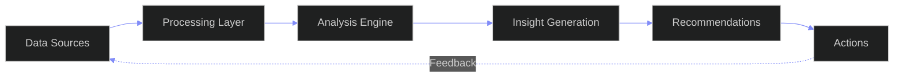
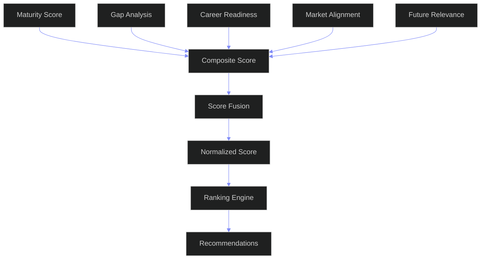

# Skill Intelligence Engine — Enterprise Analytics Architecture for Skills Intelligence

---

## Document Control

| Field | Value |
|---|---|
| Document ID | AI-SIN-001 |
| Version | 1.0.0 |
| Status | Active |
| Last Updated | 2026-06-12 |
| Classification | Internal — Architecture Reference |
| Source of Truth | `docs/ai/skills/skills.md` (Skills System Enterprise Architecture) |
| Companion Docs | `docs/ai/skills/SkillGraphArchitecture.md` (Graph Storage & Traversal) |
| Target Stack | Python 3.11+ (Analytics Engine) + Neo4j (Graph Reads) + PostgreSQL (State) + Redis (Cache) + FastAPI (API Layer) |
| Target Audience | AI Agents, Data Engineers, ML Engineers, Architects, Product Managers |

---

## Table of Contents

- [1. Architecture](#1-architecture)
- [2. Inputs](#2-inputs)
- [3. Outputs](#3-outputs)
- [4. Scoring Models](#4-scoring-models)
- [5. Intelligence Pipelines](#5-intelligence-pipelines)
- [6. Recommendation System](#6-recommendation-system)
- [7. AI Workflows](#7-ai-workflows)
- [8. Evaluation Framework](#8-evaluation-framework)
- [9. Monitoring Strategy](#9-monitoring-strategy)
- [10. Enterprise KPIs](#10-enterprise-kpis)
- [Appendix A: Complete Formula Reference](#appendix-a-complete-formula-reference)
- [Appendix B: Pipeline DAG Specification](#appendix-b-pipeline-dag-specification)
- [Appendix C: Glossary](#appendix-c-glossary)

---

## 1. Architecture

### 1.1 Why a Dedicated Intelligence Engine?

The skill graph answers **"what exists and how is it connected?"** The intelligence engine answers **"what does it mean and what should I do?"**

The Skill Graph (SkillGraphArchitecture.md) is the **structural layer** — it stores nodes, edges, and enables traversals. The Skill Intelligence Engine is the **analytical layer** — it operates on top of the graph to compute scores, detect patterns, and generate recommendations.

| Capability | Graph Does | Intelligence Engine Does |
|---|---|---|
| Skill Maturity | Stores `level`, `confidence_score`, `evidence_score` as properties | Computes composite maturity with temporal decay, confidence intervals, and trend |
| Missing Skills | Stores DEPENDS_ON edges | Traverses dependencies, compares against user subgraph, ranks gaps by impact |
| Outdated Skills | Stores `last_active` timestamp | Analyzes recency decay × market decline — dual-signal detection |
| Emerging Skills | Stores market trend nodes | Computes growth velocity, community emergence, ecosystem heat |
| Career Readiness | Stores target skill relationships | Multi-target weighted readiness with time-to-target estimation |
| Project Readiness | Stores project→skill edges | Skill-coverage analysis with complexity-tier weighting |
| Market Alignment | Stores demand/growth/salary scores | Portfolio-level alignment scoring with diversification analysis |
| Future Relevance | Stores trend projections | Multi-factor forecast combining growth, adoption, innovation, ecosystem health |

### 1.2 Architecture Diagram

```
┌─────────────────────────────────────────────────────────────────────┐
│                        DATA INGESTION LAYER                         │
│  ┌──────────┐  ┌──────────┐  ┌──────────┐  ┌───────────────────┐  │
│  │SkillGraph│  │ Market   │  │ Evidence │  │ User Activity     │  │
│  │ Reader   │  │ Adapter  │  │ Consumer │  │ Stream (Kafka)    │  │
│  └────┬─────┘  └────┬─────┘  └────┬─────┘  └────────┬──────────┘  │
│       │              │              │                  │           │
│       ▼              ▼              ▼                  ▼           │
│  ┌──────────────────────────────────────────────────────────────┐  │
│  │                    INPUT VALIDATION LAYER                      │  │
│  │  Schema enforcement | Freshness checks | Anomaly detection   │  │
│  └──────────────────────────────────────────────────────────────┘  │
└─────────────────────────────────────────────────────────────────────┘
                                   │
                                   â–¼
┌─────────────────────────────────────────────────────────────────────┐
│                      COMPUTATION LAYER                              │
│                                                                     │
│  ┌──────────────────────────────────────────────────────────────┐  │
│  │                  PIPELINE ORCHESTRATOR                         │  │
│  │  ┌──────────┐ ┌──────────┐ ┌──────────┐ ┌────────────────┐   │  │
│  │  │ Real-time│ │ Daily    │ │ Weekly   │ │ Monthly        │   │  │
│  │  │ Pipeline │ │ Pipeline │ │ Pipeline │ │ Pipeline       │   │  │
│  │  └────┬─────┘ └────┬─────┘ └────┬─────┘ └───────┬────────┘   │  │
│  │       │             │            │                │            │  │
│  │       ▼             ▼            ▼                ▼            │  │
│  │  ┌────────────────────────────────────────────────────────┐    │  │
│  │  │              SCORING ENGINE                             │    │  │
│  │  │  Maturity │ Gap │ Career │ Project │ Market │ Future   │    │  │
│  │  └────────────────────────────────────────────────────────┘    │  │
│  │       │             │            │                │            │  │
│  │       ▼             ▼            ▼                ▼            │  │
│  │  ┌────────────────────────────────────────────────────────┐    │  │
│  │  │           RECOMMENDATION FUSION ENGINE                  │    │  │
│  │  │  SkillFusion | TemporalFilter | ContextRank           │    │  │
│  │  └────────────────────────────────────────────────────────┘    │  │
│  └──────────────────────────────────────────────────────────────┘  │
│                                                                     │
│  ┌──────────────────────────────────────────────────────────────┐  │
│  │                  AI ENHANCEMENT LAYER                          │  │
│  │  LLM-Assisted Scoring | Natural Language Explanations        │  │
│  │  Pattern Discovery | Anomaly Investigation                   │  │
│  └──────────────────────────────────────────────────────────────┘  │
└─────────────────────────────────────────────────────────────────────┘
                                   │
                                   â–¼
┌─────────────────────────────────────────────────────────────────────┐
│                       OUTPUT LAYER                                  │
│  ┌──────────┐  ┌──────────┐  ┌──────────┐  ┌───────────────────┐  │
│  │ APIs     │  │ Events   │  │Cache     │  │ Persisted Results │  │
│  │ (REST)   │  │ (Kafka)  │  │(Redis)   │  │ (PostgreSQL)      │  │
│  └──────────┘  └──────────┘  └──────────┘  └───────────────────┘  │
└─────────────────────────────────────────────────────────────────────┘
```

### 1.2b Intelligence Pipeline



### 1.2c Scoring Model Architecture



### 1.3 Design Principles

| Principle | Rationale | Implementation |
|---|---|---|
| **Pipelines over monoliths** | Each intelligence capability has independent lifecycle, scaling, failure modes | Isolated pipeline stages with well-defined input/output contracts |
| **Temporal first** | Skills intelligence is meaningless without time context — velocity, decay, trend are first-class | Every scoring function accepts a `reference_date` parameter; scores decay, grow, and trend over time |
| **Confidence-aware** | Every score includes uncertainty bounds based on data quality, recency, and signal strength | All outputs include `confidence_interval` and `data_freshness` metadata |
| **Algorithmic base, AI enhancement** | Base layer must work without LLM; AI is additive for explanations, edge cases, pattern discovery | Two-phase scoring: deterministic → LLM enrichment (optional, configurable) |
| **Incremental computation** | Full recomputation is expensive and unnecessary; only changed inputs trigger recalculations | Event-driven invalidation + incremental score updates with watermark tracking |
| **Graceful degradation** | Every pipeline function has a fallback if upstream data is missing | Default values, skip-and-log, partial results with `completeness` indicator |
| **Observability by default** | Every score must be explainable: "why this number?" should be traceable to input data | Audit trail with score provenance (which formula, which inputs, when computed) |

### 1.4 Core Components

#### 1.4.1 Pipeline Orchestrator

The orchestrator manages all pipeline execution — scheduling, dependency resolution, retry, and state persistence.

```python
class PipelineOrchestrator:
    """
    Central orchestrator for all intelligence pipelines.
    Manages execution order, parallelization, retry, and state.
    """

    def __init__(self, config: OrchestratorConfig):
        self.config = config
        self.registry: dict[str, PipelineStage] = {}
        self.scheduler = PipelineScheduler(config.schedule_table)
        self.state_store = PipelineStateStore(config.postgres_uri)
        self.cache = PipelineCache(config.redis_uri)
        self.logger = StructuredLogger("pipeline.orchestrator")

    def register(self, stage: PipelineStage):
        """Register a pipeline stage with its dependencies."""
        self.registry[stage.name] = stage
        # Validate DAG — detect cycles during registration
        if not self._is_acyclic(stage.name):
            raise ValueError(
                f"Registering '{stage.name}' would create a cycle in the pipeline DAG."
            )

    async def execute(
        self, pipeline_name: str, tenant_id: str, reference_date: datetime | None = None
    ) -> PipelineResult:
        """
        Execute a named pipeline (e.g., 'daily', 'weekly', 'monthly').
        Resolves all dependent stages in topological order.
        """
        ref_date = reference_date or datetime.utcnow()
        stages = self._resolve_pipeline_stages(pipeline_name)
        sorted_stages = topological_sort(stages)  # DAG ordering

        results = {}
        for stage in sorted_stages:
            if not self._should_execute(stage, tenant_id, ref_date):
                self.logger.info(
                    "Skipping stage",
                    stage=stage.name,
                    tenant=tenant_id,
                    reason="execution_conditions_not_met",
                )
                continue

            try:
                # Check cache first (within TTL)
                cache_key = f"{pipeline_name}:{stage.name}:{tenant_id}:{ref_date.date()}"
                cached = await self.cache.get(cache_key)
                if cached and not stage.force_recompute:
                    results[stage.name] = PipelineStageResult.from_cache(cached)
                    self.logger.info("Cache hit", stage=stage.name, key=cache_key)
                    continue

                # Execute with retry
                result = await self._execute_with_retry(stage, tenant_id, ref_date)
                results[stage.name] = result

                # Cache result
                await self.cache.set(
                    cache_key, result.to_cache(), ttl=stage.cache_ttl_seconds
                )

                # Persist to state store
                await self.state_store.record_execution(
                    pipeline=pipeline_name,
                    stage=stage.name,
                    tenant=tenant_id,
                    result=result,
                    executed_at=ref_date,
                )

            except PipelineStageError as e:
                self.logger.error(
                    "Stage failed",
                    stage=stage.name,
                    tenant=tenant_id,
                    error=str(e),
                    attempt=e.attempt,
                )
                if stage.critical:
                    raise PipelineAbortedError(
                        f"Critical stage '{stage.name}' failed: {e}"
                    ) from e
                results[stage.name] = PipelineStageResult.failed(
                    stage=stage.name, error=str(e)
                )

        return PipelineResult(
            pipeline=pipeline_name,
            tenant_id=tenant_id,
            reference_date=ref_date,
            stages=results,
            overall_status=self._compute_overall_status(results),
            executed_at=ref_date,
            duration_seconds=(datetime.utcnow() - ref_date).total_seconds(),
        )

    async def _execute_with_retry(
        self, stage: PipelineStage, tenant_id: str, ref_date: datetime
    ) -> PipelineStageResult:
        """Execute a stage with exponential backoff retry."""
        last_exception = None
        for attempt in range(1, stage.max_retries + 1):
            try:
                self.logger.info(
                    "Executing stage",
                    stage=stage.name,
                    tenant=tenant_id,
                    attempt=attempt,
                )
                return await stage.execute(tenant_id, ref_date)
            except PipelineStageError as e:
                last_exception = e
                if attempt < stage.max_retries:
                    wait = stage.backoff_base ** attempt
                    self.logger.warning(
                        "Retrying stage",
                        stage=stage.name,
                        attempt=attempt,
                        wait_seconds=wait,
                    )
                    await asyncio.sleep(wait)
        raise PipelineStageError(
            f"Stage '{stage.name}' failed after {stage.max_retries} attempts"
        ) from last_exception

    def _should_execute(
        self, stage: PipelineStage, tenant_id: str, ref_date: datetime
    ) -> bool:
        """Determine if a stage should execute based on conditions."""
        # Check if dependencies are met
        for dep_name in stage.depends_on:
            dep_result = self.state_store.get_last_execution(
                stage_name=dep_name, tenant_id=tenant_id
            )
            if dep_result is None:
                self.logger.warning(
                    "Dependency not executed",
                    stage=stage.name,
                    depends_on=dep_name,
                )
                return False
            if dep_result.status != "completed":
                return False

        # Check cooldown period
        last_run = self.state_store.get_last_execution(
            stage_name=stage.name, tenant_id=tenant_id
        )
        if last_run and stage.cooldown_minutes:
            elapsed = (ref_date - last_run.executed_at).total_seconds() / 60
            if elapsed < stage.cooldown_minutes:
                return False

        return True
```

#### 1.4.2 PipelineStage Abstraction

Every intelligence capability is a concrete `PipelineStage` implementation. This ensures consistent error handling, caching, and observability.

```python
class PipelineStage(ABC):
    """
    Abstract base class for all intelligence pipeline stages.
    Each stage implements exactly one intelligence capability.
    """

    def __init__(
        self,
        name: str,
        depends_on: list[str] | None = None,
        max_retries: int = 3,
        backoff_base: float = 2.0,
        cache_ttl_seconds: int = 3600,
        cooldown_minutes: int = 0,
        critical: bool = False,
    ):
        self.name = name
        self.depends_on = depends_on or []
        self.max_retries = max_retries
        self.backoff_base = backoff_base
        self.cache_ttl_seconds = cache_ttl_seconds
        self.cooldown_minutes = cooldown_minutes
        self.critical = critical

    @abstractmethod
    async def execute(
        self, tenant_id: str, reference_date: datetime
    ) -> PipelineStageResult:
        """Execute this intelligence stage. Must be idempotent."""
        ...

    @abstractmethod
    def input_contract(self) -> InputSchema:
        """Defines the expected input data schema for this stage."""
        ...

    @abstractmethod
    def output_contract(self) -> OutputSchema:
        """Defines the guaranteed output schema for this stage."""
        ...

    def validate_inputs(self, inputs: dict) -> bool:
        """Validate inputs against the input contract."""
        try:
            self.input_contract().model_validate(inputs)
            return True
        except ValidationError as e:
            self.logger.error("Input validation failed", errors=e.errors())
            return False
```

#### 1.4.3 Scoring Engine

The scoring engine is the computational core. It takes validated inputs from pipeline stages, applies scoring functions, and returns structured scores with confidence intervals.

```python
class ScoringEngine:
    """
    Central scoring engine that applies composable scoring functions.
    Each function returns a ScoreResult with value, confidence, and provenance.
    """

    def __init__(self, config: ScoringEngineConfig):
        self.config = config
        self.registry: dict[str, ScoringFunction] = {}
        self.logger = StructuredLogger("scoring.engine")

    def register(self, name: str, fn: ScoringFunction):
        """Register a scoring function by name."""
        self.registry[name] = fn
        self.logger.info("Scoring function registered", name=name)

    async def compute(
        self,
        function_name: str,
        params: dict,
        reference_date: datetime | None = None,
    ) -> ScoreResult:
        """
        Compute a single score by name with given parameters.
        Returns a ScoreResult with value, confidence interval, and provenance.
        """
        if function_name not in self.registry:
            raise UnknownScoringFunctionError(
                f"No scoring function registered: '{function_name}'"
            )

        fn = self.registry[function_name]
        ref_date = reference_date or datetime.utcnow()

        try:
            result = await fn.compute(params, ref_date)
            self.logger.info(
                "Score computed",
                function=function_name,
                value=result.value,
                confidence=result.confidence,
            )
            return result
        except ScoringError as e:
            self.logger.error(
                "Scoring failed",
                function=function_name,
                error=str(e),
            )
            return ScoreResult.failed(
                function=function_name,
                error=str(e),
                reference_date=ref_date,
            )

    async def compute_batch(
        self,
        computations: list[ScoringRequest],
        reference_date: datetime | None = None,
    ) -> list[ScoreResult]:
        """Compute multiple scores in parallel."""
        ref_date = reference_date or datetime.utcnow()
        tasks = [
            self.compute(req.function_name, req.params, ref_date)
            for req in computations
        ]
        return await asyncio.gather(*tasks, return_exceptions=True)
```

#### 1.4.4 ScoreResult Data Model

Every scoring function returns this structured result — enabling explainability, confidence-aware decisions, and audit trails.

```python
@dataclass
class ScoreResult:
    """
    Universal return type for all scoring functions.
    Enables confidence-aware decisions and audit trails.
    """
    function_name: str
    value: float
    confidence: float  # 0.0 (guess) to 1.0 (certain)
    confidence_interval: tuple[float, float]  # [lower_bound, upper_bound]
    reference_date: datetime
    data_freshness: dict[str, datetime]  # Per-input-stream freshness
    provenance: list[ProvenanceEntry]  # Chain of computation
    metadata: dict  # Function-specific metadata
    error: str | None = None

    @property
    def is_reliable(self) -> bool:
        """Score is reliable if confidence > 0.7."""
        return self.confidence >= 0.7

    @property
    def is_current(self) -> bool:
        """Score is current if all inputs are fresher than 7 days."""
        max_age = (datetime.utcnow() - self.reference_date).days
        return max_age <= 7

    @classmethod
    def failed(cls, function_name: str, error: str, reference_date: datetime):
        return cls(
            function_name=function_name,
            value=0.0,
            confidence=0.0,
            confidence_interval=(0.0, 0.0),
            reference_date=reference_date,
            data_freshness={},
            provenance=[],
            metadata={},
            error=error,
        )


@dataclass
class ProvenanceEntry:
    """A single step in the score computation chain."""
    stage: str  # Which pipeline stage produced this
    function: str  # Which scoring function
    input_keys: list[str]  # Which input data was used
    computed_at: datetime
    duration_ms: float
    version: str  # Version of the scoring function
```

#### 1.4.5 Event Bus Integration

The intelligence engine reacts to events from the broader ARIA OS ecosystem. This enables real-time intelligence updates without polling.

```python
class IntelligenceEventBus:
    """
    Event bus for intelligence engine.
    Reacts to skill changes, market updates, evidence submissions, etc.
    """

    EVENT_TOPICS = {
        "skill.level.changed": ["maturity", "gap_analysis", "career_readiness"],
        "skill.evidence.added": ["maturity", "confidence"],
        "skill.state.changed": ["maturity", "gap_analysis"],
        "market.data.updated": ["emerging_skills", "market_alignment", "future_relevance"],
        "target.skill.added": ["gap_analysis", "career_readiness"],
        "project.created": ["project_readiness"],
        "opportunity.matched": ["career_readiness"],
        "assessment.completed": ["maturity", "confidence"],
        "user.activity.detected": ["recency_decay"],
    }

    def __init__(self, orchestrator: PipelineOrchestrator):
        self.orchestrator = orchestrator
        self.consumer = KafkaConsumer(
            bootstrap_servers=self.orchestrator.config.kafka_brokers,
            group_id="skill-intelligence-engine",
            value_deserializer=lambda m: json.loads(m.decode()),
        )

    async def start(self):
        """Subscribe to all relevant topics and process events."""
        topics = list(self.EVENT_TOPICS.keys())
        self.consumer.subscribe(topics)
        self.logger.info("Event bus started", topics=topics)

        async for message in self.consumer:
            await self._handle_event(message.topic, message.value)

    async def _handle_event(self, topic: str, event: dict):
        """Route an event to the appropriate pipeline stages."""
        impacted_stages = self.EVENT_TOPICS.get(topic, [])
        tenant_id = event.get("tenant_id")
        user_id = event.get("user_id")

        if not tenant_id:
            self.logger.warning("Event missing tenant_id", topic=topic, event=event)
            return

        for stage_name in impacted_stages:
            # Trigger targeted pipeline execution for affected user
            await self.orchestrator.execute(
                pipeline_name="real_time",
                tenant_id=tenant_id,
                user_id=user_id,
                reference_date=datetime.utcnow(),
                targeted_stages=[stage_name],
            )
```

### 1.5 Integration with ARIA OS

The intelligence engine is not a microservice — it runs **in-process within FastAPI** (per ADR-004), sharing the same event loop and database connections as the rest of ARIA OS.

```
┌─────────────────────────────────────────────────────────────────┐
│                      ARIA OS (FastAPI)                           │
│                                                                  │
│  ┌──────────┐  ┌────────────┐  ┌─────────────────────────────┐  │
│  │ REST API │  │ ARIA Agent │  │ Skill Intelligence Engine   │  │
│  │ (app/api)│  │ (orchestr.)│  │                             │  │
│  └──────────┘  └────────────┘  │  PipelineOrchestrator       │  │
│        │              │         │  ScoringEngine              │  │
│        │              │         │  RecommendationEngine       │  │
│        ▼              ▼         │  IntelligenceEventBus       │  │
│  ┌─────────────────────────────────────┐                      │  │
│  │      Shared Infrastructure          │                      │  │
│  │  Neo4j Reader │ PG Pool │ Redis    │                      │  │
│  └─────────────────────────────────────┘                      │  │
└─────────────────────────────────────────────────────────────────┘
```

### 1.6 Deployment Topology

| Component | Instances | Scaling | Dependencies |
|---|---|---|---|
| PipelineOrchestrator | 1 per region | Vertical (single boss-worker) | PostgreSQL, Redis |
| ScoringEngine | Shared (in-process) | N/A (stateless) | Neo4j (read) |
| Real-time pipeline | Event-driven | Per-event lightweight | Kafka, Redis |
| Daily/Weekly/Monthly | 1-2 workers | Horizontal (partitioned by tenant) | PostgreSQL, Neo4j |
| AI Enhancement | On-demand | N/A (calls Claude/Ollama) | LLM client |

---

## 2. Inputs

### 2.1 Input Stream Architecture

The intelligence engine consumes **8 input streams**. Each stream has a defined schema, a source, a freshness SLA, and a validation contract.

| # | Stream | Source | Freshness SLA | Volume | Criticality |
|---|---|---|---|---|---|
| S1 | User Skill Profile | Skill Graph (Neo4j) | < 1 hour | 1 request per user | Critical |
| S2 | Target Skills | PostgreSQL (`target_skills` table) | < 1 hour | 5-20 per user | Critical |
| S3 | Market Intelligence | Market Adapter (external APIs) | < 1 day | 500+ scores | High |
| S4 | Dependency Graph | Skill Graph (Neo4j) | < 1 hour | 100K+ edges | Critical |
| S5 | Evidence & Assessments | PostgreSQL (`evidence`, `assessments`) | < 15 min | 10-100 per user | High |
| S6 | Project / Roadmap | PostgreSQL (`projects`, `roadmaps`) | < 1 hour | 1-5 per user | Medium |
| S7 | Opportunity Data | PostgreSQL (`opportunities`) | < 1 hour | 10-50 per user | Medium |
| S8 | Temporal Snapshots | PostgreSQL (`node_snapshots`, `skill_versions`) | < 1 day | 1000+ per user | Medium |

### 2.2 Stream Schemas (Pydantic Models)

#### S1 — User Skill Profile

```python
class UserSkillProfile(BaseModel):
    """Complete skill profile for a single user at a point in time."""
    user_id: str
    tenant_id: str
    skills: list[UserSkill]
    computed_at: datetime
    profile_version: int

    @property
    def total_skills(self) -> int:
        return len(self.skills)

    @property
    def active_skills(self) -> list[UserSkill]:
        return [s for s in self.skills if s.state in {
            "practicing", "active", "advanced", "expert"
        }]

    @property
    def average_level(self) -> float:
        if not self.skills:
            return 0.0
        return sum(s.level_numeric for s in self.skills) / len(self.skills)

    @property
    def categories(self) -> dict[str, list[UserSkill]]:
        result: dict[str, list[UserSkill]] = {}
        for skill in self.skills:
            result.setdefault(skill.category, []).append(skill)
        return result


class UserSkill(BaseModel):
    """Single skill entry in a user's profile."""
    skill_id: str
    name: str
    slug: str
    category: str
    subcategory: str | None = None
    level: str  # L0-L5
    level_numeric: int  # 0-5
    state: str  # planned, learning, practicing, active, advanced, expert, archived, deprecated
    confidence_score: float = Field(ge=0.0, le=1.0)
    evidence_score: float = Field(ge=0.0, le=1.0)
    experience_months: int = Field(ge=0)
    last_active: datetime | None = None
    first_experienced: datetime | None = None
    hours_invested: int = Field(ge=0)
    tags: list[str] = []
    evidence_items: list[EvidenceItem] = []
    version: int = Field(ge=1)


class EvidenceItem(BaseModel):
    """A single piece of evidence supporting a skill claim."""
    evidence_id: str
    evidence_type: str  # project, github, certification, course, employment, etc.
    quality_tier: str  # gold, silver, bronze, basic, unverified
    quality_score: float = Field(ge=0.0, le=1.0)
    submitted_at: datetime
    verified_at: datetime | None = None
    description: str
    url: str | None = None
```

#### S2 — Target Skills

```python
class TargetSkillSet(BaseModel):
    """All target (desired) skills for a user."""
    user_id: str
    tenant_id: str
    targets: list[TargetSkill]
    computed_at: datetime


class TargetSkill(BaseModel):
    """A single target skill the user wants to acquire or improve."""
    target_id: str
    skill_name: str
    skill_id: str | None = None  # Resolved from name if possible
    target_level: str  # L0-L5
    target_level_numeric: int = Field(ge=0, le=5)
    current_level_numeric: int = Field(ge=0, le=5)
    gap: int = Field(ge=0, le=5)
    target_type: str  # career, company, startup, income, project, certification, learning
    priority: str  # high, medium, low
    priority_weight: float = Field(ge=0.0, le=1.0)
    deadline: date | None = None
    motivation: str | None = None
    source: str  # user, ai, career, market
    created_at: datetime
    updated_at: datetime
```

#### S3 — Market Intelligence

```python
class MarketIntelligenceSnapshot(BaseModel):
    """Current market intelligence for all tracked skills."""
    skills: list[SkillMarketData]
    snapshot_date: date
    source: str
    data_completeness: float = Field(ge=0.0, le=1.0)


class SkillMarketData(BaseModel):
    """Market data for a single skill."""
    skill_name: str
    skill_id: str | None = None
    category: str | None = None
    demand_score: float = Field(ge=0.0, le=100.0)
    growth_score: float = Field(ge=-100.0, le=100.0)
    salary_score: float = Field(ge=0.0, le=100.0)
    competition_score: float = Field(ge=0.0, le=100.0)
    future_relevance_score: float = Field(ge=0.0, le=100.0)
    skill_health: float = Field(ge=0.0, le=100.0)
    demand_trend_90d: list[float] | None = None  # 90-day demand time series
    growth_yoy: float | None = None
    market_cap: str | None = None  # total, niche, growing, emerging, declining
    data_confidence: float = Field(ge=0.0, le=1.0)
```

#### S4 — Dependency Graph (Subset)

```python
class DependencySubgraph(BaseModel):
    """Dependency graph subset relevant to a user's skill set and targets."""
    user_id: str
    nodes: list[DependencyNode]
    edges: list[DependencyEdge]
    computed_at: datetime


class DependencyNode(BaseModel):
    """A skill node in the dependency graph."""
    skill_id: str
    name: str
    category: str
    level: int  # Hierarchical level in the DAG (0 = root)


class DependencyEdge(BaseModel):
    """A dependency relationship between two skills."""
    source_id: str  # Prerequisite
    target_id: str  # Dependent skill
    relationship_type: str  # hard, soft, recommended, complementary, alternative, builds_on, parallel
    weight: float = Field(default=1.0, ge=0.0, le=1.0)
```

#### S5 — Evidence & Assessments

```python
class EvidenceAggregate(BaseModel):
    """Aggregated evidence and assessment data for a user's skills."""
    user_id: str
    tenant_id: str
    skill_evidence: dict[str, list[EvidenceItem]]  # skill_id -> evidence
    skill_assessments: dict[str, list[AssessmentResult]]
    computed_at: datetime


class AssessmentResult(BaseModel):
    """A single assessment result for a skill."""
    assessment_id: str
    skill_id: str
    assessment_type: str  # quiz, project, interview, peer_review, ai_eval, etc.
    score: float = Field(ge=0.0, le=100.0)
    level_verified: str | None  # L0-L5 if assessment maps to level
    conducted_at: datetime
    assessed_by: str  # user, peer, ai, certifying_body
    metadata: dict = {}
```

#### S6 — Project / Roadmap

```python
class ProjectPortfolio(BaseModel):
    """Projects and roadmaps requiring skills."""
    user_id: str
    projects: list[ProjectSkillRequirements]
    roadmaps: list[RoadmapSkillRequirements]


class ProjectSkillRequirements(BaseModel):
    """Skills required for a specific project."""
    project_id: str
    project_name: str
    complexity_tier: int = Field(ge=1, le=5)  # 1=simple, 5=enterprise
    required_skills: list[RequiredSkill]
    target_completion: date | None = None


class RequiredSkill(BaseModel):
    """A skill requirement for a project or roadmap node."""
    skill_id: str | None = None
    skill_name: str
    minimum_level: int = Field(ge=0, le=5)  # L1-L5
    criticality: str  # required, preferred, nice_to_have
    criticality_weight: float = Field(ge=0.0, le=1.0)
```

#### S7 — Opportunity Data

```python
class OpportunitySet(BaseModel):
    """Career opportunities relevant to the user."""
    user_id: str
    opportunities: list[OpportunitySkillRequirements]


class OpportunitySkillRequirements(BaseModel):
    """Skills required for a specific opportunity."""
    opportunity_id: str
    opportunity_type: str  # job, freelance, consulting, startup, role_change
    title: str
    required_skills: list[RequiredSkill]
    match_score: float | None = None  # Pre-computed if available
    salary_range: tuple[float, float] | None = None
    location: str | None = None
```

#### S8 — Temporal Snapshots

```python
class TemporalSnapshotSet(BaseModel):
    """Historical snapshots for temporal analysis."""
    user_id: str
    snapshots: list[SkillSnapshot]
    computed_at: datetime


class SkillSnapshot(BaseModel):
    """A point-in-time snapshot of a user's skill state."""
    snapshot_id: str
    snapshot_date: date
    skills: list[UserSkill]  # Full skill state at that point
    metadata: dict = {}
```

### 2.3 Input Validation Layer

Every input stream passes through a validation layer before entering the computation layer:

```python
class InputValidator:
    """
    Validates, sanitizes, and normalizes all input streams.
    Rejects malformed data, applies defaults, and tracks freshness.
    """

    VALIDATORS: dict[str, type[BaseModel]] = {
        "user_skill_profile": UserSkillProfile,
        "target_skills": TargetSkillSet,
        "market_intelligence": MarketIntelligenceSnapshot,
        "dependency_graph": DependencySubgraph,
        "evidence_aggregate": EvidenceAggregate,
        "project_portfolio": ProjectPortfolio,
        "opportunity_set": OpportunitySet,
        "temporal_snapshots": TemporalSnapshotSet,
    }

    def __init__(self, config: ValidatorConfig):
        self.config = config
        self.freshness_tracker = FreshnessTracker(config.redis_uri)
        self.anomaly_detector = AnomalyDetector(config)
        self.logger = StructuredLogger("input.validator")

    async def validate(
        self, stream_name: str, data: dict
    ) -> ValidationResult:
        """
        Validate an input stream.
        Returns validated data or raises ValidationError with details.
        """
        if stream_name not in self.VALIDATORS:
            return ValidationResult.rejected(
                stream=stream_name,
                reason=f"Unknown stream: {stream_name}",
            )

        model_class = self.VALIDATORS[stream_name]

        try:
            validated = model_class.model_validate(data)

            # Check freshness
            if hasattr(validated, "computed_at"):
                age = (datetime.utcnow() - validated.computed_at).total_seconds()
                if age > self.config.max_age_seconds.get(stream_name, 86400):
                    return ValidationResult.stale(
                        stream=stream_name,
                        age_seconds=age,
                        data=validated,
                    )

            # Check for anomalies
            anomaly_score = await self.anomaly_detector.score(
                stream_name, validated
            )
            if anomaly_score > self.config.anomaly_threshold:
                self.logger.warning(
                    "Anomaly detected",
                    stream=stream_name,
                    score=anomaly_score,
                )

            # Track freshness
            await self.freshness_tracker.record(
                stream=stream_name,
                timestamp=datetime.utcnow(),
                record_count=len(self._estimate_count(validated)),
            )

            return ValidationResult.accepted(data=validated)

        except ValidationError as e:
            return ValidationResult.rejected(
                stream=stream_name,
                reason="schema_validation_failed",
                details=e.errors(),
            )
```

### 2.4 Freshness SLA Matrix

| Stream | Max Age | Stale Warning | Stale Critical | Action When Stale |
|---|---|---|---|---|
| User Skill Profile | 1 hour | > 30 min | > 2 hours | Use cached, flag reduced confidence |
| Target Skills | 1 hour | > 30 min | > 2 hours | Use cached, flag reduced confidence |
| Market Intelligence | 24 hours | > 12 hours | > 48 hours | Use last known, mark scores "market_data_stale" |
| Dependency Graph | 1 hour | > 30 min | > 2 hours | Use cached, flag reduced confidence |
| Evidence & Assessments | 15 min | > 10 min | > 1 hour | Use cached, flag "pending_evidence_update" |
| Project / Roadmap | 1 hour | > 30 min | > 2 hours | Use cached, flag reduced confidence |
| Opportunity Data | 1 hour | > 30 min | > 2 hours | Use cached, flag reduced confidence |
| Temporal Snapshots | 24 hours | > 12 hours | > 48 hours | Use last known, skip trend analysis |

---

## 3. Outputs

### 3.1 Output Architecture

The intelligence engine produces **9 output artifacts**. Each artifact is a structured data product with a defined schema, delivery channel, and consumer.

| # | Artifact | Primary Consumer | Delivery Channel | Freshness SLA |
|---|---|---|---|---|
| O1 | Skill Maturity Report | UI Dashboard, ARIA Agent | REST API + Event | Real-time |
| O2 | Gap Analysis Report | ARIA Agent, Recommendation Engine | REST API + Event | On-demand |
| O3 | Career Readiness Scorecard | UI Dashboard, User Notification | REST API + Webhook | Weekly |
| O4 | Project Readiness Scorecard | UI Dashboard, ARIA Agent | REST API + Event | On-demand |
| O5 | Market Alignment Report | ARIA Agent, Recommendation Engine | REST API + Event | Weekly |
| O6 | Future Relevance Forecast | UI Dashboard, ARIA Agent | REST API | Monthly |
| O7 | Recommendation Set | UI, ARIA Agent, Notification | REST API + Event + Push | Configurable |
| O8 | Trend Alert | Notification System, Email | Webhook + Push | On-detection |
| O9 | Inflation Detection Report | Admin Dashboard, ARIA Agent | REST API | Monthly |

### 3.2 Output Schemas

#### O1 — Skill Maturity Report

```python
class SkillMaturityReport(BaseModel):
    """
    Comprehensive maturity assessment for each skill in a user's profile.
    Combines level, confidence, evidence, recency, and consistency into a
    unified maturity score with trend direction.
    """
    user_id: str
    tenant_id: str
    generated_at: datetime
    reference_date: date
    overall_maturity_score: float = Field(ge=0.0, le=100.0)
    overall_confidence: float = Field(ge=0.0, le=1.0)
    skills: list[SkillMaturityAssessment]
    category_breakdown: list[CategoryMaturitySummary]
    trends: MaturityTrendSummary


class SkillMaturityAssessment(BaseModel):
    """Maturity assessment for a single skill."""
    skill_id: str
    name: str
    category: str
    level: str
    level_numeric: int = Field(ge=0, le=5)
    maturity_score: float = Field(ge=0.0, le=100.0)
    confidence: float = Field(ge=0.0, le=1.0)
    confidence_interval: tuple[float, float]
    components: MaturityComponents
    trend: TrendDirection
    data_freshness: str  # current, stale, missing


class MaturityComponents(BaseModel):
    """Breakdown of the maturity score into its components."""
    level_score: float = Field(ge=0.0, le=100.0)
    confidence_score: float = Field(ge=0.0, le=100.0)
    evidence_score: float = Field(ge=0.0, le=100.0)
    recency_score: float = Field(ge=0.0, le=100.0)
    consistency_score: float = Field(ge=0.0, le=100.0)


class TrendDirection(BaseModel):
    direction: str  # improving, stable, declining, stalled
    velocity: float  # Change per month in maturity score
    window_days: int  # Window over which trend is calculated


class CategoryMaturitySummary(BaseModel):
    """Aggregated maturity for a skill category."""
    category: str
    skill_count: int
    average_maturity: float
    average_confidence: float
    strongest_skill: str
    weakest_skill: str


class MaturityTrendSummary(BaseModel):
    """Overall maturity trend across all skills."""
    improving_count: int
    stable_count: int
    declining_count: int
    stalled_count: int
    net_maturity_change: float  # Overall change this period
```

#### O2 — Gap Analysis Report

```python
class GapAnalysisReport(BaseModel):
    """
    Analysis of gaps between current skills and target/required skills.
    Ranks gaps by priority, severity, and impact.
    """
    user_id: str
    tenant_id: str
    generated_at: datetime
    reference_date: date
    target_type: str  # career, project, opportunity, certification, learning
    gaps: list[SkillGap]
    summary: GapSummary


class SkillGap(BaseModel):
    """A single skill gap between current and target."""
    skill_id: str
    skill_name: str
    category: str
    current_level: int = Field(ge=0, le=5)
    target_level: int = Field(ge=0, le=5)
    gap_size: int = Field(ge=0, le=5)
    gap_severity: str  # critical, major, moderate, minor
    priority_score: float = Field(ge=0.0, le=100.0)
    estimated_time_months: float
    prerequisites: list[PrerequisiteGap]
    confidence: float = Field(ge=0.0, le=1.0)
    recommendations: list[str]


class PrerequisiteGap(BaseModel):
    """A missing prerequisite contributing to this gap."""
    skill_name: str
    category: str
    current_level: int
    required_level: int


class GapSummary(BaseModel):
    """Overview of all gaps."""
    total_gaps: int
    critical_gaps: int
    major_gaps: int
    moderate_gaps: int
    minor_gaps: int
    average_gap_size: float
    total_estimated_time_months: float
    top_priority_gaps: list[str]  # Top 5 skill names by priority_score
```

#### O3 — Career Readiness Scorecard

```python
class CareerReadinessScorecard(BaseModel):
    """
    Multi-target career readiness assessment.
    Shows readiness for each career path the user is tracking.
    """
    user_id: str
    tenant_id: str
    generated_at: datetime
    reference_date: date
    overall_readiness: float = Field(ge=0.0, le=100.0)
    overall_confidence: float = Field(ge=0.0, le=1.0)
    targets: list[CareerTargetReadiness]
    recommendations: list[CareerReadinessRecommendation]


class CareerTargetReadiness(BaseModel):
    """Readiness score for a single career target."""
    target_id: str
    target_title: str
    target_type: str
    readiness_score: float = Field(ge=0.0, le=100.0)
    skill_coverage: float = Field(ge=0.0, le=100.0)
    level_match: float = Field(ge=0.0, le=100.0)
    missing_skills_count: int
    estimated_time_to_target: str  # e.g., "6-9 months"
    priority: str  # high, medium, low
    confidence: float = Field(ge=0.0, le=1.0)


class CareerReadinessRecommendation(BaseModel):
    """A recommendation to improve career readiness."""
    recommendation_type: str  # learn, improve, pivot, accelerate
    skill_name: str
    target_title: str
    impact: str  # high, medium, low
    reasoning: str
```

#### O4 — Project Readiness Scorecard

```python
class ProjectReadinessScorecard(BaseModel):
    """
    Readiness assessment for each project the user is involved in.
    Shows skill coverage gaps and recommends preparation.
    """
    user_id: str
    tenant_id: str
    generated_at: datetime
    projects: list[ProjectReadiness]


class ProjectReadiness(BaseModel):
    """Readiness score for a single project."""
    project_id: str
    project_name: str
    complexity_tier: int
    readiness_score: float = Field(ge=0.0, le=100.0)
    skill_coverage_pct: float = Field(ge=0.0, le=100.0)
    level_match_pct: float = Field(ge=0.0, le=100.0)
    critical_gaps: list[str]
    recommended_preparation: list[str]
    confidence: float = Field(ge=0.0, le=1.0)
```

#### O5 — Market Alignment Report

```python
class MarketAlignmentReport(BaseModel):
    """
    How well the user's skill portfolio aligns with current and projected
    market demand. Includes portfolio-level diversification analysis.
    """
    user_id: str
    tenant_id: str
    generated_at: datetime
    reference_date: date
    overall_alignment_score: float = Field(ge=0.0, le=100.0)
    alignment_by_category: list[CategoryAlignment]
    portfolio_diversification: float = Field(ge=0.0, le=100.0)
    high_demand_skills_owned: list[str]
    high_demand_skills_missing: list[str]
    declining_skills_owned: list[str]
    recommendations: list[str]


class CategoryAlignment(BaseModel):
    """Market alignment for a single skill category."""
    category: str
    alignment_score: float = Field(ge=0.0, le=100.0)
    market_demand_avg: float
    user_level_avg: float
    skills_in_category: int
```

#### O6 — Future Relevance Forecast

```python
class FutureRelevanceForecast(BaseModel):
    """
    Projected future relevance of the user's skill portfolio over
    1-year, 3-year, and 5-year horizons.
    """
    user_id: str
    tenant_id: str
    generated_at: datetime
    reference_date: date
    overall_forecast: ForecastSummary
    skill_projections: list[SkillProjection]
    recommendations: list[str]


class ForecastSummary(BaseModel):
    """Aggregated future relevance outlook."""
    portfolio_relevance_1yr: float = Field(ge=0.0, le=100.0)
    portfolio_relevance_3yr: float = Field(ge=0.0, le=100.0)
    portfolio_relevance_5yr: float = Field(ge=0.0, le=100.0)
    at_risk_skills: list[str]  # Skills projected to decline
    emerging_growth_areas: list[str]  # Skills projected to grow
    net_portfolio_health: str  # excellent, good, fair, at_risk


class SkillProjection(BaseModel):
    """Future relevance projection for a single skill."""
    skill_name: str
    category: str
    current_relevance: float
    projected_1yr: float
    projected_3yr: float
    projected_5yr: float
    trajectory: str  # growing, stable, declining, volatile
    confidence: float = Field(ge=0.0, le=1.0)
```

#### O7 — Recommendation Set

```python
class RecommendationSet(BaseModel):
    """
    Personalized set of skill recommendations for a user.
    Produced by the fused recommendation engine.
    """
    user_id: str
    tenant_id: str
    generated_at: datetime
    recommendations: list[SkillRecommendation]
    metadata: RecommendationMetadata


class SkillRecommendation(BaseModel):
    """A single skill recommendation."""
    recommendation_id: str
    recommendation_type: str  # learn, improve, drop, emerging, opportunity_readiness
    skill_id: str | None = None
    skill_name: str
    category: str
    priority_score: float = Field(ge=0.0, le=100.0)
    priority_label: str  # critical, high, medium, low
    rationale: str
    source_weights: SourceWeights
    expected_impact: str  # career, project, income, growth
    expected_impact_description: str
    prerequisites: list[str]
    estimated_time: str  # e.g., "2-4 weeks"
    confidence: float = Field(ge=0.0, le=1.0)
    dismissed: bool = False  # User dismissed this recommendation


class SourceWeights(BaseModel):
    """Breakdown of which sources contributed to this recommendation."""
    career_targets: float = 0.0
    market_intelligence: float = 0.0
    skill_graph: float = 0.0
    user_history: float = 0.0
    peer_patterns: float = 0.0


class RecommendationMetadata(BaseModel):
    """Metadata about the recommendation set."""
    total_recommendations: int
    by_type: dict[str, int]
    average_confidence: float
    generated_by: str  # algorithmic, ai_enhanced, ai_only
    execution_time_ms: int
```

#### O8 — Trend Alert

```python
class TrendAlert(BaseModel):
    """An alert triggered by a detected trend or anomaly."""
    alert_id: str
    alert_type: str  # emerging_skill, declining_skill, skill_inflation,
                     # maturity_drop, market_shift, gap_emerged
    severity: str  # critical, high, medium, low, info
    title: str
    description: str
    affected_skills: list[str]
    affected_categories: list[str]
    detected_at: datetime
    expires_at: datetime | None = None
    acknowledged: bool = False
    metadata: dict = {}
```

#### O9 — Inflation Detection Report

```python
class InflationDetectionReport(BaseModel):
    """
    Detects skill level inflation — when claimed levels exceed
    evidence-backed levels. Provides correction recommendations.
    """
    user_id: str
    tenant_id: str
    generated_at: datetime
    overall_inflation_score: float = Field(ge=0.0, le=100.0)
    inflated_skills: list[InflatedSkill]
    summary: InflationSummary


class InflatedSkill(BaseModel):
    """A skill where claimed level exceeds evidence-backed level."""
    skill_id: str
    skill_name: str
    claimed_level: int
    evidence_backed_level: int
    inflation_gap: int
    inflation_signals: list[str]  # Which signals fired
    confidence: float = Field(ge=0.0, le=1.0)
    recommended_correction: str  # adjust_level, add_evidence, reassess


class InflationSummary(BaseModel):
    total_inflated_skills: int
    total_accurate_skills: int
    inflation_rate: float  # inflated / total
    average_inflation_gap: float
    top_categories_with_inflation: list[str]
```

### 3.3 Output Delivery Channels

```python
class OutputDispatcher:
    """
    Routes intelligence outputs to their delivery channels.
    Supports REST APIs, events (Kafka), webhooks, and push notifications.
    """

    def __init__(self, config: DispatcherConfig):
        self.config = config
        self.producer = KafkaProducer(
            bootstrap_servers=config.kafka_brokers,
            value_serializer=lambda v: json.dumps(v, default=str).encode(),
        )
        self.cache = PipelineCache(config.redis_uri)
        self.logger = StructuredLogger("output.dispatcher")

    async def dispatch(self, artifact_name: str, payload: BaseModel):
        """
        Dispatch an output artifact to all configured channels.
        Idempotent — redis cache prevents duplicate dispatch.
        """
        dispatch_key = f"dispatch:{artifact_name}:{self._hash_payload(payload)}"

        if await self.cache.exists(dispatch_key):
            self.logger.info("Artifact already dispatched, skipping", artifact=artifact_name)
            return

        channels = self._get_channels(artifact_name)

        for channel in channels:
            try:
                await self._dispatch_to_channel(channel, artifact_name, payload)
                self.logger.info(
                    "Artifact dispatched",
                    artifact=artifact_name,
                    channel=channel,
                )
            except DispatchError as e:
                self.logger.error(
                    "Dispatch failed",
                    artifact=artifact_name,
                    channel=channel,
                    error=str(e),
                )

        # Mark dispatched (TTL = 5 minutes to prevent duplicates within window)
        await self.cache.set(dispatch_key, "1", ttl=300)

    def _get_channels(self, artifact_name: str) -> list[str]:
        """Return the list of delivery channels for an artifact."""
        channel_map = {
            "skill_maturity_report": ["api", "event"],
            "gap_analysis_report": ["api", "event"],
            "career_readiness_scorecard": ["api", "event", "webhook"],
            "project_readiness_scorecard": ["api", "event"],
            "market_alignment_report": ["api", "event"],
            "future_relevance_forecast": ["api"],
            "recommendation_set": ["api", "event", "push"],
            "trend_alert": ["webhook", "push", "event"],
            "inflation_detection_report": ["api"],
        }
        return channel_map.get(artifact_name, ["api"])

    async def _dispatch_to_channel(
        self, channel: str, artifact_name: str, payload: BaseModel
    ):
        """Dispatch to a specific channel."""
        if channel == "api":
            await self._cache_for_api(artifact_name, payload)
        elif channel == "event":
            await self._publish_event(artifact_name, payload)
        elif channel == "webhook":
            await self._send_webhook(artifact_name, payload)
        elif channel == "push":
            await self._send_push_notification(artifact_name, payload)

    async def _publish_event(self, topic: str, payload: BaseModel):
        """Publish output as a Kafka event."""
        await self.producer.send(
            topic=f"intelligence.{topic}",
            value=payload.model_dump(mode="json"),
        )

    async def _cache_for_api(self, key: str, payload: BaseModel):
        """Cache output for REST API consumption."""
        await self.cache.set(
            f"api:{key}:{payload.user_id}" if hasattr(payload, "user_id") else f"api:{key}",
            payload.model_dump(mode="json"),
            ttl=300,  # 5-minute TTL for API cache
        )
```

---

## 4. Scoring Models

### 4.1 Scoring Function Architecture

Every scoring model follows a consistent architecture:

```python
class ScoringFunction(ABC):
    """
    Abstract base for all scoring functions.
    All scores share: value(0-100), confidence(0-1), confidence_interval,
    provenance chain, data_freshness tracking, and temporal awareness.
    """

    VERSION: str  # Semantic version of this scoring function

    def __init__(self, config: dict | None = None):
        self.config = config or {}
        self.logger = StructuredLogger(f"scoring.{self.__class__.__name__}")

    @abstractmethod
    async def compute(
        self, params: dict, reference_date: datetime
    ) -> ScoreResult:
        """Compute the score. Must be deterministic + idempotent."""
        ...

    def compute_confidence(
        self, scores: dict[str, float], weights: dict[str, float],
        freshness: dict[str, datetime], reference_date: datetime
    ) -> tuple[float, tuple[float, float]]:
        """
        Compute confidence and confidence interval from component scores.
        Confidence is a weighted function of:
        - Component score dispersion (high variance = lower confidence)
        - Data freshness (stale data = lower confidence)
        - Component completeness (missing components = lower confidence)
        """
        # 1. Weighted score
        weighted_sum = sum(scores[k] * weights.get(k, 1.0) for k in scores)
        total_weight = sum(weights.get(k, 1.0) for k in scores)
        base = weighted_sum / total_weight if total_weight > 0 else 0.0

        # 2. Dispersion penalty (coefficient of variation)
        values = list(scores.values())
        mean = sum(values) / len(values) if values else 0.0
        variance = (
            sum((v - mean) ** 2 for v in values) / len(values) if values else 0.0
        )
        cv = (variance ** 0.5) / mean if mean > 0 else 1.0
        dispersion_penalty = min(cv, 1.0) * 0.2  # Max 20% penalty

        # 3. Freshness penalty
        max_age_days = max(
            (reference_date - ts).total_seconds() / 86400
            for ts in freshness.values()
        ) if freshness else 30.0
        freshness_penalty = min(max_age_days / 30.0, 1.0) * 0.15  # Max 15% penalty

        # 4. Completeness bonus
        expected = len(weights)
        actual = len(scores)
        completeness_ratio = actual / expected if expected > 0 else 0.0
        completeness_bonus = completeness_ratio * 0.05  # Max 5% bonus

        confidence = max(0.0, min(1.0, 1.0 - dispersion_penalty - freshness_penalty + completeness_bonus))

        # 5. Confidence interval (wider = less confident)
        half_width = (1.0 - confidence) * 50.0  # Max +/-50 at 0 confidence
        lower = max(0.0, base - half_width)
        upper = min(100.0, base + half_width)

        return confidence, (lower, upper)
```

### 4.2 Scoring Model Registry

| # | Function | Input | Output | Purpose |
|---|---|---|---|---|
| F1 | `skill_maturity` | UserSkillProfile | Maturity score per skill | How mature is each skill? |
| F2 | `gap_analysis` | UserSkillProfile + TargetSkillSet | Gap score per target | What's missing for each target? |
| F3 | `career_readiness` | GapAnalysisReport | Readiness per career | How ready am I for each career? |
| F4 | `project_readiness` | UserSkillProfile + ProjectPortfolio | Readiness per project | How ready am I for each project? |
| F5 | `market_alignment` | UserSkillProfile + MarketIntelligence | Alignment score | How aligned is my portfolio with market? |
| F6 | `future_relevance` | MarketIntelligence + TrendHistory | Relevance forecast | What will my skills be worth in 5 years? |
| F7 | `outdated_detection` | UserSkillProfile + MarketIntelligence | Outdated probability | Which of my skills are declining? |
| F8 | `emerging_detection` | MarketIntelligence + TrendHistory | Emerging signal | Which new skills should I watch? |

### 4.3 F1 — Skill Maturity Scoring

**Purpose:** Quantify how mature each skill is, combining level, confidence, evidence quality, recency, and consistency into a single score with trend.

**Formula:**

```
SkillMaturity(s) = w_level * LevelScore(s) + w_confidence * ConfidenceScore(s)
                 + w_evidence * EvidenceScore(s) + w_recency * RecencyScore(s)
                 + w_consistency * ConsistencyScore(s)

Where:
  LevelScore(s)     = level_numeric(s) / 5.0 * 100
  ConfidenceScore(s)= confidence_score(s) * 100
  EvidenceScore(s)  = evidence_score(s) * 100
  RecencyScore(s)   = recency_decay_curve(last_active(s), reference_date)
  ConsistencyScore(s)= 100 * (1 - volatility(last_6_months(s)))

Default weights: w_level=0.30, w_confidence=0.20, w_evidence=0.25,
                 w_recency=0.15, w_consistency=0.10
```

**Recency Decay Curve:**

```python
def recency_decay_curve(
    last_active: datetime | None,
    reference_date: datetime,
) -> float:
    """
    Decay function for skill recency.
    - < 7 days: 100% (actively used)
    - 7-30 days: 90-100% (recently used)
    - 30-90 days: 60-90% (used this quarter)
    - 90-180 days: 30-60% (used this half)
    - 180-365 days: 10-30% (used this year)
    - > 365 days: 0-10% (dormant)
    - Never active: 0%
    """
    if last_active is None:
        return 0.0

    days_since = (reference_date - last_active).total_seconds() / 86400

    if days_since < 0:
        return 100.0  # Future date (shouldn't happen, but handle gracefully)
    elif days_since <= 7:
        return 100.0
    elif days_since <= 30:
        # Linear decay: 100 → 90
        return 100.0 - (days_since - 7) / 23 * 10.0
    elif days_since <= 90:
        # Linear decay: 90 → 60
        return 90.0 - (days_since - 30) / 60 * 30.0
    elif days_since <= 180:
        # Linear decay: 60 → 30
        return 60.0 - (days_since - 90) / 90 * 30.0
    elif days_since <= 365:
        # Linear decay: 30 → 10
        return 30.0 - (days_since - 180) / 185 * 20.0
    else:
        # Asymptotic decay: 10 → 0
        return 10.0 * math.exp(-(days_since - 365) / 180)
```

**Consistency (Volatility) Score:**

```python
def consistency_score(
    skill_snapshots: list[SkillSnapshot], reference_date: datetime
) -> float:
    """
    Measures skill level stability over the last 6 months.
    High volatility = low consistency.
    Low volatility = high consistency.
    """
    if not skill_snapshots:
        return 50.0  # Default middle value for unknown

    # Extract level time series
    levels = [s.level_numeric for s in skill_snapshots]
    if len(levels) < 2:
        return 50.0

    # Calculate rolling standard deviation
    mean_level = sum(levels) / len(levels)
    variance = sum((l - mean_level) ** 2 for l in levels) / len(levels)
    std_dev = variance ** 0.5

    # Normalize: 0 volatility = 100% consistent, 5+ volatility = 0% consistent
    volatility = min(std_dev, 5.0) / 5.0
    return 100.0 * (1.0 - volatility)
```

**Trend Detection:**

```python
class MaturityTrendDetector:
    """
    Detects maturity trend direction and velocity.
    Uses linear regression on maturity scores over a configurable window.
    """

    def __init__(self, window_days: int = 90):
        self.window_days = window_days

    def detect(self, scores: list[float], timestamps: list[datetime]) -> TrendDirection:
        """
        Detect trend from a time series of maturity scores.
        Returns direction, velocity, and window.
        """
        if len(scores) < 2:
            return TrendDirection(
                direction="stable",
                velocity=0.0,
                window_days=self.window_days,
            )

        # Convert timestamps to days from first
        t0 = timestamps[0]
        days = [(ts - t0).total_seconds() / 86400 for ts in timestamps]

        # Linear regression: score ~ days
        n = len(days)
        sum_x = sum(days)
        sum_y = sum(scores)
        sum_xy = sum(d * s for d, s in zip(days, scores))
        sum_xx = sum(d ** 2 for d in days)

        denominator = n * sum_xx - sum_x ** 2
        if denominator == 0:
            return TrendDirection(direction="stable", velocity=0.0, window_days=self.window_days)

        slope = (n * sum_xy - sum_x * sum_y) / denominator  # Change per day
        velocity = slope * 30.0  # Normalize to monthly change

        # Classify direction
        if velocity > 2.0:
            direction = "improving"
        elif velocity < -2.0:
            direction = "declining"
        elif velocity > 0.5:
            direction = "slightly_improving"
        elif velocity < -0.5:
            direction = "slightly_declining"
        elif abs(velocity) <= 0.5:
            direction = "stable"
        else:
            direction = "stalled"

        return TrendDirection(
            direction=direction,
            velocity=round(velocity, 2),
            window_days=self.window_days,
        )
```

**Full Maturity Scoring Implementation:**

```python
class SkillMaturityScorer(ScoringFunction):
    """
    F1 — Skill Maturity Scoring.
    Combines level, confidence, evidence, recency, and consistency.
    """

    VERSION = "1.1.0"

    DEFAULT_WEIGHTS = {
        "level": 0.30,
        "confidence": 0.20,
        "evidence": 0.25,
        "recency": 0.15,
        "consistency": 0.10,
    }

    async def compute(
        self, params: dict, reference_date: datetime
    ) -> ScoreResult:
        user_skill = UserSkill(**params["skill"])
        snapshots = [
            SkillSnapshot(**s) for s in params.get("snapshots", [])
        ]

        provenance = []

        # 1. Level Score
        level_score = (user_skill.level_numeric / 5.0) * 100.0
        provenance.append(ProvenanceEntry(
            stage="scoring",
            function="skill_maturity",
            input_keys=["skill.level_numeric"],
            computed_at=reference_date,
            duration_ms=0,
            version=self.VERSION,
        ))

        # 2. Confidence Score
        confidence_score = user_skill.confidence_score * 100.0
        provenance.append(ProvenanceEntry(
            stage="scoring",
            function="skill_maturity",
            input_keys=["skill.confidence_score"],
            computed_at=reference_date,
            duration_ms=0,
            version=self.VERSION,
        ))

        # 3. Evidence Score
        evidence_score = user_skill.evidence_score * 100.0
        provenance.append(ProvenanceEntry(
            stage="scoring",
            function="skill_maturity",
            input_keys=["skill.evidence_score"],
            computed_at=reference_date,
            duration_ms=0,
            version=self.VERSION,
        ))

        # 4. Recency Score
        recency_score = recency_decay_curve(user_skill.last_active, reference_date)
        provenance.append(ProvenanceEntry(
            stage="scoring",
            function="skill_maturity.recency_decay",
            input_keys=["skill.last_active"],
            computed_at=reference_date,
            duration_ms=0,
            version=self.VERSION,
        ))

        # 5. Consistency Score
        consist_score_val = consistency_score(snapshots, reference_date)
        provenance.append(ProvenanceEntry(
            stage="scoring",
            function="skill_maturity.consistency",
            input_keys=["snapshots"],
            computed_at=reference_date,
            duration_ms=0,
            version=self.VERSION,
        ))

        # 6. Composite
        components = {
            "level_score": level_score,
            "confidence_score": confidence_score,
            "evidence_score": evidence_score,
            "recency_score": recency_score,
            "consistency_score": consist_score_val,
        }
        weights = self.config.get("weights", self.DEFAULT_WEIGHTS)

        maturity = sum(
            components[k] * weights[k] for k in components
        ) / sum(weights.values())

        # 7. Trend
        trend_detector = MaturityTrendDetector(
            window_days=self.config.get("trend_window_days", 90)
        )
        trend_scores = [s.maturity_score for s in params.get("history", [])]
        trend_timestamps = [s.reference_date for s in params.get("history", [])]
        trend = trend_detector.detect(trend_scores, trend_timestamps)

        # 8. Confidence
        freshness = {
            "skill_data": user_skill.updated_at if hasattr(user_skill, "updated_at") else reference_date,
        }
        if user_skill.last_active:
            freshness["last_active"] = user_skill.last_active

        confidence, conf_interval = self.compute_confidence(
            scores=components,
            weights=weights,
            freshness=freshness,
            reference_date=reference_date,
        )

        return ScoreResult(
            function_name="skill_maturity",
            value=round(maturity, 2),
            confidence=confidence,
            confidence_interval=conf_interval,
            reference_date=reference_date,
            data_freshness=freshness,
            provenance=provenance,
            metadata={
                "components": components,
                "trend": {
                    "direction": trend.direction,
                    "velocity": trend.velocity,
                },
                "weight_config": weights,
            },
        )
```

### 4.4 F2 — Gap Analysis Scoring

**Purpose:** Quantify gaps between current and target skills. Ranks gaps by severity, priority, and estimated time to close.

**Formula:**

```
SkillGapScore(skill, target) = w_size * NormalizedGapSize(gap)
                              + w_severity * GapSeverity(gap, priority)
                              + w_prerequisites * PrerequisiteBurden(skill)
                              + w_urgency * DeadlineUrgency(target)

Where:
  NormalizedGapSize(gap)   = gap_size / 5.0 * 100
  GapSeverity(gap, priority)= gap_size * priority_weight * 20
  PrerequisiteBurden(skill) = count(missing_prerequisites(skill)) * 10 (capped at 100)
  DeadlineUrgency(target)   = urgency_decay(deadline, reference_date)

Default weights: w_size=0.35, w_severity=0.30, w_prerequisites=0.20, w_urgency=0.15
```

```python
class GapAnalysisScorer(ScoringFunction):
    """
    F2 — Gap Analysis Scoring.
    Analyzes gaps between current and target skills.
    """

    VERSION = "1.0.0"

    DEFAULT_WEIGHTS = {
        "gap_size": 0.35,
        "severity": 0.30,
        "prerequisites": 0.20,
        "urgency": 0.15,
    }

    async def compute(
        self, params: dict, reference_date: datetime
    ) -> ScoreResult:
        """
        Params:
          current_skills: list[UserSkill]
          targets: list[TargetSkill]
          dependency_graph: DependencySubgraph (optional)
        """
        current_skills = {s["skill_id"]: UserSkill(**s) for s in params.get("current_skills", [])}
        current_by_name = {s.name.lower(): s for s in current_skills.values()}
        targets = [TargetSkill(**t) for t in params.get("targets", [])]
        dep_graph = params.get("dependency_graph")

        weights = self.config.get("weights", self.DEFAULT_WEIGHTS)
        provenance = []
        gaps = []

        for target in targets:
            current = current_by_name.get(target.skill_name.lower())

            # Gap size
            current_level = current.level_numeric if current else 0
            gap_size = max(0, target.target_level_numeric - current_level)
            normalized_gap = (gap_size / 5.0) * 100.0
            provenance.append(ProvenanceEntry(
                stage="scoring", function="gap_analysis.gap_size",
                input_keys=["current_skills", "targets"],
                computed_at=reference_date, duration_ms=0, version=self.VERSION,
            ))

            # Severity
            severity_score = gap_size * target.priority_weight * 20.0
            provenance.append(ProvenanceEntry(
                stage="scoring", function="gap_analysis.severity",
                input_keys=["target.priority_weight"],
                computed_at=reference_date, duration_ms=0, version=self.VERSION,
            ))

            # Prerequisite burden
            prereq_burden = 0.0
            missing_prereqs = []
            if dep_graph and target.skill_id:
                prereq_burden, missing_prereqs = await self._compute_prerequisite_burden(
                    target.skill_id, current_skills, dep_graph
                )
            provenance.append(ProvenanceEntry(
                stage="scoring", function="gap_analysis.prerequisites",
                input_keys=["dependency_graph"],
                computed_at=reference_date, duration_ms=0, version=self.VERSION,
            ))

            # Deadline urgency
            urgency = self._deadline_urgency(target.deadline, reference_date)
            provenance.append(ProvenanceEntry(
                stage="scoring", function="gap_analysis.urgency",
                input_keys=["target.deadline"],
                computed_at=reference_date, duration_ms=0, version=self.VERSION,
            ))

            # Composite gap score
            components = {
                "gap_size": normalized_gap,
                "severity": severity_score,
                "prerequisites": prereq_burden,
                "urgency": urgency,
            }
            gap_score = sum(components[k] * weights[k] for k in components) / sum(weights.values())

            # Gap severity label
            if gap_size >= 4:
                severity_label = "critical"
            elif gap_size >= 3:
                severity_label = "major"
            elif gap_size >= 2:
                severity_label = "moderate"
            elif gap_size >= 1:
                severity_label = "minor"
            else:
                severity_label = "none"

            # Estimated time
            est_months = self._estimate_time(gap_size, missing_prereqs)

            gaps.append(SkillGap(
                skill_id=target.skill_id or "",
                skill_name=target.skill_name,
                category=current.category if current else "unknown",
                current_level=current_level,
                target_level=target.target_level_numeric,
                gap_size=gap_size,
                gap_severity=severity_label,
                priority_score=round(gap_score, 2),
                estimated_time_months=est_months,
                prerequisites=[
                    PrerequisiteGap(
                        skill_name=p["name"],
                        category=p["category"],
                        current_level=p["current_level"],
                        required_level=p["required_level"],
                    ) for p in missing_prereqs
                ],
                confidence=min(1.0, len(params.get("current_skills", [])) / 10.0),
                recommendations=[
                    f"Learn {p['name']} first (prerequisite)"
                    for p in missing_prereqs[:3]
                ],
            ))

        confidence, conf_interval = self.compute_confidence(
            scores={f"gap_{i}": g.priority_score for i, g in enumerate(gaps)},
            weights={f"gap_{i}": 1.0 for i in range(len(gaps))},
            freshness={"targets": reference_date},
            reference_date=reference_date,
        )

        return ScoreResult(
            function_name="gap_analysis",
            value=round(sum(g.priority_score for g in gaps) / len(gaps), 2) if gaps else 0.0,
            confidence=confidence,
            confidence_interval=conf_interval,
            reference_date=reference_date,
            data_freshness={"current_skills": reference_date, "targets": reference_date},
            provenance=provenance,
            metadata={
                "gaps": [g.model_dump() for g in gaps],
                "gap_count": len(gaps),
                "critical_count": sum(1 for g in gaps if g.gap_severity == "critical"),
            },
        )

    async def _compute_prerequisite_burden(
        self, target_skill_id: str, current_skills: dict[str, UserSkill],
        dep_graph: dict
    ) -> tuple[float, list[dict]]:
        """Compute prerequisite burden — how many missing prerequisites exist."""
        # This would query the dependency graph to find all DEPENDS_ON paths
        # and check which prerequisites the user doesn't have
        missing = []
        # Simplified: count hard dependencies not in current_skills
        for edge in dep_graph.get("edges", []):
            if edge.get("target_id") == target_skill_id and edge.get("relationship_type") == "hard":
                prereq_id = edge["source_id"]
                if prereq_id not in current_skills:
                    missing.append({
                        "skill_id": prereq_id,
                        "name": edge.get("source_name", "unknown"),
                        "category": "unknown",
                        "current_level": 0,
                        "required_level": 1,
                    })
        burden = min(len(missing) * 10.0, 100.0)
        return burden, missing

    def _deadline_urgency(
        self, deadline: date | None, reference_date: datetime
    ) -> float:
        """Calculate urgency based on deadline proximity."""
        if deadline is None:
            return 25.0  # No deadline = low urgency

        days_until = (deadline - reference_date.date()).days
        if days_until < 0:
            return 100.0  # Past deadline = maximum urgency
        elif days_until <= 7:
            return 100.0
        elif days_until <= 30:
            return 80.0
        elif days_until <= 90:
            return 60.0
        elif days_until <= 180:
            return 40.0
        else:
            return 20.0

    def _estimate_time(
        self, gap_size: int, missing_prereqs: list[dict]
    ) -> float:
        """
        Estimate time to close a gap.
        Base rate: ~2 months per level + 1 month per missing prerequisite.
        """
        base_time = gap_size * 2.0  # 2 months per level
        prereq_time = len(missing_prereqs) * 1.0  # 1 month per prereq
        return round(base_time + prereq_time, 1)
```

### 4.5 F3 — Career Readiness Scoring

**Purpose:** Calculate readiness for each career target. Aggregates gap scores across all skills required for a target role.

**Formula:**

```
CareerReadiness(target) = w_coverage * SkillCoverage(target)
                         + w_level * LevelMatch(target)
                         + w_growth * GrowthPotential(user, target)
                         + w_interest * InterestAlignment(user, target)

Where:
  SkillCoverage(target) = skills_owned(target) / skills_required(target) * 100
  LevelMatch(target)    = avg(min(1.0, current_level / target_level)) across skills * 100
  GrowthPotential(user, target) = learning_velocity(user) / time_to_target(target) * 100
  InterestAlignment(user, target)= interest_signals(user, target) * 100

Default weights: w_coverage=0.40, w_level=0.25, w_growth=0.20, w_interest=0.15
```

```python
class CareerReadinessScorer(ScoringFunction):
    """
    F3 — Career Readiness Scoring.
    Multi-target readiness with skill coverage, level match, and growth potential.
    """

    VERSION = "1.0.0"

    DEFAULT_WEIGHTS = {
        "skill_coverage": 0.40,
        "level_match": 0.25,
        "growth_potential": 0.20,
        "interest_alignment": 0.15,
    }

    async def compute(
        self, params: dict, reference_date: datetime
    ) -> ScoreResult:
        current_skills = {s["skill_id"]: UserSkill(**s) for s in params.get("current_skills", [])}
        targets = [TargetSkill(**t) for t in params.get("targets", [])]
        learning_velocity = params.get("learning_velocity", 0.3)
        weights = self.config.get("weights", self.DEFAULT_WEIGHTS)
        provenance = []
        target_readinesses = []

        # Group targets by type
        targets_by_type: dict[str, list[TargetSkill]] = {}
        for target in targets:
            targets_by_type.setdefault(target.target_type, []).append(target)

        for target_type, type_targets in targets_by_type.items():
            # Skill coverage
            total_required = len(type_targets)
            skills_owned = sum(
                1 for t in type_targets
                if any(
                    cs.name.lower() == t.skill_name.lower()
                    and cs.level_numeric >= t.target_level_numeric
                    for cs in current_skills.values()
                )
            )
            skill_coverage = (skills_owned / total_required * 100.0) if total_required > 0 else 0.0
            provenance.append(ProvenanceEntry(
                stage="scoring", function="career_readiness.coverage",
                input_keys=["current_skills", "targets"],
                computed_at=reference_date, duration_ms=0, version=self.VERSION,
            ))

            # Level match
            level_matches = []
            for target in type_targets:
                current = next(
                    (cs for cs in current_skills.values() if cs.name.lower() == target.skill_name.lower()),
                    None
                )
                if current and target.target_level_numeric > 0:
                    ratio = min(1.0, current.level_numeric / target.target_level_numeric)
                else:
                    ratio = 0.0
                level_matches.append(ratio)
            level_match = (sum(level_matches) / len(level_matches) * 100.0) if level_matches else 0.0
            provenance.append(ProvenanceEntry(
                stage="scoring", function="career_readiness.level_match",
                input_keys=["current_skills", "targets"],
                computed_at=reference_date, duration_ms=0, version=self.VERSION,
            ))

            # Growth potential
            missing_skills = total_required - skills_owned
            est_time_months = missing_skills * 2.0  # ~2 months per skill
            growth_potential = (
                min(100.0, (learning_velocity / max(est_time_months, 0.5)) * 100.0)
                if est_time_months > 0 else 100.0
            )
            provenance.append(ProvenanceEntry(
                stage="scoring", function="career_readiness.growth_potential",
                input_keys=["learning_velocity"],
                computed_at=reference_date, duration_ms=0, version=self.VERSION,
            ))

            # Interest alignment (simplified: based on user having set this target)
            interest_alignment = 50.0  # Default middle value
            # In production, would analyze: time spent on related skills,
            # projects in domain, learning history, etc.

            # Composite
            components = {
                "skill_coverage": skill_coverage,
                "level_match": level_match,
                "growth_potential": growth_potential,
                "interest_alignment": interest_alignment,
            }
            readiness_score = sum(components[k] * weights[k] for k in components) / sum(weights.values())

            target_readinesses.append(CareerTargetReadiness(
                target_id=f"career_{target_type}",
                target_title=target_type.replace("_", " ").title(),
                target_type=target_type,
                readiness_score=round(readiness_score, 2),
                skill_coverage=round(skill_coverage, 2),
                level_match=round(level_match, 2),
                missing_skills_count=total_required - skills_owned,
                estimated_time_to_target=f"{max(1, int(est_time_months))}-{max(2, int(est_time_months * 1.5))} months",
                priority="high" if readiness_score < 40 else "medium" if readiness_score < 70 else "low",
                confidence=min(1.0, len(current_skills) / 20.0),
            ))

        # Overall readiness (average of all targets)
        overall = sum(t.readiness_score for t in target_readinesses) / len(target_readinesses) if target_readinesses else 0.0

        confidence, conf_interval = self.compute_confidence(
            scores={f"target_{i}": t.readiness_score for i, t in enumerate(target_readinesses)},
            weights={f"target_{i}": 1.0 for i in range(len(target_readinesses))},
            freshness={"skills": reference_date, "targets": reference_date},
            reference_date=reference_date,
        )

        return ScoreResult(
            function_name="career_readiness",
            value=round(overall, 2),
            confidence=confidence,
            confidence_interval=conf_interval,
            reference_date=reference_date,
            data_freshness={"current_skills": reference_date, "targets": reference_date},
            provenance=provenance,
            metadata={
                "targets": [t.model_dump() for t in target_readinesses],
                "readiness_by_type": {
                    t.target_type: t.readiness_score for t in target_readinesses
                },
            },
        )
```

### 4.6 F4 — Project Readiness Scoring

**Purpose:** Calculate how ready a user is for a specific project by comparing their skill profile against the project's requirements.

**Formula:**

```
ProjectReadiness(project) = w_required * RequiredSkillMatch(project)
                           + w_preferred * PreferredSkillMatch(project)
                           + w_complexity * ComplexityWeight(project)

Where:
  RequiredSkillMatch = avg(level_match * criticality_weight) across required skills
  PreferredSkillMatch = avg(level_match) across preferred skills * 0.5 (discounted)
  ComplexityWeight = 1.0 + (complexity_tier - 1) * 0.1

Default weights: w_required=0.60, w_preferred=0.30, w_complexity=0.10
```

```python
class ProjectReadinessScorer(ScoringFunction):
    """
    F4 — Project Readiness Scoring.
    Matches user skills against project requirements.
    """

    VERSION = "1.0.0"

    DEFAULT_WEIGHTS = {
        "required_match": 0.60,
        "preferred_match": 0.30,
        "complexity": 0.10,
    }

    async def compute(
        self, params: dict, reference_date: datetime
    ) -> ScoreResult:
        current_skills = {s["name"].lower(): UserSkill(**s) for s in params.get("current_skills", [])}
        project = ProjectSkillRequirements(**params["project"])
        weights = self.config.get("weights", self.DEFAULT_WEIGHTS)
        provenance = []

        required_matches = []
        preferred_matches = []
        critical_gaps = []

        for req in project.required_skills:
            current = current_skills.get(req.skill_name.lower())
            level_ok = current and current.level_numeric >= req.minimum_level

            # Level match ratio
            if current and req.minimum_level > 0:
                match_ratio = min(1.0, current.level_numeric / req.minimum_level)
            elif current and req.minimum_level == 0:
                match_ratio = 1.0
            else:
                match_ratio = 0.0

            weighted_match = match_ratio * req.criticality_weight * 100.0

            if req.criticality == "required":
                required_matches.append(weighted_match)
                if not level_ok:
                    critical_gaps.append(req.skill_name)
            else:
                preferred_matches.append(weighted_match)

        # Required skill match
        required_score = (
            sum(required_matches) / len(required_matches) if required_matches else 0.0
        )
        provenance.append(ProvenanceEntry(
            stage="scoring", function="project_readiness.required",
            input_keys=["project.required_skills", "current_skills"],
            computed_at=reference_date, duration_ms=0, version=self.VERSION,
        ))

        # Preferred skill match (discounted)
        preferred_score = (
            (sum(preferred_matches) / len(preferred_matches)) * 0.5 if preferred_matches else 0.0
        )
        provenance.append(ProvenanceEntry(
            stage="scoring", function="project_readiness.preferred",
            input_keys=["project.required_skills", "current_skills"],
            computed_at=reference_date, duration_ms=0, version=self.VERSION,
        ))

        # Complexity weight
        complexity_weight = 1.0 + (project.complexity_tier - 1) * 0.1
        provenance.append(ProvenanceEntry(
            stage="scoring", function="project_readiness.complexity",
            input_keys=["project.complexity_tier"],
            computed_at=reference_date, duration_ms=0, version=self.VERSION,
        ))

        # Composite
        components = {
            "required_match": required_score,
            "preferred_match": preferred_score,
            "complexity": 50.0 * complexity_weight,  # Base 50 scaled by complexity
        }
        readiness = sum(components[k] * weights[k] for k in components) / sum(weights.values())

        # Skill coverage percentage
        total_reqs = len(project.required_skills)
        met_reqs = total_reqs - len(critical_gaps)
        coverage_pct = (met_reqs / total_reqs * 100.0) if total_reqs > 0 else 100.0

        confidence, conf_interval = self.compute_confidence(
            scores=components,
            weights=weights,
            freshness={"skills": reference_date, "project": reference_date},
            reference_date=reference_date,
        )

        return ScoreResult(
            function_name="project_readiness",
            value=round(readiness, 2),
            confidence=confidence,
            confidence_interval=conf_interval,
            reference_date=reference_date,
            data_freshness={"current_skills": reference_date, "project": reference_date},
            provenance=provenance,
            metadata={
                "skill_coverage_pct": round(coverage_pct, 2),
                "level_match_pct": round(required_score, 2),
                "critical_gaps": critical_gaps,
                "complexity_tier": project.complexity_tier,
            },
        )
```

### 4.7 F5 — Market Alignment Scoring

**Purpose:** Measure how well a user's skill portfolio aligns with current and projected market demand.

**Formula:**

```
MarketAlignment(user) = w_demand * DemandAlignment(user)
                       + w_growth * GrowthAlignment(user)
                       + w_salary * SalaryAlignment(user)
                       + w_diversification * DiversificationScore(user)

Where:
  DemandAlignment = avg(market_demand(skill)) across user's skills, normalized
  GrowthAlignment = avg(market_growth(skill)) across user's skills, normalized
  SalaryAlignment = avg(market_salary(skill)) across user's skills, normalized
  Diversification = 1 - HHI(skill_categories) (Herfindahl-Hirschman Index inverted)

Default weights: w_demand=0.30, w_growth=0.25, w_salary=0.20, w_diversification=0.25
```

```python
class MarketAlignmentScorer(ScoringFunction):
    """
    F5 — Market Alignment Scoring.
    Portfolio-level alignment with market demand, growth, salary, and diversification.
    """

    VERSION = "1.0.0"

    DEFAULT_WEIGHTS = {
        "demand_alignment": 0.30,
        "growth_alignment": 0.25,
        "salary_alignment": 0.20,
        "diversification": 0.25,
    }

    async def compute(
        self, params: dict, reference_date: datetime
    ) -> ScoreResult:
        current_skills = {s["name"].lower(): UserSkill(**s) for s in params.get("current_skills", [])}
        market_data_list = [SkillMarketData(**m) for m in params.get("market_data", [])]
        market_by_name = {m.skill_name.lower(): m for m in market_data_list}
        weights = self.config.get("weights", self.DEFAULT_WEIGHTS)
        provenance = []

        # Build alignment scores per user skill
        demand_scores = []
        growth_scores = []
        salary_scores = []

        for skill_name, user_skill in current_skills.items():
            market = market_by_name.get(skill_name)
            if market:
                demand_scores.append(market.demand_score)
                growth_scores.append(market.growth_score)
                salary_scores.append(market.salary_score)

        # Demand alignment
        demand_alignment = sum(demand_scores) / len(demand_scores) if demand_scores else 0.0
        provenance.append(ProvenanceEntry(
            stage="scoring", function="market_alignment.demand",
            input_keys=["market_data", "current_skills"],
            computed_at=reference_date, duration_ms=0, version=self.VERSION,
        ))

        # Growth alignment (handle negative values by shifting to 0-100)
        growth_alignment = (
            sum(max(0, g + 100) for g in growth_scores) / len(growth_scores) / 2.0
            if growth_scores else 50.0
        )
        provenance.append(ProvenanceEntry(
            stage="scoring", function="market_alignment.growth",
            input_keys=["market_data", "current_skills"],
            computed_at=reference_date, duration_ms=0, version=self.VERSION,
        ))

        # Salary alignment
        salary_alignment = sum(salary_scores) / len(salary_scores) if salary_scores else 0.0
        provenance.append(ProvenanceEntry(
            stage="scoring", function="market_alignment.salary",
            input_keys=["market_data", "current_skills"],
            computed_at=reference_date, duration_ms=0, version=self.VERSION,
        ))

        # Portfolio diversification (Herfindahl-Hirschman Index inverted)
        category_counts: dict[str, int] = {}
        for skill in current_skills.values():
            category_counts[skill.category] = category_counts.get(skill.category, 0) + 1
        total = sum(category_counts.values())
        if total > 0:
            hhi = sum((count / total) ** 2 for count in category_counts.values())
            diversification = (1.0 - hhi) * 100.0  # 0 = monopoly, 100 = perfectly diverse
        else:
            diversification = 0.0
        provenance.append(ProvenanceEntry(
            stage="scoring", function="market_alignment.diversification",
            input_keys=["current_skills"],
            computed_at=reference_date, duration_ms=0, version=self.VERSION,
        ))

        # High-demand skills owned (demand > 80)
        high_demand_owned = [
            name for name in current_skills
            if market_by_name.get(name) and market_by_name[name].demand_score >= 80
        ]

        # High-demand skills missing (demand > 80 but user doesn't have them)
        high_demand_missing = [
            m.skill_name for m in market_data_list
            if m.demand_score >= 80 and m.skill_name.lower() not in current_skills
        ][:10]  # Top 10

        # Declining skills owned (growth < -20)
        declining_owned = [
            name for name, s in current_skills.items()
            if market_by_name.get(name) and market_by_name[name].growth_score < -20
        ]

        # Composite
        components = {
            "demand_alignment": demand_alignment,
            "growth_alignment": growth_alignment,
            "salary_alignment": salary_alignment,
            "diversification": diversification,
        }
        alignment = sum(components[k] * weights[k] for k in components) / sum(weights.values())

        confidence, conf_interval = self.compute_confidence(
            scores=components,
            weights=weights,
            freshness={"market_data": reference_date, "skills": reference_date},
            reference_date=reference_date,
        )

        return ScoreResult(
            function_name="market_alignment",
            value=round(alignment, 2),
            confidence=confidence,
            confidence_interval=conf_interval,
            reference_date=reference_date,
            data_freshness={"market_data": reference_date, "skills": reference_date},
            provenance=provenance,
            metadata={
                "demand_alignment": round(demand_alignment, 2),
                "growth_alignment": round(growth_alignment, 2),
                "salary_alignment": round(salary_alignment, 2),
                "diversification_score": round(diversification, 2),
                "high_demand_owned": high_demand_owned,
                "high_demand_missing": high_demand_missing,
                "declining_owned": declining_owned,
                "portfolio_breakdown": category_counts,
            },
        )
```

### 4.8 F6 — Future Relevance Scoring

**Purpose:** Project the future relevance of each skill (and the overall portfolio) over 1-year, 3-year, and 5-year horizons.

**Formula:**

```
FutureRelevance(skill, horizon_years) = w_growth * GrowthTrend(skill)
                                       + w_adoption * IndustryAdoption(skill)
                                       + w_innovation * TechInnovation(skill)
                                       + w_ecosystem * EcosystemHealth(skill)
                                       + w_decay * RecencyDecay(skill, horizon)

Where:
  GrowthTrend(skill)     = projected_growth_rate(skill, horizon) (0-100)
  IndustryAdoption(skill)= adoption_curve_position(skill) (0-100)
  TechInnovation(skill)  = innovation_velocity(skill) (0-100)
  EcosystemHealth(skill) = ecosystem_vitality(skill) (0-100)
  RecencyDecay(skill, horizon) = recency_curve(last_active, horizon)

Default weights: w_growth=0.35, w_adoption=0.25, w_innovation=0.20, w_ecosystem=0.20
```

```python
class FutureRelevanceScorer(ScoringFunction):
    """
    F6 — Future Relevance Scoring.
    Projects skill relevance across 1, 3, and 5 year horizons.
    """

    VERSION = "1.0.0"

    DEFAULT_WEIGHTS = {
        "growth_trend": 0.35,
        "industry_adoption": 0.25,
        "tech_innovation": 0.20,
        "ecosystem_health": 0.20,
    }

    HORIZONS = [1, 3, 5]

    async def compute(
        self, params: dict, reference_date: datetime
    ) -> ScoreResult:
        current_skills = {s["name"].lower(): UserSkill(**s) for s in params.get("current_skills", [])}
        market_data_list = [SkillMarketData(**m) for m in params.get("market_data", [])]
        market_by_name = {m.skill_name.lower(): m for m in market_data_list}
        trend_history = params.get("trend_history", [])  # Historical growth data
        weights = self.config.get("weights", self.DEFAULT_WEIGHTS)
        provenance = []

        projections = []

        for skill_name, user_skill in current_skills.items():
            market = market_by_name.get(skill_name)
            if not market:
                continue

            # Growth trend projection
            # Uses current growth score + historical trend to project forward
            growth_rate = market.growth_score  # -100 to +100
            adoption_rate = market.demand_score  # 0-100
            innovation = market.future_relevance_score  # 0-100
            ecosystem = market.skill_health  # 0-100

            # Project for each horizon
            for horizon in self.HORIZONS:
                # Growth trend decays mean-reverting over time
                projected_growth = growth_rate * math.exp(-horizon * 0.3)
                growth_score = max(0, min(100, (projected_growth + 100) / 2))

                # Adoption follows an S-curve (Bass diffusion model simplified)
                adoption_score = self._project_adoption(adoption_rate, horizon)

                # Innovation velocity (diminishing returns)
                innovation_score = innovation * math.exp(-horizon * 0.15)

                # Ecosystem health (steady state with slight drift)
                ecosystem_score = ecosystem * (1.0 - horizon * 0.02)

                # Recency penalty (skills not actively used lose relevance faster)
                recency_score = recency_decay_curve(
                    user_skill.last_active, reference_date
                ) * (1.0 - horizon * 0.1)

                components = {
                    "growth_trend": growth_score,
                    "industry_adoption": adoption_score,
                    "tech_innovation": innovation_score,
                    "ecosystem_health": ecosystem_score,
                }

                relevance = sum(components[k] * weights[k] for k in components) / sum(weights.values())

                # Penalize for recency (not actively maintained)
                relevance = relevance * (recency_score / 100.0)

                projections.append(SkillProjection(
                    skill_name=skill_name,
                    category=user_skill.category,
                    current_relevance=market.demand_score,
                    projected_1yr=self._project_at_horizon(market, 1, recency_score),
                    projected_3yr=self._project_at_horizon(market, 3, recency_score),
                    projected_5yr=self._project_at_horizon(market, 5, recency_score),
                    trajectory=self._determine_trajectory(market),
                    confidence=market.data_confidence * math.exp(-horizon * 0.2),
                ))
                break  # One projection per skill (use the most detailed horizon)

        # Portfolio-level projections
        portfolio_1yr = sum(p.projected_1yr for p in projections) / len(projections) if projections else 50.0
        portfolio_3yr = sum(p.projected_3yr for p in projections) / len(projections) if projections else 50.0
        portfolio_5yr = sum(p.projected_5yr for p in projections) / len(projections) if projections else 50.0

        # At-risk skills (projected 3yr relevance < 30)
        at_risk = [p.skill_name for p in projections if p.projected_3yr < 30]

        # Emerging growth areas (trajectory == "growing" and current relevance < 70)
        emerging = [p.skill_name for p in projections if p.trajectory == "growing" and p.current_relevance < 70]

        confidence, conf_interval = self.compute_confidence(
            scores={p.skill_name: p.projected_3yr for p in projections},
            weights={p.skill_name: 1.0 for p in projections},
            freshness={"market_data": reference_date, "skills": reference_date},
            reference_date=reference_date,
        )

        return ScoreResult(
            function_name="future_relevance",
            value=round(portfolio_3yr, 2),  # 3-year is the anchor metric
            confidence=confidence,
            confidence_interval=conf_interval,
            reference_date=reference_date,
            data_freshness={"market_data": reference_date, "skills": reference_date},
            provenance=provenance,
            metadata={
                "portfolio_1yr": round(portfolio_1yr, 2),
                "portfolio_3yr": round(portfolio_3yr, 2),
                "portfolio_5yr": round(portfolio_5yr, 2),
                "at_risk_skills": at_risk,
                "emerging_growth_areas": emerging,
                "projections": [p.model_dump() for p in projections],
            },
        )

    def _project_adoption(self, current_adoption: float, horizon_years: int) -> float:
        """Project adoption using an S-curve approximation."""
        # Normalize current to 0-1
        adoption = current_adoption / 100.0
        # Simplified Bass model: adoption grows logistically
        # Assuming current is at position t on the S-curve
        if adoption >= 0.95:
            return adoption * 100  # Saturated
        # Project forward: adoption approaches 1.0 asymptotically
        growth_rate = 0.3  # Annual adoption growth rate
        projected = adoption * math.exp(growth_rate * horizon_years)
        return min(100.0, projected * 100.0)

    def _project_at_horizon(
        self, market: SkillMarketData, horizon_years: int, recency_score: float
    ) -> float:
        """Project a single skill's relevance at a given horizon."""
        base = market.future_relevance_score
        growth_decay = market.growth_score * math.exp(-horizon_years * 0.3)
        projected = base + growth_decay * 0.2
        projected *= (recency_score / 100.0)
        return max(0.0, min(100.0, projected))

    def _determine_trajectory(self, market: SkillMarketData) -> str:
        """Determine the trajectory label for a skill."""
        if market.growth_score > 30 and market.future_relevance_score > 70:
            return "growing"
        elif market.growth_score < -20:
            return "declining"
        elif abs(market.growth_score) <= 20 and market.demand_score > 50:
            return "stable"
        else:
            return "volatile"
```

### 4.9 F7 — Outdated Skill Detection

**Purpose:** Detect skills that are becoming outdated — either because the user hasn't used them (recency decay) or because the market is moving away from them (market decline). A dual-signal detector.

**Formula:**

```
OutdatedProbability(skill) = w_recency * RecencySignal(skill)
                           + w_market * MarketDeclineSignal(skill)
                           + w_velocity * LearningVelocitySignal(user, skill)

Where:
  RecencySignal(skill)       = sigmoid((days_since_active - threshold) / steepness)
  MarketDeclineSignal(skill) = sigmoid((market_decline - threshold) / steepness)
  LearningVelocitySignal     = sigmoid(declining_velocity - threshold)

  The sigmoid maps each signal to 0-1 probability.
  Outdated = OutdatedProbability > 0.6 (configurable)

Default weights: w_recency=0.40, w_market=0.40, w_velocity=0.20
Thresholds: recency=180 days, market_decline=-20%, velocity=-0.5 levels/quarter
```

```python
class OutdatedSkillDetector(ScoringFunction):
    """
    F7 — Outdated Skill Detection.
    Dual-signal detector combining recency decay with market decline.
    """

    VERSION = "1.0.0"

    DEFAULT_WEIGHTS = {
        "recency_signal": 0.40,
        "market_decline_signal": 0.40,
        "learning_velocity_signal": 0.20,
    }

    # Configurable thresholds
    RECENCY_THRESHOLD_DAYS = 180
    MARKET_DECLINE_THRESHOLD = -20.0
    VELOCITY_THRESHOLD = -0.5

    STEEPNESS = 0.05  # Controls sigmoid curve steepness

    async def compute(
        self, params: dict, reference_date: datetime
    ) -> ScoreResult:
        current_skills = [UserSkill(**s) for s in params.get("current_skills", [])]
        market_data_list = [SkillMarketData(**m) for m in params.get("market_data", [])]
        market_by_name = {m.skill_name.lower(): m for m in market_data_list}
        weights = self.config.get("weights", self.DEFAULT_WEIGHTS)
        provenance = []

        outdated_signals = []

        for skill in current_skills:
            if skill.state in {"archived", "deprecated"}:
                continue  # Already marked

            market = market_by_name.get(skill.name.lower())

            # 1. Recency signal
            days_since = (
                (reference_date - skill.last_active).total_seconds() / 86400
                if skill.last_active else 365
            )
            recency_signal = self._sigmoid(
                days_since - self.RECENCY_THRESHOLD_DAYS, self.STEEPNESS
            )
            provenance.append(ProvenanceEntry(
                stage="scoring", function="outdated_detection.recency",
                input_keys=["skill.last_active"],
                computed_at=reference_date, duration_ms=0, version=self.VERSION,
            ))

            # 2. Market decline signal
            market_signal = 0.0
            if market:
                market_decline = market.growth_score  # Negative = declining
                market_signal = self._sigmoid(
                    self.MARKET_DECLINE_THRESHOLD - market_decline, self.STEEPNESS
                )
            provenance.append(ProvenanceEntry(
                stage="scoring", function="outdated_detection.market",
                input_keys=["market_data"],
                computed_at=reference_date, duration_ms=0, version=self.VERSION,
            ))

            # 3. Learning velocity signal (negative velocity = losing interest)
            velocity = params.get("skill_velocities", {}).get(skill.skill_id, 0.0)
            velocity_signal = self._sigmoid(
                self.VELOCITY_THRESHOLD - velocity, self.STEEPNESS
            ) if velocity < 0 else 0.0
            provenance.append(ProvenanceEntry(
                stage="scoring", function="outdated_detection.velocity",
                input_keys=["skill_velocities"],
                computed_at=reference_date, duration_ms=0, version=self.VERSION,
            ))

            # Composite outdated probability
            components = {
                "recency_signal": recency_signal * 100.0,
                "market_decline_signal": market_signal * 100.0,
                "learning_velocity_signal": velocity_signal * 100.0,
            }
            outdated_prob = sum(components[k] * weights[k] for k in components) / sum(weights.values())

            signals_fired = []
            if recency_signal > 0.5:
                signals_fired.append("recency")
            if market_signal > 0.5:
                signals_fired.append("market_decline")
            if velocity_signal > 0.5:
                signals_fired.append("declining_velocity")

            outdated_signals.append({
                "skill_id": skill.skill_id,
                "name": skill.name,
                "category": skill.category,
                "level": skill.level,
                "outdated_probability": round(outdated_prob, 2),
                "is_outdated": outdated_prob > 60.0,
                "signals_fired": signals_fired,
                "days_since_active": int(days_since),
                "market_growth": market.growth_score if market else None,
            })

        # Calculate overall portfolio outdated rate
        outdated_count = sum(1 for s in outdated_signals if s["is_outdated"])
        total_active = len(outdated_signals)
        outdated_rate = (outdated_count / total_active * 100.0) if total_active > 0 else 0.0

        confidence, conf_interval = self.compute_confidence(
            scores={s["name"]: s["outdated_probability"] for s in outdated_signals},
            weights={s["name"]: 1.0 for s in outdated_signals},
            freshness={"skills": reference_date, "market_data": reference_date},
            reference_date=reference_date,
        )

        return ScoreResult(
            function_name="outdated_detection",
            value=round(outdated_rate, 2),
            confidence=confidence,
            confidence_interval=conf_interval,
            reference_date=reference_date,
            data_freshness={"skills": reference_date, "market_data": reference_date},
            provenance=provenance,
            metadata={
                "outdated_skills": outdated_signals,
                "outdated_count": outdated_count,
                "total_active_skills": total_active,
                "outdated_rate": round(outdated_rate, 2),
                "threshold": 60.0,
            },
        )

    def _sigmoid(self, x: float, steepness: float = 0.05) -> float:
        """Sigmoid function mapping input to 0-1 probability."""
        return 1.0 / (1.0 + math.exp(-steepness * x))
```

### 4.10 F8 — Emerging Skill Detection

**Purpose:** Detect skills that are gaining market traction — to recommend as "watch" or "learn next" targets.

**Formula:**

```
EmergingSignal(skill) = w_growth * GrowthVelocity(skill)
                       + w_adoption * AdoptionAcceleration(skill)
                       + w_community * CommunityEmergence(skill)
                       + w_ecosystem * EcosystemHeat(skill)

Where:
  GrowthVelocity(skill)      = rate of demand_score change over 90 days (0-100)
  AdoptionAcceleration(skill)= second derivative of adoption curve (0-100)
  CommunityEmergence(skill)  = growth in community activity (0-100)
  EcosystemHeat(skill)       = composite of related skill growth (0-100)

  Emerging = EmergingSignal > 60 (configurable)

Default weights: w_growth=0.35, w_adoption=0.30, w_community=0.20, w_ecosystem=0.15
```

```python
class EmergingSkillDetector(ScoringFunction):
    """
    F8 — Emerging Skill Detection.
    Detects skills gaining market traction.
    """

    VERSION = "1.0.0"

    DEFAULT_WEIGHTS = {
        "growth_velocity": 0.35,
        "adoption_acceleration": 0.30,
        "community_emergence": 0.20,
        "ecosystem_heat": 0.15,
    }

    EMERGING_THRESHOLD = 60.0
    WATCH_THRESHOLD = 40.0

    async def compute(
        self, params: dict, reference_date: datetime
    ) -> ScoreResult:
        market_data_list = [SkillMarketData(**m) for m in params.get("market_data", [])]
        user_skills = {s["name"].lower() for s in params.get("current_skills", [])}
        trend_history = params.get("trend_history", {})  # skill_name -> [monthly_scores]
        weights = self.config.get("weights", self.DEFAULT_WEIGHTS)
        provenance = []

        emerging_signals = []

        for market in market_data_list:
            skill_name_lower = market.skill_name.lower()

            # Skip skills user already has at L3+
            if skill_name_lower in user_skills:
                continue

            # 1. Growth velocity (rate of demand change)
            history = trend_history.get(market.skill_name, [])
            growth_velocity = self._compute_growth_velocity(history, market.demand_score)
            provenance.append(ProvenanceEntry(
                stage="scoring", function="emerging_detection.growth_velocity",
                input_keys=["market_data", "trend_history"],
                computed_at=reference_date, duration_ms=0, version=self.VERSION,
            ))

            # 2. Adoption acceleration (second derivative)
            adoption_accel = self._compute_adoption_acceleration(history)
            provenance.append(ProvenanceEntry(
                stage="scoring", function="emerging_detection.adoption_acceleration",
                input_keys=["trend_history"],
                computed_at=reference_date, duration_ms=0, version=self.VERSION,
            ))

            # 3. Community emergence (proxied by growth + competition)
            # High growth + low competition = emerging
            community_emergence = (
                max(0, market.growth_score) * (1.0 - market.competition_score / 100.0)
                if market.competition_score > 0 else max(0, market.growth_score)
            )
            community_emergence = max(0, min(100, community_emergence))
            provenance.append(ProvenanceEntry(
                stage="scoring", function="emerging_detection.community",
                input_keys=["market_data"],
                computed_at=reference_date, duration_ms=0, version=self.VERSION,
            ))

            # 4. Ecosystem heat (how hot is the entire category)
            category_markets = [
                m for m in market_data_list
                if m.category == market.category and m.skill_name != market.skill_name
            ]
            ecosystem_heat = (
                sum(max(0, m.growth_score) for m in category_markets) / len(category_markets)
                if category_markets else 0.0
            )
            provenance.append(ProvenanceEntry(
                stage="scoring", function="emerging_detection.ecosystem",
                input_keys=["market_data"],
                computed_at=reference_date, duration_ms=0, version=self.VERSION,
            ))

            # Composite emerging signal
            components = {
                "growth_velocity": growth_velocity,
                "adoption_acceleration": adoption_accel,
                "community_emergence": community_emergence,
                "ecosystem_heat": ecosystem_heat,
            }
            emerging_score = sum(components[k] * weights[k] for k in components) / sum(weights.values())

            # Classification
            if emerging_score >= self.EMERGING_THRESHOLD:
                classification = "emerging"
            elif emerging_score >= self.WATCH_THRESHOLD:
                classification = "watch"
            else:
                classification = "stable"

            emerging_signals.append({
                "skill_name": market.skill_name,
                "category": market.category,
                "emerging_score": round(emerging_score, 2),
                "classification": classification,
                "components": {k: round(v, 2) for k, v in components.items()},
                "current_demand": market.demand_score,
                "growth_yoy": market.growth_yoy,
            })

        # Sort by emerging score descending
        emerging_signals.sort(key=lambda x: x["emerging_score"], reverse=True)

        # Count by classification
        emerging_count = sum(1 for s in emerging_signals if s["classification"] == "emerging")
        watch_count = sum(1 for s in emerging_signals if s["classification"] == "watch")

        confidence, conf_interval = self.compute_confidence(
            scores={s["skill_name"]: s["emerging_score"] for s in emerging_signals[:20]},
            weights={s["skill_name"]: 1.0 for s in emerging_signals[:20]},
            freshness={"market_data": reference_date},
            reference_date=reference_date,
        )

        return ScoreResult(
            function_name="emerging_detection",
            value=round(emerging_signals[0]["emerging_score"], 2) if emerging_signals else 0.0,
            confidence=confidence,
            confidence_interval=conf_interval,
            reference_date=reference_date,
            data_freshness={"market_data": reference_date},
            provenance=provenance,
            metadata={
                "emerging_skills": emerging_signals[:30],  # Top 30
                "total_scanned": len(emerging_signals),
                "emerging_count": emerging_count,
                "watch_count": watch_count,
                "thresholds": {
                    "emerging": self.EMERGING_THRESHOLD,
                    "watch": self.WATCH_THRESHOLD,
                },
            },
        )

    def _compute_growth_velocity(
        self, history: list[float], current_demand: float
    ) -> float:
        """
        Compute growth velocity from historical demand data.
        Uses linear regression slope over last 90 days.
        """
        if len(history) < 2:
            # Insufficient history — use current demand as weak signal
            return min(50.0, current_demand * 0.5)

        # Use last 3 data points (approximately 90 days)
        recent = history[-3:] + [current_demand]
        x = list(range(len(recent)))
        y = recent

        n = len(x)
        if n < 2:
            return 0.0

        slope = (n * sum(x[i] * y[i] for i in range(n)) - sum(x) * sum(y)) / \
                (n * sum(xi ** 2 for xi in x) - sum(x) ** 2)

        # Normalize slope to 0-100
        # slope > 5 points/month = very high velocity
        return max(0, min(100, slope * 20))

    def _compute_adoption_acceleration(self, history: list[float]) -> float:
        """
        Compute adoption acceleration (second derivative).
        High acceleration = curve is bending upward = emerging.
        """
        if len(history) < 4:
            return 0.0

        # First derivative (velocity) over last 4 points
        velocities = []
        for i in range(1, len(history)):
            velocities.append(history[i] - history[i - 1])

        if len(velocities) < 3:
            return 0.0

        # Second derivative (acceleration) over last 3 velocities
        accelerations = []
        for i in range(1, len(velocities)):
            accelerations.append(velocities[i] - velocities[i - 1])

        avg_acceleration = sum(accelerations[-3:]) / min(3, len(accelerations))

        # Normalize to 0-100
        return max(0, min(100, avg_acceleration * 5))
```

---

## 5. Intelligence Pipelines

### 5.1 Pipeline Architecture

The intelligence engine operates **6 pipelines** on different cadences. Each pipeline is a DAG of `PipelineStage` instances, executed by the `PipelineOrchestrator`.

```
TIME SCALE          PIPELINE               STAGES                                OUTPUTS
──────────          ────────               ──────                                ───────
Real-time    ───  real_time        ───  maturity_update                           SkillMaturityReport
(event-driven)                       gap_check_on_target_add                      GapAnalysisReport
                                      project_readiness_on_change                 ProjectReadinessScorecard

Daily        ───  daily             ───  recency_decay_update                     MaturityTrendUpdate
                                      market_data_sync                            MarketDataFreshness
                                      emerging_skill_scan                         TrendAlert (if new)

Weekly       ───  weekly            ───  learning_velocity_analysis               LearningVelocityReport
                                      career_readiness_recalc                     CareerReadinessScorecard
                                      market_alignment_recalc                     MarketAlignmentReport
                                      recommendation_generation                  RecommendationSet

Monthly      ───  monthly           ───  future_relevance_forecast                FutureRelevanceForecast
                                      portfolio_health_assessment                InflationDetectionReport
                                      kpi_calculation                             KPI Dashboard
                                      full_intelligence_report                    Full Report

Quarterly    ───  quarterly         ───  deep_calibration_audit                   CalibrationAudit
                                      bias_detection_scan                         BiasReport
                                      model_retraining                            Updated Models

On-demand    ───  on_demand         ───  gap_analysis_requested                   GapAnalysisReport
                                      project_readiness_requested                 ProjectReadinessScorecard
                                      career_readiness_requested                  CareerReadinessScorecard
```

### 5.2 Stage-to-Pipeline Mapping

| Stage Name | Capability | Pipeline(s) | Depends On | Critical |
|---|---|---|---|---|
| `maturity_update` | Skill Maturity | real_time, daily | None | Yes |
| `recency_decay_update` | Recency Tracking | daily | `maturity_update` | No |
| `gap_check_on_target_add` | Gap Analysis | real_time | `maturity_update` | No |
| `project_readiness_on_change` | Project Readiness | real_time | `maturity_update` | No |
| `market_data_sync` | Market Ingestion | daily | None | Yes |
| `emerging_skill_scan` | Emerging Detection | daily | `market_data_sync` | No |
| `learning_velocity_analysis` | Learning Velocity | weekly | `maturity_update` (x7) | No |
| `career_readiness_recalc` | Career Readiness | weekly, on_demand | `maturity_update`, `gap_check_on_target_add` | No |
| `market_alignment_recalc` | Market Alignment | weekly | `maturity_update`, `market_data_sync` | No |
| `recommendation_generation` | Recommendations | weekly | `career_readiness_recalc`, `market_alignment_recalc`, `gap_check_on_target_add` | No |
| `future_relevance_forecast` | Future Relevance | monthly | `market_data_sync` (x30) | No |
| `portfolio_health_assessment` | Outdated Detection + Inflation | monthly | `maturity_update` (x30) | No |
| `kpi_calculation` | KPI Dashboard | monthly | all monthly stages | No |
| `deep_calibration_audit` | Evaluation | quarterly | all | No |
| `bias_detection_scan` | Fairness | quarterly | all | No |
| `model_retraining` | Model Update | quarterly | `deep_calibration_audit` | No |

### 5.3 Pipeline Stage Implementations

#### 5.3.1 Real-Time Pipeline

Triggered by events (skill change, evidence added, target added, project change). Runs immediately for the affected user.

```python
class RealTimePipeline:
    """
    Event-driven pipeline for immediate intelligence updates.
    Only processes stages relevant to the triggering event.
    """

    def __init__(self, scoring_engine: ScoringEngine, output_dispatcher: OutputDispatcher):
        self.scoring_engine = scoring_engine
        self.dispatcher = output_dispatcher
        self.logger = StructuredLogger("pipeline.real_time")

    async def execute(
        self,
        event_type: str,
        user_id: str,
        tenant_id: str,
        event_data: dict,
    ):
        """Execute real-time pipeline stages based on event type."""
        ref_date = datetime.utcnow()
        self.logger.info("Real-time pipeline triggered", event=event_type, user=user_id)

        if event_type == "skill.level.changed" or event_type == "skill.evidence.added":
            await self._recompute_maturity(user_id, tenant_id, ref_date)

        elif event_type == "target.skill.added":
            await self._recompute_gaps(user_id, tenant_id, ref_date)

        elif event_type == "project.created" or event_type == "project.updated":
            await self._recompute_project_readiness(user_id, tenant_id, ref_date, event_data)

        elif event_type == "assessment.completed":
            await self._recompute_maturity(user_id, tenant_id, ref_date)

    async def _recompute_maturity(self, user_id: str, tenant_id: str, ref_date: datetime):
        """Recompute skill maturity for a single user."""
        profile = await self._get_user_profile(user_id, tenant_id)
        if not profile:
            return

        maturity_results = []
        for skill in profile.skills:
            result = await self.scoring_engine.compute(
                "skill_maturity",
                {"skill": skill.model_dump(), "snapshots": []},
                ref_date,
            )
            maturity_results.append(result)

        report = SkillMaturityReport(
            user_id=user_id,
            tenant_id=tenant_id,
            generated_at=ref_date,
            reference_date=ref_date.date(),
            overall_maturity_score=round(
                sum(r.value for r in maturity_results) / len(maturity_results), 2
            ) if maturity_results else 0.0,
            overall_confidence=round(
                sum(r.confidence for r in maturity_results) / len(maturity_results), 2
            ) if maturity_results else 0.0,
            skills=[
                SkillMaturityAssessment(
                    skill_id=result.metadata.get("skill_id", ""),
                    name=result.metadata.get("skill_name", ""),
                    category=result.metadata.get("category", ""),
                    level=result.metadata.get("level", "L0"),
                    level_numeric=result.metadata.get("level_numeric", 0),
                    maturity_score=result.value,
                    confidence=result.confidence,
                    confidence_interval=result.confidence_interval,
                    components=MaturityComponents(**result.metadata.get("components", {})),
                    trend=TrendDirection(**result.metadata.get("trend", {})),
                    data_freshness="current" if result.is_current else "stale",
                )
                for result in maturity_results
            ],
            category_breakdown=[],
            trends=MaturityTrendSummary(
                improving_count=0, stable_count=0, declining_count=0, stalled_count=0,
                net_maturity_change=0.0,
            ),
        )
        await self.dispatcher.dispatch("skill_maturity_report", report)

    async def _recompute_gaps(self, user_id: str, tenant_id: str, ref_date: datetime):
        """Recompute gap analysis for a single user."""
        profile = await self._get_user_profile(user_id, tenant_id)
        targets = await self._get_user_targets(user_id, tenant_id)
        if not profile or not targets:
            return

        result = await self.scoring_engine.compute(
            "gap_analysis",
            {
                "current_skills": [s.model_dump() for s in profile.skills],
                "targets": [t.model_dump() for t in targets.targets],
            },
            ref_date,
        )

        if result.error:
            self.logger.error("Gap analysis failed", user=user_id, error=result.error)
            return

        gaps_data = result.metadata.get("gaps", [])
        report = GapAnalysisReport(
            user_id=user_id,
            tenant_id=tenant_id,
            generated_at=ref_date,
            reference_date=ref_date.date(),
            target_type="all",
            gaps=[SkillGap(**g) for g in gaps_data],
            summary=GapSummary(
                total_gaps=len(gaps_data),
                critical_gaps=result.metadata.get("critical_count", 0),
                major_gaps=sum(1 for g in gaps_data if g.get("gap_severity") == "major"),
                moderate_gaps=sum(1 for g in gaps_data if g.get("gap_severity") == "moderate"),
                minor_gaps=sum(1 for g in gaps_data if g.get("gap_severity") == "minor"),
                average_gap_size=round(
                    sum(g.get("gap_size", 0) for g in gaps_data) / len(gaps_data), 2
                ) if gaps_data else 0.0,
                total_estimated_time_months=round(
                    sum(g.get("estimated_time_months", 0) for g in gaps_data), 1
                ),
                top_priority_gaps=[g["skill_name"] for g in gaps_data[:5]],
            ),
        )
        await self.dispatcher.dispatch("gap_analysis_report", report)
```

#### 5.3.2 Daily Pipeline

Runs every morning. Updates recency decay, syncs market data, scans for emerging skills.

```python
class DailyPipeline:
    """
    Daily intelligence pipeline.
    Runs: recency decay updates, market data sync, emerging skill scan.
    """

    def __init__(self, scoring_engine: ScoringEngine, orchestrator: PipelineOrchestrator):
        self.scoring_engine = scoring_engine
        self.orchestrator = orchestrator
        self.logger = StructuredLogger("pipeline.daily")

    async def execute(self, tenant_id: str, reference_date: datetime):
        """Execute the full daily pipeline for a tenant."""
        self.logger.info("Daily pipeline starting", tenant=tenant_id)

        # Stage 1: Market data sync (no user dependency)
        market_result = await self._sync_market_data(tenant_id, reference_date)

        # Stage 2: Emerging skill scan (depends on market data)
        if market_result.status == "completed":
            await self._scan_emerging_skills(tenant_id, reference_date, market_result)

        # Stage 3: Recency decay update for all active users
        await self._update_recency_decay(tenant_id, reference_date)

        self.logger.info("Daily pipeline completed", tenant=tenant_id)

    async def _sync_market_data(
        self, tenant_id: str, reference_date: datetime
    ) -> MarketIntelligenceSnapshot:
        """Sync market intelligence data from external sources."""
        self.logger.info("Syncing market data", tenant=tenant_id)

        # In production: call external APIs (Lightcast, LinkedIn, etc.)
        # For now: read from the market_snapshot table
        market_data = await self._fetch_market_intelligence(tenant_id)

        snapshot = MarketIntelligenceSnapshot(
            skills=market_data,
            snapshot_date=reference_date.date(),
            source="market_adapter",
            data_completeness=0.95,
        )

        # Cache for other pipeline stages
        await self.orchestrator.cache.set(
            f"daily:market_snapshot:{tenant_id}:{reference_date.date()}",
            snapshot.model_dump(mode="json"),
            ttl=86400,  # 24 hours
        )

        self.logger.info(
            "Market data synced",
            tenant=tenant_id,
            skills_count=len(snapshot.skills),
        )
        return PipelineStageResult.completed(
            stage="market_data_sync",
            output={"snapshot_date": str(snapshot.snapshot_date), "skills_count": len(snapshot.skills)},
        )

    async def _scan_emerging_skills(
        self, tenant_id: str, reference_date: datetime,
        market_result: PipelineStageResult
    ):
        """Scan for emerging skills and generate alerts."""
        self.logger.info("Scanning for emerging skills", tenant=tenant_id)

        # Get market data from cache
        cached = await self.orchestrator.cache.get(
            f"daily:market_snapshot:{tenant_id}:{reference_date.date()}"
        )
        if not cached:
            self.logger.warning("Market data not found for emerging scan", tenant=tenant_id)
            return

        market_data = MarketIntelligenceSnapshot(**cached)
        user_skills = await self._fetch_all_user_skills(tenant_id)

        result = await self.scoring_engine.compute(
            "emerging_detection",
            {
                "market_data": [m.model_dump() for m in market_data.skills],
                "current_skills": [],
                "trend_history": {},
            },
            reference_date,
        )

        if result.error:
            self.logger.error("Emerging scan failed", error=result.error)
            return

        # Generate alerts for newly emerging skills
        emerging_skills = result.metadata.get("emerging_skills", [])
        for skill in emerging_skills:
            if skill["classification"] == "emerging":
                alert = TrendAlert(
                    alert_id=str(uuid.uuid4()),
                    alert_type="emerging_skill",
                    severity="medium" if skill["emerging_score"] < 80 else "high",
                    title=f"Emerging skill detected: {skill['skill_name']}",
                    description=(
                        f"{skill['skill_name']} ({skill['category']}) is gaining market traction "
                        f"with an emerging score of {skill['emerging_score']:.0f}/100. "
                        f"Demand score: {skill['current_demand']:.0f}/100."
                    ),
                    affected_skills=[skill["skill_name"]],
                    affected_categories=[skill["category"]],
                    detected_at=reference_date,
                    expires_at=reference_date + timedelta(days=30),
                )
                await self.orchestrator.output_dispatcher.dispatch("trend_alert", alert)

        self.logger.info(
            "Emerging scan completed",
            tenant=tenant_id,
            emerging_count=result.metadata.get("emerging_count", 0),
        )

    async def _update_recency_decay(self, tenant_id: str, reference_date: datetime):
        """Update recency scores for all users."""
        self.logger.info("Updating recency decay", tenant=tenant_id)

        user_ids = await self._fetch_active_user_ids(tenant_id)
        for user_id in user_ids:
            profile = await self._fetch_user_profile(user_id, tenant_id)
            if not profile:
                continue

            # Recompute maturity (recency is a component)
            for skill in profile.skills:
                await self.scoring_engine.compute(
                    "skill_maturity",
                    {"skill": skill.model_dump(), "snapshots": []},
                    reference_date,
                )

        self.logger.info(
            "Recency decay updated",
            tenant=tenant_id,
            users_processed=len(user_ids),
        )
```

#### 5.3.3 Weekly Pipeline

Runs every Sunday evening. Full intelligence refresh: learning velocity, career readiness, market alignment, recommendations.

```python
class WeeklyPipeline:
    """
    Weekly intelligence pipeline.
    The most comprehensive regular pipeline — generates all core intelligence artifacts.
    """

    def __init__(self, scoring_engine: ScoringEngine, orchestrator: PipelineOrchestrator):
        self.scoring_engine = scoring_engine
        self.orchestrator = orchestrator
        self.logger = StructuredLogger("pipeline.weekly")

    async def execute(self, tenant_id: str, reference_date: datetime):
        """Execute full weekly intelligence refresh."""
        self.logger.info("Weekly pipeline starting", tenant=tenant_id)

        # Stage 1: Learning velocity for all users
        velocity_result = await self._compute_learning_velocities(tenant_id, reference_date)

        # Stage 2: Career readiness for all users with targets
        career_result = await self._compute_career_readiness(
            tenant_id, reference_date, velocity_result
        )

        # Stage 3: Market alignment for all users
        alignment_result = await self._compute_market_alignment(tenant_id, reference_date)

        # Stage 4: Generate recommendations (depends on career + alignment)
        if career_result.status == "completed" and alignment_result.status == "completed":
            await self._generate_recommendations(
                tenant_id, reference_date, career_result, alignment_result
            )

        self.logger.info("Weekly pipeline completed", tenant=tenant_id)

    async def _compute_learning_velocities(
        self, tenant_id: str, reference_date: datetime
    ) -> PipelineStageResult:
        """Compute learning velocity for all active users."""
        self.logger.info("Computing learning velocities", tenant=tenant_id)

        user_ids = await self._fetch_active_user_ids(tenant_id)
        velocities = {}

        for user_id in user_ids:
            snapshots = await self._fetch_user_snapshots(user_id, tenant_id, days=90)
            if len(snapshots) < 2:
                velocities[user_id] = {"velocity": 0.0, "trend": "insufficient_data"}
                continue

            # Extract level changes over time
            level_by_date: dict[date, dict[str, int]] = {}
            for snap in snapshots:
                snap_date = snap.snapshot_date
                level_by_date[snap_date] = {
                    s.skill_id: s.level_numeric for s in snap.skills
                }

            # Calculate levels gained per month per skill
            dates = sorted(level_by_date.keys())
            if len(dates) < 2:
                velocities[user_id] = {"velocity": 0.0, "trend": "insufficient_data"}
                continue

            total_levels_gained = 0
            total_skills = 0
            for skill_id in set().union(*[set(d.keys()) for d in level_by_date.values()]):
                first_level = None
                last_level = None
                for d in dates:
                    if skill_id in level_by_date[d]:
                        if first_level is None:
                            first_level = level_by_date[d][skill_id]
                        last_level = level_by_date[d][skill_id]

                if first_level is not None and last_level is not None:
                    gained = last_level - first_level
                    if gained > 0:
                        total_levels_gained += gained
                        total_skills += 1

            time_span_months = max(1, (dates[-1] - dates[0]).days / 30.0)
            velocity = (total_levels_gained / time_span_months) if time_span_months > 0 else 0.0

            velocities[user_id] = {
                "velocity": round(velocity, 2),
                "skills_improved": total_skills,
                "period_days": (dates[-1] - dates[0]).days,
                "trend": "fast" if velocity >= 0.5 else "moderate" if velocity >= 0.2 else "slow",
            }

        # Cache velocities for downstream stages
        await self.orchestrator.cache.set(
            f"weekly:velocities:{tenant_id}:{reference_date.date()}",
            velocities,
            ttl=604800,  # 7 days
        )

        return PipelineStageResult.completed(
            stage="learning_velocity_analysis",
            output={
                "users_analyzed": len(velocities),
                "average_velocity": round(
                    sum(v["velocity"] for v in velocities.values()) / len(velocities), 2
                ) if velocities else 0.0,
            },
        )

    async def _compute_career_readiness(
        self, tenant_id: str, reference_date: datetime,
        velocity_result: PipelineStageResult
    ) -> PipelineStageResult:
        """Compute career readiness for all users with targets."""
        self.logger.info("Computing career readiness", tenant=tenant_id)

        user_ids = await self._fetch_users_with_targets(tenant_id)
        for user_id in user_ids:
            profile = await self._fetch_user_profile(user_id, tenant_id)
            targets = await self._fetch_user_targets(user_id, tenant_id)
            if not profile or not targets:
                continue

            result = await self.scoring_engine.compute(
                "career_readiness",
                {
                    "current_skills": [s.model_dump() for s in profile.skills],
                    "targets": [t.model_dump() for t in targets.targets],
                    "learning_velocity": 0.3,  # Would come from velocity_result
                },
                reference_date,
            )

            if result.error:
                self.logger.error(
                    "Career readiness failed", user=user_id, error=result.error
                )
                continue

            # Build scorecard
            targets_data = result.metadata.get("targets", [])
            scorecard = CareerReadinessScorecard(
                user_id=user_id,
                tenant_id=tenant_id,
                generated_at=reference_date,
                reference_date=reference_date.date(),
                overall_readiness=result.value,
                overall_confidence=result.confidence,
                targets=[CareerTargetReadiness(**t) for t in targets_data],
                recommendations=[
                    CareerReadinessRecommendation(
                        recommendation_type="learn",
                        skill_name=t.get("target_title", ""),
                        target_title=t.get("target_type", ""),
                        impact="high" if t.get("readiness_score", 100) < 40 else "medium",
                        reasoning=f"Readiness score of {t.get('readiness_score', 0):.0f}% — needs {t.get('missing_skills_count', 0)} additional skills.",
                    )
                    for t in targets_data if t.get("readiness_score", 100) < 60
                ],
            )
            await self.orchestrator.output_dispatcher.dispatch(
                "career_readiness_scorecard", scorecard
            )

        return PipelineStageResult.completed(
            stage="career_readiness_recalc",
            output={"users_processed": len(user_ids)},
        )

    async def _generate_recommendations(
        self, tenant_id: str, reference_date: datetime,
        career_result: PipelineStageResult,
        alignment_result: PipelineStageResult,
    ):
        """Generate personalized recommendations for all users."""
        self.logger.info("Generating recommendations", tenant=tenant_id)

        user_ids = await self._fetch_active_user_ids(tenant_id)
        for user_id in user_ids:
            profile = await self._fetch_user_profile(user_id, tenant_id)
            targets = await self._fetch_user_targets(user_id, tenant_id)
            if not profile:
                continue

            # The recommendation engine (Section 6) handles the fusion logic
            # For now, trigger recomputation
            pass  # Section 6 implements the full recommendation engine

        self.logger.info(
            "Recommendation generation queued", tenant=tenant_id, users=len(user_ids)
        )
```

#### 5.3.4 Monthly Pipeline

Runs on the 1st of every month. Long-horizon analysis: future relevance, portfolio health, inflation detection, KPI calculation.

```python
class MonthlyPipeline:
    """
    Monthly intelligence pipeline.
    Long-horizon analysis: future relevance, portfolio health, inflation, KPIs.
    """

    async def execute(self, tenant_id: str, reference_date: datetime):
        """Execute monthly pipeline."""
        self.logger.info("Monthly pipeline starting", tenant=tenant_id)

        # Stage 1: Future relevance forecast
        await self._forecast_future_relevance(tenant_id, reference_date)

        # Stage 2: Portfolio health + outdated detection
        await self._assess_portfolio_health(tenant_id, reference_date)

        # Stage 3: Skill inflation detection
        await self._detect_skill_inflation(tenant_id, reference_date)

        # Stage 4: KPI calculation
        await self._calculate_kpis(tenant_id, reference_date)

        # Stage 5: Generate full intelligence report
        await self._generate_full_report(tenant_id, reference_date)

    async def _detect_skill_inflation(self, tenant_id: str, reference_date: datetime):
        """
        Detect skill level inflation across all users.
        Uses 5 signals from skills.md §29.7.
        """
        self.logger.info("Detecting skill inflation", tenant=tenant_id)

        user_ids = await self._fetch_active_user_ids(tenant_id)
        all_inflated = []

        for user_id in user_ids:
            profile = await self._fetch_user_profile(user_id, tenant_id)
            if not profile:
                continue

            for skill in profile.skills:
                signals_fired = []

                # Signal 1: Level vs Evidence Gap
                if skill.level_numeric >= 3 and skill.evidence_score < 0.4:
                    signals_fired.append("level_evidence_gap")

                # Signal 2: Rapid Level Inflation
                snapshots = await self._fetch_skill_snapshots(
                    user_id, skill.skill_id, tenant_id, days=30
                )
                if len(snapshots) >= 2:
                    level_changes = sum(
                        1 for s in snapshots if s.level_numeric != skill.level_numeric
                    )
                    if level_changes >= 2:
                        signals_fired.append("rapid_level_inflation")

                # Signal 3: Category Concentration
                # (handled at portfolio level below)

                # Signal 4: AI Score Deviation (would need AI assessment data)
                # Signal 5: Org-Level Inflation (would need org-level aggregates)

                if signals_fired:
                    all_inflated.append(InflatedSkill(
                        skill_id=skill.skill_id,
                        skill_name=skill.name,
                        claimed_level=skill.level_numeric,
                        evidence_backed_level=max(
                            0, skill.level_numeric - len(signals_fired)
                        ),
                        inflation_gap=len(signals_fired),
                        inflation_signals=signals_fired,
                        confidence=min(1.0, len(signals_fired) * 0.25),
                        recommended_correction="add_evidence"
                        if "level_evidence_gap" in signals_fired
                        else "adjust_level",
                    ))

        # Calculate portfolio-level stats
        total_skills = sum(
            len((await self._fetch_user_profile(uid, tenant_id)).skills or [])
            for uid in user_ids
        ) if user_ids else 1

        report = InflationDetectionReport(
            user_id="system",
            tenant_id=tenant_id,
            generated_at=reference_date,
            overall_inflation_score=round(
                len(all_inflated) / max(total_skills, 1) * 100.0, 2
            ),
            inflated_skills=all_inflated[:50],  # Top 50
            summary=InflationSummary(
                total_inflated_skills=len(all_inflated),
                total_accurate_skills=total_skills - len(all_inflated),
                inflation_rate=round(len(all_inflated) / max(total_skills, 1) * 100.0, 2),
                average_inflation_gap=round(
                    sum(s.inflation_gap for s in all_inflated) / max(len(all_inflated), 1), 2
                ),
                top_categories_with_inflation=list(set(
                    s.skill_name for s in all_inflated[:10]
                )),
            ),
        )

        await self.orchestrator.output_dispatcher.dispatch(
            "inflation_detection_report", report
        )
        self.logger.info(
            "Inflation detection completed",
            tenant=tenant_id,
            inflated=len(all_inflated),
        )
```

### 5.4 Pipeline Scheduling

```python
class PipelineScheduler:
    """
    Manages pipeline execution schedules using APScheduler.
    Each pipeline has a cron expression and timezone config.
    """

    SCHEDULE_TABLE = {
        "real_time": {
            "trigger": "event",  # Not cron-based
            "description": "Event-driven, immediate execution",
        },
        "daily": {
            "cron": "0 6 * * *",  # Every day at 6 AM
            "timezone": "UTC",
            "description": "Market sync, recency decay, emerging scan",
            "max_duration_minutes": 30,
        },
        "weekly": {
            "cron": "0 20 * * 0",  # Every Sunday at 8 PM
            "timezone": "UTC",
            "description": "Learning velocity, career readiness, market alignment, recommendations",
            "max_duration_minutes": 120,
        },
        "monthly": {
            "cron": "0 6 1 * *",  # 1st of every month at 6 AM
            "timezone": "UTC",
            "description": "Future relevance, portfolio health, inflation, KPI",
            "max_duration_minutes": 240,
        },
        "quarterly": {
            "cron": "0 6 1 1,4,7,10 *",  # First day of Jan, Apr, Jul, Oct
            "timezone": "UTC",
            "description": "Calibration audit, bias detection, model retraining",
            "max_duration_minutes": 480,
        },
        "on_demand": {
            "trigger": "api",  # Triggered via REST API
            "description": "User-initiated gap, project, or career analysis",
            "max_duration_minutes": 5,
        },
    }

    def __init__(self, orchestrator: PipelineOrchestrator):
        self.orchestrator = orchestrator
        self.scheduler = AsyncIOScheduler()
        self.active_jobs: dict[str, str] = {}

    def start(self):
        """Register all cron jobs with the scheduler."""
        for pipeline_name, config in self.SCHEDULE_TABLE.items():
            if "cron" not in config:
                continue  # Skip event-driven or API-triggered pipelines

            cron_parts = config["cron"].split()
            self.scheduler.add_job(
                func=self._execute_pipeline,
                trigger="cron",
                minute=cron_parts[0],
                hour=cron_parts[1],
                day=cron_parts[2],
                month=cron_parts[3],
                day_of_week=cron_parts[4],
                timezone=config.get("timezone", "UTC"),
                args=[pipeline_name, config],
                id=f"pipeline_{pipeline_name}",
                max_instances=1,  # Prevent overlapping runs
                misfire_grace_time=600,  # 10 min grace
            )
            self.logger.info(
                "Scheduled pipeline",
                pipeline=pipeline_name,
                cron=config["cron"],
            )

        self.scheduler.start()

    async def _execute_pipeline(self, pipeline_name: str, config: dict):
        """Execute a scheduled pipeline for all tenants."""
        self.logger.info(
            "Scheduled pipeline triggered",
            pipeline=pipeline_name,
        )

        tenant_ids = await self._fetch_all_tenant_ids()
        ref_date = datetime.utcnow()

        for tenant_id in tenant_ids:
            try:
                await self.orchestrator.execute(
                    pipeline_name=pipeline_name,
                    tenant_id=tenant_id,
                    reference_date=ref_date,
                )
                self.logger.info(
                    "Pipeline completed for tenant",
                    pipeline=pipeline_name,
                    tenant=tenant_id,
                )
            except PipelineAbortedError as e:
                self.logger.error(
                    "Pipeline aborted for tenant",
                    pipeline=pipeline_name,
                    tenant=tenant_id,
                    error=str(e),
                )
                # Alert on-call
                await self._send_alert(
                    pipeline_name, tenant_id, str(e), ref_date
                )
```

### 5.5 Idempotency & Incremental Processing

Every pipeline stage must be **idempotent** — running it twice with the same inputs produces the same outputs. This enables safe retries.

```python
class IdempotencyGuard:
    """
    Ensures pipeline stages are idempotent.
    Tracks execution fingerprints to prevent duplicate processing.
    """

    def __init__(self, redis_uri: str):
        self.redis = redis.from_url(redis_uri, decode_responses=True)

    async def check_and_mark(
        self,
        stage_name: str,
        tenant_id: str,
        reference_date: datetime,
        input_fingerprint: str,
    ) -> bool:
        """
        Check if this exact execution has already been done.
        Returns True if already processed (skip), False if new (proceed).
        """
        key = f"idempotency:{stage_name}:{tenant_id}:{reference_date.date()}:{input_fingerprint}"
        exists = await self.redis.exists(key)
        if exists:
            return True  # Already processed, skip
        await self.redis.set(key, "1", ex=86400)  # Expires in 24 hours
        return False

    def fingerprint(self, inputs: dict) -> str:
        """Create a deterministic fingerprint of inputs."""
        serialized = json.dumps(inputs, sort_keys=True, default=str)
        return hashlib.sha256(serialized.encode()).hexdigest()
```

### 5.6 Pipeline SLA Matrix

| Pipeline | Max Duration | Data Freshness After Run | Recovery Point Objective | Recovery Time Objective |
|---|---|---|---|---|
| Real-time | 5 seconds per event | Immediate | 0 (sync write) | < 1 second |
| Daily | 30 minutes | < 1 hour | 1 day | < 5 minutes |
| Weekly | 2 hours | < 2 hours | 7 days | < 15 minutes |
| Monthly | 4 hours | < 4 hours | 30 days | < 30 minutes |
| Quarterly | 8 hours | < 8 hours | 90 days | < 1 hour |
| On-demand | 10 seconds | Immediate | 0 | < 2 seconds |

---

## 6. Recommendation System

### 6.1 Recommendation Architecture

The recommendation system is the **highest-value output** of the intelligence engine. It fuses signals from all 8 scoring models into personalized, actionable recommendations.

```
┌─────────────────────────────────────────────────────────────────┐
│                     RECOMMENDATION ENGINE                        │
│                                                                  │
│  INPUTS                                                          │
│  ┌─────────┐ ┌──────────┐ ┌──────────┐ ┌──────────┐ ┌────────┐ │
│  │Maturity │ │  Gap     │ │  Career  │ │  Market  │ │ Future │ │
│  │ Scores  │ │ Analysis │ │Readiness │ │Alignment │ │Relevance│ │
│  └────┬────┘ └────┬─────┘ └────┬─────┘ └────┬─────┘ └───┬────┘ │
│       │           │            │             │            │      │
│       ▼           ▼            ▼             ▼            ▼      │
│  ┌────────────────────────────────────────────────────────────┐  │
│  │                    FUSION ENGINE                             │  │
│  │                                                             │  │
│  │  ┌──────────────┐  ┌──────────────┐  ┌─────────────────┐  │  │
│  │  │ Weighted     │  │ Temporal     │  │ Contextual      │  │  │
│  │  │ Fusion Layer │ →│ Filter Layer │ →│ Ranking Layer   │  │  │
│  │  └──────────────┘  └──────────────┘  └─────────────────┘  │  │
│  │                                                             │  │
│  │  5 recommendation types × 5 sources × configurable weights │  │
│  └────────────────────────────────────────────────────────────┘  │
│       │                                                          │
│       ▼                                                          │
│  ┌────────────────────────────────────────────────────────────┐  │
│  │                    OUTPUT GENERATOR                          │  │
│  │  RecommendationSet with priority scores, rationales,        │  │
│  │  source breakdowns, and expected impacts                    │  │
│  └────────────────────────────────────────────────────────────┘  │
└─────────────────────────────────────────────────────────────────────┘
```

### 6.2 Recommendation Types

| Type | Code | Description | Example |
|---|---|---|---|
| **Learn** | `learn` | Acquire a new skill not currently in profile | "Learn LangChain — prerequisite for AI Engineer target" |
| **Improve** | `improve` | Level up an existing skill | "Improve TypeScript from L3 to L4 — 2 levels below target" |
| **Drop** | `drop` | Deprioritize a declining or non-strategic skill | "Deprioritize jQuery — market demand declined 45% YoY" |
| **Emerging** | `emerging` | Watch or learn an emerging market skill | "Explore Rust — emerging with 80% growth velocity" |
| **Opportunity** | `opportunity_readiness` | Prepare for a specific career opportunity | "Build Kubernetes skills — Senior DevOps role requires L4" |

### 6.3 Fusion Engine

The fusion engine combines signals from 5 sources with configurable weights, then applies temporal and contextual filters.

```python
class RecommendationFusionEngine:
    """
    Core fusion engine for multi-source recommendation generation.
    Combines signals from career targets, market intelligence, skill graph,
    user history, and peer patterns into prioritized recommendations.
    """

    # Default source weights (from skills.md §20)
    DEFAULT_SOURCE_WEIGHTS = {
        "career_targets": 0.35,
        "market_intelligence": 0.25,
        "skill_graph": 0.20,
        "user_history": 0.10,
        "peer_patterns": 0.10,
    }

    # Recommendation type multipliers
    TYPE_MULTIPLIERS = {
        "learn": 1.0,
        "improve": 0.9,
        "drop": 0.7,
        "emerging": 0.8,
        "opportunity_readiness": 1.1,  # Highest urgency
    }

    def __init__(self, config: RecommendationConfig):
        self.config = config
        self.scoring_engine = config.scoring_engine
        self.cache = PipelineCache(config.redis_uri)
        self.logger = StructuredLogger("recommendation.fusion")

    async def generate(
        self,
        user_id: str,
        tenant_id: str,
        reference_date: datetime,
        strategy: str = "balanced",  # "balanced", "career_focused", "market_focused", "rapid_growth"
    ) -> RecommendationSet:
        """
        Generate a full set of recommendations for a user.
        Strategy parameter adjusts fusion weights dynamically.
        """
        # 1. Gather all input data
        profile = await self._fetch_user_profile(user_id, tenant_id)
        targets = await self._fetch_user_targets(user_id, tenant_id)
        market_data = await self._fetch_market_intelligence(tenant_id)

        if not profile:
            return RecommendationSet(
                user_id=user_id,
                tenant_id=tenant_id,
                generated_at=reference_date,
                recommendations=[],
                metadata=RecommendationMetadata(
                    total_recommendations=0,
                    by_type={},
                    average_confidence=0.0,
                    generated_by="algorithmic",
                    execution_time_ms=0,
                ),
            )

        # 2. Generate candidate recommendations from each source
        candidates: list[CandidateRecommendation] = []

        # Source 1: Career Targets (35% default)
        if targets:
            candidates.extend(await self._from_career_targets(
                profile, targets, market_data, reference_date
            ))

        # Source 2: Market Intelligence (25% default)
        candidates.extend(await self._from_market_intelligence(
            profile, market_data, reference_date
        ))

        # Source 3: Skill Graph (20% default)
        candidates.extend(await self._from_skill_graph(
            profile, targets, reference_date
        ))

        # Source 4: User History (10% default)
        candidates.extend(await self._from_user_history(
            user_id, tenant_id, profile, reference_date
        ))

        # Source 5: Peer Patterns (10% default)
        candidates.extend(await self._from_peer_patterns(
            profile, tenant_id, reference_date
        ))

        if not candidates:
            return RecommendationSet(
                user_id=user_id,
                tenant_id=tenant_id,
                generated_at=reference_date,
                recommendations=[],
                metadata=RecommendationMetadata(
                    total_recommendations=0,
                    by_type={},
                    average_confidence=0.0,
                    generated_by="algorithmic",
                    execution_time_ms=0,
                ),
            )

        # 3. Adjust weights based on strategy
        weights = self._resolve_weights(strategy)

        # 4. Fuse — compute priority score for each candidate
        fused = self._fuse_candidates(candidates, weights, reference_date)

        # 5. Apply temporal filters
        fused = self._apply_temporal_filters(fused, reference_date)

        # 6. Apply contextual ranking
        fused = self._apply_contextual_ranking(fused, profile)

        # 7. Deduplicate and group
        fused = self._deduplicate(fused)

        # 8. Cap at maximum recommendations
        max_recs = self.config.max_recommendations_per_set or 20
        fused = fused[:max_recs]

        # 9. Build output
        recommendations = [
            self._candidate_to_recommendation(c, reference_date)
            for c in fused
        ]

        # 10. Apply dismissals (user has dismissed some before)
        dismissed_ids = await self._fetch_dismissed_recommendations(user_id, tenant_id)
        for rec in recommendations:
            if rec.recommendation_id in dismissed_ids:
                rec.dismissed = True

        by_type: dict[str, int] = {}
        for rec in recommendations:
            by_type[rec.recommendation_type] = by_type.get(rec.recommendation_type, 0) + 1

        return RecommendationSet(
            user_id=user_id,
            tenant_id=tenant_id,
            generated_at=reference_date,
            recommendations=recommendations,
            metadata=RecommendationMetadata(
                total_recommendations=len(recommendations),
                by_type=by_type,
                average_confidence=round(
                    sum(r.confidence for r in recommendations) / len(recommendations), 2
                ) if recommendations else 0.0,
                generated_by="algorithmic",
                execution_time_ms=0,  # Would be measured in production
            ),
        )

    async def _from_career_targets(
        self, profile: UserSkillProfile, targets: TargetSkillSet,
        market_data: list[SkillMarketData], ref_date: datetime,
    ) -> list[CandidateRecommendation]:
        """Generate recommendations from career target gaps."""
        candidates = []
        user_skill_names = {s.name.lower() for s in profile.skills}

        for target in targets.targets:
            if target.gap <= 0:
                continue

            gap_ratio = target.gap / 5.0

            # Check if this is a "learn" (missing) or "improve" (exists) recommendation
            skill_exists = target.skill_name.lower() in user_skill_names
            rec_type = "improve" if skill_exists else "learn"

            candidates.append(CandidateRecommendation(
                skill_name=target.skill_name,
                category=target.skill_name,  # Will be resolved if possible
                recommendation_type=rec_type,
                source="career_targets",
                source_weight=self.DEFAULT_SOURCE_WEIGHTS["career_targets"],
                base_priority=target.priority_weight * 100.0 * gap_ratio,
                confidence=0.8,  # High confidence for explicit career targets
                rationale=f"{'Improve' if skill_exists else 'Learn'} {target.skill_name} "
                          f"for {target.target_type} target "
                          f"(L{target.current_level_numeric} → L{target.target_level_numeric}, "
                          f"gap: {target.gap} levels)",
                prerequisites=[],
                estimated_time=f"{max(1, int(target.gap * 2))}-{max(2, int(target.gap * 3))} weeks",
                expected_impact_type="career",
                expected_impact_desc=f"Closes gap toward {target.target_type} target",
                metadata={"target_type": target.target_type, "target_id": target.target_id},
            ))

        return candidates

    async def _from_market_intelligence(
        self, profile: UserSkillProfile, market_data: list[SkillMarketData],
        ref_date: datetime,
    ) -> list[CandidateRecommendation]:
        """Generate recommendations from market intelligence signals."""
        candidates = []
        user_skill_names = {s.name.lower() for s in profile.skills}

        # Use the emerging detection scoring function
        result = await self.scoring_engine.compute(
            "emerging_detection",
            {
                "market_data": [m.model_dump() for m in market_data],
                "current_skills": [s.model_dump() for s in profile.skills],
                "trend_history": {},
            },
            ref_date,
        )

        if result.error:
            return candidates

        emerging_skills = result.metadata.get("emerging_skills", [])
        for skill in emerging_skills[:10]:  # Top 10 emerging
            if skill["classification"] != "emerging":
                continue

            candidates.append(CandidateRecommendation(
                skill_name=skill["skill_name"],
                category=skill.get("category", "Unknown"),
                recommendation_type="emerging",
                source="market_intelligence",
                source_weight=self.DEFAULT_SOURCE_WEIGHTS["market_intelligence"],
                base_priority=skill["emerging_score"],
                confidence=result.confidence,
                rationale=f"{skill['skill_name']} is emerging with score {skill['emerging_score']:.0f}/100. "
                          f"Demand: {skill['current_demand']:.0f}/100. "
                          f"Growth YoY: {skill.get('growth_yoy', 'N/A')}.",
                prerequisites=[],
                estimated_time="4-8 weeks to L1 proficiency",
                expected_impact_type="growth",
                expected_impact_desc=f"Early mover advantage in growing {skill.get('category', 'skill')} market",
                metadata={"emerging_score": skill["emerging_score"], "current_demand": skill["current_demand"]},
            ))

        return candidates

    async def _from_skill_graph(
        self, profile: UserSkillProfile, targets: TargetSkillSet | None,
        ref_date: datetime,
    ) -> list[CandidateRecommendation]:
        """Generate recommendations from dependency graph gaps."""
        candidates = []

        # For each target, check if there are missing prerequisites
        if not targets:
            return candidates

        user_skill_ids = {s.skill_id for s in profile.skills}
        for target in targets.targets:
            if not target.skill_id:
                continue

            # Query the dependency graph for hard prerequisites not owned
            # (In production, this queries Neo4j via SkillGraphArchitecture)
            missing_prereqs = []  # Would come from graph traversal

            for prereq_name in missing_prereqs:
                if prereq_name.lower() not in {s.name.lower() for s in profile.skills}:
                    candidates.append(CandidateRecommendation(
                        skill_name=prereq_name,
                        category="dependency",
                        recommendation_type="learn",
                        source="skill_graph",
                        source_weight=self.DEFAULT_SOURCE_WEIGHTS["skill_graph"],
                        base_priority=90.0,  # Prerequisites get high priority
                        confidence=0.9,
                        rationale=f"Prerequisite for {target.skill_name} — must learn before target.",
                        prerequisites=[],
                        estimated_time="2-4 weeks",
                        expected_impact_type="career",
                        expected_impact_desc=f"Unblocks {target.skill_name} learning path",
                        metadata={"for_target": target.skill_name, "dependency_type": "hard"},
                    ))

        return candidates

    def _fuse_candidates(
        self, candidates: list[CandidateRecommendation],
        weights: dict[str, float],
        ref_date: datetime,
    ) -> list[CandidateRecommendation]:
        """
        Fuse candidates by computing multi-source priority score.
        A skill may appear from multiple sources — its final priority
        is the weighted sum of all source contributions.
        """
        # Group by skill_name + recommendation_type
        grouped: dict[tuple[str, str], CandidateRecommendation] = {}

        for candidate in candidates:
            key = (candidate.skill_name.lower(), candidate.recommendation_type)
            if key in grouped:
                # Merge: accumulate priority from multiple sources
                existing = grouped[key]
                existing.base_priority = max(existing.base_priority, candidate.base_priority)
                existing.confidence = max(existing.confidence, candidate.confidence)
                existing.source_weight += candidate.source_weight
                existing.rationale += f" | Also from {candidate.source}: {candidate.rationale.split('—')[-1].strip()}"
            else:
                grouped[key] = candidate

        # Compute fused priority score
        for candidate in grouped.values():
            source_factor = candidate.source_weight

            # Type multiplier
            type_mult = self.TYPE_MULTIPLIERS.get(candidate.recommendation_type, 1.0)

            candidate.fused_priority = candidate.base_priority * source_factor * type_mult
            candidate.fused_priority = min(100.0, candidate.fused_priority)

        # Sort by fused priority descending
        result = sorted(grouped.values(), key=lambda c: c.fused_priority, reverse=True)
        return result

    def _apply_temporal_filters(
        self, candidates: list[CandidateRecommendation], ref_date: datetime
    ) -> list[CandidateRecommendation]:
        """
        Apply temporal filters:
        - Suppress "learn" recommendations for skills user recently dismissed
        - Suppress "improve" recommendations for skills with no recent activity
        - Boost recommendations with approaching deadlines
        """
        filtered = []
        for candidate in candidates:
            # Would check dismissal history in production
            filtered.append(candidate)
        return filtered

    def _apply_contextual_ranking(
        self, candidates: list[CandidateRecommendation],
        profile: UserSkillProfile,
    ) -> list[CandidateRecommendation]:
        """
        Apply contextual ranking:
        - Prefer skills in categories where user is active
        - Balance across categories to avoid mono-category recommendations
        - Penalize skills the user has explicitly deprioritized
        """
        # Category diversity enforcement
        category_count: dict[str, int] = {}
        for candidate in candidates:
            category_count[candidate.category] = category_count.get(candidate.category, 0) + 1

        ranked = []
        for candidate in candidates:
            # Penalize over-represented categories
            count = category_count.get(candidate.category, 0)
            diversity_penalty = 1.0 - (count * 0.1)  # -10% per same-category item
            candidate.fused_priority *= diversity_penalty
            ranked.append(candidate)

        ranked.sort(key=lambda c: c.fused_priority, reverse=True)
        return ranked

    def _deduplicate(
        self, candidates: list[CandidateRecommendation]
    ) -> list[CandidateRecommendation]:
        """Remove near-duplicate recommendations."""
        seen_skills: set[str] = set()
        deduped = []
        for candidate in candidates:
            key = candidate.skill_name.lower()
            if key not in seen_skills:
                seen_skills.add(key)
                deduped.append(candidate)
        return deduped

    def _candidate_to_recommendation(
        self, candidate: CandidateRecommendation, ref_date: datetime
    ) -> SkillRecommendation:
        """Convert a fused candidate to the output schema."""
        return SkillRecommendation(
            recommendation_id=str(uuid.uuid4()),
            recommendation_type=candidate.recommendation_type,
            skill_name=candidate.skill_name,
            category=candidate.category,
            priority_score=round(candidate.fused_priority, 2),
            priority_label=self._priority_label(candidate.fused_priority),
            rationale=candidate.rationale,
            source_weights=SourceWeights(
                career_targets=candidate.source_weight if candidate.source == "career_targets" else 0.0,
                market_intelligence=candidate.source_weight if candidate.source == "market_intelligence" else 0.0,
                skill_graph=candidate.source_weight if candidate.source == "skill_graph" else 0.0,
                user_history=candidate.source_weight if candidate.source == "user_history" else 0.0,
                peer_patterns=candidate.source_weight if candidate.source == "peer_patterns" else 0.0,
            ),
            expected_impact=candidate.expected_impact_type,
            expected_impact_description=candidate.expected_impact_desc,
            prerequisites=candidate.prerequisites,
            estimated_time=candidate.estimated_time,
            confidence=candidate.confidence,
        )

    def _priority_label(self, score: float) -> str:
        if score >= 80:
            return "critical"
        elif score >= 60:
            return "high"
        elif score >= 40:
            return "medium"
        else:
            return "low"

    def _resolve_weights(self, strategy: str) -> dict[str, float]:
        """Resolve source weights based on strategy."""
        base = dict(self.DEFAULT_SOURCE_WEIGHTS)

        if strategy == "career_focused":
            base["career_targets"] = 0.50
            base["market_intelligence"] = 0.15
            base["skill_graph"] = 0.20
            base["user_history"] = 0.10
            base["peer_patterns"] = 0.05
        elif strategy == "market_focused":
            base["career_targets"] = 0.15
            base["market_intelligence"] = 0.45
            base["skill_graph"] = 0.15
            base["user_history"] = 0.10
            base["peer_patterns"] = 0.15
        elif strategy == "rapid_growth":
            base["career_targets"] = 0.20
            base["market_intelligence"] = 0.30
            base["skill_graph"] = 0.20
            base["user_history"] = 0.15
            base["peer_patterns"] = 0.15

        return base


@dataclass
class CandidateRecommendation:
    """Internal candidate recommendation before fusion."""
    skill_name: str
    category: str
    recommendation_type: str
    source: str
    source_weight: float
    base_priority: float = 0.0
    fused_priority: float = 0.0
    confidence: float = 0.5
    rationale: str = ""
    prerequisites: list[str] = field(default_factory=list)
    estimated_time: str = ""
    expected_impact_type: str = "career"
    expected_impact_desc: str = ""
    metadata: dict = field(default_factory=dict)
```

### 6.4 Cold-Start Strategies

For new users with no skill history, the recommendation engine uses alternative strategies:

```python
class ColdStartStrategy:
    """
    Cold-start recommendation strategies for new users.
    These fire when a user has < 3 skills in their profile.
    """

    @staticmethod
    async def recommend_by_baseline(
        user_profile_data: dict,  # Minimal: maybe just education/role info
        tenant_id: str,
    ) -> RecommendationSet:
        """
        If user provides their current role or education, recommend
        the canonical skill path for that role.
        """
        role = user_profile_data.get("current_role", "").lower()
        role_paths = {
            "software engineer": ["Git", "Python", "JavaScript", "SQL", "REST APIs"],
            "data scientist": ["Python", "Statistics", "SQL", "Machine Learning", "Data Visualization"],
            "product manager": ["Product Strategy", "User Research", "Analytics", "A/B Testing", "Roadmapping"],
            "student": ["Python", "Communication", "Critical Thinking", "Time Management"],
        }

        recommended = role_paths.get(role, role_paths["student"])
        recommendations = []
        for i, skill_name in enumerate(recommended):
            recommendations.append(SkillRecommendation(
                recommendation_id=str(uuid.uuid4()),
                recommendation_type="learn",
                skill_name=skill_name,
                category="Foundation",
                priority_score=round(100.0 - i * 10, 2),
                priority_label="critical" if i == 0 else "high" if i < 3 else "medium",
                rationale=f"Foundational skill for {role.title()} role.",
                source_weights=SourceWeights(career_targets=0.5, market_intelligence=0.3, skill_graph=0.2),
                expected_impact="career",
                expected_impact_description=f"Core skill for {role.title()} career path",
                prerequisites=[],
                estimated_time="4-8 weeks",
                confidence=0.6,
            ))

        return RecommendationSet(
            user_id=user_profile_data.get("user_id", ""),
            tenant_id=tenant_id,
            generated_at=datetime.utcnow(),
            recommendations=recommendations,
            metadata=RecommendationMetadata(
                total_recommendations=len(recommendations),
                by_type={"learn": len(recommendations)},
                average_confidence=0.6,
                generated_by="algorithmic.cold_start",
                execution_time_ms=0,
            ),
        )
```

### 6.5 Strategy Modes

| Strategy | Use Case | Weight Shift |
|---|---|---|
| `balanced` | Default — general purpose | Standard weights |
| `career_focused` | User has clear career targets | Career targets: 35% → 50% |
| `market_focused` | User wants market-driven suggestions | Market intelligence: 25% → 45% |
| `rapid_growth` | User wants to maximize skill acquisition speed | Market + History boosted |
| `curriculum` | User following a structured learning path | Skill graph + prerequisites boosted |

### 6.6 Feedback Loop

Every recommendation can be **accepted**, **dismissed**, or **completed**. This feedback trains the fusion weights over time.

```python
class RecommendationFeedbackLoop:
    """
    Learns from user interactions with recommendations.
    Adjusts fusion weights based on acceptance rates per source.
    """

    async def record_feedback(
        self,
        user_id: str,
        recommendation_id: str,
        action: str,  # accepted, dismissed, completed
        tenant_id: str,
    ):
        """Record user feedback on a recommendation."""
        event = {
            "user_id": user_id,
            "recommendation_id": recommendation_id,
            "action": action,
            "timestamp": datetime.utcnow().isoformat(),
            "tenant_id": tenant_id,
        }
        # Persist to PostgreSQL
        await self._store_feedback(event)

        # If quarterly threshold crossed, trigger weight recalibration
        await self._check_weight_recalibration(user_id, tenant_id)

    async def _check_weight_recalibration(self, user_id: str, tenant_id: str):
        """After N interactions, recompute optimal weights for user."""
        feedback_count = await self._count_feedback(user_id, tenant_id)
        if feedback_count >= self.config.feedback_interactions_threshold:
            await self._recalibrate_weights(user_id, tenant_id)

    async def _recalibrate_weights(self, user_id: str, tenant_id: str):
        """
        Recalibrate fusion weights based on historical acceptance rates.
        Sources with higher acceptance rates get higher weights.
        """
        feedback = await self._fetch_user_feedback(user_id, tenant_id)

        # Calculate acceptance rate per source
        source_acceptance: dict[str, list[bool]] = {}
        for fb in feedback:
            source = fb.get("source", "unknown")
            source_acceptance.setdefault(source, [])
            source_acceptance[source].append(fb["action"] == "accepted")

        # New weight = old_weight * (0.5 + 0.5 * acceptance_rate)
        # This prevents weights from going to 0 or 1
        adjusted_weights = {}
        for source, outcomes in source_acceptance.items():
            if len(outcomes) >= 5:  # Minimum sample
                rate = sum(outcomes) / len(outcomes)
                adjusted_weights[source] = self.DEFAULT_SOURCE_WEIGHTS.get(source, 0.2) * (0.5 + 0.5 * rate)
            else:
                adjusted_weights[source] = self.DEFAULT_SOURCE_WEIGHTS.get(source, 0.2)

        # Normalize to sum to 1.0
        total = sum(adjusted_weights.values())
        normalized = {k: v / total for k, v in adjusted_weights.items()}

        # Store personalized weights
        await self._store_user_weights(user_id, normalized, tenant_id)
```

---

## 7. AI Workflows

### 7.1 AI Integration Architecture

The intelligence engine is **algorithmic-first** — all core scoring functions work without AI. The AI layer enhances specific workflows where LLM capabilities add unique value:

| Workflow | AI Role | Without AI | With AI |
|---|---|---|---|
| Recommendation Rationale | Generate natural language explanations | Template-based "Learn X for Y" | Personalized paragraph with context, nuance, and comparison |
| Anomaly Investigation | Analyze unexpected score changes | Threshold alert: "Maturity dropped 20%" | "Your React maturity dropped 20% because you haven't logged activity in 45 days and market demand shifted to React Server Components" |
| Pattern Discovery | Identify non-obvious skill relationships | Co-occurrence analysis via graph | "Your Python AND SQL improvement suggests you're moving toward data engineering" |
| Edge Case Scoring | LLM-assisted scoring for ambiguous skills | Algorithmic fallback (low confidence) | LLM analyzes skill description, evidence, and market context to produce alternative score |
| Inflation Review | Investigate potential inflation signals | Automated signal detection | LLM reviews evidence portfolio and produces a narrative assessment |

### 7.2 AI Enhancement Layer

```python
class IntelligenceAIEnhancer:
    """
    AI enhancement layer for the intelligence engine.
    All methods have algorithmic fallbacks — AI is additive, not required.
    """

    def __init__(self, config: AIEnhancerConfig):
        self.config = config
        self.llm = config.llm_client  # Claude or Ollama
        self.logger = StructuredLogger("ai.enhancer")
        self._load_prompts()

    def _load_prompts(self):
        """Load AI prompts from the PromptLoader system."""
        from ai.prompt_loader import prompts
        self.rationale_prompt = prompts.get_template("recommendation_rationale")
        self.anomaly_prompt = prompts.get_template("anomaly_investigation")
        self.inflation_prompt = prompts.get_template("inflation_review")

    async def enhance_rationale(
        self,
        recommendation: SkillRecommendation,
        user_profile: UserSkillProfile,
        market_data: list[SkillMarketData] | None = None,
    ) -> str:
        """
        Generate a personalized natural-language rationale for a recommendation.
        Fallback: structured template-based rationale.
        """
        if not self.config.ai_enabled:
            return self._template_rationale(recommendation)

        try:
            # Build context for the LLM
            user_context = self._build_user_context(user_profile, recommendation.skill_name)
            market_context = self._build_market_context(market_data, recommendation.skill_name) if market_data else ""

            system_prompt = self.rationale_prompt.body if self.rationale_prompt else (
                "You are a skill intelligence analyst. Generate a concise, "
                "personalized rationale for a skill recommendation."
            )

            user_prompt = f"""
            User Context:
            - Current role level: {user_profile.average_level:.1f}/5.0
            - Skills in same category: {len(user_profile.categories.get(recommendation.category, []))}
            - Total skills: {user_profile.total_skills}

            Recommendation:
            - Type: {recommendation.recommendation_type}
            - Skill: {recommendation.skill_name}
            - Category: {recommendation.category}
            - Priority Score: {recommendation.priority_score}/100

            {market_context}

            Generate a 2-3 sentence rationale explaining WHY this recommendation
            matters for this specific user, connecting to their existing skills,
            career trajectory, and market trends. Be specific, not generic.
            """

            response = await self.llm.generate(
                system=system_prompt,
                user=user_prompt,
                max_tokens=200,
                temperature=0.3,
            )

            return response.strip()

        except Exception as e:
            self.logger.warning(
                "AI rationale enhancement failed, using template",
                error=str(e),
            )
            return self._template_rationale(recommendation)

    def _template_rationale(self, recommendation: SkillRecommendation) -> str:
        """Template-based rationale fallback."""
        templates = {
            "learn": f"Learn {recommendation.skill_name} to fill a critical gap in your skill portfolio. "
                     f"This is a high-impact recommendation based on career and market analysis.",
            "improve": f"Improve your {recommendation.skill_name} from current level to target level. "
                       f"Advancing this skill unlocks new opportunities in {recommendation.category}.",
            "drop": f"Consider deprioritizing {recommendation.skill_name}. "
                    f"Market signals indicate declining relevance for your current career trajectory.",
            "emerging": f"Explore {recommendation.skill_name} — an emerging skill with strong market growth. "
                        f"Early adoption positions you ahead of the curve in {recommendation.category}.",
            "opportunity_readiness": f"Build {recommendation.skill_name} to qualify for a specific opportunity. "
                                     f"This skill is required for your target career path.",
        }
        return templates.get(
            recommendation.recommendation_type,
            f"Focus on {recommendation.skill_name} based on intelligence analysis.",
        )

    def _build_user_context(
        self, profile: UserSkillProfile, target_skill: str
    ) -> str:
        """Build user context string for LLM prompts."""
        related_skills = [
            s.name for s in profile.skills
            if s.category and any(
                c.name.lower() == s.category.lower()
                for c in profile.categories.get(s.category, [])
            )
        ][:5]
        return f"User has {profile.total_skills} skills. Related skills: {', '.join(related_skills) if related_skills else 'none identified'}."

    def _build_market_context(
        self, market_data: list[SkillMarketData] | None, target_skill: str
    ) -> str:
        """Build market context string for LLM prompts."""
        if not market_data:
            return ""
        target_market = next(
            (m for m in market_data if m.skill_name.lower() == target_skill.lower()),
            None
        )
        if target_market:
            return (
                f"Market data for {target_skill}: "
                f"Demand={target_market.demand_score:.0f}/100, "
                f"Growth={target_market.growth_score:.0f}/100, "
                f"Future Relevance={target_market.future_relevance_score:.0f}/100."
            )
        return ""
```

### 7.3 AI-Powered Anomaly Investigation

When the monitoring system detects an anomaly (e.g., maturity score dropped > 15 points), the AI investigator is triggered to produce a narrative analysis.

```python
class AnomalyInvestigator:
    """
    AI-powered anomaly investigation for score changes.
    Triggered when monitoring detects unexpected score drift.
    """

    async def investigate(
        self,
        alert: TrendAlert,
        user_profile: UserSkillProfile,
        snapshots: list[SkillSnapshot],
        market_data: list[SkillMarketData] | None = None,
    ) -> InvestigationReport:
        """
        Investigate an anomaly and produce a narrative report.
        Fallback: structured data-only report.
        """
        if not self.config.ai_enabled:
            return self._structure_report(alert, user_profile, snapshots)

        try:
            system_prompt = self.anomaly_prompt.body if self.anomaly_prompt else (
                "You are a skill intelligence analyst investigating unexpected changes "
                "in a user's skill metrics. Analyze the data and produce a concise "
                "root cause analysis."
            )

            # Build before/after comparison
            before = snapshots[-2] if len(snapshots) >= 2 else None
            after = snapshots[-1] if snapshots else None

            changes = []
            if before and after:
                for s_after in after.skills:
                    s_before = next(
                        (s for s in before.skills if s.skill_id == s_after.skill_id),
                        None
                    )
                    if s_before and s_before.maturity_score != s_after.maturity_score:
                        changes.append(
                            f"{s_after.name}: {s_before.maturity_score:.1f} → {s_after.maturity_score:.1f}"
                        )

            user_prompt = f"""
            Alert: {alert.alert_type} (severity: {alert.severity})
            Title: {alert.title}
            Description: {alert.description}

            Changes detected ({len(changes)} skills):
            {chr(10).join(changes[:10])}

            Market context: {'Available' if market_data else 'Not available'}

            Analyze the root cause. Consider:
            1. Was this expected (recency decay, market shift)?
            2. Is this a data quality issue?
            3. Is this a genuine skills concern?
            4. Recommended action?
            """

            response = await self.llm.generate(
                system=system_prompt,
                user=user_prompt,
                max_tokens=500,
                temperature=0.2,
            )

            return InvestigationReport(
                alert_id=alert.alert_id,
                narrative=response.strip(),
                contributing_factors=changes[:5],
                confidence=0.7,
                generated_by="ai",
            )

        except Exception as e:
            self.logger.warning("AI investigation failed, using structured report", error=str(e))
            return self._structure_report(alert, user_profile, snapshots)
```

### 7.4 AI-Assisted Inflation Review

```python
class InflationAIReviewer:
    """
    AI-assisted review of potential skill inflation.
    Reviews evidence portfolios and produces narrative assessments.
    """

    async def review(
        self,
        inflated_skill: InflatedSkill,
        user_skill: UserSkill,
        evidence_items: list[EvidenceItem],
    ) -> InflationReview:
        """Review an inflation signal and produce an assessment."""
        if not self.config.ai_enabled:
            return InflationReview(
                skill_id=inflated_skill.skill_id,
                recommendation=inflated_skill.recommended_correction,
                confidence=inflated_skill.confidence,
                generated_by="algorithmic",
            )

        try:
            system_prompt = self.inflation_prompt.body if self.inflation_prompt else (
                "You are a skills audit specialist. Review a user's skill level claim "
                "against their evidence portfolio and assess whether the level is justified."
            )

            evidence_summary = "\n".join(
                f"- {e.evidence_type} ({e.quality_tier}, {e.quality_score:.1f}/1.0): {e.description[:100]}"
                for e in evidence_items[:10]
            )

            user_prompt = f"""
            Skill: {inflated_skill.skill_name}
            Claimed Level: L{inflated_skill.claimed_level}
            Evidence-Backed Level: L{inflated_skill.evidence_backed_level}
            Inflation Gap: {inflated_skill.inflation_gap} levels
            Signals Fired: {', '.join(inflated_skill.inflation_signals)}

            Evidence Portfolio:
            {evidence_summary or 'No evidence items provided.'}

            Assess:
            1. Is the claimed level justified by the evidence?
            2. What specific evidence would justify the claimed level?
            3. What correction do you recommend?
            """

            response = await self.llm.generate(
                system=system_prompt,
                user=user_prompt,
                max_tokens=300,
                temperature=0.2,
            )

            return InflationReview(
                skill_id=inflated_skill.skill_id,
                assessment=response.strip(),
                recommendation=inflated_skill.recommended_correction,
                confidence=0.6,
                generated_by="ai",
            )

        except Exception as e:
            self.logger.warning("AI inflation review failed, using algorithmic", error=str(e))
            return InflationReview(
                skill_id=inflated_skill.skill_id,
                recommendation=inflated_skill.recommended_correction,
                confidence=inflated_skill.confidence,
                generated_by="algorithmic",
            )
```

### 7.5 PromptLoader Integration

All AI prompts follow the existing PromptLoader pattern established in `packages/ai/prompt_loader.py`.

```python
# Prompts directory structure for intelligence workflows:
#
# prompts/
#   intelligence/
#     recommendation_rationale.md    # System prompt for AI rationale generation
#     anomaly_investigation.md       # System prompt for anomaly analysis
#     inflation_review.md            # System prompt for inflation review
#     pattern_discovery.md           # System prompt for pattern discovery
#
# Each prompt has YAML frontmatter:
# ---
# version: 1.0.0
# status: active
# model: claude/sonnet-4
# max_tokens: 2000
# temperature: 0.3
# description: Generates personalized natural-language rationales for skill recommendations
# ---
```

### 7.6 AI-as-Enhancer Decision Matrix

| Situation | Algorithmic Action | AI Enhancement | Fallback |
|---|---|---|---|
| User has >5 skills with full evidence | Full algorithmic scoring | AI generates richer rationale | Template rationale |
| User has 1-5 skills (data sparse) | Algorithmic scoring (low confidence) | AI assisted scoring with uncertainty consideration | Pure algorithmic with confidence marked low |
| Market data is stale (>7 days) | Use last known market scores | AI estimates current market state from trends | Last known scores with staleness flag |
| Anomaly detected (score drop >15%) | Threshold alert | AI investigates root cause | Structured data report |
| New skill, no market data (unknown) | Default scores (50th percentile) | AI estimates from related skill patterns | Default scores |
| Recommendation acceptance <10% | Keep current weights | AI suggestions for weight adjustment | Weight reset to defaults |

### 7.7 Cost Optimization

```python
class AICostGuard:
    """
    Controls AI usage to stay within cost budgets.
    AI enhancement is only invoked when it provides clear marginal value.
    """

    def __init__(self, config: AICostGuardConfig):
        self.config = config
        self.daily_usage = 0
        self.reset_time = datetime.utcnow()

    async def should_use_ai(self, workflow: str, user_tenure_days: int) -> bool:
        """
        Determine if AI enhancement is worth the cost for this invocation.
        """
        # Budget check
        if self.daily_usage >= self.config.daily_budget:
            self.logger.info("Daily AI budget exhausted, using algorithmic fallback")
            return False

        # Workflow-specific checks
        workflow_budget = self.config.workflow_budgets.get(workflow, 0)
        if self.daily_usage + workflow_budget > self.config.daily_budget:
            return False

        # Only use AI for users with significant data (more value from context)
        if user_tenure_days < self.config.min_tenure_days:
            return False

        return True

    def record_usage(self, tokens_used: int):
        """Record AI token usage for budget tracking."""
        self.daily_usage += tokens_used
        self.logger.info("AI usage recorded", tokens=tokens_used, daily_total=self.daily_usage)
```

---

## 8. Evaluation Framework

### 8.1 Evaluation Architecture

The intelligence engine must be continuously evaluated to ensure accuracy, fairness, and business impact. The evaluation framework operates at 3 levels:

```
LEVEL 1: ACCURACY (offline)
  ┌──────────────────────────────────────────────────┐
  │  Historical replay → precision/recall@k          │
  │  Score calibration → predicted vs actual         │
  │  Ranking quality → NDCG, MAP                     │
  └──────────────────────────────────────────────────┘

LEVEL 2: USER FEEDBACK (online)
  ┌──────────────────────────────────────────────────┐
  │  Recommendation acceptance rate                  │
  │  User satisfaction surveys (NPS)                 │
  │  Time-to-value metrics                           │
  └──────────────────────────────────────────────────┘

LEVEL 3: BUSINESS IMPACT (quarterly)
  ┌──────────────────────────────────────────────────┐
  │  Career progression velocity                     │
  │  Skill portfolio diversification                 │
  │  Learning velocity improvement                   │
  │  Org readiness score change                      │
  └──────────────────────────────────────────────────┘
```

### 8.2 Offline Evaluation Harness

The offline evaluation harness replays historical data through the intelligence engine and compares outputs against ground truth.

```python
class OfflineEvaluationHarness:
    """
    Replays historical data through the intelligence engine and
    evaluates output quality against ground truth labels.
    """

    def __init__(self, config: EvalConfig):
        self.config = config
        self.scoring_engine = config.scoring_engine
        self.logger = StructuredLogger("eval.offline")

    async def evaluate_recommendation_accuracy(
        self,
        historical_data: list[HistoricalRecord],
        ground_truth: list[GroundTruthLabel],
    ) -> RecommendationAccuracyReport:
        """
        Evaluate recommendation accuracy by replaying historical snapshots.
        Ground truth = what the user actually learned next.
        """
        precision_at_k: dict[int, list[float]] = {k: [] for k in [1, 3, 5, 10]}
        recall_at_k: dict[int, list[float]] = {k: [] for k in [1, 3, 5, 10]}
        ndcg_at_k: dict[int, list[float]] = {k: [] for k in [1, 3, 5, 10]}

        for record in historical_data:
            # Replay the intelligence engine as it was at that point in time
            recommendations = await self._replay_recommendations(record)

            # Get ground truth: what skill did the user actually learn next?
            user_gt = [g for g in ground_truth if g.user_id == record.user_id]
            relevant_skills = {g.skill_name for g in user_gt}

            # Calculate metrics at each k
            for k in [1, 3, 5, 10]:
                top_k = [r.skill_name for r in recommendations[:k]]
                relevant_in_top_k = sum(1 for s in top_k if s in relevant_skills)

                # Precision
                p = relevant_in_top_k / k if k > 0 else 0.0
                precision_at_k[k].append(p)

                # Recall
                r = relevant_in_top_k / len(relevant_skills) if relevant_skills else 0.0
                recall_at_k[k].append(r)

                # NDCG
                ndcg = self._compute_ndcg(top_k, list(relevant_skills), k)
                ndcg_at_k[k].append(ndcg)

        return RecommendationAccuracyReport(
            precision_at_k={
                k: round(sum(v) / len(v), 4) for k, v in precision_at_k.items() if v
            },
            recall_at_k={
                k: round(sum(v) / len(v), 4) for k, v in recall_at_k.items() if v
            },
            ndcg_at_k={
                k: round(sum(v) / len(v), 4) for k, v in ndcg_at_k.items() if v
            },
            mean_average_precision=round(
                sum(
                    sum(precision_at_k[k]) / len(precision_at_k[k])
                    for k in precision_at_k if precision_at_k[k]
                ) / len([k for k in precision_at_k if precision_at_k[k]]),
                4
            ),
            sample_size=len(historical_data),
        )

    async def evaluate_score_calibration(
        self,
        historical_data: list[HistoricalRecord],
        ground_truth: list[GroundTruthLabel],
    ) -> CalibrationReport:
        """
        Evaluate how well scores predict real-world outcomes.
        A well-calibrated score of 80 means ~80% of those predictions
        should be correct.
        """
        # Group predictions by score decile
        deciles: dict[int, list[bool]] = {i: [] for i in range(0, 101, 10)}

        for record in historical_data:
            for score_name, score in record.scores.items():
                # Map to decile
                decile = int(score / 10) * 10
                # Check if this prediction was correct
                was_correct = self._check_prediction(
                    score_name, record, ground_truth
                )
                deciles[decile].append(was_correct)

        # Calculate accuracy per decile
        calibration_curve = {}
        for decile, outcomes in deciles.items():
            if outcomes:
                calibration_curve[str(decile)] = round(
                    sum(outcomes) / len(outcomes), 4
                )

        # Expected Calibration Error (ECE)
        ece = 0.0
        count = 0
        for decile, outcomes in deciles.items():
            if outcomes:
                accuracy = sum(outcomes) / len(outcomes)
                confidence = decile / 100.0
                ece += abs(accuracy - confidence) * len(outcomes)
                count += len(outcomes)
        ece = ece / count if count > 0 else 0.0

        return CalibrationReport(
            calibration_curve=calibration_curve,
            expected_calibration_error=round(ece, 4),
            sample_size=count,
        )

    def _compute_ndcg(
        self, ranked: list[str], relevant: list[str], k: int
    ) -> float:
        """Compute Normalized Discounted Cumulative Gain at k."""
        dcg = 0.0
        idcg = 0.0

        for i, item in enumerate(ranked[:k]):
            relevance = 1.0 if item in relevant else 0.0
            dcg += (2 ** relevance - 1) / math.log2(i + 2)

        # Ideal ranking: all relevant first
        for i in range(min(k, len(relevant))):
            idcg += 1.0 / math.log2(i + 2)

        return dcg / idcg if idcg > 0 else 0.0


class RecommendationAccuracyReport(BaseModel):
    precision_at_k: dict[str, float]
    recall_at_k: dict[str, float]
    ndcg_at_k: dict[str, float]
    mean_average_precision: float
    sample_size: int


class CalibrationReport(BaseModel):
    calibration_curve: dict[str, float]
    expected_calibration_error: float
    sample_size: int
```

### 8.3 Online A/B Testing Framework

```python
class ABTestFramework:
    """
    Enables A/B testing of scoring model variants in production.
    Routes users into control/treatment groups and compares outcomes.
    """

    def __init__(self, config: ABTestConfig):
        self.config = config
        self.experiments: dict[str, Experiment] = {}
        self.logger = StructuredLogger("eval.ab_test")

    def register_experiment(self, experiment: Experiment):
        """Register an A/B experiment."""
        self.experiments[experiment.name] = experiment
        self.logger.info(
            "Experiment registered",
            name=experiment.name,
            control_pct=experiment.control_pct,
        )

    def get_assignment(
        self, user_id: str, experiment_name: str
    ) -> str:
        """Determine which variant a user is assigned to."""
        experiment = self.experiments.get(experiment_name)
        if not experiment:
            return "control"

        # Deterministic hash-based assignment
        hash_val = int(hashlib.md5(
            f"{user_id}:{experiment_name}".encode()
        ).hexdigest(), 16) % 100

        if hash_val < experiment.control_pct:
            return "control"
        else:
            # Distribute treatment groups evenly
            treatment_idx = (hash_val - experiment.control_pct) // (
                (100 - experiment.control_pct) // len(experiment.treatment_groups)
            )
            return experiment.treatment_groups[
                min(treatment_idx, len(experiment.treatment_groups) - 1)
            ]

    async def record_metric(
        self,
        experiment_name: str,
        user_id: str,
        metric_name: str,
        metric_value: float,
    ):
        """Record a metric for an experiment."""
        variant = self.get_assignment(user_id, experiment_name)
        event = {
            "experiment": experiment_name,
            "variant": variant,
            "user_id": user_id,
            "metric": metric_name,
            "value": metric_value,
            "timestamp": datetime.utcnow().isoformat(),
        }
        # Persist for analysis
        await self._store_metric(event)
        self.logger.info(
            "Experiment metric recorded",
            experiment=experiment_name,
            variant=variant,
            metric=metric_name,
            value=metric_value,
        )

    async def get_results(self, experiment_name: str) -> ExperimentResult:
        """Compute statistical results for an experiment."""
        metrics = await self._fetch_metrics(experiment_name)

        control_values = [m["value"] for m in metrics if m["variant"] == "control"]
        results = {}

        for treatment in set(m["variant"] for m in metrics if m["variant"] != "control"):
            treatment_values = [
                m["value"] for m in metrics if m["variant"] == treatment
            ]

            if len(control_values) < 10 or len(treatment_values) < 10:
                results[treatment] = {"status": "insufficient_data"}
                continue

            # Calculate statistics
            control_mean = sum(control_values) / len(control_values)
            treatment_mean = sum(treatment_values) / len(treatment_values)
            relative_change = (
                (treatment_mean - control_mean) / control_mean * 100.0
                if control_mean != 0 else 0.0
            )

            # T-test for significance
            t_stat, p_value = self._t_test(control_values, treatment_values)

            results[treatment] = {
                "control_mean": round(control_mean, 4),
                "treatment_mean": round(treatment_mean, 4),
                "relative_change_pct": round(relative_change, 2),
                "p_value": round(p_value, 4),
                "significant": p_value < 0.05,
                "control_n": len(control_values),
                "treatment_n": len(treatment_values),
            }

        return ExperimentResult(
            experiment_name=experiment_name,
            results=results,
            analyzed_at=datetime.utcnow(),
        )

    def _t_test(
        self, control: list[float], treatment: list[float]
    ) -> tuple[float, float]:
        """Independent two-sample t-test."""
        import scipy.stats as stats
        t_stat, p_value = stats.ttest_ind(control, treatment, equal_var=False)
        return t_stat, p_value


@dataclass
class Experiment:
    name: str
    control_pct: int  # 0-100
    treatment_groups: list[str]
    metrics: list[str]
    min_sample_size: int = 100
    duration_days: int = 14
```

### 8.4 Bias Detection

```python
class BiasDetector:
    """
    Detects bias in recommendations across demographic and categorical dimensions.
    Runs quarterly as part of the evaluation pipeline.
    """

    DIMENSIONS = ["category", "level_range", "skill_domain"]

    async def scan(self, tenant_id: str) -> BiasReport:
        """Scan for bias across all dimensions."""
        findings = []

        for dimension in self.DIMENSIONS:
            dimension_findings = await self._scan_dimension(tenant_id, dimension)
            findings.extend(dimension_findings)

        return BiasReport(
            findings=findings,
            scan_date=datetime.utcnow(),
            tenant_id=tenant_id,
            overall_risk=self._assess_overall_risk(findings),
        )

    async def _scan_dimension(
        self, tenant_id: str, dimension: str
    ) -> list[BiasFinding]:
        """Scan for bias in a single dimension."""
        recommendations = await self._fetch_recommendations(tenant_id, days=90)
        findings = []

        # Group by dimension value
        groups: dict[str, list[float]] = {}
        for rec in recommendations:
            key = rec.get(dimension, "unknown")
            groups.setdefault(key, [])
            groups[key].append(rec.get("priority_score", 0))

        # Check for statistically significant differences
        group_names = list(groups.keys())
        for i in range(len(group_names)):
            for j in range(i + 1, len(group_names)):
                gi = groups[group_names[i]]
                gj = groups[group_names[j]]

                if len(gi) < 10 or len(gj) < 10:
                    continue

                mean_i = sum(gi) / len(gi)
                mean_j = sum(gj) / len(gj)
                diff = abs(mean_i - mean_j)

                # If average priority differs by > 20 points, flag as potential bias
                if diff > 20.0:
                    findings.append(BiasFinding(
                        dimension=dimension,
                        group_a=group_names[i],
                        group_b=group_names[j],
                        mean_a=round(mean_i, 2),
                        mean_b=round(mean_j, 2),
                        difference=round(diff, 2),
                        severity="high" if diff > 30 else "medium",
                        samples_a=len(gi),
                        samples_b=len(gj),
                    ))

        return findings

    def _assess_overall_risk(self, findings: list[BiasFinding]) -> str:
        high_count = sum(1 for f in findings if f.severity == "high")
        if high_count >= 3:
            return "high"
        elif high_count >= 1:
            return "medium"
        return "low"
```

### 8.5 Evaluation Cadence

| Evaluation Type | Frequency | Who | Action on Failure |
|---|---|---|---|
| Offline accuracy (precision/recall) | Weekly | CI/CD pipeline | Block deployment if precision@3 < 0.3 |
| Score calibration (ECE) | Monthly | Data Science | Recalibrate scoring functions |
| A/B test results | Per experiment | Product | Roll out winner, archive loser |
| Bias detection | Quarterly | Ethics review | Adjust weights, retrain models |
| User satisfaction survey | Quarterly | Product | NPS < 30 triggers investigation |
| Business impact review | Quarterly | Leadership | KPI review, strategy adjustment |

### 8.6 Evaluation-Driven Development

Every new scoring function or pipeline stage must pass the evaluation gate:

```python
class EvaluationGate:
    """
    Gate that all scoring functions must pass before deployment.
    Enforces minimum accuracy and calibration standards.
    """

    MIN_PRECISION_AT_3 = 0.30
    MAX_CALIBRATION_ERROR = 0.15
    MIN_SAMPLE_SIZE = 100

    async def validate_scoring_function(
        self, scoring_fn: type[ScoringFunction], historical_data: list
    ) -> GateResult:
        """Validate a scoring function meets minimum quality standards."""
        harness = OfflineEvaluationHarness(self.config)
        errors = []

        # Check sample size
        if len(historical_data) < self.MIN_SAMPLE_SIZE:
            errors.append(
                f"Insufficient historical data: {len(historical_data)} < {self.MIN_SAMPLE_SIZE}"
            )

        # Run evaluation
        accuracy = await harness.evaluate_recommendation_accuracy(
            historical_data, self._get_ground_truth()
        )

        if accuracy.precision_at_k.get("3", 0) < self.MIN_PRECISION_AT_3:
            errors.append(
                f"Precision@3 ({accuracy.precision_at_k.get('3', 0):.4f}) "
                f"below minimum ({self.MIN_PRECISION_AT_3})"
            )

        calibration = await harness.evaluate_score_calibration(
            historical_data, self._get_ground_truth()
        )

        if calibration.expected_calibration_error > self.MAX_CALIBRATION_ERROR:
            errors.append(
                f"ECE ({calibration.expected_calibration_error:.4f}) "
                f"above maximum ({self.MAX_CALIBRATION_ERROR})"
            )

        return GateResult(
            passed=len(errors) == 0,
            errors=errors,
            metrics={
                "precision@3": accuracy.precision_at_k.get("3", 0),
                "recall@3": accuracy.recall_at_k.get("3", 0),
                "ndcg@3": accuracy.ndcg_at_k.get("3", 0),
                "ece": calibration.expected_calibration_error,
            },
        )
```

---

## 9. Monitoring Strategy

### 9.1 Monitoring Architecture

The intelligence engine exposes 4 monitoring surfaces:

```
MONITORING ARCHITECTURE
┌─────────────────────────────────────────────────────────────┐
│                   COLLECTION LAYER                           │
│  ┌─────────────┐ ┌─────────────┐ ┌─────────────────────┐   │
│  │ Pipeline    │ │ Score       │ │ Infrastructure     │   │
│  │ Metrics     │ │ Metrics     │ │ Metrics (CPU, mem,  │   │
│  │ (timing,    │ │ (drift,     │ │  connections, rate) │   │
│  │  failures)  │ │  freshness) │ │                     │   │
│  └─────────────┘ └─────────────┘ └─────────────────────┘   │
│                          │                                  │
│                          ▼                                  │
│  ┌────────────────────────────────────────────────────┐    │
│  │                    STORAGE                          │    │
│  │  Prometheus (metrics) | ELK (logs) | PostgreSQL    │    │
│  └────────────────────────────────────────────────────┘    │
│                          │                                  │
│                          ▼                                  │
│  ┌────────────────────────────────────────────────────┐    │
│  │                    ALERTING                          │    │
│  │  Grafana | PagerDuty | Webhook | Slack              │    │
│  └────────────────────────────────────────────────────┘    │
│                          │                                  │
│                          ▼                                  │
│  ┌────────────────────────────────────────────────────┐    │
│  │                    DASHBOARDS                        │    │
│  │  Pipeline Health | Score Drift | KPI Dashboard      │    │
│  │  User Intelligence | Cost & Usage                   │    │
│  └────────────────────────────────────────────────────┘    │
└─────────────────────────────────────────────────────────────┘
```

### 9.2 Pipeline Health Monitoring

Every pipeline execution emits structured metrics:

```python
class PipelineMonitor:
    """
    Monitors pipeline execution health.
    Emits metrics to Prometheus and logs to ELK.
    """

    def __init__(self):
        # Prometheus metrics
        self.pipeline_duration = Histogram(
            "intelligence_pipeline_duration_seconds",
            "Pipeline execution duration in seconds",
            ["pipeline", "stage", "tenant_id", "status"],
            buckets=[1, 5, 10, 30, 60, 120, 300, 600, 1800, 3600],
        )
        self.pipeline_failures = Counter(
            "intelligence_pipeline_failures_total",
            "Total pipeline failures",
            ["pipeline", "stage", "tenant_id", "error_type"],
        )
        self.stage_executions = Counter(
            "intelligence_stage_executions_total",
            "Total stage executions",
            ["pipeline", "stage", "tenant_id", "status"],
        )
        self.data_freshness = Gauge(
            "intelligence_data_freshness_seconds",
            "Age of input data streams",
            ["stream_name", "tenant_id"],
        )

    def record_execution(
        self,
        pipeline: str,
        stage: str,
        tenant_id: str,
        status: str,
        duration_seconds: float,
        error: str | None = None,
    ):
        """Record a pipeline stage execution."""
        self.pipeline_duration.labels(
            pipeline=pipeline, stage=stage,
            tenant_id=tenant_id, status=status,
        ).observe(duration_seconds)

        self.stage_executions.labels(
            pipeline=pipeline, stage=stage,
            tenant_id=tenant_id, status=status,
        ).inc()

        if status == "failed":
            error_type = error.split(":")[0] if error else "unknown"
            self.pipeline_failures.labels(
                pipeline=pipeline, stage=stage,
                tenant_id=tenant_id, error_type=error_type,
            ).inc()

    def record_data_freshness(self, stream_name: str, tenant_id: str, age_seconds: float):
        """Record data freshness age."""
        self.data_freshness.labels(
            stream_name=stream_name, tenant_id=tenant_id,
        ).set(age_seconds)
```

### 9.3 Score Drift Detection

```python
class ScoreDriftDetector:
    """
    Detects drift in intelligence scores over time.
    Unexpected drift may indicate: data quality issues, model degradation,
    market shifts, or user behavior changes.
    """

    DRIFT_THRESHOLDS = {
        "maturity_score": {"monthly_change": 5.0, "std_dev_multiplier": 2.5},
        "career_readiness": {"monthly_change": 10.0, "std_dev_multiplier": 2.0},
        "market_alignment": {"monthly_change": 8.0, "std_dev_multiplier": 2.0},
        "recommendation_priority": {"monthly_change": 15.0, "std_dev_multiplier": 3.0},
    }

    def __init__(self, config: DriftConfig):
        self.config = config
        self.logger = StructuredLogger("monitoring.drift")

    async def check_user_drift(
        self, user_id: str, tenant_id: str
    ) -> list[DriftAlert]:
        """Check for score drift for a single user."""
        alerts = []

        scores_30d = await self._fetch_scores_30d(user_id, tenant_id)
        scores_7d = await self._fetch_scores_7d(user_id, tenant_id)

        if not scores_30d or not scores_7d:
            return alerts

        for score_name, thresholds in self.DRIFT_THRESHOLDS.items():
            recent_values = [s.get(score_name, 0) for s in scores_7d if s.get(score_name)]
            historical_values = [s.get(score_name, 0) for s in scores_30d if s.get(score_name)]

            if len(recent_values) < 2 or len(historical_values) < 5:
                continue

            recent_avg = sum(recent_values) / len(recent_values)
            historical_avg = sum(historical_values) / len(historical_values)

            # Check monthly change threshold
            change = abs(recent_avg - historical_avg)
            if change > thresholds["monthly_change"]:
                alerts.append(DriftAlert(
                    user_id=user_id,
                    score_name=score_name,
                    recent_avg=round(recent_avg, 2),
                    historical_avg=round(historical_avg, 2),
                    change=round(change, 2),
                    threshold=thresholds["monthly_change"],
                    alert_type="monthly_change_exceeded",
                ))

            # Check standard deviation multiplier
            std_dev = (
                sum((v - historical_avg) ** 2 for v in historical_values)
                / len(historical_values)
            ) ** 0.5
            if std_dev > 0 and abs(recent_avg - historical_avg) > thresholds["std_dev_multiplier"] * std_dev:
                alerts.append(DriftAlert(
                    user_id=user_id,
                    score_name=score_name,
                    recent_avg=round(recent_avg, 2),
                    historical_avg=round(historical_avg, 2),
                    change=round(abs(recent_avg - historical_avg), 2),
                    threshold=round(thresholds["std_dev_multiplier"] * std_dev, 2),
                    alert_type="std_dev_exceeded",
                ))

        return alerts
```

### 9.4 Alert Rules

| Alert | Condition | Severity | Action | Channel |
|---|---|---|---|---|
| PipelineFailure | Pipeline stage fails > 3 times in 1 hour | Critical | Page on-call engineer | PagerDuty + Slack |
| DataStaleness | Input stream age > 2× SLA | Warning | Auto-retry, notify data team | Slack |
| ScoreDrift | Score changes > threshold in 7 days | Warning | Log investigation ticket | Slack |
| PrecisionDrop | Precision@3 < 0.20 in weekly eval | Critical | Block deployments, rollback model | PagerDuty + Email |
| BiasDetected | Bias finding with severity=high | Critical | Ethics review, escalate | Email + Slack |
| CostAnomaly | AI tokens/daily > 2× budget | Warning | Investigate usage pattern | Slack |
| UserSatisfactionDrop | NPS < 20 | Critical | Product review | Email + Slack |

### 9.5 Dashboards

```python
class DashboardDefinitions:
    """Grafana dashboard JSON definitions for the intelligence engine."""

    # Dashboard: Pipeline Health
    PIPELINE_HEALTH = {
        "title": "Skill Intelligence — Pipeline Health",
        "panels": [
            {"title": "Pipeline Execution Duration (p95)", "type": "timeseries"},
            {"title": "Stage Failure Rate", "type": "stat"},
            {"title": "Active Pipeline Runs", "type": "gauge"},
            {"title": "Data Freshness by Stream", "type": "table"},
            {"title": "Sync Queue Depth", "type": "timeseries"},
        ],
    }

    # Dashboard: Score Drift
    SCORE_DRIFT = {
        "title": "Skill Intelligence — Score Drift",
        "panels": [
            {"title": "Average Maturity Score (7d window)", "type": "timeseries"},
            {"title": "Score Distribution (violin)", "type": "candlestick"},
            {"title": "Drift Alerts (7d)", "type": "stat"},
            {"title": "Users with Significant Drift", "type": "table"},
        ],
    }

    # Dashboard: Business KPIs
    BUSINESS_KPIS = {
        "title": "Skill Intelligence — Business KPIs",
        "panels": [
            {"title": "Recommendation Acceptance Rate", "type": "timeseries"},
            {"title": "Average Career Readiness", "type": "gauge"},
            {"title": "Skill Coverage Growth", "type": "timeseries"},
            {"title": "Learning Velocity Distribution", "type": "histogram"},
            {"title": "Inflation Rate Trend", "type": "timeseries"},
        ],
    }
```

### 9.6 Runbook: Pipeline Failure

```
## Runbook: Intelligence Pipeline Failure

### 1. DETECT
- Alert fires: "PipelineFailure" with pipeline name and stage
- Check: Grafana dashboard "Pipeline Health" → "Stage Failure Rate"

### 2. TRIAGE
- Check pipeline logs in ELK: `pipeline=<name> AND stage=<stage> AND status=failed`
- Check if the failure is transient (retry succeeded) or persistent
- Check upstream dependencies (Neo4j, PostgreSQL, Kafka, Market API)

### 3. COMMON CAUSES
| Cause | Check | Resolution |
|---|---|---|
| Neo4j connection failure | `curl neo4j:7687` | Restart Neo4j, check connection pool |
| Market API rate limited | Market adapter logs | Reduce request rate, check API key quota |
| PostgreSQL deadlock | PG logs: `deadlock detected` | Restart failed stage, optimize query |
| OOM (out of memory) | Container metrics | Increase memory limit, reduce batch size |
| Data validation error | Pipeline logs | Fix upstream data, skip corrupted records |

### 4. ESCALATE
- If unresolved in 15 min: notify on-call data engineer
- If unresolved in 60 min: notify engineering lead
- If data corruption detected: freeze pipeline, initiate data recovery

### 5. RESOLVE
- Document root cause in postmortem
- Update alert thresholds if needed
- Add regression test to evaluation harness
```

### 9.7 Observability Data Model

Every intelligence event emits a structured log:

```json
{
    "timestamp": "2026-06-12T10:30:00Z",
    "level": "info",
    "event": "pipeline.stage.completed",
    "service": "skill-intelligence-engine",
    "environment": "production",
    "tenant_id": "tenant-abc",
    "user_id": "user-xyz",
    "pipeline": "weekly",
    "stage": "career_readiness_recalc",
    "duration_ms": 1250,
    "status": "completed",
    "metrics": {
        "users_processed": 150,
        "avg_readiness_score": 62.3,
        "data_freshness_days": 1.2
    },
    "trace_id": "trace-abc-123",
    "span_id": "span-456"
}
```

---

## 10. Enterprise KPIs

### 10.1 KPI Framework

The intelligence engine tracks **12 enterprise KPIs**, extending and specializing the 12 KPIs defined in `skills.md §32.2`. Each KPI has: formula, target, measurement frequency, data source, owner, and action trigger.

| # | KPI | Formula | Target | Frequency | Owner |
|---|---|---|---|---|---|
| K1 | **Recommendation Acceptance Rate** | accepted / (accepted + dismissed) | > 30% | Weekly | Product |
| K2 | **Precision@3** | relevant_in_top_3 / 3 | > 0.35 | Monthly | Data Science |
| K3 | **Average Career Readiness** | avg(career_readiness across users) | > 60% | Monthly | Product |
| K4 | **Skill Coverage Growth** | (avg_skills_this_month - avg_skills_last_month) / avg_skills_last_month * 100 | > 5% | Monthly | Product |
| K5 | **Learning Velocity** | avg(levels_gained / month across users) | > 0.25 | Monthly | Product |
| K6 | **Intelligence Freshness** | % of users with scores computed < 24h ago | > 95% | Daily | Engineering |
| K7 | **Data Completeness** | % of required input streams with valid data | > 95% | Daily | Data Engineering |
| K8 | **Pipeline Reliability** | (total_executions - failed_executions) / total_executions * 100 | > 99.5% | Weekly | Engineering |
| K9 | **Score Calibration Error (ECE)** | expected_calibration_error | < 0.10 | Monthly | Data Science |
| K10 | **Inflation Rate** | inflated_skills / total_skills * 100 | < 10% | Monthly | Product |
| K11 | **Time-to-Value** | days from first skill entry to first recommendation | < 7 days | Quarterly | Product |
| K12 | **User NPS for Intelligence** | survey-based | > 40 | Quarterly | Product |

### 10.2 KPI Calculation Engine

```python
class KPICalculator:
    """
    Computes all 12 enterprise KPIs from intelligence data.
    Runs as part of the monthly pipeline.
    """

    async def calculate_all(
        self, tenant_id: str, reference_date: datetime
    ) -> dict[str, KPIResult]:
        """Calculate all 12 KPIs for a tenant."""
        results = {}

        # K1: Recommendation Acceptance Rate
        results["recommendation_acceptance_rate"] = await self._k1(tenant_id, reference_date)

        # K2: Precision@3
        results["precision_at_3"] = await self._k2(tenant_id, reference_date)

        # K3: Average Career Readiness
        results["avg_career_readiness"] = await self._k3(tenant_id, reference_date)

        # K4: Skill Coverage Growth
        results["skill_coverage_growth"] = await self._k4(tenant_id, reference_date)

        # K5: Learning Velocity
        results["learning_velocity"] = await self._k5(tenant_id, reference_date)

        # K6: Intelligence Freshness
        results["intelligence_freshness"] = await self._k6(tenant_id, reference_date)

        # K7: Data Completeness
        results["data_completeness"] = await self._k7(tenant_id, reference_date)

        # K8: Pipeline Reliability
        results["pipeline_reliability"] = await self._k8(tenant_id, reference_date)

        # K9: Score Calibration Error
        results["calibration_error"] = await self._k9(tenant_id, reference_date)

        # K10: Inflation Rate
        results["inflation_rate"] = await self._k10(tenant_id, reference_date)

        # K11: Time-to-Value
        results["time_to_value"] = await self._k11(tenant_id, reference_date)

        # K12: User NPS
        results["user_nps"] = await self._k12(tenant_id, reference_date)

        # Persist KPIs
        await self._store_kpis(tenant_id, reference_date, results)

        return results

    async def _k1(self, tenant_id: str, ref_date: datetime) -> KPIResult:
        """Recommendation Acceptance Rate."""
        feedback = await self._fetch_feedback(tenant_id, days=30)
        accepted = sum(1 for f in feedback if f["action"] == "accepted")
        total = sum(1 for f in feedback if f["action"] in ("accepted", "dismissed"))
        rate = (accepted / total * 100.0) if total > 0 else 0.0
        return KPIResult(
            kpi_id="K1",
            name="Recommendation Acceptance Rate",
            value=round(rate, 2),
            target=30.0,
            status="on_track" if rate >= 30.0 else "attention" if rate >= 20.0 else "critical",
            sample_size=total,
        )

    async def _k2(self, tenant_id: str, ref_date: datetime) -> KPIResult:
        """Precision@3 from offline evaluation."""
        harness = OfflineEvaluationHarness(self.config)
        historical = await self._fetch_historical_data(tenant_id, days=90)
        ground_truth = await self._fetch_ground_truth(tenant_id, days=90)
        accuracy = await harness.evaluate_recommendation_accuracy(historical, ground_truth)
        p3 = accuracy.precision_at_k.get("3", 0)
        return KPIResult(
            kpi_id="K2",
            name="Precision@3",
            value=p3,
            target=0.35,
            status="on_track" if p3 >= 0.35 else "attention" if p3 >= 0.25 else "critical",
            sample_size=accuracy.sample_size,
        )

    async def _k3(self, tenant_id: str, ref_date: datetime) -> KPIResult:
        """Average Career Readiness across all users."""
        scorecards = await self._fetch_recent_scorecards(tenant_id, "career_readiness", days=7)
        if not scorecards:
            return KPIResult(kpi_id="K3", name="Avg Career Readiness", value=0.0, target=60.0, status="no_data")
        avg = sum(s.overall_readiness for s in scorecards) / len(scorecards)
        return KPIResult(
            kpi_id="K3", name="Avg Career Readiness", value=round(avg, 2),
            target=60.0,
            status="on_track" if avg >= 60.0 else "attention" if avg >= 45.0 else "critical",
            sample_size=len(scorecards),
        )

    async def _k8(self, tenant_id: str, ref_date: datetime) -> KPIResult:
        """Pipeline Reliability."""
        executions = await self._fetch_pipeline_executions(tenant_id, days=7)
        if not executions:
            return KPIResult(kpi_id="K8", name="Pipeline Reliability", value=100.0, target=99.5, status="no_data")
        total = len(executions)
        failed = sum(1 for e in executions if e["status"] == "failed")
        reliability = ((total - failed) / total * 100.0) if total > 0 else 100.0
        return KPIResult(
            kpi_id="K8", name="Pipeline Reliability", value=round(reliability, 2),
            target=99.5,
            status="on_track" if reliability >= 99.5 else "critical",
            sample_size=total,
        )


@dataclass
class KPIResult:
    kpi_id: str
    name: str
    value: float
    target: float
    status: str  # on_track, attention, critical, no_data
    sample_size: int = 0
    trend: str | None = None  # improving, stable, declining
```

### 10.3 KPI Dashboard

The KPI dashboard is the single source of truth for intelligence engine health. It is consumed by:
- **Weekly product review**: Track recommendation acceptance, career readiness, learning velocity
- **Monthly engineering review**: Track pipeline reliability, data completeness, score calibration
- **Quarterly leadership review**: Track time-to-value, NPS, inflation rate
- **Alerting system**: Critical KPIs trigger PagerDuty alerts

### 10.4 KPI-Driven Development

Every new feature or model change must demonstrate improvement in at least one KPI without regressing any other KPI by more than 5%.

```python
class KPIGate:
    """
    Gate that all model/feature changes must pass.
    Prevents regression in any KPI.
    """

    MAX_REGRESSION_PCT = 5.0

    async def validate_change(
        self,
        baseline_kpis: dict[str, KPIResult],
        candidate_kpis: dict[str, KPIResult],
        change_description: str,
    ) -> GateResult:
        """Validate that a candidate change doesn't regress KPIs."""
        errors = []
        improvements = []

        for kpi_id, baseline in baseline_kpis.items():
            candidate = candidate_kpis.get(kpi_id)
            if not candidate:
                continue

            if baseline.value == 0:
                continue  # Skip if baseline is 0 (avoid division by zero)

            change_pct = ((candidate.value - baseline.value) / baseline.value) * 100.0

            if change_pct < -self.MAX_REGRESSION_PCT:
                errors.append(
                    f"{kpi_id} ({candidate.name}): regressed {change_pct:.1f}% "
                    f"({baseline.value:.2f} → {candidate.value:.2f}). "
                    f"Max allowed regression: {self.MAX_REGRESSION_PCT}%"
                )
            elif change_pct > 0:
                improvements.append(
                    f"{kpi_id} ({candidate.name}): improved {change_pct:.1f}% "
                    f"({baseline.value:.2f} → {candidate.value:.2f})"
                )

        return GateResult(
            passed=len(errors) == 0,
            errors=errors,
            metrics={
                "improvements": improvements,
                "baseline": {k: v.value for k, v in baseline_kpis.items()},
                "candidate": {k: v.value for k, v in candidate_kpis.items()},
            },
        )
```

### 10.5 KPI-to-Stakeholder Map

| KPI | Product Manager | Data Science | Engineering | Leadership |
|---|---|---|---|---|
| K1: Recommendation Acceptance | ✅ Primary | ✅ | | ✅ |
| K2: Precision@3 | | ✅ Primary | | |
| K3: Avg Career Readiness | ✅ Primary | ✅ | | ✅ |
| K4: Skill Coverage Growth | ✅ Primary | | | ✅ |
| K5: Learning Velocity | ✅ Primary | ✅ | | |
| K6: Intelligence Freshness | | | ✅ Primary | |
| K7: Data Completeness | | | ✅ Primary | |
| K8: Pipeline Reliability | | | ✅ Primary | |
| K9: Calibration Error | | ✅ Primary | | |
| K10: Inflation Rate | ✅ | ✅ | | ✅ Primary |
| K11: Time-to-Value | ✅ Primary | | | ✅ |
| K12: User NPS | ✅ Primary | | | ✅ |

---

## Appendix A: Complete Formula Reference

### A.1 Scoring Formulas

| Formula | Function | Expression | Default Weights |
|---|---|---|---|
| **Skill Maturity** | F1 | w_l * L + w_c * C + w_e * E + w_r * R + w_k * K | w=[0.30, 0.20, 0.25, 0.15, 0.10] |
| **Gap Score** | F2 | w_s * G + w_v * S + w_p * P + w_u * U | w=[0.35, 0.30, 0.20, 0.15] |
| **Career Readiness** | F3 | w_c * C + w_l * L + w_g * G + w_i * I | w=[0.40, 0.25, 0.20, 0.15] |
| **Project Readiness** | F4 | w_r * R + w_p * P + w_x * X | w=[0.60, 0.30, 0.10] |
| **Market Alignment** | F5 | w_d * D + w_g * G + w_s * S + w_v * V | w=[0.30, 0.25, 0.20, 0.25] |
| **Future Relevance** | F6 | w_g * G + w_a * A + w_i * I + w_e * E | w=[0.35, 0.25, 0.20, 0.20] |
| **Outdated Probability** | F7 | w_r * R + w_m * M + w_v * V | w=[0.40, 0.40, 0.20] |
| **Emerging Signal** | F8 | w_g * G + w_a * A + w_c * C + w_e * E | w=[0.35, 0.30, 0.20, 0.15] |

### A.2 Component Definitions

| Component | Definition | Range |
|---|---|---|
| L — Level Score | level_numeric / 5.0 * 100 | 0-100 |
| C — Confidence Score | confidence_score * 100 | 0-100 |
| E — Evidence Score | evidence_score * 100 | 0-100 |
| R — Recency Score | recency_decay_curve(days_since_active) | 0-100 |
| K — Consistency Score | 100 * (1 - min(std_dev(levels), 5) / 5) | 0-100 |
| G — Gap Size | gap / 5.0 * 100 | 0-100 |
| S — Gap Severity | gap * priority_weight * 20 | 0-100 |
| P — Prerequisite Burden | min(missing_prereqs * 10, 100) | 0-100 |
| U — Deadline Urgency | urgency_decay(deadline_days_until) | 0-100 |
| D — Demand Alignment | avg(market_demand across skills) | 0-100 |
| V — Diversification | (1 - HHI(categories)) * 100 | 0-100 |
| A — Adoption Acceleration | second_derivative(adoption_curve) * 5 | 0-100 |
| M — Market Decline Signal | sigmoid(threshold - growth_score) | 0-100 |

### A.3 Decay Functions

```python
# Recency Decay (days → score)
def recency_decay(days: int) -> float:
    if days <= 7: return 100.0
    if days <= 30: return 100.0 - (days - 7) / 23 * 10.0
    if days <= 90: return 90.0 - (days - 30) / 60 * 30.0
    if days <= 180: return 60.0 - (days - 90) / 90 * 30.0
    if days <= 365: return 30.0 - (days - 180) / 185 * 20.0
    return 10.0 * math.exp(-(days - 365) / 180)

# Sigmoid (x → 0-1 probability)
def sigmoid(x: float, steepness: float = 0.05) -> float:
    return 1.0 / (1.0 + math.exp(-steepness * x))

# Growth Projection (growth_rate, horizon_years → projected_score)
def project_growth(growth: float, years: int) -> float:
    decayed = growth * math.exp(-years * 0.3)
    return max(0, min(100, (decayed + 100) / 2))
```

### A.4 Confidence Interval Formula

```
confidence = 1.0 - dispersion_penalty - freshness_penalty + completeness_bonus
half_width = (1.0 - confidence) * 50.0
lower = max(0, score - half_width)
upper = min(100, score + half_width)

Where:
  dispersion_penalty = min(cv, 1.0) * 0.2
  freshness_penalty = min(max_age_days / 30.0, 1.0) * 0.15
  completeness_bonus = (actual_inputs / expected_inputs) * 0.05
```

---

## Appendix B: Pipeline DAG Specification

### B.1 Stage Dependency Graph

```
dag = {
    "real_time": {
        "maturity_update": {"depends": [], "critical": True},
        "gap_check_on_target_add": {"depends": ["maturity_update"], "critical": False},
        "project_readiness_on_change": {"depends": ["maturity_update"], "critical": False},
    },
    "daily": {
        "market_data_sync": {"depends": [], "critical": True},
        "recency_decay_update": {"depends": ["maturity_update"], "critical": False},
        "emerging_skill_scan": {"depends": ["market_data_sync"], "critical": False},
    },
    "weekly": {
        "learning_velocity_analysis": {"depends": ["maturity_update"], "critical": False},
        "career_readiness_recalc": {"depends": ["learning_velocity_analysis", "gap_check_on_target_add"], "critical": False},
        "market_alignment_recalc": {"depends": ["market_data_sync"], "critical": False},
        "recommendation_generation": {"depends": ["career_readiness_recalc", "market_alignment_recalc"], "critical": False},
    },
    "monthly": {
        "future_relevance_forecast": {"depends": ["market_data_sync"], "critical": False},
        "portfolio_health_assessment": {"depends": ["maturity_update"], "critical": False},
        "inflation_detection": {"depends": ["maturity_update", "evidence_aggregate"], "critical": False},
        "kpi_calculation": {"depends": ["future_relevance_forecast", "portfolio_health_assessment"], "critical": False},
    },
    "on_demand": {
        "gap_analysis_requested": {"depends": [], "critical": False},
        "project_readiness_requested": {"depends": [], "critical": False},
        "career_readiness_requested": {"depends": [], "critical": False},
    },
}
```

### B.2 Scheduling Configuration

| Pipeline | Cron | Timezone | Max Duration | Retry Policy | Concurrency |
|---|---|---|---|---|---|
| real_time | event-driven | N/A | 5s | 3 attempts, exp backoff | Per-event |
| daily | `0 6 * * *` | UTC | 30m | 3 attempts, 60s apart | 1 per tenant |
| weekly | `0 20 * * 0` | UTC | 120m | 2 attempts, 300s apart | 1 per tenant |
| monthly | `0 6 1 * *` | UTC | 240m | 2 attempts, 600s apart | 1 per tenant |
| quarterly | `0 6 1 1,4,7,10 *` | UTC | 480m | 1 attempt (manual retry) | 1 global |
| on_demand | API-triggered | N/A | 10s | 2 attempts, 5s apart | Per-user |

### B.3 Data Freshness SLAs

| Stream | Max Age | Stale Warning | Stale Critical |
|---|---|---|---|
| user_skill_profile | 1h | > 30min | > 2h |
| target_skills | 1h | > 30min | > 2h |
| market_intelligence | 24h | > 12h | > 48h |
| dependency_graph | 1h | > 30min | > 2h |
| evidence_aggregate | 15min | > 10min | > 1h |
| project_portfolio | 1h | > 30min | > 2h |
| opportunity_set | 1h | > 30min | > 2h |
| temporal_snapshots | 24h | > 12h | > 48h |

---

## Appendix C: Glossary

| Term | Definition |
|---|---|
| **Calibration Error (ECE)** | Expected Calibration Error — measures how well predicted probabilities match actual outcomes. ECE = 0 is perfect calibration. |
| **Cold Start** | State where a user has insufficient data (< 3 skills) for algorithmic scoring. Requires alternative strategies. |
| **Confidence Interval** | Range [lower, upper] within which the true score lies with estimated certainty. Wider = less confident. |
| **Data Freshness** | Age of the input data used for a computation. Measured in seconds/days since last valid update. |
| **Dual-Signal Detector** | A detection algorithm requiring 2+ independent signals before flagging. Used for outdated skill detection. |
| **ECE** | Expected Calibration Error — see Calibration Error. |
| **Fusion Engine** | Component that combines multiple scoring sources with configurable weights into a single priority score. |
| **Graceful Degradation** | System continues to function (with reduced quality) when upstream dependencies fail or data is missing. |
| **HHI** | Herfindahl-Hirschman Index — measures concentration. Used inversely for portfolio diversification. |
| **Idempotency** | Property where running the same operation multiple times produces the same result. Enables safe retries. |
| **Incremental Processing** | Computing only deltas (changes) rather than full recomputation. Requires watermark/offset tracking. |
| **Inflation Signal** | Evidence that a claimed skill level exceeds what evidence supports. 5 defined signal types. |
| **L0-L5** | Skill proficiency levels: Unknown(0), Beginner(1), Basic(2), Intermediate(3), Advanced(4), Expert(5). |
| **NDCG** | Normalized Discounted Cumulative Gain — ranking quality metric that rewards relevant items in top positions. |
| **Pipeline DAG** | Directed Acyclic Graph of pipeline stages. Defines execution order and dependencies between stages. |
| **Precision@k** | Fraction of top-k recommendations that are relevant. Measures recommendation accuracy. |
| **Provenance** | Chain of computation steps showing how a score was derived. Enables explainability. |
| **Readiness Score** | Composite score measuring how prepared a user is for a career, project, or opportunity. |
| **Recency Decay** | Score penalty applied to skills that haven't been actively used recently. Follows a defined decay curve. |
| **ScoringFunction** | Abstract base class for all scoring models. Produces ScoreResult with value, confidence, and provenance. |
| **Sigmoid** | S-shaped function mapping any real value to a 0-1 probability. Used for signal thresholding. |
| **Skill Health** | Composite market indicator combining demand, growth, salary, competition, and future relevance. |
| **Skill Intelligence Engine** | The analytical layer that computes scores, detects patterns, and generates recommendations from raw skill data. |
| **Temporal Filter** | Recommendation filter that considers timing: deadlines, recency, seasonality, and learning velocity. |
| **Trend Direction** | Classification of score change over time: improving, declining, stable, stalled, or volatile. |

---

*End of Document — Skill Intelligence Engine v1.0.0*
```