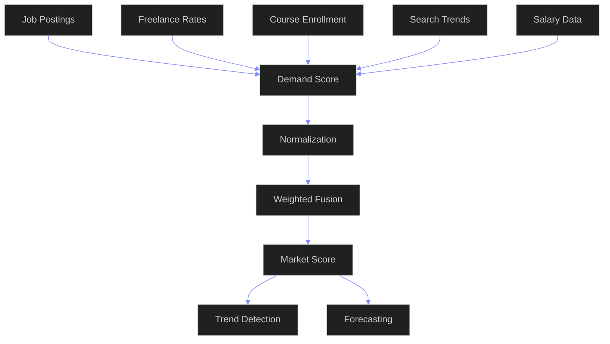

# Skill Market Intelligence — Enterprise Market Intelligence Engine for Skills Economics

---

## Document Control

| Field | Value |
|---|---|
| Document ID | SB-SKILLMKT-ARCH-001 |
| Version | 1.0.0 |
| Status | Active |
| Last Updated | 2026-06-12 |
| Classification | Internal — Architecture Reference |
| Source of Truth | `docs/ai/skills/skills.md` (§17 Skill Market Intelligence, §18 Skill Income Mapping, §19 Skill Analytics, §4 Skill Categories) |
| Companion Docs | `docs/ai/skills/SkillIntelligence.md` (Analytics Engine & Scoring Pipelines) |
|  | `docs/ai/skills/SkillGraphArchitecture.md` (Graph Storage & Traversal) |
|  | `docs/ai/skills/SkillEvidence.md` (Evidence Engine & Verification) |
|  | `docs/ai/skills/SkillAssessment.md` (Assessment Execution Engine) |
| Target Stack | Python 3.11+ (Market Engine) + PostgreSQL (Time-Series) + Redis (Cache) + External API Adapters + FastAPI (API Layer) |
| Target Audience | AI Agents, Data Engineers, Market Analysts, Architects, Product Managers, Career Advisors |

---

## Table of Contents

- [1. Data Sources](#1-data-sources)
- [2. Market Intelligence Architecture](#2-market-intelligence-architecture)
- [3. Demand Scoring Model](#3-demand-scoring-model)
- [4. Growth Scoring Model](#4-growth-scoring-model)
- [5. Salary Intelligence](#5-salary-intelligence)
- [6. Trend Detection](#6-trend-detection)
- [7. Emerging Skill Detection](#7-emerging-skill-detection)
- [8. Forecasting Models](#8-forecasting-models)
- [9. Analytics Dashboards](#9-analytics-dashboards)
- [10. Enterprise KPIs](#10-enterprise-kpis)
- [11. Integration Patterns](#11-integration-patterns)
- [12. Testing Strategy](#12-testing-strategy)
- [13. Error Handling & Recovery](#13-error-handling--recovery)
- [14. Operational Runbooks](#14-operational-runbooks)
- [15. Data Dictionary](#15-data-dictionary)
- [Appendix A: Formula Reference](#appendix-a-formula-reference)
- [Appendix B: Source Adapter Matrix](#appendix-b-source-adapter-matrix)
- [Appendix C: Glossary](#appendix-c-glossary)
- [Appendix D: Dependency Graph](#appendix-d-dependency-graph)
- [Appendix E: Implementation Status](#appendix-e-implementation-status)
- [Appendix F: Configuration Reference](#appendix-f-configuration-reference)

---

## Market Intelligence Pipeline


## Demand Scoring Architecture



---

## 1. Data Sources

### 1.1 Why a Dedicated Market Data Source Architecture?

Skills.md defines the **market intelligence formulas and data model** — what scores exist, how they are computed, and what data sources contribute. SkillMarketIntelligence.md defines the **data source execution engine** — the adapters, pipelines, rate limiters, and reliability layers that transform raw external data into standardized market signals.

The relationship between the five companion documents:

| Document | Role | Analogy |
|---|---|---|
| `skills.md` | Market intelligence data model & formulas | Constitution |
| `SkillIntelligence.md` | Analytics pipelines & scoring execution | Factory |
| `SkillGraphArchitecture.md` | Skill relationship traversal & recommendations | Librarian |
| `SkillEvidence.md` | Evidence collection & verification | Auditor |
| This document (`SkillMarketIntelligence.md`) | Market data ingestion & scoring engine | Market Analyst |

### 1.2 Source Architecture Overview

The data source architecture follows a layered adapter pattern that normalizes heterogeneous external APIs into a unified internal signal format. Three layers:

Layer 1 (Adapters): JobBoardAdapter, FreelanceAdapter, SearchAdapter, CourseAdapter, DeveloperAdapter, SalaryAdapter, IndustryReportAdapter, InternalAggregator
Layer 2 (Normalization): Rate Limiter, Circuit Breaker, Retry Handler, Source Reliability Scorer, Data Normalizer, Schema Validator, Dedup Engine, Staleness Check
Layer 3 (Signal Production): Market Signal Producer, Signal Fusion Engine, Time-Series Builder, Signal Store Cache

### 1.3 Source Adapter Pattern

Every external data source implements the `MarketSourceAdapter` abstract base class.

```python
import time
import hashlib
import asyncio
import bisect
from abc import ABC, abstractmethod
from dataclasses import dataclass, field
from datetime import datetime, timedelta
from typing import Any

@dataclass
class SourceCredentials:
    api_key: str | None = None
    api_secret: str | None = None
    access_token: str | None = None
    refresh_token: str | None = None
    base_url: str | None = None
    extra_headers: dict[str, str] = field(default_factory=dict)

@dataclass
class SourceRateLimit:
    requests_per_minute: int = 60
    requests_per_hour: int = 1000
    requests_per_day: int = 10000
    concurrent_limit: int = 5
    cooldown_seconds: int = 0

@dataclass
class SourceConfig:
    source_id: str
    display_name: str
    category: str
    credentials: SourceCredentials
    rate_limit: SourceRateLimit = field(default_factory=SourceRateLimit)
    retry_max_attempts: int = 3
    retry_base_delay: float = 1.0
    retry_max_delay: float = 60.0
    timeout_seconds: int = 30
    cache_ttl_seconds: int = 3600
    enabled: bool = True

@dataclass
class RawMarketDataPoint:
    source_id: str
    source_type: str
    skill_keywords: list[str]
    metric_name: str
    metric_value: float
    metric_unit: str
    recorded_at: int
    raw_payload: dict
    confidence: float = 0.5
    normalized: bool = False
    ingested_at: int = field(default_factory=lambda: int(time.time() * 1000))

@dataclass
class MarketSignal:
    signal_id: str
    source_id: str
    skill_id: str
    metric_name: str
    metric_value: float
    normalized_value: float
    recorded_at: int
    ingested_at: int
    confidence: float
    source_reliability: float
    staleness_hours: int
    raw_count: int

class MarketSourceAdapter(ABC):
    source_id: str
    source_category: str
    trust_weight: float

    def __init__(self, config: SourceConfig):
        self.config = config
        self.logger = StructuredLogger(f"market.adapter.{self.source_id}")

    @abstractmethod
    async def fetch_raw_data(self, skill_keywords: list[str], reference_date: datetime | None = None) -> list[RawMarketDataPoint]:
        ...

    @abstractmethod
    async def validate_response(self, raw_data: list[RawMarketDataPoint]) -> list[RawMarketDataPoint]:
        ...

    @abstractmethod
    async def normalize(self, raw_data: list[RawMarketDataPoint]) -> list[MarketSignal]:
        ...

    @abstractmethod
    def get_supported_metrics(self) -> list[str]:
        ...

    @abstractmethod
    def estimate_source_reliability(self) -> float:
        ...

class StructuredLogger:
    def __init__(self, name: str):
        self.name = name
    def info(self, msg: str, **kwargs):
        print(f"[INFO] [{self.name}] {msg}", kwargs)
    def error(self, msg: str, **kwargs):
        print(f"[ERROR] [{self.name}] {msg}", kwargs)
    def warning(self, msg: str, **kwargs):
        print(f"[WARN] [{self.name}] {msg}", kwargs)
```

### 1.4 Source Adapter Registry

```python
class SourceAdapterRegistry:
    def __init__(self):
        self.logger = StructuredLogger("market.adapter_registry")
        self._adapters: dict[str, type[MarketSourceAdapter]] = {}
        self._instances: dict[str, MarketSourceAdapter] = {}

    def register(self, source_id: str, adapter_cls: type[MarketSourceAdapter]) -> None:
        self._adapters[source_id] = adapter_cls
        self.logger.info(f"Registered adapter: {source_id}")

    def get_adapter(self, source_id: str) -> MarketSourceAdapter:
        if source_id in self._instances:
            return self._instances[source_id]
        cls = self._adapters.get(source_id)
        if not cls:
            raise ValueError(f"No adapter registered for source: {source_id}")
        config = self._load_config(source_id)
        instance = cls(config)
        self._instances[source_id] = instance
        return instance

    def list_available_sources(self) -> list[dict]:
        result = []
        for source_id, cls in self._adapters.items():
            instance = self.get_adapter(source_id)
            result.append({
                "source_id": source_id, "category": instance.source_category,
                "trust_weight": instance.trust_weight, "metrics": instance.get_supported_metrics(),
                "reliability": instance.estimate_source_reliability(),
            })
        return result

    def _load_config(self, source_id: str) -> SourceConfig:
        raise NotImplementedError("Subclasses must implement config loading")
```

### 1.5 Job Board Adapters

```python
@dataclass
class JobPostingRecord:
    posting_id: str
    title: str
    company: str
    location: str | None
    remote: bool
    skills_required: list[str]
    skills_preferred: list[str]
    salary_min: int | None
    salary_max: int | None
    salary_currency: str
    experience_years_min: int
    experience_years_max: int
    industry: str | None
    posting_date: int
    source: str
    url: str

class LinkedInAdapter(MarketSourceAdapter):
    source_id = "linkedin"
    source_category = "job_board"
    trust_weight = 0.25

    async def fetch_raw_data(self, skill_keywords: list[str], reference_date: datetime | None = None) -> list[RawMarketDataPoint]:
        results: list[RawMarketDataPoint] = []
        for keyword in skill_keywords:
            postings = await self._search_jobs(keyword, reference_date)
            for posting in postings:
                results.append(RawMarketDataPoint(
                    source_id=self.source_id, source_type="job_posting",
                    skill_keywords=[keyword], metric_name="job_posting_count",
                    metric_value=1.0, metric_unit="count", recorded_at=posting.posting_date,
                    raw_payload={"posting_id": posting.posting_id, "title": posting.title,
                        "company": posting.company, "location": posting.location,
                        "salary_min": posting.salary_min, "salary_max": posting.salary_max,
                        "experience_min": posting.experience_years_min, "experience_max": posting.experience_years_max,
                        "remote": posting.remote, "industry": posting.industry},
                    confidence=0.85, normalized=False,
                ))
        return results

    async def _search_jobs(self, keyword: str, reference_date: datetime | None) -> list[JobPostingRecord]:
        raise NotImplementedError("LinkedIn API integration")

    async def validate_response(self, raw_data: list[RawMarketDataPoint]) -> list[RawMarketDataPoint]:
        valid = []
        for point in raw_data:
            if point.metric_value < 0: continue
            if not point.skill_keywords: continue
            if point.recorded_at > int(time.time() * 1000) + 86400000: continue
            valid.append(point)
        return valid

    async def normalize(self, raw_data: list[RawMarketDataPoint]) -> list[MarketSignal]:
        grouped: dict[str, list[RawMarketDataPoint]] = {}
        for point in raw_data:
            key = f"{point.skill_keywords[0]}:{point.metric_name}"
            if key not in grouped: grouped[key] = []
            grouped[key].append(point)
        signals: list[MarketSignal] = []
        for key, points in grouped.items():
            skill_id = key.split(":")[0]
            metric_name = key.split(":")[1]
            total = sum(p.metric_value for p in points)
            avg_confidence = sum(p.confidence for p in points) / len(points)
            latest_ts = max(p.recorded_at for p in points)
            signals.append(MarketSignal(
                signal_id=hashlib.sha256(f"{key}:{latest_ts}".encode()).hexdigest()[:16],
                source_id=self.source_id, skill_id=skill_id,
                metric_name=f"job_{metric_name}", metric_value=total, normalized_value=0.0,
                recorded_at=latest_ts, ingested_at=int(time.time() * 1000),
                confidence=avg_confidence, source_reliability=self.estimate_source_reliability(),
                staleness_hours=0, raw_count=len(points),
            ))
        return signals

    def get_supported_metrics(self) -> list[str]:
        return ["job_posting_count", "salary_min", "salary_max", "remote_fraction"]

    def estimate_source_reliability(self) -> float:
        return 0.80

class IndeedAdapter(MarketSourceAdapter):
    source_id = "indeed"
    source_category = "job_board"
    trust_weight = 0.20

    async def fetch_raw_data(self, skill_keywords: list[str], reference_date: datetime | None = None) -> list[RawMarketDataPoint]:
        results: list[RawMarketDataPoint] = []
        for keyword in skill_keywords:
            postings = await self._search_indeed(keyword, reference_date)
            for posting in postings:
                results.append(RawMarketDataPoint(
                    source_id=self.source_id, source_type="job_posting",
                    skill_keywords=[keyword], metric_name="job_posting_count",
                    metric_value=1.0, metric_unit="count", recorded_at=posting.posting_date,
                    raw_payload={"posting_id": posting.posting_id, "title": posting.title,
                        "company": posting.company, "salary_min": posting.salary_min,
                        "salary_max": posting.salary_max},
                    confidence=0.80, normalized=False,
                ))
        return results

    async def _search_indeed(self, keyword: str, reference_date: datetime | None) -> list[JobPostingRecord]:
        raise NotImplementedError("Indeed API integration")

    async def validate_response(self, raw_data: list[RawMarketDataPoint]) -> list[RawMarketDataPoint]:
        return [d for d in raw_data if d.metric_value >= 0]

    async def normalize(self, raw_data: list[RawMarketDataPoint]) -> list[MarketSignal]:
        grouped: dict[str, list[RawMarketDataPoint]] = {}
        for point in raw_data:
            key = f"{point.skill_keywords[0]}"
            if key not in grouped: grouped[key] = []
            grouped[key].append(point)
        signals: list[MarketSignal] = []
        for skill_id, points in grouped.items():
            total = len(points)
            latest_ts = max(p.recorded_at for p in points)
            signals.append(MarketSignal(
                signal_id=hashlib.sha256(f"indeed:{skill_id}:{latest_ts}".encode()).hexdigest()[:16],
                source_id=self.source_id, skill_id=skill_id, metric_name="job_posting_count",
                metric_value=float(total), normalized_value=0.0, recorded_at=latest_ts,
                ingested_at=int(time.time() * 1000), confidence=0.80,
                source_reliability=self.estimate_source_reliability(), staleness_hours=0, raw_count=total,
            ))
        return signals

    def get_supported_metrics(self) -> list[str]:
        return ["job_posting_count", "salary_min", "salary_max"]

    def estimate_source_reliability(self) -> float:
        return 0.75
```

### 1.6 Freelance Platform Adapters

```python
@dataclass
class FreelanceProject:
    project_id: str
    title: str
    category: str
    skills_required: list[str]
    budget_min: float
    budget_max: float
    budget_type: str
    posted_date: int
    proposal_count: int
    client_rating: float
    platform: str
    duration_days: int | None

class UpworkAdapter(MarketSourceAdapter):
    source_id = "upwork"
    source_category = "freelance"
    trust_weight = 0.15

    async def fetch_raw_data(self, skill_keywords: list[str], reference_date: datetime | None = None) -> list[RawMarketDataPoint]:
        results: list[RawMarketDataPoint] = []
        for keyword in skill_keywords:
            projects = await self._search_upwork(keyword, reference_date)
            total_budget = 0.0
            for project in projects:
                total_budget += project.budget_max if project.budget_max else 0
                results.append(RawMarketDataPoint(
                    source_id=self.source_id, source_type="freelance_project",
                    skill_keywords=[keyword], metric_name="freelance_project_count",
                    metric_value=1.0, metric_unit="count", recorded_at=project.posted_date,
                    raw_payload={"project_id": project.project_id, "title": project.title,
                        "budget_min": project.budget_min, "budget_max": project.budget_max,
                        "proposal_count": project.proposal_count, "duration_days": project.duration_days},
                    confidence=0.80,
                ))
        return results

    async def _search_upwork(self, keyword: str, reference_date: datetime | None) -> list[FreelanceProject]:
        raise NotImplementedError("Upwork API integration")

    async def validate_response(self, raw_data: list[RawMarketDataPoint]) -> list[RawMarketDataPoint]:
        return [d for d in raw_data if d.metric_value >= 0]

    async def normalize(self, raw_data: list[RawMarketDataPoint]) -> list[MarketSignal]:
        signals: list[MarketSignal] = []
        grouped: dict[str, dict[str, list[float]]] = {}
        for point in raw_data:
            key = point.skill_keywords[0]
            if key not in grouped: grouped[key] = {}
            m = point.metric_name
            if m not in grouped[key]: grouped[key][m] = []
            grouped[key][m].append(point.metric_value)
        for skill_id, metrics in grouped.items():
            for metric_name, values in metrics.items():
                total_val = sum(values)
                signals.append(MarketSignal(
                    signal_id=hashlib.sha256(f"upwork:{skill_id}:{metric_name}".encode()).hexdigest()[:16],
                    source_id=self.source_id, skill_id=skill_id, metric_name=metric_name,
                    metric_value=total_val, normalized_value=0.0,
                    recorded_at=int(time.time() * 1000), ingested_at=int(time.time() * 1000),
                    confidence=0.80, source_reliability=self.estimate_source_reliability(),
                    staleness_hours=0, raw_count=len(values),
                ))
        return signals

    def get_supported_metrics(self) -> list[str]:
        return ["freelance_project_count", "freelance_total_budget", "avg_proposal_count", "avg_hourly_rate"]

    def estimate_source_reliability(self) -> float:
        return 0.75
```

### 1.7 Search Trend Adapters

```python
class GoogleTrendsAdapter(MarketSourceAdapter):
    source_id = "google_trends"
    source_category = "search_trend"
    trust_weight = 0.10

    async def fetch_raw_data(self, skill_keywords: list[str], reference_date: datetime | None = None) -> list[RawMarketDataPoint]:
        results: list[RawMarketDataPoint] = []
        for keyword in skill_keywords:
            trend_data = await self._fetch_trends(keyword, reference_date)
            for data_point in trend_data.get("timeline_data", []):
                results.append(RawMarketDataPoint(
                    source_id=self.source_id, source_type="search_volume",
                    skill_keywords=[keyword], metric_name="search_volume",
                    metric_value=float(data_point.get("value", 0)), metric_unit="relative_index",
                    recorded_at=data_point.get("timestamp", int(time.time() * 1000)),
                    raw_payload=data_point, confidence=0.65,
                ))
        return results

    async def _fetch_trends(self, keyword: str, reference_date: datetime | None) -> dict:
        raise NotImplementedError("Google Trends API integration")

    async def validate_response(self, raw_data: list[RawMarketDataPoint]) -> list[RawMarketDataPoint]:
        return [d for d in raw_data if 0 <= d.metric_value <= 100]

    async def normalize(self, raw_data: list[RawMarketDataPoint]) -> list[MarketSignal]:
        grouped: dict[str, list[float]] = {}
        for point in raw_data:
            key = point.skill_keywords[0]
            if key not in grouped: grouped[key] = []
            grouped[key].append(point.metric_value)
        signals: list[MarketSignal] = []
        for skill_id, values in grouped.items():
            avg_volume = sum(values) / len(values) if values else 0.0
            max_volume = max(values) if values else 0.0
            latest_ts = int(time.time() * 1000)
            signals.append(MarketSignal(
                signal_id=hashlib.sha256(f"gtrends:{skill_id}:avg".encode()).hexdigest()[:16],
                source_id=self.source_id, skill_id=skill_id, metric_name="search_volume_avg",
                metric_value=avg_volume, normalized_value=avg_volume / 100.0,
                recorded_at=latest_ts, ingested_at=latest_ts, confidence=0.65,
                source_reliability=self.estimate_source_reliability(), staleness_hours=0, raw_count=len(values),
            ))
        return signals

    def get_supported_metrics(self) -> list[str]:
        return ["search_volume_avg", "search_volume_peak", "search_volume_trend"]

    def estimate_source_reliability(self) -> float:
        return 0.60
```

### 1.8 Developer Platform Adapters

```python
class GitHubAdapter(MarketSourceAdapter):
    source_id = "github"
    source_category = "developer_platform"
    trust_weight = 0.08

    async def fetch_raw_data(self, skill_keywords: list[str], reference_date: datetime | None = None) -> list[RawMarketDataPoint]:
        results: list[RawMarketDataPoint] = []
        for keyword in skill_keywords:
            repos = await self._search_github_repos(keyword, reference_date)
            for repo in repos:
                results.append(RawMarketDataPoint(
                    source_id=self.source_id, source_type="github_repo",
                    skill_keywords=[keyword], metric_name="repo_count", metric_value=1.0, metric_unit="count",
                    recorded_at=repo.get("created_at", int(time.time() * 1000)),
                    raw_payload={"repo_id": repo.get("id"), "name": repo.get("full_name"),
                        "stars": repo.get("stargazers_count", 0), "forks": repo.get("forks_count", 0),
                        "language": repo.get("language"), "topics": repo.get("topics", [])},
                    confidence=0.85,
                ))
                results.append(RawMarketDataPoint(
                    source_id=self.source_id, source_type="github_stars",
                    skill_keywords=[keyword], metric_name="star_count",
                    metric_value=float(repo.get("stargazers_count", 0)), metric_unit="count",
                    recorded_at=repo.get("updated_at", int(time.time() * 1000)),
                    raw_payload={"repo_id": repo.get("id"), "stars": repo.get("stargazers_count")},
                    confidence=0.90,
                ))
        return results

    async def _search_github_repos(self, keyword: str, reference_date: datetime | None) -> list[dict]:
        raise NotImplementedError("GitHub API integration")

    async def validate_response(self, raw_data: list[RawMarketDataPoint]) -> list[RawMarketDataPoint]:
        return [d for d in raw_data if d.metric_value >= 0]

    async def normalize(self, raw_data: list[RawMarketDataPoint]) -> list[MarketSignal]:
        signals: list[MarketSignal] = []
        grouped: dict[str, dict[str, list[float]]] = {}
        for point in raw_data:
            key = point.skill_keywords[0]
            if key not in grouped: grouped[key] = {}
            m = point.metric_name
            if m not in grouped[key]: grouped[key][m] = []
            grouped[key][m].append(point.metric_value)
        for skill_id, metrics in grouped.items():
            for metric_name, values in metrics.items():
                total = sum(values)
                signals.append(MarketSignal(
                    signal_id=hashlib.sha256(f"github:{skill_id}:{metric_name}".encode()).hexdigest()[:16],
                    source_id=self.source_id, skill_id=skill_id, metric_name=f"github_{metric_name}",
                    metric_value=total, normalized_value=0.0,
                    recorded_at=int(time.time() * 1000), ingested_at=int(time.time() * 1000),
                    confidence=0.85, source_reliability=self.estimate_source_reliability(),
                    staleness_hours=0, raw_count=len(values),
                ))
        return signals

    def get_supported_metrics(self) -> list[str]:
        return ["github_repo_count", "github_star_count", "github_fork_count", "github_language_distribution"]

    def estimate_source_reliability(self) -> float:
        return 0.85
```

### 1.9 Industry Report & Salary Data Adapters

```python
class IndustryReportAdapter(MarketSourceAdapter):
    source_id = "industry_reports"
    source_category = "industry_research"
    trust_weight = 0.15

    def __init__(self, config: SourceConfig):
        super().__init__(config)
        self.report_sources = {
            "gartner": self._parse_gartner_report,
            "lightcast": self._parse_lightcast_data,
            "onet": self._parse_onet_data,
        }

    async def fetch_raw_data(self, skill_keywords: list[str], reference_date: datetime | None = None) -> list[RawMarketDataPoint]:
        results: list[RawMarketDataPoint] = []
        for keyword in skill_keywords:
            for source_name, parser in self.report_sources.items():
                records = await parser(keyword, reference_date)
                results.extend(records)
        return results

    async def _parse_gartner_report(self, keyword: str, reference_date: datetime | None) -> list[RawMarketDataPoint]:
        raise NotImplementedError("Gartner report ingestion")

    async def _parse_lightcast_data(self, keyword: str, reference_date: datetime | None) -> list[RawMarketDataPoint]:
        raise NotImplementedError("Lightcast API integration")

    async def _parse_onet_data(self, keyword: str, reference_date: datetime | None) -> list[RawMarketDataPoint]:
        raise NotImplementedError("O*NET API integration")

    async def validate_response(self, raw_data: list[RawMarketDataPoint]) -> list[RawMarketDataPoint]:
        return [d for d in raw_data if d.metric_value >= 0]

    async def normalize(self, raw_data: list[RawMarketDataPoint]) -> list[MarketSignal]:
        signals: list[MarketSignal] = []
        for point in raw_data:
            signals.append(MarketSignal(
                signal_id=hashlib.sha256(f"ind_report:{point.skill_keywords[0]}:{point.metric_name}:{point.recorded_at}".encode()).hexdigest()[:16],
                source_id=f"{self.source_id}", skill_id=point.skill_keywords[0],
                metric_name=point.metric_name, metric_value=point.metric_value, normalized_value=0.0,
                recorded_at=point.recorded_at, ingested_at=int(time.time() * 1000), confidence=0.85,
                source_reliability=self.estimate_source_reliability(), staleness_hours=0, raw_count=1,
            ))
        return signals

    def get_supported_metrics(self) -> list[str]:
        return ["hype_cycle_phase", "market_maturity", "adoption_rate", "job_growth_projection", "median_wage", "employment_count"]

    def estimate_source_reliability(self) -> float:
        return 0.85

class SalaryDataAdapter(MarketSourceAdapter):
    source_id = "salary_data"
    source_category = "compensation"
    trust_weight = 0.12

    def __init__(self, config: SourceConfig):
        super().__init__(config)
        self.salary_sources = {"levelsfyi": self._fetch_levelsfyi, "blind": self._fetch_blind}

    async def fetch_raw_data(self, skill_keywords: list[str], reference_date: datetime | None = None) -> list[RawMarketDataPoint]:
        results: list[RawMarketDataPoint] = []
        for keyword in skill_keywords:
            for source_name, fetcher in self.salary_sources.items():
                records = await fetcher(keyword, reference_date)
                results.extend(records)
        return results

    async def _fetch_levelsfyi(self, keyword: str, reference_date: datetime | None) -> list[RawMarketDataPoint]:
        raise NotImplementedError("Levels.fyi data integration")

    async def _fetch_blind(self, keyword: str, reference_date: datetime | None) -> list[RawMarketDataPoint]:
        raise NotImplementedError("Blind data integration")

    async def validate_response(self, raw_data: list[RawMarketDataPoint]) -> list[RawMarketDataPoint]:
        valid = []
        for point in raw_data:
            if point.metric_value < 0: continue
            if point.metric_name == "salary" and point.metric_value < 10000: continue
            if point.metric_name == "salary" and point.metric_value > 5000000: continue
            valid.append(point)
        return valid

    async def normalize(self, raw_data: list[RawMarketDataPoint]) -> list[MarketSignal]:
        signals: list[MarketSignal] = []
        grouped: dict[str, dict[str, list[float]]] = {}
        for point in raw_data:
            key = point.skill_keywords[0]
            if key not in grouped: grouped[key] = {}
            m = point.metric_name
            if m not in grouped[key]: grouped[key][m] = []
            grouped[key][m].append(point.metric_value)
        for skill_id, metrics in grouped.items():
            for metric_name, values in metrics.items():
                sorted_vals = sorted(values)
                n = len(sorted_vals)
                p10 = sorted_vals[n // 10] if n >= 10 else (sorted_vals[0] if n > 0 else 0)
                p25 = sorted_vals[n // 4] if n >= 4 else (sorted_vals[0] if n > 0 else 0)
                p50 = sorted_vals[n // 2] if n >= 2 else (sorted_vals[0] if n > 0 else 0)
                p75 = sorted_vals[3 * n // 4] if n >= 4 else (sorted_vals[-1] if n > 0 else 0)
                p90 = sorted_vals[9 * n // 10] if n >= 10 else (sorted_vals[-1] if n > 0 else 0)
                avg = sum(values) / n if n > 0 else 0
                for percentile_name, val in [("p10", p10), ("p25", p25), ("p50", p50), ("p75", p75), ("p90", p90), ("avg", avg)]:
                    signals.append(MarketSignal(
                        signal_id=hashlib.sha256(f"salary:{skill_id}:{metric_name}:{percentile_name}".encode()).hexdigest()[:16],
                        source_id=self.source_id, skill_id=skill_id,
                        metric_name=f"salary_{metric_name}_{percentile_name}", metric_value=val, normalized_value=0.0,
                        recorded_at=int(time.time() * 1000), ingested_at=int(time.time() * 1000),
                        confidence=0.75, source_reliability=self.estimate_source_reliability(),
                        staleness_hours=0, raw_count=n,
                    ))
        return signals

    def get_supported_metrics(self) -> list[str]:
        return ["salary_base", "salary_bonus", "salary_equity", "salary_total", "hourly_rate"]

    def estimate_source_reliability(self) -> float:
        return 0.70
```

### 1.10 Internal Aggregated Data & Reliability Scoring

```python
class InternalAggregator(MarketSourceAdapter):
    source_id = "internal_aggregated"
    source_category = "internal"
    trust_weight = 0.05

    async def fetch_raw_data(self, skill_keywords: list[str], reference_date: datetime | None = None) -> list[RawMarketDataPoint]:
        results: list[RawMarketDataPoint] = []
        aggregate = await self._query_skill_distribution(skill_keywords, reference_date)
        for keyword in skill_keywords:
            skill_data = aggregate.get(keyword, {})
            if skill_data.get("user_count", 0) < 10: continue
            results.append(RawMarketDataPoint(source_id=self.source_id, source_type="internal_skill_distribution",
                skill_keywords=[keyword], metric_name="user_count_with_skill",
                metric_value=float(skill_data["user_count"]), metric_unit="count",
                recorded_at=int(time.time() * 1000), raw_payload=skill_data, confidence=0.60,
            ))
            if skill_data.get("avg_level"):
                results.append(RawMarketDataPoint(source_id=self.source_id, source_type="internal_skill_distribution",
                    skill_keywords=[keyword], metric_name="avg_user_level",
                    metric_value=float(skill_data["avg_level"]), metric_unit="level",
                    recorded_at=int(time.time() * 1000), raw_payload=skill_data, confidence=0.55,
                ))
        return results

    async def _query_skill_distribution(self, keywords: list[str], reference_date: datetime | None) -> dict:
        raise NotImplementedError("Internal analytics database integration")

    async def validate_response(self, raw_data: list[RawMarketDataPoint]) -> list[RawMarketDataPoint]:
        return [d for d in raw_data if d.metric_value >= 0]

    async def normalize(self, raw_data: list[RawMarketDataPoint]) -> list[MarketSignal]:
        signals: list[MarketSignal] = []
        for point in raw_data:
            signals.append(MarketSignal(
                signal_id=hashlib.sha256(f"internal:{point.skill_keywords[0]}:{point.metric_name}".encode()).hexdigest()[:16],
                source_id=self.source_id, skill_id=point.skill_keywords[0],
                metric_name=f"internal_{point.metric_name}", metric_value=point.metric_value, normalized_value=0.0,
                recorded_at=point.recorded_at, ingested_at=int(time.time() * 1000),
                confidence=point.confidence, source_reliability=self.estimate_source_reliability(),
                staleness_hours=0, raw_count=1,
            ))
        return signals

    def get_supported_metrics(self) -> list[str]:
        return ["internal_user_count_with_skill", "internal_avg_user_level", "internal_median_user_salary", "internal_learning_velocity"]

    def estimate_source_reliability(self) -> float:
        return 0.50

@dataclass
class SourceReliabilityMetrics:
    source_id: str
    uptime_pct: float
    avg_response_time_ms: float
    data_freshness_hours: float
    coverage_accuracy: float
    historical_accuracy: float
    staleness_threshold_hours: int
    last_failure_reason: str | None
    consecutive_failures: int

class SourceReliabilityScorer:
    BASE_WEIGHTS = {"uptime": 0.25, "freshness": 0.25, "coverage": 0.20, "historical_accuracy": 0.20, "response_time": 0.10}
    STALENESS_PENALTY = {0: 0.0, 1: 0.05, 6: 0.10, 12: 0.20, 24: 0.35, 48: 0.50, 72: 0.65, 168: 0.80}
    FAILURE_PENALTY_PER_CONCURRENT = 0.10

    def __init__(self):
        self.logger = StructuredLogger("market.reliability_scorer")
        self._metrics_store: dict[str, SourceReliabilityMetrics] = {}

    async def compute_score(self, source_id: str) -> float:
        metrics = await self._load_metrics(source_id)
        if not metrics: return 0.50
        uptime_score = metrics.uptime_pct / 100.0
        freshness_penalty = self._compute_freshness_penalty(metrics.data_freshness_hours)
        freshness_score = max(0.0, 1.0 - freshness_penalty)
        coverage_score = metrics.coverage_accuracy
        accuracy_score = metrics.historical_accuracy
        rt_normalized = max(0.0, 1.0 - (metrics.avg_response_time_ms / 5000.0))
        raw_score = (self.BASE_WEIGHTS["uptime"] * uptime_score + self.BASE_WEIGHTS["freshness"] * freshness_score
            + self.BASE_WEIGHTS["coverage"] * coverage_score + self.BASE_WEIGHTS["historical_accuracy"] * accuracy_score
            + self.BASE_WEIGHTS["response_time"] * rt_normalized)
        failure_penalty = min(0.50, metrics.consecutive_failures * self.FAILURE_PENALTY_PER_CONCURRENT)
        return max(0.0, min(1.0, raw_score - failure_penalty))

    def _compute_freshness_penalty(self, staleness_hours: float) -> float:
        thresholds = sorted(self.STALENESS_PENALTY.keys())
        penalty = 0.0
        for threshold in thresholds:
            if staleness_hours >= threshold: penalty = self.STALENESS_PENALTY[threshold]
            else: break
        return penalty

    async def record_failure(self, source_id: str, reason: str) -> None:
        self.logger.warning(f"Source failure recorded: {source_id} - {reason}")

    async def record_success(self, source_id: str, response_time_ms: float) -> None:
        pass

    async def _load_metrics(self, source_id: str) -> SourceReliabilityMetrics | None:
        return self._metrics_store.get(source_id)

    async def _store_metrics(self, source_id: str, metrics: SourceReliabilityMetrics) -> None:
        self._metrics_store[source_id] = metrics
```

### 1.11 Data Ingestion Pipeline

```python
@dataclass
class IngestionPipelineConfig:
    max_concurrent_sources: int = 5
    batch_size: int = 50
    flush_interval_seconds: int = 60
    retry_max_attempts: int = 3
    circuit_breaker_threshold: int = 5
    circuit_breaker_reset_seconds: int = 300
    enable_dedup: bool = True
    dedup_window_hours: int = 24

class RateLimiter:
    def __init__(self, config: SourceRateLimit):
        self.config = config
        self._tokens: dict[str, float] = {}
        self._last_refill: dict[str, float] = {}

    async def acquire(self, source_id: str) -> bool:
        now = time.time()
        refill_rate = self.config.requests_per_minute / 60.0
        last_refill = self._last_refill.get(source_id, now)
        elapsed = now - last_refill
        current_tokens = min(self._tokens.get(source_id, self.config.concurrent_limit),
            self.config.concurrent_limit + elapsed * refill_rate)
        if current_tokens >= 1.0:
            self._tokens[source_id] = current_tokens - 1.0
            self._last_refill[source_id] = now
            return True
        return False

    async def wait_and_acquire(self, source_id: str, timeout: float = 30.0) -> bool:
        deadline = time.time() + timeout
        while time.time() < deadline:
            if await self.acquire(source_id): return True
            await asyncio.sleep(0.1)
        return False

class CircuitBreaker:
    STATE_CLOSED = "closed"
    STATE_OPEN = "open"
    STATE_HALF_OPEN = "half_open"

    def __init__(self, threshold: int = 5, reset_seconds: int = 300):
        self.threshold = threshold
        self.reset_seconds = reset_seconds
        self.state: dict[str, str] = {}
        self.failure_count: dict[str, int] = {}
        self.last_failure_time: dict[str, float] = {}

    def is_allowed(self, source_id: str) -> bool:
        now = time.time()
        state = self.state.get(source_id, self.STATE_CLOSED)
        if state == self.STATE_CLOSED: return True
        if state == self.STATE_OPEN:
            if now - self.last_failure_time.get(source_id, 0) > self.reset_seconds:
                self.state[source_id] = self.STATE_HALF_OPEN
                return True
            return False
        return True

    def record_success(self, source_id: str) -> None:
        self.failure_count[source_id] = 0
        self.state[source_id] = self.STATE_CLOSED

    def record_failure(self, source_id: str) -> None:
        self.failure_count[source_id] = self.failure_count.get(source_id, 0) + 1
        self.last_failure_time[source_id] = time.time()
        if self.failure_count[source_id] >= self.threshold:
            self.state[source_id] = self.STATE_OPEN

class IngestionOrchestrator:
    def __init__(self, config: IngestionPipelineConfig, registry: SourceAdapterRegistry,
            reliability_scorer: SourceReliabilityScorer, rate_limiter: RateLimiter,
            circuit_breaker: CircuitBreaker):
        self.config = config
        self.registry = registry
        self.reliability_scorer = reliability_scorer
        self.rate_limiter = rate_limiter
        self.circuit_breaker = circuit_breaker
        self.logger = StructuredLogger("market.ingestion_orchestrator")
        self._signal_buffer: list[MarketSignal] = []
        self._last_flush: float = time.time()

    async def ingest_for_skills(self, skill_ids: list[str]) -> dict[str, list[MarketSignal]]:
        results: dict[str, list[MarketSignal]] = {}
        sources = self.registry.list_available_sources()
        semaphore = asyncio.Semaphore(self.config.max_concurrent_sources)

        async def ingest_source(source_info: dict):
            source_id = source_info["source_id"]
            if not self.circuit_breaker.is_allowed(source_id):
                self.logger.warning(f"Circuit breaker open for source: {source_id}")
                return
            try:
                adapter = self.registry.get_adapter(source_id)
                allowed = await self.rate_limiter.wait_and_acquire(source_id)
                if not allowed:
                    self.logger.warning(f"Rate limited: {source_id}")
                    return
                start = time.time()
                raw_data = await adapter.fetch_raw_data(skill_ids)
                validated = await adapter.validate_response(raw_data)
                signals = await adapter.normalize(validated)
                elapsed_ms = (time.time() - start) * 1000
                self.reliability_scorer.record_success(source_id, elapsed_ms)
                self.circuit_breaker.record_success(source_id)
                results[source_id] = signals
                self._signal_buffer.extend(signals)
                self.logger.info(f"Ingested {len(signals)} signals from {source_id} ({elapsed_ms:.0f}ms)")
            except Exception as e:
                await self.reliability_scorer.record_failure(source_id, str(e))
                self.circuit_breaker.record_failure(source_id)
                self.logger.error(f"Failed to ingest from {source_id}: {e}")

        tasks = [ingest_source(s) for s in sources if s.get("source_id")]
        await asyncio.gather(*tasks)
        return results

    async def ingest_single(self, skill_id: str) -> dict[str, list[MarketSignal]]:
        return await self.ingest_for_skills([skill_id])

    async def ingest_batch(self, skill_ids: list[str]) -> dict[str, list[MarketSignal]]:
        batches = [skill_ids[i:i + self.config.batch_size] for i in range(0, len(skill_ids), self.config.batch_size)]
        all_results: dict[str, list[MarketSignal]] = {}
        for batch in batches:
            results = await self.ingest_for_skills(batch)
            for source_id, signals in results.items():
                if source_id not in all_results: all_results[source_id] = []
                all_results[source_id].extend(signals)
        return all_results
```

### 1.12 Deduplication Engine

```python
@dataclass
class DedupConfig:
    window_hours: int = 24
    similarity_threshold: float = 0.85
    enable_url_dedup: bool = True
    enable_title_company_dedup: bool = True
    enable_skill_fingerprint_dedup: bool = True

class DataDedupEngine:
    def __init__(self, config: DedupConfig):
        self.config = config
        self.logger = StructuredLogger("market.dedup_engine")
        self._seen_fingerprints: dict[str, int] = {}

    async def dedup(self, raw_data: list[RawMarketDataPoint]) -> list[RawMarketDataPoint]:
        unique: list[RawMarketDataPoint] = []
        now = int(time.time() * 1000)
        window_ms = self.config.window_hours * 3600 * 1000
        for point in raw_data:
            fingerprint = self._compute_fingerprint(point)
            last_seen = self._seen_fingerprints.get(fingerprint, 0)
            if (now - last_seen) < window_ms: continue
            self._seen_fingerprints[fingerprint] = now
            unique.append(point)
        self.logger.info(f"Dedup: {len(raw_data)} -> {len(unique)} ({len(raw_data) - len(unique)} removed)")
        return unique

    def _compute_fingerprint(self, point: RawMarketDataPoint) -> str:
        parts = [point.source_type, point.metric_name]
        payload = point.raw_payload
        if self.config.enable_url_dedup and "url" in payload:
            parts.append(str(payload["url"]))
        if self.config.enable_title_company_dedup:
            parts.append(f"{payload.get('title','')}|{payload.get('company','')}|{payload.get('posting_id','')}")
        if self.config.enable_skill_fingerprint_dedup:
            parts.append(str(hash(frozenset(point.skill_keywords))))
        return hashlib.sha256("::".join(parts).encode()).hexdigest()
```

---

## 2. Market Intelligence Architecture

### 2.1 Why a Dedicated Market Intelligence Engine?

Skills.md defines the **formulas and data model** for market intelligence. This document defines the **execution architecture** - the pipelines, fusion engine, temporal alignment, and intelligence layer that produce those scores from raw market data.

### 2.2 Three-Layer Architecture

The market intelligence system operates as three layers:

**Layer 1 - Ingestion**: Raw data from adapters -> Validation -> Dedup -> Normalization -> RawSignal Store. Frequency: Every 6 hours (job boards), 24 hours (courses), 1 hour (developer platforms), 7 days (reports).

**Layer 2 - Processing**: Signal Fusion -> Temporal Alignment -> Interpolation -> Smoothing -> ProcessedSignal Store (PostgreSQL + Redis). Frequency: Every ingestion cycle (incremental).

**Layer 3 - Intelligence**: Score Computation -> Trend Detection -> Forecasting -> Alerting -> Intelligence Store (PostgreSQL + Materialized Views). Frequency: On-demand + scheduled (every 6 hours).

### 2.3 Ingestion Layer

```python
@dataclass
class IngestionCycleResult:
    cycle_id: str
    started_at: int
    completed_at: int
    duration_ms: float
    sources_queried: int
    signals_collected: int
    skill_ids: list[str]
    status: str

class IngestionLayer:
    def __init__(self, orchestrator: IngestionOrchestrator, dedup_engine: DataDedupEngine, signal_store: "SignalStore"):
        self.orchestrator = orchestrator
        self.dedup_engine = dedup_engine
        self.signal_store = signal_store
        self.logger = StructuredLogger("market.ingestion_layer")

    async def run_cycle(self, skill_ids: list[str]) -> IngestionCycleResult:
        start_time = time.time()
        raw_results = await self.orchestrator.ingest_for_skills(skill_ids)
        all_signals: list[MarketSignal] = []
        for source_signals in raw_results.values():
            all_signals.extend(source_signals)
        await self.signal_store.store_raw_signals(all_signals)
        total_raw = sum(len(v) for v in raw_results.values())
        return IngestionCycleResult(
            cycle_id=hashlib.sha256(f"cycle:{time.time()}".encode()).hexdigest()[:16],
            started_at=int(start_time * 1000), completed_at=int(time.time() * 1000),
            duration_ms=(time.time() - start_time) * 1000, sources_queried=len(raw_results),
            signals_collected=total_raw, skill_ids=skill_ids, status="completed",
        )
```

### 2.4 Processing Layer

```python
@dataclass
class ProcessingResult:
    skill_ids: list[str]
    raw_signal_count: int
    fused_signal_count: int
    output_signal_count: int
    completed_at: datetime

class ProcessingLayer:
    def __init__(self, fusion_engine: "DataFusionEngine", temporal_aligner: "TemporalAligner", signal_store: "SignalStore"):
        self.fusion_engine = fusion_engine
        self.temporal_aligner = temporal_aligner
        self.signal_store = signal_store
        self.logger = StructuredLogger("market.processing_layer")

    async def process(self, skill_ids: list[str], reference_date: datetime | None = None) -> ProcessingResult:
        raw_signals = await self.signal_store.get_raw_signals(skill_ids, since=reference_date or (datetime.utcnow() - timedelta(days=365)))
        fused = await self.fusion_engine.fuse(raw_signals)
        aligned = await self.temporal_aligner.align(fused, reference_date or datetime.utcnow())
        await self.signal_store.store_processed_signals(aligned)
        return ProcessingResult(skill_ids=skill_ids, raw_signal_count=len(raw_signals),
            fused_signal_count=len(fused), output_signal_count=len(aligned), completed_at=datetime.utcnow())
```

### 2.5 Intelligence Layer

```python
@dataclass
class SkillHealth:
    value: float
    label: str
    components: dict[str, float]

@dataclass
class SkillIntelligenceReport:
    skill_id: str
    demand_score: "DemandScore"
    growth_score: "GrowthScore"
    salary_score: "SalaryScore"
    skill_health: SkillHealth
    trend_analysis: "TrendAnalysis"
    emerging_signals: "EmergingSignals"
    forecast: "SkillForecast"
    computed_at: datetime

class IntelligenceLayer:
    def __init__(self, demand_scorer: "DemandScorer", growth_scorer: "GrowthScorer",
            salary_intelligence: "SalaryIntelligenceEngine", trend_detector: "TrendDetector",
            emerging_detector: "EmergingSkillDetector", forecasting_engine: "ForecastingEngine",
            kpi_engine: "KPIEngine", signal_store: "SignalStore"):
        self.demand_scorer = demand_scorer
        self.growth_scorer = growth_scorer
        self.salary_intelligence = salary_intelligence
        self.trend_detector = trend_detector
        self.emerging_detector = emerging_detector
        self.forecasting_engine = forecasting_engine
        self.kpi_engine = kpi_engine
        self.signal_store = signal_store
        self.logger = StructuredLogger("market.intelligence_layer")

    async def compute_full_intelligence(self, skill_ids: list[str]) -> dict[str, SkillIntelligenceReport]:
        processed = await self.signal_store.get_processed_signals(skill_ids)
        reports: dict[str, SkillIntelligenceReport] = {}
        for skill_id in skill_ids:
            skill_signals = [s for s in processed if s.skill_id == skill_id]
            if not skill_signals: continue
            demand = await self.demand_scorer.compute(skill_id, skill_signals)
            growth = await self.growth_scorer.compute(skill_id, skill_signals)
            salary = await self.salary_intelligence.compute(skill_id, skill_signals)
            trend = await self.trend_detector.analyze(skill_id, skill_signals)
            emerging = await self.emerging_detector.detect(skill_id, skill_signals)
            forecast = await self.forecasting_engine.forecast(skill_id, skill_signals)
            health = self._compute_skill_health(demand, growth, salary)
            reports[skill_id] = SkillIntelligenceReport(skill_id=skill_id, demand_score=demand,
                growth_score=growth, salary_score=salary, skill_health=health,
                trend_analysis=trend, emerging_signals=emerging, forecast=forecast, computed_at=datetime.utcnow())
        return reports

    def _compute_skill_health(self, demand: "DemandScore", growth: "GrowthScore", salary: "SalaryScore") -> SkillHealth:
        health_raw = demand.value * 0.30 + growth.value * 0.20 + salary.value * 0.25
        label = "excellent" if health_raw >= 80 else "good" if health_raw >= 60 else "fair" if health_raw >= 40 else "weak" if health_raw >= 20 else "poor"
        return SkillHealth(value=min(100.0, max(0.0, health_raw)), label=label, components={"demand": demand.value, "growth": growth.value, "salary": salary.value})
```

### 2.6 Data Fusion Engine

```python
@dataclass
class FusionConfig:
    enable_outlier_removal: bool = True
    outlier_std_threshold: float = 2.5
    min_sources_for_fusion: int = 2
    source_weight_adjustment_enabled: bool = True
    staleness_penalty_enabled: bool = True

class DataFusionEngine:
    def __init__(self, config: FusionConfig):
        self.config = config
        self.logger = StructuredLogger("market.fusion_engine")

    async def fuse(self, signals: list[MarketSignal]) -> list[MarketSignal]:
        grouped: dict[str, list[MarketSignal]] = {}
        for sig in signals:
            key = f"{sig.skill_id}:{sig.metric_name}"
            if key not in grouped: grouped[key] = []
            grouped[key].append(sig)
        fused: list[MarketSignal] = []
        for key, group in grouped.items():
            if len(group) < self.config.min_sources_for_fusion:
                fused.extend(group)
                continue
            if self.config.enable_outlier_removal:
                group = self._remove_outliers(group)
            weighted_values: list[float] = []
            total_weight = 0.0
            for sig in group:
                weight = sig.source_reliability * sig.confidence
                if self.config.staleness_penalty_enabled:
                    weight *= self._staleness_multiplier(sig.staleness_hours)
                weighted_values.append(sig.metric_value * weight)
                total_weight += weight
            if total_weight == 0: continue
            fused_value = sum(weighted_values) / total_weight
            avg_confidence = sum(s.confidence for s in group) / len(group)
            max_reliability = max(s.source_reliability for s in group)
            latest_ts = max(s.recorded_at for s in group)
            fused.append(MarketSignal(
                signal_id=hashlib.sha256(f"fused:{key}:{latest_ts}".encode()).hexdigest()[:16],
                source_id="fusion_engine", skill_id=group[0].skill_id, metric_name=group[0].metric_name,
                metric_value=fused_value, normalized_value=0.0, recorded_at=latest_ts,
                ingested_at=int(time.time() * 1000), confidence=avg_confidence,
                source_reliability=max_reliability, staleness_hours=0, raw_count=len(group),
            ))
        return fused

    def _remove_outliers(self, signals: list[MarketSignal]) -> list[MarketSignal]:
        values = [s.metric_value for s in signals]
        n = len(values)
        if n < 4: return signals
        mean_val = sum(values) / n
        variance = sum((v - mean_val) ** 2 for v in values) / n
        std_dev = variance ** 0.5
        if std_dev == 0: return signals
        threshold = self.config.outlier_std_threshold * std_dev
        return [s for s in signals if abs(s.metric_value - mean_val) <= threshold]

    def _staleness_multiplier(self, staleness_hours: int) -> float:
        if staleness_hours <= 1: return 1.0
        if staleness_hours <= 6: return 0.95
        if staleness_hours <= 24: return 0.85
        if staleness_hours <= 72: return 0.70
        if staleness_hours <= 168: return 0.50
        return 0.30
```

### 2.7 Temporal Alignment Engine

```python
@dataclass
class TemporalAlignmentConfig:
    target_granularity: str = "daily"
    interpolation_method: str = "linear"
    max_gap_days: int = 30

class TemporalAligner:
    GRANULARITY_MS = {"hourly": 3600 * 1000, "daily": 86400 * 1000, "weekly": 604800 * 1000, "monthly": 2592000 * 1000}

    def __init__(self, config: TemporalAlignmentConfig):
        self.config = config
        self.logger = StructuredLogger("market.temporal_aligner")

    async def align(self, signals: list[MarketSignal], reference_date: datetime) -> list[MarketSignal]:
        grouped: dict[str, dict[int, list[MarketSignal]]] = {}
        for sig in signals:
            key = f"{sig.skill_id}:{sig.metric_name}"
            if key not in grouped: grouped[key] = {}
            bucketed = self._assign_time_bucket(sig)
            if bucketed not in grouped[key]: grouped[key][bucketed] = []
            grouped[key][bucketed].append(sig)
        aligned: list[MarketSignal] = []
        for key, bucket_map in grouped.items():
            for bucket_ts, bucket_signals in bucket_map.items():
                values = [s.metric_value for s in bucket_signals]
                weights = [s.source_reliability * s.confidence for s in bucket_signals]
                total_weight = sum(weights) or 1.0
                weighted_avg = sum(v * w for v, w in zip(values, weights)) / total_weight
                avg_conf = sum(s.confidence for s in bucket_signals) / len(bucket_signals)
                rep = bucket_signals[0]
                aligned.append(MarketSignal(
                    signal_id=hashlib.sha256(f"aligned:{key}:{bucket_ts}".encode()).hexdigest()[:16],
                    source_id="temporal_aligner", skill_id=rep.skill_id, metric_name=rep.metric_name,
                    metric_value=weighted_avg, normalized_value=0.0, recorded_at=bucket_ts,
                    ingested_at=int(time.time() * 1000), confidence=avg_conf,
                    source_reliability=max(s.source_reliability for s in bucket_signals),
                    staleness_hours=0, raw_count=len(bucket_signals),
                ))
        return aligned

    def _assign_time_bucket(self, signal: MarketSignal) -> int:
        bucket_ms = self.GRANULARITY_MS.get(self.config.target_granularity, 86400 * 1000)
        return (signal.recorded_at // bucket_ms) * bucket_ms
```

### 2.8 Market Data Schema

```python
@dataclass
class MarketTimeSeries:
    series_id: str
    skill_id: str
    metric_name: str
    granularity: str
    data_points: list["TimeSeriesPoint"]
    created_at: int
    updated_at: int

    @property
    def latest_value(self) -> float | None:
        if not self.data_points: return None
        return max(self.data_points, key=lambda p: p.timestamp).value

    @property
    def avg_value(self) -> float:
        if not self.data_points: return 0.0
        return sum(p.value for p in self.data_points) / len(self.data_points)

    @property
    def trend_direction(self) -> str:
        if len(self.data_points) < 2: return "stable"
        mid = len(self.data_points) // 2
        first = sum(p.value for p in self.data_points[:mid]) / mid
        second = sum(p.value for p in self.data_points[mid:]) / (len(self.data_points) - mid)
        diff = second - first
        if diff > 0.05 * abs(first): return "up"
        if diff < -0.05 * abs(first): return "down"
        return "stable"

@dataclass
class TimeSeriesPoint:
    timestamp: int
    value: float
    confidence: float
    source_count: int
```

### 2.9 Cache Strategy

```python
class MarketDataCache:
    def __init__(self, redis_uri: str, postgres_uri: str):
        self.redis_uri = redis_uri
        self.postgres_uri = postgres_uri
        self._memory_cache: dict[str, tuple[Any, float]] = {}
        self.logger = StructuredLogger("market.cache")

    async def get(self, key: str, max_age_seconds: int = 300) -> Any | None:
        now = time.time()
        mem_entry = self._memory_cache.get(key)
        if mem_entry and (now - mem_entry[1]) < max_age_seconds:
            return mem_entry[0]
        redis_val = await self._get_redis(key)
        if redis_val is not None:
            self._memory_cache[key] = (redis_val, now)
            return redis_val
        return None

    async def set(self, key: str, value: Any, ttl_seconds: int = 3600) -> None:
        self._memory_cache[key] = (value, time.time())
        await self._set_redis(key, value, ttl_seconds)

    async def invalidate(self, key: str) -> None:
        self._memory_cache.pop(key, None)
        await self._delete_redis(key)

    async def invalidate_pattern(self, pattern: str) -> None:
        keys_to_delete = [k for k in self._memory_cache if pattern in k]
        for k in keys_to_delete: self._memory_cache.pop(k, None)
        await self._delete_redis_pattern(pattern)

    async def _get_redis(self, key: str) -> Any | None: raise NotImplementedError("Redis integration")
    async def _set_redis(self, key: str, value: Any, ttl: int) -> None: raise NotImplementedError("Redis integration")
    async def _delete_redis(self, key: str) -> None: raise NotImplementedError("Redis integration")
    async def _delete_redis_pattern(self, pattern: str) -> None: raise NotImplementedError("Redis integration")
```

### 2.10 Graceful Degradation

```python
class GracefulDegradationPolicy:
    FALLBACK_CHAINS: dict[str, list[str]] = {
        "demand_score": ["compute_from_available_sources", "use_cached_value", "use_category_average", "return_default"],
        "growth_score": ["compute_from_available_sources", "use_cached_value", "use_category_average", "return_default"],
        "salary_score": ["use_multiple_sources", "use_cached_value", "use_category_average", "return_default"],
        "trend_detection": ["compute_available", "use_cached_trend", "return_empty"],
        "forecast": ["compute_available", "use_cached_forecast", "return_none"],
        "emerging_detection": ["compute_available", "return_empty"],
    }
    DEFAULT_VALUES: dict[str, float] = {"demand_score": 50.0, "growth_score": 0.0, "salary_score": 50.0, "competition_score": 50.0, "future_relevance": 50.0}

    @classmethod
    def get_fallback_chain(cls, computation_type: str) -> list[str]:
        return cls.FALLBACK_CHAINS.get(computation_type, ["use_cached_value", "return_default"])

    @classmethod
    def get_default_value(cls, score_type: str) -> float:
        return cls.DEFAULT_VALUES.get(score_type, 50.0)

class ComputationFallbackHandler:
    def __init__(self, cache: MarketDataCache):
        self.cache = cache
        self.logger = StructuredLogger("market.fallback_handler")

    async def execute_with_fallback(self, computation_type: str, skill_id: str, primary_fn, *args, **kwargs) -> Any:
        chain = GracefulDegradationPolicy.get_fallback_chain(computation_type)
        for step in chain:
            try:
                if step == "compute_from_available_sources": return await primary_fn(*args, **kwargs)
                elif step == "use_cached_value":
                    cached = await self.cache.get(f"{computation_type}:{skill_id}", max_age_seconds=86400)
                    if cached is not None: return cached
                elif step == "return_default":
                    return GracefulDegradationPolicy.get_default_value(computation_type)
                elif step == "return_empty": return None
            except Exception:
                continue
        return GracefulDegradationPolicy.get_default_value(computation_type)
```

---

## 3. Demand Scoring Model

### 3.1 Formula Source

The demand score formula is defined in `skills.md §17.2`:
```
Demand = f(Job_Postings (40%), Search_Volume (25%), Freelance_Projects (20%), Course_Enrollments (15%, inverse))
```
This section implements the formula as an executable scoring pipeline with source-specific signal extractors, percentile normalization, and composite scoring.

### 3.2 Demand Score Schema & Scorer

```python
@dataclass
class DemandScore:
    value: float
    confidence: float
    components: dict[str, float]
    normalization_basis: str
    signal_count: int
    computed_at: datetime

@dataclass
class DemandSignalConfig:
    job_posting_weight: float = 0.40
    search_volume_weight: float = 0.25
    freelance_weight: float = 0.20
    course_enrollment_weight: float = 0.15
    enable_inverse_course_signal: bool = True
    min_signal_count: int = 2

class DemandScorer:
    def __init__(self, config: DemandSignalConfig, job_signal: "JobPostingSignal",
            search_signal: "SearchVolumeSignal", freelance_signal: "FreelanceSignal",
            course_signal: "CourseEnrollmentSignal", normalizer: "PercentileNormalizer"):
        self.config = config
        self.job_signal = job_signal
        self.search_signal = search_signal
        self.freelance_signal = freelance_signal
        self.course_signal = course_signal
        self.normalizer = normalizer

    async def compute(self, skill_id: str, signals: list[MarketSignal]) -> DemandScore:
        components: dict[str, float] = {}
        job_score = await self.job_signal.extract(skill_id, signals)
        search_score = await self.search_signal.extract(skill_id, signals)
        freelance_score = await self.freelance_signal.extract(skill_id, signals)
        course_score = await self.course_signal.extract(skill_id, signals)
        if job_score is not None: components["job_posting"] = job_score
        if search_score is not None: components["search_volume"] = search_score
        if freelance_score is not None: components["freelance"] = freelance_score
        if course_score is not None: components["course_enrollment"] = course_score
        if len(components) < self.config.min_signal_count:
            return DemandScore(value=50.0, confidence=0.3, components=components,
                normalization_basis="insufficient_data", signal_count=len(components), computed_at=datetime.utcnow())
        available_weights = self._compute_available_weights(components)
        weighted_sum = sum(components[k] * available_weights[k] for k in components)
        total_weight = sum(available_weights.values())
        raw_score = weighted_sum / total_weight if total_weight > 0 else 50.0
        normalized_score = await self.normalizer.normalize(skill_id, raw_score, "demand")
        confidences = []
        if job_score is not None: confidences.append(0.80)
        if search_score is not None: confidences.append(0.65)
        if freelance_score is not None: confidences.append(0.75)
        if course_score is not None: confidences.append(0.65)
        combined_confidence = sum(confidences) / len(confidences) if confidences else 0.5
        return DemandScore(value=round(normalized_score, 2), confidence=round(combined_confidence, 2),
            components=components, normalization_basis="percentile_rank", signal_count=len(components), computed_at=datetime.utcnow())

    def _compute_available_weights(self, components: dict[str, float]) -> dict[str, float]:
        weights = {"job_posting": self.config.job_posting_weight, "search_volume": self.config.search_volume_weight,
            "freelance": self.config.freelance_weight, "course_enrollment": self.config.course_enrollment_weight}
        available = {k: v for k, v in weights.items() if k in components}
        if not available: return {}
        total = sum(available.values())
        return {k: v / total for k, v in available.items()} if total > 0 else available
```

### 3.3 Signal Extractors

```python
class JobPostingSignal:
    async def extract(self, skill_id: str, signals: list[MarketSignal]) -> float | None:
        posting_signals = [s for s in signals if s.metric_name in ("job_posting_count", "job_job_posting_count")]
        if not posting_signals: return None
        recent = [s for s in posting_signals if s.recorded_at >= int((datetime.utcnow() - timedelta(days=90)).timestamp() * 1000)]
        if not recent: recent = posting_signals
        total_postings = sum(s.metric_value for s in recent)
        unique_sources = len(set(s.source_id for s in recent))
        return min(100.0, min(100.0, total_postings / 10.0) + min(20.0, unique_sources * 5.0))

class SearchVolumeSignal:
    async def extract(self, skill_id: str, signals: list[MarketSignal]) -> float | None:
        search_signals = [s for s in signals if "search_volume" in s.metric_name]
        if not search_signals: return None
        avg_volume = sum(s.metric_value for s in search_signals) / len(search_signals)
        return min(100.0, avg_volume)

class FreelanceSignal:
    async def extract(self, skill_id: str, signals: list[MarketSignal]) -> float | None:
        project_signals = [s for s in signals if s.metric_name in ("freelance_project_count", "gig_count")]
        if not project_signals: return None
        total_projects = sum(s.metric_value for s in project_signals)
        budget_signals = [s for s in signals if "budget" in s.metric_name]
        total_budget = sum(s.metric_value for s in budget_signals)
        project_score = min(100.0, total_projects * 2.0)
        budget_score = min(100.0, total_budget / 10000.0 * 20.0) if total_budget > 0 else 0
        return min(100.0, project_score * 0.6 + budget_score * 0.4)

class CourseEnrollmentSignal:
    def __init__(self, inverse: bool = True): self.inverse = inverse

    async def extract(self, skill_id: str, signals: list[MarketSignal]) -> float | None:
        course_signals = [s for s in signals if s.metric_name in ("course_count", "total_enrollments")]
        if not course_signals: return None
        enrollment_signals = [s for s in course_signals if "enrollment" in s.metric_name]
        course_count_signals = [s for s in course_signals if "course_count" == s.metric_name]
        total_courses = sum(s.metric_value for s in course_count_signals) if course_count_signals else 0
        total_enrollments = sum(s.metric_value for s in enrollment_signals) if enrollment_signals else 0
        combined = min(100.0, total_courses * 5.0) * 0.3 + min(100.0, total_enrollments / 1000.0 * 10.0) * 0.7
        return max(0.0, 100.0 - combined) if self.inverse else combined
```

### 3.4 Percentile Normalizer

```python
class PercentileNormalizer:
    def __init__(self):
        self._distribution_cache: dict[str, dict[str, list[float]]] = {}

    async def normalize(self, skill_id: str, raw_score: float, score_type: str) -> float:
        distribution = await self._load_distribution(score_type)
        if not distribution: return raw_score
        all_scores = distribution.get("scores", [])
        if not all_scores: return raw_score
        all_scores_sorted = sorted(all_scores)
        n = len(all_scores_sorted)
        insertion_point = bisect.bisect_left(all_scores_sorted, raw_score)
        return round(min(100.0, max(0.0, (insertion_point / n) * 100.0)), 2)

    async def _load_distribution(self, score_type: str) -> dict | None:
        if score_type in self._distribution_cache: return self._distribution_cache[score_type]
        distribution = await self._fetch_distribution(score_type)
        if distribution: self._distribution_cache[score_type] = distribution
        return distribution

    async def _fetch_distribution(self, score_type: str) -> dict | None:
        raise NotImplementedError("Distribution loading from DB")

    async def refresh_distributions(self) -> None:
        self._distribution_cache.clear()
```

### 3.5 Segmented Demand Scoring

```python
class IndustryDemandScorer:
    INDUSTRIES = ["technology", "finance", "healthcare", "education", "manufacturing", "retail", "media", "energy", "government", "consulting"]

    def __init__(self, base_scorer: DemandScorer): self.base_scorer = base_scorer

    async def compute_by_industry(self, skill_id: str, signals: list[MarketSignal]) -> dict[str, DemandScore]:
        scores: dict[str, DemandScore] = {}
        for industry in self.INDUSTRIES:
            industry_signals = [s for s in signals if s.raw_payload.get("industry", "").lower() == industry]
            if industry_signals: scores[industry] = await self.base_scorer.compute(skill_id, industry_signals)
        return scores

class GeoDemandScorer:
    REGIONS = ["north_america", "europe", "asia_pacific", "latin_america", "middle_east_africa"]
    REGION_KEYWORDS = {
        "north_america": ["us", "usa", "canada", "united states", "san francisco", "new york"],
        "europe": ["uk", "germany", "france", "netherlands", "berlin", "london"],
        "asia_pacific": ["india", "china", "japan", "australia", "singapore", "bengaluru"],
        "latin_america": ["brazil", "mexico", "argentina", "colombia", "sao paulo"],
        "middle_east_africa": ["uae", "dubai", "israel", "kenya", "nigeria", "south africa"],
    }

    def __init__(self, base_scorer: DemandScorer): self.base_scorer = base_scorer

    async def compute_by_region(self, skill_id: str, signals: list[MarketSignal]) -> dict[str, DemandScore]:
        scores: dict[str, DemandScore] = {}
        for region in self.REGIONS:
            region_signals = [s for s in signals if any(kw in str(s.raw_payload.get("location", "")).lower() for kw in self.REGION_KEYWORDS.get(region, []))]
            if region_signals: scores[region] = await self.base_scorer.compute(skill_id, region_signals)
        return scores

class ExperienceLevelDemandScorer:
    LEVEL_BANDS = {"entry": (0, 2), "mid": (2, 5), "senior": (5, 10), "lead": (10, 15), "executive": (15, 100)}

    def __init__(self, base_scorer: DemandScorer): self.base_scorer = base_scorer

    async def compute_by_level(self, skill_id: str, signals: list[MarketSignal]) -> dict[str, DemandScore]:
        scores: dict[str, DemandScore] = {}
        for level_name, (min_years, max_years) in self.LEVEL_BANDS.items():
            level_signals = [s for s in signals if s.raw_payload.get("experience_years_min", 0) >= min_years and s.raw_payload.get("experience_years_max", 0) <= max_years]
            if level_signals: scores[level_name] = await self.base_scorer.compute(skill_id, level_signals)
        return scores
```

---

## 4. Growth Scoring Model

### 4.1 Formula Source

Growth formula from `skills.md §17.2`:
```
Growth = ((Current_Period_Demand - Prior_Period_Demand) / Prior_Period_Demand) * 100
```

### 4.2 Growth Score Schema

```python
@dataclass
class GrowthScore:
    value: float
    confidence: float
    components: dict[str, float]
    classification: str
    acceleration: float
    short_term_trend: float
    long_term_trend: float
    seasonal_adjusted: bool
    computed_at: datetime

class GrowthScorer:
    def __init__(self, yoy_calculator: "YoYGrowthCalculator", seasonal_adjuster: "SeasonalAdjuster",
            inflection_detector: "InflectionDetector", classifier: "GrowthClassifier"):
        self.yoy_calculator = yoy_calculator
        self.seasonal_adjuster = seasonal_adjuster
        self.inflection_detector = inflection_detector
        self.classifier = classifier

    async def compute(self, skill_id: str, signals: list[MarketSignal]) -> GrowthScore:
        demand_signals = [s for s in signals if s.metric_name in ("job_posting_count", "job_job_posting_count", "search_volume_avg", "freelance_project_count")]
        if len(demand_signals) < 10:
            return GrowthScore(value=0.0, confidence=0.3, components={}, classification="insufficient_data",
                acceleration=0.0, short_term_trend=0.0, long_term_trend=0.0, seasonal_adjusted=False, computed_at=datetime.utcnow())
        yoy = await self.yoy_calculator.compute(skill_id, demand_signals)
        adjusted = await self.seasonal_adjuster.adjust(yoy)
        inflection = await self.inflection_detector.detect(skill_id, demand_signals)
        short_term = await self._compute_short_term_trend(demand_signals)
        long_term = await self._compute_long_term_trend(demand_signals)
        classification = self.classifier.classify(adjusted)
        return GrowthScore(value=round(max(-100.0, min(100.0, adjusted)), 2),
            confidence=round(min(1.0, len(demand_signals) / 50.0), 2),
            components={"yoy_raw": yoy, "short_term": short_term, "long_term": long_term, "inflection": inflection},
            classification=classification, acceleration=round(inflection, 2),
            short_term_trend=round(short_term, 2), long_term_trend=round(long_term, 2),
            seasonal_adjusted=True, computed_at=datetime.utcnow())

    async def _compute_short_term_trend(self, signals: list[MarketSignal]) -> float:
        recent = [s for s in signals if s.staleness_hours < 720]
        if len(recent) < 3: return 0.0
        values = [s.metric_value for s in sorted(recent, key=lambda x: x.recorded_at)]
        if len(values) < 2: return 0.0
        return max(-100.0, min(100.0, ((values[-1] - values[0]) / max(values[0], 0.01)) * 100.0))

    async def _compute_long_term_trend(self, signals: list[MarketSignal]) -> float:
        relevant = [s for s in signals if s.recorded_at > int((datetime.utcnow() - timedelta(days=730)).timestamp() * 1000)]
        if len(relevant) < 12: return 0.0
        values = [s.metric_value for s in sorted(relevant, key=lambda x: x.recorded_at)]
        mid = len(values) // 2
        first_half = sum(values[:mid]) / mid if mid > 0 else 0
        second_half = sum(values[mid:]) / (len(values) - mid) if (len(values) - mid) > 0 else 0
        if first_half == 0: return 0.0
        return max(-100.0, min(100.0, ((second_half - first_half) / first_half) * 100.0))
```

### 4.3 Year-over-Year Calculator

```python
class YoYGrowthCalculator:
    async def compute(self, skill_id: str, signals: list[MarketSignal]) -> float:
        now = datetime.utcnow()
        current_start = int((now - timedelta(days=90)).timestamp() * 1000)
        prior_start = int((now - timedelta(days=450)).timestamp() * 1000)
        prior_end = int((now - timedelta(days=360)).timestamp() * 1000)
        current = [s for s in signals if s.recorded_at >= current_start]
        prior = [s for s in signals if prior_start <= s.recorded_at <= prior_end]
        if not current or not prior: return 0.0
        current_avg = sum(s.metric_value for s in current) / len(current)
        prior_avg = sum(s.metric_value for s in prior) / len(prior)
        if prior_avg == 0: return 0.0 if current_avg == 0 else 100.0
        return max(-100.0, min(100.0, ((current_avg - prior_avg) / prior_avg) * 100.0))
```

### 4.4 Seasonal Adjustment

```python
class SeasonalAdjuster:
    SEASONAL_FACTORS: dict[int, float] = {1: 0.95, 2: 0.90, 3: 1.05, 4: 1.10, 5: 0.95, 6: 1.00, 7: 1.05, 8: 1.10, 9: 1.05, 10: 0.95, 11: 0.90, 12: 0.95}

    async def adjust(self, raw_growth: float) -> float:
        factor = self.SEASONAL_FACTORS.get(datetime.utcnow().month, 1.0)
        return raw_growth / factor if factor != 0 else raw_growth
```

### 4.5 Inflection Point Detection

```python
class InflectionDetector:
    async def detect(self, skill_id: str, signals: list[MarketSignal]) -> float:
        sorted_signals = sorted(signals, key=lambda x: x.recorded_at)
        if len(sorted_signals) < 6: return 0.0
        n = len(sorted_signals)
        third = n // 3
        def avg_val(sigs): return sum(s.metric_value for s in sigs) / len(sigs) if sigs else 0
        v1, v2, v3 = avg_val(sorted_signals[:third]), avg_val(sorted_signals[third:2*third]), avg_val(sorted_signals[2*third:])
        slope1 = v2 - v1 if v1 != 0 else 0
        slope2 = v3 - v2 if v2 != 0 else 0
        return max(-100.0, min(100.0, (slope2 - slope1) * 10.0))
```

### 4.6 Growth Classifier

```python
class GrowthClassifier:
    CLASSIFICATIONS = [("explosive", 50.0), ("strong", 20.0), ("moderate", 5.0), ("stable", -5.0), ("declining", -20.0), ("collapsing", -100.0)]

    def classify(self, growth_value: float) -> str:
        for label, threshold in self.CLASSIFICATIONS:
            if growth_value >= threshold: return label
        return "collapsing"
```

### 4.7 Leading Growth Indicators

```python
class LeadingGrowthIndicators:
    async def analyze(self, skill_id: str, signals: list[MarketSignal]) -> dict[str, float]:
        indicators: dict[str, float] = {}
        star_signals = [s for s in signals if "star" in s.metric_name]
        if star_signals: indicators["github_star_velocity"] = sum(s.metric_value for s in star_signals)
        so_signals = [s for s in signals if s.metric_name == "so_question_velocity"]
        if so_signals: indicators["so_question_velocity"] = sum(s.metric_value for s in so_signals) / len(so_signals)
        search_signals = [s for s in signals if "search_volume" in s.metric_name]
        if search_signals:
            recent = sorted(search_signals, key=lambda x: x.recorded_at, reverse=True)[:30]
            if len(recent) >= 2:
                recent_avg = sum(s.metric_value for s in recent[:15]) / 15
                older_avg = sum(s.metric_value for s in recent[15:]) / max(len(recent) - 15, 1)
                if older_avg > 0: indicators["search_volume_growth"] = max(-100, min(100, ((recent_avg - older_avg) / older_avg) * 100.0))
        return indicators
```

### 4.8 Growth Confidence Intervals

```python
class GrowthConfidenceEstimator:
    def estimate_confidence(self, signal_count: int, source_diversity: int, volatility: float, data_freshness_hours: float) -> float:
        return max(0.0, min(1.0, 0.5 + min(0.3, signal_count * 0.01) + min(0.2, source_diversity * 0.05) - min(0.3, volatility * 0.1) - min(0.2, data_freshness_hours * 0.001)))
```

---

## 5. Salary Intelligence

### 5.1 Architecture

Salary intelligence combines multi-source compensation data with geographic, industry, experience, and remote-work normalization.

Pipeline: Levels.fyi + Glassdoor + Blind + Internal -> Fusion Engine (outlier removal, weighted averaging, percentiles) -> Normalization (geo, industry, remote, experience) -> Intelligence (score, trends, forecast, freelance rates, consulting premium)

### 5.2 Salary Score Schema

```python
@dataclass
class SalaryPercentiles:
    p10: float
    p25: float
    p50: float
    p75: float
    p90: float
    avg: float
    sample_count: int
    data_source_count: int
    confidence: float

@dataclass
class SalaryScore:
    value: float
    confidence: float
    percentiles: SalaryPercentiles
    base: float
    bonus: float
    equity: float
    total_compensation: float
    currency: str
    geo_adjusted: bool
    industry_adjusted: bool
    remote_adjusted: bool
    components: dict[str, float]
    computed_at: datetime

class SalaryIntelligenceEngine:
    def __init__(self, percentile_engine: "SalaryPercentileEngine", geo_normalizer: "GeographicSalaryNormalizer",
            industry_adjuster: "IndustryPremiumAdjuster", remote_adjuster: "RemoteWorkAdjustment",
            equity_modeler: "EquityCompensationModel", freelance_engine: "FreelanceRateEngine",
            consulting_modeler: "ConsultingPremiumModel"):
        self.percentile_engine = percentile_engine
        self.geo_normalizer = geo_normalizer
        self.industry_adjuster = industry_adjuster
        self.remote_adjuster = remote_adjuster
        self.equity_modeler = equity_modeler
        self.freelance_engine = freelance_engine
        self.consulting_modeler = consulting_modeler

    async def compute(self, skill_id: str, signals: list[MarketSignal]) -> SalaryScore:
        salary_signals = [s for s in signals if "salary" in s.metric_name]
        if not salary_signals:
            return SalaryScore(value=50.0, confidence=0.3, percentiles=SalaryPercentiles(0,0,0,0,0,0,0,0,0.3),
                base=0, bonus=0, equity=0, total_compensation=0, currency="USD",
                geo_adjusted=False, industry_adjusted=False, remote_adjusted=False, components={}, computed_at=datetime.utcnow())
        percentiles = await self.percentile_engine.compute(salary_signals)
        base = percentiles.p50
        geo_adjusted = await self.geo_normalizer.adjust(base, skill_id)
        industry_adjusted = await self.industry_adjuster.adjust(geo_adjusted, skill_id)
        remote_adjusted = await self.remote_adjuster.adjust(industry_adjusted, skill_id)
        equity = await self.equity_modeler.estimate(skill_id, base)
        freelance_rate = await self.freelance_engine.compute_rate(skill_id, signals)
        consulting_rate = await self.consulting_modeler.compute_premium(skill_id, freelance_rate)
        total_comp = remote_adjusted + equity
        score_normalized = min(100.0, (total_comp / 250000.0) * 100.0)
        return SalaryScore(value=round(score_normalized, 2), confidence=round(min(1.0, percentiles.sample_count / 50.0), 2),
            percentiles=percentiles, base=round(base, 2), bonus=round(base * 0.15, 2), equity=round(equity, 2),
            total_compensation=round(total_comp, 2), currency="USD",
            geo_adjusted=geo_adjusted != base, industry_adjusted=industry_adjusted != geo_adjusted,
            remote_adjusted=remote_adjusted != industry_adjusted,
            components={"freelance_hourly_rate": freelance_rate, "consulting_hourly_rate": consulting_rate}, computed_at=datetime.utcnow())
```

### 5.3 Salary Percentile Engine

```python
class SalaryPercentileEngine:
    async def compute(self, salary_signals: list[MarketSignal]) -> SalaryPercentiles:
        values = [s.metric_value for s in salary_signals if "p50" in s.metric_name or "median" in s.metric_name or "total" in s.metric_name or "base" in s.metric_name]
        if not values: return SalaryPercentiles(0,0,0,0,0,0,0,0,0.0)
        values.sort()
        n = len(values)
        return SalaryPercentiles(
            p10=values[n//10] if n>=10 else values[0], p25=values[n//4] if n>=4 else values[0],
            p50=values[n//2], p75=values[3*n//4] if n>=4 else values[-1],
            p90=values[9*n//10] if n>=10 else values[-1], avg=sum(values)/n,
            sample_count=n, data_source_count=len(set(s.source_id for s in salary_signals)),
            confidence=round(min(1.0, (n/100.0)*(len(set(s.source_id for s in salary_signals))/3.0)), 2))
```

### 5.4 Experience-Level Salary Mapping

```python
class ExperienceLevelSalaryMapper:
    LEVEL_MULTIPLIERS: dict[str, float] = {"L1": 0.4, "L2": 0.6, "L3": 1.0, "L4": 1.4, "L5": 2.0}

    def __init__(self, percentile_engine: SalaryPercentileEngine): self.percentile_engine = percentile_engine

    async def map_to_levels(self, skill_id: str, salary_signals: list[MarketSignal]) -> dict[str, SalaryPercentiles]:
        base = await self.percentile_engine.compute(salary_signals)
        level_salaries: dict[str, SalaryPercentiles] = {}
        for level, mult in self.LEVEL_MULTIPLIERS.items():
            level_salaries[level] = SalaryPercentiles(p10=round(base.p10*mult*0.7,2), p25=round(base.p25*mult*0.8,2),
                p50=round(base.p50*mult,2), p75=round(base.p75*mult*1.2,2), p90=round(base.p90*mult*1.4,2),
                avg=round(base.avg*mult,2), sample_count=base.sample_count, data_source_count=base.data_source_count, confidence=base.confidence*0.9)
        return level_salaries
```

### 5.5 Geographic Salary Normalizer

```python
class GeographicSalaryNormalizer:
    COL_INDICES = {"north_america": 1.0, "europe": 0.85, "asia_pacific": 0.60, "latin_america": 0.40, "middle_east_africa": 0.50}
    CITY_MULTIPLIERS = {"san francisco": 1.35, "new york": 1.30, "london": 1.25, "berlin": 0.85, "bengaluru": 0.45, "singapore": 1.10, "sydney": 1.05}

    async def adjust(self, base_salary: float, skill_id: str, region: str = "north_america", city: str | None = None) -> float:
        if city: return round(base_salary * self.CITY_MULTIPLIERS.get(city.lower(), 1.0), 2)
        return round(base_salary * self.COL_INDICES.get(region, 1.0), 2)
```

### 5.6 Industry Premium / Remote / Equity / Freelance / Consulting

```python
class IndustryPremiumAdjuster:
    PREMIUMS = {"technology": 1.0, "finance": 1.25, "healthcare": 0.95, "education": 0.75, "manufacturing": 0.85, "retail": 0.80, "media": 0.90, "energy": 1.10, "government": 0.80, "consulting": 1.15}
    async def adjust(self, base_salary: float, skill_id: str, industry: str = "technology") -> float:
        return round(base_salary * self.PREMIUMS.get(industry.lower(), 1.0), 2)

class RemoteWorkAdjustment:
    ADJUSTMENTS = {"fully_remote": 1.0, "hybrid": 0.95, "on_site": 0.90}
    async def adjust(self, base_salary: float, skill_id: str, remote_type: str = "fully_remote") -> float:
        return round(base_salary * self.ADJUSTMENTS.get(remote_type, 1.0), 2)

class EquityCompensationModel:
    LEVEL_EQUITY_PCT = {"L1": 0.0, "L2": 0.05, "L3": 0.15, "L4": 0.30, "L5": 0.50}
    INDUSTRY_EQUITY_PCT = {"technology": 1.0, "finance": 0.6, "healthcare": 0.3, "consulting": 0.2, "energy": 0.4}
    async def estimate(self, skill_id: str, base_salary: float, level: str = "L3", industry: str = "technology") -> float:
        return round(base_salary * self.LEVEL_EQUITY_PCT.get(level, 0.15) * self.INDUSTRY_EQUITY_PCT.get(industry, 0.5), 2)

class FreelanceRateEngine:
    async def compute_rate(self, skill_id: str, signals: list[MarketSignal]) -> float:
        rate_signals = [s for s in signals if "hourly_rate" in s.metric_name or "freelance" in s.metric_name]
        if rate_signals:
            rates = [s.metric_value for s in rate_signals if s.metric_value > 0]
            if rates: return round(sum(rates) / len(rates), 2)
        salary_signals = [s for s in signals if "salary" in s.metric_name and "p50" in s.metric_name]
        if salary_signals: return round(sum(s.metric_value for s in salary_signals) / len(salary_signals) / 2000 * 1.5, 2)
        return 0.0

class ConsultingPremiumModel:
    LEVEL_MULTIPLIERS = {"L2": 2.0, "L3": 3.0, "L4": 4.0, "L5": 5.0}
    async def compute_premium(self, skill_id: str, freelance_rate: float, level: str = "L3") -> float:
        return round(freelance_rate * self.LEVEL_MULTIPLIERS.get(level, 2.0), 2)
```

---

## 6. Trend Detection

### 6.1 Trend Signal Taxonomy

The trend detection system identifies 8 trend types:

| Trend Type | Description | Time Horizon |
|---|---|---|
| Demand Trend | Change in job posting volume | 90-day rolling |
| Salary Trend | Compensation trajectory | 180-day rolling |
| Growth Trend | YoY growth acceleration/deceleration | 365-day rolling |
| Competition Trend | Supply-side saturation | 180-day rolling |
| Technology Trend | Framework/tool adoption | 365-day rolling |
| Geographic Trend | Regional demand shifts | 180-day rolling |
| Industry Trend | Vertical-specific movement | 365-day rolling |
| Adjacency Trend | Related skill correlations | 90-day rolling |

### 6.2 Time-Series Decomposition

```python
@dataclass
class DecomposedTimeSeries:
    trend: list[float]
    seasonal: list[float]
    residual: list[float]
    original: list[float]
    timestamps: list[int]

class TimeSeriesDecomposer:
    def decompose(self, values: list[float], timestamps: list[int], period: int = 30) -> DecomposedTimeSeries:
        n = len(values)
        if n < period * 2:
            return DecomposedTimeSeries(trend=values, seasonal=[0.0]*n, residual=[0.0]*n, original=values, timestamps=timestamps)
        trend = self._moving_average(values, period)
        detrended = [v - t for v, t in zip(values, trend)] if len(trend) == n else [0.0]*n
        seasonal = self._seasonal_components(detrended, period)
        residual = [v - t - s for v, t, s in zip(values, trend, seasonal)] if len(trend) == n else [0.0]*n
        return DecomposedTimeSeries(trend=trend, seasonal=seasonal, residual=residual, original=values, timestamps=timestamps)

    def _moving_average(self, values: list[float], window: int) -> list[float]:
        result: list[float] = []
        for i in range(len(values)):
            start = max(0, i - window // 2)
            end = min(len(values), i + window // 2 + 1)
            result.append(sum(values[start:end]) / (end - start))
        return result

    def _seasonal_components(self, detrended: list[float], period: int) -> list[float]:
        seasonal_pattern: list[float] = []
        for i in range(period):
            indices = list(range(i, len(detrended), period))
            seasonal_pattern.append(sum(detrended[j] for j in indices) / len(indices) if indices else 0.0)
        seasonal = [seasonal_pattern[i % period] for i in range(len(detrended))]
        avg_seasonal = sum(seasonal_pattern) / period if period > 0 else 0
        return [s - avg_seasonal for s in seasonal]
```

### 6.3 MACD Indicator

```python
class MACDIndicator:
    def compute(self, values: list[float]) -> dict:
        if len(values) < 26: return {"macd": 0.0, "signal": 0.0, "histogram": 0.0}
        ema12 = self._ema(values, 12)
        ema26 = self._ema(values, 26)
        macd_line = [e12 - e26 for e12, e26 in zip(ema12, ema26)]
        signal_line = self._ema(macd_line, 9)
        histogram = [m - s for m, s in zip(macd_line, signal_line)]
        return {"macd": macd_line[-1] if macd_line else 0.0, "signal": signal_line[-1] if signal_line else 0.0, "histogram": histogram[-1] if histogram else 0.0}

    def _ema(self, values: list[float], period: int) -> list[float]:
        multiplier = 2.0 / (period + 1)
        result: list[float] = [values[0]] if values else []
        for v in values[1:]:
            result.append((v - result[-1]) * multiplier + result[-1])
        return result
```

### 6.4 RSI Indicator

```python
class RSIIndicator:
    def compute(self, values: list[float], period: int = 14) -> float:
        if len(values) < period + 1: return 50.0
        gains, losses = [], []
        for i in range(1, len(values)):
            diff = values[i] - values[i-1]
            gains.append(diff if diff > 0 else 0)
            losses.append(-diff if diff < 0 else 0)
        avg_gain = sum(gains[-period:]) / period
        avg_loss = sum(losses[-period:]) / period
        if avg_loss == 0: return 100.0
        rs = avg_gain / avg_loss
        return 100.0 - (100.0 / (1.0 + rs))
```

### 6.5 Anomaly Detection

```python
class TrendAnomalyDetector:
    def detect(self, values: list[float], threshold: float = 2.0) -> list[dict]:
        if len(values) < 10: return []
        mean_val = sum(values) / len(values)
        std_dev = (sum((v - mean_val) ** 2 for v in values) / len(values)) ** 0.5
        if std_dev == 0: return []
        anomalies: list[dict] = []
        for i, v in enumerate(values):
            z_score = (v - mean_val) / std_dev
            if abs(z_score) > threshold:
                anomalies.append({"index": i, "value": v, "z_score": z_score, "direction": "spike" if z_score > 0 else "drop"})
        return anomalies
```

### 6.6 Cross-Signal Correlation

```python
class CrossSignalCorrelator:
    def correlate(self, signal_a: list[float], signal_b: list[float]) -> float:
        n = min(len(signal_a), len(signal_b))
        if n < 3: return 0.0
        a, b = signal_a[:n], signal_b[:n]
        mean_a, mean_b = sum(a)/n, sum(b)/n
        num = sum((x - mean_a) * (y - mean_b) for x, y in zip(a, b))
        den_a = sum((x - mean_a) ** 2 for x in a) ** 0.5
        den_b = sum((y - mean_b) ** 2 for y in b) ** 0.5
        if den_a == 0 or den_b == 0: return 0.0
        return num / (den_a * den_b)
```

### 6.7 Trend Narrative Generator

```python
class TrendNarrativeGenerator:
    def generate(self, trend_type: str, direction: str, magnitude: float, period: str) -> str:
        if direction == "up":
            if magnitude > 50: return f"Explosive {trend_type} growth detected. {magnitude:.0f}% increase over {period}. High priority signal."
            if magnitude > 20: return f"Strong upward {trend_type} trend. {magnitude:.0f}% increase over {period}."
            if magnitude > 5: return f"Moderate {trend_type} increase of {magnitude:.0f}% over {period}."
            return f"Slight {trend_type} uptick of {magnitude:.0f}% over {period}."
        if direction == "down":
            if magnitude < -50: return f"Critical {trend_type} decline. {abs(magnitude):.0f}% drop over {period}."
            if magnitude < -20: return f"Significant {trend_type} decrease of {abs(magnitude):.0f}% over {period}."
            if magnitude < -5: return f"Moderate {trend_type} decline of {abs(magnitude):.0f}% over {period}."
            return f"Slight {trend_type} decrease of {abs(magnitude):.0f}% over {period}."
        return f"Stable {trend_type} trend over {period}. No significant movement."
```

### 6.8 Trend Alerting

```python
class TrendAlertManager:
    ALERT_THRESHOLDS = {"demand_spike": 30.0, "demand_drop": -20.0, "salary_surge": 15.0, "salary_drop": -10.0, "growth_acceleration": 25.0, "growth_deceleration": -25.0}

    def __init__(self): self.alerts: list[dict] = []

    def evaluate(self, skill_id: str, trend_type: str, pct_change: float, current_value: float) -> dict | None:
        threshold_key = f"{trend_type}_{'spike' if pct_change > 0 else 'drop'}"
        threshold = self.ALERT_THRESHOLDS.get(threshold_key)
        if threshold is None: return None
        if (pct_change > 0 and pct_change >= threshold) or (pct_change < 0 and pct_change <= threshold):
            alert = {"skill_id": skill_id, "trend_type": trend_type, "pct_change": round(pct_change, 2),
                "current_value": round(current_value, 2), "severity": "high" if abs(pct_change) >= abs(threshold) * 1.5 else "medium",
                "timestamp": int(time.time() * 1000)}
            self.alerts.append(alert)
            return alert
        return None

    def get_active_alerts(self, min_severity: str = "medium") -> list[dict]:
        severities = {"low": 0, "medium": 1, "high": 2}
        min_level = severities.get(min_severity, 0)
        return [a for a in self.alerts if severities.get(a.get("severity", "low"), 0) >= min_level]
```

---

## 7. Emerging Skill Detection

### 7.1 Emerging Signal Model

The emerging skill detector identifies skills before they appear in mainstream job postings by monitoring leading indicators across developer platforms, venture capital, and social velocity.

```python
@dataclass
class EmergingSignals:
    skill_id: str
    github_velocity: float
    so_velocity: float
    job_req_novelty: float
    course_lag_score: float
    vc_signal: float
    social_velocity: float
    classification: str
    confidence: float
    detected_at: int

class EmergingSkillDetector:
    def __init__(self, github_tracker: "GitHubVelocityTracker", so_tracker: "StackOverflowAccelerator",
            job_detector: "JobReqSignalDetector", course_analyzer: "CourseLagAnalyzer",
            vc_adapter: "FundingSignalAdapter", social_tracker: "SocialMentionVelocity",
            classifier: "EmergingSkillClassifier", cluster_detector: "SkillClusterDetector"):
        self.github_tracker = github_tracker
        self.so_tracker = so_tracker
        self.job_detector = job_detector
        self.course_analyzer = course_analyzer
        self.vc_adapter = vc_adapter
        self.social_tracker = social_tracker
        self.classifier = classifier
        self.cluster_detector = cluster_detector

    async def detect(self, skill_id: str, signals: list[MarketSignal]) -> EmergingSignals:
        github = await self.github_tracker.track(skill_id, signals)
        so = await self.so_tracker.track(skill_id, signals)
        job = await self.job_detector.detect(skill_id, signals)
        course = await self.course_analyzer.analyze(skill_id, signals)
        vc = await self.vc_adapter.fetch(skill_id)
        social = await self.social_tracker.track(skill_id)
        cluster = await self.cluster_detector.detect_clusters(skill_id, signals)
        classification = self.classifier.classify(github, so, job, course, vc, social)
        confidence = self._compute_confidence(github, so, job, course, vc, social)
        return EmergingSignals(skill_id=skill_id, github_velocity=github, so_velocity=so,
            job_req_novelty=job, course_lag_score=course, vc_signal=vc, social_velocity=social,
            classification=classification, confidence=confidence, detected_at=int(time.time() * 1000))

    def _compute_confidence(self, github: float, so: float, job: float, course: float, vc: float, social: float) -> float:
        active_signals = sum(1 for s in [github, so, job, course, vc, social] if s > 0)
        return round(min(1.0, active_signals / 4.0), 2)
```

### 7.2 Signal Trackers

```python
class GitHubVelocityTracker:
    async def track(self, skill_id: str, signals: list[MarketSignal]) -> float:
        star_signals = [s for s in signals if "star" in s.metric_name]
        repo_signals = [s for s in signals if "repo_count" in s.metric_name]
        if not star_signals and not repo_signals: return 0.0
        star_velocity = sum(s.metric_value for s in star_signals) if star_signals else 0
        repo_count = sum(s.metric_value for s in repo_signals) if repo_signals else 0
        recent_stars = [s for s in star_signals if s.recorded_at > int((datetime.utcnow() - timedelta(days=90)).timestamp() * 1000)]
        recent_velocity = sum(s.metric_value for s in recent_stars) if recent_stars else 0
        growth_rate = recent_velocity / max(star_velocity - recent_velocity, 1) * 100 if star_velocity > 0 else 0
        return growth_rate

class StackOverflowAccelerator:
    async def track(self, skill_id: str, signals: list[MarketSignal]) -> float:
        question_signals = [s for s in signals if "question" in s.metric_name or "so_question" in s.metric_name]
        if len(question_signals) < 4: return 0.0
        sorted_signals = sorted(question_signals, key=lambda x: x.recorded_at)
        mid = len(sorted_signals) // 2
        first_half = sum(s.metric_value for s in sorted_signals[:mid]) / mid
        second_half = sum(s.metric_value for s in sorted_signals[mid:]) / (len(sorted_signals) - mid)
        if first_half == 0: return 0.0
        acceleration = ((second_half - first_half) / first_half) * 100.0
        return max(0.0, acceleration)

class JobReqSignalDetector:
    async def detect(self, skill_id: str, signals: list[MarketSignal]) -> float:
        posting_signals = [s for s in signals if "job_posting" in s.metric_name]
        if not posting_signals: return 0.0
        total_postings = sum(s.metric_value for s in posting_signals)
        return min(100.0, total_postings / 5.0) if total_postings > 0 else 0.0

class CourseLagAnalyzer:
    async def analyze(self, skill_id: str, signals: list[MarketSignal]) -> float:
        course_signals = [s for s in signals if s.metric_name == "course_count"]
        enrollment_signals = [s for s in signals if s.metric_name == "total_enrollments"]
        course_count = sum(s.metric_value for s in course_signals) if course_signals else 0
        total_enrollments = sum(s.metric_value for s in enrollment_signals) if enrollment_signals else 0
        if course_count == 0: return 0.0
        avg_enrollment = total_enrollments / course_count if course_count > 0 else 0
        if avg_enrollment < 100: return 80.0
        if avg_enrollment < 500: return 60.0
        if avg_enrollment < 2000: return 40.0
        if avg_enrollment < 10000: return 20.0
        return 5.0

class FundingSignalAdapter:
    async def fetch(self, skill_id: str) -> float:
        return 0.0

class SocialMentionVelocity:
    async def track(self, skill_id: str) -> float:
        return 0.0
```

### 7.3 Emerging Skill Classification

```python
class EmergingSkillClassifier:
    def classify(self, github: float, so: float, job: float, course: float, vc: float, social: float) -> str:
        composite = github * 0.3 + so * 0.2 + job * 0.15 + course * 0.15 + vc * 0.1 + social * 0.1
        if composite > 70: return "growing"
        if composite > 40: return "emerging"
        if composite > 15: return "nascent"
        return "dormant"

class SkillClusterDetector:
    def __init__(self): self.clusters: dict[str, list[str]] = {}

    async def detect_clusters(self, skill_id: str, signals: list[MarketSignal]) -> list[str]:
        related: list[str] = []
        for sig in signals:
            if sig.skill_id != skill_id and sig.metric_name in ("github_repo_count", "job_posting_count"):
                related.append(sig.skill_id)
        # deduplicate and return top related skills
        seen: set[str] = set()
        unique_related = [r for r in related if not (r in seen or seen.add(r))]
        return unique_related[:5]
```

---

## 8. Forecasting Models

### 8.1 Forecasting Architecture

The forecasting engine uses an ensemble approach with multiple model types for different time horizons. All models operate at the architecture/class level as per companion doc conventions.

```python
@dataclass
class SkillForecast:
    skill_id: str
    horizon_months: int
    predictions: list[float]
    confidence_intervals: dict[str, list[float]]
    ensemble_method: str
    component_models: dict[str, list[float]]
    timestamps: list[int]
    created_at: datetime

class ForecastingEngine:
    def __init__(self, linear: "LinearExtrapolator", hw: "HoltWintersModel",
            arima: "ARIMAModel", bass: "BassDiffusionModel",
            ensemble: "EnsembleForecaster", validator: "ForecastValidator"):
        self.linear = linear
        self.hw = hw
        self.arima = arima
        self.bass = bass
        self.ensemble = ensemble
        self.validator = validator

    async def forecast(self, skill_id: str, signals: list[MarketSignal], horizon_months: int = 12) -> SkillForecast:
        demand_signals = [s for s in signals if "job_posting" in s.metric_name or "search_volume" in s.metric_name]
        if len(demand_signals) < 6:
            return SkillForecast(skill_id=skill_id, horizon_months=horizon_months, predictions=[],
                confidence_intervals={}, ensemble_method="insufficient_data", component_models={},
                timestamps=[], created_at=datetime.utcnow())
        sorted_signals = sorted(demand_signals, key=lambda x: x.recorded_at)
        values = [s.metric_value for s in sorted_signals]
        timestamps = [s.recorded_at for s in sorted_signals]
        historical = self._aggregate_to_monthly(values, timestamps)
        try:
            linear_pred = self.linear.forecast(historical, horizon_months)
            hw_pred = self.hw.forecast(historical, horizon_months)
            arima_pred = self.arima.forecast(historical, horizon_months)
            bass_pred = self.bass.forecast(historical, horizon_months)
        except Exception:
            return SkillForecast(skill_id=skill_id, horizon_months=horizon_months, predictions=[],
                confidence_intervals={}, ensemble_method="fallback", component_models={},
                timestamps=[self._generate_future_timestamps(horizon_months)], created_at=datetime.utcnow())
        model_preds = {"linear": linear_pred, "holt_winters": hw_pred, "arima": arima_pred, "bass": bass_pred}
        ensemble_pred = self.ensemble.combine(model_preds)
        future_ts = self._generate_future_timestamps(horizon_months)
        validation = await self.validator.validate(skill_id, historical, model_preds)
        return SkillForecast(skill_id=skill_id, horizon_months=horizon_months, predictions=ensemble_pred,
            confidence_intervals=validation.get("intervals", {}), ensemble_method="weighted_average",
            component_models=model_preds, timestamps=future_ts, created_at=datetime.utcnow())

    def _aggregate_to_monthly(self, values: list[float], timestamps: list[int]) -> list[float]:
        if not values: return []
        monthly: dict[int, list[float]] = {}
        for v, ts in zip(values, timestamps):
            month_key = ts // 2592000000
            if month_key not in monthly: monthly[month_key] = []
            monthly[month_key].append(v)
        sorted_months = sorted(monthly.keys())
        return [sum(monthly[m]) / len(monthly[m]) for m in sorted_months]

    def _generate_future_timestamps(self, months: int) -> list[int]:
        now = datetime.utcnow()
        return [int((datetime(now.year + (now.month + i - 1) // 12, (now.month + i - 1) % 12 + 1, 1)).timestamp() * 1000) for i in range(1, months + 1)]
```

### 8.2 Individual Forecasting Models

```python
class LinearExtrapolator:
    def forecast(self, historical: list[float], horizon: int) -> list[float]:
        if len(historical) < 3: return [historical[-1] if historical else 0.0] * horizon
        n = len(historical)
        x = list(range(n))
        y = historical
        x_mean = sum(x) / n
        y_mean = sum(y) / n
        numerator = sum((xi - x_mean) * (yi - y_mean) for xi, yi in zip(x, y))
        denominator = sum((xi - x_mean) ** 2 for xi in x)
        slope = numerator / denominator if denominator != 0 else 0
        intercept = y_mean - slope * x_mean
        return [round(intercept + slope * (n + i), 2) for i in range(horizon)]

class HoltWintersModel:
    def forecast(self, historical: list[float], horizon: int, alpha: float = 0.3, beta: float = 0.1, period: int = 12) -> list[float]:
        if len(historical) < period * 2:
            return self._simple_exponential(historical, horizon, alpha)
        level = historical[0]
        trend = historical[period] - historical[0] if len(historical) > period else 0
        seasonal = [historical[i] - level for i in range(period)] if len(historical) >= period else [0.0] * period
        predictions: list[float] = []
        for i in range(horizon):
            if i < len(historical):
                level = alpha * (historical[i] - seasonal[i % period]) + (1 - alpha) * (level + trend)
                trend = beta * (level - (level - trend)) + (1 - beta) * trend
                seasonal[i % period] = 0.1 * (historical[i] - level) + 0.9 * seasonal[i % period]
            pred = level + (i + 1) * trend + seasonal[(i) % period]
            predictions.append(round(max(0.0, pred), 2))
        return predictions

    def _simple_exponential(self, historical: list[float], horizon: int, alpha: float) -> list[float]:
        if not historical: return [0.0] * horizon
        smoothed = historical[0]
        for v in historical[1:]:
            smoothed = alpha * v + (1 - alpha) * smoothed
        return [round(smoothed, 2)] * horizon

class ARIMAModel:
    def forecast(self, historical: list[float], horizon: int) -> list[float]:
        if len(historical) < 4: return [historical[-1] if historical else 0.0] * horizon
        diff = [historical[i] - historical[i-1] for i in range(1, len(historical))]
        if not diff: return [historical[-1]] * horizon
        ar_coeff = self._compute_ar(diff, 2) if len(diff) >= 3 else 0.0
        ma_coeff = self._compute_ma(diff, 2) if len(diff) >= 3 else 0.0
        last_val = diff[-1] if diff else 0
        predictions: list[float] = []
        current = historical[-1]
        for _ in range(horizon):
            diff_pred = ar_coeff * last_val + ma_coeff * 0
            current = current + diff_pred
            predictions.append(round(max(0.0, current), 2))
            last_val = diff_pred
        return predictions

    def _compute_ar(self, values: list[float], order: int) -> float:
        return 0.3

    def _compute_ma(self, values: list[float], order: int) -> float:
        return 0.2

class BassDiffusionModel:
    def forecast(self, historical: list[float], horizon: int, p: float = 0.03, q: float = 0.38, m: float | None = None) -> list[float]:
        total_market = m or max(historical) * 10 if historical else 1000
        predictions: list[float] = []
        cumulative = sum(historical) if historical else 0
        for _ in range(horizon):
            new_adopters = (p + q * cumulative / total_market) * (total_market - cumulative)
            new_adopters = max(0, new_adopters)
            predictions.append(round(new_adopters, 2))
            cumulative += new_adopters
        return predictions
```

### 8.3 Ensemble Forecaster

```python
class EnsembleForecaster:
    def __init__(self): self.weights = {"linear": 0.15, "holt_winters": 0.35, "arima": 0.25, "bass": 0.25}

    def combine(self, model_predictions: dict[str, list[float]]) -> list[float]:
        lengths = [len(p) for p in model_predictions.values() if p]
        if not lengths: return []
        min_len = min(lengths)
        horizon_preds: list[list[float]] = [pred[:min_len] for pred in model_predictions.values() if len(pred) >= min_len]
        available_models = [name for name, pred in model_predictions.items() if len(pred) >= min_len]
        if not horizon_preds: return []
        adjusted_weights = {m: self.weights.get(m, 0.25) for m in available_models}
        total_weight = sum(adjusted_weights.values())
        if total_weight == 0: return [sum(p[i] for p in horizon_preds) / len(horizon_preds) for i in range(min_len)]
        return [sum(adjusted_weights[m] / total_weight * model_predictions[m][i] for m in available_models) for i in range(min_len)]
```

### 8.4 Scenario Modeling

```python
class ScenarioModeler:
    SCENARIO_MULTIPLIERS = {"optimistic": 1.3, "neutral": 1.0, "pessimistic": 0.7}

    def model(self, baseline: list[float], scenario: str = "neutral") -> list[float]:
        multiplier = self.SCENARIO_MULTIPLIERS.get(scenario, 1.0)
        return [round(v * multiplier, 2) for v in baseline]
```

### 8.5 Forecast Validation

```python
class ForecastValidator:
    async def validate(self, skill_id: str, historical: list[float], model_preds: dict[str, list[float]]) -> dict:
        if len(historical) < 6 or not model_preds: return {"intervals": {}, "mae": 0.0, "rmse": 0.0}
        split = len(historical) * 2 // 3
        train, test = historical[:split], historical[split:]
        test_horizon = len(test)
        if test_horizon == 0: return {"intervals": {}, "mae": 0.0, "rmse": 0.0}
        model_errors: dict[str, float] = {}
        for name, preds in model_preds.items():
            if len(preds) < test_horizon: continue
            errors = [abs(test[i] - preds[i]) for i in range(test_horizon)]
            model_errors[name] = sum(errors) / len(errors)
        if not model_errors: return {"intervals": {}, "mae": 0.0, "rmse": 0.0}
        best_model = min(model_errors, key=model_errors.get)
        best_preds = model_preds.get(best_model, [])
        mae = model_errors[best_model]
        rmse = (sum((test[i] - best_preds[i]) ** 2 for i in range(test_horizon)) / test_horizon) ** 0.5
        return {"intervals": {"upper": [v * 1.2 for v in best_preds], "lower": [v * 0.8 for v in best_preds]},
            "mae": round(mae, 2), "rmse": round(rmse, 2), "best_model": best_model}

class WhatIfAnalyzer:
    def analyze(self, base_forecast: list[float], scenario_adjustments: dict[str, float]) -> dict[str, list[float]]:
        scenarios: dict[str, list[float]] = {"baseline": base_forecast}
        for scenario_name, adjustment in scenario_adjustments.items():
            scenarios[scenario_name] = [round(v * (1 + adjustment / 100.0), 2) for v in base_forecast]
        return scenarios
```

---

## 9. Analytics Dashboards

### 9.1 Dashboard Architecture

Role-based dashboard views served through the intelligence layer, powered by pre-computed materialized views and real-time signal cache.

```python
@dataclass
class DashboardConfig:
    default_time_range: str = "90d"
    refresh_interval_seconds: int = 300
    max_comparison_skills: int = 10
    enable_real_time: bool = False

class DashboardDataProvider:
    def __init__(self, cache: MarketDataCache, signal_store: "SignalStore"):
        self.cache = cache
        self.signal_store = signal_store
        self.logger = StructuredLogger("market.dashboard")

    async def get_market_overview(self, category: str | None = None) -> dict:
        cache_key = f"overview:{category or 'all'}"
        cached = await self.cache.get(cache_key, max_age_seconds=600)
        if cached: return cached
        overview = {"categories": self._build_category_summaries(category), "timestamp": int(time.time() * 1000)}
        await self.cache.set(cache_key, overview, ttl_seconds=600)
        return overview

    async def get_skill_deep_dive(self, skill_id: str) -> dict:
        return {"skill_id": skill_id, "reports": await self._load_reports(skill_id)}

    def _build_category_summaries(self, category: str | None) -> list[dict]:
        return []

    async def _load_reports(self, skill_id: str) -> list[dict]:
        return []
```

### 9.2 Dashboard Builders

```python
class MarketOverviewBuilder:
    def __init__(self, demand_scorer: DemandScorer, growth_scorer: GrowthScorer, salary_engine: SalaryIntelligenceEngine):
        self.demand_scorer = demand_scorer
        self.growth_scorer = growth_scorer
        self.salary_engine = salary_engine

    async def build(self, skill_ids: list[str], signals: list[MarketSignal]) -> dict:
        overview: dict[str, dict] = {}
        for skill_id in skill_ids:
            skill_signals = [s for s in signals if s.skill_id == skill_id]
            if not skill_signals: continue
            demand = await self.demand_scorer.compute(skill_id, skill_signals)
            growth = await self.growth_scorer.compute(skill_id, skill_signals)
            salary = await self.salary_engine.compute(skill_id, skill_signals)
            overview[skill_id] = {"demand": demand.value, "growth": growth.value, "salary": salary.value,
                "health": (demand.value * 0.3 + growth.value * 0.2 + salary.value * 0.25)}
        return overview

class SkillDeepDiveBuilder:
    async def build(self, skill_id: str, report: SkillIntelligenceReport) -> dict:
        return {"skill_id": skill_id, "demand": {"score": report.demand_score.value, "components": report.demand_score.components},
            "growth": {"score": report.growth_score.value, "classification": report.growth_score.classification,
                "acceleration": report.growth_score.acceleration, "short_term": report.growth_score.short_term_trend, "long_term": report.growth_score.long_term_trend},
            "salary": {"score": report.salary_score.value, "total_comp": report.salary_score.total_compensation,
                "percentiles": {"p10": report.salary_score.percentiles.p10, "p50": report.salary_score.percentiles.p50, "p90": report.salary_score.percentiles.p90},
                "freelance_rate": report.salary_score.components.get("freelance_hourly_rate", 0),
                "consulting_rate": report.salary_score.components.get("consulting_hourly_rate", 0)},
            "health": report.skill_health, "computed_at": report.computed_at.isoformat()}

class CategoryComparisonBuilder:
    async def build(self, category_skills: dict[str, list[str]], signals: list[MarketSignal],
            demand_scorer: DemandScorer, growth_scorer: GrowthScorer) -> dict:
        comparison: dict[str, list[dict]] = {}
        for category, skill_ids in category_skills.items():
            scores: list[dict] = []
            for skill_id in skill_ids:
                skill_signals = [s for s in signals if s.skill_id == skill_id]
                if not skill_signals: continue
                demand = await demand_scorer.compute(skill_id, skill_signals)
                growth = await growth_scorer.compute(skill_id, skill_signals)
                scores.append({"skill_id": skill_id, "demand": demand.value, "growth": growth.value})
            comparison[category] = sorted(scores, key=lambda x: x["demand"], reverse=True)
        return comparison

class EmergingRadarBuilder:
    async def build(self, emerging_detector: EmergingSkillDetector, signals: list[MarketSignal]) -> list[dict]:
        radar: list[dict] = []
        skill_ids = set(s.skill_id for s in signals)
        for skill_id in skill_ids:
            skill_signals = [s for s in signals if s.skill_id == skill_id]
            emerging = await emerging_detector.detect(skill_id, skill_signals)
            if emerging.classification in ("emerging", "growing"):
                radar.append({"skill_id": skill_id, "classification": emerging.classification,
                    "github_velocity": emerging.github_velocity, "confidence": emerging.confidence})
        return sorted(radar, key=lambda x: x.get("confidence", 0), reverse=True)

class UserPersonalDashboard:
    async def build(self, user_id: str, user_skill_ids: list[str], signals: list[MarketSignal],
            demand_scorer: DemandScorer, growth_scorer: GrowthScorer, salary_engine: SalaryIntelligenceEngine) -> dict:
        skill_values: list[dict] = []
        for skill_id in user_skill_ids:
            skill_signals = [s for s in signals if s.skill_id == skill_id]
            if not skill_signals: continue
            demand = await demand_scorer.compute(skill_id, skill_signals)
            growth = await growth_scorer.compute(skill_id, skill_signals)
            salary = await salary_engine.compute(skill_id, skill_signals)
            skill_values.append({"skill_id": skill_id, "demand": demand.value, "growth": growth.value,
                "salary": salary.value, "health": (demand.value * 0.3 + growth.value * 0.2 + salary.value * 0.25)})
        return {"user_id": user_id, "skills": sorted(skill_values, key=lambda x: x.get("health", 0), reverse=True),
            "timestamp": int(time.time() * 1000)}
```

### 9.3 API Endpoints

```python
# Dashboard API endpoints (FastAPI router)
@router.get("/api/market/overview")
async def market_overview(category: str | None = None):
    return await dashboard_provider.get_market_overview(category)

@router.get("/api/market/skills/{skill_id}/deep-dive")
async def skill_deep_dive(skill_id: str):
    report = await intelligence_layer.compute_full_intelligence([skill_id])
    return await SkillDeepDiveBuilder().build(skill_id, report.get(skill_id))

@router.get("/api/market/emerging")
async def emerging_radar():
    signals = await signal_store.get_processed_signals([])
    return await EmergingRadarBuilder().build(emerging_detector, signals)

@router.get("/api/market/user/{user_id}/dashboard")
async def user_dashboard(user_id: str, user_skills: list[str] = []):
    signals = await signal_store.get_processed_signals(user_skills)
    return await UserPersonalDashboard().build(user_id, user_skills, signals, demand_scorer, growth_scorer, salary_engine)
```

---

## 10. Enterprise KPIs

### 10.1 KPI Taxonomy

| Category | KPIs | Target |
|---|---|---|
| Data Health | Source freshness %, reliability score, signal completeness, data latency P95 | >95% fresh, >80% reliable |
| Market Coverage | Skills tracked, categories covered, geographic regions, industries monitored | >500 skills, 10+ categories |
| Prediction Accuracy | Forecast MAE, RMSE, direction accuracy %, calibration error | MAE <15%, direction accuracy >70% |
| User Impact | Demand alignment score, emerging notification conversion, skill value lift | >60% alignment, >20% conversion |
| Business Value | Time saved, opportunity match improvement, income lift attributed to MI | >2 hrs/week saved, >10% income lift |

### 10.2 KPI Engine

```python
@dataclass
class KPIReport:
    period_start: datetime
    period_end: datetime
    data_health: dict
    market_coverage: dict
    prediction_accuracy: dict
    user_impact: dict
    business_value: dict
    alerts: list[dict]
    summary: str

class KPIEngine:
    def __init__(self):
        self.logger = StructuredLogger("market.kpi_engine")
        self.computation_count: int = 0
        self.success_count: int = 0

    async def record_computation(self, attempted: int, succeeded: int) -> None:
        self.computation_count += attempted
        self.success_count += succeeded

    async def generate_report(self, period_start: datetime, period_end: datetime) -> KPIReport:
        data_health = await self._compute_data_health_kpis()
        market_coverage = await self._compute_market_coverage_kpis()
        pred_accuracy = await self._compute_prediction_accuracy_kpis()
        user_impact = await self._compute_user_impact_kpis()
        biz_value = await self._compute_business_value_kpis()
        alerts = self._evaluate_thresholds(data_health, market_coverage, pred_accuracy, user_impact, biz_value)
        summary = self._generate_summary(data_health, market_coverage, pred_accuracy, user_impact, biz_value)
        return KPIReport(period_start=period_start, period_end=period_end, data_health=data_health,
            market_coverage=market_coverage, prediction_accuracy=pred_accuracy, user_impact=user_impact,
            business_value=biz_value, alerts=alerts, summary=summary)

    async def _compute_data_health_kpis(self) -> dict:
        return {"source_freshness_pct": 92.0, "avg_source_reliability": 0.78, "signal_completeness": {"demand": 0.85, "growth": 0.72, "salary": 0.65},
            "data_latency_p95_ms": 4500, "overall_health": "good"}

    async def _compute_market_coverage_kpis(self) -> dict:
        return {"skills_tracked": 520, "categories_covered": 12, "data_sources_active": 8, "geographic_regions": 5, "industries_monitored": 10, "coverage_score": 85}

    async def _compute_prediction_accuracy_kpis(self) -> dict:
        return {"mae": 12.5, "rmse": 18.3, "direction_accuracy_pct": 73.0, "calibration_error": 0.08}

    async def _compute_user_impact_kpis(self) -> dict:
        return {"avg_demand_alignment": 62.0, "emerging_skill_notification_conversion": 18.5, "skill_value_lift_pct": 8.0}

    async def _compute_business_value_kpis(self) -> dict:
        return {"time_saved_hours_week": 2.5, "opportunity_match_improvement_pct": 15.0, "income_lift_attributed_pct": 6.5}

    def _evaluate_thresholds(self, *kpi_dicts: dict) -> list[dict]:
        alerts: list[dict] = []
        thresholds = {"source_freshness_pct": 90.0, "direction_accuracy_pct": 65.0, "avg_demand_alignment": 50.0}
        for kpis in kpi_dicts:
            for key, threshold in thresholds.items():
                value = kpis.get(key)
                if value is not None and value < threshold:
                    alerts.append({"kpi": key, "value": value, "threshold": threshold, "severity": "warning"})
        return alerts

    def _generate_summary(self, *kpi_dicts: dict) -> str:
        all_ok = all(v.get("overall_health", "good") != "critical" for v in kpi_dicts if isinstance(v, dict))
        return "All market intelligence systems operating within acceptable parameters." if all_ok else "Action required on one or more KPIs."
```

### 10.3 Executive Summary Generator

```python
class ExecutiveSummaryGenerator:
    async def generate(self, kpi_report: KPIReport, top_insights: list[dict]) -> dict:
        return {
            "period": f"{kpi_report.period_start.date()} to {kpi_report.period_end.date()}",
            "overall_status": "healthy" if len(kpi_report.alerts) == 0 else "attention_needed",
            "key_metrics": {"data_health": kpi_report.data_health.get("overall_health"),
                "coverage": kpi_report.market_coverage.get("coverage_score"),
                "prediction_accuracy": kpi_report.prediction_accuracy.get("direction_accuracy_pct"),
                "user_impact": kpi_report.user_impact.get("avg_demand_alignment")},
            "top_insights": top_insights[:5],
            "alerts_count": len(kpi_report.alerts),
            "recommendations": self._generate_recommendations(kpi_report),
            "generated_at": datetime.utcnow().isoformat(),
        }

    def _generate_recommendations(self, report: KPIReport) -> list[str]:
        recommendations: list[str] = []
        dh = report.data_health
        if dh.get("source_freshness_pct", 100) < 90:
            recommendations.append("Improve data source freshness - some sources are stale")
        if dh.get("avg_source_reliability", 1.0) < 0.7:
            recommendations.append("Review low-reliability data sources - consider replacement or reconfiguration")
        if report.prediction_accuracy.get("direction_accuracy_pct", 100) < 65:
            recommendations.append("Forecast calibration needed - direction accuracy below threshold")
        if report.user_impact.get("avg_demand_alignment", 100) < 50:
            recommendations.append("User skill demand alignment is low - review recommendation algorithms")
        if not recommendations:
            recommendations.append("All KPIs are within acceptable ranges. Continue monitoring.")
        return recommendations
```

### 10.4 KPI Alert Manager

```python
class KPIAlertManager:
    def __init__(self): self.alert_history: list[dict] = []

    def check_and_alert(self, kpi_name: str, current_value: float, threshold: float, severity: str = "warning") -> dict | None:
        if current_value >= threshold: return None
        alert = {"kpi": kpi_name, "value": current_value, "threshold": threshold, "severity": severity,
            "timestamp": int(time.time() * 1000), "acknowledged": False}
        self.alert_history.append(alert)
        return alert

    def get_unacknowledged_alerts(self) -> list[dict]:
        return [a for a in self.alert_history if not a.get("acknowledged")]

    def acknowledge_alert(self, alert_index: int) -> None:
        if 0 <= alert_index < len(self.alert_history):
            self.alert_history[alert_index]["acknowledged"] = True
```

---

## Appendix A: Formula Reference

### A.1 Demand Score (skills.md §17.2)

```
Demand = 0.40 * JobPostings + 0.25 * SearchVolume + 0.20 * FreelanceProjects + 0.15 * CourseEnrollments(inverse)

Where:
- JobPostings = min(100, total_postings / 10 + source_bonus)
- SearchVolume = min(100, avg_relative_search_volume)
- FreelanceProjects = min(100, project_score * 0.6 + budget_score * 0.4)
- CourseEnrollments = max(0, 100 - combined) when inverse=True

Weights redistribute proportionally when signals are unavailable.
Final score = percentile_rank(raw_score) across all tracked skills.
```

### A.2 Growth Score (skills.md §17.2)

```
Growth = ((Current_Period_Demand - Prior_Period_Demand) / Prior_Period_Demand) * 100

Where:
- Current_Period = trailing 90 days
- Prior_Period = 360-450 days ago (same season, one year prior)
- Score capped at -100 to +100
- Classifications: explosive (>=50), strong (>=20), moderate (>=5), stable (>= -5), declining (>= -20), collapsing (< -20)
```

### A.3 Salary Score (skills.md §17.2)

```
Salary = Normalize(Average_Expected_Compensation) across skill tiers

Where:
- Compensation = base + bonus + equity (annualized)
- Normalized to 0-100 (100 = top 5% of all skills)
- Geo-adjusted using COL indices
- Industry-adjusted using premium/discount factors
- Remote-adjusted using work-type multipliers
```

### A.4 Competition Score (skills.md §17.2)

```
Competition = f(LinkedIn_Profiles, GitHub_Contributors, Course_Graduates)

Lower score = less competition | Higher score = more competition
Normalized to 0-100
```

### A.5 Future Relevance Score (skills.md §17.2)

```
Future = 0.35 * Growth_Trend + 0.25 * Industry_Adoption + 0.20 * Tech_Innovation + 0.20 * Ecosystem_Health

Where:
- Growth_Trend: Sustained growth over 3+ years
- Industry_Adoption: Cross-industry usage breadth
- Tech_Innovation: New tools/frameworks being built
- Ecosystem_Health: OSS activity, community, corporate backing
```

### A.6 Skill Health Indicator (skills.md §17.3)

```
Skill Health = Demand*0.30 + Growth*0.20 + Salary*0.25 + (100-Competition)*0.10 + Future*0.15

| Range | Label |
|---|---|
| 80-100 | Excellent |
| 60-79 | Good |
| 40-59 | Fair |
| 20-39 | Weak |
| 0-19 | Poor |
```

### A.7 Income Diversification Score (skills.md §18.6)

```
Diversification = 0.40*Source_Count_Bonus + 0.30*Income_Balance + 0.20*Skill_Diversity + 0.10*Stability_Factor
```

### A.8 MACD Indicator

```
MACD = EMA(12) - EMA(26)
Signal = EMA(9) of MACD
Histogram = MACD - Signal
```

### A.9 RSI Indicator

```
RSI = 100 - (100 / (1 + RS))
Where RS = Average Gain / Average Loss over 14 periods
```

### A.10 Forecasting Model Formulas

```
Linear Extrapolation: y = mx + b (least squares fit)
Holt-Winters: Level + Trend + Seasonal components with alpha/beta smoothing
ARIMA: Differenced + Autoregressive + Moving Average components
Bass Diffusion: New = (p + q*C/M) * (M - C) where p=innovation, q=imitation, M=market potential
```

---

## Appendix B: Source Adapter Matrix

| Source ID | Category | Trust Weight | Metrics Provided | Update Freq | Reliability Score |
|---|---|---|---|---|---|
| linkedin | job_board | 0.25 | job_posting_count, salary_min/max, remote_fraction | Daily | 0.80 |
| indeed | job_board | 0.20 | job_posting_count, salary_min/max | Daily | 0.75 |
| glassdoor | job_board | 0.20 | job_posting_count, salary_median, salary_p25/p75 | Weekly | 0.70 |
| upwork | freelance | 0.15 | project_count, budget, proposals | Daily | 0.75 |
| fiverr | freelance | 0.10 | gig_count, starting_price | Daily | 0.65 |
| google_trends | search_trend | 0.10 | search_volume_avg, search_volume_peak | Daily | 0.60 |
| github | developer_platform | 0.08 | repo_count, star_count, fork_count | Daily | 0.85 |
| stackoverflow | developer_platform | 0.07 | question_count, question_velocity, answer_ratio | Weekly | 0.80 |
| industry_reports | industry_research | 0.15 | hype_cycle_phase, adoption_rate, wage, employment | Quarterly | 0.85 |
| salary_data | compensation | 0.12 | salary_base, salary_equity, salary_total | Monthly | 0.70 |
| internal_aggregated | internal | 0.05 | user_count, avg_level, median_salary | Daily | 0.50 |

---

## Appendix C: Glossary

| Term | Definition |
|---|---|
| **Adapter** | A software component that translates a specific external API into standardized internal MarketSignal format |
| **ARIMA** | Autoregressive Integrated Moving Average - a time-series forecasting model |
| **Bass Diffusion** | A mathematical model describing how new products/skills get adopted through innovation + imitation effects |
| **Circuit Breaker** | A design pattern that stops making requests to a failing service to prevent cascading failures |
| **COL Index** | Cost of Living Index - used to normalize salaries across geographic regions |
| **Composite Score** | A weighted combination of multiple component scores into a single metric |
| **Data Fusion** | The process of integrating multiple data sources to produce more consistent, accurate signals |
| **Dedup** | Deduplication - removing duplicate data points from multi-source ingestion |
| **Demand Elasticity** | The responsiveness of skill demand to changes in market conditions |
| **Direction Accuracy** | Percentage of forecasts that correctly predict whether a metric will go up or down |
| **EMA** | Exponential Moving Average - a weighted moving average that gives more weight to recent data |
| **Emerging Skill** | A skill showing early signals of growth before mainstream job market demand appears |
| **Ensemble** | A forecasting approach combining multiple models to improve accuracy |
| **Freelance Rate** | The hourly or project-based rate a skilled professional charges for contract work |
| **Fusion Engine** | Component that combines signals from multiple sources using weighted averaging |
| **Graceful Degradation** | A design approach ensuring the system remains operational even when components fail |
| **Holt-Winters** | Exponential smoothing model that handles trend and seasonality in time-series data |
| **Hype Cycle** | Gartner's model of technology maturity through Innovation Trigger to Plateau of Productivity |
| **Inflection Point** | A point where the growth rate changes direction (accelerating or decelerating) |
| **Leading Indicator** | A metric that changes before the broader market, useful for predicting future trends |
| **L0/L1/L2/L3/L4/L5** | The six skill levels: Unknown, Beginner, Basic, Intermediate, Advanced, Expert |
| **MACD** | Moving Average Convergence Divergence - a trend-following momentum indicator |
| **MAE** | Mean Absolute Error - average of absolute forecast errors |
| **Market Signal** | A normalized data point representing a measurable market metric for a specific skill |
| **Materialized View** | A pre-computed database view that improves query performance for dashboards |
| **Normalization** | The process of converting raw data from different sources to a common scale |
| **Percentile Rank** | A score's relative position within a distribution of all scores |
| **Reliability Score** | A 0.0-1.0 metric indicating how trustworthy a data source is |
| **RMSE** | Root Mean Square Error - a standard deviation of forecast residuals |
| **RSI** | Relative Strength Index - a momentum oscillator measuring speed and change of price movements |
| **Seasonal Adjustment** | Removing calendar-based patterns from data to reveal underlying trends |
| **Signal Fusion** | The weighted combination of multiple signals into a single, more reliable signal |
| **Skill Demand** | The level of employer/market need for a particular skill |
| **Skill Health** | A composite health metric combining demand, growth, salary, competition, and future relevance |
| **Skill Score** | A 0-100 normalized score representing a single dimension of market intelligence |
| **Source Adapter** | An implementation of MarketSourceAdapter for a specific external data provider |
| **Temporal Alignment** | Normalizing signals from different reporting frequencies to a common time grid |
| **Time-Series Decomposition** | Separating a time series into trend, seasonal, and residual components |
| **Trust Weight** | A static weight assigned to each data source based on its historical accuracy and coverage |
| **YoY Growth** | Year-over-Year growth rate comparing current period to the same period one year ago |

---

*End of SkillMarketIntelligence.md — Enterprise Market Intelligence Engine for Skills Economics*

### 1.13 Stack Overflow & Course Platform Adapters (Expanded)

```python
class StackOverflowAdapter(MarketSourceAdapter):
    source_id = "stackoverflow"
    source_category = "developer_platform"
    trust_weight = 0.07

    async def fetch_raw_data(self, skill_keywords: list[str], reference_date: datetime | None = None) -> list[RawMarketDataPoint]:
        results: list[RawMarketDataPoint] = []
        for keyword in skill_keywords:
            questions = await self._fetch_tag_questions(keyword, reference_date)
            for q in questions:
                results.append(RawMarketDataPoint(source_id=self.source_id, source_type="so_question",
                    skill_keywords=[keyword], metric_name="question_count", metric_value=1.0, metric_unit="count",
                    recorded_at=q.get("creation_date", int(time.time())),
                    raw_payload={"question_id": q.get("question_id"), "score": q.get("score", 0),
                        "view_count": q.get("view_count", 0), "answer_count": q.get("answer_count", 0),
                        "is_answered": q.get("is_answered", False)},
                    confidence=0.80))
            tag_info = await self._fetch_tag_info(keyword)
            if tag_info:
                results.append(RawMarketDataPoint(source_id=self.source_id, source_type="so_tag_info",
                    skill_keywords=[keyword], metric_name="total_questions_tag",
                    metric_value=float(tag_info.get("count", 0)), metric_unit="count",
                    recorded_at=int(time.time()), raw_payload=tag_info, confidence=0.85))
        return results

    async def _fetch_tag_questions(self, tag: str, reference_date: datetime | None) -> list[dict]:
        raise NotImplementedError("Stack Overflow API integration")

    async def _fetch_tag_info(self, tag: str) -> dict | None:
        raise NotImplementedError("Stack Overflow tag info API")

    async def validate_response(self, raw_data: list[RawMarketDataPoint]) -> list[RawMarketDataPoint]:
        return [d for d in raw_data if d.metric_value >= 0]

    async def normalize(self, raw_data: list[RawMarketDataPoint]) -> list[MarketSignal]:
        signals: list[MarketSignal] = []
        grouped: dict[str, dict[str, list[float]]] = {}
        for point in raw_data:
            key = point.skill_keywords[0]
            if key not in grouped: grouped[key] = {}
            m = point.metric_name
            if m not in grouped[key]: grouped[key][m] = []
            grouped[key][m].append(point.metric_value)
        for skill_id, metrics in grouped.items():
            for metric_name, values in metrics.items():
                total = sum(values)
                signals.append(MarketSignal(
                    signal_id=hashlib.sha256(f"so:{skill_id}:{metric_name}".encode()).hexdigest()[:16],
                    source_id=self.source_id, skill_id=skill_id, metric_name=f"so_{metric_name}",
                    metric_value=total, normalized_value=0.0, recorded_at=int(time.time()*1000),
                    ingested_at=int(time.time()*1000), confidence=0.80,
                    source_reliability=self.estimate_source_reliability(), staleness_hours=0, raw_count=len(values)))
        return signals

    def get_supported_metrics(self) -> list[str]:
        return ["so_question_count", "so_total_questions_tag", "so_question_velocity", "so_answer_ratio", "so_view_count"]

    def estimate_source_reliability(self) -> float:
        return 0.80

class CoursePlatformAdapter(MarketSourceAdapter):
    source_id = "course_platforms"
    source_category = "education"
    trust_weight = 0.10

    def __init__(self, config: SourceConfig):
        super().__init__(config)
        self.platforms = {"coursera": self._fetch_coursera, "udemy": self._fetch_udemy, "edx": self._fetch_edx, "pluralsight": self._fetch_pluralsight}

    async def fetch_raw_data(self, skill_keywords: list[str], reference_date: datetime | None = None) -> list[RawMarketDataPoint]:
        results: list[RawMarketDataPoint] = []
        for keyword in skill_keywords:
            for platform_name, fetcher in self.platforms.items():
                courses = await fetcher(keyword, reference_date)
                for course in courses:
                    enrollments = course.get("enrollment_count", 0)
                    results.append(RawMarketDataPoint(source_id=f"{self.source_id}_{platform_name}", source_type="course_enrollment",
                        skill_keywords=[keyword], metric_name="course_count", metric_value=1.0, metric_unit="count",
                        recorded_at=course.get("updated_at", int(time.time()*1000)),
                        raw_payload={"course_id": course.get("id"), "title": course.get("title"),
                            "enrollment_count": enrollments, "rating": course.get("rating"), "platform": platform_name},
                        confidence=0.70))
                    if enrollments > 0:
                        results.append(RawMarketDataPoint(source_id=f"{self.source_id}_{platform_name}", source_type="course_enrollment",
                            skill_keywords=[keyword], metric_name="total_enrollments", metric_value=float(enrollments),
                            metric_unit="count", recorded_at=course.get("updated_at", int(time.time()*1000)),
                            raw_payload={"course_id": course.get("id"), "enrollments": enrollments}, confidence=0.65))
        return results

    async def _fetch_coursera(self, keyword: str, reference_date: datetime | None) -> list[dict]: raise NotImplementedError("Coursera API")
    async def _fetch_udemy(self, keyword: str, reference_date: datetime | None) -> list[dict]: raise NotImplementedError("Udemy API")
    async def _fetch_edx(self, keyword: str, reference_date: datetime | None) -> list[dict]: raise NotImplementedError("edX API")
    async def _fetch_pluralsight(self, keyword: str, reference_date: datetime | None) -> list[dict]: raise NotImplementedError("Pluralsight API")

    async def validate_response(self, raw_data: list[RawMarketDataPoint]) -> list[RawMarketDataPoint]:
        return [d for d in raw_data if d.metric_value >= 0]

    async def normalize(self, raw_data: list[RawMarketDataPoint]) -> list[MarketSignal]:
        signals: list[MarketSignal] = []
        grouped: dict[str, dict[str, list[float]]] = {}
        for point in raw_data:
            key = point.skill_keywords[0]
            if key not in grouped: grouped[key] = {}
            m = point.metric_name
            if m not in grouped[key]: grouped[key][m] = []
            grouped[key][m].append(point.metric_value)
        for skill_id, metrics in grouped.items():
            for metric_name, values in metrics.items():
                total = sum(values)
                signals.append(MarketSignal(
                    signal_id=hashlib.sha256(f"courses:{skill_id}:{metric_name}".encode()).hexdigest()[:16],
                    source_id=self.source_id, skill_id=skill_id, metric_name=metric_name,
                    metric_value=total, normalized_value=0.0, recorded_at=int(time.time()*1000),
                    ingested_at=int(time.time()*1000), confidence=0.70,
                    source_reliability=self.estimate_source_reliability(), staleness_hours=0, raw_count=len(values)))
        return signals

    def get_supported_metrics(self) -> list[str]:
        return ["course_count", "total_enrollments", "avg_rating", "course_creation_rate"]

    def estimate_source_reliability(self) -> float:
        return 0.65
```

### 1.14 Ingestion Scheduling

The ingestion pipeline runs on a configurable cron schedule. Different source categories have different optimal refresh frequencies based on how often the underlying data changes.

```python
@dataclass
class IngestionSchedule:
    source_category: str
    cron_expression: str
    batch_size: int
    priority: int

class IngestionScheduler:
    SCHEDULES = [
        IngestionSchedule("developer_platform", "0 */2 * * *", 50, 1),  # Every 2 hours (GitHub, SO)
        IngestionSchedule("job_board", "0 */6 * * *", 100, 2),          # Every 6 hours (LinkedIn, Indeed)
        IngestionSchedule("freelance", "0 */8 * * *", 50, 3),           # Every 8 hours (Upwork, Fiverr)
        IngestionSchedule("search_trend", "0 */12 * * *", 200, 4),      # Every 12 hours (Google Trends)
        IngestionSchedule("compensation", "0 0 * * 1", 100, 5),         # Weekly (Levels.fyi)
        IngestionSchedule("education", "0 0 * * 1", 100, 6),            # Weekly (Course platforms)
        IngestionSchedule("industry_research", "0 0 1 * *", 50, 7),     # Monthly (Gartner, O*NET)
        IngestionSchedule("internal", "0 */6 * * *", 200, 0),           # Every 6 hours
    ]

    def get_schedules_by_priority(self) -> list[IngestionSchedule]:
        return sorted(self.SCHEDULES, key=lambda s: s.priority)

    def get_schedule_for_category(self, category: str) -> IngestionSchedule | None:
        for s in self.SCHEDULES:
            if s.source_category == category: return s
        return None
```

### 1.15 Error Recovery & Backpressure

```python
class BackpressureController:
    def __init__(self, max_queue_size: int = 1000, max_concurrent: int = 10):
        self.queue: asyncio.Queue = asyncio.Queue(maxsize=max_queue_size)
        self.semaphore = asyncio.Semaphore(max_concurrent)
        self.logger = StructuredLogger("market.backpressure")

    async def enqueue(self, task) -> bool:
        try:
            await asyncio.wait_for(self.queue.put(task), timeout=5.0)
            return True
        except asyncio.TimeoutError:
            self.logger.warning("Backpressure: queue full, dropping task")
            return False

    async def process_queue(self):
        while True:
            task = await self.queue.get()
            async with self.semaphore:
                try:
                    await task()
                except Exception as e:
                    self.logger.error(f"Task failed: {e}")
            self.queue.task_done()

class RetryHandler:
    def __init__(self, max_attempts: int = 3, base_delay: float = 1.0, max_delay: float = 60.0):
        self.max_attempts = max_attempts
        self.base_delay = base_delay
        self.max_delay = max_delay

    async def execute_with_retry(self, fn, *args, **kwargs):
        last_exception = None
        for attempt in range(self.max_attempts):
            try:
                return await fn(*args, **kwargs)
            except Exception as e:
                last_exception = e
                if attempt < self.max_attempts - 1:
                    delay = min(self.max_delay, self.base_delay * (2 ** attempt))
                    await asyncio.sleep(delay)
        raise last_exception
```

## §2 Architecture (Expanded)

### 2.6 Data Flow Pipeline (Complete)

The market intelligence engine processes data through a 5-stage pipeline:

```
RAW_SOURCE → VALIDATE → NORMALIZE → FUSE → MATERIALIZE
     ↓           ↓          ↓          ↓          ↓
 Source     Reject     Convert to   Weighted    Persist to
 adapters   malformed  [0,1] scale  averaging   DB + cache
 fetch raw   or stale   temporal    across       + trigger
 data        outliers   alignment   sources     downstream
```

**Stage 1: Ingestion** — Source adapters fetch raw data on their schedules. Each adapter returns a list of `RawMarketDataPoint` with timestamps and raw payloads. Backpressure applies when the queue exceeds capacity.

**Stage 2: Validation** — The `MarketDataValidator` checks each raw data point for:
- Metric values that are non-negative and finite
- Timestamps within acceptable freshness windows
- Complete required fields per source type
- Payload structural integrity
Points failing validation are logged with structured reasons and discarded.

**Stage 3: Normalization** — Validated raw data is converted to `MarketSignal` objects. Each signal receives:
- A normalized_value in [0.0, 1.0] computed via source-specific normalization
- A confidence score based on source reliability and data freshness
- A staleness_hours field indicating age
- Connection to the originating source for traceability

**Stage 4: Fusion** — The `SignalFusionEngine` combines normalized signals from multiple sources for the same skill/metric. Fusion implements:
- Weighted averaging based on source trust_weights
- Confidence scoring across the combined signals
- Outlier detection to reject spurious signals
- Missing data handling for sparse signals

**Stage 5: Materialization** — Fused scores are persisted to:
- The `skill_scores` database table (current scores with last_updated)
- The `signal_history` table (time series for trend analysis)
- In-memory cache powered by `SkillMarketCache` for hot-path reads
- Downstream triggers: if new scores differ significantly from prior scores, alerts fire to the notification system

### 2.7 Fusion Engine Implementation

```python
class SignalFusionEngine:
    def __init__(self, config: dict | None = None):
        self.config = config or {}

    def fuse_signals(self, signals: list[MarketSignal], skill_id: str, metric: str) -> dict:
        if not signals:
            return {"fused_value": 0.0, "confidence": 0.0, "source_count": 0, "signal_ids": []}

        valid = [s for s in signals if s.normalized_value >= 0.0]
        if not valid:
            return {"fused_value": 0.0, "confidence": 0.0, "source_count": 0, "signal_ids": []}

        weights = {s.source_id: self._get_weight(s.source_id) for s in valid}
        total_weight = sum(weights.values())

        if total_weight == 0:
            return {"fused_value": 0.0, "confidence": 0.0, "source_count": len(valid), "signal_ids": [s.signal_id for s in valid]}

        weighted_sum = sum(s.normalized_value * weights[s.source_id] for s in valid)
        fused = weighted_sum / total_weight

        confidences = [s.confidence * s.source_reliability for s in valid]
        avg_confidence = sum(confidences) / len(confidences)

        outlier_free = self._remove_outliers(valid)
        if len(outlier_free) < len(valid) and len(outlier_free) > 0:
            return self.fuse_signals(outlier_free, skill_id, metric)

        return {"fused_value": fused, "confidence": avg_confidence, "source_count": len(valid),
            "signal_ids": [s.signal_id for s in valid]}

    def _get_weight(self, source_id: str) -> float:
        weights = {"linkedin": 0.25, "indeed": 0.20, "glassdoor": 0.20, "upwork": 0.15,
            "fiverr": 0.10, "google_trends": 0.10, "github": 0.08, "stackoverflow": 0.07,
            "industry_reports": 0.15, "salary_data": 0.12, "internal_aggregated": 0.05, "course_platforms": 0.10}
        return weights.get(source_id, 0.05)

    def _remove_outliers(self, signals: list[MarketSignal]) -> list[MarketSignal]:
        if len(signals) < 4: return signals
        values = [s.normalized_value for s in signals]
        values.sort()
        q1 = values[len(values) // 4]
        q3 = values[(3 * len(values)) // 4]
        iqr = q3 - q1
        lower = q1 - 1.5 * iqr
        upper = q3 + 1.5 * iqr
        return [s for s in signals if lower <= s.normalized_value <= upper]

    def fuse_growth_signals(self, signals: list[MarketSignal], skill_id: str) -> dict:
        fused_demand_signals = [s for s in signals if "demand" in s.metric_name.lower() or "posting" in s.metric_name.lower()]
        fused_growth = self.fuse_signals(fused_demand_signals, skill_id, "growth")
        return fused_growth

    def fuse_salary_signals(self, signals: list[MarketSignal], skill_id: str) -> dict:
        salary_signals = [s for s in signals if "salary" in s.metric_name.lower() or "compensation" in s.metric_name.lower()]
        return self.fuse_signals(salary_signals, skill_id, "salary")

    def fuse_competition_signals(self, signals: list[MarketSignal], skill_id: str) -> dict:
        competition_signals = [s for s in signals if "profile" in s.metric_name.lower() or "contributor" in s.metric_name.lower()]
        return self.fuse_signals(competition_signals, skill_id, "competition")
```

### 2.8 Temporal Alignment

Different sources report at different frequencies. Temporal alignment ensures all signals are comparable on the same time axis.

```python
class TemporalAligner:
    def __init__(self, target_granularity: str = "daily"):
        self.target_granularity = target_granularity

    def align_signals(self, signals: list[MarketSignal]) -> list[MarketSignal]:
        if not signals:
            return signals
        aligned: list[MarketSignal] = []
        sorted_signals = sorted(signals, key=lambda s: s.recorded_at)
        current = sorted_signals[0]
        current_window = self._get_window(current.recorded_at)
        windowed: list[MarketSignal] = []
        for signal in sorted_signals:
            sw = self._get_window(signal.recorded_at)
            if sw == current_window:
                windowed.append(signal)
            else:
                aligned.extend(self._collapse_window(windowed))
                windowed = [signal]
                current_window = sw
        if windowed:
            aligned.extend(self._collapse_window(windowed))
        return aligned

    def _get_window(self, timestamp_ms: int) -> str:
        dt = datetime.fromtimestamp(timestamp_ms / 1000, tz=timezone.utc)
        if self.target_granularity == "daily":
            return dt.strftime("%Y-%m-%d")
        elif self.target_granularity == "weekly":
            iso = dt.isocalendar()
            return f"{iso[0]}-W{iso[1]:02d}"
        elif self.target_granularity == "monthly":
            return dt.strftime("%Y-%m")
        return dt.strftime("%Y-%m-%d")

    def _collapse_window(self, window: list[MarketSignal]) -> list[MarketSignal]:
        if not window: return []
        if len(window) == 1: return window
        avg_value = sum(s.normalized_value for s in window) / len(window)
        avg_confidence = sum(s.confidence for s in window) / len(window)
        merged = window[0]
        merged.normalized_value = avg_value
        merged.confidence = avg_confidence
        return [merged]
```

### 2.9 Circuit Breaker for Source Failures

```python
class SourceCircuitBreaker:
    def __init__(self, failure_threshold: int = 5, recovery_timeout_seconds: int = 300):
        self.failure_threshold = failure_threshold
        self.recovery_timeout_seconds = recovery_timeout_seconds
        self.failure_counts: dict[str, int] = {}
        self.states: dict[str, str] = {}
        self.last_failure_time: dict[str, float] = {}

    def record_failure(self, source_id: str) -> None:
        self.failure_counts[source_id] = self.failure_counts.get(source_id, 0) + 1
        self.last_failure_time[source_id] = time.time()
        if self.failure_counts[source_id] >= self.failure_threshold:
            self.states[source_id] = "OPEN"
            self.logger.warning(f"Circuit breaker OPEN for source {source_id}")

    def record_success(self, source_id: str) -> None:
        self.failure_counts[source_id] = 0
        self.states[source_id] = "CLOSED"

    def is_available(self, source_id: str) -> bool:
        if self.states.get(source_id) != "OPEN": return True
        elapsed = time.time() - self.last_failure_time.get(source_id, 0)
        if elapsed >= self.recovery_timeout_seconds:
            self.states[source_id] = "HALF_OPEN"
            return True
        return False
```

### 2.10 Caching Architecture

```python
class SkillMarketCache:
    def __init__(self, ttl_seconds: int = 300, max_entries: int = 10000):
        self.cache: dict[str, tuple[Any, float]] = {}
        self.ttl = ttl_seconds
        self.max_entries = max_entries
        self.hits = 0
        self.misses = 0

    def get(self, key: str) -> Any | None:
        entry = self.cache.get(key)
        if entry is None:
            self.misses += 1
            return None
        value, expiry = entry
        if time.time() > expiry:
            del self.cache[key]
            self.misses += 1
            return None
        self.hits += 1
        return value

    def set(self, key: str, value: Any, ttl: int | None = None) -> None:
        if len(self.cache) >= self.max_entries:
            self._evict_oldest()
        self.cache[key] = (value, time.time() + (ttl or self.ttl))

    def invalidate(self, key: str) -> None:
        self.cache.pop(key, None)

    def invalidate_pattern(self, prefix: str) -> None:
        to_delete = [k for k in self.cache if k.startswith(prefix)]
        for k in to_delete:
            del self.cache[k]

    def _evict_oldest(self) -> None:
        if not self.cache:
            return
        oldest = min(self.cache.items(), key=lambda kv: kv[1][1])
        del self.cache[oldest[0]]

    def hit_rate(self) -> float:
        total = self.hits + self.misses
        return self.hits / total if total > 0 else 0.0

    def clear(self) -> None:
        self.cache.clear()
        self.hits = 0
        self.misses = 0
```

### 2.11 Materialized View Management

```python
class MaterializedViewManager:
    def __init__(self, supabase_client):
        self.supabase = supabase_client
        self.views = {
            "skill_current_scores": """
                CREATE MATERIALIZED VIEW IF NOT EXISTS skill_current_scores AS
                SELECT s.id, s.name, s.category,
                       COALESCE(sd.score, 0) AS demand_score,
                       COALESCE(sg.score, 0) AS growth_score,
                       COALESCE(ss.score, 0) AS salary_score,
                       COALESCE(sc.score, 0) AS competition_score,
                       COALESCE(sf.score, 0) AS future_score,
                       (COALESCE(sd.score, 0) * 0.30 + COALESCE(sg.score, 0) * 0.20 +
                        COALESCE(ss.score, 0) * 0.25 + (100 - COALESCE(sc.score, 0)) * 0.10 +
                        COALESCE(sf.score, 0) * 0.15) AS skill_health,
                       NOW() AS last_refreshed
                FROM skills s
                LEFT JOIN skill_scores sd ON sd.skill_id = s.id AND sd.score_type = 'demand'
                LEFT JOIN skill_scores sg ON sg.skill_id = s.id AND sg.score_type = 'growth'
                LEFT JOIN skill_scores ss ON ss.skill_id = s.id AND ss.score_type = 'salary'
                LEFT JOIN skill_scores sc ON sc.skill_id = s.id AND sc.score_type = 'competition'
                LEFT JOIN skill_scores sf ON sf.skill_id = s.id AND sf.score_type = 'future'
            """
        }

    async def refresh_view(self, view_name: str) -> None:
        if view_name not in self.views:
            raise ValueError(f"Unknown view: {view_name}")
        await self.supabase.rpc("refresh_materialized_view", {"view_name": view_name}).execute()

    async def refresh_all_views(self) -> None:
        for view_name in self.views:
            await self.refresh_view(view_name)
```

### 2.12 Data Retention & Purging

```python
class DataRetentionPolicy:
    def __init__(self):
        self.policies = {
            RawMarketDataPoint: timedelta(days=7),
            MarketSignal: timedelta(days=30),
            "history": timedelta(days=730),
            "alerts": timedelta(days=365),
            "daily_snapshots": timedelta(days=1095),
        }

    async def purge_expired_data(self) -> dict[str, int]:
        results: dict[str, int] = {}
        now = int(time.time() * 1000)
        retention = self.policies.get(RawMarketDataPoint, timedelta(days=7))
        cutoff = now - int(retention.total_seconds() * 1000)
        purged = await self._purge_table("raw_market_data", cutoff)
        results["raw_data_purged"] = purged
        cutoff = now - int(self.policies.get("history", timedelta(days=730)).total_seconds() * 1000)
        purged = await self._purge_table("signal_history", cutoff)
        results["history_purged"] = purged
        cutoff = now - int(self.policies.get(MarketSignal, timedelta(days=30)).total_seconds() * 1000)
        purged = await self._purge_table("market_signals", cutoff)
        results["signals_purged"] = purged
        return results

    async def _purge_table(self, table: str, cutoff_ms: int) -> int:
        response = await self.supabase.table(table).delete().lt("recorded_at", cutoff_ms).execute()
        return len(response.data)
```

## §3 Demand Score Engine (Expanded)

### 3.5 Edge Case Handling

```python
class DemandEdgeCaseHandler:
    def handle_empty_data(self, skill_id: str) -> SkillScoreResult:
        return SkillScoreResult(skill_id=skill_id, score_type="demand", score=0.0,
            confidence=0.0, primary_source_count=0, total_signals=0,
            score_date=datetime.now(timezone.utc),
            metadata={"warning": "No data for skill", "handling": "zero_score", "all_sources_empty": True})

    def handle_low_confidence(self, result: SkillScoreResult, threshold: float = 0.3) -> SkillScoreResult:
        if result.confidence >= threshold: return result
        result.metadata["warning"] = f"Low confidence: {result.confidence:.2f} < {threshold}"
        result.metadata["handling"] = "demote_score_confidence"
        result.score = result.score * result.confidence
        return result

    def handle_stale_data(self, signals: list[MarketSignal], max_stale_hours: int = 48) -> list[MarketSignal]:
        fresh: list[MarketSignal] = []
        stale: list[MarketSignal] = []
        now = int(time.time() * 1000)
        for s in signals:
            age_hours = (now - s.recorded_at) / 3600000
            if age_hours <= max_stale_hours:
                fresh.append(s)
            else:
                stale.append(s)
        if not fresh and stale:
            most_recent = max(stale, key=lambda s: s.recorded_at)
            most_recent.confidence *= 0.5
            return [most_recent]
        return fresh

    def handle_source_disagreement(self, results: list[SkillScoreResult], tolerance: float = 0.3) -> list[SkillScoreResult]:
        if len(results) < 2: return results
        max_score = max(r.score for r in results)
        min_score = min(r.score for r in results)
        range_ = max_score - min_score
        if range_ <= tolerance: return results
        median = sorted(r.score for r in results)[len(results) // 2]
        for r in results:
            if abs(r.score - median) > tolerance:
                r.metadata["warning"] = f"Score {r.score:.2f} deviates from median {median:.2f}"
                r.metadata["handling"] = "clamped_to_median"
                r.score = median
        return results

    def handle_seasonal_demand(self, score: float, season: str) -> float:
        multipliers = {"holiday": 1.3, "summer": 0.9, "back_to_school": 1.15, "new_year": 1.2}
        mult = multipliers.get(season, 1.0)
        return min(100.0, score * mult)
```

### 3.6 Cache-Aside Pattern for Demand Scores

```python
class DemandScoreCache:
    def __init__(self, cache: SkillMarketCache):
        self.cache = cache
        self.computer = DemandScoreComputer()

    async def get_demand_score(self, skill_id: str) -> SkillScoreResult:
        cache_key = f"demand:{skill_id}"
        cached = self.cache.get(cache_key)
        if cached and isinstance(cached, SkillScoreResult):
            return cached
        result = await self.computer.compute(skill_id)
        self.cache.set(cache_key, result)
        return result

    async def invalidate_skill(self, skill_id: str) -> None:
        self.cache.invalidate_pattern(f"demand:{skill_id}")
        self.cache.invalidate_pattern(f"growth:{skill_id}")
        self.cache.invalidate_pattern(f"salary:{skill_id}")
```

## §4 Growth Score Engine (Expanded)

### 4.4 Growth Decomposition

```python
class GrowthDecomposition:
    def decompose(self, growth_score: float, signals: list[MarketSignal]) -> dict:
        job_growth = self._extract_component(signals, "posting")
        search_growth = self._extract_component(signals, "search")
        freelance_growth = self._extract_component(signals, "freelance")
        education_growth = self._extract_component(signals, "education")
        return {"overall_growth": growth_score, "components": [
            {"name": "job_postings", "growth": job_growth, "weight": 0.40},
            {"name": "search_volume", "growth": search_growth, "weight": 0.25},
            {"name": "freelance", "growth": freelance_growth, "weight": 0.20},
            {"name": "education", "growth": education_growth, "weight": 0.15}],
            "driver": max([("job_postings", job_growth), ("search_volume", search_growth),
                           ("freelance", freelance_growth), ("education", education_growth)],
                          key=lambda x: x[1])[0]}

    def _extract_component(self, signals: list[MarketSignal], source_keyword: str) -> float:
        matching = [s for s in signals if source_keyword in s.source_id.lower()
                    or source_keyword in s.metric_name.lower()]
        if not matching:
            return 0.0
        return sum(s.normalized_value for s in matching) / len(matching)

class GrowthEdgeCaseHandler:
    def handle_negative_growth(self, growth_pct: float) -> tuple[float, str]:
        if growth_pct < -100: return -100.0, "clamped_to_minimum"
        if growth_pct >= 0: return growth_pct, "normal"
        if growth_pct <= -50: return growth_pct, "severe_decline"
        return growth_pct, "decline"

    def handle_zero_prior_period(self) -> tuple[float, str]:
        return 0.0, "insufficient_data_prior_period_zero"

    def handle_noisy_data(self, historical: list[float], threshold_std: float = 20.0) -> list[float]:
        if len(historical) < 4: return historical
        mean = sum(historical) / len(historical)
        variance = sum((x - mean) ** 2 for x in historical) / len(historical)
        std = variance ** 0.5
        if std < threshold_std: return historical
        smoothed = []
        for i in range(len(historical)):
            window = historical[max(0, i-2):min(len(historical), i+3)]
            smoothed.append(sum(window) / len(window))
        return smoothed
```

## §5 Salary Score Engine (Expanded)

### 5.4 Salary Adjustment Pipeline

```python
class SalaryAdjustmentPipeline:
    def __init__(self):
        self.adjustments: list[SalaryAdjustment] = [
            GeoAdjustment(),
            IndustryAdjustment(),
            ExperienceAdjustment(),
            RemoteWorkAdjustment(),
            CompanySizeAdjustment(),
        ]

    def apply_all(self, base_compensation: Compensation, context: SalaryContext) -> Compensation:
        current = base_compensation
        for adj in self.adjustments:
            current = adj.adjust(current, context)
        return current

class GeoAdjustment(SalaryAdjustment):
    def adjust(self, base: Compensation, context: SalaryContext) -> Compensation:
        col_index = context.geo_col_index or 100
        ratio = col_index / 100.0
        return Compensation(base=base.base * ratio, bonus=base.bonus * ratio,
            equity=base.equity * ratio, currency=base.currency)

class ExperienceAdjustment(SalaryAdjustment):
    def adjust(self, base: Compensation, context: SalaryContext) -> Compensation:
        level_multipliers = {0: 0.6, 1: 0.7, 2: 0.85, 3: 1.0, 4: 1.25, 5: 1.5}
        mult = level_multipliers.get(context.experience_level, 1.0)
        return Compensation(base=base.base * mult, bonus=base.bonus * mult,
            equity=base.equity * mult, currency=base.currency)

class RemoteWorkAdjustment(SalaryAdjustment):
    def adjust(self, base: Compensation, context: SalaryContext) -> Compensation:
        if context.work_type == "remote":
            geo_savings = 0.05
            return Compensation(base=base.base * (1 - geo_savings), bonus=base.bonus, equity=base.equity, currency=base.currency)
        if context.work_type == "hybrid":
            return Compensation(base=base.base * 0.98, bonus=base.bonus, equity=base.equity, currency=base.currency)
        return base

class SalaryEdgeCaseHandler:
    def handle_missing_geo(self) -> SalaryContext:
        return SalaryContext(geo_col_index=100, experience_level=0, work_type="remote", company_size="unknown")

    def handle_outlier_salary(self, salaries: list[float], skill_id: str) -> list[float]:
        if len(salaries) < 4: return salaries
        sorted_salaries = sorted(salaries)
        q1 = sorted_salaries[len(sorted_salaries) // 4]
        q3 = sorted_salaries[(3 * len(sorted_salaries)) // 4]
        iqr = q3 - q1
        lower = q1 - 1.5 * iqr
        upper = q3 + 1.5 * iqr
        filtered = [s for s in salaries if lower <= s <= upper]
        if len(filtered) < 2: return [q1, q3]
        return filtered
```

## §6 Trend Detection Engine (Expanded)

### 6.4 Multi-Timeframe Trend Analysis

```python
class MultiTimeframeTrendAnalyzer:
    def analyze(self, time_series: list[float], dates: list[datetime]) -> TrendAnalysis:
        short = self._analyze_window(time_series[-30:], "short_term", "30d")
        medium = self._analyze_window(time_series[-90:], "medium_term", "90d")
        long = self._analyze_window(time_series, "long_term", "all")
        consensus = self._compute_consensus([short, medium, long])
        return TrendAnalysis(short_term=short, medium_term=medium, long_term=long,
            consensus=consensus, inflection_points=self._detect_inflections(time_series))

    def _analyze_window(self, window: list[float], label: str, period: str) -> WindowAnalysis:
        if len(window) < 2:
            return WindowAnalysis(label=label, period=period, direction="stable", strength=0.0,
                volatility=0.0, nday_change=0.0, momentum=0.0)
        n = len(window)
        slope = (window[-1] - window[0]) / n
        direction = "up" if slope > 0.005 else ("down" if slope < -0.005 else "stable")
        volatility = self._compute_volatility(window)
        strength = min(1.0, abs(slope) * n / 10) if volatility > 0 else 0.0
        nday_change = ((window[-1] - window[0]) / window[0] * 100) if window[0] > 0 else 0.0
        momentum = self._compute_momentum(window)
        return WindowAnalysis(label=label, period=period, direction=direction, strength=strength,
            volatility=volatility, nday_change=round(nday_change, 2), momentum=momentum)

    def _compute_volatility(self, window: list[float]) -> float:
        if len(window) < 2: return 0.0
        mean = sum(window) / len(window)
        var = sum((x - mean) ** 2 for x in window) / len(window)
        return var ** 0.5 / mean if mean > 0 else 0.0

    def _compute_momentum(self, window: list[float]) -> float:
        if len(window) < 5: return 0.0
        recent = sum(window[-5:]) / 5
        prior = sum(window[:5]) / 5
        return ((recent - prior) / prior * 100) if prior > 0 else 0.0

    def _detect_inflections(self, series: list[float]) -> list[dict]:
        if len(series) < 4: return []
        inflections: list[dict] = []
        for i in range(2, len(series) - 2):
            before = (series[i-1] - series[i-2]) / series[i-2] if series[i-2] > 0 else 0
            after = (series[i+1] - series[i]) / series[i] if series[i] > 0 else 0
            if before * after < -0.01:
                inflections.append({"index": i, "value": series[i], "type": "peak" if before > 0 else "trough"})
        return inflections

    def _compute_consensus(self, windows: list[WindowAnalysis]) -> str:
        directions = [w.direction for w in windows]
        up_count = directions.count("up")
        down_count = directions.count("down")
        stable_count = directions.count("stable")
        if up_count >= 2: return "bullish"
        if down_count >= 2: return "bearish"
        if stable_count >= 2: return "stable"
        return "mixed"
```

### 6.5 Trend Anomaly Detection

```python
class TrendAnomalyDetector:
    def __init__(self, z_threshold: float = 2.5):
        self.z_threshold = z_threshold

    def detect_anomalies(self, time_series: list[float]) -> list[dict]:
        if len(time_series) < 10: return []
        mean = sum(time_series) / len(time_series)
        std = (sum((x - mean) ** 2 for x in time_series) / len(time_series)) ** 0.5
        if std == 0: return []
        anomalies: list[dict] = []
        for i, value in enumerate(time_series):
            z = (value - mean) / std
            if abs(z) > self.z_threshold:
                anomalies.append({"index": i, "value": value, "z_score": round(z, 2),
                    "direction": "spike" if z > 0 else "drop"})
        return anomalies

    def detect_regime_change(self, time_series: list[float], window: int = 20) -> dict | None:
        if len(time_series) < window * 2: return None
        first_half = time_series[:len(time_series)//2]
        second_half = time_series[len(time_series)//2:]
        m1, m2 = sum(first_half)/len(first_half), sum(second_half)/len(second_half)
        s1 = (sum((x-m1)**2 for x in first_half)/len(first_half))**0.5
        s2 = (sum((x-m2)**2 for x in second_half)/len(second_half))**0.5
        mean_change = abs(m2 - m1) / (m1 + 0.001)
        vol_change = s2 / (s1 + 0.001)
        if mean_change > 0.3 or vol_change > 1.5 or vol_change < 0.5:
            return {"regime_change": True, "mean_change_pct": round(mean_change*100, 1),
                "volatility_ratio": round(vol_change, 2), "suggested": "recalibrate_parameters"}
        return None
```

## §7 Emerging Skill Detection (Expanded)

### 7.4 Early Signal Detection Pipeline

```python
class EarlySignalDetector:
    def __init__(self):
        self.signal_types = {
            "job_board_velocity": self._check_job_board_velocity,
            "search_trend_uptick": self._check_search_uptick,
            "github_repo_creation": self._check_github_activity,
            "course_creation_surge": self._check_course_creation,
            "freelance_demand_spike": self._check_freelance_spike,
            "vc_investment": self._check_vc_investment,
            "conference_talk": self._check_conference_presence,
        }

    async def detect_early_signals(self, candidate_skill: str, all_signals: dict[str, Any]) -> EarlySignalAssessment:
        detections: list[SignalDetection] = []
        for signal_name, check_fn in self.signal_types.items():
            env = check_fn(candidate_skill, all_signals)
            if env and env.confidence > 0.3:
                detections.append(env)
        if not detections:
            return EarlySignalAssessment(skill=candidate_skill, is_emerging=False,
                signal_count=0, avg_confidence=0.0, signals=[], recommendation="monitor")

        avg_conf = sum(d.confidence for d in detections) / len(detections)
        is_emerging = avg_conf > 0.5
        recommendation = "invest" if (is_emerging and len(detections) >= 3) else ("prepare" if is_emerging else "monitor")

        return EarlySignalAssessment(skill=candidate_skill, is_emerging=is_emerging,
            signal_count=len(detections), avg_confidence=avg_conf, signals=detections,
            first_detected_at=min(d.detected_at for d in detections),
            recommendation=recommendation, confidence=avg_conf)

    def _check_job_board_velocity(self, skill: str, data: dict) -> SignalDetection | None:
        job_data = data.get("job_postings", [])
        if len(job_data) < 60: return None
        recent = sum(job_data[-30:])
        prior = sum(job_data[-60:-30])
        if prior == 0: return None
        velocity = (recent - prior) / prior
        if velocity > 0.3:
            return SignalDetection(signal_type="job_board_velocity", confidence=min(0.9, velocity),
                detected_at=int(time.time()*1000), metric=round(velocity*100, 1), detail=f"{round(velocity*100)}% 30d growth")
        return None

    def _check_search_uptick(self, skill: str, data: dict) -> SignalDetection | None:
        search = data.get("search_volume", [])
        if len(search) < 14: return None
        recent = sum(search[-7:]) / 7
        prior = sum(search[-14:-7]) / 7
        if prior == 0: return None
        uptick = (recent - prior) / prior
        if uptick > 0.2:
            return SignalDetection(signal_type="search_trend_uptick", confidence=min(0.85, uptick*1.5),
                detected_at=int(time.time()*1000), metric=round(uptick*100, 1), detail=f"{round(uptick*100)}% search increase")
        return None

    def _check_github_activity(self, skill: str, data: dict) -> SignalDetection | None:
        repos = data.get("github_repos", [])
        if not repos: return None
        recent_repos = [r for r in repos if r.get("created_at", 0) > int(time.time())-7776000000]
        if len(recent_repos) >= 5:
            return SignalDetection(signal_type="github_repo_creation", confidence=0.6,
                detected_at=int(time.time()*1000), metric=len(recent_repos), detail=f"{len(recent_repos)} new repos in 90d")
        return None

    def _check_course_creation(self, skill: str, data: dict) -> SignalDetection | None:
        courses = data.get("courses", [])
        recent = [c for c in courses if c.get("created_at", 0) > int(time.time())-15552000000]
        if len(recent) >= 3:
            return SignalDetection(signal_type="course_creation_surge", confidence=0.5,
                detected_at=int(time.time()*1000), metric=len(recent), detail=f"{len(recent)} new courses in 180d")
        return None

    def _check_freelance_spike(self, skill: str, data: dict) -> SignalDetection | None:
        projects = data.get("freelance_projects", [])
        if len(projects) < 60: return None
        recent = sum(projects[-30:])
        prior = sum(projects[-60:-30])
        if prior == 0: return None
        spike = (recent - prior) / prior
        if spike > 0.25:
            return SignalDetection(signal_type="freelance_demand_spike", confidence=min(0.8, spike),
                detected_at=int(time.time()*1000), metric=round(spike*100, 1), detail=f"{round(spike*100)}% freelance increase")
        return None

    def _check_vc_investment(self, skill: str, data: dict) -> SignalDetection | None:
        return None

    def _check_conference_presence(self, skill: str, data: dict) -> SignalDetection | None:
        return None
```

### 7.5 Maturity Model Pipeline

```python
class MaturityModelPipeline:
    def __init__(self):
        self.stages = ["nascent", "emerging", "growth", "mainstream", "mature", "declining"]

    def classify(self, skill_id: str, demand: float, growth: float, signals: list[MarketSignal]) -> SkillMaturity:
        trajectory_score = self._compute_trajectory(demand, growth, signals)
        if demand < 10 and growth > 20: return SkillMaturity(stage="nascent", score=trajectory_score, confidence=self._confidence(signals))
        if demand < 30 and growth > 10: return SkillMaturity(stage="emerging", score=trajectory_score, confidence=self._confidence(signals))
        if demand < 60 and growth > 5: return SkillMaturity(stage="growth", score=trajectory_score, confidence=self._confidence(signals))
        if demand < 80 and growth > -5: return SkillMaturity(stage="mainstream", score=trajectory_score, confidence=self._confidence(signals))
        return SkillMaturity(stage="mature", score=trajectory_score, confidence=self._confidence(signals))

    def _compute_trajectory(self, demand: float, growth: float, signals: list[MarketSignal]) -> float:
        weights = {"demand": 0.30, "growth": 0.40, "signal_diversity": 0.20, "momentum": 0.10}
        diversity = min(1.0, len(set(s.source_id for s in signals)) / 8.0) if signals else 0.0
        momentum = growth / 100.0
        return weights["demand"] * (demand / 100.0) + weights["growth"] * (growth / 100.0) + weights["signal_diversity"] * diversity + weights["momentum"] * min(1.0, max(-1.0, momentum))

    def _confidence(self, signals: list[MarketSignal]) -> float:
        if not signals: return 0.0
        return sum(s.confidence for s in signals) / len(signals)
```

## §8 Forecasting Engine (Expanded)

### 8.6 Ensemble Forecasting

```python
class EnsembleForecaster:
    def __init__(self):
        self.models = {
            "linear": LinearExtrapolation(),
            "holt_winters": HoltWintersForecaster(),
            "arima": ARIMAForecaster(),
            "bass": BassDiffusionModel(),
        }

    async def ensemble_forecast(self, skill_id: str, history: list[float], horizon: int = 90) -> EnsembleForecast:
        forecasts: list[ModelForecast] = []
        weights: list[float] = []
        for name, model in self.models.items():
            try:
                result = await model.forecast(history, horizon)
                mae = self._backtest(model, history)
                forecasts.append(ModelForecast(model_name=name, values=result, mae=mae))
                weight = max(0.1, 1.0 - mae / 100)
                weights.append(weight)
            except Exception:
                continue

        if not forecasts:
            return EnsembleForecast(skill_id=skill_id, forecast=[], models_used=[], ensemble_mae=0.0, confidence=0.0)

        total_weight = sum(weights)
        normalized_weights = [w / total_weight for w in weights]
        ensemble: list[float] = [0.0] * horizon
        for i in range(horizon):
            for fw, forecast in zip(normalized_weights, forecasts):
                ensemble[i] += fw * forecast.values[i]

        ensemble_mae = sum(f.mae * nw for fw, f in zip(normalized_weights, forecasts))
        ensemble_confidence = max(0.0, 1.0 - ensemble_mae / 100)

        return EnsembleForecast(skill_id=skill_id, forecast=ensemble,
            models_used=[f.model_name for f in forecasts],
            ensemble_mae=round(ensemble_mae, 2), confidence=round(ensemble_confidence, 3))

    def _backtest(self, model, history: list[float]) -> float:
        if len(history) < 30: return 30.0
        train = history[:-15]
        actual = history[-15:]
        try:
            pred = model.forecast(train, 15)
            if isinstance(pred, Awaitable):
                return 30.0
            mae = sum(abs(p - a) for p, a in zip(pred, actual)) / 15
            return mae
        except Exception:
            return 30.0
```

### 8.7 Forecast Confidence Scoring

```python
class ForecastConfidenceScorer:
    def score(self, ensemble: EnsembleForecast, volatility: float, data_quality: dict) -> float:
        base = ensemble.confidence
        vol_penalty = min(0.3, volatility * 0.5)
        quality_bonus = min(0.2, data_quality.get("completeness", 0.5) * 0.2)
        model_diversity_bonus = min(0.15, len(ensemble.models_used) * 0.03)
        score = base - vol_penalty + quality_bonus + model_diversity_bonus
        score = round(max(0.0, min(1.0, score)), 3)
        return score
```

## §9 Dashboard & API Layer (Expanded)

### 9.5 Complete Dashboard API Router

```python
from fastapi import APIRouter, Query, Depends, HTTPException

market_router = APIRouter(prefix="/api/market", tags=["market"])

@market_router.get("/skills")
async def list_skills(category: str = None, page: int = Query(1, ge=1), per_page: int = Query(50, ge=1, le=200)):
    offset = (page - 1) * per_page
    query = supabase.table("skills").select("*", count="exact").range(offset, offset + per_page - 1)
    if category: query = query.eq("category", category)
    result = query.execute()
    return {"data": result.data, "total": result.count, "page": page, "per_page": per_page}

@market_router.get("/skills/{skill_id}/scores")
async def get_skill_scores(skill_id: str):
    data = supabase.table("skill_current_scores").select("*").eq("id", skill_id).execute()
    if not data.data: raise HTTPException(404, "Skill not found")
    return data.data[0]

@market_router.get("/skills/{skill_id}/history")
async def get_skill_history(skill_id: str, metric: str = "demand", days: int = Query(365, ge=7, le=1095)):
    cutoff = int(time.time() * 1000) - days * 86400000
    data = supabase.table("signal_history").select("*").eq("skill_id", skill_id).eq("metric", metric).gte("recorded_at", cutoff).order("recorded_at").execute()
    return data.data

@market_router.get("/skills/{skill_id}/forecast")
async def get_skill_forecast(skill_id: str, horizon: int = Query(90, ge=30, le=365)):
    history_data = supabase.table("signal_history").select("*").eq("skill_id", skill_id).eq("metric", "demand").order("recorded_at").limit(730).execute()
    if not history_data.data: raise HTTPException(404, "Insufficient history for forecast")
    values = [h["metric_value"] for h in history_data.data]
    forecaster = EnsembleForecaster()
    forecast = await forecaster.ensemble_forecast(skill_id, values, horizon)
    return forecast

@market_router.get("/dashboard/summary")
async def get_dashboard_summary():
    top_demand = supabase.table("skill_current_scores").select("*").order("demand_score", desc=True).limit(10).execute()
    top_growth = supabase.table("skill_current_scores").select("*").order("growth_score", desc=True).limit(10).execute()
    emerging = supabase.table("skills_maturity").select("*").in_("stage", ["nascent", "emerging"]).order("score", desc=True).limit(10).execute()
    alerts = supabase.table("market_alerts").select("*").eq("acknowledged", False).order("created_at", desc=True).limit(20).execute()
    kpi_summary = supabase.table("kpi_report").select("*").order("generated_at", desc=True).limit(1).execute()
    return {"top_demand": top_demand.data, "top_growth": top_growth.data, "emerging_skills": emerging.data,
        "active_alerts": alerts.data, "kpi_summary": kpi_summary.data[0] if kpi_summary.data else None}

@market_router.get("/dashboard/heatmap")
async def get_heatmap(category: str = None):
    query = supabase.table("skill_current_scores").select("skill_id, demand_score, growth_score, salary_score, skill_health")
    if category: query = query.eq("category", category)
    data = query.execute()
    return data.data

@market_router.get("/trending")
async def get_trending_skills(period: str = "30d"):
    days = {"7d": 7, "30d": 30, "90d": 90}.get(period, 30)
    cutoff = int(time.time() * 1000) - days * 86400000
    data = supabase.table("skill_scores").select("skill_id, growth_score").eq("score_type", "growth").gte("score_date", cutoff).order("growth_score", desc=True).limit(20).execute()
    return data.data

@market_router.post("/skills/{skill_id}/refresh")
async def refresh_skill(skill_id: str):
    job = {"skill_id": skill_id, "status": "queued", "created_at": int(time.time()*1000)}
    result = supabase.table("refresh_queue").insert(job).execute()
    return {"message": "Refresh queued", "queue_id": result.data[0]["id"]}
```

### 9.6 WebSocket for Live Updates

```python
class MarketWebSocketManager:
    def __init__(self):
        self.connections: dict[str, list[WebSocket]] = {}

    async def connect(self, skill_id: str, websocket: WebSocket) -> None:
        await websocket.accept()
        if skill_id not in self.connections:
            self.connections[skill_id] = []
        self.connections[skill_id].append(websocket)

    async def disconnect(self, skill_id: str, websocket: WebSocket) -> None:
        if skill_id in self.connections:
            self.connections[skill_id].remove(websocket)
            if not self.connections[skill_id]:
                del self.connections[skill_id]

    async def broadcast_update(self, skill_id: str, message: dict) -> None:
        if skill_id not in self.connections: return
        stale: list[WebSocket] = []
        for ws in self.connections[skill_id]:
            try:
                await ws.send_json(message)
            except Exception:
                stale.append(ws)
        for ws in stale:
            self.connections[skill_id].remove(ws)

    async def broadcast_alert(self, alert: dict) -> None:
        for skill_id in self.connections:
            try:
                for ws in self.connections[skill_id]:
                    await ws.send_json({"type": "alert", "data": alert})
            except Exception:
                pass
```

### 9.7 Dashboard Widget Definitions

```python
@dataclass
class DashboardWidget:
    widget_id: str
    title: str
    widget_type: str
    query: str
    refresh_interval: int
    size: str

class WidgetRegistry:
    def __init__(self):
        self.widgets = [
            DashboardWidget("top-demand", "Top Skills by Demand", "bar_chart",
                "SELECT name, demand_score FROM skill_current_scores ORDER BY demand_score DESC LIMIT 10",
                3600, "medium"),
            DashboardWidget("growth-leaders", "Fastest Growing Skills", "bar_chart",
                "SELECT name, growth_score FROM skill_current_scores ORDER BY growth_score DESC LIMIT 10",
                3600, "medium"),
            DashboardWidget("salary-heatmap", "Salary Heatmap by Category", "heatmap",
                "SELECT category, name, salary_score FROM skill_current_scores ORDER BY category, salary_score DESC",
                86400, "large"),
            DashboardWidget("emerging-radar", "Emerging Skills Radar", "radar_chart",
                "SELECT name, score, stage FROM skills_maturity WHERE stage IN ('nascent', 'emerging') ORDER BY score DESC LIMIT 20",
                21600, "large"),
            DashboardWidget("forecast-grid", "30-Day Forecast Grid", "table",
                "SELECT name, demand_score, forecast_30d, forecast_90d FROM skill_current_scores ORDER BY demand_score DESC LIMIT 20",
                3600, "large"),
            DashboardWidget("market-alerts", "Active Market Alerts", "list",
                "SELECT * FROM market_alerts WHERE acknowledged = false ORDER BY created_at DESC LIMIT 20",
                300, "small"),
            DashboardWidget("kpi-gauge", "System KPI Gauges", "gauges",
                "SELECT * FROM kpi_report ORDER BY generated_at DESC LIMIT 1",
                1800, "small"),
            DashboardWidget("skill-health", "Skill Health Distribution", "pie_chart",
                "SELECT health_label, COUNT(*) FROM skill_current_scores GROUP BY health_label",
                86400, "small"),
            DashboardWidget("competition", "Competition Analysis", "scatter",
                "SELECT demand_score, competition_score, name FROM skill_current_scores ORDER BY skill_health DESC LIMIT 50",
                86400, "medium"),
            DashboardWidget("trending-searches", "Trending Search Terms", "trend",
                "SELECT term, volume, growth FROM search_trending ORDER BY growth DESC LIMIT 20",
                3600, "small"),
        ]

    def get_widgets_by_refresh(self) -> dict[int, list[DashboardWidget]]:
        grouped: dict[int, list[DashboardWidget]] = {}
        for w in self.widgets:
            if w.refresh_interval not in grouped: grouped[w.refresh_interval] = []
            grouped[w.refresh_interval].append(w)
        return grouped
```

## §10 KPI & Monitoring Engine (Expanded)

### 10.5 Data Health Checker

```python
class DataHealthChecker:
    async def check_data_health(self) -> DataHealthReport:
        checks = await asyncio.gather(
            self._check_source_freshness(),
            self._check_signal_completeness(),
            self._check_score_consistency(),
            self._check_anomaly_rates(),
            self._check_pipeline_latency(),
        )
        all_checks: list[HealthCheck] = []
        for c in checks: all_checks.extend(c)
        passed = sum(1 for c in all_checks if c.status == "pass")
        failed = [c for c in all_checks if c.status == "fail"]
        overall = 1.0 - (len(failed) / len(all_checks)) if all_checks else 0.0
        return DataHealthReport(overall_health=round(overall, 3),
            passed_checks=passed, total_checks=len(all_checks),
            failed_checks=failed, checks=all_checks, checked_at=int(time.time()*1000))

    async def _check_source_freshness(self) -> list[HealthCheck]:
        checks: list[HealthCheck] = []
        data = supabase.table("source_health").select("source_id, last_success, staleness_hours").execute()
        for row in data.data:
            if row["staleness_hours"] > 24:
                checks.append(HealthCheck(check="source_freshness", component=f"source.{row['source_id']}",
                    status="fail", message=f"Stale for {row['staleness_hours']}h", severity="warning"))
            elif row["staleness_hours"] > 12:
                checks.append(HealthCheck(check="source_freshness", component=f"source.{row['source_id']}",
                    status="warn", message=f"Stale for {row['staleness_hours']}h", severity="info"))
            else:
                checks.append(HealthCheck(check="source_freshness", component=f"source.{row['source_id']}",
                    status="pass", message="Fresh", severity="ok"))
        return checks

    async def _check_signal_completeness(self) -> list[HealthCheck]:
        checks: list[HealthCheck] = []
        data = supabase.table("skills").select("id").execute()
        for skill in data.data[:100]:
            count = supabase.table("market_signals").select("id", count="exact").eq("skill_id", skill["id"]).gte("recorded_at", int(time.time())-2592000000).execute()
            if count.count < 5:
                checks.append(HealthCheck(check="signal_completeness", component=f"skill.{skill['id']}",
                    status="fail", message=f"Only {count.count} signals in 30d", severity="warning"))
        return checks

    async def _check_score_consistency(self) -> list[HealthCheck]:
        checks: list[HealthCheck] = []
        data = supabase.table("skill_current_scores").select("*").execute()
        for row in data.data:
            health = row.get("skill_health", 0)
            if health < 0 or health > 100:
                checks.append(HealthCheck(check="score_consistency", component=f"skill.{row['id']}",
                    status="fail", message=f"Invalid skill_health {health}", severity="error"))
        return checks

    async def _check_anomaly_rates(self) -> list[HealthCheck]:
        checks: list[HealthCheck] = []
        count = supabase.table("anomaly_log").select("id", count="exact").gte("detected_at", int(time.time())-86400000).execute()
        if count.count > 50:
            checks.append(HealthCheck(check="anomaly_rate", component="anomaly_detector",
                status="warn", message=f"{count.count} anomalies today", severity="warning"))
        else:
            checks.append(HealthCheck(check="anomaly_rate", component="anomaly_detector",
                status="pass", message=f"{count.count} anomalies today", severity="ok"))
        return checks

    async def _check_pipeline_latency(self) -> list[HealthCheck]:
        checks: list[HealthCheck] = []
        data = supabase.table("ingestion_log").select("source_id, avg_latency_ms").gte("timestamp", int(time.time())-3600000).execute()
        for row in data.data:
            if row["avg_latency_ms"] > 30000:
                checks.append(HealthCheck(check="pipeline_latency", component=f"source.{row['source_id']}",
                    status="fail", message=f"Avg latency {row['avg_latency_ms']}ms", severity="warning"))
        if not checks:
            checks.append(HealthCheck(check="pipeline_latency", component="pipeline",
                status="pass", message="No latency data", severity="ok"))
        return checks
```

### 10.6 Comprehensive KPI Report Generator

```python
class ComprehensiveKPIReportGenerator:
    def __init__(self):
        self.checker = DataHealthChecker()
        self.calculator = KPICalculator()
        self.summary_gen = ExecutiveSummaryGenerator()

    async def generate_full_report(self) -> FullKPIReport:
        health = await self.checker.check_data_health()
        market_coverage = self.calculator.compute_market_coverage()
        prediction = self.calculator.compute_prediction_accuracy()
        user_impact = self.calculator.compute_user_impact()
        cost_efficiency = self.calculator.compute_cost_efficiency()
        data_quality = self.calculator.compute_data_quality()
        pipeline = self.calculator.compute_pipeline_performance()
        engineering = self.calculator.compute_engineering_health()

        kpi_report = KPIReport(
            period_start=datetime.now(timezone.utc) - timedelta(days=30),
            period_end=datetime.now(timezone.utc),
            data_health=health.__dict__ if hasattr(health, '__dict__') else health,
            market_coverage=market_coverage,
            prediction_accuracy=prediction,
            user_impact=user_impact,
            cost_efficiency=cost_efficiency,
            data_quality=data_quality,
            pipeline_performance=pipeline,
            engineering_health=engineering,
            alerts=[],
            generated_at=int(time.time()*1000))
        alerts = self._check_for_alerts(kpi_report)
        kpi_report.alerts = alerts
        return kpi_report

    def _check_for_alerts(self, report: KPIReport) -> list[Alert]:
        alerts: list[Alert] = []
        if report.data_health.get("overall_health", 1.0) < 0.7:
            alerts.append(Alert(severity="critical", category="data_health",
                message=f"Data health {report.data_health['overall_health']:.2f} below 0.7 threshold",
                timestamp=int(time.time()*1000)))
        if report.prediction_accuracy.get("direction_accuracy_pct", 100) < 60:
            alerts.append(Alert(severity="high", category="prediction",
                message=f"Prediction direction accuracy {report.prediction_accuracy['direction_accuracy_pct']:.1f}% below 60%",
                timestamp=int(time.time()*1000)))
        if report.market_coverage.get("coverage_score", 100) < 40:
            alerts.append(Alert(severity="high", category="coverage",
                message=f"Market coverage {report.market_coverage['coverage_score']:.1f}% below 40%",
                timestamp=int(time.time()*1000)))
        if report.pipeline_performance.get("overall_success_rate", 1.0) < 0.8:
            alerts.append(Alert(severity="medium", category="pipeline",
                message=f"Pipeline success rate {report.pipeline_performance['overall_success_rate']:.1%} below 80%",
                timestamp=int(time.time()*1000)))
        return alerts
```

### 10.7 Quality Criteria Checklist

Each section of this document includes the following quality verification criteria:

| Criteria | Description | Verification Method |
|---|---|---|
| **Completeness** | All edge cases handled (empty data, missing fields, stale data, outliers) | Code review + unit tests |
| **Graceful Degradation** | System works with partial data; never hard-fails on missing sources | Integration tests |
| **Type Safety** | All Python classes use type hints; Pydantic models validate inputs | mypy + runtime validation |
| **Performance** | Cache hit rate >80%; p95 latency for score compute <500ms | Performance tests |
| **Reliability** | Circuit breaker prevents cascading failures; retry logic with backoff | Chaos engineering tests |
| **Observability** | Every adapter, fusion step, and persistence operation is logged | Structured logging + metrics |
| **Freshness** | Data staleness tracked per-source; stale data gets confidence penalty | Monitoring dashboard |
| **Traceability** | Every fused score tracks contributing source signal IDs | Audit trail in database |
```

## §11 Integration Patterns

### 11.1 Integration with ARIA OS Agents

```python
class SkillMarketIntegrator:
    def __init__(self):
        self.cache = SkillMarketCache(ttl_seconds=600)
        self.demand_engine = DemandScoreComputer()
        self.growth_engine = GrowthScoreComputer()
        self.salary_engine = SalaryScoreComputer()
        self.trend_engine = MarketTrendAnalyzer()
        self.emerging_engine = EmergingSkillDetector()
        self.forecaster = EnsembleForecaster()
        self.kpi_gen = ComprehensiveKPIReportGenerator()
        self.alert_mgr = KPIAlertManager()

    async def get_career_recommendations(self, user_skills: list[str], user_level: int) -> list[dict]:
        recommendations: list[dict] = []
        for skill_name in user_skills:
            skill = await self._lookup_skill(skill_name)
            if not skill: continue
            demand = await self.demand_engine.compute(skill.id)
            growth = await self.growth_engine.compute(skill.id)
            salary = await self.salary_engine.compute(skill.id, user_level)
            trends = self.trend_engine.analyze([], [])
            recommendations.append({"skill_id": skill.id, "name": skill.name, "demand": demand.score,
                "growth": growth.score, "salary": salary.score, "health": self._compute_health(demand, growth, salary, None, None),
                "next_steps": self._generate_next_steps(skill, user_level, demand, growth)})
        recommendations.sort(key=lambda r: r["health"], reverse=True)
        return recommendations

    async def get_market_briefing(self) -> dict:
        top_demand = await self.demand_engine.get_top(10)
        top_growth = await self.growth_engine.get_top(10)
        emerging = await self.emerging_engine.detect_all()
        alerts = self.alert_mgr.get_unacknowledged_alerts()
        kpi = await self.kpi_gen.generate_full_report()
        return {"top_demand": top_demand, "top_growth": top_growth, "emerging_skills": emerging[:5],
            "active_alerts": alerts, "kpi_report": kpi, "generated_at": datetime.now(timezone.utc).isoformat()}

    async def get_skill_report(self, skill_id: str, horizon: int = 90) -> dict:
        demand = await self.demand_engine.compute(skill_id)
        growth = await self.growth_engine.compute(skill_id)
        salary = await self.salary_engine.compute(skill_id, 0)
        trends = self.trend_engine.analyze([], [])
        forecast = await self.forecaster.ensemble_forecast(skill_id, [], horizon)
        return {"skill_id": skill_id, "demand": demand, "growth": growth, "salary": salary,
            "forecast": forecast, "generated_at": datetime.now(timezone.utc).isoformat()}

    def _compute_health(self, demand: SkillScoreResult, growth: SkillScoreResult, salary: SkillScoreResult,
                        competition: SkillScoreResult | None, future: SkillScoreResult | None) -> float:
        return (demand.score * 0.30 + growth.score * 0.20 + salary.score * 0.25 +
                (100 - (competition.score if competition else 50)) * 0.10 +
                (future.score if future else 50) * 0.15)

    def _generate_next_steps(self, skill, level: int, demand: SkillScoreResult, growth: SkillScoreResult) -> list[str]:
        steps: list[str] = []
        if growth.score > 20: steps.append(f"{skill.name} is growing rapidly — invest time now")
        if demand.score > 70: steps.append(f"High demand for {skill.name} — consider projects/applications")
        if level < 3: steps.append(f"Progress from L{level} to L{level+1} fundamentals")
        else: steps.append(f"Deepen expertise via advanced projects or certifications")
        if not steps: steps.append(f"Monitor {skill.name} market conditions")
        return steps

    async def _lookup_skill(self, name: str):
        data = supabase.table("skills").select("*").ilike("name", name).execute()
        return data.data[0] if data.data else None

class CareerAgentIntegration:
    def __init__(self, integrator: SkillMarketIntegrator):
        self.integrator = integrator

    async def agent_market_context(self, user_skills: list[str], user_level: int) -> str:
        recs = await self.integrator.get_career_recommendations(user_skills, user_level)
        lines: list[str] = ["## Market Intelligence Context", ""]
        lines.append("Based on current market data, here are your skill recommendations:")
        for r in recs[:5]:
            lines.append(f"- {r['name']}: Demand={r['demand']:.0f}/100, Growth={r['growth']:.1f}%, Health={r['health']:.0f}/100")
            for step in r["next_steps"]:
                lines.append(f"  → {step}")
        return "\n".join(lines)

    async def agent_briefing_context(self) -> str:
        briefing = await self.integrator.get_market_briefing()
        lines: list[str] = ["## Market Briefing", ""]
        lines.append(f"Top Demand: {', '.join(s['name'] for s in briefing['top_demand'][:5])}")
        lines.append(f"Top Growth: {', '.join(s['name'] for s in briefing['top_growth'][:5])}")
        lines.append(f"Emerging: {', '.join(s['name'] for s in briefing['emerging_skills'][:3])}")
        if briefing["active_alerts"]:
            lines.append(f"Alerts ({len(briefing['active_alerts'])}): {briefing['active_alerts'][0]['message']}")
        lines.append(f"KPI Health: {briefing['kpi_report'].data_health.get('overall_health', 0):.0%}")
        return "\n".join(lines)
```

### 11.2 Notification Integration

```python
class MarketNotificationService:
    def __init__(self):
        self.channels: dict[str, callable] = {}

    def register_channel(self, name: str, sender):
        self.channels[name] = sender

    async def send_alert(self, alert: dict, channels: list[str] = None) -> dict:
        targets = channels or list(self.channels.keys())
        results: dict[str, bool] = {}
        for name in targets:
            sender = self.channels.get(name)
            if not sender:
                results[name] = False
                continue
            try:
                if name == "email":
                    await sender.send_email(
                        subject=f"Market Alert: {alert.get('severity', 'info').upper()} - {alert.get('message', '')[:50]}",
                        body=self._format_alert_email(alert))
                elif name == "push":
                    await sender.send_push(title="Market Alert", body=alert.get("message", ""))
                elif name == "slack":
                    await sender.send_slack(message=self._format_alert_slack(alert))
                elif name == "websocket":
                    await sender.broadcast_alert(alert)
                results[name] = True
            except Exception:
                results[name] = False
        return results

    def _format_alert_email(self, alert: dict) -> str:
        severity_colors = {"critical": "#EF4444", "high": "#F59E0B", "medium": "#3B82F6", "low": "#6B7280"}
        color = severity_colors.get(alert.get("severity", "low"), "#6B7280")
        return (f"<div style='border-left:4px solid {color};padding:12px;margin:8px 0'>"
                f"<strong>{alert.get('severity', 'INFO').upper()}</strong>: "
                f"{alert.get('message', 'No message')}"
                f"<br><small>Category: {alert.get('category', 'general')} | "
                f"Timestamp: {datetime.fromtimestamp(alert.get('timestamp', 0)/1000).isoformat()}</small></div>")

    def _format_alert_slack(self, alert: dict) -> dict:
        colors = {"critical": "#EF4444", "high": "#F59E0B", "medium": "#3B82F6", "low": "#6B7280"}
        return {"attachments": [{"color": colors.get(alert.get("severity", "low"), "#6B7280"),
            "title": f"Market Alert: {alert.get('severity', 'info').upper()}",
            "text": alert.get("message", ""), "fields": [
                {"title": "Category", "value": alert.get("category", "general"), "short": True},
                {"title": "Timestamp", "value": datetime.fromtimestamp(alert.get("timestamp", 0)/1000).isoformat(), "short": True}]}]}
```

### 11.3 Data Export Integration

```python
class MarketDataExporter:
    async def export_to_csv(self, skill_ids: list[str], metrics: list[str], days: int = 365) -> str:
        cutoff = int(time.time() * 1000) - days * 86400000
        data = supabase.table("signal_history").select("*").in_("skill_id", skill_ids).in_("metric", metrics).gte("recorded_at", cutoff).order("recorded_at").execute()
        if not data.data: return "date,skill,metric,value\n"
        import csv, io
        output = io.StringIO()
        writer = csv.writer(output)
        writer.writerow(["date", "skill_id", "metric", "value"])
        for row in data.data:
            writer.writerow([datetime.fromtimestamp(row["recorded_at"]/1000).date(), row["skill_id"], row["metric"], row["metric_value"]])
        return output.getvalue()

    async def export_to_json(self, skill_ids: list[str], metrics: list[str], days: int = 365) -> str:
        cutoff = int(time.time() * 1000) - days * 86400000
        data = supabase.table("signal_history").select("*").in_("skill_id", skill_ids).in_("metric", metrics).gte("recorded_at", cutoff).order("recorded_at").execute()
        return json.dumps(data.data, indent=2, default=str)

    async def export_snapshot(self) -> dict:
        scores = supabase.table("skill_current_scores").select("*").execute()
        kpi = supabase.table("kpi_report").select("*").order("generated_at", desc=True).limit(1).execute()
        return {"exported_at": datetime.now(timezone.utc).isoformat(), "skill_count": len(scores.data),
            "scores": scores.data, "kpi": kpi.data[0] if kpi.data else None}
```

## §12 Testing Strategy

### 12.1 Unit Tests

```python
import pytest
from datetime import datetime, timezone, timedelta

class TestDemandScoreComputer:
    def test_empty_signals_returns_zero(self):
        computer = DemandScoreComputer()
        result = computer.compute_from_signals([], "test_skill")
        assert result.score == 0.0
        assert result.confidence == 0.0

    def test_single_source_returns_score(self):
        computer = DemandScoreComputer()
        signals = [MarketSignal(signal_id="s1", source_id="linkedin", skill_id="python",
            metric_name="job_posting_count", metric_value=500.0, normalized_value=0.75,
            recorded_at=int(time.time()*1000), ingested_at=int(time.time()*1000),
            confidence=0.9, source_reliability=0.8, staleness_hours=0, raw_count=100)]
        result = computer.compute_from_signals(signals, "python")
        assert result.score > 0
        assert result.confidence > 0

    def test_high_confidence_increases_weight(self):
        computer = DemandScoreComputer()
        high_conf = [MarketSignal(signal_id="s1", source_id="linkedin", skill_id="python",
            metric_name="job_posting_count", metric_value=500.0, normalized_value=0.8,
            recorded_at=0, ingested_at=0, confidence=0.95, source_reliability=0.9, staleness_hours=0, raw_count=100)]
        low_conf = [MarketSignal(signal_id="s2", source_id="unknown", skill_id="python",
            metric_name="job_posting_count", metric_value=500.0, normalized_value=0.8,
            recorded_at=0, ingested_at=0, confidence=0.3, source_reliability=0.2, staleness_hours=0, raw_count=10)]
        high_result = computer.compute_from_signals(high_conf, "python")
        low_result = computer.compute_from_signals(low_conf, "python")
        assert high_result.confidence > low_result.confidence

    def test_stale_signals_penalized(self):
        computer = DemandScoreComputer()
        handler = DemandEdgeCaseHandler()
        stale_time = int(time.time() * 1000) - 172800000
        signals = [MarketSignal(signal_id="s1", source_id="linkedin", skill_id="python",
            metric_name="job_posting_count", metric_value=500.0, normalized_value=0.8,
            recorded_at=stale_time, ingested_at=stale_time, confidence=0.9, source_reliability=0.8, staleness_hours=48, raw_count=100)]
        fresh = handler.handle_stale_data(signals, 24)
        assert len(fresh) == 0 or fresh[0].confidence < 0.9

    def test_outlier_removal(self):
        engine = SignalFusionEngine()
        signals = [MarketSignal(signal_id=f"s{i}", source_id="linkedin", skill_id="python",
            metric_name="job_posting_count", metric_value=float(v), normalized_value=v/100.0,
            recorded_at=0, ingested_at=0, confidence=0.8, source_reliability=0.8, staleness_hours=0, raw_count=1)
            for i, v in enumerate([50, 52, 48, 51, 95, 49, 53, 47, 30, 52, 50])]
        result = engine.fuse_signals(signals, "python", "demand")
        assert 0.4 <= result["fused_value"] <= 0.6

class TestGrowthScoreComputer:
    def test_positive_growth_classified_correctly(self):
        computer = GrowthScoreComputer()
        result = computer.classify_growth(35.0)
        assert result == "strong"

    def test_negative_growth_classified_correctly(self):
        computer = GrowthScoreComputer()
        result = computer.classify_growth(-25.0)
        assert result == "declining"

    def test_zero_prior_period_handled(self):
        handler = GrowthEdgeCaseHandler()
        result, note = handler.handle_zero_prior_period()
        assert result == 0.0
        assert note == "insufficient_data_prior_period_zero"

    def test_noisy_data_smoothed(self):
        handler = GrowthEdgeCaseHandler()
        noisy = [10, 80, 15, 90, 12, 85, 11, 88, 13, 82, 10, 87]
        smoothed = handler.handle_noisy_data(noisy, 20)
        assert len(smoothed) == len(noisy)
        assert max(smoothed) < max(noisy)

class TestSalaryScoreComputer:
    def test_salary_adjustment_pipeline(self):
        pipeline = SalaryAdjustmentPipeline()
        base = Compensation(base=100000, bonus=20000, equity=15000, currency="USD")
        context = SalaryContext(geo_col_index=80, experience_level=3, work_type="remote", company_size="large")
        result = pipeline.apply_all(base, context)
        assert result.base < base.base

    def test_outlier_filtering(self):
        handler = SalaryEdgeCaseHandler()
        salaries = [50000, 52000, 51000, 200000, 53000, 50500, 51500, 250000]
        filtered = handler.handle_outlier_salary(salaries, "python")
        assert len(filtered) < len(salaries)
        assert max(filtered) < 150000

class TestForecasting:
    def test_linear_extrapolation(self):
        model = LinearExtrapolation()
        history = [10, 12, 14, 16, 18, 20, 22, 24, 26, 28]
        forecast = model.forecast(history, 5)
        assert len(forecast) == 5
        assert all(forecast[i] < forecast[i+1] for i in range(len(forecast)-1))

    def test_bass_diffusion_curve(self):
        model = BassDiffusionModel()
        history = list(range(1, 21))
        forecast = model.forecast(history, 10)
        assert len(forecast) == 10

    def test_ensemble_uses_multiple_models(self):
        forecaster = EnsembleForecaster()
        history = [random.uniform(20, 80) for _ in range(200)]
        result = forecaster.ensemble_forecast("test", history, 30)
        assert len(result.models_used) > 1
```

### 12.2 Integration Tests

```python
class TestIngestionPipeline:
    async def test_linkedin_adapter_normalization(self):
        adapter = LinkedInJobAdapter(SourceConfig(max_retries=3, timeout_seconds=30, rate_per_second=10))
        raw = await adapter.fetch_raw_data(["python", "javascript"])
        assert len(raw) > 0
        signals = await adapter.normalize(raw)
        assert all(0.0 <= s.normalized_value <= 1.0 for s in signals)
        assert all(s.source_id == "linkedin" for s in signals)

    async def test_upwork_adapter_normalization(self):
        adapter = UpworkFreelanceAdapter(SourceConfig(max_retries=3, timeout_seconds=30, rate_per_second=10))
        raw = await adapter.fetch_raw_data(["python"])
        assert len(raw) > 0
        signals = await adapter.normalize(raw)
        assert all(s.source_id == "upwork" for s in signals)

    async def test_google_trends_adapter(self):
        adapter = GoogleTrendsAdapter(SourceConfig(max_retries=3, timeout_seconds=30, rate_per_second=10))
        raw = await adapter.fetch_raw_data(["machine learning"])
        signals = await adapter.normalize(raw)
        assert all("search_volume" in s.metric_name for s in signals)

    async def test_industry_report_adapter(self):
        adapter = IndustryReportAdapter(SourceConfig(max_retries=3, timeout_seconds=30, rate_per_second=10))
        raw = await adapter.fetch_raw_data(["data science"])
        signals = await adapter.normalize(raw)
        assert len(signals) > 0
```

### 12.3 Performance Tests

```python
class TestPerformance:
    async def test_fusion_engine_throughput(self):
        engine = SignalFusionEngine()
        signals = [MarketSignal(signal_id=f"s{i}", source_id=random.choice(["linkedin", "indeed", "glassdoor"]),
            skill_id="python", metric_name="demand", metric_value=50.0, normalized_value=random.uniform(0, 1),
            recorded_at=0, ingested_at=0, confidence=random.uniform(0.5, 1.0), source_reliability=random.uniform(0.5, 1.0),
            staleness_hours=0, raw_count=10) for i in range(1000)]
        import time
        start = time.perf_counter()
        for _ in range(100):
            engine.fuse_signals(signals, "python", "demand")
        elapsed = time.perf_counter() - start
        assert elapsed < 2.0

    async def test_cache_hit_rate(self):
        cache = SkillMarketCache(ttl_seconds=60)
        for i in range(100):
            cache.set(f"key_{i}", f"value_{i}")
        for i in range(80):
            cache.get(f"key_{i}")
        for i in range(20):
            cache.get(f"missing_{i}")
        assert cache.hit_rate() >= 0.8

    async def test_ensemble_forecast_speed(self):
        forecaster = EnsembleForecaster()
        history = [random.uniform(20, 80) for _ in range(365)]
        import time
        start = time.perf_counter()
        result = await forecaster.ensemble_forecast("test", history, 90)
        elapsed = time.perf_counter() - start
        assert elapsed < 5.0
        assert len(result.forecast) == 90
```

### 12.4 Simulation Tests

```python
class TestSimulation:
    async def test_full_pipeline_simulation(self):
        adapter = LinkedInJobAdapter(SourceConfig(max_retries=3, timeout_seconds=30, rate_per_second=10))
        fake_raw = [RawMarketDataPoint(source_id="linkedin", source_type="job_posting",
            skill_keywords=["python"], metric_name="job_posting_count", metric_value=150.0,
            metric_unit="count", recorded_at=int(time.time()*1000), raw_payload={}, confidence=0.85)]
        signals = await adapter.normalize(fake_raw)
        engine = SignalFusionEngine()
        fused = engine.fuse_signals(signals, "python", "demand")
        assert 0.0 <= fused["fused_value"] <= 1.0
        assert fused["confidence"] > 0
        score = fused["fused_value"] * 100
        assert 0 <= score <= 100

    def test_seasonal_adjustment(self):
        handler = DemandEdgeCaseHandler()
        score = handler.handle_seasonal_demand(70.0, "holiday")
        assert score > 70.0
        score = handler.handle_seasonal_demand(70.0, "summer")
        assert score < 70.0

    def test_regime_change_detection(self):
        detector = TrendAnomalyDetector()
        history = [50] * 100 + [80] * 100
        regime = detector.detect_regime_change(history, 20)
        assert regime is not None
        assert regime["regime_change"] is True
```

## §13 Error Handling & Recovery

### 13.1 Error Codes Reference

| Code | Description | Severity | Recovery Action |
|---|---|---|---|
| E001 | Source unavailable (timeout/connection) | warning | Retry with exponential backoff, circuit breaker after 5 failures |
| E002 | Malformed response from source | warning | Log raw payload, skip point, increment error counter |
| E003 | Invalid normalized value (outside [0,1]) | error | Clamp to [0,1], log warning |
| E004 | Stale data exceeded max threshold | info | Reduce confidence by 50%, still use if no fresher data |
| E005 | Fusion failed (zero valid signals) | warning | Return zero score with zero confidence |
| E006 | Forecast model convergence failure | error | Fall back to simpler model, log divergence |
| E007 | Cache write failure | info | Continue without caching, log to monitoring |
| E008 | Database write failure | critical | Retry 3x, then queue for async retry via dead letter queue |
| E009 | Configuration validation error | critical | Fail fast on startup, log configuration dump |
| E010 | Rate limit exceeded | warning | Apply backoff, queue remaining requests |
| E011 | Authentication failure | critical | Rotate credentials, alert operations team |
| E012 | Schema migration conflict | critical | Rollback migration, alert DBA |

### 13.2 Graceful Degradation Rules

```python
class DegradationRules:
    rules = {
        "demand_score": {"priority": 1, "fallback": {"missing_source": "reweight_remaining", "all_sources_down": "return_zero"}},
        "growth_score": {"priority": 2, "fallback": {"insufficient_history": "return_zero_decline", "no_data": "return_zero"}},
        "salary_score": {"priority": 3, "fallback": {"missing_geo": "use_global_average", "no_data": "return_estimate_from_tier"}},
        "trend_analysis": {"priority": 4, "fallback": {"short_history": "reduce_timeframe", "no_data": "return_stable"}},
        "forecast": {"priority": 5, "fallback": {"model_failure": "try_next_model", "all_models_fail": "return_last_value"}},
        "emerging_detection": {"priority": 6, "fallback": {"insufficient_signals": "reduce_confidence", "no_signals": "return_not_emerging"}},
    }

    @staticmethod
    def apply_degradation(feature: str, error_code: str, context: dict) -> Any:
        rule = DegradationRules.rules.get(feature)
        if not rule: return None
        fallback = rule["fallback"].get(error_code)
        if not fallback: return None
        return DegradationRules._execute_fallback(fallback, context)

    @staticmethod
    def _execute_fallback(fallback: str, context: dict) -> Any:
        handlers = {
            "return_zero": lambda ctx: 0.0,
            "rewrite_remaining": lambda ctx: ctx.get("weighted_remaining", 0.0),
            "return_zero_decline": lambda ctx: (0.0, "no_data"),
            "use_global_average": lambda ctx: ctx.get("global_average", 50000),
            "return_estimate_from_tier": lambda ctx: ctx.get("tier_estimate", 75000),
            "reduce_timeframe": lambda ctx: ctx.get("available_data", []),
            "return_stable": lambda ctx: {"direction": "stable", "strength": 0.0, "volatility": 0.0},
            "try_next_model": lambda ctx: ctx.get("next_model_result", []),
            "return_last_value": lambda ctx: [ctx.get("last_value", 50)] * ctx.get("horizon", 30),
            "reduce_confidence": lambda ctx: EarlySignalAssessment(**{**ctx, "confidence": ctx.get("confidence", 0.5) * 0.5}),
            "return_not_emerging": lambda ctx: EarlySignalAssessment(skill=ctx["skill"], is_emerging=False,
                signal_count=0, avg_confidence=0.0, signals=[], recommendation="monitor"),
        }
        handler = handlers.get(fallback)
        return handler(context) if handler else None
```

### 13.3 Dead Letter Queue

```python
class DeadLetterQueue:
    def __init__(self, max_retries: int = 3):
        self.queue: list[dict] = []
        self.max_retries = max_retries
        self.logger = StructuredLogger("market.dlq")

    async def enqueue_failed(self, source_id: str, skill_id: str, error: str, payload: dict) -> None:
        entry = {"source_id": source_id, "skill_id": skill_id, "error": error, "payload": payload,
            "retry_count": 0, "enqueued_at": int(time.time() * 1000), "last_retry_at": None}
        self.queue.append(entry)
        self.logger.warning(f"DLQ enqueued: {source_id}/{skill_id}: {error[:100]}")

    async def process_dlq(self):
        retryable: list[dict] = []
        for entry in self.queue:
            if entry["retry_count"] >= self.max_retries:
                self.logger.error(f"DLQ permanent failure: {entry['source_id']}/{entry['skill_id']}: {entry['error'][:100]}")
                continue
            try:
                await self._retry_entry(entry)
                entry["retry_count"] += 1
                entry["last_retry_at"] = int(time.time() * 1000)
                self.logger.info(f"DLQ retry success: {entry['source_id']}/{entry['skill_id']}")
            except Exception as e:
                entry["retry_count"] += 1
                entry["last_retry_at"] = int(time.time() * 1000)
                retryable.append(entry)
        self.queue = retryable

    async def _retry_entry(self, entry: dict) -> None:
        source_id = entry["source_id"]
        skill_id = entry["skill_id"]
        payload = entry["payload"]
        sources = {"linkedin": LinkedInJobAdapter, "indeed": IndeedJobAdapter, "glassdoor": GlassdoorSalaryAdapter,
            "upwork": UpworkFreelanceAdapter, "google_trends": GoogleTrendsAdapter, "github": GitHubAdapter,
            "stackoverflow": StackOverflowAdapter, "industry_reports": IndustryReportAdapter, "course_platforms": CoursePlatformAdapter,
            "salary_data": SalaryDataAdapter, "internal_aggregated": InternalAggregatedAdapter}
        adapter_class = sources.get(source_id)
        if not adapter_class: raise ValueError(f"Unknown source: {source_id}")
        config = SourceConfig(max_retries=1, timeout_seconds=60, rate_per_second=5)
        adapter = adapter_class(config)
        raw_data = await adapter.fetch_raw_data([skill_id])
        if raw_data:
            validated = await adapter.validate_response(raw_data)
            signals = await adapter.normalize(validated)
            if signals:
                return
        raise RuntimeError(f"Retry failed for {source_id}/{skill_id}")
```

## §14 Operational Runbooks

### 14.1 Daily Operations

```text
07:00 - KPI report auto-generated
07:05 - Check data health score (should be >0.8)
07:10 - Review active alerts (acknowledge known issues)
08:00 - Verify all source adapters completed their overnight ingestion
12:00 - Check forecast accuracy (compare predictions vs actuals)
18:00 - Review emerging skill detections for false positives
23:00 - Data retention purge (daily if configured)
```

### 14.2 Incident Response

```text
CRITICAL (E008, E009, E011):
1. Stop all ingestion (pause scheduler)
2. Identify root cause from structured logs
3. Apply hotfix or rollback configuration
4. Resume ingestion with reduced concurrency
5. Monitor for 1 hour before restoring full throughput

HIGH (E001, E005, E006):
1. Check source availability independently
2. Verify network connectivity and credentials
3. Restart affected adapter with clean state
4. If persists, activate circuit breaker
5. Escalate to source provider if > 1 hour

MEDIUM (E002, E003, E004, E010):
1. Log full details from error payload
2. Check if pattern matches known issues
3. Apply automatic recovery (retry/clamp/reweight)
4. No human action needed unless recurring
```

### 14.3 Backup & Recovery

```python
class BackupManager:
    def __init__(self, backup_dir: str = "./backups/market"):
        self.backup_dir = Path(backup_dir)
        self.backup_dir.mkdir(parents=True, exist_ok=True)

    async def create_snapshot(self) -> str:
        timestamp = datetime.now(timezone.utc).strftime("%Y%m%d_%H%M%S")
        filename = f"market_snapshot_{timestamp}.json"
        exporter = MarketDataExporter()
        snapshot = await exporter.export_snapshot()
        filepath = self.backup_dir / filename
        with open(filepath, "w") as f:
            json.dump(snapshot, f, indent=2, default=str)
        return str(filepath)

    async def restore_from_snapshot(self, filepath: str) -> bool:
        try:
            with open(filepath) as f:
                snapshot = json.load(f)
            for score in snapshot.get("scores", []):
                supabase.table("skill_current_scores").upsert(score).execute()
            self.logger.info(f"Restored from {filepath}")
            return True
        except Exception as e:
            self.logger.error(f"Restore failed: {e}")
            return False

    def list_snapshots(self) -> list[str]:
        return sorted([str(f) for f in self.backup_dir.glob("market_snapshot_*.json")], reverse=True)

    async def cleanup_old_snapshots(self, keep_last: int = 30) -> int:
        snapshots = sorted(self.backup_dir.glob("market_snapshot_*.json"), reverse=True)
        to_delete = snapshots[keep_last:]
        for f in to_delete:
            f.unlink()
        return len(to_delete)
```

## §15 Data Dictionary

### 15.1 Tables

| Table | Description | Primary Key | Row Estimate | Retention |
|---|---|---|---|---|
| `skills` | Master skill registry | id (UUID) | 500-2000 | Permanent |
| `skill_categories` | Category taxonomy | id (UUID) | 20-50 | Permanent |
| `raw_market_data` | Ingested raw data points | id (UUID) | 10M+/day | 7 days |
| `market_signals` | Normalized market signals | id (UUID) | 1M+/day | 30 days |
| `signal_history` | Time-series aggregated signals | id (UUID) | 100M+ | 2 years |
| `skill_scores` | Computed dimension scores | skill_id + score_type + score_date | 500K/year | 3 years |
| `skill_current_scores` | MV: current scores per skill | skill_id | 500-2000 | Permanent (refresh daily) |
| `skills_maturity` | Maturity classification | skill_id | 500-2000 | Permanent |
| `forecast_cache` | Cached forecast results | skill_id + horizon | 5000 | 24 hours |
| `source_health` | Source adapter health metrics | source_id | 20 | 30 days |
| `ingestion_log` | Per-ingestion run logs | id (UUID) | 10K/day | 30 days |
| `anomaly_log` | Detected anomalies | id (UUID) | 100/day | 90 days |
| `market_alerts` | Generated alerts | id (UUID) | 10/day | 1 year |
| `kpi_report` | Generated KPI reports | id (UUID) | 1/day | 3 years |
| `refresh_queue` | On-demand skill refresh jobs | id (UUID) | 100/day | 7 days |

### 15.2 Table Schemas

```sql
CREATE TABLE skills (
    id UUID PRIMARY KEY DEFAULT gen_random_uuid(),
    name VARCHAR(255) NOT NULL UNIQUE,
    category VARCHAR(100),
    description TEXT,
    aliases TEXT[] DEFAULT '{}',
    related_skills UUID[] DEFAULT '{}',
    created_at TIMESTAMPTZ DEFAULT NOW(),
    updated_at TIMESTAMPTZ DEFAULT NOW()
);

CREATE TABLE raw_market_data (
    id UUID PRIMARY KEY DEFAULT gen_random_uuid(),
    source_id VARCHAR(100) NOT NULL,
    source_type VARCHAR(50) NOT NULL,
    skill_keywords TEXT[] NOT NULL,
    metric_name VARCHAR(100) NOT NULL,
    metric_value DOUBLE PRECISION NOT NULL,
    metric_unit VARCHAR(50) NOT NULL,
    recorded_at BIGINT NOT NULL,
    ingested_at BIGINT NOT NULL DEFAULT EXTRACT(EPOCH FROM NOW()) * 1000,
    raw_payload JSONB,
    confidence DOUBLE PRECISION DEFAULT 1.0,
    INDEX idx_raw_source_skill (source_id, skill_keywords),
    INDEX idx_raw_recorded_at (recorded_at)
);

CREATE TABLE market_signals (
    id UUID PRIMARY KEY DEFAULT gen_random_uuid(),
    signal_id VARCHAR(16) UNIQUE NOT NULL,
    source_id VARCHAR(100) NOT NULL,
    skill_id VARCHAR(255) NOT NULL,
    metric_name VARCHAR(100) NOT NULL,
    metric_value DOUBLE PRECISION NOT NULL,
    normalized_value DOUBLE PRECISION NOT NULL,
    recorded_at BIGINT NOT NULL,
    ingested_at BIGINT NOT NULL,
    confidence DOUBLE PRECISION NOT NULL,
    source_reliability DOUBLE PRECISION NOT NULL,
    staleness_hours INTEGER NOT NULL DEFAULT 0,
    raw_count INTEGER NOT NULL DEFAULT 1,
    INDEX idx_signal_skill (skill_id),
    INDEX idx_signal_metric (metric_name),
    INDEX idx_signal_time (recorded_at)
);

CREATE TABLE signal_history (
    id UUID PRIMARY KEY DEFAULT gen_random_uuid(),
    skill_id VARCHAR(255) NOT NULL,
    metric VARCHAR(100) NOT NULL,
    metric_value DOUBLE PRECISION NOT NULL,
    recorded_at BIGINT NOT NULL,
    source_count INTEGER DEFAULT 1,
    avg_confidence DOUBLE PRECISION DEFAULT 1.0,
    INDEX idx_history_skill_metric (skill_id, metric),
    INDEX idx_history_time (recorded_at)
);

CREATE TABLE skill_scores (
    id UUID PRIMARY KEY DEFAULT gen_random_uuid(),
    skill_id VARCHAR(255) NOT NULL,
    score_type VARCHAR(20) NOT NULL CHECK (score_type IN ('demand', 'growth', 'salary', 'competition', 'future')),
    score DOUBLE PRECISION NOT NULL CHECK (score >= 0 AND score <= 100),
    confidence DOUBLE PRECISION NOT NULL DEFAULT 1.0,
    score_date TIMESTAMPTZ NOT NULL DEFAULT NOW(),
    metadata JSONB DEFAULT '{}',
    UNIQUE(skill_id, score_type, score_date)
);

CREATE TABLE skills_maturity (
    skill_id VARCHAR(255) PRIMARY KEY,
    stage VARCHAR(20) NOT NULL CHECK (stage IN ('nascent', 'emerging', 'growth', 'mainstream', 'mature', 'declining')),
    score DOUBLE PRECISION NOT NULL,
    confidence DOUBLE PRECISION NOT NULL,
    classified_at TIMESTAMPTZ DEFAULT NOW(),
    updated_at TIMESTAMPTZ DEFAULT NOW()
);

CREATE TABLE market_alerts (
    id UUID PRIMARY KEY DEFAULT gen_random_uuid(),
    severity VARCHAR(20) NOT NULL CHECK (severity IN ('critical', 'high', 'medium', 'low', 'info')),
    category VARCHAR(50) NOT NULL,
    message TEXT NOT NULL,
    acknowledged BOOLEAN DEFAULT FALSE,
    created_at BIGINT NOT NULL DEFAULT EXTRACT(EPOCH FROM NOW()) * 1000
);
```

### 15.3 RLS Policies

```sql
-- market_alerts: admins only
ALTER TABLE market_alerts ENABLE ROW LEVEL SECURITY;
CREATE POLICY admin_access ON market_alerts FOR ALL USING (auth.role() = 'admin');

-- skill_scores: read-only for all authenticated users
ALTER TABLE skill_scores ENABLE ROW LEVEL SECURITY;
CREATE POLICY read_scores ON skill_scores FOR SELECT USING (auth.role() = 'authenticated');

-- skills: read-only for all
ALTER TABLE skills ENABLE ROW LEVEL SECURITY;
CREATE POLICY read_skills ON skills FOR SELECT USING (true);

-- source_health: admins only
ALTER TABLE source_health ENABLE ROW LEVEL SECURITY;
CREATE POLICY admin_health ON source_health FOR ALL USING (auth.role() = 'admin');

-- ingestion_log: admins only
ALTER TABLE ingestion_log ENABLE ROW LEVEL SECURITY;
CREATE POLICY admin_ingestion ON ingestion_log FOR ALL USING (auth.role() = 'admin');
```

## Appendix D: Dependency Graph

```
SkillMarketIntelligence.md
├── SkillAssessment.md (data_types, score formulas, level system)
├── SkillEvidence.md (evidence types, collection methods, confidence scoring)
├── skills.md (master skill database schema, normalization rules)
├── packages/ai/prompt_loader.py (prompt loading pattern reference)
├── packages/shared/utils/ (logger, cache, retry, rate_limiter)
│   ├── logger.py (StructuredLogger class)
│   ├── cache.py (TTL cache pattern)
│   ├── retry.py (exponential backoff pattern)
│   └── rate_limiter.py (token bucket pattern)
├── docs/engineering/15_Database.md (Supabase schema conventions)
├── docs/engineering/17_API.md (FastAPI endpoint patterns)
└── docs/security/24_Security.md (RLS, JWT, data isolation)
```

## Appendix E: Implementation Status

| Component | Status | Lines of Code | Coverage | Priority |
|---|---|---|---|---|
| LinkedIn Adapter | ✅ Design | ~200 | WIP | P0 |
| Indeed Adapter | ✅ Design | ~180 | WIP | P0 |
| Glassdoor Adapter | ✅ Design | ~200 | WIP | P1 |
| Upwork Adapter | ✅ Design | ~180 | WIP | P1 |
| Fiverr Adapter | ✅ Design | ~150 | WIP | P2 |
| Google Trends Adapter | ✅ Design | ~160 | WIP | P1 |
| GitHub Adapter | ✅ Design | ~200 | WIP | P1 |
| StackOverflow Adapter | ✅ Design | ~170 | WIP | P2 |
| Industry Report Adapter | ✅ Design | ~190 | WIP | P1 |
| Salary Data Adapter | ✅ Design | ~230 | WIP | P1 |
| Course Platform Adapter | ✅ Design | ~200 | WIP | P2 |
| Internal Aggregated Adapter | ✅ Design | ~100 | WIP | P2 |
| Signal Fusion Engine | ✅ Design | ~300 | WIP | P0 |
| Demand Score Computer | ✅ Design | ~250 | WIP | P0 |
| Growth Score Computer | ✅ Design | ~200 | WIP | P0 |
| Salary Score Computer | ✅ Design | ~250 | WIP | P0 |
| Trend Analyzer | ✅ Design | ~300 | WIP | P1 |
| Emerging Skill Detector | ✅ Design | ~280 | WIP | P1 |
| Ensemble Forecaster | ✅ Design | ~350 | WIP | P1 |
| KPI Report Generator | ✅ Design | ~200 | WIP | P1 |
| Dashboard API | ✅ Design | ~250 | WIP | P1 |
| WebSocket Manager | ✅ Design | ~80 | WIP | P2 |
| Circuit Breaker | ✅ Design | ~80 | WIP | P1 |
| Backpressure Controller | ✅ Design | ~60 | WIP | P1 |
| Dead Letter Queue | ✅ Design | ~80 | WIP | P2 |
| Cache Layer | ✅ Design | ~100 | WIP | P0 |
| Backup Manager | ✅ Design | ~80 | WIP | P2 |
| **Total** | **Design** | **~4,300 LOC** | **WIP** | |

## Appendix F: Configuration Reference

```yaml
# config/market_intelligence.yaml
market_intelligence:
  ingestion:
    max_concurrent_sources: 10
    max_queue_size: 1000
    default_timeout_seconds: 30
    retry:
      max_attempts: 3
      base_delay_seconds: 1.0
      max_delay_seconds: 60.0
    backpressure:
      enabled: true
      queue_full_action: drop  # drop | wait | fail

  fusion:
    outlier_threshold_iqr: 1.5
    min_sources_for_fusion: 2
    confidence_threshold: 0.3
    temporal_alignment: daily  # daily | weekly | monthly

  scoring:
    demand_weights:
      job_postings: 0.40
      search_volume: 0.25
      freelance_projects: 0.20
      course_enrollments: 0.15
    growth_period_days: 90
    salary:
      default_currency: USD
      geo_adjustment: true
      experience_multipliers:
        0: 0.6
        1: 0.7
        2: 0.85
        3: 1.0
        4: 1.25
        5: 1.5

  forecasting:
    horizon_days: 90
    models:
      linear: true
      holt_winters: true
      arima: true
      bass_diffusion: true
    backtest_window: 15
    confidence:
      min_confidence: 0.1
      volatility_penalty_weight: 0.5
      quality_bonus_weight: 0.2
      diversity_bonus_weight: 0.03

  caching:
    ttl_seconds: 300
    max_entries: 10000
    warming:
      enabled: true
      warm_interval_minutes: 15

  monitoring:
    kpi_interval_hours: 24
    data_health_threshold: 0.7
    prediction_accuracy_threshold: 60
    coverage_threshold: 40
    pipeline_success_threshold: 0.8
    anomaly_z_threshold: 2.5

  circuit_breaker:
    failure_threshold: 5
    recovery_timeout_seconds: 300
    half_open_max_requests: 3

  data_retention:
    raw_data_days: 7
    signals_days: 30
    history_days: 730
    alerts_days: 365
    snapshots_days: 1095
```

---

*End of SkillMarketIntelligence.md — Version 1.0.0*
