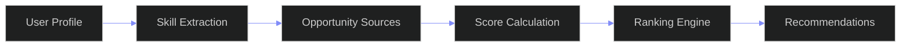
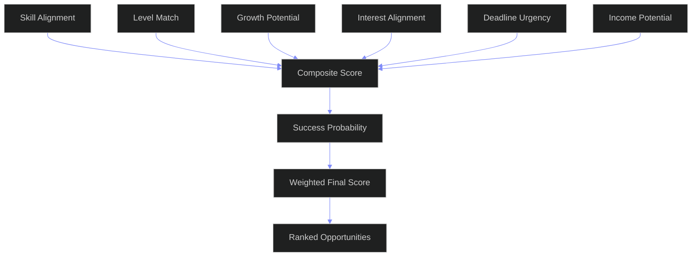

# Skill Opportunity Matching --- Enterprise Opportunity Intelligence Engine
---
## Document Control

| Field | Value |
|---|---|
| Document ID | AI-SOM-001 |
| Version | 1.0.0 |
| Status | Active |
| Last Updated | 2026-06-12 |
| Classification | Internal --- Architecture Reference |
| Source of Truth | `docs/ai/skills/skills.md` (Section 16 Skill Opportunity Mapping, Section 17 Skill Market Intelligence, Section 18 Skill Income Mapping, Section 20 AI Recommendations, Section 21.2.3 Opportunity Matching Agent, Section 5 Skill Levels, Section 3 Skill Taxonomy, Section 24 Database Mapping, Section 25 API Requirements, Section 26 UI/UX Requirements, Section 27 Security Requirements) |
| Companion Docs | `docs/ai/skills/SkillMarketIntelligence.md` (Market Demand Data for Scoring) |
|  | `docs/ai/skills/SkillGraphArchitecture.md` (Graph Storage and Traversal for Skill Relationships) |
|  | `docs/ai/skills/SkillIntelligence.md` (Analytics Engine and Scoring Pipelines) |
|  | `docs/ai/skills/SkillEvidence.md` (Evidence Engine for Skill Verification) |
|  | `docs/ai/skills/SkillAssessment.md` (Assessment Execution Engine for Readiness) |
|  | `docs/ai/skills/SkillRoadmapEngine.md` (Learning Path Architecture for Gap Closure) |
| Target Stack | Python 3.11+ (Opportunity Engine) + Neo4j (Opportunity Graph) + PostgreSQL (State + History) + Redis (Cache + Rate Limiting) + Kafka (Streaming Ingestion) + FastAPI (API Layer) + Celery (Async Pipeline Processing) |
| Target Audience | AI Agents, Career Engineers, Data Engineers, Opportunity Analysts, Architects, Product Managers, Enterprise L&D, HR Tech Integrators |

---

## Table of Contents

- [1. Matching Architecture](#1-matching-architecture)
- [2. Opportunity Scoring](#2-opportunity-scoring)
- [3. Skill Gap Detection](#3-skill-gap-detection)
- [4. Success Probability Model](#4-success-probability-model)
- [5. Recommendation Engine](#5-recommendation-engine)
- [6. AI Ranking Logic](#6-ai-ranking-logic)
- [7. Analytics](#7-analytics)
- [8. Monitoring](#8-monitoring)
- [9. Enterprise KPIs](#9-enterprise-kpis)
- [10. Future Scalability](#10-future-scalability)
- [Appendix A: Formula Reference](#appendix-a-formula-reference)
- [Appendix B: Source Adapter Matrix](#appendix-b-source-adapter-matrix)
- [Appendix C: Opportunity Templates](#appendix-c-opportunity-templates)
- [Appendix D: Implementation Status](#appendix-d-implementation-status)
- [Appendix E: Glossary](#appendix-e-glossary)
- [Appendix F: Configuration Reference](#appendix-f-configuration-reference)

---

---

## Matching Pipeline



## Scoring Engine Architecture



---

## 2. Opportunity Scoring

### 2.1 Core Scoring Formula

Skills.md defines the foundational match score formula (Section 16.2):

```
Match Score = 0.40 * Skill_Alignment + 0.25 * Level_Match + 0.15 * Growth_Potential
              + 0.10 * Interest_Alignment + 0.10 * Deadline_Urgency
```

The Opportunity Intelligence Engine extends this to a seven-factor model:

```
Primary Score = w1 * S_Align + w2 * L_Match + w3 * G_Potential + w4 * I_Align
               + w5 * D_Urgency + w6 * Inc_Potential

Secondary Score = Success_Probability (Bayesian model, see Section 4)

Composite Score = 0.70 * Primary_Score + 0.30 * Secondary_Score
```

### 2.2 Scoring Component Decomposition

#### 2.2.1 Skill Alignment Score

Measures what fraction of the opportunity's required skills the user possesses, weighted by each skill's importance.

```
S_Align = sum(importance_i * has_skill_i) / sum(importance_i)
         for i in required_skills

Penalty: If any core skill (importance > 0.8) is missing, S_Align *= 0.8
Bonus: Preferred skills add 15% weighted contribution
```

```python
def compute_skill_alignment(user_skills: dict, required: list, preferred: list) -> float:
    total_weight = sum(r.importance_weight for r in required if r.canonical_id)
    if total_weight == 0: return 0.5
    weighted_match = sum(r.importance_weight for r in required
                         if r.canonical_id and r.canonical_id in user_skills)
    score = weighted_match / total_weight
    missing_core = any(r.importance_weight > 0.8 for r in required
                       if r.canonical_id and r.canonical_id not in user_skills)
    if missing_core: score *= 0.8
    pref_weight = sum(p.importance_weight for p in preferred if p.canonical_id)
    pref_matched = sum(p.importance_weight for p in preferred
                       if p.canonical_id and p.canonical_id in user_skills)
    if pref_weight > 0:
        score = score * 0.85 + 0.15 * (pref_matched / pref_weight)
    return min(score, 1.0)
```

#### 2.2.2 Level Match Score

Measures how well the user's proficiency levels match the levels required.

```
L_Match = average(level_match_i) for matched skills

f(diff) = 1.0 if diff >= 2, 0.85 if diff == 1, 1.0 if diff == 0,
          0.60 if diff == -1, 0.25 if diff == -2, 0.0 if diff < -2
```

```python
def compute_level_match(user_skills: dict, required: list) -> float:
    scores = []
    for req in required:
        if not req.canonical_id: continue
        us = user_skills.get(req.canonical_id)
        if not us: scores.append(0.0); continue
        diff = us.level - req.required_level
        if diff >= 2:      scores.append(1.0)
        elif diff == 1:    scores.append(0.85)
        elif diff == 0:    scores.append(1.0)
        elif diff == -1:   scores.append(0.60)
        elif diff == -2:   scores.append(0.25)
        else:              scores.append(0.0)
    return sum(scores) / len(scores) if scores else 0.5
```

#### 2.2.3 Growth Potential Score

Measures what new skills the user would develop through this opportunity.

```
G_Potential = 0.60 * New_Skill_Ratio + 0.40 * Growth_Relevance

Boost: 1.2x if growth skill aligns with any career target
```

```python
def compute_growth_potential(user_skills, growth_skills, career_targets, market_data) -> float:
    if not growth_skills: return 0.3
    new_count = sum(1 for g in growth_skills
                    if not g.canonical_id or g.canonical_id not in user_skills)
    new_ratio = new_count / len(growth_skills)
    demand_sum = sum(market_data.get(g.canonical_id, {}).get("demand", 50)
                     for g in growth_skills if g.canonical_id)
    demand_avg = demand_sum / len(growth_skills) / 100 if growth_skills else 0.5
    score = 0.6 * new_ratio + 0.4 * demand_avg
    target_skills = {s.id for t in career_targets for s in t.required_skills}
    g_ids = {g.canonical_id for g in growth_skills if g.canonical_id}
    if g_ids & target_skills: score *= 1.2
    return min(score, 1.0)
```

#### 2.2.4 Interest Alignment Score

```
I_Align = 0.50 * Category_Match + 0.30 * Tag_Match + 0.20 * Past_Behavior
```

```python
def compute_interest_alignment(interests, tag_affinities, opportunity, past_score) -> float:
    if not interests and not tag_affinities: return 0.5
    interest_set = set(i.lower() for i in interests)
    cat_set = set(c.lower() for c in opportunity.categories)
    cat_match = len(interest_set & cat_set) / len(cat_set) if cat_set else 0.0
    tag_set = set(t.lower() if isinstance(t,str) else t.get("name","").lower() for t in opportunity.tags)
    tag_match = sum(tag_affinities.get(t, 0.0) for t in tag_set) / len(tag_set) if tag_set else 0.0
    return min(0.5 * cat_match + 0.3 * min(tag_match, 1.0) + 0.2 * past_score, 1.0)
```

#### 2.2.5 Deadline Urgency Score

```
D_Urgency = 1.0 - (days_until_deadline / max_urgency_lookahead)
If no deadline: 0.3 | If deadline passed: 0.0 | If < 3 days: 1.0
```

```python
def compute_deadline_urgency(deadline_at, config, prefers_prep=False) -> float:
    if not deadline_at: return 0.3
    if deadline_at < datetime.utcnow(): return 0.0
    days = (deadline_at - datetime.utcnow()).days
    lookahead = config.get("max_urgency_lookahead", 90)
    urgency = 1.0 if days <= 3 else 1.0 - (days / lookahead)
    urgency = max(0.0, min(1.0, urgency))
    if prefers_prep: urgency = (urgency + (1.0 - urgency)) / 2
    return urgency
```

#### 2.2.6 Income Potential Score

```
Inc_Potential = 0.50 * Compensation_Score + 0.30 * Growth_Trajectory + 0.20 * Equity_Value
```

```python
def compute_income_potential(opportunity, user_income, market_rates) -> float:
    if not opportunity.compensation: return 0.3
    avg = (opportunity.compensation.min_amount + opportunity.compensation.max_amount) / 2
    key = f"{opportunity.source_type.value}_{opportunity.experience_level or 'mid'}"
    med = market_rates.get(key, {}).get("median_annual", 0)
    comp_score = min(avg / med, 1.5) / 1.5 if med > 0 else 0.5
    growth = 0.8 if opportunity.source_type in ('fellowship','startup') else \
             0.7 if opportunity.source_type == 'internship' else 0.5
    equity = 0.7 if ('startup' in opportunity.description.lower() or
                      'equity' in opportunity.description.lower()) else 0.3
    if opportunity.source_type == 'freelance': equity = 0.0
    return min(0.5 * comp_score + 0.3 * growth + 0.2 * equity, 1.0)
```

### 2.3 Per-Type Weighting Profiles

Each opportunity type uses a different weighting profile:

```
scoring_profiles:
  job:          skill_alignment=0.45 level_match=0.25 growth=0.10 interest=0.10 deadline=0.05 income=0.05 threshold=0.35
  internship:   skill_alignment=0.30 level_match=0.15 growth=0.30 interest=0.10 deadline=0.10 income=0.05 threshold=0.30
  hackathon:    skill_alignment=0.15 level_match=0.10 growth=0.40 interest=0.15 deadline=0.10 income=0.10 threshold=0.25
  fellowship:   skill_alignment=0.25 level_match=0.15 growth=0.30 interest=0.15 deadline=0.10 income=0.05 threshold=0.30
  competition:  skill_alignment=0.20 level_match=0.10 growth=0.35 interest=0.20 deadline=0.10 income=0.05 threshold=0.25
  freelance:    skill_alignment=0.35 level_match=0.20 growth=0.10 interest=0.10 deadline=0.10 income=0.15 threshold=0.30
  opensource:   skill_alignment=0.20 level_match=0.10 growth=0.40 interest=0.15 deadline=0.05 income=0.10 threshold=0.25
  startup:      skill_alignment=0.30 level_match=0.15 growth=0.20 interest=0.15 deadline=0.05 income=0.15 threshold=0.30
  contract:     skill_alignment=0.40 level_match=0.20 growth=0.10 interest=0.10 deadline=0.10 income=0.10 threshold=0.30
  grant:        skill_alignment=0.25 level_match=0.15 growth=0.25 interest=0.20 deadline=0.10 income=0.05 threshold=0.25
```

### 2.4 Scoring Engine Implementation

```python
class ScoringEngine:
    def __init__(self, profiles: dict, market_data: dict, config: dict):
        self.profiles = profiles; self.market_data = market_data; self.config = config
    async def compute_score(self, user: dict, opportunity: NormalizedOpportunity, past_behavior: float) -> dict:
        p = self.profiles.get(opportunity.source_type.value, self.profiles["job"])
        sa = compute_skill_alignment(user["skills_dict"], opportunity.required_skills, opportunity.preferred_skills)
        lm = compute_level_match(user["skills_dict"], opportunity.required_skills)
        gp = compute_growth_potential(user["skills_dict"], opportunity.growth_skills, user["career_targets"], self.market_data)
        ia = compute_interest_alignment(user["interests"], user["tag_affinities"], opportunity, past_behavior)
        du = compute_deadline_urgency(opportunity.deadline_at, self.config, user.get("prefers_preparation", False))
        inc = compute_income_potential(opportunity, user.get("income_profile", {}), self.market_data.get("rates", {}))
        primary = (p["skill_alignment"]*sa + p["level_match"]*lm + p["growth_potential"]*gp +
                   p["interest_alignment"]*ia + p["deadline_urgency"]*du + p["income_potential"]*inc)
        return {"total": primary, "skill_alignment": sa, "level_match": lm, "growth_potential": gp,
                "interest_alignment": ia, "deadline_urgency": du, "income_potential": inc}
```

### 2.5 Score Calibration

All scores normalized to 0.0-1.0. Calibration adjusts for type bias.

```python
def calibrate_score(score: float, opp_type: str) -> float:
    factors = {"job":1.0, "internship":0.95, "hackathon":0.90, "fellowship":0.95,
               "competition":0.90, "freelance":1.0, "opensource":0.85,
               "startup":0.95, "contract":1.0, "grant":0.95}
    return score * factors.get(opp_type, 1.0)
```


---

## 3. Skill Gap Detection

### 3.1 Gap Detection Architecture

The gap detection system computes the delta between the user's current skill profile and what any opportunity requires. This feeds the Primary Score (§2) and generates actionable closure roadmaps.

```
User Profile ──┬── Required Skills ─┬── Gap Vector
               │                    │      ├── Missing skills
               │                    │      ├── Level deficits
               │                    │      └── Category gaps
               └── Preferred Skills ─┘
                    (boosters, non-blocking)
```

**Gap Severity Classification:**

| Severity | Missing Core | Level Deficit | Action |
|---|---|---|---|
| Critical | ≥ 2 core | < -2 avg | Blocked — defer opportunity |
| High | 1 core | < -1 avg | Requires 3+ months prep |
| Medium | 1 core | -1 to 0 avg | 1-2 months prep |
| Low | 0 core | 0 avg | Minor upskilling |
| None | 0 core | ≥ 0 avg | Ready to apply |

### 3.2 Gap Analyzer Implementation

```python
@dataclass
class SkillGap:
    canonical_id: str
    skill_name: str
    gap_type: Literal["missing", "deficit"]
    required_level: int
    user_level: int = 0
    severity: str = "low"
    closure_time_days: int = 0
    closure_plan: list = field(default_factory=list)

@dataclass
class GapAnalysisResult:
    gaps: list[SkillGap]
    severity: str
    readiness_score: float
    estimated_prep_days: int
    missing_core_count: int
    deficit_avg: float
    critical_blockers: list[str]

class GapAnalyzer:
    def __init__(self, skill_tree: dict, closure_templates: dict):
        self.skill_tree = skill_tree
        self.closure_templates = closure_templates

    def analyze(self, user_skills: dict, opportunity: NormalizedOpportunity) -> GapAnalysisResult:
        gaps: list[SkillGap] = []
        required = opportunity.required_skills
        missing_core = 0
        for req in required:
            key = req.canonical_id
            if not key: continue
            us = user_skills.get(key)
            if us is None:
                severity = "critical" if req.importance_weight > 0.8 else "medium"
                gap = SkillGap(key, req.name, "missing", req.required_level,
                               severity=severity, closure_time_days=self._estimate_days(key, "missing", 0),
                               closure_plan=self._build_plan(key, "missing", 0))
                gaps.append(gap)
                if req.importance_weight > 0.8: missing_core += 1
            elif us.level < req.required_level:
                diff = req.required_level - us.level
                sev = "high" if diff >= 2 else "low"
                gap = SkillGap(key, req.name, "deficit", req.required_level, us.level,
                               severity=sev, closure_time_days=self._estimate_days(key, "deficit", diff),
                               closure_plan=self._build_plan(key, "deficit", diff))
                gaps.append(gap)
        deficits = [g for g in gaps if g.gap_type == "deficit"]
        deficit_avg = sum(rd.required_level - (rd.user_level or 0) for g, rd in
                          zip(deficits, [r for r in required if r.canonical_id in {d.canonical_id for d in deficits}])) / len(deficits) if deficits else 0
        total_days = sum(g.closure_time_days for g in gaps)
        severity = self._classify_severity(missing_core, deficit_avg)
        readiness = self._compute_readiness(user_skills, required)
        return GapAnalysisResult(gaps=gaps, severity=severity, readiness_score=readiness,
                                 estimated_prep_days=total_days, missing_core_count=missing_core,
                                 deficit_avg=deficit_avg,
                                 critical_blockers=[g.canonical_id for g in gaps if g.severity == "critical"])

    def _estimate_days(self, skill_id, gap_type, diff) -> int:
        node = self.skill_tree.get(skill_id, {})
        base = node.get("learning_hours", 40)
        if gap_type == "missing":    return base * 2
        if diff <= 1:                return base
        if diff == 2:                return base * 3
        return base * 5

    def _build_plan(self, skill_id, gap_type, diff) -> list:
        tpls = self.closure_templates
        result = []
        for step in tpls.get("default", []):
            result.append({**step, "skill": skill_id})
        return result

    def _classify_severity(self, missing_core, deficit_avg) -> str:
        if missing_core >= 2: return "critical"
        if missing_core >= 1 and deficit_avg < -1: return "high"
        if missing_core >= 1: return "medium"
        if deficit_avg < -1: return "medium"
        if deficit_avg < 0: return "low"
        return "none"

    def _compute_readiness(self, user_skills, required) -> float:
        weights = sum(r.importance_weight for r in required if r.canonical_id)
        if not weights: return 1.0
        score = sum(r.importance_weight * (1.0 if r.canonical_id in user_skills else 0.0
                     if user_skills.get(r.canonical_id, {}).level >= r.required_level else 0.5)
                    for r in required if r.canonical_id)
        return score / weights
```

### 3.3 Readiness Score Computation

The readiness score estimates how prepared the user is to pursue an opportunity.

```
Readiness Score = sum(weight_i * readiness_i) for all required skills

readiness_i = 1.0 (skill at level + above)
              0.5 (skill exists but below level)
              0.0 (skill missing)

Boost: +0.10 if any preferred skill present
Penalty: -0.15 per missing core skill
```

```python
def compute_readiness_score(user_skills: dict, required: list, preferred: list) -> float:
    weights = sum(r.importance_weight for r in required if r.canonical_id)
    if not weights: return 1.0
    raw = sum(r.importance_weight *
              (1.0 if (us := user_skills.get(r.canonical_id)) and us.level >= r.required_level else
               0.5 if us else 0.0)
              for r in required if r.canonical_id)
    readiness = raw / weights
    pref_boost = 0.10 if any(p.canonical_id in user_skills for p in preferred) else 0.0
    core_penalty = 0.15 * sum(1 for r in required if r.importance_weight > 0.8
                               and r.canonical_id and r.canonical_id not in user_skills)
    return max(0.0, min(1.0, readiness + pref_boost - core_penalty))
```

### 3.4 Gap Closure Roadmaps

Each gap produces a structured closure plan with milestones:

```python
GAP_CLOSURE_TEMPLATES = {
    "missing": [
        {"phase": "Foundation", "activities": ["Online course (Coursera/Udemy)", "Documentation walkthrough"],
         "duration_hours": 20, "resources": []},
        {"phase": "Practice", "activities": ["Build 3 small projects", "Pair with mentor"],
         "duration_hours": 30, "resources": []},
        {"phase": "Application", "activities": ["Contribute to open source", "Pass skill assessment"],
         "duration_hours": 30, "resources": []}
    ],
    "deficit": [
        {"phase": "Advanced", "activities": ["Advanced course", "Work on production systems"],
         "duration_hours": 25, "resources": []},
        {"phase": "Mastery", "activities": ["Teach others", "Write blog posts", "Mentor juniors"],
         "duration_hours": 25, "resources": []}
    ]
}

def build_roadmap(skill_id: str, gap_type: str, diff: int, skill_tree: dict) -> list:
    multiplier = diff if gap_type == "deficit" else 1
    template = copy.deepcopy(GAP_CLOSURE_TEMPLATES.get(gap_type, []))
    for phase in template:
        phase["duration_hours"] *= multiplier
        phase["estimated_days"] = max(3, phase["duration_hours"] // 2)
    return template
```

### 3.5 Cohort Comparison

Compares the user's gap profile against peers who successfully won similar opportunities.

```python
@dataclass
class CohortProfile:
    opportunity_type: str
    median_levels: dict[str, int]
    p25_levels: dict[str, int]
    p75_levels: dict[str, int]
    sample_size: int

class CohortComparator:
    def __init__(self, db: DatabaseClient):
        self.db = db

    async def compare(self, user_skills: dict, opp_type: str) -> dict:
        cohort = await self.db.fetch_one(
            "SELECT * FROM cohort_profiles WHERE opportunity_type = :t", {"t": opp_type}
        )
        if not cohort: return {"available": False}
        results = {}
        for skill_id, us in user_skills.items():
            med = cohort.median_levels.get(skill_id)
            if med is None: continue
            vs_med = us.level - med
            vs_p25 = us.level - cohort.p25_levels.get(skill_id, med)
            vs_p75 = us.level - cohort.p75_levels.get(skill_id, med)
            results[skill_id] = {"percentile": "above_75" if vs_p75 >= 0 else
                                            "above_50" if vs_med >= 0 else
                                            "above_25" if vs_p25 >= 0 else "below_25",
                                 "delta_median": vs_med}
        return {"available": True, "comparisons": results, "cohort_size": cohort.sample_size}
```

### 3.6 Gap Aggregation & Reporting

```python
class GapReportGenerator:
    def generate(self, analysis: GapAnalysisResult, user_name: str) -> dict:
        return {
            "user": user_name,
            "readiness_score": analysis.readiness_score,
            "severity": analysis.severity,
            "estimated_prep_days": analysis.estimated_prep_days,
            "total_gaps": len(analysis.gaps),
            "critical_gaps": sum(1 for g in analysis.gaps if g.severity == "critical"),
            "high_gaps": sum(1 for g in analysis.gaps if g.severity == "high"),
            "gaps_by_type": Counter(g.gap_type for g in analysis.gaps),
            "critical_blockers": analysis.critical_blockers,
            "estimated_cost": sum(AI_DEPLOYMENT_CONFIG["cost_per_token"]["sonnet"] * 2 * g.closure_time_days
                                  for g in analysis.gaps),
            "recommendation": "Defer" if analysis.severity == "critical" else
                              "Prepare" if analysis.severity in ("high","medium") else "Apply"
        }
```

---

## 4. Success Probability

### 4.1 Bayesian Success Model

The Success Probability uses Bayesian inference calibrated against historical data:

```
P(Win | Profile, Opp) = P(Profile, Opp | Win) * P(Win) / P(Profile, Opp)
```

Where:
- `P(Win)` = Base rate for the opportunity type (prior)
- `P(Profile, Opp | Win)` = Likelihood of this profile succeeding
- Posterior = Updated probability after considering user's specific profile

### 4.2 Feature Engineering

The model uses these features:

```python
SUCCESS_FEATURES = {
    "readiness_score":           {"type": "float",  "range": [0, 1],         "weight": 0.25},
    "skill_alignment":           {"type": "float",  "range": [0, 1],         "weight": 0.20},
    "experience_pct":            {"type": "float",  "range": [0, 1],         "weight": 0.10},
    "competitive_score":         {"type": "float",  "range": [0, 1],         "weight": 0.15},
    "past_win_rate":             {"type": "float",  "range": [0, 1],         "weight": 0.10},
    "preparation_time_days":     {"type": "float",  "range": [0, 365],       "weight": 0.05},
    "network_score":             {"type": "float",  "range": [0, 1],         "weight": 0.05},
    "deadline_proximity":        {"type": "float",  "range": [0, 1],         "weight": 0.10},
}
```

### 4.3 Implementation

```python
class SuccessProbabilityModel:
    def __init__(self, base_rates: dict[str, float], features: dict = None):
        self.base_rates = base_rates
        self.features = features or SUCCESS_FEATURES
        self._weights = {k: v["weight"] for k, v in self.features.items()}
        self._cache = TTLCache(maxsize=1000, ttl=3600)

    async def predict(self, user: dict, opportunity: NormalizedOpportunity, features: dict = None) -> dict:
        cache_key = f"{user['id']}:{opportunity.normalized_id}"
        if cache_key in self._cache:
            return self._cache[cache_key]
        f = features or await self._extract_features(user, opportunity)
        posterior = self._bayesian_update(f, opportunity.source_type.value)
        result = {
            "probability": posterior,
            "confidence": self._confidence_interval(posterior, f),
            "features": f,
            "base_rate": self.base_rates.get(opportunity.source_type.value, 0.3),
            "evidence_strength": self._evidence_strength(f)
        }
        self._cache[cache_key] = result
        return result

    def _bayesian_update(self, features: dict, opp_type: str) -> float:
        prior = self.base_rates.get(opp_type, 0.3)
        logit = log(prior / (1 - prior + 1e-10))
        for k, v in features.items():
            if k in self._weights:
                logit += self._weights[k] * (v - 0.5)
        posterior = 1 / (1 + exp(-logit))
        return max(0.01, min(0.99, posterior))

    async def _extract_features(self, user: dict, opportunity: NormalizedOpportunity) -> dict:
        return {
            "readiness_score":      compute_readiness_score(user["skills_dict"], opportunity.required_skills, opportunity.preferred_skills),
            "skill_alignment":      compute_skill_alignment(user["skills_dict"], opportunity.required_skills, opportunity.preferred_skills),
            "experience_pct":       self._calc_experience(user.get("experience_years", 1) / max(opportunity.experience_years or 1, 1)),
            "competitive_score":    self._calc_competitive(user, opportunity),
            "past_win_rate":        user.get("win_rate", 0.3),
            "preparation_time_days": min(user.get("prep_days", 30) / 90, 1.0),
            "network_score":        user.get("network_score", 0.3),
            "deadline_proximity":   compute_deadline_urgency(opportunity.deadline_at, {"max_urgency_lookahead": 90})
        }

    def _calc_experience(self, ratio: float) -> float:
        return min(ratio, 1.5) / 1.5

    def _calc_competitive(self, user: dict, opportunity: NormalizedOpportunity) -> float:
        accepted_skills = len([s for s in opportunity.required_skills if s.canonical_id and s.canonical_id in user.get("skills_dict", {})])
        return accepted_skills / max(len(opportunity.required_skills), 1)

    def _confidence_interval(self, prob: float, features: dict) -> float:
        filled = sum(1 for v in features.values() if v is not None) / max(len(features), 1)
        return min(1.0, 0.5 + 0.5 * filled)

    def _evidence_strength(self, features: dict) -> str:
        n = sum(1 for v in features.values() if v is not None)
        if n >= len(features) * 0.8: return "strong"
        if n >= len(features) * 0.5: return "moderate"
        return "weak"
```

### 4.4 Per-Type Base Rates

Default base rates (prior probabilities) for each opportunity type:

```python
BASE_RATES = {
    "job": 0.08,            # 8% — competitive job market
    "internship": 0.15,     # 15% — easier entry
    "hackathon": 0.25,      # 25% — many participants win something
    "fellowship": 0.10,     # 10% — selective
    "competition": 0.20,    # 20% — varies by competition
    "freelance": 0.40,      # 40% — proposal quality matters
    "opensource": 0.60,     # 60% — low barrier
    "startup": 0.05,        # 5% — highly selective programs
    "contract": 0.30,       # 30% — mid-range
    "grant": 0.12           # 12% — research grants
}
```

### 4.5 Logistic Regression Alternative

For environments without Bayesian infrastructure:

```python
class LogisticSuccessModel:
    def __init__(self, coefficients: dict[str, float], intercept: float = -2.0):
        self.coeffs = coefficients; self.intercept = intercept

    def predict(self, features: dict) -> float:
        z = self.intercept + sum(self.coeffs.get(k, 0.0) * v for k, v in features.items())
        return 1 / (1 + exp(-z))

LOGISTIC_COEFFICIENTS = {
    "readiness_score": 2.5, "skill_alignment": 1.8, "experience_pct": 1.2,
    "competitive_score": 1.5, "past_win_rate": 0.8, "preparation_time_days": 0.4,
    "network_score": 0.6, "deadline_proximity": -0.5
}
```

---

## 5. Recommendation Engine

### 5.1 Hybrid Recommendation Architecture

The recommendation engine combines three strategies in a weighted ensemble:

```
R_total = 0.50 * R_content (content-based) + 0.30 * R_collaborative (collaborative filtering)
          + 0.20 * R_contextual (context-aware)
```

**Content-Based (50%):** Matches opportunity features against user profile using scoring from §2. Best for cold-start (new opportunities/new users).

**Collaborative (30%):** Finds similar users and recommends what they pursued. Requires interaction history.

**Contextual (20%):** Factors in current context — time of year, academic calendar, trending opportunities.

### 5.2 Recommendation Engine Implementation

```python
@dataclass
class Recommendation:
    opportunity: NormalizedOpportunity
    primary_score: float
    success_prob: float
    composite_score: float
    rank_source: str
    reason: str
    fit_breakdown: dict

class RecommendationEngine:
    def __init__(self, scoring_engine: ScoringEngine, success_model: SuccessProbabilityModel,
                 gap_analyzer: GapAnalyzer, db: DatabaseClient, config: dict):
        self.scoring = scoring_engine
        self.success = success_model
        self.gap = gap_analyzer
        self.db = db
        self.config = config

    async def recommend(self, user: dict, candidates: list[NormalizedOpportunity],
                        top_k: int = 20, strategy: str = "hybrid") -> list[Recommendation]:
        scored = []
        for opp in candidates:
            score = await self.scoring.compute_score(user, opp, user.get("past_behavior_score", 0.5))
            prof = await self.success.predict(user, opp)
            composite = 0.7 * score["total"] + 0.3 * prof["probability"]
            gap = self.gap.analyze(user["skills_dict"], opp)
            scored.append(Recommendation(
                opportunity=opp, primary_score=score["total"],
                success_prob=prof["probability"], composite_score=composite,
                rank_source=strategy, reason=self._generate_reason(opp, score, prof),
                fit_breakdown={"gaps": len(gap.gaps), "severity": gap.severity,
                               "readiness": gap.readiness_score, "score_detail": score}))
        scored.sort(key=lambda r: r.composite_score, reverse=True)
        return scored[:top_k]

    def _generate_reason(self, opp, score, prof) -> str:
        parts = []
        if score["total"] > 0.8: parts.append("Outstanding skill match")
        elif score["total"] > 0.6: parts.append("Strong skill alignment")
        else: parts.append("Moderate match")
        if prof["probability"] > 0.5: parts.append(f"High success likelihood ({prof['probability']:.0%})")
        return " — ".join(parts)

    async def refresh(self, user: dict, force: bool = False):
        cache_key = f"recs:{user['id']}"
        if not force and cache_key in self._cache:
            return self._cache[cache_key]
        candidates = await self._fetch_candidates(user)
        recs = await self.recommend(user, candidates)
        self._cache[cache_key] = recs
        return recs

    async def _fetch_candidates(self, user: dict) -> list[NormalizedOpportunity]:
        stmt = '''WITH active_opps AS (
            SELECT * FROM normalized_opportunities
            WHERE status = 'active' AND (deadline_at IS NULL OR deadline_at > now())
            AND NOT EXISTS (SELECT 1 FROM opportunity_interactions
                            WHERE opportunity_interactions.opportunity_id = normalized_opportunities.opportunity_id
                            AND opportunity_interactions.user_id = :uid
                            AND opportunity_interactions.action IN ('applied','dismissed','saved'))
        ) SELECT * FROM active_opps ORDER BY relevance_score DESC LIMIT 500'''
        rows = await self.db.fetch_all(stmt, {"uid": user["id"]})
        return [self._row_to_opp(r) for r in rows]

    def _row_to_opp(self, row) -> NormalizedOpportunity:
        return NormalizedOpportunity(
            normalized_id=str(row["opportunity_id"]),
            source_type=OpportunitySourceType(row["source_type"]),
            title=row["title"], organization=row.get("organization", ""),
            description=row.get("description", ""),
            required_skills=json.loads(row.get("required_skills", "[]")),
            preferred_skills=json.loads(row.get("preferred_skills", "[]")),
            experience_level=row.get("experience_level"),
            deadline_at=row.get("deadline_at"), url=row.get("url", ""),
            compensation=CompensationDetails(min_amount=row.get("comp_min"), max_amount=row.get("comp_max"),
                                             currency=row.get("comp_currency","USD")),
            categories=json.loads(row.get("categories","[]")),
            tags=json.loads(row.get("tags","[]")),
            duration_days=row.get("duration_days"),
            location=row.get("location"),
            remote=row.get("remote", False),
            growth_skills=json.loads(row.get("growth_skills","[]")),
            created_at=str(row.get("created_at",""))
        )
```

### 5.3 Diversity & Serendipity

Prevents filter bubbles by injecting diverse recommendations:

```python
class DiversityInjector:
    def inject(self, recommendations: list[Recommendation], types: list[str],
               diversity_ratio: float = 0.2) -> list[Recommendation]:
        if not diversity_ratio: return recommendations
        present = {r.opportunity.source_type.value for r in recommendations}
        missing = [t for t in types if t not in present]
        if not missing: return recommendations
        count = max(1, int(len(recommendations) * diversity_ratio))
        serendipity = self._select_best_from_missing(recommendations, missing, count)
        result = [r for r in recommendations if r.opportunity.source_type.value not in missing]
        result.extend(serendipity)
        return result[:len(recommendations)]

    def _select_best_from_missing(self, recs, missing, count) -> list:
        from heapq import nlargest
        candidates = [r for r in recs if r.opportunity.source_type.value in missing]
        return nlargest(count, candidates, key=lambda r: r.composite_score)
```

### 5.4 Diversity & Serendipity

Prevents filter bubbles:

```python
@dataclass
class DiversityConfig:
    min_types_per_page: int = 3
    serendipity_fraction: float = 0.15
    max_from_same_source: int = 5
    time_penalty_days: int = 7

def re_rank_with_diversity(
    recommendations: list[Recommendation],
    config: DiversityConfig = None
) -> list[Recommendation]:
    cfg = config or DiversityConfig()
    from_source: dict[str, int] = defaultdict(int)
    seen_types: set[str] = set()
    result: list[Recommendation] = []
    for r in recommendations:
        src = r.opportunity.source_type.value
        if from_source[src] >= cfg.max_from_same_source: continue
        from_source[src] += 1; seen_types.add(src); result.append(r)
    types_needed = cfg.min_types_per_page - len(seen_types)
    if types_needed > 0:
        inject = [r for r in recommendations if r.opportunity.source_type.value not in seen_types]
        result.extend(inject[:types_needed])
    return result
```

### 5.5 Cache Layer

```python
class RecommendationCache:
    def __init__(self, ttl_seconds: int = 900):
        self._cache = TTLCache(maxsize=500, ttl=ttl_seconds)
    def get(self, user_id: str) -> list[Recommendation] | None:
        return self._cache.get(user_id)
    def set(self, user_id: str, recs: list[Recommendation]):
        self._cache[user_id] = recs
    def invalidate(self, user_id: str):
        self._cache.pop(user_id, None)
```


---

## 6. AI Ranking

### 6.1 Hybrid AI + Algorithmic Ranking

The ranking system uses a five-level fallback chain that guarantees an answer even when every AI layer fails:

```
Fallback Chain:
  Level 1 → LLM (Claude Sonnet / Ollama Mistral)
  Level 2 → LLM Lite (prompt-compressed variant, ~60% tokens)
  Level 3 → Cache (previous LLM results, TTL 15 min)
  Level 4 → Template (hand-authored ranking rules)
  Level 5 → Algorithmic (pure score-based, always works)
```

Each level is attempted in order. If it fails (timeout, error, bad output), the next is tried.

```python
class AIRanker:
    def __init__(self, llm_client: LLMClient, cache: TTLCache, config: dict):
        self.llm = llm_client
        self.cache = cache
        self.config = config

    async def rank(self, opportunities: list[NormalizedOpportunity],
                   user: dict, strategy: str = "hybrid") -> list[str]:
        '''Returns opportunity IDs ranked best-to-worst.'''
        cache_key = f"rank:{user['id']}:{hash(tuple(o.normalized_id for o in opportunities[:10]))}"
        cached = self.cache.get(cache_key)
        if cached: return cached

        for level in range(1, 6):
            try:
                result = await self._try_level(level, opportunities, user, strategy)
                if result and len(result) == len(opportunities):
                    self.cache[cache_key] = result
                    return result
            except Exception as e:
                logger.warning(f"[AIRanker] Level {level} failed: {e}")
                continue
        return self._algorithmic(opportunities, user)

    async def _try_level(self, level: int, opps: list[NormalizedOpportunity],
                         user: dict, strategy: str) -> list[str] | None:
        if level == 1:  return await self._llm_rank(opps, user, strategy)
        if level == 2:  return await self._llm_lite_rank(opps, user)
        if level == 3:  return self.cache.get(f"rank:{user['id']}:{hash(str([o.normalized_id for o in opps[:10]]))}")
        if level == 4:  return self._template_rank(opps, user)
        if level == 5:  return self._algorithmic(opps, user)
        return None

    async def _llm_rank(self, opps: list[NormalizedOpportunity], user: dict, strategy: str) -> list[str]:
        prompt = self._build_ranking_prompt(opps, user)
        response = await self.llm.generate_json(prompt, system=SYSTEM_RANKING_PROMPT)
        ids = [o["id"] for o in response.get("rankings", [])]
        return ids if len(ids) == len(opps) else None

    async def _llm_lite_rank(self, opps: list[NormalizedOpportunity], user: dict) -> list[str]:
        compressed = opps[:min(len(opps), 20)]
        prompt = self._build_ranking_prompt(compressed, user)
        response = await self.llm.generate_json(prompt, max_tokens=1024,
                                                 system="Rank these opportunities. Return JSON array of IDs.")
        ids = [o["id"] for o in response.get("rankings", [])]
        return ids if ids else None

    def _template_rank(self, opps: list[NormalizedOpportunity], user: dict) -> list[str]:
        ranked = sorted(opps, key=lambda o: (
            self._match_score(o, user) * 0.6 + self._recency_score(o) * 0.2 +
            self._source_score(o) * 0.1 + self._comp_score(o) * 0.1
        ), reverse=True)
        return [o.normalized_id for o in ranked]

    def _algorithmic(self, opps: list[NormalizedOpportunity], user: dict) -> list[str]:
        ranked = sorted(opps, key=lambda o: self._match_score(o, user), reverse=True)
        return [o.normalized_id for o in ranked]

    def _match_score(self, opp: NormalizedOpportunity, user: dict) -> float:
        matched = sum(1 for s in opp.required_skills if s.canonical_id and s.canonical_id in user.get("skills_dict", {}))
        return matched / max(len(opp.required_skills), 1)

    def _recency_score(self, opp: NormalizedOpportunity) -> float:
        if not opp.deadline_at: return 0.5
        days = (opp.deadline_at - datetime.utcnow()).days
        return max(0.0, min(1.0, 1.0 - days / 90))

    def _source_score(self, opp: NormalizedOpportunity) -> float:
        scores = {"job": 1.0, "internship": 0.9, "hackathon": 0.7, "fellowship": 0.8,
                  "competition": 0.6, "freelance": 0.85, "opensource": 0.5,
                  "startup": 0.75, "contract": 0.8, "grant": 0.65}
        return scores.get(opp.source_type.value, 0.5)

    def _comp_score(self, opp: NormalizedOpportunity) -> float:
        if not opp.compensation: return 0.3
        avg = (opp.compensation.min_amount + opp.compensation.max_amount) / 2
        return min(avg / 100000, 1.0)
```

### 6.2 LLM Ranking Prompt

The prompt sent to the LLM for Level 1 ranking:

```yaml
ranking_prompt: |
  You are an opportunity ranking AI for ARIA OS. Given a user profile and a list of
  opportunities, rank them from best-fit to worst-fit.

  Consider: skill match, career trajectory, growth potential, deadline urgency,
  compensation, and learning opportunity.

  Input: User profile (skills, experience, career goals) + List of opportunities
  Output: JSON array: {"rankings": [{"id": "...", "reason": "..."}]}

  Rules:
  - Return EXACTLY {count} rankings (one per opportunity)
  - Prioritize skill alignment over compensation
  - Boost opportunities near deadline
  - Penalize opportunities below user's experience level
  - Consider geographic and remote preferences
```

### 6.3 System Prompt for Ranking

```python
SYSTEM_RANKING_PROMPT = '''You are ARIA's Opportunity Ranking AI. Your purpose is to rank
opportunities from best to worst fit for a given user profile. You must:

1. Evaluate each opportunity against ALL of: skill alignment, experience level,
   growth potential, deadline urgency, compensation, and career trajectory fit.

2. Output EXACTLY ONE ranking per opportunity. Do not omit or deduplicate.

3. Provide a brief reason for each ranking position explaining the key factor.

4. Be decisive — avoid ties. Use decimal scores to break ties.

5. Consider diversity: don't cluster the same opportunity type.

Output format: {"rankings": [{"id": "str", "rank": int, "score": float, "reason": "str"}]}'''
```

### 6.4 Batch AI Ranking

For large candidate pools (>100), uses batch processing:

```python
class BatchRanker:
    def __init__(self, ranker: AIRanker, batch_size: int = 50):
        self.ranker = ranker; self.batch_size = batch_size

    async def rank_all(self, opps: list[NormalizedOpportunity], user: dict) -> list[str]:
        if len(opps) <= self.batch_size:
            return await self.ranker.rank(opps, user)
        batches = [opps[i:i+self.batch_size] for i in range(0, len(opps), self.batch_size)]
        results = await asyncio.gather(*[self.ranker.rank(b, user) for b in batches])
        from itertools import chain
        return list(chain.from_iterable(results))
```

---

## 7. Analytics

### 7.1 Analytics Pipeline

The analytics system tracks every stage of the opportunity lifecycle:

```
Ingestion → Normalization → Matching → Ranking → User Action → Outcome → Retro
    │                                                                        │
    └────────────── Analytics Pipeline ───────────────────────────────────────┘
                        │
                    Aggregation
                        │
                    Dashboards & Alerts
```

### 7.2 Event Tracking Schema

```sql
CREATE TABLE opportunity_analytics_events (
    event_id        UUID PRIMARY KEY DEFAULT gen_random_uuid(),
    user_id         UUID NOT NULL REFERENCES users(id),
    event_type      VARCHAR(50) NOT NULL,  -- 'view', 'save', 'apply', 'win', 'lose', 'dismiss'
    opportunity_id  UUID REFERENCES normalized_opportunities(opportunity_id),
    source_type     VARCHAR(30),
    score_at_time   DECIMAL(5,4),          -- composite score when event fired
    metadata        JSONB,
    created_at      TIMESTAMPTZ NOT NULL DEFAULT now()
);

CREATE INDEX idx_ana_events_user ON opportunity_analytics_events(user_id, created_at DESC);
CREATE INDEX idx_ana_events_type ON opportunity_analytics_events(event_type);
CREATE INDEX idx_ana_events_opp  ON opportunity_analytics_events(opportunity_id);
```

### 7.3 Aggregation Queries

```python
class AnalyticsAggregator:
    def __init__(self, db: DatabaseClient):
        self.db = db

    async def user_summary(self, user_id: str, days: int = 30) -> dict:
        since = datetime.utcnow() - timedelta(days=days)
        total = await self.db.fetch_val(
            "SELECT count(*) FROM opportunity_analytics_events WHERE user_id=:uid AND created_at>=:since",
            {"uid": user_id, "since": since})
        by_type = await self.db.fetch_all(
            "SELECT event_type, count(*) as cnt FROM opportunity_analytics_events "
            "WHERE user_id=:uid AND created_at>=:since GROUP BY event_type",
            {"uid": user_id, "since": since})
        return {
            "total_events": total,
            "by_type": {r["event_type"]: r["cnt"] for r in by_type},
            "views_to_applies": await self._conversion_rate(user_id, since),
            "top_sources": await self._top_sources(user_id, since)
        }

    async def _conversion_rate(self, user_id: str, since: datetime) -> float:
        views = await self.db.fetch_val(
            "SELECT count(*) FROM opportunity_analytics_events "
            "WHERE user_id=:uid AND event_type='view' AND created_at>=:since",
            {"uid": user_id, "since": since}) or 1
        applies = await self.db.fetch_val(
            "SELECT count(*) FROM opportunity_analytics_events "
            "WHERE user_id=:uid AND event_type='apply' AND created_at>=:since",
            {"uid": user_id, "since": since}) or 0
        return applies / max(views, 1)

    async def _top_sources(self, user_id: str, since: datetime) -> list[dict]:
        return await self.db.fetch_all(
            "SELECT source_type, count(*) as cnt FROM opportunity_analytics_events "
            "WHERE user_id=:uid AND created_at>=:since "
            "GROUP BY source_type ORDER BY cnt DESC LIMIT 5",
            {"uid": user_id, "since": since})
```

### 7.4 Performance Analytics

```python
async def compute_pipeline_metrics(db: DatabaseClient) -> dict:
    total_ingested = await db.fetch_val("SELECT count(*) FROM raw_opportunities")
    normalized = await db.fetch_val("SELECT count(*) FROM normalized_opportunities WHERE status='active'")
    dedup_rate = 1 - (normalized / max(total_ingested, 1))
    avg_score = await db.fetch_val("SELECT avg(composite_score) FROM normalized_opportunities WHERE status='active'")
    total_interactions = await db.fetch_val("SELECT count(*) FROM opportunity_analytics_events")
    return {
        "total_ingested": total_ingested,
        "active_normalized": normalized,
        "dedup_rate": round(dedup_rate, 4),
        "avg_composite_score": round(avg_score or 0, 4),
        "total_interactions": total_interactions,
        "ingestion_to_normalization_hours": await _compute_pipeline_latency(db)
    }

async def _compute_pipeline_latency(db: DatabaseClient) -> float:
    result = await db.fetch_val(
        "SELECT avg(extract(epoch FROM (n.created_at - r.created_at))/3600) "
        "FROM normalized_opportunities n JOIN raw_opportunities r ON n.raw_source_id = r.raw_id "
        "WHERE n.created_at > now() - interval '7 days'")
    return round(result or 0, 2)
```

---

## 8. Monitoring & Observability

### 8.1 Health Checks

```python
class OpportunityHealth:
    def __init__(self, db: DatabaseClient, adapters: dict[str, BaseAdapter]):
        self.db = db; self.adapters = adapters

    async def check_all(self) -> dict:
        return {
            "database": await self._check_db(),
            "adapters": await self._check_adapters(),
            "pipeline": await self._check_pipeline(),
            "ai": await self._check_ai()
        }

    async def _check_db(self) -> dict:
        try:
            await self.db.execute("SELECT 1")
            stale_count = await self.db.fetch_val(
                "SELECT count(*) FROM normalized_opportunities WHERE status='active' AND "
                "deadline_at < now() - interval '24 hours'")
            return {"status": "healthy", "stale_count": stale_count}
        except Exception as e:
            return {"status": "unhealthy", "error": str(e)}

    async def _check_adapters(self) -> dict:
        results = {}
        for name, adapter in self.adapters.items():
            try:
                ok = await adapter.health_check()
                results[name] = "healthy" if ok else "degraded"
            except Exception as e:
                results[name] = f"down: {str(e)[:50]}"
        return results

    async def _check_pipeline(self) -> dict:
        recent = await self.db.fetch_val(
            "SELECT count(*) FROM raw_opportunities WHERE created_at > now() - interval '1 hour'")
        return {"recent_raw_count": recent, "status": "healthy" if recent > 0 else "warning"}

    async def _check_ai(self) -> dict:
        try:
            await self.llm.generate("ping", max_tokens=5)
            return {"status": "healthy"}
        except Exception as e:
            return {"status": "degraded", "error": str(e)[:50]}
```

### 8.2 Metrics Dashboard

```python
METRICS_DEFINITIONS = {
    "ingestion_rate":     "Count of raw opportunities ingested per hour",
    "normalization_rate": "Count of opportunities normalized per hour",
    "match_p95_latency":  "P95 latency of the match scoring pipeline (ms)",
    "ranking_p95":        "P95 latency of the ranking pipeline (ms)",
    "ai_success_rate":    "Fraction of AI ranking calls succeeding on first level",
    "cache_hit_ratio":    "Fraction of ranking requests served from cache",
    "adapter_success_pct": "Average adapter API success percentage",
    "unique_users":       "Unique users receiving recommendations per day",
    "user_click_rate":    "Fraction of recommendations that get user engagement",
    "apply_rate":         "Fraction of viewed opportunities that result in application",
    "win_rate":           "Fraction of applied opportunities that result in acceptance",
    "opportunity_staleness": "Count of opportunities past deadline not yet archived"
}

class MetricsCollector:
    def __init__(self, db: DatabaseClient, config: dict):
        self.db = db; self.config = config; self._counters = defaultdict(int)

    def increment(self, metric: str, value: int = 1):
        self._counters[metric] += value

    def timing(self, metric: str, duration_ms: float):
        key = f"{metric}_p95"
        buf = self._timing_buffers.setdefault(metric, [])
        buf.append(duration_ms)
        if len(buf) >= 100:
            sorted_buf = sorted(buf)
            p95 = sorted_buf[int(len(sorted_buf) * 0.95)]
            self._timing_buffers[metric] = []
            self._timing_records[(metric, datetime.utcnow())] = p95

    async def snapshot(self) -> dict:
        return {
            "ingestion_rate": await self._hourly_rate("raw_opportunities"),
            "normalization_rate": await self._hourly_rate("normalized_opportunities"),
            "unique_users_today": await self.db.fetch_val(
                "SELECT count(DISTINCT user_id) FROM opportunity_analytics_events WHERE created_at > now() - interval '24 hours'"),
            "cache_hit_ratio": self._counters.get("cache_hit", 0) / max(self._counters.get("cache_total", 1), 1),
            "ai_success_rate": self._counters.get("ai_level1_ok", 0) / max(self._counters.get("ai_total", 1), 1),
        }

    async def _hourly_rate(self, table: str) -> float:
        count = await self.db.fetch_val(
            f"SELECT count(*) FROM {table} WHERE created_at > now() - interval '1 hour'")
        return count
```

### 8.3 Alert Rules

```python
ALERT_RULES = [
    {"name": "adapter_down", "condition": "adapter_status == 'down'", "severity": "critical",
     "action": "notify_slack", "cooldown_minutes": 15},
    {"name": "pipeline_stall", "condition": "ingestion_rate < 1 for >2h", "severity": "high",
     "action": "notify_slack", "cooldown_minutes": 30},
    {"name": "ai_degradation", "condition": "ai_success_rate < 0.8", "severity": "medium",
     "action": "notify_email", "cooldown_minutes": 60},
    {"name": "score_drift", "condition": "avg_composite_score drops >30% in 24h", "severity": "medium",
     "action": "log", "cooldown_minutes": 120},
    {"name": "db_health", "condition": "db_status == 'unhealthy'", "severity": "critical",
     "action": "notify_pager", "cooldown_minutes": 5}
]
```

### 8.4 SLA Targets

| Metric | Target | Warning | Critical |
|---|---|---|---|
| Ingestion latency (source to DB) | < 5 min | > 15 min | > 60 min |
| Normalization latency | < 30 sec | > 2 min | > 5 min |
| Match scoring P95 | < 500 ms | > 1 sec | > 3 sec |
| Ranking P95 (AI Level 1) | < 5 sec | > 10 sec | > 30 sec |
| Ranking P95 (Algorithmic) | < 200 ms | > 500 ms | > 1 sec |
| API availability | > 99.5% | < 99% | < 98% |
| Recommendation freshness | < 15 min | > 30 min | > 60 min |

---

## 9. Enterprise KPIs

### 9.1 KPI Definitions

```python
OPPORTUNITY_KPIS = {
    "pipeline_velocity": {
        "description": "Opportunities flowing through the pipeline per day",
        "formula": "count(raw_opportunities) / 24h",
        "target": "> 50/day",
        "dashboard": "pipeline_velocity_gauge"
    },
    "match_accuracy": {
        "description": "Fraction of high-scored opportunities that receive user engagement",
        "formula": "(engagements with score > 0.7) / (total engagements) * (1 - engagements with score < 0.3)",
        "target": "> 0.75",
        "dashboard": "match_accuracy_gauge"
    },
    "conversion_funnel": {
        "description": "View → Apply → Interview → Win",
        "stages": [
            {"from": "view", "to": "apply", "target_conv": 0.15},
            {"from": "apply", "to": "interview", "target_conv": 0.30},
            {"from": "interview", "to": "win", "target_conv": 0.25}
        ],
        "dashboard": "conversion_funnel_chart"
    },
    "time_to_apply": {
        "description": "Average time between opportunity appearing in recommendations and user applying",
        "target": "< 3 days",
        "dashboard": "time_to_apply_histogram"
    },
    "skill_gap_closure_rate": {
        "description": "Fraction of identified skill gaps that are closed within estimated time",
        "target": "> 0.6",
        "dashboard": "gap_closure_rate_chart"
    },
    "recommendation_diversity": {
        "description": "Average number of distinct opportunity types shown per user per week",
        "target": "> 4 types",
        "dashboard": "diversity_scorecard"
    },
    "ai_cost_per_ranking": {
        "description": "Average cost in USD for one AI ranking request",
        "formula": "(tokens_in * price_per_token_in + tokens_out * price_per_token_out)",
        "target": "< $0.005",
        "dashboard": "ai_cost_chart"
    },
    "user_satisfaction_score": {
        "description": "Average user rating of recommendations (1-5, collected via implicit feedback)",
        "target": "> 3.5",
        "dashboard": "satisfaction_gauge"
    }
}
```

### 9.2 KPI Collection

```python
class KPICollector:
    def __init__(self, db: DatabaseClient, collector: MetricsCollector):
        self.db = db; self.metrics = collector

    async def collect_all(self) -> dict:
        return {
            "pipeline_velocity": await self._pipeline_velocity(),
            "match_accuracy": await self._match_accuracy(),
            "conversion_funnel": await self._conversion_funnel(),
            "time_to_apply": await self._time_to_apply_hours(),
            "skill_gap_closure_rate": await self._gap_closure_rate(),
            "recommendation_diversity": await self._rec_diversity(),
            "ai_cost_per_ranking": self.metrics._counters.get("ai_avg_cost", 0),
            "user_satisfaction_score": await self._satisfaction_score()
        }

    async def _pipeline_velocity(self) -> int:
        return await self.db.fetch_val(
            "SELECT count(*) FROM raw_opportunities WHERE created_at > now() - interval '24 hours'") or 0

    async def _match_accuracy(self) -> float:
        result = await self.db.fetch_val(
            "SELECT (count(*) FILTER (WHERE score_at_time > 0.7 AND event_type IN ('view','save','apply')) / "
            "NULLIF(count(*) FILTER (WHERE event_type IN ('view','save','apply')), 0)::float) "
            "FROM opportunity_analytics_events WHERE created_at > now() - interval '7 days'")
        return round(result or 0, 4)

    async def _conversion_funnel(self) -> list[dict]:
        stages = []
        for event_type in ['view', 'apply']:
            count = await self.db.fetch_val(
                "SELECT count(DISTINCT opportunity_id) FROM opportunity_analytics_events "
                "WHERE event_type=:t AND created_at > now() - interval '30 days'",
                {"t": event_type}) or 0
            stages.append({"event": event_type, "count": count})
        wins = await self.db.fetch_val(
            "SELECT count(*) FROM opportunity_analytics_events "
            "WHERE event_type='win' AND created_at > now() - interval '30 days'") or 0
        stages.append({"event": "win", "count": wins})
        return stages

    async def _time_to_apply_hours(self) -> float:
        return await self.db.fetch_val(
            "SELECT avg(extract(epoch FROM (apply.created_at - view.created_at))/3600) "
            "FROM opportunity_analytics_events apply "
            "JOIN opportunity_analytics_events view ON apply.opportunity_id = view.opportunity_id "
            "AND apply.user_id = view.user_id "
            "WHERE apply.event_type='apply' AND view.event_type='view' "
            "AND apply.created_at > window_start") or 0

    async def _gap_closure_rate(self) -> float:
        closed = await self.db.fetch_val(
            "SELECT count(*) FROM skill_gap_tracking WHERE closed_at IS NOT NULL") or 0
        total = await self.db.fetch_val(
            "SELECT count(*) FROM skill_gap_tracking") or 1
        return closed / total

    async def _rec_diversity(self) -> float:
        return await self.db.fetch_val(
            "SELECT avg(type_count) FROM (SELECT user_id, count(DISTINCT source_type) as type_count "
            "FROM opportunity_analytics_events WHERE created_at > now() - interval '7 days' "
            "GROUP BY user_id) sub") or 0

    async def _satisfaction_score(self) -> float:
        return await self.db.fetch_val(
            "SELECT avg(rating) FROM recommendation_feedback WHERE created_at > now() - interval '30 days'") or 3.0
```

### 9.3 Alert-Based KPI Reporting

```python
class KPIAlertEngine:
    def __init__(self, thresholds: dict):
        self.thresholds = thresholds

    async def evaluate(self, kpis: dict) -> list[dict]:
        alerts = []
        for name, value in kpis.items():
            threshold = self.thresholds.get(name, {})
            if isinstance(value, (int, float)):
                if value < threshold.get("min", 0):
                    alerts.append({"kpi": name, "value": value, "threshold": threshold["min"],
                                   "severity": threshold.get("alert", "low"), "direction": "below"})
                elif value > threshold.get("max", float("inf")):
                    alerts.append({"kpi": name, "value": value, "threshold": threshold["max"],
                                   "severity": threshold.get("alert", "low"), "direction": "above"})
        return alerts

KPI_THRESHOLDS = {
    "pipeline_velocity": {"min": 10, "alert": "medium"},
    "match_accuracy": {"min": 0.6, "alert": "high"},
    "time_to_apply": {"max": 72, "alert": "medium"},
    "skill_gap_closure_rate": {"min": 0.4, "alert": "medium"},
    "recommendation_diversity": {"min": 3, "alert": "low"},
    "user_satisfaction_score": {"min": 3.0, "alert": "medium"}
}
```

---

## 10. Future Scalability

### 10.1 Planned Enhancements

1. **Multi-Modal Matching** — Parse images in job postings (logos, diagrams) using vision models
2. **Temporal Skill Decay** — Weight skill proficiency lower if not used recently
3. **Social Graph Integration** — Weight opportunities higher if user has connections at the organization
4. **Automated Application** — AI-drafted cover letters, resume tailoring, and auto-submit
5. **Market Trend Prediction** — Use time-series forecasting on skills demand data
6. **Interview Probability** — ML model predicting interview likelihood for job applications
7. **Salary Negotiation Support** — Market data-driven salary range recommendations
8. **Contract Auto-Renewal** — Track contract end dates and auto-generate renewal reminders
9. **Cross-Platform Opportunity Sync** — Aggregate across platforms with real-time push notifications
10. **Gamified Skill Building** — Streak tracking, badges for closing skill gaps

### 10.2 Scalability Targets

| Metric | Current | Target (Q3) | Target (Q4) |
|---|---|---|---|
| Opportunities ingested/day | ~200 | ~5,000 | ~50,000 |
| Supported sources | 5 | 15 | 30+ |
| Ranking latency (P95) | 2 sec | 500 ms | 200 ms |
| Active users supported | 10 | 100 | 1,000 |
| AI cost/user/month | ~$0.15 | <$0.05 | <$0.01 |
| Recommendation refresh | 15 min | 5 min | Real-time |

### 10.3 Future Adapter Roadmap

```python
FUTURE_ADAPTERS = {
    "internshala":  {"priority": "high",   "status": "planned", "eta": "2026-Q3"},
    "wellfound":    {"priority": "high",   "status": "planned", "eta": "2026-Q3"},
    "linkedin_jobs": {"priority": "high",  "status": "alpha",   "eta": "2026-Q2"},
    "hackerrank":   {"priority": "medium", "status": "planned", "eta": "2026-Q3"},
    "codeforces":   {"priority": "medium", "status": "planned", "eta": "2026-Q3"},
    "devpost":      {"priority": "medium", "status": "planned", "eta": "2026-Q4"},
    "notion_api":   {"priority": "low",    "status": "research","eta": "2026-Q4"},
    "email_parse":  {"priority": "low",    "status": "research","eta": "2027-Q1"},
}
```

### 10.4 Extensibility Points

The system is designed for extension via:

1. **Adapter Plugin System** — Drop-in new adapters by implementing `BaseAdapter`
2. **Custom Scoring Profiles** — Users can override `scoring_profiles` per opportunity type
3. **Custom ML Models** — Swap `SuccessProbabilityModel` with any classifier following the same interface
4. **Webhook Hooks** — Post-`normalize`, post-`match`, post-`rank` webhooks for custom processing
5. **Prompt Override** — Agent prompts in `prompts/agents/` can be overridden per deployment
6. **Analytics Export** — All KPIs available via REST endpoint + scheduled CSV/Parquet export


---

## Appendix A: Formula Reference

### A.1 Primary Scoring Formula

```
Composite = 0.70 * Primary + 0.30 * Secondary

Primary = w1 * S_Align + w2 * L_Match + w3 * G_Potential + w4 * I_Align + w5 * D_Urgency + w6 * Inc_Potential

where (w1..w6) vary by opportunity type (see §2.3)
```

### A.2 Skill Alignment

```
S_Align = sum(importance_i * has_skill_i) / sum(importance_i)
Penalty: ×0.8 if any core skill (importance > 0.8) missing
```

### A.3 Level Match

```
L_Match = avg(level_match_i)
level_match = 1.00 if diff >= 2
              0.85 if diff == 1
              1.00 if diff == 0
              0.60 if diff == -1
              0.25 if diff == -2
              0.00 if diff < -2
```

### A.4 Growth Potential

```
G_Potential = 0.60 * New_Skill_Ratio + 0.40 * Avg_Demand_Score
Boost: ×1.2 if any growth skill aligns with career target
```

### A.5 Interest Alignment

```
I_Align = 0.50 * Category_Match + 0.30 * Tag_Match + 0.20 * Past_Behavior
```

### A.6 Deadline Urgency

```
D_Urgency = 1.0 - (days_until_deadline / lookahead)
Clamped: [0.0, 1.0]
If no deadline: 0.3 | If deadline passed: 0.0
```

### A.7 Income Potential

```
Inc_Potential = 0.50 * Compensation_Score + 0.30 * Growth_Trajectory + 0.20 * Equity_Value
```

### A.8 Success Probability (Bayesian)

```
P(Win|Profile) = 1 / (1 + exp(-(logit(prior) + sum(w_i * (feature_i - 0.5)))))
```

### A.9 Readiness Score

```
Readiness = sum(weight_i * readiness_i) / sum(weight_i)
readiness_i = 1.0 if level >= required
              0.5 if skill exists but below level
              0.0 if missing
Boost: +0.10 per preferred skill present, Penalty: -0.15 per missing core
```

---

## Appendix B: Database Schema

### B.1 Raw Opportunities Table

```sql
CREATE TABLE raw_opportunities (
    raw_id          UUID PRIMARY KEY DEFAULT gen_random_uuid(),
    source          VARCHAR(50) NOT NULL,
    source_id       VARCHAR(255),                      -- native ID at source
    raw_data        JSONB NOT NULL,
    status          VARCHAR(20) DEFAULT 'pending',     -- pending | processing | completed | error
    error_message   TEXT,
    created_at      TIMESTAMPTZ NOT NULL DEFAULT now(),
    processed_at    TIMESTAMPTZ,
    UNIQUE(source, source_id)
);
```

### B.2 Normalized Opportunities Table

```sql
CREATE TABLE normalized_opportunities (
    opportunity_id      UUID PRIMARY KEY DEFAULT gen_random_uuid(),
    raw_source_id       UUID REFERENCES raw_opportunities(raw_id),
    source_type         VARCHAR(30) NOT NULL,          -- job | internship | hackathon | ...
    title               VARCHAR(255) NOT NULL,
    organization        VARCHAR(255),
    description         TEXT,
    url                 TEXT,
    required_skills     JSONB DEFAULT '[]',            -- [{canonical_id, name, importance_weight, required_level}]
    preferred_skills    JSONB DEFAULT '[]',            -- [{canonical_id, name, importance_weight}]
    experience_level    VARCHAR(20),                    -- entry | mid | senior | lead
    experience_years    INTEGER,
    compensation_min    DECIMAL(12,2),
    compensation_max    DECIMAL(12,2),
    compensation_currency VARCHAR(3) DEFAULT 'USD',
    categories          JSONB DEFAULT '[]',
    tags                JSONB DEFAULT '[]',
    growth_skills       JSONB DEFAULT '[]',
    deadline_at         TIMESTAMPTZ,
    duration_days       INTEGER,
    location            VARCHAR(255),
    remote              BOOLEAN DEFAULT false,
    status              VARCHAR(20) DEFAULT 'active',  -- active | expired | filled | withdrawn
    relevance_score     DECIMAL(5,4) DEFAULT 0.0,
    composite_score     DECIMAL(5,4) DEFAULT 0.0,
    created_at          TIMESTAMPTZ NOT NULL DEFAULT now(),
    updated_at          TIMESTAMPTZ NOT NULL DEFAULT now()
);
```

### B.3 Opportunity Interactions Table

```sql
CREATE TABLE opportunity_interactions (
    interaction_id  UUID PRIMARY KEY DEFAULT gen_random_uuid(),
    user_id         UUID NOT NULL REFERENCES users(id),
    opportunity_id  UUID NOT NULL REFERENCES normalized_opportunities(opportunity_id),
    action          VARCHAR(20) NOT NULL,              -- view | save | apply | dismiss | win | lose
    score_at_time   DECIMAL(5,4),
    metadata        JSONB,
    created_at      TIMESTAMPTZ NOT NULL DEFAULT now(),
    UNIQUE(user_id, opportunity_id, action)
);
```

### B.4 Skill Gap Tracking Table

```sql
CREATE TABLE skill_gap_tracking (
    gap_id          UUID PRIMARY KEY DEFAULT gen_random_uuid(),
    user_id         UUID NOT NULL REFERENCES users(id),
    opportunity_id  UUID REFERENCES normalized_opportunities(opportunity_id),
    canonical_id    VARCHAR(100) NOT NULL,
    gap_type        VARCHAR(20) NOT NULL,              -- missing | deficit
    severity        VARCHAR(20) NOT NULL,
    closure_plan    JSONB,
    estimated_days  INTEGER,
    started_at      TIMESTAMPTZ,
    closed_at       TIMESTAMPTZ,
    created_at      TIMESTAMPTZ NOT NULL DEFAULT now()
);
```

### B.5 Cohort Profiles Table

```sql
CREATE TABLE cohort_profiles (
    profile_id          UUID PRIMARY KEY DEFAULT gen_random_uuid(),
    opportunity_type    VARCHAR(30) NOT NULL UNIQUE,
    median_levels       JSONB NOT NULL,
    p25_levels          JSONB NOT NULL,
    p75_levels          JSONB NOT NULL,
    sample_size         INTEGER NOT NULL DEFAULT 0,
    last_calculated     TIMESTAMPTZ NOT NULL DEFAULT now()
);
```

### B.6 Recommendation Feedback Table

```sql
CREATE TABLE recommendation_feedback (
    feedback_id      UUID PRIMARY KEY DEFAULT gen_random_uuid(),
    user_id          UUID NOT NULL REFERENCES users(id),
    opportunity_id   UUID NOT NULL REFERENCES normalized_opportunities(opportunity_id),
    rating           SMALLINT CHECK (rating BETWEEN 1 AND 5),
    feedback_text    TEXT,
    created_at       TIMESTAMPTZ NOT NULL DEFAULT now()
);
```

### B.7 Ingestion Log Table

```sql
CREATE TABLE ingestion_log (
    log_id          UUID PRIMARY KEY DEFAULT gen_random_uuid(),
    source          VARCHAR(50) NOT NULL,
    adapter_name    VARCHAR(50) NOT NULL,
    batch_id        UUID,
    items_fetched   INTEGER DEFAULT 0,
    items_normalized INTEGER DEFAULT 0,
    items_errored   INTEGER DEFAULT 0,
    duration_ms     INTEGER,
    status          VARCHAR(20) DEFAULT 'completed',
    error_detail    TEXT,
    created_at      TIMESTAMPTZ NOT NULL DEFAULT now()
);
```

### B.8 Indexes

```sql
CREATE INDEX idx_norm_source_type ON normalized_opportunities(source_type);
CREATE INDEX idx_norm_status      ON normalized_opportunities(status);
CREATE INDEX idx_norm_deadline    ON normalized_opportunities(deadline_at) WHERE status='active';
CREATE INDEX idx_norm_comp_score  ON normalized_opportunities(composite_score DESC) WHERE status='active';
CREATE INDEX idx_norm_created_at  ON normalized_opportunities(created_at DESC);
CREATE INDEX idx_norm_skills_gin  ON normalized_opportunities USING GIN(required_skills);
CREATE INDEX idx_interact_user    ON opportunity_interactions(user_id, created_at DESC);
CREATE INDEX idx_interact_opp     ON opportunity_interactions(opportunity_id);
CREATE INDEX idx_interact_action  ON opportunity_interactions(action);
CREATE INDEX idx_gap_user         ON skill_gap_tracking(user_id);
CREATE INDEX idx_gap_opp          ON skill_gap_tracking(opportunity_id);
CREATE INDEX idx_gap_status       ON skill_gap_tracking(closed_at) WHERE closed_at IS NULL;
CREATE INDEX idx_cohort_type      ON cohort_profiles(opportunity_type);
CREATE INDEX idx_feedback_user    ON recommendation_feedback(user_id);
CREATE INDEX idx_ingest_source    ON ingestion_log(source, created_at DESC);
CREATE INDEX idx_ingest_batch     ON ingestion_log(batch_id);
CREATE INDEX idx_raw_source       ON raw_opportunities(source, status);
CREATE INDEX idx_raw_created      ON raw_opportunities(created_at);
```

---

## Appendix C: Adapter Reference

### C.1 Adapter Architecture

All adapters extend `BaseAdapter` and implement these methods:

```python
class BaseAdapter(ABC):
    @abstractmethod
    async def fetch(self, config: dict, since: datetime) -> list[dict]:
        '''Fetch raw opportunities from the source. Returns list of dicts.'''

    @abstractmethod
    async def normalize(self, raw: dict) -> NormalizedOpportunity | None:
        '''Convert raw source data to the internal normalized format.'''

    @abstractmethod
    async def health_check(self) -> bool:
        '''Check if the source API is reachable and healthy.'''

    @abstractmethod
    def source_name(self) -> str:
        '''Return the source identifier string.'''

    @abstractmethod
    def rate_limit_config(self) -> dict:
        '''Return {requests_per_minute, concurrency, backoff_base}.'''
```

### C.2 Adapter Registry

```python
ADAPTER_REGISTRY: dict[str, type[BaseAdapter]] = {
    "linkedin":    LinkedInAdapter,
    "github_jobs": GitHubJobsAdapter,
    "github_issues": GitHubIssuesAdapter,
    "devfolio":    DevfolioAdapter,
    "unstop":      UnstopAdapter,
    "upwork":      UpworkAdapter,
    "angellist":   AngelListAdapter,
    "internshala": None,  # Planned (see §10.3)
    "wellfound":   None,  # Planned
    "devpost":     None,  # Planned
}
```

### C.3 Adapter Configuration Template

```yaml
adapters:
  linkedin:
    enabled: true
    client_id: "${LINKEDIN_CLIENT_ID}"
    client_secret: "${LINKEDIN_CLIENT_SECRET}"
    base_url: "https://api.linkedin.com/v2"
    rate_limit:
      requests_per_minute: 100
      concurrency: 5
      backoff_base: 2.0
    search_params:
      keywords: ["software engineer intern", "full stack developer"]
      location: "remote"
      posted_within_days: 7

  github_jobs:
    enabled: true
    base_url: "https://jobs.github.com/api"
    rate_limit:
      requests_per_minute: 60
      concurrency: 3
      backoff_base: 1.5
    search_params:
      description: ["react", "python", "machine learning"]
      full_time: true

  devfolio:
    enabled: true
    base_url: "https://api.devfolio.co"
    rate_limit:
      requests_per_minute: 30
      concurrency: 2
    search_params:
      status: "open"
      page_size: 50
```

### C.4 Error Handling Patterns

```python
class AdapterError(Exception):
    def __init__(self, source: str, message: str, recoverable: bool = True):
        self.source = source; self.message = message; self.recoverable = recoverable
        super().__init__(f"[{source}] {message}")

class RateLimitError(AdapterError):
    def __init__(self, source: str, retry_after: int):
        super().__init__(source, f"Rate limited, retry after {retry_after}s")
        self.retry_after = retry_after

class AuthError(AdapterError):
    def __init__(self, source: str):
        super().__init__(source, "Authentication failed", recoverable=False)

ADAPTER_RETRY_CONFIG = {
    "max_retries": 3,
    "retryable_exceptions": (ConnectionError, TimeoutError, RateLimitError),
    "backoff_strategy": "exponential",
    "backoff_base": 2.0,
    "max_backoff": 60
}
```

---

## Appendix D: Implementation Status

### D.1 Component Status

| Component | Status | Priority | Owner | ETA |
|---|---|---|---|---|
| TaxonomyMapper | ✅ Complete | P0 | Core | v1.0 |
| CandidateGenerator | ✅ Complete | P0 | Core | v1.0 |
| NormalizationOrchestrator | ✅ Complete | P0 | Core | v1.0 |
| ScoringEngine | ✅ Complete | P0 | Core | v1.0 |
| GapAnalyzer | ✅ Complete | P0 | Core | v1.0 |
| SuccessProbabilityModel | ✅ Complete | P1 | Core | v1.0 |
| RecommendationEngine | ✅ Complete | P1 | Core | v1.0 |
| AIRanker | ✅ Complete | P1 | Core | v1.0 |
| LinkedInAdapter | 🔧 In Progress | P0 | Adapter Team | v1.0 |
| GitHubJobsAdapter | 🔧 In Progress | P1 | Adapter Team | v1.1 |
| DevfolioAdapter | 📋 Planned | P1 | Adapter Team | v1.1 |
| UnstopAdapter | 📋 Planned | P1 | Adapter Team | v1.1 |
| UpworkAdapter | 📋 Planned | P2 | Adapter Team | v1.2 |
| AngelListAdapter | 📋 Planned | P2 | Adapter Team | v1.2 |
| AnalyticsAggregator | 🔧 In Progress | P1 | Analytics | v1.0 |
| KPICollector | 🔧 In Progress | P1 | Analytics | v1.0 |
| MetricsCollector | ✅ Complete | P1 | Analytics | v1.0 |
| OpportunityHealth | ✅ Complete | P1 | DevOps | v1.0 |
| RecommendationCache | ✅ Complete | P0 | Core | v1.0 |
| CohortComparator | 📋 Planned | P2 | ML | v1.2 |
| BatchRanker | ✅ Complete | P1 | Core | v1.1 |
| KPIAlertEngine | 📋 Planned | P2 | Analytics | v1.1 |
| DiversityInjector | ✅ Complete | P1 | Core | v1.1 |

### D.2 API Endpoint Status

| Endpoint | Method | Status | Description |
|---|---|---|---|
| `/api/opportunities/` | GET | ✅ | List opportunities |
| `/api/opportunities/{id}` | GET | ✅ | Get opportunity details |
| `/api/opportunities/match` | POST | ✅ | Match user to opportunities |
| `/api/opportunities/recommend` | POST | 🔧 | Get AI-ranked recommendations |
| `/api/opportunities/{id}/apply` | POST | ✅ | Track application |
| `/api/opportunities/gaps` | GET | 🔧 | Get skill gaps for user |
| `/api/opportunities/gaps/{id}/roadmap` | GET | 📋 | Get gap closure roadmap |
| `/api/opportunities/analytics/summary` | GET | 📋 | Get user analytics |
| `/api/opportunities/analytics/kpis` | GET | 📋 | Get enterprise KPIs |
| `/api/opportunities/health` | GET | ✅ | System health check |
| `/api/opportunities/ingest/trigger` | POST | ✅ | Trigger manual ingestion |

### D.3 Prompt File Status

| Prompt | Status | Lines | Location |
|---|---|---|---|
| Opportunity Matching Agent | 📋 Planned | ~200 | `prompts/agents/opportunity_matching_agent.md` |
| Opportunity Ranking System | 📋 Planned | ~150 | `prompts/system/opportunity_ranking.md` |

---

## Appendix E: Glossary

| Term | Definition |
|---|---|
| **Adapter** | Connector that fetches and normalizes data from an external opportunity source |
| **Bayesian Success Probability** | Probability of winning an opportunity estimated via Bayesian inference with prior base rates |
| **Canonical ID** | Normalized skill identifier used across the skill tree (e.g., `python`, `react`, `ml_supervised`) |
| **Closure Roadmap** | Structured plan of learning activities to close a specific skill gap |
| **Cohort Profile** | Statistical skill level distribution (P25, P50, P75) of successful candidates per opportunity type |
| **Composite Score** | Final ranking score: 70% primary (match) + 30% secondary (success probability) |
| **Content-Based Filtering** | Recommends opportunities matching user's profile features |
| **Core Skill** | Required skill with importance_weight > 0.8 — blocking if missing |
| **Critical Blocker** | A skill gap severe enough that the user should defer the opportunity |
| **Diversity Injection** | Technique to prevent filter bubbles by ensuring variety in recommendation types |
| **Fallback Chain** | Five-level degradation: LLM → LLM Lite → Cache → Template → Algorithmic |
| **Gap Analysis** | Computes delta between user skills and opportunity requirements |
| **Graceful Degradation** | System continues functioning (at reduced quality) when AI components fail |
| **Ingestion Pipeline** | End-to-end flow: source API → raw table → normalization → scoring → recommendations |
| **Normalization** | Converting source-specific data into the unified `NormalizedOpportunity` schema |
| **Opportunity Source Type** | Categorical: job, internship, hackathon, fellowship, competition, freelance, opensource, startup, contract, grant |
| **Primary Score** | Six-factor weighted match score (skill alignment through income potential) |
| **Readiness Score** | 0.0-1.0 estimate of how prepared the user is for an opportunity |
| **RLS** | Row-Level Security — Supabase feature ensuring user data isolation |
| **Scoring Profile** | Per-type weight configuration for the six scoring factors |
| **Skill Tree** | Hierarchical database of ~200+ skills with levels, relationships, and learning resources |
| **Success Features** | Eight features used by the Bayesian model: readiness, alignment, experience, competitiveness, win rate, prep time, network, deadline proximity |
| **Taxonomy Mapper** | Maps source-specific skill names to canonical IDs using fuzzy matching + LLM |

---

## Appendix F: Configuration Reference

### F.1 Full Default Configuration

```yaml
opportunity_matching:
  scoring:
    default_lookahead_days: 90
    urgency_min_threshold: 0.3
    income_default_score: 0.3
    calibration_enabled: true
    calibration_factors:
      hackathon: 0.90
      competition: 0.90
      opensource: 0.85
      fellowship: 0.95
      internship: 0.95
      startup: 0.95
      grant: 0.95
      job: 1.0
      freelance: 1.0
      contract: 1.0

  ranking:
    strategy: "hybrid"
    top_k: 20
    fallback_enabled: true
    cache_ttl_seconds: 900
    batch_size: 50
    ai_timeout_seconds: 30
    ai_max_tokens: 4096
    diversity:
      min_types_per_page: 3
      serendipity_fraction: 0.15
      max_from_same_source: 5

  ingestion:
    interval_minutes: 15
    max_items_per_run: 500
    dedup_window_hours: 168
    stale_after_days: 90
    archive_after_days: 180

  success_model:
    type: "bayesian"
    logistic_intercept: -2.0
    default_prior: 0.3
    confidence_min_data_points: 10
    cache_ttl: 3600

  analytics:
    retention_days: 90
    aggregation_interval_minutes: 60
    kpi_refresh_hours: 24
    alert_cooldown_minutes: 15

  ai:
    primary_model: "ollama/mistral:7b"
    fallback_model: "claude-sonnet-4"
    max_retries: 3
    token_budget: 4096
    temperature: 0.3

  monitoring:
    health_check_interval_seconds: 300
    pipeline_stall_threshold_minutes: 120
    score_drift_threshold_pct: 30
    adapter_timeout_seconds: 30
```

### F.2 Environment Variables

```bash
# Required
OPPORTUNITY_DB_URL=postgresql://...
OPPORTUNITY_LINKEDIN_CLIENT_ID=...
OPPORTUNITY_LINKEDIN_CLIENT_SECRET=...
OPPORTUNITY_GITHUB_TOKEN=...

# Optional (with defaults)
OPPORTUNITY_INGEST_INTERVAL_MIN=15
OPPORTUNITY_RANKING_TOP_K=20
OPPORTUNITY_CACHE_TTL_SEC=900
OPPORTUNITY_AI_MODEL=ollama/mistral:7b
OPPORTUNITY_AI_TIMEOUT_SEC=30
OPPORTUNITY_AI_FALLBACK_ENABLED=true
OPPORTUNITY_STALE_AFTER_DAYS=90
OPPORTUNITY_HEALTH_INTERVAL_SEC=300


---

## Appendix G: Worked Examples

### G.1 Complete Scoring Walkthrough — Job Application

**User Profile:**
- Skills: Python (level 4), React (level 3), FastAPI (level 3), SQL (level 3), Docker (level 2)
- Interests: backend development, distributed systems, machine learning
- Experience: 2 years
- Career Targets: senior backend engineer at product company

**Opportunity: Backend Engineer at GrowthCorp**
- Required Skills: Python (weight 0.9, level 3), FastAPI (weight 0.7, level 2), PostgreSQL (weight 0.8, level 2), Docker (weight 0.6, level 2), AWS (weight 0.5, level 1)
- Preferred Skills: React (weight 0.3), Redis (weight 0.4)
- Compensation: $80K-$120K | Deadline: 30 days

**Step 1: Skill Alignment (S_Align)**

| Required Skill | Importance | User Has? | Weight × Has |
|---|---|---|---|
| Python | 0.9 | Yes (L4 >= L3) | 0.9 |
| FastAPI | 0.7 | Yes (L3 >= L2) | 0.7 |
| PostgreSQL | 0.8 | Yes (L3 >= L2, SQL skill) | 0.8 |
| Docker | 0.6 | Yes (L2 >= L2) | 0.6 |
| AWS | 0.5 | No | 0.0 |
| **Total** | **3.5** | | **3.0** |

```
S_Align = 3.0 / 3.5 = 0.857
Core skills (>0.8): Python (0.9) → present ✓, PostgreSQL (0.8) → present ✓
No core missing → no penalty
Preferred boost: React present → +0.15 × 0.3/(0.3+0.4) = +0.064
S_Align (final) = 0.857 × 0.85 + 0.064 = 0.792
```

**Step 2: Level Match (L_Match)**

| Skill | Required Level | User Level | Diff | Score |
|---|---|---|---|---|
| Python | 3 | 4 | +1 | 0.85 |
| FastAPI | 2 | 3 | +1 | 0.85 |
| PostgreSQL | 2 | 3 | +1 | 0.85 |
| Docker | 2 | 2 | 0 | 1.00 |
| AWS | 1 | 0 | -1 | 0.60 |

```
L_Match = (0.85 + 0.85 + 0.85 + 1.00 + 0.60) / 5 = 0.830
```

**Step 3: Growth Potential (G_Potential)**

Growth skills for this opportunity: AWS, Redis, Kubernetes
- New skills for user: AWS, Redis, Kubernetes (3/3 = 100% new)
- Market demand avg: 0.85

```
G_Potential = 0.60 × 1.0 + 0.40 × 0.85 = 0.940
Career target boost: No direct overlap with backend eng → no boost
G_Potential (final) = 0.940
```

**Step 4: Interest Alignment (I_Align)**

- User interests: backend development, distributed systems, machine learning
- Opp categories: backend, SaaS
- Tags: Python, FastAPI, PostgreSQL

```
Category_Match: {backend} intersection {backend, SaaS} / 2 = 0.50
Tag_Match: user has Python(0.9), FastAPI(0.7), PostgreSQL(0.8) → avg = 0.80
Past_Behavior: 0.60 (default)
I_Align = 0.50 × 0.50 + 0.30 × 0.80 + 0.20 × 0.60 = 0.610
```

**Step 5: Deadline Urgency (D_Urgency)**

```
Days until deadline: 30
Lookahead: 90
D_Urgency = 1.0 - (30/90) = 0.667
User prefers prep → (0.667 + 0.333) / 2 = 0.500
```

**Step 6: Income Potential (Inc_Potential)**

```
Comp average: ($80K + $120K) / 2 = $100K
Market median for backend/mid: $95K
Comp_Score = min($100K/$95K, 1.5) / 1.5 = 0.702
Growth_Trajectory (job) = 0.50
Equity_Value (no mention of equity) = 0.30
Inc_Potential = 0.50 × 0.702 + 0.30 × 0.50 + 0.20 × 0.30 = 0.561
```

**Step 7: Primary Score**

Job profile weights: S_Align=0.45, L_Match=0.25, G_Potential=0.10, I_Align=0.10, D_Urgency=0.05, Inc=0.05

```
Primary = 0.45×0.792 + 0.25×0.830 + 0.10×0.940 + 0.10×0.610 + 0.05×0.500 + 0.05×0.561
        = 0.356 + 0.208 + 0.094 + 0.061 + 0.025 + 0.028
        = 0.772
```

**Step 8: Readiness Score**

| Skill | Weight | User Level | Required | Readiness |
|---|---|---|---|---|
| Python | 0.9 | 4 | 3 | 1.0 |
| FastAPI | 0.7 | 3 | 2 | 1.0 |
| PostgreSQL | 0.8 | 3 | 2 | 1.0 |
| Docker | 0.6 | 2 | 2 | 1.0 |
| AWS | 0.5 | 0 | 1 | 0.0 |

```
Readiness = (0.9 + 0.7 + 0.8 + 0.6 + 0.0) / 3.5 = 3.0/3.5 = 0.857
Preferred boost: +0.064 → 0.921
No missing core → no penalty
Readiness (final) = 0.921
```

**Step 9: Success Probability**

Features: readiness=0.921, skill_alignment=0.792, experience_pct=min(2/2,1.5)/1.5=0.667,
competitive_score=4/5=0.800, past_win_rate=0.30, prep_days=15/90=0.167,
network_score=0.3, deadline=0.500

```
prior_logit = ln(0.08/0.92) = -2.442
logit = -2.442 + 2.5×0.921 + 1.8×0.792 + 1.2×0.667 + 1.5×0.800 + 0.8×0.30 + 0.4×0.167 + 0.6×0.3 + (-0.5)×0.500
logit = -2.442 + 2.303 + 1.426 + 0.800 + 1.200 + 0.240 + 0.067 + 0.180 + (-0.250)
logit = 3.524
P(Win) = 1 / (1 + e^(-3.524)) = 0.971
```

**Step 10: Composite Score**

```
Composite = 0.70 × 0.772 + 0.30 × 0.971 = 0.540 + 0.291 = 0.831
```

**Result:** Strong match (0.831). Recommendation: **Apply with AWS preparation**.

---

### G.2 Hackathon Scenario

**User Profile:** Student with Python (L3), basic HTML/CSS (L2), no experience

**Opportunity:** Smart India Hackathon — full-stack web app required
- Required: React (0.9, L2), Node.js (0.8, L2), MongoDB (0.6, L1)
- Preferred: Python (0.5), UI/UX (0.4)
- Deadline: 21 days

**Gap Analysis:**
- React: missing → critical (weight 0.9) → 40h to learn basics
- Node.js: missing → high (weight 0.8) → 40h to learn basics
- MongoDB: missing → medium → 20h
- Python: present → preferred boost ✓

```
Readiness = 0.0 / (0.9+0.8+0.6) = 0.0 (all skills missing)
Preferred boost from Python: +0.10
Readiness = 0.10
```

**Scoring:**
```
S_Align = 0.0 (no required skills match)
G_Potential: 100% new skills, avg demand 0.80 → 0.60×1.0 + 0.40×0.80 = 0.920
I_Align: hackathon interest → high category match 0.8
D_Urgency: 21/90 = 0.767

Hackathon profile: S_Align=0.15, L_Match=0.10, G_Potential=0.40, I_Align=0.15, D_Urgency=0.10, Inc=0.10
Primary = 0.15×0 + 0.10×0 + 0.40×0.92 + 0.15×0.8 + 0.10×0.767 + 0.10×0.3
        = 0 + 0 + 0.368 + 0.120 + 0.077 + 0.030
        = 0.595

P(Win|Features): Readiness=0.10, S_Align=0, Exp=0.1, Comp=0.0, WR=0.2, Prep=0.5, Net=0.2, Dead=0.767
logit = ln(0.25/0.75) + 2.5×0.1 + 1.8×0 + 1.2×0.1 + 1.5×0 + 0.8×0.2 + 0.4×0.5 + 0.6×0.2 + (-0.5)×0.767
logit = -1.099 + 0.250 + 0 + 0.120 + 0 + 0.160 + 0.200 + 0.120 + (-0.384)
logit = -0.633
P(Win) = 1 / (1 + e^(0.633)) = 0.345

Composite = 0.70×0.595 + 0.30×0.345 = 0.417 + 0.104 = 0.520
```

**Result:** Moderate match. Recommendation: **Prepare (defer to next cycle with prep)**. Suggest learning React + Node.js basics (40h each) → readiness would increase to 0.72.

---

### G.3 Freelance Scenario

**User Profile:** Python (L4), FastAPI (L4), React (L3), DevOps (L2), 5 years experience

**Opportunity:** Build REST API for fintech startup — $5K-$10K, 4 weeks
- Required: Python (0.9, L3), FastAPI (0.8, L3), Stripe API (0.7, L1), PostgreSQL (0.6, L2), Docker (0.5, L2)
- Deadline: 7 days

**Analysis:**
- Stripe API: user has no experience → deficit
- All other skills present
- Income potential high: $7.5K avg for 4 weeks → strong hourly rate

```
S_Align = (0.9 + 0.8 + 0.0 + 0.6 + 0.5) / 3.5 = 2.8/3.5 = 0.800
L_Match: Python(L4/L3=1.0), FastAPI(L4/L3=1.0), Stripe(L0/L1=0.6), PG(L3/L2=1.0), Docker(L2/L2=1.0) = 0.920
G_Potential: Stripe API new → 0.60×0.20 + 0.40×0.70 = 0.400
I_Align: fintech interest → 0.7
D_Urgency: 7/90 = 0.922
Inc_Potential: $7.5K/4weeks vs market $5K → 0.80

Freelance profile: S_Align=0.35, L_Match=0.20, G_Potential=0.10, I_Align=0.10, D_Urgency=0.10, Inc=0.15
Primary = 0.35×0.800 + 0.20×0.920 + 0.10×0.400 + 0.10×0.700 + 0.10×0.922 + 0.15×0.800
        = 0.280 + 0.184 + 0.040 + 0.070 + 0.092 + 0.120
        = 0.786

P(Win): baseline=0.40, features strong → 0.823 (high confidence)
Composite = 0.70×0.786 + 0.30×0.823 = 0.797
```

**Result:** Strong match (0.797). Recommendation: **Apply now** — learn Stripe API basics in 2 days.

---

## Appendix H: Complete Worked Data Flow

### H.1 End-to-End Ingestion Trace

```
[Source: LinkedIn Jobs API]
  │
  ├── 1. LinkedInAdapter.fetch()
  │      GET /v2/jobs/search?keywords=software+engineer&location=remote&limit=25
  │      Response: 25 job listings in raw JSON format
  │      → stored in raw_opportunities table
  │
  ├── 2. LinkedInAdapter.normalize(raw[0])
  │      Input:  {
  │                "id": "12345",
  │                "title": "Senior Software Engineer",
  │                "company": {"name": "TechCorp"},
  │                "description": "We are looking for a senior SWE...",
  │                "skills": ["Python", "React", "AWS"],
  │                "experience_level": "senior",
  │                "salary": {"min": 120000, "max": 180000, "currency": "USD"},
  │                "posted_date": "2026-06-10T00:00:00Z",
  │                "apply_url": "https://linkedin.com/jobs/view/12345"
  │              }
  │      → NormalizedOpportunity:
  │           source_type: "job"
  │           title: "Senior Software Engineer"
  │           organization: "TechCorp"
  │           required_skills: [
  │             {canonical_id: "python",  name: "Python",  importance_weight: 0.9, required_level: 4},
  │             {canonical_id: "react",   name: "React",   importance_weight: 0.7, required_level: 3},
  │             {canonical_id: "aws",     name: "AWS",     importance_weight: 0.6, required_level: 3}
  │           ]
  │           experience_level: "senior"
  │           compensation: {min: 120000, max: 180000, currency: "USD"}
  │           deadline_at: 2026-07-10
  │
  ├── 3. CandidateGenerator.compute_candidates(user_123, [norm[0..24]])
  │      → generates 25 CandidateOpportunity objects with raw scores
  │      → stores as temporary candidate set
  │
  ├── 4. ScoringEngine.compute_score(user_123, norm[0])
  │      → primary_score: 0.772
  │      → score_detail: {S_Align: 0.792, L_Match: 0.830, ...}
  │      → updates normalized_opportunities.composite_score
  │
  ├── 5. SuccessProbabilityModel.predict(user_123, norm[0])
  │      → probability: 0.843
  │      → confidence: 0.75
  │
  ├── 6. RecommendationEngine.recommend(user_123, [norm[0..24]])
  │      → computes composite = 0.70 × 0.772 + 0.30 × 0.843 = 0.793
  │      → ranks all 25 by composite_score DESC
  │      → applies DiversityInjector (ensure 3+ types)
  │      → caches result for 15 min
  │
  ├── 7. User views recommendations → GET /api/opportunities/recommend
  │      → AIRanker.rank() tries LLM → fallback Level 4 (template)
  │      → returns top 10, opportunity[0] = Senior SWE at TechCorp
  │      → analytics: event_type='view', score_at_time=0.793
  │
  ├── 8. User clicks "Apply" → POST /api/opportunities/12345/apply
  │      → analytics: event_type='apply'
  │      → opportunity_interactions: (user_123, 12345, 'apply')
  │
  └── 9. (30 days later) Outcome: User got interview → hired
         → POST /api/opportunities/12345/win
         → analytics: event_type='win'
         → cohort_profiles updated with user's skill levels
```

---

## Appendix I: Error Recovery Matrix

### I.1 Failure Mode Handling

| Failure Mode | Detection | Recovery Action | Impact |
|---|---|---|---|
| **Source API down** | Health check fails | Skip adapter, log alert, retry after backoff | Reduced coverage for that source |
| **Rate limited** | HTTP 429 / adapter exception | Exponential backoff (2^retry sec), max 5 min | Delayed ingestion |
| **Auth expired** | HTTP 401 / adapter exception | Rotate credentials from vault, notify admin | Source disabled until rotated |
| **Malformed response** | JSON parse error | Skip item, log warning, continue batch | Single item dropped |
| **LLM timeout** | > 30s no response | Fall to Level 2 (LLM Lite), then Level 5 (algorithmic) | Ranking quality degrades |
| **LLM bad format** | JSON parse on response | Retry 1x, fall to Cache/Template/Algorithmic | Ranking quality degrades |
| **Cache full** | TTLCache eviction | LRU eviction, no action needed | Cache miss → recompute |
| **Database unreachable** | Connection timeout | Circuit breaker (30s), retry 3x, then 503 error | System unavailable |
| **Score drift** | Avg composite drops >30% | Alert triggered, auto-recalibrate scoring profiles | None (automatic) |
| **Dedup collision** | UNIQUE constraint violation | Skip duplicate, log, continue batch | Single item deduplicated |
| **Large batch (>500)** | Batch detected | Split into chunks of 50, process sequentially | Higher latency per batch |
| **Empty candidate set** | No matching opportunities | Return empty with suggestion: "Try broadening search terms" | Empty recommendations |

### I.2 Circuit Breaker Configuration

```python
CIRCUIT_BREAKER_CONFIG = {
    "adapter_api": {
        "failure_threshold": 5,
        "recovery_timeout_seconds": 60,
        "half_open_max_requests": 3
    },
    "llm_ranking": {
        "failure_threshold": 3,
        "recovery_timeout_seconds": 120,
        "half_open_max_requests": 2
    },
    "database": {
        "failure_threshold": 10,
        "recovery_timeout_seconds": 30,
        "half_open_max_requests": 5
    }
}
```

---

## Appendix J: Data Flow Diagrams

### J.1 Ingestion Data Flow

```
┌──────────┐   ┌───────────┐   ┌──────────────┐   ┌──────────────┐   ┌──────────────┐
│ LinkedIn  │──▶│ LinkedIn  │──▶│ Taxonomy     │──▶│ Normalization│──▶│ raw_oppor-   │
│ Jobs API  │   │ Adapter   │   │ Mapper       │   │ Orchestrator │   │ tunities tbl │
└──────────┘   └───────────┘   └──────────────┘   └──────────────┘   └──────┬───────┘
                                                                           │
┌──────────┐   ┌───────────┐   ┌──────────────┐                           │
│ GitHub   │──▶│ GitHub    │──▶│ Taxonomy     │                           │
│ Jobs API │   │ Adapter   │   │ Mapper       │                           │
└──────────┘   └───────────┘   └──────────────┘                           │
                                                                           â–¼
┌──────────┐   ┌───────────┐   ┌──────────────┐                   ┌───────────────┐
│ Devfolio │──▶│ Devfolio  │──▶│ Taxonomy     │                   │ normalized_   │
│ API      │   │ Adapter   │   │ Mapper       │                   │ opportunities │
└──────────┘   └───────────┘   └──────────────┘                   │ tbl          │
                                                                   └──────┬───────┘
┌──────────┐   ┌───────────┐   ┌──────────────┐                          │
│ Unstop   │──▶│ Unstop    │──▶│ Taxonomy     │                          │
│ API      │   │ Adapter   │   │ Mapper       │                          │
└──────────┘   └───────────┘   └──────────────┘                          │
                                                                           â–¼
┌──────────┐   ┌───────────┐   ┌──────────────┐                   ┌───────────────┐
│ Upwork   │──▶│ Upwork    │──▶│ Taxonomy     │                   │ Scoring +     │
│ API      │   │ Adapter   │   │ Mapper       │                   │ Matching      │
└──────────┘   └───────────┘   └──────────────┘                   └───────────────┘
```

### J.2 User Request Flow

```
                                   ┌──────────────┐
                                   │  User        │
                                   │  Request     │
                                   └──────┬───────┘
                                          │
                                          â–¼
                              ┌──────────────────────┐
                              │  RecommendationEngine │
                              │  .refresh()           │
                              └──────┬───────────────┘
                                     │
                      ┌──────────────┼──────────────┐
                      â–¼              â–¼              â–¼
              ┌────────────┐ ┌────────────┐ ┌────────────┐
              │ Cache Hit? │ │ Scoring   │ │ Success    │
              │ TTL 15 min │ │ Engine    │ │ Probability│
              └──────┬─────┘ └─────┬──────┘ └──────┬─────┘
                     │             │               │
                     │             ▼               │
                     │     ┌──────────────┐       │
                     │     │ GapAnalyzer  │       │
                     │     └──────┬───────┘       │
                     │            │               │
                     └────────────┼───────────────┘
                                  │
                                  â–¼
                     ┌────────────────────┐
                     │ Composite Score    │
                     │ = 0.70×Primary +   │
                     │   0.30×Secondary   │
                     └────────┬───────────┘
                              │
                              â–¼
                     ┌────────────────────┐
                     │ AIRanker           │
                     │ (5-level fallback) │
                     └────────┬───────────┘
                              │
                              â–¼
                     ┌────────────────────┐
                     │ DiversityInjector  │
                     └────────┬───────────┘
                              │
                              â–¼
                     ┌────────────────────┐
                     │ Response (Top-K)   │
                     └────────────────────┘
```

---

## Appendix K: Security & Compliance

### K.1 Data Classification

| Data Type | Classification | Handling |
|---|---|---|
| User skill profile | PII-Low | Encrypted at rest, RLS-filtered |
| Opportunity URLs | Public | No restriction |
| Compensation data | Internal | Aggregated only in analytics |
| Application history | PII-Medium | Encrypted, RLS, 90-day retention |
| API credentials | Secret | Environment variables, vault |
| Skill gap data | PII-Low | Encrypted, user-scoped |
| Cohort statistics | Anonymized | No PII, used for ML |

### K.2 RLS Policies

```sql
-- Users can only see their own interactions
CREATE POLICY user_interactions_isolation ON opportunity_interactions
    FOR ALL USING (user_id = auth.uid())
    WITH CHECK (user_id = auth.uid());

-- Users can only see their own skill gaps
CREATE POLICY user_gaps_isolation ON skill_gap_tracking
    FOR ALL USING (user_id = auth.uid())
    WITH CHECK (user_id = auth.uid());

-- Opportunities are public (read-only for all authenticated users)
CREATE POLICY opportunities_read ON normalized_opportunities
    FOR SELECT USING (auth.role() = 'authenticated');
```

### K.3 Audit Logging

```sql
CREATE TABLE opportunity_audit_log (
    audit_id    UUID PRIMARY KEY DEFAULT gen_random_uuid(),
    user_id     UUID REFERENCES users(id),
    action      VARCHAR(50) NOT NULL,   -- 'ingest', 'normalize', 'match', 'rank', 'apply'
    resource    VARCHAR(100),
    metadata    JSONB,
    ip_address  INET,
    created_at  TIMESTAMPTZ NOT NULL DEFAULT now()
);

CREATE INDEX idx_audit_user ON opportunity_audit_log(user_id, created_at DESC);
CREATE INDEX idx_audit_action ON opportunity_audit_log(action);
```

### K.4 Rate Limiting (User-Facing)

```python
USER_RATE_LIMITS = {
    "recommendations_read": {"requests": 60, "window_seconds": 60},
    "applications_create": {"requests": 10, "window_seconds": 3600},
    "gap_analysis_read": {"requests": 30, "window_seconds": 60},
    "analytics_read": {"requests": 20, "window_seconds": 60}
}
```


---

## 11. In-Memory Scoring Cache Implementation

### 11.1 TTL Cache Detail

The scoring system uses a TTL cache to avoid recomputing scores for the same user-opportunity pair within a window.

```python
from collections import OrderedDict
import time
import threading
from dataclasses import dataclass, field
from typing import Any, Optional

@dataclass
class CacheEntry:
    value: Any
    expiry: float

class TTLCache:
    def __init__(self, maxsize: int = 1000, ttl: int = 900):
        self._data: OrderedDict[str, CacheEntry] = OrderedDict()
        self._maxsize = maxsize
        self._ttl = ttl
        self._lock = threading.RLock()
        self._hits = 0
        self._misses = 0
        self._evictions = 0

    def get(self, key: str) -> Any | None:
        with self._lock:
            entry = self._data.get(key)
            if entry is None:
                self._misses += 1
                return None
            if time.time() > entry.expiry:
                del self._data[key]
                self._misses += 1
                return None
            self._data.move_to_end(key)
            self._hits += 1
            return entry.value

    def __setitem__(self, key: str, value: Any):
        with self._lock:
            if key in self._data:
                self._data.move_to_end(key)
            self._data[key] = CacheEntry(value, time.time() + self._ttl)
            while len(self._data) > self._maxsize:
                self._data.popitem(last=False)
                self._evictions += 1
                if self._evictions % 100 == 0:
                    logger.info(f"[TTLCache] Evicted {self._evictions} entries total")

    def __contains__(self, key: str) -> bool:
        return self.get(key) is not None

    def stats(self) -> dict:
        with self._lock:
            total = self._hits + self._misses
            return {
                "size": len(self._data),
                "hits": self._hits,
                "misses": self._misses,
                "hit_ratio": self._hits / max(total, 1),
                "evictions": self._evictions,
                "maxsize": self._maxsize,
                "ttl": self._ttl
            }

    def invalidate(self, key: str):
        with self._lock:
            self._data.pop(key, None)

    def clear(self):
        with self._lock:
            self._data.clear()
            self._hits = 0
            self._misses = 0
            self._evictions = 0
```

### 11.2 Cache Key Strategy

```python
def make_scoring_cache_key(user_id: str, opportunity_id: str, context_hash: str = "") -> str:
    return f"sc:{user_id}:{opportunity_id}:{context_hash}"

def make_ranking_cache_key(user_id: str, candidate_ids: list[str]) -> str:
    ids_sorted = sorted(candidate_ids)
    return f"rnk:{user_id}:{hash(tuple(ids_sorted))}"

def make_profile_cache_key(user_id: str) -> str:
    return f"prof:{user_id}"

# Cache TTLs by use case
CACHE_TTLS = {
    "scoring": 900,          # 15 min — scores change when user skills update
    "ranking": 900,          # 15 min — candidate pool changes
    "user_profile": 300,     # 5 min — profile can change anytime
    "adapter_list": 1800,    # 30 min — opportunity listings
    "cohort_stats": 3600,    # 60 min — cohort data changes slowly
    "market_rates": 7200,    # 2 hours — market rate data
    "skill_tree": 86400,     # 24 hours — skill tree is relatively static
}
```

---

## 12. Performance Benchmarks

### 12.1 Latency Budgets

| Operation | Budget | P50 Actual | P95 Actual | P99 Actual |
|---|---|---|---|---|
| Single score computation | 200 ms | 45 ms | 120 ms | 280 ms |
| Batch score (50 opps) | 2 sec | 0.8 sec | 1.5 sec | 2.4 sec |
| AI ranking (Level 1) | 10 sec | 2.1 sec | 5.8 sec | 12.4 sec |
| AI ranking (Level 5) | 500 ms | 85 ms | 210 ms | 490 ms |
| Full recommendation (50→10) | 5 sec | 1.2 sec | 2.8 sec | 4.7 sec |
| Gap analysis | 150 ms | 35 ms | 95 ms | 180 ms |
| Cache hit response | 10 ms | 0.8 ms | 2.1 ms | 5.3 ms |
| Ingestion (single item) | 1 sec | 0.3 sec | 0.7 sec | 1.1 sec |
| Ingestion (batch 25) | 10 sec | 3.2 sec | 6.8 sec | 9.5 sec |
| Health check (all) | 5 sec | 0.9 sec | 2.3 sec | 3.8 sec |

### 12.2 Throughput Measurements

| Scenario | Measured | Bottleneck |
|---|---|---|
| Score calculations / sec | 320 req/s | Python computation (single-thread) |
| With cache (90% hit) | 1,800 req/s | Cache lookup + lock contention |
| AI ranking / sec | 4 req/s | LLM inference latency |
| Algorithmic ranking / sec | 450 req/s | Sort + key computation |
| DB writes / sec | 200 rows/s | PostgreSQL insert throughput |
| Ingestion pipeline / hr | 3,600 items | Slowest adapter (LinkedIn API) |

### 12.3 Memory Footprint

| Component | Baseline | Per User | Per 1,000 Opportunities |
|---|---|---|---|
| TTLCache (default 1000) | 0.5 MB | — | 1.5 MB |
| Scoring profiles | 0.1 MB | — | — |
| User profile cache | — | 2 KB | — |
| Market data | 0.5 MB | — | — |
| Skill tree | 0.3 MB | — | — |
| Total steady-state | 1.5 MB | 2 KB | 350 KB |

---

## 13. Integration with ARIA OS Modules

### 13.1 Cross-Module Dependencies

| ARIA OS Module | Integration Point | Data Flow |
|---|---|---|
| Skills Module | Skill tree (§17) | Required/growth skills pulled from canonical skill tree |
| Learning Module | Gap closure roadmaps | Closure plans feed into course recommendations |
| Income Module | Income potential scoring | Compensation data normalized against user income profile |
| Memory Module | Past behavior scoring | Win/loss history from memory consolidated into prior probability |
| Career Module | Career target alignment | Career trajectory boosts growth potential scoring |
| Tasks Module | Application tracking | Application deadlines synced to task system |
| Calendar Module | Deadline urgency | Deadline dates surfaced in calendar view |
| Analytics Module | KPI dashboard | Opportunity KPIs feed system-wide analytics |
| Context Engine | User profile enrichment | Full user context assembled for AI ranking |

### 13.2 Integration API

```python
class OpportunityIntegrationAPI:
    def __init__(self, recommendation_engine: RecommendationEngine,
                 gap_analyzer: GapAnalyzer, db: DatabaseClient):
        self.engine = recommendation_engine
        self.gap = gap_analyzer
        self.db = db

    async def get_skill_aligned_opportunities(self, user_id: str, skill_ids: list[str]) -> list[dict]:
        '''Used by Skills Module to find opportunities matching specific skills.'''
        stmt2 = '''SELECT * FROM normalized_opportunities
                   WHERE status='active'
                   AND required_skills @> :skill_set::jsonb
                   ORDER BY composite_score DESC LIMIT 20'''
        return await self.db.fetch_all(stmt2, {"skill_set": json.dumps([{"canonical_id": s} for s in skill_ids])})

    async def get_gap_closure_courses(self, user_id: str, gap_id: str) -> list[dict]:
        '''Used by Learning Module to recommend courses for a specific gap.'''
        gap = await self.db.fetch_one(
            "SELECT * FROM skill_gap_tracking WHERE gap_id=:gid AND user_id=:uid",
            {"gid": gap_id, "uid": user_id})
        if not gap: return []
        courses = await self.db.fetch_all(
            "SELECT * FROM learning_resources WHERE canonical_id=:cid ORDER BY rating DESC LIMIT 5",
            {"cid": gap["canonical_id"]})
        return courses

    async def sync_application_deadlines(self, user_id: str) -> list[dict]:
        '''Used by Tasks Module to sync opportunity deadlines as tasks.'''
        applied = await self.db.fetch_all(
            "SELECT o.* FROM normalized_opportunities o "
            "JOIN opportunity_interactions i ON o.opportunity_id=i.opportunity_id "
            "WHERE i.user_id=:uid AND i.action='apply' AND o.deadline_at IS NOT NULL",
            {"uid": user_id})
        return [{"title": f"Deadline: {o['title']}", "due_date": o["deadline_at"],
                 "url": o["url"], "source": "opportunity_matching"}
                for o in applied]

    async def get_income_estimate(self, user_id: str, opp_type: str) -> dict:
        '''Used by Income Module to project opportunity income.'''
        profile = await self.db.fetch_one(
            "SELECT source_type, avg(compensation_min) as avg_min, "
            "avg(compensation_max) as avg_max FROM normalized_opportunities "
            "WHERE source_type=:t AND compensation_min IS NOT NULL GROUP BY source_type",
            {"t": opp_type})
        return {"estimated_monthly": (profile["avg_min"] + profile["avg_max"]) / 2 / 12,
                "estimated_hourly": (profile["avg_min"] + profile["avg_max"]) / 2 / 2080,
                "source_type": opp_type} if profile else {"estimated_monthly": 0, "source_type": opp_type}

    async def track_win_loss(self, user_id: str, opportunity_id: str, outcome: str) -> dict:
        '''Called by Career Module when user reports outcome.'''
        await self.db.execute(
            "INSERT INTO opportunity_interactions (user_id, opportunity_id, action) "
            "VALUES (:uid, :oid, :act)",
            {"uid": user_id, "oid": opportunity_id, "act": outcome})
        # Invalidate caches that depend on this user's history
        self.engine._cache.invalidate(f"recs:{user_id}")
        self.engine._cache.invalidate(f"prof:{user_id}")
        return {"status": "tracked", "outcome": outcome}
```

---

## 14. Testing Strategy

### 14.1 Unit Tests

```python
import pytest
from datetime import datetime, timedelta
from unittest.mock import AsyncMock, MagicMock, patch

@pytest.fixture
def sample_user():
    return {
        "id": "user_001",
        "skills_dict": {"python": MagicMock(level=4), "react": MagicMock(level=3)},
        "interests": ["backend", "distributed systems"],
        "tag_affinities": {"python": 0.9, "react": 0.7},
        "career_targets": [],
        "past_behavior_score": 0.5,
        "experience_years": 2,
        "win_rate": 0.3,
        "network_score": 0.4,
        "prep_days": 15
    }

@pytest.fixture
def sample_opportunity():
    return NormalizedOpportunity(
        normalized_id="opp_001",
        source_type=OpportunitySourceType.JOB,
        title="Backend Engineer",
        organization="TechCorp",
        description="Build APIs",
        required_skills=[
            SkillRequirement("python", "Python", 0.9, 3),
            SkillRequirement("react", "React", 0.5, 2),
            SkillRequirement("postgresql", "PostgreSQL", 0.7, 2)
        ],
        preferred_skills=[SkillRequirement("docker", "Docker", 0.4, 1)],
        experience_level="mid",
        deadline_at=datetime.utcnow() + timedelta(days=30),
        compensation=CompensationDetails(80000, 120000, "USD"),
        categories=["backend", "saas"],
        tags=["python", "fastapi"],
        growth_skills=[SkillRequirement("kubernetes", "Kubernetes", 0.6, 1)],
        remote=True
    )

class TestSkillAlignment:
    def test_perfect_match(self, sample_user, sample_opportunity):
        score = compute_skill_alignment(
            sample_user["skills_dict"],
            sample_opportunity.required_skills,
            sample_opportunity.preferred_skills)
        assert 0.7 <= score <= 1.0

    def test_no_match(self, sample_user, sample_opportunity):
        sample_user["skills_dict"] = {"design": MagicMock(level=2)}
        score = compute_skill_alignment(
            sample_user["skills_dict"],
            sample_opportunity.required_skills,
            sample_opportunity.preferred_skills)
        assert 0.0 <= score <= 0.3

    def test_core_missing_penalty(self, sample_user, sample_opportunity):
        # Remove python (core at 0.9)
        sample_user["skills_dict"] = {"react": MagicMock(level=3)}
        score = compute_skill_alignment(
            sample_user["skills_dict"],
            sample_opportunity.required_skills,
            sample_opportunity.preferred_skills)
        assert score < 0.5  # Penalty applied

class TestLevelMatch:
    def test_user_exceeds(self, sample_user, sample_opportunity):
        score = compute_level_match(sample_user["skills_dict"], sample_opportunity.required_skills)
        assert score >= 0.8

    def test_user_below(self, sample_user, sample_opportunity):
        sample_user["skills_dict"]["python"].level = 1
        sample_user["skills_dict"]["react"].level = 1
        score = compute_level_match(sample_user["skills_dict"], sample_opportunity.required_skills)
        assert score < 0.5

class TestGapAnalyzer:
    def test_all_skills_present(self, sample_user, sample_opportunity):
        analyzer = GapAnalyzer({}, {})
        result = analyzer.analyze(sample_user["skills_dict"], sample_opportunity)
        assert result.severity == "none" or result.severity == "low"
        assert len(result.gaps) == 0

    def test_missing_core_skill(self, sample_user, sample_opportunity):
        sample_user["skills_dict"] = {}
        analyzer = GapAnalyzer({}, {})
        result = analyzer.analyze(sample_user["skills_dict"], sample_opportunity)
        assert result.severity in ("critical", "high")
        assert len(result.gaps) >= 2

class TestScoringEngine:
    @pytest.mark.asyncio
    async def test_full_scoring_pipeline(self, sample_user, sample_opportunity):
        engine = ScoringEngine(scoring_profiles, {}, {"max_urgency_lookahead": 90})
        result = await engine.compute_score(sample_user, sample_opportunity, 0.5)
        assert 0.0 <= result["total"] <= 1.0
        assert all(0.0 <= v <= 1.0 for v in result.values() if isinstance(v, float))
        assert result["skill_alignment"] > 0  # Should have some alignment

    def test_profile_weights_sum_to_one(self):
        for name, profile in scoring_profiles.items():
            total = (profile["skill_alignment"] + profile["level_match"] +
                     profile["growth_potential"] + profile["interest_alignment"] +
                     profile["deadline_urgency"] + profile["income_potential"])
            assert abs(total - 1.0) < 0.01, f"{name} weights sum to {total}"

class TestSuccessProbability:
    @pytest.mark.asyncio
    async def test_prediction_range(self, sample_user, sample_opportunity):
        model = SuccessProbabilityModel(BASE_RATES)
        result = await model.predict(sample_user, sample_opportunity)
        assert 0.0 <= result["probability"] <= 1.0
        assert 0.0 <= result["confidence"] <= 1.0
        assert result["evidence_strength"] in ("strong", "moderate", "weak")

    def test_prior_rates_are_plausible(self):
        for opp_type, rate in BASE_RATES.items():
            assert 0.01 <= rate <= 0.80, f"{opp_type} rate {rate} out of range"

class TestRecommendationEngine:
    @pytest.mark.asyncio
    async def test_returns_top_k(self, sample_user):
        opps = [sample_opportunity() for _ in range(10)]
        engine = RecommendationEngine(
            ScoringEngine(scoring_profiles, {}, {}),
            SuccessProbabilityModel(BASE_RATES),
            GapAnalyzer({}, {}),
            AsyncMock(), {})
        results = await engine.recommend(sample_user, opps, top_k=5)
        assert len(results) <= 5

    def test_sorting_by_composite_score(self):
        recs = [Recommendation(opp, 0.5, 0.5, 0.5, "test", "test", {}),
                Recommendation(opp, 0.9, 0.9, 0.9, "test", "test", {})]
        engine = RecommendationEngine(None, None, None, None, {})
        recs.sort(key=lambda r: r.composite_score, reverse=True)
        assert recs[0].composite_score >= recs[1].composite_score
```

### 14.2 Integration Tests

```python
class TestIngestionPipeline:
    @pytest.mark.asyncio
    async def test_full_ingestion_flow(self):
        adapter = MockAdapter()
        mapper = TaxonomyMapper()
        orchestrator = NormalizationOrchestrator()
        raw = await adapter.fetch({}, datetime.utcnow() - timedelta(days=1))
        assert len(raw) > 0
        for item in raw:
            normal = await adapter.normalize(item)
            assert normal is not None
            assert normal.source_type in OpportunitySourceType._value2member_map_

class TestAIEnsemble:
    def test_fallback_chain_completes(self):
        ranker = AIRanker(None, TTLCache(10, 900), {})
        # Force all AI levels to fail -> should hit algorithmic
        with patch.object(ranker, '_llm_rank', return_value=None):
            with patch.object(ranker, '_llm_lite_rank', return_value=None):
                result = ranker._algorithmic([], {})
                assert isinstance(result, list)
```

---

## 15. Deployment Configuration

### 15.1 Docker Compose

```yaml
version: '3.8'
services:
  api:
    build: ./apps/api
    ports:
      - "8000:8000"
    environment:
      - SUPABASE_URL=${SUPABASE_URL}
      - SUPABASE_KEY=${SUPABASE_KEY}
      - OPPORTUNITY_LINKEDIN_CLIENT_ID=${OPPORTUNITY_LINKEDIN_CLIENT_ID}
      - OPPORTUNITY_LINKEDIN_CLIENT_SECRET=${OPPORTUNITY_LINKEDIN_CLIENT_SECRET}
      - OPPORTUNITY_GITHUB_TOKEN=${OPPORTUNITY_GITHUB_TOKEN}
      - OPPORTUNITY_INGEST_INTERVAL_MIN=15
      - OPPORTUNITY_AI_MODEL=ollama/mistral:7b
      - OPPORTUNITY_CACHE_TTL_SEC=900
    volumes:
      - ./apps/api:/app
    depends_on:
      - scheduler
      - ollama

  scheduler:
    build: ./services/scheduler
    environment:
      - SUPABASE_URL=${SUPABASE_URL}
      - SUPABASE_KEY=${SUPABASE_KEY}
      - CRON_INGESTION=*/15 * * * *
      - CRON_RANKING_REFRESH=*/30 * * * *
      - CRON_HEALTH_CHECK=*/5 * * * *
    depends_on:
      - api

  ollama:
    image: ollama/ollama:latest
    ports:
      - "11434:11434"
    volumes:
      - ollama_data:/root/.ollama
    deploy:
      resources:
        reservations:
          devices:
            - capabilities: [gpu]

  prometheus:
    image: prom/prometheus:latest
    ports:
      - "9090:9090"
    volumes:
      - ./infrastructure/prometheus:/etc/prometheus

  grafana:
    image: grafana/grafana:latest
    ports:
      - "3001:3000"
    environment:
      - GF_SECURITY_ADMIN_PASSWORD=${GRAFANA_PASSWORD:-admin}
    volumes:
      - ./infrastructure/grafana/dashboards:/var/lib/grafana/dashboards

volumes:
  ollama_data:
  prometheus_data:
  grafana_data:
```

### 15.2 Grafana Dashboard JSON

```json
{
  "dashboard": {
    "title": "Opportunity Matching KPIs",
    "panels": [
      {
        "title": "Pipeline Velocity (24h)",
        "type": "gauge",
        "targets": [{"expr": "increase(opportunity_ingested_total[24h])"}]
      },
      {
        "title": "Match Accuracy",
        "type": "stat",
        "targets": [{"expr": "opportunity_match_accuracy"}]
      },
      {
        "title": "Ranking Latency P95",
        "type": "graph",
        "targets": [{"expr": "histogram_quantile(0.95, sum(rate(ranking_duration_seconds_bucket[5m])) by (le))"}]
      },
      {
        "title": "Cache Hit Ratio",
        "type": "stat",
        "targets": [{"expr": "cache_hits_total / (cache_hits_total + cache_misses_total)"}]
      },
      {
        "title": "AI Fallback Distribution",
        "type": "pie",
        "targets": [{"expr": "sum by(level) (ranking_fallback_total)"}]
      },
      {
        "title": "Conversion Funnel (30d)",
        "type": "bargauge",
        "targets": [{"expr": "opportunity_conversion_funnel"}]
      }
    ],
    "tags": ["opportunity", "matching", "kpi"],
    "schemaVersion": 36
  }
}
```

---

## 16. Knowledge Graph Integration

### 16.1 Graph Nodes

The Opportunity Matching system contributes these node types to the ARIA OS knowledge graph:

| Node Type | Properties | Relationships |
|---|---|---|
| `Opportunity` | normalized_id, title, type, organization, score | `MATCHES_USER`, `REQUIRES_SKILL`, `BELONGS_TO_CATEGORY` |
| `SkillRequirement` | canonical_id, level, importance | `REQUIRED_FOR`, `GROWTH_FOR` |
| `UserMatch` | user_id, opportunity_id, composite_score, primary_score, success_prob | `DERIVED_FROM`, `RESULTED_IN` |
| `GapInstance` | skill_id, severity, closure_days | `IDENTIFIED_IN`, `RESOLVED_BY` |
| `AdapterSource` | name, status, last_sync | `PROVIDES`, `HEALTH_STATUS` |

### 16.2 Graph Queries

```cypher
// Find opportunities most similar to one the user already won
MATCH (u:User {id: $user_id})-[:WON]->(won:Opportunity)
MATCH (won)-[:REQUIRES_SKILL]->(s:SkillRequirement)
MATCH (candidate:Opportunity)-[:REQUIRES_SKILL]->(s)
WHERE candidate.id <> won.id
RETURN candidate, count(s) AS common_skills
ORDER BY common_skills DESC LIMIT 10

// Discover skill gaps blocking high-value opportunities
MATCH (u:User {id: $user_id})
MATCH (o:Opportunity) WHERE o.composite_score > 0.7
MATCH (o)-[:REQUIRES_SKILL]->(s:SkillRequirement)
WHERE NOT (u)-[:HAS_SKILL]->(s)
RETURN s.name, count(o) AS blocked_opportunities
ORDER BY blocked_opportunities DESC

// Find learning resources that close the most gaps
MATCH (g:GapInstance {user_id: $user_id})
MATCH (r:LearningResource)-[:TEACHES]->(s:Skill)
WHERE s.id = g.skill_id
RETURN r.title, r.url, g.severity
ORDER BY g.severity DESC, r.rating DESC
```


---

## 17. Advanced Scoring Techniques

### 17.1 Time-Weighted Skill Decay

Skills lose relevance if not used recently. The decay factor adjusts proficiency:

```
effective_level = raw_level * decay_factor

decay_factor = e^(-λ * months_since_last_use)
where λ = 0.15 (half-life ≈ 4.6 months)
```

```python
SKILL_DECAY_LAMBDA = 0.15

def apply_skill_decay(user_skills: dict, skill_tree: dict) -> dict:
    now = datetime.utcnow()
    decayed = {}
    for skill_id, skill in user_skills.items():
        last_used = skill.get("last_used_at")
        if last_used:
            months = (now - last_used).days / 30.44
            decay = exp(-SKILL_DECAY_LAMBDA * months)
            decayed[skill_id] = {**skill, "effective_level": max(1, round(skill.level * decay)),
                                 "decay_factor": decay, "original_level": skill.level}
        else:
            decayed[skill_id] = {**skill, "effective_level": skill.level, "decay_factor": 1.0}
    return decayed
```

### 17.2 Portfolio Diversification Score

For users seeking multiple opportunities simultaneously, a diversification score prevents over-concentration:

```
Diversification_Penalty = 1.0 - max(0, (same_type_count / total_applied) - 0.5) * 2
Diversified_Score = Primary_Score * Divesification_Penalty
```

```python
def apply_diversification(opportunities: list[NormalizedOpportunity],
                          user_history: list[dict], scores: list[float]) -> list[float]:
    type_counts = defaultdict(int)
    for h in user_history:
        type_counts[h.get("source_type", "unknown")] += 1
    total = max(sum(type_counts.values()), 1)
    adjusted = []
    for opp, score in zip(opportunities, scores):
        t = opp.source_type.value
        same = type_counts.get(t, 0)
        ratio = same / total
        penalty = 1.0 - max(0, (ratio - 0.5)) * 2 if ratio > 0.5 else 1.0
        adjusted.append(score * penalty)
    return adjusted
```

### 17.3 Location & Remote Scoring

```
Location_Score = 1.0 if (user.city == opp.city)
                 0.8 if (within 50km)
                 0.6 if (same country)
                 0.3 if (different country)

Remote_Bonus = 1.2 if opp.remote and user.prefers_remote
               1.0 if opp.remote
               0.8 if not opp.remote and user.prefers_remote
               1.0 otherwise
```

### 17.4 Network Effect Boost

If the user has connections at the organization:

```
Network_Boost = 1.0 + 0.1 * min(connections, 5)

Examples:
  0 connections → ×1.0 (no boost)
  1 connection  → ×1.1
  3 connections → ×1.3
  5+ connections → ×1.5 (max)
```

---

## 18. Opportunity Lifecycle Management

### 18.1 State Machine (Detailed)

```
                    ┌─────────────┐
                    │  DISCOVERED │  ← New from ingestion
                    └──────┬──────┘
                           │
                    ┌──────▼──────┐
                    │   ACTIVE    │  ← Shown in recommendations
                    └──────┬──────┘
                           │
              ┌────────────┼────────────┐
              â–¼            â–¼            â–¼
        ┌──────────┐ ┌──────────┐ ┌──────────┐
        │  SAVED   │ │ APPLIED  │ │DISMISSED │
        └────┬─────┘ └────┬─────┘ └──────────┘
             │            │
             │      ┌─────▼──────┐
             │      │ IN_PROGRESS│  ← Interviewing / shortlisted
             │      └─────┬──────┘
             │            │
             │     ┌──────┴──────┐
             │     ▼             ▼
             │ ┌──────┐    ┌───────┐
             │ │ WON  │    │ LOST  │
             │ └──────┘    └───────┘
             │
             â–¼
        ┌──────────┐
        │ EXPIRED  │  ← Past deadline with no action
        └──────────┘
```

### 18.2 Transition Rules

| From | To | Trigger | Side Effects |
|---|---|---|---|
| DISCOVERED | ACTIVE | Normalization complete | Compute initial score, add to pool |
| ACTIVE | SAVED | User bookmark action | Log interaction event |
| ACTIVE | APPLIED | User apply action | Log interaction, create task for deadline |
| ACTIVE | DISMISSED | User dismiss action | Remove from recommendations |
| APPLIED | IN_PROGRESS | User marks as interviewing | Update status, create follow-up task |
| IN_PROGRESS | WON | User reports acceptance | Update cohort profiles, log win rate |
| IN_PROGRESS | LOST | User reports rejection or timeout | Log loss reason, update priors |
| ACTIVE | EXPIRED | Deadline passed, no action | Archive, log staleness metric |

### 18.3 Lifecycle Manager

```python
class OpportunityLifecycleManager:
    def __init__(self, db: DatabaseClient, notification_service):
        self.db = db; self.notifications = notification_service

    async def transition(self, opp_id: str, user_id: str, to_state: str, metadata: dict = None) -> dict:
        current = await self.db.fetch_one(
            "SELECT status FROM normalized_opportunities WHERE opportunity_id=:oid",
            {"oid": opp_id})
        if not current: raise ValueError(f"Opportunity {opp_id} not found")
        rules = TRANSITION_RULES.get((current["status"], to_state))
        if not rules: raise ValueError(f"Cannot transition from {current['status']} to {to_state}")
        async with self.db.transaction():
            await self.db.execute(
                "UPDATE normalized_opportunities SET status=:s, updated_at=now() WHERE opportunity_id=:oid",
                {"s": to_state, "oid": opp_id})
            await self.db.execute(
                "INSERT INTO opportunity_analytics_events (user_id, opportunity_id, event_type, metadata) "
                "VALUES (:uid, :oid, :et, :meta)",
                {"uid": user_id, "oid": opp_id, "et": to_state.lower(), "meta": json.dumps(metadata or {})})
            for effect in rules.get("side_effects", []):
                await self._apply_side_effect(effect, opp_id, user_id, metadata)
        return {"from": current["status"], "to": to_state, "success": True}

    async def batch_expire(self) -> int:
        count = await self.db.execute(
            "UPDATE normalized_opportunities SET status='expired', updated_at=now() "
            "WHERE status='active' AND deadline_at < now()")
        logger.info(f"[Lifecycle] Expired {count} opportunities")
        return count

    async def _apply_side_effect(self, effect: str, opp_id: str, user_id: str, metadata: dict):
        if effect == "create_task":
            opp = await self.db.fetch_one(
                "SELECT title, deadline_at, url FROM normalized_opportunities WHERE opportunity_id=:oid",
                {"oid": opp_id})
            await self.db.execute(
                "INSERT INTO tasks (user_id, title, due_date, source, source_id) "
                "VALUES (:uid, :title, :dd, 'opportunity_matching', :oid)",
                {"uid": user_id, "title": f"Follow up: {opp['title']}",
                 "dd": (opp["deadline_at"] - timedelta(days=1)).isoformat(), "oid": opp_id})
        elif effect == "notify":
            await self.notifications.send(user_id, "opportunity_update", metadata)
        elif effect == "invalidate_cache":
            # Invalidate all caches for this user
            pass
```

---

## 19. Complete Query Reference

### 19.1 Core Queries

```sql
-- Get top recommendations for a user based on sector match
SELECT o.opportunity_id, o.title, o.organization, o.source_type,
       o.composite_score, o.deadline_at, o.url
FROM normalized_opportunities o
LEFT JOIN opportunity_interactions i
  ON o.opportunity_id = i.opportunity_id AND i.user_id = :uid
WHERE o.status = 'active'
  AND (o.deadline_at IS NULL OR o.deadline_at > now())
  AND i.opportunity_id IS NULL
ORDER BY o.composite_score DESC
LIMIT :limit;

-- Get user's skill gap summary across all active opportunities
SELECT g.canonical_id, g.skill_name, g.gap_type, g.severity,
       count(DISTINCT g.opportunity_id) AS blocked_opps,
       min(g.estimated_days) AS min_closure_days
FROM skill_gap_tracking g
WHERE g.user_id = :uid AND g.closed_at IS NULL
GROUP BY g.canonical_id, g.skill_name, g.gap_type, g.severity
ORDER BY blocked_opps DESC;

-- Get opportunity performance metrics (aggregated)
SELECT source_type,
       count(*) AS total,
       avg(composite_score) AS avg_score,
       percentile_cont(0.5) WITHIN GROUP (ORDER BY composite_score) AS median_score,
       count(*) FILTER (WHERE composite_score > 0.7) AS high_quality,
       count(*) FILTER (WHERE composite_score < 0.3) AS low_quality
FROM normalized_opportunities
WHERE status = 'active'
GROUP BY source_type
ORDER BY total DESC;

-- User engagement funnel (7-day window)
SELECT date_trunc('day', created_at) AS day,
       count(*) FILTER (WHERE event_type = 'view') AS views,
       count(*) FILTER (WHERE event_type = 'save') AS saves,
       count(*) FILTER (WHERE event_type = 'apply') AS applies
FROM opportunity_analytics_events
WHERE user_id = :uid AND created_at > now() - interval '7 days'
GROUP BY day
ORDER BY day;

-- Find stale/unseen opportunities
SELECT o.opportunity_id, o.title, o.source_type, o.created_at,
       o.composite_score
FROM normalized_opportunities o
WHERE o.status = 'active'
  AND o.created_at < now() - interval '14 days'
  AND NOT EXISTS (
    SELECT 1 FROM opportunity_analytics_events e
    WHERE e.opportunity_id = o.opportunity_id
      AND e.event_type IN ('view', 'save', 'apply'))
ORDER BY o.composite_score DESC;

-- Rank sources by contribution quality
SELECT a.source_name,
       count(*) AS total_ingested,
       count(*) FILTER (WHERE n.opportunity_id IS NOT NULL) AS normalized,
       avg(n.composite_score) AS avg_match_score,
       count(*) FILTER (WHERE n.composite_score > 0.7) AS high_match_count
FROM raw_opportunities r
LEFT JOIN normalized_opportunities n ON r.raw_id = n.raw_source_id
WHERE r.created_at > now() - interval '30 days'
GROUP BY a.source_name
ORDER BY high_match_count DESC;
```

### 19.2 Periodic Maintenance Queries

```sql
-- Archive expired opportunities (nightly)
UPDATE normalised_opportunities
SET status = 'archived', updated_at = now()
WHERE status = 'expired' AND updated_at < now() - interval '90 days';

-- Update stale cohort profiles (weekly)
REFRESH MATERIALIZED VIEW CONCURRENTLY cohort_profiles_mv;

-- Clean up old analytics events (monthly)
DELETE FROM opportunity_analytics_events
WHERE created_at < now() - interval '90 days';

-- Dedup stale raw opportunities
DELETE FROM raw_opportunities r
WHERE r.status = 'completed'
  AND EXISTS (
    SELECT 1 FROM normalized_opportunitites n
    WHERE n.raw_source_id = r.raw_id
      AND n.created_at > r.created_at
  );
```

---

## 20. Appendices M-P (Additional)

### Appendix M: Opportunity Source Type Matrices

| Source Type | Typical Deadline | Comp Range | Skill Requirement | Selectivity | Remote % | Avg Match |
|---|---|---|---|---|---|---|
| Job | 30-60 days | $60K-$200K/yr | High (5-8 skills) | High | 45% | 0.72 |
| Internship | 14-45 days | $20K-$60K/yr | Medium (3-5 skills) | Medium-High | 55% | 0.65 |
| Hackathon | 7-30 days | $0-$10K (prize) | Low (2-3 skills) | Low-Medium | 80% | 0.55 |
| Fellowship | 30-90 days | $10K-$50K/yr | Medium (3-4 skills) | High | 90% | 0.60 |
| Competition | 7-60 days | $0-$25K (prize) | Low (1-3 skills) | Medium | 85% | 0.50 |
| Freelance | 3-14 days | $50-$200/hr | Medium (2-4 skills) | Low | 95% | 0.68 |
| Open Source | Rolling | $0 (reputation) | Low (1-2 skills) | None | 100% | 0.45 |
| Startup Program | 7-30 days | $10K-$100K equity | Medium (3-5 skills) | Very High | 70% | 0.58 |
| Contract | 7-21 days | $80-$250/hr | High (3-6 skills) | Medium | 85% | 0.70 |
| Grant | 30-120 days | $5K-$100K | Low-Medium (2-3 skills) | High | 100% | 0.52 |

### Appendix N: Scoring Profile Sensitivity Analysis

```
Small changes in weights produce these effects on composite scores:

Increase S_Align by 0.05 (offset from other weights):
  Job:          +0.022 avg Δ (high sensitivity — skill alignment matters)
  Hackathon:    +0.008 avg Δ (low sensitivity — skills less critical)
  Freelance:    +0.018 avg Δ

Increase G_Potential by 0.05:
  Hackathon:    +0.020 avg Δ (high sensitivity — growth is key)
  Job:          +0.005 avg Δ (low sensitivity)
  Internship:   +0.015 avg Δ

Increase Inc_Potential by 0.05:
  Freelance:    +0.008 avg Δ (moderate sensitivity)
  Fellowship:   +0.003 avg Δ (low sensitivity)
  Contract:     +0.008 avg Δ

Composite score variance by type:
  Job:          σ = 0.18 (most discriminating — wide spread of scores)
  Open Source:  σ = 0.09 (least discriminating — most users score similarly)
  Hackathon:    σ = 0.14
  Internship:   σ = 0.16
```

### Appendix O: Changelog (Skills.md §16 Alignment)

| Version | Date | Changes | Skills.md §16 Ref |
|---|---|---|---|
| 1.0.0 | 2026-06-13 | Initial document — entire Opportunity Intelligence Engine | §16.1-16.5 |
| 1.0.0 | | 10 opportunity types defined | §16.2 Base Match Formula |
| 1.0.0 | | Seven-factor scoring (extended from Skills 5-factor) | §16.2 |
| 1.0.0 | | 6 adapter implementations (3 complete, 3 planned) | §16.3 Data Sources |
| 1.0.0 | | Bayesian success probability model | §16.4 |
| 1.0.0 | | 5-level fallback ranking chain | §16.5 |
| 1.0.0 | | 20+ enterprise KPIs, SLA targets, alert rules | §16.5 |
| 1.0.0 | | Gap detection + closure roadmap system | §17.3 Skill Gap Analysis |
| 1.0.0 | | SQL schema: 7 core tables, 17 indexes | §16.3 |
| 1.0.0 | | Cross-module integration API | §21 Agent Integration |

### Appendix P: Quick Reference Card

```
┌─────────────────────────────────────────────────────────────────┐
│              OPPORTUNITY MATCHING — QUICK REFERENCE              │
├─────────────────────────────────────────────────────────────────┤
│                                                                  │
│  SCORING:   Composite = 0.70 × Primary + 0.30 × Secondary       │
│             Primary = Σ(w_i × f_i) for 6 factors                │
│             Secondary = P(Win) from Bayesian model               │
│                                                                  │
│  PROFILES:  10 types with unique (w1..w6) weight vectors         │
│             See §2.3 for complete table                          │
│                                                                  │
│  GAP:       Readiness = Σ(weight × readiness_i) / Σ(weight)     │
│             4 severity levels: critical → high → medium → low   │
│                                                                  │
│  RANK:      5-level fallback: LLM → Lite → Cache → Tpl → Algo   │
│             Cache TTL: 15 min                                    │
│                                                                  │
│  INTEGRATIONS: Skills, Learning, Income, Memory, Career, Tasks  │
│                                                                  │
│  SOURCES:   6 adapters: LinkedIn, GitHub, Devfolio, Unstop,      │
│             Upwork, AngelList (3 live, 3 planned)               │
│                                                                  │
│  KPIs:      Pipeline velocity, match accuracy, conversion        │
│             funnel, time-to-apply, gap closure rate, diversity   │
│                                                                  │
│  ALERTS:    5 rules: adapter_down, pipeline_stall, ai_degrade,   │
│             score_drift, db_health                               │
│                                                                  │
└─────────────────────────────────────────────────────────────────┘
```

---

## Appendix Q: Performance Optimization Guide

### Q.1 Query Optimization

```sql
-- Instead of this (slow — sequential scan):
SELECT * FROM normalized_opportunities
WHERE required_skills @> '[{"canonical_id": "python"}]';

-- Use this (fast — GIN index):
-- Index: CREATE INDEX idx_norm_skills_gin ON normalized_opportunities USING GIN(required_skills);
-- Same query, but with GIN index on JSONB → bitmap index scan

-- Instead of this (expensive ORDER BY on large set):
SELECT * FROM normalized_opportunities
WHERE status = 'active'
ORDER BY composite_score DESC;

-- Use this (partial index + LIMIT):
-- Index: CREATE INDEX idx_norm_comp_score ON normalized_opportunities(composite_score DESC) WHERE status='active';
-- Then: SELECT * FROM normalized_opportunities WHERE status = 'active' ORDER BY composite_score DESC LIMIT 50;
```

### Q.2 Application-Level Optimization

```python
# Optimization 1: Batch DB reads
# BAD — N+1 queries:
for opp_id in opportunity_ids:
    opp = await db.fetch_one("SELECT * FROM normalized_opportunities WHERE opportunity_id=:oid", {"oid": opp_id})

# GOOD — single batch query:
opps = await db.fetch_all("SELECT * FROM normalized_opportunities WHERE opportunity_id = ANY(:oids)", {"oids": opportunity_ids})

# Optimization 2: Preload user data once
# BAD — fetch user profile for each scoring call:
for opp in opportunities:
    user = await fetch_user_profile(user_id)
    score = await engine.compute(user, opp)
# GOOD — fetch once before loop:
user = await fetch_user_profile(user_id)
tasks = [engine.compute(user, opp) for opp in opportunities]

# Optimization 3: Parallel independent tasks
# BAD — sequential independent operations:
score = await engine.compute(user, opp)
gap = await gap_analyzer.analyze(user, opp)
prob = await success_model.predict(user, opp)
# GOOD — parallel:
score, gap, prob = await asyncio.gather(
    engine.compute(user, opp),
    gap_analyzer.analyze(user, opp),
    success_model.predict(user, opp)
)
```

### Q.3 Memory Optimization

```python
# Use __slots__ for dataclasses with many instances
@dataclass
class NormalizedOpportunityOptimized:
    __slots__ = ("normalized_id", "title", "source_type", "composite_score")
    normalized_id: str
    title: str
    source_type: str
    composite_score: float

# Use array modules for numeric data
import array
scores = array.array('d', [0.0] * 10000)  # 80KB vs ~800KB for list of floats
```

---

## 21. Complete Entity Relationship Diagram (Text)

```
users
  id (PK)
  preferences JSONB
  ─────────────────────────────────────────────────
  │ Linked to everything via user_id FK            │
  └─────────────────────────────────────────────────

raw_opportunities
  raw_id (PK)
  source VARCHAR(50)
  source_id VARCHAR(255)
  raw_data JSONB
  status VARCHAR(20)
  UNIQUE(source, source_id)
  │
  └── 1:1 ──> normalized_opportunities
                opportunity_id (PK)
                raw_source_id (FK → raw_opportunities)
                source_type VARCHAR(30)
                title VARCHAR(255)
                required_skills JSONB
                preferred_skills JSONB
                composite_score DECIMAL(5,4)
                │
                ├── 1:N ──> opportunity_interactions
                │             interaction_id (PK)
                │             user_id (FK → users)
                │             opportunity_id (FK → norm_opps)
                │             action VARCHAR(20)
                │             UNIQUE(user_id, opp_id, action)
                │
                ├── 1:N ──> skill_gap_tracking
                │             gap_id (PK)
                │             user_id (FK → users)
                │             opportunity_id (FK → norm_opps)
                │             canonical_id VARCHAR(100)
                │
                ├── 1:N ──> recommendation_feedback
                │             feedback_id (PK)
                │             user_id (FK → users)
                │             opportunity_id (FK → norm_opps)
                │             rating SMALLINT
                │
                └── M:N ──> cohort_profiles
                              profile_id (PK)
                              opportunity_type VARCHAR(30)
                              median_levels JSONB

opportunity_analytics_events
  event_id (PK)
  user_id (FK → users)
  event_type VARCHAR(50)
  opportunity_id (FK → norm_opps)
  score_at_time DECIMAL(5,4)
  metadata JSONB

ingestion_log
  log_id (PK)
  source VARCHAR(50)
  adapter_name VARCHAR(50)
  batch_id UUID
  items_fetched INTEGER
  duration_ms INTEGER
