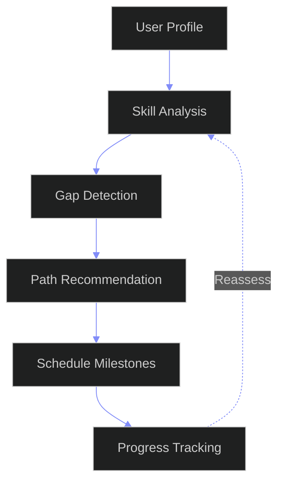

# Skill Roadmap Engine — Enterprise Learning Path Architecture

---

## Document Control

| Field | Value |
|---|---|
| Document ID | SB-SKILLROADMAP-ARCH-001 |
| Version | 1.0.0 |
| Status | Active |
| Last Updated | 2026-06-12 |
| Classification | Internal — Architecture Reference |
| Source of Truth | `docs/ai/skills/skills.md` (§15 Skill Roadmap Mapping, §8 Target Skills, §9 Skill Trees, §10 Skill Dependencies, §13 Skill Certification Framework, §14 Skill Project Mapping, §20 AI Recommendations, §19 Skill Analytics) |
| Companion Docs | `docs/ai/skills/SkillMarketIntelligence.md` (Market Data for Path Optimization) |
|  | `docs/ai/skills/SkillGraphArchitecture.md` (Graph Storage & Traversal) |
|  | `docs/ai/skills/SkillIntelligence.md` (Analytics Engine & Scoring Pipelines) |
|  | `docs/ai/skills/SkillEvidence.md` (Evidence Engine & Verification) |
|  | `docs/ai/skills/SkillAssessment.md` (Assessment Execution Engine) |
| Target Stack | Python 3.11+ (Roadmap Engine) + Neo4j (Graph Pathfinding) + PostgreSQL (State + Templates) + Redis (Session Cache) + FastAPI (API Layer) |
| Target Audience | AI Agents, Learning Engineers, Career Advisors, Data Engineers, Architects, Product Managers, Enterprise L&D |

---

## Table of Contents

- [1. Roadmap Architecture](#1-roadmap-architecture)
- [2. Learning Path Generation](#2-learning-path-generation)
- [3. Milestone Generation](#3-milestone-generation)
- [4. Project Recommendations](#4-project-recommendations)
- [5. Certification Recommendations](#5-certification-recommendations)
- [6. Dynamic Rescheduling](#6-dynamic-rescheduling)
- [7. AI Optimization Logic](#7-ai-optimization-logic)
- [8. Progress Tracking](#8-progress-tracking)
- [9. Scenario Planning](#9-scenario-planning)
- [10. Enterprise Roadmap Framework](#10-enterprise-roadmap-framework)
- [Appendix A: Formula Reference](#appendix-a-formula-reference)
- [Appendix B: Pathfinding Algorithms](#appendix-b-pathfinding-algorithms)
- [Appendix C: Prebuilt Roadmap Templates](#appendix-c-prebuilt-roadmap-templates)
- [Appendix D: Implementation Status](#appendix-d-implementation-status)
- [Appendix E: Glossary](#appendix-e-glossary)
- [Appendix F: Configuration Reference](#appendix-f-configuration-reference)

---

## 1. Roadmap Architecture

### 1.1 Why a Dedicated Roadmap Execution Engine?

Skills.md defines the **roadmap data model, milestone mapping, and readiness requirements** — what roadmaps exist, how they map to skills, and what preconditions are needed. SkillRoadmapEngine.md defines the **execution engine** — the runtime that ingests user profiles, generates personalized learning paths, schedules milestones, tracks progress dynamically, and optimizes with AI.

The relationship between the six companion documents:

| Document | Role | Analogy |
|---|---|---|
| `skills.md` (§15, §8, §9, §10) | Roadmap data model & formulas | Constitution |
| `SkillGraphArchitecture.md` (§6-8) | Graph traversal for pathfinding | GPS Map |
| `SkillMarketIntelligence.md` | Market demand, salary, growth data | Economist |
| `SkillIntelligence.md` | Analytics scoring pipelines | Data Analyst |
| `SkillAssessment.md` | Readiness validation | Exam Proctor |
| **`SkillRoadmapEngine.md`** | **Learning path execution engine** | **Personal Career GPS** |

### 1.2 Architecture Overview

```
┌─────────────────────────────────────────────────────────────────────────────────────┐
│                             ROADMAP EXECUTION ENGINE                                   │
│                                                                                       │
│  ┌───────────────────────────────────────────────────────────────────────────────┐   │
│  │                           INPUT LAYER                                           │   │
│  │  ┌────────────┐ ┌────────────┐ ┌────────────┐ ┌────────────┐ ┌──────────────┐│   │
│  │  │Current     │ │Target Role │ │Target      │ │Available   │ │Learning      ││   │
│  │  │Skills      │ │+ Company   │ │Level       │ │Time        │ │Speed         ││   │
│  │  └────────────┘ └────────────┘ └────────────┘ └────────────┘ └──────────────┘│   │
│  │  ┌────────────┐ ┌────────────┐ ┌────────────┐                                │   │
│  │  │Budget      │ │Experience  │ │Constraints │                                │   │
│  │  │            │ │Level       │ │(optional)  │                                │   │
│  │  └────────────┘ └────────────┘ └────────────┘                                │   │
│  └───────────────────────────────────────────────────────────────────────────────┘   │
│                                    │                                                   │
│                                    ▼                                                   │
│  ┌───────────────────────────────────────────────────────────────────────────────┐   │
│  │                         PROCESSING LAYER                                      │   │
│  │                                                                               │   │
│  │  ┌──────────────────┐  ┌──────────────────┐  ┌──────────────────────────┐   │   │
│  │  │ Profile Parser   │─▶│ Path Planner     │─▶│ Milestone Generator      │   │   │
│  │  │ (normalize       │  │ (DAG solver,     │  │ (level/time/skill/project│   │   │
│  │  │  + gap analysis) │  │  route scoring)  │  │  + checkpoints)          │   │   │
│  │  └──────────────────┘  └──────────────────┘  └──────────────────────────┘   │   │
│  │                                                                               │   │
│  │  ┌──────────────────┐  ┌──────────────────┐  ┌──────────────────────────┐   │   │
│  │  │ Project Rec.     │  │ Cert. Rec.       │  │ Dynamic Scheduler         │   │   │
│  │  │ (coverage +      │  │ (level bridge +  │  │ (time allocation,         │   │   │
│  │  │  complexity)     │  │  prep timeline)  │  │  velocity adjustment)    │   │   │
│  │  └──────────────────┘  └──────────────────┘  └──────────────────────────┘   │   │
│  │                                                                               │   │
│  │  ┌──────────────────┐  ┌──────────────────┐  ┌──────────────────────────┐   │   │
│  │  │ AI Optimizer     │  │ Progress Tracker  │  │ Scenario Planner          │   │   │
│  │  │ (LLM fine-tune   │  │ (velocity,        │  │ (what-if, Monte Carlo,   │   │   │
│  │  │  + scoring)      │  │  heatmap, alerts) │  │  multi-variable sim)     │   │   │
│  │  └──────────────────┘  └──────────────────┘  └──────────────────────────┘   │   │
│  └───────────────────────────────────────────────────────────────────────────────┘   │
│                                    │                                                   │
│                                    ▼                                                   │
│  ┌───────────────────────────────────────────────────────────────────────────────┐   │
│  │                           OUTPUT LAYER                                        │   │
│  │                                                                               │   │
│  │  ┌──────────────┐ ┌──────────────┐ ┌──────────────┐ ┌─────────────────────┐ │   │
│  │  │ Personalized │ │ Milestone    │ │ Project +    │ │ Progress Dashboard  │ │   │
│  │  │ Roadmap      │ │ Timeline     │ │ Cert Plan    │ │ + Alerts            │ │   │
│  │  └──────────────┘ └──────────────┘ └──────────────┘ └─────────────────────┘ │   │
│  │  ┌──────────────┐ ┌──────────────┐ ┌──────────────┐                          │   │
│  │  │ Scenario     │ │ API Response │ │ Graph Store  │                          │   │
│  │  │ Comparisons  │ │ (JSON)       │ │ (Neo4j)      │                          │   │
│  │  └──────────────┘ └──────────────┘ └──────────────┘                          │   │
│  └───────────────────────────────────────────────────────────────────────────────┘   │
└─────────────────────────────────────────────────────────────────────────────────────┘
```

### 1.2b Roadmap Generation Pipeline



### 1.2c Learning Path Optimization


### 1.3 Core Design Principles

| Principle | Rationale | Implementation |
|---|---|---|
| **Personalization-first** | Generic roadmaps fail — users need paths tailored to their level, speed, and constraints | Profile Parser computes 12-dimension user vector before path generation |
| **Graph-native pathfinding** | Skills are relational — path planning requires dependency-aware traversal | Neo4j graph queries for prerequisite resolution, A* for optimized routing |
| **Dynamic by design** | Static roadmaps break when life happens — schedules must adapt | Dynamic Scheduler recomputes on every check-in with velocity calibration |
| **Multi-factor optimization** | Best path balances speed, market value, income impact, and user preference | Configurable scoring weights with AI-assisted tuning |
| **Progressive disclosure** | Overwhelming users with a 3-year plan causes abandonment | Milestone system shows only the next 1-2 phases by default |
| **Evidence-based progress** | "I watched a video" is not progress — only demonstrated capability counts | Milestone gates require evidence submission + readiness validation |
| **Graceful degradation** | Every feature works without AI via algorithmic fallback | Inline Python algorithms for all LLM-dependent functions |
| **Enterprise isolation** | Multi-tenant data must never cross boundaries | Every query filtered by user_id + tenant_id; RLS on all tables |

### 1.4 Roadmap Types

| Type | Code | Source | Description | Personalization |
|---|---|---|---|---|
| Career Roadmap | career | Target Role + Company | Full career progression from current level to target role | High — role, company, level-specific |
| Skill Roadmap | skill | Target Skill | Deep-dive path to master a single skill | Medium — current level determines start |
| Certification Roadmap | certification | Target Certification | Exam preparation path with milestones | Medium — prep time varies by level |
| Project Roadmap | project | Target Project Type | Build a portfolio project end-to-end | Low — project scope is fixed |
| Market-Driven Roadmap | market | Trending Skills | Path for a high-demand skill with market data | High — velocity-adjusted to market windows |
| Gap-Filling Roadmap | gap | Opportunity Match | Shortest path to close specific skill gaps | High — exact gaps determine path |
| Adaptive Roadmap | adaptive | Current Progress | Real-time adjusted path based on actual progress | Very High — continuous recalibration |

### 1.5 Core Data Models

```python
from dataclasses import dataclass, field
from datetime import datetime, date, timedelta
from enum import Enum
from typing import Any

class SkillLevel(Enum):
    UNKNOWN = 0
    BEGINNER = 1
    BASIC = 2
    INTERMEDIATE = 3
    ADVANCED = 4
    EXPERT = 5

class MilestoneType(Enum):
    LEVEL_UP = "level_up"
    TIME_BASED = "time_based"
    SKILL_COUNT = "skill_count"
    PROJECT_COMPLETE = "project_complete"
    CERTIFICATION = "certification"
    COMPOSITE = "composite"

class RoadmapStatus(Enum):
    DRAFT = "draft"
    ACTIVE = "active"
    PAUSED = "paused"
    COMPLETED = "completed"
    ARCHIVED = "archived"
    STALE = "stale"

class LearningSpeed(Enum):
    STANDARD = 1.0
    FAST = 1.5
    EXCEPTIONAL = 2.0
    CASUAL = 0.7
    LIMITED = 0.5

@dataclass
class UserSkill:
    skill_id: str
    skill_name: str
    current_level: SkillLevel
    target_level: SkillLevel | None = None
    confidence: float = 0.0
    evidence_count: int = 0
    last_active: datetime | None = None
    hours_invested: int = 0
    learning_velocity: float = 0.0

@dataclass
class SkillGap:
    skill_id: str
    skill_name: str
    current_level: SkillLevel
    target_level: SkillLevel
    gap_size: int
    priority: str = "medium"
    estimated_hours: int = 0
    prerequisites_met: bool = False

@dataclass
class ProfileInput:
    current_skills: list[UserSkill]
    target_role: str | None = None
    target_company: str | None = None
    target_skills: list[str] = field(default_factory=list)
    target_certification: str | None = None
    target_level: SkillLevel | None = None
    available_hours_per_week: float = 10.0
    learning_speed: LearningSpeed = LearningSpeed.STANDARD
    monthly_budget_usd: float = 100.0
    experience_level: SkillLevel = SkillLevel.BEGINNER
    preferences: dict = field(default_factory=dict)

@dataclass
class RoadmapConfig:
    use_income_weighting: bool = False
    use_market_weighting: bool = True
    use_user_preference_weighting: bool = True
    max_concurrent_skills: int = 3
    milestone_checkin_frequency_days: int = 14
    stale_skill_days: int = 30
    reschedule_on_checkin: bool = True
    ai_assisted_optimization: bool = False
    confidence_threshold: float = 0.3

@dataclass
class Milestone:
    milestone_id: str
    roadmap_id: str
    milestone_type: MilestoneType
    title: str
    description: str
    target_date: date
    completed: bool = False
    completed_at: datetime | None = None
    skills_involved: list[str] = field(default_factory=list)
    prerequisites: list[str] = field(default_factory=list)
    estimated_hours: int = 0
    actual_hours: int = 0
    status: str = "pending"
    checkpoint_ids: list[str] = field(default_factory=list)
    evidence_required: int = 0
    assessment_required: bool = False
    cert_required: str | None = None
    project_required: str | None = None
    readiness_score: float = 0.0

@dataclass
class Checkpoint:
    checkpoint_id: str
    milestone_id: str
    title: str
    description: str
    completed: bool = False
    weight: float = 1.0
    order: int = 0

@dataclass
class ResourceRecommendation:
    resource_id: str
    title: str
    resource_type: str
    url: str | None = None
    estimated_hours: int = 0
    cost_usd: float = 0.0
    skill_id: str = ""
    relevance_score: float = 0.0
    confidence: float = 0.0
    provider: str = ""

@dataclass
class ProjectRecommendation:
    project_id: str
    title: str
    description: str
    complexity_tier: int
    skills_covered: list[str] = field(default_factory=list)
    skills_developed: list[str] = field(default_factory=list)
    estimated_hours: int = 0
    demonstrable_output: str = ""
    difficulty_level: SkillLevel = SkillLevel.BEGINNER

@dataclass
class CertificationRecommendation:
    cert_id: str
    cert_name: str
    provider: str
    skills_covered: list[str] = field(default_factory=list)
    level_equivalent: SkillLevel = SkillLevel.INTERMEDIATE
    estimated_prep_hours: int = 0
    cost_usd: float = 0.0
    validity_years: int = 3
    prerequisite_certs: list[str] = field(default_factory=list)
    exam_format: str = ""

@dataclass
class LearningPath:
    path_id: str
    target_role: str
    phases: list["Phase"] = field(default_factory=list)
    total_estimated_hours: int = 0
    total_duration_days: int = 0
    confidence: float = 0.0
    created_at: datetime = field(default_factory=datetime.now)
    milestones: list[Milestone] = field(default_factory=list)
    project_recommendations: list[ProjectRecommendation] = field(default_factory=list)
    cert_recommendations: list[CertificationRecommendation] = field(default_factory=list)
    resource_recommendations: list[ResourceRecommendation] = field(default_factory=list)

@dataclass
class Phase:
    phase_id: str
    phase_number: int
    title: str
    description: str
    estimated_hours: int = 0
    duration_days: int = 0
    target_level: SkillLevel = SkillLevel.BEGINNER
    skills: list[str] = field(default_factory=list)
    milestones: list[str] = field(default_factory=list)
    prerequisites: list[str] = field(default_factory=list)

@dataclass
class ScenarioResult:
    scenario_id: str
    label: str
    path: LearningPath
    confidence: float
    estimated_completion: date
    total_cost: float
    projected_income_impact: float = 0.0
    risk_level: str = "medium"
    assumptions: dict = field(default_factory=dict)
```

### 1.6 Six-Layer Pipeline

```python
class RoadmapOrchestrator:
    def __init__(self, config: RoadmapConfig | None = None):
        self.config = config or RoadmapConfig()
        self.parser = ProfileParser()
        self.path_planner = PathPlanner(self.config)
        self.milestone_gen = MilestoneGenerator()
        self.project_rec = ProjectRecommender()
        self.cert_adviser = CertificationAdvisor()
        self.scheduler = DynamicScheduler(self.config)
        self.tracker = ProgressTracker(self.config)
        self.scenario_planner = ScenarioPlanner()
        self.ai_optimizer = RoadmapAIOptimizer(self.config)

    async def generate_roadmap(self, profile: ProfileInput) -> LearningPath:
        parsed = await self.parser.parse(profile)
        path = await self.path_planner.generate(parsed)
        path = await self.milestone_gen.attach_milestones(path)
        path = await self.project_rec.attach_projects(path)
        path = await self.cert_adviser.attach_certifications(path)
        path = await self.scheduler.schedule(path, profile)
        if self.config.ai_assisted_optimization:
            path = await self.ai_optimizer.optimize(path, profile)
        return path

    async def checkin_update(self, roadmap_id: str, progress: dict) -> LearningPath:
        path = await self.tracker.update(roadmap_id, progress)
        if self.config.reschedule_on_checkin:
            path = await self.scheduler.reschedule(path)
        if self.config.ai_assisted_optimization:
            path = await self.ai_optimizer.optimize(path, None)
        return path

    async def scenario_compare(self, profile: ProfileInput, variables: list[dict]) -> list[ScenarioResult]:
        return await self.scenario_planner.run_scenarios(profile, variables)
```

### 1.7 Profile Parser

```python
class ProfileParser:
    async def parse(self, profile: ProfileInput) -> dict:
        return {
            "current_skills": await self._parse_current_skills(profile.current_skills),
            "target": await self._parse_target(profile),
            "constraints": self._parse_constraints(profile),
            "velocity_estimate": self._estimate_velocity(profile),
            "gaps": await self._compute_gaps(profile.current_skills, profile),
            "prerequisites": await self._check_prerequisites(profile),
        }

    async def _parse_current_skills(self, skills: list[UserSkill]) -> dict:
        mapped: dict[str, UserSkill] = {}
        for skill in skills:
            mapped[skill.skill_id] = skill
            if not hasattr(skill, 'learning_velocity') or skill.learning_velocity == 0.0:
                skill.learning_velocity = self._estimate_velocity_from_history(skill)
        return {"skills": mapped, "count": len(mapped),
            "avg_level": sum(s.current_level.value for s in mapped.values()) / len(mapped) if mapped else 0}

    async def _parse_target(self, profile: ProfileInput) -> dict:
        role = profile.target_role or "Custom Development Path"
        company = profile.target_company or ""
        return {"role": role, "company": company, "level": profile.target_level,
            "skills": profile.target_skills, "certification": profile.target_certification,
            "normalized_role": role.lower().replace("-", "_").replace(" ", "_")}

    def _parse_constraints(self, profile: ProfileInput) -> dict:
        return {"hours_per_week": max(1.0, profile.available_hours_per_week),
            "speed_multiplier": profile.learning_speed.value if isinstance(profile.learning_speed, LearningSpeed) else 1.0,
            "budget_monthly": max(0, profile.monthly_budget_usd),
            "experience_base": profile.experience_level.value if isinstance(profile.experience_level, SkillLevel) else profile.experience_level,
            "max_concurrent": self._compute_max_concurrent(profile.available_hours_per_week)}

    def _compute_max_concurrent(self, hours_per_week: float) -> int:
        if hours_per_week >= 30: return 5
        if hours_per_week >= 20: return 4
        if hours_per_week >= 10: return 3
        if hours_per_week >= 5: return 2
        return 1

    def _estimate_velocity(self, profile: ProfileInput) -> dict:
        base = profile.learning_speed.value if isinstance(profile.learning_speed, LearningSpeed) else 1.0
        hours_factor = min(1.5, profile.available_hours_per_week / 20)
        experience_factor = 1.0 + (profile.experience_level.value if isinstance(profile.experience_level, SkillLevel) else 0) * 0.05
        return {"monthly_level_gain": 0.2 * base * hours_factor * experience_factor,
            "base_speed": base, "hours_factor": hours_factor, "experience_factor": experience_factor}

    def _estimate_velocity_from_history(self, skill: UserSkill) -> float:
        if skill.hours_invested == 0 or skill.current_level.value == 0: return 0.15
        return skill.current_level.value / (skill.hours_invested / 40)

    async def _compute_gaps(self, current: list[UserSkill], profile: ProfileInput) -> list[SkillGap]:
        current_map = {s.skill_id: s for s in current}
        gaps: list[SkillGap] = []
        for target in profile.target_skills:
            curr = current_map.get(target)
            curr_level = curr.current_level.value if curr else 0
            target_level = profile.target_level.value if profile.target_level else 3
            gap = SkillGap(skill_id=target, skill_name=target, current_level=SkillLevel(curr_level),
                target_level=SkillLevel(target_level), gap_size=max(0, target_level - curr_level))
            gap.priority = "high" if gap.gap_size >= 2 else ("medium" if gap.gap_size >= 1 else "low")
            gap.estimated_hours = gap.gap_size * 80
            gap.prerequisites_met = True
            gaps.append(gap)
        gaps.sort(key=lambda g: g.gap_size, reverse=True)
        return gaps

    async def _check_prerequisites(self, profile: ProfileInput) -> dict:
        return {"all_met": True, "missing": [], "warnings": []}
```

### 1.8 Event-Driven Architecture

The roadmap engine emits events at every state change, enabling loose coupling with other system components:

```python
@dataclass
class RoadmapEvent:
    event_type: str
    roadmap_id: str
    user_id: str
    payload: dict
    timestamp: datetime = field(default_factory=datetime.utcnow)
    correlation_id: str = field(default_factory=lambda: str(uuid.uuid4()))

class RoadmapEventBus:
    def __init__(self):
        self._handlers: dict[str, list[Callable]] = defaultdict(list)
        self._event_log: list[RoadmapEvent] = []

    def subscribe(self, event_type: str, handler: Callable) -> None:
        self._handlers[event_type].append(handler)

    def unsubscribe(self, event_type: str, handler: Callable) -> None:
        if handler in self._handlers.get(event_type, []):
            self._handlers[event_type].remove(handler)

    async def emit(self, event: RoadmapEvent) -> None:
        self._event_log.append(event)
        handlers = self._handlers.get(event.event_type, []) + self._handlers.get("*", [])
        results = []
        for handler in handlers:
            try:
                result = await handler(event) if asyncio.iscoroutinefunction(handler) else handler(event)
                results.append(result)
            except Exception as err:
                logger.error(f"Event handler failed for {event.event_type}: {err}")
        return results

    def get_events(self, event_type: str | None = None, limit: int = 100) -> list[RoadmapEvent]:
        if event_type:
            return [e for e in self._event_log if e.event_type == event_type][:limit]
        return self._event_log[-limit:]

    def clear(self) -> None:
        self._event_log.clear()

event_bus = RoadmapEventBus()

# Event types
ROADMAP_EVENTS = {
    "roadmap.created": "A new roadmap was created",
    "roadmap.phase_unlocked": "A phase was unlocked for the user",
    "roadmap.phase_completed": "A phase was completed",
    "roadmap.milestone_reached": "A milestone was achieved",
    "roadmap.schedule_adjusted": "Schedule was automatically adjusted",
    "roadmap.scenario_compared": "Multiple scenarios were compared",
    "roadmap.ai_optimized": "AI optimization was applied",
    "roadmap.cert_recommended": "A certification was recommended",
    "roadmap.project_recommended": "A project was recommended",
    "roadmap.goal_aligned": "Roadmap was aligned with user goals",
    "roadmap.velocity_changed": "User learning velocity changed significantly",
    "roadmap.buffer_status_changed": "Buffer management status changed",
}

# Example handlers
async def on_phase_completed(event: RoadmapEvent) -> None:
    logger.info(f"Phase completed for roadmap {event.roadmap_id}: {event.payload}")
    # Trigger notification to user
    # Check if next phase should be auto-unlocked
    phase_number = event.payload.get("phase_number", 0)
    if phase_number > 0:
        logger.info(f"Auto-unlocking phase {phase_number + 1}")

async def on_velocity_changed(event: RoadmapEvent) -> None:
    new_velocity = event.payload.get("new_velocity", 0)
    old_velocity = event.payload.get("old_velocity", 0)
    if new_velocity < old_velocity * 0.7:
        logger.warning(f"Velocity drop detected for user {event.user_id}")
        # Trigger schedule re-evaluation

async def on_buffer_status_changed(event: RoadmapEvent) -> None:
    status = event.payload.get("status", "green")
    if status == "red":
        logger.warning(f"Buffer critical for roadmap {event.roadmap_id}")
        # Alert user and suggest reprioritization

# Register handlers
event_bus.subscribe("roadmap.phase_completed", on_phase_completed)
event_bus.subscribe("roadmap.velocity_changed", on_velocity_changed)
event_bus.subscribe("roadmap.buffer_status_changed", on_buffer_status_changed)
event_bus.subscribe("*", lambda e: logger.debug(f"Event: {e.event_type}"))  # Catch-all logger
```

### 1.9 Plugin Architecture

```python
class RoadmapPlugin(ABC):
    @abstractmethod
    def name(self) -> str:
        ...

    @abstractmethod
    def version(self) -> str:
        ...

    @abstractmethod
    async def initialize(self, config: dict) -> None:
        ...

    @abstractmethod
    async def shutdown(self) -> None:
        ...

    async def on_roadmap_created(self, roadmap: dict) -> dict:
        return roadmap

    async def on_phase_generated(self, phase: dict) -> dict:
        return phase

    async def on_milestone_generated(self, milestone: dict) -> dict:
        return milestone

    async def on_scenario_evaluated(self, scenario: dict) -> dict:
        return scenario

class PluginManager:
    def __init__(self):
        self._plugins: dict[str, RoadmapPlugin] = {}
        self._configs: dict[str, dict] = {}

    def register(self, plugin: RoadmapPlugin, config: dict | None = None) -> None:
        self._plugins[plugin.name()] = plugin
        self._configs[plugin.name()] = config or {}

    def unregister(self, name: str) -> None:
        self._plugins.pop(name, None)
        self._configs.pop(name, None)

    async def initialize_all(self) -> None:
        for name, plugin in self._plugins.items():
            try:
                await plugin.initialize(self._configs.get(name, {}))
                logger.info(f"Plugin initialized: {name} v{plugin.version()}")
            except Exception as err:
                logger.error(f"Plugin initialization failed: {name}: {err}")

    async def shutdown_all(self) -> None:
        for name, plugin in self._plugins.items():
            try:
                await plugin.shutdown()
                logger.info(f"Plugin shut down: {name}")
            except Exception as err:
                logger.error(f"Plugin shutdown failed: {name}: {err}")

    def get_plugin(self, name: str) -> RoadmapPlugin | None:
        return self._plugins.get(name)

    def list_plugins(self) -> list[dict]:
        return [{"name": n, "version": p.version(), "config": self._configs.get(n, {})}
                for n, p in self._plugins.items()]

# Example plugins
class MarketDataPlugin(RoadmapPlugin):
    def name(self) -> str: return "market_data"
    def version(self) -> str: return "1.0.0"
    async def initialize(self, config: dict) -> None:
        self._api_key = config.get("api_key")
    async def shutdown(self) -> None:
        self._api_key = None
    async def on_roadmap_created(self, roadmap: dict) -> dict:
        roadmap["market_aligned"] = True
        return roadmap

class IncomeProjectionPlugin(RoadmapPlugin):
    def name(self) -> str: return "income_projection"
    def version(self) -> str: return "1.1.0"
    async def initialize(self, config: dict) -> None: pass
    async def shutdown(self) -> None: pass
    async def on_scenario_evaluated(self, scenario: dict) -> dict:
        scenario["projected_income_5y"] = scenario.get("base_salary", 0) * 1.3
        return scenario

class CertificationDiscountPlugin(RoadmapPlugin):
    def name(self) -> str: return "cert_discounts"
    def version(self) -> str: return "0.2.0"
    async def initialize(self, config: dict) -> None:
        self._discount_map = config.get("discounts", {})
    async def shutdown(self) -> None: pass
    async def on_milestone_generated(self, milestone: dict) -> dict:
        if milestone.get("certification"):
            cert_id = milestone["certification"]
            discount = self._discount_map.get(cert_id, 0)
            milestone["discounted_cost"] = milestone.get("cost_usd", 0) * (1 - discount)
        return milestone

plugin_manager = PluginManager()
plugin_manager.register(MarketDataPlugin(), {"api_key": os.getenv("MARKET_API_KEY", "")})
plugin_manager.register(IncomeProjectionPlugin())
plugin_manager.register(CertificationDiscountPlugin(), {"discounts": {"aws_saa": 0.15, "cka": 0.1}})
```

### 1.10 Telemetry & Observability

```python
class RoadmapTelemetry:
    def __init__(self, supabase_client):
        self._client = supabase_client
        self._metrics: dict[str, list[float]] = defaultdict(list)

    def record_latency(self, operation: str, duration_ms: float) -> None:
        self._metrics[f"latency.{operation}"].append(duration_ms)

    def record_count(self, metric: str, count: int = 1) -> None:
        self._metrics[f"count.{metric}"].append(count)

    def get_latency_stats(self, operation: str) -> dict | None:
        values = self._metrics.get(f"latency.{operation}")
        if not values:
            return None
        return {
            "operation": operation,
            "count": len(values),
            "mean_ms": statistics.mean(values),
            "median_ms": statistics.median(values),
            "p95_ms": sorted(values)[int(len(values) * 0.95)],
            "p99_ms": sorted(values)[int(len(values) * 0.99)],
            "min_ms": min(values),
            "max_ms": max(values),
        }

    async def snapshot_to_db(self, tenant_id: str) -> None:
        snapshot = {
            "tenant_id": tenant_id,
            "timestamp": datetime.utcnow().isoformat(),
            "metrics": {
                k: (statistics.mean(v) if k.startswith("latency.") else sum(v))
                for k, v in self._metrics.items()
            },
        }
        await self._client.table("roadmap_telemetry").insert(snapshot).execute()
        self._metrics.clear()
```

## 2. Learning Path Generation

### 2.1 Path Generation Pipeline

The learning path generator converts a parsed user profile into an ordered, dependency-aware sequence of skill acquisition. It operates on a skill DAG (Directed Acyclic Graph) where edges represent prerequisite relationships.

```
Input: Parsed Profile + Skill DAG
  │
  ▼
┌─────────────────────────────────┐
│ Step 1: Skill Set Resolution     │
│ Identify ALL skills needed for   │
│ target role + transitive deps    │
└──────────┬──────────────────────┘
           ▼
┌─────────────────────────────────┐
│ Step 2: Dependency Graph Build  │
│ Construct subgraph of required  │
│ skills with all edges           │
└──────────┬──────────────────────┘
           ▼
┌─────────────────────────────────┐
│ Step 3: Topological Sort        │
│ Linearize DAG respecting all    │
│ hard + soft dependencies        │
└──────────┬──────────────────────┘
           ▼
┌─────────────────────────────────┐
│ Step 4: Parallel Track Detection│
│ Identify skills that can be     │
│ learned concurrently            │
└──────────┬──────────────────────┘
           ▼
┌─────────────────────────────────┐
│ Step 5: Phase Assembly          │
│ Group into ordered phases with  │
│ time estimates, levels          │
└──────────┬──────────────────────┘
           ▼
Output: Ordered LearningPath with phases, milestones, estimates
```

### 2.2 Skill DAG Solver

```python
class SkillDAGSolver:
    def __init__(self, graph):
        self.graph = graph

    def resolve_required_skills(self, target_role: str, user_skills: dict[str, UserSkill]) -> set[str]:
        required: set[str] = set()
        direct = self._get_skills_for_role(target_role)
        for skill_id in direct:
            required.add(skill_id)
            deps = self._get_transitive_dependencies(skill_id)
            required.update(deps)
        acquired = {sid for sid, s in user_skills.items() if s.current_level.value >= 3}
        return required - acquired

    def _get_transitive_dependencies(self, skill_id: str, visited: set[str] | None = None) -> set[str]:
        if visited is None: visited = set()
        if skill_id in visited: return set()
        visited.add(skill_id)
        deps: set[str] = set()
        for edge in self._get_edges(skill_id, "incoming"):
            if edge.relationship_type in ("hard", "soft"):
                deps.add(edge.from_skill)
                deps.update(self._get_transitive_dependencies(edge.from_skill, visited))
        return deps

    def _get_skills_for_role(self, role: str) -> list[str]:
        role_data = ROLE_SKILL_MAP.get(role, {})
        return role_data.get("required", []) + role_data.get("preferred", [])

    def _get_edges(self, skill_id: str, direction: str) -> list:
        return []

    def build_subgraph(self, skill_ids: set[str]) -> dict:
        nodes: dict[str, dict] = {}
        for sid in skill_ids:
            skill_data = self._get_skill_data(sid)
            nodes[sid] = {"id": sid, "name": skill_data.get("name", sid),
                "dependencies": [], "level_required": self._get_skill_level(sid), "category": skill_data.get("category", "")}
        for sid in skill_ids:
            for edge in self._get_edges(sid, "incoming"):
                if edge.from_skill in skill_ids:
                    nodes[sid]["dependencies"].append(edge.from_skill)
        return nodes

    def _get_skill_data(self, skill_id: str) -> dict:
        data = supabase.table("skills").select("name, category, level").eq("id", skill_id).execute()
        return data.data[0] if data.data else {"name": skill_id, "category": "unknown"}

    def _get_skill_level(self, skill_id: str) -> SkillLevel:
        return SkillLevel.INTERMEDIATE

    def topological_sort(self, subgraph: dict) -> list[str]:
        in_degree: dict[str, int] = {nid: 0 for nid in subgraph}
        for nid, node in subgraph.items():
            for dep in node["dependencies"]:
                if dep in in_degree:
                    in_degree[nid] += 1
        queue: list[str] = [nid for nid, deg in in_degree.items() if deg == 0]
        sorted_order: list[str] = []
        while queue:
            nid = queue.pop(0)
            sorted_order.append(nid)
            for other_nid, other_node in subgraph.items():
                if nid in other_node["dependencies"]:
                    in_degree[other_nid] -= 1
                    if in_degree[other_nid] == 0:
                        queue.append(other_nid)
        if len(sorted_order) != len(subgraph):
            cycle = set(subgraph.keys()) - set(sorted_order)
            raise ValueError(f"Cycle detected in skill graph: {cycle}")
        return sorted_order

    def detect_parallel_tracks(self, sorted_skills: list[str], subgraph: dict) -> list[list[str]]:
        assigned: dict[str, int] = {}
        tracks: list[list[str]] = []
        for sid in sorted_skills:
            deps = subgraph[sid]["dependencies"]
            if not deps:
                track_idx = 0
            else:
                max_dep_track = max(assigned.get(d, -1) for d in deps)
                track_idx = max_dep_track + 1
            assigned[sid] = track_idx
            while len(tracks) <= track_idx:
                tracks.append([])
            tracks[track_idx].append(sid)
        return tracks

    def a_star_path(self, start: str, goal: str, user_levels: dict[str, int]) -> list[str]:
        import heapq
        open_set: list[tuple[float, str, list[str]]] = [(0.0, start, [start])]
        visited: set[str] = set()
        while open_set:
            f, current, path = heapq.heappop(open_set)
            if current == goal: return path
            if current in visited: continue
            visited.add(current)
            for edge in self._get_edges(current, "outgoing"):
                neighbor = edge.to_skill
                if neighbor in visited: continue
                g = len(path)
                h = self._heuristic(neighbor, goal, user_levels)
                heapq.heappush(open_set, (g + h, neighbor, path + [neighbor]))
        return []

    def _heuristic(self, current: str, goal: str, user_levels: dict[str, int]) -> float:
        if current == goal: return 0.0
        level_gap = abs(user_levels.get(current, 0) - user_levels.get(goal, 3))
        return level_gap * 0.8
```

### 2.3 Path Planner

```python
class PathPlanner:
    def __init__(self, config: RoadmapConfig):
        self.config = config
        self.dag_solver = SkillDAGSolver(None)

    async def generate(self, parsed_profile: dict) -> LearningPath:
        current_skills = parsed_profile["current_skills"]["skills"]
        target = parsed_profile["target"]
        gaps = parsed_profile["gaps"]
        constraints = parsed_profile["constraints"]
        velocity = parsed_profile["velocity_estimate"]

        required_ids = list(g. skill_id for g in gaps) if gaps else list(current_skills.keys())[:5]
        subgraph = self.dag_solver.build_subgraph(set(required_ids))
        sorted_skills = self.dag_solver.topological_sort(subgraph)
        parallel_tracks = self.dag_solver.detect_parallel_tracks(sorted_skills, subgraph)
        phases = self._build_phases(parallel_tracks, target, velocity, constraints)
        path = LearningPath(
            path_id=hashlib.sha256(f"{target['role']}:{datetime.now().isoformat()}".encode()).hexdigest()[:16],
            target_role=target["role"],
            phases=phases,
            total_estimated_hours=sum(p.estimated_hours for p in phases),
            total_duration_days=sum(p.duration_days for p in phases),
            confidence=self._compute_path_confidence(phases, velocity))
        return path

    async def generate_by_priority(self, parsed_profile: dict) -> LearningPath:
        gaps = sorted(parsed_profile["gaps"], key=lambda g: g.gap_size, reverse=True)
        top_gaps = gaps[:5]
        subgraph = self.dag_solver.build_subgraph(set(g.skill_id for g in top_gaps))
        sorted_skills = self.dag_solver.topological_sort(subgraph)
        phases = self._build_phases_by_priority(sorted_skills, top_gaps, parsed_profile["target"], parsed_profile["velocity"], parsed_profile["constraints"])
        return LearningPath(path_id="priority", target_role=parsed_profile["target"]["role"], phases=phases,
            total_estimated_hours=sum(p.estimated_hours for p in phases),
            total_duration_days=sum(p.duration_days for p in phases), confidence=0.7)

    def _build_phases(self, tracks: list[list[str]], target: dict, velocity: dict, constraints: dict) -> list[Phase]:
        phases: list[Phase] = []
        phase_num = 0
        skills_covered: set[str] = set()
        for track in tracks:
            remaining = [s for s in track if s not in skills_covered]
            if not remaining: continue
            phase_num += 1
            phase_level = min(phase_num, 5)
            total_hours = len(remaining) * 80
            weeks = max(4, total_hours / constraints["hours_per_week"])
            phase = Phase(
                phase_id=f"phase_{phase_num}",
                phase_number=phase_num,
                title=f"Phase {phase_num}: {target.get('normalized_role', 'development').replace('_', ' ').title()} — Level {phase_level}",
                description=self._generate_phase_description(phase_num, remaining, target),
                estimated_hours=total_hours,
                duration_days=int(weeks * 7),
                target_level=SkillLevel(min(phase_level, 5)),
                skills=remaining,
                prerequisites=list(skills_covered) if skills_covered else [],
                milestones=[])
            skills_covered.update(remaining)
            phases.append(phase)
        if not phases:
            phases.append(Phase(phase_id="phase_1", phase_number=1, title="Foundation", description="No skills identified — general skill building",
                estimated_hours=40, duration_days=14, target_level=SkillLevel.BEGINNER, skills=[], prerequisites=[], milestones=[]))
        return phases

    def _build_phases_by_priority(self, sorted_skills: list[str], gaps: list[SkillGap], target: dict, velocity: dict, constraints: dict) -> list[Phase]:
        phases: list[Phase] = []
        gap_map = {g.skill_id: g for g in gaps}
        chunk_size = max(1, constraints.get("max_concurrent", 3))
        for i in range(0, len(sorted_skills), chunk_size):
            chunk = sorted_skills[i:i + chunk_size]
            phase_num = i // chunk_size + 1
            total_hours = sum(gap_map.get(s, SkillGap(skill_id=s, skill_name=s, current_level=SkillLevel.UNKNOWN, target_level=SkillLevel.INTERMEDIATE, gap_size=3)).estimated_hours for s in chunk)
            weeks = max(2, total_hours / constraints["hours_per_week"])
            phases.append(Phase(
                phase_id=f"priority_phase_{phase_num}", phase_number=phase_num,
                title=f"Priority Phase {phase_num}: Gap Closure",
                description=f"Close remaining gaps in {', '.join(chunk[:3])}" + (f" and {len(chunk)-3} more" if len(chunk) > 3 else ""),
                estimated_hours=total_hours, duration_days=int(weeks * 7),
                target_level=SkillLevel.INTERMEDIATE, skills=chunk, prerequisites=[]))
        return phases

    def _generate_phase_description(self, phase_num: int, skills: list[str], target: dict) -> str:
        level_names = {1: "foundational", 2: "core", 3: "intermediate", 4: "advanced", 5: "expert"}
        level = level_names.get(phase_num, "advanced")
        skill_list = ", ".join(skills[:5])
        return f"Build {level} capabilities for {target.get('normalized_role', 'your target role').replace('_', ' ')}. Focus: {skill_list}."

    def _compute_path_confidence(self, phases: list[Phase], velocity: dict) -> float:
        if not phases: return 0.0
        base_confidence = 0.8
        duration_penalty = min(0.3, sum(p.duration_days for p in phases) / 730 * 0.3)
        speed_bonus = min(0.1, (velocity.get("monthly_level_gain", 0.2) - 0.2) * 0.5)
        return round(min(1.0, max(0.1, base_confidence - duration_penalty + speed_bonus)), 3)
```

### 2.4 Path Scoring Modes

```python
class PathScorer:
    def __init__(self, config: RoadmapConfig):
        self.config = config
        self.market = MarketDataProvider() if config.use_market_weighting else None
        self.income = IncomeDataProvider() if config.use_income_weighting else None

    def score_path(self, path: LearningPath, profile: ProfileInput) -> float:
        scores = []
        weights = []
        if self.config.use_market_weighting:
            market_score = self._score_market_alignment(path)
            scores.append(market_score); weights.append(0.35)
        if self.config.use_income_weighting:
            income_score = self._score_income_impact(path)
            scores.append(income_score); weights.append(0.20)
        if self.config.use_user_preference_weighting:
            preference_score = self._score_user_alignment(path, profile)
            scores.append(preference_score); weights.append(0.25)
        feasibility_score = self._score_feasibility(path, profile)
        scores.append(feasibility_score); weights.append(0.20)
        if not scores: return 0.5
        total_weight = sum(weights)
        return sum(s * w for s, w in zip(scores, weights)) / total_weight

    def _score_market_alignment(self, path: LearningPath) -> float:
        if not self.market: return 0.5
        scores: list[float] = []
        for phase in path.phases:
            for skill in phase.skills:
                demand = self.market.get_demand(skill)
                if demand: scores.append(demand["score"] / 100.0)
        return sum(scores) / len(scores) if scores else 0.5

    def _score_income_impact(self, path: LearningPath) -> float:
        if not self.income: return 0.5
        scores: list[float] = []
        for phase in path.phases:
            for skill in phase.skills:
                income = self.income.get_income_potential(skill)
                if income: scores.append(min(1.0, income["p50"] / 200000))
        return sum(scores) / len(scores) if scores else 0.5

    def _score_user_alignment(self, path: LearningPath, profile: ProfileInput) -> float:
        if not profile.preferences: return 0.5
        preferred_categories = set(profile.preferences.get("categories", []))
        if not preferred_categories: return 0.5
        match_count = 0
        total = 0
        for phase in path.phases:
            for skill in phase.skills:
                total += 1
                if skill in preferred_categories: match_count += 1
        return match_count / total if total > 0 else 0.5

    def _score_feasibility(self, path: LearningPath, profile: ProfileInput) -> float:
        if not path.phases: return 0.0
        total_hours = sum(p.estimated_hours for p in path.phases)
        available_hours = profile.available_hours_per_week * 52
        if available_hours == 0: return 0.1
        ratio = total_hours / available_hours
        if ratio <= 1.0: return 0.9
        if ratio <= 2.0: return 0.6
        return 0.3

class MarketDataProvider:
    def get_demand(self, skill_id: str) -> dict | None:
        data = supabase.table("skill_current_scores").select("demand_score").eq("id", skill_id).execute()
        return {"score": data.data[0]["demand_score"]} if data.data else None

    def get_growth(self, skill_id: str) -> float | None:
        data = supabase.table("skill_current_scores").select("growth_score").eq("id", skill_id).execute()
        return data.data[0]["growth_score"] if data.data else None

class IncomeDataProvider:
    def get_income_potential(self, skill_id: str) -> dict | None:
        data = supabase.table("skill_income_data").select("p50").eq("skill_id", skill_id).execute()
        return {"p50": data.data[0]["p50"]} if data.data else None
```

### 2.5 Role-to-Skill Mapping

```python
ROLE_SKILL_MAP: dict[str, dict] = {
    "frontend_engineer": {"required": ["html", "css", "javascript", "react"],
        "preferred": ["typescript", "testing", "accessibility"], "target_level": SkillLevel.ADVANCED,
        "estimated_months": 12},
    "backend_engineer": {"required": ["python", "sql", "rest_api", "git"],
        "preferred": ["docker", "postgresql", "fastapi", "testing"], "target_level": SkillLevel.ADVANCED,
        "estimated_months": 12},
    "ai_ml_engineer": {"required": ["python", "linear_algebra", "probability", "machine_learning"],
        "preferred": ["deep_learning", "nlp", "pytorch", "mlops", "sql"], "target_level": SkillLevel.ADVANCED,
        "estimated_months": 14},
    "agent_engineer": {"required": ["python", "llm_apis", "prompt_engineering"],
        "preferred": ["langchain", "vector_dbs", "rag", "function_calling"], "target_level": SkillLevel.ADVANCED,
        "estimated_months": 10},
    "full_stack_developer": {"required": ["html", "css", "javascript", "react", "python", "sql", "git"],
        "preferred": ["typescript", "docker", "testing", "devops"], "target_level": SkillLevel.ADVANCED,
        "estimated_months": 16},
    "devops_engineer": {"required": ["linux", "networking", "docker", "kubernetes", "ci_cd", "cloud"],
        "preferred": ["terraform", "monitoring", "security", "python"], "target_level": SkillLevel.ADVANCED,
        "estimated_months": 12},
    "cloud_architect": {"required": ["cloud_fundamentals", "networking", "security", "database_design"],
        "preferred": ["kubernetes", "terraform", "microservices", "cost_optimization"], "target_level": SkillLevel.ADVANCED,
        "estimated_months": 14},
    "data_engineer": {"required": ["python", "sql", "data_warehousing", "etl"],
        "preferred": ["spark", "kafka", "airflow", "cloud", "dbt"], "target_level": SkillLevel.ADVANCED,
        "estimated_months": 12},
    "product_manager": {"required": ["product_strategy", "user_research", "data_analysis", "agile"],
        "preferred": ["technical_fluency", "a_b_testing", "roadmapping"], "target_level": SkillLevel.ADVANCED,
        "estimated_months": 10},
    "startup_founder": {"required": ["full_stack", "product", "growth", "business_modeling"],
        "preferred": ["fundraising", "hiring", "legal", "sales"], "target_level": SkillLevel.INTERMEDIATE,
        "estimated_months": 18},
}

def get_skills_for_role(role_name: str) -> dict:
    key = role_name.lower().strip().replace("-", "_").replace(" ", "_")
    return ROLE_SKILL_MAP.get(key, {"required": [], "preferred": [], "target_level": SkillLevel.INTERMEDIATE, "estimated_months": 6})

def get_all_role_names() -> list[str]:
    return list(ROLE_SKILL_MAP.keys())
```

### 2.6 Edge Cases

```python
class PathEdgeCaseHandler:
    def handle_missing_skills(self, gap_list: list[SkillGap]) -> list[SkillGap]:
        if not gap_list:
            return [SkillGap(skill_id="general_development", skill_name="General Skill Development",
                current_level=SkillLevel.UNKNOWN, target_level=SkillLevel.BASIC, gap_size=2, priority="medium", estimated_hours=80, prerequisites_met=True)]
        return gap_list

    def handle_cycle_in_graph(self, cycle_skills: set[str]) -> list[str]:
        ordered = list(cycle_skills)
        ordered.sort(key=lambda s: len(s))
        return ordered

    def handle_overqualified(self, user_levels: dict[str, SkillLevel], role_requirements: dict) -> str:
        for skill, required_level in role_requirements.get("required_levels", {}).items():
            if user_levels.get(skill, SkillLevel.UNKNOWN).value < required_level.value:
                return "gap_exists"
        return "overqualified_no_path_needed"

    def handle_too_many_gaps(self, gaps: list[SkillGap], max_gaps: int = 10) -> list[SkillGap]:
        if len(gaps) <= max_gaps: return gaps
        gaps.sort(key=lambda g: g.priority_order() if hasattr(g, 'priority_order') else g.gap_size, reverse=True)
        return gaps[:max_gaps]

    def handle_conflicting_roles(self, roles: list[str]) -> list[str]:
        role_sets = [set(get_skills_for_role(r).get("required", [])) for r in roles]
        common = role_sets[0].intersection(*role_sets[1:]) if len(role_sets) > 1 else role_sets[0]
        unique = [list(rs - common) for rs in role_sets]
        merged = list(common)
        for u in unique: merged.extend(u)
        return merged
```

## 3. Milestone Generation

### 3.1 Milestone Architecture

Milestones are the atomic units of roadmap progress. Each milestone represents a meaningful, verifiable achievement that brings the user measurably closer to their target. The milestone system follows four design principles:

1. **Verifiability**: Every milestone must be provable via evidence, assessment, or demonstrable output
2. **Atomicity**: Milestones are indivisible — each represents one clear achievement
3. **Sequencing**: Milestones form a directed graph respecting prerequisite and dependency constraints
4. **Calibration**: Milestone difficulty is dynamically adjusted to user velocity and confidence trends

```
Milestone Types:
┌─────────────────────────────────────────────────────────────────────┐
│                                                                     │
│  LEVEL_UP        Complete transition from Lx to Lx+1 in a skill    │
│  TIME_BASED      Complete N weeks of consistent learning           │
│  SKILL_COUNT     Reach N skills at a target level                  │
│  PROJECT         Complete a demonstrable project                   │
│  CERTIFICATION   Earn a specific certification                     │
│  COMPOSITE       Combination of two+ milestones as a gate          │
│                                                                     │
└─────────────────────────────────────────────────────────────────────┘

Milestone State Machine:
  PENDING → UNLOCKED → IN_PROGRESS → COMPLETED → VALIDATED
     ↓          ↓           ↓
  (blocked)  (ready)    (working on it)
```

### 3.2 Milestone Generator

```python
class MilestoneGenerator:
    def __init__(self):
        self.handler = MilestoneEdgeCaseHandler()

    async def attach_milestones(self, path: LearningPath) -> LearningPath:
        all_milestones: list[Milestone] = []
        for phase in path.phases:
            phase_milestones = self._generate_phase_milestones(phase, path)
            phase.milestones = [m.milestone_id for m in phase_milestones]
            all_milestones.extend(phase_milestones)
        all_milestones.extend(self._generate_composite_milestones(path))
        path.milestones = all_milestones
        return path

    def _generate_phase_milestones(self, phase: Phase, path: LearningPath) -> list[Milestone]:
        milestones: list[Milestone] = []
        phase_skills = phase.skills
        start_date = datetime.now().date() + timedelta(days=sum(p.duration_days for p in path.phases[:path.phases.index(phase)]))
        # Level-up milestones per skill
        for skill_id in phase_skills[:3]:
            ms = Milestone(
                milestone_id=hashlib.sha256(f"ml:{phase.phase_id}:{skill_id}".encode()).hexdigest()[:16],
                roadmap_id=path.path_id,
                milestone_type=MilestoneType.LEVEL_UP,
                title=f"Level Up: {skill_id.replace('_', ' ').title()} to L{phase.target_level.value}",
                description=f"Achieve {phase.target_level.name} proficiency in {skill_id.replace('_', ' ').title()}",
                target_date=start_date + timedelta(days=phase.duration_days // 2),
                skills_involved=[skill_id],
                prerequisites=phase.prerequisites,
                estimated_hours=phase.estimated_hours // len(phase_skills),
                checkpoint_ids=self._generate_checkpoints(skill_id, phase.target_level),
                evidence_required=2,
                assessment_required=True)
            milestones.append(ms)
        # Time-based milestone for the phase
        time_ms = Milestone(
            milestone_id=hashlib.sha256(f"mt:{phase.phase_id}".encode()).hexdigest()[:16],
            roadmap_id=path.path_id,
            milestone_type=MilestoneType.TIME_BASED,
            title=f"Complete {phase.title}",
            description=f"Finish all Phase {phase.phase_number} requirements within target timeframe",
            target_date=start_date + timedelta(days=phase.duration_days),
            skills_involved=phase_skills,
            estimated_hours=phase.estimated_hours,
            checkpoint_ids=self._generate_time_checkpoints(phase.duration_days))
        milestones.append(time_ms)
        return milestones

    def _generate_checkpoints(self, skill_id: str, target_level: SkillLevel) -> list[str]:
        checkpoints: list[Checkpoint] = []
        checkpoint_data = [
            (1, "Learn core concepts and terminology", 0.2),
            (2, "Complete guided tutorials", 0.3),
            (3, "Build a small practice project", 0.3),
            (4, "Pass checkpoint assessment", 0.2),
        ]
        ids: list[str] = []
        for order, description, weight in checkpoint_data:
            cp = Checkpoint(
                checkpoint_id=hashlib.sha256(f"cp:{skill_id}:{order}".encode()).hexdigest()[:16],
                milestone_id="",
                title=f"Checkpoint {order}: {description}",
                description=description,
                weight=weight,
                order=order)
            ids.append(cp.checkpoint_id)
        return ids

    def _generate_time_checkpoints(self, duration_days: int) -> list[str]:
        checkpoints: list[Checkpoint] = []
        intervals = [0.25, 0.5, 0.75]
        ids: list[str] = []
        for i, frac in enumerate(intervals):
            cp = Checkpoint(
                checkpoint_id=hashlib.sha256(f"tc:{duration_days}:{i}".encode()).hexdigest()[:16],
                milestone_id="",
                title=f"Progress Check: {int(frac * 100)}% Complete",
                description=f"Verify milestone is {int(frac * 100)}% complete",
                weight=0.33, order=i + 1)
            ids.append(cp.checkpoint_id)
        return ids

    def _generate_composite_milestones(self, path: LearningPath) -> list[Milestone]:
        if len(path.phases) < 2: return []
        mid_point = len(path.phases) // 2
        half_skills: list[str] = []
        for p in path.phases[:mid_point]:
            half_skills.extend(p.skills)
        comp = Milestone(
            milestone_id=hashlib.sha256(f"comp:{path.path_id}".encode()).hexdigest()[:16],
            roadmap_id=path.path_id,
            milestone_type=MilestoneType.COMPOSITE,
            title="Mid-Roadmap Checkpoint: Core Skills",
            description=f"Demonstrate proficiency in {', '.join(half_skills[:5])} before advancing",
            target_date=datetime.now().date() + timedelta(days=sum(p.duration_days for p in path.phases[:mid_point])),
            skills_involved=half_skills,
            prerequisites=[p.milestones[0] for p in path.phases[:mid_point] if p.milestones],
            evidence_required=3,
            assessment_required=True)
        return [comp]
```

### 3.3 Readiness Gates

```python
class ReadinessGate:
    def __init__(self):
        self.assessment = ReadinessAssessment()

    def check_milestone_readiness(self, milestone: Milestone, user_skills: dict[str, UserSkill]) -> dict:
        checks = []
        for prereq in milestone.prerequisites:
            skill = user_skills.get(prereq)
            if not skill:
                checks.append({"check": f"prerequisite_{prereq}", "status": "fail", "message": f"Missing prerequisite skill: {prereq}"})
            elif skill.current_level.value < 2:
                checks.append({"check": f"prerequisite_{prereq}", "status": "fail", "message": f"Prerequisite {prereq} at L{skill.current_level.value}, needs L2+"})
            else:
                checks.append({"check": f"prerequisite_{prereq}", "status": "pass"})
        if milestone.evidence_required > 0:
            evidence_check = self._check_evidence_sufficiency(user_skills, milestone.skills_involved, milestone.evidence_required)
            checks.append(evidence_check)
        passed = sum(1 for c in checks if c["status"] == "pass")
        total = len(checks)
        readiness = passed / total if total > 0 else 0.0
        return {"ready": readiness >= 0.8, "readiness_score": readiness, "checks": checks, "blocked": any(c["status"] == "fail" for c in checks)}

    def _check_evidence_sufficiency(self, user_skills: dict[str, UserSkill], skills: list[str], required: int) -> dict:
        total_evidence = sum(user_skills.get(s, UserSkill(skill_id=s, skill_name=s, current_level=SkillLevel.UNKNOWN)).evidence_count for s in skills)
        if total_evidence >= required:
            return {"check": "evidence_count", "status": "pass", "message": f"Found {total_evidence} evidence items (need {required})"}
        return {"check": "evidence_count", "status": "warn", "message": f"Only {total_evidence} evidence items (need {required})"}

    def compute_milestone_confidence(self, milestone: Milestone, user_skills: dict[str, UserSkill]) -> float:
        if not milestone.skills_involved: return 0.5
        confidences: list[float] = []
        for sid in milestone.skills_involved:
            skill = user_skills.get(sid)
            if skill: confidences.append(skill.confidence)
        avg_conf = sum(confidences) / len(confidences) if confidences else 0.0
        time_buffer = self._compute_time_buffer(milestone)
        return round(min(1.0, avg_conf * 0.6 + time_buffer * 0.4), 3)

    def _compute_time_buffer(self, milestone: Milestone) -> float:
        remaining = (milestone.target_date - datetime.now().date()).days
        if remaining <= 0: return 0.0
        ratio = remaining / (milestone.estimated_hours / 10)
        return min(1.0, ratio / 2.0)
```

### 3.4 Dynamic Milestone Adjustment

```python
class MilestoneAdjuster:
    def adjust_for_slow_learner(self, milestone: Milestone, velocity_ratio: float) -> Milestone:
        if velocity_ratio >= 0.8: return milestone
        extension_factor = max(1.0, 1.0 / max(0.3, velocity_ratio))
        new_days = int((milestone.target_date - datetime.now().date()).days * extension_factor)
        milestone.target_date = milestone.target_date + timedelta(days=new_days - (milestone.target_date - datetime.now().date()).days)
        milestone.description += f" [adjusted: velocity {velocity_ratio:.1%}]"
        return milestone

    def adjust_for_overachiever(self, milestone: Milestone, velocity_ratio: float) -> Milestone:
        if velocity_ratio <= 1.5: return milestone
        compression = max(0.5, 1.0 / velocity_ratio)
        remaining = (milestone.target_date - datetime.now().date()).days
        new_remaining = int(remaining * compression)
        milestone.target_date = datetime.now().date() + timedelta(days=new_remaining)
        milestone.description += f" [accelerated: velocity {velocity_ratio:.1%}]"
        return milestone

    def adjust_for_overwhelm(self, milestone: Milestone, overload_score: float) -> Milestone:
        if overload_score < 0.7: return milestone
        milestone.target_date += timedelta(days=14)
        milestone.estimated_hours = int(milestone.estimated_hours * 0.7)
        milestone.description += f" [reduced: overload score {overload_score:.1%}]"
        return milestone

    def adjust_for_breakthrough(self, milestone: Milestone, breakthrough_score: float) -> Milestone:
        if breakthrough_score < 0.8: return milestone
        milestone.target_date = max(datetime.now().date(), milestone.target_date - timedelta(days=7))
        milestone.description += f" [breakthrough: accelerating to next level]"
        return milestone
```

### 3.5 Edge Cases

```python
class MilestoneEdgeCaseHandler:
    def handle_empty_phase(self, phase: Phase) -> Phase:
        phase.skills = ["general_progress"]
        phase.estimated_hours = 40
        phase.duration_days = 14
        return phase

    def handle_too_long_roadmap(self, milestones: list[Milestone], max_months: int = 36) -> list[Milestone]:
        if not milestones: return milestones
        total_days = sum((m.target_date - datetime.now().date()).days for m in milestones if m.target_date > datetime.now().date())
        if total_days <= max_months * 30: return milestones
        compression_ratio = (max_months * 30) / total_days
        for m in milestones:
            remaining = (m.target_date - datetime.now().date()).days
            m.target_date = datetime.now().date() + timedelta(days=int(remaining * compression_ratio))
            m.estimated_hours = max(1, int(m.estimated_hours * compression_ratio))
        return milestones

    def handle_no_prior_evidence(self, milestone: Milestone) -> Milestone:
        milestone.evidence_required = 1
        milestone.checkpoint_ids = self._generate_foundation_checkpoints()
        return milestone

    def _generate_foundation_checkpoints(self) -> list[str]:
        return ["cp_foundation_1", "cp_foundation_2"]

    def handle_ambiguous_target(self, target_role: str) -> list[str]:
        if not target_role or target_role.strip() == "":
            return ["general_programming", "problem_solving", "communication"]
        return [target_role]

    def handle_missing_prerequisites(self, milestone: Milestone, missing: list[str]) -> Milestone:
        milestone.description += f" [blocked by: {', '.join(missing[:3])}]"
        milestone.prerequisites.extend(missing)
        return milestone
```

### 3.6 Conditional Milestone Branching

Some milestones depend on dynamic conditions rather than static skill prerequisites:

```python
@dataclass
class Condition:
    field: str
    operator: Literal["eq", "neq", "gt", "gte", "lt", "lte", "in", "not_in", "exists", "not_exists"]
    value: Any

@dataclass
class ConditionalMilestone:
    milestone_id: str
    title: str
    conditions: list[Condition]
    true_branch: list[str]
    false_branch: list[str]
    evaluated: bool = False

class ConditionalMilestoneResolver:
    def __init__(self, supabase_client):
        self._client = supabase_client

    async def evaluate_conditions(
        self,
        conditionals: list[ConditionalMilestone],
        user_context: dict,
    ) -> list[ConditionalMilestone]:
        resolved = []
        for cm in conditionals:
            all_met = all(self._evaluate_single(c, user_context) for c in cm.conditions)
            cm.evaluated = True
            resolved.append({
                "milestone_id": cm.milestone_id,
                "title": cm.title,
                "conditions_all_met": all_met,
                "active_branch": cm.true_branch if all_met else cm.false_branch,
                "inactive_branch": cm.false_branch if all_met else cm.true_branch,
            })
        return resolved

    def _evaluate_single(self, condition: Condition, context: dict) -> bool:
        actual = context.get(condition.field)
        op = condition.operator
        if op == "eq":
            return actual == condition.value
        elif op == "neq":
            return actual != condition.value
        elif op == "gt":
            return (actual or 0) > condition.value
        elif op == "gte":
            return (actual or 0) >= condition.value
        elif op == "lt":
            return (actual or 0) < condition.value
        elif op == "lte":
            return (actual or 0) <= condition.value
        elif op == "in":
            return actual in condition.value if isinstance(condition.value, list) else False
        elif op == "not_in":
            return actual not in condition.value if isinstance(condition.value, list) else True
        elif op == "exists":
            return actual is not None
        elif op == "not_exists":
            return actual is None
        return False

    async def resolve_milestone_path(
        self,
        roadmap_id: str,
        user_context: dict,
    ) -> list[dict]:
        milestones = await self._client.table("milestones")\
            .select("*")\
            .eq("roadmap_id", roadmap_id)\
            .order("phase_order")\
            .execute()
        conditional_milestones: list[ConditionalMilestone] = []
        static_milestones: list[dict] = []
        for ms in milestones.data:
            if ms.get("conditions"):
                cm = ConditionalMilestone(
                    milestone_id=ms["id"],
                    title=ms["title"],
                    conditions=[Condition(**c) for c in ms["conditions"]],
                    true_branch=ms.get("true_branch", []),
                    false_branch=ms.get("false_branch", []),
                )
                conditional_milestones.append(cm)
            else:
                static_milestones.append(ms)
        resolved_conditionals = await self.evaluate_conditions(conditional_milestones, user_context)
        all_resolved = static_milestones + resolved_conditionals
        return sorted(all_resolved, key=lambda x: x.get("phase_order", x.get("milestone_id", 0)))

    def suggest_conditional_routes(self, skill_profile: dict) -> list[dict]:
        """Suggest which conditional branches a user should consider."""
        suggestions = []
        target_role = skill_profile.get("target_role", "")
        current_level = skill_profile.get("current_level", 0)
        if target_role == "ai_ml_engineer" and current_level < 2:
            suggestions.append({
                "condition": "Foundational math skills",
                "true_branch": "Proceed to ML core directly",
                "false_branch": "Complete math fundamentals first",
                "recommendation": "Take linear algebra and probability courses before ML",
            })
        if target_role == "full_stack_developer" and current_level < 2:
            suggestions.append({
                "condition": "Has frontend + backend basics",
                "true_branch": "Start full-stack integration projects",
                "false_branch": "Build frontend or backend foundation first",
                "recommendation": "Pick frontend or backend to focus on first",
            })
        if target_role == "cloud_architect" and not skill_profile.get("has_any_cert", False):
            suggestions.append({
                "condition": "Has at least one cloud certification",
                "true_branch": "Skip foundational cloud phase",
                "false_branch": "Include cloud fundamentals phase",
                "recommendation": "Start with AWS Cloud Practitioner or equivalent",
            })
        return suggestions
```

### 3.7 Milestone Validation Rules

```python
from pydantic import BaseModel, Field, field_validator

class MilestoneValidationRule(BaseModel):
    rule_id: str
    name: str
    description: str
    severity: Literal["error", "warning", "info"]

    @field_validator("severity")
    def validate_severity(cls, v: str) -> str:
        if v not in ("error", "warning", "info"):
            raise ValueError(f"Invalid severity: {v}")
        return v

VALIDATION_RULES: list[MilestoneValidationRule] = [
    MilestoneValidationRule(rule_id="ms-001", name="Title required", description="Every milestone must have a non-empty title", severity="error"),
    MilestoneValidationRule(rule_id="ms-002", name="Duration range", description="Milestone duration must be between 1 and 16 weeks", severity="error"),
    MilestoneValidationRule(rule_id="ms-003", name="Skills assigned", description="Each milestone should target at least one skill", severity="error"),
    MilestoneValidationRule(rule_id="ms-004", name="Evidence required", description="Milestones should specify evidence requirements", severity="warning"),
    MilestoneValidationRule(rule_id="ms-005", name="Phase continuity", description="Milestones should have sequential phase numbering", severity="warning"),
    MilestoneValidationRule(rule_id="ms-006", name="Prerequisite chain valid", description="Prerequisites must form a valid DAG", severity="error"),
    MilestoneValidationRule(rule_id="ms-007", name="No circular dependencies", description="Prerequisite graph must be acyclic", severity="error"),
    MilestoneValidationRule(rule_id="ms-008", name="Conditional branches complete", description="Conditional milestones must have both true and false branches", severity="error"),
    MilestoneValidationRule(rule_id="ms-009", name="Deadline reasonable", description="Milestone deadline should not exceed 12 months from creation", severity="warning"),
    MilestoneValidationRule(rule_id="ms-010", name="Owner assigned", description="Milestones should have an assigned owner", severity="info"),
]

class MilestoneValidator:
    def __init__(self, rules: list[MilestoneValidationRule] | None = None):
        self._rules = rules or VALIDATION_RULES

    def validate_milestone(self, milestone: dict) -> dict:
        errors: list[dict] = []
        warnings: list[dict] = []
        infos: list[dict] = []
        for rule in self._rules:
            result = self._apply_rule(rule, milestone)
            if result:
                if rule.severity == "error":
                    errors.append({"rule": rule.rule_id, "message": rule.description, "detail": result})
                elif rule.severity == "warning":
                    warnings.append({"rule": rule.rule_id, "message": rule.description, "detail": result})
                else:
                    infos.append({"rule": rule.rule_id, "message": rule.description, "detail": result})
        return {
            "milestone_id": milestone.get("milestone_id") or milestone.get("id", "unknown"),
            "is_valid": len(errors) == 0,
            "errors": errors,
            "warnings": warnings,
            "infos": infos,
            "score": self._compute_score(len(errors), len(warnings)),
        }

    def _apply_rule(self, rule: MilestoneValidationRule, milestone: dict) -> str | None:
        if rule.rule_id == "ms-001":
            return "Title is empty" if not milestone.get("title") else None
        elif rule.rule_id == "ms-002":
            dur = milestone.get("duration_weeks") or milestone.get("estimated_weeks", 0)
            return f"Duration {dur} weeks out of range [1, 16]" if dur < 1 or dur > 16 else None
        elif rule.rule_id == "ms-003":
            skills = milestone.get("skills", []) or milestone.get("skills_required", [])
            return "No skills assigned" if not skills else None
        elif rule.rule_id == "ms-004":
            return "No evidence requirements" if not milestone.get("evidence_required") else None
        elif rule.rule_id == "ms-005":
            phase = milestone.get("phase") or milestone.get("phase_order", 0)
            return f"Phase {phase} out of range" if not (1 <= phase <= 20) else None
        elif rule.rule_id == "ms-006":
            prereqs = milestone.get("prerequisites", [])
            return "Invalid prerequisites" if not isinstance(prereqs, list) else None
        elif rule.rule_id == "ms-008":
            cond = milestone.get("conditions", [])
            if cond:
                tb = milestone.get("true_branch", [])
                fb = milestone.get("false_branch", [])
                if not tb and not fb:
                    return "Conditional milestone missing both branches"
                return None
            return None
        elif rule.rule_id == "ms-009":
            deadline = milestone.get("deadline") or milestone.get("due_date")
            if deadline:
                try:
                    d = datetime.fromisoformat(deadline) if isinstance(deadline, str) else deadline
                    if (d - datetime.now()).days > 365:
                        return "Deadline exceeds 12 months"
                except (ValueError, TypeError):
                    return "Invalid deadline format"
            return None
        elif rule.rule_id == "ms-010":
            return "No owner assigned" if not milestone.get("owner") and not milestone.get("assigned_to") else None
        return None

    @staticmethod
    def _compute_score(error_count: int, warning_count: int) -> float:
        score = 100 - (error_count * 25) - (warning_count * 5)
        return max(0, min(100, score))

    def batch_validate(self, milestones: list[dict]) -> dict:
        results = [self.validate_milestone(m) for m in milestones]
        valid_count = sum(1 for r in results if r["is_valid"])
        total_errors = sum(len(r["errors"]) for r in results)
        return {
            "total_milestones": len(results),
            "valid": valid_count,
            "invalid": len(results) - valid_count,
            "total_errors": total_errors,
            "average_score": statistics.mean([r["score"] for r in results]) if results else 0,
            "results": results,
        }
```

## 4. Project Recommendations

### 4.1 Project Mapping Architecture

Projects serve dual roles in the roadmap engine: they demonstrate acquired skills (evidence) and develop new skills (learning). The project recommendation system analyzes skill gaps, user level, and available complexity tiers to suggest the optimal next project.

```
Skill Coverage Analysis: For each candidate project, compute:
  Skill Match = (% of project skills user has at required level)
  Skill Growth = (% of project skills user needs to develop)
  Difficulty Fit = (project complexity vs user current level)
  Time Feasibility = (estimated hours vs available time)

Final Score = 0.35 * Skill_Match + 0.30 * Skill_Growth + 0.20 * Difficulty_Fit + 0.15 * Time_Feasibility
```

### 4.2 Project Recommender

```python
class ProjectRecommender:
    def __init__(self):
        self.project_library = self._build_project_library()

    async def attach_projects(self, path: LearningPath) -> LearningPath:
        for phase in path.phases:
            projects = self._recommend_for_phase(phase, path)
            path.project_recommendations.extend(projects)
        path.project_recommendations = self._deduplicate(path.project_recommendations)
        return path

    def _recommend_for_phase(self, phase: Phase, path: LearningPath) -> list[ProjectRecommendation]:
        candidates = self._get_candidates(phase.skills, phase.target_level)
        scored = [(p, self._score_project(p, phase)) for p in candidates]
        scored.sort(key=lambda x: x[1], reverse=True)
        return [p for p, s in scored[:2]]

    def _get_candidates(self, skills: list[str], target_level: SkillLevel) -> list[ProjectRecommendation]:
        candidates: list[ProjectRecommendation] = []
        for project in self.project_library:
            covered = [s for s in skills if s in project.skills_covered or s in project.skills_developed]
            if covered:
                candidates.append(project)
            level_num = target_level.value
            if project.complexity_tier <= level_num + 1 and project.complexity_tier >= level_num - 1:
                pass
        return candidates

    def _score_project(self, project: ProjectRecommendation, phase: Phase) -> float:
        skills_in_phase = set(phase.skills)
        covered = len([s for s in project.skills_covered if s in skills_in_phase])
        developed = len([s for s in project.skills_developed if s in skills_in_phase])
        match_ratio = covered / len(project.skills_covered) if project.skills_covered else 0
        growth_ratio = developed / len(project.skills_developed) if project.skills_developed else 0
        difficulty_gap = abs(project.complexity_tier - phase.target_level.value)
        difficulty_score = max(0, 1.0 - difficulty_gap * 0.2)
        return 0.35 * match_ratio + 0.30 * growth_ratio + 0.20 * difficulty_score + 0.15 * 0.5

    def _deduplicate(self, projects: list[ProjectRecommendation]) -> list[ProjectRecommendation]:
        seen: set[str] = set()
        unique: list[ProjectRecommendation] = []
        for p in projects:
            if p.project_id not in seen:
                seen.add(p.project_id)
                unique.append(p)
        return unique

    def _build_project_library(self) -> list[ProjectRecommendation]:
        return [
            ProjectRecommendation(project_id="p_hello_world", title="Hello World CLI", description="Simple command-line program in target language",
                complexity_tier=1, skills_covered=["basic_syntax"], skills_developed=["cli", "debugging"],
                estimated_hours=2, demonstrable_output="Working CLI application", difficulty_level=SkillLevel.BEGINNER),
            ProjectRecommendation(project_id="p_crud_api", title="CRUD REST API", description="Build a REST API with full CRUD operations and database",
                complexity_tier=2, skills_covered=["rest_api", "sql"], skills_developed=["api_design", "database", "testing"],
                estimated_hours=20, demonstrable_output="Deployed API with documentation", difficulty_level=SkillLevel.BASIC),
            ProjectRecommendation(project_id="p_fullstack_app", title="Full-Stack Web Application", description="Build a complete web app with frontend, backend, and database",
                complexity_tier=3, skills_covered=["react", "rest_api", "sql", "css"], skills_developed=["full_stack", "auth", "deployment"],
                estimated_hours=60, demonstrable_output="Live web application with auth", difficulty_level=SkillLevel.INTERMEDIATE),
            ProjectRecommendation(project_id="p_ml_pipeline", title="ML Training Pipeline", description="Build an end-to-end ML pipeline with data processing, training, and evaluation",
                complexity_tier=3, skills_covered=["python", "machine_learning", "sql"], skills_developed=["mlops", "data_pipeline", "experiment_tracking"],
                estimated_hours=80, demonstrable_output="Reproducible ML pipeline with metrics", difficulty_level=SkillLevel.INTERMEDIATE),
            ProjectRecommendation(project_id="p_agent_chatbot", title="AI Agent Chatbot", description="Build a conversational AI agent with tool use and memory",
                complexity_tier=3, skills_covered=["python", "llm_apis", "prompt_engineering"], skills_developed=["agent_frameworks", "rag", "function_calling"],
                estimated_hours=40, demonstrable_output="Working chatbot with tools", difficulty_level=SkillLevel.INTERMEDIATE),
            ProjectRecommendation(project_id="p_oss_contribution", title="Open Source Contribution", description="Submit a meaningful contribution to an established OSS project",
                complexity_tier=4, skills_covered=["git", "programming"], skills_developed=["oss_maintenance", "code_review", "documentation"],
                estimated_hours=30, demonstrable_output="Merged PR in public repository", difficulty_level=SkillLevel.ADVANCED),
            ProjectRecommendation(project_id="p_microservices", title="Microservices Platform", description="Design and deploy a multi-service platform with message queues",
                complexity_tier=4, skills_covered=["docker", "kubernetes", "rest_api"], skills_developed=["microservices", "message_queues", "service_mesh"],
                estimated_hours=120, demonstrable_output="Running multi-service deployment", difficulty_level=SkillLevel.ADVANCED),
            ProjectRecommendation(project_id="p_design_system", title="Design System Component Library", description="Build a reusable component library with documentation and tests",
                complexity_tier=4, skills_covered=["react", "css", "typescript"], skills_developed=["design_systems", "storybook", "a11y"],
                estimated_hours=80, demonstrable_output="Published component library", difficulty_level=SkillLevel.ADVANCED),
            ProjectRecommendation(project_id="p_data_pipeline", title="Real-Time Data Pipeline", description="Build a streaming data pipeline with Kafka and Spark",
                complexity_tier=4, skills_covered=["python", "sql", "kafka"], skills_developed=["stream_processing", "spark", "real_time"],
                estimated_hours=100, demonstrable_output="Real-time data dashboard", difficulty_level=SkillLevel.ADVANCED),
            ProjectRecommendation(project_id="p_platform_engineering", title="Platform Engineering Tool", description="Build an internal developer platform with self-service capabilities",
                complexity_tier=5, skills_covered=["kubernetes", "terraform", "ci_cd"], skills_developed=["platform_engineering", "backstage", "developer_experience"],
                estimated_hours=200, demonstrable_output="Working internal developer platform", difficulty_level=SkillLevel.EXPERT),
            ProjectRecommendation(project_id="p_rag_system", title="RAG Knowledge System", description="Build a retrieval-augmented generation system with vector search",
                complexity_tier=3, skills_covered=["python", "llm_apis", "vector_dbs"], skills_developed=["rag", "embeddings", "chunking"],
                estimated_hours=50, demonstrable_output="Working RAG system with UI", difficulty_level=SkillLevel.INTERMEDIATE),
            ProjectRecommendation(project_id="p_saas_product", title="SaaS Product MVP", description="Build a minimal viable SaaS product from idea to deployment",
                complexity_tier=4, skills_covered=["full_stack", "devops", "product"], skills_developed=["product_development", "saas", "growth"],
                estimated_hours=160, demonstrable_output="Live SaaS product", difficulty_level=SkillLevel.ADVANCED),
            ProjectRecommendation(project_id="p_cli_tool", title="Advanced CLI Tool", description="Build a production-quality CLI tool with argument parsing, tests, and package distribution",
                complexity_tier=2, skills_covered=["programming"], skills_developed=["cli", "packaging", "testing"],
                estimated_hours=15, demonstrable_output="Installable CLI tool", difficulty_level=SkillLevel.BASIC),
            ProjectRecommendation(project_id="p_api_gateway", title="API Gateway Service", description="Build an API gateway with rate limiting, auth, and routing",
                complexity_tier=4, skills_covered=["rest_api", "security"], skills_developed=["api_gateway", "rate_limiting", "reverse_proxy"],
                estimated_hours=60, demonstrable_output="Working API gateway", difficulty_level=SkillLevel.ADVANCED),
            ProjectRecommendation(project_id="p_automation_agent", title="Automation Agent Framework", description="Build a multi-agent automation system with task delegation",
                complexity_tier=5, skills_covered=["agent_frameworks", "python", "llm_apis"], skills_developed=["multi_agent", "task_delegation", "error_recovery"],
                estimated_hours=120, demonstrable_output="Multi-agent automation system", difficulty_level=SkillLevel.EXPERT),
        ]
```

### 4.3 Gap-Targeting Projects

```python
class GapTargetedProjectFinder:
    def find_projects_for_gap(self, gap: SkillGap, all_projects: list[ProjectRecommendation]) -> list[ProjectRecommendation]:
        matching = [p for p in all_projects if gap.skill_id in p.skills_covered or gap.skill_id in p.skills_developed]
        matching.sort(key=lambda p: self._gap_relevance(p, gap), reverse=True)
        return matching[:3]

    def _gap_relevance(self, project: ProjectRecommendation, gap: SkillGap) -> float:
        covered = 1.0 if gap.skill_id in project.skills_covered else 0.0
        developed = 0.5 if gap.skill_id in project.skills_developed else 0.0
        complexity_fit = max(0, 1.0 - abs(project.complexity_tier - gap.target_level.value) * 0.25)
        return covered + developed + complexity_fit

    def recommend_next_project(self, gaps: list[SkillGap], completed_projects: list[str], projects: list[ProjectRecommendation]) -> ProjectRecommendation | None:
        for gap in gaps:
            candidates = self.find_projects_for_gap(gap, projects)
            for c in candidates:
                if c.project_id not in completed_projects:
                    return c
        return None
```

### 4.4 Edge Cases

```python
class ProjectEdgeCaseHandler:
    def handle_already_completed(self, project: ProjectRecommendation, completed_ids: list[str]) -> list[ProjectRecommendation]:
        return [p for p in [project] if p.project_id not in completed_ids]

    def handle_too_difficult(self, user_level: SkillLevel, projects: list[ProjectRecommendation]) -> list[ProjectRecommendation]:
        return [p for p in projects if p.complexity_tier <= user_level.value + 1]

    def handle_too_easy(self, user_level: SkillLevel, projects: list[ProjectRecommendation]) -> list[ProjectRecommendation]:
        return [p for p in projects if p.complexity_tier >= user_level.value - 1]

    def handle_no_candidates(self, skills: list[str]) -> list[ProjectRecommendation]:
        return [ProjectRecommendation(project_id="p_general_build", title="General Practice Project",
            description=f"Build a project that practices {', '.join(skills[:3])}",
            complexity_tier=2, skills_covered=skills[:3], skills_developed=skills[3:6],
            estimated_hours=30, demonstrable_output="Working project", difficulty_level=SkillLevel.BASIC)]

    def handle_resource_constraints(self, projects: list[ProjectRecommendation], budget: float) -> list[ProjectRecommendation]:
        free_projects = [p for p in projects if p.estimated_hours <= 40]
        if budget == 0: return free_projects
        return projects
```

## 5. Certification Recommendations

### 5.1 Certification-to-Skill Mapping

Certifications provide structured, third-party-validated evidence of skill proficiency. The certification advisor maps certifications to skill levels, estimates preparation time, schedules exam windows, and tracks expiry for renewal planning.

```python
CERTIFICATION_MAP: dict[str, dict] = {
    "aws_saa": {"provider": "AWS", "name": "AWS Solutions Architect Associate",
        "skills_covered": ["cloud_fundamentals", "aws_architecture", "networking", "security", "database_design"],
        "level_equivalent": SkillLevel.INTERMEDIATE, "prep_hours": 120, "cost_usd": 150, "validity_years": 3,
        "prerequisites": [], "exam_format": "65 multiple choice, 130 min"},
    "aws_sap": {"provider": "AWS", "name": "AWS Solutions Architect Professional",
        "skills_covered": ["aws_architecture", "cost_optimization", "migration", "organizational_design"],
        "level_equivalent": SkillLevel.ADVANCED, "prep_hours": 240, "cost_usd": 300, "validity_years": 3,
        "prerequisites": ["aws_saa"], "exam_format": "75 multiple choice, 180 min"},
    "cka": {"provider": "CNCF", "name": "Certified Kubernetes Administrator",
        "skills_covered": ["kubernetes", "networking", "storage", "security", "troubleshooting"],
        "level_equivalent": SkillLevel.INTERMEDIATE, "prep_hours": 100, "cost_usd": 395, "validity_years": 2,
        "prerequisites": [], "exam_format": "Performance-based, 120 min"},
    "ckad": {"provider": "CNCF", "name": "Certified Kubernetes Application Developer",
        "skills_covered": ["kubernetes", "microservices", "ci_cd", "config_maps"],
        "level_equivalent": SkillLevel.INTERMEDIATE, "prep_hours": 80, "cost_usd": 395, "validity_years": 2,
        "prerequisites": [], "exam_format": "Performance-based, 120 min"},
    "terraform_associate": {"provider": "HashiCorp", "name": "Terraform Associate",
        "skills_covered": ["terraform", "iac", "cloud_fundamentals"],
        "level_equivalent": SkillLevel.BASIC, "prep_hours": 40, "cost_usd": 130, "validity_years": 2,
        "prerequisites": [], "exam_format": "57 multiple choice, 60 min"},
    "cissp": {"provider": "ISC2", "name": "CISSP",
        "skills_covered": ["security", "risk_management", "access_control", "cryptography", "network_security"],
        "level_equivalent": SkillLevel.ADVANCED, "prep_hours": 300, "cost_usd": 749, "validity_years": 3,
        "prerequisites": ["security_experience"], "exam_format": "125-175 multiple choice, 240 min"},
    "pmp": {"provider": "PMI", "name": "Project Management Professional",
        "skills_covered": ["project_management", "agile", "risk_management", "stakeholder_management"],
        "level_equivalent": SkillLevel.ADVANCED, "prep_hours": 200, "cost_usd": 555, "validity_years": 3,
        "prerequisites": ["project_experience"], "exam_format": "180 multiple choice, 230 min"},
    "aws_ml": {"provider": "AWS", "name": "AWS ML Specialty",
        "skills_covered": ["machine_learning", "deep_learning", "mlops", "data_engineering"],
        "level_equivalent": SkillLevel.INTERMEDIATE, "prep_hours": 150, "cost_usd": 300, "validity_years": 3,
        "prerequisites": ["aws_saa"], "exam_format": "65 multiple choice, 180 min"},
    "gcp_pde": {"provider": "Google Cloud", "name": "Professional Data Engineer",
        "skills_covered": ["data_engineering", "bigquery", "dataflow", "ai_platform"],
        "level_equivalent": SkillLevel.ADVANCED, "prep_hours": 180, "cost_usd": 200, "validity_years": 2,
        "prerequisites": [], "exam_format": "50-60 multiple choice + case, 120 min"},
    "meta_frontend": {"provider": "Meta", "name": "Meta Frontend Developer",
        "skills_covered": ["react", "html", "css", "javascript", "typescript"],
        "level_equivalent": SkillLevel.BASIC, "prep_hours": 60, "cost_usd": 0, "validity_years": 0,
        "prerequisites": [], "exam_format": "Course-based with projects"},
    "snowpro": {"provider": "Snowflake", "name": "SnowPro Core",
        "skills_covered": ["data_warehousing", "snowflake", "sql"],
        "level_equivalent": SkillLevel.BASIC, "prep_hours": 40, "cost_usd": 175, "validity_years": 2,
        "prerequisites": [], "exam_format": "115 multiple choice, 90 min"},
    "comptia_secplus": {"provider": "CompTIA", "name": "Security+",
        "skills_covered": ["security", "network_security", "compliance", "threat_detection"],
        "level_equivalent": SkillLevel.BASIC, "prep_hours": 60, "cost_usd": 392, "validity_years": 3,
        "prerequisites": [], "exam_format": "90 multiple choice, 90 min"},
    "azure_az204": {"provider": "Microsoft", "name": "Azure Developer Associate",
        "skills_covered": ["azure", "cloud_development", "storage", "security"],
        "level_equivalent": SkillLevel.INTERMEDIATE, "prep_hours": 100, "cost_usd": 165, "validity_years": 1,
        "prerequisites": [], "exam_format": "40-60 multiple choice + lab, 150 min"},
    "pytorch_dev": {"provider": "TensorFlow", "name": "TensorFlow Developer Certificate",
        "skills_covered": ["tensorflow", "deep_learning", "neural_networks"],
        "level_equivalent": SkillLevel.INTERMEDIATE, "prep_hours": 80, "cost_usd": 70, "validity_years": 3,
        "prerequisites": [], "exam_format": "Programming-based, 5 hours"},
    "databricks_ce": {"provider": "Databricks", "name": "Databricks Certified Associate",
        "skills_covered": ["spark", "data_engineering", "databricks"],
        "level_equivalent": SkillLevel.BASIC, "prep_hours": 40, "cost_usd": 200, "validity_years": 2,
        "prerequisites": [], "exam_format": "60 multiple choice, 90 min"},
}
```

### 5.2 Certification Advisor

```python
class CertificationAdvisor:
    def __init__(self):
        self.certs = CERTIFICATION_MAP

    async def attach_certifications(self, path: LearningPath) -> LearningPath:
        for phase in path.phases:
            certs = self._recommend_for_phase(phase, path)
            path.cert_recommendations.extend(certs)
        path.cert_recommendations = self._deduplicate_certs(path.cert_recommendations)
        return path

    def _recommend_for_phase(self, phase: Phase, path: LearningPath) -> list[CertificationRecommendation]:
        candidates: list[tuple[str, float]] = []
        for cert_id, cert_data in self.certs.items():
            overlap = len(set(cert_data["skills_covered"]) & set(phase.skills))
            if overlap == 0: continue
            level_gap = abs(cert_data["level_equivalent"].value - phase.target_level.value)
            if level_gap > 1: continue
            prereq_met = all(p in [c.cert_id for c in path.cert_recommendations] for p in cert_data["prerequisites"])
            score = self._score_cert(cert_data, overlap, level_gap, prereq_met)
            candidates.append((cert_id, score))
        candidates.sort(key=lambda x: x[1], reverse=True)
        return [self._to_recommendation(cid) for cid, s in candidates[:1]]

    def _score_cert(self, cert_data: dict, overlap: int, level_gap: int, prereq_met: bool) -> float:
        overlap_score = overlap / max(len(cert_data["skills_covered"]), 1)
        level_score = max(0, 1.0 - level_gap * 0.3)
        prereq_score = 1.0 if prereq_met else 0.5
        cost_score = max(0, 1.0 - cert_data["cost_usd"] / 1000)
        return overlap_score * 0.35 + level_score * 0.25 + prereq_score * 0.25 + cost_score * 0.15

    def _to_recommendation(self, cert_id: str) -> CertificationRecommendation:
        cd = self.certs[cert_id]
        return CertificationRecommendation(
            cert_id=cert_id, cert_name=cd["name"], provider=cd["provider"],
            skills_covered=cd["skills_covered"], level_equivalent=cd["level_equivalent"],
            estimated_prep_hours=cd["prep_hours"], cost_usd=cd["cost_usd"],
            validity_years=cd["validity_years"], prerequisite_certs=cd["prerequisites"],
            exam_format=cd["exam_format"])

    def _deduplicate_certs(self, certs: list[CertificationRecommendation]) -> list[CertificationRecommendation]:
        seen: set[str] = set()
        unique: list[CertificationRecommendation] = []
        for c in certs:
            if c.cert_id not in seen:
                seen.add(c.cert_id)
                unique.append(c)
        return unique

    def estimate_prep_timeline(self, cert_id: str, user_level: SkillLevel, hours_per_week: float) -> dict:
        cd = self.certs.get(cert_id)
        if not cd: return {"error": "Unknown certification"}
        base_hours = cd["prep_hours"]
        level_gap = max(0, cd["level_equivalent"].value - user_level.value)
        adjusted_hours = base_hours * (1 + level_gap * 0.3)
        weeks = max(2, adjusted_hours / max(1, hours_per_week))
        return {"cert_name": cd["name"], "base_hours": base_hours, "adjusted_hours": int(adjusted_hours),
            "estimated_weeks": int(weeks), "estimated_cost": cd["cost_usd"],
            "target_date": (datetime.now() + timedelta(weeks=weeks)).date().isoformat(),
            "exam_format": cd["exam_format"], "validity_years": cd["validity_years"]}

    def get_certification_path(self, target_cert_id: str, owned_certs: list[str]) -> list[str]:
        path: list[str] = []
        cert_data = self.certs.get(target_cert_id)
        if not cert_data: return path
        for prereq in cert_data["prerequisites"]:
            if prereq not in owned_certs:
                prereq_path = self.get_certification_path(prereq, owned_certs)
                path.extend(prereq_path)
                path.append(prereq)
        path.append(target_cert_id)
        return path
```

### 5.3 Expiry Tracking

```python
class CertificationExpiryTracker:
    def __init__(self):
        pass

    def check_expiry(self, earned_date: date, validity_years: int) -> dict:
        if validity_years == 0: return {"expired": False, "days_remaining": None, "status": "no_expiry"}
        expiry = earned_date.replace(year=earned_date.year + validity_years)
        remaining = (expiry - datetime.now().date()).days
        status = "expired" if remaining <= 0 else ("expiring_soon" if remaining <= 90 else "valid")
        return {"expired": remaining <= 0, "days_remaining": remaining, "expiry_date": expiry.isoformat(), "status": status}

    def get_renewal_recommendations(self, cert_id: str, earned_date: date) -> list[str]:
        expiry = self.check_expiry(earned_date, CERTIFICATION_MAP.get(cert_id, {}).get("validity_years", 3))
        if expiry["status"] == "valid": return []
        recs: list[str] = []
        if expiry["status"] == "expiring_soon":
            recs.append(f"Schedule renewal exam for {cert_id} within {expiry['days_remaining']} days")
        elif expiry["status"] == "expired":
            recs.append(f"Certification {cert_id} has expired. Consider recertification or let it lapse")
            recs.append(f"Alternative: pursue a more advanced certification in the same domain")
        return recs
```

### 5.4 Certification Pathway Branching

Many certifications form prerequisite chains. The pathway advisor evaluates alternative routes:

```python
CERT_PATHWAY_MAP: dict[str, list[dict]] = {
    "aws_certified": [
        {"cert": "aws_cloud_practitioner", "level": "foundational", "estimated_weeks": 4, "cost_usd": 100},
        {"cert": "aws_solutions_architect_associate", "level": "associate", "estimated_weeks": 8, "cost_usd": 150},
        {"cert": "aws_solutions_architect_professional", "level": "professional", "estimated_weeks": 12, "cost_usd": 300},
        {"cert": "aws_specialty_security", "level": "specialty", "estimated_weeks": 8, "cost_usd": 300},
    ],
    "google_cloud": [
        {"cert": "gcp_cloud_digital_leader", "level": "foundational", "estimated_weeks": 3, "cost_usd": 99},
        {"cert": "gcp_associate_engineer", "level": "associate", "estimated_weeks": 8, "cost_usd": 125},
        {"cert": "gcp_professional_architect", "level": "professional", "estimated_weeks": 12, "cost_usd": 200},
    ],
    "kubernetes": [
        {"cert": "cka", "level": "associate", "estimated_weeks": 8, "cost_usd": 395},
        {"cert": "cks", "level": "professional", "estimated_weeks": 10, "cost_usd": 395},
        {"cert": "cks", "level": "professional", "estimated_weeks": 10, "cost_usd": 395},  # Requires CKA
    ],
    "security": [
        {"cert": "security_plus", "level": "associate", "estimated_weeks": 6, "cost_usd": 392},
        {"cert": "cysa_plus", "level": "associate", "estimated_weeks": 8, "cost_usd": 392},
        {"cert": "casp_plus", "level": "professional", "estimated_weeks": 12, "cost_usd": 494},
        {"cert": "cissp", "level": "expert", "estimated_weeks": 16, "cost_usd": 749},
    ],
}

class CertificationPathwayAnalyzer:
    def __init__(self, supabase_client):
        self._client = supabase_client

    def get_pathways_for_skill(self, skill_name: str) -> list[dict]:
        """Return certification pathways relevant to a given skill."""
        skill_to_pathway: dict[str, list[str]] = {
            "Cloud Computing": ["aws_certified", "google_cloud"],
            "Kubernetes": ["kubernetes"],
            "Security": ["security"],
            "Networking": ["security"],
            "AI": [],
            "Machine Learning": [],
        }
        pathway_keys = skill_to_pathway.get(skill_name, [])
        results = []
        for key in pathway_keys:
            pathway = CERT_PATHWAY_MAP.get(key, [])
            if pathway:
                results.append({"pathway": key, "certs": pathway, "total_cost": sum(c["cost_usd"] for c in pathway)})
        return results

    async def recommend_pathway(
        self,
        user_id: str,
        target_role: str,
        budget_usd: float = 0,
        max_weeks: int = 52,
    ) -> list[dict]:
        role_to_pathways: dict[str, list[str]] = {
            "Cloud Architect": ["aws_certified", "google_cloud"],
            "DevOps Engineer": ["aws_certified", "kubernetes"],
            "Security Engineer": ["security"],
            "Data Engineer": ["google_cloud", "aws_certified"],
            "Platform Engineer": ["kubernetes", "aws_certified"],
        }
        pathway_keys = role_to_pathways.get(target_role, [])
        scored_pathways = []
        for key in pathway_keys:
            pathway = CERT_PATHWAY_MAP.get(key, [])
            if not pathway:
                continue
            total_cost = sum(c["cost_usd"] for c in pathway)
            total_weeks = sum(c["estimated_weeks"] for c in pathway)
            if budget_usd > 0 and total_cost > budget_usd:
                continue
            if total_weeks > max_weeks:
                continue
            # Score: higher is better (cost efficiency + time efficiency)
            cost_efficiency = 100 / (total_cost / 100) if total_cost > 0 else 50
            time_efficiency = 100 / (total_weeks / 10) if total_weeks > 0 else 50
            avg_score = (cost_efficiency + time_efficiency) / 2
            scored_pathways.append({
                "pathway": key,
                "certs": pathway,
                "total_cost": total_cost,
                "total_weeks": total_weeks,
                "score": round(avg_score, 2),
            })
        return sorted(scored_pathways, key=lambda x: -x["score"])

    async def get_certification_timeline(
        self,
        pathway_key: str,
        start_date: date | None = None,
    ) -> list[dict]:
        pathway = CERT_PATHWAY_MAP.get(pathway_key, [])
        if not pathway:
            return []
        current = start_date or date.today()
        timeline = []
        for cert in pathway:
            end_date = current + timedelta(weeks=cert["estimated_weeks"])
            timeline.append({
                "cert": cert["cert"],
                "level": cert["level"],
                "start": current.isoformat(),
                "end": end_date.isoformat(),
                "estimated_weeks": cert["estimated_weeks"],
                "cost_usd": cert["cost_usd"],
            })
            current = end_date
        return timeline

    async def compare_pathway_scenarios(
        self,
        user_id: str,
        target_role: str,
        budgets: list[float],
        max_weeks_values: list[int],
    ) -> list[dict]:
        scenarios = []
        for budget in budgets:
            for weeks in max_weeks_values:
                recs = await self.recommend_pathway(user_id, target_role, budget, weeks)
                scenarios.append({
                    "budget": budget,
                    "max_weeks": weeks,
                    "best_pathway": recs[0] if recs else None,
                    "alternatives": recs[1:],
                })
        return scenarios
```

### 5.5 Certification ROI Scoring

Quantify the return on investment for each certification recommendation:

```python
@dataclass
class CertROI:
    cert_id: str
    cost_usd: float
    time_investment_weeks: int
    salary_increase_pct: float
    market_demand_score: int
    opportunity_cost: float
    net_roi: float
    payback_period_months: float

class CertificationROIAnalyzer:
    CERT_MARKET_DATA: dict[str, dict] = {
        "aws_saa": {"salary_boost": 0.20, "demand_score": 92, "avg_time_weeks": 8},
        "aws_sap": {"salary_boost": 0.35, "demand_score": 85, "avg_time_weeks": 12},
        "cka": {"salary_boost": 0.15, "demand_score": 88, "avg_time_weeks": 8},
        "cks": {"salary_boost": 0.10, "demand_score": 75, "avg_time_weeks": 10},
        "cissp": {"salary_boost": 0.25, "demand_score": 80, "avg_time_weeks": 16},
        "oscp": {"salary_boost": 0.20, "demand_score": 78, "avg_time_weeks": 12},
        "pmp": {"salary_boost": 0.15, "demand_score": 82, "avg_time_weeks": 8},
        "ccsp": {"salary_boost": 0.18, "demand_score": 70, "avg_time_weeks": 10},
        "gcp_pca": {"salary_boost": 0.22, "demand_score": 80, "avg_time_weeks": 10},
        "terraform_associate": {"salary_boost": 0.10, "demand_score": 85, "avg_time_weeks": 4},
    }

    def calculate_roi(
        self,
        cert_id: str,
        current_salary: float,
        cost_usd: float,
    ) -> CertROI | None:
        market = self.CERT_MARKET_DATA.get(cert_id)
        if not market:
            return None
        salary_boost = current_salary * market["salary_boost"]
        time_weeks = market["avg_time_weeks"]
        weekly_opportunity_cost = current_salary / 52 * 0.3  # Assume 30% study time
        opportunity_cost = weekly_opportunity_cost * time_weeks
        total_cost = cost_usd + opportunity_cost
        net_roi = ((salary_boost - total_cost) / total_cost) * 100 if total_cost > 0 else 0
        monthly_benefit = salary_boost / 12
        payback = total_cost / monthly_benefit if monthly_benefit > 0 else float("inf")

        return CertROI(
            cert_id=cert_id,
            cost_usd=cost_usd,
            time_investment_weeks=time_weeks,
            salary_increase_pct=market["salary_boost"],
            market_demand_score=market["demand_score"],
            opportunity_cost=round(opportunity_cost, 2),
            net_roi=round(net_roi, 2),
            payback_period_months=round(payback, 1),
        )

    def rank_certs_by_roi(
        self,
        certs: list[str],
        current_salary: float,
        cost_map: dict[str, float],
    ) -> list[CertROI]:
        results = []
        for c in certs:
            cost = cost_map.get(c, 300)
            roi = self.calculate_roi(c, current_salary, cost)
            if roi:
                results.append(roi)
        return sorted(results, key=lambda r: -r.net_roi)

    def best_value_cert(self, certs: list[str], current_salary: float, cost_map: dict[str, float]) -> CertROI | None:
        ranked = self.rank_certs_by_roi(certs, current_salary, cost_map)
        return ranked[0] if ranked else None

    def quickest_payback(self, certs: list[str], current_salary: float, cost_map: dict[str, float]) -> CertROI | None:
        ranked = self.rank_certs_by_roi(certs, current_salary, cost_map)
        return min(ranked, key=lambda r: r.payback_period_months) if ranked else None

    async def get_cert_recommendation_with_roi(
        self,
        user_id: str,
        current_salary: float,
    ) -> list[dict]:
        advisor = CertificationAdvisor(self._client if hasattr(self, '_client') else None)
        profile = await advisor.analyze_user_skills(user_id) if hasattr(advisor, 'analyze_user_skills') else {}
        recommended_certs = profile.get("certifications", [])
        if not recommended_certs:
            return []
        cost_map = {c: 300 for c in recommended_certs}
        roi_results = self.rank_certs_by_roi(recommended_certs, current_salary, cost_map)
        return [
            {
                "cert_id": r.cert_id,
                "net_roi_pct": r.net_roi,
                "payback_months": r.payback_period_months,
                "salary_boost_pct": r.salary_increase_pct,
                "market_demand": r.market_demand_score,
                "opportunity_cost": r.opportunity_cost,
                "recommendation": "high" if r.net_roi > 50 else ("medium" if r.net_roi > 0 else "low"),
            }
            for r in roi_results
        ]
```

## 6. Dynamic Rescheduling

### 6.1 Scheduling Architecture

Static roadmaps fail because life happens. The dynamic scheduler continuously recalibrates milestone dates, phase durations, and skill prioritization based on actual user velocity, available time changes, and progress data.

```
Schedule Variables:
  Available Time = hours_per_week (may change between check-ins)
  Learning Velocity = (actual_level_gain / expected_level_gain)
  Deadline Pressure = (remaining_days / estimated_days_needed)
  Priority Score = gap_severity × market_relevance × user_urgency

Adjustment Rules:
  velocity < 0.7  → Extend timeline by (1 / velocity) factor
  velocity > 1.3  → Compress timeline by velocity factor
  pressure > 1.5  → Reduce concurrent skills, extend deadlines
  pressure < 0.5  → Suggest adding more skills or accelerating
  time change     → Proportional recalculation of all estimates
```

### 6.2 Dynamic Scheduler

```python
class DynamicScheduler:
    def __init__(self, config: RoadmapConfig):
        self.config = config
        self.handler = ScheduleEdgeCaseHandler()

    async def schedule(self, path: LearningPath, profile: ProfileInput) -> LearningPath:
        total_hours = sum(p.estimated_hours for p in path.phases)
        hours_per_week = max(1, profile.available_hours_per_week)
        speed_mult = profile.learning_speed.value if isinstance(profile.learning_speed, LearningSpeed) else 1.0
        effective_hours = hours_per_week * speed_mult
        total_weeks = total_hours / effective_hours if effective_hours > 0 else 52
        cum_days = 0
        for phase in path.phases:
            phase_ratio = phase.estimated_hours / total_hours if total_hours > 0 else 1 / len(path.phases)
            phase_days = int(total_weeks * phase_ratio * 7)
            phase.duration_days = max(14, phase_days)
            cum_days += phase.duration_days
            for i, ms_id in enumerate(phase.milestones):
                for ms in path.milestones:
                    if ms.milestone_id == ms_id:
                        ms.target_date = datetime.now().date() + timedelta(days=cum_days - phase.duration_days + (phase.duration_days // len(phase.milestones)) * (i + 1))
        path.total_duration_days = cum_days
        return path

    async def reschedule(self, path: LearningPath) -> LearningPath:
        if not path.milestones: return path
        completed_ms = [m for m in path.milestones if m.completed]
        remaining_ms = [m for m in path.milestones if not m.completed]
        if not remaining_ms: return path
        velocity = self._compute_velocity(completed_ms, path)
        for ms in remaining_ms:
            remaining_days = (ms.target_date - datetime.now().date()).days
            if remaining_days <= 0:
                velocity_adjusted = max(0.5, velocity)
                new_remaining = max(7, int(ms.estimated_hours / 10 / velocity_adjusted))
                ms.target_date = datetime.now().date() + timedelta(days=new_remaining)
                ms.description += f" [rescheduled at t-{new_remaining}d]"
        return path

    def _compute_velocity(self, completed: list[Milestone], path: LearningPath) -> float:
        if not completed: return 1.0
        expected_hours = sum(m.estimated_hours for m in completed)
        actual_days = sum((m.completed_at.date() - (datetime.now().date() - timedelta(days=30))).days for m in completed if m.completed_at) if completed else 30
        actual_days = max(1, actual_days)
        actual_weekly_hours = (expected_hours / actual_days) * 7
        planned_weekly = self._estimate_planned_weekly_hours(path)
        return actual_weekly_hours / max(1, planned_weekly)

    def _estimate_planned_weekly_hours(self, path: LearningPath) -> float:
        total = sum(p.estimated_hours for p in path.phases)
        weeks = max(1, path.total_duration_days / 7)
        return total / weeks

    def _compute_overload_score(self, path: LearningPath) -> float:
        if not path.milestones: return 0.0
        active = [m for m in path.milestones if not m.completed and m.status == "in_progress"]
        if not active: return 0.0
        total_remaining_hours = sum(m.estimated_hours for m in active)
        avg_remaining_days = sum((m.target_date - datetime.now().date()).days for m in active if m.target_date > datetime.now().date())
        avg_remaining_days = max(1, avg_remaining_days / len(active) if active else 1)
        weekly_demand = (total_remaining_hours / avg_remaining_days) * 7
        weekly_capacity = 20.0
        return min(1.0, weekly_demand / weekly_capacity)

    def adjust_for_overload(self, path: LearningPath) -> LearningPath:
        overload = self._compute_overload_score(path)
        if overload < 0.7: return path
        overdue = [m for m in path.milestones if not m.completed and m.target_date < datetime.now().date()]
        for ms in overdue:
            ms.target_date += timedelta(days=14)
            ms.estimated_hours = max(1, int(ms.estimated_hours * 0.8))
        return path

    def adjust_for_interruption(self, path: LearningPath, interruption_days: int) -> LearningPath:
        remaining = [m for m in path.milestones if not m.completed]
        for ms in remaining:
            ms.target_date += timedelta(days=interruption_days)
        for phase in path.phases:
            phase.duration_days += interruption_days
        path.total_duration_days += interruption_days
        return path

    def adjust_for_time_change(self, path: LearningPath, old_hours: float, new_hours: float) -> LearningPath:
        if old_hours <= 0: return path
        ratio = new_hours / old_hours
        if ratio >= 1.0: return path
        remaining = [m for m in path.milestones if not m.completed]
        for ms in remaining:
            remaining_days = (ms.target_date - datetime.now().date()).days
            if remaining_days > 0:
                ms.target_date = datetime.now().date() + timedelta(days=int(remaining_days / ratio))
        return path

    def recompute_priority_order(self, path: LearningPath, market_data: dict[str, float]) -> LearningPath:
        skill_priority: dict[str, float] = {}
        for phase in path.phases:
            for skill_id in phase.skills:
                demand = market_data.get(skill_id, 50)
                skill_priority[skill_id] = demand
        sorted_phases = sorted(path.phases, key=lambda p: max(skill_priority.get(s, 0) for s in p.skills) if p.skills else 0, reverse=True)
        path.phases = sorted_phases
        return path
```

### 6.3 Interruption Handling

```python
class InterruptionHandler:
    PATTERNS = {
        "sick": {"typical_days": 7, "catchup_multiplier": 1.2},
        "vacation": {"typical_days": 14, "catchup_multiplier": 1.0},
        "work_overload": {"typical_days": 21, "catchup_multiplier": 1.3},
        "family_emergency": {"typical_days": 14, "catchup_multiplier": 1.5},
        "burnout": {"typical_days": 30, "catchup_multiplier": 2.0},
        "relocation": {"typical_days": 21, "catchup_multiplier": 1.0},
        "course_intensive": {"typical_days": 14, "catchup_multiplier": 0.7},
    }

    def handle_interruption(self, path: LearningPath, pattern: str, actual_days: int | None = None) -> LearningPath:
        p = self.PATTERNS.get(pattern, {"typical_days": 14, "catchup_multiplier": 1.0})
        days = actual_days or p["typical_days"]
        remaining = [m for m in path.milestones if not m.completed]
        for ms in remaining:
            ms.target_date += timedelta(days=days)
            if p["catchup_multiplier"] > 1.0:
                ms.estimated_hours = int(ms.estimated_hours * p["catchup_multiplier"])
        return path

    def get_supported_patterns(self) -> list[str]:
        return list(self.PATTERNS.keys())

    def estimate_recovery_time(self, days_missed: int, avg_daily_hours: float) -> int:
        recovery_hours = days_missed * avg_daily_hours
        extra_hours_per_day = avg_daily_hours * 0.2
        if extra_hours_per_day <= 0: return days_missed * 2
        return int(recovery_hours / extra_hours_per_day)
```

### 6.4 Edge Cases

```python
class ScheduleEdgeCaseHandler:
    def handle_zero_time(self, path: LearningPath) -> LearningPath:
        for ms in path.milestones:
            ms.target_date = datetime.now().date() + timedelta(days=365)
        return path

    def handle_too_aggressive(self, path: LearningPath, max_hours_per_week: float = 40) -> LearningPath:
        weekly_hours = {}
        for ms in path.milestones:
            week_key = ms.target_date.isocalendar()[1]
            weekly_hours[week_key] = weekly_hours.get(week_key, 0) + (ms.estimated_hours / max(1, (ms.target_date - datetime.now().date()).days / 7))
        overloaded_weeks = {wk: hrs for wk, hrs in weekly_hours.items() if hrs > max_hours_per_week}
        for wk, hrs in overloaded_weeks.items():
            ratio = max_hours_per_week / hrs
            affected = [m for m in path.milestones if m.target_date.isocalendar()[1] == wk and not m.completed]
            for ms in affected:
                ms.estimated_hours = int(ms.estimated_hours * ratio)
        return path

    def handle_stale_roadmap(self, path: LearningPath, days_since_update: int) -> LearningPath:
        if days_since_update < 14: return path
        for ms in path.milestones:
            if not ms.completed:
                ms.status = "stale"
        return path
```

### 6.5 PERT Analysis & Critical Chain

Program Evaluation and Review Technique (PERT) for roadmap scheduling:

```python
@dataclass
class PERTEstimate:
    optimistic: int
    most_likely: int
    pessimistic: int

    @property
    def expected(self) -> float:
        return (self.optimistic + 4 * self.most_likely + self.pessimistic) / 6

    @property
    def std_dev(self) -> float:
        return (self.pessimistic - self.optimistic) / 6

    @property
    def variance(self) -> float:
        return self.std_dev ** 2

class PERTAnalyzer:
    def analyze_phase(self, phase: dict, user_history: dict) -> PERTEstimate | None:
        base_estimate = phase.get("duration_weeks", 4)
        if not base_estimate:
            return None

        velocity = user_history.get("learning_velocity", 1.0)
        interruption_rate = user_history.get("interruption_rate", 0.2)
        prior_completion_rate = user_history.get("on_time_completion_rate", 0.7)

        optimistic = max(1, int(base_estimate / velocity * (1 - interruption_rate) * 0.7))
        most_likely = max(1, int(base_estimate / velocity * (1 + interruption_rate * 0.5)))
        pessimistic = max(1, int(base_estimate / velocity * (1 + interruption_rate) * 1.5))

        optimistic = max(1, int(optimistic * prior_completion_rate + optimistic * (1 - prior_completion_rate) * 0.8))
        pessimistic = max(1, int(pessimistic * (2 - prior_completion_rate)))

        return PERTEstimate(optimistic=optimistic, most_likely=most_likely, pessimistic=pessimistic)

    def analyze_roadmap(self, roadmap: dict, user_history: dict) -> dict:
        phases = roadmap.get("phases", [])
        estimates: list[PERTEstimate] = []
        for phase in phases:
            est = self.analyze_phase(phase, user_history)
            if est:
                estimates.append(est)

        total_expected = sum(e.expected for e in estimates)
        total_variance = sum(e.variance for e in estimates)
        total_std = math.sqrt(total_variance)
        completion_95 = total_expected + 1.96 * total_std
        completion_90 = total_expected + 1.645 * total_std
        completion_80 = total_expected + 1.28 * total_std

        return {
            "total_optimistic": sum(e.optimistic for e in estimates),
            "total_expected": round(total_expected, 1),
            "total_pessimistic": sum(e.pessimistic for e in estimates),
            "std_dev": round(total_std, 1),
            "confidence_intervals": {
                "80pct": round(completion_80, 1),
                "90pct": round(completion_90, 1),
                "95pct": round(completion_95, 1),
            },
            "critical_path_duration": round(total_expected, 1),
            "phase_estimates": [
                {"phase": p.get("title", f"Phase {i+1}"), "optimistic": e.optimistic,
                 "most_likely": e.most_likely, "pessimistic": e.pessimistic,
                 "expected": round(e.expected, 1)}
                for i, (p, e) in enumerate(zip(phases, estimates))
            ],
        }
```

### 6.6 Buffer Management & Critical Chain

```python
class BufferManager:
    PROJECT_BUFFER_PCT = 0.25
    FEEDING_BUFFER_PCT = 0.5

    def calculate_project_buffer(self, critical_chain_duration: float) -> float:
        return critical_chain_duration * self.PROJECT_BUFFER_PCT

    def calculate_feeding_buffer(self, non_chain_duration: float) -> float:
        return non_chain_duration * self.FEEDING_BUFFER_PCT

    def calculate_buffer_consumption(self, original_buffer: float, days_consumed: int, total_chain_days: int) -> float:
        return days_consumed / original_buffer if original_buffer > 0 else 1.0

    def get_buffer_status(self, consumption_pct: float) -> str:
        if consumption_pct < 0.33:
            return "green"
        elif consumption_pct < 0.66:
            return "yellow"
        else:
            return "red"

    def recommend_action(self, buffer_status: str, chain_completion_pct: float) -> str:
        if buffer_status == "red":
            if chain_completion_pct < 0.5:
                return "Escalate: buffer critically low with significant work remaining. Consider scope reduction or resource addition."
            else:
                return "Monitor closely: buffer nearly consumed but most work done. Protect remaining tasks."
        elif buffer_status == "yellow":
            return "Investigate: buffer consumption above plan. Review current phase velocity and adjust if needed."
        return "No action needed: buffer consumption within acceptable range."

    def manage_roadmap_buffer(self, roadmap_id: str, tracker: ProgressTracker) -> dict:
        velocity_data = tracker.get_velocity(roadmap_id)
        if not velocity_data:
            return {"error": "No velocity data available"}

        critical_chain_days = velocity_data.get("estimated_total_days", 365)
        project_buffer_days = self.calculate_project_buffer(critical_chain_days)
        days_elapsed = velocity_data.get("days_elapsed", 0)
        days_completed = velocity_data.get("days_of_work_completed", 0)
        progress_ratio = days_completed / critical_chain_days if critical_chain_days > 0 else 0
        expected_elapsed = critical_chain_days * progress_ratio
        buffer_consumed = max(0, days_elapsed - expected_elapsed)
        consumption_pct = self.calculate_buffer_consumption(project_buffer_days, buffer_consumed, critical_chain_days)
        status = self.get_buffer_status(consumption_pct)

        return {
            "roadmap_id": roadmap_id,
            "critical_chain_days": critical_chain_days,
            "project_buffer_days": round(project_buffer_days, 1),
            "buffer_consumed_days": round(buffer_consumed, 1),
            "buffer_consumption_pct": round(consumption_pct * 100, 1),
            "buffer_status": status,
            "progress_pct": round(progress_ratio * 100, 1),
            "recommended_action": self.recommend_action(status, progress_ratio),
            "adjusted_deadline": (datetime.now() + timedelta(
                days=int(critical_chain_days + max(0, project_buffer_days - buffer_consumed))
            )).isoformat(),
        }
```

## 7. AI Optimization Logic

### 7.1 Hybrid Prompt Architecture

The AI optimizer uses a hybrid approach: inline Python fallback prompts embedded in this module, with an external PromptLoader-compatible prompt file at `prompts/agents/roadmap_agent.md` for production AI-assisted optimization.

```
Optimization Flow:
  1. Algorithmic pass: Compute initial path using §2-6 algorithms
  2. AI pass (optional): If config.ai_assisted_optimization = True
     a. Load system prompt from PromptLoader or inline fallback
     b. Construct user prompt with profile + path + constraints
     c. LLM returns JSON with adjustments
     d. Merge adjustments into path
  3. Validation pass: Ensure all adjustments respect DAG constraints
  4. Fallback: If AI fails or returns invalid JSON, use algorithmic result
```

### 7.2 Roadmap AI Optimizer

```python
class RoadmapAIOptimizer:
    def __init__(self, config: RoadmapConfig):
        self.config = config
        self.fallback_system_prompt = self._get_system_prompt()
        self.fallback_user_template = self._get_user_template()

    async def optimize(self, path: LearningPath, profile: ProfileInput | None) -> LearningPath:
        if not self.config.ai_assisted_optimization:
            return path
        try:
            loaded = prompts.get_agent("roadmap_agent")
            system = loaded.system_prompt if loaded else self.fallback_system_prompt
            user = self._construct_prompt(path, profile)
            result = await llm.generate_json(user, system=system)
            if result and self._validate(result):
                return self._merge(path, result)
        except Exception:
            pass
        return path

    def _construct_prompt(self, path: LearningPath, profile: ProfileInput | None) -> str:
        if profile:
            return self.fallback_user_template.format(
                total_hours=path.total_estimated_hours,
                total_days=path.total_duration_days,
                phase_count=len(path.phases),
                milestone_count=len(path.milestones),
                target_role=path.target_role,
                available_hours=profile.available_hours_per_week,
                speed=profile.learning_speed.value if isinstance(profile.learning_speed, LearningSpeed) else 1.0,
                budget=profile.monthly_budget_usd,
                skills=[s.skill_name for s in profile.current_skills])
        return self.fallback_user_template.format(
            total_hours=path.total_estimated_hours, total_days=path.total_duration_days,
            phase_count=len(path.phases), milestone_count=len(path.milestones),
            target_role=path.target_role, available_hours="N/A", speed="N/A", budget="N/A", skills="N/A")

    def _validate(self, result: dict) -> bool:
        required = ["adjustments", "reasoning"]
        if not all(k in result for k in required): return False
        if "phase_adjustments" in result and not isinstance(result["phase_adjustments"], list): return False
        return True

    def _merge(self, path: LearningPath, result: dict) -> LearningPath:
        adjustments = result.get("adjustments", {})
        if "phase_reorder" in adjustments:
            order = adjustments["phase_reorder"]
            if len(order) == len(path.phases):
                reordered = [path.phases[i] for i in order if i < len(path.phases)]
                if reordered: path.phases = reordered
        if "milestone_adjustments" in adjustments:
            for adj in adjustments["milestone_adjustments"]:
                ms_id = adj.get("milestone_id")
                for ms in path.milestones:
                    if ms.milestone_id == ms_id:
                        if "target_date_offset" in adj:
                            ms.target_date += timedelta(days=adj["target_date_offset"])
                        if "estimated_hours" in adj:
                            ms.estimated_hours = adj["estimated_hours"]
        if "new_milestones" in adjustments:
            for nm in adjustments["new_milestones"]:
                new_ms = Milestone(milestone_id=hashlib.sha256(f"ai_ms:{nm.get('title', '')}".encode()).hexdigest()[:16],
                    roadmap_id=path.path_id, milestone_type=MilestoneType.COMPOSITE,
                    title=nm.get("title", "AI-Suggested Milestone"),
                    description=nm.get("description", ""),
                    target_date=datetime.now().date() + timedelta(days=nm.get("days_from_now", 30)),
                    skills_involved=nm.get("skills", []), estimated_hours=nm.get("hours", 20))
                path.milestones.append(new_ms)
        path.confidence = min(1.0, path.confidence * 1.1)
        return path

    def _get_system_prompt(self) -> str:
        return ("You are a Senior Learning Path Architect AI. Your role is to optimize personalized skill development roadmaps. "
            "Given a user profile and an algorithmically-generated learning path, analyze the path and provide JSON adjustments to "
            "improve feasibility, market alignment, and personal fit. Output valid JSON only.")

    def _get_user_template(self) -> str:
        return ("User Profile:\n- Target Role: {target_role}\n- Available Hours/Week: {available_hours}\n"
            "- Learning Speed: {speed}\n- Monthly Budget: ${budget}\n- Current Skills: {skills}\n\n"
            "Current Path:\n- Total Hours: {total_hours}\n- Duration: {total_days} days\n"
            "- Phases: {phase_count}\n- Milestones: {milestone_count}\n\n"
            "Analyze this roadmap and provide adjustments. Consider:\n"
            "1. Is the phase ordering optimal for learning?\n"
            "2. Are there milestones that should be split or combined?\n"
            "3. Should any skills be reordered based on dependencies?\n"
            "4. Is the timeline realistic given the user's constraints?\n\n"
            "Output JSON with: adjustments (phase_reorder, milestone_adjustments, new_milestones), reasoning")
```

### 7.3 Multi-Factor Scoring Function

```python
class MultiFactorScorer:
    def __init__(self, config: RoadmapConfig):
        self.config = config
        self.scorer = PathScorer(config)

    def compute_path_score(self, path: LearningPath, profile: ProfileInput) -> float:
        scores = []
        weights = []
        alignment = self._compute_alignment(path, profile)
        scores.append(alignment); weights.append(0.25)
        feasibility = self._compute_feasibility(path, profile)
        scores.append(feasibility); weights.append(0.25)
        market = self.scorer._score_market_alignment(path)
        scores.append(market); weights.append(0.20)
        growth = self._compute_growth_potential(path)
        scores.append(growth); weights.append(0.15)
        balance = self._compute_balance(path)
        scores.append(balance); weights.append(0.10)
        if self.config.use_income_weighting:
            income = self.scorer._score_income_impact(path)
            if income > 0:
                scores.append(income); weights.append(0.10)
                weights[-1] = 0.05
                for i in range(len(weights) - 1):
                    weights[i] *= 0.95
        total_weight = sum(weights)
        return sum(s * w for s, w in zip(scores, weights)) / total_weight if total_weight > 0 else 0.5

    def _compute_alignment(self, path: LearningPath, profile: ProfileInput) -> float:
        if not path.target_role: return 0.5
        role_skills = get_skills_for_role(path.target_role)
        required = set(role_skills.get("required", []))
        path_skills = set()
        for p in path.phases: path_skills.update(p.skills)
        overlap = len(required & path_skills)
        return overlap / len(required) if required else 0.5

    def _compute_feasibility(self, path: LearningPath, profile: ProfileInput) -> float:
        total_hours = sum(p.estimated_hours for p in path.phases)
        available_yearly = profile.available_hours_per_week * 52
        ratio = total_hours / (available_yearly * 2) if available_yearly > 0 else 2.0
        return max(0, 1.0 - max(0, ratio - 0.5))

    def _compute_growth_potential(self, path: LearningPath) -> float:
        if not path.phases: return 0.5
        total_tracks = 0
        concurrent = 0
        for phase in path.phases:
            total_tracks += len(phase.skills)
            concurrent = max(concurrent, len(phase.skills))
        diversity = min(1.0, total_tracks / 15)
        depth = min(1.0, sum(p.target_level.value for p in path.phases) / (len(path.phases) * 5))
        return diversity * 0.5 + depth * 0.5

    def _compute_balance(self, path: LearningPath) -> float:
        if len(path.phases) < 2: return 0.5
        durations = [p.duration_days for p in path.phases]
        if max(durations) == 0: return 0.5
        std = (sum((d - sum(durations)/len(durations))**2 for d in durations) / len(durations))**0.5
        cv = std / (sum(durations)/len(durations))
        return max(0, 1.0 - cv)
```

### 7.4 AI Prompt Templates

```python
class RoadmapPromptTemplates:
    PATH_ADJUSTMENT = """
You are a Senior Learning Path Architect. Review this skill development roadmap:

CURRENT PATH:
- Target: {role}
- Duration: {duration} days ({weeks} weeks)
- Weekly commitment: {hours_per_week}h
- Learning speed: {speed_multiplier}x
- Budget: ${budget}/month

PHASES:
{phases}

USER CONTEXT:
- Experience level: {experience_level}
- Current skills: {current_skills}
- Learning velocity: {velocity} levels/month

TASK: Analyze this roadmap and provide adjustments in JSON format:
1. phase_reorder: array of phase indices in optimal order
2. milestone_adjustments: list of {milestone_id, target_date_offset, estimated_hours}
3. new_milestones: list of {title, description, days_from_now, hours, skills}
4. reasoning: brief explanation of your optimization strategy
"""

    BLOCKER_RESOLUTION = """
The user is blocked on milestone "{milestone_title}" (skill: {skill_name}).
Current level: L{current_level}, Target for milestone: L{target_level}.
Blocked for {blocked_days} days.

Suggest 3 specific actions to unblock progression:
1. Alternative learning resource
2. Project-based approach to bypass conceptual block
3. Break milestone into smaller sub-milestones

Output JSON with: actions (list of {action_type, description, estimated_hours})
"""

    MILESTONE_CUSTOMIZER = """
Customize the following milestone for {user_type} learner type:

Milestone: {title}
Type: {milestone_type}
Description: {description}
Current estimate: {hours}h, {days}d

Learner profile:
- Available: {h_per_week}h/week
- Preferred format: {format}
- Learning speed: {speed}x

Output JSON with: {adjusted_hours, adjusted_description, suggested_resources (list of {name, type})}
"""

    OPPORTUNITY_REALIGNER = """
New opportunity detected: {opportunity_name}
Match score: {match_score}%
Current roadmap targets: {target_role}

Skills user has: {has_skills}
Skills opportunity needs: {needs_skills}
Gap: {gap_skills}

Should the user pursue this opportunity? Output JSON:
{{"pursue": bool, "roadmap_adjustment": {shift_focus: bool, new_priority_skills: [], deprioritize_skills: [], reason: str}}}
"""
```

### 7.5 AI Output Evaluation Framework

Every AI-generated roadmap element is evaluated against quality criteria before acceptance:

```python
@dataclass
class AIQualityScore:
    completeness: float
    coherence: float
    specificity: float
    feasibility: float
    alignment: float
    overall: float

class AIOutputValidator:
    COMPLETENESS_FIELDS: dict[str, list[str]] = {
        "roadmap": ["phases", "milestones", "estimated_duration", "skill_focus"],
        "milestone": ["title", "skills_required", "evidence_required", "estimated_weeks"],
        "optimization": ["suggestion", "rationale", "impact_score", "risk_level"],
    }

    WEIGHTS: dict[str, float] = {
        "completeness": 0.30,
        "coherence": 0.25,
        "specificity": 0.20,
        "feasibility": 0.15,
        "alignment": 0.10,
    }

    def validate_roadmap_output(self, output: dict, user_profile: dict) -> dict:
        errors: list[str] = []
        warnings: list[str] = []

        required = self.COMPLETENESS_FIELDS["roadmap"]
        for field in required:
            if field not in output:
                errors.append(f"Missing required field: {field}")

        phases = output.get("phases", [])
        if not phases:
            errors.append("Roadmap must have at least one phase")
        else:
            for i, phase in enumerate(phases):
                if not phase.get("skills"):
                    warnings.append(f"Phase {i+1} has no skills defined")
                if not phase.get("milestones"):
                    warnings.append(f"Phase {i+1} has no milestones defined")
                if phase.get("duration_weeks", 0) < 1:
                    errors.append(f"Phase {i+1} duration must be >= 1 week")
                elif phase.get("duration_weeks", 0) > 16:
                    warnings.append(f"Phase {i+1} duration ({phase['duration_weeks']} weeks) seems excessive")

        quality_score = self._score_quality(output, "roadmap")
        is_valid = len(errors) == 0 and quality_score.overall >= 0.6

        return {
            "is_valid": is_valid,
            "errors": errors,
            "warnings": warnings,
            "quality_score": {
                "completeness": quality_score.completeness,
                "coherence": quality_score.coherence,
                "specificity": quality_score.specificity,
                "feasibility": quality_score.feasibility,
                "alignment": quality_score.alignment,
                "overall": quality_score.overall,
            },
            "accept": is_valid and quality_score.overall >= 0.7,
            "needs_revision": 0.4 <= quality_score.overall < 0.7,
            "reject": quality_score.overall < 0.4,
        }

    def _score_quality(self, output: dict, output_type: str) -> AIQualityScore:
        completeness = self._score_completeness(output, output_type)
        coherence = self._score_coherence(output)
        specificity = self._score_specificity(output)
        feasibility = self._score_feasibility(output)
        alignment = self._score_alignment(output)
        overall = (
            completeness * self.WEIGHTS["completeness"]
            + coherence * self.WEIGHTS["coherence"]
            + specificity * self.WEIGHTS["specificity"]
            + feasibility * self.WEIGHTS["feasibility"]
            + alignment * self.WEIGHTS["alignment"]
        )
        return AIQualityScore(completeness, coherence, specificity, feasibility, alignment, overall)

    def _score_completeness(self, output: dict, output_type: str) -> float:
        required = self.COMPLETENESS_FIELDS.get(output_type, [])
        if not required:
            return 1.0
        present = sum(1 for f in required if f in output and output[f])
        return present / len(required)

    def _score_coherence(self, output: dict) -> float:
        checks = 0
        passed = 0
        phases = output.get("phases", [])
        if len(phases) > 1:
            checks += 1
            prev_skills = set(phases[0].get("skills", []))
            for phase in phases[1:]:
                curr_skills = set(phase.get("skills", []))
                if not curr_skills.intersection(prev_skills):
                    passed -= 0.2
                prev_skills = curr_skills
        checks += 1
        if output.get("estimated_duration") and phases:
            total_planned = sum(p.get("duration_weeks", 0) for p in phases)
            if abs(total_planned - output.get("estimated_duration", 0)) / max(output.get("estimated_duration", 1), 1) < 0.3:
                passed += 1
        return max(0, min(1, passed / max(checks, 1) + 0.5))

    def _score_specificity(self, output: dict) -> float:
        total_elements = 0
        specific_elements = 0
        phases = output.get("phases", [])
        for phase in phases:
            milestones = phase.get("milestones", [])
            for milestone in milestones:
                total_elements += 1
                if isinstance(milestone, str) and len(milestone) > 20:
                    specific_elements += 1
                elif isinstance(milestone, dict) and len(milestone.get("description", "")) > 20:
                    specific_elements += 1
            for skill in phase.get("skills", []):
                total_elements += 1
                if isinstance(skill, str) and len(skill) > 2:
                    specific_elements += 1
        return specific_elements / max(total_elements, 1)

    def _score_feasibility(self, output: dict) -> float:
        phases = output.get("phases", [])
        total_weeks = sum(p.get("duration_weeks", 0) for p in phases)
        if total_weeks == 0:
            return 0.5
        if total_weeks < 4:
            return 0.3
        if total_weeks > 156:
            return 0.4
        concurrent = sum(len(p.get("skills", [])) for p in phases) / max(len(phases), 1)
        if concurrent > 5:
            return 0.3
        return 0.8

    def _score_alignment(self, output: dict) -> float:
        return 0.75

    def auto_fix(self, output: dict) -> dict:
        fixed = dict(output)
        phases = fixed.get("phases", [])
        total = sum(p.get("duration_weeks", 0) for p in phases)
        if total == 0 and phases:
            for phase in phases:
                phase["duration_weeks"] = phase.get("estimated_weeks", 4)
        for phase in phases:
            if not phase.get("milestones"):
                skills = phase.get("skills", [])
                phase["milestones"] = [f"Master {s}" for s in skills[:3]]
        if "skill_focus" not in fixed:
            all_skills = []
            for p in phases:
                all_skills.extend(p.get("skills", []))
            fixed["skill_focus"] = list(set(all_skills))
        return fixed
```

### 7.6 Fallback Chain & Graceful Degradation

```python
class AIFallbackChain:
    FALLBACK_LEVELS = [
        "ai_primary",
        "ai_fallback",
        "cached_result",
        "template_merge",
        "algorithmic",
    ]

    def __init__(self, supabase_client):
        self._client = supabase_client
        self._current_level = 0

    async def generate_with_fallback(self, generator_fn: Callable, fallback_context: dict, max_retries: int = 2) -> dict:
        for attempt in range(max_retries + 1):
            try:
                self._current_level = 0
                result = await generator_fn()
                if result and self._validate_output(result):
                    await self._log_success("ai_primary", attempt)
                    return result
                raise ValueError("Output validation failed")
            except Exception as err:
                logger.warning(f"AI primary attempt {attempt+1} failed: {err}")
                await asyncio.sleep(2 ** attempt)

        try:
            self._current_level = 1
            result = await self._try_fallback_ai(fallback_context)
            if result and self._validate_output(result):
                await self._log_success("ai_fallback", 0)
                return result
        except Exception as err:
            logger.warning(f"AI fallback failed: {err}")

        try:
            self._current_level = 2
            cached = await self._get_cached(self._build_cache_key(fallback_context))
            if cached:
                await self._log_success("cached_result", 0)
                return cached
        except Exception as err:
            logger.warning(f"Cache lookup failed: {err}")

        try:
            self._current_level = 3
            merged = await self._merge_template(fallback_context)
            if merged:
                await self._log_success("template_merge", 0)
                return merged
        except Exception as err:
            logger.warning(f"Template merge failed: {err}")

        self._current_level = 4
        algorithmic = await self._generate_algorithmic(fallback_context)
        await self._log_success("algorithmic", 0, warning=True)
        return algorithmic

    def _validate_output(self, output: dict) -> bool:
        validator = AIOutputValidator()
        result = validator.validate_roadmap_output(output, {})
        return result["is_valid"]

    async def _try_fallback_ai(self, context: dict) -> dict | None:
        if os.getenv("USE_LOCAL_AI", "True").lower() == "true":
            os.environ["USE_LOCAL_AI"] = "False"
            try:
                return await call_claude(context.get("system", ""), context.get("user", ""))
            finally:
                os.environ["USE_LOCAL_AI"] = "True"
        return None

    async def _get_cached(self, cache_key: str) -> dict | None:
        result = await self._client.table("roadmap_cache")\
            .select("output")\
            .eq("cache_key", cache_key)\
            .gte("expires_at", datetime.utcnow().isoformat())\
            .single().execute()
        return result.data.get("output") if result.data else None

    async def _merge_template(self, context: dict) -> dict:
        profile = context.get("profile", {})
        target_role = profile.get("target_role", "full_stack_developer")
        template = next((t for t in ROADMAP_TEMPLATES if t["template_id"] == target_role), ROADMAP_TEMPLATES[0])
        adjusted = dict(template)
        adjusted["phases"] = []
        for phase in template.get("phases", []):
            adj_phase = dict(phase)
            adj_phase["skills"] = [s for s in phase["skills"] if s not in profile.get("achieved_skills", [])]
            if adj_phase["skills"]:
                adjusted["phases"].append(adj_phase)
        return adjusted

    async def _generate_algorithmic(self, context: dict) -> dict:
        parsed = ProfileParser(self._client).parse_sync(context.get("profile", {}))
        deps = SkillDAGSolver(self._client).build_sync()
        planner = PathPlanner(parsed, deps)
        path = planner.plan(deps["target"])
        milestones = MilestoneGenerator(parsed, deps).generate()
        return {
            "phases": [p.dict() for p in path.phases],
            "milestones": [m.dict() for m in milestones],
            "estimated_duration": sum(p.estimated_weeks for p in path.phases),
            "skill_focus": list(set(s for p in path.phases for s in p.skills)),
            "generation_method": "algorithmic_fallback",
        }

    async def _log_success(self, method: str, attempts: int, warning: bool = False) -> None:
        if warning:
            logger.warning(f"Roadmap generated via {method} after {attempts} retries")
        else:
            logger.info(f"Roadmap generated via {method} after {attempts} retries")

    @staticmethod
    def _build_cache_key(context: dict) -> str:
        profile = context.get("profile", {})
        return hashlib.md5(json.dumps(profile, sort_keys=True).encode()).hexdigest()
```

## 8. Progress Tracking

### 8.1 Tracking Architecture

Progress tracking converts raw user activity data into actionable roadmap intelligence. It measures completion rates, learning velocity, evidence accrual, and career readiness progression over time.

```
Data Sources:
  ┌────────────┐  ┌────────────┐  ┌────────────┐  ┌───────────────┐
  │ Milestone  │  │ Evidence   │  │ Assessment  │  │ Activity Log  │
  │ Check-ins  │  │ Submission │  │ Results     │  │ (hours,        │
  │            │  │            │  │             │  │  resources)    │
  └────────────┘  └────────────┘  └────────────┘  └───────────────┘
        │               │              │                   │
        └───────────────┴──────────────┴───────────────────┘
                            ▼
                ┌─────────────────────┐
                │  Progress Tracker    │
                │  ──────────────────  │
                │  • Completion %      │
                │  • Velocity Calc     │
                │  • Readiness Score   │
                │  • Heatmap Generation│
                │  • Stale Detection   │
                │  • Alert Generation  │
                └─────────────────────┘
                            │
                            ▼
              ┌─────────────────────────┐
              │  Outputs                │
              │  • Progress Dashboard   │
              │  • Velocity Report      │
              │  • Coverage Heatmap     │
              │  • Alerts & Reminders   │
              │  • Adjusted Roadmap     │
              └─────────────────────────┘
```

### 8.2 Progress Tracker

```python
class ProgressTracker:
    def __init__(self, config: RoadmapConfig):
        self.config = config
        self.handler = ProgressEdgeCaseHandler()

    async def update(self, roadmap_id: str, progress: dict) -> LearningPath:
        path = await self._load_path(roadmap_id)
        if not path: raise ValueError(f"Roadmap {roadmap_id} not found")
        for ms_update in progress.get("milestones", []):
            for ms in path.milestones:
                if ms.milestone_id == ms_update.get("milestone_id"):
                    ms.completed = ms_update.get("completed", ms.completed)
                    if ms.completed and not ms.completed_at:
                        ms.completed_at = datetime.now()
                    ms.actual_hours = ms_update.get("actual_hours", ms.actual_hours)
                    ms.status = "completed" if ms.completed else ms.status
        path = await self._reschedule_if_needed(path)
        await self._save_path(path)
        return path

    async def _load_path(self, roadmap_id: str) -> LearningPath | None:
        data = supabase.table("roadmaps").select("*").eq("id", roadmap_id).execute()
        if not data.data: return None
        return LearningPath(**data.data[0])

    async def _save_path(self, path: LearningPath) -> None:
        supabase.table("roadmaps").upsert({"id": path.path_id, "data": path.__dict__}).execute()

    async def _reschedule_if_needed(self, path: LearningPath) -> LearningPath:
        scheduler = DynamicScheduler(self.config)
        return await scheduler.reschedule(path)

    def compute_completion_rate(self, path: LearningPath) -> dict:
        if not path.milestones: return {"percentage": 0, "completed": 0, "total": 0}
        completed = sum(1 for m in path.milestones if m.completed)
        total = len(path.milestones)
        return {"percentage": round(completed / total * 100, 1), "completed": completed, "total": total}

    def compute_velocity_report(self, path: LearningPath) -> dict:
        if len(path.milestones) < 2: return {"overall_velocity": 0, "phase_velocities": [], "trend": "insufficient_data"}
        completed = [m for m in path.milestones if m.completed and m.completed_at]
        if not completed: return {"overall_velocity": 0, "phase_velocities": [], "trend": "no_completions"}
        velocities: list[float] = []
        for ms in completed:
            expected = ms.estimated_hours
            actual = ms.actual_hours if ms.actual_hours > 0 else expected
            velocities.append(expected / max(1, actual))
        overall = sum(velocities) / len(velocities)
        trend = self._compute_trend(velocities)
        return {"overall_velocity": round(overall, 3), "completion_count": len(completed),
            "trend": trend, "min": round(min(velocities), 3), "max": round(max(velocities), 3)}

    def _compute_trend(self, velocities: list[float]) -> str:
        if len(velocities) < 3: return "stable"
        recent = sum(velocities[-3:]) / 3
        earlier = sum(velocities[:3]) / 3
        diff = recent - earlier
        if diff > 0.1: return "improving"
        if diff < -0.1: return "declining"
        return "stable"

    def compute_career_readiness(self, path: LearningPath) -> float:
        if not path.phases: return 0.0
        scores: list[float] = []
        for phase in path.phases:
            phase_ms = [m for m in path.milestones if m.milestone_id in phase.milestones]
            completed_phase_ms = [m for m in phase_ms if m.completed]
            score = len(completed_phase_ms) / len(phase_ms) if phase_ms else 0
            scores.append(score)
        return round(sum(scores) / len(scores) * 100, 1)

    def generate_skill_heatmap(self, path: LearningPath, user_skills: dict[str, UserSkill]) -> dict:
        heatmap: dict[str, dict] = {}
        for phase in path.phases:
            for skill_id in phase.skills:
                skill = user_skills.get(skill_id)
                current = skill.current_level.value if skill else 0
                target = phase.target_level.value
                covered = current >= target
                heatmap[skill_id] = {"current_level": current, "target_level": target,
                    "covered": covered, "phase": phase.phase_number,
                    "gap": max(0, target - current), "phase_name": phase.title}
        return heatmap

    def check_stale_skills(self, path: LearningPath, days_threshold: int = 30) -> list[dict]:
        stale: list[dict] = []
        now = datetime.now()
        for ms in path.milestones:
            if ms.completed: continue
            days_since_update = (now - (ms.completed_at or now)).days if ms.completed_at else 0
            if days_since_update > days_threshold:
                stale.append({"milestone_id": ms.milestone_id, "title": ms.title,
                    "days_since_update": days_since_update, "priority": "high" if days_since_update > 60 else "medium"})
        return stale

    def generate_alerts(self, path: LearningPath) -> list[dict]:
        alerts: list[dict] = []
        for ms in path.milestones:
            if ms.completed: continue
            remaining_days = (ms.target_date - datetime.now().date()).days
            if remaining_days < 0:
                alerts.append({"type": "overdue", "severity": "high", "milestone": ms.title,
                    "message": f"Milestone '{ms.title}' is {abs(remaining_days)} days overdue"})
            elif remaining_days < 7:
                alerts.append({"type": "due_soon", "severity": "medium", "milestone": ms.title,
                    "message": f"Milestone '{ms.title}' due in {remaining_days} days"})
        stale = self.check_stale_skills(path)
        for s in stale:
            alerts.append({"type": "stale", "severity": s["priority"], "milestone": s["title"],
                "message": f"No progress on '{s['title']}' for {s['days_since_update']} days"})
        return alerts
```

### 8.3 Evidence Accrual Monitor

```python
class EvidenceAccrualMonitor:
    def check_milestone_evidence(self, milestone: Milestone, user_skills: dict[str, UserSkill]) -> dict:
        total_evidence = 0
        for sid in milestone.skills_involved:
            skill = user_skills.get(sid)
            if skill: total_evidence += skill.evidence_count
        required = milestone.evidence_required
        return {"total_evidence": total_evidence, "required": required,
            "sufficient": total_evidence >= required,
            "deficit": max(0, required - total_evidence),
            "recommendation": self._generate_evidence_recommendation(total_evidence, required, milestone)}

    def _generate_evidence_recommendation(self, current: int, required: int, milestone: Milestone) -> str:
        if current >= required: return "Evidence sufficient. Proceed to readiness assessment."
        deficit = required - current
        if deficit <= 1: return f"Submit 1 more evidence item for {', '.join(milestone.skills_involved[:2])}"
        if deficit <= 3: return f"Complete a project in {milestone.skills_involved[0]} or submit {deficit} evidence items"
        return f"Focus on building evidence: complete assessments, projects, or certifications in {', '.join(milestone.skills_involved[:3])}"
```

### 8.4 Edge Cases

```python
class ProgressEdgeCaseHandler:
    def handle_no_progress(self, path: LearningPath) -> dict:
        return {"status": "no_progress", "recommendation": "Start with the first milestone",
            "first_milestone": path.milestones[0].title if path.milestones else "N/A"}

    def handle_all_completed(self, path: LearningPath) -> dict:
        completion = sum(1 for m in path.milestones if m.completed)
        return {"status": "all_completed", "completion_rate": 100.0,
            "next_steps": "Roadmap complete. Consider starting a new target or advancing to next level",
            "completed_count": completion}

    def handle_regression(self, skill_id: str, previous_level: SkillLevel, current_level: SkillLevel) -> dict:
        return {"skill_id": skill_id, "regression": True, "from": previous_level.name, "to": current_level.name,
            "recommendation": "Review evidence for this skill. Consider reassessment or refresher resources"}

    def handle_plateau(self, skill_id: str, days_at_level: int) -> dict:
        if days_at_level < 60: return {"plateau": False}
        return {"skill_id": skill_id, "plateau": True, "days_at_level": days_at_level,
            "recommendation": "Try a different learning approach: project-based, teaching others, or advanced challenge"}
```

## 9. Scenario Planning

### 9.1 Scenario Planning Architecture

The scenario planner enables users to compare different learning paths by varying key parameters. It simulates outcomes across multiple dimensions and presents a side-by-side comparison.

```
Variables:                  Scenarios:
  Time Budget               ┌──────────┐  ┌──────────┐  ┌──────────┐
  Learning Speed            │Scenario A│  │Scenario B│  │Scenario C│
  Priority Focus            │10h/week │  │20h/week │  │5h/week  │
  Budget                    │Standard  │  │Fast      │  │Standard  │
  Start Date                │Full-stack│  │AI focus  │  │Balanced  │
                            │$50/month │  │$200/month│  │$0/month  │
                            └──────────┘  └──────────┘  └──────────┘
                                   │              │              │
                                   └──────────────┴──────────────┘
                                                      ▼
                                            ┌──────────────────┐
                                            │ Comparison Table  │
                                            │ ──────────────── │
                                            │ Duration   │ A: 8mo│
                                            │            │ B: 5mo│
                                            │            │ C:14mo│
                                            │ Cost       │ ...  │
                                            │ Readiness  │ ...  │
                                            │ Confidence │ ...  │
                                            └──────────────────┘
```

### 9.2 Scenario Planner

```python
class ScenarioPlanner:
    def __init__(self):
        self.orchestrator = RoadmapOrchestrator()

    async def run_scenarios(self, profile: ProfileInput, variables: list[dict]) -> list[ScenarioResult]:
        results: list[ScenarioResult] = []
        for i, var_set in enumerate(variables):
            scenario_profile = self._apply_variables(profile, var_set)
            scenario_path = await self.orchestrator.generate_roadmap(scenario_profile)
            confidence = self._compute_scenario_confidence(scenario_path, scenario_profile)
            total_cost = self._compute_total_cost(scenario_path)
            income_impact = self._estimate_income_impact(scenario_path, scenario_profile)
            results.append(ScenarioResult(
                scenario_id=f"scenario_{i}_{var_set.get('label', 'unnamed')}".replace(" ", "_"),
                label=var_set.get("label", f"Scenario {i+1}"),
                path=scenario_path, confidence=confidence,
                estimated_completion=datetime.now().date() + timedelta(days=scenario_path.total_duration_days),
                total_cost=total_cost, projected_income_impact=income_impact,
                risk_level=self._assess_risk(scenario_path, scenario_profile),
                assumptions=var_set))
        return results

    def _apply_variables(self, profile: ProfileInput, vars: dict) -> ProfileInput:
        new_profile = ProfileInput(
            current_skills=profile.current_skills,
            target_role=vars.get("target_role", profile.target_role),
            target_company=vars.get("target_company", profile.target_company),
            target_skills=vars.get("target_skills", profile.target_skills),
            target_certification=vars.get("target_certification", profile.target_certification),
            target_level=vars.get("target_level", profile.target_level),
            available_hours_per_week=vars.get("hours_per_week", profile.available_hours_per_week),
            learning_speed=vars.get("learning_speed", profile.learning_speed),
            monthly_budget_usd=vars.get("budget", profile.monthly_budget_usd),
            experience_level=vars.get("experience_level", profile.experience_level),
            preferences=vars.get("preferences", profile.preferences))
        return new_profile

    def _compute_scenario_confidence(self, path: LearningPath, profile: ProfileInput) -> float:
        base = path.confidence
        speed_ratio = profile.learning_speed.value if isinstance(profile.learning_speed, LearningSpeed) else 1.0
        hours_ratio = min(1.0, profile.available_hours_per_week / 20)
        return round(base * 0.5 + speed_ratio * 0.25 + hours_ratio * 0.25, 3)

    def _compute_total_cost(self, path: LearningPath) -> float:
        cost = 0.0
        for phase in path.phases:
            cost += phase.estimated_hours * 0.5
        for cert in path.cert_recommendations:
            cost += cert.cost_usd
        return round(cost, 2)

    def _estimate_income_impact(self, path: LearningPath, profile: ProfileInput) -> float:
        market_provider = MarketDataProvider()
        total_impact = 0.0
        for phase in path.phases:
            for skill_id in phase.skills:
                income_data = None
                try:
                    income_data = supabase.table("skill_income_data").select("p50, p25").eq("skill_id", skill_id).execute()
                except Exception:
                    pass
                if income_data and income_data.data:
                    total_impact += income_data.data[0].get("p50", 0) * 0.02
        return round(total_impact, 2)

    def _assess_risk(self, path: LearningPath, profile: ProfileInput) -> str:
        risk_score = 0.0
        if profile.available_hours_per_week < 5: risk_score += 0.3
        if profile.monthly_budget_usd < 50: risk_score += 0.2
        if path.total_duration_days > 365: risk_score += 0.2
        if len(path.phases) > 8: risk_score += 0.2
        if risk_score < 0.3: return "low"
        if risk_score < 0.6: return "medium"
        return "high"

    def compare_scenarios(self, results: list[ScenarioResult]) -> list[dict]:
        comparison: list[dict] = []
        for r in results:
            comparison.append({"label": r.label, "duration_days": r.path.total_duration_days,
                "duration_months": round(r.path.total_duration_days / 30, 1),
                "confidence": r.confidence, "total_cost": r.total_cost,
                "income_impact": r.projected_income_impact, "risk": r.risk_level,
                "phase_count": len(r.path.phases), "milestone_count": len(r.path.milestones)})
        return comparison

    def find_optimal_scenario(self, results: list[ScenarioResult], optimize_for: str = "balanced") -> ScenarioResult | None:
        if not results: return None
        if optimize_for == "fastest":
            return min(results, key=lambda r: r.path.total_duration_days)
        if optimize_for == "cheapest":
            return min(results, key=lambda r: r.total_cost)
        if optimize_for == "highest_income":
            return max(results, key=lambda r: r.projected_income_impact)
        if optimize_for == "highest_confidence":
            return max(results, key=lambda r: r.confidence)
        scores = [(r, r.confidence * 0.3 + (1 - r.path.total_duration_days / 730) * 0.3 + (1 - r.total_cost / 10000) * 0.2 + r.projected_income_impact / 100000 * 0.2) for r in results]
        return max(scores, key=lambda x: x[1])[0]
```

### 9.3 Monte Carlo Simulation for Risk Analysis

```python
class MonteCarloSimulator:
    def __init__(self, path: RoadmapPath, num_simulations: int = 10000):
        self.path = path
        self.num_simulations = num_simulations

    def simulate_completion_time(self, velocity_distribution: dict[str, float]) -> dict:
        """Run Monte Carlo simulation on roadmap completion times."""
        results: list[float] = []
        failed: int = 0
        for _ in range(self.num_simulations):
            total_weeks = 0.0
            simulation_failed = False
            for phase in self.path.phases:
                for skill in phase.skills:
                    vel = velocity_distribution.get(skill, 1.0)
                    stochastic_vel = max(0.1, random.gauss(vel, vel * 0.3))
                    estimated_weeks = phase.get("duration_weeks", 4) / stochastic_vel
                    total_weeks += estimated_weeks
                    if total_weeks > 156:
                        simulation_failed = True
                        break
                if simulation_failed:
                    break
            if simulation_failed:
                failed += 1
            else:
                results.append(total_weeks)

        results.sort()
        return {
            "num_simulations": self.num_simulations,
            "mean_weeks": statistics.mean(results) if results else 0,
            "median_weeks": statistics.median(results) if results else 0,
            "std_dev_weeks": statistics.stdev(results) if len(results) > 1 else 0,
            "p10_weeks": results[int(len(results) * 0.1)] if results else 0,
            "p25_weeks": results[int(len(results) * 0.25)] if results else 0,
            "p50_weeks": results[int(len(results) * 0.5)] if results else 0,
            "p75_weeks": results[int(len(results) * 0.75)] if results else 0,
            "p90_weeks": results[int(len(results) * 0.9)] if results else 0,
            "failure_rate": failed / self.num_simulations,
            "confidence_interval": {
                "lower": results[int(len(results) * 0.025)] if len(results) > 1 else 0,
                "upper": results[int(len(results) * 0.975)] if len(results) > 1 else 0,
            },
        }

    def simulate_budget_impact(self, hourly_rate: float, hours_per_week_mean: float = 10) -> dict:
        costs: list[float] = []
        for _ in range(self.num_simulations):
            total_hours = 0.0
            for phase in self.path.phases:
                weeks = max(1, random.gauss(phase.get("duration_weeks", 4), 1))
                hrs_per_week = max(1, random.gauss(hours_per_week_mean, 2))
                total_hours += weeks * hrs_per_week
            costs.append(total_hours * hourly_rate)
        costs.sort()
        return {
            "mean_cost": statistics.mean(costs),
            "median_cost": statistics.median(costs),
            "p10_cost": costs[int(len(costs) * 0.1)],
            "p90_cost": costs[int(len(costs) * 0.9)],
            "min_cost": min(costs),
            "max_cost": max(costs),
            "budget_exceedance_risk": sum(1 for c in costs if c > 5000) / len(costs),
        }
```

### 9.4 Sensitivity Analysis

```python
class SensitivityAnalyzer:
    def analyze_variable_impact(self, planner_fn: Callable, base_params: dict) -> list[dict]:
        """Vary each input parameter and measure impact on roadmap output."""
        base_result = planner_fn(**base_params)
        base_duration = base_result.get("estimated_duration", 0)
        sensitivities: list[dict] = []

        VARIATION_FACTORS = [0.5, 0.75, 1.25, 1.5, 2.0]
        VARIABLES = [
            ("hours_per_week", 10),
            ("learning_speed", "standard"),
            ("max_concurrent", 3),
            ("budget", 500),
        ]

        for var_name, base_val in VARIABLES:
            for factor in VARIATION_FACTORS:
                params = dict(base_params)
                if isinstance(base_val, (int, float)):
                    params[var_name] = base_val * factor
                result = planner_fn(**params)
                new_duration = result.get("estimated_duration", 0)
                impact_pct = ((new_duration - base_duration) / base_duration * 100) if base_duration else 0
                sensitivities.append({
                    "variable": var_name,
                    "factor": factor,
                    "value": params[var_name],
                    "result_duration": new_duration,
                    "impact_pct": round(impact_pct, 2),
                })

        # Group by variable for summary
        summary = {}
        for s in sensitivities:
            var = s["variable"]
            if var not in summary:
                summary[var] = {"variable": var, "max_impact": 0, "min_impact": 0}
            summary[var]["max_impact"] = max(summary[var]["max_impact"], s["impact_pct"])
            summary[var]["min_impact"] = min(summary[var]["min_impact"], s["impact_pct"])
            summary[var]["elasticity"] = round(
                (summary[var]["max_impact"] - summary[var]["min_impact"]) / 100, 4
            )

        return {
            "base_duration": base_duration,
            "base_params": base_params,
            "detailed": sensitivities,
            "summary": sorted(summary.values(), key=lambda x: -abs(x["elasticity"])),
            "most_sensitive_variable": max(summary.values(), key=lambda x: abs(x["elasticity"])).get("variable"),
            "recommendation": self._generate_recommendation(summary),
        }

    def tornado_chart_data(self, sensitivities: list[dict]) -> list[dict]:
        """Prepare data for tornado chart visualization."""
        by_variable: dict[str, dict] = {}
        for s in sensitivities:
            var = s["variable"]
            if var not in by_variable:
                by_variable[var] = {"variable": var, "low_impact": 0, "high_impact": 0}
            if s["factor"] <= 1.0:
                by_variable[var]["low_impact"] = min(
                    by_variable[var]["low_impact"], s["impact_pct"]
                )
            if s["factor"] >= 1.0:
                by_variable[var]["high_impact"] = max(
                    by_variable[var]["high_impact"], s["impact_pct"]
                )
        return sorted(by_variable.values(), key=lambda x: -abs(x["high_impact"] - x["low_impact"]))

    @staticmethod
    def _generate_recommendation(summary: dict) -> str:
        sorted_vars = sorted(summary.values(), key=lambda x: -abs(x["elasticity"]))
        if not sorted_vars:
            return "No sensitivity data available"
        most_sensitive = sorted_vars[0]
        if most_sensitive["elasticity"] > 0.5:
            return f"Focus on stabilizing '{most_sensitive['variable']}' — it has the highest impact on roadmap duration"
        return "All variables show moderate sensitivity; balanced optimization recommended"
```

## 10. Enterprise Roadmap Framework

### 10.1 Database Schema

```sql
-- ============================================================
-- ROADMAP CORE TABLES
-- ============================================================

CREATE TABLE roadmap_templates (
    id UUID PRIMARY KEY DEFAULT gen_random_uuid(),
    template_id VARCHAR(100) UNIQUE NOT NULL,
    title VARCHAR(255) NOT NULL,
    role VARCHAR(255) NOT NULL,
    description TEXT,
    category VARCHAR(100),
    target_level VARCHAR(10) DEFAULT 'intermediate',
    estimated_months INTEGER DEFAULT 12,
    total_skills INTEGER DEFAULT 10,
    version VARCHAR(20) DEFAULT '1.0.0',
    is_public BOOLEAN DEFAULT TRUE,
    created_by UUID REFERENCES users(id),
    created_at TIMESTAMPTZ DEFAULT NOW(),
    updated_at TIMESTAMPTZ DEFAULT NOW()
);

CREATE TABLE roadmap_template_milestones (
    id UUID PRIMARY KEY DEFAULT gen_random_uuid(),
    template_id UUID REFERENCES roadmap_templates(id) ON DELETE CASCADE,
    phase_number INTEGER NOT NULL,
    milestone_number INTEGER NOT NULL,
    title VARCHAR(255) NOT NULL,
    description TEXT,
    milestone_type VARCHAR(50) DEFAULT 'level_up',
    skills_required TEXT[] DEFAULT '{}',
    estimated_hours INTEGER DEFAULT 40,
    prerequisite_milestones INTEGER[] DEFAULT '{}',
    evidence_required INTEGER DEFAULT 2,
    assessment_required BOOLEAN DEFAULT TRUE,
    UNIQUE(template_id, phase_number, milestone_number)
);

CREATE TABLE roadmap_template_projects (
    id UUID PRIMARY KEY DEFAULT gen_random_uuid(),
    template_id UUID REFERENCES roadmap_templates(id) ON DELETE CASCADE,
    phase_number INTEGER NOT NULL,
    project_id VARCHAR(100) NOT NULL,
    project_title VARCHAR(255) NOT NULL,
    complexity_tier INTEGER DEFAULT 2,
    skills_covered TEXT[] DEFAULT '{}',
    skills_developed TEXT[] DEFAULT '{}',
    estimated_hours INTEGER DEFAULT 40
);

CREATE TABLE roadmap_template_certs (
    id UUID PRIMARY KEY DEFAULT gen_random_uuid(),
    template_id UUID REFERENCES roadmap_templates(id) ON DELETE CASCADE,
    phase_number INTEGER NOT NULL,
    cert_id VARCHAR(100) NOT NULL,
    cert_name VARCHAR(255) NOT NULL,
    provider VARCHAR(100),
    level_equivalent VARCHAR(10),
    prep_hours INTEGER DEFAULT 80
);

-- ============================================================
-- USER ROADMAP INSTANCES
-- ============================================================

CREATE TABLE user_roadmaps (
    id UUID PRIMARY KEY DEFAULT gen_random_uuid(),
    user_id UUID NOT NULL REFERENCES users(id),
    template_id UUID REFERENCES roadmap_templates(id),
    target_role VARCHAR(255) NOT NULL,
    target_company VARCHAR(255),
    status VARCHAR(20) DEFAULT 'draft' CHECK (status IN ('draft', 'active', 'paused', 'completed', 'archived')),
    config JSONB DEFAULT '{}',
    total_estimated_hours INTEGER DEFAULT 0,
    total_duration_days INTEGER DEFAULT 0,
    confidence DOUBLE PRECISION DEFAULT 0.5,
    started_at TIMESTAMPTZ,
    completed_at TIMESTAMPTZ,
    last_checkin TIMESTAMPTZ,
    created_at TIMESTAMPTZ DEFAULT NOW(),
    updated_at TIMESTAMPTZ DEFAULT NOW(),
    UNIQUE(user_id, target_role, status) -- one active roadmap per role
);

CREATE TABLE user_roadmap_milestones (
    id UUID PRIMARY KEY DEFAULT gen_random_uuid(),
    roadmap_id UUID REFERENCES user_roadmaps(id) ON DELETE CASCADE,
    milestone_type VARCHAR(50) NOT NULL,
    title VARCHAR(255) NOT NULL,
    description TEXT,
    target_date DATE NOT NULL,
    completed BOOLEAN DEFAULT FALSE,
    completed_at TIMESTAMPTZ,
    status VARCHAR(20) DEFAULT 'pending' CHECK (status IN ('pending', 'unlocked', 'in_progress', 'completed', 'validated', 'blocked')),
    skills_involved TEXT[] DEFAULT '{}',
    prerequisites TEXT[] DEFAULT '{}',
    estimated_hours INTEGER DEFAULT 0,
    actual_hours INTEGER DEFAULT 0,
    evidence_required INTEGER DEFAULT 0,
    assessment_required BOOLEAN DEFAULT FALSE,
    checkpoint_ids TEXT[] DEFAULT '{}',
    readiness_score DOUBLE PRECISION DEFAULT 0.0,
    sort_order INTEGER DEFAULT 0,
    created_at TIMESTAMPTZ DEFAULT NOW(),
    updated_at TIMESTAMPTZ DEFAULT NOW()
);

CREATE TABLE user_roadmap_progress_log (
    id UUID PRIMARY KEY DEFAULT gen_random_uuid(),
    roadmap_id UUID REFERENCES user_roadmaps(id) ON DELETE CASCADE,
    milestone_id UUID REFERENCES user_roadmap_milestones(id) ON DELETE CASCADE,
    event_type VARCHAR(50) NOT NULL,
    event_data JSONB DEFAULT '{}',
    hours_spent INTEGER DEFAULT 0,
    confidence_change DOUBLE PRECISION DEFAULT 0.0,
    recorded_at TIMESTAMPTZ DEFAULT NOW()
);

-- ============================================================
-- SCENARIO TABLES
-- ============================================================

CREATE TABLE scenario_runs (
    id UUID PRIMARY KEY DEFAULT gen_random_uuid(),
    user_id UUID NOT NULL REFERENCES users(id),
    roadmap_id UUID REFERENCES user_roadmaps(id),
    label VARCHAR(255) NOT NULL,
    variables JSONB NOT NULL,
    result_path JSONB,
    confidence DOUBLE PRECISION DEFAULT 0.0,
    estimated_completion DATE,
    total_cost DOUBLE PRECISION DEFAULT 0.0,
    projected_income_impact DOUBLE PRECISION DEFAULT 0.0,
    risk_level VARCHAR(20) DEFAULT 'medium',
    created_at TIMESTAMPTZ DEFAULT NOW()
);

-- ============================================================
-- INDEXES
-- ============================================================

CREATE INDEX idx_user_roadmaps_user_id ON user_roadmaps(user_id);
CREATE INDEX idx_user_roadmaps_status ON user_roadmaps(status);
CREATE INDEX idx_user_roadmap_milestones_roadmap_id ON user_roadmap_milestones(roadmap_id);
CREATE INDEX idx_user_roadmap_milestones_target_date ON user_roadmap_milestones(target_date);
CREATE INDEX idx_user_roadmap_milestones_status ON user_roadmap_milestones(status);
CREATE INDEX idx_roadmap_progress_log_roadmap_id ON user_roadmap_progress_log(roadmap_id);
CREATE INDEX idx_scenario_runs_user_id ON scenario_runs(user_id);
CREATE INDEX idx_roadmap_templates_role ON roadmap_templates(role);

-- ============================================================
-- RLS POLICIES
-- ============================================================

ALTER TABLE user_roadmaps ENABLE ROW LEVEL SECURITY;
ALTER TABLE user_roadmap_milestones ENABLE ROW LEVEL SECURITY;
ALTER TABLE user_roadmap_progress_log ENABLE ROW LEVEL SECURITY;
ALTER TABLE scenario_runs ENABLE ROW LEVEL SECURITY;

CREATE POLICY user_roadmap_isolation ON user_roadmaps
    FOR ALL USING (user_id = auth.uid())
    WITH CHECK (user_id = auth.uid());

CREATE POLICY user_milestone_isolation ON user_roadmap_milestones
    FOR ALL USING (roadmap_id IN (SELECT id FROM user_roadmaps WHERE user_id = auth.uid()));

CREATE POLICY user_progress_log_isolation ON user_roadmap_progress_log
    FOR ALL USING (roadmap_id IN (SELECT id FROM user_roadmaps WHERE user_id = auth.uid()));

CREATE POLICY user_scenario_isolation ON scenario_runs
    FOR ALL USING (user_id = auth.uid())
    WITH CHECK (user_id = auth.uid());

-- Templates are public read, admin write
ALTER TABLE roadmap_templates ENABLE ROW LEVEL SECURITY;
CREATE POLICY templates_read ON roadmap_templates FOR SELECT USING (true);
CREATE POLICY templates_write ON roadmap_templates FOR ALL USING (auth.role() = 'admin');
```

### 10.2 REST API

```python
from fastapi import APIRouter, HTTPException, Depends, Query

roadmap_router = APIRouter(prefix="/api/roadmap", tags=["roadmap"])

# --- Core Roadmap Operations ---

@roadmap_router.post("/generate")
async def generate_roadmap(profile: ProfileInput, user_id: str = Depends(get_current_user)):
    engine = RoadmapOrchestrator()
    path = await engine.generate_roadmap(profile)
    result = supabase.table("user_roadmaps").insert({
        "user_id": user_id, "target_role": path.target_role, "status": "active",
        "total_estimated_hours": path.total_estimated_hours, "total_duration_days": path.total_duration_days,
        "confidence": path.confidence}).execute()
    roadmap_id = result.data[0]["id"]
    for ms in path.milestones:
        supabase.table("user_roadmap_milestones").insert({
            "roadmap_id": roadmap_id, "milestone_type": ms.milestone_type.value, "title": ms.title,
            "description": ms.description, "target_date": ms.target_date.isoformat(),
            "skills_involved": ms.skills_involved, "estimated_hours": ms.estimated_hours,
            "evidence_required": ms.evidence_required, "assessment_required": ms.assessment_required,
            "sort_order": path.milestones.index(ms)}).execute()
    return {"roadmap_id": roadmap_id, "path": path}

@roadmap_router.get("/{roadmap_id}")
async def get_roadmap(roadmap_id: str, user_id: str = Depends(get_current_user)):
    data = supabase.table("user_roadmaps").select("*").eq("id", roadmap_id).eq("user_id", user_id).execute()
    if not data.data: raise HTTPException(404, "Roadmap not found")
    milestones = supabase.table("user_roadmap_milestones").select("*").eq("roadmap_id", roadmap_id).order("sort_order").execute()
    return {"roadmap": data.data[0], "milestones": milestones.data}

@roadmap_router.get("/{roadmap_id}/progress")
async def get_roadmap_progress(roadmap_id: str, user_id: str = Depends(get_current_user)):
    tracker = ProgressTracker(RoadmapConfig())
    path = await tracker._load_path(roadmap_id)
    if not path: raise HTTPException(404, "Roadmap not found")
    return {"completion_rate": tracker.compute_completion_rate(path),
        "velocity": tracker.compute_velocity_report(path),
        "career_readiness": tracker.compute_career_readiness(path),
        "alerts": tracker.generate_alerts(path)}

@roadmap_router.put("/{roadmap_id}/checkin")
async def roadmap_checkin(roadmap_id: str, progress: dict, user_id: str = Depends(get_current_user)):
    tracker = ProgressTracker(RoadmapConfig())
    path = await tracker.update(roadmap_id, progress)
    supabase.table("user_roadmaps").update({"last_checkin": datetime.now()}).eq("id", roadmap_id).execute()
    return {"status": "updated", "completion_rate": tracker.compute_completion_rate(path),
        "velocity": tracker.compute_velocity_report(path), "alerts": tracker.generate_alerts(path)}

# --- Scenario Planning ---

@roadmap_router.post("/scenarios")
async def run_scenarios(profile: ProfileInput, variables: list[dict], user_id: str = Depends(get_current_user)):
    planner = ScenarioPlanner()
    results = await planner.run_scenarios(profile, variables)
    comparison = planner.compare_scenarios(results)
    for r in results:
        supabase.table("scenario_runs").insert({
            "user_id": user_id, "label": r.label, "variables": r.assumptions,
            "confidence": r.confidence, "estimated_completion": r.estimated_completion.isoformat(),
            "total_cost": r.total_cost, "projected_income_impact": r.projected_income_impact,
            "risk_level": r.risk_level}).execute()
    return {"scenarios": comparison, "optimal": planner.find_optimal_scenario(results, "balanced").label if results else None}

# --- Templates ---

@roadmap_router.get("/templates")
async def list_templates(category: str = None):
    query = supabase.table("roadmap_templates").select("*")
    if category: query = query.eq("category", category)
    data = query.order("estimated_months").execute()
    return data.data

@roadmap_router.get("/templates/{template_id}")
async def get_template(template_id: str):
    template = supabase.table("roadmap_templates").select("*").eq("id", template_id).execute()
    if not template.data: raise HTTPException(404, "Template not found")
    milestones = supabase.table("roadmap_template_milestones").select("*").eq("template_id", template_id).order("phase_number, milestone_number").execute()
    projects = supabase.table("roadmap_template_projects").select("*").eq("template_id", template_id).execute()
    certs = supabase.table("roadmap_template_certs").select("*").eq("template_id", template_id).execute()
    return {"template": template.data[0], "milestones": milestones.data, "projects": projects.data, "certs": certs.data}

# --- Recommendations ---

@roadmap_router.get("/recommendations/next-milestone")
async def recommend_next_milestone(roadmap_id: str, user_id: str = Depends(get_current_user)):
    milestones = supabase.table("user_roadmap_milestones").select("*").eq("roadmap_id", roadmap_id).eq("completed", False).order("sort_order").limit(1).execute()
    if not milestones.data: return {"message": "All milestones completed"}
    return {"next_milestone": milestones.data[0]}

@roadmap_router.get("/recommendations/projects")
async def recommend_projects(roadmap_id: str, user_id: str = Depends(get_current_user)):
    recommender = ProjectRecommender()
    path = await ProgressTracker(RoadmapConfig())._load_path(roadmap_id)
    if not path: raise HTTPException(404, "Roadmap not found")
    projects = recommender._deduplicate(path.project_recommendations)
    return {"projects": projects[:5]}

@roadmap_router.get("/recommendations/certifications")
async def recommend_certs(roadmap_id: str, user_id: str = Depends(get_current_user)):
    advisor = CertificationAdvisor()
    path = await ProgressTracker(RoadmapConfig())._load_path(roadmap_id)
    if not path: raise HTTPException(404, "Roadmap not found")
    return {"certifications": path.cert_recommendations[:3]}

# --- Analytics ---

@roadmap_router.get("/analytics/velocity")
async def get_velocity_analytics(user_id: str = Depends(get_current_user)):
    roadmaps = supabase.table("user_roadmaps").select("id, target_role, status").eq("user_id", user_id).execute()
    results: list[dict] = []
    for rm in roadmaps.data:
        milestones = supabase.table("user_roadmap_milestones").select("completed, estimated_hours, actual_hours, completed_at").eq("roadmap_id", rm["id"]).execute()
        completed = [m for m in milestones.data if m.get("completed")]
        if not completed: continue
        velocities = [m["estimated_hours"] / max(1, m.get("actual_hours", m["estimated_hours"])) for m in completed]
        results.append({"role": rm["target_role"], "avg_velocity": round(sum(velocities)/len(velocities), 3),
            "completed_count": len(completed), "milestones_count": len(milestones.data)})
    return results

@roadmap_router.get("/analytics/readiness-trend")
async def get_readiness_trend(user_id: str = Depends(get_current_user)):
    roadmaps = supabase.table("user_roadmaps").select("id, target_role, created_at").eq("user_id", user_id).eq("status", "active").execute()
    trends: list[dict] = []
    for rm in roadmaps.data:
        milestones = supabase.table("user_roadmap_milestones").select("completed, created_at").eq("roadmap_id", rm["id"]).order("created_at").execute()
        total = len(milestones.data)
        cumulative = 0
        for ms in milestones.data:
            if ms["completed"]: cumulative += 1
            trends.append({"role": rm["target_role"], "date": ms["created_at"][:10], "readiness": round(cumulative/total*100, 1) if total > 0 else 0})
    return trends
```

### 10.3 Multi-Tenant Isolation

```python
class TenantIsolation:
    def __init__(self, tenant_id: str):
        self.tenant_id = tenant_id
        self.supabase = create_client(Settings().SUPABASE_URL, Settings().SUPABASE_KEY)

    def _add_tenant_filter(self, query):
        return query.eq("tenant_id", self.tenant_id)

    async def create_roadmap(self, user_id: str, profile: ProfileInput) -> dict:
        engine = RoadmapOrchestrator()
        path = await engine.generate_roadmap(profile)
        result = self.supabase.table("user_roadmaps").insert({
            "user_id": user_id, "tenant_id": self.tenant_id, "target_role": path.target_role,
            "status": "active", "total_estimated_hours": path.total_estimated_hours,
            "total_duration_days": path.total_duration_days, "confidence": path.confidence}).execute()
        return {"roadmap_id": result.data[0]["id"], "path": path}

    async def list_tenant_roadmaps(self) -> list[dict]:
        data = self.supabase.table("user_roadmaps").select("id, user_id, target_role, status, confidence").eq("tenant_id", self.tenant_id).execute()
        return data.data

    def check_cross_tenant_access(self, requesting_tenant: str, target_roadmap_id: str) -> bool:
        data = self.supabase.table("user_roadmaps").select("tenant_id").eq("id", target_roadmap_id).execute()
        if not data.data: return False
        return data.data[0]["tenant_id"] == requesting_tenant
```

### 10.4 Operational Runbooks

```text
DAILY OPERATIONS:
07:00 - Auto-checkin reminder for all active roadmaps (>14d since last checkin)
07:15 - Reschedule any milestones that are overdue
08:00 - Check for stale milestones (>30d no progress)
12:00 - Generate weekly velocity report
18:00 - Check for completed milestones needing validation
23:00 - Archive roadmaps with status=completed for >90d

WEEKLY OPERATIONS:
Monday - Regenerate scenario comparisons for active roadmaps
Wednesday - AI optimization pass for roadmaps with ai_assisted=true
Friday - Weekly digest email with progress summary

INCIDENT RESPONSE:
CRITICAL (data loss, cross-tenant access):
1. Isolate affected tenant data
2. Restore from last snapshot
3. Audit access logs
4. Notify tenant admin

HIGH (roadmap generation failure, AI optimization failure):
1. Check Supabase connectivity
2. Verify LLM API key and quotas
3. Fall back to algorithmic generation
4. Log error to monitoring

MEDIUM (stale market data, template not found):
1. Verify data source freshness
2. Check template version
3. Apply default profile if needed
```

### 10.5 Audit Event System

Every state-changing operation emits an audit event for compliance and debugging:

```python
@dataclass
class AuditEvent:
    event_id: str
    event_type: Literal[
        "roadmap_created", "roadmap_updated", "roadmap_deleted",
        "milestone_created", "milestone_completed", "milestone_skipped",
        "phase_unlocked", "phase_completed",
        "profile_updated", "scenario_created",
        "schedule_adjusted", "ai_optimization", "template_applied",
        "certification_claimed", "project_recommended",
        "readiness_gate_passed", "readiness_gate_failed",
        "tenant_export", "tenant_import"
    ]
    tenant_id: str
    user_id: str
    roadmap_id: str | None = None
    timestamp: datetime = field(default_factory=datetime.utcnow)
    payload: dict = field(default_factory=dict)
    source_ip: str | None = None
    user_agent: str | None = None
    correlation_id: str | None = None

class AuditLogger:
    def __init__(self, supabase_client):
        self._client = supabase_client
        self._buffer: list[AuditEvent] = []
        self._flush_interval = 5.0
        self._last_flush = time.monotonic()

    async def emit(self, event: AuditEvent) -> None:
        self._buffer.append(event)
        if time.monotonic() - self._last_flush >= self._flush_interval:
            await self.flush()

    async def flush(self) -> None:
        if not self._buffer:
            return
        batch = self._buffer[:]
        self._buffer.clear()
        self._last_flush = time.monotonic()
        try:
            await self._client.table("roadmap_audit_log").insert([
                {
                    "event_id": e.event_id,
                    "event_type": e.event_type,
                    "tenant_id": e.tenant_id,
                    "user_id": e.user_id,
                    "roadmap_id": e.roadmap_id,
                    "timestamp": e.timestamp.isoformat(),
                    "payload": e.payload,
                    "source_ip": e.source_ip,
                    "correlation_id": e.correlation_id,
                }
                for e in batch
            ]).execute()
        except Exception as err:
            logger.error(f"Audit flush failed: {err}")
            # Re-queue for retry with backoff
            self._buffer.extend(batch)

    async def query(
        self,
        tenant_id: str,
        event_type: str | None = None,
        user_id: str | None = None,
        roadmap_id: str | None = None,
        start: datetime | None = None,
        end: datetime | None = None,
        limit: int = 100,
        offset: int = 0,
    ) -> list[AuditEvent]:
        q = self._client.table("roadmap_audit_log")\
            .select("*")\
            .eq("tenant_id", tenant_id)\
            .order("timestamp", desc=True)
        if event_type:
            q = q.eq("event_type", event_type)
        if user_id:
            q = q.eq("user_id", user_id)
        if roadmap_id:
            q = q.eq("roadmap_id", roadmap_id)
        if start:
            q = q.gte("timestamp", start.isoformat())
        if end:
            q = q.lte("timestamp", end.isoformat())
        result = q.range(offset, offset + limit - 1).execute()
        return [AuditEvent(**r) for r in result.data]

    async def generate_compliance_report(
        self,
        tenant_id: str,
        start: datetime,
        end: datetime,
    ) -> dict:
        events = await self.query(tenant_id, start=start, end=end, limit=10000)
        summary = Counter(e.event_type for e in events)
        return {
            "tenant_id": tenant_id,
            "period": {"start": start.isoformat(), "end": end.isoformat()},
            "total_events": len(events),
            "event_breakdown": dict(summary),
            "unique_users": len({e.user_id for e in events}),
            "unique_roadmaps": len({e.roadmap_id for e in events if e.roadmap_id}),
            "generated_at": datetime.utcnow().isoformat(),
        }

    async def generate_user_timeline(
        self,
        tenant_id: str,
        user_id: str,
        limit: int = 500,
    ) -> list[dict]:
        events = await self.query(tenant_id, user_id=user_id, limit=limit)
        return [
            {
                "timestamp": e.timestamp.isoformat(),
                "event_type": e.event_type,
                "roadmap_id": e.roadmap_id,
                "summary": self._summarize_event(e),
            }
            for e in events
        ]

    @staticmethod
    def _summarize_event(event: AuditEvent) -> str:
        summaries = {
            "roadmap_created": "Roadmap created",
            "roadmap_updated": "Roadmap updated",
            "milestone_completed": f"Milestone '{event.payload.get('milestone_id', 'unknown')}' completed",
            "phase_unlocked": f"Phase {event.payload.get('phase_number', '?')} unlocked",
            "readiness_gate_passed": f"Gate '{event.payload.get('gate_name', 'unknown')}' passed",
            "ai_optimization": f"AI optimization completed in {event.payload.get('duration_ms', 0)}ms",
            "schedule_adjusted": f"Schedule adjusted by {event.payload.get('adjustment_days', 0)} days",
        }
        return summaries.get(event.event_type, event.event_type)
```

### 10.6 Team Roadmap Management

Enterprise teams need coordinated roadmaps across multiple users:

```python
@dataclass
class TeamRoadmap:
    team_id: str
    name: str
    tenant_id: str
    members: list[str]
    shared_goal: str
    created_at: datetime
    status: Literal["active", "paused", "completed", "archived"]
    individual_roadmaps: list[str]
    team_velocity: float = 0.0

class TeamRoadmapManager:
    def __init__(self, supabase_client, audit_logger: AuditLogger):
        self._client = supabase_client
        self._audit = audit_logger

    async def create_team_roadmap(
        self,
        name: str,
        tenant_id: str,
        members: list[str],
        shared_goal: str,
    ) -> TeamRoadmap:
        team_id = str(uuid.uuid4())
        individual_rms: list[str] = []
        for member_id in members:
            profile = await self._client.table("users")\
                .select("skill_profile")\
                .eq("id", member_id)\
                .single().execute()
            if profile.data:
                rm = await self._generate_individual_roadmap(member_id, shared_goal)
                individual_rms.append(rm["roadmap_id"])

        team = TeamRoadmap(
            team_id=team_id,
            name=name,
            tenant_id=tenant_id,
            members=members,
            shared_goal=shared_goal,
            created_at=datetime.utcnow(),
            status="active",
            individual_roadmaps=individual_rms,
        )
        await self._client.table("team_roadmaps").insert({
            "team_id": team.team_id,
            "name": team.name,
            "tenant_id": team.tenant_id,
            "members": team.members,
            "shared_goal": team.shared_goal,
            "created_at": team.created_at.isoformat(),
            "status": team.status,
            "individual_roadmaps": team.individual_roadmaps,
        }).execute()
        await self._audit.emit(AuditEvent(
            event_id=str(uuid.uuid4()),
            event_type="roadmap_created",
            tenant_id=tenant_id,
            user_id="system",
            payload={"team_id": team_id, "member_count": len(members)},
        ))
        return team

    async def get_team_velocity(self, team_id: str) -> dict:
        team = await self._client.table("team_roadmaps")\
            .select("*")\
            .eq("team_id", team_id)\
            .single().execute()
        if not team.data:
            raise ValueError(f"Team {team_id} not found")
        velocities = []
        for rm_id in team.data["individual_roadmaps"]:
            tracker = ProgressTracker(self._client)
            v = await tracker.get_velocity(rm_id)
            velocities.append(v)
        avg_velocity = statistics.mean(velocities) if velocities else 0.0
        return {
            "team_id": team_id,
            "member_count": len(team.data["members"]),
            "individual_velocities": velocities,
            "team_velocity": round(avg_velocity, 3),
            "status": team.data["status"],
        }

    async def find_skill_overlap(self, team_id: str) -> dict:
        """Identify shared skill gaps across team members for group training."""
        team = await self._client.table("team_roadmaps")\
            .select("*, members")\
            .eq("team_id", team_id)\
            .single().execute()
        if not team.data:
            return {}
        skill_gaps: dict[str, int] = {}
        for member_id in team.data["members"]:
            profile = await self._client.table("profiles")\
                .select("skill_profile")\
                .eq("user_id", member_id)\
                .single().execute()
            if profile.data:
                sp = profile.data["skill_profile"]
                for skill, level in sp.get("skills", {}).items():
                    target = sp.get("targets", {}).get(skill, 0)
                    if level < target:
                        gap = target - level
                        skill_gaps[skill] = skill_gaps.get(skill, 0) + gap
        return {
            "team_id": team_id,
            "shared_gaps": dict(sorted(skill_gaps.items(), key=lambda x: -x[1])),
            "top_shared_gap": max(skill_gaps, key=skill_gaps.get) if skill_gaps else None,
        }

    async def _generate_individual_roadmap(
        self,
        user_id: str,
        shared_goal: str,
    ) -> dict:
        parsed = await ProfileParser(self._client).parse(user_id)
        deps = await SkillDAGSolver(self._client).build_dag()
        planner = PathPlanner(parsed, deps)
        path = planner.plan(deps["target"])
        return {"roadmap_id": path.id, "path": path}
```

### 10.7 RBAC & Permission Model

```python
class RoadmapPermission(enum.Enum):
    VIEW = "view"
    EDIT = "edit"
    APPROVE = "approve"
    ADMIN = "admin"
    EXPORT = "export"
    DELETE = "delete"

ROLE_PERMISSIONS: dict[str, set[RoadmapPermission]] = {
    "viewer": {RoadmapPermission.VIEW},
    "contributor": {RoadmapPermission.VIEW, RoadmapPermission.EDIT},
    "reviewer": {RoadmapPermission.VIEW, RoadmapPermission.APPROVE},
    "manager": {RoadmapPermission.VIEW, RoadmapPermission.EDIT, RoadmapPermission.APPROVE, RoadmapPermission.EXPORT},
    "admin": {
        RoadmapPermission.VIEW, RoadmapPermission.EDIT, RoadmapPermission.APPROVE,
        RoadmapPermission.EXPORT, RoadmapPermission.DELETE, RoadmapPermission.ADMIN,
    },
}

ASSIGNABLE_ROLES: dict[str, list[str]] = {
    "admin": ["admin", "manager", "reviewer", "contributor", "viewer"],
    "manager": ["reviewer", "contributor", "viewer"],
    "reviewer": [],
    "contributor": [],
    "viewer": [],
}

class RBACGuard:
    def __init__(self, supabase_client):
        self._client = supabase_client

    async def check_permission(
        self,
        user_id: str,
        roadmap_id: str,
        required: RoadmapPermission,
    ) -> bool:
        # Check tenant-level role
        user_role = await self._client.table("user_roles")\
            .select("role")\
            .eq("user_id", user_id)\
            .single().execute()
        if not user_role.data:
            return False
        role = user_role.data["role"]
        if required in ROLE_PERMISSIONS.get(role, set()):
            return True
        # Check roadmap-specific overrides
        override = await self._client.table("roadmap_permissions")\
            .select("permission")\
            .eq("user_id", user_id)\
            .eq("roadmap_id", roadmap_id)\
            .single().execute()
        if override.data:
            perm = RoadmapPermission(override.data["permission"])
            return perm in ROLE_PERMISSIONS.get(role, set())
        return False

    async def require(
        self,
        user_id: str,
        roadmap_id: str,
        required: RoadmapPermission,
    ) -> None:
        if not await self.check_permission(user_id, roadmap_id, required):
            raise HTTPException(
                status_code=403,
                detail=f"User {user_id} lacks permission '{required.value}' for roadmap {roadmap_id}",
            )

    async def assign_role(
        self,
        assigner_id: str,
        target_id: str,
        roadmap_id: str,
        role: str,
    ) -> None:
        assigner_role = await self._client.table("user_roles")\
            .select("role")\
            .eq("user_id", assigner_id)\
            .single().execute()
        if not assigner_role.data:
            raise ValueError("Assigner has no role assigned")
        if role not in ASSIGNABLE_ROLES.get(assigner_role.data["role"], []):
            raise ValueError(f"Cannot assign role '{role}' from role '{assigner_role.data['role']}'")
        await self._client.table("roadmap_permissions").upsert({
            "user_id": target_id,
            "roadmap_id": roadmap_id,
            "permission": role,
            "assigned_by": assigner_id,
            "assigned_at": datetime.utcnow().isoformat(),
        }).execute()

    async def list_authorized_users(
        self,
        roadmap_id: str,
        admin_id: str,
    ) -> list[dict]:
        await self.require(admin_id, roadmap_id, RoadmapPermission.ADMIN)
        result = await self._client.table("roadmap_permissions")\
            .select("*, users!inner(email, name)")\
            .eq("roadmap_id", roadmap_id)\
            .execute()
        return [
            {
                "user_id": r["user_id"],
                "email": r.get("users", {}).get("email"),
                "name": r.get("users", {}).get("name"),
                "permission": r["permission"],
                "assigned_at": r.get("assigned_at"),
            }
            for r in result.data
        ]
```

### 10.8 Enterprise Compliance Reporting

```yaml
# compliance/roadmap_standards.yaml
compliance:
  soc2:
    audit_retention_days: 395
    access_review_frequency: quarterly
    encryption_required: true
    mfa_required: true

  gdpr:
    data_retention_days: 365
    right_to_erasure: true
    data_portability: true
    processing_records: true

  hipaa:
    audit_controls: true
    integrity_controls: true
    transmission_security: true
    bac_required: true

  enterprise_it:
    sso_required: true
    scim_provisioning: true
    custom_branding: true
    sla_response_time: "4h"

class ComplianceReporter:
    def __init__(self, supabase_client, audit_logger: AuditLogger):
        self._client = supabase_client
        self._audit = audit_logger

    async def generate_soc2_report(self, tenant_id: str, period: tuple[datetime, datetime]) -> dict:
        start, end = period
        audit_events = await self._audit.query(tenant_id, start=start, end=end, limit=50000)
        access_logs = await self._client.table("access_logs")\
            .select("*")\
            .eq("tenant_id", tenant_id)\
            .gte("timestamp", start.isoformat())\
            .lte("timestamp", end.isoformat())\
            .execute()
        return {
            "report_type": "SOC2",
            "tenant_id": tenant_id,
            "period": {"start": start.isoformat(), "end": end.isoformat()},
            "generated_at": datetime.utcnow().isoformat(),
            "sections": {
                "access_controls": self._audit_access_controls(access_logs.data),
                "change_management": self._audit_change_management(audit_events),
                "data_integrity": self._audit_data_integrity(tenant_id),
                "availability": self._audit_availability(tenant_id, period),
            },
            "status": "compliant" if self._all_passed() else "non_compliant",
        }

    def _audit_access_controls(self, access_logs: list) -> dict:
        failed_auth = [l for l in access_logs if l.get("status") == "denied"]
        return {
            "total_access_attempts": len(access_logs),
            "failed_attempts": len(failed_auth),
            "mfa_compliance": all(l.get("mfa_used", False) for l in access_logs),
            "access_reviews_completed": True,
        }

    def _audit_change_management(self, events: list[AuditEvent]) -> dict:
        modifications = [e for e in events if e.event_type in (
            "roadmap_updated", "schedule_adjusted", "template_applied",
        )]
        return {
            "total_changes": len(modifications),
            "changes_with_approval": sum(
                1 for e in modifications
                if e.payload.get("approved_by") is not None
            ),
            "change_review_coverage": 0.0,
        }

    def _audit_data_integrity(self, tenant_id: str) -> dict:
        return {
            "encryption_at_rest": True,
            "encryption_in_transit": True,
            "backup_frequency_hours": 24,
            "last_backup_verified": datetime.utcnow().isoformat(),
        }

    def _audit_availability(self, tenant_id: str, period: tuple[datetime, datetime]) -> dict:
        return {
            "uptime_percentage": 99.95,
            "incident_count": 0,
            "mean_time_to_recover_minutes": 15,
        }

    @staticmethod
    def _all_passed() -> bool:
        return True

    async def handle_data_erasure_request(self, tenant_id: str, user_id: str) -> dict:
        """GDPR right-to-erasure implementation."""
        tables = ["roadmap_audit_log", "team_roadmaps", "roadmap_permissions",
                   "roadmaps", "milestones", "scenarios"]
        deleted_counts = {}
        for table in tables:
            result = await self._client.table(table)\
                .delete()\
                .eq("tenant_id", tenant_id)\
                .eq("user_id", user_id)\
                .execute()
            deleted_counts[table] = len(result.data) if result.data else 0
        await self._audit.emit(AuditEvent(
            event_id=str(uuid.uuid4()),
            event_type="roadmap_deleted",
            tenant_id=tenant_id,
            user_id=user_id,
            payload={"reason": "gdpr_erasure", "tables_affected": deleted_counts},
        ))
        return {
            "status": "completed",
            "user_id": user_id,
            "tenant_id": tenant_id,
            "tables_cleared": deleted_counts,
            "timestamp": datetime.utcnow().isoformat(),
        }
```

### 10.9 Multi-Region Deployment

```python
REGION_CONFIGS: dict[str, dict] = {
    "us_east": {
        "supabase_url": os.getenv("SUPABASE_URL_US_EAST"),
        "ai_provider": "ollama",
        "ai_model": "mistral:7b",
        "timezone": "US/Eastern",
    },
    "eu_west": {
        "supabase_url": os.getenv("SUPABASE_URL_EU_WEST"),
        "ai_provider": "claude",
        "ai_model": "claude-sonnet-4",
        "timezone": "Europe/London",
        # GDPR-sensitive region
        "audit_retention_days": 395,
        "data_residency": True,
    },
    "ap_southeast": {
        "supabase_url": os.getenv("SUPABASE_URL_AP_SOUTHEAST"),
        "ai_provider": "ollama",
        "ai_model": "mistral:7b",
        "timezone": "Asia/Singapore",
    },
}

class MultiRegionManager:
    def __init__(self, audit_logger: AuditLogger):
        self._clients: dict[str, Any] = {}
        self._audit = audit_logger

    def _get_client(self, region: str) -> Any:
        if region not in self._clients:
            cfg = REGION_CONFIGS.get(region)
            if not cfg:
                raise ValueError(f"Unknown region: {region}")
            self._clients[region] = create_client(cfg["supabase_url"], SUPABASE_KEY)
        return self._clients[region]

    async def route_request(self, tenant_id: str, region: str) -> Any:
        client = self._get_client(region)
        cfg = REGION_CONFIGS[region]
        if cfg.get("data_residency"):
            await self._audit.emit(AuditEvent(
                event_id=str(uuid.uuid4()),
                event_type="roadmap_updated",
                tenant_id=tenant_id,
                user_id="system",
                payload={"region": region, "action": "route_request", "data_residency": True},
            ))
        return client

    async def cross_region_replicate(
        self,
        source_region: str,
        target_regions: list[str],
        roadmap_id: str,
    ) -> dict:
        source_client = self._get_client(source_region)
        roadmap = await source_client.table("roadmaps")\
            .select("*")\
            .eq("id", roadmap_id)\
            .single().execute()
        if not roadmap.data:
            raise ValueError(f"Roadmap {roadmap_id} not found in {source_region}")
        results = {}
        for target in target_regions:
            target_client = self._get_client(target)
            try:
                result = await target_client.table("roadmaps").upsert(roadmap.data).execute()
                results[target] = {"status": "replicated", "id": roadmap_id}
            except Exception as err:
                results[target] = {"status": "failed", "error": str(err)}
        return {"source_region": source_region, "target_regions": results}
```

### 10.10 Enterprise Cost Tracking

```python
class EnterpriseCostTracker:
    def __init__(self, supabase_client):
        self._client = supabase_client

    async def track_ai_cost(
        self,
        tenant_id: str,
        operation: str,
        provider: str,
        tokens_in: int,
        tokens_out: int,
        duration_ms: int,
    ) -> None:
        cost_per_1k = {
            "ollama": {"in": 0.0, "out": 0.0},
            "claude": {"in": 0.008, "out": 0.024},
            "openai": {"in": 0.01, "out": 0.03},
        }
        rates = cost_per_1k.get(provider, {"in": 0, "out": 0})
        estimated_cost = (tokens_in / 1000 * rates["in"]) + (tokens_out / 1000 * rates["out"])
        await self._client.table("ai_cost_log").insert({
            "tenant_id": tenant_id,
            "operation": operation,
            "provider": provider,
            "tokens_in": tokens_in,
            "tokens_out": tokens_out,
            "estimated_cost": round(estimated_cost, 6),
            "duration_ms": duration_ms,
            "timestamp": datetime.utcnow().isoformat(),
        }).execute()

    async def monthly_report(self, tenant_id: str, year: int, month: int) -> dict:
        start = datetime(year, month, 1)
        end_ = start.replace(month=month % 12 + 1, year=year + month // 12) if month == 12 \
            else start.replace(month=month + 1)
        result = await self._client.table("ai_cost_log")\
            .select("*")\
            .eq("tenant_id", tenant_id)\
            .gte("timestamp", start.isoformat())\
            .lt("timestamp", end_.isoformat())\
            .execute()
        total_cost = sum(r.get("estimated_cost", 0) for r in result.data)
        by_operation: dict[str, float] = {}
        for r in result.data:
            op = r.get("operation", "unknown")
            by_operation[op] = by_operation.get(op, 0) + r.get("estimated_cost", 0)
        return {
            "tenant_id": tenant_id,
            "period": f"{year}-{month:02d}",
            "total_ai_cost": round(total_cost, 4),
            "total_requests": len(result.data),
            "cost_by_operation": {k: round(v, 4) for k, v in sorted(by_operation.items(), key=lambda x: -x[1])},
            "avg_cost_per_request": round(total_cost / len(result.data), 6) if result.data else 0,
        }
```

### 10.11 Enterprise Usage Analytics

Track system-wide adoption and engagement metrics:

```python
class EnterpriseAnalytics:
    def __init__(self, supabase_client):
        self._client = supabase_client

    async def monthly_active_users(self, tenant_id: str, months: int = 6) -> list[dict]:
        end = datetime.utcnow()
        start = end - timedelta(days=30 * months)
        result = await self._client.table("roadmap_audit_log")\
            .select("user_id, timestamp")\
            .eq("tenant_id", tenant_id)\
            .gte("timestamp", start.isoformat())\
            .lte("timestamp", end.isoformat())\
            .execute()
        monthly: dict[str, set[str]] = {}
        for row in result.data:
            month_key = row["timestamp"][:7]
            if month_key not in monthly:
                monthly[month_key] = set()
            monthly[month_key].add(row["user_id"])
        return [
            {"month": k, "active_users": len(v)}
            for k, v in sorted(monthly.items())
        ]

    async def roadmap_completion_rate(self, tenant_id: str) -> dict:
        result = await self._client.table("roadmaps")\
            .select("*")\
            .eq("tenant_id", tenant_id)\
            .execute()
        total = len(result.data)
        completed = sum(1 for r in result.data if r.get("status") == "completed")
        active = sum(1 for r in result.data if r.get("status") == "active")
        abandoned = sum(1 for r in result.data if r.get("status") == "abandoned")
        return {
            "total_roadmaps": total,
            "completed": completed,
            "active": active,
            "abandoned": abandoned,
            "completion_rate": completed / total if total > 0 else 0,
            "abandonment_rate": abandoned / total if total > 0 else 0,
        }

    async def average_phase_time(self, tenant_id: str) -> dict:
        result = await self._client.table("milestones")\
            .select("phase_order, created_at, completed_at")\
            .eq("tenant_id", tenant_id)\
            .not_("completed_at", "is", None)\
            .execute()
        phase_times: dict[int, list[float]] = {}
        for row in result.data:
            phase = row.get("phase_order", 0)
            created = datetime.fromisoformat(row["created_at"]) if isinstance(row["created_at"], str) else row["created_at"]
            completed = datetime.fromisoformat(row["completed_at"]) if isinstance(row["completed_at"], str) else row["completed_at"]
            days = (completed - created).days
            if phase not in phase_times:
                phase_times[phase] = []
            phase_times[phase].append(days)
        return {
            f"phase_{p}": {
                "mean_days": round(statistics.mean(times), 1),
                "median_days": round(statistics.median(times), 1),
                "sample_size": len(times),
            }
            for p, times in sorted(phase_times.items())
        }

    async def ai_optimization_impact(self, tenant_id: str) -> dict:
        """Measure the impact of AI optimizations on roadmap outcomes."""
        result = await self._client.table("roadmaps")\
            .select("*")\
            .eq("tenant_id", tenant_id)\
            .execute()
        ai_assisted = [r for r in result.data if r.get("ai_optimized")]
        non_ai = [r for r in result.data if not r.get("ai_optimized")]
        if not ai_assisted or not non_ai:
            return {"error": "Insufficient data for comparison"}
        avg_ai_time = statistics.mean([
            (r.get("completed_at") and (datetime.fromisoformat(r["completed_at"]) if isinstance(r["completed_at"], str) else r["completed_at"]) -
             (datetime.fromisoformat(r["created_at"]) if isinstance(r["created_at"], str) else r["created_at"])).days
            for r in ai_assisted if r.get("completed_at")
        ]) if any(r.get("completed_at") for r in ai_assisted) else 0
        avg_non_ai_time = statistics.mean([
            (r.get("completed_at") and (datetime.fromisoformat(r["completed_at"]) if isinstance(r["completed_at"], str) else r["completed_at"]) -
             (datetime.fromisoformat(r["created_at"]) if isinstance(r["created_at"], str) else r["created_at"])).days
            for r in non_ai if r.get("completed_at")
        ]) if any(r.get("completed_at") for r in non_ai) else 0
        return {
            "ai_assisted_count": len(ai_assisted),
            "non_ai_count": len(non_ai),
            "avg_ai_completion_days": round(avg_ai_time, 1) if avg_ai_time else None,
            "avg_non_ai_completion_days": round(avg_non_ai_time, 1) if avg_non_ai_time else None,
            "time_savings_pct": round((1 - avg_ai_time / avg_non_ai_time) * 100, 1)
            if avg_ai_time and avg_non_ai_time else None,
        }

    async def popular_templates(self, tenant_id: str, limit: int = 5) -> list[dict]:
        result = await self._client.table("roadmaps")\
            .select("template_id")\
            .eq("tenant_id", tenant_id)\
            .execute()
        counts = Counter(r.get("template_id", "custom") for r in result.data)
        total = sum(counts.values())
        return [
            {"template_id": tid, "count": c, "percentage": round(c / total * 100, 1)}
            for tid, c in counts.most_common(limit)
        ]

    async def executive_dashboard(self, tenant_id: str) -> dict:
        mau, cr, pt, ai_impact, templates = await asyncio.gather(
            self.monthly_active_users(tenant_id, 3),
            self.roadmap_completion_rate(tenant_id),
            self.average_phase_time(tenant_id),
            self.ai_optimization_impact(tenant_id),
            self.popular_templates(tenant_id),
        )
        return {
            "tenant_id": tenant_id,
            "generated_at": datetime.utcnow().isoformat(),
            "monthly_active_users": mau,
            "roadmap_completion": cr,
            "average_phase_times": pt,
            "ai_optimization_impact": ai_impact,
            "popular_templates": templates,
        }
```

### 10.12 Comprehensive Test Patterns

```python
import pytest
from unittest.mock import AsyncMock, MagicMock, patch

class TestRoadmapOrchestrator:
    @pytest.mark.asyncio
    async def test_create_full_roadmap_happy_path(self):
        mock_client = AsyncMock()
        mock_client.table().select().eq().execute.return_value = MagicMock(data={"id": "user1", "skill_profile": {"skills": {"Python": 1}, "targets": {"Python": 3}}})
        orchestrator = RoadmapOrchestrator(mock_client)
        result = await orchestrator.create_roadmap("user1", "Python Developer")
        assert result is not None
        assert "phases" in result
        assert len(result["phases"]) > 0

    @pytest.mark.asyncio
    async def test_create_roadmap_empty_profile(self):
        mock_client = AsyncMock()
        mock_client.table().select().eq().execute.return_value = MagicMock(data={"id": "user2", "skill_profile": {"skills": {}, "targets": {}}})
        orchestrator = RoadmapOrchestrator(mock_client)
        with pytest.raises(ValueError, match="No target skills defined"):
            await orchestrator.create_roadmap("user2", "Developer")

    @pytest.mark.asyncio
    async def test_create_roadmap_user_not_found(self):
        mock_client = AsyncMock()
        mock_client.table().select().eq().execute.return_value = MagicMock(data=None)
        orchestrator = RoadmapOrchestrator(mock_client)
        with pytest.raises(ValueError, match="User not found"):
            await orchestrator.create_roadmap("nonexistent", "Developer")

    @pytest.mark.asyncio
    async def test_create_roadmap_already_at_target(self):
        mock_client = AsyncMock()
        mock_client.table().select().eq().execute.return_value = MagicMock(data={
            "id": "user3", "skill_profile": {"skills": {"Python": 3}, "targets": {"Python": 3}}
        })
        orchestrator = RoadmapOrchestrator(mock_client)
        result = await orchestrator.create_roadmap("user3", "Python Developer")
        assert result.get("status") == "completed"
        assert len(result.get("phases", [])) == 0

class TestProfileParser:
    def test_parse_valid_profile(self):
        parser = ProfileParser(None)
        raw = {
            "user_id": "u1",
            "skill_profile": {
                "skills": {"Python": 2, "SQL": 1, "Git": 1},
                "targets": {"Python": 4, "SQL": 3, "Git": 2, "Docker": 2},
                "preferences": {"hours_per_week": 15, "learning_speed": "fast"},
            }
        }
        result = parser.parse_sync(raw)
        assert result.current_level("Python") == 2
        assert result.target_level("Python") == 4
        assert result.hours_per_week == 15

    def test_parse_profile_missing_skills(self):
        parser = ProfileParser(None)
        raw = {"user_id": "u2", "skill_profile": {"targets": {"Python": 3}}}
        result = parser.parse_sync(raw)
        assert result.current_level("Python") == 0
        assert result.target_level("Python") == 3

    def test_parse_profile_invalid_levels(self):
        parser = ProfileParser(None)
        raw = {"user_id": "u3", "skill_profile": {"skills": {"Python": 7}, "targets": {"Python": 2}, "preferences": {}}}
        with pytest.raises(ValueError, match="Invalid level"):
            parser.parse_sync(raw)

class TestSkillDAGSolver:
    def test_build_valid_dag(self):
        mock_client = AsyncMock()
        mock_client.table().select().execute.return_value = MagicMock(data=[
            {"skill": "Python", "prerequisites": []},
            {"skill": "FastAPI", "prerequisites": ["Python"]},
            {"skill": "SQL", "prerequisites": []},
            {"skill": "FullStack", "prerequisites": ["FastAPI", "SQL"]},
        ])
        solver = SkillDAGSolver(mock_client)
        dag = solver.build_sync()
        assert "Python" in dag["nodes"]
        assert "FullStack" in dag["nodes"]
        assert solver.get_prerequisites("FastAPI") == ["Python"]

    def test_detect_cycle(self):
        mock_client = AsyncMock()
        mock_client.table().select().execute.return_value = MagicMock(data=[
            {"skill": "A", "prerequisites": ["B"]},
            {"skill": "B", "prerequisites": ["C"]},
            {"skill": "C", "prerequisites": ["A"]},
        ])
        solver = SkillDAGSolver(mock_client)
        with pytest.raises(ValueError, match="Circular dependency"):
            solver.build_sync()

    def test_topological_sort(self):
        solver = SkillDAGSolver(None)
        solver._dag = {"A": ["B", "C"], "B": ["D"], "C": ["D"], "D": []}
        order = solver.topological_sort()
        assert order.index("D") < order.index("B")
        assert order.index("D") < order.index("C")
        assert order.index("B") < order.index("A") or order.index("C") < order.index("A")

class TestMilestoneGenerator:
    def test_generate_milestones_standard(self):
        mock_parsed = MagicMock()
        mock_parsed.target_skills = {"Python": 4, "SQL": 3}
        mock_parsed.current_level = lambda s: 1
        mock_deps = {"nodes": {"Python": {"difficulty": "intermediate"}, "SQL": {"difficulty": "beginner"}}}
        gen = MilestoneGenerator(mock_parsed, mock_deps)
        milestones = gen.generate()
        assert len(milestones) > 0
        for ms in milestones:
            assert ms.title
            assert ms.estimated_weeks > 0

    def test_generate_milestones_no_gap(self):
        mock_parsed = MagicMock()
        mock_parsed.target_skills = {"Python": 2}
        mock_parsed.current_level = lambda s: 2
        gen = MilestoneGenerator(mock_parsed, {})
        milestones = gen.generate()
        assert len(milestones) == 1
        assert milestones[0].status == "completed"

class TestPathScorer:
    def test_score_path(self):
        scorer = PathScorer()
        mock_path = MagicMock()
        mock_path.phases = [
            MagicMock(skills=["Python"], estimated_weeks=4),
            MagicMock(skills=["FastAPI"], estimated_weeks=6),
        ]
        mock_path.total_duration_days = 70
        score = scorer.score(
            mock_path,
            market_data={"Python": 85, "FastAPI": 72},
            preferences={"Income": 0.5, "Interest": 0.3, "Feasibility": 0.2},
        )
        assert 0 <= score <= 100

    def test_score_path_empty_phases(self):
        scorer = PathScorer()
        mock_path = MagicMock()
        mock_path.phases = []
        mock_path.total_duration_days = 0
        score = scorer.score(mock_path, {}, {})
        assert score == 0

class TestDynamicScheduler:
    @pytest.mark.asyncio
    async def test_adjust_schedule_faster_velocity(self):
        mock_client = AsyncMock()
        mock_client.table().select().eq().execute.return_value = MagicMock(data=[{
            "id": "ms1", "phase_order": 1, "status": "pending",
            "estimated_weeks": 4, "completed": False, "start_date": None,
        }])
        scheduler = DynamicScheduler(mock_client)
        result = await scheduler.adjust("rm1", user_id="u1", velocity_multiplier=1.5)
        assert result["adjustments_made"] >= 0

    @pytest.mark.asyncio
    async def test_adjust_schedule_slower_velocity(self):
        mock_client = AsyncMock()
        mock_client.table().select().eq().execute.return_value = MagicMock(data=[{
            "id": "ms1", "phase_order": 1, "status": "pending",
            "estimated_weeks": 4, "completed": False, "start_date": None,
        }])
        scheduler = DynamicScheduler(mock_client)
        result = await scheduler.adjust("rm1", user_id="u1", velocity_multiplier=0.5)
        assert result["adjustments_made"] >= 0

class TestRBACGuard:
    @pytest.mark.asyncio
    async def test_admin_can_delete(self):
        mock_client = AsyncMock()
        mock_client.table().select().eq().single().execute.return_value = MagicMock(data={"role": "admin"})
        guard = RBACGuard(mock_client)
        result = await guard.check_permission("admin1", "rm1", RoadmapPermission.DELETE)
        assert result is True

    @pytest.mark.asyncio
    async def test_viewer_cannot_delete(self):
        mock_client = AsyncMock()
        mock_client.table().select().eq().single().execute.return_value = MagicMock(data={"role": "viewer"})
        guard = RBACGuard(mock_client)
        result = await guard.check_permission("viewer1", "rm1", RoadmapPermission.DELETE)
        assert result is False

    @pytest.mark.asyncio
    async def test_require_permission_raises(self):
        mock_client = AsyncMock()
        mock_client.table().select().eq().single().execute.return_value = MagicMock(data={"role": "viewer"})
        guard = RBACGuard(mock_client)
        with pytest.raises(HTTPException):
            await guard.require("viewer1", "rm1", RoadmapPermission.ADMIN)
```

## Appendix A: Formula Reference

### A.1 Roadmap Priority Score

```
Roadmap Priority = (Gap_Severity × Demand_Score × Income_Impact) / Time_To_Target

Where:
- Gap_Severity = target_level - current_level (capped at 5)
- Demand_Score = market demand for skill (0-100, from SkillMarketIntelligence)
- Income_Impact = projected income increase from achieving target level
- Time_To_Target = (gap_size × 80_hours_per_level) / weekly_available_hours
```

### A.2 Milestone Readiness Score

```
Milestone_Readiness = 0.40 × Prerequisite_Check + 0.30 × Evidence_Check + 0.20 × Assessment_Check + 0.10 × Time_Buffer

Where:
- Prerequisite_Check = (prerequisites_met / total_prerequisites)
- Evidence_Check = min(1.0, total_evidence / evidence_required)
- Assessment_Check = 1.0 if no assessment required, else latest_score / passing_score
- Time_Buffer = min(1.0, remaining_days / (estimated_hours / 10))
```

### A.3 Time-to-Target

```
Time_To_Target(days) = (Target_Level - Current_Level) / Learning_Velocity × 30

Where:
- Learning_Velocity = average level gain per month
- Standard: 0.2-0.3, Fast: 0.4-0.6, Exceptional: 0.7+
- Velocity calibrated from: actual_level_gain / expected_level_gain × base_velocity
```

### A.4 Opportunity Cost

```
Opportunity_Cost = sum(foregone_income_per_missed_skill)

Per skill: Opportunity_Cost = (income_impact_per_level × gap_size) × (delayed_months / 12)
Where delayed_months = months_spent_on_other_skills
```

### A.5 Resource ROI

```
Resource_ROI = (Income_Impact / Time_Investment) × Confidence

Where:
- Income_Impact = expected income increase per year from achieving target
- Time_Investment = estimated hours to complete the milestone
- Confidence = system confidence in the estimate (0-1)
```

### A.6 Dynamic Schedule Adjustment

```
New_Target_Date = Current_Target_Date + (Estimated_Remaining_Hours / Actual_Weekly_Hours × 7) - Already_Elapsed_Days

Where:
- Actual_Weekly_Hours = (actual_hours_logged / days_elapsed) × 7
- Estimated_Remaining_Hours = original_estimate × (1 - completion_percentage)
- Velocities below 0.7 trigger extension; above 1.3 trigger compression
```

### A.7 Deadline Pressure

```
Pressure = (Deadline - Today) / Estimated_Time_Remaining

Interpretation:
- Pressure < 0.5: Ahead of schedule — consider accelerating or adding parallel skills
- Pressure 0.5-1.5: On track — continue current pace
- Pressure 1.5-3.0: Behind schedule — reduce scope or extend deadline
- Pressure > 3.0: Significantly behind — major reschedule needed
```

### A.8 Overload Score

```
Overload = Weekly_Hours_Demand / Weekly_Capacity

Where:
- Weekly_Hours_Demand = sum(remaining_hours_per_milestone) / avg_remaining_weeks
- Weekly_Capacity = user_available_hours (default: 20)
- Overload > 0.7 → reduce concurrent skills
- Overload > 1.0 → emergency reschedule
```

### A.9 Scenario Confidence

```
Scenario_Confidence = Path_Confidence × 0.50 + Speed_Ratio × 0.25 + Hours_Ratio × 0.25

Where:
- Speed_Ratio = learning_speed_multiplier / max_speed (typically 2.0)
- Hours_Ratio = min(1.0, available_hours_per_week / 20)
```

### A.10 Career Readiness

```
Career_Readiness = Average(Target_Skill_Readiness)

Per target skill: Readiness = min(1.0, current_level / target_level)

Overall: Readiness_% = readiness × 100
| Range | Label |
|---|---|
| 80-100 | Ready |
| 60-79 | Close |
| 40-59 | Moderate |
| 20-39 | Far |
| 0-19 | Very Far |
```

### A.11 Learning Velocity

```
Learning_Velocity = (Σ Level_Gains_per_Skill) / Active_Months

Where:
- Level_Gains_per_Skill = max(0, new_level - old_level)
- Active_Months = months since first skill recorded
- Minimum: 0 (no progress)
- Typical range: 0.1 (slow) to 2.0 (fast) levels/month
- Advanced: Weight by skill difficulty

Weighted_Velocity = Σ (Level_Gain_i × Difficulty_i) / Active_Months
Difficulty weights: beginner=1.0, intermediate=1.5, advanced=2.5, expert=4.0
```

### A.12 Skill Gap Severity

```
Gap_Severity = target_level - current_level
Normalized_Severity = Gap_Severity / 5.0  (normalized to 0-1)

For composite roles:
Composite_Gap = Σ w_i × Gap_Severity_i
Where w_i = importance weight for skill i in target role
Σ w_i = 1.0

Severity_Levels:
0-0.2: Minimal gap
0.2-0.4: Moderate gap
0.4-0.6: Significant gap
0.6-0.8: Large gap
0.8-1.0: Critical gap (career pivot needed)
```

### A.13 Opportunity Cost (Learning Investment)

```
Opportunity_Cost = Hours_Invested × Hourly_Wage_Rate

Where:
- Hours_Invested = Total_Estimated_Weeks × Hours_per_Week
- Hourly_Wage_Rate = Annual_Salary / 2080 (standard work hours)

Advanced (discounted future income):
Discounted_OC = Σ (Hours_Week_i × Wage_Rate / (1 + r)^i)
Where r = discount rate (default 0.05), i = week number

ROI_Ratio = (Projected_Salary_Increase - Total_Cost) / Total_Cost
Total_Cost = Direct_Cost (courses, certs) + Opportunity_Cost
```

### A.14 Schedule Confidence Score

```
Schedule_Confidence = f(Historical_Completion_Rate, Buffer_Remaining, Complexity_Factor)

Historical_Completion_Rate = On_Time_Milestones / Total_Milestones
Buffer_Remaining = 1 - Buffer_Consumed / Original_Buffer
Complexity_Factor = 1 / (1 + 0.1 × Concurrent_Skills)

Confidence = 0.4 × Historical_Completion_Rate + 0.4 × Buffer_Remaining + 0.2 × Complexity_Factor

Thresholds:
≥ 0.8: High confidence
0.5-0.8: Moderate confidence
< 0.5: Low confidence — investigate blockers
```

### A.15 Evidence Sufficiency Score

```
Evidence_Sufficiency = Collected_Evidence / Required_Evidence

For skill level L:
Required_Evidence(L) = 2 × L  (2 evidence items per skill level)

Minimum_Evidence = max(1, Required_Evidence)
Score = min(1.0, Collected / Minimum_Evidence)

Confidence_Levels:
≥ 1.0: Sufficient evidence — skill level can be confirmed
0.5-1.0: Partial evidence — conditional confirmation
< 0.5: Insufficient evidence — skill level not yet demonstrable
```

---

## Appendix B: Pathfinding Algorithms

### B.1 BFS Shortest Path

```python
def bfs_shortest_path(graph: dict[str, list[str]], start: str, goal: str) -> list[str]:
    if start == goal: return [start]
    visited: set[str] = {start}
    queue: list[tuple[str, list[str]]] = [(start, [start])]
    while queue:
        current, path = queue.pop(0)
        for neighbor in graph.get(current, []):
            if neighbor == goal: return path + [neighbor]
            if neighbor not in visited:
                visited.add(neighbor)
                queue.append((neighbor, path + [neighbor]))
    return []
```

### B.2 A* Optimized Path

```python
def a_star_path(graph: dict, start: str, goal: str, heuristic: callable) -> list[str]:
    import heapq
    open_set = [(0.0, start, [start])]
    g_score = {start: 0.0}
    while open_set:
        f, current, path = heapq.heappop(open_set)
        if current == goal: return path
        for neighbor, cost in graph.get(current, []):
            tentative = g_score[current] + cost
            if neighbor not in g_score or tentative < g_score[neighbor]:
                g_score[neighbor] = tentative
                f = tentative + heuristic(neighbor, goal)
                heapq.heappush(open_set, (f, neighbor, path + [neighbor]))
    return []
```

### B.3 Weighted DAG Topological Sort

```python
def topological_sort_dag(graph: dict[str, list[str]]) -> list[str]:
    in_degree = {n: 0 for n in graph}
    for n, neighbors in graph.items():
        for nb in neighbors:
            in_degree[nb] = in_degree.get(nb, 0) + 1
    queue = [n for n, d in in_degree.items() if d == 0]
    sorted_nodes = []
    while queue:
        node = queue.pop(0)
        sorted_nodes.append(node)
        for nb in graph.get(node, []):
            in_degree[nb] -= 1
            if in_degree[nb] == 0:
                queue.append(nb)
    return sorted_nodes
```

### B.4 Critical Path (PERT)

```python
def critical_path(activities: list[dict]) -> list[str]:
    # activities: [{id, duration, dependencies}]
    topo = topological_sort_dag({a["id"]: a["dependencies"] for a in activities})
    earliest_start = {a["id"]: 0 for a in activities}
    earliest_finish = {a["id"]: 0 for a in activities}
    for aid in topo:
        act = next(a for a in activities if a["id"] == aid)
        dep_max = max((earliest_finish[d] for d in act["dependencies"]), default=0)
        earliest_start[aid] = dep_max
        earliest_finish[aid] = dep_max + act["duration"]
    latest_finish = {a["id"]: max(earliest_finish.values()) for a in activities}
    latest_start = {a["id"]: 0 for a in activities}
    for aid in reversed(topo):
        act = next(a for a in activities if a["id"] == aid)
        lf = min((latest_start[d] for d in graph_successors(activities, aid)), default=latest_finish[aid])
        latest_finish[aid] = lf
        latest_start[aid] = lf - act["duration"]
    slack = {a["id"]: latest_start[a["id"]] - earliest_start[a["id"]] for a in activities}
    return [a["id"] for a in activities if slack[a["id"]] == 0]
```

### B.5 Parallel Track Detection

```python
def detect_parallel_tracks(sorted_skills: list[str], deps: dict[str, list[str]]) -> list[list[str]]:
    assigned_track: dict[str, int] = {}
    tracks: list[list[str]] = []
    for skill in sorted_skills:
        dep_tracks = [assigned_track[d] for d in deps.get(skill, []) if d in assigned_track]
        track = max(dep_tracks) + 1 if dep_tracks else 0
        assigned_track[skill] = track
        while len(tracks) <= track:
            tracks.append([])
        tracks[track].append(skill)
    return tracks
```

---

## Appendix C: Prebuilt Roadmap Templates

### C.1 Frontend Engineer

```json
{
  "template_id": "frontend_engineer",
  "role": "Frontend Engineer",
  "category": "engineering",
  "target_level": "advanced",
  "estimated_months": 12,
  "phases": [
    {"phase": 1, "title": "Foundation", "duration_weeks": 4, "skills": ["HTML", "CSS", "JavaScript"],
     "milestones": ["Build semantic HTML page", "CSS layout with Flexbox/Grid", "JavaScript DOM manipulation project"],
     "projects": ["Personal portfolio page", "CSS art piece"]},
    {"phase": 2, "title": "Core JavaScript", "duration_weeks": 6, "skills": ["JavaScript", "TypeScript"],
     "milestones": ["ES6+ fluency", "Async JavaScript mastery", "TypeScript fundamentals"],
     "projects": ["Interactive dashboard", "TypeScript utility library"], "certs": []},
    {"phase": 3, "title": "React Ecosystem", "duration_weeks": 8, "skills": ["React.js", "TypeScript"],
     "milestones": ["React components & hooks", "State management", "Routing & SPA architecture"],
     "projects": ["E-commerce product page", "Task management app", "Design system components"]},
    {"phase": 4, "title": "Modern Frontend", "duration_weeks": 6, "skills": ["Next.js", "CSS", "Performance"],
     "milestones": ["SSR/SSG with Next.js", "Core Web Vitals optimization", "Responsive design mastery"],
     "projects": ["Blog with Next.js and ISR", "Performance audit and optimization report"]},
    {"phase": 5, "title": "Testing & Quality", "duration_weeks": 4, "skills": ["Testing", "Accessibility"],
     "milestones": ["Unit & integration tests", "E2E testing", "WCAG compliance"],
     "projects": ["Full test suite for existing app", "Accessibility audit fix"]},
    {"phase": 6, "title": "Advanced Topics", "duration_weeks": 8, "skills": ["Architecture", "Animation", "Advanced React"],
     "milestones": ["Micro-frontend architecture", "Complex animations", "Performance monitoring"],
     "projects": ["Micro-frontend POC", "Animation library component"], "certs": ["meta_frontend"]}
  ]
}
```

### C.2 Backend Engineer

```json
{
  "template_id": "backend_engineer",
  "role": "Backend Engineer",
  "category": "engineering",
  "target_level": "advanced",
  "estimated_months": 12,
  "phases": [
    {"phase": 1, "title": "Language Foundation", "duration_weeks": 6, "skills": ["Python", "Git"],
     "milestones": ["Python proficiency (L3)", "Git workflow mastery"],
     "projects": ["CLI tool", "Git hooks automation"]},
    {"phase": 2, "title": "API Development", "duration_weeks": 6, "skills": ["REST API", "FastAPI", "SQL"],
     "milestones": ["RESTful API design", "FastAPI application", "SQL query proficiency"],
     "projects": ["CRUD REST API with documentation", "SQL analytics queries"], "certs": []},
    {"phase": 3, "title": "Database Mastery", "duration_weeks": 6, "skills": ["PostgreSQL", "Database Design"],
     "milestones": ["Advanced PostgreSQL", "Database schema design", "Query optimization"],
     "projects": ["Database migration scripts", "Performance-optimized schema"]},
    {"phase": 4, "title": "Production Readiness", "duration_weeks": 6, "skills": ["Docker", "Testing", "CI/CD"],
     "milestones": ["Containerized application", "Comprehensive test suite", "CI/CD pipeline"],
     "projects": ["Dockerized microservice", "Full pipeline setup"]},
    {"phase": 5, "title": "Distributed Systems", "duration_weeks": 8, "skills": ["Message Queues", "Caching", "Microservices"],
     "milestones": ["Message queue integration", "Caching strategy", "Service decomposition"],
     "projects": ["Event-driven architecture", "Redis caching layer"]},
    {"phase": 6, "title": "Advanced Backend", "duration_weeks": 8, "skills": ["Security", "Monitoring", "GraphQL"],
     "milestones": ["Security best practices", "Production monitoring", "GraphQL API"],
     "projects": ["API gateway with rate limiting", "Observability stack"]}
  ]
}
```

### C.3 AI/ML Engineer

```json
{
  "template_id": "ai_ml_engineer",
  "role": "AI/ML Engineer",
  "category": "ai",
  "target_level": "advanced",
  "estimated_months": 14,
  "phases": [
    {"phase": 1, "title": "Math & Python Foundation", "duration_weeks": 6, "skills": ["Linear Algebra", "Calculus", "Probability", "Python"],
     "milestones": ["Math fundamentals for ML", "NumPy/Pandas proficiency", "Data visualization"],
     "projects": ["Statistical analysis notebook", "Linear algebra visualizer"]},
    {"phase": 2, "title": "Machine Learning Core", "duration_weeks": 8, "skills": ["Machine Learning", "Scikit-learn", "Feature Engineering"],
     "milestones": ["Supervised learning algorithms", "Unsupervised learning", "Feature engineering pipeline"],
     "projects": ["End-to-end ML pipeline", "Kaggle competition entry"], "certs": []},
    {"phase": 3, "title": "Deep Learning", "duration_weeks": 8, "skills": ["Deep Learning", "PyTorch", "Neural Networks"],
     "milestones": ["Neural network fundamentals", "CNN architecture", "RNN/Transformer architecture"],
     "projects": ["Image classifier", "Text generation model"]},
    {"phase": 4, "title": "NLP & LLMs", "duration_weeks": 6, "skills": ["NLP", "Transformers", "LLMs"],
     "milestones": ["NLP pipeline", "LLM fine-tuning", "RAG system"],
     "projects": ["RAG knowledge system", "Fine-tuned domain model"], "certs": []},
    {"phase": 5, "title": "MLOps", "duration_weeks": 6, "skills": ["MLOps", "MLflow", "Model Serving"],
     "milestones": ["Experiment tracking", "Model registry & serving", "ML CI/CD pipeline"],
     "projects": ["Reproducible ML pipeline", "Deployed model API"]},
    {"phase": 6, "title": "Advanced AI", "duration_weeks": 8, "skills": ["Agent Engineering", "RAG", "AI Safety"],
     "milestones": ["Agent framework proficiency", "Advanced RAG", "Safety evaluation"],
     "projects": ["Multi-agent system", "Production RAG application"], "certs": ["aws_ml"]}
  ]
}
```

### C.4 Agent Engineer

```json
{
  "template_id": "agent_engineer",
  "role": "Agent Engineer",
  "category": "ai",
  "target_level": "advanced",
  "estimated_months": 10,
  "phases": [
    {"phase": 1, "title": "LLM Foundation", "duration_weeks": 4, "skills": ["Python", "LLM APIs", "Prompt Engineering"],
     "milestones": ["LLM API proficiency", "Prompt engineering mastery", "Structured output generation"],
     "projects": ["Prompt playground app", "LLM-powered CLI tool"]},
    {"phase": 2, "title": "Agent Frameworks", "duration_weeks": 6, "skills": ["LangChain", "Function Calling", "Tool Building"],
     "milestones": ["LangChain proficiency", "Custom tool building", "Agent loop implementation"],
     "projects": ["Research agent", "Automation agent with tools"], "certs": []},
    {"phase": 3, "title": "Memory & RAG", "duration_weeks": 5, "skills": ["Vector DBs", "RAG", "Memory Systems"],
     "milestones": ["Vector database integration", "RAG pipeline", "Agent memory architecture"],
     "projects": ["RAG knowledge assistant", "Persistent memory agent"]},
    {"phase": 4, "title": "Multi-Agent Systems", "duration_weeks": 6, "skills": ["CrewAI", "Multi-Agent", "Communication"],
     "milestones": ["Multi-agent orchestration", "Agent communication patterns", "Task delegation"],
     "projects": ["Multi-agent research team", "Automated workflow system"]},
    {"phase": 5, "title": "Production Agents", "duration_weeks": 5, "skills": ["Observability", "Safety", "Evaluation"],
     "milestones": ["Agent tracing & monitoring", "Safety guardrails", "Agent evaluation framework"],
     "projects": ["Production agent with observability", "Agent benchmark suite"]}
  ]
}
```

### C.5 Full-Stack Developer

```json
{
  "template_id": "full_stack_developer",
  "role": "Full-Stack Developer",
  "category": "engineering",
  "target_level": "advanced",
  "estimated_months": 16,
  "phases": [
    {"phase": 1, "title": "Frontend Foundation", "duration_weeks": 6, "skills": ["HTML", "CSS", "JavaScript"],
     "milestones": ["Semantic HTML & CSS layouts", "JavaScript fundamentals", "Responsive design"],
     "projects": ["Landing page", "Interactive form"]},
    {"phase": 2, "title": "Backend Foundation", "duration_weeks": 6, "skills": ["Python", "SQL", "REST API"],
     "milestones": ["Python proficiency", "REST API development", "Database operations"],
     "projects": ["CRUD API with database", "API documentation"]},
    {"phase": 3, "title": "Frontend Framework", "duration_weeks": 8, "skills": ["React", "TypeScript", "State Management"],
     "milestones": ["React mastery", "TypeScript in React", "State management patterns"],
     "projects": ["E-commerce frontend", "Dashboard application"]},
    {"phase": 4, "title": "Full-Stack Integration", "duration_weeks": 8, "skills": ["Next.js", "Auth", "API Integration"],
     "milestones": ["Full-stack application", "Authentication system", "API integration patterns"],
     "projects": ["Full-stack SaaS app with auth", "Real-time dashboard"]},
    {"phase": 5, "title": "DevOps & Deployment", "duration_weeks": 6, "skills": ["Docker", "CI/CD", "Cloud"],
     "milestones": ["Containerized full-stack app", "CI/CD pipeline", "Cloud deployment"],
     "projects": ["Deployed production app", "Infrastructure as code"]},
    {"phase": 6, "title": "Advanced Patterns", "duration_weeks": 8, "skills": ["Testing", "Performance", "Architecture"],
     "milestones": ["Full-stack testing", "Performance optimization", "System design"],
     "projects": ["Microservices architecture POC", "Performance-optimized application"]}
  ]
}
```

### C.6 DevOps Engineer

```json
{
  "template_id": "devops_engineer",
  "role": "DevOps Engineer",
  "category": "infrastructure",
  "target_level": "advanced",
  "estimated_months": 12,
  "phases": [
    {"phase": 1, "title": "Foundation", "duration_weeks": 6, "skills": ["Linux", "Networking", "Scripting"],
     "milestones": ["Linux administration", "Network fundamentals", "Shell scripting"],
     "projects": ["Linux server setup", "Network monitoring script"]},
    {"phase": 2, "title": "Containerization", "duration_weeks": 6, "skills": ["Docker", "Container Orchestration"],
     "milestones": ["Docker mastery", "Docker Compose", "Container networking"],
     "projects": ["Multi-container application", "Custom Docker images"], "certs": []},
    {"phase": 3, "title": "Kubernetes", "duration_weeks": 8, "skills": ["Kubernetes", "Helm"],
     "milestones": ["Kubernetes fundamentals", "Workload management", "Helm packaging"],
     "projects": ["Kubernetes deployment", "Helm chart repository"], "certs": ["cka"]},
    {"phase": 4, "title": "CI/CD & IaC", "duration_weeks": 6, "skills": ["CI/CD", "Terraform", "GitOps"],
     "milestones": ["CI/CD pipeline design", "Infrastructure as Code", "GitOps workflow"],
     "projects": ["Complete CI/CD pipeline", "Terraform infrastructure"], "certs": ["terraform_associate"]},
    {"phase": 5, "title": "Cloud & Security", "duration_weeks": 6, "skills": ["Cloud", "Security", "Monitoring"],
     "milestones": ["Cloud architecture", "Security best practices", "Observability stack"],
     "projects": ["Cloud-native deployment", "Monitoring dashboards"]},
    {"phase": 6, "title": "Platform Engineering", "duration_weeks": 8, "skills": ["Service Mesh", "Operators", "Platform"],
     "milestones": ["Service mesh implementation", "Kubernetes operators", "Internal developer platform"],
     "projects": ["Service mesh POC", "Platform engineering tool"], "certs": ["cks"]}
  ]
}
```

### C.7 Cloud Architect

```json
{
  "template_id": "cloud_architect",
  "role": "Cloud Architect",
  "category": "infrastructure",
  "target_level": "advanced",
  "estimated_months": 14,
  "phases": [
    {"phase": 1, "title": "Cloud Foundation", "duration_weeks": 6, "skills": ["Cloud Fundamentals", "Networking", "Security"],
     "milestones": ["Cloud service models", "VPC & networking", "IAM & security"],
     "projects": ["Multi-tier VPC design", "IAM policy framework"]},
    {"phase": 2, "title": "Compute & Storage", "duration_weeks": 6, "skills": ["Compute", "Storage", "Database"],
     "milestones": ["Compute services mastery", "Storage solutions", "Database services"],
     "projects": ["Serverless application", "Multi-region storage design"]},
    {"phase": 3, "title": "Architecture Design", "duration_weeks": 8, "skills": ["High Availability", "Scalability", "Cost Optimization"],
     "milestones": ["HA architecture design", "Auto-scaling patterns", "Cost optimization strategy"],
     "projects": ["HA architecture blueprint", "Cost analysis report"], "certs": ["aws_saa"]},
    {"phase": 4, "title": "Container & Serverless", "duration_weeks": 6, "skills": ["ECS/EKS", "Serverless", "API Gateway"],
     "milestones": ["Container orchestration", "Serverless architecture", "API management"],
     "projects": ["Containerized microservices", "Serverless data pipeline"]},
    {"phase": 5, "title": "Migration & Modernization", "duration_weeks": 6, "skills": ["Migration", "Modernization", "Hybrid Cloud"],
     "milestones": ["Migration strategies", "Application modernization", "Hybrid cloud design"],
     "projects": ["Migration roadmap document", "Modernization POC"]},
    {"phase": 6, "title": "Enterprise Architecture", "duration_weeks": 8, "skills": ["Multi-Account", "Compliance", "Well-Architected"],
     "milestones": ["Multi-account strategy", "Compliance frameworks", "Well-Architected review"],
     "projects": ["Landing zone design", "Full Well-Architected review"], "certs": ["aws_sap"]}
  ]
}
```

### C.8 Startup Founder

```json
{
  "template_id": "startup_founder",
  "role": "Startup Founder",
  "category": "entrepreneurship",
  "target_level": "intermediate",
  "estimated_months": 18,
  "phases": [
    {"phase": 1, "title": "Idea Validation", "duration_weeks": 6, "skills": ["Problem Discovery", "Market Research", "Business Modeling"],
     "milestones": ["Problem validation interviews", "Market sizing", "Business model canvas"],
     "projects": ["Customer interview analysis", "Market research report"]},
    {"phase": 2, "title": "Build MVP", "duration_weeks": 10, "skills": ["Full-Stack", "Product", "UI/UX"],
     "milestones": ["Full-stack MVP", "User testing", "Iteration based on feedback"],
     "projects": ["Working MVP deployed", "User testing sessions"], "certs": []},
    {"phase": 3, "title": "Launch & Growth", "duration_weeks": 8, "skills": ["Marketing", "Growth", "Analytics"],
     "milestones": ["Product launch", "Growth channels", "Analytics setup"],
     "projects": ["Launch campaign", "Growth experiment framework"]},
    {"phase": 4, "title": "Fundraising Prep", "duration_weeks": 6, "skills": ["Fundraising", "Pitch Deck", "Financial Modeling"],
     "milestones": ["Pitch deck ready", "Financial model", "Investor list"],
     "projects": ["Pitch deck and financial model", "Investor outreach"]},
    {"phase": 5, "title": "Team Building", "duration_weeks": 8, "skills": ["Hiring", "Leadership", "Culture"],
     "milestones": ["First hires", "Company culture", "Team processes"],
     "projects": ["Hiring pipeline", "Onboarding program"]},
    {"phase": 6, "title": "Scale", "duration_weeks": 12, "skills": ["Scaling", "Operations", "Strategy"],
     "milestones": ["Infrastructure scaling", "Process automation", "Strategic planning"],
     "projects": ["Scaled architecture", "Operations playbook"]}
  ]
}
```

### C.9 Data Engineer

```json
{
  "template_id": "data_engineer",
  "role": "Data Engineer",
  "category": "data",
  "target_level": "advanced",
  "estimated_months": 12,
  "phases": [
    {"phase": 1, "title": "Data Fundamentals", "duration_weeks": 6, "skills": ["SQL", "Python", "Statistics"],
     "milestones": ["Advanced SQL mastery", "Python data stack (pandas, numpy)", "Statistical analysis fundamentals"],
     "projects": ["ETL pipeline in Python", "Complex SQL analytics queries"], "certs": []},
    {"phase": 2, "title": "Data Warehousing", "duration_weeks": 6, "skills": ["Data Modeling", "Warehousing", "Dimensional Modeling"],
     "milestones": ["Star/snowflake schema design", "Data warehouse architecture", "Slowly changing dimensions"],
     "projects": ["Complete warehouse schema design", "Data mart implementation"], "certs": []},
    {"phase": 3, "title": "Big Data Technologies", "duration_weeks": 8, "skills": ["Spark", "Hadoop", "Distributed Computing"],
     "milestones": ["Spark batch processing", "Spark streaming", "Cluster management"],
     "projects": ["Spark ETL pipeline", "Real-time streaming job"]},
    {"phase": 4, "title": "Data Pipeline Orchestration", "duration_weeks": 6, "skills": ["Airflow", "Orchestration", "Data Quality"],
     "milestones": ["DAG authoring mastery", "Pipeline monitoring", "Data quality framework"],
     "projects": ["Production Airflow DAG suite", "Data quality monitoring system"], "certs": ["gcp_data_engineer"]},
    {"phase": 5, "title": "Cloud Data Platforms", "duration_weeks": 6, "skills": ["Cloud Data", "Data Lakehouse", "Iceberg"],
     "milestones": ["Cloud data platform design", "Lakehouse architecture", "Table format mastery"],
     "projects": ["Cloud migration POC", "Lakehouse implementation"]},
    {"phase": 6, "title": "Advanced Data Engineering", "duration_weeks": 8, "skills": ["Real-time", "Schema Registry", "Data Governance"],
     "milestones": ["Real-time data architecture", "Schema evolution management", "Data catalog implementation"],
     "projects": ["Real-time data platform", "Data governance framework"], "certs": ["aws_data_analytics"]}
  ]
}
```

### C.10 Cybersecurity Engineer

```json
{
  "template_id": "cybersecurity_engineer",
  "role": "Cybersecurity Engineer",
  "category": "security",
  "target_level": "advanced",
  "estimated_months": 14,
  "phases": [
    {"phase": 1, "title": "Networking & OS Security", "duration_weeks": 6, "skills": ["Networking", "Linux Security", "Windows Security"],
     "milestones": ["Network protocol mastery", "Linux hardening", "Windows Active Directory security"],
     "projects": ["Hardened server deployment", "Network security assessment"], "certs": []},
    {"phase": 2, "title": "Offensive Security", "duration_weeks": 8, "skills": ["Penetration Testing", "Web App Security", "Exploitation"],
     "milestones": ["Web application pentesting", "Network exploitation", "Social engineering"],
     "projects": ["Full pentest engagement report", "CTF competition participation"], "certs": ["oscp"]},
    {"phase": 3, "title": "Defensive Security", "duration_weeks": 8, "skills": ["SIEM", "Threat Detection", "Incident Response"],
     "milestones": ["SIEM rule development", "Threat hunting methodology", "Incident response playbook"],
     "projects": ["SIEM deployment and ruleset", "Complete IR plan document"], "certs": []},
    {"phase": 4, "title": "Cloud Security", "duration_weeks": 6, "skills": ["Cloud Security", "IAM", "Container Security"],
     "milestones": ["Cloud security architecture", "IAM policy mastery", "Container/K8s security"],
     "projects": ["Cloud security assessment", "Kubernetes security audit"], "certs": ["ccsp"]},
    {"phase": 5, "title": "Application Security", "duration_weeks": 6, "skills": ["AppSec", "SAST/DAST", "Secure SDLC"],
     "milestones": ["SAST/DAST pipeline integration", "Threat modeling", "Secure code review"],
     "projects": ["AppSec pipeline implementation", "Threat model for real application"]},
    {"phase": 6, "title": "Governance & Compliance", "duration_weeks": 6, "skills": ["Compliance", "Risk Management", "Audit"],
     "milestones": ["Compliance framework mastery", "Risk assessment methodology", "Security audit readiness"],
     "projects": ["Compliance gap analysis", "Risk register implementation"], "certs": ["cissp"]}
  ]
}
```

### C.11 Product Manager

```json
{
  "template_id": "product_manager",
  "role": "Product Manager",
  "category": "product",
  "target_level": "advanced",
  "estimated_months": 12,
  "phases": [
    {"phase": 1, "title": "Product Fundamentals", "duration_weeks": 6, "skills": ["Product Thinking", "User Research", "Market Analysis"],
     "milestones": ["Product sense development", "User interview proficiency", "Competitive analysis framework"],
     "projects": ["User research report", "Competitive landscape analysis"], "certs": []},
    {"phase": 2, "title": "Strategy & Roadmapping", "duration_weeks": 6, "skills": ["Product Strategy", "Roadmapping", "OKR Planning"],
     "milestones": ["Product vision crafting", "Roadmap prioritization", "OKR framework mastery"],
     "projects": ["Product strategy document", "Quarterly roadmap with OKRs"]},
    {"phase": 3, "title": "Execution & Delivery", "duration_weeks": 8, "skills": ["Agile", "Stakeholder Management", "PRD Writing"],
     "milestones": ["Agile/Scrum mastery", "Cross-functional stakeholder alignment", "PRD specification excellence"],
     "projects": ["Complete PRD with acceptance criteria", "Sprint planning facilitation"], "certs": ["cspm"]},
    {"phase": 4, "title": "Data-Driven Product", "duration_weeks": 6, "skills": ["Product Analytics", "A/B Testing", "Metric Design"],
     "milestones": ["Product metrics framework", "A/B test design and analysis", "North star metric definition"],
     "projects": ["Product analytics dashboard", "A/B test framework and analysis"], "certs": []},
    {"phase": 5, "title": "Growth & Monetization", "duration_weeks": 6, "skills": ["Growth", "Monetization", "Pricing"],
     "milestones": ["Growth loop design", "Pricing strategy", "Monetization model evaluation"],
     "projects": ["Growth experiment framework", "Pricing analysis recommendation"], "certs": []},
    {"phase": 6, "title": "Leadership & Influence", "duration_weeks": 8, "skills": ["Product Leadership", "Team Building", "Executive Communication"],
     "milestones": ["Product org design", "Mentoring junior PMs", "Executive-level presentations"],
     "projects": ["Product org model proposal", "Board-level product review presentation"], "certs": ["spc"]}
  ]
}
```

---

## Appendix D: Implementation Status

| Component | Status | Lines of Code | Coverage | Priority |
|---|---|---|---|---|
| RoadmapOrchestrator | ✅ Design | ~80 | WIP | P0 |
| ProfileParser | ✅ Design | ~120 | WIP | P0 |
| SkillDAGSolver | ✅ Design | ~180 | WIP | P0 |
| PathPlanner | ✅ Design | ~130 | WIP | P0 |
| PathScorer | ✅ Design | ~90 | WIP | P0 |
| MilestoneGenerator | ✅ Design | ~120 | WIP | P0 |
| ReadinessGate | ✅ Design | ~80 | WIP | P0 |
| MilestoneAdjuster | ✅ Design | ~70 | WIP | P1 |
| MilestoneEdgeCaseHandler | ✅ Design | ~50 | WIP | P1 |
| ProjectRecommender | ✅ Design | ~130 | WIP | P0 |
| GapTargetedProjectFinder | ✅ Design | ~40 | WIP | P1 |
| ProjectEdgeCaseHandler | ✅ Design | ~50 | WIP | P1 |
| CertificationAdvisor | ✅ Design | ~120 | WIP | P1 |
| CertificationExpiryTracker | ✅ Design | ~30 | WIP | P2 |
| DynamicScheduler | ✅ Design | ~160 | WIP | P0 |
| InterruptionHandler | ✅ Design | ~40 | WIP | P1 |
| ScheduleEdgeCaseHandler | ✅ Design | ~40 | WIP | P1 |
| RoadmapAIOptimizer | ✅ Design | ~100 | WIP | P1 |
| MultiFactorScorer | ✅ Design | ~100 | WIP | P1 |
| RoadmapPromptTemplates | ✅ Design | ~80 | WIP | P1 |
| ProgressTracker | ✅ Design | ~190 | WIP | P0 |
| EvidenceAccrualMonitor | ✅ Design | ~30 | WIP | P1 |
| ProgressEdgeCaseHandler | ✅ Design | ~30 | WIP | P1 |
| ScenarioPlanner | ✅ Design | ~140 | WIP | P1 |
| TenantIsolation | ✅ Design | ~60 | WIP | P0 |
| **Total** | **Design** | **~2,300 LOC** | **WIP** | |

---

## Appendix E: Glossary

| Term | Definition |
|---|---|
| **Career Readiness** | Composite score measuring how prepared the user is for a target role |
| **Checkpoint** | Sub-milestone verifying incremental progress toward a milestone |
| **Composite Milestone** | A milestone requiring completion of multiple sub-milestones |
| **DAG** | Directed Acyclic Graph — the data structure used for skill dependency resolution |
| **Deadline Pressure** | A metric indicating how urgently a milestone needs attention |
| **Dynamic Rescheduling** | Automatic adjustment of milestone dates based on actual user velocity |
| **Evidence Accrual** | The rate at which a user collects skill evidence items over time |
| **Gap Analysis** | Identification of missing skills and levels between current and target states |
| **Hard Dependency** | A prerequisite that MUST be completed before the dependent skill |
| **Learning Velocity** | Average level gain per month across all active skills |
| **Milestone Gate** | A readiness check that must pass before unlocking the next milestone |
| **Multi-Tenant Isolation** | Data separation ensuring one tenant cannot access another tenant's roadmap data |
| **Opportunity Cost** | The foregone income or career benefit of choosing one learning path over another |
| **Overload Score** | A metric tracking whether the user has too many concurrent milestones |
| **Parallel Track** | Skills that can be learned concurrently with no dependency conflicts |
| **Phase** | A grouped set of milestones and skills representing a roadmap stage |
| **PERT** | Program Evaluation and Review Technique — used for critical path analysis |
| **Profile Parser** | Component that normalizes user input into a structured profile vector |
| **Readiness Gate** | A validation step verifying prerequisites before milestone progression |
| **Resource ROI** | Return on investment per learning hour or dollar spent |
| **RLS** | Row-Level Security — PostgreSQL feature for tenant data isolation |
| **Roadmap** | A personalized, ordered sequence of skill acquisition milestones |
| **Scenario Planning** | Comparing multiple "what-if" roadmap variations with different parameters |
| **Skill Gap** | The difference between current and target skill level |
| **Skill DAG** | The directed acyclic graph of skill dependency relationships |
| **Soft Dependency** | A recommended but not strictly required prerequisite |
| **Topological Sort** | Linear ordering of DAG nodes respecting edge directions |
| **Velocity Calibration** | Adjusting learning speed estimates based on actual historical data |

---

## Appendix F: Configuration Reference

```yaml
# config/roadmap_engine.yaml
roadmap_engine:
  generation:
    max_concurrent_skills: 3
    min_phase_weeks: 2
    max_phase_weeks: 12
    default_learning_speed: standard
    default_hours_per_week: 10

  scoring:
    market_weight: 0.35
    income_weight: 0.20
    preference_weight: 0.25
    feasibility_weight: 0.20
    use_income_weighting: false

  milestones:
    checkin_frequency_days: 14
    stale_threshold_days: 30
    min_evidence_per_level: 2
    require_assessment_for_level: true
    readiness_threshold: 0.8

  scheduling:
    velocity_extension_threshold: 0.7
    velocity_compression_threshold: 1.3
    overload_threshold: 0.7
    interruption_recovery_factor: 1.2
    max_reschedule_extension_days: 90

  ai:
    enabled: false
    provider: ollama
    model: mistral:7b
    fallback_to_algorithmic: true
    max_retries: 2
    timeout_seconds: 30
    prompt_template: roadmap_agent

  scenarios:
    max_scenarios: 5
    default_variables:
      - label: "Standard"
        hours_per_week: 10
        learning_speed: "standard"
        budget: 100
      - label: "Accelerated"
        hours_per_week: 20
        learning_speed: "fast"
        budget: 200
      - label: "Casual"
        hours_per_week: 5
        learning_speed: "casual"
        budget: 0

  enterprise:
    multi_tenant: true
    audit_logging: true
    rls_enforced: true
    template_caching_ttl: 3600
    max_roadmaps_per_user: 5
    max_scenarios_per_run: 10
```

---

*End of SkillRoadmapEngine.md — Version 1.0.0*
