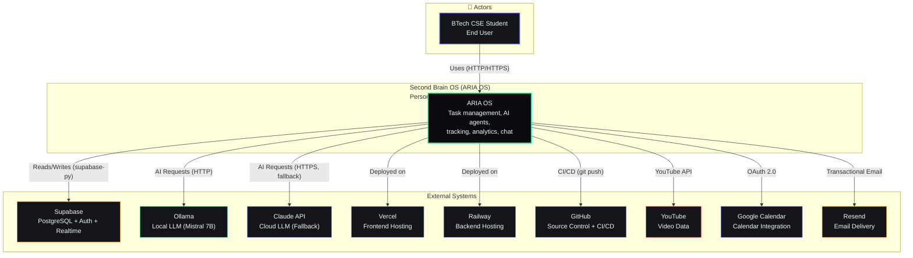
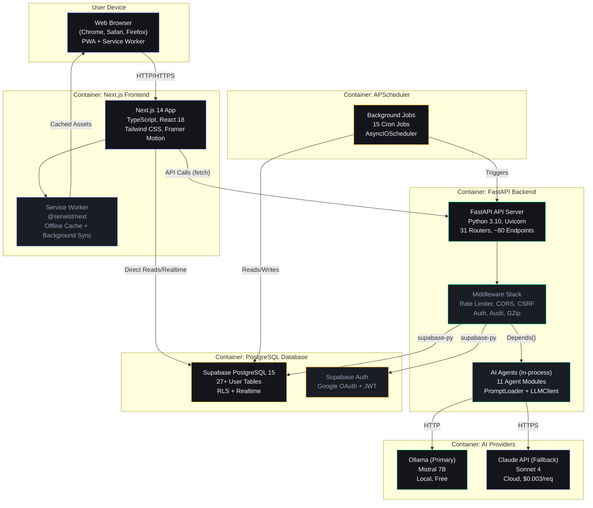
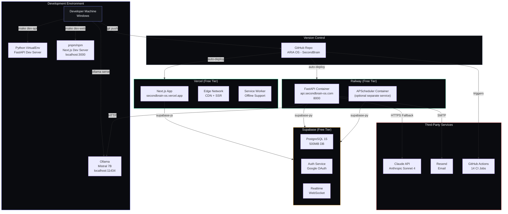

# Architecture Foundation — C4 Model for Second Brain OS

## Document Control

| Field | Value |
|---|---|
| **Document ID** | ARCH-C4-001 |
| **Version** | 1.0.0 |
| **Status** | Active |
| **Date** | 2026-07-10 |
| **Classification** | Internal |
| **Owner** | Developer |
| **Review Cycle** | Monthly |
| **Related Docs** | [ERD](database-erd.md), [Decision Log](decision-log.md), [AGENTS.md](/AGENTS.md), [Schema](/docs/engineering/Schema.md), [BackendArchitecture](/docs/engineering/BackendArchitecture.md), [Architecture](/docs/engineering/12_Architecture.md) |

---

## Table of Contents

1. [Purpose](#1-purpose)
2. [System Context (C4 Level 1)](#2-system-context-c4-level-1)
3. [Container Diagram (C4 Level 2)](#3-container-diagram-c4-level-2)
4. [Component Diagram — Backend (C4 Level 3)](#4-component-diagram--backend-c4-level-3)
5. [Deployment Diagram](#5-deployment-diagram)
6. [Key Architectural Decisions](#6-key-architectural-decisions)
7. [Relationship to AGENTS.md](#7-relationship-to-agentsmd)
8. [Cross-References](#8-cross-references)

---

## 1. Purpose

This document provides the **C4 architecture model** for Second Brain OS (ARIA OS), a personal AI productivity system for BTech CSE students. It covers four levels of abstraction — system context, containers, components, and deployment — to serve as the single source of truth for architectural understanding.

The C4 model follows Simon Brown's methodology: each level zooms into a smaller part of the system with increasing detail.

---

## 2. System Context (C4 Level 1)

The system context diagram shows ARIA OS as a black box with its users and external dependencies.

### 2.1 External System Descriptions

| System | Role | Technology | Relationship |
|---|---|---|---|
| **Supabase** | Database, Auth, Realtime | PostgreSQL 15, GoTrue, Realtime | Backend writes/reads via `supabase-py`; frontend reads via `@supabase/supabase-js` |
| **Ollama** | Primary AI provider | Local Mistral 7B via HTTP | Backend calls `localhost:11434/api/generate` |
| **Claude API** | Fallback AI provider | Anthropic Sonnet 4 via HTTPS | Backend calls `api.anthropic.com` when Ollama unavailable |
| **Vercel** | Frontend hosting | Edge network + Serverless Functions | Deploys `apps/web/` on git push |
| **Railway** | Backend hosting | Container runtime | Deploys `apps/api/` on git push |
| **GitHub** | Source control, CI/CD | GitHub Actions | 14 CI jobs: frontend, backend, prompts, docker, security, lighthouse, pentest, codeql, dependency-scan, secret-scan, figma-token-sync, labeler, stale, release |
| **YouTube** | Video data source | YouTube Data API v3 | Fetches video metadata and transcripts |
| **Google Calendar** | Calendar integration | Google Calendar API | OAuth-based event sync (planned) |
| **Resend** | Email delivery | SMTP API | Sends briefings, opportunity alerts, nudges |

---

## 3. Container Diagram (C4 Level 2)

The container diagram shows the high-level technical building blocks of ARIA OS.

### 3.1 Container Descriptions

| Container | Technology | Description | Responsibilities |
|---|---|---|---|
| **Next.js Frontend** | React 18, TypeScript, Tailwind CSS, Framer Motion, Zustand, shadcn/ui | 18 page routes, PWA with service worker | User interface, state management, offline support, API client |
| **FastAPI Backend** | Python 3.10, FastAPI, Uvicorn, Pydantic v2, supabase-py | 31 API routers, middleware stack, AI agent host | REST API, auth validation, business logic, AI orchestration |
| **AI Agents** | Python, Ollama/Claude, PromptLoader | 11 in-process async agent modules | Briefing generation, memory consolidation, opportunity matching, task analysis, sleep/learning/nudge agents |
| **APScheduler** | Python, AsyncIOScheduler, CronTrigger | Standalone service with 15 cron jobs | Daily briefing (7 AM), opportunity radar (6 AM), weekly review (Sun 8 PM), habit checker (8 PM), missed tasks (Midnight), sleep reminder (10:30 PM), course nudges (6 PM), skill intelligence refresh, skill evidence expiry, skill analytics snapshots, skill MV refresh, skill retention cleanup, memory consolidation, deadline alerts, health checks |
| **PostgreSQL DB** | Supabase PostgreSQL 15 | Managed database with 27+ tables | Data persistence, RLS enforcement, realtime subscriptions |
| **Ollama** | Mistral 7B (local) | Primary AI inference | Free, private, offline-capable LLM for all agent calls |
| **Claude API** | Anthropic Sonnet 4 | Fallback AI inference | Cloud fallback when Ollama is unavailable |

---

## 4. Component Diagram — Backend (C4 Level 3)

The component diagram zooms into the FastAPI Backend container, showing its internal structure.

```mermaid
graph TB
    subgraph BACKEND["FastAPI Backend Container"]
        direction TB

        subgraph ROUTERS["29 API Routers (/api/v1/)"]
            TASKS["tasks<br/>6 endpoints"]
            COURSES["courses<br/>5 endpoints"]
            GOALS["goals<br/>5 endpoints"]
            HABITS["habits<br/>4 endpoints"]
            SLEEP["sleep<br/>3 endpoints"]
            INCOME["income<br/>4 endpoints"]
            PROJECTS["projects<br/>4 endpoints"]
            IDEAS["ideas<br/>4 endpoints"]
            RESOURCES["resources<br/>4 endpoints"]
            OPPORTUNITIES["opportunities<br/>4 endpoints"]
            TIME["time<br/>6 endpoints"]
            CHAT["chat<br/>1 endpoint"]
            AUTOMATION["automation<br/>3 endpoints"]
            BRIEFINGS["briefings<br/>2 endpoints"]
            REVIEWS["reviews<br/>2 endpoints"]
            MEMORY["memory<br/>4 endpoints"]
            ROADMAP["roadmap<br/>3 endpoints"]
            ACADEMICS["academics<br/>2 endpoints"]
            VIDEOS["videos<br/>3 endpoints"]
            ANALYTICS["analytics<br/>2 endpoints"]
            PREDICTIONS["predictions<br/>2 endpoints"]
            NOTIFICATIONS["notifications<br/>2 endpoints"]
            NLP["nlp<br/>2 endpoints"]
            PROMPTS_EP["prompts<br/>2 endpoints"]
            FEEDBACK["feedback<br/>2 endpoints"]
            MONITORING["monitoring<br/>2 endpoints"]
            AUTH_EP["auth<br/>multiple endpoints"]
            DATA["data<br/>GDPR export"]
            SKILLS["skills<br/>CRUD + taxonomy"]
            LEARNING_EP["learning<br/>insights"]
        end

        subgraph AGENT_MODULES["AI Agent Modules (10)"]
            BRIEFING["briefing_agent<br/>A09 — Daily Briefing"]
            REVIEW_AGENT["weekly_review_agent<br/>A10 — Weekly Review"]
            MEMORY_AGENT["memory_agent<br/>A02 — Memory Consolidation"]
            LEARNING_AGENT["learning_agent<br/>A03 — Pattern Detection"]
            OPPORTUNITY_AGENT["opportunity_agent<br/>A06 — Opportunity Radar"]
            TASK_AGENT["task_agent<br/>A01 — Task Analysis"]
            SLEEP_AGENT["sleep_agent<br/>A13 — Sleep Analysis"]
            NUDGE_AGENT["nudge_agent<br/>A14 — Course/Habit Nudges"]
            ROADMAP_AGENT["roadmap_agent<br/>A08 — Skill Roadmap"]
            OPP_MATCHING["opportunity_matching_agent<br/>A15 — Scoring Engine"]
            SKILL_AGENT["skill_agent<br/>Skills Intelligence"]
            CONTEXT_ENGINE["ContextEngine<br/>Context Assembly"]
        end

        subgraph SHARED["Shared Layer"]
            SCHEMAS["database/schemas/<br/>Pydantic Models<br/>(18+ tables)"]
            CONFIG["config/core/<br/>Settings, Supabase, Auth,<br/>API Key Auth"]
            UTILS["shared/utils/<br/>Logger, Cache, Rate Limiter,<br/>Security, Audit, Retry,<br/>Circuit Breaker, Sanitizer,<br/>Batch, Feature Flags"]
            PROMPT_LOADER["ai/prompt_loader.py<br/>PromptLoader Singleton<br/>prompts/ directory"]
            LLM_CLIENT["ai/client.py<br/>LLMClient with<br/>Failover Chain + CB"]
        end

        subgraph MIDDLEWARE["Middleware Stack"]
            RATE_LIMIT["RateLimiter<br/>100 req/min per IP"]
            CORS["CORSMiddleware<br/>Configured Origins"]
            CSRF["CSRFMiddleware<br/>CSRF Protection"]
            GZIP["GZipMiddleware<br/>>1KB responses"]
            REQ_ID["Request ID<br/>X-Request-ID"]
            CACHE_CTRL["Cache Control<br/>Per-path strategy"]
            AUDIT["Audit Trail<br/>Mutation logging"]
            SEC_HDRS["Security Headers<br/>HSTS, XSS, Frame"]
            EXCEPTION["Global Exception Handler<br/>Error response"]
        end
    end

    ROUTERS -->|"Depends(get_current_user)"| CONFIG
    ROUTERS -->|"Depends(get_supabase_client)"| CONFIG
    ROUTERS -->|"Import schemas"| SCHEMAS
    ROUTERS -->|"Call agents"| AGENT_MODULES
    AGENT_MODULES -->|"prompts.get_agent()"| PROMPT_LOADER
    AGENT_MODULES -->|"llm.generate_json()"| LLM_CLIENT
    AGENT_MODULES -->|"Logging"| UTILS
    ROUTERS -->|"Middleware chain"| MIDDLEWARE

    style ROUTERS fill:#13151A,stroke:#6366F1,color:#F1F5F9
    style AGENT_MODULES fill:#13151A,stroke:#34D399,color:#F1F5F9
    style SHARED fill:#13151A,stroke:#F59E0B,color:#F1F5F9
    style MIDDLEWARE fill:#13151A,stroke:#818CF8,color:#F1F5F9
```

### 4.1 Agent Module Details

| Agent | ID | Prompt File | Primary Function | Trigger |
|---|---|---|---|---|
| Task Agent | A01 | `task_agent.md` | Task breakdown and prioritization analysis | On-demand via chat |
| Memory Agent | A02 | `memory_agent.md` | Memory consolidation and retention | Background per chat |
| Learning Agent | A03 | `learning_agent.md` | Pattern detection and learning insights | Daily + on-demand |
| Opportunity Agent | A06 | `opportunity_radar_agent.md` | Opportunity matching from external sources | Cron (6 AM) |
| Roadmap Agent | A08 | `roadmap_agent.md` | Skill development roadmap optimization | On-demand + weekly |
| Briefing Agent | A09 | `briefing_agent.md` | Daily morning briefing generation | Cron (7 AM) |
| Weekly Review Agent | A10 | `weekly_review_agent.md` | Weekly performance narrative | Cron (Sun 8 PM) |
| Sleep Agent | A13 | `sleep_agent.md` | Sleep analysis and wind-down messages | Cron (9:30 PM + wake) |
| Nudge Agent | A14 | `nudge_agent.md` | Course/habit progress nudges | Cron (6 PM) |
| Opp. Matching Agent | A15 | `opportunity_matching_agent.md` | Opportunity scoring engine | On-demand |
| Skill Agent | — | — | Skills taxonomy, market intelligence, evidence | On-demand |

---

## 5. Deployment Diagram

---

## 6. Key Architectural Decisions

| # | Decision | Rationale | ADR |
|---|---|---|---|
| 1 | **Monorepo** with `apps/` + `packages/` | Single `git pull` gets everything; atomic cross-component commits | [ADR-001](/docs/engineering/adr/ADR-001-monorepo-over-multi-repo.md) |
| 2 | **Supabase** as managed PostgreSQL + Auth + Realtime | Single service for DB, auth, realtime; RLS for data isolation | [ADR-002](/docs/engineering/adr/ADR-002-supabase-over-custom-backend-db.md) |
| 3 | **Ollama primary, Claude fallback** for AI | Free/private local AI; cloud fallback for complex queries | [ADR-003](/docs/engineering/adr/ADR-003-ollama-primary-claude-fallback.md) |
| 4 | **In-process agents** (not microservices) | Single deployable unit; zero network overhead for agent calls | [ADR-004](/docs/engineering/adr/ADR-004-in-process-agents-over-microservices.md) |
| 5 | **Zustand over Redux** for frontend state | ~1KB gzip, minimal boilerplate, no Provider wrapper needed | [ADR-005](/docs/engineering/adr/ADR-005-zustand-over-redux.md) |
| 6 | **APScheduler over Celery** for cron | Zero infrastructure dependencies; async-native cron triggers | [ADR-006](/docs/engineering/adr/ADR-006-apscheduler-over-celery.md) |
| 7 | **PWA over native mobile** (current phase) | Single codebase for all platforms; instant deployment via Vercel | [ADR-007](/docs/engineering/adr/ADR-007-pwa-over-native-mobile.md) |
| 8 | **No event bus** in alpha phase | Faster development; sync calls + polling sufficient for single-user | [ADR-008](/docs/engineering/adr/ADR-008-no-event-bus-in-alpha.md) |
| 9 | **PromptLoader** for externalized AI prompts | Versioned, validated, separable prompt files with YAML frontmatter | [ADR-009](/docs/engineering/adr/ADR-009-prompt-loader.md) |
| 10 | **Multi-provider AI failover** with circuit breaker | High availability; self-healing auto-recovery | [ADR-010](/docs/engineering/adr/ADR-010-ai-provider-failover.md) |
| 11 | **Graceful degradation** (3-tier: AI → Algorithmic → Default) | Zero-downtime AI; every feature works without LLM | [ADR-011](/docs/engineering/adr/ADR-011-graceful-degradation.md) |
| 12 | **URL-based API versioning** (`/api/v1/`) | Industry standard; visible in logs and browser devtools | [ADR-012](/docs/engineering/adr/ADR-012-api-versioning-strategy.md) |
| 13 | **Environment variable** secret management | Git-never pattern; `.env.example` documents all required vars | [ADR-013](/docs/engineering/adr/ADR-013-secret-management.md) |
| 14 | **Pragmatic TDD** — 85% coverage threshold, mock AI outputs | 2795+ tests; test structure not content for non-deterministic AI | [ADR-014](/docs/engineering/adr/ADR-014-testing-philosophy.md) |
| 15 | **Resilience patterns** — timeouts, retry, circuit breaker, fallback | Four layers of defense against service failures | [ADR-015](/docs/engineering/adr/ADR-015-resilience-patterns.md) |

---

## 7. Relationship to AGENTS.md

This architecture foundation document is a companion to [AGENTS.md](/AGENTS.md), the master AI agent reference. The following cross-references map AGENTS.md sections to this document:

| AGENTS.md Section | Topic | Architecture Mapping |
|---|---|---|
| §6 — Project Structure | Directory tree with file purposes | All paths in this document follow the monorepo structure documented there |
| §7 — Database Schema | 18+ tables, RLS policies, query patterns | Detailed ERD in [database-erd.md](database-erd.md) with actual schema mappings |
| §8 — API Endpoint Reference | 31 routers, ~80 endpoints, pagination | See §4 Component Diagram above for router inventory; BackendArchitecture.md §3 for endpoint patterns |
| §9 — AI Agent Architecture | 11 agents, PromptLoader, LLMClient | See §4.1 Agent Module Details above; [decision-log.md](decision-log.md) §ADR-004, ADR-009, ADR-010 for design rationale |
| §10 — Prompt System Architecture | PromptLoader API, frontmatter, fallback | See §4 Shared Layer — PromptLoader; [decision-log.md](decision-log.md) ADR-009 |
| §11 — Prompt Development Guide | Creating/editing prompts, validation | Prompt files at `prompts/`; validation at `scripts/validate_prompts.py` |
| §12 — Common Patterns | Adding endpoints, agents, pages | Pattern templates in BackendArchitecture.md §3.3 |
| §16 — Testing Standards | 2795+ tests, coverage thresholds, categories | See [decision-log.md](decision-log.md) ADR-014 for testing philosophy |
| §17 — CI/CD Pipeline | 14 CI jobs | See §5 Deployment Diagram — GitHub Actions triggers |
| §24 — API Versioning Strategy | URL-based versioning, deprecation headers | See §6 ADR-012; all routers use `/api/v1/` prefix per `main.py:276-306` |
| §25 — Observability | Log levels, RED metrics, health checks | See §4 Middleware — Request ID, Audit Trail, Structured Logging |
| §29 — Q3 Intelligence Phase | 9-week production hardening plan | Architecture directly enables Q3 goals: deploy, monitoring, performance |

---

## 8. Cross-References

| Document | Description |
|---|---|
| [AGENTS.md](/AGENTS.md) | Master AI agent reference (v6.0.0) — 29 sections covering all aspects |
| [BackendArchitecture.md](/docs/engineering/BackendArchitecture.md) | Detailed backend architecture: DI, middleware, auth, testing |
| [12_Architecture.md](/docs/engineering/12_Architecture.md) | Original architecture doc with data flow sequence diagrams |
| [Schema.md](/docs/engineering/Schema.md) | Complete column-level database schema (27 tables) |
| [ERD.md](/docs/engineering/ERD.md) | Entity relationship diagram with cardinalities |
| [database-erd.md](database-erd.md) | This directory — current ERD with Mermaid diagram |
| [decision-log.md](decision-log.md) | This directory — index of all 15 ADRs |
| [PromptLoader](/packages/ai/prompt_loader.py) | Prompt loading implementation |
| [LLMClient](/packages/ai/client.py) | AI provider failover implementation |
| [main.py](/apps/api/main.py) | FastAPI entry point with all 31 router registrations |

---

## Revision History

| Version | Date | Author | Changes |
|---|---|---|---|
| 1.0.0 | 2026-07-10 | Developer | Initial C4 architecture foundation document |
