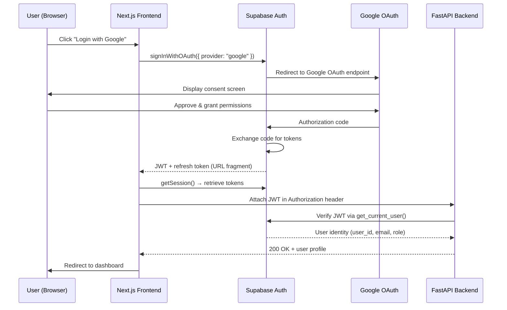
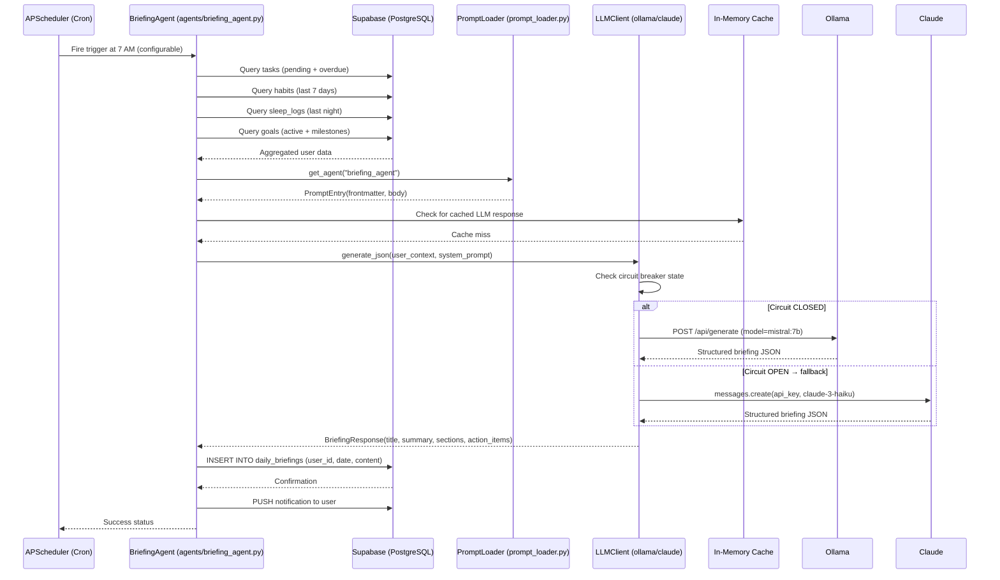
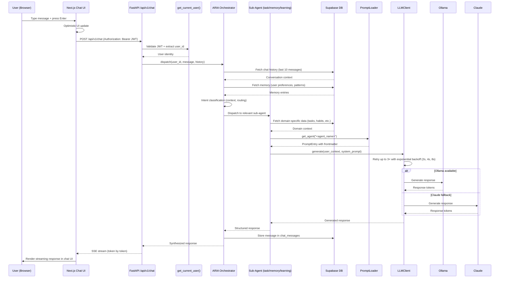
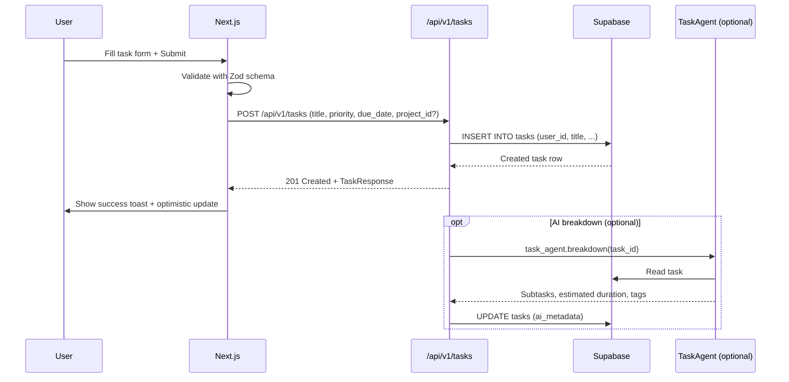
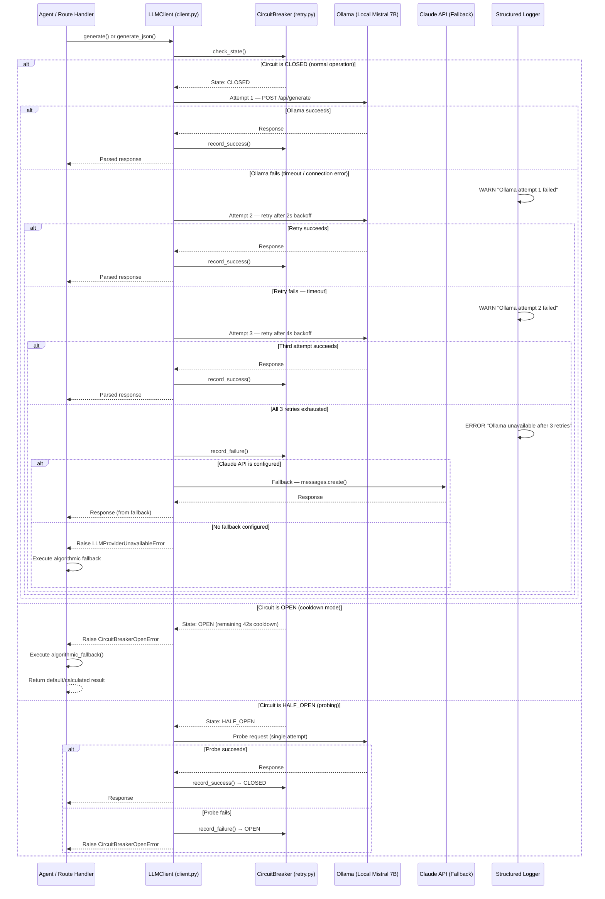
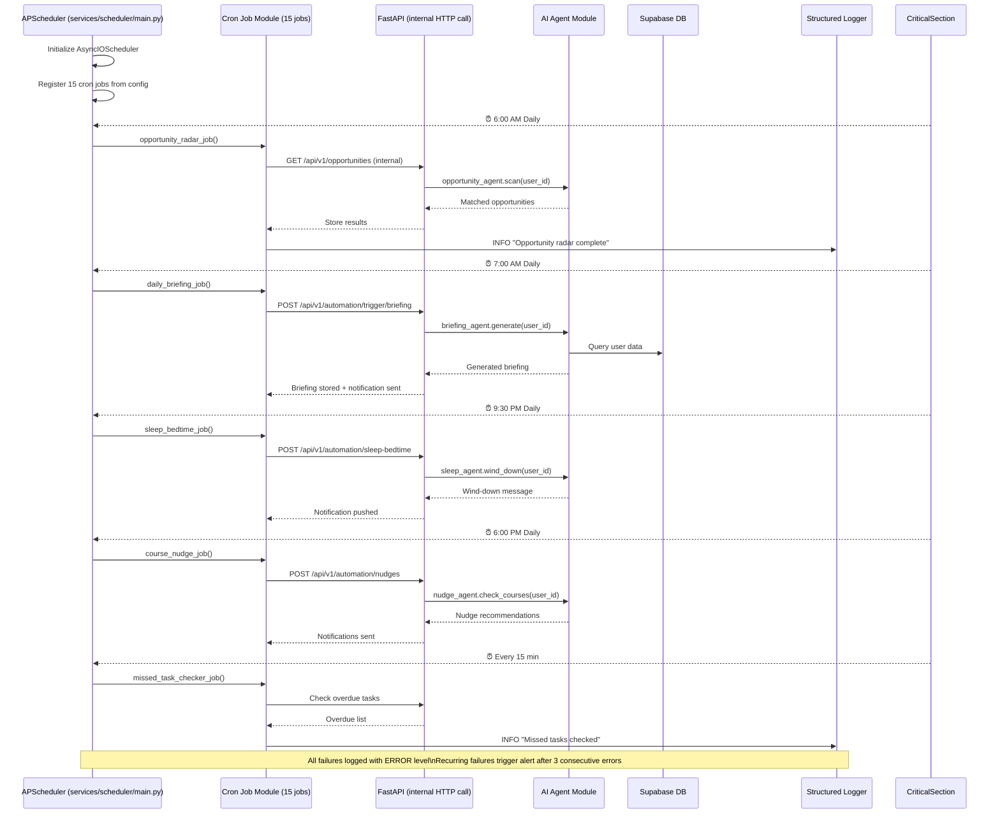
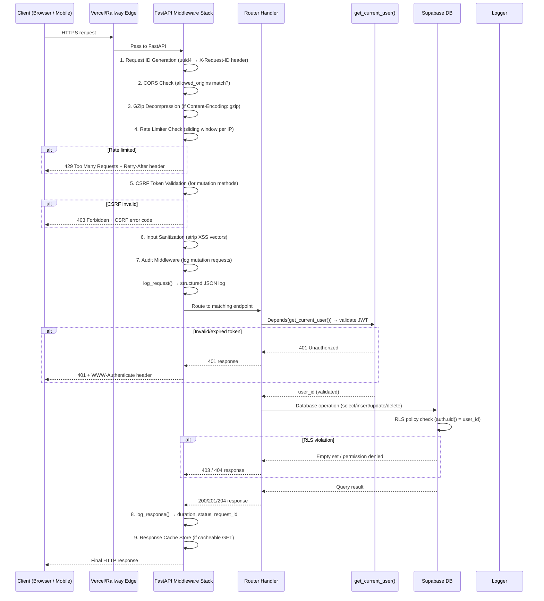

# Data Flow Diagrams — Second Brain OS

## Document Control

| Field | Value |
|---|---|
| **Document ID** | ENG-DFD-001 |
| **Version** | 1.0.0 |
| **Status** | Active |
| **Date** | 2026-07-11 |
| **Classification** | Internal |
| **Owner** | Developer |

---

## Table of Contents

1. [Flow 1: User Authentication (Google OAuth)](#flow-1-user-authentication-google-oauth)
2. [Flow 2: Daily Briefing Generation (AI Agent)](#flow-2-daily-briefing-generation-ai-agent)
3. [Flow 3: Chat with ARIA (Real-Time Interaction)](#flow-3-chat-with-aria-real-time-interaction)
4. [Flow 4: Task Lifecycle (CRUD + Completion)](#flow-4-task-lifecycle-crud--completion)
5. [Flow 5: AI Circuit Breaker (Resilience Pattern)](#flow-5-ai-circuit-breaker-resilience-pattern)
6. [Flow 6: Scheduled Cron Job Execution](#flow-6-scheduled-cron-job-execution)
7. [Flow 7: API Request Lifecycle (Request → Response)](#flow-7-api-request-lifecycle-request--response)

---

## Flow 1: User Authentication (Google OAuth)



**Key Components:**
- `supabase.auth.signInWithOAuth()` — initiates OAuth flow (`apps/web/lib/supabase.ts`)
- `get_current_user()` — JWT validation with caching (`packages/config/core/auth.py:32`)
- `config.core.supabase` — Supabase client singleton (`packages/config/core/supabase.py`)
- API key auth for machine-to-machine: `config.core.api_key_auth`

---

## Flow 2: Daily Briefing Generation (AI Agent)



**Key Components:**
- `BriefingAgent` — `packages/ai/agents/briefing_agent.py` (A09)
- `PromptLoader` — `packages/ai/prompt_loader.py` (loads `prompts/agents/briefing_agent.md`)
- `LLMClient` — `packages/ai/client.py` with retry + circuit breaker
- **Fallback:** algorithmic results if LLM unavailable (`briefing_agent.py:algorithmic_fallback()`)
- Cron config: `services/scheduler/main.py`

---

## Flow 3: Chat with ARIA (Real-Time Interaction)



**Key Components:**
- `apps/api/app/api/chat.py` — SSE streaming endpoint
- ARIA Orchestrator — `packages/ai/orchestrator.py` (intent classification + dispatch)
- Sub-agents: `memory_agent.py`, `task_agent.py`, `learning_agent.py`, etc.
- `packages/database/schemas/orchestrator.py` — request/response schemas

---

## Flow 4: Task Lifecycle (CRUD + Completion)

```mermaid
stateDiagram-v2
    [*] --> Pending: Create task (POST /api/v1/tasks)
    Pending --> In_Progress: Start task (PUT status=in_progress)
    Pending --> Completed: Quick complete (POST /api/v1/tasks/{id}/complete)
    Pending --> Cancelled: Cancel (PUT status=cancelled)
    In_Progress --> Completed: Mark done (POST /api/v1/tasks/{id}/complete)
    In_Progress --> Blocked: Add dependency conflict
    In_Progress --> Pending: Reset to pending
    Blocked --> In_Progress: Unblock (resolve dependency)
    Blocked --> Cancelled: Cancel while blocked
    Completed --> [*]: Archive (auto after 30 days)
    Cancelled --> [*]: Archive

    note right of Pending: Default status on creation\npriority: low/medium/high/critical
    note right of Completed: Triggers habit streak check\nTriggers weekly review data
```

**Sequence for Task Creation:**



**Key Components:**
- `apps/api/app/api/tasks.py` — 6 endpoints (GET, POST, GET/{id}, PUT/{id}, DELETE/{id}, POST/{id}/complete)
- `packages/database/schemas/task.py` — TaskCreate, TaskUpdate, TaskResponse Pydantic models
- State machine enforced at API layer with status validation
- AI breakdown via `packages/ai/agents/task_agent.py` (A01)

---

## Flow 5: AI Circuit Breaker (Resilience Pattern)



**Key Components:**
- `LLMClient` — `packages/ai/client.py` (534 lines)
- `CircuitBreaker` — `packages/shared/utils/retry.py:114` (failure_threshold=5, recovery_timeout=60s)
- Fallback chain: Ollama → Claude → algorithmic_fallback()
- Retry policy: 3 attempts, exponential backoff (2s, 4s, 8s)
- All agents implement `algorithmic_fallback()` as last resort

---

## Flow 6: Scheduled Cron Job Execution



**Cron Job Registry (`services/scheduler/main.py`):**

| Job ID | Module | Schedule | Agent | Status |
|---|---|---|---|---|
| A06 | `opportunity_radar_job` | Daily 6 AM | opportunity_agent | Live |
| A09 | `daily_briefing_job` | Daily 7 AM | briefing_agent | Live |
| A13 | `sleep_bedtime_job` | Daily 9:30 PM | sleep_agent | Live |
| A14 | `course_nudge_job` | Daily 6 PM | nudge_agent | Live |
| A10 | `weekly_review_job` | Sunday 8 PM | weekly_review_agent | Live |
| A11 | `missed_task_checker_job` | Every 15 min | None (algorithmic) | Live |
| A12 | `habit_miss_checker_job` | Midnight | None (algorithmic) | Live |

---

## Flow 7: API Request Lifecycle (Request → Response)



**Middleware Stack (in order, defined in `apps/api/main.py`):**

| Order | Middleware | File | Config |
|---|---|---|---|
| 1 | Request ID | inline in `main.py` | UUID v4 per request |
| 2 | CORS | `CORSMiddleware` | `settings.cors_origins` |
| 3 | GZip | `GZipMiddleware` | minimum_size=1000 |
| 4 | Rate Limiter | `packages/shared/utils/rate_limiter.py` | 100 req/min default |
| 5 | CSRF | `packages/shared/utils/csrf.py` | Token validation on mutations |
| 6 | Sanitizer | `packages/shared/utils/sanitizer.py` | XSS strip on input |
| 7 | Audit | `packages/shared/utils/audit.py` | Mutation request logging |
| 8 | Cache | `packages/shared/utils/cache_middleware.py` | TTL=300s for GET |
| 9 | Logging | `packages/shared/utils/logger.py` | Structured JSON + Sentry |

---

## Data Flow Principles

1. **All external requests enter through API** — Frontend never queries Supabase directly in production for writes
2. **Every DB query is tenant-isolated** — Filtered by `user_id` at application layer + RLS at database layer
3. **AI calls are resilient** — Circuit breaker → retry → provider failover → algorithmic fallback
4. **All state changes are audited** — Mutations logged via audit middleware
5. **Authentication is validated at middleware level** — Every protected endpoint uses `Depends(get_current_user())`
6. **Prompts are loaded from files, not code** — `PromptLoader` singleton caches all 22 prompt files at import time

---

## Related Documents

| Document | Purpose |
|---|---|
| [AGENTS.md](../../AGENTS.md) | Master project reference — Section 6 (Project Structure), Section 9 (AI Agent Architecture) |
| [API Documentation](../engineering/17_API.md) | API endpoint reference for all 31 routers |
| [Database Schema](../engineering/15_Database.md) | All tables, columns, relationships, RLS policies |
| [Error Catalog](../engineering/api/error-catalog.md) | Standardized error codes and recovery strategies |
| [Event Architecture](../engineering/18_Events.md) | Event-driven patterns and webhook system |
| [Architecture Decisions](../engineering/adr/) | ADR-004 (In-process agents), ADR-005 (API versioning) |
