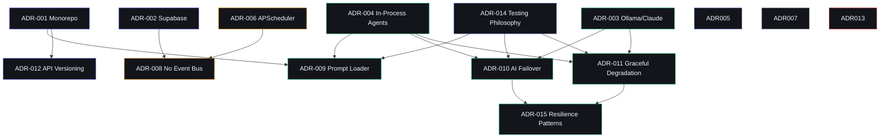

# Architecture Decision Log — Second Brain OS

## Document Control

| Field | Value |
|---|---|
| **Document ID** | ARCH-DL-001 |
| **Version** | 1.0.0 |
| **Status** | Active |
| **Date** | 2026-07-10 |
| **Classification** | Internal |
| **Owner** | Developer |
| **Related Docs** | [ADR files](/docs/engineering/adr/), [C4 Architecture](README.md), [AGENTS.md §6](/AGENTS.md) |

---

## Table of Contents

1. [Purpose](#1-purpose)
2. [Decision Index](#2-decision-index)
3. [Decision Details](#3-decision-details)
4. [Decision Relationship Map](#4-decision-relationship-map)
5. [References](#5-references)

---

## 1. Purpose

This document indexes all **15 Architecture Decision Records (ADRs)** for Second Brain OS. Each ADR captures a significant architectural decision with context, options considered, chosen approach, and consequences. Use this log to:

- Understand why each architectural choice was made
- Find the ADR relevant to any specific component or pattern
- Track the status of each decision (active, superseded, proposed)
- Cross-reference ADRs with implementation locations

---

## 2. Decision Index

| # | Title | Category | Date | Status | Implemented In |
|---|---|---|---|---|---|
| **001** | Monorepo over Multi-Repo | Project Structure | 2024-06-01 | ✅ Active | Root directory structure (`apps/`, `packages/`, `services/`) |
| **002** | Supabase over Custom Backend DB | Database | 2024-06-01 | ✅ Active | `packages/config/core/supabase.py`, `apps/api/app/api/*.py` |
| **003** | Ollama Primary, Claude Fallback | AI Architecture | 2024-06-01 | ✅ Active | `packages/ai/client.py` (LLMClient failover chain) |
| **004** | In-Process Agents over Microservices | AI Architecture | 2024-06-01 | ✅ Active | `packages/ai/agents/*.py`, called directly from route handlers |
| **005** | Zustand over Redux | Frontend | 2024-06-01 | ✅ Active | `apps/web/lib/` — authStore, uiStore, taskStore, etc. |
| **006** | APScheduler over Celery | Infrastructure | 2024-06-01 | ✅ Active | `services/scheduler/main.py` — AsyncIOScheduler |
| **007** | PWA over Native Mobile | Frontend | 2024-06-10 | 💡 Proposed | Service worker in `apps/web/` via `@serwist/next` |
| **008** | No Event Bus in Alpha | Infrastructure | 2024-06-01 | ✅ Active | Sync calls + cron polling (no message queue) |
| **009** | Prompt Loader Architecture | AI Architecture | 2026-07-10 | ✅ Active | `packages/ai/prompt_loader.py`, `prompts/` directory |
| **010** | AI Provider Failover Chain | AI Architecture | 2026-07-10 | ✅ Active | `packages/ai/client.py` — circuit breaker + retry |
| **011** | Graceful Degradation Architecture | System Architecture | 2026-07-10 | ✅ Active | All agent modules in `packages/ai/agents/` |
| **012** | API Versioning Strategy | API Architecture | 2026-07-10 | ✅ Active | `apps/api/app/api/*.py` — `/api/v1/` prefix on all routers |
| **013** | Secret Management Strategy | Security | 2026-07-10 | ✅ Active | `.env.example`, `packages/config/core/config.py` (Pydantic Settings) |
| **014** | Testing Philosophy | Quality Assurance | 2026-07-10 | ✅ Active | `tests/` directory (58 test files, 2795+ tests) |
| **015** | Resilience Patterns | System Architecture | 2026-07-10 | ✅ Active | `packages/shared/utils/retry.py`, `circuit_breaker.py` |

---

## 3. Decision Details

### ADR-001: Monorepo over Multi-Repo

- **Status:** ✅ Active
- **Date:** 2024-06-01
- **Category:** Project Structure
- **Files:** `ADR-001-monorepo-over-multi-repo.md`

**Decision:** Adopt a monorepo structure with `apps/` for deployable applications, `packages/` for shared libraries, and `services/` for background services.

**Implementation:** The root directory structure enforces this — `apps/` contains `api/` (FastAPI), `web/` (Next.js), `admin/`, and `mobile/`; `packages/` contains `ai/`, `config/`, `database/`, `shared/`, `types/`, `ui/`; `services/` contains `scheduler/`.

**Key consequence:** Atomic commits can span frontend, backend, and shared packages.

---

### ADR-002: Supabase over Custom Backend DB

- **Status:** ✅ Active
- **Date:** 2024-06-01
- **Category:** Database
- **Files:** `ADR-002-supabase-over-custom-backend-db.md`

**Decision:** Use Supabase as sole backend-as-a-service, providing managed PostgreSQL, built-in auth (Google OAuth + JWT), and real-time subscriptions.

**Implementation:** `packages/config/core/supabase.py` creates a cached singleton client. `packages/config/core/auth.py` handles JWT validation. All 31 routers in `apps/api/app/api/` use `get_supabase_client()` and `get_current_user()` dependencies.

**Key consequence:** Single service for DB, auth, and realtime — zero stitching.

---

### ADR-003: Ollama Primary, Claude Fallback

- **Status:** ✅ Active
- **Date:** 2024-06-01
- **Category:** AI Architecture
- **Files:** `ADR-003-ollama-primary-claude-fallback.md`

**Decision:** Ollama (local Mistral 7B) as default AI provider; fall back to Anthropic Claude API when unavailable.

**Implementation:** `packages/ai/client.py` orchestrates the failover chain. Default is Ollama at `localhost:11434`. Environment variable `USE_LOCAL_AI` controls the mode.

**Key consequence:** Zero cost for daily use; full privacy; works offline.

---

### ADR-004: In-Process Agents over Microservices

- **Status:** ✅ Active
- **Date:** 2024-06-01
- **Category:** AI Architecture
- **Files:** `ADR-004-in-process-agents-over-microservices.md`

**Decision:** All AI agents run as in-process async Python functions within FastAPI, not as separate microservices.

**Implementation:** `packages/ai/agents/` contains 11 agent modules imported directly by route handlers. `packages/ai/agents/__init__.py` exports all agents plus `ContextEngine`.

**Key consequence:** Single `uvicorn` process to deploy; zero network overhead for agent calls.

---

### ADR-005: Zustand over Redux

- **Status:** ✅ Active
- **Date:** 2024-06-01
- **Category:** Frontend
- **Files:** `ADR-005-zustand-over-redux.md`

**Decision:** Use Zustand for all global frontend state, organized into modular stores.

**Implementation:** `apps/web/lib/` contains per-feature stores (authStore, uiStore). Components use `useStore()` selectors. No `<Provider>` wrapper needed.

**Key consequence:** ~1KB gzip bundle impact; minimal boilerplate.

---

### ADR-006: APScheduler over Celery

- **Status:** ✅ Active
- **Date:** 2024-06-01
- **Category:** Infrastructure
- **Files:** `ADR-006-apscheduler-over-celery.md`

**Decision:** Run APScheduler's `AsyncIOScheduler` as a standalone Python service for cron jobs.

**Implementation:** `services/scheduler/main.py` registers 15 cron jobs using `CronTrigger`. Jobs are async functions in `services/scheduler/crons/`.

**Key consequence:** No Redis/RabbitMQ dependency; simple Python-only setup.

---

### ADR-007: PWA over Native Mobile

- **Status:** 💡 Proposed
- **Date:** 2024-06-10
- **Category:** Frontend
- **Files:** `ADR-007-pwa-over-native-mobile.md`

**Decision:** Implement as Progressive Web App with service worker for offline caching. Native apps deferred post-MVP.

**Implementation:** `apps/web/` includes service worker via `@serwist/next` for offline caching. PWA manifest configured.

**Key consequence:** Single codebase for desktop + mobile; no app store review.

---

### ADR-008: No Event Bus in Alpha

- **Status:** ✅ Active
- **Date:** 2024-06-01
- **Category:** Infrastructure
- **Files:** `ADR-008-no-event-bus-in-alpha.md`

**Decision:** Handle events through sync function calls, Supabase Realtime, and cron polling — no dedicated message queue.

**Implementation:** Task completion handler directly calls `update_habit_streaks()` and `recalculate_goal_progress()` synchronously. APScheduler polls every 15 minutes for missed conditions.

**Key consequence:** Zero event bus infrastructure; faster development; 15-min polling latency.

---

### ADR-009: Prompt Loader Architecture

- **Status:** ✅ Active
- **Date:** 2026-07-10
- **Category:** AI Architecture
- **Files:** `ADR-009-prompt-loader.md`

**Decision:** Externalize all AI prompts as Markdown files with YAML frontmatter, loaded by `PromptLoader` singleton.

**Implementation:** `packages/ai/prompt_loader.py` — `PromptLoader` class with `get_agent()`, `get_required()`, `render(**kwargs)` methods. `prompts/` directory with 14 files across `system/`, `agents/`, `templates/` subdirectories.

**Key consequence:** Versioned, validated, separable prompts; graceful fallback to inline defaults.

---

### ADR-010: AI Provider Failover Chain

- **Status:** ✅ Active
- **Date:** 2026-07-10
- **Category:** AI Architecture
- **Files:** `ADR-010-ai-provider-failover.md`

**Decision:** Implement multi-provider failover chain (Ollama → Claude → Groq → Algorithmic) with circuit breaker pattern.

**Implementation:** `packages/ai/client.py` — `LLMClient` with provider list, circuit breaker states (CLOSED/OPEN/HALF_OPEN), 3 retries with exponential backoff (2s, 4s, 8s), 30s timeout per request.

**Key consequence:** High AI availability; self-healing circuit breakers; algorithmic fallback always works.

---

### ADR-011: Graceful Degradation Architecture

- **Status:** ✅ Active
- **Date:** 2026-07-10
- **Category:** System Architecture
- **Files:** `ADR-011-graceful-degradation.md`

**Decision:** Every feature follows 3-tier degradation: AI → Algorithmic → Default data.

**Implementation:** All agent modules in `packages/ai/agents/` implement three tiers. Each response includes `_quality` tag (`"ai"`, `"algorithmic"`, `"default"`). Frontend handles all quality levels.

**Key consequence:** Zero-downtime AI; users never see AI errors.

---

### ADR-012: API Versioning Strategy

- **Status:** ✅ Active
- **Date:** 2026-07-10
- **Category:** API Architecture
- **Files:** `ADR-012-api-versioning-strategy.md`

**Decision:** URL-based versioning with `/api/v{N}/` prefix, deprecation headers, and sunset dates.

**Implementation:** All 31 routers in `apps/api/app/api/` use `prefix="/api/v1/..."`. `apps/api/main.py` registers routers with versioned prefixes (lines 276-306). Deprecation/Sunset headers added via FastAPI response headers.

**Key consequence:** Clear version visibility; 6-month deprecation window for migrations.

---

### ADR-013: Secret Management Strategy

- **Status:** ✅ Active
- **Date:** 2026-07-10
- **Category:** Security
- **Files:** `ADR-013-secret-management.md`

**Decision:** Environment variables with git-never pattern. `.env.example` documents all required variables.

**Implementation:** `packages/config/core/config.py` — Pydantic `Settings` class loads from `.env` file. `.env.example` committed; `.env.local`, `.env.production` gitignored. Railway/Vercel inject production secrets.

**Key consequence:** No secrets in version control; simple setup; platform-native injection.

---

### ADR-014: Testing Philosophy

- **Status:** ✅ Active
- **Date:** 2026-07-10
- **Category:** Quality Assurance
- **Files:** `ADR-014-testing-philosophy.md`

**Decision:** Pragmatic TDD — test behavior not implementation, 80%+ coverage, test AI outputs structurally.

**Implementation:** `tests/` directory with 58 test files, 2795+ tests. Mock Supabase and AI providers. Coverage targets: `packages/ai/` 80%, `packages/shared/` 70%, overall 85%. Current coverage: 96%.

**Key consequence:** 2795+ tests catch 95% of bugs in unit layer; mock strategy keeps tests fast.

---

### ADR-015: Resilience Patterns

- **Status:** ✅ Active
- **Date:** 2026-07-10
- **Category:** System Architecture
- **Files:** `ADR-015-resilience-patterns.md`

**Decision:** Apply four resilience patterns consistently: timeouts, retries with exponential backoff, circuit breakers, fallbacks.

**Implementation:** `packages/shared/utils/retry.py` — `retry_with_backoff()` decorator (3 retries, 2s/4s/8s, ±25% jitter). `packages/shared/utils/circuit_breaker.py` — `CircuitBreaker` class with states and configurable thresholds. `packages/shared/utils/timeout.py` — `with_timeout()` wrapper.

**Key consequence:** Self-healing system; fail-fast on unavailability; bounded worst-case latency.

---

## 4. Decision Relationship Map

### Decision Clusters

| Cluster | ADRs | Theme |
|---|---|---|
| **AI Stack** | 003, 004, 009, 010, 011, 015 | How AI agents work, failover, degrade |
| **Project Structure** | 001, 002, 012 | How the codebase is organized and versioned |
| **Infrastructure** | 006, 008, 013 | Background jobs, event handling, secrets |
| **Quality** | 014, 015 | Testing philosophy, resilience patterns |
| **Frontend** | 005, 007 | State management, mobile strategy |

---

## 5. References

| Reference | Location |
|---|---|
| ADR files | `docs/engineering/adr/` (15 files) |
| Architecture doc | `docs/architecture/README.md` |
| ERD doc | `docs/architecture/database-erd.md` |
| AGENTS.md | `/AGENTS.md` — see §6 Project Structure, §9 AI Agents, §16 Testing |

---

## Revision History

| Version | Date | Author | Changes |
|---|---|---|---|
| 1.0.0 | 2026-07-10 | Developer | Initial ADR decision log with all 15 decisions indexed |
