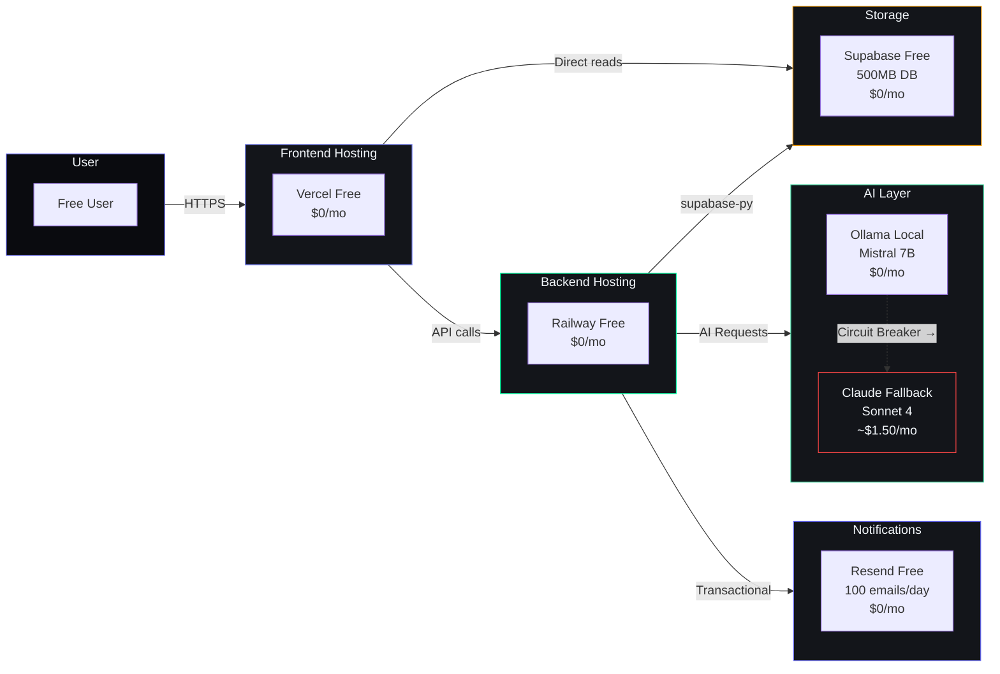

# Business Model — Second Brain OS (ARIA OS)

## Document Control

| Field | Value |
|---|---|
| Document ID | BIZ-MDL-001 |
| Version | 1.0.0 |
| Status | Active |
| Date | 2026-07-12 |
| Classification | Internal |
| Owner | Developer |
| Review Cycle | Quarterly |

---

## 1. Overview

ARIA OS (Second Brain OS) is a personal AI productivity system designed specifically for BTech CSE students. It is maintained by a single developer as an open-source (MIT) project and is entirely free to use.

**Current state:** Personal tooling project with zero revenue, zero users beyond the developer. The project prioritizes quality, privacy, and completeness over monetization.

---

## 2. Value Proposition

| Stakeholder | Value |
|---|---|
| BTech CSE students | AI-powered second brain: courses, tasks, goals, habits, sleep, income, opportunities, projects, ideas, time tracking — all in one free system |
| Developer | Dogfood development: every bug is personal, every feature is needed |
| Open-source community | MIT-licensed, forkable, self-hostable, auditable code |

**Key differentiators:**
- Zero-cost forever (runs entirely on free-tier infrastructure)
- Privacy-first: local AI (Ollama) by default, no data leaves the machine
- Active push intelligence: 10 AI agents proactively deliver insights without prompting
- Graceful degradation: every feature works without AI via algorithmic fallback

---

## 3. Cost Structure

| Item | Current Cost (1 user) | At Scale (100 users) |
|---|---|---|
| Ollama AI (local) | $0/month | $0/month |
| Claude API fallback | ~$1.50/month | ~$15/month |
| Supabase Database | $0 (Free tier, 500 MB) | $25/month (Pro, 8 GB) |
| Vercel hosting (frontend) | $0 (Free tier) | $20/month (Pro) |
| Railway hosting (backend + scheduler) | $0 (Free tier) | $5/month (Starter) |
| Resend email | $0 (100 emails/day free) | $0 (100 emails/day free) |
| GitHub (source + CI) | $0 (Free tier) | $0 (Free tier) |
| **Total** | **~$1.50/month** | **~$65/month** |

### 3.1 Architecture Cost Flow

**Cost advantage:** Free-tier infrastructure keeps marginal cost near zero. The only variable cost is Claude API fallback usage (~$0.015/request), which is only used when Ollama is unavailable.

---

## 4. Future Monetization (Not Planned)

As a personal project, there are no current plans for monetization. If the project grows to support a broader community, possible future scenarios include:

| Model | Description | When |
|---|---|---|
| GitHub Sponsors | Community-funded development | At any time |
| Pro tier cloud AI | For users who want Claude API without running Ollama locally | Post-public launch |
| Institutional licensing | Colleges deploying ARIA OS for their CS departments | Year 2+ |

Any monetization would remain optional — the core product stays free and open-source (MIT) forever.

---

## 5. Related Documents

| Document | Location |
|---|---|
| Executive Summary | `docs/business/executive-summary.md` |
| Enterprise Roadmap | `docs/enterprise/enterprise-roadmap.md` |
| Technical Debt Register | `docs/enterprise/technical-debt-register.md` |
| Capacity Planning | `docs/performance/capacity-planning.md` |
| AGENTS.md §18 (Cost & Performance) | `AGENTS.md` |
| AGENTS.md §29 (Q3 Intelligence Phase) | `AGENTS.md` |
