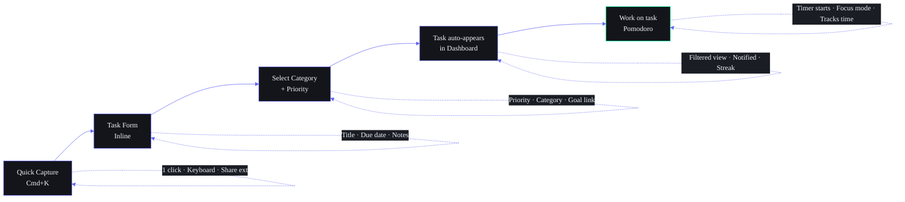

# UI/UX Specification — Second Brain OS

## Document Control

| Field | Value |
|---|---|
| Document ID | DSG-UIUX-008 |
| Version | 3.1.0 |
| Status | Active |
| Last Updated | 2026-07-11 |
| Classification | Internal — Design Reference |
| Target Audience | Designers, Frontend Developers, QA Engineers |

---

## 1. Executive Summary

The Second Brain OS (ARIA OS) user experience is built on a **cyberpunk dark theme** that balances aesthetic boldness with functional clarity. Every design decision serves the mission of transforming a student into a builder. This document defines the complete UX framework — from research methodology and design process through interaction patterns, micro-interactions, feedback systems, and accessibility — ensuring a cohesive, high-quality experience across all 16 modules.

**Core UX Promise:** "Your second brain should be faster than your first."

---

## 2. UX Philosophy

### 2.1 Design Principles

| # | Principle | Description | Example |
|---|---|---|---|
| 1 | **Dark by Default** | #0A0B0F base reduces eye strain during late-night study sessions. The dark canvas makes neon accent colors pop, guiding attention without visual noise. | Dashboard cards use subtle glass borders; neon green (#00FFA3) draws eye to completed streaks. |
| 2 | **Speed is a Feature** | Every interaction completes under 100ms. Skeleton screens appear in under 200ms. Animations run at 60fps. | Task completion triggers instant local state update before API confirms. |
| 3 | **Glanceable Information** | The Morning Briefing delivers critical data in under 5 seconds. Cards expose priority, status, and next action without requiring a click. | Dashboard communicates your day before you read a single word. |
| 4 | **Zero Data Loss** | The Never-Forget System means every idea, resource, and task is captured before it slips away. Quick Capture buttons are available from every screen. Auto-save prevents loss on navigation or refresh. | Draft tasks persist in localStorage even if the API call fails. |
| 5 | **Contextual Intelligence** | ARIA adapts the interface based on your sleep score, productivity patterns, and active goals. Low sleep shifts hard tasks off the main view. A stalled goal surfaces a micro-task prompt. | The UI reflects your current state, not a static layout. |
| 6 | **Progressive Disclosure** | Show essential actions first. Reveal complexity on demand. Never overwhelm the user with 20 options when they need 3. | Task detail panel expands inline; full editor is one click away. |
| 7 | **Forgiving Input** | Every destructive action has undo or confirmation. Search handles typos. Date inputs accept natural language ("tomorrow", "next Mon"). | Deleting a task shows a 5-second undo toast before finalizing. |

### 2.2 UX Quality Attributes

| Attribute | Target | Measurement Method |
|---|---|---|
| Task Success Rate | >95% | Analytics funnel tracking |
| Time on Task | <30s for core actions | Heatmap + session recording |
| Error Rate | <2% | Form validation analytics |
| Satisfaction Score | >4.2/5 | In-app NPS survey (quarterly) |
| First-Time Success | >80% complete onboarding | Onboarding funnel analytics |
| Retention (Day 7) | >60% | Cohort analysis |
| Page Load Time | <1.5s (P75) | Lighthouse CI |

---

## 3. User Research Methodology

### 3.1 Research Cadence

| Frequency | Method | Sample Size | Purpose |
|---|---|---|---|
| Weekly | In-app Micro-surveys (1-2 questions) | 50-200 respondents | Gauge satisfaction with new features, identify pain points |
| Monthly | Usability testing (remote moderated) | 5-8 participants | Validate new workflows, identify friction |
| Quarterly | Deep-dive user interviews (30-45 min) | 10-15 participants | Understand motivations, unmet needs, workflow context |
| Quarterly | Analytics review (quantitative) | All active users | Track metric trends, identify dropout funnels |
| Bi-annual | Competitive benchmarking | N/A | Compare UX quality against Notion, Todoist, Roam, Obsidian |
| Annual | Comprehensive NPS + SUS survey | All users | Measure overall experience quality |

### 3.2 Research Artifacts

#### 3.2.1 Survey Templates

**Micro-survey (post-action):**
```
How easy was it to [complete action]?
[  ] Very easy
[  ] Easy
[  ] Neutral
[  ] Difficult
[  ] Very difficult

Anything else? [free text]
```

**Quarterly NPS Survey:**
```
How likely are you to recommend ARIA OS to a friend?
0  1  2  3  4  5  6  7  8  9  10
Not at all                          Extremely likely

What is the primary benefit you get from ARIA OS? [free text]
What is the biggest frustration? [free text]
What feature would you add if you could? [free text]
```

#### 3.2.2 Interview Protocol

| Phase | Duration | Activities |
|---|---|---|
| Introduction | 3 min | Explain purpose, get consent, set expectations |
| Context | 5 min | Understand daily workflow, tools used, environment |
| Task observation | 15 min | Watch user complete 3-5 core tasks, think-aloud protocol |
| Deep dive | 10 min | Probe pain points, unmet needs, feature requests |
| Wrap-up | 2 min | Thank you, explain next steps, offer incentive |

#### 3.2.3 Analytics Framework

| Category | Events Tracked | Tools |
|---|---|---|
| Engagement | DAU/MAU, session duration, screen views per session | PostHog / Plausible |
| Adoption | Feature activation rate, time to first use of each feature | PostHog |
| Retention | Day 1/7/30 retention, weekly returning rate | Supabase analytics |
| Funnel | Onboarding completion, task creation → completion, habit start → streak | PostHog funnel analysis |
| Performance | LCP, FID, CLS, API response times (P50/P95) | Lighthouse CI, Sentry |

---

## 4. UX Design Process

### 4.1 Process Overview


### 4.2 Phase Breakdown

| Phase | Duration | Deliverables | Stakeholders |
|---|---|---|---|
| **Research** | 1-2 weeks per feature | User interviews summary, competitive analysis, analytics report | PM, Designer |
| **Define** | 3-5 days | Problem statement, user stories, acceptance criteria, UX goals | PM, Designer, Dev lead |
| **Ideate** | 2-3 days | Sketches (10+ per designer), concept diagrams, Crazy 8s | Design team |
| **Prototype** | 1-2 weeks | Figma interactive prototype (high-fidelity), micro-interactions spec | Designer |
| **Test** | 3-5 days | Usability test report, issue severity matrix, recommendations | Designer, PM |
| **Iterate** | 1 week | Revised prototype, updated specs, design approval | All |

### 4.3 Fidelity Levels

| Level | Description | When Used |
|---|---|---|
| Low-fidelity (lo-fi) | Paper sketches, wireframes, Balsamiq | Ideation, early concept validation |
| Mid-fidelity (mid-fi) | Grey-box mockups, basic layout, no styling | Layout validation, content structure |
| High-fidelity (hi-fi) | Full design with colors, typography, icons, animations | Usability testing, dev handoff |
| Production-ready | Hi-fi + design tokens, responsive specs, interaction specs | Final approval, development |

### 4.4 Design Review Gates

| Gate | Participants | Criteria |
|---|---|---|
| **UX Review** (peer) | 2+ designers | Flow completeness, consistency, edge cases covered |
| **Design Review** (lead) | Design lead | Quality bar, brand alignment, accessibility compliance |
| **Engineering Review** | Lead frontend dev | Technical feasibility, implementation effort, design token usage |
| **PM Sign-off** | Product manager | Requirements met, timeline alignment, scope confirmed |
| **QA Review** | QA engineer | All states handled (loading, empty, error, edge cases) |

---

## 5. User Journey Maps

### 5.1 Core Personas

| Persona | Role | Goals | Pain Points |
|---|---|---|---|
| **Aarav** — BTech CSE Sophomore | Student | Manage courses, tasks, projects; track habits; stay organized | Overwhelmed by multiple tools; forgets deadlines; poor time management |
| **Priya** — BTech CSE Junior | Student + Intern | Balance academics, internship, side projects; track opportunities | Misses application deadlines; can't prioritize across work/school/life |
| **Rohan** — BTech CSE Senior | Student + Job Seeker | Prepare for placements, track opportunities, manage learning | Scattered resources; no structured prep; interview tracking chaos |

### 5.2 Aarav's Daily Journey Map

| Time | Activity | Touchpoints | Goals | Pain Points | Opportunity |
|---|---|---|---|---|---|
| 7:00 AM | Wake up, check schedule | Mobile — Morning Briefing notification | See today's tasks and deadlines quickly | Wants a single glance at what matters | Briefing card shows top 3 tasks, weather, sleep score |
| 8:00 AM | Attend lectures | Mobile — Course view | Track attendance, view upcoming assignments | Forgets which courses have deliverables | Course card shows next assignment deadline with countdown |
| 12:00 PM | Lunch break, catch up | Mobile — Quick Capture | Save ideas/links from social media | Ideas get lost in chat apps | Share-to-ARIA extension captures directly |
| 3:00 PM | Study session | Desktop — Tasks + Pomodoro timer | Complete assignments with focus | Gets distracted, loses track of time | Integrated Pomodoro with task linking |
| 6:00 PM | Coursework | Desktop — Course detail | Watch recorded lectures, track progress | No way to track lecture progress | Course progress bar per module |
| 9:00 PM | Wind down | Mobile — Sleep log + Reflection | Log sleep, reflect on the day | Forgets to track sleep | Bedtime reminder with wind-down prompt |
| 10:00 PM | Review tomorrow | Desktop/Mobile — Dashboard | Preview next day's schedule | Doesn't plan ahead | Evening briefing card shows tomorrow's top tasks |

### 5.3 Priya's Weekly Journey Map (Internship + Academics)

| Day | Focus | ARIA OS Modules Used | Key Interactions |
|---|---|---|---|
| Mon-Fri | Internship (9-5) | Time tracking, Tasks, Projects | Log time entries, track project tasks, Pomodoro sessions |
| Mon/Wed evening | College assignments | Courses, Tasks, Goals | Mark course progress, create assignment tasks, check goal milestones |
| Tue/Thu evening | Side project | Projects, Ideas, Resources | Update project board, log new ideas, save resources |
| Fri evening | Weekly review | Weekly Review, Goals | Review week's accomplishments, adjust goals |
| Sat | Career prep | Opportunities, Learning | Apply to opportunities, complete learning modules |
| Sun | Planning + Rest | Habits, Sleep, Goals | Plan next week, review sleep data, set weekly intentions |

### 5.4 Rohan's Placement Prep Journey

| Phase | Activities | Success Metrics | ARIA Touchpoints |
|---|---|---|---|
| **Awareness** | Discover opportunities, understand requirements | 10+ relevant opportunities identified | Opportunity radar daily scan |
| **Preparation** | Study DSA, company-specific prep, projects | 50+ hours tracked, 5+ projects completed | Learning modules, time tracking, projects |
| **Application** | Apply to companies, track status | 20+ applications submitted | Opportunity tracking with status pipeline |
| **Interview** | Schedule interviews, practice | 5+ interviews completed, offers received | Calendar sync, interview prep checklist |
| **Selection** | Compare offers, make decision | 1+ offer accepted | Decision matrix, pro-con comparison |

### 5.5 User Journey for Task Creation



---

## 6. Information Architecture

### 6.1 Site Map

```mermaid
%%{init: {'theme': 'base', 'themeVariables': {'background': '#0A0B0F', 'primaryColor': '#13151A', 'primaryBorderColor': '#6366F1', 'primaryTextColor': '#F1F5F9', 'lineColor': '#6366F1', 'secondaryColor': '#1A1D24', 'tertiaryColor': '#0A0B0F', 'fontFamily': 'DM Sans'}}}%%
graph TD
    Home[Home Dashboard] --> Tasks[Tasks - List/Kanban]
    Home --> Courses[Courses - Grid]
    Home --> Goals[Goals - Canvas/Grid]
    Home --> Habits[Habits - Grid]
    Home --> Sleep[Sleep - Dashboard]
    Home --> Income[Income - Dashboard]
    Home --> Projects[Projects - Kanban]
    Home --> Ideas[Ideas - Pipeline]
    Home --> Resources[Resources - Grid]
    Home --> Opportunities[Opportunities - List]
    Home --> Time[Time - List/Dashboard]
    Home --> Chat[Chat - Full]
    Home --> Automation[Automation - List]
    Home --> Settings[Settings - Modal/Overlay]
    
    Tasks --> TD[Task Detail /tasks/:id]
    Tasks --> TF[Task Filter /tasks?status=pending]
    Courses --> CD[Course Detail /courses/:id]
    Courses --> CP[Course Progress /courses/:id/progress]
    Goals --> GD[Goal Detail /goals/:id]
    Goals --> GR[Goal Roadmap /goals/:id/roadmap]
    Habits --> HD[Habit Detail /habits/:id]
    Income --> IE[Income Entry /income/new]
    Projects --> PD[Project Detail /projects/:id]
    Ideas --> ID[Idea Detail /ideas/:id]
    Resources --> RD[Resource Detail /resources/:id]
    Resources --> RC[Resource Collection /resources/collections/:id]
    Opportunities --> OD[Opportunity Detail /opportunities/:id]
    Time --> TS[Time Stats /time/stats]
    Automation --> AB[Briefing /automation/briefing]
    Automation --> AR[Radar /automation/radar]
    Automation --> AW[Weekly Review /automation/weekly-review]
    Settings --> SP[Profile]
    Settings --> SPr[Preferences]
    Settings --> SN[Notifications]
    Settings --> SI[Integrations]
    Settings --> SA[Account]

    style Home fill:#0A0B0F,stroke:#00FFA3,color:#F1F5F9,stroke-width:2px
    style Tasks fill:#13151A,stroke:#6366F1,color:#F1F5F9
    style Courses fill:#13151A,stroke:#6366F1,color:#F1F5F9
    style Goals fill:#13151A,stroke:#6366F1,color:#F1F5F9
    style Habits fill:#13151A,stroke:#6366F1,color:#F1F5F9
    style Sleep fill:#13151A,stroke:#6366F1,color:#F1F5F9
    style Income fill:#13151A,stroke:#6366F1,color:#F1F5F9
    style Projects fill:#13151A,stroke:#6366F1,color:#F1F5F9
    style Ideas fill:#13151A,stroke:#6366F1,color:#F1F5F9
    style Resources fill:#13151A,stroke:#6366F1,color:#F1F5F9
    style Opportunities fill:#13151A,stroke:#6366F1,color:#F1F5F9
    style Time fill:#13151A,stroke:#6366F1,color:#F1F5F9
    style Chat fill:#13151A,stroke:#6366F1,color:#F1F5F9
    style Automation fill:#13151A,stroke:#6366F1,color:#F1F5F9
    style Settings fill:#13151A,stroke:#6366F1,color:#F1F5F9
```



### 6.2 Navigation Hierarchy

| Level | Component | Purpose | Persistence |
|---|---|---|---|
| **Primary** | Sidebar (w-60) | Module navigation, 16 items | Always visible on desktop |
| **Secondary** | Navbar (h-16) | Search, notifications, user menu | Always visible |
| **Tertiary** | Breadcrumbs | Context within nested pages | Module detail pages |
| **Quaternary** | Tab bars / Sub-nav | Module-specific views (e.g., Tasks: List | Kanban | Calendar) | Module pages |
| **Utility** | Command Palette (Cmd+K) | Global search and actions | Overlay / modal |
| **Mobile** | Bottom Nav (h-16) | 5 core destinations | Always visible on mobile |

### 6.3 Global Navigation Items

| # | Item | Icon (lucide-react) | Route | Category |
|---|---|---|---|---|
| 1 | Dashboard | LayoutDashboard | /dashboard | Core |
| 2 | Tasks | CheckSquare | /tasks | Core |
| 3 | Courses | BookOpen | /courses | Academic |
| 4 | Goals | Target | /goals | Core |
| 5 | Habits | Flame | /habits | Wellness |
| 6 | Sleep | Moon | /sleep | Wellness |
| 7 | Income | DollarSign | /income | Finance |
| 8 | Projects | FolderKanban | /projects | Work |
| 9 | Ideas | Lightbulb | /ideas | Creative |
| 10 | Resources | Library | /resources | Knowledge |
| 11 | Opportunities | Briefcase | /opportunities | Career |
| 12 | Time | Clock | /time | Productivity |
| 13 | Chat | MessageSquare | /chat | AI |
| 14 | Automation | Zap | /automation | System |

---

## 7. Interaction Design Patterns

### 7.1 Task Interaction Pattern

| Action | Trigger | Response | Feedback |
|---|---|---|---|
| Create task | Cmd+K or + button | Inline form slides down below trigger | Auto-focus title input |
| Complete task | Checkbox click | Strike-through text, fade-out, move to completed | Confetti burst (first daily task), streak update |
| Edit task | Click on title | Inline edit mode or slide-in panel | Save indicator |
| Delete task | Trash icon (visible on hover/row action) | Confirmation required (undo toast for 5s) | Card collapses, toast "Task deleted" + undo |
| Reorder tasks | Drag handle | Visual lift, drop zone highlight | Spring animation on drop |
| Filter tasks | Filter button / keyboard shortcut | Dropdown with multi-select chips | Badge count on filter button |

### 7.2 Course Browsing Pattern

| Action | Trigger | Response | Feedback |
|---|---|---|---|
| View courses | Sidebar click | Card grid loads with skeleton | Staggered card reveal |
| Select course | Card click | Slide transition to detail view | Breadcrumb appears |
| Track progress | Module completion toggle | Progress bar animates forward | Dim completion animation |
| View syllabus | "Syllabus" tab | Accordion sections, expandable | Section count badge |

### 7.3 Habit Tracking Pattern

| Action | Trigger | Response | Feedback |
|---|---|---|---|
| Log habit | Today's checkbox click | Checkbox fills with accent-primary | Scale bounce animation |
| View streak | Navigate to habits module | Streak counter with flame icon | Flame glow intensifies with streak length |
| Missed habit | End of day auto-check | Remaining unlogged habits dim | Notification: "You missed: [habit]" |
| Calendar view | Toggle to calendar mode | Month grid with completion dots | Dot color gradient from dim → bright |

### 7.4 Data Visualization Interaction

| Element | Interaction | Visual Feedback |
|---|---|---|
| Chart hover | Hover over data point | Tooltip with exact values, vertical guide line |
| Chart click | Click on data point | Drill-down to detail view |
| Progress bar | Automatic | Gradient fill, width transition at 500ms |
| Heatmap cell | Hover | Color intensity increases, value tooltip |
| Calendar day | Click | Opens daily log for that date |

### 7.5 Keyboard Shortcuts

| Shortcut | Action | Scope |
|---|---|---|
| `Cmd+K` / `Ctrl+K` | Open Command Palette | Global |
| `N` | New item (task/note/resource) | Context-aware |
| `/` | Focus search bar | Global |
| `Escape` | Close modal / panel / palette | Global |
| `Enter` | Confirm / submit | Form |
| `Tab` / `Shift+Tab` | Navigate between fields | Form |
| `↑` / `↓` | Navigate list items | List view |
| `Space` | Toggle checkbox / play-pause | Context-aware |
| `Cmd+Z` | Undo | Within 5s of action |
| `Cmd+Enter` | Quick save and close | Form |

---

## 8. Micro-Interactions Catalog

### 8.1 Definition

Micro-interactions are single-purpose, trigger-response animations that provide feedback, guide the user, and make the interface feel alive.

### 8.2 Catalog

| # | Micro-interaction | Trigger | Animation | Duration | Timing |
|---|---|---|---|---|---|
| 1 | **Button Press** | Click/tap | `scale(0.97)` with `box-shadow` dim | 100ms | Immediate on pointer down |
| 2 | **Checkbox Toggle** | Click/tap | Scale 1.0 → 1.15 → 1.0 with fill sweep | 250ms | On toggle |
| 3 | **Card Hover** | Mouse enter | `translateY(-3px)`, glow shadow intensifies | 300ms | 50ms delay on enter |
| 4 | **Toast Slide-in** | Action completes | `translateY(-20px)` → `translateY(0)`, opacity 0 → 1 | 300ms | 100ms delay |
| 5 | **Modal Enter** | Trigger click | Backdrop fade 0→0.5 (200ms), modal scale 0.9→1 (300ms) | 300ms | Parallel |
| 6 | **Sidebar Hover** (collapsed) | Mouse enter | Width expands from w-16 to w-60 | 200ms | On hover |
| 7 | **Progress Fill** | Value change | Width animates from previous to new value | 500ms | On update |
| 8 | **Notification Badge** | New notification | Scale 0 → 1.2 → 1 + pulse glow | 400ms | On receive |
| 9 | **Skeleton Fade** | Content loads | Opacity 1 → 0 (skeleton), 0 → 1 (content) | 200ms | On data ready |
| 10 | **Page Transition** | Route change | Current page opacity 1→0 (150ms), new page 0→1 (200ms) | 350ms | On route |
| 11 | **Drag Handle** | Mouse down on drag | Scale 1 → 1.05, shadow elevates | 150ms | On grab |
| 12 | **Drop Target** | Drag over | Background pulse highlight | Continuous | While dragging |
| 13 | **Delete Undo** | Delete action | Card collapses (300ms), toast appears (300ms) | 600ms | On delete |
| 14 | **Search Type** | Key press in search | Debounced results appear below with stagger | 200ms delay | On input |
| 15 | **Streak Flame** | New day streak | Flame icon flickers, counter increments | 500ms | On streak update |
| 16 | **Pomodoro Complete** | Timer ends | Bell ring sound, pulsing notification | 2s | On timer end |
| 17 | **Confetti Burst** | First task of day | 30-particle confetti from center | 800ms | On check |
| 18 | **Focus Ring** | Tab to element | `ring-2 ring-accent-primary` appears with 100ms delay | 100ms | On focus |
| 19 | **Error Shake** | Form validation fail | Input shakes horizontally 3px amplitude, 3 cycles | 300ms | On submit |
| 20 | **Dropdown Open** | Click trigger | Content scales from 0.95→1, opacity 0→1 | 200ms | On click |

### 8.3 Motion Guidelines

| Property | Recommendation | Rationale |
|---|---|---|
| Duration | 100ms-500ms | Fast enough to feel responsive, slow enough to perceive |
| Easing | `cubic-bezier(0.4, 0, 0.2, 1)` for exits, `cubic-bezier(0, 0, 0.2, 1)` for entrances | Material Design-inspired, natural feel |
| Stagger delay | 50ms increments, max 8 children | Creates wave effect without excessive wait |
| Overlap | 80% overlap between enter/exit transitions | Smoother feel than sequential |
| Reduced motion | Set all durations to 0.01ms, disable keyframes | Accessibility compliance |

---

## 9. Feedback Systems

### 9.1 Feedback Type Hierarchy

| Type | Priority | Usage | Dismissal |
|---|---|---|---|
| **Toast** | Medium | Success, info, warning messages | Auto-dismiss 4s / manual close |
| **Alert Banner** | High | System errors, connectivity loss, important updates | Manual close only |
| **Confirmation Dialog** | Critical | Destructive actions (delete, irreversible changes) | Explicit confirm/cancel |
| **Inline Validation** | Medium | Form field errors | Resolves on valid input |
| **Tooltip** | Low | Helper text, feature explanations | Hover out / tap away |
| **Progress Indicator** | Medium | Loading states, long operations | Auto-hides on completion |
| **Badge Notification** | High | Unread count, reminders | Resolves on action |

### 9.2 Toast Notification System

```
┌────────────────────────────────────────────┐
│  Position: Top-right (desktop), Top (mobile)│
│  Stack: Max 3 visible, newest on top       │
│  Z-index: z-toast (1060)                   │
└────────────────────────────────────────────┘
```

| Variant | Icon | Background | Border | Duration |
|---|---|---|---|---|
| Success | CheckCircle | #065F46 / 90% | #10B981 | 4s |
| Error | AlertCircle | #7F1D1D / 90% | #EF4444 | 6s |
| Warning | AlertTriangle | #78350F / 90% | #F59E0B | 5s |
| Info | Info | #1E3A5F / 90% | #3B82F6 | 4s |
| Undo | Undo2 | #1E293B / 95% | #6366F1 | 5s (includes undo action) |

**Implementation Example:**
```tsx
// Toast component props
interface ToastProps {
  variant: 'success' | 'error' | 'warning' | 'info' | 'undo'
  title: string
  description?: string
  action?: { label: string; onClick: () => void }
  duration?: number // ms, default varies by variant
  onDismiss: () => void
}
```

### 9.3 Confirmation Dialogs

| Scenario | Title | Message | Actions |
|---|---|---|---|
| Delete task | "Delete Task?" | "This action can be undone for 5 seconds." | [Cancel] [Delete] |
| Delete habit | "Delete Habit?" | "All associated logs will be permanently deleted." | [Cancel] [Delete] |
| Discard changes | "Discard Changes?" | "You have unsaved changes. Are you sure?" | [Keep Editing] [Discard] |
| Logout | "Sign Out?" | "You'll need to sign in again to access your data." | [Cancel] [Sign Out] |

### 9.4 Empty States

Every list, grid, and detail page includes an empty state when no data exists. Structure:

1. **Icon** — Module-specific illustration (64x64, stroke-width 1.5, accent-primary)
2. **Headline** — Action-oriented message: "No tasks yet. Start your first one."
3. **Description** — Brief guidance: "Tasks are the building blocks of your day. Create one to begin tracking your progress."
4. **CTA Button** — Primary action to create the first item
5. **Optional: Example prompts** — "Try: 'Complete DSA assignment' or 'Review PR #42'"

**Empty State Registry:**

| Module | Icon | Headline | CTA |
|---|---|---|---|
| Tasks | ClipboardList | "No tasks yet. Start your first one." | "+ Create Task" |
| Courses | BookOpen | "Your course library is empty." | "+ Add Course" |
| Goals | Target | "What do you want to achieve?" | "+ Create Goal" |
| Habits | Flame | "Build your first habit." | "+ New Habit" |
| Sleep | Moon | "Start tracking your sleep." | "Log Tonight" |
| Income | DollarSign | "Track your first income entry." | "+ Add Income" |
| Projects | FolderKanban | "Start your first project." | "+ New Project" |
| Ideas | Lightbulb | "Capture your first idea." | "+ New Idea" |
| Resources | Library | "Save your first resource." | "+ Add Resource" |
| Opportunities | Briefcase | "Find your first opportunity." | "+ Scan" |
| Time entries | Clock | "Start tracking your time." | "+ Log Entry" |
| Chat messages | MessageSquare | "Start a conversation with ARIA." | "Say Hello" |

### 9.5 Loading States

| State | Implementation | Duration |
|---|---|---|
| Initial page load | Full-page skeleton matching component layout | Until data resolves |
| Section load | Card-sized skeleton with shimmer (3 pill shapes) | Until section data resolves |
| Action load | Inline spinner (20px) replaces action icon | Until action completes |
| Background refresh | Silent update, no visual indicator | N/A |
| File upload | Progress bar with percentage + filename | Until upload completes |
| AI generation | Streaming text / skeleton with pulsing glow | Until generation completes |

### 9.6 Error States

| Scenario | Handling | User Message | Recovery Action |
|---|---|---|---|
| Network failure | Toast notification | "Could not load. Check your connection." | Retry button |
| API error (4xx) | Inline error banner | "Something went wrong. [specific message]" | Retry / Go Back |
| API error (5xx) | Inline error banner | "ARIA hit a glitch. Give me a moment." | Retry / Refresh |
| Auth expired | Redirect + toast | "Your session expired. Please sign in again." | Sign In |
| Rate limited | Toast notification | "Too many requests. Try again in 60 seconds." | Countdown timer |
| Form validation | Inline field error | "[Field] is required / invalid" | Auto-focus on error field |
| File upload fail | Per-file error card | "[filename] failed to upload" | Retry / Remove |
| Offline mode | Banner at top | "You're offline. Showing cached data." | None (auto-resolves) |

---

## 10. Error Prevention and Recovery

### 10.1 Prevention Strategies

| Strategy | Implementation | Modules |
|---|---|---|
| **Constraint validation** | Required fields marked, character limits enforced, format validation | Task form, Course form, all inputs |
| **Confirmation before destruction** | Modal dialog for delete, archive, bulk actions | All CRUD modules |
| **Undo capability** | 5-second undo toast after delete/move | Tasks, Ideas, Resources |
| **Auto-save** | Debounced save (1.5s after last input) on forms | Task detail, Goal editor |
| **Graceful degradation** | Every feature works without AI or network | All modules |
| **Input suggestions** | Typeahead for categories, tags, related items | Task creation, Resource tagging |
| **Natural language parsing** | "tomorrow", "next week", "every day" → structured dates | Task due date, Habit frequency |

### 10.2 Recovery Flows

| Failure | Recovery Pattern |
|---|---|
| Network lost during task creation | Save to localStorage queue, sync on reconnect |
| API error on task completion | Optimistic update (show completed), queue for retry |
| Form navigation with unsaved changes | "Discard changes?" confirmation dialog |
| Session timeout during active use | Save current state, redirect to login, restore on return |
| AI generation timeout | Fallback to algorithmic response, notify user |
| Concurrent edit conflict | Last-write-wins, notify with "Updated by another session" toast |

### 10.3 Undo System Architecture

```typescript
interface UndoAction {
  id: string
  type: 'delete' | 'update' | 'move' | 'archive'
  timestamp: number
  entity: { table: string; id: string; data: any }
  expiry: number // Date.now() + 5000
}

// Undo stack maintained in Zustand store
interface UndoStore {
  stack: UndoAction[]
  push: (action: UndoAction) => void
  pop: () => UndoAction | undefined
  clear: () => void
}
```

---

## 11. Onboarding UX

### 11.1 First-Run Experience

| Step | Screen | Duration | Actions |
|---|---|---|---|
| 1 | **Welcome** — Brand animation + tagline | 3s auto | Click "Get Started" |
| 2 | **Goal Setting** — "What do you want to achieve?" — Multiple choice | User-paced | Select 1-3 goals, click "Continue" |
| 3 | **Quick Start** — Create first task | ~30s | Enter task title, optional due date |
| 4 | **Module Tour** — Highlight 5 key modules (Tasks, Courses, Habits, Goals, Chat) | ~2 min | Swipe through tooltips, try each module |
| 5 | **ARIA Introduction** — "Hi! I'm ARIA. Ask me anything." — Sample prompt shown | ~30s | Send first message to ARIA |
| 6 | **Dashboard** — First look at personalized dashboard | — | Automatic transition |

### 11.2 Feature Discovery

| Strategy | Implementation | Frequency |
|---|---|---|
| **Feature spotlight** | Tooltip on new feature, "New" badge for 7 days | Upon feature release |
| **Keyboard shortcut hints** | Shown in tooltip on hover, Command Palette shows all | Always available |
| **Contextual nudges** | "Did you know you can..." type prompts in empty states | On first visit to empty module |
| **Progressive disclosure** | Advanced features hidden behind "Show more" / settings gear | Always |
| **ARIA suggestions** | AI suggests features based on usage patterns: "I notice you've been logging tasks. Want to try Pomodoro?" | Weekly |
| **What's New modal** | Changelog shown after app update with feature highlights | On version update |

### 11.3 Onboarding Metrics

| Metric | Target | Measurement |
|---|---|---|
| Onboarding completion rate | >80% | Funnel: Step 1 → Step 6 |
| Time to first task | <2 min | From sign-up to first task creation |
| Time to first habit | <1 day | From sign-up to first habit log |
| Time to first ARIA chat | <3 days | From sign-up to first message |
| Feature activation (Day 7) | >60% using 3+ modules | Weekly active modules |

---

## 12. Mobile UX Considerations

### 12.1 Mobile-First Design Approach

Every screen is designed **mobile-first** in Figma, then expanded to tablet and desktop. This ensures the core experience is never compromised at smaller viewports.

### 12.2 Breakpoints

| Name | Width | Layout | Navigation |
|---|---|---|---|
| xs | < 375px | Single column, minimal padding | Bottom nav |
| sm | 375-640px | Single column, full-width cards | Bottom nav |
| md | 640-768px | 2-column grids | Bottom nav + hamburger |
| lg | 768-1024px | 2-3 column grids | Sidebar overlay |
| xl | 1024-1280px | Full desktop, 3-4 columns | Fixed sidebar |
| 2xl | > 1280px | Max-width containers, spacious | Fixed sidebar |

### 12.3 Touch Target Requirements

| Element | Minimum Size | Additional Requirements |
|---|---|---|
| Buttons | 44x44px | Adequate spacing between touch targets (>=8px) |
| Icon-only buttons | 44x44px | `aria-label` for accessibility |
| Input fields | 44px height | — |
| List items | 44px height per row | — |
| Bottom nav items | 56x48px (h-14, flex-1) | Active indicator, icon + label |
| FAB | 56x56px | Elevated shadow, bottom-right position |
| Sliders | 44px touch area | Visual track can be thinner |
| Links in text | 44px minimum touch area | Padding added via `inline-block` |

### 12.4 Mobile Gestures

| Gesture | Action | Feedback |
|---|---|---|
| Swipe left on task | Complete task | Strike-through, fade |
| Swipe right on task | Reschedule / move to "Tomorrow" | Slide reveal action |
| Swipe down on list | Pull to refresh | Spinner at top, haptic on refresh |
| Long press on card | Context menu | Haptic feedback, menu appears at touch point |
| Double tap on chart | Toggle full-screen | Chart expands with animation |
| Pinch on dashboard | No action (prevent accidental zoom) | `touch-action: manipulation` |
| Tap status bar | Scroll to top | Smooth scroll to top of page |

### 12.5 Mobile-Specific UI Patterns

| Pattern | Implementation | Rationale |
|---|---|---|
| Bottom sheet for forms | Slide-up panel with handle | Better one-handed reach than full-screen |
| Floating Action Button | 56px circle, bottom-right (+16px from edge) | Quick capture without navigating |
| Tab bar at bottom | 5 tabs max, always visible | Thumb-friendly zone |
| Search via header tap | Tap search bar → full-screen search | Maximize input space |
| Modal as full screen | Slide-up from bottom (100% height) | Avoids modal-on-modal confusion |
| Swipeable tabs | Horizontal swipe between views | Natural mobile interaction |
| Pull-to-refresh | Standard pull gesture | Familiar pattern |

### 12.6 Mobile Constraints and Workarounds

| Constraint | Workaround |
|---|---|
| No hover state | Use long-press for context actions |
| Limited screen space | Progressive disclosure, collapsible sections |
| Network instability | Offline cache, queue failed mutations |
| Keyboard covering inputs | `scrollIntoView()` on focus, `inputmode` attribute |
| Small touch targets | Minimum 44x44px, enforced by `.touch-target` class |
| Accidental back gesture | Confirmation for forms with unsaved data |
| Battery drain | Disable background animations, reduce polling |

### 12.7 PWA Support

| Feature | Implementation |
|---|---|
| Manifest | `manifest.json` with theme_color #0A0B0F |
| Service Worker | Cache-first for static assets, network-first for API |
| Offline fallback | Cached dashboard, queued mutations |
| Install prompt | Shown after 2 visits within 5 minutes |
| Splash screen | Brand logo + "Second Brain OS" on dark background |
| Push notifications | Enabled for reminders, briefings |

---

## 13. Accessibility Integration in UX

### 13.1 Standards Compliance

| Standard | Target | Verification Method |
|---|---|---|
| WCAG 2.1 AA | Minimum compliance | Automated (axe-core) + manual audit |
| WCAG 2.1 AAA | Stretch goal for core flows | Manual audit quarterly |
| Section 508 | US federal compliance | VPAT documentation |
| EN 301 549 | EU accessibility standard | Cross-reference with WCAG |

### 13.2 Accessibility by UX Phase

| UX Phase | Accessibility Activities |
|---|---|
| **Research** | Include 2+ participants with disabilities in usability testing |
| **Definition** | Write accessibility acceptance criteria alongside user stories |
| **Design** | Annotate focus order, ARIA labels, keyboard interactions in Figma |
| **Prototype** | Test with screen reader (VoiceOver / NVDA) |
| **Development** | Lint with `eslint-plugin-jsx-a11y`, use accessible components |
| **Testing** | axe-core automated scan, manual keyboard audit, screen reader test |
| **Release** | Accessibility regression checklist passes |

### 13.3 Specific Accessibility Patterns

| Pattern | Implementation |
|---|---|
| **Skip to content** | First focusable element, visible on focus |
| **Focus order** | Logical DOM order, matches visual reading order |
| **Focus indicator** | `ring-2 ring-accent-primary ring-offset-2 ring-offset-background` |
| **Color contrast** | >=4.5:1 for normal text, >=3:1 for large text (18px+ bold or 24px+) |
| **Reduced motion** | `prefers-reduced-motion` disables all animations (set to 0.01ms) |
| **Screen reader** | ARIA labels on all icons, `aria-live="polite"` on dynamic content |
| **Keyboard navigation** | Tab through all interactive elements, arrow keys for lists/tables |
| **Focus trap** | Modal open: trap focus, close on Escape, return focus on close |
| **Form labels** | Every input has visible `<label>` or `aria-label` |
| **Error announcements** | `aria-live="assertive"` on form validation errors |
| **Status announcements** | `aria-live="polite"` on toast notifications |
| **Heading hierarchy** | Single `<h1>`, logical h2-h4 nesting |

### 13.4 Color Contrast Compliance Table

| Combination | Ratio | AA (normal) | AA (large) | AAA (normal) |
|---|---|---|---|---|
| text-primary (#F0F2F5) on bg-background (#0A0B0F) | 15.2:1 | ✅ | ✅ | ✅ |
| text-primary (#F0F2F5) on bg-card (#12141C) | 14.8:1 | ✅ | ✅ | ✅ |
| text-secondary (#8B92A5) on bg-background (#0A0B0F) | 7.1:1 | ✅ | ✅ | ✅ |
| text-secondary (#8B92A5) on bg-card (#12141C) | 6.8:1 | ✅ | ✅ | ✅ |
| text-tertiary (#5A6075) on bg-background (#0A0B0F) | 4.6:1 | ✅ | ✅ | ❌ |
| text-disabled (#475569) on bg-background (#0A0B0F) | 3.5:1 | ❌ | ✅ | ❌ |
| accent-primary (#6366F1) on bg-background (#0A0B0F) | 5.2:1 | ✅ | ✅ | ❌ |
| accent-neon (#00FFA3) on bg-background (#0A0B0F) | 12.1:1 | ✅ | ✅ | ✅ |

---

## 14. UX Metrics and Measurement

### 14.1 Core UX Metrics (HEART Framework)

| Category | Metric | Target | Collection |
|---|---|---|---|
| **Happiness** | Satisfaction (CSAT) | >4.0/5.0 | Post-interaction survey (10% sampled) |
| **Happiness** | Net Promoter Score (NPS) | >40 | Quarterly survey |
| **Engagement** | Daily Active Users (DAU) | >80% of registered users | Analytics |
| **Engagement** | Sessions per user per day | >3 | Analytics |
| **Engagement** | Feature adoption rate | >50% for core features | Feature activation tracking |
| **Adoption** | Time to first value (TTFV) | <5 min from sign-up | Onboarding funnel |
| **Adoption** | Module activation (Day 7) | >60% using 3+ modules | Weekly cohort analysis |
| **Retention** | Day 1 / Day 7 / Day 30 retention | >70% / >60% / >40% | Cohort analysis |
| **Task Success** | Task completion rate | >95% | Funnel analytics |
| **Task Success** | Time on task | <30s for core actions | Session recording |
| **Task Success** | Error rate | <2% | Form validation analytics |

### 14.2 Task-Specific Metrics

| Task | Success Rate Target | Time Target | Error Rate Target |
|---|---|---|---|
| Create a task | >98% | <15s | <1% |
| Complete a task | >99% | <5s | <0.5% |
| Add a course | >95% | <30s | <2% |
| Log a habit | >99% | <3s | <0.5% |
| View daily briefing | >95% | <10s | <1% |
| Search across modules | >90% | <20s | <5% |
| Set a goal | >90% | <60s | <3% |
| Chat with ARIA | >95% | N/A | <1% |

### 14.3 Measurement Tools

| Tool | Purpose | Integration |
|---|---|---|
| PostHog | Product analytics, session recording, feature flags | Self-hosted / cloud |
| Lighthouse CI | Performance monitoring, accessibility scoring | GitHub Actions |
| Sentry | Error tracking, performance monitoring | Backend + frontend SDK |
| Supabase Analytics | Retention, engagement, funnels | Built-in |
| Custom events | Task-specific metrics | PostHog custom events |

### 14.4 UX Research Cadence

| Week | Activity | Participants | Output |
|---|---|---|---|
| Week 1-2 | Feature usability test | 5-8 users per feature | Report with severity matrix |
| Week 3-4 | Analytics deep dive | All users | Trend report, funnel analysis |
| Week 5-6 | User interviews (10-15) | 10-15 users | Affinity map, themes |
| Week 7-8 | Competitive review | N/A | Gap analysis |
| Week 9-10 | Accessibility audit | 2+ users with disabilities | Issue list, severity ratings |
| Week 11-12 | NPS / SAT survey | All users | Quarterly report |

---

## 15. Design Handoff Process

### 15.1 Handoff Artifacts

| Artifact | Format | Description | Owner |
|---|---|---|---|
| Figma file | `.fig` | Production-ready designs with all states | Designer |
| Design spec | Markdown in docs/ | Interaction details, edge cases, copy | Designer |
| Component documentation | Storybook | Props, variants, examples | Designer + Developer |
| Design token changes | PR to tailwind.config.js | New colors, spacing, typography | Designer |
| Asset exports | SVG / PNG | Icons, illustrations, images | Designer |

### 15.2 Figma File Structure

```mermaid
%%{init: {'theme': 'base', 'themeVariables': {'background': '#0A0B0F', 'primaryColor': '#13151A', 'primaryBorderColor': '#6366F1', 'primaryTextColor': '#F1F5F9', 'lineColor': '#6366F1', 'secondaryColor': '#1A1D24', 'tertiaryColor': '#0A0B0F', 'fontFamily': 'DM Sans'}}}%%
graph TD
    Project[Project: ARIA OS — Second Brain] --> DS[🎨 Design System]
    Project --> SC[🖥️ Screens]
    Project --> PT[🧪 Prototypes]
    Project --> RS[📝 Research]
    
    DS --> DS_C[Colors]
    DS --> DS_T[Typography]
    DS --> DS_S[Spacing]
    DS --> DS_I[Icons]
    DS --> DS_CP[Components]
    DS_CP --> BTN[Button]
    DS_CP --> CRD[Card]
    DS_CP --> INP[Input]
    DS_CP --> MDL[Modal]
    DS_CP --> DSEP[...]
    DS --> DS_P[Patterns]
    
    SC --> SC_D[Dashboard]
    SC --> SC_T[Tasks]
    SC --> SC_SEP[...]
    SC_D --> D_D[Default]
    SC_D --> D_E[Empty State]
    SC_D --> D_L[Loading]
    SC_D --> D_ER[Error State]
    SC_T --> T_L[List View]
    SC_T --> T_K[Kanban View]
    SC_T --> T_D[Task Detail]
    SC_T --> T_C[Create Task]
    
    PT --> PT_O[Onboarding Flow]
    PT --> PT_TC[Task Creation Flow]
    PT --> PT_W[Weekly Review Flow]
    
    RS --> RS_P[User Personas]
    RS --> RS_J[User Journey Maps]
    RS --> RS_T[Usability Test Reports]

    style Project fill:#0A0B0F,stroke:#00FFA3,color:#F1F5F9,stroke-width:2px
    style DS fill:#13151A,stroke:#6366F1,color:#F1F5F9
    style SC fill:#13151A,stroke:#6366F1,color:#F1F5F9
    style PT fill:#13151A,stroke:#6366F1,color:#F1F5F9
    style RS fill:#13151A,stroke:#6366F1,color:#F1F5F9
```



### 15.3 Handoff Checklist

Before marking a design as "Ready for Dev", the designer must verify:

- [ ] All variants/states designed (default, hover, active, disabled, error, loading, empty)
- [ ] Responsive behavior specified (mobile, tablet, desktop)
- [ ] Design tokens used instead of hardcoded values
- [ ] Accessibility annotations added (focus order, ARIA labels)
- [ ] Micro-interactions described (animation, duration, easing)
- [ ] Edge cases documented (long text, missing data, overflow)
- [ ] Error states defined (validation messages, error recovery)
- [ ] Copy approved by PM
- [ ] Figma layers named and organized
- [ ] Components use auto-layout with constraints

### 15.4 Dev-Design Collaboration

| Phase | Designer | Developer |
|---|---|---|
| **Design review** | Present designs, explain rationale | Review for feasibility, ask questions |
| **Component development** | Provide specs, answer questions | Build components, reference design system |
| **Integration** | Review implemented screens | Implement layouts, connect data |
| **QA** | Visual QA pass, note deviations | Fix issues, refine implementation |
| **Sign-off** | Final approval on deployed feature | Demo working feature |

---

## 16. Accessibility-In-Process Integration

### 16.1 Accessibility Checklist by Design Stage

**Wireframe Stage:**
- [ ] Content hierarchy clear without visual styling
- [ ] Tab order matches visual reading order
- [ ] All interactive elements are keyboard accessible

**Mid-fidelity Stage:**
- [ ] Color not sole indicator of meaning (add icons, text)
- [ ] Text alternatives for non-decorative images planned
- [ ] Heading structure documented (h1 → h2 → h3)

**High-fidelity Stage:**
- [ ] Color contrast verified (4.5:1 minimum)
- [ ] Focus indicators designed for every interactive element
- [ ] Touch targets meet minimum size (44x44px)
- [ ] Reduced motion alternatives specified

**Pre-development:**
- [ ] ARIA labels annotated for icons and interactive elements
- [ ] Form error handling and announcements specified
- [ ] Keyboard interaction flow documented

### 16.2 Accessibility Testing Cadence

| Frequency | Test Type | Tool / Method | Responsible |
|---|---|---|---|
| Every PR | Automated | axe-core (CI) | Developer |
| Weekly | Keyboard audit | Manual Tab navigation | Developer |
| Bi-weekly | Screen reader test | VoiceOver / NVDA | QA |
| Monthly | Color contrast audit | Contrast checker | Designer |
| Quarterly | WCAG 2.1 AA full audit | Manual + axe-core | QA + Accessibility specialist |
| Per release | User testing with PwD | 2+ participants | UX Researcher |

---

## 17. Visual Design Direction

### 17.1 Design Identity

| Attribute | Direction |
|---|---|
| **Genre** | Cyberpunk / Tech-noir |
| **Mood** | Focused, powerful, introspective |
| **Color temperature** | Cool (dark blues, indigos) with warm neon accents |
| **Texture** | Subtle noise, scan lines, grid overlays |
| **Lighting** | Self-illuminated (neon glow on dark) |
| **Typography** | Geometric sans (Syne) for display, humanist sans (DM Sans) for body |
| **Shapes** | Sharp corners (12px radius), clean lines, minimal ornamentation |
| **Motion** | Purposeful, 60fps, micro-interactions that communicate state |

### 17.2 Mood Board

```
┌─────────────────────────────────────────────────────────────┐
│  VISUAL REFERENCES                                          │
│                                                             │
│  Color: Blade Runner 2049 palette — deep blacks, neon teal, │
│         warm orange accents                                 │
│                                                             │
│  Typography: Arcane (Netflix) title cards — bold geometric  │
│              sans, tracking, uppercase headlines            │
│                                                             │
│  UI: Ghost in the Shell SAC_2045 interfaces — glass         │
│      morphism, holographic overlays, grid-based layouts     │
│                                                             │
│  Data viz: Minority Report — floating data points,          │
│            translucent overlays, real-time feeds            │
│                                                             │
│  Texture: Tron: Legacy — light trails, neon edges,          │
│           dark reflective surfaces                          │
└─────────────────────────────────────────────────────────────┘
```

### 17.3 Emotional Design Goals

| User State | Design Response |
|---|---|
| Overwhelmed (many tasks) | Clean, spaced layout with clear hierarchy. Progress bars show completion. |
| Focused (deep work) | Minimal UI, Pomodoro timer prominent, distractions hidden. |
| Curious (exploring features) | Interactive onboarding, progressive disclosure, tooltips. |
| Accomplished (task complete) | Celebratory micro-animation (confetti), streak updates. |
| Tired (late night) | Dark theme, reduced contrast on secondary elements, warm-toned accents. |
| Lost (new user) | Guided flows, contextual help, clear CTAs. |

---

## 18. Design Principles

| # | Principle | Definition | How We Apply It |
|---|---|---|---|
| 1 | **Hierarchy** | Every screen has one primary action. Visual weight communicates importance. | Card titles are Syne bold; secondary text is DM Sans normal. Primary buttons are the most saturated color on the page. |
| 2 | **Contrast** | Differentiate elements through color, size, spacing, and texture — never rely on color alone. | Task priority uses icon + color + label (e.g., "!" icon + red + "Urgent"). Interactive elements have distinct hover states. |
| 3 | **Consistency** | Similar elements look and behave similarly across the entire application. | All cards share the same padding (p-5), border radius (xl/16px), and background. All buttons share the same height (44px) and radius (lg/12px). |
| 4 | **Feedback** | Every action produces a visible, immediate response. | Button press scales to 0.97. Task completion strikes through text. Form errors shake the input. Toast appears on every mutation. |
| 5 | **Tolerance** | Prevent errors before they happen. When errors occur, make recovery easy. | Undo toasts (5s window). Confirmation on destructive actions. Auto-save on forms. Input validation with clear messages. |
| 6 | **Accessibility** | No feature is complete until it's accessible. | WCAG 2.1 AA minimum. Keyboard navigable. Screen reader compatible. Reduced motion respected. |
| 7 | **Performance as UX** | Perceived performance is a design concern, not just an engineering one. | Skeleton screens under 200ms. Optimistic UI updates. Route preloading. 60fps animations. |

---

## 19. Layout System

### 19.1 Architecture Overview

```
┌───────────────────────────────────────────────────────────────┐
│                      Pages (16 modules)                       │
│  Composed via PageLayout + StateHandler + DataView pattern    │
├───────────────────────────────────────────────────────────────┤
│                   CSS Grid Framework                          │
│  12-column grid | CSS Grid auto-fill | Flexbox compositions  │
├───────────────────────────────────────────────────────────────┤
│                   Spacing Scale (4px base)                    │
│  0(0) | 1(4) | 2(8) | 3(12) | 4(16) | 5(20) | 6(24) | ...  │
├───────────────────────────────────────────────────────────────┤
│               Container & Max-Width System                    │
│  App max: 1280px | Content max: 720px | Sidebar: 240px       │
├───────────────────────────────────────────────────────────────┤
│              Responsive Breakpoints (6 levels)                │
│  xs(375) | sm(640) | md(768) | lg(1024) | xl(1280) | 2xl(1536)│
└───────────────────────────────────────────────────────────────┘
```

### 19.2 CSS Grid Framework

| Property | Value | Notes |
|---|---|---|
| Grid columns | 12 | Standard layout grid |
| Column gap | 24px (gap-6) | Consistent across all grid uses |
| Horizontal padding | 32px (px-8) on desktop, 16px (px-4) on mobile |
| Max container width | 1280px | Applied to `.app-container` |
| Content max width | 720px | For long-form reading (goals, briefing) |

**Column Span Classes:**

| Span | Class | Usage |
|---|---|---|
| Full | `col-span-12` | Dashboard briefing, full-width banners |
| Two-thirds | `col-span-8` | Main content area with sidebar |
| Half | `col-span-6` | Split layouts, side-by-side panels |
| Third | `col-span-4` | Three-column card layouts |
| Quarter | `col-span-3` | Four-column stat grid |

### 19.3 Responsive Card Grid

```css
/* Primary card grid pattern */
.card-grid {
  display: grid;
  grid-template-columns: repeat(auto-fill, minmax(320px, 1fr));
  gap: 20px;
}

/* Stat grid (4 columns on desktop, 2 on tablet, 1 on mobile) */
.stat-grid {
  display: grid;
  grid-template-columns: repeat(auto-fill, minmax(200px, 1fr));
  gap: 16px;
}

/* Compact card grid for dense screens */
.compact-card-grid {
  display: grid;
  grid-template-columns: repeat(auto-fill, minmax(260px, 1fr));
  gap: 16px;
}
```

### 19.4 Dashboard Grid Layout

```
Desktop (1280px+):
┌─────────────────────────────────────────────────────────────┐
│  Daily Briefing                                 (col-span-12) │
├──────────────┬──────────────┬──────────────┬────────────────┤
│  Tasks Today │  Courses     │  Income       │  Streak        │
│  (col-span-3)│  (col-span-3)│  (col-span-3) │  (col-span-3)  │
├──────────────┴──────────────┼───────────────┴────────────────┤
│  Activity Heatmap            │  Upcoming Deadlines           │
│  (col-span-8)                │  (col-span-4)                 │
├──────────────┬──────────────┴───────────────┬────────────────┤
│  Quick Stats │  Recent Resources            │  Top Goal      │
│  (col-span-3)│  (col-span-6)                │  (col-span-3)  │
└──────────────┴──────────────────────────────┴────────────────┘
```

### 19.5 Spacing Scale

Base unit: **4px**. All spacing values MUST be multiples of 4.

| Token | Pixels | Tailwind | Usage |
|---|---|---|---|
| 0 | 0px | `gap-0` `p-0` | Remove spacing |
| 1 | 4px | `gap-1` `p-1` | Tight inner paddings, icon gaps |
| 2 | 8px | `gap-2` `p-2` | Stack spacing, tight gaps, sidebar items |
| 3 | 12px | `gap-3` `p-3` | Button padding (vertical), list gaps |
| 4 | 16px | `gap-4` `p-4` | Card padding (compact), dashboard stat gaps |
| 5 | 20px | `gap-5` `p-5` | Card padding (default), card grid gap |
| 6 | 24px | `gap-6` `p-6` | Section spacing, modal padding, column gap |
| 7 | 28px | `gap-7` `p-7` | Page section gaps (optional) |
| 8 | 32px | `gap-8` `p-8` | Page horizontal padding, sidebar width |
| 10 | 40px | `gap-10` `p-10` | Large section separation |
| 12 | 48px | `gap-12` `p-12` | Page section margins |
| 16 | 64px | `gap-16` `p-16` | Major page sections |
| 20 | 80px | `gap-20` `p-20` | Hero sections, extra-large spacing |

### 19.6 Container and Layout Widths

| Element | Width | Notes |
|---|---|---|
| App container | max-w-7xl (1280px) | Centered with auto margins |
| Sidebar (desktop) | w-60 (240px) | Fixed position, full height |
| Navbar content | max-w-7xl (1280px) | Centered within navbar |
| Modal (default) | max-w-lg (512px) | Centered on viewport |
| Modal (large) | max-w-2xl (672px) | For complex forms |
| Modal (full screen) | 100vw x 100vh | Mobile only |
| Toast | max-w-sm (384px) | Top-right position |
| Dropdown menu | w-56 (224px) | Anchored to trigger |
| Search bar (navbar) | max-w-md (448px) | Centered in navbar |
| Content body | max-w-prose (720px) | Long-form reading |
| Card (minimum) | min-w-[320px] | Card grid auto-fill |

---

## 20. Image Style Guide

### 20.1 Image Types

| Type | Format | Max Size | Usage |
|---|---|---|---|
| User avatar | JPEG/WebP | 200x200px, <50KB | Profile, navbar |
| Course thumbnail | JPEG/WebP | 640x360px, <100KB | Course cards |
| Resource preview | WebP | 1280x720px, <200KB | Resource cards |
| Empty state illustration | SVG | 64x64px | Module empty states |
| Custom illustration | SVG | Variable | Dashboard hero, branding |
| Background texture | PNG/WebP | Full width, <50KB | Page backgrounds |

### 20.2 Image Guidelines

- All raster images MUST be served in WebP format with JPEG fallback
- SVG MUST be optimized with SVGO (remove metadata, collapse groups)
- Icons and illustrations MUST be monochromatic (currentColor fill where possible)
- User-uploaded images MUST be processed server-side (resize, format convert)
- Decorative images MUST have `aria-hidden="true"` and empty `alt=""`

### 20.3 Image Fallbacks

| Scenario | Fallback |
|---|---|
| Avatar not set | Initials in accent-primary circle |
| Course thumbnail not available | Gradient placeholder (accent-primary to accent-secondary) |
| Resource preview fails | File type icon (PDF, Video, Link, etc.) |
| Image loading | Skeleton (card aspect ratio placeholder) |
| Image error | Broken image icon with "Image not available" text |

---

## 21. Form Design

### 21.1 Form Layout Patterns

| Layout | Usage | Properties |
|---|---|---|
| Single column | Most forms (task, course, habit) | Max-width 480px, centered |
| Two column | Settings, profile | 2-column grid, gap-6 |
| Inline | Search, quick filters | Horizontal layout, items aligned |
| Accordion | Long forms (goal, project) | Sections collapsible, one open at a time |
| Stepped | Onboarding, setup wizard | Step indicator + content + prev/next |

### 21.2 Input States

#### Default
```
┌─────────────────────────────┐
│  Label (text-secondary, sm) │
│  ┌───────────────────────┐  │
│  │ Placeholder text      │  │
│  └───────────────────────┘  │
│  Helper text (sm, tertiary) │
└─────────────────────────────┘
```

#### Focus
```
┌─────────────────────────────┐
│  Label (text-accent, sm)    │
│  ┌───────────────────────┐  │
│  │ Typed text            │  │
│  └───────────────────────┘  │
│  Helper text (sm, tertiary) │
└─────────────────────────────┘
```

#### Error
```
┌─────────────────────────────┐
│  Label (text-error, sm)     │
│  ┌───────────────────────┐  │
│  │ Typed text            │  │
│  └───────────────────────┘  │
│  ⚠ Error message (sm, err)  │
└─────────────────────────────┘
```

#### Disabled
```
┌─────────────────────────────┐
│  Label (text-disabled, sm)  │
│  ┌───────────────────────┐  │
│  │ Disabled text         │  │
│  └───────────────────────┘  │
│  Helper text (sm, disabled) │
└─────────────────────────────┘
```

#### Filled (Success)
```
┌─────────────────────────────┐
│  Label (text-secondary, sm) │
│  ┌───────────────────────┐  │
│  │ ✓ Valid input         │  │
│  └───────────────────────┘  │
│  (no helper text needed)    │
└─────────────────────────────┘
```

### 21.3 Form Validation Rules

| Validation | Timing | Message Style |
|---|---|---|
| Required field | On blur + submit | "[Field label] is required" |
| Format validation | On blur | "Enter a valid [format]" |
| Max length | On input (live) | Character counter: "25/200" |
| Min length | On blur | "Must be at least X characters" |
| Pattern match | On blur | Specific format instructions |
| Async (unique check) | Debounced 500ms | "[Value] is already taken" |

### 21.4 Form Submission

| State | Button State | Feedback |
|---|---|---|
| Idle | Enabled | Normal |
| Submitting | Spinner replaces icon, disabled | Inline spinner |
| Success | Brief green flash, then reset | Toast "Saved successfully" |
| Error | Re-enable, shake animation | Inline error message + toast |
| Server error | Re-enable | Toast "Something went wrong" + retry |

---

## 22. Dark Mode Design Decisions

### 22.1 Dark Mode Strategy

| Decision | Implementation | Rationale |
|---|---|---|
| Always dark (v1) | `darkMode: 'class'`, body always has `dark` class | Primary users are students working late; light mode not needed |
| No toggle (v1) | No light/dark switch | Single theme reduces complexity; light mode planned for v2 |
| True black sparingly | #050607 for deepest surfaces | Avoids eye strain; true black used only for input fields |
| Glass overlays | rgba white overlays on dark surfaces | Creates depth without light colors |
| Neon glow | Box-shadow with accent colors | Replaces drop shadows (invisible on dark) |
| Gradient backgrounds | Dual radial gradients on body | Adds texture without affecting readability |

### 22.2 Dark Mode-Only Patterns

| Pattern | Implementation |
|---|---|
| **Text shadows** | None (text on dark needs no shadow) |
| **Box shadows** | Replace with glow effects (colored shadows) |
| **Focus rings** | accent-primary ring, visible on all surfaces |
| **Active states** | Scale down (0.97) instead of darkening |
| **Borders** | Visible borders on all cards and sections (light gray #2A2E3F) |
| **Skeleton loading** | Dark gray shimmer (#1A1D28 to #2A2E3F) |
| **Error states** | Red border + red glow, not just color change |
| **Disabled states** | Opacity 50% across all elements |

### 22.3 Dark Mode Color Tokens

All tokens are designed for dark backgrounds. No token maps to a light-equivalent in v1.

| Token | Hex | Light Alternative (Future) |
|---|---|---|
| `bg-page` | #0A0B0F | #F8FAFC |
| `bg-card` | #12141C | #FFFFFF |
| `bg-elevated` | #1A1D28 | #F1F5F9 |
| `border-default` | #2A2E3F | #E2E8F0 |
| `text-primary` | #F0F2F5 | #0F172A |

---

## 23. Design Tokens vs Hardcoded Values

### 23.1 The Rule

**NEVER hardcode colors, spacing, typography, shadows, or animation values in component files.**

All visual properties MUST reference design tokens defined in `tailwind.config.js` or `globals.css`.

### 23.2 Token Categories

| Category | Source | Example |
|---|---|---|
| Colors | `tailwind.config.js` | `bg-background-card` |
| Fonts | `globals.css` | CSS custom properties |
| Spacing | `tailwind.config.js` | `gap-5`, `p-6` |
| Shadows | `tailwind.config.js` | `shadow-glow` |
| Animations | `tailwind.config.js` | `animate-float` |
| Z-index | `tailwind.config.js` | `z-dropdown` |
| Border radius | `tailwind.config.js` | `rounded-xl` |
| Breakpoints | `tailwind.config.js` | `lg:` |

### 23.3 Enforcement

| Mechanism | Scope | Tool |
|---|---|---|
| ESLint rule | JSX/TSX files | `eslint-plugin-tailwindcss` |
| Design review | PR review process | Manual check for hardcoded values |
| Component development | New components | Start from existing component patterns |
| Automated check | CI pipeline | Compare vs allowed tokens list |

---

## 24. Design Review Process

### 24.1 Review Stages

| Stage | Participants | Focus | Artifacts |
|---|---|---|---|
| **Self-review** | Designer | Compliance with design system, all states covered, accessibility basics | Figma file annotated |
| **Peer review** | 2+ designers | Consistency, visual quality, UX flow completeness | Figma comments |
| **Lead review** | Design lead | Brand alignment, quality bar, accessibility compliance | Sign-off checklist |
| **Engineering review** | Lead frontend dev | Technical feasibility, design token usage, effort estimate | Spec review |
| **PM sign-off** | Product manager | Requirements met, timeline aligned, scope confirmed | Final approval |

### 24.2 Review Checklist

- [ ] All component states designed (default, hover, active, disabled, loading, error, empty)
- [ ] Responsive layouts specified (mobile, tablet, desktop)
- [ ] Design tokens used (no hardcoded values)
- [ ] Color contrast verified (4.5:1 minimum)
- [ ] Focus indicators designed for interactive elements
- [ ] Touch targets >=44x44px
- [ ] Typography hierarchy correct (h1 to h2 to h3 to body)
- [ ] Icons have aria-labels or text alternatives
- [ ] Reduced motion alternatives considered
- [ ] Error states and validation messages defined
- [ ] Edge cases handled (long text, overflow, missing data)
- [ ] Copy approved

---

## 25. Figma File Organization

### 25.1 File Structure

```
Project: ARIA OS — Second Brain
├── 🎨 Design System
│   ├── 🎨 Colors — Color palette with tokens, contrast info, usage notes
│   ├── 🔤 Typography — Type scale, font families, line heights, examples
│   ├── 📐 Spacing — Spacing scale, padding/gap recommendations
│   ├── 🖼 Icons — Icon set reference, usage guidelines
│   ├── 🧩 Components
│   │   ├── Button — All variants, sizes, states (grid layout)
│   │   ├── Card — All variants, internal structure, responsive
│   │   ├── Input — All types, all states, error handling
│   │   ├── Modal — Desktop/mobile, empty, with content
│   │   ├── Badge — All variants, sizes
│   │   ├── Dropdown — Items, groups, dividers, scrolling
│   │   ├── Progress — Linear, circular, step indicators
│   │   ├── Tooltip — Positions, content types
│   │   ├── Skeleton — Card, list, chart placeholders
│   │   ├── Toast — All variants, stacked
│   │   ├── Spinner — All sizes, inline vs centered
│   │   ├── Avatar — All sizes, with image, fallback initials
│   │   └── Tabs — Horizontal, vertical, with icons
│   └── 🔄 Patterns
│       ├── Empty States — All 16 module empty states
│       ├── Loading States — Skeleton layouts for each module
│       ├── Error States — Error banners, error modals
│       └── Navigation — Sidebar, navbar, bottom nav, breadcrumbs
│
├── 🖥️ Screens
│   ├── 01 Dashboard — Default, empty, briefing detail
│   ├── 02 Tasks — List, kanban, detail, create, empty
│   ├── 03 Courses — Grid, detail, progress, empty
│   ├── 04 Goals — Canvas, detail, roadmap, empty
│   ├── 05 Habits — Grid, calendar, streak view, empty
│   ├── 06 Sleep — Dashboard, log, history
│   ├── 07 Income — Dashboard, entry list, add/edit
│   ├── 08 Projects — Kanban, detail, board settings
│   ├── 09 Ideas — Pipeline (raw to validating to building to shipped)
│   ├── 10 Resources — Grid, collections, detail
│   ├── 11 Opportunities — List, detail, match scores
│   ├── 12 Time — Dashboard, timer active, stats
│   ├── 13 Chat — Message list, ARIA response, empty
│   └── 14 Automation — Briefing, radar, weekly review
│
├── 🧪 Prototypes
│   ├── Onboarding Flow
│   ├── Task Creation Flow
│   ├── Weekly Review Flow
│   └── Mobile Navigation Flow
│
└── 📝 Research & Specs
    ├── Personas (3 core personas)
    ├── User Journey Maps (Aarav, Priya, Rohan)
    ├── Usability Test Reports
    └── Design Annotations
```

### 25.2 Component Organization Rules

- Every component is a **Figma component** with auto-layout
- Components are organized by type in the Assets panel
- Variants are used for different states (default, hover, active, disabled)
- Component descriptions include design token references
- Naming convention: `ComponentName/Variant/State` (e.g., `Button/Primary/Default`)
- Components use styles (color, text, effect styles) — never hardcoded values

---

## Reference

| Document | Link |
|---|---|
| Design Architecture | *Merged into this document (v3.1.0)* |
| Design System | `docs/design/10_DesignSystem.md` |
| Design Tokens | `docs/design/35_DesignTokens.md` |
| Accessibility Design | `docs/design/FrontendAccessibilityGuide.md` |
| Branding Guide | `docs/design/Branding.md` |
| Motion System | `docs/design/MotionSystem.md` |
| Responsive Design | `docs/design/ResponsiveRules.md` |
| UI Component Library | `apps/web/components/` |
| Tailwind Configuration | `apps/web/tailwind.config.js` |
| Global CSS | `apps/web/app/globals.css` |

---

## Revision History

| Version | Date | Author | Changes |
|---|---|---|---|
| 1.0.0 | 2026-05-15 | Design Team | Initial UI/UX specification |
| 2.0.0 | 2026-06-01 | Design Team | Added user research methodology, metrics framework, accessibility integration |
| 3.0.0 | 2026-06-11 | Design Team | Enterprise upgrade: 16 sections, micro-interactions catalog, feedback systems, onboarding UX, mobile UX patterns, design handoff process |
| 3.1.0 | 2026-07-11 | Developer | Merged Design Architecture (09_Design.md) into this document; added Visual Design Direction, Layout System, Image Style Guide, Form Design, Dark Mode, Design Tokens, Design Review Process, Figma Organization |
