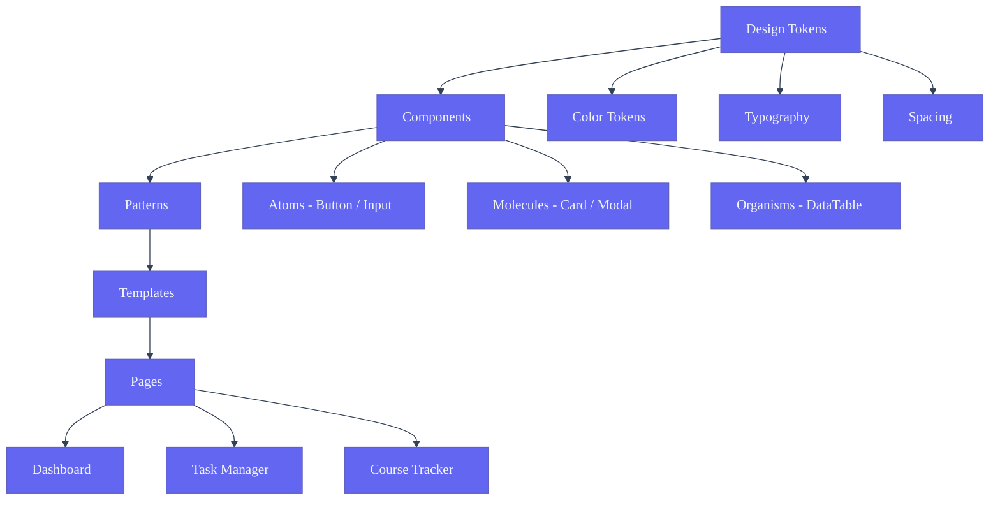

# Design System — Second Brain OS

| Field | Value |
|---|---|
| Document ID | DSG-DS-010 |
| Version | 3.0.0 |
| Status | Active |
| Last Updated | 2026-06-11 |
| Classification | Internal — Design Reference |
| Target Audience | Designers, Frontend Developers, Component Library Contributors |

---

## Design System Architecture

## 1. Executive Summary

The ARIA OS Design System is a comprehensive component library and documentation framework that ensures visual and behavioral consistency across 16 modules. Built on **Next.js 14 + React 18 + Tailwind CSS + Framer Motion + TypeScript**, it provides a single source of truth for every UI element — from primitive atoms like buttons and inputs to complex organisms like data tables and kanban boards.

**Stack:** Next.js 14 | React 18 | Tailwind CSS 3 | Framer Motion | TypeScript 5
**Design Tokens Source:** pps/web/tailwind.config.js | pps/web/app/globals.css
**Component Location:** pps/web/components/

### 1.1 Design System Goals

| Goal | Measurement | Current Status |
|---|---|---|
| Visual consistency across 16 modules | Style drift audit (quarterly) | <2% drift |
| Reduce time-to-ship new screens | Avg time from design to dev | Target: <3 days |
| Single source of truth for all UI | Component test coverage | Target: >90% |
| Accessibility compliance (WCAG 2.1 AA) | axe-core scan | Target: 0 violations |
| Developer onboarding speed | Time to first PR | Target: <1 week |

---

## 2. Component Architecture

### 2.1 Atomic Design Hierarchy

`
PAGES (Templates + Content)
  +-- Dashboard Page (/dashboard)
  +-- Tasks Page (/tasks)
  +-- Courses Page (/courses)
  +-- Goals Page (/goals)
  +-- Habits Page (/habits)
  +-- Sleep Page (/sleep)
  +-- Income Page (/income)
  +-- Projects Page (/projects)
  +-- Ideas Page (/ideas)
  +-- Resources Page (/resources)
  +-- Opportunities Page (/opportunities)
  +-- Time Page (/time)
  +-- Chat Page (/chat)
  +-- Automation Page (/automation)

ORGANISMS (Complex composed components)
  +-- DataTable — Sortable, filterable, paginated data display
  +-- KanbanBoard — Drag-and-drop column layout
  +-- RoadmapCanvas — Full-screen React Flow canvas
  +-- Navbar — Global navigation bar
  +-- Sidebar — Module navigation panel
  +-- Heatmap — GitHub-style activity grid
  +-- MessageList — Chat message thread
  +-- CommandPalette — Global search (Cmd+K)
  +-- FloatingActionButton — Quick capture
  +-- Calendar — Month/week/day views
  +-- ActivityFeed — Chronological event stream

MOLECULES (Composite components)
  +-- CardHeader — Title + actions row
  +-- CardFooter — Action buttons
  +-- FormField — Label + Input + Error
  +-- InputGroup — Leading/trailing icons + Input
  +-- ButtonGroup — Multiple buttons
  +-- TabBar — Horizontal tabs with active indicator
  +-- Pagination — Page navigation controls
  +-- Breadcrumbs — Hierarchical nav trail
  +-- SearchBar — Input + search icon + results
  +-- DropdownMenu — Trigger + items
  +-- ToastNotification — Variant + message + action
  +-- ModalHeader — Title + close button
  +-- ModalFooter — Action buttons
  +-- ProgressWithLabel — Bar + percentage
  +-- StatCard — Icon + value + label + trend

ATOMS (Primitive components)
  +-- Button
  +-- Card
  +-- Input
  +-- Textarea
  +-- Select
  +-- Checkbox
  +-- Radio
  +-- Toggle
  +-- Badge
  +-- Modal
  +-- Tooltip
  +-- Avatar
  +-- Spinner
  +-- Progress
  +-- Skeleton
  +-- Icon (wrapper)
  +-- Divider
  +-- Tag
`

### 2.2 Layer Dependency Rules

`
Pages ------------> Organisms -----------> Molecules ----------> Atoms ----------> Tokens

Rules:
- Atoms NEVER import molecules, organisms, or pages
- Molecules NEVER import organisms or pages
- Organisms NEVER import pages
- Pages compose everything
`

---

## 3. Button System

### 3.1 Button Variants

| Variant | Class | Background | Text | Border | Shadow | Hover | Active | Disabled |
|---|---|---|---|---|---|---|---|---|
| Primary | .btn-primary | accent-primary (#6366F1) | white | none | 0 4px 16px rgba(99,102,241,0.4) | bg #4F46E5 + glow | scale(0.97) | opacity 50% |
| Secondary | .btn-secondary | bg-elevated (#1A1D28) | text-primary | 1px border | none | bg-border (#2A2E3F) | scale(0.97) | opacity 50% |
| Ghost | .btn-ghost | transparent | text-secondary | none | none | bg-elevated + text-primary | scale(0.97) | opacity 50% |
| Danger | .btn-danger | accent-error (#EF4444) | white | none | 0 4px 16px rgba(239,68,68,0.3) | bg #DC2626 | scale(0.97) | opacity 50% |
| Icon | .btn-icon | transparent | text-secondary | none | none | bg-elevated | scale(0.97) | opacity 50% |

### 3.2 Button Sizes

| Size | Class | Height | Padding | Font | Icon Size |
|---|---|---|---|---|---|
| Small | .btn-sm | 36px (h-9) | px-4 py-2 | sm (14px) | 16px |
| Default | .btn | 44px (h-11) | px-5 py-3 | base (16px) | 20px |
| Large | .btn-lg | 52px (h-13) | px-6 py-4 | lg (18px) | 24px |

### 3.3 Button States

| State | Visual Change | Transition |
|---|---|---|
| Default | Normal appearance | — |
| Hover | Background darkens, shadow intensifies | 150ms ease-out |
| Active | scale(0.97) | 50ms |
| Disabled | opacity 50%, cursor-not-allowed | Instant |
| Loading | Spinner replaces icon, button disabled | Instant |

### 3.4 Button Use Cases

| Use Case | Variant | Size |
|---|---|---|
| Primary CTA (1 per view) | Primary | Default |
| Secondary action | Secondary | Default |
| Tertiary / Link | Ghost | Default |
| Destructive action | Danger | Default |
| Icon toolbar | Icon | Default |
| Inline / Compact | Ghost | Small |
| Hero CTA | Primary | Large |

### 3.5 Button Composition

`	sx
interface ButtonProps {
  variant: 'primary' | 'secondary' | 'ghost' | 'danger'
  size: 'sm' | 'default' | 'lg'
  icon?: React.ReactNode
  iconPosition?: 'left' | 'right'
  loading?: boolean
  disabled?: boolean
  fullWidth?: boolean
  type?: 'button' | 'submit' | 'reset'
  onClick?: () => void
  children: React.ReactNode
}
`

---

## 4. Card System

### 4.1 Card Variants

| Variant | Class | Border | Shadow | Hover Effect | Use Case |
|---|---|---|---|---|---|
| Default | .card | border | 0 4px 24px rgba(0,0,0,0.2) | None | Static content |
| Interactive | .card-interactive | border | same | translateY(-3px), glow | Clickable items |
| Highlighted | .card-highlighted | accent-primary | 0 4px 24px rgba(99,102,241,0.15) | None | Featured items |
| Compact | .card-compact | border | none | None | Dashboard stats |
| Glass | .card-glass | glass-medium | 0 8px 32px rgba(0,0,0,0.3) | None | Modals, panels |
| Bento | .card-bento | border | same | translateY(-3px) | Dashboard bento |

### 4.2 Card Anatomy

`
+------------------------------------------------------------------+
|  Card (rounded-xl, bg-card, p-5, border 1px solid border-default)|
|                                                                    |
|  +--- Card Header (optional) ---------------------------------+   |
|  |  Title (DM Sans, 2xl, semibold)                    [actions]|   |
|  |  Subtitle (DM Sans, sm, text-secondary)                    |   |
|  +------------------------------------------------------------+   |
|                                                                    |
|  +--- Card Body ----------------------------------------------+   |
|  |  Content area (flexible height, text, icons, progress, etc.)|   |
|  +------------------------------------------------------------+   |
|                                                                    |
|  +--- Card Footer (optional) ---------------------------------+   |
|  |  [Primary]  [Secondary]                      [meta info]     |   |
|  +------------------------------------------------------------+   |
+------------------------------------------------------------------+
`

### 4.3 Card Sizes

| Size | Padding | Usage |
|---|---|---|
| Default | p-5 (20px) | Most content |
| Compact | p-4 (16px) | Dashboard stats |
| Small | p-3 (12px) | Inline / nested cards |
| Full-bleed | p-6 (24px) | Hero sections |

### 4.4 Card States

| State | Visual Change | Class |
|---|---|---|
| Default | Normal appearance | .card |
| Hover (interactive) | translateY(-3px), enhanced glow | .card-interactive:hover |
| Active (click) | scale(0.99) | :active |
| Selected | accent-primary left border | .card-highlighted |
| Loading | Skeleton placeholder | .card-skeleton |
| Error | Red border + error icon | .card-error |
| Disabled | Opacity 60% | .card-disabled |

### 4.5 Card Composition

`	sx
interface CardProps {
  variant?: 'default' | 'interactive' | 'highlighted' | 'compact' | 'glass' | 'bento'
  padding?: 'sm' | 'default' | 'compact' | 'lg'
  header?: { title: string; subtitle?: string; actions?: React.ReactNode }
  footer?: { actions?: React.ReactNode; meta?: React.ReactNode }
  onClick?: () => void
  loading?: boolean
  error?: boolean
  disabled?: boolean
  className?: string
  children: React.ReactNode
}
`

---

## 5. Input System

### 5.1 Input Types

| Type | Component | Class | Height | Special |
|---|---|---|---|---|
| Text | Input | .input | 44px | Single line |
| Textarea | Textarea | .input-textarea | min-h-[120px] | Resize vertical |
| Select | Select | .input-select | 44px | Custom chevron |
| Checkbox | Checkbox | .checkbox | 20x20px | Custom styled |
| Radio | Radio | .radio | 20x20px | Custom styled |
| Toggle | Toggle | .toggle | 24x44px | Animated knob |
| Search | Input + icon | .input-search | 44px | Full rounded |
| Date | Input type=date | .input | 44px | Native picker |

### 5.2 Input State Matrix

| State | Background | Border | Text | Icon |
|---|---|---|---|---|
| Default | bg-input (#0D0F14) | border (#2A2E3F) 1px | text-primary | text-tertiary |
| Focus | bg-input | accent-primary 1px + ring-1 | text-primary | text-secondary |
| Hover | bg-input | border-accent (#334155) | text-primary | text-secondary |
| Error | bg-input | accent-error 1px | text-primary | accent-error |
| Disabled | bg-card | border-subtle 1px | text-disabled | text-disabled |
| Read-only | bg-card | border-subtle 1px | text-secondary | text-tertiary |
| Filled | bg-input | border 1px | text-primary | text-secondary |

### 5.3 Input Anatomy

`
Text Input:
+--------------------------------------------------------------------+
|  Label (DM Sans, sm, text-secondary)  Optional: (required *)       |
|                                                                     |
|  +-- Leading ----+---------------------+---- Trailing ------------+|
|  | icon (opt)    | Input text          | icon (opt / clear)       ||
|  |               | placeholder         |                          ||
|  +---------------+---------------------+--------------------------+|
|                                                                     |
|  Helper text (DM Sans, xs, text-tertiary)                          |
|  OR  Error message (DM Sans, xs, accent-error) [aria-live]         |
+--------------------------------------------------------------------+
`

### 5.4 Form Field Composition

`	sx
interface FormFieldProps {
  label: string
  required?: boolean
  helperText?: string
  error?: string
  characterCount?: { current: number; max: number }
  layout?: 'vertical' | 'horizontal'
  children: React.ReactNode
}
`

### 5.5 Checkbox / Radio / Toggle States

| Component | Default | Active/Checked | Disabled |
|---|---|---|---|
| Checkbox | Empty 20x20 square | accent-primary fill + white check | Opacity 50% |
| Radio | Empty 20x20 circle | accent-primary border + 8px fill dot | Opacity 50% |
| Toggle | bg-elevated track, knob left | accent-primary track, knob right | Opacity 50% |

---

## 6. Navigation System

### 6.1 Sidebar

| Property | Value |
|---|---|
| Width | w-60 (240px), fixed left, full height |
| Background | bg-card (#12141C) |
| Border-right | 1px solid border-default |
| Z-index | 30 |
| Item height | 44px (h-11) |
| Icon size | 20x20px |
| Font | DM Sans, base (16px), medium |

| State | Background | Text | Icon |
|---|---|---|---|
| Default | transparent | text-secondary | text-secondary |
| Hover | bg-elevated | text-primary | text-secondary |
| Active | accent-primary/10 | accent-primary | accent-primary |
| Disabled | transparent | text-disabled | text-disabled |

**Section Groups:** Core (Dashboard, Tasks) | Academic (Courses, Goals) | Wellness (Habits, Sleep) | Finance (Income) | Work (Projects, Ideas, Resources) | Career (Opportunities) | Productivity (Time, Chat, Automation) | Settings

### 6.2 Navbar

| Property | Value |
|---|---|
| Height | h-16 (64px), fixed top, left-60 (desktop) |
| Background | bg-card, bottom border 1px |
| Z-index | 40 |
| Left | Search bar (max-w-md) |
| Right | Notification bell + Avatar dropdown |

### 6.3 Breadcrumbs

| Property | Value |
|---|---|
| Font | DM Sans, sm (14px) |
| Default color | text-tertiary |
| Active color | text-primary |
| Separator | / or > in text-tertiary |

### 6.4 Tabs

| Property | Value |
|---|---|
| Height | 44px |
| Active indicator | 2px bottom bar, accent-primary |
| Font | DM Sans, base (16px), medium |
| States | Default (secondary), Hover (primary), Active (primary + bar), Disabled (disabled) |

### 6.5 Pagination

| Property | Value |
|---|---|
| Item size | 36x36px, rounded-lg |
| Font | DM Sans, sm (14px) |
| States | Default (secondary), Hover (elevated), Active (accent-primary), Disabled (disabled) |

### 6.6 Bottom Navigation (Mobile)

| Property | Value |
|---|---|
| Height | h-16 (64px), fixed bottom |
| Background | bg-card, top border |
| Z-index | 50 |
| Items | Home, Tasks, + (FAB), Chat, Profile |
| FAB | 56x56px, accent-primary bg, white Plus icon |

---

## 7. Modal / Dialog System

### 7.1 Modal Variants

| Variant | Width | Animation | Use Case |
|---|---|---|---|
| Alert | max-w-sm (384px) | Scale in | Simple confirmation |
| Confirmation | max-w-md (448px) | Scale in | Action with cancel/confirm |
| Form | max-w-lg (512px) | Scale in | Data entry |
| Large | max-w-2xl (672px) | Scale in | Complex forms |
| Full-screen | 100vw x 100vh | Slide up | Mobile detail view |
| Slide-in panel | w-96 (384px) | Slide from right | Settings, filters |

### 7.2 Modal Properties

| Property | Value |
|---|---|
| Backdrop | bg-black/50, backdrop-blur-sm |
| Z-index | z-modal (1030) |
| Border radius | xl (16px) desktop, 0 mobile |
| Max height | 80vh (scrollable body) |
| Background | bg-card (#12141C) |
| Shadow | 0 24px 64px rgba(0,0,0,0.4) |

### 7.3 Modal Behavior

| Action | Response |
|---|---|
| Open | Backdrop fade 200ms + modal scale 200ms |
| Close (X / Escape) | Scale out 150ms + backdrop fade 150ms |
| Focus trap | Tab cycle within modal, first element focused on open |
| Return focus | Focus returned to trigger element on close |

### 7.4 Modal Composition

`	sx
interface ModalProps {
  open: boolean
  onClose: () => void
  variant?: 'alert' | 'confirmation' | 'form' | 'large' | 'slide-in'
  title: string
  subtitle?: string
  size?: 'sm' | 'md' | 'lg' | 'xl' | 'full'
  closeOnBackdropClick?: boolean
  closeOnEscape?: boolean
  preventScroll?: boolean
  footer?: React.ReactNode
  children: React.ReactNode
}
`

---

## 8. Data Display

### 8.1 Table Specifications

| Property | Value |
|---|---|
| Row height | 52px (h-13) |
| Header height | 44px (h-11) |
| Header bg | bg-card, text-secondary |
| Row hover | bg-elevated/50 |
| Row selected | accent-primary/5 |
| Border | 1px border-subtle (#1E222E) |
| Cell padding | px-4 py-3 |

**States:** Default, Hover, Selected, Empty, Loading, Sort active, Filter active

### 8.2 List / Grid / Tree

| Component | Key Property | Value |
|---|---|---|
| List | Item height | 52px, gap-3 |
| Grid (card) | Template | repeat(auto-fill, minmax(320px, 1fr)) |
| Tree | Indent | 20px per level |

### 8.3 Empty States

Every module has an empty state with: Icon (64px, lucide-react), Headline (DM Sans, 2xl), Description (base, max-w-md), CTA Button, optional example prompts.

### 8.4 Loading States (Skeleton)

| Pattern | Implementation |
|---|---|
| Card skeleton | 3 pill shapes, shimmer animation |
| Table skeleton | Header + 5 rows of pills |
| List skeleton | 5 rows (icon 20px + text 80%) |
| Detail skeleton | Image placeholder + 4 text lines |
| Chart skeleton | Rectangle with shimmer gradient |

---

## 9. Chart Components

### 9.1 Chart Types

| Chart | Module | Visual Style |
|---|---|---|
| Bar chart | Time, Income | Neon gradient bars, rounded top |
| Line chart | Habits, Streaks | Smooth curve, gradient fill below |
| Donut chart | Income | Center total, hover segment expansion |
| Progress bar | Courses, Goals | Gradient fill (indigo to green) |
| Radar chart | Learning | Translucent fill, 6 axes |
| Heatmap | Productivity | GitHub-style intensity grid |

### 9.2 Chart Specifications

| Property | Value |
|---|---|
| Background | Transparent |
| Value font | JetBrains Mono, xs (13px) |
| Label font | DM Sans, sm (14px), text-tertiary |
| Tooltip bg | bg-elevated, border-default |
| Grid lines | rgba(255,255,255,0.05) |
| Animation | Fade in 300ms, transitions 500ms |
| Min height | 200px (compact), 400px (full) |

### 9.3 Progress Indicators

| Indicator | Style | Animation |
|---|---|---|
| Linear bar | 6px height, gradient fill | 500ms width transition |
| Circular | 40px circle, stroke-dasharray | 800ms circumference |
| Step dots | Horizontal connected dots | 300ms dot fill |
| Countdown | Text timer + pulsing border | 1s pulse cycle |
| Streak number | Flame icon + digit | Scale pulse |

---

## 10. Notification System

### 10.1 Toast Variants

| Variant | Background | Border-left | Duration |
|---|---|---|---|
| Success | #065F46 / 90% | #10B981 | 4s |
| Error | #7F1D1D / 90% | #EF4444 | 6s |
| Warning | #78350F / 90% | #F59E0B | 5s |
| Info | #1E3A5F / 90% | #3B82F6 | 4s |
| Undo | bg-elevated / 95% | accent-primary | 5s |

### 10.2 Badge Variants

| Variant | Background (15%) | Text | Border (20%) |
|---|---|---|---|
| Primary | rgba(99,102,241,0.15) | #6366F1 | rgba(99,102,241,0.2) |
| Success | rgba(16,185,129,0.15) | #10B981 | rgba(16,185,129,0.2) |
| Warning | rgba(245,158,11,0.15) | #F59E0B | rgba(245,158,11,0.2) |
| Error | rgba(239,68,68,0.15) | #EF4444 | rgba(239,68,68,0.2) |
| Info | rgba(59,130,246,0.15) | #3B82F6 | rgba(59,130,246,0.2) |
| Neon | rgba(0,255,163,0.15) | #00FFA3 | rgba(0,255,163,0.2) |

**Specs:** Font: xs (11px), medium; Padding: px-2.5 py-1; Border-radius: md (10px)

### 10.3 Notification Types

| Type | Position | Duration | Z-index |
|---|---|---|---|
| Toast | Top-right (desktop), Top (mobile) | 4-6s | z-toast (1060) |
| Snackbar | Bottom-center | 4s | z-toast (1060) |
| Banner | Top of page | Manual dismiss | z-banner (1020) |
| Badge | Overlaid on icon | Until read | relative |

---

## 11. Design Token Documentation

### 11.1 Token Categories

| Category | Prefix | Source | Example |
|---|---|---|---|
| Background | bg- | tailwind.config.js | bg-background-card |
| Text | text- | tailwind.config.js | text-text-primary |
| Border | border- | tailwind.config.js | border-border-default |
| Accent | accent- | tailwind.config.js | accent-primary |
| Font | font- | globals.css | font-display |
| Spacing | gap-, p-, m- | tailwind.config.js | gap-5 |
| Shadow | shadow- | tailwind.config.js | shadow-glow |
| Radius | rounded- | tailwind.config.js | rounded-xl |
| Z-index | z- | tailwind.config.js | z-modal |
| Animation | animate- | tailwind.config.js | animate-float |

### 11.2 Token Usage Rules

| Rule | Description | Example |
|---|---|---|
| No hardcoded colors | All colors via Tailwind classes | bg-background-card NOT #12141C |
| Semantic naming | Purpose-based names | text-text-primary NOT text-white |
| Spacing scale only | 4px base increments | gap-5 NOT gap-[17px] |
| Font variables | Fonts via CSS variables | font-display NOT 'Syne' |

### 11.3 How to Add a New Token

`	ypescript
// In apps/web/tailwind.config.js
theme: {
  extend: {
    colors: {
      background: {
        'new-surface': '#14161F',
      },
    },
  },
}
`

---

## 12. Component API Documentation Format

### 12.1 Documentation Template

Every component MUST document:

1. **Description** — Purpose and when to use
2. **Props** — Table with name, type, default, required, description
3. **Variants** — Visual variants with examples
4. **States** — Default, hover, active, disabled, loading, error, empty
5. **Usage Examples** — Code snippets for common patterns
6. **Accessibility** — ARIA attributes, keyboard interactions, focus management
7. **Related Components** — Links to related atoms/molecules/organisms

### 12.2 Example: Button Docs

`
## Button

### Props
| Prop | Type | Default | Required |
|---|---|---|---|
| variant | 'primary'|'secondary'|'ghost'|'danger' | 'primary' | No |
| size | 'sm'|'default'|'lg' | 'default' | No |
| icon | React.ReactNode | undefined | No |
| loading | boolean | false | No |
| disabled | boolean | false | No |

### Accessibility
- Role: button
- ARIA: aria-label if icon only, aria-disabled
- Keyboard: Enter/Space to activate
- Focus: Visible focus ring
`

---

## 13. Component Development Workflow

### 13.1 Process

`
1. IDENTIFY NEED — Check existing components, review design system
2. DESIGN — Figma component with variants/states, use tokens, peer review
3. IMPLEMENT — Create file in apps/web/components/, follow patterns, TypeScript
4. DOCUMENT — Props table, examples, edge cases, accessibility
5. TEST — Unit tests, axe-core, visual regression, keyboard nav
6. REVIEW — Design + accessibility review in PR
7. RELEASE — Bump changelog, announce, update inventory
`

### 13.2 File Structure

`
apps/web/components/
  +-- ui/
  |   +-- Button.tsx, Card.tsx, Input.tsx, Modal.tsx, Badge.tsx
  |   +-- Tooltip.tsx, Avatar.tsx, Spinner.tsx, Progress.tsx, Skeleton.tsx
  |   +-- index.ts  (barrel exports)
  +-- Navbar.tsx, Sidebar.tsx, DataTable.tsx, KanbanBoard.tsx
  +-- CommandPalette.tsx, Heatmap.tsx, MessageList.tsx
`

---

## 14. Testing Components

### 14.1 Test Types

| Test Type | Tool | Target |
|---|---|---|
| Unit tests | Vitest / Jest | >90% coverage |
| Accessibility | axe-core + jest-axe | 0 violations |
| Visual regression | Storybook + Chromatic | 100% components |
| Integration | React Testing Library | Key user flows |

### 14.2 Component Test Template

`	ypescript
import { render, screen, fireEvent } from '@testing-library/react'
import { Button } from './Button'

describe('Button', () => {
  it('renders with default props', () => {
    render(<Button>Click me</Button>)
    expect(screen.getByRole('button')).toHaveTextContent('Click me')
  })

  it('shows loading spinner when loading', () => {
    render(<Button loading>Save</Button>)
    expect(screen.getByRole('button')).toBeDisabled()
  })

  it('calls onClick when clicked', () => {
    const handleClick = jest.fn()
    render(<Button onClick={handleClick}>Click</Button>)
    fireEvent.click(screen.getByRole('button'))
    expect(handleClick).toHaveBeenCalledTimes(1)
  })

  it('has no accessibility violations', async () => {
    const { container } = render(<Button>Accessible</Button>)
    const results = await axe(container)
    expect(results).toHaveNoViolations()
  })
})
`

---

## 15. Versioning and Changelog

### 15.1 Versioning Strategy

| Level | Scope | Example |
|---|---|---|
| Major | Breaking API changes | 2.0.0 -> 3.0.0 |
| Minor | New components or variants | 2.0.0 -> 2.1.0 |
| Patch | Bug fixes, styling tweaks | 2.1.0 -> 2.1.1 |

### 15.2 Changelog Format

`markdown
## [2.1.0] - 2026-06-11

### Added
- Button: new danger variant for destructive actions
- Card: new ento variant for dashboard grid

### Changed
- Modal: max-height increased from 70vh to 80vh
- Input: ring color changed from accent-secondary to accent-primary

### Fixed
- Tooltip: z-index conflict with modal resolved
- Toggle: knob animation easing corrected

### Accessibility
- Button: added aria-disabled for disabled state
- Modal: focus trap now returns focus to trigger element
`

### 15.3 Deprecation Policy

| Phase | Action | Duration |
|---|---|---|
| Announce | Deprecation warning in JSDoc + Storybook | 1 minor cycle |
| Migration | Migration guide, update usages | 1 minor cycle |
| Remove | Delete component, breaking change | Next major |

---

## Reference

| Document | Link |
|---|---|
| UI/UX Specification | docs/design/08_UIUX.md |
| Design Architecture | docs/design/09_Design.md |
| Design Tokens | docs/design/35_DesignTokens.md |
| Branding Guide | docs/design/Branding.md |
| Motion System | docs/design/MotionSystem.md |
| Accessibility | docs/design/Accessibility.md |
| Tailwind Config | apps/web/tailwind.config.js |
| Components | apps/web/components/ |

---

## Revision History

| Version | Date | Author | Changes |
|---|---|---|---|
| 1.0.0 | 2026-05-15 | Design Team | Initial design system |
| 2.0.0 | 2026-06-01 | Design Team | Added component architecture, button/card/input system |
| 3.0.0 | 2026-06-11 | Design Team | Enterprise upgrade: 15 sections, atomic design, 30+ component specs, notification system, token docs, dev workflow, testing, versioning |
