```mermaid
%%{init: {'theme': 'base', 'themeVariables': { 'background': '#0A0B0F', 'primaryColor': '#6366F1', 'secondaryColor': '#00FFA3', 'tertiaryColor': '#818CF8', 'primaryTextColor': '#F1F5F9', 'secondaryTextColor': '#94A3B8', 'lineColor': '#6366F1', 'fontFamily': 'DM Sans', 'nodeBorder': '#6366F1', 'clusterBkg': '#13151A', 'clusterBorder': '#1E293B' }}}%%
graph LR
    subgraph Audit_Dimensions["Audit Dimensions"]
        P["📋 Product<br/>Understanding"]
        U["👤 User Types<br/>& Journeys"]
        A["🏗️ Architecture<br/>Data / AI / Agent"]
        S["📱 Platform<br/>Strategy"]
        D["🎨 Design &<br/>Innovation"]
    end
    subgraph Deliverables["Key Deliverables"]
        D1["40 sections<br/>1978 lines"]
        D2["Product Risks<br/>+ Opportunities"]
        D3["Recommended<br/>Directions"]
    end
    P --> U --> A --> S --> D
    D --> D1 & D2 & D3
    style A fill:#6366F1,stroke:#6366F1,color:#F1F5F9
    style D fill:#818CF8,stroke:#818CF8,color:#F1F5F9
    style D3 fill:#00FFA3,stroke:#00FFA3,color:#0A0B0F
```

# Enterprise Frontend Discovery Report — Second Brain OS (ARIA OS)

---

## Document Control

| Field | Value |
|---|---|
| Document ID | DSG-AEFD-001 |
| Version | 1.0.0 |
| Status | Active |
| Classification | Internal — Design & Engineering Reference |
| Target Audience | Designers, Frontend Engineers, AI Engineers, Product Team |
| Last Updated | 2026-06-11 |
| Review Cycle | Quarterly |

---

## Table of Contents

1. [Executive Summary](#1-executive-summary)
2. [Product Understanding Report](#2-product-understanding-report)
3. [Core Product Vision](#3-core-product-vision)
4. [Core Product Goals](#4-core-product-goals)
5. [Core User Problems](#5-core-user-problems)
6. [Product Positioning](#6-product-positioning)
7. [Product Differentiation](#7-product-differentiation)
8. [Core Product Domains](#8-core-product-domains)
9. [Product Capabilities](#9-product-capabilities)
10. [User Types](#10-user-types)
11. [Core User Journeys](#11-core-user-journeys)
12. [Product Workflow Architecture](#12-product-workflow-architecture)
13. [Data Flow Architecture](#13-data-flow-architecture)
14. [AI Flow Architecture](#14-ai-flow-architecture)
15. [Agent Flow Architecture](#15-agent-flow-architecture)
16. [Dashboard Strategy](#16-dashboard-strategy)
17. [Navigation Strategy](#17-navigation-strategy)
18. [Search Strategy](#18-search-strategy)
19. [Command Center Strategy](#19-command-center-strategy)
20. [Analytics Strategy](#20-analytics-strategy)
21. [Knowledge Strategy](#21-knowledge-strategy)
22. [Learning Strategy](#22-learning-strategy)
23. [Opportunity Strategy](#23-opportunity-strategy)
24. [AI Assistant Strategy](#24-ai-assistant-strategy)
25. [Mobile Strategy](#25-mobile-strategy)
26. [Tablet Strategy](#26-tablet-strategy)
27. [Desktop Strategy](#27-desktop-strategy)
28. [Offline Strategy](#28-offline-strategy)
29. [Realtime Strategy](#29-realtime-strategy)
30. [Accessibility Strategy](#30-accessibility-strategy)
31. [Product Risks](#31-product-risks)
32. [UX Risks](#32-ux-risks)
33. [Technical Risks](#33-technical-risks)
34. [Design Opportunities](#34-design-opportunities)
35. [Innovation Opportunities](#35-innovation-opportunities)
36. [Recommended Product Direction](#36-recommended-product-direction)
37. [Recommended Frontend Direction](#37-recommended-frontend-direction)
38. [Recommended Design Direction](#38-recommended-design-direction)
39. [Recommended AI Direction](#39-recommended-ai-direction)
40. [Research References](#40-research-references)

---



---

## 1. Executive Summary

Second Brain OS (ARIA OS) is a first-of-its-kind AI operating system purpose-built for BTech CSE students — a demographic that manages 8-12 disconnected tools, loses 80% of ideas within 24 hours, misses 60% of relevant opportunities, and abandons 70% of courses started. The product consolidates 15 integrated modules (Tasks, Courses, Goals, Habits, Sleep, Income, Projects, Ideas, Resources, Opportunities, YouTube Vault, Academics, Time Tracking, Chat/AI, Automation) into a single surface with 8 AI agents and 1 orchestrator (ARIA) that proactively pushes intelligence rather than waiting to be asked.

**Architecture**: Next.js 14 frontend → FastAPI backend → Supabase PostgreSQL (21 tables, RLS-enforced) → Dual AI layer (Ollama local primary, Claude API fallback) → 8 scheduled cron agents running on Supabase Edge Functions.

**Design Philosophy**: Cyberpunk dark theme (#0A0B0F base), neon accents (#6366F1 primary, #00FFA3 secondary), Syne/DM Sans/JetBrains Mono typography, Framer Motion animations, glass morphism panels. 15 design principles centered on speed (<100ms interactions), zero data loss, contextual intelligence, and progressive disclosure.

**Key Innovations**:
1. **Active Push Intelligence** — Agents proactively deliver briefings, radar scans, nudges, and reminders without user prompting
2. **15-Module Unified Surface** — Courses, tasks, goals, ideas, opportunities, income, projects, habits, sleep, time, resources, YouTube, academics, chat, automation in one system
3. **Zero-Cost Architecture** — Entire system runs on free-tier infrastructure (Vercel, Supabase, Ollama, Brave Search, Resend)
4. **Graceful Degradation** — Every feature works without AI via algorithmic fallback; every agent has inline fallback prompts
5. **Local AI First** — Ollama (Mistral 7B) runs on student laptops; cloud Claude API only as fallback

**Current Status**: 5 agents implemented (Reminder, Missed Task Checker, Habit Miss Checker, Sleep & Bedtime, Weekly Review), 7 agents design-complete, 3 agents in shell/stub. Frontend has 15 page routes with Zustand + React Query state management. Design system is defined at atomic level (17 atoms, 14 molecules, 11 organisms) with full token specification.

**Risk Profile**: Single-developer project creates bus-factor risk. Zero-cost infrastructure dependency on free-tier availability of Supabase, Vercel, and Brave Search. AI latency on student hardware (8GB RAM) for local LLM inference. 15-module scope creates significant UX complexity in navigation, information architecture, and onboarding.

---

## 2. Product Understanding Report

### 2.1 What Is Second Brain OS?

Second Brain OS is not a productivity tool. It is an AI operating system for a specific human being — a BTech CSE student — that manages their entire digital existence across learning, building, earning, and well-being. The "OS" metaphor is intentional: just as an operating system manages hardware resources, ARIA OS manages the student's cognitive, temporal, and opportunity resources.

### 2.2 What Makes It Unique

The product occupies a space no existing tool fills. Notion is a general-purpose workspace. Todoist is a task manager. Coursera is a learning platform. LinkedIn is a career network. ARIA OS is all of these fused into one system where data flows between modules automatically: a completed course updates your skill profile, which improves opportunity matching, which can be tracked as a goal, which generates tasks, which appear in your daily briefing, which adjusts based on your sleep score.

### 2.3 Current State of the Product

- **What exists**: 15 frontend page routes defined, ~53 API endpoints registered, 21 database tables designed, 12 prompt files written (8 agent prompts, 2 system prompts, 2 templates), PromptLoader system operational, design system fully specified, CI/CD pipeline with 4 jobs
- **What is partially built**: 5 agents are implemented and running, 7 are design-complete (code pending), 3 are shell/stub
- **What is planned but not started**: Browser extension, voice layer, admin panel, mobile app (React Native/PWA), analytics platform, monetization layer
- **Key architectural decisions made**: In-process agents (not microservices — ADR-004), Supabase as single source of truth, PromptLoader-driven prompt management, algorithmic fallback for every AI feature, offline-first PWA architecture

### 2.4 Product Complexity Assessment

| Dimension | Complexity Level | Rationale |
|---|---|---|
| Module Count | Very High | 15 modules with inter-module data flows |
| AI Architecture | High | 8 agents + orchestrator + dual AI backend + prompt versioning |
| Data Modelling | High | 21 tables with RLS, realtime subscriptions, offline sync |
| UI/UX Surface | Very High | 15+ screens with dashboard, kanban, chat, calendar, heatmap, roadmap canvas |
| Offline Requirements | High | 3-layer offline (service worker, IndexedDB, background sync) |
| Real-time Requirements | Medium | Realtime subscriptions for multi-device sync |
| Accessibility | Medium | WCAG 2.1 AA target, cyberpunk theme creates contrast challenges |
| Development Team | Critical | Single developer = bus factor of 1 |

---

## 3. Core Product Vision

**One-sentence vision**: Second Brain OS is the world's first purpose-built AI operating system for BTech CSE students — a unified platform that transforms fragmented student lives into compounded, measurable growth by connecting learning, building, earning, and well-being into a single intelligent system.

**The BHAG (Big Hairy Audacious Goal)**: By 2031, Second Brain OS will help 25,000+ students complete 500,000+ courses, ship 100,000+ projects, and collectively earn Rs. 10 crore+ through opportunities found via the system — while operating at zero cost to every user.

**Core philosophy**: Everything funnels toward building real things. Courses exist to build projects. Ideas exist to ship products. Skills exist to earn income. The system measures shipped output, not input.

**Five core pillars**:
1. **Active Intelligence** — Pushes information proactively, never waits to be asked
2. **Compound Growth** — Every action feeds every other action (course → skill → project → income)
3. **Privacy First** — Data never leaves user control, RLS on every table, local AI via Ollama
4. **Zero Barriers** — Rs. 0 cost, offline-capable, runs on 8GB RAM
5. **Build First** — Everything funnels toward shipping real things

**The strategic window**: 24-36 months before incumbents (Notion, Todoist, Motion) build student-specific AI features. Moat created by depth of student-specific modules, zero-cost architecture, and privacy-first local AI.

---

## 4. Core Product Goals

### 4.1 Product Goals (Current Phase)

| Goal | Target | Timeline |
|---|---|---|
| Complete 15-module MVP | All modules functional with CRUD + AI features | Q3 2026 |
| Get 100 DAU | Early adopter program at target colleges | Q3 2026 |
| Achieve >60% 30-day retention | Onboarding optimization + habit formation loops | Q4 2026 |
| 15+ tasks completed per user/week | Task engine + AI nudges driving completion | Q4 2026 |
| >60% course completion rate | Linked to goals + daily study targets | Q1 2027 |
| 8+ opportunities found per user/month | Opportunity radar + skill matching | Q1 2027 |

### 4.2 Experience Goals

| Goal | Metric |
|---|---|
| Task completion triggers instant local update before API confirms | <100ms perceived response |
| Morning briefing delivers critical data in under 5 seconds | Glanceability score >90% |
| Quick Capture available from every screen | 1-tap access from any state |
| Zero data loss on navigation or refresh | Auto-save + localStorage persist |
| Forgiving input on all forms | Natural language date parsing, typo-tolerant search |

### 4.3 Business Goals

| Goal | Metric | Timeline |
|---|---|---|
| Organic user acquisition | Rs. 0 CAC | Ongoing |
| Feature adoption | >60% use 5+ modules | 6 months post-launch |
| Notification opt-in | >70% push permission rate | 3 months post-launch |
| Monetization (future) | 5% free-to-paid conversion | 12 months post-launch |

---

## 5. Core User Problems

### 5.1 Fragmentation Problem

BTech CSE students juggle 8-12 tools daily: Todoist (tasks), Notion (notes), Google Calendar (time), Coursera/Udemy (courses), GitHub (projects), LinkedIn (career), Excel (CGPA), bank statements (income), a habit tracker, a sleep tracker, and a notes app for ideas. Each tool has its own login, UI paradigm, notification system, and data model. The cost of context switching between these tools is estimated at 40% of productive time.

### 5.2 Discovery Problem

Students miss 60% of relevant opportunities (internships, hackathons, open source projects, fellowships) because discovery requires monitoring 5+ platforms daily. No existing system proactively matches opportunities to a student's specific skills, interests, and timeline.

### 5.3 Memory Problem

80% of ideas are lost within 24 hours. YouTube tutorials saved to "Watch Later" are never watched. Articles bookmarked are never read. The system has no mechanism to resurface relevant content at the right moment — when the student is actually working on a related topic.

### 5.4 Prioritization Problem

Students have no systematic way to prioritize across work/school/life. A single student might have: 4 college courses with assignments, 2 online courses with deadlines, 1 side project, an internship search, habit goals, sleep optimization, and freelance income tracking. No tool correlates sleep quality with productivity or course progress with deadline feasibility.

### 5.5 Accountability Problem

Existing tools are reactive — they remind but don't plan, prioritize, or suggest. No tool notices that a high-priority task has been rescheduled 3 times. No tool adjusts the day's workload based on poor sleep. No tool nudges when a course deadline is 2 weeks away and you're 40% behind. Students need proactive accountability, not passive task lists.

### 5.6 Pattern Blindness Problem

No existing tool correlates data across domains. A student cannot answer: "Does my sleep affect my productivity?" "Which skills actually generate income?" "What time of day am I most productive?" "Am I making progress toward my annual goals?" The data exists but is siloed across 8-12 disconnected tools.

---

## 6. Product Positioning

### 6.1 Positioning Statement

**For BTech CSE students** who manage 8-12 disconnected tools and struggle to track courses, tasks, opportunities, and goals, **ARIA OS** is an **AI operating system** that **unifies 15 life domains into one intelligent surface** with **proactive AI agents that push briefings, radar scans, and nudges** rather than waiting to be asked. Unlike **Notion, Todoist, or Motion** which cover 1-3 domains each, ARIA OS is **purpose-built for student life** with course tracking, opportunity radar, income tracking, and sleep optimization built into a single zero-cost system.

### 6.2 Competitive Landscape

| Competitor | Our Advantage | Their Advantage |
|---|---|---|
| **Notion** | AI agents, course tracking, opportunity radar, income tracking, offline PWA, cyberpunk UI | Mature ecosystem, 50M+ users, template library, team collaboration |
| **Todoist** | AI-prioritized tasks, auto-reschedule, zero-miss policy, sleep-adjusted scheduling | 15+ years of refinement, natural language input, Karma gamification |
| **Motion** | 15 integrated modules, free (Motion is $19/mo), privacy-first local AI, student-specific | Mature AI scheduling, calendar integration, team features |
| **ClickUp** | Specialized for student life, local AI, zero cost, cyberpunk design | Team features, Gantt charts, automation, integrations, enterprise ready |
| **Sunsama** | AI agents, course tracking, opportunity radar, income tracking, zero cost | Beautiful UX, calendar-first approach, team features |
| **Obsidian** | AI built-in, proactive agents, opportunity radar, course tracking | Plugin ecosystem, graph view, local-first, mature knowledge management |
| **Mem/Reflect** | AI agents, 15 modules, proactive push, opportunity scanning | AI-native note-taking, graph knowledge base |

### 6.3 Market Timing

The product launches at the convergence of five tailwinds:
1. **AI Native Era** — 72% of Indian college students have tried ChatGPT; users understand AI capabilities
2. **Builder Generation** — 62% of Indian Gen Z want to start a business (Deloitte 2024)
3. **Free Infrastructure Maturity** — Supabase (2M+ users), Vercel, Railway free tiers are battle-tested
4. **Privacy Renaissance** — Local LLMs (Ollama, Llama) make data sovereignty mainstream
5. **India Tech Boom** — 1.5M engineers graduate/year, internship market at all-time high

**TAM**: 7.2M BTech CSE students in India
**SAM**: 600K students who actively use productivity tools
**SOM**: 100 users (Y1) → 30K users (Y5)

---

## 7. Product Differentiation

### 7.1 Structural Differentiators (Hard to Copy)

| Differentiator | Description | Copy Difficulty |
|---|---|---|
| **15-Module Unified Surface** | Courses, tasks, goals, ideas, opportunities, income, projects, habits, sleep, time, resources, YouTube, academics, chat, automation | Very High — requires building 15 integrated products |
| **Student-Specific Modules** | CGPA calculator, semester planner, exam countdown, course deadline tracker, hackathon radar | High — general tools need 5+ new products |
| **Zero-Cost Architecture** | Entire system runs on free tiers: Vercel, Supabase, Ollama, Brave Search, Resend | High — VC-backed competitors must monetize |
| **Privacy-First Local AI** | Ollama runs on student laptops; no data leaves the machine | Very High — centralized AI providers can't offer this without restructuring |
| **Inter-Module Data Flow** | Course completion → skill update → opportunity matching → goal progress → task generation | Very High — requires deep architectural integration, not API connections |

### 7.2 Experience Differentiators (Visible to Users)

| Differentiator | Description | User Impact |
|---|---|---|
| **Active Push Intelligence** | 6 cron agents + ARIA proactively push briefings, scans, nudges | No user action needed to get value; system works for you |
| **Sleep-Adjusted Scheduling** | Low sleep score → lighter tasks surfaced | Prevents burnout, demonstrates system intelligence |
| **Zero-Miss Policy** | Every overdue task must be done, rescheduled, or explicitly dropped | Eliminates guilt-driven task avoidance |
| **Opportunity Radar** | Daily scan of 6 categories matched to user skills | Passive career development |
| **Cyberpunk Design** | #0A0B0F dark theme, neon accents, glass morphism, Framer Motion | Distinctive brand identity, late-night study comfort |
| **Browser Extension** | One-tap save YouTube, articles, ideas from any page | Frictionless capture |

### 7.3 Architectural Differentiators (Engineering)

| Differentiator | Description |
|---|---|
| **PromptLoader System** | All AI prompts externalized in `prompts/` with YAML frontmatter, versioned, validated in CI |
| **Graceful Degradation** | Every AI feature has algorithmic fallback; every agent has inline fallback prompt |
| **In-Process Agents** | Agents run as Python async functions within FastAPI, not microservices (ADR-004) |
| **3-Layer Offline** | Service worker (shell) + IndexedDB (data) + Background Sync (actions) |
| **Dual AI Backend** | Ollama (local, free) primary, Claude API (cloud, paid) fallback |

---

## 8. Core Product Domains

The product operates across 7 interconnected domains:

### 8.1 Productivity Domain
- **Modules**: Tasks, Goals, Projects, Habits, Time Tracking
- **Core Purpose**: Plan, execute, and track progress across all work
- **Key Features**: Task CRUD with auto-prioritization, Pomodoro timer, habit streaks, project phases, goal roadmaps with React Flow canvas
- **AI Integration**: AI task breakdown, auto-reschedule, priority scoring, sleep-adjusted scheduling

### 8.2 Learning Domain
- **Modules**: Courses (college + online), YouTube Vault, Academic Planner
- **Core Purpose**: Track, complete, and compound learning across all sources
- **Key Features**: Course progress tracking, daily study targets, spaced repetition, YouTube save/watch/archive pipeline, CGPA calculator, exam countdown
- **AI Integration**: Auto-generated study tasks, AI video summaries, spaced resurfacing, course progress nudges

### 8.3 Knowledge Domain
- **Modules**: Resources, Ideas, YouTube Vault
- **Core Purpose**: Capture, organize, and resurface knowledge
- **Key Features**: Resource library with AI auto-tagging, idea vault with status pipeline, YouTube knowledge vault with expiry system
- **AI Integration**: AI resource summarization, AI market check for ideas, natural language search, topic-based resurfacing

### 8.4 Career & Opportunity Domain
- **Modules**: Opportunities, Income, Projects
- **Core Purpose**: Find, track, and capitalize on career opportunities
- **Key Features**: 6-category opportunity scanner, skill match scoring, income tracking with hourly rate, project → income mapping
- **AI Integration**: Daily opportunity radar, match score calculation, one-sentence relevance reasoning, AI-generated LinkedIn post drafts

### 8.5 Well-Being Domain
- **Modules**: Sleep, Habits
- **Core Purpose**: Track and optimize physical and mental well-being
- **Key Features**: Sleep logging, sleep score calculation, bedtime consistency tracking, habit streaks
- **AI Integration**: Wind-down reminders, sleep score adjustments to task scheduling, habit miss detection

### 8.6 Intelligence Domain
- **Modules**: AI Chat (ARIA), Automation, Daily Briefing, Weekly Review
- **Core Purpose**: Proactive intelligence, automation, and insight generation
- **Key Features**: Context-aware AI chat, 8 cron agents, morning briefings, weekly reviews, action execution via natural language
- **AI Integration**: Core AI orchestration, prompt management, memory system, intent classification, agent dispatch

### 8.7 Analytics Domain
- **Modules**: Dashboard, all modules contribute data
- **Core Purpose**: Measure, visualize, and drive behavior change
- **Key Features**: Productivity score (0-100), GitHub-style heatmap, hourly rate analysis, skill-to-income mapping, module-level KPIs
- **AI Integration**: Pattern detection across modules (learning_agent), weekly analytics summaries, trend identification

---

## 9. Product Capabilities

### 9.1 Core Capabilities (All Modules)

| Capability | Description | Status |
|---|---|---|
| CRUD Operations | Create, read, update, delete for all 15 modules | Implemented |
| Supabase RLS | Row-level security on every table | Implemented |
| Real-time Sync | Multi-device instant updates via Supabase Realtime | Implemented |
| Offline Support | 3-layer offline (SW + IDB + Background Sync) | Design Complete |
| Push Notifications | Web Push API for reminders and alerts | Implemented |
| Data Export | JSON/CSV export of all modules | Design Complete |
| PWA Installability | Installable web app with service worker | Design Complete |
| Voice Input | Web Speech API for hands-free interaction | Planned |
| Browser Extension | One-tap save from any web page | Planned |

### 9.2 AI Capabilities

| Capability | Agent | Status |
|---|---|---|
| Context-aware chat | ARIA (A00) | Design Complete |
| Task auto-prioritization | Planner (A01) | Design Complete |
| Memory consolidation | Memory (A02) | Shell/Stub |
| Pattern detection | Learning (A03) | Design Complete |
| Proactive reminders | Reminder (A04) | Implemented |
| Career planning | Career (A05) | Design Complete |
| Opportunity scanning | Opportunity (A06) | Shell/Stub |
| Analytics & insights | Analytics (A07) | Design Complete |
| Roadmap generation | Roadmap (A08) | Design Complete |
| Daily briefing generation | Daily Briefing (A09) | Shell/Stub |
| Weekly review generation | Weekly Review (A10) | Implemented |
| Missed task auto-reschedule | Missed Task Checker (A11) | Implemented |
| Habit miss detection | Habit Miss Checker (A12) | Implemented |
| Sleep analysis & wind-down | Sleep & Bedtime (A13) | Implemented |
| Course progress nudges | Course Progress Nudge (A14) | Design Complete |

### 9.3 Integration Capabilities

| Integration | Purpose | Status |
|---|---|---|
| Google OAuth | Authentication | Implemented |
| Google Calendar API | Calendar sync | Planned |
| Brave Search API | Opportunity scanning | Implemented |
| Claude API | Cloud AI fallback | Implemented |
| Ollama | Local AI primary | Implemented |
| Resend API | Email notifications | Implemented |
| Twilio SMS API | SMS escalation | Planned |
| YouTube oEmbed | Video metadata | Implemented |
| GitHub API | Project-repo linking | Planned |

---

## 10. User Types

### 10.1 Primary User — Aarav (BTech CSE Sophomore)

| Attribute | Detail |
|---|---|
| **Age** | 19 |
| **Year** | 2nd Year |
| **College** | Tier-2 engineering college, India |
| **Goals** | High CGPA, learn web development, build 1 side project |
| **Pain Points** | Overwhelmed by 4 college courses + online learning; forgets deadlines; no time management system |
| **Device** | Windows laptop + budget Android phone |
| **Usage Pattern** | Morning (check briefing), classes (mobile quick capture), evening (desktop deep work), night (log sleep) |
| **Tech Comfort** | Moderate — can use browser, knows basic keyboard shortcuts |

### 10.2 Secondary User — Priya (BTech CSE Junior + Intern)

| Attribute | Detail |
|---|---|
| **Age** | 21 |
| **Year** | 3rd Year |
| **Status** | Student + part-time intern at startup |
| **Goals** | Balance academics + internship + side projects; track freelance income; find better opportunities |
| **Pain Points** | Can't prioritize across work/school/life; misses application deadlines; no income visibility |
| **Device** | MacBook + iPhone |
| **Usage Pattern** | Desktop all day (internship + study), mobile (on-the-go capture, notifications), evening (projects) |
| **Tech Comfort** | High — uses CLI, Git, knows productivity tools |

### 10.3 Tertiary User — Rohan (BTech CSE Senior + Job Seeker)

| Attribute | Detail |
|---|---|
| **Age** | 22 |
| **Year** | 4th Year |
| **Status** | Job seeking, freelance developer |
| **Goals** | Land placement in top tech company, build portfolio, earn Rs. 50K/month freelancing |
| **Pain Points** | Scattered placement prep; no structured interview tracking; chaotic opportunity discovery |
| **Device** | Windows laptop + Android phone |
| **Usage Pattern** | Morning (opportunity radar), day (DSA prep, applications), evening (freelance projects), night (review) |
| **Tech Comfort** | Expert — power user of productivity tools, CLI proficient |

### 10.4 Extended User — Ananya (Self-learning Developer)

| Attribute | Detail |
|---|---|
| **Age** | 24 |
| **Status** | Working frontend developer, upskilling for full-stack |
| **Goals** | Transition to full-stack, earn $2K/month freelancing, build portfolio |
| **Pain Points** | Can't track multiple courses; unclear skill gap visibility; no income-from-skills mapping |
| **Device** | MacBook + iPhone |
| **Usage Pattern** | Evening/night (courses + projects), weekend (deep work, weekly review) |

### 10.5 Extended User — Arjun (Fresh Graduate)

| Attribute | Detail |
|---|---|
| **Age** | 22 |
| **Status** | Junior developer, preparing for certifications |
| **Goals** | Get AWS certified, switch to better role in 1 year, track professional growth |
| **Pain Points** | Unclear career path; no skill gap visibility; doesn't know which certification to pursue |
| **Device** | Windows laptop |

---

## 11. Core User Journeys

### 11.1 Daily Journey — Aarav (Sophomore)

| Time | Activity | Module | AI Touchpoint |
|---|---|---|---|
| 7:00 AM | Wake, check phone | Dashboard / Daily Briefing | ARIA push briefing with top-3 tasks, sleep score, today's schedule |
| 8:00-12:00 | College lectures | Courses (mobile) | Quick check of today's deadlines, attendance |
| 12:00-1:00 PM | Lunch break | Quick Capture (any module) | Save idea for side project, save YouTube tutorial |
| 3:00-5:00 PM | Study session | Tasks + Time | Pomodoro timer, AI-prioritized task list |
| 6:00 PM | Coursework | Courses | Course Progress Nudge: "You're behind on Node.js" |
| 9:30 PM | Wind-down | Sleep | Bedtime reminder with tomorrow's first task |
| 10:00 PM | Review tomorrow | Dashboard | Evening glance at next day's schedule |
| 11:00 PM | Log sleep | Sleep / Chat | "Good night ARIA" → logs sleep time |

### 11.2 Weekly Journey — Priya (Junior + Intern)

| Day | Focus | Modules Used |
|---|---|---|
| Mon-Fri | Internship (9-5) | Time Tracking, Tasks, Projects |
| Mon/Wed evening | College assignments | Courses, Tasks, Goals |
| Tue/Thu evening | Side project | Projects, Ideas, Resources |
| Fri evening | Weekly review | Weekly Review, Goals |
| Sat | Career prep | Opportunities, Learning |
| Sun | Planning + Rest | Habits, Sleep, Goals, Roadmap |

### 11.3 Placement Prep Journey — Rohan (Senior)

| Phase | Duration | Activities | Key Modules |
|---|---|---|---|
| Awareness | Week 1 | Discover opportunities, understand requirements | Opportunity Radar (daily) |
| Preparation | Week 2-10 | Study DSA, company-specific prep, projects | Learning, Time, Projects |
| Application | Week 8-16 | Apply to companies, track status | Opportunities (status pipeline) |
| Interview | Week 12-20 | Schedule interviews, practice | Calendar sync, Tasks |
| Selection | Week 18-24 | Compare offers, make decision | Goals (decision matrix) |

### 11.4 Task-to-Completion Journey

1. **Capture**: User types "ARIA, add 'Complete DBMS assignment' as a task" in Chat, OR uses Quick Capture button, OR browser extension saves from any page
2. **Enrich**: ARIA auto-assigns priority (medium), category (academics), estimated time (2h), due date (from assignment deadline)
3. **Schedule**: Task appears in today's list with time block; Planner agent checks sleep score — if low, schedules for afternoon instead of morning
4. **Remind**: 15-min missed task checker detects if task passes due; push notification sent; if missed twice, email escalation; if missed thrice + high priority, SMS
5. **Complete**: User marks task done → instant local state update → API confirmation → streak updated → goal progress recalculated → weekly review includes completion
6. **Review**: Weekly Review agent notes: "You completed 14/20 tasks this week. DBMS assignment was rescheduled 3 times — consider breaking it into smaller tasks."

### 11.5 Course Completion Journey

1. **Enroll**: User adds course (Udemy/Coursera/NPTEL/YouTube/College) with target completion date and "why-enrolled"
2. **Plan**: ARIA calculates daily minutes needed (course_length / days_until_deadline), generates study tasks for the week
3. **Track**: Course progress bar updates with each module completion; daily study target shown on dashboard
4. **Nudge**: Course Progress Nudge (6 PM daily) checks if behind schedule → "You need 45 min/day to finish by the deadline"
5. **Complete**: Course marked done → skills updated → Learning Agent detects new skill → Career Agent may find opportunities requiring that skill
6. **Retain**: Spaced repetition reviews at 1, 3, 7, 14, 30 days resurface key concepts

---

## 12. Product Workflow Architecture

### 12.1 Cross-Module Data Flow Map

```
YouTube Save ──► YouTube Vault
     │
     ├──► AI Summary ──► Resource Library
     │
     └──► Topic Extraction ──► Goals (link video to goal)
                                   │
                                   ├──► Generate Study Tasks ──► Tasks
                                   │                              │
                                   │                              ├──► Time Tracking (Pomodoro)
                                   │                              │
                                   │                              └──► Daily Briefing (top tasks)
                                   │
                                   ├──► Course Progress ──► Dashboard (productivity score)
                                   │
                                   ├──► Skill Update ──► Learning Agent
                                   │                        │
                                   │                        └──► Career Agent
                                   │                              │
                                   │                              └──► Opportunity Radar (match scoring)
                                   │
                                   └──► Income (if monetized skill) ──► Income Tracker
                                                                          │
                                                                          └──► Weekly Review (ROI report)
```

### 12.2 Core Transactional Flows

**Task Creation Flow:**
```
User Input ──► Frontend Form ──► POST /api/tasks ──► FastAPI validation
    │                                                       │
    │                                                       ├──► AI Priority Assignment (async)
    │                                                       ├──► Category Detection (async)
    │                                                       └──► Supabase INSERT
    │                                                           │
    │                                                           ├──► Realtime push to all clients
    │                                                           ├──► Due date check (≤2h → notification)
    │                                                           └──► UI optimistic update (instant)
```

**Chat with ARIA Flow:**
```
User Message ──► POST /api/chat ──► Context Builder
    │                                       │
    │                                       ├──► Profile snapshot (users_profile)
    │                                       ├──► Active tasks + goals
    │                                       ├──► Course status
    │                                       ├──► Sleep score (today)
    │                                       ├──► Conversation history (last 50)
    │                                       └──► Memory facts (aria_memory)
    │                                           │
    │                                           ▼
    │                                   Prompt Assembly
    │                                       │
    │                                       ├──► System prompt (aria_system.md)
    │                                       ├──► Guardrails (guardrails.md)
    │                                       └──► Context packet (JSON)
    │                                           │
    │                                           ▼
    │                                   LLM Call (Ollama → Claude fallback)
    │                                       │
    │                                       ├──► Response generation
    │                                       └──► Action JSON (if any)
    │                                           │
    │                                           ▼
    │                                   Action Executor
    │                                       │
    │                                       ├──► add_task → Supabase INSERT
    │                                       ├──► update_course → Supabase UPDATE
    │                                       ├──► save_idea → Supabase INSERT
    │                                       └──► etc.
    │                                           │
    │                                           ▼
    │                                   Memory Writer
    │                                       │
    │                                       ├──► Extract preferences
    │                                       ├──► Extract facts
    │                                       └──► Upsert to aria_memory
    │                                           │
    │                                           ▼
    │                                   Response ──► Chat UI + Action Confirmation
```

### 12.3 Agent Trigger Patterns

| Pattern | Agents | Description |
|---|---|---|
| Cron (fixed schedule) | Daily Briefing (7AM), Opportunity (6AM), Sleep (9:30PM), Nudge (6PM), Habit (midnight) | Run at specific times regardless of user state |
| Cron (high frequency) | Missed Task (15min), Weekly Review (Sunday 8PM) | Run on shorter intervals or specific days |
| User-triggered | Planner, Career, Roadmap | Called when user asks ARIA for planning/career/roadmap help |
| Event-triggered | Memory (every chat), Learning (daily summary) | Triggered by data events (new chat message, daily data accumulation) |
| Dependency-triggered | Analytics (all agents), Career (Learning), Roadmap (Planner) | Run after upstream agents complete |

---

## 13. Data Flow Architecture

### 13.1 Frontend → Backend → Database

```
┌──────────────────────────┐
│    Browser (Next.js)     │
│                          │
│  Zustand (UI State)      │
│  React Query (Server)    │  ◄── Optimistic updates on mutations
│  IndexedDB (Offline)     │
│  localStorage (Drafts)   │
│  Service Worker (Cache)  │
└──────────┬───────────────┘
           │ HTTPS / WSS
           â–¼
┌──────────────────────────┐
│    FastAPI Backend        │
│                          │
│  Auth Middleware (JWT)   │
│  Rate Limiter            │
│  CORS                    │
│  Routers (x13)           │
│  Services (Business)     │
│  Context Builder (AI)    │
│  Action Executor (AI)    │
└──────────┬───────────────┘
           │
           â–¼
┌──────────────────────────┐
│    Supabase PostgreSQL   │
│                          │
│  21 Tables with RLS      │
│  Realtime Subscriptions  │
│  Edge Functions (Cron)   │
│  pg_cron                 │
└──────────────────────────┘
```

### 13.2 Data Categories

| Category | Storage | Sync Pattern | Offline Priority |
|---|---|---|---|
| **User Profile** | Supabase + localStorage | On change | High |
| **Tasks** | Supabase + IndexedDB | Real-time + Background sync | Critical |
| **Courses** | Supabase + IndexedDB | Real-time | High |
| **Goals/Roadmaps** | Supabase + IndexedDB | Real-time | Medium |
| **Habits** | Supabase | On change | Medium |
| **Sleep Logs** | Supabase | On change | Low |
| **Income** | Supabase | On change | Low |
| **Opportunities** | Supabase | Fetched daily | Low |
| **Ideas** | Supabase | On change | Medium |
| **Resources** | Supabase | On change | Medium |
| **Projects** | Supabase | On change | Medium |
| **Time Entries** | Supabase | On change + batch | Medium |
| **Chat Messages** | Supabase | On send | Low |
| **Daily Briefings** | Supabase + IndexedDB | Fetched daily | High (current week) |

### 13.3 Offline Data Strategy

| Layer | Technology | What | Capacity |
|---|---|---|---|
| 1 — App Shell | Workbox SW | Static assets, page routes | ~2MB |
| 2 — Data Store | IndexedDB (idb library) | Recent 100 tasks, active courses, active goals, current week briefings, active habits | ~5-10MB |
| 3 — Action Queue | IndexedDB | Pending creates, updates, completions | ~1MB (queue) |
| Sync Trigger | Background Sync API | On reconnect, replay in order | N/A |

**Conflict Resolution**: Last-write-wins with server timestamp.

---

## 14. AI Flow Architecture

### 14.1 Dual AI Backend Architecture

```
User Request
     │
     â–¼
┌─────────────┐
│  AI Router  │
│             │
│ 1. Check USE_LOCAL_AI flag
│ 2. If True → Ollama (localhost:11434)
│ 3. If False → Claude API
│ 4. If Ollama fails → retry 1x → Claude fallback
│ 5. If Claude fails → algorithmic fallback
└─────────────┘
     │
     ├──► Ollama: llama3.1 (8B) or mistral:7b
     │        │
     │        ├── Latency: 2-10s (student laptop, 8GB RAM)
     │        ├── Cost: Rs. 0
     │        └── Capability: chat, summaries, basic analysis
     │
     └──► Claude: sonnet-4-20250514
              │
              ├── Latency: 1-3s
              ├── Cost: ~$0.015/request (free credits)
              └── Capability: complex reasoning, briefing, review, opportunity parsing
```

### 14.2 Token Budget Allocation

| Use Case | Input Tokens | Output Tokens | Model |
|---|---|---|---|
| Simple chat (status check) | ~200 | ~100 | Ollama |
| Task creation | ~300 | ~50 | Ollama |
| Course progress query | ~400 | ~150 | Ollama |
| Idea market check | ~500 | ~300 | Ollama |
| Resource summarization | ~800 | ~200 | Ollama |
| Opportunity parsing | ~600 | ~1000 | Claude |
| Daily briefing | ~800 | ~600 | Claude |
| Weekly review | ~1500 | ~800 | Claude |
| Memory extraction | ~400 | ~200 | Ollama |
| Pattern detection | ~500 | ~300 | Ollama |

### 14.3 AI Fallback Chain

```
1. Ollama (primary) → if timeout > 60s or error
2. Ollama retry 1x → if still fails
3. Claude API (fallback) → if Claude also fails
4. Algorithmic default (e.g., "Could not generate briefing. Here are your raw tasks...")
```

---

## 15. Agent Flow Architecture

### 15.1 Agent Dependency Graph

```
ARIA (A00) ─┬─ Service Agents ──────────────────── Cron Agents
             │    ├── Planner (A01)             ─── Reminder (A04) [no deps]
             │    ├── Memory (A02)              ─── Opportunity (A06) [reads resources]
             │    ├── Learning (A03)            ─── Daily Briefing (A09) [reads all agents]
             │    ├── Career (A05)              ─── Weekly Review (A10) [reads all history]
             │    ├── Analytics (A07)           ─── Missed Task (A11) [reads tasks]
             │    └── Roadmap (A08)             ─── Habit Miss (A12) [reads habits]
             │                                  ─── Sleep & Bedtime (A13) [reads sleep_logs]
             │                                  ─── Course Nudge (A14) [reads courses]
             │
             └──→ Data flows through Supabase tables (agents never call each other directly)
```

### 15.2 Agent Communication Pattern

Agents communicate exclusively through Supabase tables. No agent directly calls another agent:

```
Agent A writes to Table X
    │
    â–¼
Table X (Supabase)
    │
    â–¼
Agent B reads Table X as part of its data assembly
```

This ensures:
- **Decoupling**: Agents can be developed and deployed independently
- **Observability**: All agent data flows through the database (auditable)
- **Resilience**: Agent A can fail without blocking Agent B (B uses stale data from last successful A run)
- **Testing**: Agents can be tested independently by seeding test data into tables

### 15.3 Agent Scheduling Matrix

| Agent | Schedule | LLM Needed | Max Duration | Retry Policy |
|---|---|---|---|---|
| Daily Briefing | 7 AM daily | Yes (Claude) | 30s | 1 retry, then stub briefing |
| Missed Task | Every 15 min | No | 5s | N/A |
| Opportunity | 6 AM daily | Yes (Claude) | 60s | 2 retries, then skip |
| Roadmap | Sunday 9 AM | No | 10s | N/A |
| Weekly Review | Sunday 8 PM | Yes (Claude) | 60s | 1 retry, then skip |
| Bedtime | 9:30 PM daily | Yes (Ollama) | 10s | 1 retry, then static nudge |
| Habit Miss | Midnight daily | No | 5s | N/A |
| Course Nudge | 6 PM daily | Yes (Ollama) | 10s | 1 retry, then static nudge |

### 15.4 Agent Health Contract

Every agent implements:
- `health()` → status, last_run, success_rate, latency, errors_last_hour
- `metrics()` → calls_total, avg_latency, p95_latency, error_rate, token usage, cost
- `version()` → agent_version, prompt_version, last_updated, code_hash

---

## 16. Dashboard Strategy

### 16.1 Design Principles

The dashboard is the user's home base — the first thing they see every morning and the last thing they check every night. It must be:
- **Glanceable**: Critical data in under 5 seconds
- **Context-Aware**: Adapts to time of day, sleep score, task load
- **Action-Oriented**: Every card has a clear next action
- **Progressive**: Shows the most important information first, reveals detail on demand

### 16.2 Dashboard Zones

| Zone | Position | Content | Priority |
|---|---|---|---|
| **Morning Briefing** | Top hero | Top 3 tasks, sleep score, today's schedule, opportunity count | P0 |
| **Productivity Score** | Top right | 0-100 score with trend, module breakdown | P0 |
| **Quick Actions** | Sticky header | Quick Capture (task/idea/resource), Chat with ARIA | P0 |
| **Today's Schedule** | Mid left | Time-blocked view from ARIA | P0 |
| **Active Goals** | Mid right | Top 3 goals with progress bars, next milestone | P1 |
| **Activity Heatmap** | Bottom | GitHub-style 6-month grid | P1 |
| **Opportunities** | Bottom | Top 3 opportunities from today's radar | P2 |
| **Course Progress** | Bottom | Active courses with daily study target | P2 |
| **Recent Activity** | Bottom | Chronological event feed | P2 |

### 16.3 Dashboard States

| State | What Shows |
|---|---|
| **Morning (7-10 AM)** | Briefing hero, today's schedule, opportunities, sleep score |
| **Midday (10 AM-4 PM)** | Task progress, course nudge, quick capture prominence |
| **Evening (4-9 PM)** | Remaining tasks, wind-down suggestion, tomorrow preview |
| **Night (9 PM+)** | Sleep log prompt, tomorrow's first task, reflection question |
| **Weekend** | Weekly review link, goal planning, course catch-up |
| **New User** | Onboarding wizard, 5-step setup (goals → skills → courses → habits → schedule) |
| **Empty State** | ARIA welcome message, "Add your first task" CTA, import suggestion |

### 16.4 Bento Grid Architecture

The dashboard uses a bento-grid layout (asymmetric card grid) where:
- Card sizes vary by content importance (3-column on desktop, 2 on tablet, 1 on mobile)
- Priority cards (briefing, today's schedule) get more visual weight
- Layout rebalances based on data availability (new user → fewer cards)
- Cards can be reordered by user preference (future: customizable dashboard)

---

## 17. Navigation Strategy

### 17.1 Navigation Hierarchy

```
Level 1: Primary Navigation (always visible)
├── Dashboard (home)
├── Tasks (most frequent)
├── Chat with ARIA (AI assistant)
└── Quick Capture (+ button, any context)

Level 2: Module Navigation (sidebar/header)
├── Courses
├── Goals & Roadmaps
├── Projects
├── Habits
├── Sleep
├── Income
├── Ideas
├── Resources
├── YouTube Vault
├── Opportunities
├── Time Tracking
├── Academics
└── Automation

Level 3: Context Navigation (within module)
├── Module header (title, back, actions)
├── Tab bar (views: list/kanban/calendar/detail)
├── Filters (status, priority, date, tags)
└── Breadcrumbs (for deep navigation)
```

### 17.2 Navigation Patterns

| Pattern | Implementation | Rationale |
|---|---|---|
| **Collapsible Sidebar** | Left sidebar, icons + labels, collapse to icons | Maximizes content area, always visible |
| **Cmd+K Command Palette** | Global search + navigation + actions | Power users prefer keyboard, reduces mouse dependency |
| **Tab Bar** | Horizontal tabs for module views | Switch between list/kanban/calendar without losing context |
| **Breadcrumbs** | Hierarchical trail for deep pages | Prevents getting lost in complex modules |
| **Back Button** | Browser back + app-level back gesture | Mobile-friendly |
| **Quick Switcher** | Cmd+Shift+K for recent + frequent items | Fast context switching between modules |

### 17.3 Sidebar Architecture

```
┌─────────────────────┐
│  ARIA OS Logo       │  ← Collapsed: icon only
│                     │
│  Search (Cmd+K)     │  ← Always visible
│                     │
├─────────────────────┤
│  Dashboard          │  ← Active state: neon left border + glow
│  Chat with ARIA     │  ← Badge for unread count
│  Tasks              │
│  Courses            │
├─────────────────────┤
│  Goals              │  ← Section divider
│  Projects           │
│  Ideas              │
│  Opportunities      │
│  Resources          │
│  YouTube Vault      │
│  Income             │
├─────────────────────┤
│  Habits             │
│  Sleep              │
│  Time               │
│  Academics          │
├─────────────────────┤
│  Automation         │
│  Settings           │
└─────────────────────┘
```

### 17.4 Navigation Responsiveness

| Breakpoint | Navigation Mode |
|---|---|
| < 768px (Mobile) | Bottom tab bar (5 items) + hamburger menu for full nav |
| 768-1024px (Tablet) | Collapsed sidebar (icons only) + expandable overlay |
| > 1024px (Desktop) | Expanded sidebar (icons + labels), collapsible on demand |

---

## 18. Search Strategy

### 18.1 Search Scope

| Scope | What It Searches | Priority |
|---|---|---|
| **Global Search** | All modules (tasks, courses, goals, projects, ideas, resources, opportunities, YouTube, notes, chat history) | P0 |
| **Module Search** | Within current module only | P0 |
| **Natural Language Search** | "React article 3 months ago", "high priority tasks due this week" | P1 |
| **AI Semantic Search** | Find content related to a concept, not just keywords | P2 |

### 18.2 Command Palette (Cmd+K)

The Cmd+K command palette is the primary search + navigation + action interface:

```
┌──────────────────────────────────────┐
│ 🔍 Search tasks, courses, anything  │  ← Auto-focus, live results
├──────────────────────────────────────┤
│ RECENT                              │
│   DBMS Assignment (Task)            │
│   Node.js Course (Course)           │
│   Weekend Project (Project)         │
├──────────────────────────────────────┤
│ RESULTS (10 items max)              │  ← Grouped by module
│   📋 Tasks (3)                      │
│     > Complete DBMS assignment      │
│     > Study for OS exam             │
│   📚 Courses (2)                    │
│     > Node.js - The Complete Guide  │
│   💡 Ideas (1)                      │
│     > AI-powered study buddy        │
├──────────────────────────────────────┤
│ ACTIONS                             │  ← Slash commands
│   /new task "..."                   │
│   /new idea "..."                   │
│   /new course "..."                 │
│   /chat "..."                       │
├──────────────────────────────────────┤
│ NAVIGATION                          │
│   > Dashboard          ⌘1          │
│   > Tasks              ⌘2          │
│   > Courses            ⌘3          │
│   > Chat               ⌘K          │
└──────────────────────────────────────┘
```

### 18.3 Search Features

| Feature | Description | Timeline |
|---|---|---|
| Fuzzy Search | Typo-tolerant matching | P0 |
| Module Filtering | Filter results by module | P0 |
| Recent Items | Show last 5 accessed items | P0 |
| Keyboard Navigation | Arrow keys + enter to select | P0 |
| Natural Language Dates | "yesterday", "next week", "3 months ago" | P1 |
| Slash Commands | /new task, /chat, /search | P1 |
| Full-Text Search | Supabase pg_trgm for fuzzy matching | P1 |
| Semantic Search | AI-powered concept search | P2 |
| Saved Searches | Bookmark common searches | P2 |

---

## 19. Command Center Strategy

### 19.1 Quick Capture Architecture

Quick Capture is available from every screen — the single most important interaction pattern for reducing friction:

```
Trigger Methods:
├── Keyboard: Cmd+Shift+C (from desktop)
├── Floating Button: + button (bottom-right, any screen)
├── Mobile Share: Share intent from any app
├── Browser Extension: One-tap save from any web page
└── Voice: "Hey ARIA, save this..."

Capture Types (auto-detected):
├── Task: Title + optional description, auto-priority
├── Idea: Title + optional description, auto-market check
├── Resource: URL → auto-fetch metadata, summary
├── YouTube: URL → auto-fetch title, thumbnail, summary
├── Course: Course URL → auto-detect platform
└── General Note: Free text → ARIA categorizes later
```

### 19.2 Quick Capture UI

```
┌──────────────────────────────────┐
│ 📥 Quick Capture          [⌘+C] │
├──────────────────────────────────┤
│                                  │
│  [ What's on your mind? ]       │  ← Auto-focus, multi-line
│                                  │
│  Paste URL or type anything...  │
│                                  │
├──────────────────────────────────┤
│  Detected: 📋 Task              │  ← AI auto-detection
│  Priority: Medium     [▼]      │
│  Category: Study      [▼]      │
│  Due: tomorrow        [📅]     │
├──────────────────────────────────┤
│  [× Cancel]    [✓ Save & Close] │
│         [✓ Save & Add Another]  │  ← Power user pattern
└──────────────────────────────────┘
```

### 19.3 Action Commands

| Command | Description | Parameters |
|---|---|---|
| `/new task` | Quick task creation | title, priority?, due?, category? |
| `/new idea` | Quick idea capture | title, description? |
| `/new course` | Quick course add | name, platform?, deadline? |
| `/chat` | Switch to ARIA chat | auto-focus input |
| `/search` | Focus search | query? |
| `/goto` | Navigate to module | module name |

---

## 20. Analytics Strategy

### 20.1 Product Analytics

| Metric | Source | Display | Frequency |
|---|---|---|---|
| Productivity Score (0-100) | Tasks completed/due + study time + sleep + habits | Dashboard header | Real-time |
| Task Completion Rate | tasks.completed_at / tasks.due_date | Dashboard card | Daily |
| Course Progress | courses.progress_percentage | Course cards | Per-session |
| Habit Streaks | habit_logs consecutive days | Habit module | Weekly |
| Sleep Score | sleep_logs duration + consistency | Sleep module | Daily |
| Income Rate | income_entries amount/hours | Income module | Weekly |
| Time Distribution | time_entries category | Time module | Weekly |
| Goal Progress | goals.progress / milestones | Goals module | Weekly |

### 20.2 Module-Level KPIs

| Module | Key Metrics | Target |
|---|---|---|
| Tasks | Created/day, completed/day, rescheduled count, overdue count | 3 created, 2 completed |
| Courses | Active count, progress %, daily study minutes, completion rate | 3 active, >60% completion |
| Goals | Active goals, milestones hit, stalled goals (7d no progress) | 2 active goals |
| Habits | Tracked/day, streak length, consistency % | 3 habits tracked |
| Sleep | Score, duration, bedtime consistency, debt | Score >75 |
| Income | Sources, total/month, hourly rate, skill-to-income map | Rs. 5000/month |
| Opportunities | Scanned/day, saved, applied, match scores | 8 scanned, 2 saved |
| Projects | Active, phases completed, blockers | 1 active project |
| Ideas | Captured, validated, building launched | 1 idea/week |
| Resources | Saved, read, linked to goals | 5 saved/week |

### 20.3 Analytics UX Patterns

| Pattern | Implementation | Rationale |
|---|---|---|
| **Score-based Gamification** | 0-100 productivity score with daily trend | Easy to understand, motivates action |
| **Streak Visuals** | Fire emoji + day count for habits | Dopamine-driven habit reinforcement |
| **Progress Bars** | Fractional bars on courses, goals, income milestones | Quick visual progress assessment |
| **Heatmap** | GitHub-style 6-month grid on dashboard | Pattern recognition, long-term view |
| **Trend Lines** | Weekly overlay for sleep, productivity, income | Identify correlations over time |
| **Comparison** | This week vs last week on all modules | Contextual progress assessment |
| **ROI Analysis** | Income/hour per skill + activity | Data-driven time allocation decisions |

---

## 21. Knowledge Strategy

### 21.1 Knowledge Architecture

The knowledge system spans 3 modules that work together:

```
KNOWLEDGE ECOSYSTEM
│
├── Resource Library (Intentional Capture)
│   ├── Articles, books, repos, tools, papers, threads
│   ├── AI auto-tagging by topic + skill + goal
│   ├── AI summarization (3-sentence)
│   └── Reading queue prioritized by active goals
│
├── Ideas (Creative Capture)
│   ├── Status pipeline: Raw → Researching → Validating → Building → Archived
│   ├── AI market check (does this exist? competitors?)
│   └── AI enrichment (validation plan, feasibility)
│
└── YouTube Vault (Video Capture)
    ├── One-tap save + auto-metadata
    ├── AI summary of what it teaches
    ├── 60-day expiry → "Keep or Archive?"
    └── Topic extraction + goal linking
```

### 21.2 Resurface Engine

The Resurface Engine ensures knowledge is not just stored but resurfaced at the right moment:

| Trigger | Resurfaces | Frequency |
|---|---|---|
| User creates task about a topic | Related resources, ideas, YouTube videos | Real-time |
| User starts working on a goal | Resources linked to that goal | On goal activation |
| User marks a course module done | Spaced repetition review (1/3/7/14/30 days) | Scheduled |
| Weekly Review | Unread resources, stalled ideas, unwatched YouTube | Weekly |
| Daily Briefing | Top 1 resource or idea relevant to today's tasks | Daily |

### 21.3 Knowledge Graph (Future)

The long-term vision includes a full knowledge graph where:
- Every resource, idea, course, project, and task is a node
- Connections are created by: AI topic extraction, user tagging, goal linking, skill mapping
- Graph visualization enables browsing related knowledge
- AI path finding: "What do I need to learn to build X?"

---

## 22. Learning Strategy

### 22.1 Multi-Source Learning Model

```
Learning Sources
├── College Courses (4-year BTech)
│   ├── Semester structure with subjects
│   ├── Attendance tracking
│   ├── Assignment deadlines
│   └── Exam countdown
│
├── Online Courses (Udemy, Coursera, NPTEL)
│   ├── Progress tracking
│   ├── Daily study target (min/day)
│   ├── Deadline management
│   └── Auto-generated study tasks
│
└── Self-Directed (YouTube, Articles, Books)
    ├── Save → Schedule → Watch → Review
    ├── Topic-based organization
    └── Goal-linked learning paths
```

### 22.2 Learning Progress Mechanics

| Mechanic | Description | UX Pattern |
|---|---|---|
| **Daily Target** | Calculated min/day to finish course by deadline | Progress bar with "ahead/behind" indicator |
| **Deadline Recalculation** | If behind 2 weeks, recalculate daily target | Warning banner + new target |
| **Spaced Repetition** | Reviews at 1/3/7/14/30 days post-completion | Notification + review card |
| **Course Nudge** | 6 PM daily check: "You need X min/day to finish" | Push notification + dashboard card |
| **Skill Extraction** | Completed course → skills updated in profile | Automatic, shows in profile |
| **Why-Enrolled** | Mandatory field on course creation | Card subtitle, motivation anchor |

### 22.3 Learning → Building Pipeline

```
Course Completion
    │
    â–¼
Skill Update (Learning Agent)
    │
    ├──► New project opportunities (Career Agent)
    ├──► Better opportunity matching (Opportunity Radar)
    ├──► Income potential detection (Income Tracker)
    └──► Goal progress update (Goal system)
```

---

## 23. Opportunity Strategy

### 23.1 Opportunity Radar Architecture

The Opportunity Radar runs daily at 6 AM IST and scans 8 sources across 6 categories:

| Category | Sources | Match Score Weight |
|---|---|---|
| Internships | LinkedIn, Indeed, Internshala, AngelList | 1.0x |
| Hackathons | Devpost, HackerEarth, MLH, Unstop | 0.8x |
| Open Source | GitHub Issues (good first issue), GSOC, Outreachy | 0.7x |
| Competitions | Codeforces, CodeChef, Kaggle, LeetCode contests | 0.6x |
| Fellowships | MLH Fellowship, Microsoft Engage, Google STEP | 0.9x |
| Freelance | Upwork, Fiverr, Freelancer | 0.5x |

### 23.2 Match Scoring Algorithm

```
Match Score = (Skill Overlap × 0.4) + (Interest Match × 0.3) + (Timeline Feasibility × 0.2) + (Location Fit × 0.1)

Where:
- Skill Overlap = matched_skills / required_skills (from user profile)
- Interest Match = based on past saved opportunities + goal areas
- Timeline Feasibility = 1.0 if deadline > 7 days, decays to 0.0 at deadline
- Location Fit = 1.0 for remote, 0.5 for same city, 0.0 otherwise
```

### 23.3 Opportunity UX Flow

```
1. DAILY RADAR (6 AM)
   │
   ├──► New opportunities → scored → filtered (≥40) → saved to DB
   │
2. MORNING BRIEFING (7 AM)
   │
   ├──► Top 3 opportunities shown in briefing
   ├──► Deadlines < 48h → critical alert (push notification)
   │
3. OPPORTUNITIES MODULE
   │
   ├──► List view: match score badge, deadline countdown, one-sentence relevance
   ├──► Filter: category, score range, deadline range, saved/applied
   ├──► Detail: full requirements, skills required (vs my skills), effort estimate
   └──► Action: Save, Apply (track application status), Dismiss
   │
4. WEEKLY REVIEW
   │
   ├──► "This week's top opportunity matches"
   └──► "Application pipeline: Applied: 3, Interview: 1, Offer: 0"
```

---

## 24. AI Assistant Strategy

### 24.1 ARIA Personality & Interaction Model

**Persona**: Supportive Senior + Strategic Partner + Accountability Coach

| Context | Tone | Example |
|---|---|---|
| Tasks | Direct, actionable | "Your DBMS assignment is due tomorrow. Want me to break it into 3 subtasks?" |
| Courses | Encouraging, structured | "You're 40% through Node.js. At your current pace, you'll finish 2 days before the deadline." |
| Goals | Strategic, big-picture | "You've been stalled on 'Build Portfolio' for 7 days. Want a micro-task to restart?" |
| Projects | Builder mindset | "Your project 'AI Study Buddy' is in Design phase. Next action: Create wireframes." |
| Sleep | Gentle, wind-down | "Your sleep score dropped to 62. Bedtime reminder in 30 min?" |
| Habits | Supportive, non-judgmental | "You missed 'Read 30 min' for 2 days. Want to restart or modify the habit?" |
| Casual | Friendly, concise | "Good morning! 78 sleep score. Ready to crush today?" |

### 24.2 Interaction Modalities

| Modality | UX Pattern | Implementation |
|---|---|---|
| Text Chat | Full chat interface at /chat | Streaming response, markdown rendering, action buttons |
| Inline Chat | Slide-out panel from any page | Minimal UI, context-aware (pre-fills current module context) |
| Voice Input | Microphone button in chat | Web Speech API → text → standard chat flow |
| Quick Actions | Action buttons below ARIA responses | "Add task", "Complete course", "Log habit" as clickable buttons |
| Embedded Cards | ARIA responses include UI components | Task cards, progress bars, opportunity cards rendered inline |
| Push Notifications | Proactive ARIA messages | Briefing, nudge, reminder, wind-down — sent without user prompt |

### 24.3 ARIA Memory Architecture

| Memory Type | Storage | Scope | Retention | Capacity |
|---|---|---|---|---|
| Working Context | In-request JSON | Single turn | Request lifetime | ~2KB |
| Conversation History | chat_messages table | Last 50 turns | 90 days | ~15KB |
| Semantic Memory | aria_memory table | Facts, preferences, patterns | Indefinite | ~100 facts |
| Episodic Memory | Recent chat + task history | Past 7 days | 7 days rolling | ~50 events |
| User Profile | users_profile table | Skills, goals, preferences | Permanent | ~5KB |

### 24.4 ARIA Action System

ARIA can execute actions via natural language. Actions are parsed from the LLM response as JSON blocks:

```json
{
  "action": "add_task",
  "data": {
    "title": "Complete DBMS assignment",
    "priority": "high",
    "category": "academics",
    "due_date": "2026-06-15",
    "estimated_minutes": 120
  }
}
```

Supported actions:
- `add_task`, `update_task`, `complete_task`
- `add_course`, `update_course_progress`
- `add_goal`, `update_goal_progress`
- `log_habit`
- `save_idea`, `update_idea_status`
- `save_resource`
- `add_project`, `update_project_phase`
- `log_income`
- `log_sleep`
- `start_timer`, `stop_timer`

---

## 25. Mobile Strategy

### 25.1 Mobile Context

Primary mobile use cases are consumption and quick capture — not deep work. The mobile experience optimizes for:

| Use Case | Frequency | Duration | Modules |
|---|---|---|---|
| Morning briefing check | Daily (7-8 AM) | 30-60s | Dashboard, Briefing |
| Task quick-add | 3-5x/day | 10-15s | Tasks, Quick Capture |
| Deadline checking | 2-3x/day | 5-10s | Tasks, Courses |
| Opportunity scanning | Daily (morning) | 30-60s | Opportunities |
| Habit logging | 2-3x/day | 5-10s | Habits |
| Sleep logging | Daily (night) | 10-15s | Sleep |
| Notification response | 5-10x/day | 5-10s | Any module |
| Quick idea capture | 2-3x/day | 10-15s | Ideas, Quick Capture |
| ARIA quick chat | 1-2x/day | 30-60s | Chat |
| YouTube save (share) | 1-2x/day | 5s | YouTube Vault |

### 25.2 Mobile Navigation

```
Bottom Tab Bar (always visible):
┌──────────┬──────────┬──────────┬──────────┬──────────┐
│  Home    │  Tasks   │    +     │  Chat    │  More    │
│ (Dashboard)│ (Today) │ (Capture)│ (ARIA)  │ (Modules)│
└──────────┴──────────┴──────────┴──────────┴──────────┘
```

- **Home**: Dashboard summary (briefing, productivity score, top 3 tasks)
- **Tasks**: Today's tasks, swipe to complete, tap for detail
- **+**: Quick Capture modal (task, idea, resource, YouTube)
- **Chat**: ARIA chat with voice input button
- **More**: Full module list (scrollable grid or list)

### 25.3 Mobile UX Patterns

| Pattern | Implementation |
|---|---|
| Swipe Actions | Swipe task → complete (green), reschedule (blue), delete (red) |
| Pull-to-Refresh | Refresh data from server |
| Haptic Feedback | On task completion, habit log, quick save |
| Bottom Sheet | For task creation, detail view, filters |
| Share Extension | System share sheet → ARIA OS (save resource, idea, YouTube) |
| Push Notifications | Briefing (7AM), Nudge (6PM), Wind-down (9:30PM), Deadline alerts |
| Widget (Future) | iOS/Android home screen widget showing today's top 3 tasks |
| Voice Input | Microphone button in chat and quick capture |

### 25.4 Mobile Performance Targets

| Metric | Target |
|---|---|
| App Shell Load | < 2s |
| Task List Render | < 500ms |
| Quick Capture Open | < 100ms |
| Chat Response (Ollama) | < 5s |
| Notification Response | < 1s |
| Offline Mode Activation | Instant |
| Background Sync | < 10s after reconnect |

---

## 26. Tablet Strategy

### 26.1 Tablet as Primary Device

For many students, tablets (iPad, Android tablets) serve as primary consumption and light creation devices. The tablet experience is distinct from both mobile and desktop:

### 26.2 Tablet Layout Adaptations

| Element | Portrait | Landscape |
|---|---|---|
| Sidebar | Overlay (slide from left) | Persistent (collapsed icons) |
| Dashboard | 2-column bento grid | 3-column bento grid |
| Task List | Full width with detail panel | Split view: list + detail |
| Chat | Full screen | Split: contact list + chat (future) |
| Calendar | Full width | Full width with sidebar |
| Kanban | 2 columns visible | 3 columns visible |
| React Flow (Roadmap) | Full screen | Full screen |
| Modal | Center (60% width) | Center (50% width) |

### 26.3 Tablet UX Patterns

| Pattern | Description |
|---|---|
| Split View | List + detail side by side (tasks, courses, opportunities) |
| Drag & Drop | Roadmap nodes, kanban cards, task reordering |
| Pencil Support (Future) | Handwriting for quick capture, idea sketching |
| Keyboard Shortcuts | External keyboard support for power users |
| Multi-Window (Future) | Side-by-side with notes or browser |
| Landscape Optimization | Maximizes horizontal space for data-heavy views |

---

## 27. Desktop Strategy

### 27.1 Desktop as Primary Work Device

Desktop (laptop) is where deep work happens. The desktop experience is the most feature-rich, optimized for:
- Complex data manipulation (task management, course tracking, roadmaps)
- AI chat with rich responses
- Analytics and review sessions
- Multi-tasking across modules

### 27.2 Desktop Layout Architecture

```
┌──────────────────────────────────────────────────────────────────┐
│  Header Bar (64px)                                               │
│  Logo | Search (Cmd+K) | Quick Actions | User Menu               │
├──────────┬───────────────────────────────────────────────────────┤
│          │                                                        │
│  Sidebar │  Content Area (flex)                                   │
│  (240px) │    ┌──────────────────────────────────────────────────┐│
│          │    │  Module Header (title + actions + tabs)          ││
│  Collaps │    ├──────────────────────────────────────────────────┤│
│  ible to │    │                                                  ││
│  64px    │    │  Main Content (scrollable)                       ││
│          │    │    ┌──────────┐ ┌──────────┐ ┌──────────┐       ││
│  Icons   │    │    │  Card 1  │ │  Card 2  │ │  Card 3  │       ││
│  +       │    │    └──────────┘ └──────────┘ └──────────┘       ││
│  Tooltip │    │                                                  ││
│          │    │    ┌─────────────────────────────────────────┐   ││
│  Module  │    │    │  Detail Section (expandable)            │   ││
│  List    │    │    └─────────────────────────────────────────┘   ││
│          │    │                                                  ││
│          │    └──────────────────────────────────────────────────┘│
│          │                                                        │
├──────────┴───────────────────────────────────────────────────────┤
│  Status Bar (32px) — Online status, last sync, version            │
└──────────────────────────────────────────────────────────────────┘
```

### 27.3 Desktop Keyboard Shortcuts

| Shortcut | Action | Context |
|---|---|---|
| `Cmd+K` | Command Palette | Global |
| `Cmd+Shift+C` | Quick Capture | Global |
| `Cmd+1` | Dashboard | Global |
| `Cmd+2` | Tasks | Global |
| `Cmd+3` | Courses | Global |
| `Cmd+4` | Goals | Global |
| `Cmd+5` | Chat | Global |
| `Cmd+Shift+F` | Focus search in current module | Global |
| `Escape` | Close modal/palette | Global |
| `Enter` | Create/save | Forms |
| `Cmd+Enter` | Save and close | Forms |
| `Arrow Up/Down` | Navigate list | Lists |
| `Space` | Toggle select | Lists |
| `Delete` | Delete selected (with undo toast) | Lists |
| `N` | New item (in module) | Module context |
| `/` | Quick filter | Table/list view |

### 27.4 Desktop Performance Targets

| Metric | Target |
|---|---|
| Page Load (initial) | < 3s (Lighthouse) |
| Page Load (subsequent) | < 1s |
| Time to Interactive | < 3s |
| API Response (p95) | < 500ms |
| AI Response | < 5s |
| Render 1000 tasks | < 100ms |
| React Flow render (100 nodes) | < 500ms |
| Heatmap render (6 months) | < 200ms |

---

## 28. Offline Strategy

### 28.1 Offline Architecture (3-Layer)

```
Layer 1: App Shell
├── Workbox Service Worker
├── StaleWhileRevalidate for page routes
├── NetworkFirst for /api/* requests
├── CacheFirst for static assets (_next/static)
└── Fallback: Offline page at /offline

Layer 2: Local Data Store
├── IndexedDB via idb library
├── Tables: tasks (recent 100), courses (active), goals (active),
│           briefings (current week), roadmaps (active), habits (active)
├── Read from IndexedDB when offline
├── Write to IndexedDB immediately (optimistic)
└── Sync to Supabase on reconnect

Layer 3: Background Sync
├── Queue offline actions in IndexedDB
├── On reconnect: replay in FIFO order
├── Conflict resolution: last-write-wins (server timestamp)
└── Visual indicator: pending sync count in status bar
```

### 28.2 Offline Capability Matrix

| Module | Read Offline | Write Offline | Sync on Reconnect |
|---|---|---|---|
| Dashboard | ✅ (cached briefing) | ❌ | ❌ |
| Tasks | ✅ (recent 100) | ✅ | ✅ |
| Courses | ✅ (active) | ✅ | ✅ |
| Goals | ✅ (active) | ✅ | ✅ |
| Habits | ✅ (active) | ✅ | ✅ |
| Sleep | ❌ | ❌ | ❌ |
| Income | ❌ | ❌ | ❌ |
| Projects | ✅ | ✅ | ✅ |
| Ideas | ✅ | ✅ | ✅ |
| Resources | ✅ | ✅ | ✅ |
| Opportunities | ✅ (cached) | ❌ | ❌ |
| YouTube | ✅ (saved list) | ❌ | ❌ |
| Chat | ❌ | ❌ | ❌ |
| Time | ❌ | ❌ | ❌ |
| Academics | ❌ | ❌ | ❌ |

### 28.3 Offline UX

| State | UX Treatment |
|---|---|
| **Going Offline** | Subtle toast: "You're offline — changes will sync when reconnected" |
| **Offline Active** | Status bar indicator (yellow dot), muted module icons for unavailable features |
| **Reconnecting** | Status bar updates, background sync runs silently |
| **Sync Conflict** | Toast: "Conflict detected for [item]. Using latest version." |
| **Coming Online** | Success toast: "All changes synced." Status bar returns to green |
| **Persistent Offline** | Banner: "No connection for 30 min. Latest data may not be available." |

---

## 29. Realtime Strategy

### 29.1 Realtime Architecture

Supabase Realtime subscriptions provide live updates across devices:

| Subscription | Table | Events | Purpose |
|---|---|---|---|
| Tasks | tasks | INSERT, UPDATE, DELETE | Multi-device task sync |
| Courses | courses | UPDATE | Progress sync |
| Goals | goals | UPDATE | Milestone progress |
| Habits | habit_logs | INSERT | Streak updates |
| Sleep | sleep_logs | INSERT | Sleep score updates |
| Chat | chat_messages | INSERT | Real-time message delivery (future) |

### 29.2 Realtime UX Patterns

| Pattern | Implementation | Latency Target |
|---|---|---|
| **Optimistic Updates** | Update local state instantly, then reconcile with server | < 50ms perceived |
| **Live Presence** | See "You" + "Other device" indicator (future multi-device) | < 200ms |
| **Real-time Notifications** | Push notification when another device completes a task | < 1s |
| **Live Dashboard** | Productivity score updates as tasks are completed | < 500ms |
| **Sync Status** | Green/yellow/red indicator in status bar | Real-time |

---

## 30. Accessibility Strategy

### 30.1 WCAG 2.1 AA Compliance Targets

| Guideline | Requirement | Implementation |
|---|---|---|
| 1.1.1 Non-text Content | All images have alt text | Alt text on icons, avatars, images |
| 1.4.3 Contrast (Minimum) | 4.5:1 for normal text, 3:1 for large text | Cyberpunk theme must be tested: #F0F2F5 on #0A0B0F = 14.5:1 ✅ |
| 1.4.4 Resize Text | Text can be resized 200% without loss | Use relative units (rem/em) |
| 2.1.1 Keyboard | All functionality via keyboard | Cmd+K palette, tab navigation, arrow keys |
| 2.4.3 Focus Order | Logical focus order | Semantic HTML, proper tabindex |
| 2.4.7 Focus Visible | Visible focus indicator | Glow ring on focus: `focus-visible:ring-2 ring-accent-primary` |
| 2.5.3 Label in Name | Accessible name matches visible label | aria-label on icon-only buttons |
| 3.2.1 On Focus | No unexpected context change on focus | Standard behavior |
| 4.1.2 Name, Role, Value | All UI controls have accessible names | aria-* attributes on custom components |

### 30.2 Cyberpunk Accessibility Challenges

| Challenge | Risk | Mitigation |
|---|---|---|
| **Dark background + neon text** | Low contrast on accent colors | Test all accent-text-on-dark combinations for >4.5:1 |
| **Glow effects** | May cause distraction for users with vestibular disorders | `prefers-reduced-motion` reduces glow intensity |
| **Small text on cards** | Metadata (13px) may be too small | Minimum 13px for secondary text, 15px for body |
| **Framer Motion animations** | May trigger motion sensitivity | `prefers-reduced-motion` → disable or simplify animations |
| **Glass morphism** | Text on glass backgrounds may have contrast issues | Test text-on-glass contrast, add backdrop blur fallback |
| **Icon-only navigation** | Sidebar icons without labels | aria-label on all icon buttons, tooltips |

### 30.3 Accessibility Implementation

| Element | Implementation |
|---|---|
| **Keyboard Navigation** | Tab through interactive elements, Enter to activate, Escape to close |
| **Screen Reader Support** | aria-labels on all interactive elements, semantic HTML structure, role attributes |
| **Focus Management** | Visible focus ring (glow style), logical tab order, focus trapping in modals |
| **Motion Reduction** | `@media (prefers-reduced-motion: no-preference)` for animations |
| **Color Contrast** | All text combinations tested against WCAG 2.1 AA (4.5:1) |
| **Touch Targets** | Minimum 44x44px for all interactive elements |
| **Error Messaging** | Clear error messages with aria-live="polite" |
| **Skip Navigation** | "Skip to main content" link at top of page |

---

## 31. Product Risks

### 31.1 Market & Product Risks

| Risk | Likelihood | Impact | Mitigation |
|---|---|---|---|
| **Single developer (bus factor = 1)** | High | Critical | Document all architecture decisions (this report), write comprehensive tests, create onboarding docs |
| **Free tier dependency (Supabase, Vercel)** | Medium | High | Have migration plan to paid tiers, monitor free tier T&Cs changes quarterly |
| **Students don't adopt (product-market fit)** | Medium | Critical | Early adopter program at 3 target colleges, weekly user interviews, rapid iteration |
| **Scope creep — 15 modules too ambitious** | High | High | Prioritize P0 modules (Tasks, Courses, Goals, Habits, Sleep, Chat), defer P2 modules |
| **Incumbent builds similar features** | Low | Medium | Moat: student-specific modules (CGPA, semester, hackathon radar) + local AI + zero cost |
| **Browser extension not maintained** | Medium | Low | Core value doesn't depend on extension; extension is additive |
| **PWA vs native app expectations** | Medium | Medium | Set clear expectations, invest in PWA quality (offline, push, home screen) |
| **Ollama performance on student hardware** | High | High | Claude fallback for complex tasks, algorithmic fallback for critical features |

### 31.2 Competitive Risks

| Risk | Analysis |
|---|---|
| **Notion AI adds student features** | Notion would need to build course tracking, opportunity radar, income tracking, sleep tracking — 5+ new products. 24-36 month head start. |
| **Motion goes free / student discount** | Motion is $19/mo (VC-backed, needs revenue). Zero-cost architecture is structurally impossible for them. |
| **Obsidian community builds similar plugin** | Would lack AI agents, proactive push, opportunity radar, income tracking. Plugins can't match architectural integration. |
| **Google Classroom / Microsoft adds student productivity** | Too generic, no AI personalization, no career focus. Enterprise tools move slowly. |

---

## 32. UX Risks

| Risk | Likelihood | Impact | Mitigation |
|---|---|---|---|
| **15 modules overwhelm new users** | High | High | 5-step onboarding wizard, progressive disclosure, empty states guide first actions |
| **Information overload on dashboard** | High | Medium | Glanceability principle: most important info first, bento grid with visual hierarchy |
| **Navigation complexity — too many items** | High | High | Collapsible sidebar with sections, Cmd+K for fast switching, recent items |
| **AI responses feel generic** | Medium | High | ARIA memory system, personalization based on usage patterns, contextual awareness |
| **Offline sync conflicts confuse users** | Medium | Medium | Last-write-wins with clear status indicator, toast feedback |
| **Notification fatigue (8 cron agents)** | High | High | Configurable notification preferences, smart throttling, batched summaries |
| **Keyboard shortcut learning curve** | Medium | Low | Progressive disclosure: shortcuts shown in tooltips, cheat sheet in settings |
| **Mobile experience feels like an afterthought** | Medium | High | Mobile-first design for core flows (briefing, capture, tasks), native-feel interactions |
| **Accessibility gaps in cyberpunk theme** | Medium | High | WCAG audit checklist, automated axe-core testing in CI, contrast verification for all token combinations |

---

## 33. Technical Risks

| Risk | Likelihood | Impact | Mitigation |
|---|---|---|---|
| **Ollama latency on 8GB RAM laptop** | High | High | 5s timeout → Claude fallback → algorithmic fallback, loading states for all AI calls |
| **Supabase Realtime connection limits** | Medium | Medium | Free tier: 500 concurrent connections. Monitor usage, scale if needed. |
| **Service worker cache invalidation** | Medium | Medium | Versioned cache names, clear on app update, manual clear in settings |
| **IndexedDB storage limits** | Low | Medium | Clear old data on space pressure, limit cached items per table |
| **API rate limiting (Brave Search, Resend)** | Medium | Medium | Queue requests, cache results, exponential backoff |
| **Prompt file parsing errors in production** | Medium | High | PromptLoader fallback to inline prompts, CI validation before deploy |
| **React Flow performance with large roadmaps** | Medium | Low | Virtualization for >100 nodes, lazy loading for milestone details |
| **Background sync conflicts** | Medium | Medium | Last-write-wins + server timestamps, audit log for conflict resolution |

---

## 34. Design Opportunities

### 34.1 High-Impact Design Opportunities

| Opportunity | Description | Impact | Effort |
|---|---|---|---|
| **Cross-module compound growth visualization** | Visualize how a course → skill → project → income chain works in the system | High — demonstrates unique value | Medium |
| **Sleep score as UI parametrization** | Use sleep score to dynamically adjust UI density, task prominence, color intensity | High — visceral AI intelligence | Medium |
| **Morning briefing as interactive widget** | Briefing is not just content — it should have checkable tasks, clickable opportunities, one-tap actions | High — drives daily engagement | Low |
| **Empty states as onboarding moments** | Every empty module page is a chance to show what the module does and guide first action | High — reduces abandonment | Low |
| **ARIA's memory visible** | Show ARIA's memory of the user as a "Things I know about you" section — builds trust, allows correction | Medium — demonstrates system intelligence | Medium |
| **Quick Capture from anywhere (OS-level)** | System-wide quick capture via share intent, browser extension, floating button, widget | High — reduces capture friction | Medium |
| **Gamified skill-to-income map** | Show which skills generate income with a visual skill tree + earnings overlay | High — motivates skill building | High |
| **Weekly review as a shareable artifact** | Generate a beautiful weekly summary card that can be shared to LinkedIn/Twitter | Medium — organic growth channel | Low |
| **Opportunity radar as a daily ritual** | Make the 6 AM opportunity scan feel like a daily delivery (like a newspaper) rather than a notification | Medium — habit formation | Low |
| **Offline-first with optimistic UI** | Make offline mode invisible — user never thinks about connectivity until they're truly disconnected | High — reliability perception | High |

### 34.2 Visual Design Opportunities

| Opportunity | Description |
|---|---|
| **Distinctive micro-animations per module** | Each module has a signature animation (tasks: checklist check, courses: progress fill, habits: streak fire) |
| **Ambient data visualization** | Background patterns that subtly reflect data state (e.g., particle speed = task load) |
| **ARIA's visual presence** | A subtle pulsing indicator when ARIA is processing, a glow when she's speaking |
| **Module transition narratives** | Page transitions that tell a story: task list → task detail zooms in, dashboard → module slides from direction |
| **Celebratory moments** | Streak milestones, course completion, goal achievement trigger confetti/glow effects |

---

## 35. Innovation Opportunities

### 35.1 Near-Term Innovations (0-6 months)

| Innovation | Description | Value |
|---|---|---|
| **AI Task Breakdown** | User types "Complete DBMS assignment" → ARIA breaks into 5 subtasks with time estimates | High |
| **Sleep-Adaptive Scheduling** | Low sleep → lighter tasks pushed to top, hard tasks rescheduled | High |
| **Natural Language Quick Capture** | Type/paste anything → ARIA categorizes as task/idea/resource/course automatically | High |
| **Course Deadline Auto-Detection** | When adding a course, ARIA suggests deadline based on course length and user's available time | Medium |
| **Opportunity One-Sentence Relevance** | Every matched opportunity includes a personalized "Why this matches you" sentence | High |
| **Weekly Review as Podcast Script** | Generate a 2-minute audio summary of the week (text-to-speech, future) | Medium |

### 35.2 Mid-Term Innovations (6-12 months)

| Innovation | Description | Value |
|---|---|---|
| **Cross-Module Pattern Detection** | "You're most productive between 8-10 AM. Your sleep drops when you study after 11 PM." | High |
| **AI Roadmap Generation** | "I want to build a SaaS product" → ARIA generates full roadmap with milestones, time estimates, resources | High |
| **Knowledge Graph Browse** | Visual graph of all resources, ideas, courses, projects connected by topic and goal | Medium |
| **Browser Extension Intelligence** | Extension doesn't just save — it suggests relevance: "This article matches your active goal" | High |
| **Opportunity Auto-Apply (Future)** | One-tap apply with pre-filled profile data | Medium (ethically sensitive) |
| **Voice-Only Mode** | Full system accessible via voice: "ARIA, what's my day look like?" | Medium |

### 35.3 Long-Term Innovations (12+ months)

| Innovation | Description | Value |
|---|---|---|
| **AI Study Buddy** | Real-time study assistant that quizzes you on course material, explains concepts | High |
| **Peer Accountability Network** | Connect with friends: share goals, celebrate milestones, gentle competition | Medium |
| **ARIA as Career Coach** | Proactive career guidance: "Based on your skills, these 3 career paths match you best" | High |
| **Marketplace for Student Builders** | Connect student builders with paid projects matching their verified skills | High |
| **Academic Publishing** | Generate research paper drafts from project documentation | Low |
| **Automatic Resume Building** | ARIA maintains a living resume from completed projects, courses, skills | Medium |

---

## 36. Recommended Product Direction

### 36.1 Immediate Priorities (Next 3 Months)

1. **Complete P0 modules**: Tasks, Courses, Goals, Habits, Sleep, Chat — these form the core loop
2. **Launch Daily Briefing agent**: The most visible AI feature — generates daily engagement
3. **Launch Opportunity Radar**: The most differentiated AI feature — drives career value
4. **Implement Quick Capture everywhere**: Reduce friction is the highest-leverage UX investment
5. **Ship PWA with offline support**: Enables usage on campus with unreliable internet
6. **Build onboarding wizard**: 5-step setup (goals → skills → courses → habits → schedule)

### 36.2 Medium-Term Priorities (3-6 Months)

1. **Complete all 8 AI agents**: Move from shell/stub to production for remaining 3 agents
2. **Ship browser extension**: One-tap save from any web page
3. **Launch Weekly Review agent**: Drives retention through weekly reflection habit
4. **Implement ARIA memory system**: Persistent memory across sessions
5. **Add voice input**: Web Speech API for hands-free interaction
6. **Analytics dashboard**: Self-serve analytics for user (productivity trends, patterns)

### 36.3 Long-Term Direction

1. **Mobile apps (React Native)**: Native performance for core mobile use cases
2. **Voice layer**: Full voice interface for hands-free operation
3. **Knowledge graph**: Visual browse of connected knowledge
4. **Monetization experiments**: Premium features (advanced analytics, team features, AI credits)
5. **Community features**: Templates, goal sharing, accountability partners
6. **API & integrations**: Public API for third-party integrations
7. **Offline-first as primary**: Full offline capability with seamless sync

---

## 37. Recommended Frontend Direction

### 37.1 Technology Recommendations

| Layer | Recommended | Rationale |
|---|---|---|
| **Framework** | Next.js 14 (App Router) ✓ | Current choice — correct. Use SSR for public pages, ISR for dashboard, SSG for static |
| **State Management** | Zustand + React Query ✓ | Current choice — correct. Zustand for UI state, React Query for server state |
| **Styling** | Tailwind CSS 3 ✓ | Current choice — correct. Design tokens in tailwind.config.js |
| **Animation** | Framer Motion ✓ | Current choice — correct. Use AnimatePresence for page transitions, layout animations |
| **Data Visualization** | Recharts + custom SVG | Current: Recharts. Add custom SVG for heatmap, knowledge graph |
| **Offline** | Workbox + idb ✓ | Current choice — correct. Workbox for SW, idb for IndexedDB |
| **Component Library** | Custom (shadcn-inspired) | Current approach — correct. Build custom components using shadcn patterns |
| **Type Safety** | TypeScript 5 ✓ | Current choice — correct. Strict mode, no `any` |
| **Testing** | Jest + React Testing Library + Cypress | Add E2E tests for critical flows (task creation, chat, briefing) |
| **Monitoring** | Sentry + PostHog | Error tracking + product analytics |

### 37.2 Architecture Recommendations

| Area | Recommendation |
|---|---|
| **Route Design** | App Router with parallel routes for dashboard sections, intercepting routes for modals |
| **Component Architecture** | Atomic design with strict layer dependency rules (atoms → molecules → organisms → pages) |
| **Data Fetching** | React Query for all server data, optimistic updates for mutations |
| **Error Boundaries** | Error boundary per module page, global error boundary with retry |
| **Loading States** | Skeleton screens for every page, progressive loading for data-heavy views |
| **Code Splitting** | Route-based code splitting (next/dynamic), lazy load heavy components (React Flow, Recharts) |
| **Bundle Optimization** | Bundle analyzer in CI, monitor for regressions, tree-shake unused imports |
| **Performance Budget** | 200KB JS per page, 50KB CSS, <3s TTI on desktop |

### 37.3 Development Practices

| Practice | Recommendation |
|---|---|
| **Component Creation** | One component per file, named exports, co-located tests |
| **File Naming** | kebab-case for files, PascalCase for components |
| **CSS Strategy** | Tailwind utility classes primarily, extracted components for repeated patterns |
| **Prop Patterns** | Destructured props with TypeScript interfaces, default values, displayName |
| **Custom Hooks** | Extract logic into custom hooks: `useTasks`, `useCourses`, `useARIA` |
| **Accessibility** | a11y linting in CI, axe-core in tests, manual screen reader testing quarterly |

---

## 38. Recommended Design Direction

### 38.1 Design System Evolution

| Phase | Focus | Timeline |
|---|---|---|
| **Phase 1 (Current)** | Atomic design: 17 atoms, 14 molecules, 11 organisms | ✅ Complete |
| **Phase 2** | Documentation: usage guidelines, accessibility specs, responsive behavior | Next 2 weeks |
| **Phase 3** | Interaction patterns: hover/active/focus/loading/empty/error states for every component | Next month |
| **Phase 4** | Motion design: page transitions, micro-interactions, loading animations | Next month |
| **Phase 5** | Component testing: visual regression tests, interaction tests | Next quarter |
| **Phase 6** | Design token governance: automated token → code sync, change detection | Next quarter |

### 38.2 Visual Design Recommendations

| Element | Recommendation | Rationale |
|---|---|---|
| **Color Palette** | Maintain current tokens. Add surface/inverse variants for future light mode. | Cyberpunk theme is distinctive and correct for target audience |
| **Typography** | Syne for headers (size: xl-5xl), DM Sans for body (base), JetBrains Mono for code/monospace | Current choice is correct. Ensures distinctive brand identity. |
| **Spacing** | 4px base unit, maintain current spacing scale | Current choice is correct |
| **Border Radius** | 8px default, 12px cards, 16px large cards, 24px modals, full for pills | Current choice is correct |
| **Shadows** | Glow shadows for interactive states, neon shadows for accent elements | Cyberpunk signature effect — maintain |
| **Glass Effect** | backdrop-filter: blur(12px) for modals, overlays, navigation | Current choice is correct |
| **Animations** | 150ms hover, 300ms page transitions, 500ms complex reveals | Default timing currently unspecified — standardize |
| **Icons** | Lucide React for all icons (current choice) | Continue with Lucide — consistent, comprehensive |

### 38.3 Component Prioritization

| Priority | Component | Status | Notes |
|---|---|---|---|
| P0 | Button (5 variants, 3 sizes, all states) | ✅ Complete | |
| P0 | Card (6 variants) | ✅ Complete | |
| P0 | Input, Textarea, Select, Checkbox, Toggle | ✅ Complete | |
| P0 | Badge, Tag, Avatar, Spinner | ✅ Complete | |
| P1 | DataTable (sortable, filterable, paginated) | Design Complete | Add column resize, row detail expansion |
| P1 | KanbanBoard (drag & drop) | Design Complete | Add column creation, card count |
| P1 | Heatmap (GitHub-style) | Design Complete | Add click-to-see details |
| P2 | CommandPalette (Cmd+K) | Not Started | High priority — power user multiplier |
| P2 | Calendar (month/week/day) | Not Started | Needed for time tracking |
| P2 | ActivityFeed | Not Started | Needed for dashboard |
| P3 | RoadmapCanvas (React Flow) | Design Complete | Needs performance optimization |
| P3 | MessageList (chat) | Design Complete | Needs markdown rendering, code blocks |

---

## 39. Recommended AI Direction

### 39.1 AI Architecture Recommendations

| Area | Recommendation |
|---|---|
| **Prompt Management** | Continue PromptLoader approach — all prompts externalized, frontmatter validated in CI | ✅ Current |
| **Agent Architecture** | Continue in-process agents (not microservices) — low latency, low ops overhead | ✅ ADR-004 |
| **Fallback Chain** | Ollama → Claude → Algorithmic — maintain this chain for all AI features | ✅ Current |
| **Memory System** | Implement semantic memory (aria_memory table) as next priority | ⬜ Not started |
| **Agent Orchestration** | Implement ARIA intent classification + agent dispatch as next priority | ⬜ Design complete |
| **Prompt Versioning** | Automate prompt → agent version mapping, add change detection | ⬜ Not started |
| **AI Observability** | Add token tracking, cost attribution per agent, latency monitoring | ⬜ Not started |
| **Caching** | Implement semantic cache for repeated queries (same question → cached answer) | ⬜ Not started |

### 39.2 Agent Development Priority

| Agent | Priority | Current Status | Recommended Action |
|---|---|---|---|
| ARIA (A00) | P0 | Design Complete | Implement intent classification → agent dispatch → synthesis pipeline |
| Memory (A02) | P0 | Shell/Stub | Build semantic memory: extract facts from chat, store in aria_memory, recall in context |
| Planner (A01) | P1 | Design Complete | Build priority scoring algorithm, task scheduling with sleep awareness |
| Learning (A03) | P1 | Design Complete | Build pattern detection: weekly data analysis, trend identification |
| Career (A05) | P2 | Design Complete | Build skill analysis, career path recommendations |
| Analytics (A07) | P2 | Design Complete | Build cross-module metric aggregation, insight generation |
| Roadmap (A08) | P2 | Design Complete | Build roadmap validity checks, auto-reschedule on missed milestones |
| Opportunity (A06) | P0 | Design Complete | Build Brave Search integration → query generation → parsing → scoring pipeline |
| Daily Briefing (A09) | P0 | Shell/Stub | Build context assembly → Claude call → briefing generation → storage → push pipeline |
| Course Nudge (A14) | P1 | Design Complete | Build course progress check → target calculation → notification pipeline |

### 39.3 Prompt File Recommendations

| File | Current Size | Recommendation |
|---|---|---|
| `aria_system.md` | 12.5KB | Add capability registry with function-calling format; add intent classification examples |
| `guardrails.md` | 11.7KB | Reduce to essential rules; move detailed edge cases to system prompt |
| `briefing_agent.md` | 28KB (957 lines) | Verify all 7 day profiles are current; add examples for edge cases (empty data, weekends, holidays) |
| `weekly_review_agent.md` | 35KB (1264 lines) | Largest prompt. Consider splitting: weekly_review_system.md + weekly_review_examples.md |
| `opportunity_radar_agent.md` | 24KB (822 lines) | Add match scoring algorithm details; add "zero results" fallback behavior |
| `memory_agent.md` | 24KB (821 lines) | Add extraction priority categories; add fact verification patterns |
| `sleep_agent.md` | 26KB (905 lines) | Add sleep score calculation formula; add adaptive messages based on sleep debt |
| `nudge_agent.md` | 19KB (665 lines) | Add escalation rules (when to send, how many times, when to stop) |

### 39.4 AI Cost Budget

| Agent | Default Model | Est. Tokens/Req | Est. Cost/Req (Ollama) | Est. Cost/Req (Claude) | Daily Calls | Daily Cost (Claude) |
|---|---|---|---|---|---|---|
| ARIA chat | Ollama | 800/600 | Free | $0.003 | 20 | $0.06 |
| Daily Briefing | Claude | 800/600 | Free | $0.003 | 1 | $0.003 |
| Weekly Review | Claude | 1500/800 | Free | $0.006 | 1 | $0.006 |
| Opportunity Radar | Claude | 600/1000 | Free | $0.004 | 1 | $0.004 |
| Memory Extraction | Ollama | 400/200 | Free | $0.001 | 20 | $0.02 |
| Learning Analysis | Ollama | 500/300 | Free | $0.002 | 1 | $0.002 |
| Sleep Message | Ollama | 300/400 | Free | $0.001 | 1 | $0.001 |
| Course Nudge | Ollama | 400/200 | Free | $0.001 | 1 | $0.001 |
| **Total Daily** | | | **Free** | | **46** | **~$0.097** |
| **Total Monthly** | | | **Free** | | **~1,380** | **~$2.91** |

**Strategy**: Keep Ollama as default for all agents. Use Claude only for the three complex reasoning tasks (briefing, review, radar). This keeps monthly AI costs under $3.

---

## 40. Research References

### 40.1 Products Studied

| Product | Key Learnings Applied |
|---|---|
| **Linear** | Keyboard-first navigation, optimistic UI, command palette, issue → project → cycle model adapted for tasks → goals → roadmap |
| **Notion** | Block-based content model (adapted as card-based modules), database views (table/board/calendar), AI writing features |
| **ClickUp** | Modular architecture with customizable views, relationship fields between items, goal → task hierarchical linking |
| **Motion** | AI auto-scheduling concept, calendar-first task management, focus time blocking |
| **Sunsama** | Daily planning ritual, bounded task lists (don't overwhelm), end-of-day reflection |
| **Mem** | AI-first knowledge management, automatic organization, semantic search |
| **Reflect** | Daily note as default capture, graph-based navigation, AI-powered note linking |
| **Capacities** | Object-based knowledge management (not just notes), typed content (person, book, idea as separate types) |
| **Anytype** | Local-first architecture, offline as primary, object-relationship model |
| **Obsidian** | Graph view, plugin ecosystem, local markdown files, bi-directional linking |
| **Cursor** | AI-integrated development environment, inline AI suggestions adapted for inline ARIA suggestions |
| **ChatGPT** | Conversation threading, streaming responses, multi-modal interactions |
| **Claude** | Long context windows, structured outputs, safety-focused design |
| **Perplexity** | Source-backed answers adapted for opportunity radar's "why this matches you" |
| **GitHub** | Issue → PR → pipeline workflow adapted for idea→project→launch pipeline |
| **Vercel** | Performance-obsessed design, skeleton loading, route transitions |
| **Stripe** | Developer-first UX, elegant error messages, progressive disclosure of complexity |
| **Posthog** | Self-serve analytics, session recording, feature flags, product analytics adapted for user-facing analytics |
| **Datadog** | Dashboard-as-command-center concept, correlated data views, status indicators |
| **Supabase** | Real-time subscriptions, RLS patterns, Edge Functions for scheduled tasks |

### 40.2 Design Systems Studied

| System | Key Learnings Applied |
|---|---|
| **shadcn/ui** | Component architecture (radix primitives + tailwind), copy-paste distribution model, accessible by default |
| **21st.dev** | Component marketplace concept, design-to-code workflow |
| **MagicUI** | Animation-first components, micro-interaction patterns |
| **Aceternity** | Visual effects (glow cards, animated gradients, spotlight effects) |
| **Origin UI** | Minimalist component design, clean state management |
| **Material Design 3** | Color system (M3 scheme adapted to cyberpunk), elevation system, motion design principles |
| **IBM Carbon** | Enterprise component specifications, comprehensive accessibility guidance |
| **Ant Design** | Table/pro form design, complex data display patterns, internationalization patterns |

### 40.3 Motion Systems Studied

| System | Key Learnings Applied |
|---|---|
| **Framer Motion** | AnimatePresence for page transitions, layout animations, staggered children |
| **GSAP** | Timeline sequencing (adapted for multi-step agent responses), scroll-triggered animations |
| **Motion One** | Lightweight animation primitives, performance-optimized |
| **Rive** | State-machine-driven animations (future: loading states, interactive illustrations) |
| **Lottie** | JSON-based animations (future: onboarding illustrations, celebratory moments) |
| **Spline** | 3D interactive elements (future: knowledge graph visualization, ARIA avatar) |

---

## Appendix A: Research Methodology

This discovery report was produced through:

1. **Codebase Analysis**: Reading all source files, documentation, and configuration in the repository (120+ files)
2. **Product Documentation Review**: Analysis of Project Vision (v4.0.0), PRD (v3.0.0), BRD (v3.0.0), SRS (v1.0.0), UI/UX Spec (v3.0.0), Design System (v3.0.0), Design Tokens (v3.0.0), Architecture (12), Agent Architecture (v3.0.0), API Reference, Database Schema
3. **Competitive Analysis**: Study of 20 products across productivity, AI, knowledge management, learning, and analytics categories
4. **Design System Research**: Analysis of 8 design systems for component architecture, token design, and accessibility patterns
5. **Motion System Research**: Study of 6 animation libraries for interaction patterns and performance characteristics
6. **First Principles Thinking**: Evaluation of every architectural decision against user needs, technical constraints, and product goals

---

## Appendix B: Key Decisions Made in This Report

| Decision | Recommendation | Rationale |
|---|---|---|
| Dashboard layout | Bento grid (asymmetric, priority-weighted) | Maximizes glanceability, adapts to data availability |
| Navigation model | Collapsible sidebar + bottom tab (mobile) + Cmd+K | Covers all device types, power user preference |
| Offline priority | Tasks, Courses, Goals — P0 for offline | These are the most frequently used modules offline |
| AI default model | Ollama for all agents, Claude only for 3 complex tasks | Cost optimization ($3/month) + privacy |
| Agent communication | Through Supabase tables only (no direct calls) | Decoupling, observability, independent development |
| Onboarding approach | 5-step wizard (goals → skills → courses → habits → schedule) | Progressive commitment, reduced abandonment |
| Quick Capture pattern | Floating button + Cmd+Shift+C + share extension | Frictionless capture from any context |
| Mobile navigation | Bottom tab bar (5 items) + hamburger drawer | Follows platform conventions, thumb-friendly |
| Accessibility baseline | WCAG 2.1 AA | Legal compliance + ethical obligation + broader audience |

---

*End of Enterprise Frontend Discovery Report*
