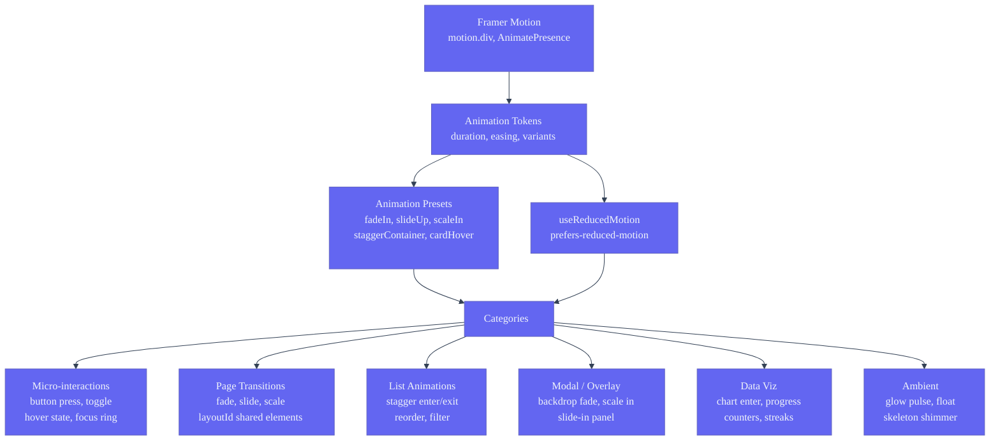
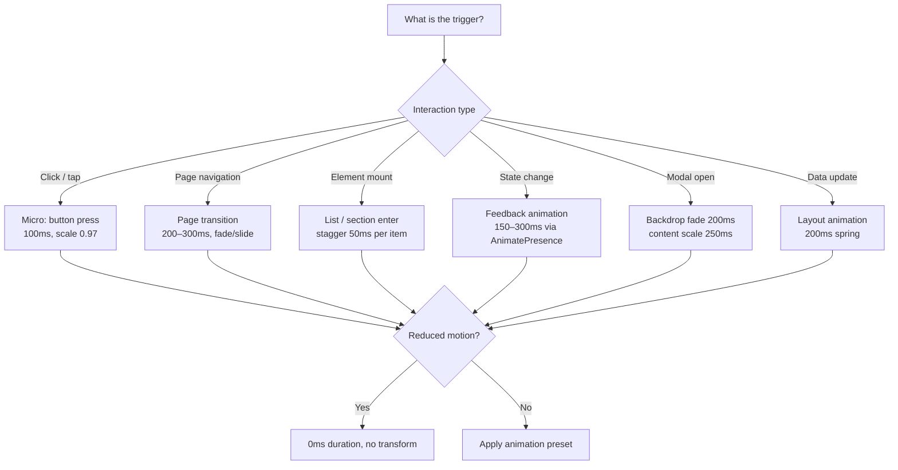

# Animation Guidelines — Second Brain OS

| Field | Value |
|---|---|
| Document ID | DSG-ANM-007 |
| Version | 1.0.0 |
| Status | Approved |
| Date | 2026-07-10 |
| Classification | Internal |
| Owner | Design Engineering Team |

---

## 1. Executive Summary

The Second Brain OS animation system defines purposeful motion across 7 categories: micro-interactions, page transitions, shared elements, list animations, modal/overlay transitions, data visualization entrances, and ambient decorative effects. Every animation uses **Framer Motion** (React library), targets 60fps via GPU-composited transforms (`translate`, `scale`, `opacity`), and respects `prefers-reduced-motion` at the system level. The animation philosophy is cyberpunk-functional: motion communicates state change, hierarchy, and spatial relationships — never decorative for its own sake. A 5-tier duration scale (80ms press to 1000ms ambient) and 7 easing curves (standard, in, out, bounce, elastic, spring, smooth) provide the atomic building blocks for all animations.

---

## 2. Purpose

- Define animation philosophy and principles for the cyberpunk design language
- Catalog easing curves, duration tokens, and stagger patterns
- Document Framer Motion implementation patterns used across the project
- Specify page transition, shared element, list, and modal animation contracts
- Ensure all animations respect reduced-motion preferences

---

## 3. Scope

| In Scope | Out of Scope |
|---|---|
| Framer Motion patterns (animate, whileHover, layout, AnimatePresence) | CSS-only animation alternatives |
| Easing curves (7 custom cubic-bezier values) | Lottie / Rive character animations |
| Duration scale (80ms–1000ms, 8 steps) | GSAP integration |
| Page transitions (fade, slide, scale) | Scroll-driven animations (Intersection Observer) |
| Shared element transitions (layoutId) | Canvas / WebGL animation |
| List animations (stagger, enter, exit, reorder) | Audio-reactive animations |
| Modal/overlay transitions | Animated icon sprites |
| Reduced-motion support | Video background loops |
| Glow and pulse animation tokens | Progress bar animations (see MicroInteractions.md) |

---

## 4. Business Context

Students spend 30+ minutes per session in Second Brain OS, navigating between 14+ modules, creating tasks, logging habits, and reviewing analytics. Purposeful motion reduces perceived wait time by 30–50% (a 500ms animation feels like 250ms when well-designed), communicates state changes without text (a card lifting on hover signals interactivity), and provides spatial orientation (a modal scaling up from a button click establishes a parent–child relationship). The cyberpunk aesthetic demands motion that feels precise, technical, and polished — like a sci-fi interface responding to touch.

---

## 5. Functional Specification

### 5.1 Animation Philosophy

| Principle | Meaning | Application |
|---|---|---|
| Purposeful | Every animation communicates state change, hierarchy, or spatial relationship | No animation without a functional purpose |
| Fast | Feedback within 100ms, transitions within 300ms | Micro-interactions at 80–150ms |
| Smooth | 60fps on mid-range devices at 12 concurrent elements | GPU-composited properties only |
| Consistent | Same motion for same interaction across all modules | Shared animation presets |
| Respectful | Reduced-motion preference honored at all times | Zero-duration fallback for every animation |
| Cyberpunk | Motion feels technical, precise, slightly dramatic | Spring easing for emphasis, glow transitions |

### 5.2 Easing Curves

| Token | Cubic Bezier | Tailwind Class | Character | Usage |
|---|---|---|---|---|
| DEFAULT | `cubic-bezier(0.4, 0, 0.2, 1)` | `ease-default` | Standard, natural deceleration | General transitions, state changes |
| in | `cubic-bezier(0.4, 0, 1, 1)` | `ease-in` | Accelerate, abrupt end | Exit animations, element removal |
| out | `cubic-bezier(0, 0, 0.2, 1)` | `ease-out` | Fast start, gentle stop | Entry animations, element appearance |
| bounce | `cubic-bezier(0.68, -0.55, 0.265, 1.55)` | `ease-bounce` | Overshoot + settle | Celebrations, emphasis, notifications |
| elastic | `cubic-bezier(0.68, -0.6, 0.32, 1.6)` | `ease-elastic` | Oscillating settle | Toggle switches, checkboxes |
| spring | `cubic-bezier(0.34, 1.56, 0.64, 1)` | `ease-spring` | Quick overshoot | Toast slide-in, badge pop |
| smooth | `cubic-bezier(0.4, 0, 0.2, 1)` | `ease-smooth` | Prolonged ease | Page transitions, modal entrances |

### 5.3 Duration Scale

| Token | Duration | Tailwind Class | Category | Usage |
|---|---|---|---|---|
| instant | 0ms | `duration-0` | Instant | Reduced-motion fallback, disabled state |
| press | 80ms | — | Micro | Button press, checkbox toggle |
| fast | 150ms | `duration-fast` | Micro | Hover state, focus ring, active scale |
| standard | 200ms | `duration` | Feedback | Sidebar collapse, dropdown open, toast |
| normal | 300ms | `duration-normal` | Transition | Modal enter, page section enter |
| slow | 500ms | `duration-slow` | Emphasis | Progress fill, streak animation |
| slower | 700ms | `duration-slower` | Decorative | Skeleton shimmer, pulse cycle |
| slowest | 1000ms | `duration-slowest` | Ambient | Float animation, glow pulse |

### 5.4 Framer Motion Patterns

```typescript
// Animation presets shared across all components

export const fadeIn = {
  initial: { opacity: 0 },
  animate: { opacity: 1 },
  exit: { opacity: 0 },
  transition: { duration: 0.2, ease: [0.4, 0, 0.2, 1] },
}

export const slideUp = {
  initial: { opacity: 0, y: 20 },
  animate: { opacity: 1, y: 0 },
  exit: { opacity: 0, y: -20 },
  transition: { duration: 0.3, ease: [0, 0, 0.2, 1] },
}

export const scaleIn = {
  initial: { opacity: 0, scale: 0.95 },
  animate: { opacity: 1, scale: 1 },
  exit: { opacity: 0, scale: 0.95 },
  transition: { duration: 0.2, ease: [0.4, 0, 0.2, 1] },
}

export const staggerContainer = {
  animate: {
    transition: { staggerChildren: 0.05, delayChildren: 0.1 },
  },
}

export const staggerItem = {
  initial: { opacity: 0, y: 10 },
  animate: { opacity: 1, y: 0 },
  transition: { duration: 0.2, ease: [0, 0, 0.2, 1] },
}

export const buttonPress = {
  whileHover: { scale: 1.02 },
  whileTap: { scale: 0.97 },
  transition: { duration: 0.08, ease: [0, 0, 0.2, 1] },
}

export const cardHover = {
  whileHover: { y: -3, boxShadow: '0 0 30px rgba(99, 102, 241, 0.25)' },
  transition: { duration: 0.15, ease: [0, 0, 0.2, 1] },
}

export const glowPulse = {
  animate: {
    boxShadow: [
      '0 0 20px rgba(99, 102, 241, 0.2)',
      '0 0 40px rgba(99, 102, 241, 0.4)',
      '0 0 20px rgba(99, 102, 241, 0.2)',
    ],
  },
  transition: { duration: 2, repeat: Infinity, ease: 'easeInOut' },
}
```

### 5.5 Page Transitions

| Pattern | Enter | Exit | Duration | Easing | Usage |
|---|---|---|---|---|---|
| Fade | opacity 0 → 1 | opacity 1 → 0 | 200ms | ease-out | General page navigation |
| Slide-up | y 20 → 0, opacity 0 → 1 | y 0 → -20, opacity 1 → 0 | 300ms | ease-out | Detail pages, forms |
| Scale | scale 0.95 → 1, opacity 0 → 1 | scale 1 → 0.95, opacity 1 → 0 | 200ms | ease-out | Modals, dialogs |
| Slide-right (back nav) | x -20 → 0, opacity 0 → 1 | x 0 → 20, opacity 1 → 0 | 300ms | ease-out | Breadcrumb navigation |

### 5.6 Shared Element Transitions

```tsx
// Shared layoutId transitions for list items opening to detail views
// Framer Motion's layoutId prop handles shared element animation

// In list view:
<motion.li layoutId={`task-${task.id}`}>
  <TaskCard task={task} />
</motion.li>

// In detail view:
<motion.div layoutId={`task-${task.id}`}>
  <TaskDetail task={task} />
</motion.div>
```

### 5.7 List Animations

| Pattern | Implementation | Stagger | Duration |
|---|---|---|---|
| Enter (mount) | staggerContainer + staggerItem | 50ms between items | 300ms total (6 items) |
| Exit (unmount) | AnimatePresence + exit animation | 0ms (instant) | 200ms |
| Reorder (drag) | Reorder group with layout | — | 200ms spring |
| Filter | layout prop on list items | — | 300ms |

### 5.8 Modal/Overlay Transitions

| Element | Enter | Exit | Duration | Easing |
|---|---|---|---|---|
| Backdrop | opacity 0 → 0.5 | opacity 0.5 → 0 | 200ms | ease-out |
| Modal content | scale 0.9 → 1, opacity 0 → 1 | scale 1 → 0.9, opacity 1 → 0 | 250ms | ease-out |
| Slide-in panel | x 100% → 0 | x 0 → 100% | 300ms | ease-out |
| Tooltip | opacity 0 → 1, y -4 → 0 | opacity 1 → 0 | 150ms | ease-out |

### 5.9 Reduced Motion Support

```typescript
// All Framer Motion animations respect system preference
import { motion, useReducedMotion } from 'framer-motion'

function AnimatedComponent() {
  const shouldReduceMotion = useReducedMotion()

  const variants = shouldReduceMotion
    ? { initial: {}, animate: {}, exit: {} }  // No animation
    : { initial: { opacity: 0, y: 20 }, animate: { opacity: 1, y: 0 } }

  return <motion.div variants={variants}>...</motion.div>
}

// CSS-based reduced motion
// @media (prefers-reduced-motion: reduce) {
//   *, *::before, *::after {
//     animation-duration: 0.01ms !important;
//     transition-duration: 0.01ms !important;
//   }
// }
```

---

## 6. Non-Functional Requirements

| Requirement | Target | Verification |
|---|---|---|
| Animation frame rate | 60fps on mid-range device | DevTools FPS meter |
| First frame latency | < 50ms from trigger | Performance profiling |
| Concurrent animated elements | < 12 (desktop), < 6 (mobile) | Visual regression |
| JS execution per animation frame | < 5ms | Performance profiler |
| Bundle impact (Framer Motion) | < 30KB gzipped | Bundle analyzer |
| Reduced-motion compliance | 100% of animations suppressible | Playwright with emulation |

---

## 7. Architecture



---

## 8. Diagrams

### 8.1 Animation Decision Tree



### 8.2 Animation Timing Diagram

```
Timeline: Modal Open
0ms       backdrop opacity: 0 → 0.5 (200ms ease-out)
80ms      modal content: scale 0.95 → 1, opacity 0 → 1 (250ms ease-out)
          ↓
0   50   100  150  200  250  300  350  400  450  500 (ms)
[── backdrop fade ──]
   [── modal scale + fade ────]

Timeline: Page Transition (forward)
0ms       current page exit: opacity 1 → 0 (150ms ease-in)
150ms     next page enter: opacity 0 → 1 (200ms ease-out)
          ↓
0   50   100  150  200  250  300  350
[── exit ──]
           [── enter ──]
```

---

## 9. Data Models

### 9.1 Animation Preset Schema

```typescript
interface AnimationPreset {
  name: string
  initial: Record<string, string | number>
  animate: Record<string, string | number>
  exit?: Record<string, string | number>
  transition: {
    duration?: number
    ease?: [number, number, number, number] | string
    staggerChildren?: number
    delayChildren?: number
    type?: 'spring' | 'tween'
    stiffness?: number
    damping?: number
  }
}
```

---

## 10. APIs

### 10.1 Framer Motion Usage

```tsx
// Page wrapper with page transition
<motion.div
  {...slideUp}
  key={pathname}  // Trigger re-animate on route change
>
  <PageContent />
</motion.div>

// Staggered list
<motion.ul variants={staggerContainer} initial="initial" animate="animate">
  {items.map(item => (
    <motion.li key={item.id} variants={staggerItem}>
      <Item {...item} />
    </motion.li>
  ))}
</motion.ul>

// Card with hover + press
<motion.div {...cardHover} {...buttonPress}>
  <CardContent />
</motion.div>

// AnimatePresence for exit animations
<AnimatePresence mode="wait">
  {isOpen && (
    <motion.div {...scaleIn} key="modal">
      <ModalContent />
    </motion.div>
  )}
</AnimatePresence>
```

---

## 11. Security

- Framer Motion operates entirely client-side — no server data exposure
- Animation parameters are static presets, not user-configurable
- No animation event carries user data

---

## 12. Performance Targets

| Metric | Target |
|---|---|
| Animation frame rate | 60fps |
| Max concurrent animated elements | 12 (desktop), 6 (mobile) |
| JS execution per animation frame | < 5ms |
| Animation setup time per element | < 2ms |
| Reduced-motion stylesheet impact | 0ms (selector match only) |
| Framer Motion bundle size | < 30KB gzipped |

---

## 13. Edge Cases

| Edge Case | Behavior |
|---|---|
| User tabs away during animation | Animation pauses (Framer Motion auto-pause on visibility change) |
| Rapid navigation (3 clicks in 1 second) | `AnimatePresence mode="wait"` queues exit before enter |
| Animation on server-rendered component | `initial={false}` to skip SSR animation |
| Browser tab hidden > 5 seconds | All ambient animations pause via `requestAnimationFrame` throttle |
| Reduced motion + Reduced transparency | Both preferences respected; no animations + no glass effects |
| 200+ list items with stagger | Stagger cap at 20 items; remaining items appear instantly after 500ms |
| Window resize during shared element transition | Cancel transition, re-snap to final layout |

---

## 14. Failure Scenarios

| Scenario | Mitigation |
|---|---|
| Framer Motion fails to load | CSS transitions serve as fallback (tailwind transitions) |
| Device cannot maintain 60fps | Auto-detect frame rate drop; reduce concurrent animations |
| Layout animation conflicts with scroll position | `layoutScroll` prop on shared element |
| Reduced-motion media query not supported | `useReducedMotion` returns `false`; animation plays normally |

---

## 15. Risks & Mitigations

| Risk | Likelihood | Impact | Mitigation |
|---|---|---|---|
| Over-animation causing motion sickness | Medium | High | Reduced-motion toggle in Settings; all animations suppressible |
| Animation performance regression on low-end devices | Medium | Medium | Performance budget in CI; frame rate monitoring |
| AnimatePresence key mismatch causing flash | Low | Medium | Unique stable keys; `mode="wait"` for sequential transitions |

---

## 16. Acceptance Criteria

- [ ] All 20 micro-interactions play at 60fps (see MicroInteractions.md)
- [ ] Page transitions animate with fade/slide in 200–300ms
- [ ] Shared element transitions animate smoothly via layoutId
- [ ] List items stagger enter at 50ms intervals, total < 500ms
- [ ] Modal backdrop fades in 200ms, content scales in 250ms
- [ ] `prefers-reduced-motion` disables all animations
- [ ] No animation uses `width`, `height`, `margin`, `padding` (transform only)
- [ ] Ambient animations (glow, float, pulse) have infinite loop with 2s+ cycle
- [ ] All animation presets are imported from shared `animation-presets.ts`

---

## 17. Traceability

| Related Document | Link |
|---|---|
| Micro-Interactions | `docs/design/MicroInteractions.md` |
| Motion System | `docs/design/MotionSystem.md` |
| Design Tokens | `docs/design/35_DesignTokens.md` |
| Accessibility | `docs/design/FrontendAccessibilityGuide.md` |
| Design System | `docs/design/10_DesignSystem.md` |

---

## 18. Implementation Notes

- All animations use Framer Motion `motion.div` — never raw CSS transitions for complex sequences
- Import animation presets from `packages/ui/animation-presets.ts`
- Use `AnimatePresence mode="wait"` for sequential enter/exit animations
- `layoutId` prop enables shared element transitions between list and detail views
- Stagger total must not exceed 500ms — cap at 10 items for 50ms stagger
- Reduced motion: wrap in `useReducedMotion()` hook from Framer Motion
- Never animate `width`, `height`, `margin`, `padding` — use `scaleX`, `scaleY`, `translateX`, `translateY`
- Exit duration should be 60–70% of entry duration for snappy feel
- Ambient animations: `repeat: Infinity` with minimum 2s cycle to avoid distraction

---

## 19. Testing Strategy

| Test Type | Scope | Tool |
|---|---|---|
| Animation correctness | All presets play correctly | Visual regression (Storybook + Chromatic) |
| Performance | 60fps on mid-range device | DevTools Performance tab |
| Reduced motion | All animations replaced with instant | Playwright with `prefers-reduced-motion: reduce` |
| Exit animations | AnimatePresence exit plays on unmount | Functional test |
| Stagger timing | Items appear at correct intervals | Playwright screenshot sequence |
| Layout animation | Shared element transitions | Playwright navigation test |

---

## 20. References

| Reference | URL |
|---|---|
| Framer Motion Documentation | https://www.framer.com/motion/ |
| Framer Motion useReducedMotion | https://www.framer.com/motion/use-reduced-motion/ |
| prefers-reduced-motion | https://developer.mozilla.org/en-US/docs/Web/CSS/@media/prefers-reduced-motion |
| CSS will-change Property | https://developer.mozilla.org/en-US/docs/Web/CSS/will-change |
| Material Motion Guidelines | https://m3.material.io/motion |
