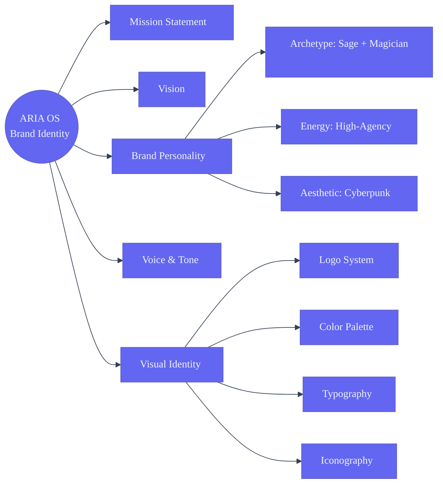

# Branding — Second Brain OS (ARIA)

> **Document ID:DSG-BRN-001 SB-BRAND-001  
> **Version:** 1.0.0  
> **Status:** Active  
> **Last Updated:** 2026-06-11  
> **Classification:** Public — Brand Guidelines  
> **Owner:** Product Design Team

---

## Table of Contents

1. [Brand Identity Foundation](#1-brand-identity-foundation)
2. [Logo Usage & Asset Rules](#2-logo-usage--asset-rules)
3. [Color System](#3-color-system)
4. [Typography](#4-typography)
5. [Iconography](#5-iconography)
6. [Illustration & Imagery](#6-illustration--imagery)
7. [Brand Voice & Tone](#7-brand-voice--tone)
8. [Third-Party Integration Guidelines](#8-third-party-integration-guidelines)
9. [Marketing & Content Materials](#9-marketing--content-materials)
10. [Social Media Presence](#10-social-media-presence)
11. [Brand Evolution Roadmap](#11-brand-evolution-roadmap)

## Brand Identity System



---

## 1. Brand Identity Foundation

### 1.1 The ARIA Story

ARIA stands for **Adaptive Reasoning Intelligence Agent**. The name was chosen because ARIA evokes melody, flow, and harmony — qualities that a second brain should bring to the chaos of modern student life. Just as an aria in opera carries the emotional weight of a scene, ARIA carries the cognitive weight of its user.

**Origin narrative:** Born from the realization that a BTech CSE student juggles 15+ life dimensions — coursework, side projects, job applications, fitness, sleep, finances, relationships, and self-discovery. No existing tool orchestrates these holistically. ARIA is the conductor.

### 1.2 Brand Mission

> **To eliminate cognitive overhead for ambitious students by providing a unified, AI-powered second brain that learns, adapts, and anticipates — so they can focus on what matters: building, learning, and growing.**

### 1.3 Brand Vision

A world where every student has an AI companion that knows them deeply enough to remove friction from their daily life, freeing human cognition for creative and meaningful work.

### 1.4 Brand Personality

| Dimension | Trait | Manifestation |
|---|---|---|
| **Archetype** | The Sage + The Magician | Knowledgeable but transformative; teaches but also empowers |
| **Tone axis** | Warm — Professional — Precise — Encouraging | Leans warm-professional for general; shifts toward one pole per context |
| **Energy** | High-agency, low-anxiety | Proactive suggestions without pressure; confident without arrogance |
| **Intelligence** | Sharp, curious, never condescending | Explains when asked; trusts user to understand |
| **Aesthetic** | Cyberpunk — not dystopian, not pastel | Neon accents on dark canvases; intentional glow; never generic AI blues |

### 1.5 Brand Values

| Value | Description | Design Manifestation |
|---|---|---|
| **Radical Clarity** | Surface what matters, hide what doesn't | Progressive disclosure, clean dashboards, smart defaults |
| **Graceful Power** | Complex systems that feel simple | Predictive defaults, one-click actions, thoughtful loading states |
| **Adaptive Intelligence** | Grows with the user, never stays static | Learning agent, memory system, personalization |
| **Bold Individuality** | Cyberpunk aesthetic that rejects generic AI design | Syne typography, neon accents, dark theme, distinctive motion |
| **Trustworthy Foundations** | Data privacy, local-first AI, transparent decisions | Offline capability, clear privacy policy, open-source philosophy |

---

## 2. Logo Usage & Asset Rules

### 2.1 Primary Logo — ARIA Mark

The primary logo consists of the ARIA wordmark in Syne Bold with a subtle neon accent glow treatment.

**Horizontal lockup:** Wordmark "ARIA" in Syne Bold, 48px cap-height, with the tagline "Second Brain OS" set in DM Sans Medium at 14px below, right-aligned to the "A" in ARIA. The gradient on "ARIA" runs `#6366F1` → `#00FFA3` horizontally.

**Symbol-only mark:** A stylized brain-wave glyph formed by three intersecting arcs — representing memory, pattern recognition, and action. The arcs use the accent-primary (`#6366F1`) and accent-neon (`#00FFA3`) colors. Intended for favicon, app icon, and avatar contexts.

### 2.2 Logo Clear Space

| Context | Minimum Clear Space | Unit |
|---|---|---|
| Digital (web/app) | Height of the "A" character | em |
| Print | 2× cap-height of the logo | mm |
| Merchandise | 3× cap-height | mm |
| Partner co-branding | 1.5× cap-height | mm |

### 2.3 Logo Minimum Size

| Context | Minimum Width | Notes |
|---|---|---|
| Desktop web | 120px | Horizontal lockup |
| Mobile web | 80px | Symbol-only mark preferred below 100px |
| App icon | 48×48px | Symbol-only |
| Favicon | 16×16px / 32×32px | Symbol-only, simplified |
| Social media avatar | 400×400px | Symbol-only on dark gradient |
| Print | 25mm | Horizontal lockup |

### 2.4 Logo on Backgrounds

| Background | Logo Color | Notes |
|---|---|---|
| Dark (`#0A0B0F` or `#13151A`) | White (`#F1F5F9`) with neon gradient accent | Preferred — always safe |
| Light (any light background) | Dark (`#0A0B0F`) with adjusted gradient | Gradient must retain contrast |
| Image (photography) | White with subtle drop shadow | Shadow: 0 2px 16px rgba(0,0,0,0.6) |
| Gradient backgrounds | White | Never place on busy gradient |
| Partner brand colors | White or dark, whichever provides WCAG AA contrast | Test contrast ratio first |

### 2.5 Logo Don'ts

- ❌ Stretch, skew, rotate, or warp the logo
- ❌ Change the typeface or recreate the logo in any font
- ❌ Add drop shadows, outlines, or effects (except the official gradient)
- ❌ Place on low-contrast backgrounds
- ❌ Use the symbol mark without the wordmark in contexts where brand recognition is critical
- ❌ Animate the logo in ways that don't align with the Motion System (no spinning, bouncing, or flashing)
- ❌ Change the color of the arcs in the symbol mark
- ❌ Add the tagline without the wordmark

---

## 3. Color System

### 3.1 Color Philosophy

The Second Brain OS palette is rooted in cyberpunk aesthetics — dark, intentional, and neon-tinged. Every color serves a functional purpose beyond decoration. Backgrounds are never pure black (which causes eye strain and looks lifeless); instead, `#0A0B0F` provides depth without fatigue. Accent colors are used sparingly — they should feel like rewards, not wallpaper.

### 3.2 Primary Palette

| Token | Hex | RGB | Usage | WCAG AA on bg-page |
|---|---|---|---|---|
| `--bg-page` | `#0A0B0F` | 10, 11, 15 | Primary background — all pages | — |
| `--bg-card` | `#13151A` | 19, 21, 26 | Card, sidebar, modal surfaces | — |
| `--bg-card-hover` | `#1A1D24` | 26, 29, 36 | Card hover, elevated surfaces | — |
| `--bg-elevated` | `#1E2230` | 30, 34, 48 | Dropdowns, tooltips, popovers | — |

### 3.3 Accent Palette

| Token | Hex | RGB | Usage |
|---|---|---|---|
| `--accent-primary` | `#6366F1` | 99, 102, 241 | Primary buttons, links, active states, focus rings |
| `--accent-secondary` | `#818CF8` | 129, 140, 248 | Secondary elements, hover states, gradients |
| `--accent-tertiary` | `#A5B4FC` | 165, 180, 252 | Subtle accents, decorative elements |
| `--accent-neon` | `#00FFA3` | 0, 255, 163 | Success states, completion, energy indicators, glow effects |
| `--accent-warning` | `#F59E0B` | 245, 158, 11 | Warnings, mid-priority notifications |
| `--accent-danger` | `#EF4444` | 239, 68, 68 | Errors, destructive actions, urgent items |

### 3.4 Semantic Palette

| Token | Hex | Usage | Contrast Ratio on bg-page |
|---|---|---|---|
| `--text-primary` | `#F1F5F9` | Body text, headings | 16.2:1 |
| `--text-secondary` | `#94A3B8` | Subtle text, metadata, placeholders | 9.8:1 |
| `--text-tertiary` | `#64748B` | Disabled text, hints | 6.1:1 |
| `--text-inverse` | `#0A0B0F` | Text on light/colored backgrounds | — |
| `--border-default` | `#1E293B` | Card borders, dividers | — |
| `--border-accent` | `#334155` | Focused inputs, hover borders | — |
| `--border-light` | `#475569` | High-contrast borders when needed | — |

### 3.5 Status Colors

| Token | Hex | Meaning | Usage |
|---|---|---|---|
| `--status-success` | `#00FFA3` | Complete, success, active | Task complete, goal achieved, habit streak |
| `--status-warning` | `#F59E0B` | In progress, attention needed | Task due soon, course deadline approaching |
| `--status-error` | `#EF4444` | Overdue, error, failed | Missed task, habit broken, error state |
| `--status-info` | `#6366F1` | Informational, neutral | System messages, tips |
| `--status-paused` | `#64748B` | Paused, deferred, skipped | Paused tasks, deferred goals |

### 3.6 Background Gradients

| Gradient Name | Start | End | Angle | Usage |
|---|---|---|---|---|
| `gradient-accent` | `#6366F1` | `#818CF8` | 135° | Primary button backgrounds, active tab indicators |
| `gradient-neon` | `#6366F1` | `#00FFA3` | 90° | Hero sections, celebration animations, brand headers |
| `gradient-card` | `#13151A` | `#1A1D24` | 180° | Card subtle depth, dashboard tiles |
| `gradient-glow` | `rgba(99,102,241,0.15)` | `transparent` | 0° | Glow effects behind neon elements |

### 3.7 Color Application Rules

- **Accent color density:** No more than 15% of any screen should use accent-primary. Accent colors are highlights, not backgrounds.
- **Text contrast:** All body text must meet WCAG AA (4.5:1). Use `--text-primary` for body, `--text-secondary` only for metadata.
- **Glow effects:** Use `box-shadow` with the accent colors, never `filter: drop-shadow()`. Glow intensity should follow the 3-level system: subtle (cards), medium (buttons), intense (celebrations).
- **Dark theme only:** ARIA OS does not ship a light theme. All designs target dark backgrounds. Third-party integrations that force light mode must use `--text-inverse` on their backgrounds.
- **Status colors on cards:** Status indicators should be small (4px dots, 2px border-left, or small badges). Never tint entire cards with status colors.

---

## 4. Typography

### 4.1 Type System Philosophy

Typography in ARIA OS serves two masters: readability and identity. DM Sans provides the warmth and readability for long reading sessions (course notes, briefings). Syne provides the distinctive cyberpunk character that makes the OS feel intentional. JetBrains Mono signals "this is a tool for builders" — used sparingly for code, data, and technical output.

### 4.2 Font Stack

| Usage | Font | Fallback | Weight Range |
|---|---|---|---|
| Display / Headings | Syne | sans-serif | 400, 500, 600, 700, 800 |
| Body text | DM Sans | sans-serif | 300, 400, 500, 700 |
| Code / Data | JetBrains Mono | monospace | 300, 400, 500, 700 |
| UI labels / Buttons | DM Sans | sans-serif | 500, 700 |

### 4.3 Type Scale (Desktop)

| Level | Size | Line Height | Font | Weight | Tracking | Usage |
|---|---|---|---|---|---|---|
| Display XL | 48px | 1.1 | Syne | 700 | -0.01em | Page titles, hero sections |
| Display L | 40px | 1.15 | Syne | 700 | -0.01em | Section headers |
| Display M | 32px | 1.2 | Syne | 600 | -0.005em | Module titles |
| Heading L | 24px | 1.3 | Syne | 600 | 0 | Card headers, dialog titles |
| Heading M | 20px | 1.3 | DM Sans | 700 | 0 | Sub-section headers |
| Heading S | 18px | 1.35 | DM Sans | 600 | 0 | Group headers |
| Body L | 16px | 1.6 | DM Sans | 400 | 0 | Primary body text |
| Body M | 14px | 1.55 | DM Sans | 400 | 0 | Secondary body, UI text |
| Body S | 13px | 1.5 | DM Sans | 400 | 0.01em | Metadata, captions |
| Code | 13px | 1.5 | JetBrains Mono | 400 | 0 | Code blocks, data display |
| Code S | 12px | 1.4 | JetBrains Mono | 400 | 0 | Inline code, status |
| Overline | 11px | 1.3 | DM Sans | 700 | 0.08em | Labels, badge text |
| Button L | 15px | 1 | DM Sans | 700 | 0.02em | Primary/danger buttons |
| Button M | 13px | 1 | DM Sans | 600 | 0.02em | Secondary buttons |

### 4.4 Fluid Type Scale (Clamp Values)

For responsive typography, use `clamp()` values that interpolate between mobile and desktop sizes:

```css
--fs-display-xl: clamp(2rem, 5vw + 1rem, 3rem);
--fs-display-l:  clamp(1.75rem, 4vw + 0.5rem, 2.5rem);
--fs-display-m:  clamp(1.5rem, 3vw + 0.5rem, 2rem);
--fs-heading-l:  clamp(1.25rem, 2vw + 0.5rem, 1.5rem);
--fs-heading-m:  clamp(1.125rem, 1.5vw + 0.5rem, 1.25rem);
--fs-body-l:     clamp(0.9375rem, 0.5vw + 0.75rem, 1rem);
--fs-body-m:     clamp(0.8125rem, 0.25vw + 0.75rem, 0.875rem);
```

### 4.5 Typography Rules

- **Maximum line length:** 75 characters for body text, 90 characters for code.
- **Heading hierarchy:** Never skip levels. H1 → H2 → H3, in order.
- **Link styling:** Underline only on hover. Default state uses `--accent-primary` color.
- **Selection color:** `::selection { background: rgba(99, 102, 241, 0.35); color: #F1F5F9; }`
- **Placeholder text:** Use `--text-tertiary` (`#64748B`) — must meet 3:1 contrast ratio against the input background.
- **Number alignment:** Use tabular numbers (OpenType `tnum`) in data tables, dashboard metrics, and any columnar numeric data.

### 4.6 Webfont Loading Strategy

```javascript
// Load Syne and DM Sans immediately (blocking), JetBrains Mono deferred
// Use font-display: swap for all fonts to prevent FOIT

<link rel="preload" href="/fonts/syne.woff2" as="font" type="font/woff2" crossorigin>
<link rel="preload" href="/fonts/dm-sans.woff2" as="font" type="font/woff2" crossorigin>
<link rel="preload" href="/fonts/jetbrains-mono.woff2" as="font" type="font/woff2" crossorigin>

// All fonts: font-display: swap
// Fallback during load: system-ui for DM Sans, monospace for JetBrains Mono
```

---

## 5. Iconography

### 5.1 Icon Style Definition

ARIA OS uses a custom icon style that blends **line-art minimalism** with **cyberpunk edge**.

| Property | Value | Rationale |
|---|---|---|
| Stroke width | 1.5px | Thin enough for elegance, thick enough for visibility |
| Style | Outlined, rounded caps, rounded joins | Approachable precision |
| Size grid | 20×20px (default), 16×16px (compact), 24×24px (large) | Consistent optical alignment |
| Corner radius on shapes | 2px | Slight softening of hard edges |
| Filled variants | Used only for active/selected states | Maintains distinction |
| Animation | Subtle hover scale (1.05) or stroke color shift | Never bounce or spin |

### 5.2 Icon Library

**Primary icon set:** Lucide React (open-source, consistent stroke style). All icons pass through a CSS wrapper for color inheritance.

**Custom icons** (created for ARIA-specific concepts):

| Icon Name | Concept | Usage |
|---|---|---|
| `brain-wave` | ARIA assistant | Chat header, AI badge, loading indicator |
| `second-brain` | OS identity | Logo mark, app icon, splash screen |
| `memory-node` | Memory consolidation | Memory agent UI, recall timeline |
| `opportunity-radar` | Opportunity detection | Opportunity module, match notifications |
| `habit-chain` | Streak tracking | Habit module, streak display |
| `deep-focus` | Deep work mode | Pomodoro timer, focus session indicator |
| `course-map` | Learning roadmap | Course module, progress visualization |

### 5.3 Icon Color Rules

| Context | Color | Example |
|---|---|---|
| Default UI | `--text-secondary` (#94A3B8) | Navigation icons, toolbar |
| Active / Selected | `--accent-primary` (#6366F1) | Active nav item, selected filter |
| Status indicators | Status palette colors | Completion, warning, error states |
| Interactive hover | `--accent-secondary` (#818CF8) | Hoverable icon buttons |
| Disabled | `--text-tertiary` (#64748B) | Disabled actions, empty states |
| Decorative | 50% opacity of accent colors | Background patterns, large decorative elements |

### 5.4 Icon Sizing in Context

| Context | Size | Notes |
|---|---|---|
| Navigation items | 20×20px | Sidebar and bottom nav |
| Button icons | 16×16px | Inside buttons, inline with text |
| Status badges | 12×12px | Small indicators, dots |
| Module icons (cards) | 24×24px | Card headers, module grid |
| Modal / empty state | 48×48px | Centered illustrations |
| Notification icons | 20×20px | Toast and snackbar |

---

## 6. Illustration & Imagery

### 6.1 Illustration Style

ARIA OS illustrations follow a **cyberpunk-infused flat vector** style:

- **Geometric foundations:** Shapes built from circles, arcs, and straight lines — no organic blobs.
- **Two-tone + accent:** Every illustration uses exactly 2 colors from the neutral palette plus 1 accent color.
- **Minimal depth:** 1-2 layers of overlap. No photorealistic rendering.
- **Glow nodes:** Important elements get a subtle neon glow halo.
- **Grid backgrounds:** When illustrations appear on full pages, subtle 8px grid patterns in `rgba(99,102,241,0.05)` provide texture.
- **No human faces:** Represent people through abstract silhouettes, avatars with data streams, or geometric busts.
- **Data motifs:** Circuit lines, neural network patterns, waveform graphs, and particle clusters as decorative elements.

### 6.2 Illustration Contexts

| Context | Style Notes | Example Use |
|---|---|---|
| **Empty states** | Single focal object, centered, 160×160px, with subtle glow | "No tasks yet" screen |
| **Onboarding** | Sequential illustrations with progress arcs | Feature walkthroughs |
| **Error pages** | Broken circuit / disconnected node metaphor | 404, 500 pages |
| **Success / celebration** | Burst patterns, expanding rings, neon sparks | Habit streak milestones |
| **Loading states** | Pulsing brain-wave glyph, data stream animation | Briefing generation |
| **Module headers** | Small (32×32px) geometric icons for each module | Dashboard module cards |

### 6.3 Photography Guidelines

Photography is rarely used but when it is:

- **Dark and moody:** Low exposure, high contrast, desaturated with neon color grading
- **Tech-infused:** Blue/purple light spills, bokeh that looks like data points
- **No stock-photo smiles:** Candid, focused, working-late-in-a-neon-city aesthetic
- **Overlays:** All photography must have a `rgba(10,11,15,0.6)` gradient overlay and a neon accent color wash in one corner

### 6.4 Motion in Imagery

- **Animated illustrations:** Lottie format, 30fps max, looped only for loading states
- **Glow pulse:** 3s infinite loop, 20% opacity variance on neon elements
- **Data streams:** Horizontal scrolling binary/code strips in illustration backgrounds

---

## 7. Brand Voice & Tone

### 7.1 Core Voice Principles

| Principle | Description | Do | Don't |
|---|---|---|---|
| **Clear over clever** | Precision beats wordplay | "Your task 'Finish report' is due in 2 hours." | "Time flies when you're having fun — and your task is almost late!" |
| **Empowering over coddling** | Trust the user's intelligence | "Here are 3 options. Pick what works." | "Don't worry, I'll handle everything for you!" |
| **Direct with warmth** | Professional foundation, human touch | "You missed 2 habits today. Want to reschedule?" | "Oopsie daisy! You forgot your habits! 🙈" |
| **Data-backed** | Every claim has a source | "Your focus score dropped 15% this week. Your deep work sessions decreased by 2." | "You seem a bit distracted lately!" |

### 7.2 Tone by Context

| Module | Tone | Example | Voice Characteristics |
|---|---|---|---|
| **Tasks** | Direct, action-oriented | "3 tasks due today. Prioritizing: 'Submit AI assignment' is urgent." | Short sentences, imperative where appropriate, no fluff |
| **Courses** | Patient, instructive | "You're 60% through 'Machine Learning'. Here's a 15-min recap of last week's module before you continue." | Explanatory, encouraging, connects concepts |
| **Habits** | Encouraging, non-judgmental | "You've built a 12-day streak on 'Read 30 mins'. One miss doesn't erase progress. Ready to pick it back up?" | Positive framing, streak emphasis, reset-friendly |
| **Sleep** | Data-based, factual | "Your sleep score: 72 (↑5 from last week). Deep sleep: 1h48m (below target by 22m). Wind-down in 45 min recommended." | Metric-driven, objective, actionable recommendation |
| **Income** | Neutral, precise | "This month: ₹12,400 earned across 4 sources. Hourly average: ₹310. Projected month-end: ₹18,500." | Accounting-like precision, projections with confidence |
| **Opportunities** | Curated, exciting | "Found 2 internship matches matching your 'ML Engineer' goal profile. One closes in 5 days." | Scarcity-aware, matched-language, action-biased |
| **Chat (ARIA casual)** | Warm, companionable | Users can be casual; ARIA mirrors their tone but maintains professionalism | Adapts to user's casualness, uses memory for personalization, never overly familiar |
| **Error messages** | Honest, solution-first | "Couldn't save your task. Your changes are backed up locally. Try again?" | Takes responsibility, offers path forward |
| **Push notifications** | Brief, actionable | "📌 'AI Assignment' due in 2h. Start now? (5 min avg)" | Minimal text, clear action, time context |

### 7.3 Voice Do's and Don'ts

| Do | Don't |
|---|---|
| Use contractions (you're, it's, don't) | Use corporate jargon (leverage, synergize, circle back) |
| Address the user as "you" | Use "we" excessively ("We think you should...") |
| End notifications with a question for interaction | Use exclamation marks in >20% of messages |
| Acknowledge user effort ("You completed 12 tasks today — that's 3 above your average") | Compare user to others ("Other users complete more tasks than you") |
| Use emojis sparingly and only in casual contexts | Use emoji as bullet points or decoration |
| Keep messages under 150 characters for notifications | Send wall-of-text responses without formatting |

### 7.4 Writing for ARIA's Voice

**UI Copy Guidelines:**
- Buttons: Start with verbs ("Create Task", not "Task Creation")
- Empty states: Explain + action ("No habits yet. Add your first habit to start tracking.")
- Tooltips: 5-15 words, explaining the "why" not just the "what"
- Error messages: State the problem + the solution, never blame the user
- Loading states: Brief status updates, not puns ("Generating your briefing..." not "Summoning the AI spirits...")

**Microcopy Consistency:**

| Concept | Standard Phrasing |
|---|---|
| Create | "Add [item]" or "Create [item]" |
| Delete | "Delete [item]" — never "Remove" or "Erase" |
| Save | "Save changes" (button) / "Saved" (feedback) |
| Cancel | "Cancel" — never "Go back" or "Dismiss" |
| Confirm | "Confirm" for actions, "Yes, [action]" for destructive |
| Loading | "[Action]ing..." with progress indicator |
| Error | "Couldn't [action]. [Reason]. [Solution]." |

---

## 8. Third-Party Integration Guidelines

### 8.1 Integration Brand Principles

When ARIA OS integrates with third-party services, the brand must remain identifiable while respecting the partner's brand. The integration is always framed as "ARIA OS connecting to [Service]" — never "ARIA OS powered by [Service]" and never "[Service] inside ARIA OS."

### 8.2 Co-Branding Rules

| Element | Rule |
|---|---|
| Logo order | ARIA OS logo first (left/top), partner logo second (right/bottom) |
| Size parity | ARIA OS logo must equal or exceed partner logo in size |
| Separation | Minimum 24px or 1.5× cap-height between logos |
| Colors | ARIA OS retains its dark theme; partner's brand colors used only for their logo |
| Typography | Partner's typography used only for their content; ARIA OS UI always uses ARIA fonts |
| Attribution | "Connected to [Service]" or "With [Service]" — smaller type, secondary color |

### 8.3 Supported Integration Types

| Category | Partner Examples | Branding Approach |
|---|---|---|
| Calendar | Google Calendar, Outlook | "Connected to Google Calendar" — icon + name in settings |
| Cloud Storage | Google Drive, OneDrive, Dropbox | "Attach from Drive" button with Drive icon + ARIA styling |
| Communication | Slack, Discord, Telegram | Notification relay with partner icon in ARIA notification card |
| AI Models | Ollama, Claude API | "Local AI (Ollama)" / "Cloud AI (Claude)" — model badge in chat |
| Code Hosting | GitHub, GitLab | "Import from GitHub" — repo list with GitHub styling adapted to dark theme |

### 8.4 Integration UI Elements

- **Partner icons:** Used in their original color ONLY when the user has connected that service. Otherwise use grayscale.
- **Partner typography:** Never use partner fonts in ARIA UI. Only use in iframes or embedded partner content.
- **Partner status badges:** Small colored dots next to service name — green for connected, gray for disconnected.
- **OAuth screens:** Use ARIA's dark theme for the OAuth consent redirect page (where possible).

---

## 9. Marketing & Content Materials

### 9.1 Website / Landing Page

| Element | Brand Application |
|---|---|
| Hero section | Full-bleed dark gradient with animated grid background, ARIA logo center-left, CTA button with neon gradient |
| Feature cards | 3-column bento grid, glass-morphism cards with 1px neon border on hover, 24px corner radius |
| Testimonials | Quote cards with subtle left border accent, avatar in circular frame with neon ring |
| Pricing | Comparison table with ARIA's "active plan" row highlighted with glow |
| Footer | Minimal, text-secondary links, social icons in circular hover-reveal buttons |

### 9.2 Presentation Materials

| Material | Template |
|---|---|
| Pitch deck | Dark background slides (title: Syne 36pt, body: DM Sans 18pt), accent shapes in corners, data in JetBrains Mono |
| Demo videos | 1080p 60fps, 32px border-radius window frame with ARIA chrome, pink/purple screen glow |
| One-pager | A4, dark background with white text (print-friendly), accent lines for section breaks, QR code in ARIA accent |

### 9.3 Swag / Merchandise

| Item | Design |
|---|---|
| Stickers | Symbol-only mark in accent-neon on transparent / dark vinyl; 50×50mm die-cut |
| T-shirt | Front: small chest logo (wordmark, 8cm wide). Back: large symbol mark (25cm) with tagline. Dark heather gray or black. |
| Hoodie | Left chest: embroidered symbol mark (4cm). Right sleeve: tagline in Syne, vertical. Black or charcoal. |
| Notebook | Cover: embossed symbol mark on matte black. Inside: dot grid, dark gray pages. |

### 9.4 Content Marketing Guidelines

- **Blog / Dev.to posts:** Featured image uses the gradient-accent diagonal split with the post title in Syne.
- **Email newsletters:** Dark background is NOT used (email client compatibility). Use dark gray (#1A1D24) with white text.
- **Video thumbnails:** Split diagonal with product screenshot on one side, bold Syne text on accent gradient on the other.
- **Code snippets in content:** Use JetBrains Mono with ARIA's syntax highlighting colors (accent-primary for keywords, accent-neon for strings).

---

## 10. Social Media Presence

### 10.1 Platform Strategy

| Platform | Content Focus | Posting Cadence | Visual Style |
|---|---|---|---|
| Twitter/X | Product updates, tips, community engagement | 3-5×/week | Screenshot + 1-line hook text |
| LinkedIn | Long-form posts about productivity, AI, student life | 2×/week | Carousel PDF with slide images |
| YouTube | Tutorials, updates, behind-the-scenes | 1×/week (22min avg) | Dark studio with neon accents |
| Discord | Community support, feature requests, beta access | Daily engagement | Custom emoji set in ARIA style |
| GitHub | Open-source repo, issues, discussions | As commits happen | Repo README with full branding |
| Instagram | Visual storytelling, student life | 3×/week | Reels (9:16) with cyberpunk overlay style |

### 10.2 Social Media Visual Templates

- **Twitter cards:** 1200×675px, dark background, logo top-left, accent line separator, body text in DM Sans 32pt.
- **LinkedIn carousels:** 1080×1080px per slide, title slide with gradient, content slides with bullet points and accent bars.
- **YouTube thumbnails:** 1280×720px, high-contrast, ARIA screenshot + bold white text with accent outline.
- **Discord server:** Dark theme with ARIA color scheme, custom role badges using status color dots.

### 10.3 Brand Hashtags

Primary: `#SecondBrainOS` `#ARIA_AI` `#StudentOS`

Secondary: `#AIProductivity` `#CyberpunkStudy` `#StudentTech` `#PersonalAI`

### 10.4 Community Voice

On social media, ARIA's voice is more casual but still professional:
- First-person "we" for the team
- Direct address to the community
- Behind-the-scenes transparency (share build processes, design iterations, failures)
- No engagement-bait, no toxic positivity, no comparison marketing

---

## 11. Brand Evolution Roadmap

### 11.1 Current State (v1.0 — 2026 Q2)

- Brand identity established: ARIA wordmark + symbol mark, dark cyberpunk theme
- Design system tokens finalized and in code
- Voice guidelines documented; consistency across 15 modules
- Social media profiles created, minimal presence
- Website: single landing page

### 11.2 Near-Term (v1.1 — 2026 Q3)

- **Illustration system:** Full library of 20+ custom illustrations for all empty states and onboarding
- **Animation brand:** Lottie files for logo reveal, page transitions, and celebration moments
- **Social templates:** Branded templates for all 6 platforms
- **Case studies:** 3 user stories with permission, turned into branded PDFs
- **Community assets:** Discord emoji pack, custom sticker designs

### 11.3 Medium-Term (v1.5 — 2026 Q4)

- **Brand guidelines v2:** Based on real-world feedback from 100+ beta users
- **Light theme exploration:** Research into whether a light theme aligns with brand identity (unlikely, but evaluate)
- **Partnership branding kits:** Ready-to-use assets for integration partners
- **Accessibility-first brand audit:** Ensure all brand assets pass WCAG AA
- **Illustration expansion:** 50+ illustrations, animated variants, complete onboarding flow

### 11.4 Long-Term (v2.0 — 2027 Q1+)

- **Brand refresh:** Evaluate if the cyberpunk aesthetic needs evolution as the user base diversifies beyond CSE students
- **Sub-brand creation:** Potential product lines (ARIA Lite for casual users, ARIA Pro for power users)
- **Physical brand:** Merchandise line, conference presence (booth design, talks)
- **Brand recognition goals:** 75% of target users recognize the symbol mark
- **Open-source brand contribution guidelines:** Templates and rules for community-created ARIA themes and extensions

### 11.5 Brand Health Metrics

| Metric | Measurement | Current Baseline | Target |
|---|---|---|---|
| Brand recall | Survey: "Which tool uses the brain-wave glyph?" | — (pre-launch) | 40% recognition in target demographic |
| Voice consistency | Audit of 50 random UI strings for voice compliance | — (pre-launch) | >90% compliance |
| Design system adoption | % of components using token system | — (pre-launch) | 100% |
| Third-party misbranding | Instances of incorrect logo/color usage online | — | <5/month |
| Social engagement | Avg monthly mentions with #SecondBrainOS | — | 500+ mentions |

### 11.6 Brand Governance

The **Brand Committee** (Product Design Lead, Marketing Lead, Engineering Lead) reviews:

| Review Item | Frequency | Process |
|---|---|---|
| New illustration / icon | Bi-weekly | Submit in #brand-review Slack channel |
| Third-party co-branding | Per integration | Brand committee sign-off required |
| Social media posts | Weekly content calendar | Marketing lead approval |
| Major brand updates | Quarterly | Full committee vote; documented in AGENTS.md |
| Community-created assets | Per submission | CC0 license review + brand alignment check |

---

## Appendix A: Brand Asset Checklist

Before any public-facing release, verify:

- [ ] Logo uses correct file (horizontal or symbol-mark as appropriate)
- [ ] Logo clear space respected
- [ ] Colors match design token values (hex verified)
- [ ] Typography uses correct font family + weight
- [ ] Illustration style follows 2-tone + accent rule
- [ ] Voice/tone matches context table (Section 7.2)
- [ ] Social media template matches platform spec
- [ ] No brand violations (Section 2.5 checklist)
- [ ] Accessibility: all text meets contrast requirements
- [ ] Files exported at correct resolution and format

## Appendix B: File Delivery Formats

| Asset | Formats | Resolution |
|---|---|---|
| Logo (horizontal) | SVG, PNG, EPS | SVG preferred; PNG at 2× (2400×600px) |
| Logo (symbol) | SVG, PNG, ICO, iOS/Android | 512×512px base; all favicon sizes |
| Color swatches | ASE, JSON, CSS custom props | — |
| Font files | WOFF2, WOFF | All weights listed in Section 4.3 |
| Icon set | SVG sprite, React components | 16×16, 20×20, 24×24 |
| Illustration library | SVG, Lottie (JSON) | SVG for static, Lottie for animated |
| Social templates | Figma, Sketch | 2× export resolution |

---

> **Maintenance:** This document is reviewed quarterly by the Brand Committee. Propose changes via PR to `docs/design/Branding.md` with brand committee approval.
>
> **Related documents:** `docs/design/10_DesignSystem.md` (visual tokens), `docs/design/35_DesignTokens.md` (code-level tokens), `docs/design/MotionSystem.md` (animation guidelines), `docs/design/FrontendAccessibilityGuide.md` (inclusive brand application).
