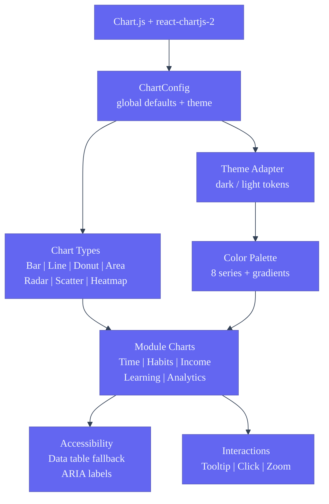
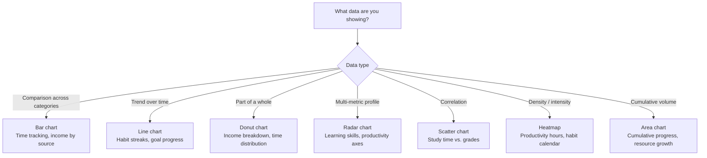

# Charts & Data Visualization — Second Brain OS

| Field | Value |
|---|---|
| Document ID | DSG-CHT-006 |
| Version | 1.0.0 |
| Status | Approved |
| Date | 2026-07-10 |
| Classification | Internal |
| Owner | Design Engineering Team |

---

## 1. Executive Summary

Second Brain OS uses Chart.js (via `react-chartjs-2`) for data visualization across 7 chart types: bar, line, pie/donut, area, radar, scatter, and heatmap. Every chart is styled using the project's design tokens — neon gradients for bars, indigo lines with emerald fill, and dark theme defaults (transparent background, white grid lines at 5% opacity). Charts are used in 6+ modules: time tracking (bar), habits (line/heatmap), income (donut/bar), learning (radar), productivity (heatmap), and analytics (composite). Each chart includes responsive sizing, 60fps animation, and full keyboard/screen-reader accessibility via data table fallbacks.

---

## 2. Purpose

- Document supported chart types and module mappings
- Specify Chart.js configuration defaults and theme overrides
- Define chart color palette from project design tokens
- Establish accessibility requirements (data tables, ARIA labels, keyboard navigation)
- Provide interaction patterns (tooltips, hover states, click handlers)

---

## 3. Scope

| In Scope | Out of Scope |
|---|---|
| Chart.js integration (7 chart types) | D3.js or custom SVG chart rendering |
| Chart color palette (8 series from tokens) | Animated chart transitions (see AnimationGuidelines.md) |
| Chart configuration defaults (responsive, tooltip, legend) | Real-time streaming chart data |
| Chart accessibility (data tables, ARIA, keyboard) | 3D charts or WebGL rendering |
| Chart sizing and responsive behavior | Server-side chart rendering (SSR) |
| Chart interaction patterns (hover, click, drill-down) | Export chart as image download |

---

## 4. Business Context

Students track metrics across 6+ quantitative modules: time spent studying (bar chart), habit streaks (line chart with heatmap overlay), income trends (donut + bar), learning progress (radar chart across 6 skill axes), and productivity patterns (GitHub-style heatmap). Charts must communicate trends at a glance — whether a habit streak is growing, study time is increasing, or income is volatile. The cyberpunk aesthetic (neon gradients, dark backgrounds, glow effects) differentiates from generic chart libraries while maintaining readability.

---

## 5. Functional Specification

### 5.1 Supported Chart Types

| Chart Type | Module | Visual Style | Min Height | Data Points |
|---|---|---|---|---|
| Bar | Time, Income, Analytics | Vertical bars, rounded top, neon gradient fill, 0.8 corner radius | 200px | 5–30 |
| Line | Habits, Streaks, Goals | Smooth tension 0.4, gradient area fill below, dot markers on hover | 200px | 7–90 |
| Donut | Income, Progress | Center total label, hover segment expansion 10%, arc spacing 2px | 200px | 2–8 |
| Area | Course Progress, Cumulative | Gradient fill (indigo to transparent), 0 tension | 200px | 5–50 |
| Radar | Learning, Skills | 6 axes, translucent fill (0.2 opacity), point labels | 250px | 3–8 |
| Scatter | Correlation, Analytics | Circular points (5px), regression line optional | 200px | 10–200 |
| Heatmap | Productivity, Habits | GitHub-style intensity, 7 columns × 24 rows, cell rounded 3px | 150px | Variable |

### 5.2 Chart.js Global Configuration

```typescript
const chartDefaults = {
  responsive: true,
  maintainAspectRatio: false,
  animation: {
    duration: 500,
    easing: 'easeOutQuart' as const,
  },
  plugins: {
    legend: {
      display: false,  // Module-specific opt-in
    },
    tooltip: {
      backgroundColor: '#1A1D28',
      titleColor: '#F0F2F5',
      bodyColor: '#94A3B8',
      borderColor: '#2A2E3F',
      borderWidth: 1,
      cornerRadius: 8,
      padding: 12,
    },
  },
  scales: {
    x: {
      grid: { color: 'rgba(255,255,255,0.05)' },
      ticks: { color: '#5A6075', font: { family: 'DM Sans', size: 12 } },
    },
    y: {
      grid: { color: 'rgba(255,255,255,0.05)' },
      ticks: { color: '#5A6075', font: { family: 'JetBrains Mono', size: 11 } },
      beginAtZero: true,
    },
  },
}
```

### 5.3 Chart Color Palette

| Series | Token | Dark Theme | Light Theme | Usage |
|---|---|---|---|---|
| Series 1 | chart-1 | #6366F1 (indigo-500) | #4F46E5 (indigo-600) | Primary data, main metric |
| Series 2 | chart-2 | #10B981 (emerald-500) | #059669 (emerald-600) | Secondary, comparison |
| Series 3 | chart-3 | #F59E0B (amber-500) | #D97706 (amber-600) | Tertiary, warning |
| Series 4 | chart-4 | #EF4444 (rose-500) | #DC2626 (rose-600) | Negative, error |
| Series 5 | chart-5 | #3B82F6 (blue-500) | #2563EB (blue-600) | Info, supplementary |
| Series 6 | chart-6 | #8B5CF6 (violet-500) | #7C3AED (violet-600) | Comparison, extra |
| Series 7 | chart-7 | #00FFA3 (neon) | #00CC82 (neon-dark) | Success, positive |
| Series 8 | chart-8 | #14B8A6 (teal-500) | #0D9488 (teal-600) | Mixed, extra |

Gradient configurations:

```typescript
// Bar/area gradient helper
const createGradient = (ctx: CanvasRenderingContext2D, color: string) => {
  const gradient = ctx.createLinearGradient(0, 0, 0, 400)
  gradient.addColorStop(0, color)
  gradient.addColorStop(1, `${color}00`) // fade to transparent
  return gradient
}
```

### 5.4 Chart Responsive Behavior

| Viewport | Behavior |
|---|---|
| Desktop (> 1024px) | Full chart with legend, tooltips, all labels |
| Tablet (768–1024px) | Chart scales down, legend hidden (show on toggle), label rotation 45° |
| Mobile (375–768px) | Chart fills width, x-axis labels every nth, minimal tooltip, touch-optimized hit areas |
| Ultra-wide (> 1536px) | Max chart width 1200px, centered in container |

### 5.5 Interaction Patterns

| Interaction | Implementation | Visual Feedback |
|---|---|---|
| Hover (bar/point) | Chart.js built-in hover | Point scales to 1.5x, tooltip appears |
| Click segment | `onClick` handler | Drill-down to detail view |
| Tooltip | Chart.js tooltip plugin | bg-elevated card, 8px radius, 12px padding, border |
| Legend toggle | Click legend item | Series hides/shows, cross-fade 300ms |
| Zoom (pinch) | Chart.js zoom plugin | Range selection, reset button appears |

---

## 6. Non-Functional Requirements

| Requirement | Target | Verification |
|---|---|---|
| Chart render time (200 data points) | < 100ms | Performance profiler |
| Chart animation frame rate | 60fps | FPS meter |
| Chart bundle size (chart.js + react-chartjs-2) | < 60KB gzipped | Bundle analyzer |
| Responsive re-render | < 50ms on resize | Performance measurement |
| Tooltip show latency | < 50ms on hover | Interaction measurement |

---

## 7. Architecture



---

## 8. Diagrams

### 8.1 Chart Type Decision Tree



### 8.2 Chart Component Anatomy

```
┌─────────────────────────────────────────────────────┐
│  Chart Title (DM Sans, base, 600)                    │
│  Subtitle / Period (DM Sans, sm, secondary)          │
│  [Legend items (hidden on mobile)]                   │
├─────────────────────────────────────────────────────┤
│                                                       │
│   ┌─────────────────────────────────────────────┐    │
│   │                                             │    │
│   │   Chart canvas                              │    │
│   │   (responsive, maintainAspectRatio: false)   │    │
│   │   background: transparent                   │    │
│   │                                             │    │
│   └─────────────────────────────────────────────┘    │
│                                                       │
│  Source: [data source] (DM Sans, xs, tertiary)        │
│  [Accessible data table — visually hidden]            │
└─────────────────────────────────────────────────────┘
```

---

## 9. Data Models

### 9.1 Chart Configuration Schema

```typescript
interface ChartProps {
  type: 'bar' | 'line' | 'doughnut' | 'radar' | 'scatter' | 'heatmap'
  data: ChartDataset[]
  options?: ChartOptions
  height?: number           // px, default 200
  showLegend?: boolean      // default false
  showGrid?: boolean        // default true
  animated?: boolean        // default true
  accessibleLabel: string   // Required for screen readers
  dataTable?: DataRow[]     // Visually hidden data table
  onClick?: (index: number) => void
}

interface ChartDataset {
  label: string
  data: number[]
  color?: ChartSeries       // 1–8, maps to token palette
  type?: 'bar' | 'line'     // Mixed chart support
  yAxisID?: 'y' | 'y1'     // Dual axis support
}
```

### 9.2 Color Gradient Config

```typescript
const chartGradients: Record<ChartSeries, (ctx: CanvasRenderingContext2D) => CanvasGradient> = {
  series1: (ctx) => {
    const gradient = ctx.createLinearGradient(0, 0, 0, 300)
    gradient.addColorStop(0, '#6366F1')
    gradient.addColorStop(1, 'rgba(99, 102, 241, 0.05)')
    return gradient
  },
  // ... series 2–8
}
```

---

## 10. APIs

### 10.1 Chart Component Usage

```tsx
import { Bar } from 'react-chartjs-2'

<ChartCard title="Study Hours" subtitle="This week">
  <Bar
    data={{
      labels: ['Mon', 'Tue', 'Wed', 'Thu', 'Fri', 'Sat', 'Sun'],
      datasets: [{
        label: 'Hours',
        data: [2.5, 3, 1.5, 4, 2, 5, 3.5],
        backgroundColor: (ctx) => createGradient(ctx, '#6366F1'),
        borderRadius: 8,
        borderSkipped: false,
      }],
    }}
    options={chartDefaults}
    height={250}
    aria-label="Bar chart showing 7 days of study hours"
  />
</ChartCard>
```

---

## 11. Security

- Chart.js renders canvas elements — no XSS vectors from data
- All chart data is user-owned; no third-party chart data fetching
- Chart tooltips display user data only — no external content

---

## 12. Performance Targets

| Metric | Target |
|---|---|
| Initial chart render (< 50 data points) | < 50ms |
| Initial chart render (50–200 data points) | < 100ms |
| Data update re-render | < 30ms |
| Responsive resize re-render | < 50ms |
| Bundle impact (chart.js + react-chartjs-2) | < 60KB gzipped |
| Animation at 60fps up to | 200 data points |

---

## 13. Edge Cases

| Edge Case | Behavior |
|---|---|
| Zero data / empty dataset | Show empty state: "No data yet" with chart area in skeleton state |
| Single data point | Line chart shows a single dot; bar shows one bar centered |
| Negative values | Y-axis extends below zero; bar extends downward with dashed zero line |
| Very large dataset (5000+ points) | Downsample to 200 points for rendering; show "downsampled" label |
| All values equal (flat line) | Line appears flat; tooltip still shows value; legend shows variance: 0 |
| Missing data point (null) | Chart.js `spanGaps: true` skips nulls; dashed connector segment |
| Long label names | `maxTicksLimit` + label rotation; tooltip shows full label |

---

## 14. Failure Scenarios

| Scenario | Mitigation |
|---|---|
| Chart.js fails to load | Show skeleton placeholder; log error |
| Canvas not supported (old browser) | Show data table fallback as primary visualization |
| Data format mismatch | TypeScript validation on input; catch block shows error state |
| Animation causes jank on low-end device | Reduce `animation.duration` to 0 for devices with < 4GB RAM |

---

## 15. Risks & Mitigations

| Risk | Likelihood | Impact | Mitigation |
|---|---|---|---|
| Chart performance with real-time updates | Medium | Medium | Debounce updates to 500ms; limit dataset to 200 points |
| Color accessibility (color-blind users) | Medium | High | Always pair color with pattern/icon in legend; never rely on color alone |
| Chart.js version upgrades breaking config | Low | Medium | Pin chart.js version; test in Storybook CI |

---

## 16. Acceptance Criteria

- [ ] All 7 chart types render with correct project tokens
- [ ] Charts are responsive and re-render correctly on resize
- [ ] Tooltip shows with bg-elevated (#1A1D28) and border (#2A2E3F)
- [ ] Charts include accessible data table (visually hidden, screen-reader accessible)
- [ ] Chart animations complete within 500ms at 60fps
- [ ] Empty state renders skeleton placeholder, not broken canvas
- [ ] Color palette maps to 8 distinct chart series from project tokens

---

## 17. Traceability

| Related Document | Link |
|---|---|
| Colors | `docs/design/Colors.md` |
| Design System | `docs/design/10_DesignSystem.md` |
| Animation Guidelines | `docs/design/AnimationGuidelines.md` |
| Accessibility | `docs/design/FrontendAccessibilityGuide.md` |
| Tailwind Config | `apps/web/tailwind.config.js` |

---

## 18. Implementation Notes

- Register all Chart.js components globally in `lib/chart-setup.ts`
- Use `react-chartjs-2` wrapper — not raw Chart.js instantiation
- Create chart gradient in `beforeDraw` hook for proper canvas context
- Wrap chart components in Suspense for SSR compatibility
- Accessible data table uses `sr-only` class below the chart canvas
- Chart tooltip should use `external` custom tooltip for consistent styling
- For mixed chart types (bar + line), use `datasets[].type` override

---

## 19. Testing Strategy

| Test Type | Scope | Tool |
|---|---|---|
| Rendering | All 7 chart types mount and render | Vitest + jsdom (canvas mock) |
| Responsive | Charts re-render on viewport change | Playwright resize test |
| Accessibility | Charts have data tables + ARIA labels | axe-core audit |
| Performance | Render time under threshold | Performance profiler |
| Color token compliance | Charts use project palette only | Visual regression |

---

## 20. References

| Reference | URL |
|---|---|
| Chart.js Documentation | https://www.chartjs.org/docs/latest/ |
| react-chartjs-2 | https://react-chartjs-2.js.org/ |
| Chart.js Accessibility | https://www.chartjs.org/docs/latest/general/accessibility.html |
| Color Blindness Safe Palettes | https://davidmathlogic.com/colorblind/ |
