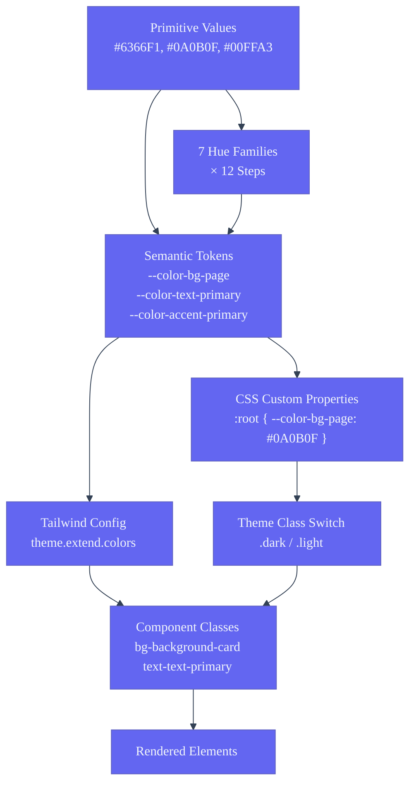
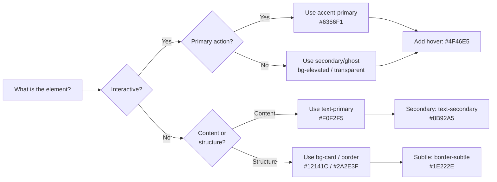

# Color System — Second Brain OS

| Field | Value |
|---|---|
| Document ID | DSG-CLR-001 |
| Version | 1.0.0 |
| Status | Approved |
| Date | 2026-07-10 |
| Classification | Internal |
| Owner | Design Engineering Team |

---

## 1. Executive Summary

The Second Brain OS color system is built on a cyberpunk-inspired dark-first palette with 7 hue families, 12-step luminance scales, and three-tier semantic token architecture. The system defines 45+ design tokens covering backgrounds, text, borders, accents, priorities, glass effects, and data visualization — all mapped through CSS custom properties for theme switching. The primary palette centers on indigo (#6366F1) for interactive elements, emerald neon (#00FFA3) for success states and decorative highlights, and rose (#EF4444 / #FF3366) for errors and urgent indicators. Every color pair targets WCAG AA contrast (4.5:1 minimum for normal text, 3:1 for large text).

---

## 2. Purpose

- Define the complete color token hierarchy from primitives to component-scoped values
- Document semantic color mappings for every UI concern (background, text, border, accent, priority, glass)
- Specify contrast ratio targets and validation methodology
- Establish color usage rules and anti-patterns
- Provide reference tables for all 70+ color values in the system

---

## 3. Scope

| In Scope | Out of Scope |
|---|---|
| Primitive color palette (7 hue families × 12 steps) | Brand logo color specifications |
| Semantic background, text, border, accent tokens | Print color specifications (CMYK) |
| Priority color system (urgent, high, medium, low) | User-customizable accent color themes |
| Glass and surface color tokens | Light theme color values (see DarkMode.md) |
| Data visualization color sequence (8 series) | Gradient definitions (see DesignTokens.md) |
| Color contrast ratios and WCAG compliance | Accessibility color-blind simulation methodology |
| Color token naming conventions | |

---

## 4. Business Context

Second Brain OS serves BTech CSE students who average 6+ hours daily in the application, often late at night. The color system must: (1) reduce eye strain with a dark, low-luminance foundation; (2) communicate information hierarchy at a glance through color; (3) create an immersive cyberpunk atmosphere that differentiates from generic productivity tools; and (4) meet WCAG 2.2 AA accessibility standards across all 18 modules. A consistent color language reduces cognitive load and enables users to pattern-match across modules, recognizing priority levels, status indicators, and interactive elements without reading labels.

---

## 5. Functional Specification

### 5.1 Color Token Architecture

```
Primitive Values (#HEX)
  │ maps to
Semantic Tokens (--color-bg-page, --color-text-primary)
  │ composes
Component Tokens (btn-primary-bg, card-border-default)
  │ overrides
Contextual Variants (:hover, :focus, :disabled, :active)
```

### 5.2 Primitive Color Palette

| Family | 50 | 100 | 200 | 300 | 400 | 500 | 600 | 700 | 800 | 900 | 950 |
|---|---|---|---|---|---|---|---|---|---|---|---|
| Neutral | #F8FAFC | #F1F5F9 | #E2E8F0 | #CBD5E1 | #94A3B8 | #64748B | #475569 | #334155 | #1E293B | #0F172A | #0A0B0F |
| Indigo | #EEF2FF | #E0E7FF | #C7D2FE | #A5B4FC | #818CF8 | #6366F1 | #4F46E5 | #4338CA | #3730A3 | #312E81 | #1E1B4B |
| Emerald | #ECFDF5 | #D1FAE5 | #A7F3D0 | #6EE7B7 | #34D399 | #10B981 | #059669 | #047857 | #065F46 | #064E3B | #022C22 |
| Amber | #FFFBEB | #FEF3C7 | #FDE68A | #FCD34D | #FBBF24 | #F59E0B | #D97706 | #B45309 | #92400E | #78350F | #451A03 |
| Rose | #FFF1F2 | #FFE4E6 | #FECDD3 | #FDA4AF | #FB7185 | #F43F5E | #E11D48 | #BE123C | #9F1239 | #881337 | #4C0519 |
| Cyan | #ECFEFF | #CFFAFE | #A5F3FC | #67E8F9 | #22D3EE | #06B6D4 | #0891B2 | #0E7490 | #155E75 | #164E63 | #083344 |
| Violet | #F5F3FF | #EDE9FE | #DDD6FE | #C4B5FD | #A78BFA | #8B5CF6 | #7C3AED | #6D28D9 | #5B21B6 | #4C1D95 | #2E1065 |

### 5.3 Semantic Color Mapping

#### Background Colors

| Token | Dark Value | Light Value | Tailwind Class | Purpose |
|---|---|---|---|---|
| `--color-bg-page` | #0A0B0F | #F8FAFC | `bg-background` | Page canvas |
| `--color-bg-dark` | #050607 | #F1F5F9 | `bg-background-dark` | Search input, dropdown panels |
| `--color-bg-card` | #12141C | #F1F5F9 | `bg-background-card` | Cards, sidebar, navbar |
| `--color-bg-elevated` | #1A1D28 | #FFFFFF | `bg-background-elevated` | Dropdowns, hovered items |
| `--color-bg-input` | #0D0F14 | #F8FAFC | `bg-background-input` | Input field backgrounds |

#### Text Colors

| Token | Dark Value | Light Value | Tailwind Class | Purpose |
|---|---|---|---|---|
| `--color-text-primary` | #F0F2F5 | #0F172A | `text-text-primary` | Headings, body copy |
| `--color-text-secondary` | #8B92A5 | #475569 | `text-text-secondary` | Subtext, metadata, captions |
| `--color-text-tertiary` | #5A6075 | #64748B | `text-text-tertiary` | Placeholders, muted content |
| `--color-text-inverse` | #0F172A | #FFFFFF | `text-text-inverse` | Text on accent backgrounds |
| `--color-text-disabled` | #475569 | #94A3B8 | `text-text-disabled` | Disabled element text |

#### Border Colors

| Token | Dark Value | Light Value | Tailwind Class | Purpose |
|---|---|---|---|---|
| `--color-border-default` | #2A2E3F | #CBD5E1 | `border-border` | Default component border |
| `--color-border-light` | #E2E8F0 | #E2E8F0 | `border-border-light` | Light mode separators |
| `--color-border-focus` | #6366F1 | #6366F1 | `border-border-focus` | Focus state border ring |
| `--color-border-subtle` | #1E222E | #E2E8F0 | `border-border-subtle` | Subtle separators, dividers |

#### Accent Colors

| Token | Value | Tailwind Class | Usage |
|---|---|---|---|
| `--color-accent-primary` | #6366F1 | `text-accent-primary` / `bg-accent-primary` | Primary actions, links, active states |
| `--color-accent-primary-hover` | #4F46E5 | `hover:bg-accent-primaryHover` | Primary button hover state |
| `--color-accent-secondary` | #10B981 | `text-accent-secondary` / `bg-accent-secondary` | Success indicators, positive states |
| `--color-accent-secondary-hover` | #059669 | `hover:bg-accent-secondaryHover` | Secondary button hover |
| `--color-accent-warning` | #F59E0B | `text-accent-warning` / `bg-accent-warning` | Warning states, attention needed |
| `--color-accent-warning-hover` | #D97706 | `hover:bg-accent-warningHover` | Warning hover state |
| `--color-accent-error` | #EF4444 | `text-accent-error` / `bg-accent-error` | Error states, destructive actions |
| `--color-accent-error-hover` | #DC2626 | `hover:bg-accent-errorHover` | Error hover state |
| `--color-accent-info` | #3B82F6 | `text-accent-info` / `bg-accent-info` | Information badges, tooltips |
| `--color-accent-success` | #22C55E | `text-accent-success` / `bg-accent-success` | Positive indicators, completion |
| `--color-accent-neon` | #00FFA3 | `text-accent-neon` / `bg-accent-neon` | Decorative highlights, low priority |
| `--color-accent-cyber` | #FF3366 | `text-accent-cyber` / `bg-accent-cyber` | Urgent indicators, critical alerts |

#### Priority Colors

| Token | Value | Tailwind Class | Usage |
|---|---|---|---|
| `--color-priority-urgent` | #FF3366 | `text-priority-urgent` / `bg-priority-urgent` | Urgent tasks, critical alerts |
| `--color-priority-high` | #FF6B35 | `text-priority-high` / `bg-priority-high` | High priority items |
| `--color-priority-medium` | #FFB800 | `text-priority-medium` / `bg-priority-medium` | Medium priority items |
| `--color-priority-low` | #00FFA3 | `text-priority-low` / `bg-priority-low` | Low priority items, optional |

#### Glass Opacity Colors

| Token | Value | Tailwind Class | Usage |
|---|---|---|---|
| `--color-glass-light` | rgba(255,255,255,0.03) | `bg-glass-light` | Subtle glass morphism base |
| `--color-glass-medium` | rgba(255,255,255,0.08) | `bg-glass-medium` | Card glass, frosted panels |
| `--color-glass-heavy` | rgba(255,255,255,0.15) | `bg-glass-heavy` | Highlighted glass, active overlays |

---

## 6. Non-Functional Requirements

| Requirement | Target | Verification |
|---|---|---|
| Normal text contrast (body) | >= 4.5:1 (WCAG AA) | axe-core CI scan |
| Large text contrast (18px+ bold / 24px+ regular) | >= 3:1 (WCAG AA) | axe-core CI scan |
| UI component contrast (borders, icons) | >= 3:1 (WCAG AA) | Contrast checker tool |
| Focus indicator contrast | >= 3:1 against adjacent | Focus ring audit |
| Disabled element contrast | >= 3:1 against background | Visual inspection |
| Color token count | <= 70 token definitions | Token count script |
| Hardcoded color value count | 0 in production code | `npm run token:check` |

---

## 7. Architecture



---

## 8. Diagrams

### 8.1 Color Decision Flow



### 8.2 Contrast Ratio Validation

| Foreground | Background | Ratio | WCAG AA | WCAG AAA |
|---|---|---|---|---|
| #F0F2F5 (text-primary) | #0A0B0F (bg-page) | 14.2:1 | ✅ | ✅ |
| #8B92A5 (text-secondary) | #0A0B0F (bg-page) | 7.1:1 | ✅ | ✅ |
| #5A6075 (text-tertiary) | #0A0B0F (bg-page) | 4.6:1 | ✅ | ❌ |
| #6366F1 (accent-primary) | #0A0B0F (bg-page) | 5.8:1 | ✅ | ❌ |
| #FFFFFF (text-inverse) | #6366F1 (accent-primary) | 4.5:1 | ✅ | ❌ |
| #00FFA3 (accent-neon) | #0A0B0F (bg-page) | 12.1:1 | ✅ | ✅ |
| #475569 (text-disabled) | #0A0B0F (bg-page) | 3.2:1 | ❌ | ❌ |
| #F0F2F5 (text-primary) | #12141C (bg-card) | 13.8:1 | ✅ | ✅ |
| #F0F2F5 (text-primary) | #1A1D28 (bg-elevated) | 12.4:1 | ✅ | ✅ |

---

## 9. Data Models

### 9.1 Color Token Schema

```typescript
interface ColorToken {
  name: string           // e.g., 'accent-primary'
  category: 'background' | 'text' | 'border' | 'accent' | 'priority' | 'glass' | 'surface' | 'chart'
  darkValue: string      // Hex or rgba for dark theme
  lightValue: string     // Hex or rgba for light theme
  tailwindClass: string  // e.g., 'bg-accent-primary'
  cssVar: string         // e.g., '--color-accent-primary'
  usage: string          // Description
  contrastRatio?: string // Against primary background
}
```

### 9.2 Color Token Naming Convention

```
{category}-{modifier}-{variant}
│         │           │
│         │           └── hover, focus, active, disabled
│         └────────────── primary, secondary, tertiary, default, subtle, light, heavy
└──────────────────────── bg, text, border, accent, priority, glass, surface, chart
```

---

## 10. APIs

### 10.1 CSS Custom Properties

All color tokens are exposed as CSS custom properties on `:root` / `.dark`:

```css
.dark {
  --background: #0A0B0F;
  --background-card: #12141C;
  --text-primary: #F0F2F5;
  --accent-primary: #6366F1;
  --border: #2A2E3F;
}
```

### 10.2 Tailwind Usage

```tsx
// Direct token usage via Tailwind classes
<div className="bg-background-card text-text-primary border-border" />
<button className="bg-accent-primary text-text-inverse" />
<span className="text-accent-warning">Warning</span>
```

### 10.3 Inline CSS Variable Access

```tsx
// Access tokens directly for dynamic styling
<div style={{ color: 'var(--accent-primary)' }}>
  Dynamic accent color
</div>
```

---

## 11. Security

- Color tokens are non-sensitive (classification: Public)
- No color token reveals internal state, user data, or credentials
- CSS custom properties are accessible client-side by design
- No security concerns related to color values

---

## 12. Performance Targets

| Metric | Target |
|---|---|
| CSS custom property definitions | < 70 properties |
| Token resolution time | < 1ms per lookup |
| Hardcoded color violations in CI | 0 |
| Color computation in JS | < 5ms per operation |
| Contrast validation CI scan | < 30s for full run |

---

## 13. Edge Cases

| Edge Case | Behavior |
|---|---|
| CSS variable not defined on element | Falls back to hardcoded value in `var(--color, #fallback)` |
| User-defined high contrast mode | Override via `.high-contrast` class with stricter ratios |
| Color-blind user (deuteranopia) | Do not rely on color alone — always pair with icon/label |
| 200% browser zoom | All contrast ratios remain valid (no color shifts) |
| Forced colors mode (Windows) | Respect `forced-colors: active` media query |
| Custom accent color selected | Swap only `--color-accent-*` tokens, keep all others |
| Transparency in PNG export | Alpha channel preserved for glass effects |

---

## 14. Failure Scenarios

| Scenario | Mitigation |
|---|---|
| CSS variable undefined | Fallback chain: `var(--color, #default)` in every property |
| Theme class not applied | Default `.dark` class set in inline `<script>` before hydration |
| New component introduces hardcoded color | CI `token:check` scan catches and fails build |
| Color contrast fails on new token pair | CI contrast scanner compares against 4.5:1 threshold |

---

## 15. Risks & Mitigations

| Risk | Likelihood | Impact | Mitigation |
|---|---|---|---|
| Token proliferation (too many colors) | Medium | Medium | Quarterly audit; merge similar values |
| Regressions from theme changes | Low | High | Storybook visual regression on every PR |
| Color-blind inaccessible combinations | Medium | High | Never use color alone; pair with icon, label, or pattern |

---

## 16. Acceptance Criteria

- [ ] All 45+ semantic color tokens defined with dark and light values
- [ ] Every semantic token has a Tailwind utility class
- [ ] All text/background pairs meet WCAG AA 4.5:1 minimum
- [ ] `npm run token:check` passes with zero hardcoded color violations
- [ ] Priority color system implemented across all 18 modules
- [ ] Glass opacity tokens applied to modal, card, and overlay components
- [ ] Chart color sequence provides 8 distinct, accessible series colors
- [ ] Color token naming convention documented and enforced in code review

---

## 17. Traceability

| Related Document | Link |
|---|---|
| Design Tokens | `docs/design/35_DesignTokens.md` |
| Design System | `docs/design/10_DesignSystem.md` |
| Dark Mode | `docs/design/DarkMode.md` |
| Typography | `docs/design/Typography.md` |
| Accessibility | `docs/design/FrontendAccessibilityGuide.md` |
| Tailwind Config | `apps/web/tailwind.config.js` |
| CSS Globals | `apps/web/app/globals.css` |

---

## 18. Implementation Notes

- All colors defined as CSS custom properties in `globals.css` under `@layer base`
- Referenced in `tailwind.config.js` via `var(--token)` syntax
- Never use hex values directly in component code — always reference Tailwind classes
- Use `color-mix(in oklab, var(--accent-primary) 10%, transparent)` for dynamic opacity
- Avoid hardcoding hex colors in JavaScript — use CSS variables through Tailwind
- New color tokens must be added to both `globals.css` and `tailwind.config.js`
- Run `npm run token:check` after any color change

---

## 19. Testing Strategy

| Test Type | Scope | Tool |
|---|---|---|
| Contrast compliance | All token pairs against WCAG AA | axe-core CI scan |
| Token reference integrity | Every CSS var has class mapping | Custom CI script |
| Color drift | No unintended color changes | Storybook visual regression |
| Color-blind accessibility | All state indicators use icon + color | Manual audit quarterly |
| Theme switching | All colors swap correctly | Playwright screenshot diff |

---

## 20. References

| Reference | URL |
|---|---|
| WCAG 2.2 Contrast Minimum | https://www.w3.org/TR/WCAG22/#contrast-minimum |
| CSS Color Module Level 4 | https://www.w3.org/TR/css-color-4/ |
| color-mix() Function | https://developer.mozilla.org/en-US/docs/Web/CSS/color_value/color-mix |
| Tailwind CSS Custom Colors | https://tailwindcss.com/docs/customizing-colors |
| Coolors Color Palette Generator | https://coolors.co/ |
