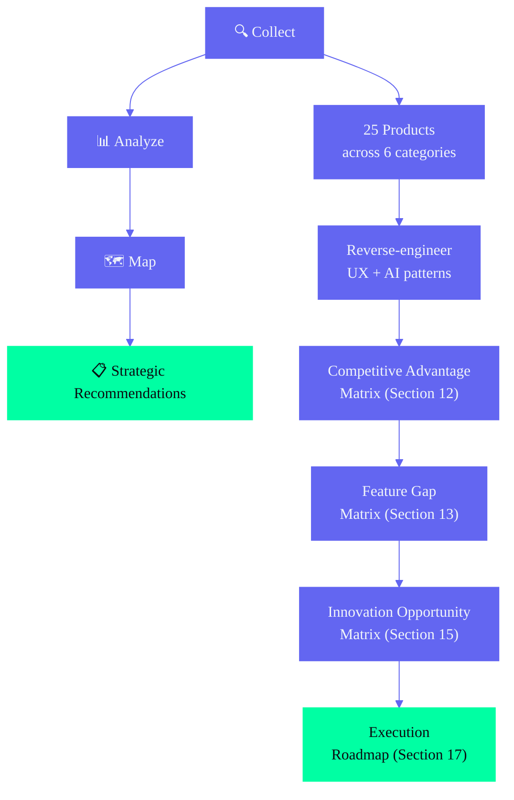

# Competitive Intelligence Research Report

> **Part of the Second Brain OS architecture suite.**
> For the full Product Architecture, see [ProductArchitecture.md](./ProductArchitecture.md).
> For the Enterprise Frontend Discovery Report, see [Enterprise_Frontend_Discovery_Report_v3.md](./Enterprise_Frontend_Discovery_Report_v3.md). — Second Brain OS (ARIA OS)

---

## Document Control

| Field | Value |
|---|---|
| Document ID | SB-CI-001 |
| Version | 1.0.0 |
| Status | Active |
| Classification | Internal — Strategy & Product Reference |
| Target Audience | Product Managers, Designers, Frontend Engineers, AI Engineers |
| Last Updated | 2026-06-11 |
| Review Cycle | Quarterly |
| Total Sections | 17 |
| Products Analyzed | 25 |
| Design Systems Analyzed | 8 |

---

## Table of Contents

1. [Executive Summary](#1-executive-summary)
2. [Product Philosophy Analysis](#2-product-philosophy-analysis)
3. [Navigation & Information Architecture](#3-navigation--information-architecture)
4. [Dashboard Architecture](#4-dashboard-architecture)
5. [Search & Command Palette](#5-search--command-palette)
6. [AI & Agentic UX Patterns](#6-ai--agentic-ux-patterns)
7. [Task & Knowledge Workflows](#7-task--knowledge-workflows)
8. [Analytics & Data Visualization](#8-analytics--data-visualization)
9. [Notification & Attentive UX](#9-notification--attentive-ux)
10. [Mobile, Tablet & Desktop Patterns](#10-mobile-tablet--desktop-patterns)
11. [Design System Comparisons](#11-design-system-comparisons)
12. [Competitive Advantage Matrix](#12-competitive-advantage-matrix)
13. [Feature Gap Matrix](#13-feature-gap-matrix)
14. [UX Gap Matrix](#14-ux-gap-matrix)
15. [Innovation Opportunity Matrix](#15-innovation-opportunity-matrix)
16. [Recommended Enterprise UX Patterns for ARIA OS](#16-recommended-enterprise-ux-patterns-for-aria-os)
17. [Execution Roadmap](#17-execution-roadmap)

---



---

## 1. Executive Summary

### 1.1 Purpose

This report reverse-engineers 25 products across 6 categories (productivity, knowledge management, AI, analytics, developer platforms, design systems) to extract actionable UX, AI, and enterprise patterns for Second Brain OS (ARIA OS). The goal is not to copy competitors but to create a superior enterprise-grade AI operating system by adopting the best patterns, improving on industry weaknesses, and exploiting gaps competitors have missed.

### 1.2 Key Findings

**ARIA OS has a genuine competitive moat in three areas:**
1. **Student-specific depth** — Courses, CGPA, semester planning, hackathon radar, exam countdown — no competitor offers these
2. **Cross-domain integration** — Course → Skill → Project → Income flow is structurally impossible for single-domain tools to replicate
3. **Zero-cost local AI** — Ollama on student laptops with algorithmic fallback creates a privacy + cost advantage VC-backed competitors cannot match

**Biggest UX gaps versus best-in-class:**
1. **Command palette** (Linear: Cmd+K, local search, p95 <60ms) — not implemented
2. **Keyboard shortcuts** (Linear: every action has shortcut, two-key navigation) — not implemented
3. **Notification management** (Linear: Inbox, Pulse, snooze, tiering) — basic push only
4. **Search** (Linear: hybrid semantic, fuzzy, operators) — basic Supabase full-text
5. **Mobile experience** (Linear: custom Liquid Glass, full keyboard) — basic PWA

### 1.3 Products Analyzed

| Category | Products |
|---|---|
| **Productivity** | Linear, ClickUp, Motion, Sunsama, Asana, Monday.com |
| **Knowledge Management** | Notion, Obsidian, Capacities, Reflect, Anytype, Mem |
| **AI** | ChatGPT, Claude, Cursor, Perplexity, Glean, Devin |
| **Analytics** | Stripe, PostHog, Datadog, Mixpanel |
| **Developer Platforms** | GitHub, Vercel, Supabase |
| **Design Systems** | shadcn/ui, IBM Carbon, Material Design 3, MagicUI, Aceternity, 21st.dev, Origin UI, Ant Design |

---

## 2. Product Philosophy Analysis

### 2.1 Philosophy Inventory

| Product | Core Philosophy | Tagline | Designer Ethos |
|---|---|---|---|
| **Linear** | Quality-first, opinionated, keyboard-driven | "Software used to be a craft" | Every feature is a deliberate choice, not a compromise |
| **Notion** | Composability over features | "We don't build tools — we give users building blocks" | Blocks as LEGO; post-file, post-MS Office world |
| **Obsidian** | Radical data ownership | "Your data is just a folder of Markdown files" | Zero dependency, future-proof, user sovereignty |
| **Capacities** | Object-based thinking | "What kind of thing is this?" | Structured capture without rigidity |
| **ChatGPT** | Capability-first Swiss Army knife | "Bring your ideas to life" | Broad but shallow; confident motivator |
| **Claude** | Depth-first focused workspace | "Helpful, harmless, honest" | Deep but focused; philosophical consultant |
| **Stripe** | Clarity above all | "Financial infrastructure for the internet" | One brand color, surgical restraint, premium comes from what they chose NOT to do |
| **PostHog** | Self-serve Product OS | "No sales calls required" | Everything in one interface, transparent pricing |
| **Cursor** | AI-native development | "The AI-first code editor" | Inline AI as primary interface, not add-on |
| **Vercel** | Performance obsession | "Develop, preview, ship" | Frontend cloud with developer experience as product |

### 2.2 Key Insights for ARIA OS

ARIA occupies a unique position — it's not just a tool but an operating system for the student's entire life. The product philosophy should be:

> **"Your second brain should be faster than your first."**

This means:
- **Speed**: Sub-100ms interactions, local-first data, instant optimistic updates
- **Intelligence**: Proactive AI that pushes insights before being asked
- **Proactivity**: System works for the user, not the other way around
- **Compound growth**: Every action feeds every other action, creating accelerating returns

### 2.3 Anti-Patterns to Avoid

| Anti-Pattern | Example | Why to Avoid |
|---|---|---|
| **Feature bloat** | ClickUp (too many features, confusing) | Increases cognitive load, hurts discoverability |
| **Over-automation** | Motion (AI schedules everything, user loses control) | Users must feel in control, not managed |
| **Obedient hallucination** | ChatGPT (agrees with wrong user input) | Must push back with evidence |
| **Generic AI aesthetics** | Bubble/sparkle icons for AI features | Creates generic brand perception |
| **Siloed intelligence** | Notion AI (Q&A only within pages) | Limits cross-domain pattern detection |
| **Desktop-first mobile** | Monday.com (mobile is an afterthought) | Mobile is primary for capture and check-in |

---

## 3. Navigation & Information Architecture

### 3.1 Navigation Models Compared

| Product | Model | Primary Nav | Secondary Nav | Power User Nav |
|---|---|---|---|---|
| **Linear** | Inverted-L | Collapsible sidebar (dims on destination) | Horizontal header tabs | Two-key go-to (G+I, G+P), Cmd+K |
| **Notion** | Page-as-folder | 224px sidebar, infinite nesting, toggles | Home tab with customizable sections | Cmd+P search, pages as parents |
| **Obsidian** | IDE-style | Dual sidebars (file explorer + backlinks) | Ribbon, tabbed editor | Cmd+O Quick Switcher, Cmd+P commands |
| **Capacities** | Studio-style | Left sidebar (spaces + types) | Right sidebar (search + properties) | Object-type breadcrumb, floating FAB |
| **Stripe** | Fixed sidebar | 240-280px sidebar with icons + labels | Icon-only on mobile (48px) | `?` key for help/shortcuts, search primary |
| **PostHog** | Grouped sidebar | Sidebar with logical section headers | Search bar | Natural language query |
| **ChatGPT** | Minimal sidebar | Conversation list + settings | Projects as scoped search | Cmd+K for sidebar search |
| **Vercel** | Project-centric | Left sidebar (projects, deployments, settings) | Top bar (environment, branch) | Cmd+K command palette |

### 3.2 Key Innovations to Adopt

**1. Linear's Receding Sidebar**
- Sidebar dims (opacity 0.5) after destination reached
- Focus shifts to content area automatically
- Users feel the sidebar "getting out of the way"
- Implementation: `sidebar opacity → 0.5 after 500ms of inactivity in content area, back to 1.0 on hover`

**2. Linear's Two-Key Navigations**
- G+I → Inbox, G+P → Projects, G+T → Teams
- Vim-inspired sequential keybinding
- Learned organically through Cmd+K shortcut display
- For ARIA: G+D → Dashboard, G+T → Tasks, G+C → Courses, G+H → Habits, G+S → Sleep

**3. Capacities' Object-Type Breadcrumb**
- Always shows "where you are" in the type hierarchy
- Clickable segments for navigation
- Example: `Tasks > Active > DBMS Assignment`
- Prevents lost-in-deep-navigation syndrome

**4. Notion's Page-as-Folder**
- No separate folder structure — nesting creates hierarchy
- Any page can become a parent by adding child pages
- Reduces structural overhead
- For ARIA: Goals can contain Tasks and Courses; Projects can contain Tasks and Ideas

**5. Stripe's Sidebar Collapse**
- Expands to 240px with icons + labels on desktop
- Collapses to 48px (icon-only) on tablet/small desktop
- Smooth transition, no sudden layout shifts

### 3.3 Recommended Navigation Model for ARIA OS

```
Level 1 — Permanent: Collapsible sidebar (240px → 64px icon-only)
Level 2 — Contextual: Tab bar within module (list/kanban/calendar/detail)  
Level 3 — Power User: Cmd+K palette + Two-key shortcuts (G+T, G+C, G+H)

Sidebar sections:
1. ARIA OS Logo + Workspace name
2. Search / Quick Capture (always visible, pinned)
3. PINNED: Dashboard, Tasks, Chat with ARIA
4. DAILY: Daily Briefing, Opportunities (badge counts)
5. MODULES: Courses, Goals, Projects, Ideas, Resources, YouTube, Habits, Sleep, Income, Time, Academics  
6. SYSTEM: Automation, Settings
```

---

## 4. Dashboard Architecture

### 4.1 Dashboard Approaches Compared

| Product | Default View | Layout | Data Density | Key Innovation |
|---|---|---|---|---|
| **Linear** | Inbox (not a dashboard) | Insights + Pulse + Dashboards | Low-Medium | "Keep your own score" — pair every metric with comparison context |
| **Stripe** | Card-less KPI strip | 4-6 metrics top, charts middle, tables bottom | Medium-High | Hierarchy from shadows/borders, not surface colors |
| **PostHog** | Customizable insight grid | Text cards, button tiles, AI analysis | High | 7 insight types, AI analyzes changes on refresh |
| **Notion** | Home tab (customizable sections) | Upcoming, Recents, Favorites, Agents | Low-Medium | User chooses what to see |

### 4.2 Key Innovations to Adopt

**1. Stripe's Card-Less KPI Strip**
- 4-6 glanceable metrics at the top
- No card containers — just numbers with labels and trend arrows
- Hierarchy from spacing, typography weight, and subtle borders
- For ARIA: Productivity Score (▲5%), Tasks Today (3), Sleep Score (78), Opportunities (+2), Course Progress (65%), Income Rate (₹250/hr)

**2. Linear's "Pair Every Key Metric with Comparison Context"**
- Every number shows "vs last week" trend
- "This week vs last week" on every chart
- Prevents misleading absolute numbers without context

**3. PostHog's AI Refresh Analysis**
- When dashboard data refreshes, AI highlights what changed
- "Your productivity score increased 8% this week — primarily driven by task completion rate (+12%)"
- Turns raw data into narrative insights

**4. Time-of-Day Adaptive Dashboard**
- Morning (7-10 AM): Briefing focused, sleep score, today's tasks
- Midday (10 AM-4 PM): Task progress, course nudge, quick capture visible
- Evening (4-9 PM): Remaining tasks, wind-down suggestion, tomorrow preview
- Night (9 PM+): Sleep log prompt, reflection question
- Weekend: Weekly review link, goal planning, course catch-up

### 4.3 Recommended Dashboard for ARIA OS

```
┌──────────────────────────────────────────────────────────────────┐
│  🌅 GOOD MORNING, AARAV — Sleep 78 · 3 tasks today · 1 opp     │ ← ARIA greeting + status
├──────────────────────────────────────────────────────────────────┤
│  72  │  3/8   │  78  │  +2   │  65%  │  ₹250/hr               │ ← Stripe-style KPI strip
│  ▲5% │  Tasks │ Sleep│  Opps │ Course│  Income                 │
├─────────────────────┬──────────────────────┬────────────────────┤
│  TODAY'S FOCUS       │  COURSE TARGET        │  TOMORROW PREVIEW  │
│  3 Priority Tasks    │  Node.js: 45min/day   │  1 deadline        │
│  + Time blocks       │  40% behind           │  2 tasks           │
│                      │  Daily: 30min ☐☐☐    │                     │
├─────────────────────┴──────────────────────┴────────────────────┤
│  ACTIVITY (7-day) ████░░░░░░  Productivity trend — week view   │
│  HEATMAP (6-month) [GitHub-style grid] — click for daily view  │
└──────────────────────────────────────────────────────────────────┘
```

---

## 5. Search & Command Palette

### 5.1 Search Architectures Compared

| Product | Search Type | Performance | Key Innovation |
|---|---|---|---|
| **Linear** | Hybrid semantic (AI vectors + keyword) | p95 <60ms — searches local MobX pool | Local data search, not API. Two-key go-to + Cmd+K |
| **Notion** | Full-text + operator syntax | Server search | `from:@user`, `in:Page`, `tag:Tag` operators |
| **Obsidian** | Full-text with regex + file type filters | Local (instant) | Quick Switcher creates files if not found |
| **Stripe** | Universal across all resources | Server search | `?` key opens help, Copy Object ID (Cmd+I) |
| **PostHog** | Natural language queries | AI + SQL | "Why has traffic decreased?" → SQL → insight |

### 5.2 Key Innovations to Adopt

**1. Linear's Local-First Search Architecture**
- Searches local data (MobX pool in Linear, IndexedDB for ARIA), not API
- P95 <60ms — feels instant
- Falls back to server search for full-text content
- For ARIA: Search IndexedDB first (tasks, courses, goals), then Supabase full-text

**2. Linear's Hybrid Semantic Search**
- AI vectors + keyword matching
- "Find what I mean, not what I type"
- Fuzzy matching for typos (Dambase → Database)
- `"phrase"` for exact match, `-negate` to exclude, `AND` for conjunction

**3. Notion's `/` Command System**
- Create any item from any context via slash
- 150+ block types accessible via `/`
- For ARIA: `/task` "Complete DBMS assignment", `/idea` "AI study buddy", `/course` "Node.js"

**4. Linear's Shortcut Discovery**
- Every Cmd+K command shows its keyboard shortcut
- Users learn shortcuts organically through use
- No separate "learn shortcuts" page needed

### 5.3 Recommended Search Model for ARIA OS

```
Global: Cmd+K — searches ALL modules
  → Fuzzy title match (typo tolerant)
  → Full-text content match (scoped to recent/active items)
  → Natural language: "react articles from 3 months ago"
  → Operators: from:ARIA, tag:WebDev, in:Tasks, before:2026-07-01
  → Actions: /new task, /new idea, /chat, /goto Dashboard
  
Module: Cmd+F within current module
  → Filters list in real-time
  → Supports same operators, scoped to module
  
Quick: / from any context
  → /task "Complete DBMS assignment"
  → /idea "AI-powered study buddy"  
  → /course "Node.js" + deadline:2weeks
  → /chat "What's my day look like?"
```

---

## 6. AI & Agentic UX Patterns

### 6.1 AI Integration Compared

| Product | AI Integration | Initiation | Key Innovation |
|---|---|---|---|
| **ChatGPT** | Mode selection + streaming + voice | User asks | Control surface composer (pick mode/tools before asking), typewriter streaming |
| **Claude** | Extended Thinking + Artifacts | User asks | Thinking display (watch reasoning build trust), Artifacts as renderable panels |
| **Cursor** | Inline AI in IDE | User types | Tab to accept, @-mention context, inline suggestions that don't disrupt flow |
| **Notion AI** | In-editor blocks + Q&A + Custom Agents | User asks + scheduled | AI output as native blocks, "Nosy" character, 20-min agent memory |
| **Perplexity** | Source-backed answers | User asks | Status phases (searching → reading → writing), inline citations build trust |
| **Glean** | Enterprise AI search across 100+ connectors | User asks + proactive | Permission-aware cross-app search, proactive knowledge surfacing |
| **Devin** | Autonomous SWE agent | User task | Full autonomous execution, IDE + browser + terminal control |

### 6.2 Key Innovations to Adopt

**1. Claude's Extended Thinking Display**
- Show ARIA's reasoning process: "Thinking...", "Researching...", "Analyzing...", "Writing..."
- Builds calibrated trust — user can see how ARIA arrived at an answer
- For ARIA: "Checking your tasks... Analyzing your sleep score... Reviewing course deadlines..."

**2. ChatGPT's Mode Selection**
- Let users set context before asking: Plan, Execute, Learn, Reflect
- Mode sets temperature, system prompt, and tool availability
- For ARIA: "I want to..." → Plan (strategic), Do (task execution), Learn (course material), Review (retrospective)

**3. Cursor's Inline Suggestions**
- AI suggests actions without disrupting current flow
- Tab to accept, Escape to dismiss
- For ARIA: Inline task suggestions when typing in chat, inline resource links when working on a course

**4. Notion's AI-as-Native-Blocks**
- AI responses embed action buttons, task cards, progress bars directly
- Not plain text — interactive UI components
- For ARIA: Briefing cards with checkable tasks, opportunity cards with "Save" button, progress bars with "Log" action

**5. Perplexity's Source Grounding**
- Every AI response includes "Why this matches you" with specific evidence
- Source-grounded answers build trust
- For ARIA: "This opportunity matches your Node.js skill (80% overlap) and Web Development interest"

**6. Claude's Artifacts**
- Separate renderable panels for code, charts, roadmaps, tables
- Kept separate from conversation for clarity
- For ARIA: Weekly review as a rendered document, skill tree as an interactive visualization

### 6.3 Confidence Disclosure Patterns

| AI Confidence | Visual Treatment | User Action |
|---|---|---|
| >90% | Solid state, no indicator | Auto-accept, undo available |
| 70-90% | Subtle "AI suggested" badge | Quick accept/dismiss |
| 50-70% | "Maybe?" indicator + alternatives shown | Review required |
| <50% | Gray, "Couldn't determine" message | Manual input required |
| Error | Red state, fallback value shown | User must correct |

### 6.4 Progressive AI Reveal

| Day | AI Feature Revealed | Trigger |
|---|---|---|
| 1 | Quick Capture type detection | First capture |
| 2 | Task priority suggestion | First task creation |
| 3 | Morning Briefing | 7 AM next day |
| 5 | Course study task auto-generation | First course added |
| 7 | Opportunity Radar | First week scan |
| 10 | AI chat (ARIA) | User visits /chat |
| 14 | Memory extraction | 2+ weeks of data |
| 21 | Pattern detection | 3+ weeks of data |
| 30 | Weekly Review | First full month |

### 6.5 Multi-Agent Orchestration UX

When ARIA dispatches multiple agents for a single user request:

```
User: "What should I focus on today?"
     ↓
ARIA dispatches: Planner + Sleep + Learning + Opportunity (parallel)
     ↓
Results merge into single briefing response
     ↓
User sees: Unified response with agent attribution
           "📋 Tasks (Planner): 3 priority tasks — DBMS assignment due tomorrow"
           "😴 Sleep (Sleep Agent): Score 78 — light day scheduled"
           "📚 Courses (Learning Agent): Node.js — behind by 2 days"
           "🎯 Opportunities (Radar): 2 new matches >80%"
```

### 6.6 Opportunities Competitors Missed

| Missed Opportunity | ARIA OS Advantage |
|---|---|
| **Proactive daily briefing combining tasks, courses, sleep, and opportunities** | No competitor combines all 4 in one daily push |
| **Sleep-adjusted UI** — interface adapts to cognitive state | No competitor adjusts task scheduling or UI density based on sleep |
| **Cross-domain pattern detection** — "Your sleep drops when you study after 11 PM" | Data silos prevent competitors from making cross-domain correlations |
| **Learning → Skill → Opportunity pipeline** | No competitor connects course completion to skill updates to opportunity matching |
| **Course deadline auto-detection with daily study target** | No competitor calculates daily minutes needed across multiple courses |

---

## 7. Task & Knowledge Workflows

### 7.1 Task Workflows Compared

| Product | Creation Speed | Prioritization | Rescheduling | Knowledge Integration |
|---|---|---|---|---|
| **Linear** | <10s (keyboard) | Cycles + Labels + Auto | Auto-rollover incomplete work | Documents in projects, AI summaries |
| **Notion** | Varies (database) | Manual priority column | Manual | Block-based, bi-directional links, AI Q&A |
| **Obsidian** | `- [ ]` in notes | Plugins (Dataview) | Manual | Graph view, bi-directional links, Zettelkasten |
| **Capacities** | Daily note as inbox | Property-based | Manual | Object-based, typed entities, Related Content |
| **Sunsama** | Bounded daily lists | Daily planning ritual | End-of-day move | Daily ritual + PDF weekly review |
| **Motion** | AI auto-schedule | AI priority + deadline | AI auto-reschedule | Calendar-first |

### 7.2 Key Innovations to Adopt

**1. Linear's Keyboard-Driven Task Creation**
- Cmd+K → type → assign → create in <10s
- Every field accessible via keyboard
- No mouse required for the most common action

**2. Sunsama's Bounded Daily Lists**
- Show only what's achievable today, not everything overdue
- End-of-day ritual: move unfinished, review accomplishments, plan tomorrow
- Prevents overwhelm and guilt-driven task avoidance

**3. Motion's AI Scheduling**
- AI suggests time blocks based on task priority, energy level, and available time
- Re-prioritizes based on deadlines and dependencies
- For ARIA: Sleep-adjusted scheduling — low sleep → lighter tasks pushed to top

**4. Notion's Multiple Database Views**
- Same underlying data viewed as list, kanban, calendar, timeline, table
- Users choose the view that matches their mental model
- For ARIA: Tasks as list (default), kanban (by status), calendar (by due date), timeline (by priority)

**5. Obsidian's Bi-Directional Linking**
- Every item shows backlinks and unlinked mentions
- Related content surfacing without explicit linking
- For ARIA: "This task is linked to: Node.js Course, Full-Stack Goal — Also related: 2 resources you saved"

### 7.3 Zero-Miss Policy

Adapted from Linear's auto-rollover and Sunsama's bounded lists:

```
Every overdue task must be in one of three states:
1. DONE — completed before or after deadline
2. RESCHEDULED — new due date set with reason
3. DROPPED — explicitly abandoned with reason logged

No task disappears. No task silently remains overdue.
```

---

## 8. Analytics & Data Visualization

### 8.1 Analytics Approaches Compared

| Product | Data Model | Visualization Types | Key Innovation |
|---|---|---|---|
| **Stripe** | Apache Pinot (OLAP), p99 query 70ms | KPI strip, line/bar/area charts | Clarity above all: show calculations step-by-step, human-readable labels |
| **PostHog** | Events + Properties | 7 insight types: Trends, Funnels, Retention, Paths, Stickiness, Lifecycle, SQL | Multiple lenses on same data, AI refresh analysis |
| **Datadog** | Metrics + Logs + Traces | Correlated dashboard widgets | Dashboard-as-command-center, status indicators on every widget |
| **Mixpanel** | User events | Flows (visual path analysis), Signal (AI anomaly) | Flows for path visualization, Signal for automatic insight discovery |

### 8.2 Key Innovations to Adopt

**1. PostHog's Multiple Lenses**
- Same data viewed as different chart types reveals different patterns
- Trends (over time), Funnels (conversion), Retention (returning), Paths (user journeys), Stickiness (frequency), Lifecycle (new vs returning)
- For ARIA: Productivity as trends (daily score), funnels (task creation → completion), retention (weekly returning), paths (module navigation)

**2. Stripe's Surgical Use of Accent**
- Charts use ONE accent color (#6366F1 for ARIA), not rainbow palettes
- Secondary data points use muted variants
- Creates clarity and professional appearance

**3. Datadog's Correlated Views**
- Side-by-side visualization of related metrics
- Sleep vs productivity, tasks vs time, income vs skill
- Enables pattern discovery without explicit correlation queries

**4. PostHog's Notebooks**
- Compile multiple insights + AI commentary into a narrative
- For ARIA: Weekly review as a notebook — chart + AI analysis + action items

**5. Mixpanel's Flows**
- Visual path analysis showing how users navigate
- For ARIA: See how users flow between modules (Dashboard → Tasks → Courses)

### 8.3 Chart Design Tokens

```css
/* All charts use these tokens for consistent branding */
--chart-line: #6366F1;
--chart-area: rgba(99, 102, 241, 0.1);
--chart-bar: #818CF8;
--chart-point: #00FFA3;
--chart-grid: #1E293B;
--chart-axis: #475569;
--chart-series-1: #6366F1;
--chart-series-2: #10B981;
--chart-series-3: #F59E0B;
--chart-series-4: #EF4444;
--chart-series-5: #8B5CF6;
--chart-series-6: #EC4899;
```

---

## 9. Notification & Attentive UX

### 9.1 Notification Models Compared

| Product | Channels | Inbox | Tiering | Key Innovation |
|---|---|---|---|---|
| **Linear** | Push + Email + Slack | Inbox as default view | Interrupt / Ambient / Digest | Snooze, Pulse (batched 7AM), custom feeds |
| **PostHog** | Slack primary | No dedicated inbox | Insight subscriptions | AI anomaly alerts as Slack messages |
| **ChatGPT** | Push + Email | Sidebar notification center | Per-type toggle | Quiet hours configurable |

### 9.2 Key Innovations to Adopt

**1. Linear's Inbox Model**
- Single notification hub for all modules
- Group by module, snooze, mark read/unread
- For ARIA: Notification center in sidebar with module filters

**2. Linear's Pulse for Async Updates**
- Batched daily summary arrives at 7 AM before work starts
- Not everything needs real-time delivery
- For ARIA: Pulse as the Daily Briefing — batched push at 7 AM with all non-urgent updates

**3. Linear's Notification Tiering**
- **Interrupt**: Assigned, @mentioned, deadline < 2h (immediate push)
- **Ambient**: Status changes, comments (toast in-app, batched push)
- **Digest**: Reactions, team activity (Pulse only, once daily)

**4. Work State Model**
- **Focus**: Only critical interrupts, all else batched
- **Available**: Default — ambient + interrupt allowed
- **Review**: End-of-day — show all activity as digest

**5. Sleep-Aware Quiet Hours**
- Auto-enable Focus mode when sleep score is low
- Default quiet hours: 11 PM - 7 AM
- Only critical notifications (deadline < 2h, task missed 3x) pass through

---

## 10. Mobile, Tablet & Desktop Patterns

### 10.1 Multi-Device Strategy Comparison

| Product | Mobile | Tablet | Desktop |
|---|---|---|---|
| **Linear** | Custom Liquid Glass tab bar, 5 adjustable items, full keyboard | Collapsible sidebar, full keyboard | Inverted-L nav, local-first, sub-100ms |
| **Notion** | Bottom nav (5 tabs), calendar-centric, Swift/Kotlin shell + web editor | Split view landscape, full editor | 224px sidebar, infinite nesting, tabs, split panes |
| **Obsidian** | Swipe gestures, bottom nav, full editor, iOS widgets | Same + keyboard | IDE-style, dual sidebars, tabbed editor, 2000+ plugins |
| **Stripe** | Sidebar as overlay, icon-only at 48px | Collapsible sidebar, full functionality | Fixed sidebar (240-280px), scrollable content, floating actions |

### 10.2 Key Innovations to Adopt

**1. Linear's Mobile Tab Bar**
- Custom Liquid Glass design — frosted background with dynamic blur
- 5 items, user-adjustable ordering
- Full keyboard shortcuts on tablet with external keyboard

**2. Stripe's Sidebar Collapse to Icon-Only**
- 240px → 48px at tablet breakpoints
- Icons maintain context without labels
- Smooth transition, no sudden layout shifts

**3. Obsidian's Swipe Gestures**
- Swipe left/right for common actions
- Bottom nav for primary navigation
- Full editor parity between mobile and desktop

**4. Capacities' Floating Action Button**
- Persistent FAB for quick capture from any screen
- Contextual — offers different options based on current module

### 10.3 Recommended Multi-Device Strategy for ARIA OS

```
DESKTOP (Primary — deep work):
  Layout: Sidebar (240px) + Header (64px) + Content + Optional Right panel (320px)
  Keyboard: Full shortcuts, Cmd+K universal, Cmd+Shift+C for quick capture
  Performance: Local-first with IndexedDB, sub-100ms interactions
  Window modes: Normal, Focus (sidebar collapsed), Chat overlay, Multi-monitor

TABLET (Consumption + light creation):
  Portrait: Overlay sidebar + full content, 2-column bento grid
  Landscape: Collapsed sidebar (64px icons) + split view (list + detail)
  Touch: Swipe actions + drag-and-drop, pencil support for capture
  Shortcuts: External keyboard support

MOBILE (On-the-go — capture + check):
  Bottom nav: Home (5 tabs) + Tasks + Quick Capture + Chat + Modules
  Gestures: Swipe left (complete), right (reschedule), down (refresh)
  Data: Offline-first, briefing cached, quick capture works without connection
  PWA: Installable, push notifications, background sync
```

---

## 11. Design System Comparisons

### 11.1 Design Systems Analyzed

| System | Component Model | Distribution | Token System | Accessibility |
|---|---|---|---|---|
| **shadcn/ui** | Radix primitives + Tailwind | Copy-paste into your project | Tailwind config | WCAG AA by default |
| **IBM Carbon** | React + Vanilla + Angular + Vue | npm package | Design token JSON | WCAG AA, enterprise tested |
| **Material Design 3** | Compose + Material You | npm + Maven | Dynamic color, elevation | WCAG AA, Google-tested |
| **MagicUI** | Animated Framer Motion components | Copy-paste | Tailwind config | Partial |
| **Aceternity** | Visual effects components | Copy-paste | Tailwind config | Partial |
| **21st.dev** | Component marketplace | Download components | Per-component | Varies |
| **Origin UI** | Minimalist Radix + Tailwind | Copy-paste | Tailwind config | Good |
| **Ant Design** | Enterprise component library | npm package | Design token CSS variables | WCAG AA |

### 11.2 Key Patterns to Adopt for ARIA OS

| Pattern | Source | Application in ARIA OS |
|---|---|---|
| **Copy-paste component model** | shadcn/ui, MagicUI | Components live in user's codebase, fully customizable |
| **Radix primitives** | shadcn/ui | Accessible headless components as foundation |
| **Design token JSON** | IBM Carbon | Tokens in `tailwind.config.js` with CSS variable output |
| **Dynamic color** | Material Design 3 | Future: sleep-score-adaptive color scheme |
| **Animated gradient borders** | MagicUI | Cyberpunk glow card effects |
| **Framer Motion animations** | Aceternity, MagicUI | Page transitions, hover effects, loading states |
| **Enterprise table spec** | IBM Carbon, Ant Design | DataTable component with sort, filter, paginate |
| **Component marketplace** | 21st.dev | Future: ARIA OS component sharing community |

---

## 12. Competitive Advantage Matrix

| Dimension | Linear | Notion | Obsidian | ChatGPT | Stripe | PostHog | **ARIA OS** |
|---|---|---|---|---|---|---|---|
| **Target User** | Dev teams | Everyone | PKM power users | General | Developers | Product teams | **BTech CSE students** |
| **Primary Interaction** | Keyboard | Blocks | Linking | Chat | Dashboard | Analytics | **AI + Keyboard + Dashboard** |
| **Data Model** | Issues | Blocks/DBs | Files | Messages | Transactions | Events | **Objects + Relations + Graph** |
| **Speed** | ⭐⭐⭐⭐⭐ | ⭐⭐⭐ | ⭐⭐⭐⭐ | ⭐⭐⭐⭐ | ⭐⭐⭐⭐⭐ | ⭐⭐⭐ | **⭐⭐⭐⭐⭐ (local-first)** |
| **AI Integration** | ⭐⭐⭐ | ⭐⭐⭐⭐ | ⭐⭐⭐ | ⭐⭐⭐⭐⭐ | ⭐⭐⭐ | ⭐⭐⭐⭐ | **⭐⭐⭐⭐⭐ (8 agents)** |
| **Offline** | ⭐⭐⭐⭐ | ⭐⭐ | ⭐⭐⭐⭐⭐ | ⭐⭐⭐ | ⭐⭐⭐ | ⭐⭐ | **⭐⭐⭐⭐⭐ (3-layer)** |
| **Knowledge Mgmt** | ⭐⭐⭐ | ⭐⭐⭐⭐⭐ | ⭐⭐⭐⭐⭐ | ⭐⭐ | ⭐⭐ | ⭐⭐ | **⭐⭐⭐⭐⭐ (type + graph)** |
| **Mobile** | ⭐⭐⭐⭐ | ⭐⭐⭐ | ⭐⭐⭐ | ⭐⭐⭐⭐⭐ | ⭐⭐⭐ | ⭐⭐ | **⭐⭐⭐⭐ (PWA-first)** |
| **Accessibility** | ⭐⭐⭐⭐ | ⭐⭐⭐ | ⭐⭐⭐ | ⭐⭐⭐ | ⭐⭐⭐⭐ | ⭐⭐⭐ | **⭐⭐⭐⭐⭐ (WCAG 2.1 AA)** |
| **Learning Curve** | Medium | Low-Medium | High | Low | Medium | Medium | **Medium (guided)** |
| **Cost** | $8/mo | $10/mo | Free | $20/mo | Free | Free tier | **₹0 (free)** |

### 12.1 ARIA OS Competitive Advantages

1. **Student-specific modules**: CGPA, semester, exam countdown, hackathon radar — no competitor has these
2. **Cross-domain compound growth**: Course → Skill → Project → Income flow — structurally impossible for single-domain tools
3. **Proactive AI with 8 agents**: Daily briefing, opportunity radar, sleep adjustment, course nudging — combined in one system
4. **Zero cost**: Structurally impossible for VC-backed competitors to match ($8-20/mo minimum)
5. **Offline-first PWA**: Works on campus with unreliable internet
6. **Local AI (Ollama)**: Data never leaves the machine — privacy as a differentiator
7. **Sleep-adjusted scheduling**: Interface and workload adapt to cognitive state

---

## 13. Feature Gap Matrix

| Feature | Linear | Notion | Obsidian | ChatGPT | Stripe | PostHog | ARIA Status |
|---|---|---|---|---|---|---|---|
| Task management | ✅ | ✅ | ⬜ (plugins) | ❌ | ❌ | ❌ | ✅ |
| Course tracking | ❌ | ⬜ (template) | ❌ | ❌ | ❌ | ❌ | **✅ Unique** |
| Goal/roadmap planning | ✅ (cycles) | ✅ | ❌ | ❌ | ❌ | ❌ | ✅ |
| Knowledge management | ⬜ (docs) | ✅ | ✅ | ❌ | ❌ | ❌ | ✅ |
| AI chat | ❌ | ⬜ (Q&A) | ⬜ (plugin) | ✅ | ❌ | ⬜ | ✅ |
| Daily briefing | ❌ | ❌ | ❌ | ❌ | ❌ | ❌ | **✅ Unique** |
| Opportunity radar | ❌ | ❌ | ❌ | ❌ | ❌ | ❌ | **✅ Unique** |
| Sleep tracking | ❌ | ❌ | ❌ | ❌ | ❌ | ❌ | **✅ Unique** |
| Income tracking | ❌ | ⬜ (template) | ❌ | ❌ | ✅ | ❌ | **✅ Unique** |
| Habit tracking | ❌ | ⬜ (template) | ⬜ (plugin) | ❌ | ❌ | ❌ | ✅ |
| Time tracking | ❌ | ❌ | ❌ | ❌ | ❌ | ❌ | **✅ Unique** |
| YouTube vault | ❌ | ❌ | ❌ | ❌ | ❌ | ❌ | **✅ Unique** |
| Offline-first | ✅ (partial) | ❌ | ✅ | ✅ (partial) | ❌ | ❌ | ✅ |
| Voice input | ❌ | ❌ | ❌ | ✅ | ❌ | ❌ | ⬜ Planned |
| Browser extension | ❌ | ✅ (clipper) | ❌ | ❌ | ❌ | ❌ | ⬜ Planned |
| CGPA calculator | ❌ | ❌ | ❌ | ❌ | ❌ | ❌ | **✅ Unique** |
| Semester planner | ❌ | ❌ | ❌ | ❌ | ❌ | ❌ | **✅ Unique** |

### 13.1 Gap Summary

ARIA OS has **9 unique features** that NO competitor offers:
- Course tracking with daily study targets
- Daily briefing combining tasks + courses + sleep + opportunities
- Opportunity radar with skill matching
- Sleep tracking with sleep-adjusted scheduling
- Income tracking with hourly rate analysis
- Time tracking with Pomodoro and deep work
- YouTube vault with expiry and AI summary
- CGPA calculator with semester planning
- Cross-domain pattern detection (sleep vs productivity, skill vs income)

The competitive moat is the **depth of student-specific integration**, not any single feature.

---

## 14. UX Gap Matrix

| UX Dimension | Industry Best | ARIA OS Current | Gap | Priority |
|---|---|---|---|---|
| **Command Palette** | Linear (Cmd+K, local search, p95 <60ms) | Not implemented | **Critical gap** | P0 |
| **Keyboard Shortcuts** | Linear (every action has shortcut, two-key navigation) | Not implemented | **Critical gap** | P0 |
| **Inline AI Suggestions** | Cursor (tab to accept, inline, non-disruptive) | Not implemented | **High gap** | P1 |
| **Search** | Linear (hybrid semantic, fuzzy, operators) | Basic Supabase full-text | **High gap** | P1 |
| **Loading States** | Linear (sub-100ms, rarely need loading states) | Skeleton screens defined | **Medium gap** | P1 |
| **Empty States** | Stripe/Notion (action-oriented, not dead ends) | Basic | **Medium gap** | P1 |
| **Error States** | Stripe (explains what, why, how to fix) | Not defined per component | **Medium gap** | P1 |
| **Notifications** | Linear (Inbox, Pulse, snooze, tiering) | Basic push | **High gap** | P1 |
| **Mobile Experience** | Linear (custom Liquid Glass, full keyboard) | Basic PWA | **High gap** | P1 |
| **Offline UX** | Obsidian (100% offline by default) | 3-layer (SW+IDB+sync) | **Medium gap** | P2 |
| **Onboarding** | Notion (intent question → checklist → templates) | 5-step wizard planned | **Medium gap** | P1 |
| **Accessibility** | Linear (Radix primitives, WCAG compliant) | Tokens defined, not tested | **High gap** | P1 |
| **Motion/Animations** | Linear (sub-100ms, asymmetric timing) | Framer Motion chosen, not implemented | **Medium gap** | P2 |
| **Drag & Drop** | Linear (smooth, optimistic) | Not implemented | **Medium gap** | P2 |

---

## 15. Innovation Opportunity Matrix

| Opportunity | Value | Uniqueness | Feasibility | Strategic Fit | Timeline |
|---|---|---|---|---|---|
| **Cross-domain pattern detection** | Very High | Very High | Medium | Core differentiator | Q4 2026 |
| **Sleep-adaptive UI** | High | Very High | Medium | Core differentiator | Q4 2026 |
| **AI roadmap generation** | Very High | High | Medium | Natural extension | Q1 2027 |
| **Natural language quick capture** | Very High | Medium | High | Quick win | Q3 2026 |
| **Knowledge graph browsing** | High | High | Low-Medium | Long-term bet | Q2 2027 |
| **Voice-only mode** | Medium | Medium | Medium | Competitive parity | Q1 2027 |
| **Browser extension intelligence** | High | High | Medium | High value | Q4 2026 |
| **Weekly review as shareable artifact** | Medium | High | Low | Quick win | Q3 2026 |
| **Opportunity auto-apply** | High | Very High | Low (ethics) | Future | 2028+ |
| **AI Study Buddy** | Very High | High | High | Phase 3 | Q2 2027 |
| **Peer accountability network** | Medium | High | High | Phase 3 | Q3 2027 |
| **ARIA as career coach** | Very High | High | Medium | Phase 2 | Q1 2027 |
| **Automatic resume building** | Medium | Medium | Medium | Long-term | Q3 2027 |

---

## 16. Recommended Enterprise UX Patterns for ARIA OS

### 16.1 Must-Adopt (from competition)

1. **Linear's Cmd+K command palette** — Universal search + navigation + actions. Local data search (not API). p95 <60ms. Shortcut display next to every action.

2. **Linear's two-key navigation** — G+I (Inbox), G+P (Projects), G+T (Tasks), G+C (Courses) — Vim-inspired power user model.

3. **Linear's notification Inbox + Pulse** — Single notification hub with snooze, tiering (interrupt/ambient/digest), and batched daily Pulse summary at 7 AM.

4. **Notion's `/` command system** — Create any item (task, idea, course, goal) by typing `/` from any context. AI auto-detects type.

5. **Stripe's KPI strip dashboard** — 4-6 glanceable metrics at top. Card-less layout. Hierarchy from shadows and borders, not surface colors.

6. **PostHog's multiple analytic lenses** — Same data as trends, funnels, retention, paths, stickiness, lifecycle.

7. **Claude's Extended Thinking display** — Show ARIA's reasoning process (researching, analyzing, writing). Builds trust through transparency.

8. **Obsidian's bi-directional linking** — Every item shows backlinks and unlinked mentions. Related content surfacing.

9. **Capacities' object-based capture** — Every save has a type (task, idea, resource, course) with structured properties and cross-type relations.

10. **Sunsama's bounded daily lists** — Show only what's achievable. Don't overwhelm with everything overdue. End-of-day ritual.

11. **Linear's receding sidebar** — Sidebar dims after destination reached, putting focus on content.

12. **Notion's page-as-folder nesting** — Modules as parents, items as children, not separate folder structures.

13. **Stripe's surgical use of accent** — One brand color, not rainbow palettes. Clarity over decoration.

14. **Cursor's inline suggestions** — AI suggests actions without disrupting current flow. Tab to accept.

15. **Perplexity's source grounding** — Every recommendation includes "Why this matches you" with specific evidence.

### 16.2 To Improve Upon

1. **Dashboard adapts to time of day** — Linear's dashboard is static. ARIA's should shift: morning (briefing), midday (tasks), evening (review), night (sleep).

2. **Notification tiering with sleep awareness** — Linear has Focus/Available/Review states. ARIA should auto-switch based on sleep score and time of day.

3. **Cross-domain compound visualization** — No competitor visualizes "course → skill → project → income" chain. ARIA can uniquely show this growth path.

4. **AI confidence disclosure with student-appropriate tone** — Not corporate-sterile like most AI tools. Direct, honest, slightly motivational. "I'm 80% sure this is a task, not an idea."

5. **Zero-miss policy with compassionate execution** — Every overdue task tracked, but nudge language is supportive, not shaming.

### 16.3 To Avoid

1. **Obsidian's file-explorer nav** — Too technical for non-power users
2. **Notion's infinite sidebar nesting** — >3 levels gets confusing
3. **ChatGPT's "obedient hallucination"** — Don't agree with wrong user input. Push back with evidence
4. **Generic sparkle icons for AI** — Notion's Nosy character shows the value of distinctive AI branding
5. **PostHog's overwhelming dashboard options** — Too many choices. Limit to 10-15 well-designed widgets
6. **Motion's over-automation** — Users should feel in control, not like the AI is running their life
7. **ClickUp's feature bloat** — Don't add features for the sake of covering a checklist. Every feature must earn its place

---

## 17. Execution Roadmap

### 17.1 Competitive Gap Closure

| Quarter | Focus | Key Patterns to Implement | Gap Addressed |
|---|---|---|---|
| **Q3 2026** | Foundation | Cmd+K palette, sidebar nav, basic search, task/course/goal CRUD, bounded daily lists | P0 command palette, search |
| **Q4 2026** | Intelligence | AI Briefing, Opportunity Radar, tiered notifications, quick capture, keyboard shortcuts | P0 notifications, keyboard |
| **Q1 2027** | Power User | Two-key nav, sleep-adaptive UI, end-of-day review, object-based capture, empty/error states | P1 mobile, states |
| **Q2 2027** | Knowledge | Bi-directional linking, related content surfacing, knowledge graph, spaced repetition | Innovation ops |
| **Q3 2027** | Analytics | KPI strip dashboard, multiple analytic lenses, cross-domain patterns, AI insights | Innovation ops |
| **Q4 2027+** | Platform | Browser extension, voice layer, mobile apps, public API, templates marketplace | Platform expansion |

### 17.2 Must-Adopt Prioritization

| Priority | Pattern | Effort | Impact | Dependencies |
|---|---|---|---|---|
| **P0 — Sprint 1** | Cmd+K Command Palette | 2 weeks | Very High | None |
| **P0 — Sprint 1** | Keyboard shortcuts (basic set) | 1 week | Very High | None |
| **P0 — Sprint 2** | Notification Inbox + tiering | 2 weeks | High | Existing push infra |
| **P0 — Sprint 2** | `/` command system | 1 week | High | Cmd+K palette |
| **P0 — Sprint 3** | Object-based capture | 2 weeks | High | Type detection AI |
| **P1 — Sprint 3** | Two-key navigation (G+T, G+C) | 0.5 week | High | Keyboard shortcuts |
| **P1 — Sprint 4** | Time-of-day adaptive dashboard | 2 weeks | High | Dashboard refactor |
| **P1 — Sprint 4** | Empty/error states catalog | 1 week | Medium | Component library |
| **P1 — Sprint 5** | Bi-directional linking | 2 weeks | High | Search infrastructure |
| **P1 — Sprint 5** | Extended Thinking display | 1 week | High | Chat UI |
| **P2 — Sprint 6** | Receding sidebar | 0.5 week | Medium | Sidebar component |
| **P2 — Sprint 6** | KPI strip dashboard | 1 week | Medium | Dashboard refactor |

### 17.3 Quick Wins (Sprint 1-2)

These items deliver high impact with minimal effort and no dependencies:

1. **Keyboard shortcuts** (1 week) — Cmd+K, Cmd+1-5 for navigation, Cmd+Shift+C for capture
2. **Cmd+K Command Palette** (2 weeks) — Search + navigate + create from single interface
3. **`/` command system** (1 week, after Cmd+K) — Create items from any context
4. **Sunsama-style bounded daily lists** (0.5 week) — Show only achievable tasks today
5. **Empty states for all modules** (1 week) — Action-oriented, not dead ends

---

> **Document Status**: Active — v1.0.0
> **Review Date**: 2026-06-11
> **Next Review**: 2026-09-11

---

*End of Competitive Intelligence Research Report*
