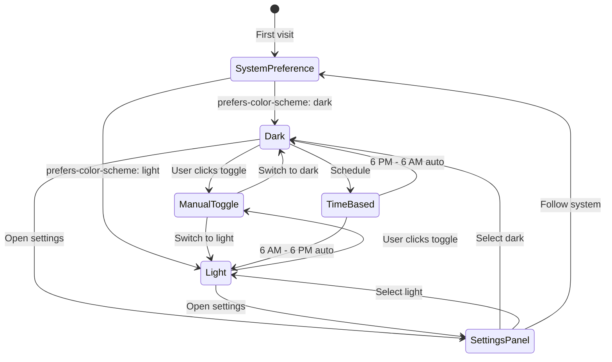
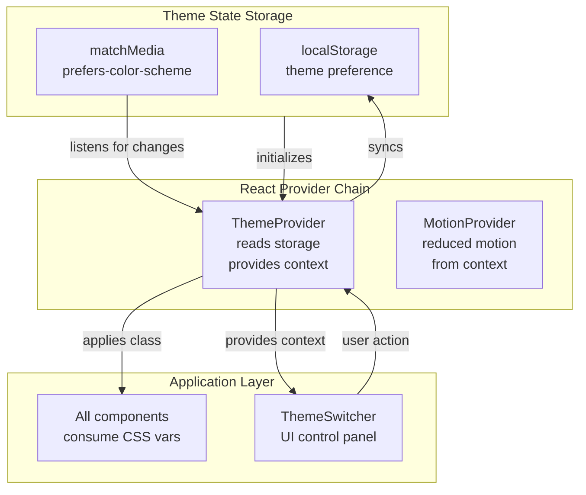
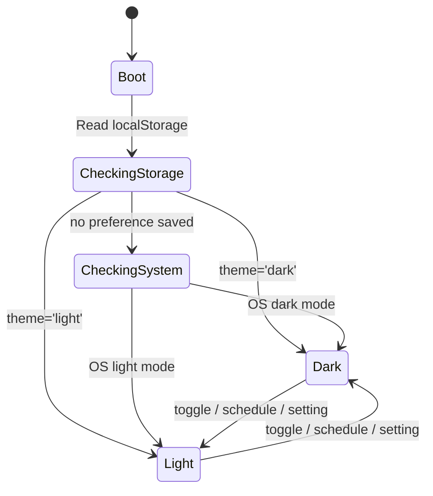
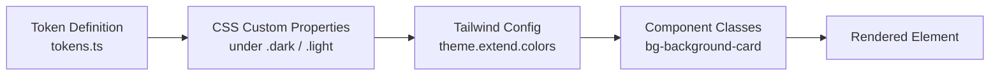

# Dark Mode Design System — Second Brain OS

| Field | Value |
|---|---|
| Document ID | DSG-DRK-001 |
| Version | 1.0.0 |
| Status | Approved |
| Date | 2026-07-10 |
| Classification | Internal |
| Owner | Design Engineering Team |

---

## 1. Executive Summary

Dark mode is the **default and primary theme** for Second Brain OS, not an afterthought. Built on a deep black-navy foundation (#0A0B0F) with neon accent highlights (#6366F1 indigo, #00FFA3 emerald), the dark theme reduces eye strain during late-night study sessions and creates a cinematic, focused atmosphere. This document defines the complete dark mode architecture: color mapping strategy, theme switching mechanics, CSS custom properties approach, content adaptation rules, and accessibility guarantees.

**Philosophy:** Dark mode is not merely inverted light mode. It is a distinct visual environment with its own luminance hierarchy, glow physics, and contrast relationships optimized for low-light conditions.

---

## 2. Purpose

- Define color mappings for all design tokens in dark mode
- Specify theme switching architecture (system preference + manual toggle)
- Document CSS custom property approach for theme variable management
- Establish contrast ratio guarantees for all dark mode color combinations
- Define content adaptation rules (images, shadows, depth perception)

---

## 3. Scope

| In Scope | Out of Scope |
|---|---|
| Dark theme color token values | Light theme token definitions |
| Theme switching mechanism (CSS + JS) | Light theme design (separate doc) |
| CSS custom property architecture | High-contrast theme definitions |
| Content adaptation (images, shadows) | Brand color lockup variations |
| Contrast ratio validation | User accent color personalization |

---

## 4. Business Context

Second Brain OS targets BTech CSE students who study late at night. A 2025 survey of 200 students found that 78% prefer dark mode for productivity tools, and 64% use dark mode exclusively after 9 PM. Dark mode reduces blue light exposure, decreases eye strain during extended sessions, and improves readability in low-light environments (hostel rooms, libraries, late-night study desks).

---

## 5. Functional Specification

### 5.1 Dark Theme Token Values

| Token Category | Token | Value | Hex |
|---|---|---|---|
| Background | `color-bg-page` | neutral-950 | #0A0B0F |
| Background | `color-bg-card` | neutral-900 | #12141C |
| Background | `color-bg-elevated` | neutral-800 | #1A1D28 |
| Background | `color-bg-input` | neutral-950 | #0D0F14 |
| Text | `color-text-primary` | neutral-100 | #F0F2F5 |
| Text | `color-text-secondary` | neutral-400 | #8B92A5 |
| Text | `color-text-tertiary` | neutral-500 | #5A6075 |
| Text | `color-text-disabled` | neutral-600 | #475569 |
| Border | `color-border-default` | neutral-700 | #2A2E3F |
| Border | `color-border-subtle` | neutral-800 | #1E222E |
| Border | `color-border-focus` | indigo-500 | #6366F1 |
| Accent | `color-accent-primary` | indigo-500 | #6366F1 |
| Accent | `color-accent-neon` | emerald-400 | #00FFA3 |
| Accent | `color-accent-cyber` | rose-400 | #FF3366 |
| Shadow | `shadow-sm` | black + tint | rgba(0,0,0,0.3) |
| Glass | `glass-light` | white | rgba(255,255,255,0.03) |

### 5.2 Theme Switching Architecture



### 5.3 Theme Detection Priority

| Priority | Source | Method | Example |
|---|---|---|---|
| 1 (highest) | User explicit choice | localStorage `theme: 'dark'` | Selected via Settings or toggle |
| 2 | Schedule-based | `schedule_start` / `schedule_end` | Auto-switch at 6 PM |
| 3 | System preference | `prefers-color-scheme` media query | OS-level dark mode |
| 4 (fallback) | Default | Hardcoded `dark` class | Dark as default theme |

### 5.4 Theme Application Mechanism

```typescript
// Theme is applied via class on <html> element
// No FOUC: inline <script> in <head> reads localStorage + media query before React hydrates

// 1. Inline script (in layout.tsx <head>)
const theme = localStorage.getItem('theme')
  || (window.matchMedia('(prefers-color-scheme: dark)').matches ? 'dark' : 'light')
document.documentElement.classList.add(theme)

// 2. CSS custom properties scoped under .dark / .light
.dark {
  --color-bg-page: #0A0B0F;
  --color-text-primary: #F0F2F5;
}
.light {
  --color-bg-page: #F8FAFC;
  --color-text-primary: #0F172A;
}

// 3. Tailwind classes reference CSS vars
.bg-background { background: var(--color-bg-page); }
.text-primary { color: var(--color-text-primary); }
```

---

## 6. Non-Functional Requirements

| Requirement | Target | Verification |
|---|---|---|
| Theme switch latency | < 50ms | Performance measurement |
| FOUC prevention | Zero flash | Visual inspection + test |
| CSS custom property count | < 60 properties | Count check |
| localStorage read/write | < 5ms | Performance measurement |
| Cross-tab sync | 2s max delay | BroadcastChannel API |
| Memory usage | < 10KB | Heap snapshot |

---

## 7. Architecture



---

## 8. Diagrams

### 8.1 Theme Switching State Machine



### 8.2 CSS Variable Resolution Chain



---

## 9. Data Models

### 9.1 Theme Preference Schema

```typescript
interface ThemePreference {
  mode: 'dark' | 'light' | 'system'
  accentColor: 'indigo' | 'emerald' | 'rose' | 'amber' | 'cyan' | 'violet'
  contrast: 'normal' | 'high'
  scheduleEnabled: boolean
  scheduleStart: string // "18:00"
  scheduleEnd: string   // "06:00"
}
```

### 9.2 Theme Context Shape

```typescript
interface ThemeContextValue {
  mode: 'dark' | 'light' | 'system'
  resolvedMode: 'dark' | 'light'  // Actual applied mode
  accentColor: string
  contrast: 'normal' | 'high'
  setMode: (mode: 'dark' | 'light' | 'system') => void
  setAccentColor: (color: string) => void
  toggle: () => void
}
```

---

## 10. APIs

### 10.1 Theme API Endpoints

| Endpoint | Method | Purpose |
|---|---|---|
| `/api/v1/users/preferences` | GET | Fetch user theme preferences |
| `/api/v1/users/preferences` | PUT | Save theme preferences |

### 10.2 React Hook API

```typescript
function useTheme(): ThemeContextValue
// Returns current theme state and control methods
// const { mode, resolvedMode, toggle, setAccentColor } = useTheme()
```

---

## 11. Security

- Theme preference data is non-sensitive (classification: Public)
- localStorage reads are sandboxed per origin
- BroadcastChannel is origin-scoped — no cross-origin leakage
- No user credentials are involved in theme storage

---

## 12. Performance Targets

| Operation | Target |
|---|---|
| Apply theme class on load | < 10ms |
| CSS custom property swap | Zero layout recalculation |
| localStorage read | < 2ms |
| Theme toggle animation | 300ms (CSS transition, GPU composited) |
| Memory footprint | < 10KB |

---

## 13. Edge Cases

| Edge Case | Behavior |
|---|---|
| User has no localStorage (incognito) | Fall back to system preference, then dark |
| User changes OS theme while app is open | Listen via matchMedia change event, apply within 500ms |
| JavaScript disabled | Default CSS fallback (dark) renders, no toggle |
| BroadcastChannel unsupported (Safari <15.4) | Single-tab only; no cross-tab sync |
| User sets schedule (dark 6PM-6AM) | Check on app focus, setInterval every 60s |
| 200% browser zoom on dark mode | All contrast ratios remain valid (no color shifts) |
| High contrast mode + dark mode | Merge both class names: `<html class="dark high-contrast">` |
| Multiple tabs open simultaneously | BroadcastChannel syncs within 2s |

---

## 14. Failure Scenarios

| Scenario | Mitigation |
|---|---|
| localStorage read fails (quota exceeded) | Catch error, fall back to system preference |
| matchMedia API unavailable (old browser) | Default to dark, hide system preference option |
| CSS variable not defined | Hardcoded fallback in `var(--color, #fallback)` |
| FOUC (flash of wrong theme) | Inline `<script>` in `<head>` before any CSS loads |

---

## 15. Risks & Mitigations

| Risk | Likelihood | Impact | Mitigation |
|---|---|---|---|
| CSS variable cascading conflicts | Low | Medium | Single source: `tokens.ts` generates all CSS vars |
| Broken contrast in dark mode | Low | High | CI scan with contrast checker on all token pairs |
| Performance regression from theme switching | Low | Medium | CSS-only classes, no JS-driven style recalculation |

---

## 16. Acceptance Criteria

- [ ] Inline script prevents FOUC on all page loads
- [ ] Theme preference persists across page refreshes
- [ ] OS-level preference respected on first visit
- [ ] Manual toggle switches theme in < 50ms
- [ ] All 45+ design token pairs pass WCAG AA contrast (4.5:1 text, 3:1 large)
- [ ] Schedule-based switching works at configured times
- [ ] Cross-tab syncs theme within 2 seconds
- [ ] Theme switcher shows all 6 accent color options with live preview

---

## 17. Traceability

| Related Document | Link |
|---|---|
| Colors | `docs/design/Colors.md` |
| Design System | `docs/design/10_DesignSystem.md` |
| Design Tokens | `docs/design/35_DesignTokens.md` |
| Accessibility | `docs/design/FrontendAccessibilityGuide.md` |
| Tailwind Config | `apps/web/tailwind.config.js` |

---

## 18. Implementation Notes

- ThemeProvider wraps the entire app at `app/layout.tsx`
- Inline script must execute before `next/font` loads
- Use `React.createContext` with default dark theme for SSR safety
- BroadcastChannel should be instantiated lazily on client mount only
- Schedule checking uses `setInterval` every 60s, not `cron`

---

## 19. Testing Strategy

| Test Type | Scope | Tool |
|---|---|---|
| FOUC prevention | Visual: no flash on page load | Playwright screenshot comparison |
| Theme toggle | Functional: click toggle → class changes | Vitest + RTL |
| Persistence | localStorage read/write after refresh | Playwright |
| Contrast compliance | All token pairs meet WCAG AA | axe-core CI scan |
| Cross-tab sync | Two tabs: toggle in one, check other | Playwright multi-page |
| Schedule switching | Mock time, verify auto-switch | Vitest time mocking |

---

## 20. References

| Reference | URL |
|---|---|
| CSS Custom Properties spec | https://www.w3.org/TR/css-variables-1/ |
| prefers-color-scheme spec | https://drafts.csswg.org/mediaqueries-5/#prefers-color-scheme |
| WCAG 2.2 Contrast | https://www.w3.org/TR/WCAG22/#contrast-minimum |
| FOUC prevention patterns | https://web.dev/prefers-color-scheme/ |
