```mermaid
%%{init: {'theme': 'base', 'themeVariables': { 'background': '#0A0B0F', 'primaryColor': '#6366F1', 'secondaryColor': '#00FFA3', 'tertiaryColor': '#818CF8', 'primaryTextColor': '#F1F5F9', 'secondaryTextColor': '#94A3B8', 'lineColor': '#6366F1', 'fontFamily': 'DM Sans', 'nodeBorder': '#6366F1', 'clusterBkg': '#13151A', 'clusterBorder': '#1E293B' }}}%%
flowchart LR
    R["🔬 Research"] --> I["💡 Ideate"]
    I --> P["🎨 Prototype"]
    P --> T["🧪 Test"]
    T --> I
    T --> L["✅ Launch"]
    L --> S["📈 Ship"]
    S --> R
    R --> R1["25-product CI<br/>(Competitive Intel)"]
    I --> I1["Design sprints<br/>+ storyboards"]
    P --> P1["Figma + Framer<br/>Motion prototypes"]
    T --> T1["Usability testing<br/>+ a11y audits"]
    S --> S1["Stitch component<br/>+ docs publish"]
    style R fill:#6366F1,stroke:#6366F1,color:#F1F5F9
    style I fill:#818CF8,stroke:#818CF8,color:#F1F5F9
    style P fill:#6366F1,stroke:#6366F1,color:#F1F5F9
    style T fill:#818CF8,stroke:#818CF8,color:#F1F5F9
    style L fill:#6366F1,stroke:#6366F1,color:#F1F5F9
    style S fill:#00FFA3,stroke:#00FFA3,color:#0A0B0F
```

# Design Architecture — Second Brain OS (ARIA OS)

> **Single source of truth for every design decision across Antigravity (design system), Stitch (component library), Figma (design tooling), and Frontend Engineering.**
>
> This document synthesizes 18 design documents into one authoritative blueprint. It supersedes DesignStrategy.md (strategic foundation), DesignSystemResearch.md (token/component/theme research), MotionArchitecture.md (animation engineering), ProductArchitecture.md (domain model), InformationArchitecture.md (navigation & IA), UserJourneyArchitecture.md (journey maps), Branding.md (brand identity), FrontendAccessibilityGuide.md (a11y), ResponsiveRules.md (responsive), MotionSystem.md (motion design), 08_UIUX.md, 09_Design.md, 10_DesignSystem.md, 35_DesignTokens.md, Competitive_Intelligence_Report.md, and both Enterprise Discovery Reports. Any conflict among source documents is silently resolved here — this document is the single authority.

---

## Document Control

| Field | Value |
|---|---|
| Document ID | DSG-DSN-001 |
| Version | 1.0.0 |
| Status | Active |
| Last Updated | 2026-06-11 |
| Classification | Internal — Design & Engineering Leadership |
| Target Audience | Design Team (Antigravity), Engineering Team (Stitch), AI Agents, Product Team, Design Reviewers |
| Supersedes | DesignStrategy.md, DesignSystemResearch.md, MotionArchitecture.md, 08_UIUX.md, 09_Design.md, 10_DesignSystem.md, 35_DesignTokens.md, Accessibility.md |
| Companion Docs | Branding.md (brand guidelines), FrontendAccessibilityGuide.md (detailed a11y specs), MotionSystem.md (motion design intent), ProductArchitecture.md (domain model), InformationArchitecture.md (IA details), UserJourneyArchitecture.md (journey details), FrontendTechnicalResearch.md (engineering constraints) |

---

## Table of Contents

**Part I — Vision & Philosophy**
1. Executive Design Vision
2. Product Vision
3. Brand Vision
4. Product Personality
5. Design Philosophy
6. Design Principles
7. AI-First Design Principles
8. Personas

**Part II — Users & Information Architecture**
9. Information Architecture
10. Navigation Architecture

**Part III — Dashboards, Layout & Pages**
11. Dashboard Architecture
12. Layout System
13. Page Architecture
14. Responsive & Cross-Platform Strategy

**Part IV — Design Tokens & Themes**
15. Design Token Architecture
16. Theme Architecture
17. Color System

**Part V — Component Architecture**
18. Component Architecture & Library
19. Typography
20. Iconography
21. Spacing & Layout Grid
22. Data Visualization

**Part VI — Enterprise Quality**
23. Accessibility
24. Responsive Design
25. Empty, Loading, Error & Edge States
26. AI Interaction Patterns
27. Search & Filter Architecture
28. Command Center Architecture

**Part VII — Motion, Governance & Guidelines**
29. Notification & Communication System
30. Motion & Animation
31. Design Governance
32. Performance Budgets
33. Future Expansion Rules

---



---

# Part I — Vision & Philosophy

---

## 1. Executive Design Vision

### 1.1 The Design Vision Statement

**Second Brain OS is the world's first AI operating system for builders. Its design language makes intelligence feel ambient, power feel effortless, and complexity feel inevitable.**

We are not building a productivity tool. We are building a cognitive extension — a system that thinks alongside the user, anticipates before they ask, and fades into the background when not needed. The design must embody three truths:

1. **The user is brilliant.** Our job is to remove friction, not add features. Every component, every interaction, every pixel must justify its existence by making the user faster, clearer, or more capable.

2. **Time is the only non-renewable resource.** Every millisecond of delay, every extra click, every moment of confusion is a tax on the user's life. The design treats latency as a moral failing.

3. **AI is a material, not a feature.** Like glass, light, or motion — AI is something we design with, not something we add on. The system's intelligence is woven into its fabric: ambient suggestions, predictive defaults, contextual awareness, and transparent reasoning.

### 1.2 Design Mission

**To make the complex feel simple and the intelligent feel natural.**

Not "simple" as in fewer features. Simple as in: the right thing happens without thinking. The system understands context. The user never has to explain themselves twice.

### 1.3 Design Contracts

Every design decision must honor these contracts with the user:

| Contract | Promise | Design Implication |
|---|---|---|
| **The 60-Second Contract** | First meaningful action in under 60 seconds | Onboarding ends with a real task, not a tour. No registration gate. |
| **The Glance Contract** | Critical information in 5 seconds at 3 feet | Dashboard zones scannable, not readable. KPI strips, not tables. |
| **The Forgiveness Contract** | No guilt for absence | Return flow shows best first, then what's fixable. No streak shaming. |
| **The Transparency Contract** | Every AI action is explainable | AI actions have "Why" tooltip + undo path. No black boxes. |
| **The Context Contract** | Never lose my place | Scroll position, filters, selection preserved across navigation. |
| **The Speed Contract** | Feedback in 100ms, data in 1s, AI in 3s | Skeleton states, optimistic UI, progress communication. |

### 1.4 Design Authority Hierarchy

When conflicts arise between design documents, resolution follows this chain:

```
Design.md (THIS FILE — Single Source of Truth)
  ├── DesignStrategy.md (Strategic foundation — wins on conflicting vision)
  ├── DesignSystemResearch.md (Token/component research — wins on tokens)
  ├── MotionArchitecture.md (Animation engineering — wins on motion)
  ├── ProductArchitecture.md (Domain model — wins on feature boundaries)
  ├── InformationArchitecture.md (IA — wins on navigation/sitemap)
  ├── UserJourneyArchitecture.md (Journeys — wins on user flows)
  ├── Branding.md (Brand — wins on voice/tone)
  ├── Accessibility.md (A11y — wins on compliance)
  ├── FrontendTechnicalResearch.md (Engineering — wins on performance budgets)
  └── (All remaining docs — consulted for context, overridden by above)
```

### 1.5 Document Architecture Relationship

```
Design.md (THIS FILE — Design Blueprint)
  ├── Antigravity (Design System — tokens, atoms, molecules, organisms)
  │   ├── Figma Library (design tooling — components, variants, auto-layout)
  │   └── Stitch (Component Library — implementation in code)
  ├── MotionSystem.md (Animation principles + MotionArchitecture.md engineering)
  ├── FrontendTechnicalResearch.md (Rendering, state, routing — engineering constraint)
  └── (All module pages, layouts, and feature UI built from Antigravity components)
```

---

## 2. Product Vision

### 2.1 The Product

Second Brain OS is an AI-powered personal productivity operating system for BTech CSE students. It replaces 8+ fragmented tools (Todoist, Notion, Google Calendar, habit trackers, journaling apps, finance trackers, course managers, opportunity trackers) with one unified system that thinks alongside the user.

### 2.2 Core Value Proposition

| Dimension | Value |
|---|---|
| **For the overwhelmed student** | One system replaces 8+ tools with a unified, intelligent experience |
| **For the opportunity-seeker** | AI matches internships, scholarships, and projects to your profile |
| **For the skill-builder** | Course progress tracking with AI-driven pacing recommendations |
| **For the dreamer** | Idea pipeline from raw concept to shipped project with AI guidance |
| **For the burnout-prone** | Sleep tracking, health nudges, and cognitive load management |

### 2.3 Product Principles

| Principle | Meaning |
|---|---|
| **Orchestrate, don't operate** | ARIA handles the coordination; the user handles creation |
| **Compound growth** | Every day's data makes tomorrow's system smarter |
| **Fail-safe intelligence** | AI assists but never assumes control; every feature works without AI |
| **Privacy by architecture** | Local-first AI (Ollama) as default; cloud is opt-in for specific features |

---

## 3. Brand Vision

### 3.1 Brand Identity Foundation

ARIA stands for **Adaptive Reasoning Intelligence Agent**. The name evokes melody, flow, and harmony — qualities a second brain should bring to the chaos of modern student life. Just as an aria in opera carries the emotional weight of a scene, ARIA carries the cognitive weight of its user.

**Origin narrative:** Born from the realization that a BTech CSE student juggles 15+ life dimensions — coursework, side projects, job applications, fitness, sleep, finances, relationships, and self-discovery. No existing tool orchestrates these holistically. ARIA is the conductor.

### 3.2 Brand Mission

> To eliminate cognitive overhead for ambitious students by providing a unified, AI-powered second brain that learns, adapts, and anticipates — so they can focus on what matters: building, learning, and growing.

### 3.3 Brand Vision Statement

A world where every student has an AI companion that knows them deeply enough to remove friction from their daily life, freeing human cognition for creative and meaningful work.

### 3.4 Brand Values

| Value | Meaning | Design Manifestation |
|---|---|---|
| **Radical Clarity** | Surface what matters, hide what doesn't | Progressive disclosure, clean dashboards, smart defaults, aggressive content prioritization |
| **Graceful Power** | Complex systems that feel simple | Predictive defaults, one-click actions, thoughtful loading states, keyboard shortcuts for power users |
| **Adaptive Intelligence** | Grows with the user, never static | Learning agent, memory system, personalization, adjusts density and anticipates needs |
| **Bold Individuality** | Cyberpunk aesthetic that rejects generic AI design | Syne typography, neon accents (`#6366F1`, `#00FFA3`), dark theme (`#0A0B0F`), distinctive motion, refined cyberpunk not dystopian |
| **Trustworthy Foundations** | Data privacy, local-first AI, transparent decisions | Offline capability, clear privacy policy, open-source philosophy, all AI actions explainable |

### 3.5 Brand Positioning Statement

**For ambitious BTech CSE students who feel overwhelmed by tools, courses, and opportunities, Second Brain OS is the AI-powered operating system that turns fragmented student life into compounded, measurable growth. Unlike generic productivity tools or task managers, we combine local-first AI, cross-module intelligence, and a bold cyberpunk design language into a unified system that thinks alongside the user.**

### 3.6 Brand Attribute Filter

Every design decision must pass through this attribute filter:

| Attribute | Design Decision Filter |
|---|---|
| **Refined** | Does this feel polished or rushed? |
| **Bold** | Does this have an opinion or play it safe? |
| **Intelligent** | Does this understand context or treat every action as isolated? |
| **Fast** | Does this respect the user's time or waste it? |
| **Honest** | Does this communicate truth or obscure it? |
| **Human** | Does this feel like a person made it or a corporation? |

### 3.7 Brand Voice (Design Context)

| Context | Voice | Example |
|---|---|---|
| Onboarding | Warm + guiding | "Let's set up your second brain in under a minute." |
| Briefing | Direct + anticipatory | "4 tasks today. 1 overdue. Your focus should be DBMS." |
| Weekly Review | Analytical + encouraging | "Your best day was Tuesday. Here's what worked." |
| Error | Transparent + actionable | "Couldn't save. Network issue. Retry saved as draft." |
| AI Suggestion | Curious + precise | "I noticed you study better before 4 PM. Want to reschedule?" |
| Empty State | Helpful + inviting | "Ready for your first task? Try 'Finish DBMS assignment.'" |

### 3.8 Visual Principles

| Principle | Rule | Rationale |
|---|---|---|
| **Dark Canvas, Neon Intent** | Background is infinite dark (`#0A0B0F`). Neon accents ≤ 15% of any screen. Light emits from content. | Reduces eye strain, makes content pop, establishes cyberpunk mood without being garish. |
| **Depth Through Elevation** | Cards at +1 level above page. Modals at +2. Toasts float above everything. Each level casts a glow, not a drop shadow. | Glow shadows reinforce cyberpunk aesthetic; elevation communicates hierarchy naturally. |
| **Typography as Architecture** | Syne for display (headings, hero text). DM Sans for body (reading, labels). JetBrains Mono for code. Scale based on content hierarchy, not device. | Distinctive brand recognition (Syne) + reading comfort (DM Sans) + code clarity (JetBrains Mono). |
| **Intentional White Space** | Minimum 16px gutters. Content density decreases as cognitive load increases. AI-generated content gets more spacing than user content. | Breathing room reduces anxiety. AI content needs extra space for scanning. |
| **Consistent beats** | 4px base grid. 8px spacing scale. 16px component padding. 24px section spacing. 48px page margins. | Predictable rhythm across all surfaces; engineering and design speak the same measurement language. |

---

## 4. Product Personality

### 4.1 The Mentor Archetype

Second Brain OS is not a tool. It is not a friend. It is a **Mentor** — competent, demanding, encouraging, and always honest.

| Mentor Trait | Design Expression | Opposite (Rejected) |
|---|---|---|
| **Competent** | Always knows context, never asks for redundant info | Forgets between sessions, requires re-explanation |
| **Demanding** | Sets high expectations, nudges toward growth | Laissez-faire, doesn't care if user succeeds |
| **Encouraging** | Celebrates wins, frames setbacks as data | Guilt-tripping, "You failed" messaging |
| **Honest** | Accurate metrics, no fake streaks, real insights | Gamification, fake progress bars, vanity metrics |

### 4.2 Personality Framework

| Axis | Position | Rationale |
|---|---|---|
| **Warmth** | Warm but not saccharine | Students need encouragement, not a cheerleader |
| **Competence** | Very high | Must feel like the smartest system they've used |
| **Candor** | High | Direct about what's working and what isn't |
| **Boldness** | High | Confident design, strong opinions, decisive UX |

### 4.3 UI Personality Translation

| Personality Trait | UI Translation |
|---|---|
| Competent | Automatic context restoration, predictive defaults, cross-module intelligence |
| Demanding | "You studied 45 min — 15 min short. Quick session?" (not "Good job trying!") |
| Encouraging | "+1 done! You're building momentum." (not confetti for everything) |
| Honest | "Week 3 completion: 42%. Let's discuss what's blocking you." |

### 4.4 Anti-Personalities

What the product is NOT:

| Anti-Personality | Why Rejected |
|---|---|
| **The Cheerleader** | Constant celebration devalues real achievement |
| **The Nag** | Guilt-inducing reminders cause churn |
| **The Genius** | Black-box AI that feels like magic erodes trust |
| **The Disorganized Genius** | Smart but forgetful — most AI tools today |
| **The Corporate Tool** | Sterile, formal, bureaucratic — Notion's problem |

---

## 5. Design Philosophy

### 5.1 Core Philosophical Tenets

#### Ambient Intelligence

The best AI is the AI you don't notice. Every intelligence feature must pass the **"Would the user notice if this were missing?"** test. If the answer is "yes only during errors," the feature is well-designed. If the answer is "yes because it's in the way," redesign it.

**Application:** Ghost hints appear on hover, not persistently. AI suggestions are badges, not banners. Briefings are pushed at 7 AM, not perpetually visible.

#### Cognitive Load Budgeting

Every screen has a limited cognitive budget. Users should never spend more than 20% of that budget on understanding the interface; the rest goes to their actual work.

**Application:** Maximum 5 primary actions per page. Only 1 primary CTA. Secondary actions in dropdowns or context menus. Cards have 3-line maximum summaries. Tables use horizontal scroll rather than wrapping.

#### Progressive Disclosure

The system reveals depth only when the user signals readiness. First session: 3 actions. Month 1: 15 actions. Power user: 50+ actions. The same UI scales from novice to expert without switching modes.

**Application:** Command palette shortcuts revealed gradually. Advanced filters hidden behind "Show more." Settings organized by frequency of use, not alphabetically.

#### Forgiveness Over Guilt

The system never shames the user for absence, missed tasks, or broken streaks. Every interaction that could induce guilt must include a one-click path to resolution.

**Application:** Return flow shows "Here's what happened while you were away" not "You missed X days." Missed tasks bundled into a "Reschedule all" action. Streak data framed as "opportunity to restart" not "you lost."

#### Deterministic Defaults with AI Enhancement

Every feature works fully without AI. AI adds speed, insight, and personalization but never gatekeeps functionality. The system degrades gracefully: if Ollama is down, the user can still create tasks, log habits, and view dashboards.

**Application:** Task suggestions work without AI (sort by priority/due date). Briefing has a template-based fallback. Learning agent has a rule-based fallback.

### 5.2 Design Quality Gates

Every component and page must pass these quality gates before acceptance:

| Gate | Standard | Measured By |
|---|---|---|
| **Glanceability** | 80% of users can identify the primary information in 5 seconds | Eye-tracking heatmaps (design review) |
| **Task Success** | 90%+ first-attempt task completion in usability testing | Usability test results |
| **Cognitive Load** | < 20% interface comprehension overhead | NASA-TLX per screen |
| **Accessibility** | WCAG 2.2 AA minimum, AAA for text contrast | Automated + manual audit |
| **Performance** | TTI < 2s, LCP < 2.5s, AI response < 3s (Claude) / < 10s (Ollama) | Lighthouse + RUM |
| **Consistency** | No component has more than 1 implementation | Design system audit |

---

## 6. Design Principles

### 6.1 Strategic Design Principles

These are high-order principles that translate product strategy into design decisions. They override tactical concerns when in conflict.

#### P1: Glanceable Intelligence
Every screen must communicate its most important information within 5 seconds at 3 feet. If a user cannot understand the state of their system at a glance, the design has failed.

**Applies to:** Dashboard, Briefing, KPI strips, Notification previews, Widgets.
**Rejects:** Dense data dumps, walls of text, metrics without context.
**Implementation:** KPI strips with trend indicators (↑↓→). Mini-charts (sparklines) for time series. Color-coded status dots (green=good, yellow=warning, red=critical).

#### P2: Forgiveness Over Guilt
The system never shames the user for absence, missed tasks, or broken streaks. Every interaction that could induce guilt must include a one-click path to resolution.

**Applies to:** Return-user flows, overdue tasks, missed habits, weekly reviews.
**Rejects:** "You missed 14 days" banners, red-number overload, streak-shaming.
**Implementation:** Return flow shows "X accomplished since last visit" before "Y missed." Missed items grouped with "Reschedule all" CTA.

#### P3: Context is King
Every action, every view, every notification must understand where the user came from, what they were doing, and what they need next. No interaction exists in isolation.

**Applies to:** Navigation, deep links, notifications, search results, undo actions.
**Rejects:** Detached detail pages, context-free notifications, generic error messages.
**Implementation:** Preserve scroll position, filters, and selection across navigation. Deep-link to exact item state. Notifications include return-to-context action.

#### P4: Progressive Complexity
The system reveals depth only when the user signals readiness. First session: 3 actions. Month 1: 15 actions. Power user: 50+ actions. The same UI scales from novice to expert without switching modes.

**Applies to:** Onboarding, sidebar, command palette, settings, feature discovery.
**Rejects:** Beginner mode / expert mode toggle, feature gating behind paywalls, Easter-egg features.
**Implementation:** Command palette lists 5 basic commands initially, expands to 50+ as user learns. Settings grouped by "Basic" / "Advanced" toggle.

#### P5: AI as Material, Not Magic
Every AI action is transparent, reversible, and learnable. The user should understand what the AI did, why it did it, and how to adjust it. AI augments judgment — it does not replace it.

**Applies to:** Briefing generation, task classification, opportunity matching, scheduling suggestions.
**Rejects:** Black-box decisions, unlabeled automation, irreversible AI actions.
**Implementation:** "Why this suggestion?" tooltip on every AI action. Undo button with 10-second window. AI confidence indicator (high/medium/low).

#### P6: Speed is a Feature, Not a Metric
Every interaction should feel instantaneous. Under 100ms for feedback. Under 1s for data loads. Under 3s for AI responses (Claude) or under 10s (Ollama). When the system must be slow, it communicates why.

**Applies to:** All interactions, data loading, AI generation, sync operations.
**Rejects:** Spinners longer than 2s without explanation, blocking loading states, uncached repeated queries.
**Implementation:** Skeleton screens for loads > 300ms. Optimistic UI for mutations. Progress indication with estimated time for AI operations. Cancelable AI generation.

#### P7: One Codebase, Three Experiences
The same codebase delivers three distinct experiences — mobile (glance), tablet (lean-back), desktop (deep work). Each is optimized for its platform's strengths, not responsively squished.

**Applies to:** All page layouts, navigation, interaction patterns.
**Rejects:** Desktop-first-then-squish, mobile-only-then-stretch, platform-specific feature gaps.
**Implementation:** Breakpoint-specific layouts (mobile < 768px, tablet 768-1199px, desktop 1200px+). Mobile uses bottom tab bar, tablet uses sidebar, desktop uses full sidebar + breadcrumb.

---

## 7. AI-First Design Principles

### 7.1 Ambient Presence

ARIA is perceptible only when needed. The AI presence is indicated by a subtle glow pulse on the ARIA avatar in the sidebar — active when processing, dormant when idle. The user should never feel watched; they should feel supported.

**Design patterns:**
- Ghost hints: Faded suggestions that appear on hover (not persistently)
- AI badge: Small indicator next to AI-generated content (briefing, suggestions, classifications)
- Transparency toggle: "Why did ARIA do this?" expands reasoning panel

### 7.2 Predict, Don't Prescribe

ARIA suggests actions, never takes them without confirmation (except user-scheduled automations like daily briefing). Every suggestion includes:
1. What ARIA recommends
2. Why (data-driven reasoning)
3. Confidence level (high/medium/low)
4. One-click action or dismiss

### 7.3 Learn Quietly

ARIA learns from behavior without asking. No "Rate this suggestion" popups. Instead:
- Acceptance rate of suggestions is measured silently
- Repeated dismissal of a suggestion type reduces its frequency
- Learning is visible in the weekly review ("ARIA noticed you prefer evening study sessions")

### 7.4 Fail Gracefully

When AI fails (Ollama timeout, Claude API error, ambiguous query), the system:
1. Falls back to deterministic/algorithmic result
2. Shows AI status indicator (not connected, degraded, full)
3. Never shows raw error messages to the user
4. Retries automatically with exponential backoff

### 7.5 AI Interaction Patterns

| Pattern | Description | Example |
|---|---|---|
| **Ghost Hint** | Faded suggestion on hover, activates on focus | "Try: 'Finish DBMS assignment' — ARIA" |
| **Streaming Response** | Token-by-token display with cursor animation | Briefing generation, chat responses |
| **Thinking Indicator** | Animated brain-wave pulse during AI processing | Before briefing appears, while agent runs |
| **Confidence Badge** | High/Medium/Low indicator next to AI output | Opportunity match score, task classification |
| **Why Tooltip** | Click-to-expand reasoning behind AI action | "Why was this task classified as urgent?" |
| **AI Action Undo** | 10-second undo window after AI automation | "Briefing generated. Undo?" toast with countdown |
| **Progressive AI** | AI features unlock as user demonstrates readiness | Command palette shows more AI commands over time |

---

## 8. Personas

### 8.1 Persona Priority Matrix

| Priority | Persona | Type | Design Weight |
|---|---|---|---|
| **Tier 1 (Primary)** | Arjun Mehta | BTech CSE Student | 40% — drives all core decisions |
| **Tier 1 (Primary)** | Priya Sharma | BTech CSE Student (Builder) | 30% — drives technical depth |
| **Tier 2 (Secondary)** | Rahul Verma | Freelancer / Side Hustler | 15% — drives income + project features |
| **Tier 2 (Secondary)** | Ananya Gupta | Creator / Content Maker | 10% — drives content pipeline |
| **Tier 3 (Future)** | Vikram Singh | Knowledge Worker | 3% — accommodates, doesn't drive |
| **Tier 3 (Future)** | Neha Patel | Power User / Early Adopter | 2% — advanced patterns, not core UX |

### 8.2 Arjun Mehta — The Overwhelmed Student (Primary)

**Bio:** 20, 2nd Year BTech CSE at VIT Chennai. Dell Inspiron 15 (8GB RAM, i5), Android phone, Jio 4G hotspot. Chrome with 47 tabs open. Rs. 5,000/month total income.

**Daily Reality:**
```
 7:00 AM — Wake up, check phone (20 min scrolling)
 7:30 AM — Morning routine (skip breakfast most days)
 8:00 AM — College classes (notes in Notion, loses half)
 1:00 PM — Lunch + YouTube (200+ "Watch Later" videos)
 2:00 PM — Self-study (opens VS Code, distracted by Twitter/Reddit)
 6:00 PM — Free time (tells himself he'll study, games instead)
 8:00 PM — Guilt-study (opens Udemy course from 3 months ago)
10:00 PM — Late-night motivation spike (starts project, never finishes)
12:00 AM — Scrolling Instagram/Reddit in bed
 1:30 AM — Sleep (bad quality, phone in hand)
```

**Top Frustrations (Severity 8-10):**
- 6 enrolled online courses, 0 completed
- Tasks in Todoist, notes in Notion, deadlines on Google Calendar — no single view
- Missed 2 internship deadlines last semester
- 20+ startup ideas in notes app, none started
- Sleep procrastination: knows he needs better sleep, can't stop

**Design Implications:**
- Single unified dashboard showing tasks + courses + deadlines + opportunities
- Course completion nudges with micro-commitments (not "finish course" — "study 25 min")
- Sleep wind-down mode that locks phone distractions
- Idea pipeline with one-click → task → project conversion

### 8.3 Priya Sharma — The Builder (Primary)

**Bio:** 21, 3rd Year BTech CSE at IIIT Hyderabad. MacBook Air M2, iPhone 14. Active GitHub (80+ contributions/month). Building a devtool startup on the side. Rs. 25,000/month (freelance + internship).

**Key Traits:**
- Manages 3 active GitHub repos, 1 internship deliverable, 1 side startup
- Uses Terminal + VS Code as primary tools; hates leaving keyboard
- Expert at time management but overwhelmed by scope
- Needs deep work tracking, project roadmaps, dependency graphs

**Design Implications:**
- Keyboard-first navigation (command palette as primary interaction)
- Deep work timer with flow state detection
- Project dependency visualization
- GitHub integration for PR tracking, commit-based progress

### 8.4 Rahul Verma — The Freelancer (Secondary)

**Bio:** 22, Final Year BTech CSE at Manipal. Windows desktop (custom build, 32GB RAM). Freelances on Upwork + Fiverr. Rs. 45,000/month average. Building portfolio for FAANG applications.

**Key Traits:**
- Juggles 3-5 freelance projects simultaneously
- Income fluctuates wildly — needs tracking and forecasting
- Client communication, invoicing, deadline management
- Wants Second Brain OS to be his freelance command center

**Design Implications:**
- Income tracking with hourly rate computation + invoice generation
- Project profitability dashboard (time spent × rate vs. earnings)
- Client communication log (integrated with calendar)
- Freelance-specific opportunity matching

### 8.5 Ananya Gupta — The Creator (Secondary)

**Bio:** 20, 2nd Year BTech CSE at PES Bangalore. MacBook Air M1. Runs a tech YouTube channel (4.2K subscribers). Also writes on Medium. Rs. 8,000/month from AdSense + sponsorships.

**Key Traits:**
- Content pipeline management: idea → script → shoot → edit → publish → promote
- Multiple platforms: YouTube, Medium, Twitter, LinkedIn
- Needs content calendar, cross-platform scheduling, analytics
- Sponsorship tracking and outreach management

**Design Implications:**
- Content pipeline kanban (Idea → Script → Recording → Editing → Published)
- Cross-platform posting schedule
- Analytics dashboard for each platform
- Sponsor outreach tracker

### 8.6 Vikram Singh — The Knowledge Worker (Future)

**Bio:** 24, Working Professional (SDE-1 at a startup). BTech CSE graduate. Uses Second Brain OS for personal knowledge management, side projects, and continuous learning.

**Key Traits:**
- Heavy note-taker (uses Obsidian currently)
- Reading list management (papers, articles, books)
- Personal CRM for professional network
- Wants integration with work tools (Slack, Jira, GitHub)

**Design Implications:**
- Knowledge graph visualization (notes → ideas → projects)
- Reading progress tracker with highlights
- Network relationship manager
- API/webhook integration layer for work tools

### 8.7 Neha Patel — The Power User (Future)

**Bio:** 21, 3rd Year BTech CSE at BITS Pilani. Uses Linux (Arch, btw), tiling window managers, and CLI tools. Contributes to open-source AI projects. Rs. 12,000/month (freelance + open-source grants).

**Key Traits:**
- Maximum efficiency seeker — automates everything
- Wants API access, custom scripts, plugins/extensions
- Multiple monitors, prefers dark themes, hates mouse interaction
- Uses AI extensively but wants fine-grained control

**Design Implications:**
- Full keyboard accessibility (every action has a keyboard shortcut)
- Scriptable automation layer (custom triggers, webhooks)
- Plugin/extension architecture
- Advanced user settings panel (developer mode)
- Local-first: all data accessible via SQLite/Supabase API

---

# Part II — Users & Information Architecture

---

## 9. Information Architecture

### 9.1 IA Principles

| Principle | Rule | Rationale |
|---|---|---|
| **One-deep navigation** | No navigation level goes more than 1 click from dashboard | Students context-switch rapidly; deep navigation causes abandonment |
| **Cross-module intelligence** | Search, command center, and AI operate across all modules | The whole point of a unified OS is eliminating tool fragmentation |
| **Context preservation** | Navigation preserves state: filters, scroll position, selection | User mental models should survive page transitions |
| **Progressive disclosure** | First session shows 3 modules; Month 1 shows 10; Power users see all 20 | Avoid overwhelming new users while enabling power users |
| **Module parity** | Every module has the same interaction pattern: list → detail → action | Predictable mental model reduces cognitive load |

### 9.2 Module Inventory (20 Modules)

The system is organized into 20 modules across 6 navigation groups:

**Group 1: Core Productivity (4 modules)**
| Module | Purpose | Dashboard Element | First Session |
|---|---|---|---|
| Tasks | Task CRUD with priority, dependencies, status | Today's tasks + overdue count | ✅ Show |
| Courses | Course tracking with progress, deadlines | Course completion % + next deadline | ✅ Show |
| Goals | Goal management with roadmap, milestones | Goal progress bars + next milestone | ✅ Show |
| Habits | Habit definitions with frequency, streaks | Today's habits + streak count | ✅ Show |

**Group 2: Tracking & Analytics (3 modules)**
| Module | Purpose | Dashboard Element | First Session |
|---|---|---|---|
| Sleep | Sleep tracking with score, debt | Last night's sleep score + trend | Month 1 |
| Income | Income logs with hourly rate | Monthly income + hourly rate | Month 1 |
| Time | Time tracking with Pomodoro, deep work | Today's focus time + sessions | Week 1 |

**Group 3: Projects & Ideas (3 modules)**
| Module | Purpose | Dashboard Element | First Session |
|---|---|---|---|
| Projects | Project phases, blockers, URLs | Active projects + at-risk count | Week 1 |
| Ideas | Idea pipeline (raw → validating → building) | Idea pipeline count + new today | Week 1 |
| Resources | Resource library with tags, collections | Recent resources + unread count | Month 1 |

**Group 4: Intelligence & Growth (3 modules)**
| Module | Purpose | Dashboard Element | First Session |
|---|---|---|---|
| Opportunities | Opportunity radar with match scores | New matches + application deadlines | Month 1 |
| Learning | Learning progress, skill tracking, pattern detection | Learning streak + skill insights | Month 1 |
| Memory | AI persistent memory, preferences, patterns | Memory insights count | Month 3 |

**Group 5: ARIA Intelligence (3 modules)**
| Module | Purpose | Dashboard Element | First Session |
|---|---|---|---|
| Briefing | Daily AI-generated morning briefing | Morning briefing (auto-push 7AM) | Day 2 |
| Chat | ARIA conversation interface | Chat unread indicator | Day 1 |
| Weekly Review | AI-generated weekly retrospective | Weekly review (auto-push Sun 8PM) | Week 2 |

**Group 6: System (4 modules)**
| Module | Purpose | Dashboard Element | First Session |
|---|---|---|---|
| Settings | User preferences, module configuration | Settings gear icon | Week 1 |
| Automation | Scheduled triggers, cron jobs | Automation status | Month 2 |
| Analytics | Cross-module insights, trends, reports | Analytics summary | Month 2 |
| Integrations | Third-party connections (Google Calendar, GitHub, etc.) | Connection status | Month 2 |

### 9.3 Cross-Module Relationships

| Source Module | Relates To | Relationship Type |
|---|---|---|
| Tasks | Goals, Projects, Courses | Task belongs-to goal/project/course |
| Courses | Tasks, Goals, Learning | Course generates tasks, feeds goal progress |
| Goals | Tasks, Projects, Learning | Goal tracks progress via task/project completion |
| Habits | Sleep, Health | Sleep habits affect habit completion |
| Projects | Tasks, Ideas, Goals, Resources | Project uses tasks, starts from ideas, tracks to goals |
| Ideas | Projects, Resources | Idea converts to project, references resources |
| Opportunities | Goals, Learning | Opportunity aligns with goals, requires skills |
| Learning | Courses, Goals, Skills | Learning spans formal (courses) and informal (projects) |
| Time | All modules | Time entries taggable to any module |

### 9.4 IA Navigation Map

```
Navigation Architecture:
├── Bottom Tab Bar (Mobile) / Sidebar (Desktop)
│   ├── Dashboard (Home) — Aggregated view of all modules
│   ├── Tasks — Task list + quick-add
│   ├── Courses — Course grid + progress
│   ├── Goals — Goal cards + milestones
│   ├── Habits — Habit grid + today's log
│   ├── Projects — Project kanban + timeline
│   ├── Ideas — Idea pipeline (kanban-style)
│   ├── Sleep — Sleep log + insights
│   ├── Income — Income entries + summaries
│   ├── Time — Time log + pomodoro
│   ├── Resources — Resource library
│   ├── Opportunities — Opportunity radar
│   ├── Learning — Learning dashboard
│   ├── Chat — ARIA conversation
│   ├── Briefing — Daily briefing (pushed)
│   ├── Weekly Review — Weekly review (pushed)
│   ├── Memory — AI memory viewer
│   ├── Analytics — Cross-module analytics
│   ├── Automation — Automation settings
│   └── Settings — User preferences
│
├── Search (Global) — Accessible from any page via Cmd+K
│
├── Command Center (Global) — Accessible from any page via Cmd+Shift+K
│
├── Quick Add (Floating) — Task, habit, entry, idea creation from any page
│
└── Notifications (Global) — Bell icon in top bar, slide-out panel
```

### 9.5 IA Content Types

Each module has four standard content types:

| Content Type | Description | UI Pattern |
|---|---|---|
| **List View** | Primary browse interface | Table / Grid with sorting, filtering, search |
| **Detail View** | Single item deep-dive | Full-width card with all fields, edit inline |
| **Create/Edit** | Item creation and modification | Slide-over panel (desktop), full-screen (mobile) |
| **Analytics** | Module-specific metrics and trends | KPI strip + mini-chart + insights card |

---

## 10. Navigation Architecture

### 10.1 Navigation Types

The system supports 7 navigation types, each serving a distinct user need:

| Navigation Type | Trigger | Coverage | Frequency |
|---|---|---|---|
| **Sidebar Navigation** | Persistent (desktop) / Hamburger (tablet) | All modules | Primary browse |
| **Bottom Tab Bar** | Persistent (mobile) | Top 4 modules + Home | Primary browse (mobile) |
| **Command Palette** | `Cmd+K` / `Ctrl+K` | Global (every action in system) | Frequent (power users) |
| **Quick Add** | `Cmd+Shift+K` / FAB | Create any entity type | Frequent (all users) |
| **Search** | `Cmd+Shift+F` or click search | Global (full-text across all modules) | Daily |
| **Deep Links** | Notification click, internal links | Cross-module navigation | Context-dependent |
| **Breadcrumbs** | Persistent in detail views | Hierarchy navigation | Secondary |

### 10.2 Sidebar Architecture (Desktop)

```
┌──────────────────────┐
│ ARIA Logo + Status   │ ← Brand mark + AI online/offline indicator
├──────────────────────┤
│ 🔍 Search...         │ ← Global search bar (Cmd+Shift+F)
│ ⌨️ Commands...       │ ← Quick command (Cmd+K)
├──────────────────────┤
│ 📊 Dashboard         │ ← Home — aggregated view
├──────────────────────┤
│ Core                 │ ← Group header
│  ☑️ Tasks        3   │ ← Badge: overdue count
│  📚 Courses     70%  │ ← Badge: overall progress
│  🎯 Goals       2/5  │ ← Badge: completed/total
│  🔄 Habits      4/6  │ ← Badge: done today/total
├──────────────────────┤
│ Track                │ ← Group header
│  😴 Sleep        82  │ ← Badge: last night's score
│  💰 Income    ₹45K  │ ← Badge: monthly total
│  ⏱ Time       3.2h  │ ← Badge: today's focus
├──────────────────────┤
│ Build                │ ← Group header
│  📦 Projects     2   │ ← Badge: active count
│  💡 Ideas        5   │ ← Badge: unprocessed count
│  📎 Resources   12   │ ← Badge: total count
├──────────────────────┤
│ Intelligence         │ ← Group header
│  🎯 Opportunities  2 │ ← Badge: new matches
│  🧠 Learning       3d│ ← Badge: day streak
│  💭 Memory         8 │ ← Badge: insights
├──────────────────────┤
│ ARIA                 │ ← Group header
│  🗞 Briefing         │ ← Today's briefing (auto-pushed)
│  💬 Chat           2 │ ← Badge: unread
│  📋 Weekly Review    │ ← Latest review (auto-pushed)
├──────────────────────┤
│ System               │ ← Collapsible group
│  📊 Analytics        │
│  ⚙️ Automation       │
│  🔌 Integrations     │
│  ⚙️ Settings         │
└──────────────────────┘
```

**Sidebar rules:**
- Width: 240px (collapsed: 56px, icon-only)
- Groups collapse independently
- Badge counts update in real-time via subscription
- Active module is highlighted with accent-primary left border
- ARIA avatar pulses subtly when AI is processing
- Scrollable with sticky header (logo + search)

### 10.3 Bottom Tab Bar (Mobile)

```
┌─────────┬─────────┬─────────┬─────────┬─────────┐
│   📊    │   ☑️    │   📚    │   🎯    │   💬    │
│  Home   │  Tasks  │ Courses │  Goals  │  ARIA   │
└─────────┴─────────┴─────────┴─────────┴─────────┘
```

**Rules:**
- Maximum 5 tabs (Home + 4 most-used modules)
- Badge dots for unread/unfinished counts
- Quick-add FAB floats above tab bar center
- Tab bar hides on scroll down, shows on scroll up

### 10.4 Command Palette

| Feature | Behavior |
|---|---|
| **Trigger** | `Cmd+K` (Mac), `Ctrl+K` (Windows/Linux) |
| **Scope** | Every action in the system (create, navigate, search, settings) |
| **Search** | Fuzzy search across action names + module names |
| **Recent** | Shows 5 most recently used actions |
| **AI** | Natural language commands: "create task finish DBMS assignment high priority" |
| **Keyboard** | Arrow keys to navigate, Enter to select, Esc to dismiss |
| **Progressive** | First session: 5 basic commands. Month 1: 20. Power: 50+ |

**Command categories:**
- **Navigate:** Go to any module, page, or section
- **Create:** Task, habit, course, goal, project, idea, resource, income entry, time entry
- **Actions:** Start pomodoro, log sleep, generate briefing, trigger weekly review
- **Search:** Full-text across all modules
- **Settings:** Quick settings toggles (theme, focus mode, AI mode)

### 10.5 Quick Add (Floating Action)

| Feature | Behavior |
|---|---|
| **Trigger** | `Cmd+Shift+K` or FAB button (bottom-right) |
| **Menu** | Radial or list of 6 most common create actions |
| **Common** | New Task, Log Habit, Log Sleep, Add Income, Log Time, New Idea |
| **Behavior** | Opens inline slide-over (desktop) or bottom sheet (mobile) |

### 10.6 Breadcrumbs

| Feature | Behavior |
|---|---|
| **Location** | Top of detail views, below header |
| **Format** | Module > Sub-section > Item Name |
| **Interactive** | Each crumb navigates to that level |
| **Mobile** | Hidden; back button used instead |
| **Max depth** | 3 levels (Module > Section > Item) |

### 10.7 Navigation Persistence

Navigation preserves the following state across all transitions:

| State | Preserved? | Duration |
|---|---|---|
| Scroll position | ✅ Yes | Session |
| Filters and sort | ✅ Yes | Session |
| Selected items | ✅ Yes | Session |
| Sidebar collapsed state | ✅ Yes | Persistent (localStorage) |
| Tab bar active tab | ✅ Yes | Session |
| Search query | ✅ Yes | 5 min (then resets) |
| Command palette input | ❌ No | Resets on close |

---

# Part III — Dashboards, Layout & Pages

---

## 11. Dashboard Architecture

### 11.1 Dashboard Philosophy

The dashboard is not a homepage. It is a **command center** — the first thing the user sees and the surface from which all actions originate. Every element on the dashboard must answer one of three questions:

1. **What needs my attention now?** (Overdue tasks, upcoming deadlines, critical notifications)
2. **How am I doing?** (KPI trends, streaks, progress bars)
3. **What should I do next?** (AI-suggested actions, opportunity highlights, habit nudges)

### 11.2 Dashboard Inventory (7 Dashboards)

| Dashboard | Trigger | Purpose | Key Metrics |
|---|---|---|---|
| **Morning Briefing** | Auto-push at 7 AM | Start day with prioritized overview | Today's tasks, overdue count, schedule, weather, AI insight |
| **Productivity Dashboard** | Home / default view | Real-time status across all modules | Task completion %, focus time, habit streak, goal progress |
| **Analytics Dashboard** | Analytics module | Cross-module trends and insights | Weekly trends, module comparisons, predictive insights |
| **AI Dashboard** | ARIA module | AI memory, learning patterns, agent status | Memory count, pattern discoveries, learning progress |
| **Knowledge Dashboard** | Resources + Learning | Knowledge discovery and tracking | Unread resources, learning streak, skill distribution |
| **Learning Dashboard** | Learning module | Skill development and course tracking | Course progress, skill map, learning time |
| **Opportunity Dashboard** | Opportunities module | Career and growth opportunities | Match scores, application deadlines, market insights |

### 11.3 Dashboard Component Library

Every dashboard is composed from these building blocks:

| Component | Description | Data Source |
|---|---|---|
| **KPI Strip** | Horizontal row of 3-5 key metrics with trend arrows | Module aggregates |
| **Progress Ring** | Circular progress indicator (donut-style) | Goal/habit/project completion |
| **Mini-Chart** | Small sparkline or bar chart for time-series trends | Time entries, habit logs, sleep scores |
| **Task List** | Compact list of 3-5 priority tasks with checkboxes | Tasks (due today/overdue) |
| **Insight Card** | AI-generated insight with "Why?" tooltip | Learning agent, memory agent |
| **Suggestion Chip** | Single AI suggestion with accept/dismiss | Nudge agent, opportunity agent |
| **Calendar Mini** | Compact month view with event dots | Courses, deadlines, tasks |
| **Status Dot** | Colored dot indicating module health | All modules |
| **Trend Badge** | Small badge showing ↑↓→ with percentage | All metric comparisons |

### 11.4 Morning Briefing Layout

```
┌──────────────────────────────────────────────────────────────┐
│ 🌅 Good morning, Arjun!                    Wed, Jun 11, 2026 │
│ ┌────────────────────────────────────────────────────────┐ │
│ │ 📊 Today's Focus                                    │ │
│ │ ┌──────┐ ┌──────┐ ┌──────┐ ┌──────┐ ┌──────┐      │ │
│ │ │Tasks │ │Courses│ │Habits│ │Sleep │ │Focus │      │ │
│ │ │ 4/7  │ │ 70%  │ │ 3/6  │ │  82  │ │ 2.5h │      │ │
│ │ └──────┘ └──────┘ └──────┘ └──────┘ └──────┘      │ │
│ ├────────────────────────────────────────────────────────┤ │
│ │ ☑️ Priority Tasks                    + Add Task       │ │
│ │ ┌────────────────────────────────────────────────┐     │ │
│ │ │ ☐ Finish DBMS assignment — Due Today 🔴       │     │ │
│ │ │ ☐ Submit internship application — Due Tomorrow │     │ │
│ │ │ ☐ Review pull request for project X            │     │ │
│ │ └────────────────────────────────────────────────┘     │ │
│ ├────────────────────────────────────────────────────────┤ │
│ │ 💡 AI Insight                                        │ │
│ │ "You study best between 4-7 PM. I've scheduled your   │ │
│ │  DBMS session for 4 PM today. Ready?"                 │ │
│ │ [Accept] [Reschedule] [Dismiss]                       │ │
│ ├────────────────────────────────────────────────────────┤ │
│ │ 📅 Today's Schedule                                    │ │
│ │ 10:00 AM — DBMS Lecture                                │ │
│ │  2:00 PM — Lab Session                                 │ │
│ │  4:00 PM — Study Block (AI-scheduled)                 │ │
│ │  7:00 PM — Gym (habit)                                 │ │
│ └────────────────────────────────────────────────────────┘ │
└──────────────────────────────────────────────────────────────┘
```

### 11.5 Productivity Dashboard Layout

```
┌──────────────────────────────────────────────────────────────┐
│ 📊 Productivity Dashboard                                    │
│ ┌──────┐ ┌──────┐ ┌──────┐ ┌──────┐ ┌──────┐              │
│ │Tasks │ │Focus │ │Habits│ │Goals │ │Sleep │              │
│ │ 57%  │ │ 3.2h │ │ 67%  │ │ 40%  │ │  82  │              │
│ │ ▲12% │ │ ▲8%  │ │ ▼3%  │ │ ▲5%  │ │ —    │              │
│ └──────┘ └──────┘ └──────┘ └──────┘ └──────┘              │
│                                                              │
│ ┌──────────────┐ ┌──────────────┐ ┌──────────────┐         │
│ │ ☑️ Tasks     │ │ 📚 Courses  │ │ 🔄 Habits   │         │
│ │ 4 due today  │ │ 3 active    │ │ 4/6 today   │         │
│ │ 1 overdue 🔴 │ │ 70% avg     │ │ 12d streak  │         │
│ │ [View All]   │ │ [View All]  │ │ [View All]  │         │
│ └──────────────┘ └──────────────┘ └──────────────┘         │
│                                                              │
│ ┌────────────────────────────────────────────────┐         │
│ │ 📈 Weekly Trend                                │         │
│ │ [Sparkline: task completion, focus time, habit │         │
│ │  completion over 7 days — 3 mini line charts]  │         │
│ └────────────────────────────────────────────────┘         │
│                                                              │
│ ┌────────────────────────────────────────────────┐         │
│ │ 💡 AI Suggestions (2)                          │         │
│ │ • "You focus better after exercise. Try        │         │
│ │    scheduling study blocks after gym." [Done]  │         │
│ │ • "Course DBMS has 3 upcoming deadlines.       │         │
│ │    Want me to break them into tasks?" [Break]  │         │
│ └────────────────────────────────────────────────┘         │
└──────────────────────────────────────────────────────────────┘
```

### 11.6 Dashboard Responsive Behavior

| Element | Desktop (1200px+) | Tablet (768-1199px) | Mobile (<768px) |
|---|---|---|---|
| KPI Strip | 5 metrics in one row | 3 metrics, scrollable | 2 metrics, scrollable |
| Module Cards | 3-column grid | 2-column grid | Single column |
| Weekly Trend | Full-width | Full-width | Hidden (link to analytics) |
| AI Suggestions | 2 cards side-by-side | 1 card + "more" link | Collapsible section |
| Tasks Preview | 5 items | 3 items | 3 items |
| Calendar Mini | Shown | Shown | Hidden |

---

## 12. Layout System

### 12.1 Layout Architecture

The layout system is built on a 12-column grid with the following breakpoints and modes:

| Layout Mode | Usage | Breakpoint | Columns | Gutter | Margin |
|---|---|---|---|---|---|
| **Single Column** | Mobile, detail focus | < 768px | 4 (fluid) | 16px | 16px |
| **Two Column** | Tablet, split views | 768-1199px | 8 (fluid) | 24px | 24px |
| **Three Column** | Desktop, dashboard | 1200-1599px | 12 (fixed max 1280px) | 24px | 32px |
| **Full Canvas** | Desktop wide, analytics | 1600px+ | 12 (fluid) | 32px | 48px |

### 12.2 Layout Templates (4 Core Templates)

| Template | Description | Used For | Columns |
|---|---|---|---|
| **Dashboard** | KPI strip + card grid + insights | All dashboards | 12 (3-col card grid) |
| **List-Detail** | Sidebar list + main detail | Tasks, Courses, Resources | 4 (list) + 8 (detail) |
| **Kanban** | Horizontal lane layout | Ideas, Projects | 12 (fluid lanes) |
| **Chat** | Full-height message list + input | Chat, ARIA conversation | 12 (full width) |

### 12.3 Layout Spacing System

| Token | Value | Usage |
|---|---|---|
| `space-4` | 4px | Micro spacing (icon gaps, badge padding) |
| `space-8` | 8px | Tight spacing (inline elements, small components) |
| `space-12` | 12px | Compact spacing (button padding, input padding) |
| `space-16` | 16px | Standard spacing (card padding, list item gaps) |
| `space-20` | 20px | Comfortable spacing (section headings, group gaps) |
| `space-24` | 24px | Section spacing (between cards, module groups) |
| `space-32` | 32px | Large spacing (page sections, major groups) |
| `space-48` | 48px | Page spacing (content margins, page sections) |
| `space-64` | 64px | Layout spacing (sidebar width, modal max-width) |
| `space-96` | 96px | Hero spacing (empty states, onboarding) |

---

## 13. Page Architecture

### 13.1 Page Type Inventory

Every module page follows one of these archetypes:

| Page Type | Structure | Examples |
|---|---|---|
| **Index (List)** | Header + Filter bar + List/Grid + FAB | Tasks, Courses, Resources |
| **Index (Kanban)** | Header + Lane controls + Horizontal lanes | Ideas, Projects |
| **Detail** | Header + Back nav + Content sections + Action bar | Task detail, Course detail |
| **Create/Edit** | Slide-over panel (desktop) or full page (mobile) | New Task, Edit Goal |
| **Dashboard** | KPI strip + Card grid + Mini-charts | Home, Analytics |
| **Chat** | Full-height message list + Input bar | Chat |
| **Report** | Sections + Charts + Insights | Briefing, Weekly Review |
| **Settings** | Sidebar categories + Main content | Settings |
| **Timeline** | Chronological feed with filters | Time log, Sleep log |

### 13.2 Page Shell Architecture

Every page shares this structural shell:

```
┌──────────────────────────────────────────────────────────┐
│ Page Header (sticky)                                      │
│ ┌───────────────┬────────────────────┬─────────────────┐ │
│ │ Breadcrumb    │ Page Title + Meta  │ Action Buttons  │ │
│ │ (detail only) │                    │ (Add, Edit, etc)│ │
│ └───────────────┴────────────────────┴─────────────────┘ │
├──────────────────────────────────────────────────────────┤
│ Filter/Search Bar (optional, conditionally shown)          │
│ ┌──────────────────────────────────────────────────────┐ │
│ │ Search Input │ Sort Dropdown │ Filter Chips │ View   │ │
│ └──────────────────────────────────────────────────────┘ │
├──────────────────────────────────────────────────────────┤
│ Main Content Area (scrollable)                            │
│ ┌──────────────────────────────────────────────────────┐ │
│ │ Content (list, grid, detail, chart, etc.)            │ │
│ │                                                      │ │
│ └──────────────────────────────────────────────────────┘ │
├──────────────────────────────────────────────────────────┤
│ Footer (optional — pagination, summary, metadata)         │
└──────────────────────────────────────────────────────────┘
│ Floating Action Button (list/index views)                  │
└──────────────────────────────────────────────────────────┘
```

### 13.3 List Page Anatomy

```
┌──────────────────────────────────────────────────────────┐
│ 📚 Courses (3)                              [+ Add Course]│
│ ┌──────────────────────────────────────────────────────┐ │
│ │ 🔍 Search courses...  Sort: Recent ▼  Filter: All ▼  │ │
│ └──────────────────────────────────────────────────────┘ │
│                                                           │
│ ┌──────────────────────────────────────────────────────┐ │
│ │ 📘 Database Management Systems            70% ■■■■■■ │ │
│ │ CSE301 • Prof. Sharma • Due: Dec 15                 │ │
│ │ Next: Normalization quiz — Tomorrow                 │ │
│ └──────────────────────────────────────────────────────┘ │
│ ┌──────────────────────────────────────────────────────┐ │
│ │ 📗 Data Structures & Algorithms          45% ■■■■░░ │ │
│ │ CSE201 • Prof. Patel • Due: Dec 20                  │ │
│ │ Next: Graph theory assignment — Fri                 │ │
│ └──────────────────────────────────────────────────────┘ │
│ ┌──────────────────────────────────────────────────────┐ │
│ │ 📙 Operating Systems                     20% ■■░░░░ │ │
│ │ CSE401 • Prof. Gupta • Due: Jan 10                  │ │
│ │ Warning: 3 consecutive weeks below target pace 🔴    │ │
│ └──────────────────────────────────────────────────────┘ │
│                                                           │
│ ┌──────────────────────────────────────────────────────┐ │
│ │ 📊 Progress: 70% · 45% · 20%  |  ▲12% this week     │ │
│ └──────────────────────────────────────────────────────┘ │
│                                            [+ FAB]       │
└──────────────────────────────────────────────────────────┘
```

### 13.4 Detail Page Anatomy

```
┌──────────────────────────────────────────────────────────┐
│ ← Courses / Database Management Systems                  │
├──────────────────────────────────────────────────────────┤
│ 📘 Database Management Systems           Status: Active  │
│ CSE301 • Prof. Sharma • Tue/Thu 10-11:30 AM             │
│ Due: Dec 15, 2026                                        │
│                                                           │
│ ┌──────┐ ┌──────┐ ┌──────┐ ┌──────┐                    │
│ │ 70%  │ │ 3.2h │ │ 85%  │ │  A-  │                    │
│ │Progress│Week   │Attendance│Grade  │                    │
│ └──────┘ └──────┘ └──────┘ └──────┘                    │
│                                                           │
│ 📋 Assignments (4)                              [+ Add]  │
│ ┌──────────────────────────────────────────────────────┐ │
│ │ ☑️ Normalization Quiz — Tomorrow               🔴   │ │
│ │ ☐ ER Diagram Project — Dec 1                         │ │
│ │ ☐ SQL Assignment 3 — Dec 10                          │ │
│ │ ✓ Final Project — Dec 15                              │ │
│ └──────────────────────────────────────────────────────┘ │
│                                                           │
│ 📝 Notes (8)                                [+ Add Note] │
│ ┌──────────────────────────────────────────────────────┐ │
│ │ 🗒 Week 12 — Normalization Forms            Nov 15   │ │
│ │ 🗒 Week 11 — Functional Dependencies         Nov 8    │ │
│ │ ...                                                    │ │
│ └──────────────────────────────────────────────────────┘ │
│                                                           │
│ 💡 AI Insight                                             │
│ "You're strong on SQL (92% quiz avg) but weak on         │
│  normalization theory (64%). I suggest 2 focused         │
│  sessions this week on 3NF/BCNF."                        │
│ [Schedule Session] [Show Resources] [Dismiss]            │
│                                                           │
│ 📅 Upcoming Deadlines                                     │
│ ┌──────────────────────────────────────────────────────┐ │
│ │ Tomorrow: Normalization Quiz                          │ │
│ │ Dec 1: ER Diagram Project Due                         │ │
│ │ Dec 10: SQL Assignment 3 Due                          │ │
│ │ Dec 15: Final Project Due                             │ │
│ └──────────────────────────────────────────────────────┘ │
└──────────────────────────────────────────────────────────┘
```

---

## 14. Responsive & Cross-Platform Strategy

### 14.1 Platform Personas

| Platform | User Mode | Key Behavior | Design Priority |
|---|---|---|---|
| **Desktop** (1200px+) | Deep work | Keyboard-first, multitasking, extended sessions | Maximum productivity |
| **Tablet** (768-1199px) | Lean-back | Reading, reviewing, light input | Comfortable browsing |
| **Mobile** (<768px) | Glance | Quick checks, notifications, quick input | Speed and focus |

### 14.2 Responsive Rules

| Rule | Desktop | Tablet | Mobile |
|---|---|---|---|
| Sidebar | Fixed 240px/56px | Collapsible drawer | Hidden (hamburger) |
| Navigation | Left sidebar | Left drawer (slide-over) | Bottom tab bar |
| Content columns | 3-column grid | 2-column grid | Single column |
| Detail views | Side-by-side (list + detail) | Side-by-side (narrow list) | Stacked (list → detail) |
| Quick Add | Slide-over panel | Slide-over panel | Bottom sheet |
| Command Palette | Center modal | Center modal | Full screen |
| Tables | Full table with all columns | Horizontal scroll | Card list (mobile cards) |
| Forms | Inline with side labels | Stacked with top labels | Stacked with top labels |
| Charts | Full interactive | Simplified interactive | Static summary |

### 14.3 Mobile First, Desktop Best

The design is mobile-first (foundational layouts at < 768px) but desktop-best (primary experience optimized for 1200px+). This means:

1. **Content is authored once**, displayed differently per platform
2. **Mobile constraints force prioritization** — if it doesn't fit mobile, it's not essential
3. **Desktop adds richness** — more columns, more data, more interactions
4. **Tablet is the bridge** — portrait mode leans mobile, landscape leans desktop

### 14.4 Cross-Platform Parity

| Feature | Desktop | Tablet | Mobile |
|---|---|---|---|
| Full CRUD | ✅ | ✅ | ✅ |
| AI Features | ✅ (full) | ✅ (full) | ✅ (simplified) |
| Offline Mode | ✅ | ✅ | ✅ |
| Notifications | ✅ (toast) | ✅ (toast) | ✅ (push) |
| File Upload | ✅ | ✅ | ✅ (camera) |
| Charts | Full interactive | Interactive | Static |
| Keyboard Shortcuts | ✅ (full) | ❌ | ❌ |
| Drag and Drop | ✅ | ✅ (limited) | ❌ |

---

# Part IV — Design Tokens & Themes

---

## 15. Design Token Architecture

### 15.1 Token Philosophy

Tokens are the atomic units of design — named values that encode every visual decision in the system. They exist at three tiers:

| Tier | Scope | Example | Usage |
|---|---|---|---|
| **Primitive Tokens** | Global (entire system) | `blue-500: #6366F1` | Raw color palette, type scale, spacing units |
| **Semantic Tokens** | Thematic (per theme) | `color-accent-primary: blue-500` | Maps primitives to semantic roles |
| **Component Tokens** | Per component | `button-primary-bg: color-accent-primary` | Maps semantics to component properties |

This three-tier architecture (inspired by Carbon, M3, and Ant Design) ensures:
- **Global consistency:** Changing `blue-500` updates every component that uses it
- **Thematic flexibility:** Switching themes only requires remapping semantic tokens
- **Component isolation:** Components never reference primitives directly

### 15.2 Token Distribution

Tokens are distributed via three parallel channels:

| Channel | Format | Purpose |
|---|---|---|
| **Tailwind v4 `@theme`** | CSS custom properties | Runtime styling, theme switching |
| **TypeScript constants** | `.ts` module | Programmatic access (chart colors, animation values) |
| **Figma Variables** | Design tool tokens | Design-to-code parity via Tokens Studio |

### 15.3 Token Naming Convention

Pattern: `category-property-state-variant`

| Category | Prefix | Examples |
|---|---|---|
| Color | `color-` | `color-accent-primary`, `color-bg-page`, `color-text-primary` |
| Typography | `font-`, `text-` | `font-family-syne`, `text-size-lg`, `text-weight-bold` |
| Spacing | `space-` | `space-4`, `space-16`, `space-48` |
| Radius | `radius-` | `radius-sm`, `radius-md`, `radius-full` |
| Shadow | `shadow-` | `shadow-card`, `shadow-modal`, `shadow-glow` |
| Z-Index | `z-` | `z-dropdown`, `z-modal`, `z-toast` |
| Animation | `duration-`, `ease-` | `duration-200`, `ease-out-expo` |
| Breakpoint | `bp-` | `bp-mobile`, `bp-tablet`, `bp-desktop` |
| Size | `size-` | `size-icon-sm`, `size-icon-md`, `size-touch-target` |
| Opacity | `opacity-` | `opacity-disabled`, `opacity-hover`, `opacity-ghost` |

### 15.4 Token Categories (10 Categories)

**1. Color Tokens** — Core palette, semantic mappings, surface colors, text colors, border colors, state colors, chart colors. See §17 for complete color system.

**2. Typography Tokens** — Font families (Syne, DM Sans, JetBrains Mono), type scale (12px-48px in 8 steps), font weights (400, 500, 600, 700), line heights (1.2-1.6), letter spacing (0-2px). See §19 for complete typography system.

**3. Spacing Tokens** — 4px base unit, scale: 4, 8, 12, 16, 20, 24, 32, 48, 64, 96. See §12.3 for spacing system.

**4. Radius Tokens**

| Token | Value | Usage |
|---|---|---|
| `radius-none` | 0 | Edges, full-bleed images |
| `radius-sm` | 4px | Input fields, compact cards |
| `radius-md` | 8px | Cards, modals, dropdowns |
| `radius-lg` | 12px | Large cards, dialogs |
| `radius-xl` | 16px | Sheets, panels |
| `radius-full` | 9999px | Badges, pills, avatars |

**5. Shadow & Elevation Tokens**

| Token | Value | Usage | Elevation |
|---|---|---|---|
| `shadow-none` | none | Flat surfaces, page background | Base |
| `shadow-card` | `0 2px 8px rgba(99, 102, 241, 0.08)` | Cards, list items | +1 |
| `shadow-card-hover` | `0 4px 16px rgba(99, 102, 241, 0.12)` | Card hover state | +2 |
| `shadow-dropdown` | `0 8px 24px rgba(0, 0, 0, 0.3)` | Dropdowns, popovers | +3 |
| `shadow-modal` | `0 12px 48px rgba(0, 0, 0, 0.4)` | Modals, dialogs | +4 |
| `shadow-toast` | `0 4px 24px rgba(0, 0, 0, 0.5)` | Toasts, notifications | +5 |
| `shadow-glow-primary` | `0 0 16px rgba(99, 102, 241, 0.3)` | Accent glow (primary) | Special |
| `shadow-glow-neon` | `0 0 16px rgba(0, 255, 163, 0.3)` | Accent glow (neon) | Special |

Note: Glow shadows replace traditional drop shadows for the cyberpunk aesthetic. The glow color matches the accent (primary for interactive elements, neon for success/active states).

**6. Motion Tokens**

See §30 for complete motion system. Key tokens:

| Category | Token Prefix | Examples |
|---|---|---|
| Duration | `duration-` | `50`, `100`, `200`, `300`, `500`, `1000` (ms) |
| Easing | `ease-` | `out-expo`, `out-back`, `in-out-cubic`, `spring-gentle`, `spring-snappy` |
| Stagger | `stagger-` | `10`, `20`, `50`, `100` (ms per child) |

**7. Z-Index Tokens**

| Token | Value | Usage |
|---|---|---|
| `z-base` | 0 | Page content |
| `z-sticky` | 10 | Sticky headers, sidebar |
| `z-dropdown` | 20 | Dropdowns, popovers |
| `z-overlay` | 30 | Modal backdrops |
| `z-modal` | 40 | Modals, dialogs, sheets |
| `z-toast` | 50 | Toasts, notifications |
| `z-tooltip` | 60 | Tooltips, popups |

**8. Breakpoint Tokens**

| Token | Value | Target |
|---|---|---|
| `bp-mobile` | < 768px | Phones |
| `bp-tablet` | 768-1199px | Tablets, small laptops |
| `bp-desktop` | 1200-1599px | Laptops, desktops |
| `bp-wide` | 1600px+ | Large monitors |

**9. Size Tokens**

| Token | Value | Usage |
|---|---|---|
| `size-icon-sm` | 16px | Inline icons, badge icons |
| `size-icon-md` | 20px | Primary icon size |
| `size-icon-lg` | 24px | Large icons, feature icons |
| `size-icon-xl` | 32px | Hero icons, empty state icons |
| `size-touch-target` | 44px | Minimum tap target (mobile) |
| `size-avatar-sm` | 24px | Avatar in lists |
| `size-avatar-md` | 32px | Avatar in headers |
| `size-avatar-lg` | 48px | Avatar in profiles |

**10. Opacity Tokens**

| Token | Value | Usage |
|---|---|---|
| `opacity-disabled` | 0.4 | Disabled components |
| `opacity-hover` | 0.08 | Hover overlay |
| `opacity-active` | 0.12 | Active/pressed overlay |
| `opacity-ghost` | 0.6 | Ghost hints, secondary text |
| `opacity-skeleton` | 0.1 | Skeleton loading backgrounds |
| `opacity-overlay` | 0.6 | Modal/scrim overlay |

---

## 16. Theme Architecture

### 16.1 Theme Philosophy

Theming is not just dark/light mode. It is a **dimensional system** where multiple independent axes combine to produce the visual environment. Each axis is independently togglable, allowing infinite theme combinations from a small set of variables.

### 16.2 Theme Axes (3 Independent Axes)

| Axis | Values | Default | UI Control |
|---|---|---|---|
| **Base** | `dark`, `light` | `dark` | Toggle in settings |
| **Contrast** | `normal`, `high` | `normal` | Accessibility toggle |
| **Accent** | `indigo` (default), `neon`, `amber`, `rose`, `violet` | `indigo` | Color picker in settings |

### 16.3 Theme Combinations

| Theme Name | Base | Contrast | Accent | Use Case |
|---|---|---|---|---|
| **Default Dark** | Dark | Normal | Indigo | Primary — all users |
| **High Contrast Dark** | Dark | High | Indigo | Low-vision users |
| **Neon Dark** | Dark | Normal | Neon | Personalization |
| **Amber Dark** | Dark | Normal | Amber | Warm preference |
| **Default Light** | Light | Normal | Indigo | Bright environment |
| **High Contrast Light** | Light | High | Indigo | Low-vision, bright |
| **Neon Light** | Light | Normal | Neon | Personalization |

### 16.4 Theme Token Mapping

Each theme remaps semantic tokens by modifying a subset of primitives:

| Semantic Token | Dark (Default) | Light | Dark (High Contrast) | Dark (Neon Accent) |
|---|---|---|---|---|
| `color-bg-page` | `#0A0B0F` | `#F8F9FA` | `#000000` | `#0A0B0F` |
| `color-bg-card` | `#13151A` | `#FFFFFF` | `#0A0A0A` | `#13151A` |
| `color-text-primary` | `#F1F5F9` | `#0F172A` | `#FFFFFF` | `#F1F5F9` |
| `color-text-secondary` | `#94A3B8` | `#475569` | `#CBD5E1` | `#94A3B8` |
| `color-accent-primary` | `#6366F1` | `#6366F1` | `#818CF8` | `#00FFA3` |
| `color-border-default` | `#1E293B` | `#E2E8F0` | `#334155` | `#1E293B` |

### 16.5 Theme Switching Behavior

| Behavior | Implementation |
|---|---|
| **Trigger** | User toggle in Settings, system preference on first visit |
| **Transition** | 300ms ease-out-expo crossfade on all themed properties |
| **Persistence** | Saved to localStorage + synced to Supabase user preferences |
| **System sync** | Respects `prefers-color-scheme` on first visit (opt-out) |
| **Granularity** | Axes toggle independently; user can have dark base + high contrast independently |

---

## 17. Color System

### 17.1 Brand Palette

| Token | Hex | Usage |
|---|---|---|
| `indigo-50` | `#EEF2FF` | Light backgrounds (light theme) |
| `indigo-100` | `#E0E7FF` | Hover states (light) |
| `indigo-200` | `#C7D2FE` | Borders (light) |
| `indigo-300` | `#A5B4FC` | Disabled accent |
| `indigo-400` | `#818CF8` | Light accent |
| `indigo-500` | `#6366F1` | **Primary accent** — buttons, links, active states |
| `indigo-600` | `#4F46E5` | Hover accent |
| `indigo-700` | `#4338CA` | Active/pressed accent |
| `indigo-800` | `#3730A3` | Dark backgrounds (rare) |
| `indigo-900` | `#312E81` | Deepest accent |
| `neon-400` | `#00FFA3` | **Neon accent** — success, growth, AI positive |
| `neon-500` | `#00CC82` | Neon hover |

### 17.2 Semantic Color Tokens

**Surface colors:**

| Token | Dark Value | Light Value | Usage |
|---|---|---|---|
| `color-bg-page` | `#0A0B0F` | `#F8F9FA` | Page background |
| `color-bg-card` | `#13151A` | `#FFFFFF` | Card, panel, list item |
| `color-bg-card-hover` | `#1A1D24` | `#F1F5F9` | Card hover |
| `color-bg-elevated` | `#1A1D24` | `#FFFFFF` | Dropdown, popover, tooltip |
| `color-bg-modal` | `#13151A` | `#FFFFFF` | Modal, dialog, sheet |
| `color-bg-input` | `#1A1D24` | `#F8F9FA` | Input, textarea, select |
| `color-bg-sidebar` | `#0D0E12` | `#F1F5F9` | Sidebar (slightly darker) |
| `color-bg-code` | `#1A1D24` | `#F1F5F9` | Code blocks, inline code |

**Text colors:**

| Token | Dark Value | Light Value | Usage |
|---|---|---|---|
| `color-text-primary` | `#F1F5F9` | `#0F172A` | Primary text, headings |
| `color-text-secondary` | `#94A3B8` | `#475569` | Secondary text, metadata |
| `color-text-tertiary` | `#64748B` | `#94A3B8` | Placeholder, disabled |
| `color-text-link` | `#818CF8` | `#6366F1` | Links |
| `color-text-on-accent` | `#FFFFFF` | `#FFFFFF` | Text on accent-colored bg |
| `color-text-inverse` | `#0F172A` | `#F1F5F9` | Text on light bg in dark mode |
| `color-text-code` | `#00FFA3` | `#059669` | Code text color |

**Border colors:**

| Token | Dark Value | Light Value | Usage |
|---|---|---|---|
| `color-border-default` | `#1E293B` | `#E2E8F0` | Default borders |
| `color-border-hover` | `#334155` | `#CBD5E1` | Hover state borders |
| `color-border-accent` | `#6366F1` | `#6366F1` | Focus rings, active borders |
| `color-border-subtle` | `#111827` | `#F1F5F9` | Subtle dividers |
| `color-border-error` | `#EF4444` | `#DC2626` | Error state borders |
| `color-border-success` | `#00FFA3` | `#059669` | Success state borders |

**State colors:**

| Token | Hex | Usage |
|---|---|---|
| `color-state-success` | `#00FFA3` | Success, completed, positive trends |
| `color-state-warning` | `#F59E0B` | Warning, attention needed, medium priority |
| `color-state-error` | `#EF4444` | Error, critical, overdue, high priority |
| `color-state-info` | `#6366F1` | Information, new, neutral updates |
| `color-state-urgent` | `#EF4444` | Urgent tasks, critical deadlines |

**Chart colors (12-color palette):**

| Token | Hex | Usage |
|---|---|---|
| `chart-1` | `#6366F1` | Primary data series |
| `chart-2` | `#00FFA3` | Secondary data series |
| `chart-3` | `#F59E0B` | Tertiary data series |
| `chart-4` | `#EF4444` | Negative/anomaly series |
| `chart-5` | `#818CF8` | Complementary series |
| `chart-6` | `#34D399` | Positive secondary |
| `chart-7` | `#F472B6` | Categorical |
| `chart-8` | `#60A5FA` | Categorical |
| `chart-9` | `#A78BFA` | Categorical |
| `chart-10` | `#FB923C` | Categorical |
| `chart-11` | `#2DD4BF` | Categorical |
| `chart-12` | `#E879F9` | Categorical |

---

# Part V — Component Architecture

---

## 18. Component Architecture & Library

### 18.1 Component Philosophy

Components are the building blocks of the Antigravity Design System. Every component follows these rules:

1. **Single responsibility:** One component, one job
2. **Composable:** Components nest via `children` or slot pattern
3. **Accessible:** WAI-ARIA compliance via Radix UI primitives
4. **Themeable:** All visual properties use design tokens (never hardcoded values)
5. **State-explicit:** All states (default, hover, active, disabled, focus, error) are defined
6. **Type-safe:** Full TypeScript generics for all data-bound components

### 18.2 Component Architecture Stack

| Layer | Technology | Role |
|---|---|---|
| **Primitive UI** | Radix UI | Unstyled, accessible, WAI-ARIA-compliant base components |
| **Styling** | Tailwind CSS v4 | Utility-first styling with `@theme` token integration |
| **Variants** | cva (class-variance-authority) | Type-safe variant definitions (size, intent, density) |
| **Animation** | motion/react (Framer Motion) | Motion primitives and animation presets |
| **Composition** | Compound Components + Slot pattern | Flexible API without CSS specificity wars |
| **Forms** | React Hook Form + Zod | Type-safe form validation and state management |

### 18.3 Component Inventory

**Primitives (15 components):**
Button, Input, Select, Checkbox, Radio, Switch, Textarea, Badge, Avatar, Tooltip, Popover, Dialog, Dropdown Menu, Command Palette, Tabs

**Molecules (12 components):**
Card, List, Table, Form Field, Date Picker, Progress Bar, Skeleton, Toast, Breadcrumb, Pagination, Stepper, Modal

**Organisms (8 components):**
Data Table, Kanban Board, Timeline, Chart Container, Search Bar, Notification Panel, Detail Panel, Slide-Over

**AI Components (6 components):**
Ghost Hint, Streaming Text, Thinking Indicator, Confidence Badge, Suggestion Chip, AI Action Undo

**Layout Components (5 components):**
Page Shell, Section, Grid, Container, Divider

**Composite/Meta Components (4 components):**
KPI Strip, Dashboard Card, Insight Card, Metric Tile

### 18.4 Button Component Specification

The Button is the most-used component. Its architecture sets the pattern for all others.

**Variants (4):**

| Variant | Fill | Border | Text | Usage |
|---|---|---|---|---|
| `primary` | Accent (`#6366F1`) | None | White | Primary CTA per page |
| `secondary` | `color-bg-card-hover` | `color-border-default` | `color-text-primary` | Secondary actions |
| `ghost` | Transparent | None | `color-text-secondary` | Tertiary, toolbar actions |
| `danger` | Error (`#EF4444`) | None | White | Destructive actions |

**Sizes (3):**

| Size | Height | Padding-X | Font Size | Icon Size |
|---|---|---|---|---|
| `sm` | 32px | 12px | 13px | 16px |
| `md` | 40px | 16px | 14px | 20px |
| `lg` | 48px | 24px | 16px | 24px |

**States (5):**
Default, Hover (brighten 10%), Active (darken 10%), Disabled (opacity 0.4), Loading (spinner replaces icon, text stays)

**Usage rules:**
- Maximum 1 primary button per page section
- Icon + text for primary CTAs; icon-only for toolbar buttons (tooltip required)
- Danger variant only for irreversible actions (delete, remove)
- Loading state for async operations; button is disabled during loading

### 18.5 Card Component Specification

**Anatomy:**
```
┌─────────────────────────────────────┐
│ Card Container (radius-md, shadow-card) │
│ ┌───────────────────────────────┐   │
│ │ Card Header (optional)       │   │
│ │ ┌─────┬─────────────────┐   │   │
│ │ │Icon │ Title + Subtitle│   │   │
│ │ └─────┴─────────────────┘   │   │
│ └───────────────────────────────┘   │
│ ┌───────────────────────────────┐   │
│ │ Card Content                  │   │
│ │ (flexible, children-based)    │   │
│ └───────────────────────────────┘   │
│ ┌───────────────────────────────┐   │
│ │ Card Footer (optional)       │   │
│ │ Actions, metadata, timestamps│   │
│ └───────────────────────────────┘   │
└─────────────────────────────────────┘
```

**Variants:**
- `default` — Full card with border + shadow
- `interactive` — Hover state with elevated shadow, cursor pointer
- `compact` — Reduced padding (12px vs 16px), smaller text
- `highlight` — Left accent border (colored by status)

### 18.6 Input Component Specification

**Anatomy:**
```
┌──────────────────────────────────────┐
│ Label (optional, top or floating)    │
│ ┌────────────────────────────────┐   │
│ │ Prefix (opt) │ Input │ Suffix │   │
│ │              │       │ (opt)  │   │
│ └────────────────────────────────┘   │
│ Helper text (optional, below)        │
│ Error message (optional, red)        │
└──────────────────────────────────────┘
```

**States:**
Default, Focus (accent border + glow ring), Hover (border lighten), Filled (slightly different bg), Error (red border + error message), Disabled (opacity 0.4), Read-only (different bg)

### 18.7 Skeleton Component

| Variant | Shape | Usage |
|---|---|---|
| `text` | Pulsing rectangle, 100% width × 1em | Text placeholders |
| `circle` | Pulsing circle, `size-token` | Avatar, icon placeholders |
| `card` | Card-shaped pulsing block | Card loading state |
| `chart` | Chart-shaped pulsing block | Chart loading state |
| `table-row` | Table row skeleton | Table loading state |

---

## 19. Typography

### 19.1 Font Family Tokens

| Token | Font | Weight Available | Usage |
|---|---|---|---|
| `font-family-display` | Syne | 400, 500, 600, 700, 800 | Headings, display text, logo, hero sections |
| `font-family-body` | DM Sans | 400, 500, 700 | Body text, labels, paragraphs, buttons |
| `font-family-mono` | JetBrains Mono | 400, 500, 700 | Code blocks, inline code, numerical data |

### 19.2 Type Scale

| Token | Size | Line Height | Usage |
|---|---|---|---|
| `text-size-xs` | 12px | 1.4 (16px) | Captions, timestamps, metadata |
| `text-size-sm` | 13px | 1.4 (18px) | Labels, helper text, secondary info |
| `text-size-base` | 14px | 1.5 (21px) | Body text, descriptions, paragraphs |
| `text-size-md` | 16px | 1.5 (24px) | Large body, card titles, list items |
| `text-size-lg` | 18px | 1.4 (25px) | Section headings, modal titles |
| `text-size-xl` | 20px | 1.3 (26px) | Page headings, KPI values |
| `text-size-2xl` | 24px | 1.3 (31px) | Major headings, dashboard titles |
| `text-size-3xl` | 32px | 1.2 (38px) | Hero headings, welcome screens |
| `text-size-4xl` | 40px | 1.2 (48px) | Large hero text, 404 pages |
| `text-size-5xl` | 48px | 1.1 (53px) | Marketing, splash screens |

### 19.3 Font Weight Tokens

| Token | Weight | Usage |
|---|---|---|
| `font-weight-normal` | 400 | Body text, labels |
| `font-weight-medium` | 500 | Emphasized body, buttons |
| `font-weight-semibold` | 600 | Card titles, section headers |
| `font-weight-bold` | 700 | Page headings, display text |
| `font-weight-extrabold` | 800 | Hero text, logos, sparingly |

### 19.4 Typography Scale Usage

| Element | Font Family | Size | Weight | Line Height |
|---|---|---|---|---|
| Display/Hero | Syne | 32-48px | 700 | 1.2 |
| Page Title | Syne | 24px | 600 | 1.3 |
| Section Title | Syne/DM Sans | 18px | 600 | 1.4 |
| Card Title | DM Sans | 16px | 600 | 1.5 |
| Body | DM Sans | 14px | 400 | 1.5 |
| Small/Label | DM Sans | 13px | 500 | 1.4 |
| Caption | DM Sans | 12px | 400 | 1.4 |
| Code | JetBrains Mono | 13px | 400 | 1.5 |
| KPI Value | Syne | 24px | 700 | 1.3 |
| Button | DM Sans | 14px | 500 | 1 |

---

## 20. Iconography

### 20.1 Icon Architecture

| Source | Format | Usage |
|---|---|---|
| **Lucide Icons** | SVG (inline) | Primary icon set — all interface icons |
| **Custom Icons** | SVG (optimized) | Brand-specific icons (ARIA logo, app icons) |
| **Emoji** | Native Unicode | Badges, status indicators (following OS standard) |

### 20.2 Icon Sizing

| Size | Grid | Usage |
|---|---|---|
| 16px | 16×16 | Inline with text, badge icons, small indicators |
| 20px | 20×20 | Sidebar icons, list item icons, default |
| 24px | 24×24 | Button icons, card icons, feature icons |
| 32px | 32×32 | Empty state icons, hero icons, large indicators |
| 48px | 48×48 | App icons, welcome screen, marketing |

### 20.3 Icon Usage Rules

1. **Consistent sizing:** All icons in a context must be the same size
2. **Stroke width:** 2px default, 1.5px for detailed icons
3. **Color:** Icons inherit `currentColor` from parent text
4. **Hover:** Interactive icons get 10% opacity change on hover
5. **Labels:** Icon-only buttons must have tooltips
6. **Aria:** All icons have `aria-hidden="true"` unless they are the only content

---

## 21. Spacing & Layout Grid

### 21.1 Grid System

| Property | Value |
|---|---|
| Columns | 12 (fluid) |
| Gutter | 24px (desktop), 16px (mobile) |
| Margin | 32px (desktop), 16px (mobile) |
| Max width | 1280px (content), 1600px (full canvas) |

### 21.2 Component Spacing Rules

| Context | Vertical Spacing | Horizontal Spacing |
|---|---|---|
| Between cards in grid | 24px | 24px |
| Between sections on page | 48px | — |
| Between list items | 8px | — |
| Between form fields | 24px | — |
| Between label and input | 8px | — |
| Between button and text | 12px | — |
| Between icon and label | 8px | — |

---

## 22. Data Visualization

### 22.1 Chart Philosophy

Charts in Second Brain OS serve one purpose: **make trends visible at a glance.** They are communication tools, not analytical instruments. Every chart must:

1. Be readable in under 3 seconds
2. Show trend direction (↑↓→) before absolute values
3. Use chart color tokens from §17
4. Have a simplified mobile version
5. Provide interactive tooltip on hover (desktop) and tap (mobile)

### 22.2 Chart Types

| Chart Type | Usage | Data Points | Interactive |
|---|---|---|---|
| **Sparkline** | Inline trend indicator (KPI strips) | 7-30 | Tooltip on hover |
| **Bar Chart** | Comparisons (daily/weekly metrics) | 5-31 | Tooltip + click for detail |
| **Line Chart** | Time series (sleep, focus, habits) | 7-90 | Tooltip + click for detail |
| **Donut/Pie** | Composition (time distribution, goal breakdown) | 2-8 | Segment click filter |
| **Radar** | Multi-dimension comparison (skill distribution) | 5-10 | Dimension highlight |
| **Heatmap** | Density view (habit calendar, coding activity) | 30-365 | Cell tooltip |
| **Progress Ring** | Single metric completion (goal, course) | 1 | Percentage display |
| **Stacked Bar** | Categorical time breakdown (focus by category) | 5-20 | Segment tooltip |
| **Area Chart** | Cumulative trends (total tasks, income) | 7-90 | Tooltip + click |
| **Scatter Plot** | Correlation (study time vs grades) | 10-100 | Point tooltip |

### 22.3 Chart Composite Components

| Component | Composition | Usage |
|---|---|---|
| **KPI Strip** | 3-5 metric tiles, each with icon + value + sparkline + trend arrow | Dashboard header |
| **Metric Tile** | Icon + label + value (large) + trend % + mini-sparkline | Dashboard cards |
| **Trend Card** | Title + date range + chart + summary insight | Analytics section |
| **Comparison Card** | Two periods side-by-side with delta | Weekly/monthly comparisons |
| **Distribution Card** | Donut/bar chart + legend + top item highlight | Time/category breakdown |

---

# Part VI — Enterprise Quality

---

## 23. Accessibility

### 23.1 Compliance Target

| Standard | Target | Timeline |
|---|---|---|
| WCAG 2.2 Level AA | All components and pages | v1.0 |
| WCAG 2.2 Level AAA | Text contrast (7:1 minimum) | v1.0 |
| WCAG 2.2 Level AAA | All components | v2.0 |
| Section 508 | All components | v1.0 |
| EN 301 549 | All components | v1.0 |

### 23.2 Accessibility Architecture (3 Tiers)

| Tier | Scope | Enforcement | Tooling |
|---|---|---|---|
| **Token Level** | Color contrast, focus indicators, motion defaults | Design tokens enforce minimum contrast ratios | Token generation validates WCAG ratios |
| **Primitive Level** | Keyboard navigation, ARIA roles, focus management | Radix UI primitives provide built-in WAI-ARIA compliance | `@radix-ui/react-*` auto-handles |
| **Component Level** | Tested interaction patterns, screen reader text | Component tests validate a11y for every variant | Storybook a11y addon, axe-core |

### 23.3 Accessibility Tokens

| Token | Requirement | Validation |
|---|---|---|
| `color-text-primary` | Contrast ≥ 7:1 against bg | WCAG AAA |
| `color-text-secondary` | Contrast ≥ 4.5:1 against bg | WCAG AA |
| `color-text-tertiary` | Contrast ≥ 3:1 against bg | Minimum for non-essential |
| `focus-ring` | 2px solid accent with 2px offset | Visible focus on all interactive elements |
| `motion-reduce` | Respects `prefers-reduced-motion` | All animations have reduced alternative |

### 23.4 Keyboard Navigation

| Pattern | Behavior |
|---|---|
| **Tab order** | Logical DOM order for all interactive elements |
| **Skip to content** | First focusable element on page |
| **Arrow keys** | Within lists, tables, grids, tabs |
| **Enter/Space** | Activate focused element |
| **Escape** | Close modal, dropdown, popover, command palette |
| **Cmd+K** | Open command palette (global) |
| **Tab traps** | Modals trap focus within themselves |

### 23.5 Screen Reader Support

| Element | ARIA Requirement |
|---|---|
| Icons | `aria-hidden="true"` (decorative), `role="img"` + label (informational) |
| Buttons | `aria-label` if icon-only |
| Loading | `aria-busy="true"` on container |
| Errors | `aria-describedby` linking input to error message |
| Live regions | `aria-live="polite"` for dynamic content updates |
| Alerts | `role="alert"` for time-sensitive notifications |
| Navigation | `aria-current="page"` on active nav item |
| Progress | `role="progressbar"` with `aria-valuenow/min/max` |

---

## 24. Responsive Design

### 24.1 Responsive Breakpoints

| Breakpoint | Name | Target | Layout Mode |
|---|---|---|---|
| 0-767px | Mobile | Phones | Single column, bottom tabs |
| 768-1023px | Tablet Portrait | iPad, Galaxy Tab | 2-column, collapsible sidebar |
| 1024-1199px | Tablet Landscape | iPad Pro, Surface | 2-column, medium sidebar |
| 1200-1599px | Desktop | Laptops, monitors | 3-column, full sidebar |
| 1600px+ | Wide Desktop | Large monitors | 3-column fluid, max 1600px |

### 24.2 Adaptive Content Rules

| Element | Mobile | Tablet | Desktop |
|---|---|---|---|
| Tables | Convert to card list | Horizontal scroll | Full table |
| Charts | Simplified static | Interactive + simplified | Full interactive |
| Multi-column | Single column | 2 columns | 3+ columns |
| Modals | Full screen | Centered, 80% width | Centered, 640px max |
| Sidebar | Hidden (hamburger) | Collapsible drawer | Fixed sidebar |
| Bottom nav | Tab bar (5 tabs) | Tab bar + sidebar | No bottom nav |
| Search | Full screen overlay | Top bar dropdown | Inline search field |
| Filters | Bottom sheet | Side drawer | Inline filter bar |

### 24.3 Touch Targets

All interactive elements on mobile must have minimum 44×44px touch targets with 8px minimum spacing between targets.

---

## 25. Empty, Loading, Error & Edge States

### 25.1 State Philosophy

Every component and page must define behavior for 7 states:

| State | Trigger | Response |
|---|---|---|
| **Default** | Normal operation | Component renders with data |
| **Empty** | No data exists | Helpful illustration + onboarding CTA + example |
| **Loading (first)** | Initial data fetch | Skeleton screen matching page layout |
| **Loading (refresh)** | Background refresh | Skeleton overlay or subtle shimmer on existing content |
| **Error** | API/network failure | Friendly message + retry button + fallback content |
| **Offline** | No network connection | Banner indicator + cached data + queued actions |
| **AI Unavailable** | Ollama/Claude unreachable | Algorithmic fallback + status indicator |

### 25.2 Empty State Design

Empty states are not voids — they are opportunities. Every empty state must include:

1. **Illustration** — Contextual vector illustration (cyberpunk style, dark background, neon accents)
2. **Helpful heading** — "Ready for your first task?" not "No tasks found"
3. **Example action** — "Try 'Finish DBMS assignment'"
4. **Primary CTA** — "Create first task" button
5. **Secondary CTA** — "Learn about tasks" link (optional)

### 25.3 Loading State Design

| Scenario | Component | Duration | Behavior |
|---|---|---|---|
| Page load | Skeleton screen (full page) | Until first paint | Layout-matched gray blocks with pulse animation |
| Data refresh | Shimmer on existing content | Until complete | Subtle overlay on existing data, non-blocking |
| AI generation | Thinking indicator + progress | 3-10s | Brain-wave animation + "ARIA is thinking..." + cancel button |
| Image load | Blur-up placeholder | Until loaded | 20px blurred version → sharp transition |
| Form submit | Button loading state | Until response | Spinner replaces icon, button disabled |

### 25.4 Error State Design

| Situation | Response | User Action |
|---|---|---|
| API error (4xx/5xx) | "Something went wrong" + retry button + error ID | Retry, contact support |
| Network error | "No internet connection" + cached data display | Check connection, retry |
| Validation error | Inline error message below field + red border + error icon | Correct input |
| AI timeout | "ARIA is taking longer than expected" + fallback result | Wait, cancel, or try again |
| Rate limited (429) | "Too many requests. Please wait a moment." + countdown | Wait |
| Not found (404) | Custom 404 illustration + "This page vanished" + go home | Navigate home, search |

### 25.5 Edge Case Mapping

| Edge Case | Module | Behavior |
|---|---|---|
| Midnight boundary | Sleep, Habits | Date context preserved; "last night" vs "tonight" logic |
| Timezone crossing | Tasks, Time, Sleep | All times stored in UTC, displayed in user timezone |
| Data import | All | Preview before import, undo within 30s, conflict resolution |
| Deleted parent | Tasks (belongs-to goal/project) | Orphan items shown with "unassigned" badge |
| Concurrent edit | All (multi-device) | Last-write-wins with conflict notification toast |
| Extremely large dataset | Tasks, Resources | Virtual scrolling, pagination, search-only for > 1000 items |
| Empty AI response | Briefing, Weekly Review | Template fallback with "AI unavailable" indicator |

---

## 26. AI Interaction Patterns

### 26.1 AI Communication Principles

1. **Transparency:** Every AI action is labeled, explainable, and undoable
2. **Predictability:** AI behavior follows consistent patterns the user learns
3. **Graceful degradation:** AI failure never blocks functionality
4. **Progressive disclosure:** AI features reveal themselves as user demonstrates readiness
5. **Quiet learning:** AI learns from behavior without explicit feedback requests

### 26.2 AI Component Patterns (6 Components)

#### Ghost Hint
**Purpose:** Suggest actions without interrupting flow.
**Behavior:** Faded text suggestion appears on hover/focus. Click fills the suggestion. Dismiss via Esc.
**States:** Hidden (default) → Visible (hover) → Filled (click) → Dismissed (Esc)
**Example:** "Try: 'Finish DBMS assignment'" appears faded in task input.

#### Streaming Text
**Purpose:** Display AI-generated content as it's generated.
**Behavior:** Token-by-token render with blinking cursor. Smooth character reveal. User can read while generation completes.
**States:** Generating (cursor blinks) → Complete (cursor stops, no edit) → Error (fallback displayed)
**Used by:** Briefing, Weekly Review, Chat responses.

#### Thinking Indicator
**Purpose:** Communicate AI processing without blocking.
**Behavior:** Animated brain-wave pulse next to ARIA avatar. Duration estimate shown for known operations. Cancel button always available.
**States:** Idle (no indicator) → Thinking (pulse animation + "ARIA is thinking...") → Complete (fade out) → Cancelled (stop animation)
**Used by:** All AI agents.

#### Confidence Badge
**Purpose:** Help user calibrate trust in AI output.
**Behavior:** Small badge next to AI-generated content. High (green), Medium (amber), Low (red).
**States:** High (85-100%) → Medium (60-84%) → Low (< 60%)
**Used by:** Task classification, opportunity matching, learning insights.

#### Suggestion Chip
**Purpose:** Present AI suggestion as actionable chip.
**Behavior:** Horizontal chip with icon + text + accept button + dismiss (X). Accept triggers action. Dismiss removes chip.
**States:** Visible (new) → Accepted (chip becomes success green, fades in 5s) → Dismissed (slide out, fade)
**Used by:** Nudge agent, opportunity agent, learning agent.

#### AI Action Undo
**Purpose:** Allow reversal of AI autonomous actions.
**Behavior:** Toast notification appears after AI action with "Undo" button. 10-second undo window. Undo restores previous state.
**States:** Visible (10s countdown) → Undone (state restored, "Undone" confirmation) → Expired (toast fades, action permanent)
**Used by:** Briefing generation, auto-classification, auto-scheduling.

### 26.3 AI Presence Indicator

The ARIA avatar in the sidebar serves as the system's AI presence indicator:

| State | Visual | Meaning |
|---|---|---|
| Idle | Static avatar, subtle | AI available, not processing |
| Thinking | Pulse glow animation | AI processing a request |
| Responding | Steady glow | AI generated output, ready for review |
| Error | Dimmed, gray | AI unavailable (Ollama/Claude down) |
| Offline | Hidden with "AI Offline" text | Local AI not running, fallback active |

### 26.4 AI Confidence Indicator System

| Level | Visual | Badge Color | User Trust Guidance |
|---|---|---|---|
| High (85-100%) | Solid badge, green | `#00FFA3` | Take action without verification |
| Medium (60-84%) | Badge with half fill, amber | `#F59E0B` | Review before action |
| Low (< 60%) | Outline badge, red | `#EF4444` | Verify before acting; suggestion only |
| Unknown | Dashed outline, gray | `#64748B` | Insufficient data for confidence |

---

## 27. Search & Filter Architecture

### 27.1 Global Search

| Feature | Specification |
|---|---|
| **Trigger** | Cmd+Shift+F (desktop), Search icon tap (mobile) |
| **Scope** | Full-text across all 20 modules |
| **Search type** | Fuzzy search (Fuse.js or Meilisearch) |
| **Results** | Grouped by module, max 5 per module |
| **Preview** | Title + excerpt with highlighted match + module icon |
| **Actions** | Click = navigate to item. Enter = open first result. |
| **Filters** | Module filter chips, date range, type filter |
| **History** | Last 10 searches saved (localStorage, no server) |
| **AI enhancement** | Natural language query understanding (optional, graceful fallback) |

### 27.2 List Filters

Every list view (tasks, courses, resources, etc.) supports:

| Filter Type | Behavior |
|---|---|
| **Status** | All / Active / Completed / Archived |
| **Priority** | All / Low / Medium / High / Urgent |
| **Date range** | Today / This Week / This Month / Custom |
| **Category/Tag** | Multi-select filter chips |
| **Sort** | By date (asc/desc), priority, status, title, custom |

### 27.3 Search Result Page Layout

```
┌──────────────────────────────────────────────────────────┐
│ 🔍 Search results for "DBMS"           Filters ▼         │
│ Found 12 results in 4 modules            [All] [Tasks]   │
│                                         [Courses] [Notes]│
│                                                           │
│ 📚 Courses (4)                                            │
│ ┌──────────────────────────────────────────────────────┐ │
│ │ 📘 Database Management Systems — CSE301             │ │
│ │ Normalization, SQL, ER diagrams...      Match: 95%  │ │
│ └──────────────────────────────────────────────────────┘ │
│ ┌──────────────────────────────────────────────────────┐ │
│ │ 📗 Advanced DBMS — CSE401                           │ │
│ │ Query optimization, indexing, NoSQL...   Match: 82%  │ │
│ └──────────────────────────────────────────────────────┘ │
│                                                           │
│ ☑️ Tasks (5)                                              │
│ ┌──────────────────────────────────────────────────────┐ │
│ │ ☐ Finish DBMS normalization assignment — Due: Tomorrow│ │
│ │ High priority • CSE301 • Created Nov 20              │ │
│ └──────────────────────────────────────────────────────┘ │
│ ┌──────────────────────────────────────────────────────┐ │
│ │ ☐ Submit DBMS project proposal — Due: Dec 1         │ │
│ │ Medium priority • CSE301 • Created Nov 18            │ │
│ └──────────────────────────────────────────────────────┘ │
│                                                           │
│ 🗒 Notes (3)                                              │
│ ┌──────────────────────────────────────────────────────┐ │
│ │ DBMS — Normalization Notes — Nov 15                 │ │
│ │ 1NF, 2NF, 3NF, BCNF definitions and examples...     │ │
│ └──────────────────────────────────────────────────────┘ │
└──────────────────────────────────────────────────────────┘
```

---

## 28. Command Center Architecture

### 28.1 Command Palette

The Command Center is the power user's primary interface. It provides keyboard-accessible access to every action in the system.

| Feature | Behavior |
|---|---|
| **Trigger** | `Cmd+K` (Mac), `Ctrl+K` (Windows/Linux) |
| **Dismiss** | `Esc` or click outside |
| **Search** | Fuzzy match across action names, module names, and descriptions |
| **Navigation** | `↑` `↓` to move, `Enter` to select, `Tab` to complete |
| **Categories** | Navigate, Create, Actions, Search, Settings |
| **Recent** | 5 most recently used actions shown at top |
| **AI mode** | Natural language: type any request, AI interprets |
| **Progressive** | New users see 5 basic commands; power users see 50+ |

### 28.2 Command Categories

| Category | Examples |
|---|---|
| **Navigate** | Go to Tasks, Open Courses, Show Dashboard, Go to Settings |
| **Create** | New Task, Log Habit, Log Sleep, Add Course, New Project, Add Income, New Idea |
| **Actions** | Start Pomodoro, Generate Briefing, Run Weekly Review, Trigger Opportunity Scan |
| **Search** | Search Tasks, Search All, Search Courses |
| **Settings** | Toggle Dark Mode, Change Theme, Open Keyboard Shortcuts, Switch AI Mode |

### 28.3 Command Palette Layout

```
┌─────────────────────────────────────────────────┐
│ ⌨️ Commands                          esc to close│
│ ┌─────────────────────────────────────────────┐ │
│ │ 🔍 Type a command or search...              │ │
│ └─────────────────────────────────────────────┘ │
│                                                   │
│ Recent                                            │
│ ┌─────────────────────────────────────────────┐ │
│ │ 📄 Go to Tasks                           ── │ │
│ │ ➕ New Task                               ── │ │
│ │ 🔍 Search Tasks                           ── │ │
│ └─────────────────────────────────────────────┘ │
│                                                   │
│ Navigate                                          │
│ ┌─────────────────────────────────────────────┐ │
│ │ 📊 Dashboard                                │ │
│ │ ☑️ Tasks                                    │ │
│ │ 📚 Courses                                  │ │
│ │ 🎯 Goals                                    │ │
│ │ ... (20 modules)                            │ │
│ └─────────────────────────────────────────────┘ │
│                                                   │
│ Create                                            │
│ ┌─────────────────────────────────────────────┐ │
│ │ ➕ New Task                (T)              │ │
│ │ ➕ New Course              (C)              │ │
│ │ ➕ New Goal                (G)              │ │
│ │ ➕ Log Habit                (H)              │ │
│ │ ...                                          │ │
│ └─────────────────────────────────────────────┘ │
│                                                   │
│ 🔥 Try "create task finish DBMS assignment high"  │
└─────────────────────────────────────────────────┘
```

---

# Part VII — Motion, Governance & Guidelines

---

## 29. Notification & Communication System

### 29.1 Notification Types

| Type | Trigger | Duration | Behavior |
|---|---|---|---|
| **Toast** | Action confirmation, brief status | 5s auto-dismiss | Slide in from top-right; stackable |
| **Alert** | Error, warning, critical info | User dismiss | Centered dialog with action |
| **Push** | External trigger (scheduler) | Until read | Mobile notification + in-app badge |
| **In-app** | System message | Until dismissed | Bell icon badge + slide-out panel |
| **AI Insight** | Agent-generated notification | 10s auto-dismiss | Insight card with accept/dismiss |

### 29.2 Notification Priority

| Priority | Color | Behavior | Sound |
|---|---|---|---|
| **Low** | Gray | Toast, 5s auto-dismiss | None |
| **Medium** | Blue/Accent | Toast, persistent | Subtle chime |
| **High** | Amber | Alert dialog | Medium chime |
| **Urgent** | Red | Alert dialog + vibration | Loud chime |

### 29.3 Notification Center (Slide-Out Panel)

```
┌────────────────────────────────────────┐
│ 🔔 Notifications (5 unread)   Mark all│
│ read                                  │
│                                        │
│ ┌────────────────────────────────────┐ │
│ │ 🎯 New opportunity match!   Today │ │
│ │ Google SWE Internship - 92% match │ │
│ │ [View] [Dismiss]                  │ │
│ └────────────────────────────────────┘ │
│ ┌────────────────────────────────────┐ │
│ │ 📚 Course deadline approaching    │ │
│ │ DBMS assignment due tomorrow      │ │
│ │ [View] [Dismiss]                  │ │
│ └────────────────────────────────────┘ │
│ ┌────────────────────────────────────┐ │
│ │ 💡 AI Insight                     │ │
│ │ Your focus is best before noon     │ │
│ │ [Accept] [Schedule] [Dismiss]     │ │
│ └────────────────────────────────────┘ │
│                                        │
│ ── Today ── (2 more below)            │
│ ── Yesterday ── (3 items)             │
│ ── This Week ── (8 items)             │
└────────────────────────────────────────┘
```

---

## 30. Motion & Animation

### 30.1 Motion Philosophy

Motion in Second Brain OS is purposeful, not decorative. Every animation must serve one of three purposes:

1. **Orientation:** Help the user understand where they are and where they're going
2. **Feedback:** Confirm actions and communicate system state
3. **Delight:** Make the experience feel polished and intentional (5% of animation budget)

### 30.2 Motion Principles

| Principle | Rule | Example |
|---|---|---|
| **Fast by default** | All animations complete in ≤ 300ms | Page transitions at 200ms |
| **Natural easing** | Ease-out for enter, ease-in for exit | Cards ease-out on mount |
| **Purposeful only** | No animation without a UX reason | No spinning logos |
| **Accessible first** | Respect `prefers-reduced-motion` | All animations have reduced alternative |
| **Consistent timing** | Same duration for same-purpose animations | All modals enter at 200ms |
| **Stagger intelligently** | Children animate in sequence, not all at once | Lists stagger at 20ms intervals |

### 30.3 Duration Tokens

| Token | Value | Usage |
|---|---|---|
| `duration-50` | 50ms | Hover states, micro-interactions |
| `duration-100` | 100ms | Button press, checkbox toggle |
| `duration-200` | 200ms | Modal enter, card enter, page transition |
| `duration-300` | 300ms | Sheet slide, dropdown open |
| `duration-500` | 500ms | Toast enter, notification slide |
| `duration-1000` | 1000ms | Complex enter (staggered groups), loading pulse |

### 30.4 Easing Tokens

| Token | Cubic Bezier | Usage |
|---|---|---|
| `ease-out-expo` | `cubic-bezier(0.16, 1, 0.3, 1)` | Default enter — fast start, smooth stop |
| `ease-out-back` | `cubic-bezier(0.34, 1.56, 0.64, 1)` | Emphasis enter — slight overshoot |
| `ease-in-out-cubic` | `cubic-bezier(0.65, 0, 0.35, 1)` | Page transitions, neutral |
| `ease-in-expo` | `cubic-bezier(0.7, 0, 0.84, 0)` | Exit animations |
| `spring-gentle` | Spring(damping: 20, stiffness: 200) | Natural movement, cards, sheets |
| `spring-snappy` | Spring(damping: 15, stiffness: 300) | Responsive elements, buttons |

### 30.5 Motion Presets

**Page Transitions:**
- Enter: Fade up + scale (0.98→1), 200ms, ease-out-expo
- Exit: Fade out + slight scale down, 150ms, ease-in-expo
- Stagger: Children enter at 30ms intervals

**Modal/Dialog:**
- Enter: Backdrop fades in 150ms, modal scales up (0.95→1) in 200ms, spring-gentle
- Exit: Backdrop fades out 100ms, modal scales down (1→0.97) + fades 100ms

**List Items:**
- Enter: Fade in + slide up 16px, 200ms, ease-out-expo, stagger 20ms
- Reorder: Layout animation, spring-gentle, 300ms
- Exit: Fade out + shrink height, 150ms

**Notifications (Toast):**
- Enter: Slide in from top-right, translateX(100%→0), 300ms, ease-out-expo
- Exit: Slide out to top-right, translateX(0→100%) + fade, 200ms

**AI Streaming Text:**
- Character reveal: 20ms per token, no easing (instant)
- Cursor: Blink 1s interval

**Hover States:**
- Card: Shadow transition 200ms, ease-out-expo
- Button: Background transition 100ms, ease-out-expo
- Link: Color transition 200ms, ease-out-expo

### 30.6 Reduced Motion

When `prefers-reduced-motion` is detected:

| Animation | Reduced Alternative |
|---|---|
| Page transitions | Instant (no animation) |
| Modal enter | Fade in only (no scale) |
| List enter | Fade in only (no slide) |
| Hover effects | Instant color change (no shadow change) |
| Streaming text | Show all at once on complete |
| Loading pulse | Static skeleton (no pulse) |
| Parallax/scroll | Disabled entirely |

---

## 31. Design Governance

### 31.1 Design Review Process

| Stage | Reviewers | Gates | Artifacts |
|---|---|---|---|
| **Exploration** | Product Designer + PM | Problem validation, user need | Sketches, Figma drafts |
| **Design Review** | Design Team + AI Agents | Design principles, consistency | Figma components, spec |
| **Engineering Review** | Frontend Engineer + Design | Feasibility, performance, a11y | Component code, Storybook |
| **QA Review** | QA Engineer + Design | Pixel-perfect, a11y compliance | Test results, lighthouse |
| **Post-Release** | Product Designer | Real-world validation | Analytics, user feedback |

### 31.2 Component Review Checklist

Every component must pass this checklist before inclusion:

- [ ] Uses design tokens for all visual properties (no hardcoded values)
- [ ] Defines all states: default, hover, active, disabled, focus, error
- [ ] Passes WCAG 2.2 AA minimum (AAA for text contrast)
- [ ] Keyboard navigable with visible focus indicator
- [ ] Screen reader friendly (ARIA labels, roles, live regions)
- [ ] Responsive tested at all 5 breakpoints
- [ ] Performance budget ≤ 50ms render time
- [ ] Motion animations respect `prefers-reduced-motion`
- [ ] TypeScript typed (no `any`)
- [ ] Documented in Storybook with examples and props table
- [ ] Unit test covering all states and variants
- [ ] Accessibility test (axe-core) with zero violations

### 31.3 Design Debt Management

| Debt Type | Tolerance | Remediation |
|---|---|---|
| Token misalignment | 0% | Blocked release; fix before merge |
| Missing state | 1 component per sprint | Documented in backlog, fix within 2 sprints |
| A11y violation (AA) | 0% | Blocked release; fix before merge |
| A11y violation (AAA) | 1 per page | Documented, fix within 1 sprint |
| Performance regression | 10% above budget | Flag for next sprint |
| Inconsistent spacing | 2 instances per page | Fix on discovery |

### 31.4 Versioning Strategy

| Artifact | Version Scheme | Changelog | Breaking Changes |
|---|---|---|---|
| **Design Tokens** | SemVer (Major.Minor.Patch) | Token changelog in repo | Major = token removal/rename |
| **Components** | SemVer | Per-component changelog | Major = API change |
| **Antigravity (DS)** | Calendar version (2026.1, 2026.2) | Release notes | Documented migration guide |
| **Design.md** | SemVer | CHANGELOG.md entry | Major = structural change |

---

## 32. Performance Budgets

### 32.1 Performance Targets

| Metric | Target | Measurement |
|---|---|---|
| **Time to Interactive (TTI)** | < 2s | Lighthouse, RUM |
| **Largest Contentful Paint (LCP)** | < 2.5s | Lighthouse, RUM |
| **First Input Delay (FID)** | < 50ms | RUM |
| **Cumulative Layout Shift (CLS)** | < 0.05 | Lighthouse, RUM |
| **First Contentful Paint (FCP)** | < 1.5s | Lighthouse |
| **Interaction to Next Paint (INP)** | < 100ms | RUM |
| **AI Response (Claude)** | < 3s | Backend monitoring |
| **AI Response (Ollama)** | < 10s | Backend monitoring |
| **API Response (P95)** | < 200ms | Backend monitoring |
| **API Response (P99)** | < 500ms | Backend monitoring |

### 32.2 Component Performance Budgets

| Component | Max Render Time | Max Bundle Size |
|---|---|---|
| Button | 5ms | 0.5KB |
| Card | 10ms | 1KB |
| Data Table (100 rows) | 50ms | 8KB |
| Chart (1000 points) | 100ms | 12KB |
| Modal | 15ms | 3KB |
| Search Results (10 items) | 20ms | 2KB |
| Page Shell | 10ms | 2KB |
| Dashboard (full) | 100ms | 30KB |

### 32.3 Performance Design Rules

| Rule | Rationale |
|---|---|
| Virtual scrolling for lists > 100 items | DOM nodes ≤ 20 regardless of dataset size |
| Image lazy loading + blur-up placeholders | Reduce initial payload, smooth visual transition |
| Code-split at route level | Never load unused page code |
| Skeleton screens over spinners | Perceived performance: skeleton = 2x faster perception |
| Debounced search (300ms) | Reduce API calls during typing |
| Paginated API responses (25 items default) | Never fetch more than needed |
| Animation GPU acceleration | `transform` and `opacity` only, no layout-triggering properties |
| CSS containment on large lists | `contain: content` isolates rendering |

---

## 33. Future Expansion Rules

### 33.1 Design System Expansion

The Antigravity Design System is designed to scale from 50 to 1,000+ components. Rules for expansion:

| Rule | Detail |
|---|---|
| **Token-first** | New visual properties require new tokens before new components |
| **3-tier architecture** | Components use semantic tokens, never primitives |
| **Composition over inheritance** | New components compose from existing primitives |
| **Variant explosion prevention** | Max 4 variants per component; use composition for > 4 |
| **Naming convention** | `category-variant-state-size` — enforced by linting |
| **One component, one job** | Split before it violates single responsibility |

### 33.2 New Module Integration

When adding a new module to the system:

1. **IA:** Add to InformationArchitecture.md with navigation group assignment
2. **Sitemap:** Add module page to navigation schema (sidebar, tab bar, or both)
3. **Page shell:** Extend existing page template (List, Kanban, Detail, etc.)
4. **Components:** Compose from existing Antigravity components
5. **Tokens:** No new tokens needed unless module introduces novel visual patterns
6. **Search:** Add to global search index
7. **Dashboard:** Add module card to Productivity Dashboard
8. **Analytics:** Add module metrics to Analytics Dashboard

### 33.3 New Platform Integration

When adding a new platform (watch, TV, voice, etc.):

1. **Persona:** Define platform-specific user mode (glance, lean-back, command)
2. **Navigation:** Adapt navigation model to platform constraints (≤ 5 items for watch)
3. **Components:** Create platform-specific component variants (not new components)
4. **Reduced surface:** Platform shows subset of functionality, not all modules
5. **State sync:** All platforms share the same data via Supabase real-time subscriptions

### 33.4 AI Agent Expansion

When adding a new AI agent:

1. **Prompt:** Create prompt file in `prompts/agents/` with full frontmatter
2. **Contract:** Define agent input schema and output JSON schema
3. **UI pattern:** Map agent output to existing AI component pattern (ghost hint, suggestion chip, etc.)
4. **Fallback:** Implement algorithmic fallback before AI path
5. **Dashboard:** Add agent insight card to appropriate dashboard
6. **Schedule:** Add cron job to scheduler service

### 33.5 Scalability Principles

| Principle | Implementation |
|---|---|
| **Layered architecture** | Presentation never depends directly on data layer |
| **Feature flags** | Every new feature behind a flag for gradual rollout |
| **Backward compatibility** | Component API changes require 1 version deprecation notice |
| **Tree-shakeable** | Import only what you use; unused tokens/components eliminated in build |
| **Theme-agnostic** | No component assumes dark or light theme; all colors from tokens |
| **Locale-ready** | All strings externalized; text-overflow handling for long languages |

---

## Appendices

### Appendix A: Design Document Authority Chain

```
Design.md (THIS FILE)
  ├── DesignStrategy.md (vision & strategy)
  ├── DesignSystemResearch.md (token/component research)
  ├── MotionArchitecture.md (animation engineering)
  ├── MotionSystem.md (motion design intent)
  ├── 10_DesignSystem.md (previous design system spec)
  ├── 35_DesignTokens.md (token reference)
  ├── 08_UIUX.md (UI/UX guidelines)
  ├── 09_Design.md (design guidelines)
  ├── Branding.md (brand identity)
  ├── Accessibility.md (accessibility)
  ├── ResponsiveRules.md (responsive)
  ├── ProductArchitecture.md (domain model)
  ├── InformationArchitecture.md (IA & sitemap)
  ├── UserJourneyArchitecture.md (journey maps)
  ├── FrontendTechnicalResearch.md (engineering constraints)
  ├── Competitive_Intelligence_Report.md (competitive research)
  ├── Enterprise_Frontend_Discovery_Report_v3.md (enterprise findings)
  └── Personas.md (user profiles)
```

### Appendix B: Typography Quick Reference

| Element | Font | Size | Weight | Line Height |
|---|---|---|---|---|
| Display | Syne | 48px | 700 | 1.1 |
| Hero Title | Syne | 32px | 700 | 1.2 |
| Page Title | Syne | 24px | 600 | 1.3 |
| Section Title | DM Sans | 18px | 600 | 1.4 |
| Card Title | DM Sans | 16px | 600 | 1.5 |
| Body | DM Sans | 14px | 400 | 1.5 |
| Small | DM Sans | 13px | 500 | 1.4 |
| Caption | DM Sans | 12px | 400 | 1.4 |
| Code | JetBrains Mono | 13px | 400 | 1.5 |
| KPI Value | Syne | 24px | 700 | 1.3 |
| Button | DM Sans | 14px | 500 | 1 |

### Appendix C: Color Quick Reference

| Role | Dark | Light | Usage |
|---|---|---|---|
| Page BG | `#0A0B0F` | `#F8F9FA` | Page background |
| Card BG | `#13151A` | `#FFFFFF` | Card, panel |
| Accent | `#6366F1` | `#6366F1` | Primary accent |
| Neon | `#00FFA3` | `#00CC82` | Success, growth |
| Text Primary | `#F1F5F9` | `#0F172A` | Primary text |
| Text Secondary | `#94A3B8` | `#475569` | Secondary text |
| Border | `#1E293B` | `#E2E8F0` | Default border |
| Success | `#00FFA3` | `#059669` | Positive |
| Warning | `#F59E0B` | `#D97706` | Attention |
| Error | `#EF4444` | `#DC2626` | Critical |

### Appendix D: Component Checklist

| Component | Primitives | Variants | A11y | Storybook | Tests |
|---|---|---|---|---|---|
| Button | Radix | 4 (primary/secondary/ghost/danger) | ✅ | ✅ | ✅ |
| Card | — | 4 (default/interactive/compact/highlight) | ✅ | ✅ | ✅ |
| Input | Radix | 3 (default/error/disabled) | ✅ | ✅ | ✅ |
| Select | Radix | 3 (default/error/disabled) | ✅ | ✅ | ✅ |
| Badge | — | 5 (default/success/warning/error/info) | ✅ | ✅ | ✅ |
| Modal | Radix | 2 (default/fullscreen) | ✅ | ✅ | ✅ |
| Toast | Radix | 3 (success/error/info) | ✅ | ✅ | ✅ |
| Skeleton | — | 5 (text/circle/card/chart/table-row) | ✅ | ✅ | ✅ |
| Ghost Hint | — | 4 (hidden/visible/filled/dismissed) | ✅ | ✅ | ✅ |
| Streaming Text | — | 3 (generating/complete/error) | ✅ | ✅ | ✅ |
| KPI Strip | — | 2 (default/compact) | ✅ | ✅ | ✅ |
| Data Table | Radix | 2 (default/compact) | ✅ | ✅ | ✅ |

### Appendix E: Figma Component Naming Convention

Pattern: `Category / Component / Variant / State`

Examples:
- `Core / Button / Primary / Default`
- `Core / Button / Primary / Hover`
- `Core / Button / Ghost / Disabled`
- `AI / Ghost Hint / Default / Hidden`
- `AI / Ghost Hint / Active / Visible`
- `Dashboard / KPI Strip / Default / All Metrics`
- `Navigation / Sidebar / Expanded / With Badges`
- `Navigation / Sidebar / Collapsed / Icons Only`

### Appendix F: Design Tokens Distribution Map

| Token | CSS Custom Property | TypeScript Constant | Tailwind Utility |
|---|---|---|---|
| `color-accent-primary` | `--color-accent-primary` | `ACCENT_PRIMARY` | `bg-accent-primary`, `text-accent-primary` |
| `color-bg-page` | `--color-bg-page` | `BG_PAGE` | `bg-page` |
| `font-family-display` | `--font-family-display` | `FONT_DISPLAY` | `font-display` |
| `space-16` | `--space-16` | `SPACE_16` | `p-4` (4 × 4px) |
| `duration-200` | `--duration-200` | `DURATION_200` | `duration-200` |
| `radius-md` | `--radius-md` | `RADIUS_MD` | `rounded-md` |
| `shadow-card` | `--shadow-card` | `SHADOW_CARD` | `shadow-card` |

### Appendix G: AI Agent → Design Pattern Mapping

| Agent | UI Pattern | Component | Confidence Indicator |
|---|---|---|---|
| A01 — Task Agent | Suggestion Chip | `SuggestionChip` | Medium |
| A02 — Memory Agent | Insight Card | `InsightCard` | Variable |
| A03 — Learning Agent | Insight Card + Trend Card | `InsightCard` + `TrendCard` | High |
| A06 — Opportunity Agent | Suggestion Chip + Confidence Badge | `SuggestionChip` + `ConfidenceBadge` | High |
| A09 — Briefing Agent | Streaming Text + KPI Strip | `StreamingText` + `KPIStrip` | High |
| A10 — Weekly Review | Streaming Text + Trend Card | `StreamingText` + `TrendCard` | High |
| A13 — Sleep Agent | Ghost Hint + Suggestion Chip | `GhostHint` + `SuggestionChip` | Medium |
| A14 — Nudge Agent | Suggestion Chip + Confidence Badge | `SuggestionChip` + `ConfidenceBadge` | Medium |

---

*End of Design Architecture — Second Brain OS (ARIA OS)*
*This document is the single source of truth for all design decisions. Any conflict with source documents is silently resolved here.*
*Next phase: Antigravity Design System (tokens → atoms → molecules → organisms → pages) implemented in Figma + Stitch component library.*
